## 2.3 Routines G-G

----------
#### GCNListAdd
Add an object or process to a GCN list. The object will be notified the next time 
the list's notification is sent out.

**Pass:**  
cx:dx - The optr of the object or Process to add.  
bx:ax - The **GCNListType** of the list:  
bx - *GCNLT_manuf*  
ax - *GCNLT_type*, with GCNLTF_SAVE_TO_STATE 
flag set appropriately.

**Returns:**  
CF - Set of the optr was added to the list.
Clear if the optr was already there and was not added.

**Destroyed:**  
Nothing.

**Library:**gcnlist.def

**Warning:** This routine may resize or move the LMem block, invalidating segment 
pointers.

----------
#### GCNListAddToBlock
Add a new GCN list to the block containing the GCN list of lists.

**Pass:**  
cx:dx - The optr of the new GCN list's list chunk; this optr will be 
added to the list of lists.  
bx:ax - The **GCNListType** of the new list:  
bx - **GCNLT_manuf*  
ax - GCNLT_type*, with GCNLTF_SAVE_TO_STATE 
flag set appropriately.  
ds - Segment address of block containing the GCN lists.  
di - Chunk handle of the list of lists chunk.

**Returns:**  
CF - Set if optr added to GCN list of lists.
Clear if optr already there and not added.

**Destroyed:**  
Nothing.

**Library:** gcnlist.def

**Warning:** This routine may resize or move the LMem block, invalidating segment 
pointers.

----------
#### GCNListAddToList
Called by **GCNListAdd**, this routine adds an object to a specified GCN list. 
Most programs will call **GCNListAdd**, not this routine.

**Pass:**  
cx:dx - The optr of the object to add to the list.  
*ds:si - Segment:chunk handle of the GCN list to add the object to.

**Returns:**  
CF - Set if the object was added to the list.
Clear if the object was already there and was not added.  
ds - Updated segment address of the GCN list block, if moved.

**Destroyed:**  
Nothing.

**Library:** gcnlist.def

**Warning:** This routine may resize or move the LMem block, moving it on the heap and 
invalidating pointers into it.

----------
#### GCNListCreateBlock
Create a new GCN list of lists within a locked LMem block.

**Pass:**  
ds - Segment address of locked LMem block.

**Returns:**  
*ds:si - Segment:chunk handle of new list of lists chunk. The ds 
register will be updated if the block is moved.

**Destroyed:**  
Nothing.

**Library:** gcnlist.def

----------
#### GCNListCreateList
Create an empty GCN list within a locked LMem block.

**Pass:**  
ds - Segment address of locked LMem block.  
bx - Size of one element in the list, typically the size of the 
**GCNListElement** structure.  
cx - Size of the list header, typically size of **GCNListHeader**.

**Returns:**  
*ds:si - Segment:chunk handle of the new GCN list chunk.

**Destroyed:**  
Nothing.

**Library:** gcnlist.def

----------
#### GCNListDestroyBlock
Cleanly destroy a GCN list of lists and all the lists in it.

**Pass:**  
ds:di - Chunk containing the list of lists and the GCN lists.

**Returns:**  
Nothing.

**Destroyed:**  
Nothing.

**Library:** gcnlist.def

----------
#### GCNListDestroyList
Cleanly destroy a GCN list.

**Pass:**  
*ds:si - Segment:chunk handle of the GCN list chunk to destroy.

**Returns:**  
Nothing.

**Destroyed:**  
Nothing.

**Library:** gcnlist.def

----------
#### GCNListFindItemInList
Return the address of the GCN list entry corresponding to the optr passed.

**Pass:**  
cx:dx - The optr to search for. Pass dx = 0 to match any chunk handle 
in the specified object block.  
*ds:si - Segment:chunk handle of the GCN list to search.

**Returns:**  
CF - Set of the optr was found in the list, clear if not found.  
ds:di - Address of list entry in the GCN list corresponding to the 
passed optr, if found in the list.  
ds - Updated to keep pointing at the GCN list block, if moved.

**Destroyed:**  
Nothing.

**Library:** gcnlist.def

----------
#### GCNListFindListInBlock
Find the appropriate GCN list entry in the GCN list of lists. If necessary and 
desired, this routine creates a new GCN list and adds it to the list of lists.

**Pass:**  
*ds:si - Segment:chunk handle of the GCN list of lists chunk.  
bx:ax - **GCNListType** indicating the GCN list:  
bx - *GCNLT_manuf*  
ax - *GCNLT_type*  
CF - Set to create list if it does not already exist.
Clear to suppress list creation.

**Returns:**  
CF - Set if the list was found or created, clear if the list was not 
found and was not created.  
*ds:si - Segment:chunk handle of the new or found GCN list chunk, if 
CF returned set.

**Destroyed:**  
Nothing.

**Library:** gcnlist.def

----------
#### GCNListRecordAndSend

Broadcast the given message to all the objects on the specified GCN list. This 
is a utility message used to make broadcasting such messages easier.

**Pass:**  
ax - Message to broadcast.  
bx:si - **GCNListType** of the GCN list to broadcast to:  
bx - *GCNLT_manuf*  
si - *GCNLT_type*  
cx, dx, bp - Data to pass with the message.  
di - **GCNListSendFlags** to set options.

**Returns:**  
cx - Total number of messages dispatched to objects on the list.

**Destroyed:**  
ax, dx, bp, di, si

**Library:** gcnlist.def

----------
#### GCNListRelocateBlock
Relocate all the GCN lists within the given locked block, updating optrs and 
other handles.

**Pass:**  
ds - Segment address of the locked block.  
di - Chunk handle within the block of the GCN list of lists.  
dx - Handle of the block containing the relocation information.

**Returns:**  
Nothing.

**Destroyed:**  
Nothing.

**Library:** gcnlist.def

**Warning:** This routine may resize or move the LMem block, invalidating all pointers 
into it.

----------
#### GCNListRelocateList
Relocate a particular GCN list. This routine is called by 
**GCNListRelocateBlock** and will not generally be called by applications.

**Pass:**  
*ds:si - Segment:chunk handle of GCN list to relocate.  
dx - Handle of the block containing the relocation information.

**Returns:**  
ds - Updated to keep pointing to the GCN list block, if moved.

**Destroyed:**  
Nothing.

**Library:** gcnlist.def

**Warning:** This routine may resize or move the LMem block, invalidating all pointers 
into it.

----------
#### GCNListRemove
Remove an optr from a specified GCN list.

**Pass:**  
cx:dx - The optr to be removed from the list.  
bx:ax - **GCNListType**:  
bx - *GCNLT_manuf*  
ax - *GCNLT_type*

**Returns:**  
CF - Set if optr found and removed, clear if optr not found in list.

**Destroyed:**  
Nothing.

**Library:** gcnlist.def

----------
#### GCNListRemoveFromBlock
Remove the given optr from the specified GCN list type in the passed block.

**Pass:**  
cx:dx - The optr to be removed from the lists.  
bx:ax - **GCNListType**:  
bx - *GCNLT_manuf*  
ax - *GCNLT_type*  
ds - Segment of locked block containing the GCN lists.  
di - Chunk handle within the locked block of the GCN list of lists 
chunk.

**Returns:**  
CF - Set of the optr was found and removed, clear if not found.

**Destroyed:**  
Nothing.

**Library:** gcnlist.def

----------
#### GCNListRemoveFromList
Remove an optr from a GCN list. This routine is called by GCNListRemove; 
in general, applications should call GCNListRemove instead of this routine.

**Pass:**  
cx:dx - The optr to remove from the list.  
*ds:si - Segment:chunk handle of the GCN list to remove the optr 
from.

**Returns:**  
CF - Set if the optr was found and removed from the list, clear if 
the optr was not found.  
ds - Updated to point to the GCN list block, if moved.

**Destroyed:**  
Nothing.

**Library:** gcnlist.def

----------
#### GCNListSend
Send a specified message to each element of a GCN list. If a data block with 
a reference count is passed to this routine, the reference count should be 
incremented before the call; otherwise, this routine will decrement the count 
and free the block if the count reaches zero.

**Pass:**  
bx:ax - **GCNListType**:  
bx - *GCNLT_manuf*  
ax - *GCNLT_type*  
cx - Handle of a recorded classed event to be sent out. The 
destination class of this event is ignored.  
dx - Zero unless sending extra data block with the message.
Otherwise, this is the handle of the extra data block; this 
handle may also be stored in the classed event according to 
the message parameters in the event.  
bp - **GCNListSendFlags**:  
GCNLSF_SET_STATUS - 
Saves the message as the GCN list's current 
"status." The "status" message is 
automatically sent to any object adding itself 
to the list later.  
GCNLSF_IGNORE_IF_STATUS_TRANSITIONING - 
Has no effect in this routine.

**Returns:**  
cx - Total number of message dispatched, if 
GCNLSF_SET_STATUS was not passed.
Event handle of the status event, if GCNLSF_SET_STATUS 
was passed.

**Destroyed:**  
Nothing.

**Library:** gcnlist.def

**Warning:** Data blocks with reference counts will have their reference counts 
decremented by this routine. To ensure the block does not get freed 
accidentally, increment the reference count before calling this routine.

----------
#### GCNListSendToBlock
Send a specified message to each element in a GCN list. This routine differs 
from **GCNListSend** only in that you pass a pointer to the list of lists to 
indicate a particular GCN list block (usually a custom block) to use. Other 
parameters, warnings, etc., are identical.

**Pass:**  
bx:ax - **GCNListType**:  
bx - *GCNLT_manuf*  
ax - *GCNLT_type*  
cx - Handle of a recorded classed event to be sent out. The 
destination class of this event is ignored.  
dx - Zero unless sending extra data block with the message.
Handle of the extra data block; this handle may also be stored 
in the classed event according to the message parameters in 
the event.  
bp - **GCNListSendFlags**:  
GCNLSF_SET_STATUS - 
Saves the message as the GCN list's current 
"status." The "status" message is 
automatically sent to any object adding itself 
to the list later.  
GCNLSF_IGNORE_IF_STATUS_TRANSITIONING - 
Has no effect in this routine.  
ds - Segment address of locked GCN list block.  
di - Chunk handle of GCN list of lists within the locked block.

**Returns:**  
cx - Total number of message dispatched, if 
GCNLSF_SET_STATUS was not passed.
Event handle of the status event, if GCNLSF_SET_STATUS 
was passed.

**Destroyed:**  
Nothing.

**Library:** gcnlist.def

**Warning:** Data blocks with reference counts will have their reference counts 
decremented by this routine. To ensure the block does not get freed 
accidentally, increment the reference count before calling this routine.

----------
#### GCNListSendToList
Dispatches a classed event to all the elements on a particular GCN list. This 
routine is called by both **GCNListSend** and **GCNListSendToBlock**. In 
general, you should use one of those two routines rather than this routine.

**Pass:**  
*ds:si - Segment:chunk handle of the GCN list to use.  
cx - Handle of a recorded classed event to be sent out. The 
destination class of this event is ignored.  
dx - Zero unless sending extra data block with the message.
Handle of the extra data block; this handle may also be stored 
in the classed event according to the message parameters in 
the event.  
bp - **GCNListSendFlags**:  
GCNLSF_SET_STATUS - 
Saves the message as the GCN list's current 
"status." The "status" message is 
automatically sent to any object adding itself 
to the list later.  
GCNLSF_IGNORE_IF_STATUS_TRANSITIONING - 
Has no effect in this routine.

**Returns:**  
cx - Total number of message dispatched, if 
GCNLSF_SET_STATUS was not passed.
Event handle of the status event, if GCNLSF_SET_STATUS 
was passed.

**Destroyed:**  
Nothing.

**Library:**gcnlist.def

**Warning:** Data blocks with reference counts will have their reference counts 
decremented by this routine. To ensure the block does not get freed 
accidentally, increment the reference count before calling this routine.

----------
#### GCNListUnRelocateBlock
Unrelocate all the GCN lists within the specified, locked GCN list block. This 
routine will be called only in very rare situations by applications.

**Pass:**  
ds - Segment address of locked GCN list block.  
di - Chunk handle of list of lists within the list block.  
dx - Handle of the block containing relocation information.

**Returns:**  
CF - Clear if list of lists saves lists to state.
Set if list of lists is destroyed because it saves no lists to state.

**Destroyed:**  
Nothing.

**Library:** gcnlist.def

**Warning:** This routine may resize or move the GCN list block, invalidating any pointers 
to that block.

----------
#### GCNListUnRelocateList
Unrelocate a particular GCN list. This routine is called by 
**GCNListUnRelocateBlock**; applications should call that routine instead.

**Pass:**  
*ds:si - Segment:chunk handle of the GCN list to unrelocate.  
dx - Handle of the block containing relocation information.

**Returns:**  
ds - Updated to keep pointing to the GCN list block, if moved.

**Destroyed:**  
Nothing.

**Library:** gcnlist.def

**Warning:** This routine may resize or move the GCN list block, invalidating any pointers 
to that block.

----------
#### GenControlOutputActionRegs
This utility routine calls MSG_GEN_OUTPUT_ACTION. This is used when a 
controller needs to send out an action. This handles GenAttrs such as 
GA_SIGNAL_INTERACTION_COMPLETE, GA_INITIATES_BUSY_STATE, and 
GA_INITIATES_INPUT_HOLD_UP.

This routine is normally used only within the context of a controller method.

**Pass:**  
*ds:si - Object pointer of controller.  
bx:di - Class of controller.  
ax - Message to send. This message will be recorded and passed 
as one of the arguments to MSG_GEN_OUTPUT_ACTION.  
cx, dx, bp - Registers to pass with recorded message.

**Returns:**  
Nothing.

**Destroyed:**  
Nothing.

**Library:** gCtrlC.def

----------
#### GenControlOutputActionStack
Utility routine to call MSG_GEN_OUTPUT_ACTION. This is used when a 
controller needs to send out an action. This handles GenAttrs such as 
GA_SIGNAL_INTERACTION_COMPLETE, GA_INITIATES_BUSY_STATE and 
GA_INITIATES_INPUT_HOLD_UP.

**Pass:**  
*ds:si - object  
bx:di - class  
ax - message  
ss:bp - data  
dx - data size-How many bytes pushed on stack

**Returns:**  
Nothing.

**Destroyed:**  
Nothing.

**Library:** gCtrlC.def

----------
#### GenControlSendToOutputRegs
Utility routine to send a message to the output of a controller. This message 
may take arguments passed in via registers.

**Pass:**  
*ds:si - Optr of controller object.  
bx:di - Class of controller object.  
ax - Message to send.  
cx, dx, bp - Data for message.

**Returns:**  
Nothing.

**Destroyed:**  
Nothing.

**Library:** ui

----------
#### GenControlSendToOutputStack
Utility routine to send a message to the output of a controller. This message 
may take arguments passed via the stack.

**Pass:**  
*ds:si - Optr of controller object.  
bx:di - Class of controller object.  
ax - Message to send.  
ss:bp - Data for message, pushed on stack.  
dx - data size-How many bytes pushed on stack.

**Returns:**  
Nothing.

**Destroyed:**  
Nothing.

**Library:** gCtrlC.def

----------
#### GenItemSendMsg
This utility routine sends a message to a GenItemGroup's destination, with 
the usual arguments.

**Pass:**  
*ds:si - Segment:chunk handle of the GenItemGroup.  
ax - Message to send.  
cl - State flags to pass.  
di - Non-zero to close window if we should check to close the 
window.  

**Returns:**  
Nothing.

**Destroyed:**  
Nothing.

**Library:** gItemGC.def

----------
#### GenPathConstructFullObjectPath
This utility routine constructs a full path from the object's path stored under 
the passed vardata type.

Because the kernel returns **StandardPath** constants and relative path tails 
(and this is how paths are stored in a **GenFilePath**), 
**GenPathGetObjectPath** will not always get you what you need: a 
user-readable representation of the full path bound to the object. This routine 
gives you that.

**Pass:**  
*ds:si - Segment:chunk handle of the GenItemGroup.  
es:di - Buffer in which to store the constructed path.  
cx - Number of bytes in the buffer (ignored if **es** is zero).  
ax - Vardata type under which the path is stored.  
dx - Vardata type under which the disk handle should be saved 
for shutdown.  
bp - Non-zero to place drive specifier before the returned absolute 
path.

**Returns:**  
CF - Set if passed buffer is too small.  
bx - If the path fit in the buffer, this holds the disk handle for the 
path.  
es:di - If the whole path fits in the buffer, then this points at the 
constructed string's null terminator.

**Destroyed:**  
ax, dx, bp.

**Library:**    genC.def

----------
#### GenPathGetObjectPath

This utility scans the requested variable data field and fetches the path 
stored in that field.

**Pass:**  
*ds:si - Segment:chunk handle of the GenItemGroup.  
es:di - Buffer in which to store the path. If **es** is zero, a block will be 
allocated for the path and the handle returned.  
cx - Number of bytes in the buffer (ignored if **es** is zero).  
ax - Vardata type under which the path is stored.  
dx - Vardata type under which the disk handle should be saved 
for shutdown.

**Returns:**  
CF - Set if passed buffer is too small.  
ax - If there was an error, this register holds the number of bytes 
required to hold the path, or zero if the path is invalid. 
If there was no error and if the passed **es** was zero, then this 
register holds the handle of the block containing the block 
containing the path.  
cx - Disk handle for the path.  
es:di - If there was no error and the passed es was not zero, then this 
is a filled, null-terminated buffer. 

**Destroyed:**  
bx, dx.

**Library:** genC.def

**Warning:** This routine may resize LMem or object blocks, moving them on the heap and 
invalidating stored segment pointers to them.

----------
#### GenPathSetCurrentPathFromObjectPath

This utility routine sets the thread's current path to the value stored in a 
GenFilePath in the object's vardata.

**Pass:**  
*ds:si - Segment:chunk handle of the GenItemGroup.  
ax - Vardata type under which the path is stored.  
dx - Vardata type under which the disk handle is saved.

**Returns:**  
CF - Set if current path couldn't be set.  
ax - If there was an error, this register holds the error code, of 
type **FileError**.

**Destroyed:**  
ax.

**Library:**genC.def

----------
#### GenPathSetObjectPath
This utility routine changes the path stored in the indicated vardata entry to 
match that passed.

**Pass:**  
*ds:si - Segment:chunk handle of the GenItemGroup.  
es:di - Path to set (may not be in same block as object).  
ax - Vardata type under which the path is stored.  
dx - Vardata type under which the disk handle should be saved 
for shutdown.  
bp - Disk handle (or StandardPath).

**Returns:**  
CF - Set if passed path is invalid.  
ax - If there was an error, this register holds the error code, of 
type **FileError**.  
ds - Updated to point to same block as passed **ds**.

**Destroyed:**  
bx, cx, dx.

**Library:** genC.def

**Warning:** This routine may resize LMem or object blocks, moving them on the heap and 
invalidating stored segment pointers to them.

----------
#### GenPathUnrelocObjectPath
This utility routine changes the path stored in the indicated vardata entry to 
match that passed.

This routine must be called when object receives 
MSG_META_UNRELOCATE - this implies any class using these routines must 
have a handler bound to the "reloc" keyword.

**Pass:**  
*ds:si - Segment:chunk handle of the GenItemGroup.  
ax - Vardata type under which the path is stored.  
dx - Vardata type under which the disk handle should be saved 
for shutdown.

**Returns:**  
CF - Cleared.

**Destroyed:**  
Nothing.

**Library:** genC.def

----------
#### GenRelocMonikerList
This utility routine sends a message to a GenItemGroup's destination, with 
the usual arguments. You can think of this routine as the equivalent of a 
MSG_GEN_RELOC_MONIKER_LIST.

**Pass:**  
ds:cx - Visual moniker-may be a moniker list.  
dx - Block in which moniker list came from and will be stored 
back to. This is the block whose owner has the correct 
relocation handles to use. In most cases **ds**:[LMBH_handle] 
will work fine. this option is offered for cases where an 
unrelocated moniker list is copied out of one library's 
resource and into a block owned by another geode. In this 
latter case, the block handle in which the moniker list came 
from should be passed.  
bp - Zero to relocate the list, one to unrelocate it.

**Returns:**  
CF - Set if **ObjDoRelocation** or **ObjDoUnrelocation** (as 
appropriate) returned carry set. Note that carry set is a sign 
of an error for both cases.

**Destroyed:**  
Nothing.

**Library:** genC.def

----------
#### GenReturnTrackingArgs
This utility routine sends the track scrolling information structure back to 
the object which signalled the scroll event.

**Pass:**  
ss:bp - TrackScrollingParams.  
cx - Caller's chunk handle.  
ds - Segment of LMem block or block in which ds:[LMBH_handle] 
is the block handle.

**Returns:**  
ds - Updated to point at segment of same block as on entry.

**Destroyed:**  
Nothing.

**Library:** gViewC.def

**Warning:** This routine may resize LMem and/or object blocks, moving them on the heap 
and invalidating stored segment pointers to them.

----------
#### GenSetupTrackingArgs
This utility routine fills in extra data for track scrolling. Normally this 
routine is only called by a view.

**Pass:**  
cx:dx - TrackScrollingParams.  
*ds:si - Pointer to view's instance data.

**Returns:**  
ss:bp   (unchanged) updated TrackScrollingParams.

**Destroyed:**  
Nothing.

**Library:** gViewC.def

**Warning:** This routine may resize LMem and/or object blocks, moving them on the heap 
and invalidating stored segment pointers to them.

----------
#### GenValueSendMsg
This utility routine sends a message to a GenValue's destination.

**Pass:**  
*ds:si - Optr of object.  
ax - Message to send.  
cl - State flags to pass. A GenValueStateFlags value.

**Returns:**  
Nothing.

**Destroyed:**  
ax, cx, dx, bp, di, si

**Library:** gValueC.def

----------
#### GenViewSendToLinksIfNeeded
This utility routine encapsulates the current message and sends it to the 
GenView's linked views, if there are any.

**Pass:**  
ds:si - Object pointer of GenView.  
ax - Message to send.  
cx, dx, bp - Arguments to message.  
di - MessageFlags. This should be MF_STACK if a stack 
message, zero otherwise.

**Returns:**  
CF - Set if message successfully sent via 
MSG_GEN_VIEW_SEND_TO_LINKS with ax, cx, dx, bp 
destroyed. Clear if message was not sent to links and should 
be handled normally.

**Destroyed:**  
ax, cx, dx, bp if message successfully sent.

**Library:** gViewC.def

----------
#### GenViewSetSimpleBounds
This utility routine fills in extra data for track scrolling.

**Pass:**  
bx:si - View handle.  
cx - 16 bit right bound to set (width of your document).  
dx - 16 bit bottom bound to set (height of your document).

**Returns:**  
Nothing.

**Destroyed:**  
ax, cx, dx, bp.

**Library:** gViewC.def

----------
#### GeodeAddReference
Artificially increase the reference count of the specified geode. This is useful 
for geodes which want to make sure they determine when they exit, by 
keeping the reference count artificially above zero.

**Pass:**  
bx - Geode handle of the geode to be referenced.

**Returns:**  
Nothing.

**Destroyed:**  
Nothing.

**Library:** geode.def

----------
#### GeodeAllocQueue
Allocate an event queue.

**Pass:**  
Nothing.

**Returns:**  
bx - Handle of created queue.

**Destroyed:**  
Nothing.

**Library:** geode.def

----------
#### GeodeDuplicateResource
Load a resource from a geode's file into a new block of memory.

**Pass:**  
bx - Handle of resource to duplicate.

**Returns:**  
bx - Handle of newly-allocated duplicate block.

**Destroyed:**  
Nothing.

**Library:** resource.def

----------
#### GeodeFind
Find a geode, given its name, and return its handle.

**Pass:**  
es:di - Address of null-terminated permanent name of the geode to 
be searched for.  
ax - Number of characters in the name in **es:di**.
Pass 8 to match the name only, 12 to match name plus 
extension characters.  
cx - **GeodeAttrs** that must be set in the geode for positive match.  
dx - **GeodeAttrs** that must be clear for positive match.

**Returns:**  
CF - Set if the geode was found, clear otherwise.  
bx - Geode handle of the geode.  
cx, dx - Preserved.

**Destroyed:**  
Nothing.

**Library:** geode.def

----------
#### GeodeFindResource
Locate a particular resource in the geode's **.geo** file. Every geode is laid out 
as follows:  
1. GeodeFileHeader  
2. Imported library table  
3. Exported routine table  
4. Resource size table  
5. Resource position table  
6. Relocation table size table  
7. Allocation flags table  
8. Other resources

**Pass:**  
bx - File handle of open **.geo** file.  
cx - Resource number to find.  
dx - Offset within resource at which to set the file's read/write 
position.

**Returns:**  
cx:dx - 32-bit base position of the resource in the file.  
ax - Size of the resource in bytes.

**Destroyed:**  
Nothing.

**Library:** geode.def

----------
#### GeodeFlushQueue
Flush all events in one queue to another queue, synchronously.

**Pass:**  
bx - handle of queue to flush  
si - handle of destination queue  
cx:dx - OD to send any event to which was previously destined for 
the method table of the thread reading the source queue (To 
specify the method table of the thread reading the 
destination queue pass the destination queue handle in cx)  
di - **MessageFlags** field. Only the following request applies:  
MF_INSERT_AT_FRONT  
Set to flush source queue's events to the front of the destination 
queue. If clear, events are placed at the back.

**Returns:**  
Nothing.

**Destroyed:**  
Nothing.

**Library:** geode.def

----------
#### GeodeFreeDriver
Free a driver, given its geode handle. The driver should have been loaded 
with **GeodeUseDriver**.

**Pass:**  
bx - Geode handle of the driver.

**Returns:**  
CF - Set if library was exited.

**Destroyed:**  
bx

**Library:** driver.def

----------
#### GeodeFreeLibrary
Free a library, given its geode handle. The library should have been loaded 
with **GeodeUseLibrary**.

**Pass:**  
bx - Geode handle of the library.

**Returns:**  
CF - Set if library was exited.

**Destroyed:**  
bx

**Library:** library.def

----------
#### GeodeFreeQueue
Free an event queue.

**Pass:**  
bx - Handle of queue to free (or thread handle to free queue for).

**Returns:**  
Nothing.

**Destroyed:**  
bx

**Library:** geode.def

----------
#### GeodeGetAppObject
Return the optr of the **GenApplicationClass** object for the specified 
process.

**Pass:**  
bx - Geode handle of the process to query;
Zero for the current-running process.

**Returns:**  
bx:si - The optr of the **GenApplicationClass** object.

**Destroyed:**  
Nothing.

**Library:** geode.def

----------
#### GeodeGetDefaultDriver
Return the handle of the default driver for the indicated type.

**Pass:**  
ax - **GeodeDefaultDriverType** value indicating the type of 
driver to check the default for.

**Returns:**  
ax - Geode handle of the default driver for the given type.

**Destroyed:**  
Nothing.

**Library:** driver.def

----------
#### GeodeGetDGroupDS
Return the address of the dgroup segment of the geode owning the memory 
handle passed. The segment is put into **ds**.

**Pass:**  
bx - Memory handle owned by the subject geode. Often this will 
be the handle portion of an object's optr.

**Returns:**  
ds - Segment address of the dgroup segment of the geode.

**Destroyed:**  
Nothing.

**Library:** resource.def

----------
#### GeodeGetDGroupES
Return the address of the dgroup segment of the geode owning the memory 
handle passed. The segment is put into **es**.

**Pass:**  
bx - Memory handle owned by the subject geode. Often this will 
be the handle portion of an object's optr.

**Returns:**  
es - Segment address of the dgroup segment of the geode.

**Destroyed:**  
Nothing.

**Library:** resource.def

----------
#### GeodeGetGeodeResourceHandle
Return the resource handle of the specified resource in the given geode.

**Pass:**  
ax - Resource number to find.  
bx - Geode handle of the geode owning the resource.

**Returns:**  
bx - Handle of the resource.

**Destroyed:**  
Nothing.

**Library:** resource.def

----------
#### GeodeGetInfo
Return information about a particular geode.

**Pass:**  
ax - **GeodeGetInfoType** indicating the type of information 
returned by the routine:  
GGIT_ATTRIBUTES  
Returns geode's **GeodeAttrs** in **ax**.  
GGIT_TYPE  
Returns geode's type in **ax**.  
GGIT_GEODE_RELEASE  
Returns geode's **ReleaseNumber** structure 
in the passed buffer.  
GGIT_GEODE_PROTOCOL  
Returns geode's **ProtocolNumber** structure 
in the passed buffer.  
GGIT_TOKEN_ID  
Returns geode's **GeodeToken** structure in 
the passed buffer.  
GGIT_PERM_NAME_AND_EXT  
Returns geode's permanent name and 
extension characters in the passed buffer. 
The buffer must be at least GEODE_NAME_SIZE + GEODE_NAME_EXT_SIZE characters.  
GGIT_PERM_NAME_ONLY  
Returns the geode's permanent name 
without extension characters in the passed 
buffer. The buffer must be at least 
GEODE_NAME_SIZE characters.  
bx - Geode handle of geode to return information about. (Zero to 
get information about the current buffer.)  
es:di - Address of a locked or fixed buffer into which the results for 
the following types are placed:  
GGIT_GEODE_RELEASE  
GGIT_GEODE_PROTOCOL  
GGIT_TOKEN_ID  
GGIT_PERM_NAME_AND_EXT  
GGIT_PERM_NAME_ONLY

**Returns:**  
ax - Value dependent on **GeodeGetInfoType** passed in **ax**, or 
zero if the return value is in the passed buffer.  
es:di - Depending on **GeodeGetInfoType**, this buffer may have been 
filled.

**Destroyed:**  
Nothing.

**Library:** geode.def

----------
#### GeodeGetProcessHandle
Return the geode handle of the current process.

**Pass:**  
Nothing.

**Returns:**  
bx - Geode handle of the current process.

**Destroyed:**  
Nothing.

**Library:** geode.def

----------
#### GeodeGetResourceHandle
Return the resource handle of the specified resource identifier owned by the 
current geode.

**Pass:**  
bx - Resource number to find the handle of.

**Returns:**  
bx - Resource handle of the found resource.

**Destroyed:**  
Nothing.

**Library:** resource.def

----------
#### GeodeGetUIData
Return the UI data (a reserved word which should not be used by 
applications) for the specified process.

**Pass:**  
bx - Geode handle of the process to check.
Zero for the current process.

**Returns:**  
bx - The UI data.

**Destroyed:**  
Nothing.

**Library:** geode.def

----------
#### GeodeInfoDriver
Return a pointer to the specified driver's information block.

**Pass:**  
bx - Geode handle of the driver to be checked.

**Returns:**  
ds:si - Pointer to a locked block containing the driver's 
**DriverInfoStruct** structure.

**Destroyed:**  
Nothing.

**Library:** driver.def

----------
#### GeodeInfoQueue
Return information about a driver.

**Pass:**  
bx - Handle of driver.

**Returns:**  
ds:si - Driver's info block (type **DriverInfoStruct**).

**Destroyed:**  
Nothing.

**Library:** geode.def

----------
#### GeodeLoad
Load a geode from the given file and execute it based on its type.

**Pass:**  
al - Priority for new geode, if it's an application.  
ah - Zero in all cases.  
cx - **GeodeAttrs** to set for the newly-loaded geode. (See below).  
dx - **GeodeAttrs** to clear for the newly-loaded geode. (See below).  
di:bp - Two words of information for the new geode. For libraries and 
drivers, **di:bp** should be a far pointer to a null-terminated 
string of parameters. For processes, **di** should be passed in 
**cx** and **bp** should be passed in **dx**.  
ds:si - Address of a string containing the geode's file name.

**Returns:**  
CF - Set if error, clear otherwise.  
ax - Error code (**GeodeLoadError**) if CF returned set:  
GLE_FILE_NOT_FOUND  
GLE_FILE_READ_ERROR  
GLE_NOT_GEOS_FILE  
GLE_NOT_GEOS_EXECUTABLE_FILE  
GLE_FILE_TYPE_MISMATCH  
GLE_ATTRIBUTE_MISMATCH  
GLE_MEMORY_ALLOCATION_ERROR  
GLE_PROTOCOL_ERROR_IMPORTER_TOO_RECENT  
GLE_PROTOCOL_ERROR_IMPORTER_TOO_OLD  
GLE_NOT_MULTI_LAUNCHABLE  
GLE_LIBRARY_PROTOCOL_ERROR  
GLE_LIBRARY_LOAD_ERROR  
GLE_DRIVER_INIT_ERROR  
GLE_LIBRARY_INIT_ERROR  
bx - Geode handle of the newly-loaded geode, if successful.

**Destroyed:**  
Nothing.

**Library:** geode.def

----------
#### GeodePrivAlloc
Allocates a string of contiguous words in the geode's private data area.

**Pass:**  
bx - Geode handle of the geode that will "own" the space.  
cx - Number of words to allocate.

**Returns:**  
bx - Offset to (token of) range of words, or zero if unsuccessful.

**Destroyed:**  
Nothing.

**Library:** geode.def

----------
#### GeodePrivFree
Frees a group of contiguous words from the geode's private data area.

**Pass:**  
bx - Offset to (token of) range of words, as returned by 
**GeodePrivAlloc**.  
cx - Number of words to free.

**Returns:**  
Nothing.

**Destroyed:**  
Nothing.

**Library:** geode.def

----------
#### GeodePrivRead
Reads a number of words from the geode's private data area, copying them 
into a passed buffer.

**Pass:**  
bx - Geode handle of the geode that "owns" the private data area.
Zero for the current process' geode handle.  
di - Offset to range of words, as returned by **GeodePrivAlloc**.  
cx - Number of words to read into the buffer.  
ds:si - Address of a locked or fixed buffer to receive the data.

**Returns:**  
ds:si - The buffer will contain all the words read. If no data was 
previously written to the private data area, the buffer will 
contain all zeroes.

**Destroyed:**  
Nothing.

**Library:** geode.def

----------
#### GeodePrivWrite
Writes a number of words into the specified geode's private data area.

**Pass:**  
bx - Geode handle of the geode that "owns" the private data area.  
di - Offset to range of words, as returned by **GeodePrivAlloc**.  
cx - Number of words to write.  
ds:si - Address of a locked or fixed buffer containing the data to 
write out.

**Returns:**  
CF - Set if the data could not be written (likely out of memory).

**Destroyed:**  
Nothing.

**Library:** geode.def

----------
#### GeodeRemoveReference

Remove an extra reference to the specified geode, decrementing its reference 
count. If the reference count drops to zero, the geode will be removed from 
memory. This is the counterpart to **GeodeAddReference**, which artificially 
increases the geode's reference count.

**Pass:**  
bx - Geode handle of the subject geode.

**Returns:**  
CF - Set if reference count dropped to zero as a result of this call, 
clear otherwise.

**Destroyed:**  
Nothing.

**Library:** geode.def

----------
#### GeodeSetDefaultDriver
Sets the specified driver to be the default driver for the passed type.

**Pass:**  
ax - **GeodeDefaultDriverType**.  
bx - Geode handle of the driver to be set as the default for the type 
passed in **ax**.

**Returns:**  
Nothing.

**Destroyed:**  
ax

**Library:** driver.def

----------
#### GeodeSetUIData
Set the word of UI data for the specified process. This data is opaque to 
applications and should not be used nor set by them.

**Pass:**  
ax - Word to set as UI data.  
bx - Geode handle of the process, or zero for the current process.

**Returns:**  
bx - Geode handle of the process.

**Destroyed:**  
Nothing.

**Library:** geode.def

----------
#### GeodeUseDriver
Dynamically loads a driver given its file name.

**Pass:**  
ds:si - Address of the null-terminated file name of the driver to load.  
ax - Expected major protocol number (pass zero to ignore the 
major protocol).  
bx - Expected minor protocol number.

**Returns:**  
CF - Set if error, clear otherwise.  
ax - Error code (**GeodeLoadError**) if CF returned set.  
bx - Geode handle of the loaded driver if successful.

**Destroyed:**  
ax

**Library:** driver.def

----------
#### GeodeUseLibrary
Dynamically use the given library. If it is not already loaded, find it on the 
disk and load it. If it is loaded, simply increment its reference count and 
create an additional core block for it.

Whenever possible, you should include the libraries you need in your .def 
files; use **GeodeUseLibrary** only when it's absolutely necessary.

**Pass:**  
ds:si - Address of the null-terminated file name of the library.  
ax - Expected major protocol number (pass zero to ignore it).  
bx - Expected minor protocol number.

**Returns:**  
CF - Set if error, clear otherwise.  
ax - Error code (**GeodeLoadError**) if CF returned set.  
bx - Geode handle of the library if successful.

**Destroyed:**  
Nothing

**Library:** library.def

----------
#### GrApplyRotation
Apply a rotation to the transformation matrix for a GState, then mark the 
current transformation as invalid. The effects are cumulative to previous 
transformations.

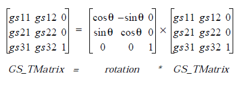  

**Pass:**  
di - Handle of the GState.  
dx:cx - 32-bit signed integer representing the angle of rotation 
multiplied by 65536 (angle * 65536).

**Returns:**  
Nothing.

**Destroyed:**  
Nothing.

**Library:** graphics.def

----------
#### GrApplyScale
Apply a scale factor to a GState's transformation matrix, then mark the 
current transformation as invalid. The effects are cumulative to previous 
transformations.

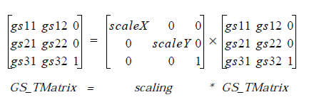  

**Pass:**  
di - Handle of the GState.  
dx:cx - 2-bit horizontal scale factor to apply.  
bx:ax - 32-bit vertical scale factor to apply.

**Returns:**  
Nothing.

**Destroyed:**  
Nothing.

**Library:** graphics.def

----------
#### GrApplyTransform
Apply a full transformation to the GState's transformation matrix, then 
mark the current transformation as invalid. The effects are cumulative to 
previous transformations. This routine requires advanced matrix 
manipulation; most applications will not use this routine directly.

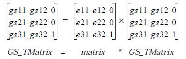  

**Pass:**  
di - Handle of the GState.  
ds:si - Address of a buffer containing the new TMatrix elements to 
use. The elements should be four 32-bit fixed point numbers 
(**WWFixed** format) and two 48-bit fixed point numbers 
(**DWFixed** format) arranged in row order. The last two 
elements are the 48-bit numbers.

  

**Returns:**  
Nothing.

**Destroyed:**  
Nothing.

**Library:** graphics.def

----------
#### GrApplyTranslation
Apply a translation to the passed GState's transformation matrix, then mark 
the current transformation as invalid if necessary. The effects are cumulative 
to previous transformations.

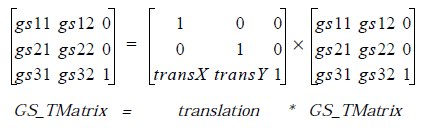  

**Pass:**  
di - Handle of the GState.  
dx:cx - 32-bit **WWFixed** value representing X translation.  
bx:ax - 32-bit **WWFixed** value representing Y translation.

**Returns:**  
Nothing.

**Destroyed:**  
Nothing.

**Library:** graphics.def

----------
#### GrApplyTranslationDWord
Apply a 32-bit extended translation to the GState's transformation matrix, 
then mark the current transformation as invalid, if necessary. The effects are 
cumulative to previous transformations.

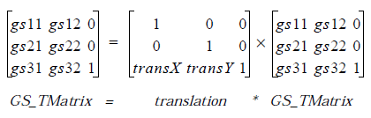  

**Pass:**  
di - Handle of the GState.  
dx:cx - Signed dword representing X translation.  
bx:ax - Signed dword representing Y translation.

**Returns:**  
Nothing.

**Destroyed:**  
Nothing.

**Library:** graphics.def

----------
#### GrBeginPath
Start a new graphics path definition, or alter the existing current path. All 
graphics operations operated after this routine until **GrEndPath** become 
part of the path.

**Pass:**  
di - Handle of the GState for which the path will be effective.  
cx - **PathCombineType** value:  
PCT_NULL, PCT_REPLACE, PCT_UNION, or 
PCT_INTERSECTION

**Returns:**  
Nothing.

**Destroyed:**  
Nothing.

**Library:** graphics.def

----------
#### GrBeginUpdate
Begin an update of an exposed, visible region. This routine is called by 
applications upon receipt of MSG_META_EXPOSED. Drawing to the GState 
passed to this routine will be clipped to the exposed region. After drawing is 
complete, the application must call **GrEndUpdate**.

**Pass:**  
di - Handle of the GState used for drawing to the exposed area of 
the window. Usually created with **GrCreateState** and 
destroyed with **GrDestroyState** in a MSG_META_EXPOSED 
handler.

**Returns:**  
Nothing.

**Destroyed:**  
Nothing.

**Library:** win.def

----------
#### GrBitBlt
Transfer a bit-boundary block of pixels between two locations in the video 
memory. This can be used to shove a block of pixels quickly to give the 
impression of motion on the screen.

**Pass:**  
ax - Source horizontal document coordinate of the area.  
bx - Source vertical document coordinate of the area.  
cx - Destination horizontal document coordinate.  
dx - Destination vertical document coordinate.  
si - Width of the area to be moved, in document units.  
di - Handle of the GState used for drawing.

**Pass on stack:** The following arguments are pushed before the call:  
word - Height of the area in document units.  
word - **BLTMode** value:  
BLTM_COPY leaves source alone.  
BLTM_CLEAR clears source area.  
BLTM_MOVE clears and invalidates source.

**Returns:**  
Nothing. (Arguments popped off stack.)

**Destroyed:**  
Nothing.

**Library:** graphics.def

----------
#### GrBrushPolyline
Brushes a connected polyline with the passed brush characteristics.

**Pass:**  
cx - Number of points in the polyline array.  
ds:si - Array of Points defining the connected lines.  
di - Handle of the GState used for drawing.  
al - Rectangular brush width, in pixels.  
ah - Rectangular brush height, in pixels.

**Returns:**  
Nothing.

**Destroyed:**  
Nothing.

**Library:** graphics.def

----------
#### GrCharMetrics
Return the metrics for a single character, given its value and the information 
to return.

**Pass:**  
di - Handle of the applied GState.  
si - Value of type *GCM_info* indicating the type of information to 
return.  
ax - **Chars** value of character.

**Returns:**  
CF - Set if font or driver is not available.  
dx - If GCM_..._ROUNDED is set, the rounded information. If CF 
set on return, **dx** will be zero.  
dx:ah - **WBFixed** value if non-rounded data requested. If CF set on 
return, **dx** and **ah** will both be zero.

**Destroyed:**  
Nothing.

**Library:** font.def

----------
#### GrCharWidth
Return the width of a single character, given a GState and the character.

**Pass:**  
di - Handle of the applied GState.  
ax - **Chars** value of character to check.

**Returns:**  
dx:ah - **WBFixed** value giving the width of the character.

**Destroyed:**  
Nothing.

**Library:** graphics.def

**Warning:** This routine does not take into account any kerning or space padding or other 
attributes-it simply returns the character's width.

----------
#### GrCheckFontAvail
Check if the named font exists and return its ID if it does.

**Pass:**  
dl - **FontEnumFlags** giving the font type to match:  
FEF_FAMILY - Pass **FontFamily** in **dh**.  
FEF_STRING - Pass a pointer to the null-terminated font 
name in **ds:si**.  
Otherwise - Pass **FontID** of font in **cx**.

**Returns:**  
cx - ID of font if it exists, FID_INVALID otherwise.

**Destroyed:**  
Nothing.

**Library:** font.def

**Warning:** If you pass FEF_STRING, the string pointed to by **ds:si** must not be null. 
Otherwise a fatal error will result.

----------
#### GrClearBitmap
Clear out the contents of the bitmap associated with the given GState. The 
parts of the bitmap actually cleared (set to white) will depend on the bitmap's 
mode. For the normal mode, the data part of the bitmap is cleared while the 
mask is left untouched. For the BM_EDIT_MASK mode, the mask is cleared 
and the bitmap is left untouched. The actual value written to the mask or the 
bitmap will vary depending on the representation of white in the bitmap's 
format.

**Pass:**  
di - Handle of the GState to have its bitmap cleared.

**Returns:**  
Nothing.

**Destroyed:**  
Nothing.

**Library:** graphics.def

----------
#### GrCloseSubPath
Geometrically closes the currently open path. This does not end the path 
definition - you still must call **GrEndPath**.

**Pass:**  
di - Handle of the GState in which the path is being defined.

**Returns:**  
Nothing.

**Destroyed:**  
Nothing.

**Library:**    graphics.def

----------
#### GrComment
Write a comment into a graphics string.

**Pass:**  
di - Handle of the GString.  
ds:si - Address of the comment string.  
cx - Size of the comment string.

**Returns:**  
Nothing.

**Destroyed:**  
Nothing.

**Library:** gstring.def

----------
#### GrCompactBitmap
Compact a bitmap stored in a huge array.

**Pass:**  
bx - VM file handle of the huge array containing the bitmap.  
ax - VM block handle of the huge array containing the bitmap.  
dx - VM file handle of the destination file for the compacted 
bitmap.

**Returns:**  
dx - Preserved VM file handle.  
cx - New VM block handle of new, compacted bitmap.

**Destroyed:**  
Nothing.

**Library:** graphics.def

----------
#### GrCopyGString
Copy a graphics string from one GString to another.

**Pass:**  
si - Handle of source GString.  
di - Handle of destination GString.  
dx - **GSControl** flags record indicating how much of the GString 
should be copied.

**Returns:**  
dx - **GSRetType** value indicating the type of extra data returned 
in cx, if any (see below).  
cx - Extra information appropriate to the type in **dx**:  
GSRT_COMPLETE - Zero.  
GSRT_NEW_PAGE - Zero.  
GSRT_FAULT - Zero.  
GSRT_LABEL - Label value.  
GSRT_ESCAPE - Escape number.  
GSRT_ONE - next opcode (in cl).  
GSRT_MISC - next opcode (in cl).  
GSRT_XFORM - next opcode (in cl).  
GSRT_OUTPUT - next opcode (in cl).  
GSRT_ATTR - next opcode (in cl).  
GSRT_PATH - next opcode (in cl).

**Destroyed:**  
Nothing.

**Library:** gstring.def

----------
#### GrCreateBitmap
Allocate memory for a bitmap and associate the memory with a window.

**Pass:**  
al - **BMType** record indicating the type of bitmap to create.  
bx - VM file handle of file in which to create the bitmap.  
cx - Width of the new bitmap.  
dx - Height of the new bitmap.  
di:si - The optr of the object that will receive MSG_META_EXPOSED 
for the bitmap (for a process or thread, pass its handle in **di** 
and a null chunk handle).

**Returns:**  
bx - Preserved VM file handle of the bitmap.  
ax - VM block handle of the newly-allocated bitmap.  
di - GState handle of the bitmap in the window.

**Destroyed:**  
Nothing.

**Library:** graphics.def

----------
#### GrCreateGString
Open a graphics string and begin redirecting graphics commands to the 
GString.

**Pass:**  
cl - **GStringType** indicating the type of handle passed in bx.  
GST_MEMORY - Memory handle in **bx**.  
GST_STREAM - Stream handle in bx**.**  
GST_VMEM - VM file handle in **bx**.  
bx - Handle of the entity which will act as the GString.

**Returns:**  
di - Handle of the new Graphics String.  
si - Newly-allocated chunk (for GST_MEMORY) or VM block 
handle (for GST_VMEM), as appropriate. For GST_STREAM, 
nothing is returned in **si**.

**Destroyed:**  
Nothing.

**Library:** gstring.def

----------
#### GrCreatePalette
Create a color mapping table and associate it with the current window (the 
window associated with the passed GState). Initialize the table to the default 
values for the device's palette.

**Pass:**  
di - GState to apply.

**Returns:**  
Nothing.

**Destroyed:**  
Nothing.

**Library:** graphics.def

----------
#### GrCreateState

Create graphics state block containing a default GState associated with the 
passed window. This routine is typically used to create a GState for drawing 
within a MSG_META_EXPOSED handler. When you are done with the GState, 
be sure to destroy it with **GrDestroyState** so the GState does not continue 
to use memory and a handle.

**Pass:**  
di - Handle of the window for which the GState will be created.
Zero to create a GState without associating it with a window.

**Returns:**  
di - Handle of new GState.

**Destroyed:**  
Nothing.

**Library:** graphics.def

----------
#### GrDeleteGStringElement
Delete a range of GString elements from the specified GString.

**Pass:**  
di - GState handle; the GState contains a handle to the GString, 
which will be locked automatically.  
cx - Number of elements to delete from the GString.

**Returns:**  
Nothing.

**Destroyed:**  
Nothing.

**Library:** gstring.def

----------
#### GrDestroyBitmap
Free the bitmap associated with the given GState and disassociate it from 
the window.

**Pass:**  
di - GState handle as returned by GrCreateBitmap.  
al - BMDestroy value:  
BMD_KILL_DATA - Frees the bitmap's HugeArray.  
BMD_LEAVE_DATA - Leave the bitmap data and just disassociate 
it from the window.

**Returns:**  
Nothing.

**Destroyed:**  
di

**Library:** graphics.def

----------
#### GrDestroyGString
Destroy the specified GString, either removing the GState from the data, or 
freeing both GState and GString data. You may ask that an additional 
GState be destroyed as well.

**Pass:**  
si - Handle of Graphics String.  
di - Handle of "extra" GState to destroy. Zero for none.  
dl - **GStringKillType** value:  
GSKT_KILL_DATA - Frees the GString data along with the  handle.  
GSKT_LEAVE_DATA - Leaves the GString data intact but frees the 
handle and associated overhead.

**Returns:**  
Nothing.

**Destroyed:**  
Nothing.

**Library:** gstring.def

----------
#### GrDestroyPalette
Free the current window's custom palette, if any.

**Pass:**  
di - GState handle; the GState specifies the current window.

**Returns:**  
Nothing.

**Destroyed:**  
Nothing.

**Library:** graphics.def

----------
#### GrDestroyState
Destroy a GState block and the GState handle. Typically called in 
MSG_META_EXPOSED after drawing is finished. The GState is normally 
created with **GrCreateState**.

**Pass:**  
di - GState handle to be destroyed.

**Returns:**  
Nothing.

**Destroyed:**  
di

**Library:** graphics.def

----------
#### GrDrawArc
Draws an arc along the ellipse specified by a bounding box, a starting angle, 
and an ending angle.

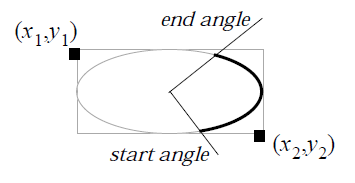

**Pass:**  
di - Handle of GState used for drawing.  
ds:si - Address of an **ArcParams** structure.

**Returns:**  
Nothing.

**Destroyed:**  
Nothing.

**Library:** graphics.def

----------
#### GrDrawArc3Point
Draw a circular arc specified by three points along the arc: both endpoints 
and any other point on the arc.

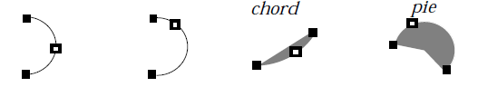

**Pass:**  
di - Handle of the GState used for drawing.  
ds:si - Address of a **ThreePointArcParams** structure.

**Returns:**  
Nothing.

**Destroyed:**  
Nothing.

**Library:** graphics.def

----------
#### GrDrawArc3PointTo
Draw a circular arc, given two points along the arc and using the current pen 
position as the first endpoint. The other two points are the other endpoint 
and any other point on the arc.

**Pass:**  
di - Handle of the GState used for drawing.  
ds:si - **ThreePointArcToParams** structure.

**Returns:**  
Nothing.

**Destroyed:**  
Nothing.

**Library:** graphics.def

----------
#### GrDrawBitmap
Draw a bitmap at the coordinates passed. This routine will call a callback 
routine that is expected to take a pointer to a slice of bitmap and return the 
next slice. In most cases, the callback will be supplied by the kernel.

**Pass:**  
di - Handle of the GState used for drawing.  
ax, bx - X, Y coordinates to begin drawing at.  
ds:si - Address of the bitmap.  
dx:cx - Address of the callback routine. If you are not supplying a 
callback, pass zero in **dx**.

**Returns:**  
Nothing.

**Destroyed:**  
Nothing.

**Callback Routine Specifications:**  
**Passed:**  
ds:si - Address of the bitmap slice just drawn.  
**Return:**  
ds:si - Address of next slice to be drawn.  
CF - Set if bitmap is finished being drawn.  
**May Destroy:**  
Nothing.

**Library:** graphics.def

----------
#### GrDrawBitmapAtCP
Draw a bitmap at the current pen position. This routine will call a callback 
routine that is expected to take a pointer to a slice of bitmap and return the 
next slice. In most cases, the callback will be supplied by the kernel.

**Pass:**  
di - Handle of the GState used for drawing.  
ds:si - Address of the bitmap.  
dx:cx - Address of the callback routine. If you are not supplying a 
callback, pass zero in **dx**.

**Returns:**  
ds:si - If a callback routine is supplied, **ds:si** will retain the value 
supplied in the last call to the callback function.

**Destroyed:**  
Nothing.

**Callback Routine Specifications:**  
**Passed:**  
ds:si - Address of the bitmap slice just drawn.  
**Return:**  
ds:si - Address of next slice to be drawn.  
CF - Set if bitmap is finished being drawn.  
**May Destroy:**  
Nothing.

**Library:** graphics.def

----------
#### GrDrawChar
Draw a given character at the specified position with the current text 
drawing state.

**Pass:**  
ax - X position.  
bx - Y position.  
dx - Character to draw.  
di - Handle of the GState to draw to; the text characteristics 
(font, color, etc.) are taken from the GState.

**Returns:**  
Nothing.

**Destroyed:**  
Nothing.

**Library:** graphics.def

----------
#### GrDrawCharAtCP
Draw a given character at the current pen position using the current text 
drawing state.

**Pass:**  
dx - Character to draw.  
di - Handle of the GState to draw to; the text characteristics 
(font, color, etc.) are taken from the GState.

**Returns:**  
Nothing.

**Destroyed:**  
Nothing.

**Library:** graphics.def

----------
#### GrDrawCurve
Draw a bezier curve specified by four points.

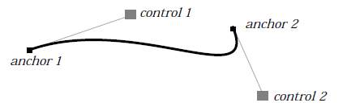

**Pass:**  
ds:si - Address of the four points making up the curve's description 
(all are of structure **Point**):  
Anchor point one  
Control point one  
Control point two  
Anchor point two  
di - Handle of the GState used for drawing.

**Returns:**  
Nothing.

**Destroyed:**  
Nothing.

**Library:** graphics.def

----------
#### GrDrawCurveTo
Draw a bezier curve beginning with the current pen position.

**Pass:**  
ds:si - Address of the three additional points making up the curve's 
description (all are of structure **Point**):  
Control point one  
Control point two  
Anchor point two  
di - Handle of the GState used for drawing.

**Returns:**  
Nothing.

**Destroyed:**  
Nothing.

**Library:** graphics.def

----------
#### GrDrawEllipse
Draw a framed ellipse bounded by the passed rectangle.

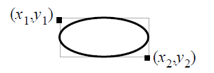

**Pass:**  
di - Handle of the GState used for drawing.  
ax, bx - First *x, y* coordinates of bounding rectangle (*x1, y1* in the 
diagram).  
cx, dx - Second *x, y* coordinates (*x2, y2*).

**Returns:**  
Nothing.

**Destroyed:**  
Nothing.

**Library:** graphics.def

----------
#### GrDrawGString
Draw the passed GString at the given coordinates.

**Pass:**  
di - Handle of the GState used for drawing.  
si - Handle of the GString to be drawn (as returned by  **GrLoadString**).  
ax, bx - The *x* and *y* coordinates at which to draw.  
dx - **GSControl** flags indicating how much of the GString should 
be drawn (see below).

**Returns:**  
dx - **GSRetType** giving the type of information returned in **cx**:  
GSRT_COMPLETE - Zero.  
GSRT_NEW_PAGE - Zero.  
GSRT_FAULT - Zero.  
GSRT_LABEL - Label value.  
GSRT_ESCAPE - Escape number.  
GSRT_ONE - next opcode (in cl).  
GSRT_MISC - next opcode (in cl).  
GSRT_XFORM - next opcode (in cl).  
GSRT_OUTPUT - next opcode (in cl).  
GSRT_ATTR - next opcode (in cl).  
GSRT_PATH - next opcode (in cl).  
cx - Information returned, if any, based on value in **dx**.

**Destroyed:**  
Nothing.

**Library:** gstring.def

----------
#### GrDrawGStringAtCP
Draw the passed GString at the current pen position.

**Pass:**  
di - Handle of the GState used for drawing.  
si - Handle of the GString to be drawn (as returned by 
**GrLoadString**).  
dx - **GSControl** flags indicating how much of the GString should 
be drawn (see below).

**Returns:**  
dx - **GSRetType** giving the type of information returned in cx:  
GSRT_COMPLETE - Zero.  
GSRT_NEW_PAGE - Zero.  
GSRT_FAULT - Zero.  
GSRT_LABEL - Label value.  
GSRT_ESCAPE - Escape number.  
GSRT_ONE - next opcode (in cl).  
GSRT_MISC - next opcode (in cl).  
GSRT_XFORM - next opcode (in cl).  
GSRT_OUTPUT - next opcode (in cl).  
GSRT_ATTR - next opcode (in cl).  
GSRT_PATH - next opcode (in cl).  
cx - Information returned, if any, based on value in **dx**.

**Destroyed:**  
Nothing.

**Library:** gstring.def

----------
#### GrDrawHLine
Draw a horizontal line.

**Pass:**  
di - Handle of the GState used for drawing.  
ax - First *x* coordinate of the line.  
bx - The *y* coordinate of the line.  
cx - Second *x* coordinate of the line.

**Returns:**  
Nothing.

**Destroyed:**  
Nothing.

**Library:** graphics.def

----------
#### GrDrawHLineTo
Draw a horizontal line using the current pen position as the starting point.

**Pass:**  
di - Handle of the GState used for drawing.  
cx - Second *x* coordinate of the line.

**Returns:**  
Nothing.

**Destroyed:**  
Nothing.

**Library:** graphics.def

----------
#### GrDrawHugeBitmap
Draw a bitmap residing in a HugeArray at the coordinates passed.

**Pass:**  
dx - VM file handle of the huge array containing the bitmap.  
cx - VM block handle of the huge array containing the bitmap.  
ax, bx - *x*, *y* coordinates to begin drawing at.  
di - Handle of the GState used for drawing.

**Returns:**  
Nothing.

**Destroyed:**  
Nothing.

**Library:** graphics.def

----------
#### GrDrawHugeBitmapAtCP
Draw a bitmap residing in a HugeArray at the current pen position.

**Pass:**  
dx - VM file handle of the huge array containing the bitmap.  
cx - VM block handle of the huge array containing the bitmap.  
di - Handle of the GState used for drawing.

**Returns:**  
Nothing.

**Destroyed:**  
Nothing.

**Library:** graphics.def

----------
#### GrDrawHugeImage
Draw a bitmap at the passed position. The bitmap must reside in a 
HugeArray, and the image may be drawn with a square block of video pixels 
representing each bitmap pixel (i.e. a "magnified view").

**Pass:**  
di - Handle of the GState used for drawing.  
ax - *x* position at which to begin drawing (document coordinates).  
bx - *y* position at which to begin drawing (document coordinates).  
cl - **ImageFlags** record:  
IF_BORDER - Set if a border should be drawn around the 
image. The border is drawn using the passed 
GState's current line color.  
IF_BITSIZE - **ImageBitSize** value indicating how many 
pixels represent a bit in the image:  
IBS_1 - (one-to-one)  
IBS_2 - (two by two pixels for each bit)  
IBS_4 - (four by four pixels for each bit)  
IBS_8 - (eight by eight pixels for each bit)  
IBS_16 - (16 by 16 pixels for each bit)  
dx - VM file handle of the image's HugeArray.  
si - VM block handle of the beginning of the HugeArray.

**Returns:**  
Nothing.

**Destroyed:**  
Nothing.

**Library:** graphics.def

----------
#### GrDrawImage
Draw a bitmap at the passed position. The bitmap may be drawn with a 
square block of video pixels representing each bitmap pixel (i.e. a "magnified 
view"). If the bitmap is in a HugeArray, you should use 
**GrDrawHugeImage**.

**Pass:**  
di - Handle of the GState used for drawing.  
ax - *x* position at which to begin drawing (document coordinates).  
bx - *y* position at which to begin drawing (document coordinates).  
cl - **ImageFlags** record:  
IF_BORDER - Set if a border should be drawn around the 
image. The border is drawn using the passed 
GState's current line color.  
IF_BITSIZE - **ImageBitSize** value indicating how many 
pixels represent a bit in the image:  
IBS_1 - (one-to-one)  
IBS_2 - (two by two pixels for each bit)  
IBS_4 - (four by four pixels for each bit)  
IBS_8 - (eight by eight pixels for each bit)  
IBS_16 - (16 by 16 pixels for each bit)  
dx:si - Address of locked or fixed bitmap image to be drawn. This 
should not be a HugeArray.

**Returns:**  
Nothing.

**Destroyed:**  
Nothing.

**Library:** graphics.def

----------
#### GrDrawLine
Draw a line, given the two endpoints.

**Pass:**  
di - Handle of the GState used for drawing.  
ax, bx - *x, y* coordinates of first endpoint (document coordinates).  
cx, dx - *x, y* coordinates of second endpoint (document coordinates).

**Returns:**  
Nothing.

**Destroyed:**  
Nothing.

**Library:** graphics.def

----------
#### GrDrawLineTo
Draw a straight line from the pen position to the passed endpoint.

**Pass:**  
di - Handle of the GState used for drawing.  
cx, dx - *x, y* coordinates of second endpoint (document coordinates).

**Returns:**  
Nothing.

**Destroyed:**  
Nothing.

**Library:** graphics.def

----------
#### GrDrawPath
Draws the passed GState's path with the current line attributes.

**Pass:**  
di - GState containing the path and line attributes. The path will 
be drawn to this GState.

**Returns:**  
Nothing.

**Destroyed:**  
Nothing.

**Library:** graphics.def

----------
#### GrDrawPoint
Draw a single document pixel at the passed coordinates.

**Pass:**  
di - Handle of the GState used for drawing.  
ax, bx - *x, y* coordinates of point.

**Returns:**  
Nothing.

**Destroyed:**  
Nothing.

**Library:** graphics.def

----------
#### GrDrawPointAtCP
Draws a single document pixel at the current pen position.

**Pass:**  
di - Handle of the GState used for drawing.

**Returns:**  
Nothing.

**Destroyed:**  
Nothing.

**Library:** graphics.def

----------
#### GrDrawPolygon
Draws the passed connected polygon.

**Pass:**  
di - Handle of the GState used for drawing.  
ds:si - Address of the array of Point structures defining the polygon.  
cx - Number of points in the polygon's array.

**Returns:**  
Nothing.

**Destroyed:**  
Nothing.

**Library:** graphics.def

----------
#### GrDrawPolyline
Draws a polyline using the passed GState's line attributes. To use special 
"brush" attributes, call **GrBrushPolyline**.

**Pass:**  
di - Handle of the GState used for drawing.  
ds:si - Address of an array of **Point** structures defining the polyline.  
cx - Number of points in the passed array.

**Returns:**  
Nothing.

**Destroyed:**  
Nothing.

**Library:** graphics.def

----------
#### GrDrawRect
Draw a rectangle defined by the two corner points. To fill the rectangle, call 
**GrFillRect**.

**Pass:**  
di - Handle of the GState used for drawing.  
ax, bx - *x, y* coordinates of first corner of the rectangle.  
cx, dx - *x, y* coordinates of opposite corner.

**Returns:**  
Nothing.

**Destroyed:**  
Nothing.

**Library:** graphics.def

----------
#### GrDrawRectTo
Draw a rectangle defined by one corner point and the current pen position.

**Pass:**  
di - Handle of the GState used for drawing.  
cx, dx - *x, y* coordinates of opposite corner.

**Returns:**  
Nothing.

**Destroyed:**  
Nothing.

**Library:** graphics.def

----------
#### GrDrawRegion
Draw a region.

**Pass:**  
di - Handle of GState used for drawing.  
ax, bx - *x, y* coordinates to begin drawing the region.  
ds:si - Address of locked or fixed region definition (**RectRegion**).  
cx, dx - Parameters for region, if required. These correspond to 
PARAM_2 and PARAM_3.

**Returns:**  
Nothing.

**Destroyed:**  
Nothing.

**Library:** graphics.def.

----------
#### GrDrawRegionAtCP
Draw a region at the current pen position.

**Pass:**  
di - Handle of GState used for drawing.  
ds:si - Address of locked or fixed region definition (**RectRegion**).  
cx, dx - Parameters for region, if required. These correspond to 
PARAM_2 and PARAM_3.

**Returns:**  
Nothing.

**Destroyed:**  
Nothing.

**Library:** graphics.def.

----------
#### GrDrawRelArc3PointTo
Draw a circular arc relative to the current pen position, given two additional 
points: the other endpoint, and any other point on the arc. Both of the 
additional points are given in offsets from (relative to) the pen position.

**Pass:**  
di - Handle of the GState used for drawing.  
ax, bx - *x, y* offsets from the current position to any point on the arc.  
cx, dx - *x, y* offsets from the current position to the other endpoint.  
si - **ArcCloseType** value: OPEN, CHORD, or PIE.

**Returns:**  
Nothing.

**Destroyed:**  
Nothing.

**Library:** graphics.def

----------
#### GrDrawRelCurveTo
Draw a bezier curve using the current pen position as the first endpoint. All 
other points in the curve are defined by offsets from (relative to) the current 
pen position. See **GrDrawCurve** for a diagram of a bezier curve.

**Pass:**  
di - Handle of the GState used for drawing.  
ds:si - Address of the three points making up the rest of the curve's 
description (all are of structure **Point**, and all are relative to 
the current pen position):  
Control point one  
Control point two  
Anchor point two

**Returns:**  
Nothing.

**Destroyed:**  
Nothing.

**Library:** graphics.def

----------
#### GrDrawRelLineTo
Draw a line from the current pen position to the point defined by the passed 
displacements.

**Pass:**  
di - Handle of the GState used for drawing.  
dx.cx - **WWFixed** *x* displacement, in document coordinates.  
bx.ax - **WWFixed** *y* displacement, in document coordinates.

**Returns:**  
Nothing.

**Destroyed:**  
Nothing.

**Library:** graphics.def

----------
#### GrDrawRoundRect
Draw a rectangle with rounded corners.

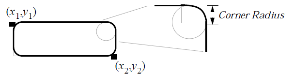

**Pass:**  
di - Handle of the GState used for drawing.  
si - Radius of rounded corners, in points.  
ax, bx - *x, y* of first corner (*x1, y1* in diagram).  
cx, dx - *x, *y of opposite corner (*x2, y2* in diagram).

**Returns:**  
Nothing.

**Destroyed:**  
Nothing.

**Library:** graphics.def

----------
#### GrDrawRoundRectTo
Draw a rounded rectangle at the current pen position.

**Pass:**  
di - Handle of the GState used for drawing.  
si - Radius of rounded corners, in points.  
cx, dx - *x, y* of opposite corner.

**Returns:**  
Nothing.

**Destroyed:**  
Nothing.

**Library:** graphics.def

----------
#### GrDrawSpline
Draw a collection of bezier curves defined by the passed array of Points.

**Pass:**  
di - Handle of the GState used for drawing.  
ds:si - Address of the array of **Point** structures defining the spline. 
(These comprise a series of bezier curves.)  
cx - Number of points in the array.

**Returns:**  
Nothing.

**Destroyed:**  
Nothing.

**Library:** - graphics.def

----------
#### GrDrawSplineTo
Draw a collection of bezier curves defined by the passed array of Points and 
having its first anchor point at the current pen position.

**Pass:**  
di - Handle of the GState used for drawing.  
ds:si - Address of the array of **Point** structures defining the spline. 
The first point of the spline is the current pen position. 
(These comprise a series of bezier curves.)  
cx - Number of points in the array.

**Returns:**  
Nothing.

**Destroyed:**  
Nothing.

**Library:** graphics.def

----------
#### GrDrawText
Draw a string at the given position with the current text drawing 
characteristics (defined by the GState).

**Pass:**  
di - Handle of the GState used for drawing.  
ds:si - Address of text string to draw.  
cx - Maximum number of characters to draw from the string.
Pass zero if the string is null-terminated.  
ax, bx - *x, y* coordinates of the string.

**Returns:**  
Nothing.

**Destroyed:**  
Nothing.

**Library:** graphics.def

----------
#### GrDrawTextAtCP
Draw a string at the current pen position with the current text drawing 
characteristics (defined by the GState).

**Pass:**  
di - Handle of the GState used for drawing.  
ds:si - Address of the text string to draw.  
cx - Maximum number of characters to draw from the string.
Pass zero if the string is null-terminated.

**Returns:**  
Nothing.

**Destroyed:**  
Nothing.

**Library:** graphics.def

----------
#### GrDrawTextField
This routine draws a text field.

**Pass:**  
di - Handle of the GState to use for drawing.  
ss:bp - **GDF_vars** structure.

**Returns:**  
ss:[bp].GDFV_saved.GDFS_drawPos.*PWBF_x*  - Set to end position of drawn text.

**Destroyed:**  
Nothing.

**Callback Routine Specifications:**  
**Passed:**  
ss:bp - ptr to **GDF_vars** structure on stack.  
si - offset to current position in text.  
bx:di - fptr to buffer, sizeof **TextAttr** structure  
**Return:**  
bx:di - Buffer is filled.  
cx - Number of characters in this run.  
ds:si - Pointer to text at offset

**Library:**    graphics.def

----------
#### GrDrawVLine
Draw a vertical line.

**Pass:**  
di - Handle of the GState used for drawing.  
ax, bx - *x, y* coordinates of first endpoint.  
dx - *y* coordinate of second endpoint.

**Returns:**  
Nothing.

**Destroyed:**  
Nothing.

**Library:** graphics.def

----------
#### GrDrawVLineTo
Draw a vertical line beginning at the current pen position.

**Pass:**  
di - Handle of the GState used for drawing.  
dx - *y* coordinate of second endpoint.

**Returns:**  
Nothing.

**Destroyed:**  
Nothing.

**Library:** graphics.def

----------
#### GrEditBitmap
Associate a previously created bitmap with a window and a GState to allow 
the caller to edit the bitmap.

**Pass:**  
bx - VM file handle of file containing bitmap.  
ax - VM block handle of the first block in the bitmap's HugeArray.  
di:si - The optr of the object that will handle MSG_META_EXPOSED 
for the bitmap. If a process, pass the process handle in di.

**Returns:**  
di - Handle of the GState to use when drawing the bitmap.

**Destroyed:**  
Nothing.

**Library:** graphics.def

----------
#### GrEditGString
Set a specified graphics string into editing mode.

**Pass:**  
bx - VM file handle of the file containing the GString. You may 
only edit GStrings of type GST_VMEM.  
si - VM block handle of the first block of the GString's HugeArray.

**Returns:**  
di - Handle of the GState newly created and associated with 
GString. 

**Destroyed:**  
Nothing.

**Library:** gstring.def

----------
#### GrEndGString
End a definition of a GString. This is the complement to **GrBeginString**.

**Pass:**  
di - Handle of the GString to finish.

**Returns:**  
ax - **GStringErrorType** value:  
GSET_NO_ERROR if no error.  
GSET_DISK_FULL if the file will be truncated for disk space.

**Destroyed:**  
Nothing.

**Library:** gstring.def

----------
#### GrEndPath
Ends the definition of the current path. This is the complement to 
**GrBeginPath**.

**Pass:**  
di - GState owning the path being defined.

**Returns:**  
Nothing.

**Destroyed:**  
Nothing.

**Library:** graphics.def

----------
#### GrEndUpdate
Unlock a window from a visual update begun with **GrBeginUpdate**.

**Pass:**  
di - Handle of the GState originally passed to **GrBeginUpdate**.

**Returns:**  
Nothing.

**Destroyed:**  
Nothing.

**Library:** win.def

----------
#### GrEnumFonts
Generate a list of font names of the available fonts. Return the number of 
matching fonts; the names are returned in a passed buffer.

**Pass:**  
cx - Number of FontEnumStruct structures the buffer can hold.  
es:di - Address of the locked or fixed buffer for returned values. If **cx** 
is passed zero, no buffer will be used.  
dl - **FontEnumFlags** record indicating the type of fonts to find:  
FEF_ALPHABETIZE - Alphabetize the returned list.  
FEF_USEFUL - Find "useful" fonts only.  
FEF_FIXED_WIDTH - Find fixed-width fonts only.  
FEF_FAMILY - Match the **FontFamily** in **dh**.  
FEF_STRING - Match the font name string.  
FEF_DOWNCASE - Downcase all returned strings.  
FEF_BITMAPS - Find fonts with bitmap representations.  
FEF_OUTLINES - Find fonts with outline representations.  
dh - **FontFamily** value; used only if FEF_FAMILY set in **dl**.

**Returns:**  
cx - Number of matching fonts found.  
es:di - Buffer filled with one **FontEnumStruct** for each matching 
font returned.

**Destroyed:**  
Nothing.

**Library:** font.def

----------
#### GrEscape
Write an "escape" element to a graphics string. This call is meaningful only 
between calls to **GrBeginGString** and **GrEndGString**. The element, in 
full, will have the following structure:

    Byte    Contents    Description  
    0       0xFF        GString escape indicator  
    1, 2    ax          Application's escape code  
    2, 3    cx          Size of escape data  
    4,-n    ds:si       Data from passed buffer.

**Pass:**  
di - Handle of GString to write to.  
ax - Escape code of element (defined by caller).  
cx - Size of element to write.  
ds:si - Address of locked or fixed data to write to the escape element.

**Returns:**  
Nothing.

**Destroyed:**  
Nothing.

**Library:** gstring.def

----------
#### GrFillArc
Draws an arc as in **GrDrawArc** and fills it like a pie wedge. The arc is 
defined by an ellipse in a bounding box and two angles that intersect the 
ellipse (see **GrDrawArc**).

**Pass:**  
di - Handle of the GState used for drawing.  
ds:si - Address of an **ArcParams** structure:  
*AP_close* - Unused in this context.  
*AP_left, AP_top, AP_right, AP_bottom* - Bounds of the ellipse's bounding box (signed 
words).  
*AP_angle1* - Start angle of arc segment (signed word).  
*AP_angle2* - End angle of arc segment (signed word).  

**Returns:**  
Nothing.

**Destroyed:**  
Nothing.

**Library:** graphics.def

----------
#### GrFillArc3Point
Fill a circular arc defined by three points: two endpoints and any other point 
along the arc. The filled portion will be the pie wedge defined by the arc.

**Pass:**  
di - Handle of the GState used for drawing.  
ds:si - Address of a **ThreePointArcParams** structure.

**Returns:**  
Nothing.

**Destroyed:**  
Nothing.

**Library:** graphics.def

----------
#### GrFillArc3PointTo
Fill a circular arc defined by the current pen position (as the first endpoint) 
and two other points: the opposite endpoint and any other point along the 
arc. The filled portion will be the pie wedge defined by the arc.

**Pass:**  
di - Handle of the GState used for drawing.  
ds:si - **ThreePointArcToParams** structure.

**Returns:**  
Nothing.

**Destroyed:**  
Nothing.

**Library:** graphics.def

----------
#### GrFillBitmap

Draw the given bitmap as if it were a mask, filling it with the current area 
color.

**Pass:**  
di - Handle of the GState used for drawing.  
ax, bx - *x, y* coordinates at which to draw the bitmap.  
ds:si - Address of the bitmap to be drawn.  
dx:cx - Address of the callback routine. If you are not supplying a 
callback, pass zero in **dx**. It is unusual to use your own 
callback routine.

**Returns:**  
Nothing.

**Destroyed:**  
Nothing.

**Callback Routine Specifications:**  
**Passed:**  
ds:si - Address of the bitmap slice just drawn.  
**Return:**  
ds:si - Address of next slice to be drawn.  
CF - Set if bitmap is finished being drawn.  
**May Destroy:**  
Nothing.

**Library:** graphics.def

----------
#### GrFillBitmapAtCP
Draw the given bitmap as if it were a mask, filling it with the current area 
color. The bitmap will be drawn at the current pen position.

**Pass:**  
di - Handle of the GState used for drawing.  
ds:si - Address of the bitmap to be drawn.  
dx:cx - Address of the callback routine. If you are not supplying a 
callback, pass zero in **dx**. It is unusual to use your own 
callback routine.

**Returns:**  
Nothing.

**Destroyed:**  
Nothing.

**Callback Routine Specifications:**  
**Passed:**  
ds:si - Address of the bitmap slice just drawn.  
**Return:**  
ds:si - Address of next slice to be drawn.  
CF - Set if bitmap is finished being drawn.  
**May Destroy:**  
Nothing.

**Library:** graphics.def

----------
#### GrFillEllipse
Draws a filled ellipse bounded by the passed rectangle.

**Pass:**  
di - Handle of the GState used for drawing.  
ax, bx - *x, y* coordinates of first corner of bounding rectangle.  
cx, dx - *x, y* coordinates of opposite corner of bounding rectangle.

**Returns:**  
Nothing.

**Destroyed:**  
Nothing.

**Library:** graphics.def

----------
#### GrFillHugeBitmap
Treat a monochrome bitmap as a mask, filling it with the current area color. 
The bitmap should be stored in a huge array.

**Pass:**  
di - GStateHandle  
ax,bx - *x,y* coordinate to draw at.  
dx - VM file handle (or zero if *TPD_file* is set)  
cx - VM block handle    

**Returns:**  
Nothing.

**Destroyed:**  
Nothing.

**Library:** graphics.def

----------
#### GrFillHugeBitmapAtCP
Treat a monochrome bitmap as a mask, filling it with the current area color. 
The bitmap should be stored in a huge array.

**Pass:**  
di - GStateHandle  
ax,bx - *x,y* coordinate to draw at.  
dx - VM file handle (or zero if *TPD_file* is set)  
cx - VM block handle

**Returns:**  
Nothing.

**Destroyed:**  
Nothing.

**Library:** graphics.def

----------
#### GrFillPath
Draws a filled representation of the passed GState's current path, using the 
supplied fill rule and current GState area attributes.

**Pass:**  
di - Handle of the GState used for drawing.  
cl - **RegionFillRule** value: RFR_ODD_EVEN or RFR_WINDING.

**Returns:**  
Nothing.

**Destroyed:**  
Nothing.

**Library:** graphics.def

----------
#### GrFillPolygon
Draw a filled polygon.

**Pass:**  
di - Handle of the GState used for drawing.  
ds:si - Array of Point structures defining the polygon.  
cx - Number of points in the array.  
al - **RegionFillRule** value: RFR_ODD_EVEN or RFR_WINDING.

**Returns:**  
Nothing.

**Destroyed:**  
Nothing.

**Library:** graphics.def

----------
#### GrFillRect
Fill the rectangle defined by the two passed points.

**Pass:**  
di - Handle of the GState used for drawing.  
ax, bx - *x, y* coordinates of the first corner.  
cx, dx - *x, y* coordinates of the opposite corner.

**Returns:**  
Nothing.

**Destroyed:**  
Nothing.

**Library:** graphics.def

----------
#### GrFillRectTo
Fill the rectangle defined by the current pen position and the passed point.

**Pass:**  
di - Handle of the GState used for drawing.  
cx, dx - *x, y* coordinates of the opposite corner.

**Returns:**  
Nothing.

**Destroyed:**  
Nothing.

**Library:** graphics.def

----------
#### GrFillRoundRect
Fill the rounded rectangle defined by the parameters.

**Pass:**  
di - Handle of the GState used for drawing.  
si - Radius of the corner roundings, in points.  
ax, bx - *x, y* coordinates of the first corner of the rectangle.  
cx, dx - *x, y* coordinates of the opposite corner of the rectangle.

**Returns:**  
Nothing.

**Destroyed:**  
Nothing.

**Library:** graphics.def

----------
#### GrFillRoundRectTo
Fill the rounded rectangle defined by the current pen position and the 
parameters.

**Pass:**  
di - Handle of the GState used for drawing.  
si - Radius of the corner roundings, in points.  
cx, dx - *x, y* coordinates of the opposite corner of the rectangle.

**Returns:**  
Nothing.

**Destroyed:**  
Nothing.

**Library:** graphics.def

----------
#### GrFontMetrics
Return metrics information about the given GState's current font.

**Pass:**  
di - Handle of the GState whose font is to be checked.  
si - **GFM_info** value indicating the type of return value 
requested.

**Returns:**  
dx.ah - **WBFixed** value giving the result requested.  
dx - If GFM_ROUNDED is passed in **si, dx** will contain the entire 
rounded value (**ah** is ignored).

**Destroyed:**  
Nothing.

**Library:** font.def

----------
#### GrGetAreaColor
Return the area color set for the given GState.

**Pass:**  
di  Handle of the GState.

**Returns:**  
al - Red value of color.  
bl - Green value of color.  
bh - Blue value of color.

**Destroyed:**  
Nothing.

**Library:** graphics.def

----------
#### GrGetAreaColorMap
Return the area color map of the given GState.

**Pass:**  
di - Handle of the GState.  
**Returns:**  
al - **ColorMapMode** record indicating the color mapping mode 
effective in the GState.

**Destroyed:**  
Nothing.

**Library:** graphics.def

----------
#### GrGetAreaMask
Return the area mask type of the passed GState.

**Pass:**  
di - Handle of the GState.  
al - **GetMaskType** value:  
GMT_ENUM - Returns **SysDrawMask** record.  
GMT_BUFFER - Returns entire mask buffer and its size.  
ds:si - Address of a locked or fixed buffer to receive the mask buffer, 
if GMT_BUFFER passed in **al**. Otherwise ignored.

**Returns:**  
al - **SysDrawMask** record.  
ds:si - Address of the returned mask if GMT_BUFFER passed in al.

**Destroyed:**  
Nothing.

**Library:** graphics.def

----------
#### GrGetAreaPattern
Return the fill pattern for the passed GState.

**Pass:**  
di - Handle of the GState.

**Returns:**  
al - **PatternType** value.  
ah - **SystemHatch** or **SystemBitmap** value, depending on **al**.
If neither is applicable, **ah** returned destroyed.  
bx - Handle of **HatchPattern** or **Bitmap** value, if applicable.  
cx - Size of **HatchPattern** or **Bitmap** in **bx**, if applicable.

**Destroyed:**  
Depending on return values, **ah**.

**Library:**    graphics.def

----------
#### GrGetBitmap
Copy a bitmap from the screen to a memory block.

**Pass:**  
di - Handle of the GState owning the bitmap.  
ax, bx - *x, y* coordinates of upper-left of bitmap area to be copied.  
cx - Bitmap width (document coordinates).  
dx - Bitmap height (document coordinates).

**Returns:**  
bx - Handle of a newly-allocated memory block containing the 
bitmap. NullHandle (0) if memory allocation error.  
cx - Width of bitmap copied (pixels).  
dx - Height of bitmap copied (pixels).

**Destroyed:**  
Nothing.

**Library:** graphics.def

**Warning:** This routine does not check for clipping of the rectangle; it copies directly 
from the screen to memory. It is therefore useful for screen dumps but not 
necessarily useful for applications.

----------
#### GrGetBitmapMode
Return the mode information for the editable bitmap owned by the passed 
GState.

**Pass:**  
di - Handle of the GState, as returned by **GrCreateBitmap** or 
**GrEditBitmap**.

**Returns:**  
CF - Set if GState not pointing at a bitmap; clear otherwise.  
ax - **BitmapMode** record with the following flags:  
BM_EDIT_MASK - Set if editing mask rather than bitmap.  
BM_CLUSTERED_DITHER - Set if bitmap uses a clustered rather than 
dispersed dither (only for BMF_MONO  
bitmaps).

**Destroyed:**  
Nothing.

**Library:** graphics.def

----------
#### GrGetBitmapRes
Return the resolution of the bitmap owned by the passed GState.

**Pass:**  
di - Handle of the GState.

**Returns:**  
ax - X resolution (horizontal), in dots per inch.  
bx - Y resolution (vertical), in dots per inch.

**Destroyed:**  
Nothing.

**Library:** graphics.def

----------
#### GrGetBitmapSize
Return the size of the bitmap owned by the passed GState.

**Pass:**  
ds:si - Handle of the GState.

**Returns:**  
ax - *x* size in points (width).  
bx - *y* size in points (height).

**Destroyed:**  
Nothing.

**Library:** graphics.def

----------
#### GrGetClipRegion
Return the region corresponding to the clip paths of the passed GState. The 
region is in device coordinates; the first four words are its bounds.

**Pass:**  
di - Handle of the GState.  
cl - **RegionFillRule**: RFR_ODD_EVEN or RFR_WINDING.

**Returns:**  
CF - Set if error, clear otherwise.  
bx - Handle of block containing **Region** structure if successful.
Null handle if CF returned set (error).

**Destroyed:**  
Nothing.

**Library:** graphics.def

----------
#### GrGetCurPos
Return the current drawing position for the passed GState.

**Pass:**  
di - Handle of the GState.

**Returns:**  
ax - Current *x* drawing position.  
bx - Current *y* drawing position.

**Destroyed:**  
Nothing.

**Library:** graphics.def

----------
#### GrGetCurPosWWFixed
Return the current drawing position for the passed GState. The answer 
returned is rather precise, with one word of fraction information for both the 
*x* and *y* coordinates.

**Pass:**  
di - Handle of the GState.

**Returns:**  
dx.cx - **WWFixed** x coordinate.  
bx.ax - **WWFixed** y coordinate.

**Destroyed:**  
Nothing.

**Library:** graphics.def

----------
#### GrGetDefFontID
Return the default fond ID and point size as defined in the GEOS.INI file. Also 
return the font data block.

**Pass:**  
Nothing.

**Returns:**  
cx - Default **FontID**.  
dx.ah - Default point size (**WBFixed**).  
bx - Handle to data block for default font.

**Destroyed:**  
Nothing.

**Library:** graphics.def

----------
#### GrGetExclusive
Check to see if any GState has exclusive drawing rights to the screen.

**Pass:**  
bx - Handle of the current video driver, or zero for the default.

**Returns:**  
bx - Handle of the GState which currently has exclusive drawing 
rights. A null handle (zero) will be returned if no GState has 
the exclusive.

**Destroyed:**  
Nothing.

**Library:** graphics.def

----------
#### GrGetFont
Return the current font's font ID and point size as set in the passed GState.

**Pass:**  
di - Handle of the GState containing the font information.

**Returns:**  
cx - **FontID** of the current font.

dx.ah - **WWFixed** value indicating the point size.

**Destroyed:**  
Nothing.

**Library:** graphics.def

----------
#### GrGetFontName
Return the name string of a specified font.

**Pass:**  
cx - **FontID** of font.  
ds:si - Address of locked or fixed buffer into which the name will be 
copied. Must be at least FONT_NAME_LEN in size.

**Returns:**  
CF - Set if font found; clear if no match found.  
cx - If CF set, the size of the data in the **ds:si** buffer (not 
including terminating null character).
If CF clear, will be returned zero.  
ds:si - Address of buffer. If successful, null-terminated file name 
will be in the buffer.

**Destroyed:**  
Nothing.

**Library:** font.def

----------
#### GrGetFontWeight
Return the weight of the current font as set in the passed GState.

**Pass:**  
di - Handle of the GState.

**Returns:**  
al - **FontWeight** value indicating percentage of normal weight.

**Destroyed:**  
Nothing.

**Library:** graphics.def

----------
#### GrGetFontWidth
Return the width of the current font as set in the passed GState.

**Pass:**  
di - Handle of the GState.

**Returns:**  
al - **FontWidth** value indicating percentage of normal weight.

**Destroyed:**  
Nothing.

**Library:** graphics.def

----------
#### GrGetGStringBounds
Return the coordinate bounds of a graphics string drawn at the current pen 
position.

**Pass:**  
di - Handle of the GState used for drawing.  
si - Handle of the graphics string.  
dx - **GSControl** flags record indicating how many graphics string 
elements to draw.

**Returns:**  
CF - Set on overflow error, clear otherwise. If set, no other return 
values are valid.  
ax - Left bound of smallest rectangle enclosing the string.  
bx - Top bound.  
cx - Right bound.  
dx - Bottom bound.

**Destroyed:**  
Nothing.

**Library:** gstring.def

----------
#### GrGetGStringBoundsDWord
Get coordinate bounds of a graphics string.

**Pass:**  
di - Graphics state handle, or zero for no graphics state.  
si - Graphics string handle.  
dx - Enum of type **GSControl**.  
ds:bx - Far pointer to buffer the size of **RectDWord** .

**Returns:**  
ds:bx - **RectDWord** structure filled in with the bounds.

**Destroyed:**  
Nothing.

**Library:** gstring.def

----------
#### GrGetGStringElement
Extract and return an element from a graphics string.

**Pass:**  
di - Handle of the GState used for drawing.  
si - Handle of the graphics string.  
ds:bx - Address of a locked or fixed buffer to hold return data.  
cx - Maximum allowable size of the return data.

**Returns:**  
al - Opcode of the graphics string element.  
cx - Actual size of data returned in the buffer.  
ds:bx - Address of the buffer passed.

**Destroyed:**  
Nothing.

**Library:** gstring.def

----------
#### GrGetGStringHandle
Return the handle of the graphics string associated with the passed GState.

**Pass:**  
di - Handle of the GState.

**Returns:**  
ax - Handle of the graphics string, or a null handle if none.

**Destroyed:**  
Nothing.

**Library:** graphics.def

----------
#### GrGetHugeBitmapSize
Return the size in points of the bitmap.

**Pass:**  
bx:di - HugeArray vm file/vm block handle

**Returns:**  
ax, bx - *x, y* size in points.

**Destroyed:**  
Nothing.

**Library:** graphics.def
    
----------
#### GrGetInfo
Return information about the GState as requested.

**Pass:**  
di - Handle of the GState to query.  
ax - **GrInfoType** value indicating return type desired:  
GIT_PRIVATE_DATA - Returns the private data of the GState.  
GIT_WINDOW - Returns the window handle of the GState.

**Returns:**  
ax - If GIT_WINDOW was passed in **ax**, **ax** will contain the 
window handle of the GState. Otherwise:  
ax, bx, cx, dx - If GIT_PRIVATE_DATA was passed in **ax**, these registers will 
contain the GState's private data. This is opaque and of 
limited utility to applications.

**Destroyed:**  
Nothing.

**Library:** graphics.def

----------
#### GrGetLineColor
Return the line drawing color set for the passed GState.

**Pass:**  
di - Handle of the GState.

**Returns:**  
al - Red value of color.  
bl - Green value of color.  
bh - Blue value of color.

**Destroyed:**  
Nothing.

**Library:** graphics.def

----------
#### GrGetLineColorMap
Return the line color mapping information for the specified GState.

**Pass:**  
di - Handle of the GState.

**Returns:**  
al - **ColorMapMode** record indicating the line color mapping 
mode effective in the GState.

**Destroyed:**  
Nothing.

**Library:** graphics.def

----------
#### GrGetLineEnd
Return the line end type set for the passed GState.

**Pass:**  
di - Handle of the GState.

**Returns:**  
al - **LineEnd** value indicating line end type.
LE_BUTTCAP, LE_ROUNDCAP, LE_SQUARECAP.

**Destroyed:**  
Nothing.

**Library:** graphics.def

----------
#### GrGetLineJoin
Return the line join type set for the passed GState.

**Pass:**  
di - Handle of the GState.

**Returns:**  
al - **LineJoin** value indicating the line join type.
LJ_MITERED, LJ_ROUND, LJ_BEVELED.

**Destroyed:**  
Nothing.

**Library:** graphics.def

----------
#### GrGetLineMask
Return information about the line mask set for the passed GState.

**Pass:**  
di - Handle of the GState.  
al - **GetMaskType** value:  
GMT_ENUM - Returns only a **SysDrawMask** record.  
GMT_BUFFER - Returns the entire mask in the passed buffer.  
ds:si - Address of a locked or fixed buffer if passing GMT_BUFFER in 
**al**. This buffer must be at least (size **DrawMask**) bytes big.

**Returns:**  
al - **SysDrawMask** record.  
ds:si - Buffer filled with draw mask, if GMT_BUFFER passed in **al**.

**Destroyed:**  
Nothing.

**Library:** graphics.def

----------
#### GrGetLineStyle
Return the line style type (dash pattern) set for the passed GState.

**Pass:**  
di - Handle of the GState.

**Returns:**  
al - **LineStyle** value indicating the current line style.
LS_SOLID, LS_DASHED, LS_DOTTED, LS_DASHDOT, 
LSDASHDDOT, LS_CUSTOM.

**Destroyed:**  
Nothing.

**Library:** graphics.def

----------
#### GrGetLineWidth
Return the line width set for the passed GState.

**Pass:**  
di - Handle of the GState.

**Returns:**  
dx.ax - **WWFixed** value indicating the line width, in points.

**Destroyed:**  
Nothing.

**Library:** graphics.def

----------
#### GrGetMaskBounds
Return the 16-bit bounds of the current clipping rectangle for the passed 
GState.

**Pass:**  
di - Handle of the GState.

**Returns:**  
CF - Set if the mask is NULL or if the current GState 
transformation can not be expressed in 16-bit values.  
ax - Left bound of the current clip rectangle.  
bx - Top bound.  
cx - Right bound.  
dx - Bottom bound.  
di - Handle of the GState, preserved.

**Destroyed:**  
Nothing.

**Library:** graphics.def

----------
#### GrGetMaskBoundsDWord
Return the 32-bit bounds of the current clipping rectangle for the passed 
GState.

**Pass:**  
di - Handle of the GState.  
ds:si - Address of locked or fixed **RectDWord** for returned bounds.

**Returns:**  
CF - Set if mask is NULL, clear otherwise.  
ds:si - Address of the returned **RectDWord** containing the clipping 
rectangle's bounds.

**Destroyed:**  
Nothing.

**Library:** graphics.def

----------
#### GrGetMiterLimit
Return the miter limit set for the passed GState. The miter limit is the 
smallest angle that can be drawn with a miter join; smaller angles must be 
drawn with a beveled join.

**Pass:**  
di - Handle of the GState.

**Returns:**  
bx:ax - **WWFixed** structure defining the miter limit.

**Destroyed:**  
Nothing.

**Library:** graphics.def

----------
#### GrGetMixMode
Return the mix mode set for the passed GState.

**Pass:**  
di - Handle of the GState.

**Returns:**  
al - **MixMode** value: MM_CLEAR, MM_COPY, MM_NOP, 
MM_AND, MM_INVERT, MM_XOR, MM_SET, MM_OR.

**Destroyed:**  
Nothing.

**Library:** graphics.def

----------
#### GrGetPalette
Return the palette definition set for the passed GState.

**Pass:**  
di - Handle of the GState.  
al - **GetPalType** value:  
GPT_ACTIVE - Return the active palette.  
GPT_DEFAULT - Return the default palette.

**Returns:**  
bx - Memory handle to a newly allocated block containing the 
palette's definition.

**Destroyed:**  
dx.

**Library:** graphics.def

----------
#### GrGetPath
Return the GString data defining the current path of the passed GState.

**Pass:**  
di - Handle of the GState.

bx - **GetPathType** value. One of the following:  
GPT_CURRENT - current path  
GPT_CLIP current - clip path  
GPT_WIN_CLIP - win clip path

**Returns:**  
CF - Set if no path or if error allocating memory for path.  
bx - If CF set: Null handle.
If CF clear: Memory handle of newly allocated block 
containing the path GString.

**Destroyed:**  
Nothing.

**Library:** graphics.def

----------
#### GrGetPathBounds
Return the smallest rectangle that can encompass the path set in the passed 
GState, as it would be filled.

**Pass:**  
di - Handle of the GState.  
cl - **RegionFillRule** value: RFR_ODD_EVEN, RFR_WINDING.

**Returns:**  
CF - Set if no path or if bounds can not be expressed in 16-bit 
format.  
ax - Left bound of rectangle.  
bx - Top bound.  
cx - Right bound.  
dx - Bottom bound.

**Destroyed:**  
Nothing.

**Library:** graphics.def

----------
#### GrGetPathBoundsDWord
Returns the rectangular bounds that encompass the current path (as it 
would be filled)

**Pass:**  
di - Handle of GState maintaining path.  
ax - **GetPathType** value.  
ds:bx - Far pointer to buffer large enough to hold a **RectDWord** 
structure.  

**Returns:**  
CF - Clear on success, set on failure.  
ds:bx - **RectDWord** structure filled with bounds.

**Destroyed:**  
Nothing.

**Library:** graphics.def

----------
#### GrGetPathRegion
Return the region defined by the path in the passed GState. The region is 
expressed in terms of device coordinates; the first four words of the returned 
region are its bounds.

**Pass:**  
di - Handle of the GState.  
cl - **RegionFillRule** value: RFR_ODD_EVEN, RFR_WINDING.

**Returns:**  
CF - Set if null path or other error, clear otherwise.  
bx - If CF set, NULL region. If CF clear, global handle of a newly-allocated block 
containing the **Region**.

**Destroyed:**  
Nothing.

**Library:** graphics.def

**Warning:** The returned bounds are in device coordinates, not document coordinates.

----------
#### GrGetPoint
Return the color of a single document pixel.

**Pass:**  
di - Handle of the GState used for drawing.  
ax, bx - *x, y* coordinates of the point in document units.

**Returns:**  
ah - Raw pixel value, except on 24-bit devices.  
al - Red component of the point's color.  
bl - Green component of the point's color.  
bh - Blue component of the point's color.

**Destroyed:**  
Nothing.

**Library:** graphics.def

----------
#### GrGetSubscriptAttr
Return the subscript attributes used by the passed GState.

**Pass:**  
di - Handle of the GState.

**Returns:**  
al - **SubscriptPosition** value (down from top as percentage of 
normal font size).  
ah - **SubscriptSize** value (percentage of normal font size).

**Destroyed:**  
Nothing.

**Library:** graphics.def

----------
#### GrGetSuperscriptAttr
Return the superscript attributes used by the passed GState.

**Pass:**  
di - Handle of the GState.

**Returns:**  
al - **SuperscriptPosition** value (up from bottom as percentage 
of normal font size).  
ah - **SuperscriptSize** value (percentage of normal font size).

**Destroyed:**  
Nothing.

**Library:** graphics.def

----------
#### GrGetTextBounds
Return the bounds of the smallest rectangle that can enclose the given text 
string using the passed GState's text attributes.

**Pass:**  
di - Handle of the GState.  
ax, bx - X, Y coordinates at which text would be drawn.  
ds:si - Address of the text string.  
cx - Maximum number of characters in the string to check; if 
zero, the string is assumed to be null-terminated.

**Returns:**  
CF - Set if font driver not available, clear otherwise.  
ax - Left bound of rectangle.  
bx - Top bound.  
cx - Right bound.  
dx - Bottom bound.

**Destroyed:**  
Nothing.

**Library:** graphics.def

----------
#### GrGetTextColor
Return the text color set in the passed GState.

**Pass:**  
di - Handle of the GState.

**Returns:**  
al - Red component of text color.  
bh - Green component of color.  
bl - Blue component of color.

**Destroyed:**  
Nothing.

**Library:** graphics.def

----------
#### GrGetTextColorMap
Return the color map used by the given GState when drawing text.

**Pass:**  
di - Handle of the GState.

**Returns:**  
al - **ColorMapMode** record indicating the text color mapping 
mode effective in the GState.

**Destroyed:**  
Nothing.

**Library:** graphics.def

----------
#### GrGetTextDrawOffset
Return the number of characters to be drawn at the end of a string.

**Pass:**  
di - Handle of the GState.

**Returns:**  
ax - Number of characters; word value stored in GState's 
*GS_textDrawOffset* field.

**Destroyed:**  
Nothing.

**Library:** graphics.def

----------
#### GrGetTextMask
Return information about the given GState's text drawing mask.

**Pass:**  
di - Handle of the GState.  
al - **GetMaskType** value:  
GMT_ENUM - Returns **SysDrawMask** record only.  
GMT_BUFFER - Returns entire mask in the passed buffer.  
ds:si - Address of locked or fixed buffer to receive mask data if 
GMT_BUFFER passed in **al**. Buffer must be at least large 
enough to accommodate a **DrawMask** structure.

**Returns:**  
al - **SysDrawMask** record.  
ds:si - If GMT_BUFFER passed in **al**, the **DrawMask** structure of 
the text mask will be returned in the buffer.

**Destroyed:**  
Nothing.

**Library:** graphics.def

----------
#### GrGetTextMode
Return the text mode used by the passed GState.

**Pass:**  
di - Handle of the GState.

**Returns:**  
al - **TextMode** record indicating the flags set for the GState.

**Destroyed:**  
Nothing.

**Library:** graphics.def

----------
#### GrGetTextPattern
Return the text fill pattern set for the passed GState.

**Pass:**  
di - Handle of the GState.

**Returns:**  
al - **PatternType** value indicating the type of pattern returned.  
ah - **SystemHatch** or **SystemBitmap** pattern value, or 
destroyed depending on the value in **al**.  
bx - Handle of a block containing either **HatchPattern** or 
**Bitmap** structure, depending on the value in **al**. This return 
value is optional; if not returned, it will be a null handle.  
cx - Size of the structure referenced by the handle in **bx**. If not 
returned, will be zero.

**Destroyed:**  
Nothing. Possibly **ah**; see return values.

**Library:** graphics.def

----------
#### GrGetTextSpacePad
Return the given GState's space padding setting. This determines the 
amount to pad spaces when drawing text.

**Pass:**  
di - Handle of the GState.

**Returns:**  
dx - Pixel spacing, in document coordinates.  
bl - Additional fractional spacing, in document coordinates.

**Destroyed:**  
Nothing.

**Library:** graphics.def

----------
#### GrGetTextStyle
Return the text style set in the passed GState.

**Pass:**  
di - Handle of the GState.

**Returns:**  
al - **TextStyle** record indicating the text style.

**Destroyed:**  
Nothing.

**Library:** graphics.def

----------
#### GrGetTrackKern
Return the degree of track kerning used by the passed GState.

**Pass:**  
di - Handle of the GState.

**Returns:**  
ax - Degree of track kerning (signed word).

**Destroyed:**  
Nothing.

**Library:** graphics.def

----------
#### GrGetTransform
Return the transformation matrix set for the passed GState.

**Pass:**  
di - Handle of the GState.  
ds:si - Address of locked or fixed buffer into which six **WWFixed** 
values will be written.

**Returns:**  
ds:si - Buffer filled with the six transformation matrix entries as 
shown in the diagram below:

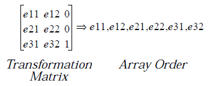

The above array may be altered directly and then used with 
**GrApplyTransform**.

**Destroyed:**  
Nothing.

**Library:** graphics.def

----------
#### GrGetWinBounds
Return the bounds of the current window's region, in document coordinates. 
The window is specified by the passed GState.

**Pass:**  
di - Handle of the GState.

**Returns:**  
CF - Set if coordinates can not be expressed in 16-bit values, clear 
otherwise.  
di - Handle of the GState, preserved.  
ax - Left bound of the window's regions.  
bx - Top bound.  
cx - Right bound.  
dx - Bottom bound.

**Destroyed:**  
Nothing.

**Library:** graphics.def

----------
#### GrGetWinBoundsDWord
Return the bounds of the current window's region, in document coordinates. 
These coordinates are 32-bit values for extended transformations. If one of 
the window's transformation matrixes contains a rotation, the returned 
bounds will be large enough to contain the entire rotated rectangle.

**Pass:**  
di - Handle of the GState.  
ds:si - Address of a fixed or locked buffer containing a **RectDWord** 
structure to hold the return values.

**Returns:**  
ds:si - Address of the returned **RectDWord** structure containing 
the window's bounds in document coordinates.

**Destroyed:**  
Nothing.

**Library:** graphics.def

----------
#### GrGetWinHandle
Return the window handle of the window associated with the passed GState.

**Pass:**  
di - Handle of the GState.

**Returns:**  
ax - Window handle.

**Destroyed:**  
Nothing.

**Library:** graphics.def

----------
#### GrGrabExclusive
Grab the video driver's exclusive access in order to begin drawing directly to 
the video driver. It is very rare that applications will ever need this.

**Pass:**  
bx - Handle of the video driver to grab.  
di - Handle of the GState to use for drawing.

**Returns:**  
Nothing.

**Destroyed:**  
Nothing.

**Library:** graphics.def

----------
#### GrInitDefaultTransform
Replace the default transformation matrix with the passed GState's current 
transformation matrix. This routine should be used only with great care; it 
will be called by applications only in the absolute rarest of situations.

**Pass:**  
di - Handle of the GState.

**Returns:**  
Nothing.

**Destroyed:**  
Nothing.

**Library:** graphics.def

**Warning:** This routine should almost never be used by applications.

----------
#### GrInvalRect
Invalidate a portion of the window associated with the passed GState. The 
rectangle passed will be added to the window's update region. If the rectangle 
is rotated, the region will be built out before being added to the window's 
invalid region.

**Pass:**  
di - Handle of the GState.

ax, bx - *x, y* coordinates of one corner of invalid rectangle.

cx, dx - *x, y* coordinates of opposite corner.

**Returns:**  
Nothing.

**Destroyed:**  
Nothing.

**Library:** graphics.def

----------
#### GrInvalRectDWord
Invalidate a portion of the window associated with the passed GState. This 
routine is like **GrInvalRect** except that it uses 32-bit coordinates rather than 
16-bit coordinates.

**Pass:**  
di - Handle of the GState.  
ds:si - Address of a **RectDWord** structure containing the bounds of 
the rectangle to be invalidated.

**Returns:**  
Nothing.

**Destroyed:**  
Nothing.

**Library:** graphics.def

----------
#### GrLabel
Write a label element to a graphics string. This routine writes out three bytes 
to the graphics string; the first byte is a GR_LABEL opcode, and the second 
and third bytes are the label passed in ax.

**Pass:**  
di - Handle of the graphics string.  
ax - Label value to write (determined by the caller).

**Returns:**  
Nothing.

**Destroyed:**  
Nothing.

**Library:** gstring.def

----------
#### GrLoadGString
Load a graphics string from a file, a stream, or a locked block. Allocate new 
memory for the loaded graphics stream, returning the handle of the new 
block. (This routine does not actually copy the entire string into the new 
memory; it allocates a GString structure and handle that can then be used 
with other GString operations.)

**Pass:**  
cl - GSTringType value indicating handle type passed in **bx**:  
GST_STREAM - Stream handle passed.  
GST_VMEM - VM file handle passed.  
GST_PTR - Segment address passed.  
bx - Handle or segment address of the source of the graphics 
string.  
si - If **cl** = GST_VMEM, VM block handle of the GString.
If **cl** = GST_PTR, offset into the block to start of GString.

**Returns:**  
si - Handle of the new GString.

**Destroyed:**  
Nothing.

**Library:** gstring.def

----------
#### GrMapColorIndex
Map a color index to its RGB equivalent.

**Pass:**  
di - Handle of the GState containing the palette to use.
Pass zero to use default mapping.  
ah - Color index to map.

**Returns:**  
al - Red component.  
bl - Green component.  
bh - Blue component.

**Destroyed:**  
Nothing.

**Library:** graphics.def

----------
#### GrMapColorRGB
Map an RGB color to its palette index.

**Pass:**  
di - Handle of the GState containing the palette to use.
Pass zero to use default mapping.  
al - Red component.  
bl - Green component.  
bh - Blue component.

**Returns:**  
ah - Color index the RGB values map to, closest fit.  
al - Red component of closest fit.  
bl - Green component of closest fit.  
bh - Blue component of closest fit.

**Destroyed:**  
Nothing.

**Library:** graphics.def

----------
#### GrMoveReg
Move a region by a given amount both horizontally and vertically.

**Pass:**  
ds:si - Address of the region's definition.  
cx - *x* amount to shift (signed).  
dx - *y* amount to shift (signed).

**Returns:**  
ds:si - Address of the byte just past the end of the region definition.

**Destroyed:**  
ax

**Library:** graphics.def

----------
#### GrMoveTo
Set the current pen position for the passed GState.

**Pass:**  
di - Handle of the GState.  
ax - New absolute x position of the pen.  
bx - New absolute y position of the pen.

**Returns:**  
Nothing.

**Destroyed:**  
Nothing.

**Library:** graphics.def

----------
#### GrMulDWFixed
Multiply two 48-bit signed numbers, where each integer is a DWFixed 
structure.

**Pass:**  
di.dx - Integral portion of multiplier.  
cx - Fractional portion of multiplier.  
si.bx - Integral portion of multiplicand.  
ax - Fractional portion of multiplicand.

**Returns:**  
CF - Set on overflow, clear otherwise.  
dx.cx - Integral portion of returned value.  
bx - Fractional portion of returned value.

**Destroyed:**  
Nothing.

**Library:** graphics.def

----------
#### GrMulDWFixedPtr
Multiply two 48-bit signed numbers, where each integer is a **DWFixed** 
structure. The parameters are passed in two buffers, unlike 
**GrMulDWFixed**.

**Pass:**  
ds:si - Address of the multiplicand, of type **DWFixed**.  
es:di - Address of the multiplier, of type **DWFixed**.

**Returns:**  
CF - Set on overflow, clear otherwise.  
dx.cx - Integral portion of returned value.  
bx - Fractional portion of returned value.

**Destroyed:**  
Nothing.

**Library:**    graphics.def

----------
#### GrMulWWFixed
Multiply two 32-bit signed numbers of type **WWFixed**.

**Pass:**  
dx.cx - **WWFixed** value of multiplier (low 16 bits is fraction).  
bx.ax - **WWFixed** value of multiplicand (low 16 bits is fraction).

**Returns:**  
dx.cx - **WWFixed** result of multiplication (low 16 bits is fraction).

**Destroyed:**  
Nothing.

**Library:** graphics.def

----------
#### GrMulWWFixedPtr
Multiply two 32-bit signed numbers of type WWFixed, passed in two buffers.

**Pass:**  
ds:si - Address of **WWFixed** value of multiplier.  
es:di - Address of **WWFixed** value of multiplicand.

**Returns:**  
dx.cx - **WWFixed** result of multiplication (low 16 bits is fraction).

**Destroyed:**  
Nothing.

**Library:** graphics.def

----------
#### GrNewPage
Execute a form feed for the GState or GString passed. When drawing to a 
path, this routine is ignored. When writing to a graphics string, it stores a 
GR_NEW_PAGE code. Otherwise, it invalidates the entire window 
associated with the given GState.

**Pass:**  
di - Handle of the GState or graphics string to draw to.  
al - **PageEndCommand** value.

**Returns:**  
Nothing.

**Destroyed:**  
Nothing.

**Library:** graphics.def

----------
#### GrNullOp
Write a no-operation code to a graphics string.

**Pass:**  
di - Handle of the graphics string to write to.

**Returns:**  
Nothing.

**Destroyed:**  
Nothing.

**Library:** graphics.def

----------
#### GrParseGString
Parse a graphics string by invoking a callback routine on each desired 
element.

**Pass:**  
di - Handle of the GState used for drawing.  
si - Handle of the GString to draw.  
dx - **GSControl** flags indicating which elements are desired.  
bx:cx - Address of a callback routine to be called on each element.  bp - Data to be passed to the callback routine.

**Returns:**  
Nothing.

**Destroyed:**  
Nothing.

**Callback Routine Specifications:**  
**Passed:**  
di - Handle of the GState.  
bx - Data passed in bp to **GrParseGString**.  
ds:si - Address of the element to be drawn.  
**Returns:**  
ax - *True* (i.e., non-zero) if finished drawing.
*False* (i.e., zero) to continue parsing the 
string.  
**May Destroy:**  
Any. May *not* write into the block pointed to by **ds**.

**Library:** gstring.def

----------
#### GrPolarToCartesian
Convert a polar coordinate to its corresponding cartesian equivalents.

**Pass:**  
dx.cx - **WWFixed** value of angle (theta). This is assumed to be relative 
to the *x* axis, increasing counterclockwise.  
bx.ax - **WWFixed** value of distance (r).

**Returns:**  
dx.cx - **WWFixed** value of *x* coordinate, in document coordinates.  
bx.ax - **WWFixed** value of *y* coordinate, in document coordinates.

**Destroyed:**  
Nothing.

**Library:** graphics.def

----------
#### GrQuickArcSine
Calculate an inverse sine. This routine returns the largest integral angle 
with a sine less than the passed value.

**Pass:**  
bx - Original delta x value (only the sign matters).  
dx.cx - **WWFixed** value of the sine to be inversed.

**Returns:**  
dx.cx - **WWFixed** value of the angle.

**Destroyed:**  
ax, bx

**Library:** graphics.def

----------
#### GrQuickCosine
Calculate the cosine of an angle.

**Pass:**  
dx.ax - 32-bit integer (**dx** is high word, **ax** is low word) representing 
65536 times the angle (theta * 65536).

**Returns:**  
dx.ax - 32-bit number representing 65536 times the cosine of the 
angle (65536 * cos(theta)).

**Destroyed:**  
Nothing.

**Library:** graphics.def

----------
#### GrQuickSine
Calculate the sine of an angle.

**Pass:**  
dx.ax - 32-bit integer (**dx** is high word, **ax** is low word) representing 
65536 times the angle (theta * 65536).

**Returns:**  
dx.ax - 32-bit number representing 65536 times the sine of the angle 
(65536 * sin(theta)).

**Destroyed:**  
Nothing.

**Library:** graphics.def

----------
#### GrQuickTangent
Calculate the tangent of the passed angle.

**Pass:**  
dx.ax - **WWFixed** value of the angle.

**Returns:**  
dx.ax - **WWFixed** value of the tangent.

**Destroyed:**  
Nothing.

**Library:** graphics.def

----------
#### GrReleaseExclusive
Release the exclusive grab made on a video driver with **GrGrabExclusive**.

**Pass:**  
bx - Handle of the video driver, or zero for the default driver.  
di - Handle of the GState originally passed to **GrGrabExclusive**.

**Returns:**  
ax, bx, cx, dx - Bounds of invalidation area required, in device coordinates.

**Destroyed:**  
Nothing.

**Library:** graphics.def

----------
#### GrRelMoveTo
Set the current pen position of the passed GState. Sets the new position 
relative to the current position; to set the position absolutely, use 
**GrMoveTo**.

**Pass:**  
di - Handle of the GState.  
dx.cx - **WWFixed** horizontal x displacement.  
bx.ax - **WWFixed** vertical y displacement.

**Returns:**  
Nothing.

**Destroyed:**  
Nothing.

**Library:** graphics.def

----------
#### GrRestoreState
Restore the current GState from a GState previously saved with 
**GrSaveState**.

**Pass:**  
di - Handle of the GState to be restored.

**Returns:**  
di - Preserved handle of the updated GState.

**Destroyed:**  
Nothing.

**Library:** graphics.def

----------
#### GrRestoreTransform
Set the passed GState's transformation matrix to be the one previously saved 
with **GrSaveTransform**.

**Pass:**  
di - Handle of the GState to have its transformation matrix 
restored.

**Returns:**  
Nothing.

**Destroyed:**  
Nothing.

**Library:** graphics.def

----------
#### GrSaveState
Save the current GState characteristics for later restoration with 
**GrRestoreState**.

**Pass:**  
di - Handle of the GState to save.

**Returns:**  
di - Preserved GState handle.

**Destroyed:**  
Nothing.

**Library:** graphics.def

----------
#### GrSaveTransform
Save the transformation matrix of the passed GState for later restoration 
with **GrRestoreTransform**.

**Pass:**  
di - Handle of the GState whose matrix should be stored.

**Returns:**  
Nothing.

**Destroyed:**  
Nothing.

**Library:** graphics.def

----------
#### GrSDivDWFbyWWF
Divide the **WWFixed** value into the **DWFixed** value. The result is a **DWFixed**. 
This routine is optimized for size over speed.

**Pass:**  
dx.cx.bp - **DWFixed** dividend (signed).  
bx.ax - **WWFixed** divisor (signed).

**Returns:**  
dx.cx.bp - **DWFixed** quotient (signed).

**Destroyed:**  
Nothing.

**Library:** graphics.def

----------
#### GrSDivWWFixed
Divide a 32-bit **WWFixed** value by another 32-bit **WWFixed** value.

**Pass:**  
dx.cx - **WWFixed** dividend (signed).  
bx.ax - **WWFixed** divisor (signed).

**Returns:**  
CF - Set if overflow, clear otherwise.  
dx.cx - **WWFixed** quotient (signed), if no overflow.

**Destroyed:**  
Nothing.

**Library:** graphics.def

----------
#### GrSetAreaAttr
Set all the area attributes of the given GState.

**Pass:**  
di - Handle of the GState.  
ds:si - Address of **AreaAttr** structure.

**Returns:**  
Nothing.

**Destroyed:**  
Nothing.

**Library:** graphics.def

----------
#### GrSetAreaColor
Set the GState's current area drawing color.

**Pass:**  
di - Handle of the GState.  
ah - **ColorFlag** value.  
al - Palette index if CF_INDEX in ah. Red component if CF_RGB in ah.  
bl - Green component if CF_RGB, ignored otherwise.  
bh - Blue component if CF_RGB, ignored otherwise.

**Returns:**  
Nothing.

**Destroyed:**  
Nothing.

**Library:** graphics.def

----------
#### GrSetAreaColorMap
Set the GState's current area color mapping mode.

**Pass:**  
di - Handle of the GState.  
al - **ColorMapMode** record.

**Returns:**  
Nothing.

**Destroyed:**  
Nothing.

**Library:** graphics.def

----------
#### GrSetAreaMask
Set the GState's current area drawing pattern.

**Pass:**  
di - Handle of the GState.  
al - **SysDrawMask** record with the following two parts. 
Combine the SDM_INVERSE flag with a value of 
**SystemDrawMask**.  
ds:si - If the **SystemDrawMask** passed in **al** is SDM_CUSTOM, 
then **ds:si** is the address of the custom pattern to set. 
Otherwise, **ds:si** is ignored.

**Returns:**  
Nothing.

**Destroyed:**  
Nothing.

**Library:** graphics.def

----------
#### GrSetAreaPattern
Set the GState's area fill pattern.

**Pass:**  
di - Handle of the GState.  
al - **PatternType** value.  
ah - Optional **SystemHatch** or **SystemBitmap** value if not 
PT_SOLID.  
dx:si - Address of a buffer containing the system hatch or bitmap 
pattern, if **ah** passed.  
cx - Size of buffer in **dx:si** if **ah** passed.

**Returns:**  
Nothing.

**Destroyed:**  
Nothing.

**Library:** graphics.def

----------
#### GrSetBitmapMode
Set the GState's mode bits for an editable bitmap.

**Pass:**  
di - Handle of the GState as returned by **GrEditBitmap**.  
ax - **BitmapMode** record:  
BM_EDIT_MASK - Edit mask rather than bitmap.  
BM_CLUSTERED_DITHER - Use clustered dither rather than dispersed 
dither (used only for BMF_MONO bitmaps).  
dx - Handle of block containing a **ColorTransfer** structure (an 
array of **RGBDelta** structures. Pass zero if no array is 
passed.

**Returns:**  
Nothing.

**Destroyed:**  
Nothing.

**Library:** graphics.def

----------
#### GrSetBitmapRes
Set the resolution of the GState's bitmap.

**Pass:**  
di - Handle of the GState, as returned by **GrCreateBitmap**.  
ax - New *x* resolution (in dots per inch).  
bx - New *y* resolution (in dots per inch).

**Returns:**  
Carry set if GState not associated with bitmap, clear otherwise.

**Destroyed:**  
Nothing.

**Library:** graphics.def

----------
#### GrSetClipPath
Set the GState's current clip path to be the clip path for all future graphics 
operations on the GState. The path is affected only by the window's 
transformation matrix.

**Pass:**  
di - Handle of the GState.  
cx - **PathCombineType** value indicating how the path should 
be combined with the window's clip path.  
dl - **RegionFillRule** value: RFR_WINDING or RFR_ODD_EVEN.

**Returns:**  
Nothing.

**Destroyed:**  
Nothing.

**Library:** graphics.def

----------
#### GrSetClipRect
Modify a window's clipping path by intersecting it with the specified 
rectangle. The rectangle should be defined in the document coordinate space 
of the passed GState; the rectangle will be transformed appropriately when 
used by the graphics and window systems. If the rectangle and the clipping 
path do not intersect (have no area in common), no part of the window will be 
updated.

**Pass:**  
di - Handle of the GState associated with the window.  
si - **PathCombineType** value.  
ax - Left bound of rectangle.  
bx - Top bound.  
cx - Right bound.  
dx - Bottom bound.

**Returns:**  
Nothing.

**Destroyed:**  
Nothing.

**Library:** graphics.def

----------
#### GrSetDefaultTransform
Reset the GState's transformation matrix to be the same as the default 
transformation matrix. In most cases, the default transformation matrix is 
simply the identity matrix (no transformations); this is not true in all cases, 
however, so you should call this routine rather than **GrSetNullTransform**. 
This routine is the reverse of **GrInitDefaultTransform**.

**Pass:**  
di - Handle of the GState.

**Returns:**  
Nothing.

**Destroyed:**  
Nothing.

**Library:** graphics.def

----------
#### GrSetFont
Set the font used by the GState for all subsequent text drawing. If the desired 
font is not available, then the default font is set instead.

**Pass:**  
di - Handle of the GState.  
cx - **FontID** to set as the font. Pass zero not to set the new font.  
dx.ah - **WBFixed** indicating the new point size to set. Pass zero to 
set no new point size.

**Returns:**  
Nothing.

**Destroyed:**  
Nothing.

**Library:** graphics.def

----------
#### GrSetFontWeight
Set the font weight used by the GState.

**Pass:**  
di - Handle of the GState.  
al - **FontWeight** value (percentage of normal weight).

**Returns:**  
Nothing.

**Destroyed:**  
Nothing.

**Library:** graphics.def

----------
#### GrSetFontWidth
Set the font width used by the GState.

**Pass:**  
di - Handle of the GState.  
al - **FontWidth** value (percentage of normal width).

**Returns:**  
Nothing.

**Destroyed:**  
Nothing.

**Library:** graphics.def

----------
#### GrSetGStringBounds
Store a GR_SET_GSTRING_BOUNDS opcode to a graphics string, along with 
the bounds of the string.

**Pass:**  
di - Handle of the GState associated with the graphics string.  
ax - Left bound of the string.  
bx - Top bound.  
cx - Right bound.  
dx - Bottom bound.

**Returns:**  
Nothing.

**Destroyed:**  
Nothing.

**Library:** gstring.def

----------
#### GrSetGStringPos
Set the current drawing position of a graphics string.

**Pass:**  
si - Handle of the graphics string.  
al - **GStringSetPosType** value:  
GSSPT_SKIP_1 - Advance one element.  
GSSPT_RELATIVE - Advance **cx** elements.  
GSSPT_BEGINNING - Move to beginning element.  
GSSPT_END - Move to final element.  
cx - Number of elements to skip, if GSSPT_RELATIVE. This may 
be negative for HugeArray-based graphics strings but must 
be positive otherwise.

**Returns:**  
Nothing.

**Destroyed:**  
Nothing.

**Library:** gstring.def

----------
#### GrSetLineAttr
Set all the line drawing attributes for the given GState.

**Pass:**  
di - Handle of the GState.  
ds:si - Address of a   structure.

**Returns:**  
Nothing.

**Destroyed:**  
Nothing.

**Library:** graphics.def

----------
#### GrSetLineColor
Set the current line drawing color for the GState.

**Pass:**  
di - Handle of the GState.  
ah - **ColorFlag** value.  
al - Palette index if CF_INDEX in **ah**. Red component if CF_RGB in **ah**.  
bl - Green component if CF_RGB, ignored otherwise.  
bh - Blue component if CF_RGB, ignored otherwise.

**Returns:**  
Nothing.

**Destroyed:**  
Nothing.

**Library:** graphics.def

----------
#### GrSetLineColorMap
Set the GState's current line color mapping mode.

**Pass:**  
di - Handle of the GState.  
al - **ColorMapMode** record.

**Returns:**  
Nothing.

**Destroyed:**  
Nothing.

**Library:** graphics.def

----------
#### GrSetLineEnd
Set the line end type for the passed GState.

**Pass:**  
di - Handle of the GState.  
al - LineEnd value:  
LE_BUTTCAP, LE_ROUNDCAP, LE_SQUARECAP.

**Returns:**  
Nothing.

**Destroyed:**  
Nothing.

**Library:** graphics.def

----------
#### GrSetLineJoin
Set the line join type for the passed GState.

**Pass:**  
di - Handle of the GState.  
al - **LineJoin** value:  
LJ_MITERED, LJ_ROUND, LJ_BEVELED.

**Returns:**  
Nothing.

**Destroyed:**  
Nothing.

**Library:** graphics.def

----------
#### GrSetLineMask
Set the current line drawing mask for the passed GState.

**Pass:**  
di - Handle of the GState.  
al - **SysDrawMask** record with the following two parts. 
Combine the SDM_INVERSE flag with a value of 
**SystemDrawMask**.  
ds:si - If the **SystemDrawMask** passed in **al** is SDM_CUSTOM, 
then **ds:si** is the address of the custom pattern to set. 
Otherwise, **ds:si** is ignored.

**Returns:**  
Nothing.

**Destroyed:**  
Nothing.

**Library:** graphics.def

----------
#### GrSetLineStyle
Set the current line drawing style (dash pattern) of the passed GState.

**Pass:**  
di - Handle of the GState.  
al - **LineStyle** value.  
bl - Skip distance into first dash pair.  
ds:si - If **al** = LS_CUSTOM, the address of a **DashPairArray** 
structure containing up to five dash-dot pairs.  
ah - If **al** = LS_CUSTOM, the number of pairs in the **ds:si** array.

**Returns:**  
Nothing.

**Destroyed:**  
Nothing.

**Library:** graphics.def

----------
#### GrSetLineWidth
Set the line drawing width of the passed GState.

**Pass:**  
di - Handle of the GState.  
dx.ax - **WWFixed** giving the new line width.

**Returns:**  
Nothing.

**Destroyed:**  
Nothing.

**Library:** graphics.def

----------
#### GrSetMiterLimit
Set the miter limit for the passed GState. The miter limit is the smallest 
angle that can be drawn with a miter join; smaller angles must be drawn 
with a beveled join.

**Pass:**  
di - Handle of the GState.  
bx:ax - **WWFixed** structure defining the miter limit.

**Returns:**  
Nothing.

**Destroyed:**  
Nothing.

**Library:** graphics.def

----------
#### GrSetMixMode
Set the drawing mix mode for the passed GState.

**Pass:**  
di - Handle of the GState.  
al - New MixMode value:  
MM_CLEAR, MM_COPY, MM_NOP, MM_AND, MM_INVERT, 
MM_XOR, MM_SET, or MM_OR.

**Returns:**  
Nothing.

**Destroyed:**  
Nothing.

**Library:** graphics.def

----------
#### GrSetNullTransform
Replace the GState's transformation matrix with the null (identity) 
transformation matrix. This routine should not be substituted for 
**GrSetDefaultTransform**, which reverts a transformation matrix to the 
default.

**Pass:**  
di - Handle of the GState.

**Returns:**  
Nothing.

**Destroyed:**  
Nothing.

**Library:** graphics.def

----------
#### GrSetPalette
Set one or more palette entries in the GState's color map.

**Pass:**  
di - Handle of the GState.  
al - First palette entry (index) to set.  
cx - Number of palette entries to set.  
dx:si - Address of a buffer of **cx** entries, each of type **RGBValue**.

**Returns:**  
Nothing.

**Destroyed:**  
Nothing.

**Library:** graphics.def

----------
#### GrSetPaletteEntry
Set a single entry in the GState's palette.

**Pass:**  
di - Handle of the GState.  
ah - Palette index entry to set.  
al - Red component of new color.  
bl - Green component of new color.  
bh - Blue component of new color.

**Returns:**  
Nothing.

**Destroyed:**  
Nothing.

**Library:** graphics.def

----------
#### GrSetPrivateData
Set the private data for the given GState. This may be retrieved with 
**GrGetInfo**; applications should not use the GState's private data, however.

**Pass:**  
di - Handle of the GState.  
ax, bx, cx, dx - Private data to set.

**Returns:**  
Nothing.

**Destroyed:**  
Nothing.

**Library:** graphics.def

----------
#### GrSetStrokePath
Replace the GState's current path with the one defined as the stroked 
representation of the current path.

**Pass:**  
di - Handle of the GState.

**Returns:**  
Nothing.

**Destroyed:**  
Nothing.

**Library:** graphics.def

----------
#### GrSetSubscriptAttr
Set the GState's subscript attributes.

**Pass:**  
di - Handle of the GState.  
al - **SubscriptPosition** value (percentage of font size from top).  
ah - **SubscriptSize** value (percentage of font size).

**Returns:**  
Nothing.

**Destroyed:**  
Nothing.

**Library:** graphics.def

----------
#### GrSetSuperscriptAttr
Set the GState's superscript attributes.

**Pass:**  
di - Handle of the GState.  
al - **SuperscriptAttr** value (percentage of font size from  bottom).  
ah - **SuperscriptSize** value (percentage of font size).

**Returns:**  
Nothing.

**Destroyed:**  
Nothing.

**Library:** graphics.def

----------
#### GrSetTextAttr
Set all the GState's text drawing attributes.

**Pass:**  
di - Handle of the GState.  
ds:si - Address of a **TextAttr** structure.

**Returns:**  
Nothing.

**Destroyed:**  
Nothing.

**Library:** graphics.def

----------
#### GrSetTextColor
Set the current text drawing color for the GState.

**Pass:**  
di - Handle of the GState.  
ah - ColorFlag value.  
al - Palette index if CF_INDEX in ah. Red component if CF_RGB in ah.  
bl - Green component if CF_RGB, ignored otherwise.  
bh - Blue component if CF_RGB, ignored otherwise.

**Returns:**  
Nothing.

**Destroyed:**  
Nothing.

**Library:** graphics.def

----------
#### GrSetTextColorMap
Set the GState's current text color mapping mode.

**Pass:**  
di - Handle of the GState.  
al - **ColorMapMode** record.

**Returns:**  
Nothing.

**Destroyed:**  
Nothing.

**Library:** graphics.def

----------
#### GrSetTextDrawOffset
Set the number of characters at the end of a string to draw. This operation is 
never saved out to a graphics string.

**Pass:**  
di - Handle of the GState used for drawing.  
ax - Number of characters to draw, or zero to draw the entire 
string.

**Returns:**  
Nothing.

**Destroyed:**  
Nothing.

**Library:** text.def

----------
#### GrSetTextMask
Set the current text drawing mask for the passed GState.

**Pass:**  
di - Handle of the GState.  
al - **SysDrawMask** record with the following two parts. 
Combine the SDM_INVERSE flag with a value of 
**SystemDrawMask**.  
ds:si - If the **SystemDrawMask** passed in **al** is SDM_CUSTOM, 
then **ds:si** is the address of the custom pattern to set. 
Otherwise, **ds:si** is ignored.

**Returns:**  
Nothing.

**Destroyed:**  
Nothing.

**Library:** graphics.def

----------
#### GrSetTextMode
Set the GState's current text drawing mode.

**Pass:**  
di - Handle of the GState.  
al - **TextMode** flags to set.  
ah - **TextMode** flags to clear.

**Returns:**  
Nothing.

**Destroyed:**  
Nothing.

**Library:** graphics.def

----------
#### GrSetTextPattern
Set the GState's text fill pattern.

**Pass:**  
di - Handle of the GState.  
al - **PatternType** value to set.  
ah - Optional **SystemHatch** or **SystemBitmap** value if not 
PT_SOLID.  
dx:si - Address of a buffer containing the system hatch or bitmap 
pattern, if ah passed.  
cx - Size of buffer in **dx:si** if ah passed.

**Returns:**  
Nothing.

**Destroyed:**  
Nothing.

**Library:** graphics.def

----------
#### GrSetTextSpacePad
Set the amount to pad spaces when drawing text with **GrPutString**.

**Pass:**  
di - Handle of the GState.  
dx - Pixel spacing of padding.  
bl - Additional fractional spacing.

**Returns:**  
Nothing.

**Destroyed:**  
Nothing.

**Library:** graphics.def

----------
#### GrSetTextStyle
Set the GState's current text style.

**Pass:**  
di - Handle of the GState.

al - **TextStyle** flags to set.

ah - **TextStyle** flags to clear.

**Returns:**  
Nothing.

**Destroyed:**  
Nothing.

**Library:** graphics.def

----------
#### GrSetTrackKern
Set the GState's track kerning.

**Pass:**  
di - Handle of the GState.  
ax - Degree of track kerning (signed word).

**Returns:**  
Nothing.

**Destroyed:**  
Nothing.

**Library:** graphics.def

----------
#### GrSetTransform
Replace the GState's current transformation matrix with another.

**Pass:**  
di - Handle of the GState.  
ds:si - Address of an array of six structures. The first four must be 
**WWFixed** structures, and the last two **DWFixed**. The 
numbers must be in row order as in the diagram:

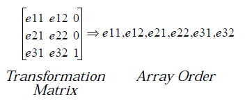

In this case, the two **DWFixed** structures will represent 
numbers *e31* and *e32*.

**Returns:**  
Nothing.

**Destroyed:**  
Nothing.

**Library:** graphics.def

----------
#### GrSetVMFile
Sets the VM file in the associated Window or GString, if any.

This routine must be called is the VM file handle stored in the Window or 
GString may have changed (e.g., via **VMSave**)

**Pass:**  
di  Handle of GState  
ax  VM file handle. 

**Returns:**  
Nothing.

**Destroyed:**  
Nothing.

**Library:** graphics.def

----------
#### GrSetWinClipPath
Set the GState's current path to be the document clip path for all future 
graphics operations. This path is affected by both the window and GState's 
transformation matrixes.

**Pass:**  
di - Handle of the GState.  
cx - **PathCombineType** value.  
dl - **RegionFillRule** (unnecessary for PCT_NULL).

**Returns:**  
Nothing.

**Destroyed:**  
Nothing.

**Library:** graphics.def

----------
#### GrSetWinClipRect
Modify a window's clipping path by intersecting it with the specified 
rectangle. The rectangle should be defined in the document coordinate space 
of the passed GState; the rectangle will be transformed appropriately when 
used by the graphics and window systems. If the rectangle and the clipping 
path do not intersect (have no area in common), no part of the window will be 
updated.

**Pass:**  
di - Handle of the GState associated with the window.  
si - **PathCombineType** value.  
ax - Left bound of rectangle.  
bx - Top bound.  
cx - Right bound.  
dx - Bottom bound.

**Returns:**  
Nothing.

**Destroyed:**  
Nothing.

**Library:** graphics.def

----------
#### GrSqrRootWWFixed
Calculate the square root of a 32-bit number. Numbers less than one return 
the value one.

**Pass:**  
dx.cx - **WWFixed** value to get the square root of.

**Returns:**  
dx.cx - **WWFixed** value representing the square root.

**Destroyed:**  
Nothing.

**Library:** graphics.def

----------
#### GrSqrWWFixed
Calculate the square of a 32-bit number.

**Pass:**  
dx.cx - **WWFixed** value to square.

**Returns:**  
dx.cx - **WWFixed** square result.

**Destroyed:**  
Nothing.

**Library:** graphics.def

----------
#### GrTestPath
Checks for the existence of a path.

**Pass:**  
di - Handle of GState  
ax - **GetPathType** value

**Returns:**  
CF - Clear if path exists for GState; set otherwise.

**Destroyed:**  
Nothing.

**Library:** graphics.def

----------
#### GrTestPointInPath
Determine if the passed point is inside the GState's current path.

**Pass:**  
di - Handle of the GState.  
cl - **RegionFillRule** value: RFR_ODD_EVEN, RFR_WINDING.  
ax, bx - *x, y* coordinates of the point (document coordinates).

**Returns:**  
CF - Set if point is inside, clear if it is not.

**Destroyed:**  
Nothing.

**Library:** graphics.def

----------
#### GrTestPointInPolygon
Determine if the passed point is inside the given polygon.

**Pass:**  
di - Handle of the GState used for drawing.  
dx, bx - *x, y* coordinates of the point (document coordinates).  
ds:si - Address of the array of points in the polygon.  
cx - Number of points in the polygon array.  
al - **RegionFillRule** value: RFR_ODD_EVEN, RFR_WINDING.

**Returns:**  
ax -  Non-zero means the point is inside the polygon. 
Zero means the point is not inside the polygon.

**Destroyed:**  
Nothing.

**Library:** graphics.def

----------
#### GrTestPointInReg
Determine if the passed point is inside a given region. If so, return the 
rectangle inside the region including the point.

**Pass:**  
cx, dx - *x, y* coordinates of the point.  
ds:si - Address of Region definition.

**Returns:**  
CF - Set if point inside region, clear otherwise.  
ax - Top bound of bounding rectangle if CF returned set.  
bx - Bottom bound of bounding rectangle if CF returned set.  
ds:[si-4] - Left bound of bounding rectangle if CF returned set.  
ds:[si-2] - Right bound of bounding rectangle if CF returned set.

**Destroyed:**  
Nothing.

**Library:** graphics.def

----------
#### GrTestRectInMask
Determine if a given rectangle is inside the current clip region.

**Pass:**  
di - Handle of the GState used for drawing.  
ax, bx - *x, y* coordinates of one corner of rectangle to check.  
cx, dx - *x, y* coordinates of opposite corner of rectangle.

**Returns:**  
al - **TestRectReturnType** value:  
TRRT_OUT - The rectangle is entirely outside the region.  
TRRT_PARTIAL - The rectangle is partially inside the region.  
TRRT_IN - The rectangle is entirely inside the region.

**Destroyed:**  
Nothing.

**Library:** graphics.def

----------
#### GrTestRectInReg
Determine if a given rectangle is inside a specified region.

**Pass:**  
ax, bx - *x, y* coordinates of one corner of rectangle to check.  
cx, dx - *x, y* coordinates of opposite corner of rectangle.  
ds:si - Address of the Region definition.  
CF - Set if **ds:si** is a value from *W_clipPtr*, clear if **ds:si** points to 
the start of a region. (Typically clear on call.)

**Returns:**  
al - **TestRectReturnType** value:  
TRRT_OUT - The rectangle is entirely outside the region.  
TRRT_PARTIAL - The rectangle is partially inside the region.  
TRRT_IN - The rectangle is entirely inside the region.

**Destroyed:**  
Nothing.

**Library:** graphics.def

----------
#### GrTextPosition
Return the nearest offset into a text string when given a pixel position in the 
string.

**Pass:**  
di - Handle of the GState used for drawing.  
cx - Number of characters in string (0 if null terminated).  
dx - Pixel offset into string.

**Pass on stack:**  
ss:bp - *GTP_vars* structure.

**Returns:**  
cx - Nearest character boundary to the passed **cx**.  
dx - Nearest valid position in the text string.  
ds - Segment address of last piece of text.

**Destroyed:**  
Nothing.

**Library:** text.def

----------
#### GrTextWidth
Return the width of a text string, including kerning.

**Pass:**  
di - Handle of the GState used for drawing the text.  
ds:si - Address of the string.  
cx - Number of characters in the string, or zero for 
null-terminated string.

**Returns:**  
dx - Width of the string, in document points.

**Destroyed:**  
Nothing.

**Library:** graphics.def

----------
#### GrTextWidthWBFixed
Return the width of a text string, including kerning.

**Pass:**  
di - Handle of the GState used for drawing the text.  
ds:si - Address of the string.  
cx - Number of characters in the string, or zero for 
null-terminated string.

**Returns:**  
dx.ah - **WBFixed** width of the string, in document points.

**Destroyed:**  
Nothing.

**Library:** graphics.def

----------
#### GrTransform
Transform the given coordinate pair from document units to screen 
coordinates, including the effects of the GState and window transformation 
matrixes.

**Pass:**  
di - Handle of the GState used for drawing.  
ax, bx - *x, y* coordinates in document units.

**Returns:**  
CF - Set if translation overflow, clear if successful.  
ax, bx - Translated *x, y* coordinates in screen pixels.

**Destroyed:**  
Nothing.

**Library:** graphics.def

----------
#### GrTransformByMatrix
Transform the given coordinate pair using the passed transformation matrix.

**Pass:**  
ax, bx - *x, y* coordinates of the original point.  
ds:si - Address of a **TransMatrix** structure.

**Returns:**  
ax, bx - Translated *x, y* coordinates.

**Destroyed:**  
Nothing.

**Library:** graphics.def

----------
#### GrTransformByMatrixDWord
Transform the given coordinate pair using the passed transformation matrix. 
Coordinates are 32-bit values rather than normal 16-bit values.

**Pass:**  
dx.cx - **DWFixed** value of original *x* coordinate.  
bx.ax - **DWFixed** value of original *y* coordinate.  
ds:si - Address of a **TransMatrix** structure.

**Returns:**  
dx.cx - **DWFixed** value of translated *x* coordinate.  
bx.ax - **DWFixed** value of translated *y* coordinate.

**Destroyed:**  
Nothing.

**Library:** graphics.def

----------
#### GrTransformDWFixed
Transform the given coordinate pair from document units to screen 
coordinates, including the effects of the GState and window transformation 
matrixes. Coordinates are in **DWFixed** format.

**Pass:**  
di - Handle of the GState.  
es:dx - Address of a buffer containing a **PointDWFixed** structure. 

**Returns:**  
es:dx - Address of the returned **PointDWFixed** structure, 
translated to screen coordinates.

**Destroyed:**  
Nothing.

**Library:** graphics.def

----------
#### GrTransformDWord
Transform the given 32-bit coordinate pair from document units to screen 
coordinates, including the effects of the GState and window transformation 
matrixes.

**Pass:**  
di - Handle of the GState used for drawing.  
dx.cx - **DWFixed** *x* coordinate in document units.  
bx.ax - **DWFixed** *y* coordinate in document units.

**Returns:**  
dx.cx - Translated **DWFixed** *x* coordinate in screen pixels.  
bx.ax - Translated **DWFixed** *y* coordinate in screen pixels.

**Destroyed:**  
Nothing.

**Library:** graphics.def

----------
#### GrTransformWWFixed
Transform the given 32-bit fixed point coordinate pair using the passed 
GState's transformation matrix. Coordinates are in **WWFixed** format.

**Pass:**  
di - Handle of the GState.  
dx.cx - **WWFixed** *x* coordinate, in document units.  
bx.ax - **WWFixed** *y* coordinate, in document units.

**Returns:**  
CF - Set if overflow, clear otherwise. If overflow, returned 
coordinates are invalid.  
dx.cx - **WWFixed** translated *x* coordinate.  
bx.ax - **WWFixed** translated *y* coordinate.

**Destroyed:**  
Nothing.

**Library:** graphics.def

----------
#### GrUDivWWFixed
Divide two 32-bit unsigned numbers.

**Pass:**  
dx.cx - **WWFixed** dividend.  
bx.ax - **WWFixed** divisor.

**Returns:**  
CF - Set if overflow, clear otherwise. If overflow, quotient is 
invalid.  
dx.cx - **WWFixed** quotient.

**Destroyed:**  
Nothing.

**Library:**graphics.def

----------
#### GrUncompactBitmap
Uncompact a huge bitmap (a bitmap in a HugeArray).

**Pass:**  
bx - VM file handle of compacted bitmap.  
ax - VM block handle of compacted bitmap's start block.  
dx - VM file handle for destination of the de-compaction; may be 
the same as **bx**.

**Returns:**  
dx - VM file handle of uncompacted bitmap.  
cx - VM block handle of uncompacted bitmap's start block.

**Destroyed:**  
Nothing.

**Library:** graphics.def

----------
#### GrUntransform
Transform the given coordinate pair from screen coordinates to document 
coordinates, including the effects of the GState and window transformation 
matrixes.

**Pass:**  
di - Handle of the GState used for drawing.  
ax, bx - *x, y* coordinates in screen pixels.

**Returns:**  
CF - Set if overflow, clear otherwise.  
ax, bx - *x, y* coordinates in document units.

**Destroyed:**  
Nothing.

**Library:** graphics.def

----------
#### GrUntransformByMatrix
Untransform the given coordinate pair using the passed transformation 
matrix. This is the inverse operation of transforming the coordinates using 
the matrix.

**Pass:**  
ax, bx - *x, y* coordinates to be untransformed.  
ds:si - Address of a **TransMatrix** structure.

**Returns:**  
ax, bx - *x, y* coordinates, untransformed.

**Destroyed:**  
Nothing.

**Library:** graphics.def

----------
#### GrUntransformByMatrixDWord
Untransform the given coordinate pair using the passed transformation 
matrix. This is the inverse operation of transforming the coordinates using 
the matrix.

**Pass:**  
dx.cx - **DWFixed** value of original *x* coordinate.  
bx.ax - **DWFixed** value of original *y* coordinate.  
ds:si - Address of a **TransMatrix** structure.

**Returns:**  
dx.cx - **DWFixed** value of new *x* coordinate.  
bx.ax - **DWFixed** value of new *y* coordinate.

**Destroyed:**  
Nothing.

**Library:** graphics.def

----------
#### GrUntransformDWFixed
Untransform the given coordinate pair from screen coordinates to document 
coordinates using the GState passed.

**Pass:**  
di - Handle of the GState used for drawing.  
es:dx - Address of a **PointDWFixed** structure holding the screen 
coordinates pair.

**Returns:**  
es:dx - Address of a **PointDWFixed** structure holding the 
untransformed coordinate pair, in document coordinates.

**Destroyed:**  
Nothing.

**Library:** graphics.def

----------
#### GrUntransformDWord
Untransform the given 32-bit coordinate pair from screen coordinates to 
document coordinates.

**Pass:**  
di - Handle of the GState.  
dx.cx - 32-bit *x* integer coordinate (**dx** high word, **cx** low word).  
bx.ax - 32-bit *y* integer coordinate (**bx** high word, **ax** low word).

**Returns:**  
dx.cx - 32-bit untransformed *x* coordinate in document units.  
bx.ax - 32-bit untransformed *y* coordinate in document units.

**Destroyed:**  
Nothing.

**Library:** graphics.def

----------
#### GrUntransformWWFixed
Untransform the given 32-bit coordinate pair using the GState passed.

**Pass:**  
di - Handle of the GState.  
dx.cx - **WWFixed** value of *x* coordinate (screen coordinates).  
bx.ax - **WWFixed** value of *y* coordinate (screen coordinates).

**Returns:**  
CF - Set if overflow, clear otherwise. If set, results are invalid.  
dx.cx - **WWFixed** value of untransformed *x* (document coordinates).  
bx.ax - **WWFixed** value of untransformed *y* (document coordinates).

**Destroyed:**  
Nothing.

**Library:**    graphics.def

[Routines E-F](asme_f.md) <-- [Table of Contents](../asmref.md) &nbsp;&nbsp; --> [Routines H-L](asmh_l.md)

