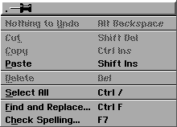
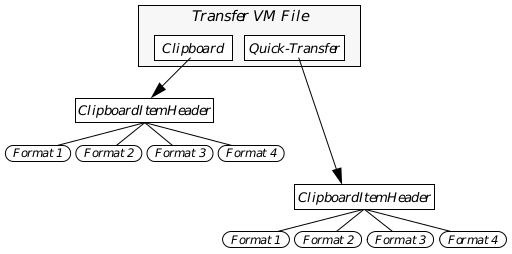

## 7 The Clipboard

For an application to survive in the GUI world today, it must support at least 
the ever-present "Cut, Copy, and Paste" functions to which users have grown 
so attached. GEOS makes this very simple through the Clipboard and 
Quick-Transfer mechanisms.

All applications should support and use these mechanisms in order to 
maintain consistency throughout the system. In addition, these mechanisms 
provide certain functionality for data transfer that can be easily used.

To understand this chapter fully, you should have a working knowledge of 
Virtual Memory management as well as some familiarity with the concepts 
of mouse input. However, the concepts of the Clipboard and quick-transfer 
mechanisms are simple and may be understood without having read those 
sections.

### 7.1 Overview

The user understands two ways to cut and paste information: The first is to 
use the Edit menu and the Cut, Copy, and Paste functions. The second is to 
use the mouse by selecting and dragging text, graphics, or objects with the 
quick-copy and quick-move functions. For a full description of how these two 
operations are accomplished, see the user's guide provided in the Geoworks 
retail products.

Both these functions use similar data structures; a single flag determines 
whether the operation is a quick-transfer or a normal Clipboard operation. 
However, the procedures and rules of usage have significant differences.

You should be familiar with the features and uses of both the Clipboard and 
the quick-transfer mechanism. If you are, you can skip this section; however, 
if you are not familiar with the features and rules governing the Edit menu 
and the quick-transfer operations, you most likely will want to read this 
section.

#### 7.1.1 Cut, Copy, and Paste

Even the simplest, text-using applications provide an Edit menu with the 
Cut, Copy, and Paste options. A sample Edit menu is shown in Figure 7-1.

The Edit menu works with a hidden data area called the Clipboard. The 
Clipboard has no visual representation, and it can contain any format of data 
from text to graphics strings to custom formats defined by applications. The 
Clipboard's structure and implementation are completely invisible to the 
user beyond the functions Cut, Copy, and Paste.

The most common use of the Edit menu is within a word processor or draw 
program. For example, when a user wants to place a graphic from GeoDraw 
into GeoWrite, or when he wants to rearrange text in his NotePad, he can use 
the cut, copy, and paste operations.

When a user selects an item such as the word "puddle," the Cut option 
becomes enabled. This indicates that the user can remove the selection from 
the document and it will be placed on the Clipboard (anything already on the 
Clipboard will be replaced with the selection). When nothing is selected, the 
Cut option is disabled.

In order to enable the Copy option, the user must select an item, just as with 
Cut. Copying, however, will not remove the selection from the document-it 
will simply create a copy of the selection and place it on the Clipboard, 
removing whatever had previously been on the Clipboard.

**Figure 7-1** The Edit Menu  
_The Edit menu of NotePad contains the Cut, Copy, and Paste items._

Pasting is allowed only when something in a compatible data format is 
already sitting on the Clipboard. The Paste operation copies what is on the 
Clipboard into a document at the current insertion point (in the case of text, 
this is where the cursor was last placed); if something is already selected, the 
selection will be replaced with the pasted material. If there is nothing on the 
Clipboard, then there is nothing to paste; therefore, the option is disabled.

#### 7.1.2 Quick-Transfer

The user can copy and move selected items without using the Edit menu; he 
simply drags the item using the quick-transfer button of his mouse, and the 
item will be either copied or moved.

There are several rules which govern whether a move or copy is taking place. 
The user can override these rules with a certain set of keypresses to force 
either a copy or move. Copy is equivalent to using the Copy and Paste 
functions in succession, and move is equivalent to using the Cut and Paste 
functions in succession.

The operation of a quick transfer (move or copy), however, depends on 
whether the transfer is across documents or internal to a single document. If 
the transfer is internal, it should become a move. If the transfer occurs across 
documents, it should become a copy. (Note that, for the purposes of 
quick-transfer, the term document is used to refer to anything the user will 
conceptually view as a single data holder-for example, a GeoManager 
"document" consists of one disk.)

Because not all documents will support a given transfer operation (for 
example, a text file editor can not receive a GeoDraw graphic), the user is 
provided with immediate feedback about the type and validity of the transfer.

For example, if a GeoDraw ellipse was selected and a quick-transfer was 
begun, immediately the mouse pointer would show the transfer as a move 
operation. As the user moves the mouse outside the GeoDraw document and 
into another GeoDraw document, the cursor changes to indicate a copy 
operation. If the user then moves the mouse over a text-only document, a "no 
operation," or "invalid," cursor would be shown, indicating that the ellipse 
could not be received.

Some applications may implement an additional feature that provides 
feedback to the user: modifying the source object as the type of transfer 
changes. For example, a drawing program may wish to alter the shape or 
color of an object while it is being quick-moved but leave it normal during a 
quick-copy or no-operation transfer.

### 7.2 Transfer Data Structures

Both the Clipboard and quick-transfer mechanisms use similar structures to 
accomplish data transfer. These data structures are owned and managed by 
the GEOS User Interface; however, they are accessible to all geodes in the 
system through a number of routines and messages.

The Clipboard consists of a VM file known as the Transfer VM File, shown in 
Figure 7-2. The quick-transfer mechanism uses the same file for its data 
transfer. Typically, this is a file designated and managed by the User 
Interface.

**Figure 7-2** The Transfer VM File  
_How the Transfer VM File is used by the Copy and Paste functions; its use 
for quick-transfer is similar._

In addition, certain formats of data are supported automatically-GEOS text 
and graphics strings are special formats that are described below. Geodes can 
create their own specific formats; for example, GeoManager uses a special 
format for quick-transfer of files between disks and directories.

#### 7.2.1 The Transfer VM File Format

The Transfer VM File is a normal VM file, managed by the UI. It contains 
several components, each of which is accessed through special routines that 
take care of nearly all the synchronization issues involved with the Clipboard 
and quick-transfer mechanisms. Because both the Clipboard and the 
quick-transfer mechanism use this file and its data structures, these 
structures are detailed here; the following section ("Using The Clipboard" on 
page 309) details how to use them for either the Clipboard or the 
quick-transfer mechanism.

The Transfer VM File has one header block for the Clipboard transfer item 
and another for the quick-transfer transfer item. These headers have the 
same structure, and they contain all the information necessary to work with 
the file's contents. They contain pointers to and information about each 
format available for both the Clipboard and the quick-transfer functions. The 
transfer item's header is shown in Code Display 7-1.

---
Code Display 7-1 ClipboardItemHeader
~~~
/* The ClipboardItemHeader structure details what formats, if any, exist in the
 * Transfer VM File for both the Clipboard and quick-transfer mechanisms.*/

typedef struct {

	    /* The CIH_owner field is the optr of the object that put
	     * the current transfer item into the Transfer VM File. */
    optr			CIH_owner;

	    /* The CIH_flags field determines whether the transfer item is used by
	     * the quick transfer mechanism or by the normal Clipboard. If this
	     * field is equal to the constant CIF_QUICK, then the transfer item
	     * belongs to the quick transfer mechanism. If it is any other value,
	     * the transfer item belongs to the normal Clipboard. */
    ClipboardItemFlags			CIH_flags;
	/* The ClipboardItemFlags type has one predefined value:
	 *	CIF_QUICK		0x4000
	 * If this flag does not apply, use TIF_NORMAL, which is 0x0000. */

	    /* The CIH_name field is a 33-character buffer that should contain a
	     * null-terminated character string representing the name of the given
	     * transfer item. */
    ClipboardItemNameBuffer 			CIH_name;

	    /* The CIH_formatCount field indicates the number of formats of the
	     * transfer item currently available. For example, this field would be
	     * 2 if CIF_TEXT and CIF_GRAPHICS_STRING formats were supported and
	     * available in the Transfer VM File. */
    word			CIH_formatCount;

	    /* The CIH_sourceID field contains information about the source
	     * document of the transfer. Typically, this will be the optr of the
	     * parent GenDocument object. */
    dword			CIH_sourceID;

	    /* The CIH_formats field is actually an array of ten
	     * ClipboardFormatInfo structures, each of which contains the
	     * important details about a specific format of the transfer item. */
    FormatArray			CIH_formats;

	    /* This field is reserved and should not be used. */
    dword			CIH_reserved;
} ClipboardItemHeader;

/* The FormatArray type is an array of ClipboardItemFormatInfo structures. The
 * definition of this field is shown here: */

typedef	ClipboardItemFormatInfo			FormatArray[CLIPBOARD_MAX_FORMATS];
	/* CLIPBOARD_MAX_FORMATS is a constant defining the maximum number of
	 * formats allowed for any given transfer item. It is defined as 10. */
~~~

The rest of the Transfer VM File consists of VM blocks containing the data 
that is to be transferred. Each format supported will have its own VM block 
or series of VM blocks, pointed to by the ClipboardItemFormatInfo 
structure in the item's header.

The Transfer VM File actually contains two transfer items: One for the 
Clipboard and one for the quick-transfer mechanism (see Figure 7-3). When 
calling ClipboardQueryItem(), the requesting geode must specify which 
item it wants. See section 7.3 on page 309 and section 7.4 on page 323.

#### 7.2.2 ClipboardItemFormatInfo

This structure contains information about a specific format of the transfer 
item. The Transfer VM File will support up to ten formats of a given item at 
once (for both the Clipboard and quick-transfer); each of these formats is 
stored in its own VM block or VM chain and is represented in the header by a 
ClipboardItemFormatInfo structure in the array CIH_formats.

The ClipboardItemFormatInfo structure contains other information 
about the specific format as well as space for two extra words of data. The 
structure is shown in Code Display 7-2.

Each element in the CIH_formats array contains two items: One word 
represents the manufacturer ID of the geode responsible for the format 
(useful if a custom format is used within several applications from a single 
manufacturer), and the other represents the actual format number. To 
combine these words into a ClipboardItemFormatID record, or to extract 
either word from the record, use the macros shown after Code Display 7-2.

**Figure 7-3** Transfer VM File Structure  
_The Transfer VM File contains two transfer items, one for the clipboard and 
one for the quick-transfer mechanism. Both can store multiple formats of 
their transfer items; each format may consist of a VM chain._

---
Code Display 7-2 ClipboardItemFormatInfo
~~~
/* The ClipboardItemFormatInfo structure contains information about a given
 * format of the transfer item. */

typedef struct {
		/* CIFI_format contains a format ID as well as the
		 * manufacturer ID of the geode responsible for the format. */
	ClipboardItemFormatID	 		CIFI_format;

		/* CIFI_extra1 and CIFI_extra2 are extra words provided for
		 * format-specific use. */
	word		CIFI_extra1;
	word		CIFI_extra2;

		/* CIFI_vmChain is a VM handle pointing to the first block in the
		 * specific format. */
	VMChain		CIFI_vmChain;

		/* CIFI_renderer contains the token of the geode that created
		 * the format. */
	GeodeToken		CIFI_renderer;
} ClipboardItemFormatInfo;
~~~

Below are the macros for use with a ClipboardItemFormatID structure.

**FormatIDFromManufacturerAndType**
~~~
ClipboardItemFormatID FormatIDFromManufacturerAndType(man, typ);
      ManufacturerID man; 
      word           typ;
~~~
This macro creates a ClipboardItemFormatID dword value from the given 
manufacturer ID and format ID.

**ManufacturerFromFormatID**
~~~
ManufacturerID ManufacturerFromFormatID(type);
	ClipboardItemFormatID type;
~~~
This macro extracts the manufacturer ID from the given clipboard format ID 
and manufacturer value.

**TypeFromFormatID**
~~~
word TypeFromFormatID(type);
	ClipboardItemFormatID type;
~~~
This macro extracts the format ID from the given clipboard format ID and 
manufacturer value.

#### 7.2.3 Transfer Data Structures

Two structures are used with specific routines when dealing with the transfer 
mechanisms. The ClipboardQueryArgs structure is returned by 
ClipboardQueryItem(), and the ClipboardRequestArgs structure is 
returned by ClipboardRequestItemFormat(). Both routines are used 
during a Paste operation, and both structures are shown in Code Display 7-3.

Note that the CQA_header field is of type TransferBlockID. This type is a 
dword made up of two word-sized components: a VM file handle and a VM 
block handle. The three macros listed after Code Display 7-3 can be used to 
create the TransferBlockID argument and extract either of the components 
from the whole.

---
Code Display 7-3 ClipboardQueryArgs and ClipboardRequestArgs
~~~
/* ClipboardQueryArgs is filled by ClipboardQueryItem(), which is called when
 * determining whether a transfer item exists. */
typedef struct {
    word		CQA_numFormats;		/* the total number of formats available */
    optr		CQA_owner;		/* the optr of the originating object */
    TransferBlockID CQA_header;				/* The combined VM file handle and VM block
				 * handle of the block containing the
				 * ClipboardItemHeader */
} ClipboardQueryArgs;

/* ClipboardRequestArgs is filled by ClipboardRequestItemFormat(), which is called
 * when the application wants to retrieve the current transfer item. */
typedef struct {
    VMFileHandle		CRA_file;		/* The VM file handle of the transfer file */
    VMChain		CRA_data;		/* The handle of the VM chain containing the
				 * transfer item */
    word		CRA_extra1;		/* an extra word of data */
    word		CRA_extra2;		/* another extra word of data */
} ClipboardRequestArgs;
~~~

Below are the macros for use with the TransferBlockID structure.

**BlockIDFromFileAndBlock**
~~~
TransferBlockID BlockIDFromFileAndBlock(f, b);
	VMFileHandle  f;
	VMBlockHandle b;
~~~
This macro creates a TransferBlockID value from the given file and block 
handles.

**FileFromTransferBlockID**
~~~
VMFileHandle FileFromTransferBlockID(id);
	TransferBlockID	id;
~~~
This macro extracts the file handle from the given TransferBlockID value.

**BlockFromTransferBlockID**
~~~
VMBlockHandle BlockFromTransferBlockID(id);
	TransferBlockID	 id;
~~~
This macro extracts the block handle from the given TransferBlockID 
value.

#### 7.2.4 Clipboard Item Formats

There are several built-in transfer formats that many GEOS applications 
may support; each of these types is an enumeration of 
ClipboardItemFormat. Additionally, custom formats can be defined to 
allow special data structures to be cut, copied, pasted, or quick-transferred 
without translation into text or graphics strings. The Transfer VM File may 
contain up to ten formats of a given transfer item. ClipboardItemFormat 
is shown below.

~~~
typedef enum /* word */ {
	CIF_TEXT,
	CIF_GRAPHICS_STRING,
	CIF_FILES,
	CIF_SPREADSHEET,
	CIF_INK,
	CIF_GROBJ,
	CIF_GEODEX,
	CIF_BITMAP,
	CIF_SOUND_SYNTH,
	CIF_SOUND_SAMPLE
} ClipboardItemFormat;
~~~

A transfer item of CIF_TEXT format is headed by a 
TextTransferBlockHeader structure. The text follows this header in the 
VM chain. A transfer item of CIF_GRAPHICS_STRING format is simply the 
entire GString stored in the transfer VM file in the VM chain.

Because every format identifier has two components, it is highly unlikely 
that two different designers will create overlapping custom formats.

The format is defined as a ClipboardItemFormatID type, which is a dword 
composed of two word-sized pieces. The first piece is a constant representing 
the format ID number (such as CIF_TEXT or CIF_GRAPHICS_STRING). The 
second piece is a constant representing the Manufacturer ID number of the 
manufacturer responsible for creating the format.

To create a custom format, simply define these two items as appropriate (your 
Manufacturer ID should be set already). Then define your format to fit within 
the structures used by the Clipboard (shown above).

### 7.3 Using The Clipboard

ClipboardQueryItem(), ClipboardRegisterItem(), 
ClipboardDoneWithItem()

To use the Clipboard, your application must have an Edit menu (or a 
GenEditControl object) and an object which can implement the Cut, Copy, 
and Paste operations. This object is often the application's Process object or 
some other coordinating object. This object must be able to do each of the 
things in the following list:

+ Register with the Clipboard
In a multitasking, multithreaded system, another application could 
change the Clipboard's contents. By registering with the Clipboard on 
application startup, the object will receive notification whenever the 
Clipboard's contents are changed (including when your application 
perpetrates the change). Registration can be either with special routines 
or with the GCN notification type GWNT_TRANSFER_NOTIFICATION.

+ Maintain the Edit Menu
In order to provide the user with the Cut, Copy, and Paste features, your 
application must have an Edit menu. Most programmers will simply 
include a GenEditControl object to create and maintain the Edit menu. 
Your clipboard-management object must update the triggers properly 
whenever the contents of the Clipboard are changed.

+ Handle MSG_META_CLIPBOARD_COPY, MSG_META_CLIPBOARD_CUT
When the user issues a Cut or Copy order, the object must put the proper 
data into the Clipboard Transfer VM File.

+ Handle MSG_META_CLIPBOARD_PASTE
When the user issues a Paste order, the object must query the Clipboard 
to ensure a proper format is available and then copy the information from 
the Clipboard.

+ Check out when shutting down
Each object that registers with the Clipboard must unregister when 
shutting down. Otherwise, the UI might try to send notification to a 
defunct object or process, resulting in unpredictable behavior.

Because the Clipboard is constantly in use by many different threads, you 
must always gain exclusive access to the transfer VM file when you want to 
use it. After you're done with the transfer file, you should relinquish 
exclusive access so other threads can continue to use it.

For operations that involve changing the transfer item (cut and copy, for 
example), you must register your new transfer item with 
ClipboardRegisterItem(), which also allows other threads to use the file. 
For operations that involve looking at but not changing the transfer item, you 
should use ClipboardQueryItem(). Since you have no changes to register, 
you must later use ClipboardDoneWithItem() to give up your exclusive 
access to the transfer VM file.

#### 7.3.1 Registering with the Clipboard

ClipboardAddToNotificationList()

Because the Clipboard is a system entity available to all geodes, another 
thread may change it without your application noticing. The Clipboard 
therefore provides notification for this case. Because the Clipboard does not 
know which geodes are interested in its contents, however, applications must 
register when they first start up.

Calling ClipboardAddToNotificationList() allows an application to add 
an object to the list of those notified of changes to the Clipboard. This routine 
should be called by whichever object is going to be handling the Cut, Copy, 
and Paste operations, typically in the object's MSG_META_INITIALIZE 
handler. If the object handling the Clipboard operations is the application's 
Process object, however, it may call ClipboardAddToNotificationList() in 
its MSG_GEN_PROCESS_OPEN_APPLICATION handler.

#### 7.3.2 Managing the Edit Menu

MSG_META_CLIPBOARD_NOTIFY_NORMAL_TRANSFER_ITEM_CHANGED, 
ClipboardTestItemFormat()

The Edit menu is simply a normal menu with several standard triggers. Most 
applications will simply include a GenEditControl object in their UI, add a 
menu GenInteraction of type GIGT_EDIT_MENU, and leave the Edit menu 
construction up to them (see section 7.3.3 on page 314). Some, however, may 
want to create their own menu and triggers. A sample of this type of setup is 
shown in Code Display 7-4.

---
Code Display 7-4 A Sample Edit Menu
~~~
/* Other objects, including a GenPrimary as the parent of the GenInteraction, are
 * left out for clarity. */

/* The GenInteraction is the menu in which the three triggers will appear. */
@object GenInteractionClass EditMenu = {
    GI_visMoniker = `E', "Edit";
    GI_comp = EditCut, EditCopy, EditPaste;
    GII_visibility = GIV_POPUP;
}

/* The Cut trigger sends a MSG_META_CLIPBOARD_CUT to the Process
 * object when pressed. */
@object GenTriggerClass EditCut = {
    GI_visMoniker = `t', "Cut";
    GTI_destination = process;
    GTI_actionMsg = MSG_META_CLIPBOARD_CUT;
}

/* The Copy trigger sends a MSG_META_CLIPBOARD_COPY to the
 * Process object when pressed. */
@object GenTriggerClass EditCopy = {
    GI_visMoniker = `C', "Copy";
    GTI_destination = process;
    GTI_actionMsg = MSG_META_CLIPBOARD_COPY;
}

/* the Paste trigger is set up initially disabled. It sends a
 * MSG_META_CLIPBOARD_PASTE to the Process object when pressed. */

@object GenTriggerClass EditPaste = {
    GI_visMoniker = `P', "Paste";
    GTI_destination = process;
    GTI_actionMsg = MSG_META_CLIPBOARD_PASTE;
    GI_states = @default & ~GS_ENABLED;
}
~~~

Some Edit menus may also contain other triggers such as "Delete Event," or 
"Remove Item." These triggers, however, are not standard and must be 
implemented exclusively by the application.

Two main rules govern the maintenance of the Edit menu:

+ The Cut and Copy triggers are enabled only when some data is selected 
that may be cut or copied from the document into the Clipboard.

+ The Paste trigger is enabled only when data in a pasteable format exists 
in the Clipboard's Transfer VM File.

The first rule must be implemented entirely by the application; the Clipboard 
will not enable or disable the Copy or Cut triggers. The second rule, however, 
requires that the application be notified whenever the Clipboard's contents 
change-it is possible, for example, for the application to copy data to the 
Clipboard, enable its Paste trigger, and have another application then also 
copy some custom data to the Clipboard. In this case, the original application 
must disable its Paste trigger if it can not read the data.

Whenever the Clipboard's contents change, the UI will send notification to all 
objects that have registered with it. The notification will be in the message 
MSG_META_CLIPBOARD_NOTIFY_NORMAL_TRANSFER_ITEM_CHANGED. 
Use of this message can be found in the ClipSamp sample application.

---
Code Display 7-5 Handling Clipboard Changes
~~~
/* MSG_META_CLIPBOARD_NOTIFY_NORMAL_TRANSFER_ITEM_CHANGED is sent with no
 * parameters and requires no return value. */

/* The strategy of this message is to first check whether the CIF_TEXT format, the
 * only format supported by this sample application, is available on the Clipboard.
 * If so, the Paste trigger is enabled; if not, the Paste trigger is disabled. */

@method MyClipProcessClass, MSG_META_CLIPBOARD_NOTIFY_NORMAL_TRANSFER_ITEM_CHANGED
{
    ClipboardQueryArgs			query;			/* A structure of arguments */
    Boolean			endisable = FALSE;			/* The trigger is disabled */

    /* Call ClipboardQueryItem() to gain exclusive access to and information about
     * the current transfer item. Pass it zero indicating we're checking the
     * normal transfer item (not the quick-transfer item) and the empty arguments
     * structure. */
    ClipboardQueryItem(TIF_NORMAL, &query);

    /* If there are any formats, then test if CIF_TEXT is one of them. The routine
     * ClipboardTestItemFormat() tests a format against all those available and
     * returns true if it is supported, false if it is not. Use the macro
     * FormatIDFromManufacturerAndType to create the format argument. If CIF_TEXT
     * is not supported, then the enDisable argument is set to TRUE. */

    if (query.CQA_numFormats) {
	if (ClipboardTestItemFormat(query.CQA_header,
		FormatIDFromManufacturerAndType(MANUFACTURER_ID_ME, CIF_TEXT))) {
	    endisable = TRUE;
	}
    }

    /* Because we've found out what we need to know, restore the Clipboard with a
     * call to ClipboardDoneWithItem(). This routine takes the transfer item's
     * header and returns nothing; it also relinquishes our exclusive
     * access to the Clipboard and is therefore very important. */

    ClipboardDoneWithItem(query.CQA_header);

    /* Now, if endisable is true, set the Paste trigger enabled. If endisable is
     * false, set it disabled. These operations are accomplished by sending the
     * appropriate message to the trigger object. */

    if (endisable) {
	@call EditPaste::MSG_GEN_SET_ENABLED(VUM_NOW);
    } else {
	@call EditPaste::MSG_GEN_SET_NOT_ENABLED(VUM_NOW);
    }
}
~~~

#### 7.3.3 The GenEditControl

As stated above, most applications will simply let a GenEditControl object 
create and maintain their Edit menu. GenEditControlClass is a subclass 
of GenControlClass (see "Generic UI Controllers," Chapter 12 of the Object 
Reference Book for usage of controllers in general).

The GenEditControl object can provide triggers and/or tools for Undo, Cut, 
Copy, Paste, Select All, and Delete operations. These operations must all be 
handled by your application, of course, just as if you did not use a 
GenEditControl; using this controller, however, simplifies your UI 
programming and allows the Edit tools to be used by the GenToolControl.

The features of the GenEditControl are listed below (they are flags of the 
GECFeatures record type):

**GECF_UNDO**  
This feature adds an "Undo" trigger to the Edit menu. It sends 
MSG_META_UNDO to the application's target.

**GECF_CUT**  
This feature adds a "Cut" trigger to the Edit menu. When the 
user activates this, it sends MSG_META_CLIPBOARD_CUT to 
the application's target.

**GECF_COPY**  
This feature adds a "Copy" trigger to the Edit menu. When the 
user activates this, it sends MSG_META_CLIPBOARD_COPY to 
the application's target.

**GECF_PASTE**  
This feature adds a "Paste" trigger to the Edit menu. When the 
user activates this, it sends MSG_META_CLIPBOARD_PASTE to 
the application's target.

**GECF_SELECT_ALL**  
This feature adds a "Select All" trigger to the Edit menu. It 
sends MSG_META_SELECT_ALL to the applications' target.

**GECF_DELETE**  
This feature adds a "Delete" trigger to the Edit menu. When 
the user activates this, it sends MSG_META_DELETE to the 
application's target.

The GenEditControl also provides an equivalent set of tools. Each tool 
executes the exact same functions as the analogous feature; see Code 
Display 7-6 for the listing of the features and tools as well as the standard 
settings.

The GenEditControl handles two different notification types: 
GWNT_SELECT_STATE_CHANGE, sent when the selection state changes, and 
GWNT_UNDO_STATE_CHANGE, sent when a state change in the Undo status 
occurs. In both cases, the GenEditControl will appropriately update the Cut, 
Copy, Paste, Delete, and Undo triggers (the Select All trigger will always be 
enabled).

---
Code Display 7-6 GenEditControl Features and Tools
~~~
/* This display shows the features and tools records of GenEditControlClass, as
 * well as the default settings and instance data. */

	/* GenEditControlClass features */
typedef WordFlags GECFeatures;
#define GECF_UNDO				0x0020		/* MSG_META_UNDO */
#define GECF_CUT				0x0010		/* MSG_META_CLIPBOARD_CUT */
#define GECF_COPY				0x0008		/* MSG_META_CLIPBOARD_COPY */
#define GECF_PASTE				0x0004		/* MSG_META_CLIPBOARD_PASTE */
#define GECF_SELECT_ALL				0x0002		/* MSG_META_SELECT_ALL */
#define GECF_DELETE				0x0001		/* MSG_META_DELETE */

#define GEC_DEFAULT_FEATURES				(GECF_UNDO | GECF_CUT | GECF_COPY | \
				 GECF_PASTE | GECF_SELECT_ALL | GECF_DELETE)

	/* GenEditControlClass tools */
typedef WordFlags GECToolboxFeatures;
#define GECTF_UNDO				0x0020		/* MSG_META_UNDO */
#define GECTF_CUT				0x0010		/* MSG_META_CLIPBOARD_CUT */
#define GECTF_COPY				0x0008		/* MSG_META_CLIPBOARD_COPY */
#define GECTF_PASTE				0x0004		/* MSG_META_CLIPBOARD_PASTE */
#define GECTF_SELECT_ALL				0x0002		/* MSG_META_SELECT_ALL */
#define GECTF_DELETE				0x0001		/* MSG_META_DELETE */

#define GEC_DEFAULT_TOOLBOX_FEATURES					(GECTF_UNDO | GECTF_CUT | GECTF_COPY |
					 GECTF_PASTE | GECTF_SELECT_ALL |
					 GECTF_DELETE)

	/* GenEditControlClass Instance Data Settings */
    @default GCI_output = (TO_APP_TARGET);						/* Send output to the target */
    @default GI_states = (@default | GS_ENABLED);
    @default GI_attrs = (@default | GA_KBD_SEARCH_PATH);
~~~

#### 7.3.4 Handling Cut and Copy

MSG_META_CLIPBOARD_CUT, MSG_META_CLIPBOARD_COPY

Cut and Copy are very similar in function; both put data onto the Clipboard. 
However, Cut causes the data to subsequently be deleted from the document, 
and Copy does not.

When the user starts either of these operations, the object that handles them 
must go through a series of specific steps to load the data into the Clipboard's 
VM file. (For simplicity of example, this chapter will assume that the Process 
object will handle all Clipboard operations; this may not be the case in 
complex programs.)

The steps are simple; each is enumerated below, and edited examples from 
the sample application ClipSamp are provided in Code Display 7-7 and Code 
Display 7-8. Note that these examples do not use the default text object 
handlers for copy and paste; they treat the entire text flow as the current 
selection.

1. Duplicate and attach the data  
You must create a duplicate of whatever data is being loaded into the 
Clipboard. This step includes allocating new VM blocks in the Transfer 
VM File with VMAlloc(). As an alternative, you may pre-duplicate the 
item in memory with MemAlloc() and then simply attach them to the 
Transfer VM File with VMAttach().

2. Complete the transfer item's header  
Fill in all information fields in the transfer item's header block including 
formats, owner, and flags.

3. Register the transfer item  
Once the data has been attached and the header completed, you must 
register the transfer with the Clipboard. The UI will then delete any old 
data in the Clipboard and replace it with your new transfer item. To 
register the transfer item, use ClipboardRegisterItem().

---
Code Display 7-7 MSG_META_CLIPBOARD_CUT
~~~
/* This is the same as MSG_META_CLIPBOARD_COPY except that after copying the
 * data to the Clipboard, it deletes the data from the document.
 *
 * MSG_META_CLIPBOARD_CUT has no parameters and no return value. The strategy
 * is as follows: First, copy the subject data into the Clipboard with
 * MSG_META_CLIPBOARD_COPY. Then, delete the data (which, in this case, is a single
 * memory block containing all the subject text). */

@method ClipSampProcessClass, MSG_META_CLIPBOARD_CUT {
	/* Use MSG_META_CLIPBOARD_COPY to copy the data to the clipboard. */
    @call self::MSG_META_CLIPBOARD_COPY();

	/* Delete the data. The data is contained entirely within a single memory
	 * block and is just text. The block is referenced by the memory handle
	 * textHandle. If textHandle is not null, then the block may be freed. */
    if (textHandle) {					/* If textHandle is valid, */
	MemFree(textHandle);				/* free the memory block */
	textHandle = 0;				/* and zero the handle. */
    }
	/* Redraw the view area to reflect the deleted text. */
    ResetViewArea();			/* Custom routine to redraw the view. */
}
~~~

---
Code Display 7-8 MSG_META_CLIPBOARD_COPY
~~~
/* This message handler goes through all the steps necessary for a Copy operation
 * that works with text data only.
 * MSG_META_CLIPBOARD_COPY has no parameters and requires no return.
 * 
 * The strategy employed by this handler is as follows:
 * First, allocate memory for and create the duplicate data block, filling in all
 * the appropriate fields.
 * Next, retrieve the Transfer VM File and attach the data block to the file.
 * Next, allocate and construct the transfer item header VM block.
 * Finally, register and lock in the transfer item to the Clipboard.
 *
 * A single global variable named textHandle refers to the block of text owned and
 * used by the sample application. All other data structures are defined within the
 * message handler. */

@method ClipSampProcessClass, MSG_META_CLIPBOARD_COPY {
    char			*textText;		/* temporary string for the text */
    int			textLength;		/* length of string including null */
    MemHandle			headerMemHandle;		/* handle of ClipboardItemHeader block */
    VMFileHandle 			transferVMFile;		/* VM file handle of Transfer VM File */
    VMBlockHandle 			dataVMBlock;		/* VM handle of attached data block */
    VMBlockHandle 			headerVMBlock;		/* VM handle of attached header block */
    ClipboardItemHeader 			*headerMem;		/* ClipboardItemHeader for the VM file */
    optr			textObj;		/* temporary text object for transfer */

    /* First, lock the text string into memory and get its length, adding one for
     * the null character at the end. Then unlock the text string's block. */

    textText = (char *) MemLock(textHandle);
    textLength = (strlen(textText) + 1);
    MemUnlock(textHandle);

    /* Next, build the transfer item block by creating a temporary text object and
     * copying our text into it. Other formats may simply copy the text directly
     * into a VM block. */

    textObj = TextAllocClipboardObject(ClipboardGetClipboardFile(), 0, 0);
    @call textObj::MSG_VIS_TEXT_REPLACE_ALL_PTR((char *)MemLock(textHandle), 0);
    MemUnlock(textHandle);
    dataVMBlock = TextFinishedWithClipboardObject(
					textObj, TCO_RETURN_TRANSFER_FORMAT);

    /* Now get the transfer VM file. */
    transferVMFile = ClipboardGetClipboardFile();

    /* Now, allocate and fill in the transfer item header block. */

    headerVMBlock = VMalloc(				transferVMFile, 
				sizeof(ClipboardItemHeader), 
				MY_TRANSFER_ID);
    headerMem = (ClipboardItemHeader *)VMLock(transferVMFile, headerVMBlock,
							&headerMemHandle);
    headerMem->CIH_owner = (optr) (((dword)GeodeGetProcessHandle()<<16) | 0);
    headerMem->CIH_flags = 0;					/* Normal transfer; no flags. */
    (void) strcpy(headerMem->CIH_name, "Sample Text");
    headerMem->CIH_formatCount = 1;
    headerMem->CIH_sourceID = 0;
    headerMem->CIH_formats[0].CFI_format =
		FormatIDFromManufacturerAndType(MANUFACTURER_ID_ME, CIF_TEXT);
    headerMem->CIH_formats[0].CFI_vmChain =
				VMCHAIN_MAKE_FROM_VM_BLOCK(dataVMBlock);
    headerMem->CIH_formats[0].CFI_extra1 = 0;
    headerMem->CIH_formats[0].CFI_extra2 = 0;
    VMUnlock(headerMemHandle);

    /* Now register the transfer item with the Clipboard. This will actually put
     * the transfer item and its header into the Clipboard. */

    ClipboardRegisterItem(BlockIDFromFileAndBlock(
					transferVMFile, headerVMBlock),
			0);
}
~~~

#### 7.3.5 Handling Paste

ClipboardRequestItemFormat(), MSG_META_CLIPBOARD_PASTE

The Paste operation pulls data off the Clipboard and places it at the insertion 
point in the application's data. The Clipboard remains unchanged 
throughout the operation; the data is simply duplicated and passed on to the 
application.

The steps in handling a MSG_META_CLIPBOARD_PASTE are simple; each is 
enumerated below, and a sample method for pasting is shown in Code 
Display 7-9.

1. Query the Clipboard  
First, you must make sure that you have exclusive access to the clipboard 
item. To this end call ClipboardQueryItem(). You should also call 
ClipboardRequestItemFormat() to make sure that the present 
clipboard item is pasteable.

2. Allocate memory if necessary  
If necessary, allocate the memory into which the transfer item will be 
duplicated. You can not simply reference handles to the transfer item in 
the clipboard because the transfer item may be changed by another 
thread at any time.

3. Lock the Transfer VM File and grab the transfer item  
Lock the Transfer VM File with a call to 
ClipboardRequestItemFormat(). Finally, copy the transfer item into 
your pre-allocated memory.

4. Unlock the Transfer VM File  
By calling ClipboardDoneWithItem(), relinquish your exclusive 
access to the Transfer VM File and to the clipboard item itself. The Paste 
operation can then be completed entirely by your application by 
assimilating the pasted data and displaying it properly.

---
Code Display 7-9 MSG_META_CLIPBOARD_PASTE
~~~
/* This message handler goes through the necessary steps to grab the transfer item
 * from the Clipboard and copy it into application's memory. This example uses a
 * single global variable called textHandle, a memory handle of the only data block
 * owned by the application. The memory block contains text.
 * MSG_META_CLIPBOARD_PASTE has no parameters and requires no return value. */

@method ClipSampProcessClass, MSG_META_CLIPBOARD_PASTE {
    ClipboardQueryArgs				query;		/* returned by
						 * ClipboardQueryItem() */
    ClipboardRequestArgs 				request;		/* returned by
						 * ClipboardRequestItemFormat() */
    TextTransferBlockHeader				*dataBlock		/* pointer to block header */
    MemHandle				dataBlockMemHandle; /* handle of locked block */
    word				charsAvail;		/* number of chars in block */
    int				textLength;		/* length of text */
    word				transferFlags = 0; /* flags for the transfer
						 * (normal transfer) */

	    /* Call ClipboardQueryItem() to be sure that a normal
	     * transfer item exists in the Clipboard. */
    ClipboardQueryItem(transferFlags, &query);
					/* Fills ClipboardQueryArgs structure */

	    /* If a transfer item exists, check for a CIF_TEXT
	     * version, the only format we support. */
    if (query.CQA_numFormats) {				/* if more than zero formats available */
       if (ClipboardTestItemFormat(query.CQA_header,
					FormatIDFromManufacturerAndType(
							MANUFACTURER_ID_ME,
							CIF_TEXT))) {

	/* A CIF_TEXT version exists. Now we grab that transfer item by calling
	 * ClipboardRequestItemFormat(). This routine fills ClipboardRequestArgs,
	 * which contains information about the Transfer VM File and the
	 * ClipboardItemHeader block in that file. */

	    ClipboardRequestItemFormat(FormatIDFromManufacturerAndType(
					MANUFACTURER_ID_ME, CIF_TEXT),
					query.CQA_header, &request);

	/* Now we have the VM file handle of the Transfer VM File and the VM block
	 * handle of the ClipboardItemHeader structure. From this we can get the
	 * data in the data block. To speed things up, we will copy the transfer
	 * text directly into our already-allocated memory block; the handle to our
	 * memory block is in textHandle. */

	dataBlock = (TextTransferBlockHeader *)VMLock(
				request.CRA_file,
				VMCHAIN_GET_VM_BLOCK(request.CRA_data),
				&dataBlockMemHandle);
	textHugeArray = VMCHAIN_GET_VM_BLOCK(dataBlock->TTBH_text);
	VMUnlock(dataBlockMemHandle);

	/* Since the data is CIF_TEXT, we know the data block is in the format of
	 * TextTransferBlockHeader. We get the text by cycling through the
	 * format's HugeArray. This code has been taken out of this example for
	 * simplicity; you can look at the ClipSamp sample application source
	 * code for it. */
    }

    /* After copying the text into our block, we signal we're done with the
     * transfer file. We do this by calling ClipboardDoneWithItem(). After
     * that, we update our view and return. */

    ClipboardDoneWithItem(query.CQA_header);
    ResetViewArea();				/* Routine defined in ClipSamp. */
}
~~~

#### 7.3.6 Unregistering with the Clipboard

ClipboardRemoveFromNotificationList()

Because the Clipboard sends notification out to all registered geodes, geodes 
must "unregister" when they are shutting down. Otherwise, the Clipboard 
will attempt to send a message to a defunct object, and this can cause 
problems for the operating system. Therefore, in your 
MSG_GEN_PROCESS_CLOSE_APPLICATION handler you should make a call 
to the routine ClipboardRemoveFromNotificationList(), which removes 
the passed object from the notification list.

#### 7.3.7 Implementing Undo

For the most part, implementation of Undo is left up to the application. This 
is due to the fact that operations that may be undone are typically very 
application-specific. The text objects and the Ink object are the only 
exceptions to this; they provide their own Undo functions in response to 
MSG_META_UNDO. For more information on Undo and how it works in 
GEOS, see "UI Messages" on page 88 of "System Classes," Chapter 1 of the 
Object Reference Book.

#### 7.3.8 Transfer File Information

ClipboardTestItemFormat(), ClipboardEnumItemFormats(), 
ClipboardGetItemInfo(), ClipboardGetNormalItemInfo(), 
ClipboardGetUndoItemInfo(), ClipboardGetClipboardFile()

With the following routines, you can get information about any of the 
transfer files in use.

**ClipboardTestItemFormat()**  
Given a transfer format, test if the selected transfer item 
supports that format. Before using this routine, you must first 
call ClipboardQueryItem() to get the transfer item header.

**ClipboardEnumItemFormats()**  
Return a list of supported transfer formats for the selected 
transfer item. Before using this routine, you must first call 
ClipboardQueryItem() to get the transfer item header.

**ClipboardGetItemInfo()**  
Return the source identifier for the transfer item. Before using 
this routine, you must first call ClipboardQueryItem() to get 
the transfer item header.

**ClipboardGetNormalItemInfo()**  
Return the VM file handle and VM block handle of the transfer 
item header for the "Normal" transfer item.

**ClipboardGetUndoItemInfo()**  
Return the VM file handle and VM block handle of the transfer 
item header for the "Undo" transfer item.

**ClipboardGetClipboardFile()**  
Return the VM file handle of the UI transfer file (the one 
typically used when copying, cutting, and pasting).

#### 7.3.9 Undoing a Clipboard Change

ClipboardUnregisterItem()

Using ClipboardUnregisterItem(), you can revert one level of clipboard 
changes. Note that this works for only one level; there is no way to back out 
more than one change to the clipboard. This routine can not "undo" itself; 
that is, calling this routine twice in a row will leave the clipboard in a state 
other than the original state.

### 7.4 Using Quick-Transfer

An application must understand the Clipboard and its structure before being 
able to support the quick-transfer feature of the UI. However, because 
quick-transfer is such a convenient feature for users, every appropriate 
application should support it. To use the quick-transfer mechanism, you will 
probably want to understand how mouse input is handled.

The quick-transfer mechanism makes extensive use of the Clipboard's data 
structures. However, this does not mean that when a quick-transfer is 
initiated, the Clipboard is altered. Instead, the Clipboard maintains a 
separate (but similar) data structure within the Transfer VM File.

When a transfer is in progress, the distinction between a normal transfer and 
a quick transfer is made with the flag CIF_QUICK. When passed to the 
transfer mechanism's routines, this flag indicates that the quick-transfer 
item should be accessed and the Clipboard data should remain intact.

#### 7.4.1 Supporting Quick-Transfer

In order for an application to support the quick-transfer mechanism, it must 
be able to handle several situations. The list below enumerates all the tasks 
the application must be ready to perform:

+ Recognize initiation of a move/copy operation  
When the user initiates a quick-transfer, the object under the mouse 
pointer will be notified the operation has begun.

+ Provide feedback  
Once a quick-transfer is initiated, every object on the screen becomes a 
potential destination for the transfer. When the mouse pointer moves 
over an object, that object must indicate what type of operation can be 
supported, if any.

+ Receive the transfer item  
If the move/copy operation is completed by the user when the mouse 
pointer is over an object, that object must be able to receive the item and 
provide feedback to the UI about the status of the quick-transfer.

+ Recognize completion of the operation  
When a quick-transfer is completed, the source object is notified and 
informed what type of operation took place.

+ Shut off quick-transfer feedback on shutdown  
When an object that can handle quick-transfers is shut down or 
destroyed, it must remove itself from the quick-transfer notification list. 
This takes care of any potential synchronization problems between object 
shutdown and the quick-transfer mechanism.

Applications should also understand the three rules that govern the behavior 
of a quick-transfer:

+ Transfers within a single document default to move operations.

+ Transfers across documents default to copy operations.

+ Transfers in a format not supported by the destination are "no operation" 
transfers.

#### 7.4.2 Quick-Transfer Procedure

Although applications must handle several situations to support the 
quick-transfer mechanism, the procedure involved in a quick-transfer is 
quite simple. The steps of how a quick-transfer operation is performed are 
outlined below:

1. The user initiates a quick-transfer  
By pressing the right mouse button (in OSF/Motif), the user initiates a 
quick-transfer. The UI recognizes the mouse press and sends 
MSG_META_START_MOVE_COPY to the object under the pointer image.

2. The source object builds the transfer item  
The object under the pointer image then becomes the "source" of the 
quick-transfer. It first calls ClipboardStartQuickTransfer() to 
initiate the quick-transfer mechanism. It then builds the transfer item 
just as it would if the user had clicked on the Copy trigger in the Edit 
menu. It then logs the transfer item with the quick-transfer mechanism.

3. The source becomes a potential destination  
Immediately after logging the transfer item, the source object becomes a 
potential destination of the quick-transfer. It must immediately provide 
feedback to the UI indicating whether it can accept the transfer item and 
whether the operation would be a move or a copy. The feedback is 
provided by calling ClipboardSetQuickTransferFeedback(). If the 
source object is a visible object in a GenView, it must also send the 
message MSG_VIS_VUP_ALLOW_GLOBAL_TRANSFER to itself to allow 
the pointer events to be sent to other objects in other windows (because 
the GenView grabs the mouse on the press).

4. The user moves the mouse  
When the user moves the mouse (continuing to hold down the move/copy 
button), the pointer image may cross over several objects. Each of these 
is a potential destination and as such must provide feedback similar to 
that described in (3) above until the pointer moves outside of its bounds. 
Each object that receives a MSG_META_PTR should check if a quick 
transfer is in progress by either checking the passed event flags or by 
calling ClipboardGetQuickTransferStatus(). The object should, in 
response, provide feedback as to whether it can accept the transfer item 
or not. It calls ClipboardSetQuickTransferFeedback() with the 
proper feedback signal.

5. The user finishes the transfer  
When the user lets up the move/copy button, the object under the pointer 
image (if any) becomes the destination object (it will receive a 
MSG_META_END_MOVE_COPY from the UI).

6. The destination receives the transfer item  
If the transfer item is in a receivable format, the destination will retrieve 
the item from the Transfer VM File just as if the user had selected the 
Paste trigger from the Edit menu (except the quick-transfer transfer 
item is received, not the Clipboard transfer item). The object first checks 
if it can take the item by calling ClipboardGetQuickItemInfo() on the 
transfer item. If it can handle the item, it calls ClipboardQueryItem(), 
grabs the transfer item, and finally calls 
ClipboardEndQuickTransfer().

7. The UI informs the source of the outcome  
After the transfer has been completed by the destination, the UI will send 
a MSG_META_CLIPBOARD_NOTIFY_QUICK_TRANSFER_CONCLUDED to 
the source object, informing it about the final outcome of the operation. 
Some source objects will change shape, shading, or color during a 
quick-transfer and must know when the transfer is concluded. If the 
operation is a quick-move, the source must delete the information or 
object that was moved.

#### 7.4.3 Quick-Transfer Data Structures

The quick-transfer mechanism uses the same structures as the Clipboard. 
However, there are special data structures that are used exclusively by the 
quick-transfer mechanism. These data structures are used by individual UI 
routines and are documented with those routines.

#### 7.4.4 Source Object Responsibility

MSG_META_START_MOVE_COPY, ClipboardStartQuickTransfer(), 
MSG_META_CLIPBOARD_NOTIFY_QUICK_TRANSFER_FEEDBACK

When the user presses the move/copy button, the UI sends a 
MSG_META_START_MOVE_COPY to the object under the mouse pointer. The 
selected object can be either a gadget run in the UI thread (such as a GenText 
object) or a process-run visible object within a view.

If the object is a process-run visible object in a view, both the application 
object and the object under the mouse pointer will receive the notification 
message. If the object is UI-run, only it will receive the message.

Receipt of this message tells an object to begin a quick-transfer operation. 
This operation consists of several steps:

1. Grab the mouse to track it so you can find out when it leaves your object's 
bounds. (When it leaves, your object is no longer the destination.) Note 
that only objects need to grab the mouse; if a process is the content of the 
view, it does not have to.

2. Provide feedback to the quick-transfer mechanism immediately.

3. Build and register the transfer item.

4. Continue providing feedback as long as the mouse is in your bounds.

5. If desired, provide visual feedback to the user as the type of operation 
changes when the user moves the mouse pointer.

The reason for providing feedback to the quick-transfer mechanism is simple: 
to indicate to the user what is going on. By giving information to the 
quick-transfer mechanism, objects allow the user to be informed immediately 
what type of operation is in progress-a move, a copy, or nothing at all.

Immediately after your object has grabbed the mouse, it should call the 
routine ClipboardStartQuickTransfer(). This routine allows the object 
not only to indicate which type of operation is in progress but also to attach 
a special graphical region to the cursor (though not required). This allows the 
application to provide additional information to the user as to what is going 
on (e.g. GeoManager attaches an image when a file transfer is initiated).

You must also indicate to ClipboardStartQuickTransfer() the object that 
will receive notification when the transfer has concluded. This is important 
because when a quick-move has been completed, the source object must 
ensure that the original copy of the item (usually the source object itself) is 
deleted.

After calling ClipboardStartQuickTransfer(), the source object should 
duplicate and register the transfer item with the Transfer VM File. To do this, 
register the item as you normally would for a cut or copy operation (see 
section 7.3.1 on page 311); however, be sure to use the flag CIF_QUICK to 
ensure that the normal Clipboard data remains unaffected.

Once the transfer item has been registered, the source object becomes a 
potential destination and should act as such. However, you may wish to 
continue to provide source-related visual feedback to the user as long as the 
quick-transfer is going on: During a quick-transfer, the source will receive 
MSG_META_CLIPBOARD_NOTIFY_QUICK_TRANSFER_FEEDBACK each time 
the mode of the quick-transfer changes. This message will tell the source 
object what the current mode of transfer is in order for the source to give 
extra visual feedback to the user. This behavior is not required of the source 
object but can be beneficial to your application. It is also supplemental to the 
destination-related feedback that must be provided.

##### 7.4.4.1 Responsibilities of a Potential Destination

ClipboardGetQuickTransferStatus(), 
ClipboardSetQuickTransferFeedback(), 
MSG_VIS_VUP_ALLOW_GLOBAL_TRANSFER, 
MSG_GEN_VIEW_ALLOW_GLOBAL_TRANSFER

All objects that can potentially receive a transfer item are considered 
potential destinations during a quick-transfer operation. During the 
operation, the user will likely move the mouse pointer across the screen, 
entering and leaving several different potential destinations.

When the mouse first moves over the object, the object will receive a 
MSG_META_PTR. When your object receives this message, it must provide 
immediate feedback to the transfer mechanism to indicate whether a move, 
a copy, or no operation is to be performed (the object should provide this 
feedback with the understanding that the operation type is what would 
happen if the transfer were to conclude at that moment).

When the first MSG_META_PTR is received, the object should call the routine 
ClipboardGetQuickTransferStatus(). This routine returns whether a 
quick-transfer is in progress; if so, the object should acquire a mouse grab in 
order to provide feedback until the mouse pointer leaves its bounds.

The object should then check the quick-transfer Clipboard for supported 
formats. This is done just as with the Clipboard-with the routine 
ClipboardQueryItem(). If no supported formats are available, the object 
should provide the "no operation" feedback. However, if one or more is 
available, the object should determine whether the operation is a move or 
copy (call ClipboardGetItemInfo()) and act accordingly.

To provide feedback, the object must call 
ClipboardSetQuickTransferFeedback() in its method for 
MSG_META_PTR. This routine sets the mode of the transfer to one of the 
enumerated type ClipboardQuickTransferFeedback. If the format is not 
supported, ClipboardSetQuickTransferFeedback() is passed 
CQTF_CLEAR.

When the mouse has left an object's bounds, the object must relinquish its 
mouse grab. Either a MSG_META_CONTENT_LOST_GADGET_EXCLUSIVE or 
a MSG_META_PTR with the UIFA_IN flag cleared will indicate this situation 
to the object. The former occurs when the mouse has moved onto a window or 
other object that is obscuring your object, and the latter is a result of the 
mouse moving outside of your bounds altogether.

At this point, the object must do two things: Reset the mouse cursor and 
re-transmit the last mouse pointer event.

To reset the mouse pointer, call ClipboardSetQuickTransferFeedback() 
and pass it CQTF_CLEAR. This will set the default cursor. To re-send the last 
pointer event received (you must do this because the last one occurred 
outside your object's bounds and might have been within another object's 
bounds), you simply have to return the flag MRF_REPLAY when releasing the 
mouse grab.

If the source object wishes a quick transfer to be able to be carried outside its 
view, it must send MSG_VIS_VUP_ALLOW_GLOBAL_TRANSFER to itself. 
Process objects acting as a content must send 
MSG_GEN_VIEW_ALLOW_GLOBAL_TRANSFER to the GenView.

The object then becomes oblivious to future quick-transfer events until the 
pointer returns to its window (or unless it was registered for notification of 
quick-transfer conclusion).

##### 7.4.4.2 Responsibilities of the Destination Object

MSG_META_END_MOVE_COPY, ClipboardEndQuickTransfer()

If, when the mouse pointer is within your object's bounds, the user releases 
the Move/Copy button, your object becomes the true destination of the 
transfer. You will be notified by a MSG_META_END_MOVE_COPY.

Upon receipt of this message, the object should first determine the 
move/copy/no-operation behavior as above, with one exception: If either of 
the flags CQNF_MOVE or CQNF_COPY is set for the transfer item, then the 
user has overridden the normal behavior and the destination object should 
respond with the appropriate operation.

After determining the proper action, the object should retrieve the transfer 
item (as it would from the Clipboard), passing one of CQNF_MOVE, 
CQNF_COPY, or CQNF_NO_OPERATION. This flag will cause the proper 
notification to be sent to the transfer's source and allow it to complete its 
actions properly. To finish the transfer, the object should call 
ClipboardEndQuickTransfer().

##### 7.4.4.3 Getting More Information

In addition to the routines above, you can use one other to retrieve 
information about a quick-transfer item. ClipboardGetQuickItemInfo() 
returns a set of handles for the transfer VM file and the file's header block.

##### 7.4.4.4 When the Transfer Is Concluded

MSG_META_CLIPBOARD_NOTIFY_QUICK_TRANSFER_CONCLUDED

After the transfer has concluded, the original source of the transfer will 
receive MSG_META_CLIPBOARD_NOTIFY_QUICK_TRANSFER_CONCLUDED 
if it requested notification when it registered the original transfer. This 
message will be accompanied by a ClipboardQuickNotifyFlags record 
indicating what type of operation the transfer ended up being. The source 
object should then follow the rules of quick transfer and act appropriately 
(e.g. delete the source object on a quick-move operation).

### 7.5 Shutdown Issues

ClipboardClearQuickTransferNotification(), 
ClipboardAbortQuickTransfer(), 
ClipboardRemoveFromNotificationList()

It is possible for a quick-transfer source object to shut down (be destroyed) 
before the completion of a quick-transfer operation. If the object registered to 
be notified of transfer completion, it must un-register as it is shutting down. 
This is done with ClipboardClearQuickTransferNotification() or 
ClipboardAbortQuickTransfer().

Additionally, any application that registers with the Clipboard must 
un-register when it is shutting down. This is done with the routine 
ClipboardRemoveFromNotificationList().
