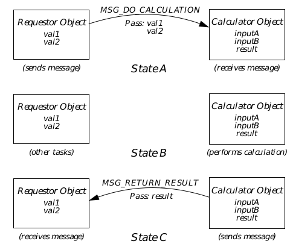

## 3 System Architecture

This chapter describes the structure of GEOS and the various system 
components and services used by applications. Nearly all programmers will 
want at least to browse this chapter before continuing with GEOS application 
development. The structures and architectures of the 8088 and 80x86 
processors are reviewed in Appendix A.

### 3.1 GEOS Overview

GEOS is a state-of-the-art graphical operating system combining the latest 
software technology with numerous innovations. Its tightly coded assembly 
language and object-oriented system turns the humblest 8088-based PCs 
with as little as 512 K of RAM into graphical workstations. On higher-end 
machines, GEOS is in a class by itself-performance on 80286, 80386, and 
80486 machines with extended or expanded memory is exceptional.

Besides being coded entirely in object-oriented assembly language (a concept 
and language developed by Geoworks), GEOS is built on one of the most 
sophisticated operating system architectures available for PCs. Most of the 
GEOS kernel and system is composed of dynamically-linkable libraries; in 
addition, developers can create their own libraries to support entire 
generations of applications.

GEOS also includes true pre-emptive multitasking, multiple threads of 
execution within single applications, built-in outline font technology, and 
drivers for various devices such as printers, mice, video cards, file systems, 
keyboards, parallel and serial ports, task switchers, power management 
systems, and font engines. Development for GEOS is easy and quick; much 
code traditionally required by applications has been provided within the 
system software, thereby reducing time spent by application programmers 
on coding and debugging.

In addition, GEOS employs a breakthrough generic user interface. 
Applications specify their user interface needs, and the system dynamically 
chooses the proper manifestation of the UI at run-time through the use of 
specific UI libraries. Complex drawing and geometry are handled 
automatically by the UI library. The generic UI allows applications to work 
with various UI specifications without being recompiled. Users can choose 
the look and feel they want without burdening the application programmer 
with extra coding.

Among the other advanced features included in GEOS are a single imaging 
model providing true WYSIWYG (a single image is used both for drawing to 
the screen and for printing); automatic scaling and scrolling of displayed 
data; dynamic memory management and virtual memory; an item database 
manager; a graphic object library including support for resize, move and 
scale operations; complex and complete text formatting and editing; 
specialized generic controller objects providing standard user interface and 
functionality; and full network support. Several other mechanisms and 
libraries not mentioned here are also built into the system.

The following sections of this chapter describe many of these concepts and 
implementations, providing a quick-view of the GEOS system as a whole. 
More information may be found on individual topics elsewhere in this 
developer's kit. This chapter provides the background information necessary, 
however, to take full advantage of all that GEOS has to offer the application 
developer.

### 3.2 The System Architecture

The GEOS system as a whole consists of several layers. The topmost layer 
contains applications. Users interact directly with these applications, which 
use dynamic libraries on the next layer. One of the major libraries is the User 
Interface Library, commonly known as the UI. Both the libraries and 
applications interact with the kernel, the heart of the operating system. The 
kernel communicates with device drivers, which function as the final GEOS 
interface to physical devices such as video screens, printers, and file systems. 
For a diagram outlining these layers and some of the components within 
them, see Figure 3-1.

**Figure 3-1** The Layers of GEOS  
_GEOS contains several logical layers of abstraction, from device drivers to 
dynamic libraries to applications. The Kernel is the heart of the operating 
system, managing most interactions between device drivers and applications 
and libraries. Note that this is a simplified diagram, and not all system 
components are represented._

#### 3.2.1 Applications

A GEOS application can take advantage of the various kernel and UI 
mechanisms to provide some set of functionality to the user. An application 
is made up primarily of two parts: The first part defines the application's user 
interface using objects and functions provided by the User Interface Library. 
The second part consists of the code of the application including procedures, 
functions, and object-specific code.

#### 3.2.2 Libraries

GEOS libraries are bodies of code or collections of objects that are 
dynamically loaded into memory when called for by applications or by other 
libraries. The use of libraries reduces the amount of code within application 
resources and increases application performance. In addition, library 
routines and objects may be shared by several different applications at once, 
reducing duplicated code in memory.

Many standard libraries are provided with GEOS and are available to all 
developers. Among these are a text object library, a graphic object library, a 
an import/export library and others. In addition, developers can easily create 
their own libraries with the developer kit tools.

#### 3.2.3 The Kernel

The GEOS kernel is the core of the operating system, providing all the basic 
services needed by the system. It provides multitasking, memory 
management, object creation and manipulation, windowing, process 
management, file system access, inter-application communication, message 
dispatching, and scores of basic graphic primitives. The kernel provides 
nearly 1000 routines usable by applications and libraries, though most 
applications will use only a portion of them.

#### 3.2.4 Device Drivers

GEOS device drivers isolate the system and applications from the specific 
needs and foibles of a user's hardware. Drivers translate the generic actions 
of an application (such as opening a file) into the specific needs of the 
hardware or system in use (such as the specific call to MS-DOS to open the 
file). By isolating the system from hardware specifics, drivers allow GEOS to 
be expanded in the future to use new devices and engines without 
recompiling applications.

Drivers are provided with the system for printers, video cards, mice, 
keyboards, serial and parallel ports, file systems, task switchers, power 
management hardware, and font engines. In the future, developers will be 
able to develop their own drivers for new hardware and file systems.

Most applications and libraries will access drivers through kernel calls. 
Drivers are also accessible to applications and libraries directly.

#### 3.2.5 The User Interface

The GEOS User Interface (UI) is a special entity. While it consists primarily 
of dynamic libraries, it can be thought of as a user interface driver.

Applications define their UI needs in a high-level language (called Goc and 
developed by Geoworks) interpreted by a special C preprocessor. Applications 
in general do not have to manifest windows, scrollbars, buttons, menus, or 
dialog boxes; instead, they use generic objects from the provided UI object 
library. These generic objects have no inherent visual representation; 
instead, they have a strictly-defined functionality and API.

A Specific User Interface library, at run-time, determines the visual 
representation each object takes depending on its context. For example, a 
GenInteraction generic object may appear as a menu, a dialog box, or a 
merely a grouping of other generic UI gadgets. Additionally, a menu 
GenInteraction may be represented as a vertical menu in one Specific UI but 
as a horizontal bar of choices in another.

Although such a system may appear to take some control of the application's 
user interface away from the programmer, in actuality quite the opposite is 
true. The use of a generic UI frees the programmer to concentrate on other 
issues and features without worrying about whether the application 
conforms to one or more specifications. The programmer does not have to 
worry about window positioning or clipping areas (unless he or she wants to), 
and menus and dialog boxes are almost entirely automatic.

Additionally, the programmer can set hints for individual generic objects; 
hints can help the specific UI decide how the object should appear or be 
arranged on the screen. Not all hints are allowed in all specific UIs, so a 
particular specific UI may ignore certain hints while implementing others. 
For example, a dialog box that has three buttons within it may have the hint 
HINT_ORIENT_CHILDREN_VERTICALLY to indicate the buttons should 
appear in a column rather than a row.

### 3.3 Object-Oriented Programming

Object-Oriented Programming (OOP) is a popular way of organizing 
programs, especially programs using graphical user interfaces. GEOS is an 
object-oriented system, programmed entirely in Object Assembly, a 
Geoworks innovation. This section describes the concepts behind OOP and 
how it is implemented in GEOS. If you are familiar with OOP concepts, you 
may skip this section; because terminology can differ from system to system, 
however, you will probably want to at least skim the rest of the section. (A 
full discussion of GEOS messaging and object manipulation can be found in 
section 5.4 of chapter 5.)

Object-Oriented Programming is simply a way to organize code and data 
differently from traditional procedural programming. Anything done with 
procedural programming can be done in an object-oriented way and vice 
versa. However, OOP offers several significant advantages over procedural 
programming:

+ Modularity  
Especially in large systems, modularity can lead to cleaner, more 
manageable, and more easily expandable programs. OOP provides tight 
modularity with each component (object) having a strict API. This 
modularity also makes OOP systems ideal for the multithreaded 
environment of GEOS.

+ Simplicity  
People interact with things individually. Each object in our environment 
has a certain set of characteristics and certain behaviors. OOP systems 
use this point of view as a foundation for programs that are easy to 
understand.

+ Efficiency  
The efficient design of objects in an OOP system can lead to less repetition 
of reusable code. Several objects working independently may use the 
same code, thus reducing the impact on memory usage.

+ Reduction of code  
Because functionality (functions, routines, etc.) is inherited by object 
types from other object types (known as classes), it doesn't have to 
implemented again and again. Instead, one version of the code can exist 
in a particular class and be inherited by other classes, thus reducing 
coding and debugging time.

#### 3.3.1 Objects, Messages, and Methods

Procedural programming uses routines that act with globally-accessible or 
locally-defined data. Those routines must know about other routines in the 
program and must understand the data structure and organization used by 
other routines. Although some amount of isolation is applied to each routine, 
in essence they are all part of the greater whole of the program.

Objects, in their simplest sense, consist of data (instance data) and routines 
(methods) that act on that data. Objects may interact with each other but 
may not alter other objects' instance data; this rule leads to strict modularity 
and cleaner program design. Objects do not need to understand how other 
objects work or how another object's instance data is arranged; instead, only 
the interface to the other object is required.

Objects interact with each other via messages. Messages may indicate status, 
provide notification, pass data, or instruct the recipient to perform an action. 
When an object receives a message, it executes an appropriate method. A 
method may change the object's instance data, send messages to other 
objects, call kernel routines, or perform calculations-anything that can be 
done in a normal program procedure can be done in a method. (Note that 
occasionally the term message handler is used for method.)

Every object is represented by an Object Pointer (optr), a data structure that 
uniquely identifies the object's location in the system. This data structure is 
a combination of two special memory handles that provide abstraction of the 
object's location-this allows the object to be moved in memory or swapped to 
disk, or even saved to and retrieved from files. Object pointers are used to 
identify objects in many situations, the most common being when a message 
is sent. The intended recipient of the message is indicated by its optr.

Objects may interact with each other even if they are in different threads of 
execution. This is made possible by message queues and the kernel's message 
dispatcher. When a message is sent, it is first passed to the kernel's 
dispatcher with the recipient's optr. The dispatcher then puts the message in 
the recipient object's message queue. If other messages have been sent to the 
recipient but not handled yet, then the message will wait in the queue until 
the others have been handled. Otherwise, the message will be handled 
immediately. (For timing-critical messages, the sender can indicate that the 
message must be handled immediately; this is important in a multithreaded 
system.)

A thread is a single entity that runs a certain set of code and maintains a 
certain set of data. Only one thread may be using the processor at any given 
time; when a context switch occurs, one thread loses the processor and 
another takes it over. Each thread may run code for many objects, and an 
application can have several threads.

As an example, Figure 3-2 shows the conceptual model of a Counter object. The 
Counter maintains a single instance data field, currentCount. It also has 
three predefined actions:

+ **CounterIncrementCount()**  
This method handles the message MSG_COUNTER_INCREMENT. Its 
purpose is to increment the currentCount instance data field. When the 
count reaches the maximum (in this case, 100), then the counter resets 
itself.

+ **CounterReturnCur()**  
This method handles the message MSG_COUNTER_RETURN_CUR. It 
returns the value of the currentCount instance data field.

+ **CounterReset()**  
This method handles the message MSG_COUNTER_RESET. It sets the 
currentCount instance data field to zero.

Messages can carry data (parameters) with them and can also have return 
values. For example, if the Counter in the example could be set to an 
arbitrary value (rather than reset to zero), the object sending the set message 
would have to indicate the value to be set. This would be passed in the same 
way as a normal C parameter.

If a message is supposed to return a value to the sender, the sender must 
make sure the message is handled immediately. In this case, the message 
acts like a remote routine call, blocking the thread of the caller until the 
message has been handled and the value returned.

**Figure 3-2** A Sample Counter Object  
_This counter object handles three messages and maintains a single instance 
data field. Any object may send the messages; in this way, a single counter can 
be used by several objects (not necessarily a desirable thing). Receipt of a 
message invokes the appropriate method._

Objects can also share data when necessary. Rather than share instance 
data, however, each object can have an instance data field containing the 
handle of a sharable block of memory holding the subject data. Then each 
object could access the shared block through the normal memory manager. 
Handles are offsets into a table maintained by the kernel; this table contains 
pointers to the actual memory. This abstraction of the pointer allows the 
kernel to move the memory block around without forcing everything else to 
update their pointers. Handles can also be passed as message parameters, 
allowing large blocks of data to be passed along from object to object.

Figure 3-3 shows an example of two objects interacting via messages. In this 
example, the Requestor object requires the Calculator object to perform a 
calculation given two numbers. However, since the timing of the calculation 
is not critical, the result is not returned but is instead sent back by the 
Calculator object in a subsequent message. This allows the Requestor object 
to continue with other tasks until the result is ready. (Note that if the 
Calculator object could be used by more than one requestor, it would have to 
also be passed the requestor's object pointer. Otherwise, it would have no 
idea where to send the return message. This example assumes the Calculator 
object is used by only the one requestor and inherently knows the requestor's 
optr.)

**Figure 3-3** Objects Using Messages  
_The Requestor object sends MSG_DO_CALCULATION to the Calculator, 
passing the values in its instance data fields val1 and val2 (State A). The 
Requestor then does other tasks while the Calculator performs the calculation 
(State B). When the calculation is finished, the Calculator sends the result 
back to the Requestor with MSG_RETURN_RESULT (State C)._

#### 3.3.2 Classes and Inheritance

If every object had to be coded and debugged once for each time it was used, 
OOP would provide few benefits over standard procedural programming. 
Many objects share similar functionality and could easily make use of the 
same code over and over again. The concepts of class and inheritance allow 
objects with similar data structures and methods to use common code.

The class is actually where the functionality of objects is defined. Every 
object is simply an instance of a class, a manifestation of the instance data 
and methods defined for the class. For example, the Counter object of 
"Objects, Messages, and Methods" on page 69 could be an instance of a class 
called CounterClass. Other counters sharing the same characteristics 
would also be instances of CounterClass, each having its own value in its 
own instance data field.

A main benefit of the implementation of classes in GEOS is that objects can 
be created and destroyed during execution. Class definitions are stored 
separately from an individual instance's data; each instance knows where its 
class is located. Therefore, if two instances of a particular class exist, they 
both point to a single copy of the class definition. Since the code is stored in 
the class definition, the instances can use up only as much memory as their 
data fields require; each instance does not need to store its own method code.

Another, more powerful, benefit is gained through the implementation of 
inheritance. In many cases, objects will be similar but not identical. This 
means that their classes are also similar but not identical. Inheritance 
overcomes this problem through the use of superclasses and subclasses.

A class provides a certain set of instance data and methods. A subclass 
inherits all the instance data structures and methods of its superclass, 
modifying or enhancing them to provide some different functionality.

Take, for example, the class CounterClass. An instance of this class would 
provide a counter with certain features: The counter goes from zero to 100, it 
can be reset manually, it resets automatically when it reaches 100, and its 
value is retrieved with the use of a certain message. However, suppose we 
need a counter that does all those things and allows the counter to be set to 
an arbitrary value with the use of a new message.

**Figure 3-4** A SampleSubclass  
_CounterSetClass is a subclass of CounterClass, thereby inheriting the 
instance data field and the three methods of that class. It also creates a new 
method, CounterSet, that takes one parameter and sets the currentCount field 
accordingly._

Without inheritance, we would have to write all the code for CounterClass 
over again as a new class, adding the new method. However, by creating a 
subclass of CounterClass (let's call it CounterSetClass), we can inherit all 
the methods and data structures of CounterClass without recoding them. 
Instead, we simply add the new message and the code for the new method. 
(It is also possible to modify inherited methods in a subclass.) This example 
of CounterClass and CounterSetClass is shown in Figure 3-4.

The inheritance implemented in GEOS is actually much more complex and 
sophisticated than this simple example shows. You may never need to know 
more than the above concepts, however.

GEOS classes may be of a special type known as a variant. Variant classes do 
not initially know what their superclass is; instead, the superclass is 
determined by context for each instance of the variant class. This is a 
complicated topic that is discussed later in the documentation.

### 3.4 Multitasking and Multithreading

Multitasking is the ability to have multiple processes running 
simultaneously on a single system. In actuality, PCs have only one processor 
and only one task can run at any given moment; the operating system must 
manage the processor and allocate time to all the different programs running 
at once.

A thread is a single entity that runs in the GEOS system. Threads may be 
event-driven or procedural. An event-driven thread runs objects and has a 
message queue (also called an event queue). The thread receives messages 
for its objects and is only active when the objects are handling the messages. 
If an event-driven thread never receives a message, it will never use the 
processor. Procedural threads execute sequential code such as functions or 
procedures in C. Procedural threads do not have a message queue and do not 
run objects.

Cooperative multitasking, used in some operating systems, requires all 
processes running to cooperate with the operating system. The system has a 
routine which each process must call periodically; this routine (called a 
Context Switch routine) checks if any other processes are waiting to run. If 
other processes are waiting, priorities are checked and the process with the 
highest priority takes over the processor.

GEOS uses preemptive multitasking, in which threads are given the illusion 
that they have nonstop access to the processor. A preemptive system 
periodically interrupts the thread running and checks for other waiting 
threads; if there are any, the system will switch context automatically. 
Programs do not have to call a context switch routine, a cumbersome 
requirement in many cases.

GEOS also maintains a knowledge of thread priority. Every thread (including 
the kernel and user interface) has a base priority and a current priority; the 
base priority rarely changes, while the current priority decreases with recent 
processor usage. GEOS maintains these priorities intelligently, making sure 
that no thread ever uses the CPU more than its share of the time.

Any application running in GEOS may have multiple threads. This is useful, 
for example, in a spreadsheet application, where complex and 
time-consuming calculations may be done by a background thread that 
wakes up only when calculations need to be made. Use of multiple threads 
can make the application appear to be extraordinarily fast; the user can 
continue to navigate menus and use other UI gadgetry while the application 
is also doing something else.

### 3.5 The GEOS User Interface

The GEOS User Interface (UI) maintains the interaction between each 
application and the user. It provides several necessary and many extra 
services for applications, relieving programmers from building much of the 
basic UI functionality into their applications. The structure, components, and 
services of the GEOS UI are outlined below.

#### 3.5.1 The Generic User Interface

A User Interface (UI) specification is, essentially, a set of rules and 
conventions used to determine the interaction between a user and an 
application. Over the years, UI specifications have evolved from basic 
command-line shells to the standard graphical and pen-based systems in use 
today. No doubt you have come across several graphical UI specifications 
currently in use-Macintosh, Open Look, Presentation Manager, and 
OSF/Motif are a few examples.

Each of these specifications represents a particular implementation of the 
basic functionality required for application-user interaction. The basic 
functions are similar; only the implementation is different. Therefore, each 
of these specifications is referred to as a Specific UI.

GEOS employs a Generic UI-an implementation-independent way of 
defining an application's user interface. To the user, this means a single 
application executable can be used in any of several specific UI 
implementations. To the developer, this means relief from many of the UI 
definition tasks normally associated with graphical user interfaces.

The Generic UI can be thought of as a UI driver-a layer of abstraction 
between the application and the UI implementation. The programmer 
defines his needs in terms of basic functionality and user involvement, 
leaving the actual implementation (decisions about color, shape, menu 
structure, etc.) up to the system at run-time.

The application defines its UI by selecting certain objects from the Generic UI 
Library. Each of these objects has certain attributes that determine its 
specific implementation. In addition, each generic object may be assigned 
hints. Hints help the Specific UI Library determine the proper context and 
subjective information required to fully flesh out the proper manifestation of 
each generic object (for example, a GenPrimary window object can have 
special sizing restrictions suggested with various hints such as 
HINT_FIXED_SIZE and HINT_INITIAL_SIZE).

##### 3.5.1.1 Attributes

Attributes represent objective information which does not change with the 
specific UI in use. In general, attributes determine the basic functionality of 
the object regardless of its manifestation on the screen. For example, a 
GenView may have its scrollable attribute set; this means that in all Specific 
UIs, the View will have some sort of scrollers. However, one Specific UI might 
implement the scrollers as bars and another might implement them as dials 
or cranks.

Attributes are always allocated space in an object's instance data regardless 
of whether the attribute it set. For example, all GenView objects have a bit 
specifying whether it is scrollable or not. Attributes are used, therefore, 
primarily for determining the object's functionality rather than its 
appearance.

##### 3.5.1.2 Hints

Hints represent subjective or contextual information about objects. Hints are 
different from attributes in two main aspects: First, hints may be ignored by 
certain Specific UIs. Suppose, for example, that a given Specific UI only 
allowed horizontal ordering of components within dialog boxes. This specific 
UI would ignore the hint HINT_ORIENT_CHILDREN_VERTICALLY applied to 
any GenInteraction object implemented as a dialog box.

Second, hints are dynamically added to each object's instance data in a 
special format known as variable data. Variable data fields are not allocated 
within the object's instance data unless they are used. Thus, objects with 
fewer hints use less memory. Attributes, on the other hand, must exist in the 
object's instance data whether they are used or not, and they therefore 
require a given amount of memory.

##### 3.5.1.3 The Generic UI Classes

The Generic UI Library contains a number of object classes that implement 
nearly all the UI functions an application will ever need. For a full description 
of the API of each of these classes, see the Objects Book. Some of the more 
common implementations (e.g. menus, dialog boxes, and scrolling views) of 
these objects are outlined in the sections below.

#### 3.5.2 The Scalable User Interface

As application technology advances, applications gain more and more 
features. Despite recent improvements in user-friendliness, however, 
over-featured applications can sometimes intimidate and frustrate users.

GEOS therefore implements a Scalable User Interface, a system in which a 
single application's source code can be compiled into different versions of the 
application, each version at a different level of complexity. Scalability of 
applications is shown in Geoworks Pro-the appliances are all created from 
exactly the same source code as the advanced versions of those applications.

#### 3.5.3 Windows and Window Management

A window is an object that defines an area on the screen in which drawing 
and user interaction can occur. Windows may be resizable and movable, and 
automatically clip any drawing so it does not appear outside the window's 
edges.

The GEOS Window Manager maintains information about the size, shape, 
and visibility of all the windows in the system. In general, applications do not 
access the Window Manager directly; instead, generic UI objects and the 
kernel handle all window manipulation. Several different types of generic 
objects are "window" objects: GenPrimary is used as an application's primary 
window, GenInteraction is used for dialog boxes and menus, GenDisplay 
displays documents in a scrollable window, and GenView is used to create a 
scrollable graphics window into which an application can draw.

The Window Manager is closely tied to the GEOS Graphic System. These two 
parts of the system handle all window resizing, reshaping, drawing, and 
clipping automatically. They also interact with the User Interface's input 
mechanism to ensure that the proper windows receive the proper input. 
Applications do not need to know the shape, position, or size of a window 
when drawing inside it.

Applications can also allocate one or more windows in which they can present 
data (text, graphics, or other information). Each of these windows is called a 
View and is an instance of the GenView object (see below). The View manages 
all scrolling, scaling, sizing, and clipping automatically for the application; 
programmers don't have to worry about managing scrollbars or window size 
in order to ensure the proper portion of the data is drawn. Additionally, 
applications can modify any of the scrolling, scaling, or sizing behavior with 
a little effort to provide custom functionality.

#### 3.5.4 Input

GEOS has an input manager that tracks the mouse, gets keyboard input, and 
passes the input events on to the proper windows and objects on the screen. 
The input manager is part of the UI.

The UI keeps track of three different active objects in the system: the Focus, 
the Target, and the Model. The focus is the active object that should receive 
all keyboard input. The target is the currently selected object with which the 
user can interact. The model represents a non-visible "selection" that can be 
maintained by the application. These three active objects can be accessed 
directly by other objects (e.g. menu items); for example, a "change color" 
menu item may want to work on whatever object is currently active-it 
would want to change the color of the target object, and by contacting the 
target directly, it does not have to know what object is the target.

Any object in the system can grab mouse or keyboard events. When an object 
has been granted a mouse grab or keyboard grab, it will receive the events 
until it relinquishes the grab. This fact is most useful when dealing with 
visible object trees inside a View (see GenView, below)-generic objects 
handle input automatically (including the Text objects).

Applications may or may not need to handle input directly; complex 
applications likely will want to filter certain input or handle special cases. 
Simple applications or utilities will probably not have to deal with input 
(keyboard or mouse events) directly at all.

#### 3.5.5 Menus and Dialog Boxes

Among the generic objects of the GEOS UI library is GenInteraction. This 
object can be used to implement menus, dialog boxes, and error boxes, and it 
can also be used for grouping and arranging other generic objects (such as 
triggers, lists, etc.). It provides extreme flexibility and functionality, and 
experienced programmers can usually get a menu and dialog structure up on 
the screen quickly just by setting a few attributes.

Remember that because the Interaction is a generic object, the Generic UI 
and Specific UI libraries will translate it into its proper implementation at 
run-time. The Interaction serves the primary purpose of grouping objects; 
the grouping may be implemented in various ways (e.g. a menu or a dialog 
box) depending on the attributes and hints applied.

The sections below outline some of the practical functionality of these objects; 
for a full description of what these do and how they can be used, see the 
Object Reference Book.

##### 3.5.5.1 Menus

Menus in GEOS are subject to the rules and conventions of the specific UI in 
use by the user. However, several basic concepts are supported. (See 
Figure 3-5 for an illustration of sample menus.)

+ Standard menus  
Some specific UIs have differing menu structures. Therefore, several 
standard generic menus (e.g. the File menu) can be implemented by 
giving the menu a standard set of attributes. The UI will automatically 
build and manage this menu according to the UI specification in use at 
the time.

 

**Figure 3-5** Sample OSF/Motif Menus  
The menu at right is a "standard" menu created 
almost entirely by the UI. The menu above shows 
cascading menus as well as lists. Items followed by 
ellipses bring up dialog boxes.

+ Cascading or nested menus  
Because Interactions may be nested, cascading (or nested) menus are 
easy to implement. Cascading menus are useful if an application has 
many menu items that may logically be grouped into different areas of 
functionality.

+ Keyboard accelerators  
Because the UI manages both input and menus, you can easily specify 
accelerator keystrokes for each menu item. When the user hits the proper 
keystrokes, the same action is performed as if the user had clicked on the 
associated menu item. This happens automatically without additional 
application code.

+ Keyboard menu navigation  
Every menu item may have a character that the user may press during 
keyboard navigation. This is important because it allows users to use 
your entire application without having a mouse.

+ Lists and checkboxes within menus  
Menus may contain not only triggers but also lists of items. Lists are 
implemented with the GenItemGroup, GenItem, GenBooleanGroup, and 
GenBoolean generic objects. Lists may be exclusive or not, and each entry 
may have a checkbox indicating its on/off status. Again, all these 
functions are determined by the attributes set for the interaction and 
item objects.

+ Menu items that bring up dialog boxes  
By setting certain attributes in an interaction, you can create menu 
items that automatically bring up dialog boxes. The UI will put a trigger 
in the menu representing the dialog box, and when the trigger is 
activated, the UI will put up the box.

+ Pin-up menus  
In the OSF/Motif implementation of GEOS, all menus are automatically 
given the ability to be pinned in place and moved around the screen. 
Because this is a function of the specific UI, applications are completely 
unaware of the fact.

##### 3.5.5.2 Dialog Boxes

Dialog boxes are standard ways of having an application interact with the 
user. For example, a dialog box may contain a number of controls that 
determine how the application displays its data. See Figure 3-6 for an 
illustration of sample dialog boxes.

Dialog boxes, like menus, are implemented through the use of 
GenInteraction objects. Applications may also call a kernel routine that will 
put up standard dialogs in certain situations (e.g. errors or warnings).

Several features of dialog boxes are implemented automatically with very 
little additional code in the application:

+ Automatic geometry management  
When a dialog box contains generic objects (e.g. triggers, lists, and text 
fields), all geometry is handled automatically. By using various hints, you 
can modify the normal organization, but sizing and placement of the 
generic objects and the dialog box are entirely automatic.

+ Standard response triggers and reply bars  
Just as there are standard menu types, UI specifications often include 
rules for dialog box response triggers (e.g., the "OK" button on the left and 
a "Cancel" button on the right). Standard response triggers normally 
appear in an area of the dialog box known as the "reply bar." You can set 
up a reply bar with standard attributes that will automatically be 
implemented properly by the UI. As an alternative, you can even use 
pre-defined dialog box types that have their own reply bars.

+ Modality  
Sometimes, dialog boxes require a user action before the application or 
system can continue with other tasks. Dialog boxes can have various 
modality states: system-modal, which does not allow the user to interact 
with anything but the dialog box; application-modal, which allows the 
user to switch to other applications but disallows interaction within the 
dialog's application (except for the dialog box); and non-modal, which 
allows the user to switch to any other part of the system.

 

**Figure 3-6** Sample OSF/Motif Dialog Boxes  
The above dialog box is a standard, modal dialog. That to the right 
demonstrates the concept of the standard response triggers and automatic 
geometry management (the box is sized to fit all the objects).

+ Standard dialog types  
To increase the amount of standardization across all applications, GEOS 
includes several standard dialog box types accessible through the use of 
UI routines. These include errors, warnings, and questions. Also, you can 
call up custom dialog boxes with special kernel routines.

#### 3.5.6 Scrolling Views

Although the basic generic objects provided by GEOS are powerful and useful 
in many situations, applications still need a way to display their own specific 
data. In most systems, this consists of allocating a window for the 
application's use and then implementing additional functionality for that 
window-scrolling, scaling, and document management.

The GenView generic object does all these things for an application. The 
application can allocate any number of views for its own use, and each view 
can display anything from regular graphics to hierarchies of visible objects.

Most applications will use at least one view. Its power and flexibility give 
programmers the opportunity to concentrate on their own application's 
functionality without having to worry about display issues such as scaling, 
clipping, and scrolling-they are all handled automatically. Some of the 
features of a view are listed below (see "GenView," Chapter 9 of the Object 
Reference Book for more detailed information):

+ Automatic clipping and updating  
When an application uses a GenView, the programmer can forget the 
worries involved in figuring out which portions of his document need to 
be redrawn when. The GEOS Window Manager will automatically clip 
the document to the View's boundaries and will notify the application 
whenever a portion of the View has become invalid (whether by scrolling, 
sizing, moving, or being uncovered by movement of another object). The 
application simply must draw the document whenever notified that a 
portion has become invalid; it does not have to do any calculations 
regarding what is visible on the screen (though it might if the document 
is especially complex).

+ Automatic scrolling  
By setting two attributes in a GenView's definition, an application can 
automatically make its view scrollable. The UI will automatically create 
scroller objects that will interact directly with the view-the application 
never has to know how far or in what direction the view has been scrolled. 
It simply will receive a message saying that the window has been 
invalidated and needs to be redrawn.

+ Automatic scaling  
The view provides automatic scaling of the contents of its window. The 
application may request scalings or include a standard controller to let 
the user control this transparently to the application.

+ Automatic sizing  
The Geometry Manager will automatically size the view to fit within its 
parent window. When the parent is resized, the view will follow. This 
process is transparent to applications. However, applications can 
customize this behavior by setting a fixed or desired size or by altering 
the sizing behavior of the view. They can also override this to make the 
parent window follow the view's size.

+ Comprehensive input management  
Many applications will display objects within a view. In many cases, 
these objects will require input (e.g. the cards in Solitaire). The view gets 
input events from the User Interface and can pass them on to the proper 
objects in the hierarchy.

+ Flexibility  
All the functions described above may be customized. Scrolling, for 
example, can be tracked and altered. Custom scroller objects can be 
defined in place of the automatically-generated scrollers. Sizing behavior 
can be adjusted. If necessary, you could get the view's bounds in order to 
draw only the visible portion of your document (though this often does 
not increase drawing performance significantly).

+ Customizable background color  
Each view has a default background color determined by the specific UI. 
This can, however, be set to any RGB value or to any GEOS color index. 
This is used, for example, in Solitaire to create the green background (so 
the application does not have to draw green under all the other objects).

#### 3.5.7 Visible Object Classes

Many applications will need to create objects that draw themselves and 
interact directly with the user. Rather than forcing the programmer to create 
each of his objects from scratch, GEOS offers several visible object classes 
that already understand several system services and constructs. When an 
application needs a visible object, it simply defines a subclass of one of these 
visible classes, thus ensuring that his object will handle all the UI messages 
that may be sent to it.

#### 3.5.8 Geometry Manager

The GEOS User Interface includes a sophisticated Geometry Manager that 
does all the calculations for organization of objects on the screen. The 
Geometry Manager manages the positions of generic UI objects in dialog 
boxes and windows, for example, and it can be used to automatically position 
visible objects within a view.

#### 3.5.9 Lists

The GenItem, GenItemGroup, GenBoolean, GenBooleanGroup, and 
GenDynamicList objects can be used to provide several different types and 
styles of lists. Lists may appear within menus or dialog boxes. The actual 
visual implementation of a list depends on the specific UI in use; however, 
there are several basic types of lists available (for complete information, see 
"The List Objects," Chapter 11 of the Object Reference Book):

+ Dynamic lists  
Lists can be either static (a set number of elements) or dynamic (a 
varying number of elements).

+ Scrolling lists  
Scrolling lists are usually implemented for long lists or dynamic lists.

+ Exclusive lists  
Exclusive lists have one and only one element chosen at all times.

+ Non-exclusive lists  
Non-exclusive lists may have any number of elements set at a time. Each 
element is set or reset independently of the others.

+ Non-exclusive lists with override  
Non-exclusive lists with an override have a non-exclusive list with an 
additional element that overrides all the others (an example is the text 
styles menu-the "Plain" option overrides each of the others).

#### 3.5.10 Other Gadgets

Besides the objects listed above, the generic UI supplies a number of other 
gadgets. These include

+ Text Display and Edit Objects  
The GenText object provides a full-featured word processing object. It can 
be used for every text function from displaying a word to implementing a 
simple yet full-featured word processor. It supports multiple styles and 
paragraph attributes, character and paragraph spacing, and all the other 
features supported in the Text Library (see section 3.6.6 on page 98.)

+ Triggers  
The GenTrigger object implements all the functionality of a simple 
push-button. When a trigger is pressed, it sends a message to a 
pre-specified object.

+ Value  
The GenValue object allows the user to set a value within a given range.

+ Controllers and Tool Boxes  
The GenControl and GenToolControl objects allow an application to set 
up controllers that provide standard menu entries and their associated 
features. For example, the GenEditControl object creates the standard 
Edit menu with Cut, Copy, and Paste triggers. The GenToolControl object 
allows the user to specify which items in which controllers may be 
displayed within a floating tool box.

+ File Selector  
The GenFileSelector provides all the features of a file selector dialog box 
that allows the user to traverse their file system's directories and select 
a file.

#### 3.5.11 Managing Documents and Files

Most applications will save data files. GEOS provides a convenient storage 
format for data files and an even more convenient mechanism for managing 
the files.

The Document Control objects interact with the GEOS file system and virtual 
memory system to implement the Open, Close, Save, Save-As, and Revert 
functions of the File menu as well as many other common document-related 
features. In fact, the Document Control also controls user interaction for 
these basic functions, creating and updating the File menu and putting up 
the proper dialog boxes for each operation.

The Document Control objects, like GenView and other components of GEOS, 
take basic functionality common to most applications and implement it in the 
system software. Using a Document Control for your data file management 
can save weeks of coding and debugging time.

#### 3.5.12 Multiple Document Interface

Some applications may benefit from allowing the user to have multiple data 
files open at any given time. GeoWrite and GeoDraw, for example, allow the 
user to work with multiple documents at once. Each document appears 
within its own window; each of these windows is a GenDisplay object within 
a Display Control object.

The Display Control objects, like the Document Control objects, allow 
applications to use multiple data files with a minimum of extra coding. The 
Display Control works closely with the Document Control to ensure that the 
proper data files are being operated on at all times. The Display Control also 
creates and maintains the Window menu, just as the Document Control 
creates and maintains the File menu.

#### 3.5.13 Clipboard and Quick-Transfer

A common feature of GUIs is the Clipboard. Users can copy or cut data out of 
documents for pasting into other documents (or even the same document) 
later. When data is cut or copied, it is placed in a transfer item, a special data 
structure used by the Clipboard. All applications can access the Clipboard via 
Cut, Copy, and Paste; in addition, the Edit menu can be implemented 
automatically with the use of a GenEditControl object.

GEOS also offers another method of transferring data-the quick-transfer 
mechanism. In OSF/Motif, the user clicks the move/copy button (in most cases 
the right mouse button) over some selected data. He can then drag to another 
area and drop the selected data, either moving or copying it depending on 
certain contextual factors. Applications may or may not support the 
quick-transfer mechanism, though supporting it is not difficult and is 
strongly encouraged.

Both the Clipboard and the quick-transfer mechanism are supported 
automatically by all text edit and display objects. Applications may define 
their own custom data formats (transfer items) for use with both the 
Clipboard and the quick-transfer mechanism.

#### 3.5.14 General Change Notification

In a multithreaded system, one thread may change some information that 
another thread depends on. In this case, the thread that makes the change 
must notify all other users of the information that it has been changed and 
that they must update their status appropriately.

GEOS provides a mechanism for allowing all threads or objects to register for 
notification of certain events. For example, GeoManager is notified of all file 
system changes so it can update its display in real time. Although notification 
is automatically sent for certain system changes, applications can set up an 
automatic notification of custom changes. For example, if a multiuser 
network game depended on each user knowing a certain status flag, 
automatic notification could be set up to notify all the users whenever any 
user changed it.

#### 3.5.15 Help Object

On-line help is a convenient and powerful way to provide documentation to 
your users. Because graphical user interfaces are easy to understand, many 
users do not read documentation and prefer to discover an application's 
features on their own. On-line help can speed their learning process up.

GEOS provides an object that you can include in your User Interface that will 
automatically create a "Help" icon or menu item and display help text when 
that item is invoked. The help text displayed will be context-sensitive as 
defined by the application. The application simply has to provide the help 
text and a few other attributes of the help object, and the system will take 
care of displaying the help when the user requests it.

### 3.6 System Services

GEOS provides a number of services useful or necessary to applications. 
These services range from dynamic memory management to an item 
database to a sophisticated graphics system and a print spooler. Many of the 
most useful or integral services are described in this section.

#### 3.6.1 Memory

GEOS uses all RAM available to the system, even expanded and extended 
memory. Memory is managed by the kernel and is accessed in the segmented 
scheme implemented by the 8086 processor. (The protected mode of the more 
advanced processors is not supported in the Version 2.0 system software but 
is expected to be in future releases.)

The GEOS Memory Manager is sophisticated. It uses dynamic allocation and 
access of blocks on a global heap to provide high performance, optimized to 
run very efficiently even on systems with only 640 K.

##### 3.6.1.1 Handles

GEOS maintains control of all the memory, objects, and other entities in the 
system through the Handle Table. The Handle Table is a section of memory 
set aside for kernel use, and it contains a number of entries, each 16 bytes 
that can contain various information about many different items in the 
system. These entries are accessed by handles, 16-bit offsets into the Handle 
Table. Applications and libraries may use handles but may not access the 
contents of a handle table entry. The data structure is opaque to all but the 
kernel.

Handles are used for many different things. They can reference threads, 
memory blocks, VM blocks, or files; they can represent data structures such 
as timers, queues, semaphores, or events (messages); and they can be used 
by the kernel for optimization (such as when several words of data are passed 
with a message).

Through the Preferences application, a user can set the number of handles in 
the Handle Table. However, the size of the table does not change during a 
single execution of GEOS. Applications and libraries may allocate handles 
dynamically for most of the above-mentioned purposes (e.g. memory and file 
reference).

##### 3.6.1.2 The Global Heap

A certain amount of memory is set aside for the file system (DOS, typically), 
the GEOS kernel (approximately 64 K), and any TSRs the user may have 
running on his system. Above this is the GEOS handle table. All RAM left (up 
to 1 megabyte) after these requirements are satisfied is used for the global 
heap (RAM over 1 megabyte is used as preferred swap space). The global heap 
is the space available to all the applications running in the system.

Applications allocate dynamic blocks of memory on the heap. Blocks may be 
of arbitrary size between 16 bytes and 64 K. Each block is designated a 
handle, an offset into the handle table where information about the block 
(such as size and location) is stored. Because blocks may be shuffled in the 
heap by the Memory Manager, applications must use handles as indirect 
references to the blocks; applications should not save pointers to specific 
locations in memory.

GEOS uses four basic types of blocks:

+ Fixed  
A fixed block will never move or swap out to disk. Having many fixed 
blocks can seriously degrade system performance. Fixed blocks are 
generally used for an application's global variables and primary code.

+ Moveable  
Moveable blocks may be shuffled around the heap. Moveable blocks may 
also be designated discardable and/or swapable (below). These blocks 
must be locked into memory before they can be accessed (see below).

+ Discardable  
Discardable blocks may be flushed whenever the Memory Manager 
requires more memory.

+ Swapable  
Swapable blocks may be swapped at any time by the Memory Manager. 
When a subsequent access is made to a swapped block, the Memory 
Manager will automatically read the block back into memory.

##### 3.6.1.3 Allocating Memory

The GEOS kernel provides several routines to allocate memory. Some 
memory is allocated automatically, such as memory for code resources as 
they are loaded in. Other memory, however, must be allocated as it is needed 
during execution-for example, as the user types more and more text into a 
word processor. There are three basic ways to allocate memory on the heap:

+ **MemAlloc()**  
This routine allocates a new block on the heap for an application's use.

+ **MemReAlloc()**  
This routine reallocates a given block; this is useful for adding memory 
to a block already allocated.

+ **malloc()**  
Although use of malloc() may help in porting previous C code to GEOS, 
it is discouraged. The malloc() routine will allocate small amounts of 
memory within a fixed resource. Extensive use of malloc() leads to large, 
fixed blocks on the heap, degrading system performance.

When an application is done with a memory block, it can free the block with 
the routine MemFree(). This will allow the Memory Manager to free up that 
memory space and re-use the block's handle if required.

##### 3.6.1.4 Accessing Memory

If a block is allocated as fixed, an application can use a far pointer to access 
any byte within the block. However, because fixed blocks are not always 
allocated in the same portion of memory each time an application is loaded, 
applications should not save pointers as state information.

Non-fixed blocks, however, can not be accessed by far pointers without 
locking them into their position in memory. MemLock() will take a block's 
handle and lock the block, thereby assuring that the Memory Manager will 
not move it in the middle of an access. MemLock() provides its caller with a 
far pointer to the block. When access to the block is finished, the thread that 
locked the block must call MemUnlock(), which marks the block as 
unlocked so it may once again be moved or swapped.

#### 3.6.2 Virtual Memory

GEOS implements a powerful virtual memory concept to accomplish both 
memory block swapping and data file storage. Virtual memory (VM) can be 
thought of as a disk-based heap-a VM file is segmented into blocks, each of 
which is designated a VM handle analogous to a global memory handle. When 
a VM block is required by an application, it is locked into memory from the 
file with a call to the kernel routine VMLock(), which loads the VM block into 
memory and locks it on the global heap.

VM is extremely useful for data file storage; indeed, the Document Control 
objects use it extensively.

#### 3.6.3 Local Memory and Object Blocks

Often applications will want to store large numbers of very small data items. 
In these cases, it's cumbersome and inefficient to allocate a global handle and 
a block on the global heap. For these situations, GEOS offers the concept of 
local memory (LMem).

Local memory can be thought of as a mini-heap within a memory block. Each 
individual unit allocated in this mini-heap is known as a chunk, and each 
chunk is designated a chunk handle. Thus, to access any piece of information 
within an LMem block, you need to have the block's global handle and the 
item's chunk handle.

Chunks may be allocated or freed, and any chunk may be moved within an 
LMem heap at any time (e.g. when the LMem heap is compacted). Locked 
LMem heaps may have chunks shuffled only when space is allocated within 
the heap. Access to chunks is gained by locking the LMem block and 
dereferencing the chunk handle. Chunks may be resized, and bytes may be 
added to or removed from chunks.

LMem blocks are used primarily for two purposes: Database files and object 
blocks. Database files are managed by the Item Database Library (see 
below). Object blocks are used extensively by the UI and applications; object 
blocks store objects in memory and often are attached to VM files.

Each object in an object block occupies one chunk. Thus, the combination of 
global handle and chunk handle of an object is known as the Object Pointer 
(optr) of the object. The optr is used to identify the object uniquely in the 
system for all types of access.

#### 3.6.4 Item Database Library

The GEOS database library allows applications to use LMem heaps and VM 
files together easily and cleanly. The database library allows applications to 
add a layer of abstraction to their data files.

An application may allocate database files, logical groups of items within 
those files, and individual items within the groups. The database library 
automatically manages the LMem and VM blocks that implement the 
database, keeping them desirable sizes and moving them into and out of 
memory as needed.

Additionally, items may be allocated as "ungrouped," in which case the 
database manager will intelligently distribute these items among the various 
VM blocks in the database file for efficient access.

#### 3.6.5 Graphics System

The graphics system provided in the GEOS kernel is extremely powerful and 
is designed to make creating graphics simple and fast for applications. It 
includes some advanced concepts and state-of-the-art technology that make 
GEOS rise well above most other GUIs.

##### 3.6.5.1 The Coordinate Space

The GEOS graphics system uses a single imaging model like that used by 
PostScript. Applications and libraries draw their graphics on a generic 
rectangular grid with a resolution of 72 points per inch. When drawing to the 
screen or a printer, the graphics system will translate the graphics 
commands to the highest resolution of the output device, ensuring true 
WYSIWYG output. This system allows programmers to specify their graphics 
in real-world coordinates without worrying about the size of various 
resolution devices.

Normal graphics coordinates are represented by signed, 16-bit integers. 
Normal documents can be up to about nine feet on a side. Additionally, the 
graphics system allows applications to use an extended coordinate system 
(called the large document model) of signed, 32-bit integers. Large documents 
can be up to 900 miles on a side! Large documents, however, can incur a 
certain amount of additional overhead; if you do not need to use large 
documents, you probably should not.

##### 3.6.5.2 Graphic States

To simplify complex drawing, the graphics system maintains a graphics 
state, or GState. GStates can be created or destroyed dynamically to allow 
several different GStates for a given window (only one may be active at any 
given moment, however).

The GState is essentially a data structure that contains all the relevant 
information about the current state of a window. The GState's information 
includes current color, drawing position, angle of rotation, scale, translation 
in the coordinate space, line and fill attributes, clipping paths, text 
attributes, and other items.

Graphics commands are issued relative to a particular GState. For example, 
the command GrDrawEllipse() must be passed a GState so the kernel 
knows exactly how to draw the ellipse; if the current GState is rotated 45 
degrees and has green as its current line color, a green-outlined ellipse will 
be drawn rotated 45 degrees.

Programs may apply transformations to GStates-rotation, translation, or 
scaling. You can also define custom transformation matrixes to apply to your 
GStates if complex operations (e.g. shearing) are required.

##### 3.6.5.3 Graphic Primitives and Graphic Objects

GEOS provides a complete set of graphics drawing primitives including lines, 
arcs, B\E9zier curves, splines, outline-defined text, rectangles, ellipses, 
polylines, polygons, and bitmaps.

GEOS also has a standard library of graphic objects such as those used in 
GeoDraw. These objects (such as rectangle and polygon objects) already 
contain all the code necessary to draw themselves, to respond to user input, 
and to resize, reshape, reposition, and rotate themselves. These objects are 
available to all applications and other libraries, and they provide a powerful 
base of user-interactive graphics tools.

##### 3.6.5.4 Paths

A graphics path in GEOS is a continuous trail that defines the outline of an 
area. A path is an outline description of an arbitrarily shaped area, useful 
when an application must define a mathematically-precise shape. Paths may 
also be filled, combined with other paths, and scaled to any size without loss 
of resolution.

One example of the powerful application of paths is creation of arbitrary 
clipping regions. It is possible, for example, to clip drawings to an ellipse, to 
a bezier curve, or even to text.

##### 3.6.5.5 Regions

Regions perform essentially the same function as paths-definition of an 
arbitrarily shaped area or clipping region. However, because regions are 
defined as resolution-dependent, they are typically used only for optimized 
drawing of UI gadgetry.

##### 3.6.5.6 Graphics Strings

A graphics string (or GString) is a collection of graphics commands; GStrings 
are useful for saving complex graphic operations and playing them back 
later. GStrings are created by calling a special routine and are then filled by 
executing graphics commands just as if you were drawing to the screen. 
GStrings may be pre-defined in source code as data resources to be played 
during execution.

GStrings are extremely useful for sharing graphic data between processes. 
For example, applications use GStrings to define their program icons, which 
may then be displayed by File Manager applications. The Clipboard supports 
the GString data format for cut, copy, and paste operations. GStrings are also 
flexible-they may contain comments and may be set up to be executed with 
parameters.

##### 3.6.5.7 Bitmaps

Bitmaps are pixel-by-pixel images defined at a specific resolution; they are 
automatically scaled to match the resolution of the display. Bitmaps are used 
in general to define complicated pictures, usually with many colors.

GEOS allows the creation of bitmaps with specified resolutions. Bitmaps can 
be created off-screen and may be edited with standard graphics system 
commands. Bitmaps are used mainly as monikers of generic objects and as 
icons for applications and data files.

##### 3.6.5.8 Color

GEOS allows applications to specify colors in two ways: with the system 
palette and with RGB values. The palette contains 256 entries, each of which 
is given a standard RGB value. If an application only uses 256 colors, it can 
modify the palette so it has the colors it needs. If an application uses more 
than 256 colors, it can specify any RGB value for any given graphics 
operation. The palette may also be expanded to support other color models. 
If the system palette is not sufficient, each application may create its own.

#### 3.6.6 Text

Text in GEOS is handled by the Text Object, a sophisticated and powerful 
object that is the base for both the GenText and the VisText classes. The Text 
Object handles more situations than most applications will ever face; only 
powerful word processors and text-formatting programs may require more 
functionality. Those that require additional features can subclass the text 
object and add those features.

The Text Object implements text editing, manipulation, and display for 
GEOS. It represents a major portion of the system software and as such 
should be used by all applications that plan on providing any text-editing 
features. Among its many features are

+ Display and Text Wrapping Within Editable Bounds  
The Text Object is aware of its visible bounds and will wrap text 
appropriately to fit within the bounds. If the Text Object is given a set 
width, it will wrap text appropriately to that width.

+ "Editable" and "Selectable" Attributes  
The Text Object allows users to select and edit text. It can also act as a 
display-only object or a display-with-select object.

+ Character and Paragraph Formatting  
Sophisticated and extensive formatting options are included with the 
Text Object such as: Font selection, text styles (underline, bold, italic, 
etc.), text size (from four to 792 points), adjustable track kerning, text 
color, justification, adjustable margins, tabs with settable features (such 
as leaders, lines, and justification), paragraph borders, paragraph 
background colors, and paragraph spacing. All of these formatting 
options are settable and changeable.

+ Full Keyboard Editing  
The Text Object implements all the features necessary for editing text 
with the keyboard.

+ Embedded Graphics  
The Text Object can hold embedded graphics and graphics strings and 
display them properly.

+ Support for the Clipboard and Quick-Transfer  
The Text Object automatically supports the quick-transfer mechanism of 
the UI and handles the cut, copy, and paste commands of the Edit menu.

+ Many other powerful features  
For full feature listings and how to use the text object, see "The Text 
Objects," Chapter 10 of the Object Reference Book.

#### 3.6.7 Print Spooler and Printing

GEOS contains a print spooler that manages printing for all applications in 
the system. The spooler executes in its own threads and manages a print 
output queue for each printer connected to the system. The spooler also 
provides standard user interface components such as the print dialog box. 
Applications can customize the print dialog box by adding their own gadgetry 
for certain types of printing (such as the customizations in GeoDex and 
GeoPlanner).

For the application, printing is essentially the same task as drawing to the 
screen; all the same graphics commands are used. The only difference is that 
the output is sent to a spool file rather than to the screen.

If the paper size in a user's printer is different from the size of the document 
being printed, the spooler will do all the calculations and operations 
necessary to print the document properly. For example, a document eleven 
inches by seventeen inches will be rotated and printed on two standard-sized 
sheets of paper.

#### 3.6.8 Timers

The GEOS kernel allows applications and libraries to set up different types of 
timers that can be used for various purposes. When a timer ticks, it calls a 
routine specified by the geode that initiated it. The different types of timers 
that can be set up include

**one-shot** A timer that executes the specified routine once.

**continual** A timer that calls the routine once every given time period.

**message** Either a one-shot or continual timer that sends a specified 
message rather than call a specified routine.

**millisecond** A one-shot timer with millisecond accuracy.

**sleep** A timer that puts the calling thread to sleep for a given length 
of time.

**semaphore** A timer that provides a "time-out" for a given semaphore queue 
(if the thread does not gain the semaphore in the given length 
of time, it is removed from the queue).

#### 3.6.9 Streams

Streams are like one-way pipes that allow a thread to send data to or receive 
data from another thread or I/O port. Typically, streams are used when 
dealing with serial or parallel ports; however, they may also be used for 
communication between two threads.

GEOS has a Stream Driver that manages input to and output from streams. 
Additionally, a Parallel Driver manages output to a parallel port, and a Serial 
Driver manages input from and output to a serial port.

#### 3.6.10 Math support

GEOS has a number of routines that accomplish complex mathematical 
calculations. There are also routines that do matrix manipulation and 
complicated linear algebra operations. In addition, the system provides a 
library of routines to implement simple fixed-point math and complicated 
floating-point operations.

#### 3.6.11 International Support

International markets are extremely important to Geoworks due to the large 
number of PCs in use in countries other than the United States. Therefore, 
localization of applications was made a priority when designing the system 
software.

GEOS provides a number of tools for localizing your code. The most important 
is the GEOS application ResEdit, which allows a programmer to edit data 
resources. When an application is programmed correctly, translation can 
easily be accomplished by a support team.

The GEOS kernel also contains a number of routines that allow applications 
to access different DOS character sets. These routines ensure that an 
English-language program will work on machines with different DOS 
character sets.

### 3.7 Libraries

The use of dynamically-linkable libraries is key to the efficiency of GEOS 
applications. Several libraries are included in addition to the libraries 
provided by the kernel (such as the Graphic Object Library and the Database 
Library, discussed earlier):

+ Import/Export Library  
The Impex Library ("impex") contains a number of utilities to convert 
standard data files into GEOS data files and vice versa.

+ Sound Library  
GEOS provides a number of standard sounds and a small library 
("sound") to play individual notes on the PC's internal speaker. 

+ Ruler Object Library  
The Ruler library ("ruler") provides a ruler that applications can use 
along with a View. It can be set to different measurement units and scales 
and scrolls itself along with the scale and position of the View.

+ Cell Library  
The Cell Library ("cell") provides the lowest-level data manipulation and 
access routines required by a typical database or spreadsheet 
application.

+ Parse Library  
The Parse Library ("parse") provides a parser for a spreadsheet language 
and may fill the role for applications that require a language based on 
mathematical expressions.

+ Spreadsheet Object Library  
The Spreadsheet Object Library ("ssheet") provides the basic 
functionality of a spreadsheet application.

+ CD ROM Library  
The CD ROM Library ("cdrom") provides all the routines necessary to 
interface with standard Microsoft CD ROM extensions.

### 3.8 Device Drivers

GEOS does as much as possible to isolate applications from the hardware in 
use. Not only does this allow applications to run with thousands of different 
system configurations, but it also allows them to work properly with any new 
technology not yet developed-when a new device is introduced and a driver 
written for it, applications will automatically work with it (in most cases).

Device drivers are used by the kernel for all of the following:

+ Video Cards  
Most video cards with graphics are supported including HGC, CGA, EGA, 
VGA, and Super VGA.

+ Keyboards  
International keyboards are supported for most languages using 
available character sets.

+ Pen Input Devices  
New input devices such as digitizers, touch screens, and other types of 
devices are or can be easily supported by drivers that translate the input 
into standard mouse-and-keyboard style input.

+ Printers  
Standard 9-pin and 24-pin dot matrix printers as well as most laser 
printers are supported. PostScript output is also supported.

+ Mice  
Dozens of different mice are supported.

+ Serial and Parallel Ports  
Serial and parallel ports are driven by special types of Stream Drivers 
and can be used to create fax and other peripheral drivers.

+ File Systems  
File systems (MS-DOS and DR DOS, for example) are supported through 
file system drivers. Future releases of file systems and alternatives will 
be supported through the addition of new file system drivers.

+ Task Switchers  
GEOS interacts with DOS task-switchers through task switch drivers.

+ Power Management Hardware  
Many portable computers (notebooks and palmtops) use power 
management hardware to extend the life of their batteries. GEOS works 
with the power management systems through a power management 
system driver.

+ Font Rasterizers  
GEOS uses a combination of outline and bitmap fonts. Different font 
engines are supported through font rasterizers.

[Building Your Application](cbuild.md) <-- &nbsp;&nbsp; [table of contents](../Concepts.md) &nbsp;&nbsp; --> [First Steps: Hello World](cgetsta.md)
