## 5 GEOS Programming

Because GEOS implements its own messaging and object system, standard C 
programming must be supplemented with GEOS-specific programming. This 
chapter describes the syntax and commands available to GEOS programmers 
in the Goc preprocessor.

This chapter will not endeavor to teach C or object-oriented programming 
concepts-you should be familiar with both before continuing. Additionally, 
you should have read both "System Architecture," Chapter 3 and "First 
Steps: Hello World," Chapter 4.

### 5.1 Basic Data Types and Structures

In addition to the standard data types available in C, the Goc preprocessor 
handles several other types specific to GEOS. These are all defined in the file 
geos.h. Some of these types were carried over from the world of assembly 
language and (along with the standard C types) are shown in Table 5-1.

**Table 5-1** Basic Data Types  
|Type Name    |Description                                 |
|-------------|--------------------------------------------|
|byte         |An unsigned, 8-bit field.                   |
|sbyte        |A signed, 8-bit field (same as char).       |
|word         |An unsigned, 16-bit field.                  |
|wchar        |An unsigned, 16-bit field (same as word).   |
|sword        |A signed, 16-bit field (same as short).     |
|dword        |An unsigned, 32-bit field.                  |
|sdword       |A signed, 32-bit field (same as long).      |
|Boolean      |A type (16 bits) used for Boolean functions.|

_Additional basic types supported by GEOS. The standard types defined in the 
C programming language are also supported._

The Boolean type behaves as most Boolean types-any nonzero value 
represents a true state, and zero represents the false state. Throughout the 
documentation, true and false are taken to be these meanings. Note that the 
constants TRUE and FALSE are defined and may be used as return values 
from your functions and methods. Do not compare Boolean variables, 
however, against these constants. A Boolean may be true without actually 
equaling the TRUE value.

#### 5.1.1 Records and Enumerated Types

GEOS objects and routines make extensive use of flag records and 
enumerated types. A flag record is a byte, word, or dword in which each bit 
represents the state (on or off) of a particular attribute or function. An 
enumerated type is a byte or word in which each enumeration has a unique 
constant value. 

There are three basic types of flag records, shown in Table 5-2. To define a 
flag record, you should use one of these types and then define the flags to be 
bits within the record. To set flags, OR them (bitwise OR) with the record; to 
clear them, AND their bitwise inverses (bitwise AND) with the record. 
Creating and working with flag records is shown in Code Display 5-1.

There are two basic enumerated types: The standard enumerated type 
supported by your C compiler uses word-sized values. GEOS also allows 
byte-sized enumerated types with the ByteEnum type. Use of this type is 
shown in Code Display 5-1.

**Table 5-2** Flag Records and ByteEnum  
|Type Name   |Description                   |
|------------|------------------------------|
|ByteFlags   |An 8-bit record of bit flags. |
|WordFlags   |A 16-bit record of bit flags. |
|DWordFlags  |A 32-bit record of bit flags. |
|ByteEnum    |An 8-bit enumerated type to complement the 16-bit type supported by standard C compilers. |

_Types of GEOS flags records and ByteEnum._

---
Code Display 5-1 Flag Records and ByteEnums
~~~
/* Define flag records to be the optimized length for the number of flags. For
 * example, the sample type MyFlag has six flags and therefore should be a byte. 
 * Flag values should be constants equivalent to having a single bit set in the
 * flag record. */

typedef ByteFlags MyFlag;
#define MF_FIRST_FLAG			0x01
#define MF_SECOND_FLAG			0x02
#define MF_THIRD_FLAG			0x04
#define MF_FOURTH_FLAG			0x08
#define MF_FIFTH_FLAG			0x10
#define MF_SIXTH_FLAG			0x20

/* In a section of code, to set a flag, bitwise OR it with the record. To clear the
 * flag, bitwise AND its inverse with the record. You can set any number of flags
 * at a time as shown in the following examples. */

    ...
    MyFlag		myFlagsRecord;		/* Set up a variable of the flag record type */

	/* Set the second and fourth flag. */
    myFlagsRecord = MF_SECOND_FLAG | MF_FOURTH_FLAG;

	/* Set the first flag and then clear the fifth and sixth flags. */
    myFlagsRecord = (myFlagsRecord | MF_FIRST_FLAG) & ~(MF_FIFTH_FLAG |
						    MF_SIXTH_FLAG);

/* The ByteEnum type can be used instead of the standard enumerated type, which
 * is implemented by most compilers as a word type. To define a ByteEnum, define
 * the type and then a unique constant value for each enumeration as in the
 * following example. */

typedef ByteEnum USCity;
#define USC_HARTFORD			0x00
#define USC_CHARLOTTE			0x01
#define USC_WICHITA			0x02
#define USC_PIERRE			0x03
#define USC_ORLANDO			0x04
~~~

#### 5.1.2 Handles and Pointers

Handles and pointers are present everywhere in GEOS-they are the 
essential elements that make dynamic linking and efficient memory 
management possible.

GEOS pointers are all far pointers; that is, they are 32-bit addresses that 
reference specific locations in memory. They are normal C pointers and can 
be used as such. Two other pointer types are also used by GEOS: Object 
pointers (optrs) and segment pointers. Object pointers are described below; 
segment pointers are 16-bit addresses described in "Memory Management," 
Chapter 15.

##### 5.1.2.1 Handles

Handles are 16-bit, unsigned values used for several purposes. They provide 
abstraction when the exact address of a data structure or other item is not 
known or is an inconsistent state. The kernel maintains a handle table to 
keep track of many of the handles in the system. Each entry in the handle 
table is 16 bytes that contains information about the item referenced by the 
handle; these 16 bytes are opaque to applications and libraries and can not 
be accessed or altered except by the kernel. Other handle types are managed 
in other tables by the kernel.

Handles are used for the following primary purposes. For a full description 
of how handles are used, see "Handles," Chapter 14.

+ Memory reference  
Entries for memory handles contain pointers to memory blocks; when the 
blocks move, the pointers are updated. However, the handle's integrity is 
preserved, and applications keep track of just the handle value.

+ Virtual Memory reference  
Entries for VM handles indirectly reference VM blocks similar to the way 
memory handles reference blocks of memory. VM handles may be used 
whether the VM block is resident in memory or not.

+ File and disk reference  
Entries for file and disk handles contain information about the location 
and status of the referenced file/disk. They provide indirect access to files 
and disks in a manner similar to memory handles.

+ Data structure implementation  
Certain frequently-used system data structures require a storage format 
that provides for quick and convenient access at all times. These data 
structures (for example, threads, event queues, messages, timers, and 
semaphores) are stored in Handle Table entries.

+ Optimization  
The kernel will, if space permits, sometimes use Handle Table entries for 
optimized temporary storage. (For example, when passing parameters on 
the stack with messages, the kernel will occasionally use handles for 
storing the parameters.)

The NullHandle value (zero) is used to indicate a null handle.

There are over a dozen different types of handles that can be used by any sort 
of geode. These are listed in Table 5-3, along with a brief description of each. 
All are 16-bit unsigned integers.

**Table 5-3** Handle Types  
|Type Name       |Description                                       |
|----------------|--------------------------------------------------|
|Handle          |All-purpose handle.                               |
|MemHandle       |References a block of memory.                     |
|DiskHandle      |References a particular disk.                     |
|FileHandle      |References a particular file.                     |
|ThreadHandle    |References a thread.                              |
|QueueHandle     |References an event queue structure.              |
|TimerHandle     |References a timer data structure.                |
|GeodeHandle     |References a geode.                               |
|GStateHandle    |References a graphic state.                       |
|WindowHandle    |References a window.                              |
|SemaphoreHandle |References a semaphore data structure.            |
|EventHandle     |References a particular event in an event queue.  |
|ThreadLockHandle|References a thread lock data structure.          |
|VMFileHandle    |References a VM file.                             |
|VMBlockHandle   |References a VM block (with a VM file handle).    |
|NullHandle      |The null value of any handle.                     |

_The internal structure of every handle type is opaque and can not be accessed 
except by the kernel. Swat, the GEOS debugger, provides commands that allow 
you to access the data referenced by the various handles._

##### 5.1.2.2 Chunk Handles and Object Pointers

Objects and small data structures are stored in small memory pieces called 
chunks. Chunks are stored in memory blocks known as local memory heaps, 
and each local memory heap can contain several chunks. Each chunk is 
referenced by a combination of two handles: The MemHandle handle locates 
the local memory heap, and the ChunkHandle locates the chunk within the 
block. (The ChunkHandle type is not shown in Table 5-3 because it is not a 
normal handle and must be used with a MemHandle.) A null chunk handle 
value is specified by NullChunk.

Objects are referenced in the same way as chunks, but the handle and chunk 
handle are combined into a single structure called an Object Pointer, or optr. 
Each optr uniquely identifies a particular object in the system. Note that 
optrs are often used to reference non-object chunks and data structures. A 
null value is specified by NullOptr.

GEOS provides several macros, all defined in geos.h, for creating and parsing 
optrs.

+ **ConstructOptr()**  
This macro constructs an optr from a MemHandle and a ChunkHandle.

+ **OptrToHandle()**  
This macro extracts the MemHandle portion of the given optr.

+ **OptrToChunk()**  
This macro extracts the chunk handle portion of a given optr.

##### 5.1.2.3 Pointers

Pointers can be used normally as in C. All Goc-generated pointers are far 
pointers; that is, they are 32-bits long, composed of a 16-bit segment and a 
16-bit offset.

GEOS provides macros for extracting the segment and handle portions of 
pointers.

+ **PtrToSegment()**  
This macro returns the segment portion of the given pointer (returned as 
type "word").

+ **PtrToOffset()**  
This macro returns the offset portion of the given pointer (returned as 
type "word").

GEOS automatically loads code resources when needed. However, when you 
call routines through pointers, you must take special measures to see to it 
that the routine is properly loaded into memory. This is discussed below in 
section 5.2.4 on page 152.

#### 5.1.3 Fixed Point Structures

When you want to represent non-integral numbers (i.e., real numbers), you 
can use either the standard C floating-point format or the following special 
structures of GEOS for fixed point math. Note that fixed-point calculations 
are faster than the corresponding floating-point math, so if you want to 
optimize your code, you should use the GEOS fixed-point structures with the 
GEOS math routines.

---
**Code Display 5-2** GEOS Data Structures
~~~
/* Fixed-Point Structures
 *    The following structures are used to represent fixed-point numbers:
 *    numbers with a fractional portion and an integral portion. Notice that
 *    there are several formats of fixed-point numbers; each uses a different
 *    number of bits for the parts of the number. Choose whichever is most
 *    appropriate (for optimization). */

	/* BBFixed
	 * One byte integer, one byte fraction */
typedef struct {
    byte		BBF_frac;		/* fractional portion */
    byte		BBF_int;		/* integral portion */
} BBFixed;

	/* BBFixedAsWord
	 * Sometimes it is convenient to refer to a BBFixed value as type word.
	 * The BBFixedAsWord type is used for this purpose. */
typedef word		BBFixedAsWord;

	/* WBFixed
	 * One word integer, one byte fraction */
typedef struct {
    byte		WBF_frac;		/* fractional portion */
    word		WBF_int;		/* integral portion */
} WBFixed;

	/* WWFixed
	 * One word integer, one word fraction */
typedef struct {
    word		WWF_frac;		/* fractional portion */
    word		WWF_int;		/* integral portion */
} WWFixed;

	/* WWFixedAsDWord
	 * Sometimes it is convenient to refer to a WWFixed value as type dword.
	 * The WWFixedAsDWord type is used for this purpose. */
typedef dword		WWFixedAsDWord;

	/* DWFixed
	 * two words (one dword) integer, one word fraction */
typedef struct {
    word		DWF_frac;		/* fractional portion */
    sdword		DWF_int;		/* integral portion */
} DWFixed;

/* Three-byte structure
 * The WordAndAHalf structure is used when you need a 24-bit value and you want to
 * optimize and avoid using a 32-bit value. */

typedef struct {
    word		WAAH_low;		/* the low 16 bits */
    byte		WAAH_high;		/* the high 8 bits */
} WordAndAHalf;
~~~

Three special macros are also available to work with the WWFixed type. 
These are listed below:

+ **MakeWWFixed**  
This macro creates a WWFixed structure from a given floating-point 
number or dword number.

+ **WWFixedToFrac**  
This macro produces the fractional portion of a WWFixed structure.

+ **WWFixedToInt**  
This macro produces the integral portion of a WWFixed structure.

Two other macros are provided for use with WWFixedAsDword structures:

+ **IntegerOf()**  
This macro returns the integral portion of a WWFixedAsDword 
structure.

+ **FractionOf()**  
This macro returns the fractional portion of a WWFixedAsDword 
structure.

### 5.2 Goc and C

Goc is a superset of the standard C programming language. Goc actually acts 
as a sort of preprocessor before the code is run through a standard C compiler. 
There are several differences you must be aware of, though. These 
differences are covered in the following sections as well as throughout the 
documentation.

#### 5.2.1 Goc File Types

@include, @optimize

When programming in Goc, you will use several different types of code files. 
Files ending in .goh are the Goc equivalent of C .h files-they contain routine 
headers, constants, and other included data and structures necessary for the 
program. Files ending in .goc are the Goc equivalent of C .c files-they 
contain code and data for the program. You should keep any Goc-specific code 
or header information strictly in the Goc files, and standard C code should be 
kept in C files. C code can also be put in .goc and .goh files, but for 
consistency, you should try to keep it separate.

Not all of your program's header files need be .goh files-if the header file 
contains only C constructions (structures, routine definitions, and so on), 
then you may leave it as a standard C .h file, included by means of the #include directive.

The rule of thumb is that if a header file contains any Goc code or includes a 
.goh file, then it must be a .goh file. Note also that .goh files are allowed to 
contain simple standard C code; if you are not sure, then, you can make all 
your header files .goh.

Standard C programs use the #include directive to include header (.h) files. 
When using Goc, you can use this directive in standard .c and .h files; when 
including .goh files in .goc files, though, you have to use the @include 
directive, which is Goc-specific. It has the same syntax as #include.

An example of using @include comes from the Hello World application, 
which includes the stdapp.goh file. (All GEOS applications will need to 
include this file to compile properly; it must be @included before any 
standard C headers are #included.) The line from Hello World is

~~~
@include <stdapp.goh>
~~~

The syntax of this directive, as stated above, is the same as for the C 
directive #include. One exception is that the @include directive will include a file 
just once, even if it is included by an included file-there is no need to 
conditionally include a file (checking first to make sure it hasn't already been 
included).

If you will be including a Goc file in many different applications, or if it is very 
long and elaborate, it is a good idea to put the keyword @optimize at the top 
of the file. This instructs the Goc preprocessor to generate a special 
stripped-down version of the file with a .poh suffix. The compiler will then 
automatically keep the .poh file up to date, and use it in compilations instead 
of the .goh file. The .poh file contains all the data of the .goh file, but is 
somewhat faster to compile into an application; thus, by using the 
@optimize keyword, you incur a longer compilation whenever you make a 
change to the .goh file, but a shorter compilation time when the .goh file is 
unchanged since the last compilation. You may choose to leave the 
@optimize directive out while the header is being developed, then put it in 
when the header is fairly stable.

#### 5.2.2 Conditional Code in Goc

@if, @ifdef, @ifndef, @endif

Many C programs use the directives #if, #ifdef, #ifndef, and #endif to 
define conditional code-code that should be compiled into the program only 
if certain conditions are met. When working with standard C code in your 
GEOS applications, you should still use these directives; when working with 
Goc code, however (in .goh and .goc files), you should use the Goc directives 
@if, @ifdef, @ifndef, and @endif.

Goc conditionals are more limited than C conditionals. Conditional 
expressions may be based on numbers, names of macros, and the Boolean 
operators OR (||) and AND (&&). Some examples of Goc conditional 
expressions are shown below:

~~~
@ifdef (MyMacro)
	/* code compiled if MyMacro is defined */
@endif

@if 0
	/* code that will not be compiled at all */
@endif

@if defined(MyMacro) || MY_CONSTANT
	/* code compiled if either MyMacro is
	 * defined or MY_CONSTANT is not zero */
@endif

@ifndef 0
	/* code always compiled */
@endif
~~~

#### 5.2.3 Macros in Goc

@define

The C programming language allows definition and use of macros, and most 
programmers use macros extensively. You can use the #define directive in 
standard C code in your GEOS programs to define macros that use only 
standard C code.

Similarly, you can use the @define Goc directive to create macros in Goc. 
(Macros must be defined with @define; otherwise, the Goc processor will skip 
the #define directive and process the macro as if it were standard code to be 
processed normally.)

Macros in Goc have a somewhat different syntax than standard C macros 
though they are very similar. Some examples of simple Goc macros follow 
below:

~~~
@define mlply(val1,val2)			val1 * val2
@define defChunk(a)				@chunk char a[] = "text"
~~~

When using Goc macros in your code, you must preface them with the "@" Goc 
marker, indicating to the processor that it is a macro. If you do not preface 
the macro with "@", then Goc will pass over it and will not process it, leaving 
it up to the C compiler-which will likely give an error. For example, using 
the second macro defined above (defChunk), you could create a number of 
chunks easily:

~~~
@defChunk(firstText)
@defChunk(secondText)
@defChunk(thirdText)
~~~

The above would equate to the following:

~~~
@chunk char[] firstText = "text";
@chunk char[] secondText = "text";
@chunk char[] thirdText = "text";
~~~

Using "defChunk" without the "@" marker would most likely result in a 
compilation error in the C compiler.

#### 5.2.4 Using Routine Pointers in Goc

ProcCallFixedOrMovable_cdecl(), 
ProcCallFixedOrMovable_pascal()

Most GEOS code is kept in movable resources. If you call a routine explicitly 
from source code the Goc preprocessor generates appropriate directives to see 
to it that the resource is loaded into memory when it is called. However, if you 
call a routine with a routine-pointer, GEOS cannot take these precautions. 
Accordingly, when you are calling a routine with a pointer, you must either 
see to it that the resource is loaded, or use one of the two 
ProcCallFixedOrMovable routines to instruct the kernel to lock the 
appropriate resource.

If you know the routine is in a resource which is locked or fixed in memory, 
you can use the routine pointer exactly the way you would in standard C. 
This is usually because the calling routine is in the same resource as the 
routine or routines which may be called. 

If you are not sure that the resource is loaded, you should call the routine 
with either ProcCallFixedOrMovable_cdecl() or 
ProcCallFixedOrMovable_pascal(). Each of these routines is passed the 
following arguments:

+ A pointer to the routine to be called

+ All the arguments passed to the routine, in exactly the order which the 
routine expects.

Both routines return whatever the called routine returns.

If the routine to be called was defined with standard C calling conventions 
(the default), you should use ProcCallFixedOrMovable_cdecl(). If the 
routine was declared with the keyword _pascal, it uses Pascal's calling 
conventions; you must then use the routine 
ProcCallFixedOrMovable_pascal(). Most kernel and system-library 
routines are declared with Pascal's calling conventions.

---
**Code Display 5-3** Using ProcCallFixedOrMovable_cdecl()
~~~
extern int
SomeRoutineCalledViaAPointer(int anArg, int anotherArg, const char *someText);

int (*funcPtr) (int, int, const char *);		/* A function pointer */

funcPtr = SomeRoutineCalledViaAPointer;

/* We want to do
 *	SomeRoutineCalledViaAPointer(1, 2, "Franklin T. Poomm");
 * but we want to call it through the pointer, even though it's in another 
 * resource:
 */

ProcCallFixedOrMovable_cdecl(funcPtr,			/* The pointer to the routine */
				1, 2, "Franklin T. Poomm");
~~~

### 5.3 The GEOS Object System

GEOS is almost entirely object-oriented. Its object system supports true 
object-oriented principles such as encapsulation, inheritance, and message 
dispatching through the kernel.

The following section describes the class and object structures of GEOS, how 
to declare and define classes and objects, and how the messaging system and 
the kernel's message dispatcher work.

#### 5.3.1 GEOS Terminology

Though you should be familiar with general object-oriented programming 
terms, there are quite a few for which the meaning is slightly different in 
GEOS, and there are others which are entirely new to GEOS. This section is 
divided into four categories: General Terms, Class Terms, Object Terms, and 
Messaging Terms.

##### 5.3.1.1 General Terms

**chunk**  
A chunk is a small section of memory located in a Local 
Memory Heap. Object instance data is stored in a chunk, one 
chunk per object. Local Memory and chunks are described fully 
in "Local Memory," Chapter 16.

**fptr**  
An fptr is a "far pointer"-a 32-bit pointer to a specific location 
of memory. It is a standard C pointer.

**handle**  
A handle is a 16-bit index into a Handle Table and is used to 
reference memory blocks. For more information, see "Handles," 
Chapter 14.

**object block**  
An object block is a specific type of Local Memory block that 
contains object chunks.

**optr**  
An optr is a unique identifier for an object and is therefore also 
referred to as an "Object Pointer." An optr is used to locate and 
access any object in the system, and because it is made up of 
handles and chunk handles, it will always stay the same even 
when the object moves in memory.

**thread**  
A thread is a single executable entity that runs either 
procedural code or one or more objects. If a thread is 
"event-driven," it executes code for a given set of objects, 
receiving messages and dispatching them to the proper objects.

##### 5.3.1.2 Class Terms

**class**  
A class is the definition of a set of instance data structures and 
the methods that work on those structures. An object is called 
an "instance" of its class.

**class tree**  
A class tree represents the hierarchy of inheritance from 
superclass to subclass. If a message is not handled by a given 
class, it will be automatically passed up the class tree until it is 
handled or the root of the tree is reached, after which the 
message is discarded.

**inheritance**  
Inheritance is the term given to the way an object of a 
particular class has all the same instance variables and 
methods as an instance of the object's superclasses.

**initialize**  
Initialization of an object is when a master part (or master 
group) of the object's instance data is filled out. This occurs 
whenever a class in the master group not yet initialized in the 
object receives its first message.

**master**  
The term "master" is used in several cases, all related. A 
master class is generally considered the top class in a single 
class tree. Although the master class may have superclasses, it 
provides a conceptual break and creation of a new subtree.

**master group**  
The section of an object's instance data belonging to a 
particular master class and all its subclasses is called a master 
group. A master group is initialized when the master class (or 
one of its subclasses) receives its first message.

**resolve**  
Resolution of a variant class occurs when the variant's 
superclass is determined. Each instance of a variant class must 
be resolved individually.

**subclass**  
The term "subclass" is used to show relationships between 
classes. A subclass is defined on another class, from which it 
inherits instance data and methods. This other class is known 
as a "superclass," below.

**superclass**  
The term "superclass" is used to show relationships between 
classes. A superclass passes on its instance data and methods 
to all classes defined as subclasses of it.

**variant**  
A variant class may have different superclasses. However, an 
instance of a variant class may have only one superclass at any 
given moment. The use of variant classes can provide much the 
same functionality as the multiple inheritance found in some 
other object systems.

##### 5.3.1.3 Object Terms

**child**  
A child object is one that sits below another object in an object 
tree. The terms child, parent, and sibling are used only to show 
relationships between objects.

**composite**  
A composite object is one that can have children. The composite 
has a "composite link" (an optr) to its first child and a "sibling 
link" to its next sibling. If it has no next sibling, the sibling link 
instead points to the object's parent object.

**instance**  
An instance is a particular manifestation of a class. This term 
is almost always interchangeable with "object," though 
sometimes it specifically refers to the chunk containing the 
object's instance data rather than to the object as a whole.

**link**  
A link is typically an optr pointing to an object's next sibling in 
an object tree. It is also used more generally to refer to any optr 
linking two objects in an object tree (parent and child, or last 
sibling and parent).

**object**  
An object is a specific manifestation of a class. Typically, this 
term is interchangeable with "instance"; however, sometimes 
the term "object" refers to the combination of an object's 
methods and instance data whereas the term "instance" refers 
to just the object's instance data chunk.

**object tree**  
An object tree is a means of organizing objects into a hierarchy 
for display or organizational purposes. Do not confuse it with 
the "class tree," the structure which represents class 
relationships. An object tree is made up of composite objects, 
each of which may have children or be the child of another 
object. The topmost object in the tree is called the "root," and 
the bottommost objects are called the "leaves" or "nodes." 
Non-composite objects may be placed in the tree as leaves but 
may not have children.

**parent**  
A parent object is one that has children in an object tree. The 
parent contains a composite link (an optr) to its first child and 
is pointed to by its last child.

**state file**  
A state file is a Virtual Memory file used to store the state of 
objects. Typically, object blocks will be written to or extracted 
from the state file. Generic UI objects have this functionality 
built in automatically; other objects may manage their own 
state saving by managing the state file.

##### 5.3.1.4 Messaging Terms

blocking	A thread "blocks" when it must wait for resources or return 
values from messages sent to objects in another thread. 
Specifically, a thread blocks when one of its objects sends a 
message to another thread with the "call" command; if the 
"send" command is used, the thread will continue executing 
normally.

**call**  
A message sent with the call command causes the calling 
thread to block until the message is handled by the recipient. If 
the recipient is in the calling thread, the code will be executed 
immediately.

**dispatcher**  
The GEOS dispatcher is internal to the kernel and passes 
messages on to their proper recipients. The dispatcher will 
dynamically locate the proper object and method and will 
invoke the method.

**message**  
A message is a directive, query, or other instruction sent from 
one object to another. Messages may take parameters and may 
return information.

**method**  
A method, also called a "message handler," is the code invoked 
by a message. A method may do anything a normal function or 
procedure may do, including alter instance data. It is poor style 
and highly discouraged for one object's method to alter another 
object's instance data directly.

**send**  
A message sent with the send command will be placed in the 
recipient's event queue and will not cause the sender to block. 
Messages that return information or pass pointers should 
never be dispatched with the send command; use the call 
command in those cases.

#### 5.3.2 Object Structures

You do not need to know what data structures are used to store objects and 
classes; understanding them can make programming GEOS much easier, 
however.

Each object is implemented in two parts: the instance data chunk and the 
class definition. Although both are integral parts of the object and they are 
interconnected, they are stored in different places.

An object's instance data is stored in an instance chunk. This instance chunk 
is sometimes referred to as the object itself, but this isn't quite accurate-the 
instance chunk contains only the object's data along with a pointer to its class 
structure. The structure of the instance chunk is given in section 5.3.2.1 on 
page 159.

An object's class structure contains all the code for the class. Since the class 
code may be accessed by many objects, the class definition resides in a geode's 
fixed memory resource. Every class (except the root, MetaClass) has a 
pointer to its superclass so it can inherit that class' methods and structures.

All objects of a given class use the same code-the class' code-for their 
functions. They dynamically access this code so the code blocks need to be in 
memory only once, no matter how many objects are actively using them. 
Additionally, each class dynamically accesses its superclass' code, so any 
class may be accessed by all the objects of the subclasses as well. Class 
structures are shown in section 5.3.2.3 on page 164.

##### 5.3.2.1 Instance Chunk Structures

Each object's instance data is stored in a Local Memory chunk. Several 
chunks are stored in one memory block, called a local memory heap. (See 
"Local Memory," Chapter 16.) This local memory heap, containing objects, is 
known as an object block.

Each object block has a special header type that distinguishes it from normal 
local memory heaps. After the header in the block is the chunk handle table: 
a table containing offsets to each object in the block. Following the chunk 
handle table are the objects.

Each object is referenced by an object pointer, or optr. The optr contains two 
items: the global memory handle of the object block and the chunk handle of 
the object. Note that because the optr is made up of handles, an object must 
be locked before its instance data can be accessed. The GEOS kernel takes 
care of this automatically when executing methods. For an illustration of how 
an optr references an object's instance chunk, see Figure 5-1.

Only the object's instance data is stored in the chunk pointed to by the optr; 
the method table and code used by the object are stored in the class' data 
structures, not the object's. To reconcile this separation of code and data, 
every object's first four bytes of instance data are a pointer to the object's 
class definition. This pointer is traversed by the kernel automatically and 
should not be altered or accessed by applications. A simplified diagram of 
how this pointer allows the kernel to traverse class trees when handling 
messages is shown in Figure 5-2.

Included in an object's instance chunk are certain fields generated and filled 
by either Goc or the kernel. Following these fields is the object's instance 
data, grouped by master part. It's unlikely you'll ever have to know the actual 
structures used in the instance chunk because the kernel automatically 
calculates the proper offsets to individual instance data fields. However, 
understanding the underlying structures may help in understanding how the 
object system of GEOS works.

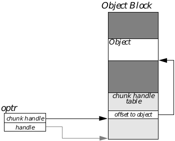

**Figure 5-1** An Object Pointer  
_The optr (below) references the beginning of 
the object block through its global handle. The 
chunk handle consists of an offset into the 
chunk handle table, where an offset to the 
object's instance data is stored._

Instance data within an instance chunk is stored in "master parts" or "master 
groups." A master group is simply a number of instance data fields grouped 
according to their appropriate master class levels. Master classes are 
detailed in section 5.3.2.2.

A class designated as a master class resembles a normal class in all respects 
save one: it determines how instance data is grouped in a chunk. Each 
master class is the head of a class subtree; all the classes below it in the class 
tree (down to the next master class) are considered to be in that master class' 
group. Instance data for all classes in the master group are lumped together 
in the instance chunk; each master group's instance data within the chunk is 
accessed via a special offset stored within the chunk.

Sample instance chunks are shown in Figure 5-3. The first four bytes of an 
object's chunk contain a pointer to the object's class structure. The class 
structure (described in section 5.3.2.3 on page 164) resides in fixed memory. 
(A variant-class object has a slightly different structure; this is detailed in 
section 5.3.2.4.)

An object that has no master classes in its class ancestry (unusual) has its 
instance data directly following its class pointer. Objects belonging to master 
classes or their subclasses, however, are somewhat more complex. This 
distinction can be mostly ignored by application and library programmers 
(with the exception of deciding which classes should be master classes and 
which should not).

Each master part of the chunk is located by an offset inserted directly after 
the object's class pointer in the chunk. The position of the word containing 
this offset is then stored in the master class structure so the class can find its 
instance data later. The combination of the class pointer and the various 
master offsets make up the object's "base structure." When a typical object is 
instantiated, the base structure is all that is created.

**Figure 5-2** Object and Class Interaction  
_The kernel uses pointers internal to classes to traverse the class tree to the 
appropriate message handlers and data structures._

Each master part is left unallocated (for efficiency) until it is first accessed 
via a message sent to a class in the master group. When a class in the master 
group receives its first message, the entire master part of the chunk is 
allocated and initialized. This means that an object's chunk remains as small 
as possible until it absolutely must grow larger. Some classes even detect 
when a master part of the object will no longer be needed and actually remove 
(shrink to zero) the unwanted instance data from the chunk (GenClass does 
this by shrinking the Vis master part to zero size when a gadget is taken off 
the screen).

Any object may have "variable data" instance data fields; these are fields that 
may be added or removed dynamically to keep from having unused space in 
the instance chunk. Generic UI hints are "variable data" (also called 
vardata)-if an object has the hint, it appears in its instance chunk, if the 
object does not have the hint, the chunk does not have unused space in it.

Vardata entries are stored all together at the end of the instance chunk, 
regardless of their master groups. An object with two master groups and 
three variable data fields, for example, would look like Figure 5-4. Variable 
data and its use are discussed in full in section 5.4.1.4.

**Figure 5-3** Structures of an Object  
_All objects have class pointers, though only those with master classes in their 
ancestries have master groups and master group offsets._

##### 5.3.2.2 Master Classes

A master class provides a conceptual break between levels within a class 
tree. Each master class is the head of a class subtree, and all its subclasses 
are considered to be in its "master group." Figure 5-5 shows a simplified 
diagram of a class tree and its master groups.

The purpose of making a class a master class is to separate its instance data 
from that of its superclass. Each master group's instance data is lumped 
together in one section of the object's instance chunk and is not initialized 
until a class in the master group is accessed. The initialization (allocation of 
extra memory within the instance chunk) occurs automatically.

As shown in Figure 5-5 and Figure 5-6, an object of RookClass would have 
an instance chunk with two master groups, one for the PieceClass master 
class and one for the GamePcClass master class. The first of the two master 
parts represents the instance data for PieceClass only; the second master 
part represents the object's instance data for all of GamePcClass, 
ChessClass, and RookClass.

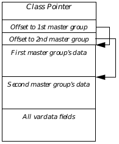

**Figure 5-4** An Object with Vardata  
_All vardata entries are stored at the end of the instance chunk, regardless of 
the master group with which they are associated._

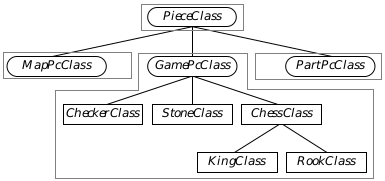

**Figure 5-5** Master Classes and Master Groups  
_Each master class heads its own master group. The outlined classes are all 
in the same master group._

The functionality of master classes is required to implement GEOS variant 
classes (see section 5.3.2.4). A variant class allows a single class 
to have a version of "multiple inheritance" in that it can have different 
superclasses depending on the system context.

##### 5.3.2.3 Class Structure and Class Trees

For the most part, you won't ever need or want to know the internal structure 
of a class as implemented in memory. The class structure is created and 
partially filled by the Goc preprocessor and Glue linker; the remainder is 
filled by the kernel when the class is loaded. It's unlikely you will need to 
know the actual class structures; you won't ever have to manually build a 
class unless your program dynamically creates it (not a common procedure 
for typical applications).

This section will describe how the class is implemented and how class trees 
are structured and managed. However, it will not discuss creating new 
classes during execution.

Classes are implemented with special data structures and code blocks. Each 
class is defined within and exported by a particular geode; when the geode is 
loaded the class definition and its code are loaded into the geode's fixed 
memory. All references to the class are then relocated by the kernel into 
pointers. For example, if a class is defined by a library, that library's "core 
block" (the special information kept about it by the kernel) contains an 
absolute pointer to the class' definition in a fixed memory resource owned by 
the library. Any applications then using that class load the library. The 
kernel examines the library's core block for the proper pointer and uses it 
each time the application references that class.

Because of this, each class is loaded into memory just once; all objects that 
use the class use the same class structure and code. Each object has a pointer 
in its instance chunk directly to the class structure; each class contains a 
pointer to its superclass' class structure. Using these pointers, the kernel can 
travel up an object's class tree to access any appropriate code. See Figure 5-7 
for a simplified illustration of how these pointers are followed by the kernel.

A class is a combination of data structure and code. The data structure 
(ClassStruct) contains information about the class, its superclass, its 
methods, and the structure and size of its instance data. The code consists of 
methods (message handlers). A diagram of the data structure is given in 
Figure 5-8; its components are detailed below.

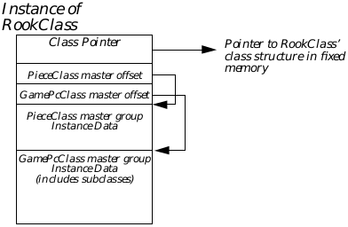

**Figure 5-6** A Sample Instance Chunk  
_The RookClass chunk has two master groups, each having an offset stored 
after the class pointer._

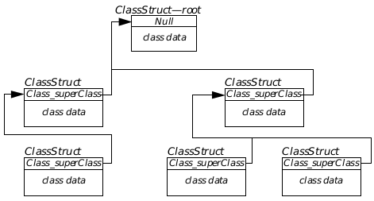

**Figure 5-7** A Class Tree  
_It is simple to find the root of any class tree by following Class_superClass 
links. This is how inheritance is implemented for methods; if a class does not 
recognize a message, the kernel looks in the superclass._

**Class_superClass**

Every class has as its first four bytes a pointer to its superclass. This points 
to the superclass' ClassStruct structure in all cases except two: The root of 
any class tree has a null superclass pointer, indicating that the root has no 
superclass. Variant classes have the integer 1 (one) always, indicating that 
the superclass is determined in a special manner. For more information on 
variant classes, see section 5.3.2.4.

Class trees are constructed when classes are defined; a new class is created 
as the subclass of some existing class, and its Class_superClass pointer is 
automatically set to point to the superclass. There is no need to point down 
the tree; messages are always passed to superclasses and never to 
subclasses. An example of the use of Class_superClass is shown in 
Figure 5-7.

**Class_masterOffset**

Class_masterOffset stores the offset indicating how far into the instance 
chunk the object's offset to this class' master part is. Figure 5-9 shows how 
this field allows a class to locate the appropriate master part. Note that use 
of this offset is entirely internal; individual classes do not have to figure out 
where their instance data is within the chunk (they may, however, have to 
know what master level each class is).

The master offset is used primarily because an object can have some of its 
master parts initialized and others uninitialized. If only one master part of 
the object had been initialized, the location of the instance data in the chunk 
may be different than if all master parts had been initialized.

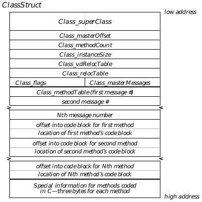

**Figure 5-8** The ClassStruct Structure  
_This structure has two basic parts: The class information and the method 
table. The class information has eight fields in eight words; the method table 
varies in size and consists of a message number table followed by a table of 
pointers to the actual method code._

**Class_methodCount**

Class_methodCount stores the total number of methods referenced in the 
class' method table. This is the total number of methods defined for this class 
only; other methods defined in other classes (even in the same master group) 
are stored in the method tables of those classes.

**Class_instanceSize**

Class_instanceSize holds the number of bytes to be allocated whenever an 
object of this class is instantiated. If the class is a master class or a subclass 
of a master class, this is the size of the master part. If the class has no master 
class above it, this is the number of bytes to allocate for the entire object 
(including superclass pointer).

**Class_vdRelocTable**

Class_vdRelocTable is a near pointer (16 bit offset) to the variable-data 
relocation information. The relocation information contains the type of 
relocation to be done for each data type. There is one entry in the variable 
data relocation table for each relocatable field in each particular 
variable-data type. Variable data (also called vardata) is described in full in 
"Defining and Working With Variable Data Fields".

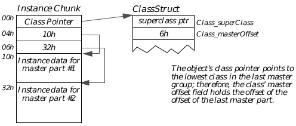

**Figure 5-9** Class_masterOffset  
_The instance chunk holds an offset to the master group's instance data; this 
offset is referenced by the class' Class_masterOffset field._

**Class_relocTable**

Class_relocTable is a near pointer (16 bit offset) to the relocation information 
for the non-variable data instance fields of the class. The relocation 
information contains the type of relocation done for each relocatable instance 
field (other than variable-data entries). A relocatable instance field is one 
which must be updated when the object is loaded-pointers, offsets, etc. The 
entry in the relocation table is defined with the @reloc keyword, described 
on page 202.

**Class_flags**

Class_flags contains seven flags (shown below) that determine the 
characteristics of the class. Declarers for these flags are used in the 
@classdecl declaration (see section 5.4.1 on page 184).

CLASSF_HAS_DEFAULT  
This flag indicates that the class has a special default method 
to handle unrecognized messages (typically, this handler 
simply passes the unrecognized message on to the superclass). 
This flag is not implemented in C. This flag is set by declaring 
the class as hasDefault.

CLASSF_MASTER_CLASS  
This flag is set if the class is a master class. This flag is set by 
declaring the class as master.

CLASSF_VARIANT_CLASS  
This flag is set if the class is a variant class. This flag is set by 
declaring the class as variant (all variants must also be 
declared as masters).

CLASSF_DISCARD_ON_SAVE  
This flag indicates the instance data for the class can be 
discarded when the object is saved. This flag applies only to 
master classes and will be heeded only when the master group 
is immediately above a variant-master group. This flag is set by 
declaring the class discardOnSave.

CLASSF_NEVER_SAVED  
This flag indicates objects of this class are never saved to a 
state file or loaded in from a resource. Goc will not build a 
relocation table for a class with this flag set. This flag is set by 
declaring the class neverSaved.

CLASSF_HAS_RELOC  
This flag indicates that the class has a special routine for 
relocating and unrelocating objects of the class when they are 
loaded from or written to disk. This flag is set by declaring the 
class hasReloc.

CLASSF_C_HANDLERS  
This flag indicates the class' methods are written in C rather 
than in assembly. This flag is set by the compiler and should 
not be set by applications.

**Class_masterMessages**

Class_masterMessages contains a number of flags set by Goc indicating 
whether this class has methods for messages defined within a given master 
level. It is used to optimize the search for a method to handle a message. 
These flags are internal and should not be used by programmers.

**The Method Table**

Every class has a method table, a table that indicates the location of the code 
to be executed when a certain message is received. The method table is in 
three parts and begins at the byte labelled Class_methodTable (this is simply 
a label, not a specific data field).

The first part of the method table is a list of messages the class can handle. 
Each entry in this list is two bytes and contains the message number of a 
message handled by the class.

The second part of the method table is a list of pointers to methods. Each 
entry in this list is a pointer (four bytes) which points to a specific routine in 
a code block. If the code is in a fixed block, the pointer will be a far pointer; if 
the code is in a moveable or discardable block, the pointer will be a far pointer 
containing a virtual segment. (A virtual segment, something you do not need 
to know about, is a handle shifted right four bits with the top four bits set. 
Since this represents an illegal segment address, GEOS recognizes it as a 
virtual segment and will take the necessary actions to lock the block into 
memory before access and unlock it after access. Manipulation of the bits in 
the virtual segment is completely internal to GEOS.)

The kernel searches the message list until it comes across the appropriate 
message number and notes the message's position in the table. It then looks 
at the corresponding position in the pointer list. If the pointer there is a 
virtual segment and offset, it will load the appropriate code block, lock it, and 
execute the code. If the pointer points to fixed memory, the code will be 
executed immediately. (If the message number is not found in the table, the 
kernel will either execute the class' default handler or pass the message on 
to the class' superclass.)

##### 5.3.2.4 Variant Classes

A variant class is one which has no set superclass. The variant's superclass 
is determined at run-time based on context and other criteria. Note that 
objects may not be variant-only classes may be variant. An object always 
has a specific class to which it belongs, and its class pointer always points to 
that class' ClassStruct structure. In addition, every variant class must also 
be a master class.

A variant class, however, may have different superclasses at different times. 
This functionality provides a form of "multiple inheritance": the class may 
inherit the instance data and functions of different classes depending on its 
attributes and desired features. Note, however, that a variant class may have 
only one superclass at any given moment.

The most visible example of a variant class is GenClass and how a generic 
object is resolved into its specific UI's appropriate representation. Each 
generic object (for example, a GenTrigger), is a subclass of the master class 
GenClass. All the instance data belonging to GenTriggerClass and 
GenClass, therefore, is stored in the Gen master part of the instance chunk.

GenClass, however, is a variant class, meaning that it does not know its 
superclass when the object is instantiated. Each generic object's class will be 
linked directly to another class provided by the specific UI in use: the specific 
UI's class provides the visual representation while the generic UI class 
provides the object's functionality. In this way, the object can actually 
perform many of its generic functions without having a visual 
representation.

The resolution of the superclass comes when the generic object is displayed 
on the screen: the kernel sees that the object has no superclass and looks into 
its instance data and class structure. The kernel then determines what the 
appropriate specific UI class will be for the object's class and provides the 
superclass link necessary. It also then initializes the superclass' master part 
of the object (in this case, the master part belonging to VisClass), updating 
all the master part offsets in the instance chunk's master offset fields.

You can see from the above discussion that GenClass must know at least 
something about its potential superclasses. In fact, all variant classes must 
know at least the topmost class of all its potential superclasses. The 
definition of GenClass is

~~~
@class GenClass, VisClass, master, variant;
~~~

The @class keyword declares the new class, GenClass. GenClass is to be a 
variant class and therefore must also be a master class. All the superclasses 
of GenClass will be related to VisClass; this means that all specific UI 
classes which may act as Gen's superclass must be subclassed from 
VisClass. (Another way of looking at the definition is that GenClass is an 
eventual subclass of VisClass-you have no way of knowing beforehand how 
many class layers may be between the two, however.)

The variant must specify an eventual superclass so the kernel knows how 
many master offset fields it must allocate when an instance of the variant is 
created. For example, a GenTrigger has two master groups: that of 
GenClass, and that of VisClass. Because the GenClass master group is 
necessarily below the VisClass master group in the class hierarchy (after the 
superclass link has been resolved), the GenClass master offset in the 
instance chunk must be after the VisClass master offset. If the definition did 
not specify VisClass as an eventual superclass, no master offset field would 
be allocated for it, and the Class_masterOffset field of GenClass' Class 
structure would not be able to hold any particular value.

As stated at the beginning of this section, there are no "variant objects." 
Every object belongs to a specific class, and the object's class can never 
change. All instances of a variant class, however, can be resolved to different 
superclasses due to the way the superclass of each variant is resolved. One 
example of this is the generic-to-specific mapping of the GenInteraction 
object.

All GenInteractions are of class GenInteractionClass; this never changes. 
GenInteractionClass, however, is a subclass of GenClass, a variant class. 
This means that the class tree of the GenInteraction object is only partially 
completed; before the GenInteraction is resolved, it looks like the simplified 
diagram in Figure 5-10.

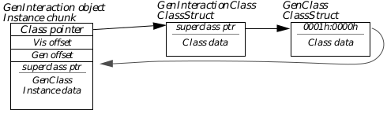

**Figure 5-10** A Variant Class Object  
_A variant class always has the constant 0001h:0000h instead of a superclass 
pointer. The class pointer of the variant class is stored in the first four bytes 
of the variant class' master part in the instance chunk. Until the variant class 
is resolved, this pointer is null and the master part of the superclass (in this 
case VisClass) is not initialized._

The GenInteraction object may be resolved into one of several different 
specific UI classes. For example, the motif.geo library has several classes for 
GenInteractions; among them are the classes that implement menus, dialog 
boxes, and grouping interactions. These classes are all specialized subclasses 
of VisClass, the eventual superclass of GenClass.

Notice from Figure 5-10 that the class tree of the GenInteraction is not 
complete. A class tree must have links all the way back to MetaClass for it 
to be complete; this only goes to GenClass. GenClass has a special value in 
its Class_superClass field, 0001h:0000h. This represents a reserved "pointer" 
that indicates to the kernel that the class is a master class.

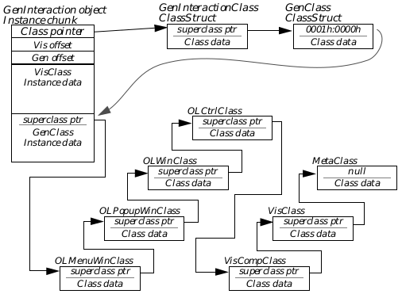

**Figure 5-11** A Resolved Variant Object  
_The GenInteraction menu object has been resolved to belong to 
OLMenuWinClass, thus completing the object's class tree as shown._

The superclass of the variant can be different for every instance because the 
superclass pointer is actually stored in the object's instance chunk rather 
than in the class' ClassStruct structure. This also allows a class tree to have 
more than one variant class in its hierarchy; for example, one variant could 
be resolved to be the subclass of another variant. The tree must always be 
headed by MetaClass.

As shown in Figure 5-10, the superclass pointer for the variant is stored in 
the variant's master group instance data. Not all master groups have 
superclass pointers; only those for variant classes. After the GenInteraction 
is resolved, the pointer (the first four bytes of the Gen master part) points to 
the proper superclass for this object (in this case, OLMenuWinClass). The 
object, with its full class tree, is shown in Figure 5-11.

##### 5.3.2.5 An In-Depth Example

This section gives an example of a GenTrigger object after its variant part 
has been resolved. This example provides in-depth diagrams of the class and 
instance structures for those programmers who wish to understand them. 
There is no need to know them, however; you will not likely ever need to 
access the internals of either a class structure or an instance structure.

The GenTrigger taken as an example is the "New Game" trigger of the TicTac 
sample application. This trigger is the only child of the Game menu 
GenInteraction; it is shown in Figure 5-12. The code defining the trigger is 
given in Code Display 5-4.

**Figure 5-12** TicTac's New Game Trigger  
_This trigger is used as the in-depth example object. The mouse pointer in the 
diagram points to the trigger._

---
Code Display 5-4 TicTac's New Game Trigger
~~~
/* The TicTacNewTrigger has a moniker and an output. All its other instance data
 * is set to the GenClass defaults. The content of these fields is not important
 * for this example, however. */

@object GenTriggerClass TicTacNewTrigger = {
    GI_visMoniker = "New Game";
    GTI_destination = TicTacBoard;					/* Send the action message to the
					 * TicTac game board object. */
    GTI_actionMsg = MSG_TICTAC_NEW_GAME; 	/* The action message. */
}
~~~

**The GenTrigger's Instance Chunk**

The GenTrigger object has two master parts, just like the GenInteraction 
object shown in "Variant Classes": the Gen master part holds the 
instance data for GenClass and GenTriggerClass. The Vis master part 
holds the instance data for VisClass and OLButtonClass. The MetaClass 
instance data consists only of the object's class pointer and has no master 
part.

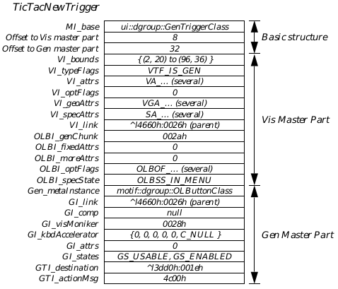

**Figure 5-13** GenTrigger's Instance Chunk  
_The TicTacNewTrigger trigger has a Gen and a Vis master part and no 
vardata entries._

Figure 5-13 shows the structure of TicTacNewTrigger's instance chunk. The 
chunk's basic structure consists of the class pointer (four bytes) followed by 
two words of offset into the chunk. The first offset gives the location of the Vis 
master part, and the second gives the location of the Gen master part. After 
the offsets are the master parts themselves, and if the trigger had any 
variable data, it would appear at the end of the chunk.

Each master part has the master class' instance fields first, followed by those 
of its subclasses. All the fields that belong to VisClass begin VI_-, all those 
that belong to OLButtonClass begin OLBI_-, etc.

Notice also the first four bytes of the Gen master part: they contain a pointer 
to the "superclass" of GenClass for the trigger. Although the trigger typically 
does not have different forms in any given specific UI (as the GenInteraction 
does), it will have a different class for each specific UI it encounters. For 
example, the OSF/Motif class is OLButtonClass; another specific UI will use 
a different class for GenTriggers.

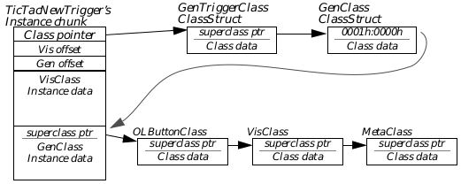

**Figure 5-14** TicTacNewTrigger's Class Tree  
_TicTacNewTrigger is of GenTriggerClass, a subclass of GenClass. GenClass 
is a variant and is resolved to OLButtonClass at run-time. OLButtonClass is 
subclassed off VisClass, which is subclassed off MetaClass._

**The GenTrigger's Full Class Tree**

Figure 5-14 shows TicTacNewTrigger's full class tree in a simplified diagram. 
Since GenClass is a variant, it has a superclass pointer of 0001h:0000h. This 
special value (with an illegal segment address) indicates to the kernel that 
this object's GenClass superclass is stored in the instance chunk itself. The 
superclass is stored in the first four bytes of the Gen master part, as shown 
in the previous section.

**GenTriggerClass' ClassStruct Structure**

Because all classes have the same class structure, only GenTriggerClass 
will be examined here. The class structure and the instance chunk structure 
are closely linked in several ways, as shown in Figure 5-15.

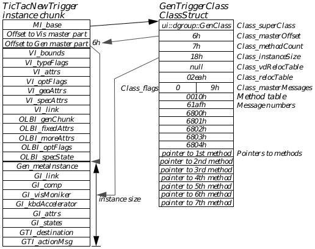

**Figure 5-15** GenTriggerClass Subclassed  
_The class structure and instance structure are linked in several ways.
Advanced Topic_

As shown in the diagram, the instance chunk points directly to the class. The 
class points to its superclass, thereby providing inheritance of all the 
methods and structures of classes higher in the class tree such as GenClass.

The class structure contains some information about the instance chunk's 
format, specifically Class_masterOffset and Class_instanceSize. 
Class_masterOffset gives the offset into the instance chunk where the offset 
to the master part is stored. Class_instanceSize contains the size of the 
master part so the kernel can quickly allocate the needed space when the 
master part is initialized.

The method table resides at the end of the class, and it has entries for each 
message handled by the class. GenTriggerClass handles seven messages 
(stored in Class_methodCount); any message received by this trigger and not 
recognized by GenTriggerClass is passed up the class tree for handling. 
Thus, a MSG_GEN_SET_NOT_ENABLED sent to the trigger will be passed on 
to GenClass and will be handled there.

The method table has two parts: The first part is a listing of message 
numbers, and the second part is a listing of pointers to the method code. 
When the object receives a message, the kernel scans the first part to see if 
the class handles the message. If it does, the kernel then scans the second 
part of the table to get the pointer to the code. It then executes the code there 
as if that code were a function called by the object's code.

**How a Message Is Handled**

Most aspects of messages and messaging are described in the following 
section. This section, however, describes how the kernel finds and executes 
the code when a message is sent to the GenTrigger. The message is 
MSG_GEN_SET_USABLE (handled by GenClass).

Messages are sent directly to an object using its optr. That is, when you send 
a message to this particular GenTrigger, you send it directly to 
TicTacNewTrigger, not to some monolithic "case" statement run by your 
application. Since the object's optr uniquely identifies the location of the 
object's instance chunk in memory, the kernel can quickly access the code for 
the handler.

When MSG_GEN_SET_USABLE is sent to the TicTacNewTrigger, for example, 
the kernel looks in the object's instance chunk for its class pointer. It follows 
this pointer and then looks in GenTriggerClass' ClassStruct structure. It 
scans the first part of the class' method table for MSG_GEN_SET_USABLE. If 
the message is not there (and it isn't), the kernel will then follow the class' 
Class_superClass pointer and look in GenClass' ClassStruct structure. It 
then scans the first part of GenClass' method table for the message. 
GenClass has an entry for MSG_GEN_SET_USABLE, and therefore the 
kernel checks the second part of the method table for the code pointer. It 
follows this pointer to the method's entry point and begins executing the code 
there.

#### 5.3.3 The GEOS Message System

Because objects are independent entities, they must have some means of 
communicating with other objects in the system. As shown in the example of 
the calculator and requestor objects in "System Architecture," Chapter 3, 
communication is implemented through the use of messages and methods.

##### 5.3.3.1 The Messaging Process

When an object needs to notify another object of some event, retrieve data 
from another object, or send data to another object, it sends a message to that 
object. Sending a message is similar to calling a function in C in that the 
message can take parameters (including pointers) and give return values. 
However, messages are also quite different from function calls in the 
multithreaded environment of GEOS.

Each object block in the system is associated with a single thread of 
execution. Each thread that runs objects (some run only procedural code) has 
an event queue, a queue in which messages are stored until they can be 
handled. Every message sent to an object from another thread gets put in the 
object's thread's event queue. (Messages sent between objects within the 
same thread are not handled via the queue unless forced that way.) Thus, a 
single thread's event queue can have messages for many different objects. 
For most single-thread applications, the programmer will not have to worry 
about synchronization issues.

The sender of a message has to be aware of synchronization issues raised by 
having multiple threads in the system. Essentially, you can send a message 
two ways: The first, "calling" the message, allows the use of return values and 
acts almost exactly like a function call in C. This places the message in the 
recipient's event queue and then halts the sender until the return values are 
received. The sender "goes to sleep" until the message has been processed 
and is then awoken by the kernel, thus ensuring the message is handled 
before the sender executes another line of code. The call option should also be 
used when passing pointers; otherwise, the item pointed to may move before 
the message can be handled, invalidating the pointer.

The second, "sending" the message, is used primarily when synchronization 
is not an issue. For example, if the message merely notifies the recipient of 
some condition or event, or if it sends data with no expectation of a return 
value, the send option can be used. Essentially, the sender will send off the 
message and then forget about it, continuing on with its own business. (The 
exception to this is an object sending a message to another object in the same 
thread; then the message is handled immediately, as if it had been called.)

When an object sends a message, the message actually first gets passed to the 
kernel (this is all automatic). The kernel will put the message into the proper 
thread's event queue and, if necessary, put the sender's thread temporarily 
to sleep. When the recipient's thread is ready to handle the message, the 
kernel pulls it from the event queue.

The kernel then locates and loads the recipient object into memory (if 
necessary). The recipient's object block will be loaded and locked, and the 
object will be locked while processing the event. (Note, however, that it is 
possible for the object to move if the recipient makes a call to LMemAlloc() 
or does something else that can cause shuffling of the object chunks.) The 
kernel will follow the object's class pointer to its class and will scan the 
method table. If the class can handle the message, the proper method code 
will be executed. If the class can not handle the message, the kernel will 
follow the superclass pointer and check the method table there. The message 
will continue up the class tree like this until either it is handled or it reaches 
the root and returns unprocessed.

After the method code has been executed, the kernel collects any return 
values and wakes up the caller thread again if necessary. To the caller, it's as 
if the message were handled instantaneously (with the call option). Senders 
are never blocked; only messages called (with the call option) may block the 
caller's thread. If a message is sent to an object in the same thread, however, 
it will be executed as a call and will be handled immediately, unless the 
sender explicitly states that it should go through the message queue.

Be careful, though, if you are writing code in multiple threads (for example, 
if you subclass UI objects and write new method code for them). You have to 
make sure that two threads never call each other; this can lead to deadlock 
if the calls happen to overlap. The easiest way to deal with this is to have one 
thread always send a message requesting a return message with any needed 
return values. The other thread will then send off a return message with the 
data. For example, a UI object may require information from an application's 
object. The UI object sends MSG_REQUEST_INFORMATION (or something 
similar). The application's object then receives that message and responds 
with a MSG_RETURNING_REQUESTED_INFORMATION (or something 
similar). With this scheme, the application's object is free to use call 
whenever it wants, but the UI object must always use send.

##### 5.3.3.2 Message Structures and Conventions

A message is simply a 16-bit number determined at compile time. 
Specifically, it is an enumerated type-this ensures that no two messages in 
the same class can have the same number.

An event is an opaque structure containing the message number and 
information about the recipient, the sender, parameters, and return values. 
When an object sends a message, the kernel automatically builds out the 
event structure (generally stored in the handle table for speed and efficiency). 
You will never have to know the structure of an event.

### 5.4 Using Classes and Objects

The previous sections dealt with the internals of the GEOS object system. 
This section describes how you can create classes and objects and manage 
them during execution using Goc keywords and kernel routines. Almost all 
Goc keywords begin with "@" (one notable exception is gcnList).

All the most useful keywords available in Goc are shown in Code Display 5-5. 
This display is for initial reference; all the keywords are detailed in depth in 
the following sections of this chapter and in the Routines Book.

---
Code Display 5-5 Goc Keywords
~~~
	/* Including .goh files */
@include <fname>;

	/* Defining New Classes and Subclasses */
@class	<cname>, <super> [, master [, variant]];
@endc

	/* Declaring a class */
@classdecl <cname> [, <cflags>];

	/* Defining messages for a class */
@message <retType> <mname>([@stack] <param>*);
@reserveMessages <num>;
@exportMessages <expName>, <num>;
@importMessage <expName>, <messageDef>;
@alias(<protoMsg>) <messageDef>;
@prototype <messageDef>;

	/* Defining instance data fields for a class */
@instance <insType> <iname> [ = <default>];
gcnList(<manufID>, <ltype>) = <oname> [, <oname>]*;
@instance @composite <iname> [ = <linkName>];
@instance @link <iname> [ = <default>];
@instance @visMoniker <iname> [ = <default>];
@instance @kbdAccelerator <iname> [ = <default>];
@reloc <iname>, [ (<count>, <struct>), ] <ptrType>;
@noreloc <iname>;
@default <iname> = <default>;

	/* Defining vardata fields for a class */
@vardata <type> <vname>;
@vardataAlias (<origName>) <newType> <newName>;
@reloc <vname>, <fn>, [ (<count>, <struct>), ] <ptrType>;

	/* Defining methods (message handlers) */
@method [ <hname>, ] <cname> [, <mname>]+;
@method [ <hname>, ] <cname> _reloc;

	/* Defining library code and resources */
@optimize
@deflib <libname>
@endlib
@start <segname> [ , <flags> ];
@header <type> [ = <init> ];
@end <segname>
@chunk <type> <name> [ = <init> ];
@chunkArray <stype> <aname> [ = {<init>} ];
@elementArray <stype> <aname> [ = {<init>} ];
@extern <type> <name>;
@gstring;

	/* Declaring an object */
@object <class> <name> <flags>* = {
    [<fieldName> = <init>];*
    [<varName> [ = <init> ]]*;
}

	/* Sending and calling messages */
@send [<flags>,+] <obj>::[{<cast>}] <msg>(<params>*);
<ret> = @call [<flags>,+] [{<cast>}] <obj>::[{<cast2>}]<msg>(<params>*);
@callsuper();
@callsuper <obj>::<class>::<msg>(<params>*) [<flags>,];
<event> = @record <obj>::<msg>(<params>*);
@dispatch [noFree] <nObj>::<nMsg>::<event>;
<ret> = @dispatchCall [noFree] [{<cast>}] <nobj>::<nMsg>::<event>;

	/* Using conditional code */
@if <cond>
@if defined(<item>)
@ifdef <cond>
@ifndef <cond>

	/* Creating Goc macros */
@define <mname> <macro>
~~~

#### 5.4.1 Defining a New Class or Subclass

@class, @classdecl, @endc, @default, @uses

You can create new classes in GEOS by using the Goc keywords @class and 
@endc. These frame the class definition as shown in Code Display 5-6; the 
@endc keyword takes no parameters, but @class takes the following 
parameters:

~~~
@class    <cname>, <super> [, master [, variant]];
~~~

**cname** This is the name of the new class.

**super** This is the class name of the superclass.

**master** When included, this word makes the new class a master class.

**variant** When included, this word makes the new class a variant class. 
All variant classes must also be declared master classes.

Every class must have a class structure (ClassStruct) in memory. This is 
created and filled automatically by Goc and the kernel; however, you must 
use the @classdecl keyword to make sure the structure gets built. Only one 
@classdecl statement may be used for each class, however-Goc will give an 
error if the class is declared twice. This is also shown in Code Display 5-6, 
and its parameters are as follows:

~~~
@classdecl    <cname> [, <cflags>];
~~~

**cname** This is the name of the class being declared.

**cflags** These are optional flags, described below.

The optional flags that can be used with a class declaration determine how 
objects of the class get shut down (see "Class_flags" on page 169). The flags 
you can use with @classdecl are

_neverSaved_  
This flag indicates that objects of this class will neither be 
written to a state file nor be loaded in from a resource. This flag 
should only be used for classes whose objects will only be 
created at run-time (not declared in the .goc file) and for 
process classes.

_discardOnSave_  
This flag applies only to master classes. Objects of this class 
will never be saved to a state file and must be re-initialized 
each time they are loaded. If you want an object simply to 
revert to its default configuration each time it is loaded, use the 
flag ignoreDirty instead in the object's declaration (see 
@object, below).

In addition, any variant class can have a default superclass. The variant is 
resolved at compile-time to have the default superclass as its superclass. To 
set a default superclass for a variant class, add a line with the following 
structure in the class definition:

~~~
@default <varRoot> = <super>;
~~~

**varRoot** The name of the variant class with "Class" removed. (For 
example, GenClass would be specified as "Gen.")

**super** The name of the superclass to set as the default.

Sometimes a variant class will know that it will be the subclass of a specific 
class, though it doesn't know (at compile time) just how that ancestry will be 
traced. You can use the @uses directive to let the compiler know this; that 
way, the variant class can define handlers for the "used" class. For example, 
if you know that variant class MyVariantClass will always be resolved as a 
descendant of MyAncestorClass, you can put the directive

~~~
@uses MyAncestorClass;
~~~

in the definition of MyVariantClass. The general format is

~~~
@uses <class>;
~~~

**class** The class which will always be an ancestor to this class.

---
Code Display 5-6 Defining Classes
~~~
/* The @class keyword defines a new class or subclass. @endc ends the class
 * definition, and @classdecl must be put somewhere in the code to make sure Glue
 * will link the class structure into the compiled geode.*/

@class	MyNewClass, VisClass;
    /* Message declarations would go here. See @message.
     * Instance data field declarations would go here. See @instance
     * 						and @vardata. */
@endc
@classdecl MyNewClass, neverSaved;

@class	MyTriggerClass, GenTriggerClass;
    /* New messages for this subclass are defined here. */
    /* New instance data fields for this subclass are defined here. */
@endc
@classdecl MyTriggerClass;

/* When defining a variant class (which must also be a master class), you can
 * set a superclass for the variant at compile-time using @default. */

@class	MyNewVariantClass, MetaClass, master, variant;
    @default		MyNewVariant = VisClass;
@endc	MyNewVariantClass
@classdecl MyNewVariantClass;
~~~

##### 5.4.1.1 Defining New Messages for a Class

@message, @stack, @reserveMessages, @exportMessages, 
@importMessage, @alias, @prototype

As discussed in section 5.3.3 on page 180, messages are simply 16-bit 
numbers allocated as an enumerated type. When a new class is defined, a 
constant is automatically created representing the first message number for 
the class. This constant is then used as the first number in the enumeration 
of messages.

The constant is built off the class' superclass. MetaClass has the first 16384 
messages reserved for its use. Each master level gets 8192, and the first 
master class of a level gets 2048 of these. All other classes are allocated 512 
message spots. Thus, a master class subclassed directly off MetaClass would 
have 2048 messages beginning with number #16384 (since the numbering is 
zero-based). A subclass of this would have 512 messages beginning with 
number #18432.

This numbering scheme ensures that no two classes at different levels in the 
class hierarchy will have the same message number. Specifically, a class will 
never have the same message number as one of its sub- or superclasses.

New messages must be defined in the class definition between the @class 
and @endc keywords (see above). They are defined much like normal 
function calls and follow the normal C calling conventions (see Code 
Display 5-7 for examples). If your class uses messages from its superclass, 
you do not have to declare these messages in your class definition-they are 
inherited automatically. This is true even if you are subclassing the method 
to alter its functionality.

To define a new message, use the @message keyword. This keyword takes 
the following parameters:

~~~
@message   <retType> <mname>(<param>*);
~~~

**retType** This is the data type of the return value of the message. It can 
be any standard C or GEOS data type (excluding structures), or 
a pointer to a structure. If this message has multiple return 
values, you must do as in C function calls and pass pointers to 
buffers for the return information.

**mname** This is the name of the message. By convention, it will be MSG_ 
followed by a shortened version of the name of the class and 
then some useful name (e.g., MSG_META_INITIALIZE).

**param** This represents one or more parameters. Messages may have 
no parameters, one parameter, or several parameters. 
Parameter definition is essentially the same as definition of 
function parameters; see Code Display 5-7 for examples. 

NOTE: When defining a function with no parameters, it is best to declare it 
with "void" between the parentheses. This will make sure Goc gives an error 
if the function is called with arguments.

**Messages for Use with Assembly Code**

The @stack keyword indicates that parameters are passed on the stack; it 
is important to note that because of calling conventions, parameters passed 
on the stack must be listed in the message definition in reverse order from the 
way the handler pops them from the stack. This keyword is used only when 
the message may be handled by an assembly language method; its format is 
shown below:

~~~
@message <retType> <mname>(@stack <param>*);
~~~

All the parameters shown in the formats are the same as in the normal 
@message format.

---
Code Display 5-7 Defining Messages
~~~
	/* Each message is defined for a class within the class definition. */
@class	MyTriggerClass, GenTriggerClass;
	/* All the new messages MyTriggerClass can handle are defined here. */
@message void MSG_MYTRIG_SET_COLOR(colors colorIndex);
@message optr MSG_MYTRIG_RETURN_OPTR( void );
@message void MSG_MYTRIG_COLLECT_PARAMS(byte bParam, word wParam, char * string);
	/* Instance data fields would be defined here. */

@endc
@classdecl MyTriggerClass;
~~~

**Exporting, Importing, and Reserving Message Ranges**

As discussed above, message numbers are assigned based on the class' 
location in the class tree. No message number will ever conflict with 
messages defined in the class' superclasses. However, the assignment scheme 
opens up the possibility that classes on the same level in the class tree could 
have conflicting message numbers (see Figure 5-7).

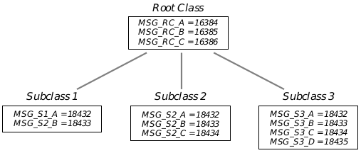

**Figure 5-16** Conflicting Message Numbers  
_Although no class' message numbers will ever conflict with its superclasses', 
it is possible, and even likely, for classes of the same level to have conflicting 
message numbers. For example, MSG_S2_C and MSG_S3_C both have the 
message number._

Normally, this is not a problem. If subclasses are to receive the same message 
and handle it differently, the message can typically be defined in the 
superclass and simply be intercepted by the subclasses. Sometimes, however, 
different subclasses will need to have different definitions for the same 
messages. For example, a class supplied by a library may be used by several 
applications; if the applications each create a subclass, these subclasses can 
import particular messages that will be the same for all the subclasses in all 
the applications.

Goc therefore allows a class to export a range of message numbers which 
subclasses can import and create specific definitions for. This allows you 
greater control over what aspects of the class you can define.

To export a range of messages, use the @exportMessages keyword. This will 
set aside several message numbers which can then be imported by subclasses 
using the @importMessage keyword.

Another potential problem is upgrading your program from release to 
release. If you create classes that may grow in the future, you may want to 
reserve a number of message spots to ensure that those spots can be filled in 
later. Nothing is done with the spots; they are simply place holders for future 
upgrades. You can use the @reserveMessages keyword to reserve a range 
of any size. The parameters of these three keywords are shown below:

~~~
@reserveMessages  <num>;
@exportMessages   <expName>, <num>;
@importMessage	  <expName>, <messageDef>;
~~~

**num**	This is the number of messages in the exported range.

**expName** This is the name of the exported range. This is used when 
importing messages to ensure that the proper numbers are used.

**messageDef** This is a standard message definition line, the same as would 
be found with the @message keyword (though @message is left out).

Note that you do not need to reserve messages for upgrades; any class can 
always have messages tacked on to the end of its class definition. If you want 
to group the messages logically, however, you should reserve ranges where 
you expect additions to be made.

**Aliasing Messages**

The @alias keyword allows a single message to have more than one 
pass/return format. The @prototype keyword allows quick, clean, and 
convenient repetition of a single format for many different messages; it also 
allows a class to create a prototype so users of a message can have their own 
messages with the same format.

@alias is used when a single method takes conditional parameters. For 
example, a method may take a word value in a certain case and a dword value 
in another (dependent upon a passed flag). Each condition must be accounted 
for in its own message format. Rather than create a message and a method 
for each case, you can create a single assembly-language method for all the 
different pass/return formats; then, you can use @alias to make several 
messages refer to the same method, each using a different format.

~~~
@alias(<protoMsg>) <msgDef>;
~~~

**protoMsg** The name of the original message. The new message may have 
different pass/return values but will invoke the same method 
code and will have the same message number.

**msgDef** The new message definition. It follows the same format as 
messages defined with the @message keyword (with 
@message left off).

In addition, if you have a single pass/return format for many messages, you 
can use the @prototype keyword as coding shorthand. For example, if an 
object has ten messages that all take two parameters and return a single 
value, you can set up the format with the @prototype keyword and then use 
a simpler format for definition of your messages. An example is shown in 
Code Display 5-8, and the parameters of this keyword are shown below.

~~~
@prototype <msgDef>;
~~~

**msgDef** This is the standard message definition. For the message 
name, use something like "MY_PROTOTYPE" that you can 
insert later into the definitions of your real messages. All other 
parts of the message definition are the same as would be 
declared with @message (with @message left off).

---
Code Display 5-8 Aliasing Messages
~~~
	/* MyClass in this example uses both prototype and aliased messages. */
@class MyClass, MetaClass;
	/* The following is a normal message declaration. The register that this
	 * parameter uses is specified because the handler (method) is written in
	 * assembly language. */
@message void MSG_MESSAGE_WITH_WORD(byte flag = cl, word value = dx);

	/* The following message invokes the same method as the alias above.
	 * It has the same message number but passes a different sized parameter
	 * in different registers. */
@alias(MSG_MESSAGE_WITH_WORD) void MSG_MESSAGE_WITH_DWORD(byte flag = cl,
							dword value = dx:bp);

	/* The following message is not used. Its pass and return values can
	 * be used elsewhere, however, to ensure that all handlers of this message
	 * type are given the same format. */
@prototype int MSG_MYCLASS_PROTO(int a, int b);

	/* The following have the same return values and parameters
	 * as the prototype above. */
@message(MSG_MYCLASS_PROTO) MSG_MY_CLASS_ADD;
@message(MSG_MYCLASS_PROTO) MSG_MY_CLASS_SUBTRACT;
@message(MSG_MYCLASS_PROTO) MSG_MY_CLASS_MULTIPLY;

@endc
@classdecl MyClass;
~~~

##### 5.4.1.2 Defining Instance Data Fields

@instance, @composite, @link, @visMoniker, @kbdAccelerator, 
@activeList

Instance data fields are all defined with the @instance keyword. Other 
keywords may be included in the @instance declaration for special types of 
data. All instance data definitions must appear between the class' @class 
and @endc keywords (see above under class definition).

The @instance keyword is used to define normal instance data. If you have 
data that must be added or removed dynamically (such as hints), use the 
@vardata keyword, described in section 5.4.1.4 on page 195. Also, if you have 
data that requires relocation (such as pointers to fixed data) when the object 
is loaded, use the @reloc keyword.

The format of the @instance keyword is as follows:

~~~
@instance    <insType>    <iname> = <default>;
~~~

**insType** A standard C or GEOS data or structure type representing the 
data type of the instance field.

**iname** The name of the instance field.

**default** The default value of the instance field if it is not filled in when 
an object of this class is instantiated. The value must, of course, 
be appropriate for the data type.

Goc has several special types of instance data fields that you can declare 
along with @instance to make object definition easier. The format for using 
one of the special types is shown below (with examples in Code Display 5-9). 
Each of the types is also described below.

~~~
@instance    <specType> <iname>;
~~~

**specType** This is the keyword (one of those shown in the list below) that 
defines the special type of this field.

**iname** This is the name of the instance field.

The special types are given here:

**@composite** This field is used when objects of the class being defined are 
allowed to have children. The @composite field will actually 
contain an optr to the first child object in an object tree. Since 
most objects in object trees are subclassed from VisClass or 
GenClass, you will most likely never use the @composite 
keyword. Both VisCompClass and GenClass have 
@composite fields predefined. The @composite type has a 
special format, shown below:

~~~
@instance  @composite <iname> = <linkName>;
~~~
where iname is the name of the instance field and linkName is 
the name of the field designated as @link (below). Note that 
there must be a @link field in every class that has a 
@composite field. See section 5.4.6.4 on page 232 for more 
information on object trees and the composite and link fields.

**@link** This field is used by objects that can be children in an object 
tree. Where the @composite field points to the first child, the 
@link field points to the next sibling. If there is no next sibling, 
this field will point back to the parent object. Since most objects 
in object trees are subclassed from VisClass or GenClass, you 
will most likely never use the @link keyword. Both VisClass 
and GenClass have @link fields predefined.

**@visMoniker**  
This field is designated as holding a pointer to a visual moniker 
chunk for the object. It is used in GenClass-see "GenClass," 
Chapter 2 of the Objects Book for information on the 
GI_visMoniker field. The moniker or moniker list must be in the 
same resource as the generic object using that moniker since 
only the chunk's handle is stored. A moniker list can store full 
object pointers to its monikers, so monikers referenced by a list 
need not be in the same resource as that list; thus if an object's 
moniker is specified via a list, then while the list must be in the 
same resource as the object, the monikers themselves need not 
be.

**@kbdAccelerator**  
This field contains a character sequence that, when typed by 
the user, causes the object to execute its default operation. For 
example, a keyboard accelerator could invoke a trigger 
implemented as a menu item. It is used in GenClass only.

---
Code Display 5-9 Declaring Instance Data Fields
~~~
/* GenClass is a good example of many of the different types of fields. */

@class	GenClass, VisClass, master, variant;

	/* The GenClass messages are defined here. */

    @instance @link GI_link;
    @instance @composite GI_comp = GI_link;
    @instance @visMoniker GI_visMoniker;
    @instance @kbdAccelerator GI_kbdAccelerator;
    @instance byte GI_attrs = 0;
    @instance byte GI_states = (GS_USABLE|GS_ENABLED);

	/* Hints and other variable data fields are defined with @vardata. */

@endc
~~~

##### 5.4.1.3 New Defaults for Subclassed Instance Data Fields

@default

Recall that when defining an instance data field you can set up a default 
value for that field. When creating a subclass, you may wish to specify that 
the subclass should have a different default value for a given field than the 
superclass does. Use the @default keyword to do this:

~~~
@default <iname> = <default>;
~~~

**iname** The name of the instance field.

**default** The new default value of the instance field if it is not filled in 
when an object of this class is instantiated. The value must, of 
course, be appropriate for the data type. You may use @default 
as part of this value; this @default will be treated as the value 
of the superclass. (If this seems confusing, try looking at the 
example.)

For example, a subclass of GenInteraction could set GIV_DIALOG as its 
default value for the GenInteraction instance field GII_visibility:

~~~
@default GII_visibility = GIV_DIALOG;
~~~

A generic class might want to have the same value for its GI_states field as 
its superclass, except with the GS_USABLE flag turned off:

~~~
@default GI_states = @default & ~GS_USABLE;
~~~

##### 5.4.1.4 Defining and Working With Variable Data Fields

@vardata, @vardataAlias, ObjVarAddData(), 
ObjVarDeleteData(), ObjVarDeleteDataAt(), ObjVarScanData(), 
ObjVarFindData(), ObjVarDerefData(), 
ObjVarDeleteDataRange(), ObjVarCopyDataRange(), 
MSG_META_ADD_VAR_DATA, MSG_META_DELETE_VAR_DATA, 
MSG_META_INITIALIZE_VAR_DATA, MSG_META_GET_VAR_DATA

Most classes will have well-defined instance data fields; each object in the 
class will have the same data structures, and all the instance chunks will 
look relatively similar and will be the same size.

Many classes, however, will also use "variable data," or instance fields that 
may be added or removed dynamically. This allows objects within the same 
class to have more or less instance data than other objects in the class. One 
example of variable data is the use of hints in generic UI objects. Because 
each object in a given class may or may not have hints, the objects can 
actually have different instance sizes. Variable data instance fields are 
defined with the use of the @vardata keyword.

Using variable data, however, is somewhat more complex than using 
standard instance data. You must use special kernel routines or messages to 
get a pointer to the data; then you can use the pointer to access the field.

Variable data is stored together at the end of the instance chunk in "data 
entries." Each entry consists of a primary word and optional extra data. The 
primary word represents a data type defined by the keyword @vardata. This 
type is created automatically by Goc when the @vardata keyword is used.

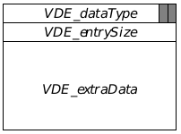

**Figure 5-17** Variable Data Storage  
_The VarDataEntry structure contains a single variable data entry. If it has 
no "extra data," the VDE_entrySize and VDE_extraData fields will not exist 
in the entry. Otherwise, VDE_entrySize will contain the entire size of the 
entry, and VDE_extraData will contain the actual data of the type found in 
VDE_dataType. The two shaded boxes in VDE_dataType represent the two 
least significant bits of that field; they are used to store two flags. Note that 
this structure is shown for illustration only; application programmers will 
never have to access it directly._

Each data entry is associated with a master class level and is considered part 
of the instance data for that master level (despite being stored at the end of 
the instance chunk). Thus, when a master part of an object is destroyed, the 
variable data entries associated with that master class will also be destroyed. 
For example, when a UI object is set not usable (taken off the screen), its Vis 
master part is removed from the instance chunk; any variable data entries 
associated with VisClass will also be destroyed.

Variable data may also be tagged for saving to the state file. That is, you can 
set up individual data entries to be saved to a state file and to be reinstated 
when the object is loaded from the state file. For more information about 
state saving, see section 5.4.6.6.

Variable data may be defined in an object's declaration in your .goc file or 
may be added and removed during execution. This gives the potential for 
using variable data as temporary storage in an object's instance chunk; 
however, temporary data used in this manner should be kept small to avoid 
slowing down the system-constantly resizing instance chunks to add and 
remove vardata fields makes more work for the memory manager.

To define a variable data type in a given class, use the @vardata keyword as 
follows (an example is given in Code Display 5-11):

~~~
@vardata    <type> <vname>;
~~~

**type** This is the data type of any extra data associated with the 
variable data. It must be a standard C or GEOS data type. If the 
type void is specified, no extra data will be added to the data 
entry when it is created. (An instance data field may be 
declared as an array, just as in standard C.)

**vname** This is the name of the variable data type. This name is used 
whenever referring to the vardata entry. Note that no two 
variable data types should have the same name, even if they're 
in different classes. Doing so will cause a compilation error. It's 
a good practice to put the class name within the data type 
name.

---
Code Display 5-10 Examples of Instance Data Declarations
~~~
/* These are some data fields for MyDataClass.
 */

    @instance		ChunkHandle		MDI_aChunk;
    @instance		HelloInfoFlags		MDI_flags;
    @instance		byte		MDI_lotsOfNumbers[32];
~~~

Some vardata types may have varying amounts of extra data. For example, 
one type may have either a word or a dword of extra data. To allow this, you 
can set up an alias with the new type attached using the keyword 
@vardataAlias:

~~~
@vardataAlias  (<origName>) <newType> <newName>;
~~~

**origName** This is the name of the original variable data field already 
defined with @vardata.

**newType** This is the data type of the new variable data field, a standard 
C or GEOS data type.

newName	This is the name of the new variable data field. In essence, the 
original and new fields will have the same data type word but 
will have different extra data size.

As noted earlier and as shown in Figure 5-17 on page l 196, the data type 
field in the data entry has two flags associated with it. These flags are each 
one bit:

VDF_EXTRA_DATA  
This flag indicates that this data type carries extra data.

VDF_SAVE_TO_STATE  
This flag indicates that this particular data entry should be 
saved along with all the other object's instance data when the 
state is saved. It should likewise be restored when the object is 
restored from the state file. Unless set off explicitly, this flag 
will be set for every data type defined in a .goc or .goh file.

The bitmask VDF_TYPE is a bitwise OR of VDF_EXTRA_DATA and 
VDF_SAVE_TO_STATE. You can use it to mask out all but those bits.

---
Code Display 5-11 Defining Variable Data
~~~
/* Hints are defined with the @vardata command, as is shown in GenClass. Only a
 * small portion of the hints for GenClass are shown here. Those with structures
 * or data types (not "void") have extra data fields associated with them. */

@class GenClass, VisClass, master, variant;
	/* Messages are defined here. */
	/* Followed by instance data defined with @instance. */
    @vardata void HINT_CENTER_MONIKER;
    @vardata SpecSizeSpec HINT_CUSTOM_CHILD_SPACING;
    @vardata char[] ATTR_GEN_INIT_FILE_KEY;

	/* Relocatable instance fields (see the next section) are defined with
	 * @reloc. This field contains an object pointer that must be resolved
	 * when the GenClass object is loaded. */
    @instance @link GI_link;
	@reloc GI_link, optr;
    @vardata DestinationClassArgs ATTR_GEN_DESTINATION_CLASS;
	@reloc ATTR_GEN_DESTINATION_CLASS, 0, optr;
@endc
~~~

The kernel provides a number of routines an object may use to add, remove, 
and change its own vardata entries. Note that all these routines must be 
called from within the object containing the variable data entries; since 
variable data is instance data, it is against OOP doctrine for one object to 
alter another object's variable data directly.

Instead, MetaClass provides vardata messages that can be sent by one 
object to another to add, remove, change, or retrieve vardata entries of 
another object. The kernel routines and MetaClass messages are outlined 
below:

+ ObjVarAddData()
This routine adds an new entry for the passed data type or replaces the 
extra data associated with a particular data type entry.

+ ObjVarDeleteData()
This routine deletes the entry for a particular data type when passed the 
data type.

+ ObjVarDeleteDataAt()
This routine deletes a particular data entry when passed the entry's 
pointer as returned by ObjVarAddData(), ObjVarFindData(), or 
ObjVarDerefData().

+ ObjVarScanData()
This routine causes the kernel to scan all data entries in an object's 
variable data and call any "handler routines" listed for them. This 
process is described below.

+ ObjVarFindData()
This routine searches for and returns (if possible) a pointer to a data 
entry of the passed data type.

+ ObjVarDerefData()
This routine returns a pointer to a data entry when passed the object's 
optr and the data type. If the entry does not exist, this routine will call 
on the object to create and initialize the entry. Such variable data then 
behaves much like instance data. The object containing the vardata is 
responsible for creating the entry and then initializing it upon receipt of 
a MSG_META_INITIALIZE_VAR_DATA, described below.

+ ObjVarDeleteDataRange()
This routine deletes all data entries with types in the passed range.

+ ObjVarCopyDataRange()
This routine copies all data entries within the passed range from one 
object's instance chunk to another`s. If any entries are copied, the 
destination object will be marked dirty for saving. This routine must be 
called by the destination object; it is bad policy for one object to alter 
another object's instance data. This routine is primarily for copying hints 
from one UI object to another and is not commonly used by applications.

The four messages (in MetaClass) that can be used to add, delete, and alter 
variable data entries remotely are listed below. Classes will never need to 
intercept and subclass these messages because the proper functionality is 
implemented in MetaClass.

MSG_META_ADD_VAR_DATA  
Adds a new vardata type to the recipient object. If the type 
already exists, the passed type replaces the old one.

MSG_META_DELETE_VAR_DATA  
Deletes a vardata type from the recipient's instance data. If the 
type does not exist, nothing is done.

MSG_META_INITIALIZE_VAR_DATA  
Used when something is trying to access an object's vardata 
field remotely but the field has not yet been added to the object 
or initialized. The object must create and/or initialize the 
vardata field at this point.

MSG_META_GET_VAR_DATA  
Returns the extra data set for the passed data type.

In addition to supporting variable data structures, GEOS allows you to set up 
"handlers" for different variable data types. Handlers are routines that 
process a given data entry; for example, each generic UI object stores a 
number of hints. Specific UI classes, when attached to the generic object, 
have a specific routine to handle each hint supported. Some specific UIs do 
nothing with certain hints; these specific UIs do not have handlers for those 
hints.

Handlers are associated with data types through the use of a 
VarDataCHandler table. This is a table that you set up in your .goc file 
that contains pairings of routine names with @vardata field names. An 
example of the VarDataCHandler table is shown in Code Display 5-12.

A handler is simply a normal C routine or function and is defined as such. The 
handler should be declared as an _pascal routine.The table pairs the 
handler with the @vardata data type, and when ObjVarScanData() is 
called, all handlers for all data types are called in order. This is true for the 
object's class and all its superclasses since variable data is inherited just as 
normal instance data is. The handler can do almost anything appropriate 
with the exception of destroying the object or adding or deleting variable data 
from the object.

---
Code Display 5-12 Variable Data Handlers
~~~
/* This example is taken from the C VarData sample application. */

/* This is a VarDataCHandler. It is called by the ObjVarScanData() routine when
 * the data type corresponding to this routine in the VarDataCHandlerTable
 * is encountered. The parameters indicated are passed.
 *
 * This particular handler is actually used for several different data types
 * (see VarDataCHandlerTable below). The data type can be distinguished by
 * the `dataType' parameter. 
 *
 * NOTE: VarDataInteractionHintHandler, like any handler used in a 
 * VarDataCHandler structure, must be declared _pascal. */

void _pascal VarDataInteractionHintHandler(MemHandle mh, ChunkHandle chnk, 
		void *data, word dataType, HandlerData *handlerData) {

    if (dataType == HINT_ORIENT_CHILDREN_HORIZONTALLY) {
	handlerData->HD_flags.has_horiz = 1;
    } else if (dataType == HINT_ORIENT_CHILDREN_VERTICALLY) {
	handlerData->HD_flags.has_vert = 1;
    } else if (dataType == HINT_ALLOW_CHILDREN_TO_WRAP) {
	handlerData->HD_flags.has_allow_wrap = 1;
    } else if ((dataType == HINT_WRAP_AFTER_CHILD_COUNT) &&
		(((WrapAfterChildCountData *) data)->WACCE_childCount == 2)) {
	handlerData->HD_flags.has_wrap_after = 1;
    }
}

/* This is the VarDataCHandler Table. It consists of data type/VarDataCHandler
 * pairs. The VarDataCHandlers are far routines. */

static VarDataCHandler varDataInteractionHandlerTable[] = {
    {HINT_ORIENT_CHILDREN_HORIZONTALLY, VarDataInteractionHintHandler},
    {HINT_ORIENT_CHILDREN_VERTICALLY, VarDataInteractionHintHandler},
    {HINT_ALLOW_CHILDREN_TO_WRAP, VarDataInteractionHintHandler},
    {HINT_WRAP_AFTER_CHILD_COUNT, VarDataInteractionHintHandler}
};
~~~

##### 5.4.1.5 Defining Relocatable Data

@reloc

Some objects and classes may have instance data fields that must be resolved 
when the object is loaded and linked at run-time. For example, if the object 
contains an optr to another object, that optr must be updated when the object 
is loaded and resolved since the global memory handle can't be known at 
compile-time.

For some special instance fields, this happens automatically. For example, 
the @composite and @link fields as well as optrs are automatically 
resolved. However, if you add your own instance fields requiring relocation, 
you will have to set them up with the @reloc keyword. This is true for both 
static and variable data.

This keyword uses two formats. The first listed here is for normal, static 
instance data, and the second is used with variable data.

~~~
@reloc    <iname>, [(<count>, <struct>)] <ptrType>;
~~~

**iname** This is the name of the relocatable instance field.

**count** If the instance variable is an array of relocatable data or 
structures containing relocatable fields, this is the number of 
elements in the array.

**struct** If the relocatable data is an array of structures, this represents 
the name of the field within each structure that requires 
relocation.

**ptrType** This is the type of relocatable data contained in the field. It 
may be one of optr, ptr, or handle.

~~~
@reloc <vname>, <fn>, [(<count>, <struct>)] ptrType;
~~~

**vname** This is the name of the variable data type.

**fn** This is the name of the field within the variable data's extra 
data. If there is no extra data with this data type, put a zero 
rather than a name.

**count** If the instance variable is an array of relocatable data or 
structures containing relocatable fields, this is the number of 
elements in the array.

**struct** If the relocatable data is an array of structures, this represents 
the name of the field within each structure that requires 
relocation.

**ptrType** This is the type of relocatable data contained in the field. It 
may be one of optr, ptr, or handle.

#### 5.4.2 Non-relocatable Data

@noreloc

To force an instance data field which would normally be relocatable (e.g., an 
optr) to not be relocatable, use the @noreloc keyword. Use this keyword 
together with the name of the field to be marked non-relocatable directly 
after defining the instance field itself as shown in Code Display 5-13.

---
Code Display 5-13 Use of the @noreloc Keyword
~~~
	@instance optr MCI_ruler;			/* Normally MCI_ruler would be reloc- */
	@noreloc MCI_ruler;				/* -but now it isn't. */
~~~

#### 5.4.3 Defining Methods

@method, @extern

Methods are the routines executed when an object receives a message. Each 
class understands a certain set of messages; each of these has a place in the 
class' method table and corresponds to one method.

Although methods are class-specific, they are not defined between the @class 
and @endc of class definition. Instead, their declaration line links them to a 
single class and to a specific message. Goc, Glue, and GEOS build each class' 
method table automatically; you do not have to create the table yourself.

To define a method, use the @method keyword. This has the following 
structure:

~~~
@method    [<hname>,] <cname>, <mname>+;
~~~

**hname** The handler name, if any. If you wish to use the method as a 
function, it must have a handler name. If you do not provide a 
handler name, Goc will create one for you. This name is useful 
for setting breakpoints when debugging. If you do not provide 
a name, Goc constructs the name by concatenating the class 
name (with the -Class suffix, if any, removed) with the message 
name (with the MSG_- prefix, if any, removed). For example, 
Goc would call MyClass' handler for MSG_DO_SOMETHING 
"MyDO_SOMETHING".

**cname** The name of the class to which this method belongs. Each 
method may belong to only one class.

**mname** The name of the message that invokes this method. The plus 
symbol indicates that one method may be invoked by more than 
one message as long as they all have the same parameters and 
return values. At least one message must be specified.

Note that the name of the method (the handler name) is optional. Parameters 
and return values are not put in the method declaration-these are defined 
with @message as discussed in section 5.3.3 on page 180.

If you will wish to call the method as a routine occasionally, your compiler 
will probably require that you provide a prototype for the routine. If your 
@message declaration looks like

~~~
@message word MSG_MC_DO_SOMETHING(word thing);
~~~

and your @method declaration looks like

~~~
@method DoSomething, MyClass, MSG_MC_DO_SOMETHING {
/* Code Here */ }

Then your protoype should look like

extern word _pascal DoSomething(optr oself,
					  MyMessages message,
					  word thing);
~~~

The name of the type MyMessages is constructed automatically by taking 
the name of the class, removing the "Class" suffix, and replacing said suffix 
with "Messages".

Normally, all of a class' methods will be coded in the same code file in which 
the class is declared with @classdecl. If, however, you find you need to 
declare a class' methods in a different file, you can use the @extern keyword 
to indicate a method is defined and/or used in a different object file. Goc will 
give no error if @extern is used and the method exists nowhere; Glue, 
however, will give a linking error in such a case. There is no such 
requirement, however, if you are putting only the class definition (the 
definitions between @class and @endc) in a different file. In this case, you 
can put the class definition in a .goh header file and the method code in the 
same .goc file as the @classdecl statement; you must @include the .goh 
file, but you won't need to use the @extern directive (as long as the method 
code is in the same file as the @classdecl directive).

The format for using @extern is as follows:

~~~
/* In the file in which the class is declared with 
 * @classdecl:
 */
    @extern method <cname>, <mname>+;

/* In the file containing the method code: */
    @extern method <cname>, <mname>+ {
        ...method code goes here...
    }
~~~

**cname** The name of the class for which the method is defined.

**mname** The name of the message which invokes the method. Note that 
external method definitions, like normal method definitions, 
can handle more than one message.

Three parameters are passed automatically with messages and do not have 
to be declared in the @message definition. They are important to know when 
writing methods, however, because they can greatly simplify your code. 
These are standard parameters for all classes except ProcessClass and its 
subclasses below:

**pself** A far pointer to the object's instance data. pself points to the 
master group for the class for which the handler is defined. 
Note that this pointer may be invalidated by message calls, 
variable data operations, or LMem allocations.

**oself** An optr to the object's instance data. It contains the global 
memory handle and chunk handle of the instance chunk. This 
can be used for routines that act on the object's instance data.

**message** The message number of the message being handled.

As mentioned, ProcessClass is a special type of class. It has no true instance 
data because it uses the standard PC structure of an application (idata, 
udata, etc.). It only has one standard parameter to each of its methods: the 
message that was sent to it. This is because the "instance data" of 
ProcessClass includes all the global variables of your program. Because 
they are accessed automatically, no oself or pself is required.

---
Code Display 5-14 A Class Definition
~~~
/* The class ValClass defines four messages that invoke four different methods. The
 * entire class is shown in this example; it will function properly if coded this
 * way. Note that the methods have the class name in their declaration line
 * and thus do not appear within the class definition. */

@class ValClass, MetaClass;

@instance int value;			/* instance data value: an uninitialized integer */

	/* message declarations 
	 * All four messages will be handled by this class. They return
	 * the types shown and take the parameters defined. */
@message int MSG_VAL_GET_VALUE();
@message void MSG_VAL_SET_VALUE(int newValue);
@message void MSG_VAL_NEGATE_VALUE();
@message Boolean MSG_VAL_IS_VALUE_BIGGER_THAN(int newValue);

@endc
@classdecl ValClass;			/* the class structure must be put in memory */

	/* Method Declarations
	 * Each of the four methods is a single line of code. Note that the
	 * parameters are automatically defined in the message definition and do
	 * not need to be restated in the method definition. The same is true of
	 * the return type. Note also that the class and message names appear in
	 * the @method line. */

@method	ValGetValue, MyClass, MSG_VAL_GET_VALUE {
    return(pself->value);
}

@method	ValSetValue, MyClass, MSG_VAL_SET_VALUE {
    pself->value = newValue;
}

@method	ValNegateVal, MyClass, MSG_VAL_NEGATE_VALUE {
    pself->value *= -1;
}

@method	 ValClass, MSG_VAL_IS_VALUE_BIGGER_THAN {
	/* This handler's name will automatically be created to be
	 * ValVAL_IS_VALUE_BIGGER_THAN. You can use this name as a
	 * C function call from within the same thread. */
    return(pself->value > newValue);
}
~~~

You may sometimes wish to call a method with normal C call-and-return 
conventions, rather than by sending a message. To do so, you will have to 
declare the method as a routine as well as a method. The declaration should 
have the following format:

~~~
extern <type> _pascal <MethodName>(
	optr					oself,
	<TruncatedClassName>Messages					message,
	<type1>					<arg1>,
	<type2>					<arg2>)
~~~

**type** This is the type returned by the method. It may be any data type.

**MethodName**  
This is the name of the method. If you will be calling a method 
as a routine, you must give the method a name when you 
declare it (see page 204). Use the same name here.

**TruncatedClassName**  
This is the name of the class, without the word "Class". The 
type of this argument is the truncated class name followed 
(with no space) by the word "Messages". Thus, for 
"HelloCounterClass", the truncated class name would be 
"HelloCounter", and the type of this field would be 
"HelloCounterMessages".

**typen, argn** Use these fields to declare each of the arguments passed to the 
message. Be sure to use exactly the same arguments, and in 
the same order, as in the message declaration.

---
Code Display 5-15 Declaring a Method As a Routine
~~~
@message int MSG_HELLO_COUNTER_RECALCULATE_VALUE( \
				HelloPriority 		priority, \
				word 		randomDatum, \
				char 		aLetter);

extern int _pascal HelloCounterRecalculateValue(
			optr			oself,
			HelloCounterMessages			message,
			HelloPriority			priority,
			word			randomDatum,
			char			aLetter);

@method	HelloCounterRecalculate, HelloCounterClass, \ 
		MSG_HELLO_COUNTER_RECALCULATE_VALUE {

	/* method code goes here... */

}
~~~

#### 5.4.4 Declaring Objects

In GEOS programs, you can instantiate objects in two ways: You can declare 
them in your source code with the @object keyword, or you can instantiate 
them and fill in their instance data during execution. In most cases, you will 
probably do the former, especially with generic UI objects.

Additionally, you can create resources and chunks with the @start, @end, 
@header, and @chunk keywords. GEOS libraries also need an additional set 
of declarations in their definition (.goh) files; these declarations (@deflib 
and @endlib) indicate that the code contained between them is part of the 
specified library.

##### 5.4.4.1 Defining Library Code

@deflib, @endlib

If your geode is a library, it will likely have a number of .goh files. Each of 
these files contains some portion of the library's code and is included by 
applications that use the library. The library code must be delimited by the 
two keywords @deflib and @endlib, which have the following formats:

~~~
@deflib <libname>
@endlib
~~~

**libname** The permanent name of the library with the extender stripped 
off. For example, the UI library's name is ui.lib, and the format 
would then be

~~~
@deflib ui
    /* library code here */
@endlib
~~~

Note that these two keywords are only necessary in files that define classes 
in the library. Files that have just code or data used in the library do not 
require them (though they are allowed).

##### 5.4.4.2 Declaring Segment Resources and Chunks

@start, @end, @header, @chunk, @chunkArray, @elementArray, 
@extern

There are essentially three types of resources in GEOS: code resources 
containing routines and methods, object blocks containing object instance 
chunks (and often data chunks), and data resources containing only data 
chunks. Code resources are created automatically, and no declaration is 
required for them (unless you require special segments; then you should use 
the pragmas appropriate for your C compiler).

Object blocks or other LMem resources are declared with @start and @end. 
You can set a special header on a local memory resource with the @header 
keyword. These are described below, and an example of declaring the 
resource block is given in Code Display 5-16. Note that the @header 
keyword must come between the @start and @end delimiters.

~~~
@start    <segname> [, <flags>];
@header   <type> [= <init>];
@end     <segname>
~~~

**segname** This is the name of the resource segment.

**flags** These are optional flags that determine two characteristics of 
the resource. If the flag data is set, the block will be set to a 
data resource-the default is an object block. If the flag 
notDetachable is set, the resource block will never be saved to 
a state file.

**type** This is the name of a structure type that will act as the header 
structure for the resource block. It must be some permutation 
of either LMemBlockHeader (for non object blocks) or 
ObjLMemBlockHeader (for object blocks).

**init** This is an initializer for the new header type. Typically, some 
data fields will be added on to the end of one of the standard 
LMem block headers. These fields may be filled in with 
initializer data with this optional argument.

The resource elements (objects or chunks, for example) are also declared 
within the @start and @end delimiters. The @chunk keyword declares a 
data chunk and is shown below. For the @object keyword, see the next 
section.

~~~
@chunk    <type> <name> [= <init>];
~~~

**type** This is the data type that will be held in the chunk.

**name** This is the name of the chunk. You may use this name as you 
would a variable name to reference the chunk.

**init** This is initializer data in the standard C format. If initializing 
a structure, make sure you put the data within curly braces.

Two other types of resource elements may also be defined, both of which are 
array types. The @chunkArray keyword defines a chunk array structure, 
and the @elementArray keyword defines an element array structure. See 
"Local Memory," Chapter 16, for information on the structure and usage of 
chunk and element arrays. The formats for the keywords are described 
below:

~~~
@chunkArray <stype> <aname> [= {<init>}];

@elementArray <stype> <aname> [ = {<init>} ];
~~~

**stype** This is the type of structure stored in the array.

**aname** This is the name of the array.

**init** This is any initializer data. Initializer data is optional.

One other keyword, @extern, allows you to use chunks from a different 
compilation session. The @extern keyword can be used to reference remote 
(external) chunks, objects, and visual monikers. If the item referenced by 
@extern is not actually defined anywhere, Glue will return an error when it 
tries to link the item. (Note also that Glue can not link through an external 
item; only one layer of external linkage is allowed. Thus, one object could not 
have an @extern to a chunk that had an @extern to a visMoniker.) Children 
in object trees may not be defined with @extern; Goc will produce an error 
in this case. The format of this keyword is as follows:

~~~
@extern chunk <cname>;
@extern object <oname>;
@extern visMoniker <vmname>;
~~~

**cname** This is the name of a chunk.

**oname** This is the name of an object.

**vmname** This is the name of a visMoniker chunk.

---
Code Display 5-16 Declaring Data Resources
~~~
/* This example declares a data block with three different chunks in it and
 * its own header type. */

typedef struct {
    LMemBlockHeader			MLMBH_meta;       /* basic header structure */
    int			MLMBH_numEntries;  /* the number of entries in the block 
*/
} StudentBlockHeader;

@start StudentBlock, data;					/* data flag indicates LMem block */
@header StudentBlockHeader = 1;					/* initialize new header fields */

/* The three chunks are defined below. Each represents a single field associated
 * with a single student; that is why the header's MLMBH_numEntries field contains
 * one (rather than three). */

@chunk	char	firstName[] = "John";
@chunk	char	lastName[] = "Student";
@chunk	int	grade = 6;

@end StudentBlock					/* end of resource block */
~~~

##### 5.4.4.3 Declaring an Object

@object, @default, @specificUI, gcnList

The @object keyword is much like the @chunk keyword in its use. It 
allocates a chunk in a resource segment and fills it with initializer data. 
However, it also does much more in that it creates an object of a specified 
class and fills it with default data if no initializer data is specified.

The @object keyword, like @chunk, must be used between the delimiters 
@start and @end (see above). However, it must be used in an object block (it 
can not be used in a data resource segment). Its format is below, and several 
examples are shown in Code Display 5-17.

~~~
@object   <class> <name> = <flags>* {
    <fieldName> = <init>;*
    <varName> [= <init>];*
};
~~~

**class** The class of the object. It must be a valid class defined either by 
GEOS or by your own code.

**name** The name of the object. The object's name will be used when 
sending messages to it.

**flags** Currently only one flag is allowed for objects: ignoreDirty. 
When set, it will cause the object to ignore when changes have 
been made to its instance data; this means it will always be 
restored from a state file in the same way as it is defined in the 
code file. This flag should not be set for any generic objects.

**fieldName** The name of an instance data field defined for the class.

**varName** The name of a variable data instance field. If the variable data 
field has extra data, you can initialize it with the optional 
argument.

**init** This is initializer data for the instance data field. If you want 
default values in the field, you can either leave the field out of 
the @object declaration or use the keyword @default for the 
initializer. When declaring variable data, though, be aware 
that if the extra data is a structure, the initializer must be 
enclosed in curly braces.

GEOS supports special instance data fields as described in section 5.4.1.2. 
These are declared as normal fields and are described below. Also, 
generic hints are implemented as variable data, so they are added to an 
object in the same way as other variable data types.

**Object Trees**

All objects declared in a static tree (e.g., your application's generic tree) 
should be in the same source file. If they are in different files, then they may 
be joined into a single tree only by dynamically adding objects from one file 
as children to objects of the other.

Note that if one file contains a tree of objects, then you may incorporate the 
whole tree by simply dynamically adding the top object in the file to the main 
tree. You won't have to add each object individually.

If an object declared in one source file will send a message to an object in 
another source file, you must include an @extern line in the source file 
containing the sending object: 

~~~
@extern object ReceivingObjectName;
~~~

The message itself should be sent in the following manner (with variations 
possible if you will be using @call, passing arguments, or what have you):

~~~
optr ROOptr;
ROOptr = GeodeGetOptrNS(@ReceivingObjectName);
@send ROOptr::MSG_DO_SOMETHING(0, 0);
~~~

**Declaring Children**

If an object is to be part of an object tree, its class (or one of its superclasses) 
must have at least an @link instance data field as does GenClass. If the 
object is to be allowed to have children, it must also have a field of type 
@composite. These allow Goc to automatically and correctly link the tree 
together.

As described in section 5.4.1.2, the @composite field points to 
the first child of an object, and the @link field points either to the object's 
next sibling or back to the parent if there is no next sibling. However, all child 
declaration is done completely in the composite field when using @object. 
The format is as follows:

~~~
<fname> = <childName> [, <childname>]* ;
~~~

**fname** This is the name of the field defined with @composite in the 
class definition.

**childName**  
This is the name of an object to be a child of this object. The star 
symbol indicates that one or more children may be included in 
the declaration line-they should be separated by commas, and 
each child must also be declared with an @object declaration.

There are many examples of this in the sample applications. Some simple 
examples are shown below.

~~~
GI_comp = @TicTacPrimary;

GI_comp = @TicTacView, @TicTacGameMenu;

VCI_comp = @TTX1, @TTX2, @TTX3, @TTX4, @TTX5, @TTO1,
		 @TTO2, @TTO3, @TTO4, @TTO5;
~~~

**Declaring Visual Monikers**

For an object to have a visual moniker, it must have an instance data field of 
type @visMoniker as GenClass does (see section 5.4.1.2 on page 192). If you 
are in fact working with GenClass' GI_visMoniker field, you might want to 
consult its description in "GenClass," Chapter 2 of the Objects Book.

Visual monikers may take many forms, and the declaration line changes 
depending on which form you are using. The form ranges from a simple text 
field to a complex list of possible monikers based on video resolution. Each of 
these forms and the declaration line for it is given below.

The following form is used for simple text strings (shown with example):

~~~
<fname> = <string>;
GI_visMoniker = "One";
~~~

**fname** The name of the moniker's instance data field.

**string** A string of text enclosed in quotation marks. This string is the 
visual moniker for the object.

The following form is used for text strings that have a keyboard navigation 
character. A keyboard navigation character can be a character enclosed in 
single quotation marks, a numerical constant, or a text string representing 
some constant defined with #define. If it's a text string, the string is passed 
on for the C compiler to parse. The form is shown below with an example.

~~~
<fname> = <nav>, <string>;
GI_visMoniker = 'V', "View";
~~~

**fname** The name of the moniker's instance data field.

**nav** A keyboard navigation character represented as described above.

**string** A text string enclosed in quotation marks.

The following form is used when a list of monikers is required. Most 
frequently, this form is used when defining an application's icons; one 
moniker for each potential screen resolution will be included in the list. The 
form is shown below, along with an example.

~~~
<fname> = list { <nameList> };
GI_visMoniker = list {
 @DocDirButtonSCMoniker,
 @DocDirButtonSMMoniker,
 @DocDirButtonSCGAMoniker
}
~~~

**fname** This is the name of the moniker's instance data field.

**nameList** This is a list of resource data chunk names separated by 
commas. Each chunk can be defined with the @chunk or 
@visMoniker keyword.

It is possible when declaring a list of visual monikers to have each moniker 
within a chunk or to declare each moniker with the @visMoniker keyword. 
If used on its own line, this keyword takes the form

~~~
@visMoniker <fname> = <init>;
~~~

The fields are the name of the moniker (same as that specified in the moniker 
list) and the moniker data. The visual moniker will be put in its own chunk 
just as if the moniker had been declared with the @chunk keyword, but 
using @visMoniker often is clearer and easier.

**Declaring GCN List Assignments**

GEOS employs a "General Change Notification" (GCN) system which allows 
objects to register for notification of certain types of events. For example, 
some applications may want to notify for changes in the file system (file 
deletes, moves, copies, etc.); some objects may require notification each time 
the selection changes (e.g., a PointSizeControl object needs to know when the 
user changes a text selection). For further information, see "General Change 
Notification," Chapter 9.

While many objects will add themselves to and remove themselves from GCN 
lists dynamically, others will need to be placed on certain GCN lists in their 
definitions. For this, the gcnList keyword (the only one not preceded by the 
marker @) is used. Its format is shown below:

~~~
gcnList(<manufID>, <ltype>) = <oname>,+;
~~~

**manufID** This is the manufacturer ID of the manufacturer responsible 
for creating the particular list type. It is used to differentiate 
different manufacturers who may use the same list type 
enumerator. In many cases, this will be the type 
MANUFACTURER_ID_GEOWORKS.

**ltype** This is the name of the GCN list. Most that you will use are 
defined by GenApplication and begin GAGCNLT_-. All the list 
types are defined in the GenApplication chapter in the Objects 
book.

**oname** This is a list of objects that should be on the GCN list. The 
objects are separated by commas.

**Declaring Keyboard Accelerators**

A keyboard accelerator acts as a "hot key," invoking the object's default action 
when pressed. The accelerator character is defined in an instance field 
declared with @kbdAccelerator as shown in section 5.4.1.2 on page 192. 
The form of declaration follows.

~~~
<fname> = [@specificUI] <mod>* <key>;
~~~

**fname** This is the name of the @kbdAccelerator instance data field.

**@specificUI** This is a Goc keyword that, when used in this declaration, 
allows your program to use a key combination reserved for the 
specific UI. This can have undefined consequences and is 
strongly discouraged.

**mod** This is a modifier key. You may put any or all of the modifiers 
here, separated by spaces. The four modifiers are alt, control, 
ctrl, and shift.

**key** This is either a character enclosed in single quotes (e.g., `k') or 
a numeric key constant (e.g., C_CTRL_A or 0x41).

**Using Default Values**

Often an object will be declared with the default values of an instance data 
field. Other times, especially with generic UI object attributes, an object will 
have the default values with one or two modifications. In the first case, the 
instance data field does not need to be addressed at all; the default value will 
be used if no declaration is made.

In the second case, however, you must use the @default keyword to get the 
default values. If modifications are made and @default is not used, all 
default values will be lost. This is normally used only with bitfield-type 
attributes, and modifications are made with bitwise operators. The use of 
@default is shown below.

~~~
<fname> = @default [<op> [~]<attr>]*;
~~~

**fname** This is the name of the instance data field.

**op** This is a bitwise operator. If adding an attribute to the default, 
use the bitwise OR operator (|); if removing an attribute, use 
the bitwise AND operator (&) with the inverse of the attribute 
(see below). One operator is required for each attribute added 
or removed. The priorities of the operators are the same as in 
the standard C programming language.

**~** This is the bitwise operator NOT. If removing an attribute using 
the bitwise AND operator, you should include the NOT symbol 
in front of the attribute.

**attr** This is the name of the attribute being added or removed.

---
Code Display 5-17 Declaring Objects with @object
~~~
	/* This example shows the use of @start, @object, @visMoniker, and @end.
	 * It is taken from the TicTac sample application. */

@start AppResource;
	/* The AppResource resource block contains the TicTacApp
	 * object and its visual moniker chunk. */

@object GenApplicationClass TicTacApp = {
    GI_visMoniker = list { @TicTacTextMoniker };
    GI_comp = @TicTacPrimary;
    gcnList(MANUFACTURER_ID_GEOWORKS,GAGCNLT_WINDOWS) = @TicTacPrimary;
}

@visMoniker TicTacTextMoniker = "TicTacToe";
@end AppResource

@start Interface;
	/* The Interface resource declares TicTac's primary window and other UI
	 * gadgetry. Only the GenView from this application is shown. */
@object GenViewClass TicTacView = {
    GVI_content = @TicTacBoard;					/* A relocatable optr field */
    GVI_docBounds = {0, 0, BOARD_WIDTH, BOARD_HEIGHT};
					/* A Rectangle structure */
    GVI_color = { C_BLUE, 0, 0, 0 };					/* A ColorQuad structure */
    GVI_horizAttrs = @default | GVDA_NO_LARGER_THAN_CONTENT
			    | GVDA_NO_SMALLER_THAN_CONTENT
			    & ~GVDA_SCROLLABLE;
		/* The NO_LARGER and NO_SMALLER attributes are set in the
		 * field, and SCROLLABLE is cleared. The SCROLLABLE attribute
		 * is not set by default for the GenView; it is shown here
		 * for illustration. */
    GVI_vertAttrs = @default | GVDA_NO_LARGER_THAN_CONTENT
			   | GVDA_NO_SMALLER_THAN_CONTENT;
}

@end Interface
~~~

#### 5.4.5 Sending Messages

@send, @call, @callsuper, @record, @dispatch, @dispatchcall

Often you will have to send messages to objects throughout the system. You 
can send messages in several ways, but the two most basic and most 
frequently used involve the keywords @call and @send.

If a message is being sent across threads, you must be aware of 
synchronization issues. If the message does not cross thread boundaries, the 
kernel will link the code directly as if it were a function call. (This is an 
implementation difference only; you do not have to specify anything different 
in your code.)

The @send keyword causes the kernel to put the specified message into the 
recipient's event queue. Messages sent with @send may not give return 
values and may not take pointers to locked memory as arguments. The 
sender then continues executing without ever knowing whether the message 
was properly handled or not.

The @call keyword is used when the message being sent must return 
information to the sender. It is also used when the message must be handled 
immediately, before the sender is allowed to continue executing. In essence, 
the sender is "put to sleep" until the message has been processed, at which 
time the sender is woken up and may continue executing. If the message sent 
with @call is not handled (passed up the recipient's class tree and still not 
handled), it will return as if it had been; no error message will be returned.

The formats for @send and @call are similar. Use them like function calls. 
Their format is given below:

~~~
@send [,<flags>]+ \
		<obj>::[{<cast2>}]<msg>(<params>*);

<ret> = @call [,<flags>]+ [{<cast>}] <obj>::\
			[{<cast2>}]<msg>(<params>*);
~~~

**flags** This is a list of flags separated by the commas. The allowed 
flags are shown below.

**obj** This is the name of the object to which the message will be sent. 
It can also be an optr variable.

**msg** This is the name of the message being sent.

**params** This is a list of parameters, built exactly as it would be for a 
standard C function call.

**ret** This is a variable that will hold the return value, if any. Note 
that this is valid only with @call because @send does not 
return anything.

**cast** If a message name is put here, Goc will automatically cast the 
return type to whatever type is returned by cast.

**cast2** If a message name is put here, Goc will assume that the 
message is passed the same arguments as message cast2.

The flags allowed for these keywords are listed below. They are rarely used 
but are available.

**forceQueue** This flag will cause the message to be placed in the recipient's 
event queue, even if it could have been handled by a direct call. 
Do not use this flag with @call.

**checkDuplicate**  
This flag makes the kernel check if a message of the same name 
is already in the recipient's event queue. For this flag to work, 
forceQueue must also be passed. Events are checked from first 
(next-to-be-processed) to last.

**checkLastOnly**  
This flag works with checkDuplicate, causing it to check only 
the last message in the event queue.

**replace** This flag modifies checkDuplicate and checkLastOnly by 
superseding the duplicate (old) event with the new one. The 
new event will be put in the duplicate's position in the event 
queue. If a duplicate is found but the replace flag is not passed, 
the duplicate will be dropped.

**insertAtFront**  
This puts the message at the front of the recipient's event 
queue.

**canDiscardIfDesperate**  
This flag indicates that this event may be discarded if the 
system is running extremely low on handles and requires more 
space immediately.

The @call command can also be used within an expression in the same way 
a function call could. For example, the following conditional expression is 
valid:

~~~
if (@call MyObj::MSG_MYOBJ_TEST()) {
    /* conditional code */
}
~~~

The result of the message call will be evaluated in the if statement. Note that 
this may not be done with @send because it returns nothing.

**Nested Message Calls**

Because of the way Goc processes message calls, it is impossible to nest 
messages on a single line. For example, this call is illegal:

~~~
@send Obj1::MSG_THATS_PASSED_AN_INT(\
		@call Obj2::MSG_THAT_RETURNS_INT());
~~~

Any such call will generate a compile-time error. Instead, you should use 
temporary variables to break this up into several lines, e.g.:

~~~
int i;

i = @call Obj2::MSG_THAT_RETURNS_INT();

@send Obj2::MSG_THATS_PASSED_AN_INT(i);
~~~

**Sending a Message to an Object's Superclass**

Often you may wish to send a message directly to an object's superclass to 
ensure that default behavior is implemented. Use the @callsuper keyword 
with the following format:

~~~
@callsuper <obj>::<class>::<msg>(<pars>*) [<flgs>+];
~~~

**obj** This is the object to send the message to, as in @call and 
@send. The object block must already be locked, and must be 
run by the current thread of execution. (Usually an object uses 
@callsuper() to send a message to itself.)

**class** This is the class whose superclass should receive the message.

**msg** This is the message name.

**pars** This is the parameter list, same as @call and @send.

**flgs** This is the flags list, same as @call and @send.

When used on a line by itself (with no parameters or return values), 
@callsuper() passes a received message on to the superclass. This is used 
quite often when a subclass wants to alter existing behavior rather than 
replace it.

**Encapsulating a Message**

By encapsulating messages, you can set up events to be sent out at a later 
time. An encapsulated message can include the message to be sent, the object 
it should be sent to, and the parameters that should be passed. Using 
encapsulated messages can sometimes simplify coding.

Messages can be encapsulated with the @record keyword and later 
dispatched with @dispatch and @dispatchcall. (Though the use of 
@record does not necessitate a later @dispatch-instead, the recorded 
event can be passed as a parameter to another class for dispatching.) In 
addition, when the event is dispatched, you can override the values set in the 
encapsulated event to change the destination or the message. You can also 
cast the return value to another type if necessary. The formats of these three 
keywords are as follows:

~~~
<event> = @record <obj>::[{<cast>}]<msg>(<params>*);
~~~

**event** The handle of the recorded event, of type EventHandle.

**obj** The object set to receive the message when it is dispatched. 
This field may be set to null if the destination is determined 
when the message is dispatched.

**cast** The name of a message; if this is present, the event will have 
the same argument types as the specified message.

**msg** The message set to be sent when the event is dispatched. This 
field may be set to null if the message is determined when it is 
dispatched.

**params** The parameter list (same as in @call and @send) that will be 
sent with the dispatched message.

The @dispatch keyword is used to dispatch an encapsulated event to its 
destination. This is similar to @send in that it can have no return values. If 
the event has return values, use @dispatchcall (below).

~~~
@dispatch [noFree] \
		<nObj>::[{<cast>}]<nMsg>::<event>;
~~~

**noFree** This flag indicates that the event's handle should not be freed 
after the event has been dispatched. This is useful if the same 
encapsulated event is to be used more than once.

**nObj** This is an override destination. If the destination in the 
encapsulated event is null, then an object must be set here. Any 
object set will override that in the encapsulated message. If no 
override object is desired, set this to null.

**nMsg** This is an override message. If set, this message will be sent 
rather than that in the encapsulated event. If no override 
message is desired, set this to null. Any override will be sent 
with the same parameters as set in the encapsulated event.

**event** This is the handle of the encapsulated event.

The @dispatchcall keyword works exactly like the @dispatch keyword 
above except that it allows the use of return values. The sender will be "put 
to sleep" if necessary while the recipient processes the message and will be 
"woken up" when the message returns.

~~~
<ret> = @dispatchcall [noFree] [{<cast>}] <nObj>::\
                                    <nMsg>::<event>;
~~~

**ret** This is a variable that will contain the return value of the 
message.

**other parameters**  
All the other parameters are the same as those in @dispatch.

**Using Expressions with Messages**

All message-sending keywords described in the previous sections-@call, 
@send, @record, @dispatch, and @dispatchcall-can take expressions in 
place of a destination object's name. Additionally, the @dispatch and 
@dispatchcall keywords can take expressions in place of the message name. 
However, if an expression is used for the message, you must use a cast type 
to make sure Goc knows the return and parameter types. Note, however, that 
casts in this case use curly braces rather than parentheses.

**Casting Message Call and Return Types**

Goc allows you to cast a message's pass and return values. This is best 
explained by example:

~~~
{
 int swapInt;
 char c;

 c = @call {MSG_1} object:: {MSG_2} MSG_X(swapInt);
}
~~~

In this case, MSG_2 takes an integer argument and MSG_1 returns a char. 
The casts tell Goc how MSG_X will receive parameters and return results. 
Goc needs the casts in those cases where MSG_X doesn't appear explicitly 
(perhaps it has been stored as an integer), and thus Goc would not be able to 
parse the parameters or return values.

When Goc tries to determine proper parameters and returns, it will look to 
the following sources when available. When trying to figure out parameters, 
it will look first for MSG_2, then MSG_X, and MSG_1 last. The first one Goc 
finds will determine the parameters.

@send and @record don't support return values, but on a @call, Goc will 
figure out return values by looking at MSG_1, MSG_X, and finally MSG_2.

In this case, Goc will pass to fn's method like MSG_CAST_2 but will return 
values as MSG_CAST_1 does:

~~~
Message fn = GetMessageToCall();
c = @call {MSG_CAST_1} myObj:: {MSG_CAST_2} fn(x);
~~~

Now we pass to MSG_B like MSG_CAST_2, but return like MSG_B:

~~~
c = @call myObj:: {MSG_CAST_2} MSG_B(swapInt);
~~~

**Message Shortcuts**

All messages, when received, contain three basic parameters: the message 
number (message), the optr of the recipient (oself), and a far pointer to the 
recipient's locked instance chunk (pself). This allows several shortcuts and 
shorthand formats for use within methods:

~~~
@callsuper;
~~~

When used in a method as above, the @callsuper keyword passes the 
received message up to the object's superclass. Use this whenever 
subclassing a message when the default functionality must be preserved.

~~~
<ret> = @call self::<msg>(<params>*);
~~~

Any object can send a message to itself using @call and "self" as the 
destination. The remainder of the command is the same as a normal @call.

~~~
<ret> = @call process::<msg>(<params>*);
~~~

Any object can send a message to its Process object with @call and "process" 
as the destination. (The Process object is the object of class ProcessClass.) 
The remainder of the command is the same as a normal @call.

~~~
<ret> = @call application::<msg>(<params>*);
~~~

Any object can send a message to its Application object (of class 
GenApplicationClass) with @call and "application" as the destination. The 
remainder of the command is the same as a normal @call.

~~~
<ret> = @call @visParent::<msg>(<params>*);
~~~

Any object in a visible tree can use @visParent as the destination of an 
@call command. The message will be sent to the object's parent in the visible 
object tree. The remainder of the command is the same as a normal @call.

~~~
<ret> = @call @genParent::<msg>(<params>*);
~~~

Any object in a generic tree can use @genParent as the destination of an 
@call command. The message will be sent to the object's parent in the generic 
object tree. The remainder of the command is the same as a normal @call.

~~~
@send @visChildren::<msg>(<params>*);
~~~

Any composite object in a visible object tree (therefore a subclass of 
VisCompClass) can send a message that will be dispatched at once to all of 
its children. Any message sent with @visChildren as the destination must 
be dispatched with the @send keyword and therefore can have no return 
value.

~~~
@send @genChildren::<msg>(<params>*);
~~~

Any composite object in a generic object tree (therefore a subclass of 
GenClass) can send a message that will be dispatched at once to all of its 
children. Any message sent with @genChildren as the destination must be 
dispatched with the @send keyword and therefore can have no return value.

In addition to the above shortcuts, you may also pass the optr of an object 
using @<obj>, where <obj> represents the name of the object. This syntax 
gets translated by Goc into (optr)&<obj>; this is similar to using the 
ampersand (&) to pass a pointer.

#### 5.4.6 Managing Objects

In addition to knowing how to declare objects and classes, you need to know 
how to manage objects during execution. This includes instantiating new 
objects, deleting objects, saving object state, and moving objects around 
object trees.

Both the kernel and MetaClass (the topmost class in any class hierarchy) 
have routines and methods to create, manage, and destroy objects. You will 
probably not have to or want to use all these routines and methods, but 
understanding what they do and how they work can help you understand the 
object system as a whole.

##### 5.4.6.1 Creating New Objects

ObjDuplicateResource(), ObjInstantiate(), 
MSG_META_INITIALIZE, MSG_GEN_COPY_TREE

You can introduce objects to the system in four basic ways. Each of these has 
benefits and drawbacks, and each has an appropriate place and time for use. 
It is unlikely, however, that you will use all four different means.

**Storing Objects in a Resource Block**

This is a common and simple way to introduce objects to the system. The 
Hello World sample application uses this method of creating and loading 
objects. Resource blocks are contained in your geode's executable file (the 
.geo file) and are automatically loaded when accessed. These resources may 
also be tagged for saving to state files automatically.

Setting up an object resource is simply a matter of defining the resource and 
using the @object keyword to define each object in the resource. The object 
resource block is automatically created and put in your executable file. Each 
object defined with @object is allocated a chunk and a chunk handle within 
the resource block. Because both the chunk handle and the handle of the 
resource block are known, accessing individual objects in the resource is 
simple. In essence, when you set up an object resource, you don't need to 
worry about bringing the objects into the system or shutting them down.

Using a resource for objects has limitations. Objects loaded from resources 
are always loaded with the same characteristics. This can be a problem if you 
need to have several different copies of a certain set of objects, and each copy 
can be changed. In this case, you would duplicate the resource (see below) 
before accessing the objects within it.

For an example of objects defined by means of declaring them with the 
@object keyword within an object resource, see Code Display 5-17.

To define an object resource, you must know what objects you'll require before 
your geode is launched. Some complex programs will dynamically instantiate 
individual objects or entire trees without knowing previously what objects 
will be required. To do this, you'll need to use ObjInstantiate() (see below) 
for instantiating individual objects.

**Duplicating an Object Block Resource**

This is another common method employed by both the User Interface and 
applications. It provides the simplicity of the object resource model (above) 
while allowing you to have several different copies of the resource. Thus, it's 
perfect if you want to use templates for your object blocks (this is what the 
Document Control object does, as shown in the Tutorial application (see 
APPL\TUTORIAL\MCHRT4\MCHRT.GOC)).

First, you must set up an object resource in your code file with @start, @end, 
and @object. The objects in such a "template" resource should not be linked 
to any object outside the block. Generic object branches created in this 
manner should have their topmost object marked as not usable 
(~GS_USABLE); this is because it is illegal for a generic object to be usable 
without having a generic parent. Instead of accessing these objects directly, 
you should duplicate the resource block. (A resource can not be both 
duplicated and used directly.) This is done with ObjDuplicateResource(), 
which allocates a new block on the heap, sets it up properly, and copies the 
resource directly into it.

You are returned a handle to the new object block, which you can then modify 
any way you like. Because all the chunk handles of all the objects will be the 
same as in the source block, you can easily access any object in the duplicate. 
Once copied, the duplicate objects may be added to your generic tree and then 
set GS_USABLE. And, by using ObjDuplicateResource() more than once on 
the same resource, you can have several different, possibly modified versions 
of the resource at once.

As with using resource blocks, however, you must know the configuration of 
all your template objects beforehand. You may still need to add new objects 
to the resource or dynamically create other objects. This is the primary 
drawback of this method.

Additionally, if you duplicate resource blocks, you should also free them when 
they're not needed any more. Generic objects in the block should be set not 
usable and then removed from the tree before the resource is freed. Freeing 
should be done by sending MSG_META_BLOCK_FREE to any object in the 
block or by calling ObjFreeObjBlock(). Use of the kernel routine 
ObjFreeDuplicate() is not recommended as it requires all objects in the 
block to be thoroughly clean of any ties to the system. 
(MSG_META_BLOCK_FREE and ObjFreeObjBlock() ensure that the objects 
have had adequate time to relinquish these ties first.)

**Instantiating an Individual Object**

The most complex of these three options, this can provide the flexibility 
needed for all cases. The actual act of instantiating an object is not difficult 
or very complex. However, it is time and labor intensive and requires several 
steps that are not necessary when using object resources. In addition, 
cleaning up after objects created in this manner is more complex.

To create a new object on the fly, you first must set up a place to put it. To do 
this, allocate a memory block on the global heap (you can instead use an 
existing object block, of course) and set it up with the proper flags and header 
to be an object block. Then, lock the chosen block on the heap with 
ObjLockObjBlock(). The block is now set up to receive the new object.

To actually create the new object, call the kernel routine ObjInstantiate(). 
This will create a chunk in the object block and zero the instance chunk. If 
the object is of a class with master parts, the instance chunk will remain 
uninitialized until the first time a class in the master group receives any 
message. If the class is a direct descendant of MetaClass, the instance chunk 
will be immediately initialized to default values with 
MSG_META_INITIALIZE. If you want to change or add to the default data of 
this type of object, subclass MSG_META_INITIALIZE; be sure to call the 
superclass first. To initialize any master group of an object, send it a classed 
event that will be handled by a class in that master level.

After calling ObjInstantiate(), unlock the object block with MemUnlock(). 
An example of instantiating a new object is shown in Code Display 5-18. 
Generic objects created this way may then be added to a generic tree and set 
usable. They may be destroyed using MSG_GEN_DESTROY.

---
Code Display 5-18 Instantiating an Object
~~~
/* This sample of code belongs to a sample GenInteraction object (the object would
 * have to be a subclass of GenInteractionClass). It does several things:
 *	1.	It instantiates a new GenTrigger object. The new
 *		GenTrigger will be added to the same object block
 *		containing the GenInteraction handling the message.
 *	2.	It adds the new GenTrigger as a child of the
 *		SampInteraction (the handling object).
 *	3.	It sets the GenTrigger usable and enabled. */

@method SampInteractionClass, MSG_SAMP_INTERACTION_CREATE_TRIGGER {
    optr 		newTrig;

    newTrig = ObjInstantiate(OptrToHandle(oself),
				(ClassStruct *)&GenTriggerClass);
	/* The two parameters are the handle of an object block and the
	 * pointer to a class definition. The object block is the same
	 * one containing the GenInteraction, whose optr is contained in
	 * the standard oself parameter. The class structure pointer points
	 * to the class definition of GenTriggerClass. */

	/* Now it is necessary to dereference our pself parameter. Because
	 * the ObjInstantiate() call could move this object block (it must
	 * allocate new space in the block, and this can cause the block to
	 * move), we have to reset our pointer based on our optr. This is
	 * done with one of the dereference routines. */
    pself = ObjDerefGen(oself);

	/* Now set the trigger as the last child of the GenInteraction. */
    @call self::MSG_GEN_ADD_CHILD(newTrig, (CCO_MARK_DIRTY | CCF_LAST);

	/* Now set the trigger usable and enabled. */
    @call newTrig::MSG_GEN_SET_USABLE(VUM_DELAYED_VIA_UI_QUEUE);
    @call newTrig::MSG_GEN_SET_ENABLED(VUM_NOW);
}
~~~

**Copying a Generic Tree**

The fourth way to create new objects is by using the message 
MSG_GEN_COPY_TREE. This, when sent to a generic object in a generic tree, 
copies an entire generic tree below and including the object into another, 
pre-existing object block.

This is an easy way to copy generic trees, one of the more common purposes 
of creating new objects. However, it only works with the generic objects (with 
a superclass GenClass). Trees created using MSG_GEN_COPY_TREE can be 
destroyed with MSG_GEN_DESTROY.

For an example of MSG_GEN_COPY_TREE use, see the SDK_C\GENTREE 
sample application.

##### 5.4.6.2 Working With Object Blocks

ObjIncInUseCount(), ObjDecInUseCount(), ObjLockObjBlock(), 
ObjFreeObjBlock(), ObjFreeDuplicate(), 
ObjTestIfObjBlockRunByCurThread(), ObjBlockSetOutput(), 
ObjBlockGetOutput()

Once you have an object block created, either with 
ObjDuplicateResource() or with the memory routines, there are several 
things you can do with it. It may be treated as a normal memory block, but 
there are also several routines for use specifically with object blocks:

ObjIncInUseCount() and ObjDecInUseCount() increment and 
decrement an object block's in-use count (used to ensure the block can't be 
freed while an object is still receiving messages). ObjLockObjBlock() locks 
the object block on the global heap. ObjFreeObjBlock() frees any object 
block. ObjFreeDuplicate() is the low-level routine which frees an object 
block created with ObjDuplicateResource(). 
ObjTestIfObjBlockRunByCurThread() returns a Boolean value 
indicating whether the calling thread runs a given object block. 
ObjBlockSetOutput() and ObjBlockGetOutput() set and return the optr 
of the object set to receive output messages (i.e., messages sent with travel 
option TO_OBJ_BLOCK_OUTPUT) from all the objects within the object block.

##### 5.4.6.3 Working With Individual Objects

ObjIsObjectInClass(), ObjGetFlags(), ObjSetFlags(), 
ObjDoRelocation(), ObjDoUnRelocation(), ObjResizeMaster(), 
ObjInitializeMaster(), ObjInitializePart()

The kernel supplies several routines for working with and modifying 
individual object chunks and object data. These are all described fully in the 
Routine Reference Book; most are not commonly used by applications.

ObjIsObjectInClass() takes a class and an optr and returns whether the 
object is a member of the class. ObjGetFlags() returns the object flags for a 
given object instance chunk; ObjSetFlags() sets the flags to passed values. 
ObjDoRelocation() processes any passed instance data fields in the object 
declared as relocatable; ObjDoUnRelocation() returns the passed 
relocatable fields to their index values.

ObjInitializeMaster() causes the system to build out a particular master 
group's instance data for an object. ObjInitializePart() causes the system 
to build all master groups above and including the passed level. (This will 
also resolve variant classes.) ObjResizeMaster() resizes a given master 
part of the instance chunk, causing the chunk to be resized.

##### 5.4.6.4 Managing Object Trees

ObjLinkFindParent(), ObjCompAddChild(), 
ObjCompRemoveChild(), ObjCompMoveChild(), 
ObjCompFindChildByOptr(), ObjCompFindChildByNumber(), 
ObjCompProcessChildren()

Many objects will be part of object trees. Nearly all generic UI and visible 
objects exist as members of trees for organizational purposes. Object trees 
can be useful, powerful, and convenient mechanisms for organizing your 
objects.

An object tree is made up of "composite" objects-objects which may or may 
not have children. The distinguishing characteristic of a composite object is 
that it has one instance data field declared with the @composite keyword 
and another declared with the @link keyword. The @composite field 
contains a pointer to the object's first child in the tree, and the @link field 
contains a pointer to the object's next sibling. This representation is shown 
in Figure 5-18.

If you set up an object resource block containing composite objects, it's very 
easy to set up an object tree. Your generic UI objects are declared in a tree 
with the GenApplication object at its head. Additionally, it's easy to alter an 
object tree once it's been created. The kernel provides several routines, and 
MetaClass uses several messages for adding, removing, and moving objects 
to, from, and within trees.

+ ObjLinkFindParent()
This routine finds the optr of the calling object's direct parent. The kernel 
traverses the link fields until it returns to the parent object.

+ ObjCompFindChildByOptr()
This routine returns the number of the child (first, second, third, etc.) 
whose optr is passed. The child must exist and must be a child of the 
calling object.

+ ObjCompFindChildByNumber()
This routine returns the optr of the child whose number (first, second, 
etc.) is passed.

+ ObjCompAddChild()
This routine takes an object's optr and adds it to the caller's list of 
children. Depending on the flags passed, the child may be inserted in any 
child position (first, second, etc.).

+ ObjCompMoveChild()
This routine takes a child object and moves it to a new position. However, 
it will still remain a child of the calling object. If you want to move the 
child to be a child of a different object, you must first remove it from the 
tree altogether and then add it to the other parent.

+ ObjCompRemoveChild()
This routine removes a child object from the object tree.

+ ObjCompProcessChildren()
This routine calls a callback routine for each child of the calling object in 
turn. The callback routine may do virtually anything (except destroy the 
object or free its chunk or something similar).

By using the above routines, you can fully manipulate any object tree and the 
objects within it.

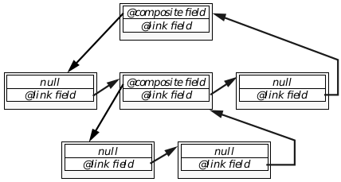

**Figure 5-18** Structure of an Object Tree  
_An object's composite field points to its first child, and its link field points 
either to its next sibling or back to the parent. You can see that, by following 
these links, any object is accessible from any other object in the tree._

##### 5.4.6.5 Detaching and Destroying Objects

MSG_META_DETACH, MSG_META_DETACH_COMPLETE, MSG_META_ACK, 
MSG_META_OBJ_FLUSH_INPUT_QUEUE, MSG_META_OBJ_FREE, 
MSG_META_FINAL_OBJ_FREE, ObjInitDetach(), ObjIncDetach(), 
ObjEnableDetach(), ObjFreeChunk()

While creating objects is actually quite simple, detaching and destroying 
them can be quite involved. For this reason, GEOS does most of the work for 
you, and in most cases you won't have to worry about what happens when 
your application is shut down or saved to a state file. However, if you 
instantiate individual objects of your own classes, you should be very careful 
about how your objects are detached from the system and destroyed.

Detaching objects involves severing all of the object's ties with the rest of the 
system. Destruction of an object entails actually removing the object's 
instance chunk and related structures, making sure that it has handled all 
its waiting messages.

Throughout its life, an object is likely to become involved with a number of 
other things-other objects, drivers, files, streams, the memory manager, the 
kernel-and each of these things may send the object messages from time to 
time. The task, when detaching an object from the system, is to sever all the 
object's ties with the outside world, to make sure that no other entity will 
ever try to contact the object again.

To those unfamiliar with these problems, they can be overwhelming. 
However, GEOS takes care of them for you in most situations. All generic and 
visible objects, all objects in object trees, and all objects that maintain an 
active list will automatically (in nearly all cases) have the detach 
functionality built in by MetaClass.

**The Detach Sequence**

When an object receives MSG_META_DETACH, it begins the detach sequence 
to sever all its ties with other entities in the system. It must first notify all 
its children and all the objects on its various notification lists that it will be 
going away (most often, all its children, by association, will also be detached). 
It then must clear its message queues. Finally, it must acknowledge its 
detachment to the object that originally sent MSG_META_DETACH. Each of 
these phases is described in detail below and is implemented by MetaClass. 
You have to do none of this work unless your object is truly a special case.

Detaching in conjunction with destruction is somewhat intricate because not 
only must the object notify all other interested parties, but it must also 
receive acknowledgment of the notice. Otherwise, the notification and some 
other message could be sent at the same time, and the object could be 
destroyed before the notification can be handled. (Destruction is discussed in 
the following section.)

Because any object may be put in the position of being detached and then 
immediately destroyed, it must send out notification and then wait until all 
the notices have been acknowledged before continuing with other tasks. The 
kernel and MetaClass implement a mechanism for this using four kernel 
routines. Again, you do not need to do this since all classes have MetaClass 
as their root.

First the object being detached (in its MSG_META_DETACH handler) calls the 
routine ObjInitDetach(). This tells the kernel that the object is initiating a 
detach sequence and that the acknowledgment mechanism must be set up. 
The kernel will allocate a variable data entry to hold a count of the number 
of notices sent and acknowledgments received.

After this, the object must send a MSG_META_DETACH or its equivalent to 
each of its children and each of the objects on its active list. With each notice 
sent, the object must call ObjIncDetach(), which increments the notice 
count.

After sending all the notices, the object then calls the kernel routine 
ObjEnableDetach(). This notifies the kernel that all the notices have been 
sent and that the object is waiting for the acknowledgments.

Acknowledgment comes in the form of MSG_META_ACK and is received by 
the object being detached. MSG_META_ACK is handled by MetaClass and 
will decrement the notice count, essentially saying there are one fewer 
notices left to be received. When the final MSG_META_ACK is received 
(setting the notice count to zero) and ObjEnableDetach() has also been 
called, the kernel will automatically send a 
MSG_META_DETACH_COMPLETE to the object. This assures the object that 
it will never receive another message from another entity in the system.

The final step in the detach sequence is acknowledging that the object has 
been detached. In its MSG_META_DETACH_COMPLETE handler, the object 
should send a MSG_META_ACK to the object that originated the detach 
sequence. This will allow that object to continue with its detach sequence if 
it was involved in one; without this step, only leaves of object trees could ever 
be detached. This final step is provided in default handlers in MetaClass 
and is inherited by all objects.

**The Destruction Sequence**

The destruction sequence must be initiated from outside and will begin when 
the object receives a MSG_META_OBJ_FREE. Often, the 
MSG_META_OBJ_FREE will be sent by the object to itself.

The destruction sequence consists of three steps: First, the object must clear 
out its message queues; even though it is detached and can not receive new 
messages, there may be some left over in the queue (an error if it occurs). 
Second, it must finish executing its code and working with its instance data. 
Third, it must free its instance chunk. Each of these steps is described below.

Even though the object has notified the rest of the system that it is going 
away, it still must flush its message queues of any unhandled messages. 
These messages could have been received between the time the original 
MSG_META_OBJ_FREE was received and notification was sent out (due to 
interrupts or context switching). To clear its message queues, the object must 
send itself a MSG_META_OBJ_FLUSH_INPUT_QUEUE, which will ensure that 
any messages in the queues are handled appropriately before the object 
shuts down. This step is handled automatically by the 
MSG_META_OBJ_FREE handler in MetaClass. You should never have to 
send this message, and indeed its use is discouraged.

To the outside world, the second and third steps seem like a single step. 
However, MSG_META_OBJ_FREE can not simply free the instance chunk 
after the queues are cleared; it must be able to access the instance chunk 
until all the method code has been executed. So, MSG_META_OBJ_FREE 
sends the final message to the object, MSG_META_FINAL_OBJ_FREE, and 
then exits. MSG_META_FINAL_OBJ_FREE waits a short while and then frees 
the object's chunk. This ensures that MSG_META_OBJ_FREE has finished and 
the chunk is not being used by any code.

**Possible Pitfalls**

If you're not careful, you can cause the detach mechanism to fail by 
instantiating an object on the fly and saving that object's optr. If the object is 
then detached and you don't account for the saved optr, you could later send 
a message to a nonexistent object. This has undefined results and can be 
nearly impossible to track down.

Note that objects created within resources and by 
ObjDuplicateResource() will almost always automatically be taken care of 
by the detach mechanism. Objects you create with ObjInstantiate() are the 
ones to be careful with.

#### 5.4.6.6 Saving Object State

ObjSaveBlock(), ObjMarkDirty(), ObjMapSavedToState(), 
ObjMapStateToSaved()

Object state saving is almost entirely contained within the system. For the 
most part, only UI objects are saved to state files; however, you can mark 
other object blocks for saving. State saving is described in full in section 6.1.4 
of chapter 6.

[Frist Steps: Hello World](cgetsta.md) <-- &nbsp;&nbsp; [table of contents](../Concepts.md) &nbsp;&nbsp; --> [Applications and Geodes](cappl.md)
