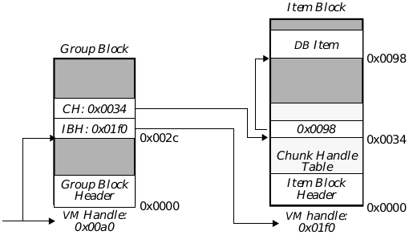
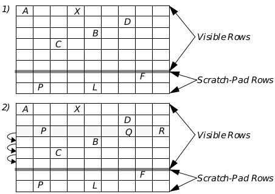

Figure 19-0

Display 19-0

SwatDisplay 19-0

Table 19-0
Important

DB group- and 
item-handles are 
different from LMem 
heap- and 
chunk-handles.

If you allocate an 
"ungrouped" item, 
the DB manager will 
assign it to a group. 
You will need that 
group-handle to 
access the item.
Invalidating Pointers 
to Items

Allocating or 
expanding an item 
can invalidate all 
pointers to items in 
that group. Try to 
unlock items before 
doing an allocation or 
resizing.
Never free a locked 
item

The item-block isn't 
unlocked until the 
last item is unlocked.
Cells are Ungrouped 
DB Items

When you create or 
resize a cell, you 
invalidate pointers to 
all ungrouped items 
in that VM file.

## 19 Database Library

Some applications need to keep track of many small pieces of data. For 
example, a database might use thousands of items of data, each of them only 
a paragraph long; in a spreadsheet, the data size might be only a few bytes. 
GEOS provides a Database (DB) library to make it easy to keep track of such 
data and store them conveniently in a GEOS Virtual Memory file.

The DB library manages Local Memory heaps in a VM file and uses these 
heaps to store items. It lets the geode associate items into groups; these 
groups can grow indefinitely, unlike LMem heaps. 

Before you read this chapter, you should have read "Handles," Chapter 14, 
and "Memory Management," Chapter 15. You should also be familiar with 
basic LMem principles (see "Local Memory," Chapter 16) and with Virtual 
Memory files (see "Virtual Memory," Chapter 18).

### 19.1 Design Philosophy

A database manager should be flexible, allowing applications to store a 
variety of data items. It should be efficient, with minimal overhead in 
data-access time as well as in memory usage (whether in main memory or in 
disk space). Ideally, it ought to insulate applications from the details of 
memory allocation and data referencing. The GEOS database manager meets 
all of these requirements and several more:

+ Flexible Data Formats
The DB Manager does not care about the content of a DB item. 
Consequently, a DB item can be anything that can fit in an LMem chunk. 
An application can use one file to store many different sizes of database 
item.

+ Speed and Efficiency
The GEOS DB library uses the powerful GEOS memory management, 
Virtual Memory, and Local Memory routines. These enable it to store and 
access many database items with a minimal overhead in access time and 
storage space.

+ Uniform Data-Access Format
Database items are stored in standard GEOS Virtual Memory files. All of 
the file-access utilities (such as the document control objects) can work 
unchanged with database files. Furthermore, VM files can contain both 
ordinary VM blocks and DB items in any combination.

+ Full Group Management
Applications can divide DB items into groups. Access time is improved 
when items from the same group are accessed in succession. As an 
alternative, applications can let the DB manager create and assign 
groups for the items.

+ Sharable Data
Since DB items are stored in VM files, the files can be shared between 
applications. All of the standard VM synchronization routines work for 
DB files.

### 19.2 Database Structure

The Database Library uses a Database Manager to access and create DB 
items. These items are stored in a standard VM file. This chapter will 
sometimes refer to a "Database File"; this simply means a VM file which 
contains DB items.

#### 19.2.1 DB Items

The basic unit of data is the item. Items are simply chunks in special LMem 
heaps which are managed by the DB Manager; these heaps are called item 
blocks. You will not need to use any of the LMem routines; the DB manager 
will create and destroy LMem heaps as necessary and will call the 
appropriate routines to lock DB items when needed.

Each DB item in a DB file is uniquely identified by the combination of a 
group-handle and an item-handle. Note that these handles are not the same 
as the item's LMem Heap handle and its chunk handle. You will not generally 
need to use the item's heap and chunk handles; the DB routines store and use 
these automatically. However, you can retrieve them if necessary (for 
example, if you want to use an LMem utility on a DB item).

The DB Manager does not keep track of allocated items. Once you allocate an 
item, you must store the group- and item-handles. If you lose them, the item 
will remain in the file, but you will not be able to find it again. 

Since DB items are chunks, their addresses are somewhat volatile. If you 
allocate an item in a group, other items in that group may move even if they 
are locked. (See section 16.2.2 of chapter 16.)

#### 19.2.2 DB Groups

Each DB item is a member of a DB group. The DB group is a collection of VM 
blocks; the group comprises a single group block and zero or more item 
blocks.

The group block contains information about each item block and each item in 
the group. For each item block, it records the VM handle of the block and the 
number of DB items in the block. For each DB item, it records the VM handle 
of the item block in which the item is stored and the item's chunk handle 
within that item block. The item blocks are simply LMem heaps with a little 
extra information in the headers. 

The item's group-handle is simply the VM handle of the group block for that 
group. The item's item-handle is an offset into the group block; the 
information about the item is stored at that offset. When you lock an item, 
the DB manager looks in that location in the group block and reads the 
handles of the item block and the chunk associated with that item; it then 
locks the item block and returns the address of the chunk. (In assembly code, 
it returns the segment address and the chunk handle.) The relationship 
between the different blocks and handles is shown in Figure 19-1 on 
page l 722.

Whenever you access a DB item, the DB manager has to lock the block. If you 
access several items in a row, the overall access time is better if they belong 
to the same group since only one group block will need to be swapped in to 
memory. The items may also be in the same item-block since each item block 
contains items from only one group; again, this improves access time. Thus, 
it is a good idea to distribute items in groups according to the way they will 
be accessed; for example, an address-book database might group entries 
according to the first letter of the last name, thus speeding up alphabetical 
access. If you have no logical way to group items, see "Ungrouped DB Items" 
on page 723.

#### 19.2.3 Allocating Groups and Items

When you need a new DB group, call the DB routine DBGroupAlloc() (see 
page 725). This routine creates and initializes a DB group block.

When you allocate a DB item, you specify which group the item will go in. The 
DB manager sets up an entry for the item in the group block. It then decides 
which item block to put the item in. It tries to keep all the item blocks at the 
right size to optimize speed. If all of the group's item blocks are too full, it 
allocates a new item block and allocates the new item in that block. In either 
case, it returns the new item's item-handle.

**Figure 19-1** Dereferencing a DB Item  
_A DB item's group- and item-handles indicate an entry in the group block 
which has information on that item's item block handle and chunk handle. 
Here, we dereference the DB item with group-handle 0x00a0 and item-handle 
0x002c. The blocks are shown with their VM handles (not their global 
handles). Addresses next to the blocks indicate offsets into the blocks._

Note that the mechanics are transparent to the application, which simply 
passes the DB group- & item-handles to the DB routine and is returned the 
address of the DB item.

Once an item has been allocated, it will stay in the same item block (and have 
the same chunk handle) until it is freed or resized. If it is resized to a larger 
size, it may be moved to a different item block belonging to the same group.

#### 19.2.4 Ungrouped DB Items

Sometimes there is no natural way to group DB items. For these situations, 
the DB manager allows you to allocate ungrouped items. These items actually 
belong to special groups which are automatically allocated by the DB 
manager. The DB manager tries to keep these groups at the right size for 
optimum efficiency.

When you allocate an ungrouped item, the DB manager allocates an item in 
one of its "ungrouped groups." If there are no such groups or if all of these 
groups have too many items already, the DB manager allocates a new 
"ungrouped" group.

For practical purposes, ungrouped DB items have a single, dword-sized 
handle. This "handle" is of type DBGroupAndItem. The upper word of this 
is the handle of the ungrouped group for this item; the lower word is the 
item's item-handle within that group. There are special versions of most 
database routines for use with ungrouped items. These routines take a 
DBGroupAndItem argument instead of separate group-handle and 
item-handle arguments. These routines are discussed in "Routines for 
Ungrouped Items" on page 729. This section also describes macros which 
combine a group-handle and item-handle into a DBGroupAndItem and 
which break a DBGroupAndItem into its constituent parts.

#### 19.2.5 The DB Map Item

You can designate a "map item" for a VM file with the routine DBSetMap(). 
You can recover the map item's group and handle at will by calling 
DBGetMap(). This is entirely separate from the file's map block; indeed, a 
VM file can have both a map block and a map item, and they may be set, 
locked, and changed independently.

The map routines are described in detail in section 19.3.6 on page 728.

### 19.3 Using Database Routines

GEOS provides a wide range of routines for working with databases. The 
routines all require that the calling thread have the VM file open. Most 
routines have to be passed the VMFileHandle of the appropriate VM file.

Almost all DB routines come in two forms. The standard form takes, among 
its arguments, the group-handle and the item-handle of an item to be 
affected. The other form is designed for use with "ungrouped" items. This 
form takes, as an argument, the item's DBGroupAndItem structure. 

In addition to the routines listed here, all of the VM chain routines can work 
on DB items. Simply cast the DBGroupAndItem structure to type 
VMChain, and pass it in place of the chain argument(s). 
(VMCopyVMChain() will allocate the duplicate item as "ungrouped.") For 
more information about VMChain routines, see section 18.4 of chapter 18.

#### 19.3.1 General Rules to Follow

There are certain rules of "memory etiquette" you should follow when using 
DB files. For the most part, these rules are the same as the general rules of 
memory etiquette.

First and foremost, try to keep as few blocks locked as possible, and keep 
them locked for as short a time as possible. You should not usually need to 
keep more than one item locked at a time. If you need another item, unlock 
the first one first, even if they're in the same item block. (This will cost very 
little time since the item block is unlikely to be swapped to disk right away.) 
The main reason you should have two or more items open at once is if you are 
directly comparing them or copying data from one to another. In this case, 
you should unlock each item as soon as you're done with it.

Remember that items are implemented as chunks in LMem heaps. This 
means, for example, that when you allocate an item (or expand an existing 
one), the heap it resides in (i.e. the item block) may be compacted or moved 
on the global heap (even if it is locked). This will invalidate all pointers to 
items in that item block. As a general rule, you should not allocate (or 
expand) items if you have any items from that group locked. Do not allocate 
"ungrouped" items if you have any items from any of the "ungrouped" groups 
locked. If you must keep an item locked, keep track of the item's memory 
block and chunk handle so you can use DBDeref() to get the address again.

Finally, try to keep the blocks small. Most of this is done for you. When you 
allocate an item, the DB manager will put it in an uncrowded item block. If 
all item blocks are too large, it will allocate a new one. However, you should 
keep items from getting too large. If individual items get into the 
multi-kilobyte range, you should consider storing them a different way; for 
example, you could make each f the larger items a VM block or a VM chain.

#### 19.3.2 Allocating and Freeing Groups

DBGroupAlloc(), DBGroupFree()

You can improve DB access time by assigning items to groups such that items 
from the same group will generally be accessed together. This will cut down 
on the number of times group and item blocks will have to be swapped into 
memory.

To allocate a group, call DBGroupAlloc(). This routine takes one argument, 
namely the handle of the VM file in which to create the group. It allocates the 
group and returns the group-handle (i.e., the VM handle of the group block). 
If it is unable to allocate the group, it will return a null handle.

If you are done with a DB group, call DBGroupFree(). This routine frees the 
group's group block and all of its item blocks. Any attached global memory 
blocks will also be freed. Naturally, all items in the group will be freed as 
well. You can free a group even if some of its items are locked; those items will 
be freed immediately.

#### 19.3.3 Allocating and Freeing Items

DBAlloc(), DBFree()

To allocate a DB item, call DBAlloc(). This routine takes three arguments: 
the handle of the VM file, the DB Group in which to allocate the item, and the 
size of the item (in bytes). The routine will allocate an item in one of that 
group's item blocks (allocating a new item block if necessary); it returns the 
new item's item-handle.

Remember that when you allocate a DB item, the DB manager allocates a 
chunk in an LMem heap (the item block). This can cause the item block to be 
compacted or resized; this will invalidate all pointers to items in that block. 
For this reason, you should not allocate items in a group while other items in 
that group are locked. Similarly, you should not allocate "ungrouped" items 
while any "ungrouped" items are locked. Instead, unlock the items, allocate 
the new one, and then lock the items again.

When you are done with an item, free it with DBFree(). This routine takes 
three arguments: the file handle, the group-handle, and the item-handle. It 
frees the item, making appropriate changes in the group block. If the item 
was the only one in its item block, that item block will be freed as well. 
DBFree() does not return anything. Note that you should never free a locked 
item since the item-block's reference-count will not be decremented (and the 
block will never be unlocked). Always unlock an item before freeing it. (You 
need not, however, unlock items before freeing their group; when a group is 
freed, all of its items are automatically freed, whether they are locked or not.)

#### 19.3.4 Accessing DB Items

DBLock(), DBLockGetRef(), DBDeref(), DBUnlock(), DBDirty()

To access a database item, lock it with DBLock(). This routine takes three 
arguments: the handle of the VM file, the item's group-handle, and the item's 
item-handle. The routine locks the item-block on the global heap and returns 
the address of the element. If the block is already locked (generally because 
another item in the item-block is locked), it increments the lock count.

In some circumstances it might be useful to know the global handle of the 
locked item-block and the chunk handle of the item. For example, if you want 
to set up an item as a chunk array, you will need this information. For this 
reason, the library provides the routine DBLockGetRef(). This routine is 
just like DBLock(), except that it takes one additional argument: the 
address of a variable of type optr. DBLockItemGetRef() writes global and 
chunk handles to the optr and returns the address of the locked DB item. You 
can now use any of the LMem routines on the item, simply by passing the optr.

Note that the memory block attached to the item block may change each time 
the block is locked unless you have instructed the VM manager to preserve 
the handle (see section 18.3.6 of chapter 18). The chunk handle will not 
change, even if the file is closed and reopened, unless the chunk is resized 
larger. (When an item is resized larger, the DB manager may choose to move 
the item to a different item-block, thus changing its chunk handle.) In 
general, if you will need this information you should get it each time you lock 
the item instead of trying to preserve it from one lock to the next.

If you have an optr to a locked DB item, you can translate it to an address 
with the routine DBDeref(). This is useful if you have to keep one item 
locked while allocating or expanding another item in that group. Since the 
locked item might move as a result of the allocation, you can get the new 
address with DBDeref(). In general, however, you should unlock all items in 
a group before allocating or resizing one there. Note that DBDeref is simply 
a synonym for LMemDeref(); the two routines are exactly the same.

When you are done accessing an item, call DBUnlock(). This routine takes 
one argument, the address of a locked item. The routine decrements the 
reference count of the item's item-block. If the reference count reaches zero, 
the routine unlocks the block. Thus, if you lock two different items in an item 
block, you should unlock each item separately. As noted above, you should 
always unlock an item before freeing it.

If you change a DB item, you should mark the item's block as dirty by calling 
DBDirty(). This ensures that the changes will be copied to the disk the next 
time the file is saved or updated. The routine takes one argument, a pointer 
to an address in an item block (generally the address of an item). It will dirty 
the item-block containing that item. As with VM blocks, you must dirty the 
item before you unlock it, as the memory manager can discard any clean 
block from memory as soon as it is unlocked.

#### 19.3.5 Resizing DB Items

DBReAlloc(), DBInsertAt(), DBDeleteAt()

Database items may be resized after allocation. They may be expanded either 
by having bytes added to the end or by having bytes inserted at a specified 
offset within the item. Similarly, items may be contracted by having bytes 
truncated or by having bytes deleted from the middle of the item. When an 
item is resized, the DB manager automatically dirties the item block (or 
blocks) affected.

As noted above, when an item is expanded, its item block can be compacted 
or moved on the item heap (even if the item is locked). Thus, pointers to all 
items in that item block may be invalidated, even if they are locked. For that 
reason, you should unlock all items in the group before expanding any of 
them. If you must leave an item locked, be sure to get its new address with 
DBDeref(). If you decrease an item's size, the item-block is guaranteed not 
to move or be compacted. Thus, you can safely contract locked items (or items 
in the same block as locked items).

To set a new size for an item, call DBReAlloc(). This routine takes four 
arguments: the file handle, the group-handle, the item-handle, and the new 
size (in bytes). If the new size is smaller than the old, bytes will be truncated 
from the end of the item. If the new size is larger than the old, bytes will be 
added to the end of the item; these bytes will not be zero-initialized.

To insert bytes in the middle of an item, call the routine DBInsertAt(). This 
routine takes five arguments: the file handle, the group-handle, the 
item-handle, the offset (within the item) at which to insert the bytes, and the 
number of bytes to insert. The new bytes will be inserted beginning at that 
offset; they will be zero-initialized. Thus, if you insert ten bytes beginning at 
offset 35, the new bytes will be at offsets 35-44; the byte which had been at 
offset 35 will be moved to offset 45. To insert bytes at the beginning of an 
item, pass an offset of zero.

To delete bytes from the middle of an item, call DBDeleteAt(). This routine 
takes five arguments: the file handle, the group-handle, the item-handle, the 
offset (within the item) of the first byte to delete, and the number of bytes to 
delete. The routine does not return anything.

#### 19.3.6 Setting and Using the Map Item

DBSetMap(), DBGetMap(), DBLockMap()

A VM file can have a map block and a map item. The map can be retrieved 
with a special-purpose routine, even if you don't know its handle (or handles); 
thus, the map usually keeps track of the handles for the rest of the file. The 
map can be retrieved even if the file is closed and re-opened. To set a map 
block, use the routine VMSetMap() (see section 18.3.10 of chapter 18). To set 
a map item, use the routine DBSetMap(). DBSetMap() takes three 
arguments: the file handle, the item's group-handle, and the item's 
item-handle. The routine sets the file's map item to the DB item specified. A 
VM file can have both a map block and a map item; these are set 
independently.

Once you have set a map item, you can retrieve its handles with the 
command DBGetMap(). This routine takes one argument, namely the file's 
handle. It returns a DBGroupAndItem value containing the map item's 
handles. You can break this value into its constituent handles with 
DBGroupFromGroupAndItem() and DBItemFromGroupAndItem() 
(see section 19.3.7 on page 729). You can also lock the map directly without 
knowing its handles by calling the routine DBLockMap(). This routine 
takes one argument, namely the file handle. It locks the map item and 
returns the map's address. When you are done with the map item, unlock it 
normally with a call to DBUnlock().

#### 19.3.7 Routines for Ungrouped Items

DBAllocUngrouped(), DBFreeUngrouped(), DBLockUngrouped(), 
DBLockGetRefUngrouped(), DBReAllocUngrouped(), 
DBInsertAtUngrouped(), DBDeleteAtUngrouped(), 
DBSetMapUngrouped()

Special routines are provided for working with ungrouped items. These 
routines are very similar to their standard counterparts. The routine 
DBAllocUngrouped() allocates an ungrouped item. It takes two 
arguments, the file handle and the size of the item to allocate. The DB 
manager allocates the item in one of the "ungrouped" groups and returns a 
DBGroupAndItem value containing the group-handle and item-handle. 
You can break this value into its components by calling the macros described 
in section 19.3.7 on page 729, or you can pass this value directly to the other 
"ungrouped" routines.

The rest of the routines listed above are exactly the same as their 
counterparts with one exception: whereas their counterparts take, among 
their arguments, the item's group-handle and item-handle, the ungrouped 
routines take a DBGroupAndItem value. Each routine's other arguments 
are unchanged, as is the return value.

These routines are provided as a convenience. If you allocate an ungrouped 
item, you are perfectly free to break the DBGroupAndItem value into its 
component handles, and pass those handles to the standard DB routines. 
Conversely, if you allocate a normal "grouped" item, you are free to combine 
the two handles into a DBGroupAndItem token and pass that token to the 
"ungrouped" routines.

#### 19.3.8 Other DB Utilities

DBCopyDBItem(), DBCopyDBItemUngrouped(), 
DBGroupFromGroupAndItem(), DBItemFromGroupAndItem(), 
DBCombineGroupAndItem()

You can duplicate a DB item with the routine DBCopyDBItem(). This 
routine takes five arguments: the handle of the source file, the source item's 
group-handle, the source item's item-handle, the handle of the destination 
file (which may be the same as the source file), and the handle of the 
destination group. The routine will allocate a new item in the specified file 
and group. It will then lock both items and copy the data from the source item 
to the destination. Finally, it will unlock both items and return the 
item-handle of the duplicate item.

The routine DBCopyDBItemUngrouped() is the same as 
DBCopyDBItem(), except that it allocates an ungrouped item in the 
specified file. It is passed the source file handle, the DBGroupAndItem 
value for the source item, and the destination file handle. It allocates an 
ungrouped item and returns its DBGroupAndItem value.

Remember, if you are allocating the duplicate in the same group as the 
source, you should only call this routine when the source item is unlocked 
(since its item-block may be compacted when the new item is allocated). If the 
destination is in another block, the source item may be locked or unlocked at 
your preference. If it is locked when you call DBCopyDBItem(), it will be 
locked when the routine returns.

All of the VM chain utilities work on DB items as well as VM chains. The 
routines are described in section 18.4 of chapter 18. To use a VM chain 
routine, pass the item's DBGroupAndItem value. For example, 
VMCopyVMChain() will allocate an "ungrouped" duplicate item in the 
specified file and return its DBGroupAndItem value.

To build a DBGroupAndItem value from the group-handle and 
item-handle, use the macro DBCombineGroupAndItem(). This macro 
takes the two handles and returns a DBGroupAndItem value. To extract 
the component handles from a DBGroupAndItem value, use the macros 
DBGroupFromGroupAndItem() and DBItemFromGroupAndItem(). 
These macros are passed a DBGroupAndItem value and return the 
appropriate component.

### 19.4 The Cell Library

The database library lets applications organize data into groups. This is an 
intuitive way to organize data for many applications. However, for some 
applications, it is more natural to organize data in a two-dimensional array. 
The classic example of this is the spreadsheet, in which every entry (or cell) 
can be uniquely identified by two integers: the cell's row and its column.

The GEOS cell library lets you arrange data this way. With the cell library, 
you can organize data in rows and columns. The cell library saves the cells as 
DB items in a VM file. It insulates the application from the actual DB 
mechanism, letting the application behave as if its data is stored in a 
two-dimensional array. However, since the data is stored in DB items, it may 
be kept in any ordinary VM file. The library also provides routines to sort the 
cells by row or by column and to apply a routine to every cell in a range of 
rows and/or columns.

A collection of cells arranged into rows and columns is termed a cell file. 
Every cell file is contained in a VM file. There is often a one-to-one 
correspondence between cell files and the VM files which contain them. 
However, this correspondence is optional. There is nothing to stop an 
application from maintaining several distinct cell files in a single VM file.

#### 19.4.1 Structure and Design

Most of the internal structure of a cell file is transparent to the geode which 
uses it. A geode can, for example, lock a cell with CellLock(), specifying the 
cell's row and column. The cell library will find the appropriate DB item and 
lock it, returning the locked item's address. For most operations, the geode 
does not need to know anything about the internal structure of the cell file. 
However, the internal structure does matter for some purposes. For this 
reason, we present a quick overview of the structure of a cell file.

A cell file can contain up to 16,512 rows, numbered from zero to 16,511. This 
is less than , so a row index can fit in a signed-word variable. Of these 
16,512 rows, the last 128 are "scratch-pad" rows. They are intended to be 
used for holding information or formulae that will not be displayed or 
associated with a specific cell. The scratch-pad rows are never shifted; if you 
create a cell in the first scratch-pad row, it will always stay in that row. All 
other rows are called "visible" rows. Visible rows can be shifted when rows 
are created or deleted. For example, if you insert a new row 10, all the cells 
in the old row 10 will now be in row 11, and so on. The first scratch-pad row 
will be unchanged. Be aware that the database will not delete cells from rows 
that are shifted off the spreadsheet. For example, if you insert a new row, the 
last visible row will be shifted off the spreadsheet; the references to cells in 
that row will be removed, but the cells themselves will stay as DB items in 
the file. This is not generally a problem, since few cell files will need to use 
the last visible rows. If you add a row that will cause cells to be shifted off, 
you should delete those cells first. 

The first row has an index number of zero. (See Figure 19-2.) The last visible 
row has an index equal to the preprocessor constant 
LARGEST_VISIBLE_ROW. The first scratch-pad row has an index equal to 
(LARGEST_VISIBLE_ROW + 1). The last scratch-pad row has an index equal 
to LARGEST_ROW (which equals (LARGEST_VISIBLE_ROW + 128) or 16,511). 
The constants are all defined in cell.h.

The basic data unit in a cell file is the cell. The cell library treats cells as 
opaque data structures; their internal structure is entirely up to the geode 
using them. Cells are stored as ungrouped DB items. This restricts cell size 
to the size of a DB item; that is, a cell can theoretically be as large as 64K, but 
in practice should not grow larger than around 8K (and ideally should be 
under a kilobyte in size). Remember, whenever a DB item is created or 
resized, pointers to all other items in the group are invalidated. Since cells 
are ungrouped items, whenever you create or resize a cell, you invalidate any 
pointers to all other ungrouped items in that VM file. In particular, you 
invalidate pointers to all other cells in that VM file (even if the cells belong to 
another cell file in the VM file).

**Figure 19-2** Inserting a New Row  
_1) A cell file before a row is inserted. This is an abstract representation; in fact 
the rows contain references to cells, not the cells themselves. Real cell files, of 
course, have many more visible and scratch-pad rows.  
2) A new row is inserted at position 2. This shifts all the following visible rows 
down; it does not affect the scratch-pad rows.
"Ungrouped" Items_

Cells are grouped into rows. A row can have up to 256 cells, numbered from 
zero to 255. Within a row, cells are identified by their column index. The 
column index can fit into an unsigned byte variable. The cell library creates 
a column array for every row which contains cells. The column array contains 
one entry for each cell in the row. A row often contains just a few widely 
scattered elements. For this reason, the column array is implemented as a 
sparse array. Each cell in the row has an entry consisting of two parts, 
namely the cell's column number and its DBGroupAndItem structure. The 
advantage of this arrangement is that the column array need only contain 
entries for those cells which exist in the row (instead of maintaining entries 
for the blank spaces between cells). The disadvantage is that when you lock 
a cell, the cell manager has to make a search through the column array to 
find its reference; however, this is generally a small cost.

The column arrays themselves belong to row blocks. Each row block is an 
LMem heap stored in the VM file, and each of its column arrays is a chunk in 
that heap. Row blocks contain up to 32 rows. These rows are sequential; that 
is, any existing rows from row zero to row 31 will always belong to the same 
row block, and none of them will ever be in the same row block as row 32. 
Since the row blocks and column arrays are not kept in DB items, they can be 
accessed and altered without causing any locked items to move. To keep track 
of the row blocks, you must have a CellFunctionParameters structure for 
each cell file. That structure need not be kept in the VM file (although it often 
is); rather, you must pass the address of the structure to any cell library 
routine you call.

Owing to the structure of a cell file, some actions are faster than others. The 
essential thing to remember is that cells are grouped together in rows, which 
are themselves grouped together to form a cell file. This means that you can 
access several cells belonging to the same row faster than you could access 
cells belonging to different rows. Similarly, if you insert a cell, it is much more 
efficient to shift the rest of the row over (which involves accessing only that 
one row) than to shift the rest of the column down (which involves accessing 
every visible row). Similarly, you can access groups of cells faster if they 
belong to the same row block.

#### 19.4.2 Using the Cell Library

The cell library is versatile. The basic cell access routines are very simple, 
but more advanced utilities give you a wide range of actions. This section will 
explain the techniques used to set up and use a cell file, as well as the more 
advanced techniques available.

##### 19.4.2.1 The CellFunctionParameters Structure

The cell library needs to have certain information about any cell file on which 
it acts; for example, it needs to know the handles of the VM file and of the row 
blocks. That information is kept in a CellFunctionParameters structure. 
The geode which uses a cell file is responsible for creating a 
CellFunctionParameters structure. The C definition of the structure is 
shown below.

---
Code Display 19-1 CellFunctionParameters
~~~
typedef	struct {
	CellFunctionParameterFlags 	CFP_flags;	/* Initialize this to zero. */
	VMFileHandle		CFP_file;	/* The handle of the VM file containing
						 * the cell file. Reinitialize this each
						 * time you open the file. */
	VMBlockHandle		CFP_rowBlocks[N_ROW_BLOCKS];	/* Initialize these to zero. */
} CellFunctionParameters;
~~~

In order to create a cell file, you must create a CellFunctionParameters 
structure. Simply allocate the space for the structure and initialize the data 
fields. When you call a cell library routine, lock the structure on the global 
heap and pass its address. Geodes will usually allocate a VM block in the 
same file as the cell file, and use this block to hold the 
CellFunctionParameters structure; this ensures that the structure will be 
saved along with the cell file. They may often declare this to be the map block, 
making it easy to locate (see section 18.3.10 of chapter 18). However, this is 
entirely at the programmer's discretion. All that the cell library requires is 
that the structure be locked or fixed in memory every time a cell library 
routine is called.

The CellFunctionParameters structure contains the following fields:

CFP_flags  
The cell library uses this byte for miscellaneous bookkeeping. 
When you create the structure, initialize this field to zero. 
There is only one flag which you should check or change; that 
is the flag CFPF_DIRTY. The cell library routines set this bit 
whenever they change the CellFunctionParameters 
structure, thus indicating that the structure ought to be 
resaved. After you save it, you may clear this bit.

CFP_file  
This field must contain the file handle of the VM file containing 
the cell file. A VM file can have a new file handle every time it 
is opened; thus, you must reinitialize this field every time you 
open the file. 

CFP_rowBlocks  
This field is an array of VM block handles, one for every existing 
or potential row block. If a row block exists in the cell file, its 
handle is recorded here. If it does not exist, a null handle is 
kept in the appropriate place. The length of this array is a 
number of words equal to the constant N_ROW_BLOCKS 
(defined in cell.h). When you create a cell file, initialize all of 
these handles to zero; do not access or change this field 
thereafter.

One warning: The cell library expects the CellFunctionParameters 
structure to remain motionless for the duration of a call. Therefore, if you 
allocate it as a DB item in the same VM file as the cell file, you must not have 
the structure be an ungrouped item. Remember, all the cells are ungrouped 
DB items; allocating or resizing a cell can potentially move any or all of the 
ungrouped DB items in that file.

##### 19.4.2.2 Basic Cell Array Routines

CellReplace(), CellLock(), CellLockGetRef(), CellDirty(), 
CellGetDBItem(), CellGetExtent()

The basic cell routines are simple to use. One argument taken by all of them 
is the address of the CellFunctionParameters structure. As noted, this 
structure must be locked or fixed in memory for the duration of a function 
call. You can also access cells in any of the ways you would access a DB item; 
for example, you can resize a cell with DBReAlloc().

All of the routines use the VM file handle specified in the 
CellFunctionParameters structure. 

To create, replace, or free a cell, call the routine CellReplace(). This routine 
takes five arguments: 

+ The address of the CellFunctionParameters structure.

+ The element's row.

+ The element's column.

+ The address of the data to copy into the new cell. This must not move 
during the allocation; therefore, it must not be in an ungrouped DB item 
in the same VM file as the cell file. In particular, it must not be another 
cell. The data will not be changed.

+ The size of the new cell. If you pass a size of zero, the cell will be deleted 
if it already exists; otherwise, nothing will happen.

If the cell file already contains a cell with the specified coordinates, 
CellReplace() will free it. CellReplace() will then allocate a new cell and 
copy the specified data into it. The routine invalidates any existing pointers 
to ungrouped DB items in the file.

Once you have created a cell, you can lock it with CellLock(). This routine 
takes three arguments: the address of the CellFunctionParameters 
structure, the cell's row, and the cell's column. It locks the cell and returns its 
address (the assembly version returns the cell's segment address and chunk 
handle). Remember, the cell is an ungrouped DB item, so its address may 
change the next time another ungrouped DB item is allocated or resized, even 
if the cell is locked.

Like all DB items, cells can (under certain circumstances) be moved even 
while locked. For this reason, a special locking routine is provided, namely 
CellLockGetRef(). This routine is just like CellLock() except that it takes 
one additional argument, namely the address of an optr. CellLockGetRef 
writes the locked item's global memory handle and chunk handle into the 
optr. You can translate an optr to a cell into a pointer by calling CellDeref(); 
this is another synonym for LMemDeref(), and is identical to it in all 
respects. For more information, see section 19.3.4 on page 726.

If you change a cell, you must mark it dirty to insure that it will be updated 
on the disk. To do this, call the routine CellDirty(). This routine takes two 
arguments, namely the address of the CellFunctionParameters structure 
and the address of the (locked) cell. The routine marks the cell's item block 
as dirty.

Sometimes you may need to get the DB handles for a cell. For example, you 
may want to use a DB utility to resize the cell; to do this, you need to know 
its handles. For these situations, call the routine CellGetDBItem(). The 
routine takes three arguments: the address of the 
CellFunctionParameters structure, the cell's row, and the cell's column. It 
returns the cell's DBGroupAndItem value. You can pass this value to any 
of the DB-Ungrouped() routines (described in "Routines for Ungrouped 
Items" on page 729), or you can break this value into its component handles 
by calling DBGroupFromGroupAndItem() or 
DBItemFromGroupAndItem().

If you want to find out the bounds of an existing cell file, call the routine 
CellGetExtent(). This routine takes two arguments: the address of the 
CellFunctionParameters, and the address of a RangeEnumParams 
structure. For the purposes of this routine, only one of its fields matters, 
namely the field REP_bounds. This field is itself a structure of type 
Rectangle, whose structure is shown below in Code Display 19-2. 
CellGetExtent() writes the bounds of the utilized section of the cell file in 
the REP_bounds field. The index of the first row which contains a cell will be 
written in the rectangle's R_top field; the index of the last row will be written 
in R_bottom; the index of the first column will be written in R_left; and the 
index of the last column will be written in R_right. If the cell file contains no 
cells, all four fields will be set to .

---
Code Display 19-2 Rectangle
~~~
typedef	struct {
	sword		R_left;		/* Index of first column written here. */
	sword		R_top;		/* Index of first row written here. */
	sword		R_right;		/* Index of last column written here. */
	sword		R_bottom;		/* Index of last row written here. */
} Rectangle;
~~~

##### 19.4.2.3 Actions on a Range of Cells

RangeExists(), RangeInsert(), RangeEnum(), RangeSort(), 
RangeInsertParams

The cell library provides a number of routines which act on a range of cells. 
All of these routines take the address of a CellFunctionParameters 
structure as an argument. Many of these routines also take the address of a 
special parameter structure; for example, RangeInsert() takes the address 
of a RangeInsertParams structure. In these cases, the structure should be 
in locked or fixed memory. If the routine might allocate or resize cells, the 
structure must not be in an ungrouped DB item.

You may want to find out if there are any cells in a specified section of the cell 
file. To do this, call the routine RangeExists(). This routine takes five 
arguments:

+ The address of the locked CellFunctionParameters structure

+ The index of the first row in the section to be checked

+ The index of the first column in the section to be checked

+ The index of the last row in the section to be checked

+ The index of the last column in the section to be checked

If any cells exist in that section, the routine returns true (i.e. non-zero). 
Otherwise, it returns false.

You may wish to insert several cells at once. For this reason, the cell library 
provides the routine RangeInsert(). This routine does not actually allocate 
cells; instead, it shifts existing cells to make room for new ones. You specify 
a section of the cell file to shift. Any cells in that section will be shifted over; 
the caller specifies whether they should be shifted horizontally or vertically. 
The routine takes two arguments, namely the address of the 
CellFunctionParameters and the address of a RangeInsertParams 
structure. It does not return anything. The definition of the 
RangeInsertParams structure is shown in Code Display 19-3. The calling 
geode should allocate it and initialize it before calling RangeInsert().

---
Code Display 19-3 The RangeInsertParams and Point structures
~~~
typedef	struct {		/* defined in cell.h */
	Rectangle			RIP_bounds;		/* Range of cells to shift */
	Point			RIP_delta;		/* Specify which way to shift */
	CellFunctionParameters			*RIP_cfp;
} RangeInsertParams;

typedef	struct {		/* defined in graphics.h */
	sword		P_x;	/* Distance to shift horizontally */
	sword		P_y;	/* Distance to shift vertically */
} Point;
~~~

The RangeInsertParams structure has three fields. The calling geode 
should initialize the fields to determine the behavior of RangeInsert():

RIP_bounds  
This field specifies which cells should be shifted. The cells 
currently in this range will be shifted across or down, 
depending on the value of RIP_delta; this shifts more cells, and 
so on, to the edge of the visible portion of the cell file. The field 
is a Rectangle structure. To insert an entire row (which is 
much faster than inserting a partial row), set 
RIP_bounds.R_left = 0 and RIP_bounds.R_right = LARGEST_COLUMN.

RIP_delta  
This field specifies how far the cells should be shifted and in 
which direction. The field is a Point structure (see Code 
Display 19-3). If the range of cells is to be shifted horizontally, 
RIP_delta.P_x should specify how far the cells should be shifted 
to the right, and RIP_delta.P_y should be zero. If the cells are to 
be shifted vertically, RIP_delta.P_y should specify how far the 
cells should be shifted down, and RIP_delta.P_x should be zero.

RIP_cfp  
This is the address of the CellFunctionParameters 
structure. You don't have to initialize this; the routine will do 
so automatically.

You may need to perform a certain function on every one of a range of cells. 
For this purpose, the cell library provides the routine RangeEnum(). This 
routine lets you specify a range of cells and a callback routine; the routine 
will be called on each cell in that range.

You can sort a range of cells, by row or by column, based on any criteria you 
choose. Use the routine RangeSort(). This routine uses a QuickSort 
algorithm to sort the cells specified. You supply a pointer to a callback routine 
which is used to compare cells.
