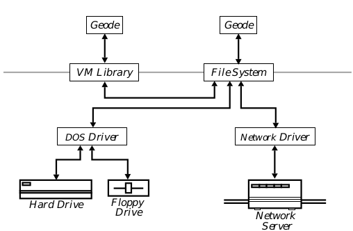
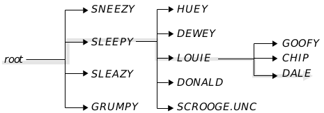

## 17 File System

Every operating system needs a way to interact with files. Files are used to 
hold both data and executable code. They are also the simplest way of 
transferring data from one computer to another.

GEOS provides powerful file-management functionality. It runs on top of a 
disk-operating system, and uses that DOS to read files from different media. 
Applications which run under GEOS need only interact with the GEOS 
file-management system; they are insulated from the differences between 
versions of DOS. They are also insulated from the differences between 
various file-storage media: CD-ROM drives, network file servers, and floppy 
and hard disks all present the same interface.

The GEOS file system provides functionality that many versions of DOS do 
not have. It allows the use of virtual directories, so (for example) the system's 
FONT directory could actually comprise several physical directories. GEOS 
files have functionality which DOS files lack. For example, GEOS provides 
support for file-sharing and data-access synchronization across networks. 
Nevertheless, GEOS lets applications access standard DOS files and 
directories when desired.

You may not need to use much of the file system directly. The document 
control and file-selector objects can let the user select and open files 
transparently to the application. Many applications will never need to 
negotiate the directory structure.

Before reading this section, you should have read ["System Architecture", 
Chapter 3](carch.md), and ["First Steps: Hello World", Chapter 4](cgetsta.md). 
You should also be familiar with GEOS handles (discussed in ["Handles", Chapter 14](chandle.md)).

### 17.1 Design Philosophy

The GEOS file system was designed to meet two goals. First, the file system 
should insulate geodes from differences in hardware, making them device 
independent; and second, it should give geodes all the functionality they 
might plausibly want without being cumbersome.

One of the hallmarks of GEOS is its ability to insulate applications from 
differences in hardware. The GEOS file system plays a large role in this. 
Geodes which need access to files make their requests to the GEOS file 
system, which accesses the actual storage media. The virtues of this 
approach are several:

+ Geodes can rely on a consistent API for accessing media. When an 
application needs to open a file, it uses exactly the same techniques 
whether the file resides on a hard or floppy disk, a network drive, or some 
other medium.

+ GEOS can easily expand to make use of new technologies. To support a 
new storage medium, GEOS just needs a new device driver; all existing 
application binaries will automatically work with the new device.

+ Applications need not worry about what DOS the system might be 
running under. The GEOS file system does all interaction with the DOS 
and automatically takes advantages of each DOS' strengths. To support 
new versions of DOS, GEOS just needs new drivers.

GEOS is also flexible. Flexibility means more than just being able to use new 
technology in the same old ways; it means providing functionality to serve 
unforeseen purposes. GEOS provides this:

+ The file system allows such advanced functionality as virtual paths and 
directories. Files can thus be distributed across various media (for 
example, templates and fonts on CD-ROM drives, company files on a 
network drive, other documents on local hard disks) transparently to 
both user and application.

+ Other functionality can be added. For example, all GEOS files can have 
names up to 32 characters long, regardless of strictures on individual 
media. The file system maps the GEOS "virtual names" to 
device-dependent "native names" transparently to the user and application.

While GEOS provides this advanced functionality, it still lets geodes access 
the raw files. If a geode wants to access any file as a sequence of bytes (the 
DOS model), it may do so. Similarly, geodes may work with physical DOS 
directories if they wish to.

### 17.2 File System Overview

The GEOS file system manages all access to files on any type of storage. 
Whenever a geode needs to access a data file, it calls a file system routine. 
The file system makes any necessary calls to the computer's DOS. Like much 
of the GEOS system, it is driver-based; this makes it easy to expand GEOS to 
accommodate new technologies.

When a geode needs to access a file, it makes a call to the file system. The file 
system sends requests through the appropriate driver. For example, if the 
geode needs access to a file on a local hard or floppy disk drive, the file system 
will send commands through a DOS driver, which will in turn issue 
appropriate commands to the DOS itself. Similarly, if the file resides on a 
network drive, the file system will send commands through an appropriate 
network driver, which will translate them into corresponding commands to 
the network server. (See Figure 17-1 below.)

**Figure 17-1** Accessing Files Through the File System  
_The application interacts only with the file system or a library built on top of 
it (such as the VM library). Everything below that is transparent to both 
application and user. Arrows depict the flow of commands and data._

Every storage device is known as a drive. A drive can be either fixed-media 
or movable-media. Fixed media drives are always associated with a specific 
storage medium; in effect, the drive is the same as the storage. The primary 
example of this is the conventional hard disk. Movable-media drives use a 
potentially unlimited number of storage objects. Examples include floppy 
disk drives, CD-ROM drives, and cartridge hard drives. 

One way of organizing storage objects is to divide them into volumes. 
Ordinarily, every disk (floppy or hard) is a single volume; however, hard disks 
are sometimes divided into several volumes. Network storage devices are 
frequently divided into several volumes. If a single drive is partitioned into 
several volumes, DOS and GEOS treat each volume as a separate drive. In 
this chapter, the words volume and disk will be used interchangeably.

Individual volumes are organized with directories. A directory may contain 
several different files or directories. There is not usually a limit on the 
number of files a directory may contain; however, no two files or directories 
belonging to a given directory may have the same name.

Every volume is organized in a directory tree. The topmost directory is known 
as the root; it is unnamed, since every volume contains exactly one root 
directory. The root may contain files or directories. Those directories may 
themselves contain files or directories, and so on. The total number of files is 
usually limited only by the size of the storage device.

To specify a file, you need to specify three things: The volume the file resides 
on, the directory to which the file belongs, and the file's name. In most DOS 
environments, a volume is generally specified with a letter followed by a 
colon (for example, the first hard disk is generally specified as "C:"). For 
non-fixed media (e.g. floppy disks), the letter actually specifies the drive; the 
volume is presumed to be in that drive. In GEOS, volumes and drives have 
different identifying systems. Every drive is identified by a drive number. 
This is a positive integer; the first drive has a number of zero, the second is 
drive one, and so on. Every volume is identified by a token (the disk handle).

Specifying the directory is a little trickier. There may be many directories 
with the same name on a given volume. For this reason, the directory is 
specified with a path. The path begins with the root directory; the root is 
followed by the name of one of the directories belonging to the root; that 
directory is followed by the name of one of its subdirectories; and so on, until 
the desired directory is reached. Since all the directories belonging to a given 
directory must have unique names, the path is guaranteed to uniquely 
specify a directory on a volume. For example, you might specify a directory 
as "\GEOWORKS\DOCUMENT\MEMOS"; this would indicate d directory 
named "MEMOS," which belongs to a directory named "DOCUMENT," which 
in turn belonged to a directory named "GEOWORKS," which was at the root 
level.

The file itself is identified by its name. Since its directory has been uniquely 
specified by the volume and path, the name is guaranteed to specify at most 
one file in that directory. Each disk-operating system has its own conventions 
about how file names can be formed; for example, MS-DOS requires file names 
to have a "name" portion of at most eight letters, followed by an "extension" 
of at most three letters (known as the "FILENAME.EXT" convention). (See 
Figure 17-2.)

**Figure 17-2** A Path Through a Directory Tree  
_In MS-DOS, the highlighted path would be described as 
"\SLEEPY\LOUIE\DALE"._

For convenience, most operating systems let you specify a "working 
directory." This is a combination of a volume and a path. If you have a 
working directory, you can omit either the volume or the path from a file 
specification, and the volume and/or path of the working directory will be 
used. This is called a "relative path," i.e. a path that is relative to the working 
directory instead of the root directory. (Note that if you specify a disk handle 
for any operation, you must pass an absolute path which begins at the root of 
that disk or standard path.) GEOS allows every thread to have its own 
working directory; each thread can also save paths on a stack, letting the 
thread switch directories easily. For more details, see [section 17.4.2]
(#1742-current-path-and-directory-stack).

Some disk-operating systems, such as MS-DOS, allow a working directory for 
each drive. GEOS does not allow this; you may have only one working 
directory at a time, regardless of how many drives you have. If you need to 
switch back and forth between directories on different drives, you can use the 
directory stack (see [section 17.4.2](#1742-current-path-and-directory-stack)).

### 17.3 Disks and Drives

GEOS provides an easy interface to storage devices. Every drive (or analogous 
storage device) is identified by a token. Every volume is also identified by a 
token. This enables you to easily move from one volume to another.

You generally need only worry about disks and drives when you are opening 
a file. Once you have a file open, you can access the file by its file handle 
without paying attention to the disk it resides on. The GEOS file system will 
automatically prompt the user to change disks whenever necessary.

Note that if you use the document control object to open files, you will 
probably never have to worry about disks and drives. The document control 
automatically presents a File Selector dialog box to the user, letting the user 
navigate among disks and directories; when the user selects a file, the 
document control will automatically open the file and return its handle to the 
application.

#### 17.3.1 Accessing Drives

DriveGetStatus(), DriveGetExtStatus(), 
DriveGetDefaultMedia(), DriveTestMediaSupport(), 
DriveGetName(), DriveStatus, DriveType, MediaType

Most systems running GEOS have access to a number of different drives. 
With the exception of network drives, the drives available will usually not 
change during an execution of GEOS, although the volumes mounted on the 
drives can change. Every drive is accessed by its drive number. This token is 
a byte-length integer value.

When you wish to open a file, you must specify its volume, not its drive. This 
is because the volume mounted on a drive can change frequently and without 
warning. 

GEOS provides routines to get information about a drive. To get general 
information about a drive, call the routine **DriveGetStatus()**. This routine 
takes the drive number and returns a word-length set of **DriveStatus** flags 
(defined in drive.h). If an error condition exists, such as the drive you 
request not existing, it returns zero. The following flags may be returned:

DS_PRESENT  
This flag is set if the physical drive exists, regardless of 
whether the drive contains a disk.

DS_MEDIA_REMOVABLE  
This flag is set if the disk can be removed from the drive.

DS_NETWORK  
This flag is set if the drive is accessed over a network (or via 
network protocols), which means the drive cannot be formatted 
or copied.

DS_TYPE  
This is a mask for the lowest four bits of the field. These bits 
contain a member of the **DriveType** enumerated type.

The lowest four bits of the word contains a member of the DriveType 
enumerated type. The field can be accessed by masking out all the bits except 
for those set in DS_TYPE. **DriveType** comprises the following values:

DRIVE_5_25  
Drive uses 5.25-inch floppy disks.

DRIVE_3_5  
Drive uses 3.5-inch floppy disks.

DRIVE_FIXED  
Drive uses some kind of fixed disk (e.g. a hard drive).

DRIVE_RAM  
Drive is chip-based (either RAM or ROM).

DRIVE_CD_ROM  
Drive uses read-only optical disks.

DRIVE_8  
Drive uses 8-inch floppy disks.

DRIVE_UNKNOWN  
Drive type is unknown.

**DriveGetStatus()** returns the information most often needed about a drive. 
However, you may sometimes need more obscure information. For this 
reason, GEOS provides the routine **DriveGetExtStatus()**. Like 
DriveGetStatus(), it takes the drive number as an argument and returns a 
word of flags; however, it returns additional flags. The flags returned by 
**DriveGetStatus()** are set in the lower byte of the returned word; special 
additional flags are set in the upper byte. Like **DriveGetStatus()**, 
**DriveGetExtStatus()** returns zero if the drive specified is invalid. The 
following flags are defined for the upper byte:

DES_LOCAL_ONLY  
This flag is set if the device cannot be viewed over a network.

DES_READ_ONLY  
This flag is set if the device is read only, i.e. no data can ever be 
written to a volume mounted on it (e.g., a CD-ROM drive).

DES_FORMATTABLE  
This flag is set if disks can be formatted in the drive.

DES_ALIAS  
This flag is set if the drive is actually an alias for a path on 
another drive.

DES_BUSY  
This flag is set if the drive will be busy for an extended period 
of time (e.g., if a disk is being formatted).

Many disk drives can take a variety of disks. For example, high-density 
3.5-inch drives can read and write to either 720K disks or 1.44M disks. Every 
drive has a "default" media type. When you format a disk in that drive, it will, 
by default, be formatted to the default size. To find out the default disk type, 
call the routine **DriveGetDefaultMedia()**. This routine takes one 
argument, namely the drive number. It returns a member of the **MediaType** 
enumerated type. **MediaType** has the following possible values:

MEDIA_160K, MEDIA_180K, MEDIA_320K, MEDIA_360K  
These are all sizes used by 5.25-inch disks.

MEDIA_720K  
This is the size of a regular 3.5-inch disk.

MEDIA_1M2  
This is the size of a high-density 5.25-inch disk.

MEDIA_1M44  
This is the size of a high-density 3.5-inch disk.

MEDIA_2M88  
This is the size of an ultra-high-density 3.5-inch disk.

MEDIA_FIXED_DISK  
This is returned for all fixed disks.

MEDIA_CUSTOM  
This is returned if none of the other values is appropriate. For 
example, it is returned for CD-ROM drives.

MEDIA_NONEXISTENT  
This is returned if the drive specified does not contain a disk. 
This value is defined to be equal to zero.

If you want to find out if a drive can accommodate a certain kind of disk, call 
the routine **DriveTestMediaSupport()**. This Boolean routine takes two 
arguments: a drive number and a member of the **MediaType** enumerated 
type. If the drive supports that medium, the routine returns true (i.e. 
non-zero); otherwise, it returns false (i.e. zero).

To find out the name of a given drive, call **DriveGetName()**. This routine is 
passed three arguments: a drive number, a pointer to a character buffer, and 
the size of that buffer. **DriveGetName()** writes the drive's name to the 
buffer as a null-terminated string; it returns a pointer to that trailing null. If 
the buffer was not large enough, or the drive does not exist, it returns a null 
pointer.

#### 17.3.2 Accessing Disks

Applications will work with disks more than they will work with drives. Once 
a geode knows a disk's handle, it can ignore such questions as whether the 
disk is in a drive; it need merely provide the disk's handle. If necessary, the 
system will prompt the user to insert the disk in the appropriate drive.

##### 17.3.2.1 Registering Disks

DiskRegisterDisk(), DiskRegisterDiskSilently()

GEOS automatically keeps track of all disks used. The first time a disk is 
accessed in a session, it is registered. This means that it is assigned a disk 
handle. 

The disk handle records certain information, such as the disk's volume name 
and whether the disk is writable. It also notes in which drive the disk was 
last inserted; if the system prompts the user to reinsert the disk, it will insist 
on that drive. A disk is automatically reregistered when certain actions are 
performed which might invalidate a disk's handle-table entry; for example, it 
is reregistered if it is formatted. It is also reregistered if someone tries to 
write a file to a disk which is marked read-only; the user may have ejected 
the disk and removed its write-protect tab. Note that reregistering a disk 
does not change its handle; it just brings GEOS's information about the disk 
up-to-date.

Note that the disk handle is not a reference to the global handle table; thus, 
Swat commands like **phandle** will not work with disk handles. Disk handles 
should always be treated as opaque 16-bit tokens.

You can specifically instruct the system to register a disk by calling the 
routine **DiskRegisterDisk()**. The routine is passed a single argument, 
namely the drive number. If the disk has an entry in the disk table, the 
routine will not reregister the disk; it will just return the disk's handle. If the 
disk has no entry in the table, the system will create an entry and register 
the disk. In this case, also, the routine will return the (new) disk handle. If 
the routine fails (for example, because there is no valid disk in the specified 
drive, or the drive itself does not exist), it returns a null handle.

When a disk is registered, the system notes the volume label. This label is 
used when the system has to prompt the user to insert a disk. If an unlabeled 
disk is inserted, the system will choose an arbitrary label for the volume (e.g. 
"UNNAMED1"). The system does not actually write this label to the disk; the 
label is used by the system and discarded when the session ends. Ordinarily, 
the system will present an alert box to inform the user about the temporary 
label. You can suppress this notification by calling the system routine 
**DiskRegisterDiskSilently()**. This routine has the same arguments and 
return values as **DiskRegisterDisk()**.

##### 17.3.2.2 Getting Information about a Disk

DiskGetVolumeInfo(), DiskGetVolumeFreeSpace(), 
DiskGetDrive(), DiskGetVolumeName(), DiskFind(), 
DiskCheckWritable(), DiskCheckInUse(), DiskCheckUnnamed(), 
DiskForEach(), DiskInfoStruct, DiskFindResult

GEOS provides many routines to get information about disks. If geodes call 
disk routines at all, they are most likely to call these. Most of these routines 
are passed the handle of the disk. If you know the disk's volume label and 
need to find out its handle, call the routine **DiskFind()** (described below). If 
you know the disk is currently in a drive and you need to find out its handle, 
register the disk (see ["Registering Disks"](#17321-registering-disks)). Note 
that any routine which is passed a disk handle can be passed a standard path 
constant; in this case, the routine will give you information about the disk 
containing the geos.ini file.

The basic disk-information routine is **DiskGetVolumeInfo()**. This returns 
information about the size of the disk and the amount of free space available. 
The routine is passed two arguments: the disk handle and a pointer to a 
**DiskInfoStruct** structure (shown below). The routine fills in the fields of the 
**DiskInfoStruct** structure and returns zero if it was successful. If it fails for 
any reason, it returns an error value and sets the thread's error value (which 
can be recovered with **ThreadGetError()**). The usual error value returned 
is the constant ERROR_INVALID_VOLUME.

---
Code Display 17-1 The DiskInfoStruct Structure
~~~
typedef struct {
    word        DIS_blockSize;      /* # of bytes in a block; smallest size
                     * file system can allocate at once */
    sdword      DIS_freeSpace;      /* # of bytes free on disk */
    sdword      DIS_totalSpace;     /* Total size of the disk in bytes */
    char        DIS_name[VOLUME_BUFFER_SIZE];
                    /* Volume name; if disk is unnamed, this
                     * is the temporary name. String is
                     * null-terminated. */
} DiskInfoStruct;
~~~

If you just want to know a disk's name, call **DiskGetVolumeName()**. This 
routine takes two arguments: the disk handle and the address of a character 
buffer. (The buffer must be at least VOLUME_NAME_LENGTH_ZT characters 
long.) It writes the volume name to the buffer as a null-terminated string, 
and it returns the buffer's address. If the volume is unnamed, 
**DiskGetVolumeName()** writes the temporary volume name.

Note that all the routines which return a volume's name will return the 
temporary name if the volume is unnamed. For this reason, if you want to 
find out if a volume is unnamed, you must use a special purpose routine, 
namely DiskCheckUnnamed(). This Boolean routine is passed the disk's 
handle. If the volume does not have a permanent label, the routine returns 
true; otherwise, it returns false.

If you want to know how much free space is available on a disk, call the 
routine **DiskGetVolumeFreeSpace()**. The routine is passed the disk 
handle; it returns (as a dword) the number of free bytes available. If the 
volume is currently read-only (e.g. a floppy disk with the write-protect tab 
set), it returns the amount of space that would be available if the volume 
were made read/write. If the volume is, by its nature, not writable (e.g. a 
CD-ROM disk), the routine will return zero. It will also return zero if an error 
condition occurs; in this case, it will also set the thread's error value.

If you want to know what drive a volume is associated with, call 
**DiskGetDrive()**. This routine takes one argument, namely the volume's 
disk handle. It returns the number of the drive which had that disk. Note 
that it will return this value even if that drive is no longer usable.

If you know the label of a volume which has been registered and you need to 
find out its handle, call the routine **DiskFind()**. The routine takes two 
arguments: the address of a null-terminated string containing the volume 
name and a pointer to a variable of the **DiskFindResult** enumerated type. 
It will return the disk's handle; if no disk with the specified name has been 
registered, it will return a null handle. **DiskFindResult** has the following 
possible values:

DFR_UNIQUE  
Exactly one volume with the specified name has been 
registered. The handle of that volume was returned.

DFR_NOT_UNIQUE  
Two or more volumes with the specified label have been 
registered. The handle of an arbitrary one of these volumes was 
returned. If you want to find the handles of all of these disks, 
call **DiskForEach()**, described below.

DFR_NOT_FOUND  
No disk with the specified label has been registered. A null 
handle was returned.

To check if a volume is writable, call the Boolean routine 
**DiskCheckWritable()**. The routine takes one argument, the disk's handle. 
If the disk is writable, the routine returns true (i.e. non-zero). If the disk is 
non-writable, the routine returns false (i.e. zero). 

To see if a disk is being used by any threads, call **DiskCheckInUse()**. The 
routine takes one argument: the disk's handle. It returns true (i.e. non-zero) 
if a file on the disk is open or if any thread has a directory on that disk in its 
directory stack (see [section 17.4.2](#1742-current-path-and-directory-stack)). 
If neither condition applies, the routine returns false (i.e. zero).

If you want to perform an action on every disk, call **DiskForEach()**. This 
routine takes one argument, a pointer to a Boolean callback routine. The 
callback routine should take a single argument, the handle of a disk. 
**DiskForEach()** calls the callback routine once for every registered disk. It 
passes the disk handle to the callback routine, which can take any action it 
wants; for example, it could call one of the other disk-information routines. 
The callback routine can make **DiskForEach()** halt prematurely by 
returning a non-zero value. If the callback routine forced an early halt, 
**DiskForEach()** returns the last disk handle which had been passed to the 
callback routine; otherwise it returns a null handle. This routine is 
commonly called to look for a specific disk. To do this, simply have the 
callback routine check each disk to see if it is the one sought; if it is, simply 
return true, and **DiskForEach()** will return that disk's handle.

**DiskForEach()** does not need to examine the actual disks; it works from the 
information the file-system stores about all registered disks. This means that 
**DiskForEach()** will not have to prompt the user to insert any disks. Of 
course, the callback routine may need to examine the disks, in which case the 
user will be prompted when necessary.

##### 17.3.2.3 Saving and Restoring a Disk Handle

DiskSave(), DiskRestore(), DiskRestoreError

A disk does not necessarily have the same handle from one execution of GEOS 
to another. This can pose a problem for an application which is restarting 
from a state file. In order to reopen a file, it has to know the file's location. If 
it knows the file's location relative to a standard path, there is no problem, 
since the application can use the standard path constant in the place of a disk 
handle. If the file is not in a standard path, the application will need some 
way of figuring out the disk's handle on restart.

For this reason, GEOS provides **DiskSave()** and **DiskRestore()**. 
**DiskSave()** saves information about a disk in an opaque data structure. 
**DiskRestore()** reads such a data buffer and returns the handle of the disk 
described; it even arranges to prompt the user if the disk has not been 
registered yet.

To save a disk handle, call **DiskSave()**. This routine takes three arguments:

+ The disk handle. 
This may be a standard path.

+ A pointer to a buffer. 
**DiskSave()** will write opaque data to that buffer; you will need to pass 
that data to **DiskRestore()** to restore the handle.

+ A pointer to an integer. 
When you call **DiskSave()**, that integer should contain the size of the 
buffer (in bytes). When **DiskSave()** exits, the integer will contain the 
size of the buffer needed or used (as described below).

If **DiskSave()** was successful, it will return true. The integer parameter will 
contain the size of the buffer actually needed; for example, if the buffer had 
been 100 bytes long and **DiskSave()** returns 60, you can safely free the last 
40 bytes in the buffer. If **DiskSave()** failed, it will return false. If it failed 
because the buffer was too small, it will write the size needed into the integer 
passed; simply call **DiskSave()** again with a large enough buffer. If 
**DiskSave()** failed for some other reason (e.g. the disk belongs to a drive 
which no longer exists), it will write a zero value to the integer.

To restore a disk, call **DiskRestore()**. This routine takes two arguments:

+ A pointer to the opaque data structure written by **DiskSave()**.

+ A pointer to a callback routine. The callback routine is called if the user 
must be prompted to insert the disk. If you pass a null function pointer, 
**DiskRestore()** will fail in this situation.

If the disk in question has already been registered or is currently in its drive, 
**DiskRestore()** will return its handle. If the disk is not registered and is not 
in any drive, DiskRestore() will call the callback routine. The callback 
routine should accept the following four arguments:

+ A pointer to a null-terminated string containing the drive name, specified 
according to the DOS convention (e.g. "C:").

+ A pointer to a null-terminated string containing the disk volume label.

+ The **DiskRestoreError** (see below) which would be returned if the 
callback routine hadn't been called.

+ A pointer to a pointer to the opaque data structure. If the callback routine 
causes the data structure to move, it should fix up the pointer to point to 
the new location. Note that the two strings (the drive name and the disk 
label) are located within this data structure; thus, if you cause this 
structure to move, both of those pointers will be invalidated.

If the callback routine believes the user inserted the correct disk, it should 
return DRE_DISK_IN_DRIVE. Otherwise, it should return a 
**DiskRestoreError** constant. In this case, **DiskRestore()** will fail and set 
the thread's error value to the constant specified. If the callback routine 
returns an error, that error will generally be 
DRE_USER_CANCELLED_RESTORE.

If **DiskRestore()** is successful, it will return the disk handle; this may be 
different from the disk's handle in the previous execution. You may now free 
the data buffer, if you like. If **DiskRestore()** fails, it will return a null handle 
and set the thread's error value. There are several different 
**DiskRestoreError** values; they are listed below.

DRE_DRIVE_NO_LONGER_EXISTS  
The disk had last been used in a drive which is no longer 
attached to the system (or the appropriate file-system driver is 
no longer present).

DRE_REMOVABLE_DRIVE_DOESNT_HOLD_DISK  
The disk was in a removable-media drive, and that drive 
doesn't contain the disk.

DRE_USER_CANCELLED_RESTORE  
A callback routine was called and returned this value to 
**DiskRestore()**.

DRE_COULDNT_CREATE_NEW_DISK_HANDLE  
**DiskRestore()** found the disk in the drive but was for some 
reason unable to create the disk handle.

DRE_REMOVABLE_DRIVE_IS_BUSY  
The appropriate drive exists but is unavailable due to some 
time-consuming operation (e.g. a disk format).

##### 17.3.2.4 Other Disk Utilities

DiskSetVolumeName(), DiskFormat(), DiskCopy(), FormatError, 
DiskCopyCallback, DiskCopyError

GEOS provides several utilities for working with disks. These utilities allow 
geodes to copy disks, format them, and change their volume names. Most 
applications will never need to use these utilities; they can rely on the users 
to take care of disk formatting with an application like GeoManager. 
However, some applications will want to make use of them. For example, an 
archiving program might automatically format storage disks and give them 
appropriate labels.

**Changing a Volume Name**

If you want to set or change a volume's name, you should call 
**DiskSetVolumeName()**. This routine takes two arguments: the volume's 
handle and the address of a null-terminated string (containing the new 
volume name). If it is able to change the volume's name, it returns zero; 
otherwise, it returns an error code. It sets or clears the thread's error value 
appropriately. The following error codes may be returned:

ERROR_INVALID_VOLUME  
An invalid disk handle was passed to the routine.

ERROR_ACCESS_DENIED  
For some reason, the volume's name could not be changed. For 
example, the volume might not be writable.

ERROR_DISK_STALE  
The drive containing that disk has been deleted. This usually 
only happens with network drives.

**Formatting a Disk**

If a geode needs to format a disk, it can call the routine **DiskFormat()**. This 
routine can do either low-level or high-level ("soft") formats. The routine does 
not interact with the user interface; instead, it calls a callback routine, which 
can arrange any such interaction. **DiskFormat()** takes seven arguments:

+ The number of the drive containing the disk to be formatted.

+ The address of a null-terminated string containing the disk's new volume 
name.

+ A member of the **MediaType** enumerated type (see ["Accessing Drives"](#17431-accessing-drives)).

+ Flags indicating how the format should be done. The following flags are 
available:

DFF_CALLBACK_PERCENT_DONE  
A callback routine will be called periodically. The callback 
routine will be passed a single argument, namely the 
percentage of the format which has been done, expressed as an 
integer.

DFF_CALLBACK_CYL_HEAD  
A callback routine will be called periodically. The callback 
routine will be passed a single argument, namely the cylinder 
head being formatted. If both DFF_CALLBACK_PERCENT_DONE and 
DFF_CALLBACK_CYL_HEAD are passed, results are undefined.

DFF_FORCE_ERASE  
A "hard format" should be done; that is, the sectors should be 
rewritten and initialized to zeros. If this flag is not set, 
**DiskFormat()** will do a "soft format" if possible; it will check 
the sectors and write a blank file allocation table, but it will not 
necessarily erase the data from the disk.

+ A pointer to an unsigned integer variable; the number of good sectors on 
the disk will be written here.

+ A pointer to an unsigned integer variable; the number of bad sectors on 
the disk will be written here.

+ The address of a Boolean callback routine, as described above. The 
routine should be passed either the current cylinder and head or the 
percentage formatted, depending on the flag passed to **DiskFormat()**. It 
should return true to abort the format, or false (i.e. zero) to continue with 
the format. If neither DFF_CALLBACK_PERCENT_DONE nor 
DFF_CALLBACK_CYL_HEAD is passed, the callback routine will never be 
called, so this argument may be a null pointer.

**DiskFormat()** returns a member of the **FormatError** enumerated type. If 
the format was successful, it will return the constant FMT_DONE (which is 
guaranteed to equal zero). Otherwise, it will return one of the following 
constants:

FMT_DRIVE_NOT_READY
FMT_ERROR_WRITING_BOOT
FMT_ERROR_WRITING_ROOT_DIR
FMT_ERROR_WRITING_FAT
FMT_ABORTED
FMT_SET_VOLUME_NAME_ERROR
FMT_CANNOT_FORMAT_FIXED_DISKS_IN_CUR_RELEASE
FMT_BAD_PARTITION_TABLE,
FMT_ERR_READING_PARTITION_TABLE,
FMT_ERR_NO_PARTITION_FOUND,
FMT_ERR_MULTIPLE_PRIMARY_PARTITIONS,
FMT_ERR_NO_EXTENDED_PARTITION_FOUND
FMT_ERR_CANNOT_ALLOC_SECTOR_BUFFER
FMT_ERR_DISK_IS_IN_USE
FMT_ERR_WRITE_PROTECTED
FMT_ERR_DRIVE_CANNOT_SUPPORT_GIVEN_FORMAT
FMT_ERR_INVALID_DRIVE_SPECIFIED
FMT_ERR_DRIVE_CANNOT_BE_FORMATTED
FMT_ERR_DISK_UNAVAILABLE

**Copying Disks**

GEOS provides a routine for copying disks. This routine, **DiskCopy()**, 
maintains a balance between the two goals of limiting memory usage and 
minimizing disk swapping. It will reformat the destination disk if necessary. 
The routine does a sector-for-sector copy; therefore, the destination disk must 
either be of exactly the same type as the source disk (i.e., same medium and 
size), or it must be reformatable to be the same size. For this reason, neither 
the source nor the destination may be a fixed disk.

**DiskCopy()** does not interact with the user directly, even though the user 
may have to swap disks. Instead, it calls a callback routine whenever 
interaction with the user may be necessary. The routine takes the following 
arguments:

+ The drive number of the source drive.

+ The drive number of the destination drive. This may be the same as the 
source drive.

+ The address of a Boolean callback routine. The routine must take three 
arguments: a member of the **DiskCopyCallback** enumerated type 
(described below), a disk handle, and a word-sized parameter holding any 
other appropriate information. The routine should return non-zero to 
abort the copy; otherwise, it should return zero.

The callback routine is called under a variety of circumstances. When it is 
called, the first argument passed is a member of the **DiskCopyCallback** 
enumerated type, which specifies both why the callback routine was called 
and what the other arguments signify. **DiskCopyCallback** contains the 
following types:

CALLBACK_GET_SOURCE_DISK  
The callback routine should prompt the user to insert the 
source disk. The second argument is meaningless for this call. 
The third argument is the number identifying the drive.

CALLBACK_GET_DEST_DISK  
The callback routine should prompt the user to insert the 
destination disk. The second argument is meaningless for this 
call. The third argument is the number identifying the drive.

CALLBACK_REPORT_NUM_SWAPS  
The second argument is meaningless for this call. The third 
argument is the number of disk swaps that will be necessary to 
copy the disk. The callback routine may wish to report this 
number to the user and ask for confirmation.

CALLBACK_VERIFY_DEST_DESTRUCTION  
If the destination disk has already been formatted, the callback 
routine will be called with this parameter. The callback routine 
may wish to remind the user that the destination disk will be 
erased. The second argument is the handle of the destination 
disk; this is useful if, for example, you want to report the disk's 
name. The third argument is the destination drive's number. 
As in the other cases, the callback routine can abort the format 
by returning non-zero.

CALLBACK_REPORT_FORMAT_PERCT  
If the destination disk needs to be formatted, **DiskCopy()** will 
periodically call the callback routine with this parameter. In 
this case, the second argument will be meaningless; the third 
parameter will be the percentage of the destination disk which 
has been formatted.

CALLBACK_REPORT_COPY_PERCT  
While the copy is taking place, **DiskCopy()** will periodically 
call the callback routine with this parameter. In this case, the 
second parameter will be meaningless; the third parameter 
will be the percentage of the copy which has been completed.

If the copy was successful, **DiskCopy()** returns zero. Otherwise, it returns a 
member of the **DiskCopyError** enumerated type, which has the following 
members:

ERR_DISKCOPY_INSUFFICIENT_MEM  
This is returned if the routine was unable to get adequate memory.

ERR_CANT_COPY_FIXED_DISKS  

ERR_CANT_READ_FROM_SOURCE  

ERR_CANT_WRITE_TO_DEST  

ERR_INCOMPATIBLE_FORMATS  

ERR_OPERATION_CANCELLED  
This is returned if the callback routine ever returned a 
non-zero value, thus aborting the copy.

ERR_CANT_FORMAT_DEST   

### 17.4 Directories and Paths

Information, whether code or data, is always stored in files. However, storage 
volumes are not simply collections of files. Rather, they are organized into 
directories. There are two main reasons for this organization.

First, a large storage device can easily contain hundreds or thousands of files. 
Computer users need to be able to find a specific file quickly. If they were 
confronted with a list of all the files on a storage device, they would have a 
hard time finding the one they want. The directory structure solves this 
problem; users can navigate through the directory tree until they find the file 
they want.

The other reason for the directory structure is to expand the name-space for 
files. If every file on a volume were forced to have a unique name, users would 
find themselves severely restricted. Directories allow more flexibility; since a 
file is identified by both its name and its location, its name need only be 
unique within its directory.

A file can be uniquely specified by a full path. A full path specifies the volume 
containing the file as well as all the directories containing the file, starting 
with the root directory. The volume specification can usually be omitted, 
indicating that the file is on the same volume as the current working 
directory. Alternatively, the file can be specified with a relative path. A 
relative path specifies the file's position relative to the current working 
directory, instead of starting with the root. 

In most implementations of DOS, there is a standard way of describing a 
path. These conventions are used in GEOS as well. A full path begins with a 
backslash, which represents the root directory. This may be followed by one 
or more directory specifications, separated by backslashes. The first directory 
listed would be a member of the root directory; each following directory would 
be a member of the preceding directory. A relative path is the same, except 
that it does not begin with a backslash. In either a full or a relative path, 
their are two special directory names. A single period (".") specifies the 
current directory; that is, the path "." indicates the current working directory, 
and the path "\GEOWORKS\DOCUMENT" is the same as the paths 
"\GEOWORKS\DOCUMENT\." and "\GEOWORKS\.\DOCUMENT". A double 
period ("..") indicates the parent of the current directory; thus, 
"\GEOWORKS\DOCUMENT\.." is equivalent to "\GEOWORKS".

The GEOS file management system allows each thread to have a working 
directory. Whenever a thread needs to open a file, it can rely on its working 
directory instead of passing a full path. GEOS provides an added mechanism: 
it defines certain system standard paths which can be reached with simple 
system commands. These paths provide a way to standardize directory 
usage; an application might, for example, keep a certain data file in the 
standard PRIVDATA directory, leaving the user to decide where that 
PRIVDATA directory may be. This is covered in detail in the following section.

#### 17.4.1 Standard Paths

The GEOS system is designed to run on a wide variety of architectures. For 
example, it can be stored on a hard disk, recorded in ROM chips, or resident 
on a network server and run by members of the network. This presents a 
difficulty. The system uses many files, storing both code (such as libraries) 
and data (such as fonts). It can't assume that they are in any specific place. 
For example, a user might be running GEOS from a network server, but she 
might have several fonts for personal use on her own hard disk. The system 
has to be able to look in all the right places. Applications have a similar 
dilemma. An application needs to be able to choose an appropriate place to 
create data files, and needs to be able to find them later.

The solution to this is to use standard paths. There are a number of standard 
directories GEOS uses. Each one of these has a constant associated with it. 
The constants are treated as special disk handles. For example, the routine 
**FileSetCurrentPath()** (described in [section 17.4.2](#1742-current-path-and-directory-stack)) takes two 
arguments, a disk handle and a path string. If the disk handle passed is the 
constant SP_DOCUMENT and the string passed is "Memos", the routine will 
look in the standard document path for a directory called "Memos" and will 
open it.

There are two advantages to standard paths. The first is that they give the 
system and the applications points of reference. An application does not need 
to worry where to write its internal data files; it can simply install them in 
the standard PRIVDATA directory.

The second advantage is that the standard paths do not need to correspond 
to any one specific directory. A standard path can actually be several different 
DOS directories. For example, the GEOS kernel looks for font files in the 
standard path SP_FONT. The user may define this path to be several 
directories; it might comprise a local directory for the most commonly used 
fonts, a network directory for some decorative fonts, etc. The file system 
would automatically locate all of these fonts. Similarly, the SP_DOCUMENT 
directory might comprise a directory on a ROM disk for read-only files, as well 
as a directory on a hard disk where files are written. A standard path is 
considered "read-only" if and only if all of the directories which make up the 
standard path are read-only. When you create a file directly in a standard 
path (as opposed to in a subdirectory of a standard path), the file system will 
write it to the directory on the disk containing the geos.ini file.

The standard paths have a default hierarchy. For example, the standard path 
SP_VIDEO_DRIVERS usually refers to a directory named VIDEO which 
belongs to the standard path SP_SYSTEM. However, the user is allowed to 
define each standard path however he or she wishes. For this reason, the 
programmer may not make any assumptions about where each standard 
path is located.

Below is a list of standard paths currently implemented. The paths are 
described as if they were single directories; remember, however, that each 
one of these may comprise several directories. Each path is accompanied by 
notes on how it is used and where it might commonly be found. The user can 
decide where each of these directories is, so make no assumptions about their 
locations. These paths will always be supported; future versions of GEOS may 
add new paths.

SP_TOP  The top level directory. This is the directory which contains 
GEOS.INI. This is often C:\GEOWORKS.

SP_APPLICATION  
All non-system applications are in this directory or a directory 
belonging to it. This is often a WORLD directory under SP_TOP.

SP_DOCUMENT  
All document files should go here. This is commonly a 
DOCUMENT directory under SP_TOP.

SP_SYSTEM  
All libraries and drivers belong to this directory. All libraries 
must go in this directory, not in a subdirectory. Drivers are 
further grouped into subdirectories, one for each type of driver. 
This is commonly a SYSTEM directory under SP_TOP. Geodes 
should never need to directly access this directory, other than 
for installing drivers to it.

SP_PRIVATE_DATA  
This contains data files which should not be accessed by users. 
By convention, each geode creates a subdirectory with its own 
data files. For example, the application HELLO.GEO would use 
a directory called HELLO in SP_PRIVATE_DATA. This is 
commonly a PRIVDATA directory under SP_TOP.

SP_DOS_ROOM  
This directory contains the DOS-room launchers. It is 
commonly a DOSROOM directory under SP_TOP.

SP_STATE  
This directory contains all state files. It is commonly a STATE 
directory under PRIVDATA.

SP_USER_DATA  
This directory holds data files that the user may add to, delete, 
upgrade, or otherwise change. Each data file type should have 
its own subdirectory. This is commonly a USERDATA directory 
under SP_TOP.

SP_FONT  
This directory contains all font data files, no matter what 
format they are. It is often USERDATA\FONT.

SP_SPOOL  
This directory contains all application spooler files. It is 
commonly USERDATA\SPOOL.

SP_SYS_APPLICATION  
This directory contains all system applications. For example, it 
contains the Geoworks Pro "Welcome" application. These 
applications should not be launched by the user from the 
desktop. This directory is commonly SYSTEM\SYSAPPL.

SP_MOUSE_DRIVERS  
This directory contains all mouse drivers. It is commonly 
SYSTEM\MOUSE.

SP_PRINTER_DRIVERS  
This contains all printer drivers. It is commonly SYSTEM\PRINTER.

SP_FILE_SYSTEM_DRIVERS  
This directory contains drivers for file systems. It has both DOS 
and network drivers. It is commonly SYSTEM\FS.

SP_VIDEO_DRIVERS  
This directory contains video drivers. It is commonly 
SYSTEM\VIDEO.

SP_SWAP_DRIVERS  
This directory has all of the swap drivers. It is commonly 
SYSTEM\SWAP.

SP_KEYBOARD_DRIVERS  
This directory has all of the keyboard drivers. It is commonly 
SYSTEM\KEYBOARD.

SP_FONT_DRIVERS  
This directory has all of the font drivers. It is commonly 
SYSTEM\FONT.

SP_IMPORT_EXPORT_DRIVERS  
This directory has all of the import/export libraries. It is 
commonly SYSTEM\IMPEX.

SP_TASK_SWITCH_DRIVERS  
This directory contains all task-switching drivers. It is 
commonly SYSTEM\TASK.

SP_HELP_FILES  
This directory contains all help files. It is commonly 
USERDATA\HELP.

SP_TEMPLATE  
This directory contains document templates. It is commonly 
DOCUMENT\TEMPLATE.

SP_POWER_DRIVERS
This directory contains power-management drivers. It is 
commonly SYSTEM\POWER.

SP_HWR  This directory contains the handwriting recognition libraries. 
It is commonly SYSTEM\HWR.

SP_WASTE_BASKET  
This directory contains files that have been dragged to the 
waste basket but have not yet been thrown out. All non-open 
files and directories in this path are periodically deleted. 
Temporary files should usually be created here; they will not be 
deleted until after they have been closed. This directory is 
commonly PRIVDATA\WASTE.

SP_BACKUP  
This directory contains backup files made by the document 
control. It is commonly \PRIVDATA\BACKUP.

#### 17.4.2 Current Path and Directory Stack

FileSetCurrentPath(), FileGetCurrentPath(), 
FileConstructFullPath(), FileParseStandardPath(), 
FileResolveStandardPath(), FilePushDir(), FilePopDir(), 
FileResolveStandardPathFlags

Every thread has a current path. When the thread opens a file, it can pass 
just the name of the file; the file system combines this name with the current 
path to find the file. The path is a combination of a disk handle and a 
directory sequence. To set the thread's current path, call the routine 
**FileSetCurrentPath()**, which takes two arguments: a disk handle and a 
pointer to a null-terminated string. The string should contain a sequence of 
directories specified in the normal DOS convention. To change to a standard 
path, pass the path constant as the disk handle and a null string (i.e. a 
pointer to a null byte). To change to a subdirectory of a standard path, pass 
the path constant as the disk handle and a pointer to a relative or absolute 
path specification; for example, to change to the HELLO directory in 
PRIVDATA, pass the disk handle constant SP_PRIVATE_DATA and a pointer to 
the string "HELLO". **FileSetCurrentPath()** returns the handle of the disk. 
If you change to a standard path, it returns the path constant; if you change 
to a directory within a standard path, it returns the constant of the closest 
standard path. In the event of error, it returns a null handle and sets the 
thread's error value. The error most commonly returned is 
ERROR_PATH_NOT_FOUND, indicating that the specified directory could not 
be found or does not exist.

To find out the current path, call the routine **FileGetCurrentPath()**. This 
routine takes two arguments: the address of a character buffer and the size 
of the buffer. It returns the handle of the current path's disk and writes the 
path (without drive specifier) to the buffer, truncating the path if the buffer 
is too small. If the directory is a standard path or a subdirectory of one, 
**FileGetCurrentPath()** will return the disk-handle constant for that path 
and will write an absolute path to the buffer. If you want a full path, use 
**FileConstructFullPath()** below.

To translate a standard path into a full path, call FileConstructFullPath(), 
which takes five arguments:

+ A Boolean value indicating whether the drive name should be prepended 
to the path string returned. 

+ The handle of a disk. A null argument indicates that the path string 
passed is relative to the current working directory. The handle may be a 
standard path constant, indicating that the path string passed is relative 
to that standard path.

+ A pointer to a string containing a path relative to the location indicated 
by the previous argument. This may be an empty string.

+ A pointer to a pointer to a character buffer. The path will be written to 
this buffer. The routine will update this to be a pointer to a pointer to the 
null terminator.

+ The length of that buffer.

The routine writes the full path to the buffer and returns the disk handle. If 
it is unable to construct a full path, it returns a null handle.

To find the standard path to a given location, call the routine 
**FileParseStandardPath()**. This routine is passed two arguments:

+ The handle of the disk. Passing a null disk handle indicates that the path 
string contains a drive specifier.

+ A pointer to a pointer to a path string. This path should begin at the root 
of the disk specified.

**FileParseStandardPath()** returns the standard path constant. It also 
updates the pointer to point to the remaining portion of the path. For 
example, if you pass a pointer to a pointer to the string 
"\GEOWORKS\DOCUMENT\MEMOS\APRIL", the pointer would be updated 
to point to the "\MEMOS\APRIL" portion, and the handle SP_DOCUMENT 
would be returned. If the path passed does not belong to a standard path, the 
constant SP_NOT_STANDARD_PATH will be returned, and the pointers will 
not be changed.

Because each standard path is made up of one or more directories (possibly 
on different devices), it can be hard to know just where a file is. For that 
reason, GEOS provides **FileResolveStandardPath()**. This routine is 
passed a relative path to a file; it then constructs the full path of the file, 
starting from the root of the disk (not from a standard path); it also returns 
the handle of the actual disk containing the file. 
**FileResolveStandardPath()** is passed four arguments:

+ A pointer to a pointer to a character buffer. The full path will be written 
to that buffer, and the pointer will be updated to point to the null 
terminator.

+ The length of the buffer, in bytes.

+ A pointer to a relative path string. This path is relative to the current 
working directory, which is usually a standard path.

+ A set of **FileResolveStandardPathFlags**.

**FileResolveStandardPath()** writes the full, absolute path to the buffer 
specified. It also returns the handle of the disk containing that file. If it 
cannot find the file specified, it returns a null handle. There are two 
**FileResolveStandardPathFlags** available:

FRSPF_ADD_DRIVE_NAME  
The path string written to the buffer should begin with the 
drive name (e.g., "C:\GEOWORKS\DOCUMENT\MEMOS").

FRSPF_RETURN_FIRST_DIR  
**FileResolveStandardPath()** should not check whether the 
passed path actually exists; instead, it should assume that the 
path exists in the first directory comprising the standard path, 
and return accordingly.

In addition to having a current path, every thread has a directory stack. The 
stack is used for switching paths quickly. You can at any time push the 
current path onto the stack by calling **FilePushDir()**. This routine pushes 
the directory on the directory stack and returns nothing. You can change the 
current path to the one on top of the directory stack by calling **FilePopDir()**. 
This pops the top directory off the stack and makes it the current path. (If the 
directory stack is empty, the result is undefined.) These routines are very 
useful when you write subroutines which may need to change the current 
working directory; they can push the old directory at the start of the routine 
and pop it at the end.

Files are often specified "by their paths." This simply means specifying them 
with a string containing the directory path and ending with the file name. 
This path may be either relative or absolute. 

#### 17.4.3 Creating and Deleting Directories

FileCreateDir(), FileDeleteDir()

You can create directories with **FileCreateDir()**. The routine takes a single 
argument, namely the address of a character string. If the string is simply a 
directory name, it will attempt to create that directory at the current 
location. If the string is a relative path, it will create the directory at the end 
of the path, if possible. For example, passing the string "Memos\September" 
will cause it to check if there is a directory called "Memos" at the current 
location. If there is, it will create the directory "September" inside the 
directory "Memos". If the string is an absolute path (i.e. there is a backslash 
before the first directory name), it will behave the same way, but it will start 
with the root directory. The routine returns zero if it was successful. If it was 
unsuccessful, it will return one of the following members of the **FileError** type:

ERROR_INVALID_NAME  
The name passed was inappropriate for directories on that device.

ERROR_PATH_TOO_LONG  
The path string was longer than is permitted by the file system 
for that device.

ERROR_FILE_EXISTS  
A file or directory with the specified name already exists at the 
specified location.

ERROR_PATH_NOT_FOUND  
The path string was in some way invalid; for example, it might 
have instructed **FileCreateDir()** to create the directory inside 
of a directory which does not exist.

ERROR_ACCESS_DENIED  
The thread is not able to create directories in the specified 
location.

ERROR_DISK_STALE  
The drive that disk was on has been removed.

ERROR_DISK_UNAVAILABLE  
The validation of the disk in that drive was aborted by the user.

Note that the directory name can be any acceptable GEOS file name; that is, 
it may be up to 32 characters long and can contain any characters other than 
backslashes, colons, asterisks, or question marks. For further information 
about GEOS file names, see [section 17.5.1](#1751-dos-files-and-geos-files).

You can delete directories with **FileDeleteDir()**. This routine takes a single 
argument, namely the address of a character string. This string can specify 
a relative or absolute path, as with **FileCreateDir()**. It attempts to delete 
the directory specified. (Note that you are not allowed to delete your current 
directory or a non-empty directory.) If it successfully removes the directory, it 
returns zero. Otherwise, it returns one of the following members of the 
**FileError** type:

ERROR_PATH_NOT_FOUND  
The directory specified could not be found or does not exist.

ERROR_IS_CURRENT_DIRECTORY  
This directory is some thread's current directory, or else it is on 
some thread's directory stack. Note that you cannot delete your 
own working directory.

ERROR_ACCESS_DENIED  
The calling thread does not have permission to delete the 
directory. This is also returned if the directory was on a 
read-only device.

ERROR_DIRECTORY_NOT_EMPTY  
The directory specified is not empty. Delete all the files before 
you attempt to delete the directory.

ERROR_DISK_STALE  
The drive that disk was on has been removed.

ERROR_DISK_UNAVAILABLE  
The validation of the disk in that drive was aborted by the user.

### 17.5 Files

When data is not actually in a computer's memory, it needs to be grouped 
together in a manageable form. Most storage devices group data together 
into files. A file is a collection of information. It may be a program, either in 
machine language or in a higher-level language (as with batch files); or it 
may be data.

When an application is accessing a data file, it is said to have that file open. 
It may be open for read and write access, just for reading, or just for writing. 
If a file is open, it can not be moved or deleted (although it can be copied).

You will probably not have to read all of this section. "Bytewise File 
Operations" (section 17.5.6) is important only if you will be using DOS files or 
GEOS byte files. Most applications will work with GEOS Virtual Memory (VM) 
files.

#### 17.5.1 DOS Files and GEOS Files

Most file systems have a simple convention of what a file is. Applications 
treat files as if they were a sequence of bytes. They can read the bytes in order 
from the file, copying a sequence of bytes into memory. They have a "position" 
in the file, indicating the next byte to be read. An application can copy data 
from memory to a file, replacing the data there.

GEOS allows geodes to access any type of DOS file using the normal DOS 
conventions. However, it also provides its own file format, the GEOS file. 
GEOS files are stored on the disk as normal DOS files. This means that they 
can be copied from one disk to another by any normal DOS procedure; they 
can be uploaded or downloaded, compressed, archived, or transferred to 
different devices exactly as if they were ordinary DOS files. Nevertheless, 
when a system is running GEOS, the files have added functionality. GEOS 
data files have special extended attributes, which keep track of such things as 
the file's tokens, protocol numbers, etc. For more information about extended 
attributes, see [section 17.5.3](#1753-geos-extended-attributes).

Most GEOS data files are Virtual Memory files. VM files can automatically 
back up data; they allow their users to insert data at any point in the file, and 
when the file's user needs access to data the VM manager automatically 
allocates memory and swaps the data into it. These files are created and 
accessed using special VM routines; for more information, see ["Virtual 
Memory", Chapter 18](cvm.md). Note that you can have a GEOS file hold raw data 
instead of having VM capability. Such a file is known as a "byte" file since it 
is treated as a sequence of bytes with no structure except what is specifically 
added by the file's creator. All of the routines for working with DOS files can 
be used with GEOS byte files.

One basic difference between GEOS files and DOS files is in naming 
conventions. Each file system and disk-operating system has its own 
convention for how files may be named. By far, the most common convention 
is the one used by MS-DOS: each file is identified by a name of up to eight 
characters, followed by an optional extension of up to three characters. There 
are further restrictions on which characters may be part of a name; for 
example, none of the characters may be a period.

GEOS provides more versatility. Each file has two different names. It has a 
native name; this is the name used by the device holding the file and must 
meet all of its restrictions. For example, if the file is kept on a usual 
DOS-compatible disk, the native name would be in the FILENAME.EXT 
format. The other name is the virtual file name. This may contain a number 
of characters equal to FILE_LONGNAME_LENGTH and may contain any 
characters other than backslashes ("\"), colons (":"), asterisks ("*"), and 
question marks ("?"). Any time a file's name is needed, either the virtual or 
the native file name may be used. When a file is created, GEOS automatically 
maps its virtual name into an appropriate native name.

Special GEOS information, such as the file's virtual name and extended 
attributes, is stored in the body of the file itself. Thus, while applications 
should not access this information directly, they can still be assured that it 
will be preserved when the file is copied by any normal DOS techniques. This 
information is stored in a special header which is transparent to geodes. If 
you use one of the bytewise file operations, you will not be able to affect the 
header.

#### 17.5.2 Files and File Handles

FileDuplicateHandle()

In order to read or change a file, you must open it with an appropriate 
routine. When you open a file, the file system sees to it that the file will not 
be erased or moved until you close it. When a geode exits, all files it has open 
are automatically closed. When GEOS exits, all files are closed. If an 
application restarts from a saved state, it will have to reopen all files.

When you open a file, the GEOS file system returns a file handle. This is a 
global handle associated with that file. Whenever you need to perform an 
action on a file you have opened, you specify the file by passing its handle. 
Note that there may be several handles which all refer to the same file. If 
more than one thread will need to use the same handle, they may 
synchronize their access by using **HandleP()** and **HandleV()**; for details, 
see [section 15.3.6 of chapter 15](cmemory.md#1536-data-access-synchronization). 
The Virtual Memory routines include data-access synchronization routines for use 
with VM files; for details, see ["Virtual Memory", Chapter 18](cvm.md).

It is sometimes useful to have two different handles which indicate the same 
file. GEOS provides the routine **FileDuplicateHandle()**. This routine takes 
one argument, namely the handle of an open file. It creates and returns 
another handle which indicates the same file. You will have to close both 
handles to close the file. **FileDuplicateHandle()** works on any type of file 
handle; that is, it can be used on the handles of DOS files, GEOS byte files, or 
VM files. Note that the duplicate handle will have the same read/write 
position as the original.

#### 17.5.3 GEOS Extended Attributes

FileGetHandleExtAttributes(), FileGetPathExtAttributes(), 
FileSetHandleExtAttributes(), FileSetPathExtAttributes(), 
FileExtAttrDesc, FileDateAndTime, FileAttrs

All GEOS files, whether they contain code or data, have special extended 
attributes. Geodes cannot look at these directly; instead, they make calls to 
the file system when they want to examine or change the attributes. There 
are many different extended attributes; however, they are all accessed and 
changed in a uniform way. Some of the extended attributes are also 
supported for non-GEOS files. The following extended attributes are 
currently available:

FEA_MODIFICATION  
FEA_FILE_ATTR  
FEA_SIZE  
FEA_FILE_TYPE  
FEA_FLAGS  
FEA_RELEASE  
FEA_PROTOCOL  
FEA_TOKEN  
FEA_CREATOR  
FEA_USER_NOTES  
FEA_NOTICE  
FEA_CREATION  
FEA_PASSWORD  
FEA_CUSTOM  
FEA_NAME  
FEA_GEODE_ATTR  
FEA_PATH_INFO  
FEA_FILE_ID  
FEA_DESKTOP_INFO  
FEA_DRIVE_STATUS  
FEA_DISK  
FEA_DOS_NAME  
FEA_OWNER  
FEA_RIGHTS  

There are also two special constants, FEA_MULTIPLE and 
FEA_END_OF_LIST. These are also described below.

There are two different routines to read a file's extended attributes: 
**FileGetHandleExtAttributes()** and **FileGetPathExtAttributes()**. 
These routines are the same except in the way the file is specified: in one, the 
handle of an open file is passed, whereas in the other, the address of a path 
string is passed.

**FileGetHandleExtAttributes()** takes four arguments. The first is the 
handle of the file whose attributes are desired; this may be a VM file handle 
or a byte-file handle. The second is a constant specifying the attribute 
desired. All extended attributes which are currently supported are listed 
above; more may be added later. The third is a pointer to a buffer; the 
attribute's value will be written into that buffer. The fourth argument is the 
size of the buffer (in bytes). Before it returns, 
**FileGetHandleExtAttributes()** will write the value of the attribute into 
the buffer. If successful, it will return zero; otherwise, it will return one of the 
following error codes:

ERROR_ATTR_NOT_SUPPORTED  
The file system does not recognize the attribute constant passed.

ERROR_ATTR_SIZE_MISMATCH  
The buffer passed was too small for the attribute requested.

ERROR_ATTR_NOT_FOUND  
The file does not have a value set for that attribute. This is 
returned if you try to get certain extended attributes of a 
non-GEOS file.

ERROR_ACCESS_DENIED  
You do not have read-access to the file.

**FileGetHandleExtAttrs()** can also fetch several attributes at once. For 
details on this, see the section on FEA_MULTIPLE (see
["GEOS Extended Attributes"](#1753-geos-extended-attributes)).

You can get a file's extended attributes without having it open by calling 
**FileGetPathExtAttributes()**. This routine takes a pointer to a 
null-terminated path string instead of a file handle. This makes it suitable 
for examining the attributes of an executable file or directory. Note that the 
file system will still have to open the file in order to get the attributes. If any 
geode (including the caller) has the file open with "deny-read" exclusive, the 
call will fail with error condition ERROR_ACCESS_DENIED. If it could not find 
the file specified, it will return ERROR_FILE_NOT_FOUND.

To change one of a file's extended attributes, make a call either to 
**FileSetHandleExtAttributes()** or to **FileSetPathExtAttributes()**. These 
routines take the same arguments as the **FileGet...()** routines above; 
however, they copy the data from the buffer into the attribute, instead of vice 
versa. These routines return zero if the operation was successful. Otherwise, 
they return one of the following error codes:

ERROR_ATTR_NOT_SUPPORTED  
The file system does not recognize the attribute constant 
passed. This is returned if you try to set an extended attribute 
for a non-GEOS file.

ERROR_ATTR_SIZE_MISMATCH  
The buffer passed was the wrong size for the attribute specified.

ERROR_ACCESS_DENIED  
**FileSetHandleExtAttributes()** returns this if the caller does 
not have write-access to the file. **FileSetPathExtAttributes()** 
returns this if any geode (including the caller) has the file open 
with "deny-write" exclusive access, or if the file is not writable.

ERROR_CANNOT_BE_SET  
The extended attribute cannot be changed. Such attributes as 
FEA_SIZE and FEA_NAME cannot be changed with the 
**FileSet...()** routines.

**FEA_MULTIPLE**

By passing this extended attribute, you can get or set several extended 
attributes at once. This is also the only way to get, set, or create a custom 
attribute. If you pass this, the other arguments are slightly different. The 
first argument is still the file specifier (handle or path), and the second 
argument is FEA_MULTIPLE. However, the third argument is the base 
address of an array of **FileExtAttrDesc** structures, and the fourth 
argument is the number of these structures in the array. The array has one 
element for each attribute you wish to get or set. Each **FileExtAttrDesc** 
structure has the following fields:

FEAD_attr  
This is the numerical constant for the attribute to be read or 
set. If a custom attribute is being set, this should be FEA_CUSTOM.

FEAD_value  
If the attribute is being set, this is the address of the new value. 
If the attribute is being read, this is the address of the buffer 
into which to copy the value.

FEAD_size  
This is the size of the buffer or value pointed to by FEAD_value.

FEAD_name  
If FEAD_attr is set to FEA_CUSTOM, this is the address of a 
null-terminated string containing the custom attribute's name. 
If FEAD_attr is set to anything else, this field is ignored.

**FEA_CUSTOM**

In addition to the system-defined extended attributes, any GEOS file may 
have any number of custom attributes. Each custom attribute is named by a 
null-terminated ASCII string. To create a custom attribute, call one of the 
**FileSet...()** routines, specifying the new attribute with a **FileExtAttrDesc** 
structure (as described immediately above). If you try to read a custom 
attribute which has not been defined for that file, the routine will fail with 
error condition ERROR_ATTR_NOT_FOUND.

Note that not all file systems support the use of custom extended attributes; 
therefore, you should write your applications so they can perform correctly 
without using them.

**FEA_MODIFICATION**

Every file has a "last modified" time. This is automatically updated whenever 
the file is written to. To find the modification time of a file, get the extended 
attribute FEA_MODIFICATION. The modification time is returned as a 32-bit 
FileDateAndTime value. The value has the following fields, each of which 
is small enough to fit in a signed-byte variable:

FDAT_YEAR  
This field records the year, counting from a base year of 1980. 
(The constant FDAT_BASE_YEAR is defined as 1980.) This field 
is at an offset of FDAT_YEAR_OFFSET bits from the low end of 
the value.

FDAT_MONTH  
This field records the month as an integer, with January being 
one. It is located at an offset of FDAT_MONTH_OFFSET.

FDAT_DAY  
This field records the day of the month. It is located at an offset 
of FDAT_DAY_OFFSET.

FDAT_HOUR  
This field records the hour on a 24-hour clock, with zero being 
the hour after midnight. It is located at an offset of 
FDAT_HOUR_OFFSET.

FDAT_MINUTE  
This field records the minute. It is located at an offset of 
FDAT_MINUTE_OFFSET.

FDAT_2SECOND  
This field records the second, divided by two; that is, a field 
value of 15 indicates the 30th second. (It is represented this 
way to let the second fit into 5 bits, thus letting the entire value 
fit into 32 bits.) It is located at an offset of 
FDAT_2SECOND_OFFSET.

The macros **FDATExtractYear()**, **...Month()**, **...Day()**, **...Hour()**, 
**...Minute()**, and **...2Second()** all extract the specified field from a 
FileDateAndTime value. The macro **FDATExtractSecond()** extracts the 
FDAT_2SECOND field and doubles it before returning it. The 
**FDATExtractYearAD()** extracts the year field and adds the base year, thus 
producing a word-sized year value.

**FEA_FILE_ATTR**

There are certain attributes which all files have. These attributes specify 
such things as whether the file is hidden, whether it is read-only, and several 
other things. To get these attributes, call an extended attribute routine with 
argument FEA_FILE_ATTRIBUTES. The attributes are passed or returned in 
a **FileAttrs** record. This record has the following fields:

FA_ARCHIVE  
This flag is set if the file requires backup. Backup programs 
typically clear this flag.

FA_SUBDIR  
This flag is set if the "file" is actually a directory. Geodes may 
not change this flag.

FA_VOLUME  
This flag is set if the "file" is actually the volume label. This flag 
will be off for all files a geode will ever see. Geodes may not 
change this flag.

FA_SYSTEM  
This flag is set if the file is a system file. Geodes should not 
change this flag.

FA_HIDDEN  
This flag is set if the file is hidden from normal directory 
searches. For example, a GenFileSelector, by default, does not 
list files that have this flag set.

FA_RDONLY  
This flag is set if the file is read-only.

Many file systems (including DOS) require that files be closed when you set 
these attributes. For that reason, you cannot change these attributes with 
**FileSetHandleExtAttributes()**. You must use either 
**FileSetPathExtAttributes()** or **FileSetAttributes()** (described below in 
[section 17.5.6.3](#17563#getting-and-setting-information-about-a-byte-file)). If you try to set this field with 
**FileSetHandleExtAttributes()**, you will be returned ERROR_ATTR_CANNOT_BE_SET.

**FEA_SIZE**

This attribute is simply the size of the file in bytes. It is dword-sized (allowing 
for files as large as  bytes, or 4096 megabytes). The attribute can be read, 
but not directly changed.

**FEA_FILE_TYPE**

This attribute is a member of the **GeosFileType** enumerated type and 
should not be altered. The type has the following values:

GFT_NOT_GEOS_FILE  
The file is not a GEOS file. This constant is guaranteed to be 
equal to zero.

GFT_EXECUTABLE  
The file is executable; in other words, it is some kind of geode.

GFT_VM  
The file is a VM file.

GFT_DATA  
The file is a GEOS byte file (see below).

GFT_DIRECTORY  
The file is a GEOS directory.

GFT_LINK  
The file is a symbolic link (not yet implemented).

**FEA_FLAGS**

This attribute is a word-sized flag field, named **GeosFileHeaderFlags**. The 
following flags are implemented:

GFHF_TEMPLATE  
The file is a document template.

GFHF_SHARED_SINGLE  
The file can be opened for shared-single access.

GFHF_SHARED_MULTIPLE  
The file can be opened for shared-multiple access.

Shared-single and shared-multiple access are described in the VM chapter. 
For more details, see ["Virtual Memory," Chapter 18](cvm.md).

**FEA_RELEASE**

This attribute is a **ReleaseNumber** structure. Generally, only geodes have 
release numbers. The structure has the following fields:

RN_major  
The file's major release number. An increase in the major 
release number generally indicates a change which is not 
downward-compatible.

RN_minor  
The file's minor release number. An increase in the minor 
release number generally indicates that the new version is 
compatible with previous versions.

RN_change  
A field for use by individual manufacturers.

RN_engineering  
A field for use by individual manufacturers.

**FEA_PROTOCOL**

This attribute contains the file's protocol numbers. A **ProtocolNumber** structure is returned. 
For a discussion of file protocols, see [section 13.4.1 of "GenDocument," Chapter 13 of 
the Object Reference Book](../Objects/ogendoc.md#1341-document-protocols).

**FEA_TOKEN**

This attribute is the file's token. It consists of a **GeodeToken** structure. For 
more information about tokens, see ["Applications and Geodes", Chapter 6](cappl.md).

**FEA_CREATOR**

This attribute is the token of the document's creator. It consists of a 
**GeodeToken** structure. For more information about tokens, see 
["Applications and Geodes", Chapter 6](cappl.md).

**FEA_USER_NOTES**

This attribute is a null-terminated string. It is displayed in the file's "Info" 
box. Users can edit this string with GeoManager.

**FEA_NOTICE**

This attribute contains the file's copyright notice.

**FEA_CREATION**

This attribute is a **FileDateAndTime** structure. It contains the time when 
the file was created.

**FEA_PASSWORD**

This attribute contains the file's encrypted password, if any. 

**FEA_NAME**

This attribute contains the file's virtual name. It is a null-terminated 
character string.

**FEA_GEODE_ATTR**

This attribute contains information about the geode. If the file is not a geode, 
this field's value will be zero. If it is a geode, it will contain a record of 
**GeodeAttrs**. This record has the following fields:

GA_PROCESS  
This geode has a process thread.

GA_LIBRARY  
This geode is a library.

GA_DRIVER  
This geode is a driver.

GA_KEEP_FILE_OPEN  
The GEOS kernel keeps this file open while GEOS is running.

GA_SYSTEM  
This file is part of the kernel.

GA_MULTI_LAUNCHABLE  
This geode can be loaded more than once simultaneously.

GA_DRIVER_INITIALIZED  
The geode is a driver which has been opened, loaded and 
initialized.

GA_LIBRARY_INITIALIZED  
The geode is a library which has been opened and loaded, and 
whose entry point has been called.

GA_GEODE_INITIALIZED  
The geode has been opened and completely initialized.

GA_USES_COPROC  
The geode uses a math coprocessor, if one is available.

GA_REQUIRES_COPROC  
The geode can only run if a math coprocessor or emulator is 
present.

GA_HAS_GENERAL_CONSUMER_MODE  
The geode is an application which can be run in GCM mode.

GA_HAS_ENTRY_POINTS_IN_C  
This geode is a library or driver which can be called from C 
code.

**FEA_PATH_INFO**

This field contains information about the file's path. It is for internal use by 
the kernel.

**FEA_FILE_ID**

This field is for internal use by the kernel.

**FEA_DESKTOP_INFO**

This field is for use by the desktop manager.

**FEA_DRIVE_STATUS**

This attribute contains the **DriveExtendedStatus** word for the drive 
containing the file. The **DriveExtendedStatus** value is described in [section 
17.3.1](#1731-accessing-drives).

#### 17.5.4 File Utilities

FileDelete(), FileRename(), FileCopy(), 
FileMove(),FileGetDiskHandle()

Most of the time, such actions as copying, deleting, and renaming files are 
handled by desktop management programs like GeoManager. However, 
other geodes may need to perform these actions themselves. For example, if 
you use a temporary file, you may wish to delete it when you're done. The 
GEOS file system provides routines for these situations. One file utility, 
**FileEnum()**, is elaborate enough to be treated in its own section; for details, 
see [section 17.5.5](#1755-fileenum).

To delete a file, call **FileDelete()**. This routine takes one argument, namely 
the address of a path string. If it can delete the file, it returns zero; otherwise, 
it returns an error code. Common error conditions include the following:

ERROR_FILE_NOT_FOUND  
No such file exists in the specified directory.

ERROR_PATH_NOT_FOUND  
An invalid path string was passed.

ERROR_ACCESS_DENIED  
You do not have permission to delete that file, or it exists on a 
read-only volume.

ERROR_FILE_IN_USE  
Some geode has that file open.

To change a file's name, call **FileRename()**. This routine takes two 
arguments: a pointer to the path string specifying the file, and a pointer to a 
string specifying the new name for the file. If successful, **FileRename()** 
returns zero; otherwise, it returns one of the above error codes.

To make a copy of a file, call **FileCopy()**. This routine takes four arguments: 
the handles of the source and destination disks (which may be the same), and 
the addresses of source and destination path strings. Passing a disk handle 
of zero indicates the current path's disk. Each string specifies a path relative 
to the location specified by the corresponding disk handle. If the handle is a 
disk handle, the path is relative to that disk's root. If the disk handle is a 
standard path constant, the path string is relative to that standard path. If 
the disk handle is null, the path is relative to the current working directory. 
**FileCopy()** will make a copy of the file in the specified location with the 
specified name. If a file with that name and location already exists, it will be 
overwritten. **FileCopy()** returns zero if successful. Otherwise it returns one 
of the following error codes:

ERROR_FILE_NOT_FOUND  
No such source file exists in the specified directory.

ERROR_PATH_NOT_FOUND  
An invalid source or destination path string was passed.

ERROR_ACCESS_DENIED  
You do not have permission to delete the existing copy of the 
destination file, or the destination disk or directory is not 
writable.

ERROR_FILE_IN_USE  
Some geode has the existing destination file open.

ERROR_SHORT_READ_WRITE  
There was not enough room on the destination disk. The 
destination disk will be left unchanged (i.e. a partial copy of the 
file will not be made).

To move a file from one directory to another, either on the same disk or on 
different disks, call **FileMove()**. This routine takes four arguments: the 
handles of the source and destination disks (which may be the same), and 
pointers to source and destination path strings. Passing a null disk handle 
indicates the current working directory. Each string specifies a path relative 
to the location specified by the corresponding disk handle. If the handle is a 
disk handle, the path is relative to that disk's root. If the disk handle is a 
standard path constant, the path string is relative to that standard path. If 
the disk handle is null, the path is relative to the current working directory. 
If the copy is successful, **FileMove()** will return zero; otherwise, it will 
return one of the above error codes.

If you want to find out the handle of the disk containing an open file, call 
**FileGetDiskHandle()**. This routine is passed the file handle; it returns the disk 
handle. This is useful if the geode has to prepare for a shutdown; it can get the 
disk handle with **FileGetDiskHandle()**, then save that handle with **DiskSave()** (see 
["Saving and Restoring a Disk Handle"](#17323-saving-and-restoring-a-disk-handle)). With 
this information (and the file name), the geode will be able to reopen the file 
when it restarts.

#### 17.5.5 FileEnum()

FileEnum(), FileEnumLocateAttr(), FileEnumWildcard(), 
FileEnumAttrs, FileEnumSearchFlags, 
FileEnumStandardReturnType, FEDosInfo, FENameAndAttr, 
FileEnumCallbackData

You may sometimes need to perform an action on every file that matches 
certain criteria. For these situations, the file system provides the routine 
**FileEnum()**. **FileEnum()** can be called in two ways. The usual way is to 
have **FileEnum()** provide certain information about every file in a directory 
(or every file of a given type); when called, **FileEnum()** will allocate a buffer 
and fill it with data structures, one for each matching file. Less commonly, 
you can have **FileEnum()** call a callback routine for every file which matches 
certain criteria; this callback routine can take a broader range of actions.

You should not often need to use the **FileEnum()** routine. The most common 
time that applications would need this functionality is when they present a 
list of the files in a directory to the user. The GenFileSelector object provides 
this functionality, making all necessary calls to **FileEnum()** transparently 
to both the user and the geode. Note that the document control objects 
automatically create and manipulate a file selector when appropriate. For 
further information, see ["GenFile Selector", Chapter 14 of the Object 
Reference Book](../Objects/ogenfil.md) and ["GenDocument", Chapter 13 of the 
Object Reference Book](../Objects/ogendoc.md).

**FileEnum()** takes the following arguments:

+ A pointer to a **FileEnumParams** structure (see below). The data in this 
structure will tell **FileEnum()** what to do.

+ A pointer to a MemHandle variable. **FileEnum()** will allocate a memory 
block to hold information about the files, and will write the block's handle 
to this location.

+ A pointer to a word variable. If **FileEnum()** was unable to fit information 
about all the files into the block passed, it will write the number of files 
not handled into this variable.

**FileEnum()** returns the number of files which were returned in the buffer.

The **FileEnumParams** structure specifies how **FileEnum()** should 
perform. The structure is defined as follows. A summary of each field's role 
follows; for full details, see the reference entry for **FileEnum()**.

~~~
typedef struct _FileEnumParams {
    FileEnumSearchFlags  FEP_searchFlags;
    FileExtAttrDesc *    FEP_returnAttrs;
    word                 FEP_returnSize;
    FileExtAttrDesc *    FEP_matchAttrs;
    word                 FEP_bufSize;
    word                 FEP_skipCount;
    word _pascal (*FEP_callback) 
        (struct _FileEnumParams * params,
         FileEnumCallbackData * fecd,
         word frame);
    FileExtAttrDesc *    FEP_callbackAttrs;
    dword                FEP_cbData1;
    dword                FEP_cbData2;
    word                 FEP_headerSize;
} FileEnumParams;
~~~

FEP_searchFlags  
This is a byte-length flag field. The flags are of type 
**FileEnumSearchFlags** (described below). These flags specify 
which files at the current location will be examined by 
**FileEnum()**. They also specify such things as whether a 
callback routine should be used.

FEP_returnAttrs  
This field specifies what information is wanted about the files. 
It is a pointer to an array of **FileExtAttrDesc** structures (see 
["GEOS Extended Attributes"](#1753-geos-extended-attributes)). 
The attributes will be written to the return buffer; each file 
will have an entry, containing all the attributes requested for 
that file. You can also request certain return values by setting 
FEP_returnAttrs to equal a member of the **FileEnumStandardReturnType** 
(again, by casting the **FileEnumStandardReturnType** value to type void *). 
The **FileEnumStandardReturnType** enumerated type is 
described later in this section.

FEP_returnSize  
This is the size of each entry in the returned buffer. If a 
standard return type or an array of **FileExtAttrDesc** 
structures was passed, each entry in the returned buffer will 
contain all the extended attribute information requested for 
that file.

FEP_matchAttrs  
This field specifies which files should be enumerated by **FileEnum()**. 
It is a pointer to an array of **FileExtAttrDesc** structures (see 
["GEOS Extended Attributes"](#1753-geos-extended-attributes)). 
These structures specify values for certain extended attributes. 
Only those files whose extended attributes match these will be 
enumerated. If you do not want to filter out any files in the working 
directory, or if you will use the callback routine to filter the files, 
pass a null pointer in this field.

FEP_bufsize This field specifies the maximum number of entries to be 
returned in the buffer. If you do not want to set a limit, pass the 
constant FEP_BUFSIZE_UNLIMITED. The buffer will be grown 
as necessary.

FEP_skipCount  
This field contains the number of matching files to be ignored 
before the first one is processed. It is often used in conjunction 
with FEP_bufSize to examine many files a few at a time. Each 
time **FileEnum()** is called, you can enumerate a certain 
number of files; by adjusting the skip count each time, you can 
start each enumeration where the previous one ended. In this 
way you could walk through all the matching files in the 
directory. Note that if the **FileEnumSearchFlags** bit 
FESF_REAL_SKIP is set (in FEP_searchFlags), the first files in 
the directory will be skipped before they are tested to see if they 
match. This is faster, since the match condition won't have to 
be checked for the first files in the directory.

FEP_callback  
This field holds a pointer to a Boolean callback routine. The 
callback routine can check to see if the file matches some other 
arbitrary criteria. The callback routine is called for any files 
which match all the above criteria. It can then decide whether 
to enumerate the file however it wishes. The callback routine 
should be declared _pascal. If the file should be accepted by 
**FileEnum()**, the callback should return true; otherwise it 
should return false. You can also instruct **FileEnum()** to use 
one of the standard callback routines by passing a member of 
the **FileEnumStandardCallback** enumerated type. In this 
case, FEP_callbackAttrs is ignored; **FileEnum()** will 
automatically pass the appropriate information to the callback 
routine. (Note that if the FESF_CALLBACK bit of the 
FEP_searchFlags field is not set, the FEP_callback field is 
ignored.) The callback routine may not call any routines which 
are in movable memory at the time **FileEnum()** is called, 
except for routines which are in the same resource as the 
callback routine.

FEP_callbackAttrs  
This field specifies what additional attributes should be read 
for the callback routine. This field is a pointer to an array of 
**FileExtAttrDesc** structures (see ["GEOS Extended Attributes"]
(#1753-geos-extended-attributes)). The array will be 
filled in with the appropriate information for each file before 
the callback routine is called. Note that if the FESF_CALLBACK 
bit of the FEP_searchFlags is not set, the FEP_callbackAttrs is 
ignored. If you do not need any attributes passed to the 
callback routine, set this field to be a null pointer.

FEP_cbData1, FEP_cbData2  
These are dword-length fields. Their contents are ignored by 
**FileEnum()**; they are used to pass information to the callback 
routine. If you do not call a standard callback routine, you may 
use these fields any way you wish.

FEP_headerSize  
If the flag FESF_LEAVE_HEADER is set, **FileEnum()** will leave 
an empty header space at the beginning of the return buffer. 
The size of the header is specified by this field. If the flag 
FESF_LEAVE_HEADER is clear, this field is ignored.

The first field of the **FileEnumParams** structure, FEP_searchFlags, is a 
word-length record containing **FileEnumSearchFlags**. The following flags 
are available:

FESF_DIRS  
Directories should be examined by **FileEnum()**.

FESF_NON_GEOS  
Non-GEOS files should be examined by **FileEnum()**.

FESF_GEOS_EXECS  
GEOS executable files should be examined by **FileEnum()**.

FESF_GEOS_NON_EXECS  
GEOS non-executable files (e.g., VM files) should be examined 
by **FileEnum()**.

FESF_REAL_SKIP  
If a skip count of n is specified, the first n files will be skipped 
regardless of whether they matched the attributes passed. In 
this case, **FileEnum()** will return the number of files passed 
through in order to get enough files to fill the buffer; the return 
value can thus be the real-skip count for the next pass.

FESF_CALLBACK  
**FileEnum()** should call a callback routine to determine 
whether a file should be accepted.

FESF_LOCK_CB_DATA  
This flag indicates that the **FileEnumParams** fields 
FEP_callback1 and FEP_callback2 are far pointers to movable 
memory that must be locked before **FileEnum()** is called.

FESF_LEAVE_HEADER  
If set, **FileEnum()** should leave an empty header space at the 
start of the return buffer. The size of this buffer is specified by 
the FEP_headerSize field.

You can specify precisely which data you want about each file and in which 
arrangement it should be returned. However, for most purposes, you can get 
enough information by requesting one of the standard return types. If you 
pass a member of **FileEnumStandardReturnType** in FEP_returnAttrs, 
FileEnum() will write an array of structures to the return buffer; each file 
will have one such structure. The structures are shown below in Code 
Display 17-2. **FileEnumStandardReturnType** has the following values:

FESRT_COUNT_ONLY  
**FileEnum()** will not allocate any memory or return data about 
files; instead, it will simply return the number of files which 
match the specified criteria.

FESRT_DOS_INFO  
**FileEnum()** will return an array of **FEDosInfo** structures. 
These structures contain basic information about the file: its 
virtual name, size, modification date, DOS attributes, and path 
information (as a DirPathInfo record).

FESRT_NAME  
**FileEnum()** will return an array of FileLongName strings, 
each one of which is FILE_LONGNAME_BUFFER_SIZE 
characters long; every one of these will contain a file's virtual 
name followed by a null terminator.

FESRT_NAME_AND_ATTR  
**FileEnum()** will return an array of FENameAndAttr 
structures, each one of which contains a file's DOS attributes 
and virtual name.

The **FEDosInfo** structure includes a word-sized record which describes the 
file's position relative to the standard paths. It contains the following fields:

DPI_EXISTS_LOCALLY  
This bit is set if the file exists in a directory under the primary 
tree.

DPI_ENTRY_NUMBER_IN_PATH  
This is the mask for a seven-bit field whose offset is 
DPI_ENTRY_NUMBER_IN_PATH_OFFSET.

DPI_STD_PATH  
This is the mask for an eight-bit field whose offset is 
DPI_STD_PATH_OFFSET. If the file is in a standard path, this 
field will contain a **StandardPath** constant for a standard 
path containing the file. This need not be the "closest" standard 
path; for example, if the file is in the "World" directory, this 
constant might nevertheless be SP_TOP.

---
Code Display 17-2 Standard FileEnum() Return Structures
~~~
/* These structures are the standard FileEnum() return types. You can also
 * instruct FileEnum() to return any arbitrary extended attribute information.
 */

typedef struct {    /* These are returned if you specify FESRT_DOS_INFO */
    FileAttrs          FEDI_attributes;     /* File's DOS attributes; 
                                             * see section 17.5.6.3 */
    FileDateAndTime    FEDI_modTimeDate     /* Last modification time; see "GEOS Extended Attributes" */
    dword              FEDI_fileSize;       /* Size of file (in bytes) */
    FileLongName       FEDI_name;           /* File's virtual name; null-terminated */
    DirPathInfo        FEDI_pathInfo;       /* PathInfo structure, described above */
} FEDosInfo;

typedef struct{                             /* These are returned if you specify FESRT_NAME_AND_ATTR */
    FileAttrs          FENAA_attributes;    /* File's DOS attributes; 
                                             * see section 17.5.6.3 */
    FileLongName       FENAA_name;          /* File's virtual name; null-terminated */
} FENameAndAttr;
~~~

There is currently one standard callback routine provided. This routine, 
**FileEnumWildcard()**, rejects all files whose names don't match a wildcard 
string. To call this routine, set FEP_callback as follows:

~~~
enumParams.FEP_callback = (void *) FESC_WILDCARD;
~~~

FEP_cbData1 should be a pointer to a null-terminated wildcard string. In this 
string, "*" denotes a sequence of zero or more of any character, and "?" 
denotes any one character; all other characters represent themselves. If a 
file's virtual name matches the wildcard string, information about it will be 
returned by **FileEnum()**. If the lowest byte of FEP_cbData2 is non-zero, the 
comparison will be case-insensitive; otherwise, it will be case-sensitive. (The 
other bytes of FEP_cbData2 are ignored.) This is different from standard DOS 
wildcarding; for example, the name "doc*." matches any file that begins with 
the letters "doc" and ends with a period, whereas a DOS wildcard string 
"doc*." would match only those files whose name start with "doc" and which 
have no extension.

#### 17.5.6 Bytewise File Operations

There are several routines designed for working with files as a string of bytes. 
These routines may be used to work with DOS files or with GEOS byte files. 
You can open any file (including an executable file or a VM file) for byte-level 
access. This may be useful for such things as file-compression routines; 
however, be aware that if you make any changes to such files, you could 
invalidate them. For this reason, if you open a VM or executable file for 
byte-level access, you should open it for read-only use.

##### 17.5.6.1 Opening and Closing Files

FileOpen(), FileCreate(), FileCreateTempFile(), 
FileClose(), FileAccessFlags

The GEOS file system provides several routines for opening files for byte-level 
access. If you are working with GEOS Virtual Memory files, you should use 
the appropriate VM routines to open and close the files (see ["Virtual Memory", 
Chapter 18](cvm.md)). You should use the byte-level routines only if you are working 
with DOS files or with GEOS byte files. You may occasionally want to read a 
VM file or an executable file as a string of bytes. In this rare case, you must 
use the routines in this section. Note, however, that you should not change 
the VM file with these routines; it is safe only to open it for read-only access.

To open a file, call **FileOpen()**. This routine takes two arguments: a set of 
**FileAccessFlags** and a pointer to a null-terminated string. The string 
should specify the name of the file (either the virtual name or the native 
name may be used). It may simply be a file name, or it may be a relative or 
absolute path. The **FileAccessFlags** record specifies two things: what kind 
of access the caller wants, and what type of access is permitted to other 
geodes. A set of **FileAccessFlags** is thus a bit-wise OR of two different 
values. The first specifies what kind of access the calling geode wants and has 
the following values:

FILE_ACCESS_R  
The geode will only be reading from the file.

FILE_ACCESS_W  
The geode will write to the file but will not read from it.

FILE_ACCESS_RW  
The geode will read from and write to the file.

The second part specifies what kind of access other geodes may have. Note 
that if you try to deny a permission which has already been given to another 
geode (e.g. you open a file with FILE_DENY_W when another geode has the 
file open for write-access), the call will fail. The following permissions can be 
used:

FILE_DENY_RW  
No geode may open the file for any kind of access, whether read, 
write, or read/write.

FILE_DENY_R  
No geode may open the file for read or read/write access.

FILE_DENY_W  
No geode may open the file for write or read/write access.

FILE_DENY_NONE  
Other geodes may open the file for any kind of access.

Two flags, one from each of these sets of values, are combined to make up a 
proper **FileAccessFlags** value. For example, to open the file for read-only 
access while prohibiting other geodes from writing to the file, you would pass 
the flags FILE_ACCESS_R and FILE_DENY_W as follows:

~~~
myHandle = FileOpen("MyFile", (FILE_ACCESS_R | FILE_DENY_W));
~~~

If successful, **FileOpen()** returns the file's handle. If it is unsuccessful, it 
returns a null handle and sets the thread's error value. The following error 
values are commonly returned:

ERROR_FILE_NOT_FOUND  
No file with the specified name could be found in the 
appropriate directory.

ERROR_PATH_NOT_FOUND  
A relative or absolute path had been passed, and the path 
included a directory which did not exist.

ERROR_TOO_MANY_OPEN_FILES  
There is a limit to how many files may be open at once. If this 
limit is reached, **FileOpen()** will fail until a file is closed.

ERROR_ACCESS_DENIED  
Either the caller requested access which could not be granted 
(e.g. it requested write access when another geode had already 
opened the file with FILE_DENY_W), or the caller tried to deny 
access when that access had already been granted to another 
geode (e.g. it tried to open the file with FILE_DENY_W when 
another geode already had it open for write-access).

ERROR_WRITE_PROTECTED  
The caller requested write or read-write access to a file in a 
write-protected volume.

Note that if you use the document control objects, they automatically make 
all appropriate calls to **FileOpen()** when the user requests it; you will 
automatically be passed the file's handle.

**FileOpen()** can only be called if the file already exists. In order to create a 
byte file, you must call **FileCreate()**. **FileCreate()** takes four arguments: a 
set of **FileCreateFlags**, a set of **FileAccessFlags**, a set of **FileAttrs**, and a 
pointer to a string containing a name for the file. As with **FileOpen()**, the 
name may be a name alone or a relative or absolute path. The 
**FileCreateFlags** specifies whether the file should be created if it already 
exists. The following flags are available:

FILE_CREATE_TRUNCATE  
If a file with the given name exists, it should be opened and 
truncated; that is, all data should be deleted.

FILE_CREATE_NO_TRUNCATE  
If the file exists, it should be opened without being truncated.

FILE_CREATE_ONLY  
If the file exists, the routine should fail and set the thread's 
error value to ERROR_FILE_EXISTS.

FCF_NATIVE  
This flag is combined with one of the above flags if the file 
should be created in the device's native format; e.g. if it should 
be a DOS file instead of a GEOS file. The name passed must be 
an acceptable native file name. If a GEOS file with the specified 
name already exists, **FileCreate()** will fail with error 
condition ERROR_FILE_FORMAT_MISMATCH.

The first three flags (FILE_CREATE_-) are mutually exclusive; exactly one of 
them must be passed to **FileCreate()**. That flag may or may not be combined 
with FCF_NATIVE.

The **FileAccessFlags** are the same as described in **FileOpen()**. Note, 
however, that you must request either write access or read/write access when 
you use **FileCreate()**.

Every file has a set of attributes. These record certain information about the 
file. If you create a file, you will need to specify values for these attributes. 
The attributes are described above in the section on "FEA_FILE_ATTR" on 
["GEOS Extended Attributes"](#1753-geos-extended-attributes).

If **FileCreate()** is successful, it will open the file and return its handle. If it 
fails, it will return a null handle and set the thread's error value. It may 
return any of the **FileOpen()** errors. It may also return the following errors:

ERROR_FILE_EXISTS  
Returned if **FileCreate()** was called with FILE_CREATE_ONLY 
and a file with the specified name already exists.

ERROR_FORMAT_MISMATCH  
Returned if **FileCreate()** was called with 
FILE_CREATE_TRUNCATE or FILE_CREATE_NO_TRUNCATE 
and a file exists in a different format than desired; i.e. you 
passed FCF_NATIVE and the file already exists in the GEOS 
format, or vice versa.

It is often useful to create temporary files which are not seen by the user. In 
these cases, you generally don't care about the file's name since you will most 
likely be deleting the file on exit. For these situations GEOS provides the 
routine **FileCreateTempFile()**. **FileCreateTempFile()** is passed a 
directory; it chooses a unique name for the file. This routine takes two 
arguments:

+ A set of **FileAttrs**, as described above.

+ A pointer to a null-terminated string specifying the path for the 
temporary file. This path may be relative or absolute. To create the 
temporary file in the current directory, pass the string "." This string 
should contain fourteen extra null bytes at the end, as 
**FileCreateTempFile()** will write the name of the temporary file at the 
end of the string. Temporary files are typically created in 
SP_WASTE_BASKET.

If successful, **FileCreateTempFile()** will open the temporary file and return 
its handle. It will also write the file's name to the end of the string passed. 
You will need to know the name to delete the file. The name is also useful if 
GEOS shuts down while a temporary file is open; the geode will need to know 
the temporary file's name in order to reopen it.

When you are done with a file, you should close it by calling **FileClose()**. This 
releases any restrictions you may have placed on the file and allows the file 
to be moved or deleted. It is passed two arguments: the file handle and a 
Boolean value which should be set to true (i.e. non-zero) if the geode cannot 
handle error messages; it will cause **FileClose()** to fatal-error if it cannot 
successfully close the file. (This should only be used during development; the 
flag should never be passed in a finished program.) The routine returns zero 
if successful; otherwise, it returns a **FileError** value.

##### 17.5.6.2 Reading From and Writing To Files

FileRead(), FileWrite(), FilePos(), FileCommit()

There are a few specific operations you are allowed to perform on data in a 
byte-file. You can copy data from the file into memory; you can copy data from 
memory into the file, overwriting the file's contents; you can write data to the 
end of a file; and you can cut data from the end of the file. If you want to 
perform more elaborate manipulations on a byte-file, you may wish to create 
a temporary VM file and copy the data there (see ["Virtual Memory", 
Chapter 18](cvm.md)).

Every file handle has a file position associated with it. All read and write 
operations begin at that position; they may also change the position. The first 
byte in a file is considered to be at position zero. If the file is a GEOS byte file, 
position zero is immediately after the GEOS header; thus, the header cannot 
be accessed or altered via the read and write operations.

To read data from a file, call **FileRead()**. This routine takes four arguments. 
The first is the file's handle. The second is a Boolean indicating whether the 
caller can handle errors. (This is true if the geode cannot handle error 
messages; it will cause **FileRead()** to fatal-error if it cannot successfully 
read the data. This should only be used during development; the flag should 
never be passed in a finished program.) The third is the number of bytes to 
read. The fourth is the address of a buffer. **FileRead()** will copy the 
requested number of bytes from the file to the buffer. It will return the 
number of bytes actually read. This may be less than the number requested, 
if the end of file is reached; in this case, the thread's error value will be set to 
ERROR_SHORT_READ_WRITE. If **FileRead()** was unable to gain access to 
the file, it will return -1 and set the thread's error value to 
ERROR_ACCESS_DENIED. In any event, the file position will be incremented 
by the number of bytes read; thus, it will point to the first byte after the data 
read.

To write data to a file, call **FileWrite()**. This routine takes four arguments. 
The first is the file's handle. The second is a Boolean indicating whether the 
caller can handle errors. The third is the number of bytes to write. The fourth 
is the address of a buffer in memory. **FileWrite()** will copy the specified 
number of bytes from the buffer to the file, starting at the current position 
and expanding the file as necessary. It will also increment the current 
position by the number of bytes written. If the current position is not at the 
end of the file, **FileWrite()** will overwrite the file's existing data. **FileWrite()** 
returns the number of bytes written. This may be less than the number 
requested, if the disk ran out of space; in this case, the thread's error value 
will be set to ERROR_SHORT_READ_WRITE. If **FileWrite()** could not get 
access to the file (as, for example, if the geode had read-only access to the file), 
it will return -1 and set the thread's error value to ERROR_ACCESS_DENIED. 

If a file is on a removable disk, the kernel will make sure that the disk is in 
the appropriate drive before reading from or writing to it. If the disk is not in 
the drive, the kernel will prompt the user to insert it. The user will have the 
option of aborting the operation; this will result in the file-access routine 
failing with error condition ERROR_DISK_UNAVAILABLE.

When you write changes to a file, either the GEOS file system or the 
underlying DOS may choose to cache those changes to save time. All cached 
changes will be written to the disk when the file is closed. However, you can 
force the cached changes to be written immediately by calling 
**FileCommit()**. This routine takes two arguments. The first is the file's 
handle. The second is a Boolean indicating whether the caller can handle 
errors. The routine returns zero if the operation was successful; otherwise it 
returns an error code.

To change the current file position, call **FilePos()**. This routine takes three 
arguments. The first is the file handle. The second is a member of the 
**FilePosMode** enumerated type; this value indicates how the new position is 
specified. The third argument is a number of bytes; it specifies how far the 
file position will be moved. FilePosMode has the following possible values:

FILE_POS_START  
The file position is set to a specified number of bytes after the 
start of the file. Passing this mode with an offset of zero will set 
the file position to the start of the file (i.e. immediately after the 
header information).

FILE_POS_RELATIVE  
The file position is incremented or decremented by a specified 
number of bytes.

FILE_POS_END  
The file position is set to a specified number of bytes before the 
end of the file. Passing this mode with an offset of zero will set 
the file position to the end of the file.

**FilePos()** returns a 32-bit integer. This integer specifies the file position 
after the move (relative to the start of the file). To find out the current file 
position without changing it, call **FilePos()** with mode FILE_POS_RELATIVE 
and offset zero.

##### 17.5.6.3 Getting and Setting Information about a Byte File

FileGetDateAndTime(), FileSetDateAndTime(), 
FileGetAttributes(), FileSetAttributes()

GEOS provides several routines to get information about files. To get 
information about a GEOS file, you would ordinarily use one of the extended 
attributes routines (see [section 17.5.3](#1753-geos-extended-attributes)). 
These routines are ordinarily used for non-GEOS files. Nevertheless, all of 
the following routines can be used on GEOS files.

**FileGetDateAndTime()** and **FileSetDateAndTime()** are used to get and 
set the file's modification time. To access a GEOS file's modification time, you 
would ordinarily call an extended attribute routine, passing 
FEA_MODIFICATION. However, special-purpose routines are provided 
specifically for changing a file's modification time. Note that these routines 
may be used for GEOS or non-GEOS files. Similarly, you can change the 
FEA_MODIFICATION attribute even for non-GEOS files. To find out the 
modification time, call **FileGetDateAndTime()**. This routine is passed the file's 
handle and returns a **FileDateAndTime** value (as described above on 
["GEOS Extended Attributes"](#1753-geos-extended-attributes)). To change 
the modification time, call **FileSetDateAndTime()**. This routine is passed the 
file's handle and a **FileDateAndTime** value. If successful, it returns zero; otherwise, 
it returns an error code. You must have write permission to change the modification 
time; otherwise, **FileSetDateAndTime()** will fail with condition ERROR_ACCESS_DENIED.

To find out a DOS file's attributes, call **FileGetAttributes()**. This routine is 
passed a file's path. It returns the file's **FileAttrs** record (as described on 
["GEOS Extended Attributes"](#1753-geos-extended-attributes)). To change the file's 
attributes, call **FileSetAttributes()**. This routine takes two arguments: the address 
of a null-terminated path string and a **FileAttrs** record. It returns zero if it was 
successful; otherwise, it returns an error condition. Note that a file's attributes 
cannot be changed if the file is open.

##### 17.5.6.4 Data-Access Synchronization

FileLockRecord(), FileUnlockRecord()

GEOS provides routines to help threads synchronize file access. This functionality 
is very elaborate for VM files. For byte files it is less so. Several threads can 
synchronize their access to a single handle by using **HandleP()** and **HandleV()**, 
described in [section 15.3.6 of chapter 15](cmemory.md#1536-data-access-synchronization). 
If they want to use the file at the same time, they should use **FileLockRecord()** and 
**FileUnlockRecord()**.

**FileLockRecord()** takes three arguments: the file handle, a dword 
specifying the start of the region to be locked, and a dword specifying the 
length (in bytes) of the region to be locked. If there are no locks on any part 
of that region, **FileLockRecord()** returns zero; otherwise, it returns the 
error code ERROR_ALREADY_LOCKED. Note that there is nothing to stop 
another thread or geode from reading or writing to that region. The lock 
simply prevents anyone from locking that region with **FileLockRecord()**. 
The file's users have to remember to lock any part of the file before accessing it.

To release a lock on a part of a file, call **FileUnlockRecord()**. This routine 
takes the same arguments as **FileLockRecord()**.

[Local Memory](clmem.md) <-- &nbsp;&nbsp; [table of contents](../concepts.md) &nbsp;&nbsp; --> [Virtual Memory](cvm.md)
