## 12 Managing UI Geometry

One of the more difficult aspects of programming a graphically oriented 
application is positioning the user interface components on the screen. 
Developers often have to manually place buttons, size dialog boxes, and draw 
frames and titles. The GEOS Geometry Manager lets you ignore most of these 
issues.

The geometry manager allows you to ignore position, size, and spacing of 
your generic UI components; if you use visual objects, the geometry manager 
can calculate object sizes and positions, dynamically changing them as 
necessary. Because the geometry manager works at run-time, you have to do 
very little in the way of screen management. Instead, you can set various 
attributes and hints to fine-tune your UI's appearance.

Before reading this chapter, you should be familiar with the GEOS User 
Interface in general and the generic UI in specific. For most of this chapter, 
"First Steps: Hello World," Chapter 4, will be sufficient background 
information; for other sections, you should at least read "The GEOS User 
Interface," Chapter 10.

### 12.1 Geometry Manager Overview

The GEOS geometry manager is an algorithmic mechanism which interacts 
directly with the UI to position and size objects of all types. The geometry 
manager automatically manages all generic objects through interactions 
with the specific UI library; you can also use it to manage your visible object 
trees.

The Geometry Manager is what makes the generic UI possible: Since 
geometry of UI objects (size and position) is determined by the UI at run-time, 
generic UI objects do not have to be explicitly defined with certain geometry. 
With this feature, a specific UI library can set up the UI geometry as it wants.

Your first interaction with the geometry manager will be when you build a 
generic object tree for your UI. Most hints applied to an object are signals to 
the geometry manager about how the object should be positioned, sized, or 
otherwise placed on the screen. These hints are all defined in GenClass, the 
topmost generic object class, so they are available (though not necessarily 
useful) to all types of generic objects.

This chapter first describes the features of the geometry manager and how 
the mechanism fits into the GEOS system as a whole (later in this section). 
Then it discusses how to manage generic UI objects (using a dialog box as an 
example) in section 12.2 on page 472. For the hints you can apply to window 
objects, see section 12.3 on page 497. For descriptions of managing the 
geometry of visible object trees and composites, see "VisClass," Chapter 23 of 
the Object Reference Book.

#### 12.1.1 Geometry Manager Features

The geometry manager, used effectively, can take nearly all the work out of 
displaying, sizing, and positioning objects on the screen. Many of the tasks 
you normally would have to do to create even a simple dialog box are taken 
care of automatically by the geometry manager and the specific UI library. 
Among the functions the geometry manager performs are the following:

+ Window Positioning and Sizing  
The geometry manager interacts directly with the UI to determine where 
windows should be placed and what their dimensions should be. You have 
some control over this with hints, messages, and object instance data, 
and often you will have to choose a hint to determine the window position 
or size.

+ Object Sizing  
The size of an object can be determined by the combined sizes of its 
children, by the limits of its parent, or specifically by other constraints on 
the object. The geometry manager allows all three types of sizing 
behavior. The first two are implemented automatically in geometry 
updates; the third depends on how the application wants to manage the 
"other constraints."

+ Object Positioning  
The position of an object can be determined either by the object or by the 
geometry manager. The geometry manager can position objects based on 
several criteria including the spacing of siblings in a composite, the size 
and/or location of the parent composite, and the justification hints 
applied to the object. Visible objects can control very closely how and 
where they are positioned; generic objects can determine how positioning 
occurs with various hints.

+ Automatic Geometry Updating  
Typically, when a particular object in a tree is resized, repositioned, 
added, or removed, the object mechanisms will mark the geometry of 
both that object and its parent invalid. This will invoke the geometry 
manager, which will traverse the object tree, determine which objects are 
affected by the potential geometry change, and then update the size and 
position of all affected objects up to the top of the tree. This entire process 
is automatic for generic objects; for visual objects, you may or may not 
have to mark the object invalid yourself, depending on the depth of 
custom geometry control you use.

With geometry functions covered by the geometry manager and drawing 
functions covered by the specific UI library, you have little else to do but 
specify the structure of your object tree and the hints each object should have. 
The system does all the dirty work of drawing and managing the objects on 
the screen, leaving you free to work on your application rather than on its 
graphical screen representation.

#### 12.1.2 How Geometry Is Managed

The geometry manager is one part of the system that draws objects on the 
screen and redraws them when necessary. This system is called the "visual 
update mechanism."

The visual update mechanism is invoked any time the geometry or image of 
an object is marked invalid. If only the image is invalid, typically no geometry 
calculations will be done. If, however, the geometry of an object is marked 
invalid, the geometry manager is called in to calculate the new size and 
position of all the affected objects in the object tree.

Normally, you won't have to do any more than set certain hints (for generic 
objects) or attribute flags (for visible objects) to get the desired geometry 
behavior. If, however, you plan on modifying how the geometry of a particular 
set of objects is set, you will want to understand the sequence of events that 
happen during a geometry update. Typically, only programmers who are 
building their own specific UI libraries and those who have complex visual 
object trees will need to understand the geometry calculation sequence.

The geometry manager's calculation can be thought of as a multiple-pass, 
recursive algorithm. It traverses the object tree, managing geometry within 
each composite until it reaches the top-most object that is unaffected by the 
geometry calculations.

The geometry update process is invoked when an object has its geometry 
marked invalid. This is determined by the object's visual flags (its 
VI_optFlags field), VOF_GEOMETRY_INVALID and VOF_WINDOW_INVALID. 
If either of these flags is set, the object's geometry requires recalculation.

The geometry manager sends MSG_VIS_UPDATE_GEOMETRY to the visible 
object with invalid geometry. This message determines which objects in the 
tree are potentially affected by the geometry update, and then it recalculates 
the tree's geometry.

If the object initially marked invalid is a composite, all its children are 
automatically included in the update. If the object is a child of a composite, 
the geometry manager will travel up the tree, marking any parents and 
siblings that also require recalculation. (Recalculation does not cross 
VTF_IS_WIN_GROUP boundaries, however. A VTF_IS_WIN_GROUP is any 
windowed object; geometry calculations generally do not cross windowed 
objects (move into another window layer) unless explicitly instructed to do 
so.)

The geometry manager then returns to the bottom-most affected object in the 
tree and sends it a MSG_VIS_RECALC_SIZE. This message passes the object 
a suggested size, which will be the same as the object's original size. (The 
original size is passed as an optimization in case the object does not need its 
geometry changed; many changes will affect many objects but will actually 
change only a few.)

The object then returns its new desired size based on the geometry change. 
If this is the original object marked invalid, the returned size will be the 
direct result of the geometry change. If this object is a descendent of the 
invalid object, it may not want to change its geometry at all and may 
therefore return its current size.

The geometry manager collects the returned sizes of all siblings at a given 
level and calculates the suggested size of their parent composite. The parent 
composite is then sent MSG_VIS_RECALC_SIZE with the newly calculated 
size and returns the size it wants to be as a result. (Some composites will 
have fixed, maximum, or minimum sizes or may have their sizing tied to 
other factors; these objects may return a different size.) If the returned size 
is different from the passed size, the geometry manager arbitrates between 
the objects. Typically, the composite will be grown large enough (even if fixed 
or maximum size) to fit all its children.

The geometry manager will go up the tree in this manner, calculating the 
new geometry of each child and then each composite until it reaches an object 
that is unaffected by the geometry change. (For example, if a child shrinks 
but other children cause the composite to remain the same size, the geometry 
update will stop at the composite because objects higher up are not affected.) 
If all objects in the tree are affected by the change, the geometry update will 
stop at the topmost object in the branch (the first VTF_IS_WIN_GROUP 
object).

If any parent objects disagree with their children on the new size, the 
geometry manager will arbitrate. The geometry manager may make several 
passes to suggest width and height changes to both the child and parent 
before deciding on an ultimate geometry. The geometry manager may alter 
child spacing, wrap the children, grow the composite, or even clip the 
children if necessary. A result will quickly be reached, however-the 
geometry manager will not thrash between the parent and children (unless 
you subclass MSG_VIS_RECALC_SIZE or MSG_VIS_GET_CENTER and do not 
pay close attention to how the message is handled).

After the geometry is recalculated up to the first VTF_IS_WIN_GROUP object 
(or up to the top affected object), a MSG_VIS_NOTIFY_GEOMETRY_VALID will 
be sent to each of the invalid objects that have 
VGA_NOTIFY_GEOMETRY_VALID set in their VI_attrs field. A visual update 
will then be started to draw the new geometry to the screen. Once a branch's 
geometry has been calculated, the branch will remain unaffected until the 
next time the geometry of one of its objects is marked invalid.

If a recalculation of a branch's geometry causes a VTF_IS_WIN_GROUP object 
to change its size or position, the window system will determine the effects. 
For example, if a VisContent object grows as a result of a geometry change, 
it will send a MSG_GEN_VIEW_SET_DOC_BOUNDS to the GenView; the 
geometry recalculation mechanism will not scroll the content-view 
connection. What happens to the view and its parent window then depends 
on the attributes of the view. For example, if the view is set to follow the size 
of its content, it will grow, bumping the size of its parent in the process. If the 
view is scrollable, it likely will stay the same size.

### 12.2 Arranging Your Generic Objects

The process of arranging user interface elements for a GEOS application 
differs drastically from that of traditional user interface programming 
methods. In most graphical systems, you must manually determine the 
location of each and every user interface element. For instance, to design a 
dialog box, you have to figure the location of each text string, button, and list 
entry. Normally, these items would have to be hard-coded into your 
application, and often different video resolutions would have to be taken into 
account.

Not so in GEOS. The generic and specific UI libraries work with the geometry 
manager to automatically arrange your generic UI objects in the most 
appropriate way. To describe a dialog box in GEOS, for instance, you simply 
have to define the objects contained in the dialog box and their relative 
positions in the generic object tree; GEOS does the rest, determining the 
position and visual effects of each object. You can even fine-tune the 
appearance of each object with the use of hints.

#### 12.2.1 General Geometry Rules

You may feel at first that the use of generic UI components limits your control 
over the UI of your application. Actually, just the opposite is true: Your 
application becomes immediately available at all supported video resolutions 
in all available specific UIs. Additionally, you can concentrate on more 
important issues of your application; the generic UI objects take care of a 
tremendous amount of the work in positioning and displaying the user 
interface.

To determine your generic UI tree, you must remember that UI geometry is 
determined by three things: First and foremost, the overall structure of the 
UI is governed by the structure and organization of the generic object tree. 
For example, if GenTriggers A, B, and C are designated as children of a dialog 
box, they will likely be ordered in the same order they're listed in the dialog's 
GI_comp field.

Second, an object's attributes can determine its implementation. For 
example, the GIGI_visibility field of a GenInteraction can determine whether 
the interaction is implemented as a dialog box, a menu, or a grouping object. 
The attributes of a generic object determine the basic functionality of the 
object; that is, even though a menu might be implemented differently in 
different specific UIs, the functionality of a menu will be implemented in the 
object. The manner of display of an object is based on its functionality. In this 
way, the attributes of a generic object take precedence over hints.

Third, an object's behavior can be fine-tuned through the use of hints. Hints 
may or may not be implemented for each object that has them, and they 
control less strictly how the object works.

##### 12.2.1.1 Generic Tree Structure

As stated above, the structure of your application's generic object tree 
determines how the generic UI objects will be organized. A simple example of 
a generic tree including a menu, a dialog box, and a GenView can be found in 
"First Steps: Hello World," Chapter 4.

##### 12.2.1.2 How Hints Work

Nearly all geometry of generic UI objects is determined by hints. You can 
position, size, and limit generic objects with different hints. All these hints 
are defined in GenClass; inheritance allows all generic objects to have them, 
though not all hints are applicable to all generic objects.

Hints are described in detail in "GenClass," Chapter 2 of the Object 
Reference Book, but the basics are reviewed here for convenience. Hints are 
implemented as variable data entries; each hint is a different variable-data 
type. Hints therefore take up instance data space in an object only when the 
object has that hint.

As stated earlier, not all hints are appropriate for all objects. For example, 
HINT_CUSTOM_CHILD_SPACING is probably not useful when applied to a 
GenTrigger object because a GenTrigger can have no children. Hints, by 
definition, are also not guaranteed to be supported by all specific UI libraries. 
For example, a specific UI might require all elements of a dialog box to be 
oriented horizontally; in this case, HINT_ORIENT_CHILDREN_VERTICALLY 
might be useful but might not be heeded by the specific UI.

Because geometry management of generic objects can be confusing at times, 
this chapter follows a series of examples accompanied with diagrams. For the 
most part, you should be able to "plug and play" the examples in the following 
sections.

#### 12.2.2 Orienting Children

HINT_ORIENT_CHILDREN_HORIZONTALLY, 
HINT_ORIENT_CHILDREN_VERTICALLY, 
HINT_ORIENT_CHILDREN_ALONG_LARGER_DIMENSION, 
HINT_SAME_ORIENTATION_AS_PARENT

The two hints HINT_ORIENT_CHILDREN_HORIZONTALLY and 
HINT_ORIENT_CHILDREN_VERTICALLY, when used in a composite object, 
determine the orientation of the composite's children. A composite object can 
orient its children either horizontally or vertically. The geometry manager 
will determine the combined size of the children and any margins or spacing 
set up (none by default) and will size the composite to the minimum required 
by its children.

Children oriented horizontally will typically be top-justified, and children 
oriented vertically will be left-justified. (This is default behavior changeable 
either with the use of hints or by the specific UI.) The vertical composite will 
size to the width of the widest child; the horizontal composite will size to the 
height of the tallest child.

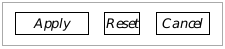
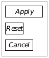

**Figure 12-1** Horizontal and Vertical Composites  
_The bounds of the composites are designated by the 
dashed boxes. The Goc code for these composites is 
shown in the following display._

---
Code Display 12-1 Orienting a Composite
~~~
	/* Composite oriented horizontally */
@object GenInteractionClass MyInteraction = {
    GI_comp = @ApplyTrigger, @ResetTrigger, @CancelTrigger;
    HINT_ORIENT_CHILDREN_HORIZONTALLY;
}

	/* Composite oriented vertically */
@object GenInteractionClass MyOtherInteraction = {
    GI_comp = @ApplyTrigger, @ResetTrigger, @CancelTrigger;
    HINT_ORIENT_CHILDREN_VERTICALLY;
}
~~~

A large example of a complex dialog box is shown in Figure 12-2. This dialog 
box uses nested GenInteraction objects to achieve a complex grouping of 
children. Using the many justification, spacing, and orientation hints 
described throughout the chapter, you can change and fine-tune the 
appearance of the dialog box. The code that implements this dialog box is 
shown in Code Display 12-2.

Two other hints may be useful for arranging children, especially in toolboxes. 
These two hints are not shown in the examples, though they are used 
prominently with tool groups.

HINT_SAME_ORIENTATION_AS_PARENT is used by one windowed object 
(GenInteraction) when it should orient its children in the same way its 
parent does. This, too, is useful for toolboxes because you can set an 
orientation in the toolbox, then set HINT_SAME_ORIENTATION_AS_PARENT 
in the tool group.

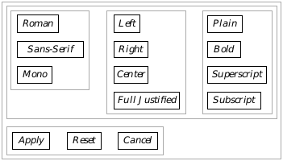

**Figure 12-2** A Complex Dialog Box  
_GenInteraction objects may be nested, and they may be oriented just as other 
children. The code for this example is shown in the following display._

HINT_ORIENT_CHILDREN_ALONG_LARGER_DIMENSION allows you to 
orient a composite's children along the screen's larger dimension. The hint 
will work like HINT_ORIENT_CHILDREN_HORIZONTALLY if the screen is 
wider than it is tall; it will work like HINT_ORIENT_CHILDREN_VERTICALLY 
if the screen is taller than it is wide.

---
Code Display 12-2 A Complex Dialog Box
~~~
/* This code display shows the basic Goc code that will get the configuration
 * shown in Figure 12-2 on the screen. Other attributes are left out of the
 * definitions of the objects. */

/* The topmost interaction. It groups the two large interactions vertically. */
@object GenInteractionClass TopInteraction = {
    GI_comp = @ParaInteraction, @ReplyInteraction;
    HINT_ORIENT_CHILDREN_VERTICALLY;
}

/* The top of the two large interactions. It groups the three smaller interactions
 * on the top, horizontally. */
@object GenInteractionClass ParaInteraction = {
    GI_comp = @FontInteraction, @JustInteraction, @StyleInteraction;
    HINT_ORIENT_CHILDREN_HORIZONTALLY;
}

/* The interaction containing the Apply, Reset, and Cancel triggers. The
 * triggers are oriented horizontally. */
@object GenInteractionClass ReplyInteraction = {
    GI_comp = @ApplyTrigger, @ResetTrigger, @CancelTrigger;
    HINT_ORIENT_CHILDREN_HORIZONTALLY;
}

/* The three vertically-oriented interactions at the top are similar. Each
 * contains several triggers. All three are defined below. */
@object GenInteractionClass FontInteraction = {
    GI_comp = @RomanTrigger, @SansTrigger, @MonoTrigger;
    HINT_ORIENT_CHILDREN_VERTICALLY;
}

@object GenInteractionClass JustInteraction = {
    GI_comp = @LeftTrigger, @RightTrigger, @CenterTrigger, @FullTrigger;
    HINT_ORIENT_CHILDREN_VERTICALLY;
}

@object GenInteractionClass StyleInteraction = {
    GI_comp = @PlainTrigger, @BoldTrigger, @SuperTrigger, @SubTrigger;
    HINT_ORIENT_CHILDREN_VERTICALLY;
}

/* Triggers. All the triggers are essentially the same. Each is named as it
 * appears in the GI_comp fields above, and each has the corresponding
 * GI_visMoniker field. The RomanTrigger object is shown as an example. */

@object GenTriggerClass RomanTrigger = {
    GI_visMoniker = "Roman";
}
~~~

#### 12.2.3 Justifying and Centering Children

Although child justification defaults to whatever the specific UI normally 
uses, you can set the justification of a composite's children with several 
different hints.

Typically, horizontal composites will have their children top-justified and 
vertical composites will have left-justified children (as shown in the previous 
examples).

##### 12.2.3.1 Edge Justification

HINT_TOP_JUSTIFY_CHILDREN, HINT_BOTTOM_JUSTIFY_CHILDREN, 
HINT_LEFT_JUSTIFY_CHILDREN, HINT_RIGHT_JUSTIFY_CHILDREN

If you want to line all of a composite's children up on one of their edges, you 
should use one of these hints. They are self-explanatory; the edge specified in 
the name of the hint (top, left, etc.) is the edge of the composite along which 
all the children will appear.

Add the justification hints along with an orientation hint. Examples of 
justification are shown in Figure 12-3.

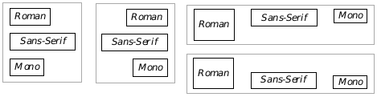

**Figure 12-3** Examples of Edge Justification  
_From left to right (clockwise): Left justification, right justification, top 
justification, bottom justification._

##### 12.2.3.2 Edge Alignment with Other Objects

HINT_ALIGN_LEFT_EDGE_WITH_OBJECT, 
HINT_ALIGN_TOP_EDGE_WITH_OBJECT, 
HINT_ALIGN_RIGHT_EDGE_WITH_OBJECT, 
HINT_ALIGN_BOTTOM_EDGE_WITH_OBJECT

These hints align an object's respective edge with the same edge of another 
object; the optr of the other object is the hint's argument. The other object 
does not necessarily have to be a direct sibling or parent, but the result must 
not cause the object to stray outside its parent's bounds. 

##### 12.2.3.3 Centering Children

HINT_CENTER_CHILDREN_VERTICALLY, 
HINT_CENTER_CHILDREN_HORIZONTALLY

Often, rather than justifying a composite's children, you will want to center 
them. These two hints allow you to center the children as shown in 
Figure 12-4.

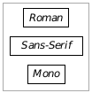
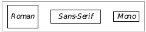

**Figure 12-4** Examples of Centered Children  
_Vertically oriented composites may be centered 
horizontally; horizontally-oriented composites may be 
centered vertically._

##### 12.2.3.4 Full Justification

HINT_FULL_JUSTIFY_CHILDREN_HORIZONTALLY, 
HINT_FULL_JUSTIFY_CHILDREN_VERTICALLY, 
HINT_DONT_FULL_JUSTIFY_CHILDREN, 
HINT_INCLUDE_ENDS_IN_CHILD_SPACING, 
HINT_DONT_INCLUDE_ENDS_IN_CHILD_SPACING

Besides justifying the composite's children either on a single edge or on the 
center line of the composite, you might want to full-justify the children. To do 
this, you will want to give the composite an orientation first (either vertical 
or horizontal). The composite may also require a special sizing hint to expand 
its bounds-see HINT_EXPAND_WIDTH_TO_FIT_PARENT and the other 
sizing hints in section 12.2.4 on page 480.

If the full justification hint is in the same dimension as the orientation of the 
composite (e.g., HINT_FULL_JUSTIFY_CHILDREN_HORIZONTALLY and 
HINT_ORIENT_CHILDREN_HORIZONTALLY), then the geometry manager 
will divide up the entire space of the composite and spread the children out 
equally along it. If you also specify 
HINT_INCLUDE_ENDS_IN_CHILD_SPACING, the geometry manager will 
calculate the spacing as if there were one more child than there actually is; 
it will then put half the extra space on either end of the children. 
HINT_DONT_INCLUDE_ENDS_IN_CHILD_SPACING performs the default 
calculations. Examples of various full justification are shown in Figure 12-5. 
See Code Display 12-3 on page l 483 for the code required to implement this 
full justification behavior.

Typically, full justification is not implemented by default. Some specific UIs 
may try to full-justify children always; if you want the children non-justified 
(when possible), apply HINT_DONT_FULL_JUSTIFY_CHILDREN. Added 
spacing is also typically not turned on by default; you can ensure that added 
spacing will not be included (where possible) by applying the hint 
HINT_DONT_INCLUDE_ENDS_IN_CHILD_SPACING to your composite.

#### 12.2.4 Sizing Objects

Sizing can occur in essentially one of two ways: First, the composite can size 
itself based on its children. Second, the children can size themselves based 
on their parent. You can specify additional sizing restrictions in the form of 
minimum, maximum, and fixed sizes.

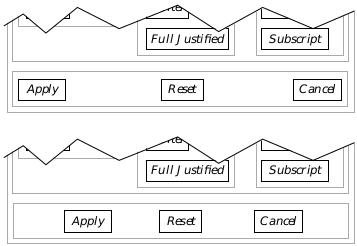

**Figure 12-5** Full-Justification of Children  
_The reply bar interaction object is specified as horizontally full-justified. In 
the upper example, it does not include ends in child spacing; in the lower 
example, it does. Unchanged portions of the dialog box are cut out._

##### 12.2.4.1 Sizing the Parent

HINT_NO_TALLER_THAN_CHILDREN_REQUIRE, 
HINT_NO_WIDER_THAN_CHILDREN_REQUIRE

A composite can size itself to be only as large as its children require. This may 
be applied to your primary window or to other organizational composites to 
keep them from growing into any extra space in their parents. You can set the 
width and height restrictions independently; to set them both, use both hints 
in the composite.

##### 12.2.4.2 Sizing the Children

HINT_EXPAND_HEIGHT_TO_FIT_PARENT, 
HINT_EXPAND_WIDTH_TO_FIT_PARENT, 
HINT_DIVIDE_WIDTH_EQUALLY, HINT_DIVIDE_HEIGHT_EQUALLY

Often a composite will have a set size and its children will want to expand 
themselves to take up all the available space. For example, the interaction 
with the Apply, Reset, and Cancel triggers in the dialog box shown in 
Figure 12-6 must have HINT_EXPAND_WIDTH_TO_FIT_PARENT set for it to 
expand itself to the far right edge of the dialog box. Another potential 
situation is a GenView within a GenPrimary; when the user resizes the 
primary, the view should probably expand itself to take up any extra space in 
the window.

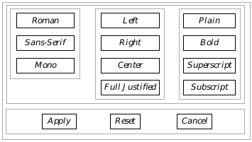

**Figure 12-6** Expanding Children to Fit Parents  
_All the triggers in the vertical composites are expanded to fit their parents' 
widths. The interaction at the bottom is as well in order to allow the triggers 
to be full-justified with space added._

A third example would be a series of triggers that want to be the same width 
in a vertical composite. This appears in many menus; each of the triggers 
expands itself to the width of the parent; the parent composite sizes its width 
to the largest of the triggers. An example taken from the complex dialog box 
is shown in Figure 12-6. Code for this example is shown in Code Display 12-3.

Some more complex examples of expanding a group and justifying the 
elements are shown in Figure 12-7. All of the examples use a justification 
hint combined with an expand-to-fit hint.

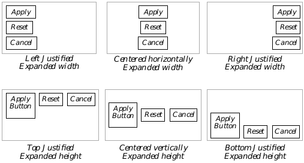

**Figure 12-7** Sample Justifications  
_Any geometry combination can be obtained with various geometry hints and 
levels of organizational GenInteractions. The above six combinations apply 
both the expansion and the justification hints to the composite object._

---
Code Display 12-3 Using Full Justification of Children
~~~
/* This code display shows the basic Goc code that will get the configuration
 * shown in Figure 12-6 on the screen. Other attributes are left out of the
 * definitions of the objects. This code display is supplemental to
 * Code Display 12-2; most comments have been removed. */

@object GenInteractionClass TopInteraction = {
    GI_comp = @ParaInteraction, @ReplyInteraction;
    HINT_ORIENT_CHILDREN_VERTICALLY;
}

@object GenInteractionClass ParaInteraction = {
    GI_comp = @FontInteraction, @JustInteraction, @StyleInteraction;
    HINT_ORIENT_CHILDREN_HORIZONTALLY;
}

@object GenInteractionClass ReplyInteraction = {
    GI_comp = @ApplyTrigger, @ResetTrigger, @CancelTrigger;
    HINT_ORIENT_CHILDREN_HORIZONTALLY;
    HINT_EXPAND_WIDTH_TO_FIT_PARENT;
    HINT_FULL_JUSTIFY_CHILDREN_HORIZONTALLY;
    HINT_INCLUDE_ENDS_IN_CHILD_SPACING;
}

@object GenInteractionClass FontInteraction = {
    GI_comp = @RomanTrigger, @SansTrigger, @MonoTrigger;
    HINT_ORIENT_CHILDREN_VERTICALLY;
}

@object GenInteractionClass JustInteraction = {
    GI_comp = @LeftTrigger, @RightTrigger, @CenterTrigger, @FullTrigger;
    HINT_ORIENT_CHILDREN_VERTICALLY;
}

@object GenInteractionClass StyleInteraction = {
    GI_comp = @PlainTrigger, @BoldTrigger, @SuperTrigger, @SubTrigger;
    HINT_ORIENT_CHILDREN_VERTICALLY;
}

/* Triggers. All the upper triggers are essentially the same. Each is named as it
 * appears in the GI_comp fields above, and each has the corresponding
 * GI_visMoniker field. The RomanTrigger object is shown as an example. */

@object GenTriggerClass RomanTrigger = {
    GI_visMoniker = "Roman";
    HINT_EXPAND_WIDTH_TO_FIT_PARENT;
}

/* The Apply, Reset, and Cancel triggers do not have the hint shown above. */
@object GenTriggerClass ApplyTrigger = {
    GI_visMoniker = "Apply";
}
~~~

HINT_DIVIDE_WIDTH_EQUALLY and HINT_DIVIDE_HEIGHT_EQUALLY 
instruct a composite object to divide up its space along the affected dimension 
among the usable children. This hint can only suggest sizes for the children. 
The children themselves will decide if they can expand or contract to fit the 
requested space. (In general, children will not contract to fit a requested size, 
but they may expand.) Note: these hints will not work within GenValue 
objects; if you wish to use them on such an object, place them within a dummy 
GenInteraction object and use these hints on that object.

Typically, these hints work well in conjunction with 
HINT_EXPAND_WIDTH_TO_FIT_PARENT and 
HINT_EXPAND_HEIGHT_TO_FIT_PARENT. If these hints are not also in place 
(on a GenInteraction, for example) the division of width and/or height may be 
based on the children's default size; i.e., the parent will size itself based on 
total size of the children and then attempt to divide up its children's space, 
rather than the maximum allotted size for the parent, which is probably not 
desired.

##### 12.2.4.3 Maximum, Minimum, Fixed, and Initial Sizes

HINT_INITIAL_SIZE, HINT_MAXIMINUM_SIZE, HINT_MINIMUM_SIZE, 
HINT_FIXED_SIZE

If you know certain sizing restrictions for window or interaction objects, you 
can set them with the following four hints. Each takes a parameter that 
details the appropriate height and width in points. The parameters are 
described for the hints.

HINT_INITIAL_SIZE  
This hint sets the initial size of the object, if allowed. Other 
sizing restrictions may override this hint (such as the children 
being too large). This is primarily used with window objects 
(you will likely never use it for anything other than a 
GenPrimary, GenDisplay, or GenView), and it is effective only 
for when the object is first displayed. This hint takes an 
argument of type CompSizeHintArgs, a structure that 
defines a suggested width, height, and the number of children 
the object has. 

HINT_FIXED_SIZE  
This hint sets a fixed size for the object if one is allowed. Other 
sizing restrictions (such as children growing too large for the 
window) may override this hint occasionally. This hint can 
often be used for optimization to inhibit excessive geometry 
recalculations while on-screen. This hint takes the same 
parameters as HINT_INITIAL_SIZE, of type 
CompSizeHintArgs.

HINT_MAXIMUM_SIZE  
This hint sets a desired maximum size for the object. Other 
geometry restrictions may override this hint when necessary. 
This hint is useful for GenText and GenView objects. It takes 
the same parameters as HINT_INITIAL_SIZE, of type 
CompSizeHintArgs.

HINT_MINIMUM_SIZE  
This hint sets a desired minimum size for the object. Other 
geometry restrictions may override this hint when necessary. 
The hint takes the same parameters as HINT_INITIAL_SIZE, of 
type CompSizeHintArgs.

The following examples show different ways to set the initial size of an object. 
The third argument of the hint is the number of children in a particular line 
of a composite, when the composite is set up to wrap its children.

This example sets the initial size of the composite (probably a GenPrimary) 
to be half the screen's height and half the screen's width.

~~~
HINT_INITIAL_SIZE = {
	SST_PCT_OF_FIELD_WIDTH | PCT_50,
	SST_PCT_OF_FIELD_HEIGHT | PCT_50,
	0 };
~~~

This example sets the size of the composite to be 100 pixels high and 200 
pixels wide.

~~~
HINT_FIXED_SIZE = {
	SST_PIXELS | 200,
	SST_PIXELS | 100,
	0 };
~~~

This example sets the composite's minimum size to be 10 average characters 
wide and 20 percent of the screen height tall.

~~~
HINT_MINIMUM_SIZE = {
	SST_AVG_CHAR_WIDTHS | 10,
	SST_PCT_OF_FIELD_HEIGHT | PCT_20,
	0 };
~~~

#### 12.2.5 Outlining the Composite

HINT_DRAW_IN_BOX

Often it is useful to outline a composite, especially if it is used for 
organizational purposes within another composite. You can use the hint 
HINT_DRAW_IN_BOX to have the UI automatically draw a box at the object's 
bounds as shown in Figure 12-8.

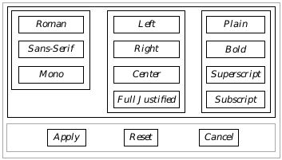

**Figure 12-8** Drawing Boxes Around Composites  
_When HINT_DRAW_IN_BOX is used for the upper composites, the object 
groupings become much easier to distinguish._

#### 12.2.6 Using Monikers

Nearly all generic objects will have visual monikers (usually text labels) that 
get drawn somewhere in or near the object. The moniker helps the user 
distinguish between different objects; for example, each trigger should have 
a text (or graphical) moniker giving some indication of what happens when 
the trigger is pressed.

##### 12.2.6.1 Placing Monikers in Relation to Children

HINT_PLACE_MONIKER_ABOVE, HINT_PLACE_MONIKER_BELOW, 
HINT_PLACE_MONIKER_TO_LEFT, HINT_PLACE_MONIKER_TO_RIGHT, 
HINT_DO_NOT_USE_MONIKER, HINT_CENTER_MONIKER, 
HINT_PLACE_MONIKER_ALONG_LARGER_DIMENSION, 
HINT_ALIGN_LEFT_MONIKER_EDGE_WITH_CHILD

Monikers are extremely useful and dynamic-see "GenClass," Chapter 2 of 
the Object Reference Book, for full information on creating, manipulating, 
and using visual monikers. Monikers may be created or changed at run-time 
(often causing geometry updates), and all generic objects may be given 
monikers.

If you place a composite object's moniker to one side of its children, the 
geometry manager will ensure extra space in the composite gets allotted for 
the moniker. You can hint that the moniker should be placed above, to the 
right of, to the left of, or below the children. You can also hint that the 
moniker should not be used.

Most specific UIs will put the moniker to the left of the object's children by 
default. You can also center the moniker on the composite's children with 
HINT_CENTER_MONIKER. Figure 12-9 shows several different moniker 
placements.

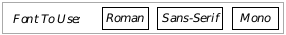

**Figure 12-9** Placing Monikers  
_The top-left has the moniker placed to the left by default. The second uses 
the hint HINT_PLACE_MONIKER_ABOVE; notice that by default in this specific UI, 
the left moniker edge is aligned with the first child. The third also has 
HINT_DRAW_IN_BOX. The fourth also has the hint HINT_CENTER_MONIKER set to 
center the moniker._

You can also have the UI place the moniker along the object's larger 
dimension-to the left if the screen is wider than it is tall, or above if the 
screen is taller than it is wide. To do this, set the hint 
HINT_PLACE_MONIKER_ALONG_LARGER_DIMENSION.

If a moniker is placed above a group of children, 
HINT_ALIGN_LEFT_MONIKER_EDGE_WITH_CHILD ensures that left 
moniker edge coincides with the left edge of the first child below that 
moniker. This is usually the default behavior anyway, but different specific 
UIs may have different default behavior.

##### 12.2.6.2 Justifying or Centering on Monikers

HINT_CENTER_CHILDREN_ON_MONIKERS, 
HINT_LEFT_JUSTIFY_MONIKERS

When you have several composites within a single composite, you can center 
the composites based on the position and size of the monikers. Using the hint 
HINT_CENTER_CHILDREN_ON_MONIKERS has the effect shown in 
Figure 12-10: It aligns the child composites so their monikers are 
right-justified at the center. Adding HINT_LEFT_JUSTIFY_MONIKERS has a 
similar effect, except the monikers are left-justified.

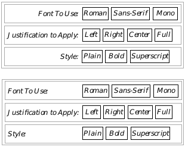

**Figure 12-10** Centering on Monikers  
_The top composite has HINT_CENTER_CHILDREN_ON_MONIKERS set, 
causing the child composites to be lined up on the separation between their 
monikers and their children. The bottom composite also has the hint 
HINT_LEFT_JUSTIFY_MONIKERS as well, causing the same geometry with 
the addition of left-justifying the monikers._

Note that the two hints HINT_CENTER_CHILDREN_ON_MONIKERS and 
HINT_LEFT_JUSTIFY_MONIKERS are valid only for composites with one or 
more child composites, all of which have monikers placed to their left.

##### 12.2.6.3 Removing Moniker Borders

HINT_NO_BORDERS_ON_MONIKERS

This hint removes borders that may appear by default around an object's 
moniker. For example, GenTriggers under most specific UIs have a 
rectangular border drawn around their moniker's borders. This hint removes 
these borders. It may be useful in cases where a custom border should be 
implemented, but in general should not be used to override the specific UI, as 
this may confuse the user.

#### 12.2.7 Using Custom Child Spacing

HINT_CUSTOM_CHILD_SPACING, 
HINT_CUSTOM_CHILD_SPACING_IF_LIMITED_SPACE, 
HINT_MINIMIZE_CHILD_SPACING

Normally, spacing of children within a composite is left entirely up to the 
specific UI. You can customize spacing, however, by using the hint 
HINT_CUSTOM_CHILD_SPACING. This hint takes a single argument of type 
SpecSizeSpec, described below.

The SpecSizeSpec structure defines both the spacing between children and 
how the spacing is determined. It exists as a record with two fields: The first 
field is a constant of type SpecSizeTypes, used to interpret the second field. 
The second field is data based on the type specified in the first field.

The different types allowable in the first field are

SST_PIXELS  
Data specified in pixels.

SST_PCT_OF_FIELD_WIDTH  
Data specified as a percentage of screen width. The data value 
is a fraction that gets multiplied by the width of the screen. 
Predefined fraction values to use in the data field are named 
PCT_xx, where the xx represents any multiple of five between 
zero and 100 inclusive. You can get better accuracy by using 
your own value if desired, however.

SST_PCT_OF_FIELD_HEIGHT  
Data specified as a percentage of screen height. As above except 
uses screen height rather than width.

SST_AVG_CHAR_WIDTHS  
Data specified as a number that gets multiplied by the average 
width of a character in the font being used. The data may be 
between zero and 1023 inclusive.

SST_WIDE_CHAR_WIDTHS  
Data is specified as a number that gets multiplied by the 
maximum width of the widest character in the font being used. 
The data may be between zero and 1023 inclusive.

SST_LINES_OF_TEXT  
Data is specified as a number of text lines. The number will be 
multiplied by the height of a line of text in the font being used.

Both fields of the record are defined by using the bitwise-or operator. If you 
had a composite that wanted to line all its children up exactly next to each 
other, for example, you would specify the hint as follows:

~~~
@object GenInteractionClass @MyComp = {
    GI_comp = @child1, @child2, @child3;
    HINT_CUSTOM_CHILD_SPACING = SST_PIXELS | 0;
}
~~~

HINT_CUSTOM_CHILD_SPACING_IF_LIMITED_SPACE also takes a 
SpecSizeSpec to suggest a custom amount of spacing, but only implements 
this custom spacing if the specific UI determines that the children are 
already too tightly arranged. This hint may or may not be helpful, as the 
specific UI often allocates a minimum amount of spacing independent of this 
hint.

HINT_MINIMIZE_CHILD_SPACING ensures that child spacing is kept to an 
absolute minimum, even if this means that object's edges will touch (in color 
systems) or even overlap (in black and white systems). 

#### 12.2.8 Allowing Children to Wrap

HINT_ALLOW_CHILDREN_TO_WRAP, HINT_WRAP_AFTER_CHILD_COUNT, 
HINT_DONT_ALLOW_CHILDREN_TO_WRAP, 
HINT_WRAP_AFTER_CHILD_COUNT_IF_VERTICAL_SCREEN

When a composite grows to fit its children and also must remain small 
enough to fit within its generic parent, it may wrap the children. This 
typically happens as a result of the user resizing a window smaller so the 
children of the composite no longer fit the window's width. Wrapping can 
occur in both the horizontal and the vertical, depending on the orientation of 
the composite object.

To allow a composite to wrap its children when necessary, apply the hint 
HINT_ALLOW_CHILDREN_TO_WRAP to the composite. If you want the 
children not to wrap, apply HINT_DONT_ALLOW_CHILDREN_TO_WRAP. An 
example of wrapping children appears in Figure 12-11.

**Figure 12-11** Allowing Children to Wrap  
_If the composite has HINT_WRAP_AFTER_CHILD_COUNT = 3, the composite 
will automatically wrap children after three on any given line._

When HINT_WRAP_AFTER_CHILD_COUNT is applied and children are 
allowed to wrap, the composite will cause its children to wrap after a certain 
number are displayed. This hint takes a single integer as a parameter. For 
example, if you wanted three children on every line in the composite no 
matter how many children there were total, you would specify the composite 
as follows:

~~~
@object GenInteractionClass @MyComp = {
    GI_comp = @child1, @child2, @child3, @child4;
    HINT_ALLOW_CHILDREN_TO_WRAP;
    HINT_WRAP_AFTER_CHILD_COUNT = 3;
}
~~~

The configuration shown above is demonstrated in Figure 12-11.

A variation, HINT_WRAP_AFTER_CHILD_COUNT_IF_VERTICAL_SCREEN, 
allows you to allow child wrapping based on whether or not the screen is 
"vertical." If the screen is taller than it is wide, this hint will have an effect 
like HINT_WRAP_AFTER_CHILD_COUNT; if not, the hint will have no effect.

#### 12.2.9 Object Placement

As we have seen, generic objects can be arranged and distributed in several 
ways. You may also place generic objects within certain areas of your user 
interface that are not explicitly defined. For example, in many dialog boxes, 
a "reply bar" is typically present where reply triggers such as "OK," "Cancel," 
or "Apply" are located. You may specify objects to generically place 
themselves within such a reply bar, even though you may not know the exact 
location of that reply bar as the specific UI creates it.

##### 12.2.9.1 Reply Bars

HINT_MAKE_REPLY_BAR, HINT_SEEK_REPLY_BAR

One special feature that many dialog boxes have is a reply bar. Typically, any 
dialog box that allows the user to set a number of options before applying 
them will have a reply bar. A reply bar usually has triggers in it for "Apply," 
"Cancel," and perhaps other functions (such as "Reset").

Note that many special dialog box types can have their reply bars built 
automatically according to the specific UI. See "GenInteraction," Chapter 7 of 
the Object Reference Book, for full information on reply bars. If you want to 
create your own, however, you can with the hints in this section.

Although you have to declare each of the triggers that will appear in the reply 
bar, you can use HINT_MAKE_REPLY_BAR to set up the geometry appropriate 
for the specific UI. For example, Code Display 12-4 gives the code that will 
create a reply bar similar to that shown in Figure 12-12.

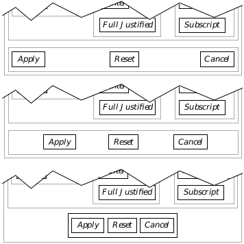

**Figure 12-12** Implementations of a Reply Bar  
_The specific UI determines the actual geometry of the reply bar including 
justification, sizing, and other features._

---
Code Display 12-4 Creating a Reply Bar
~~~
/* This reply bar has three triggers, Apply, Reset, and Cancel. A few possible
 * formats determined by the specific UI are shown in Figure 12-12. The
 * appropriate geometry is not determined until run-time. */

@object GenInteractionClass MyReplyBar = {
    GI_comp = @ApplyTrigger, @ResetTrigger, @CancelTrigger;
    HINT_MAKE_REPLY_BAR;
}

@object GenTriggerClass ApplyTrigger = {
    GI_visMoniker = "Apply"; }

@object GenTriggerClass ResetTrigger = {
    GI_visMoniker = "Reset"; }

@object GenTriggerClass CancelTrigger = {
    GI_visMoniker = "Cancel"; }
~~~

HINT_SEEK_REPLY_BAR instructs the generic object (usually a GenTrigger) 
to seek placement in the dialog box's reply bar. The specific UI will try to 
place the trigger in the reply bar of the first dialog box GenInteraction it finds 
that is not GIT_ORGANIZATIONAL.

##### 12.2.9.2 Placing Objects in Menu Bars

HINT_SEEK_MENU_BAR, HINT_AVOID_MENU_BAR

Usually, it is left up to the specific UI whether it places any given object 
within a menu bar. You can suggest that objects be placed within the 
window's menu bar by placing HINT_SEEK_MENU_BAR on that object. 
Similarly, you can place HINT_AVOID_MENU_BAR on an object to suggest 
that it not be placed within the window's menu bar.

##### 12.2.9.3 Placing Objects in Scroller Areas

HINT_SEEK_X_SCROLLER_AREA, HINT_SEEK_Y_SCROLLER_AREA, 
HINT_SEEK_LEFT_OF_VIEW, HINT_SEEK_TOP_OF_VIEW, 
HINT_SEEK_RIGHT_OF_VIEW, HINT_SEEK_BOTTOM_OF_VIEW

These hints affect the placement of generic objects within GenViews. The 
objects must be children of a GenView for the hints to take effect. 

HINT_SEEK_X_SCROLLER_AREA and HINT_SEEK_Y_SCROLLER_AREA 
suggest that a generic object be placed alongside the scrollbar area-either 
the horizontal scrollbar or the vertical scrollbar, respectively-of the 
GenView object. 

HINT_SEEK_LEFT_OF_VIEW, HINT_SEEK_TOP_OF_VIEW, 
HINT_SEEK_RIGHT_OF_VIEW and HINT_SEEK_BOTTOM_OF_VIEW suggest 
that the generic object be placed alongside the respective side of the GenView.

##### 12.2.9.4 Placing Objects in Window Title Bars

HINT_SEEK_TITLE_BAR_LEFT, HINT_SEEK_TITLE_BAR_RIGHT

These hints suggest the placement of a generic object within a window's title 
bar. These hints are usually used on GenTriggers or GenInteractions; the 
objects involved should fit within the title bar area (i.e., be equivalent to tool 
bar icons). For each window with a title bar, only one object may have each of 
these hints, and the object must be a direct child of the windowed object.

##### 12.2.9.5 Placement of Objects Popped Up

HINT_POPS_UP_TO_RIGHT, HINT_POPS_UP_BELOW

HINT_POPS_UP_TO_RIGHT
This hint instructs the specific UI to bring up the object to the 
right of its activating gadget, if the object is normally popped 
up below the activating gadget.

HINT_POPS_UP_BELOW
This hint instructs the specific UI to bring up the object below 
its activating gadget. This is usually the default behavior for 
objects that are popped up.

### 12.3 Positioning and Sizing Windows

A generic object that appears as a window, such as an 
independently-displayable GenInteraction or a GenPrimary, has special 
needs for positioning and sizing itself, especially when appearing initially. 
Specific user interfaces may differ in how windows appear on the screen. In 
Motif, for instance, windows initially appear in one of several staggered 
positions. Primary and display objects extend by default to the right edge of 
the screen and to the top edge of the icon area at the bottom of the screen. 
Other windows are usually only as large as required by their children.

The SpecSizeWinPair structure is often used when specifying window sizes 
and positions. There are several hints which signal that a window should be 
positioned or sized depending on the position or size of another window, the 
size of the screen, or other conditions. The SpecSizeWinSpec structure 
allows you to specify an offset from another window, either by a number of 
points (remember that there are 72 points per inch), or by means of a ratio. 

~~~
typedef struct {
	SpecWinSizeSpec			SWSP_x;
	SpecWinSizeSpec			SWSP_y;
} SpecWinSizePair;

typedef WordFlags SpecWinSizeSpec;
#define SWSS_RATIO 				0x8000
#define SWSS_SIGN 				0x4000
#define SWSS_MANTISSA 				0x3c00
#define SWSS_FRACTION 				0x03ff
~~~

The SpecSizeWinPair structure allows you to set up separate parameters 
for the x and y coordinates. For each coordinate, use the SWSS_RATIO flag to 
signal whether you are giving coordinates by means of a ratio instead of a 
constant. If you are using a ratio, use the SWSS_FRACTION, 
SWSS_MANTISSA, and SWSS_SIGN fields to specify the value of the ratio or 
use one of the following pre-defined constants to specify a ratio between zero 
and one:

~~~
#define PCT_0			0x000
#define PCT_5			0x033
#define PCT_10			0x066
#define PCT_15			0x099
#define PCT_20 			0x0cc
#define PCT_25 			0x100
#define PCT_30 			0x133
#define PCT_35 			0x166
#define PCT_40 			0x199
#define PCT_45 			0x1cc
#define PCT_50 			0x200
#define PCT_55 			0x233
#define PCT_60 			0x266
#define PCT_65 			0x299
#define PCT_70 			0x2cc
#define PCT_75 			0x300
#define PCT_80 			0x333
#define PCT_85 			0x366
#define PCT_90 			0x399
#define PCT_95 			0x3cc
#define PCT_100			0x3ff
~~~

To specify a constant offset, just use that offset, not setting the SWSS_RATIO 
flag. Not all windows will use the SpecWinSizePair structure.

#### 12.3.1 Window Positioning

HINT_POSITION_WINDOW_AT_RATIO_OF_PARENT, 
HINT_POSITION_WINDOW_AT_MOUSE, HINT_STAGGER_WINDOW, 
HINT_CENTER_WINDOW, HINT_TILE_WINDOW, 
HINT_WINDOW_NO_CONSTRAINTS

GenClass has a number of hints used by the window classes to determine 
where the window appears initially and how the window is allowed to move 
about the screen. Specific UIs can override these hints when necessary or 
when they conflict with the UI's specifications. These hints are listed below.

HINT_POSITION_WINDOW_AT_RATIO_OF_PARENT  
This hint suggests an initial position for the window based on 
its parent window's size and relative to the upper-left corner of 
the parent window. The suggested position is specified as a 
fraction of the parent window's size in a SpecWinSizePair 
structure. This structure consists of two fields, the X position 
and the Y position of the new window's origin. Predetermined 
fraction values are names PCT_xx, where xx is a multiple of five 
between zero and 100 inclusive. For example, to have the 
window object's origin start out in the center of its parent, 
specify the hint as follows:

~~~
HINT_POSITION_WINDOW_AT_RATIO_OF_PARENT = {
    SWSS_RATIO | PCT_25, SWSS_RATIO | PCT_60 
};
~~~

HINT_POSITION_WINDOW_AT_MOUSE  
This hint will position the origin of the new window at the 
mouse pointer.

HINT_STAGGER_WINDOW  
This hint indicates that the window's origin should be placed 
just below and to the right of the origin of the last staggered 
window.

HINT_CENTER_WINDOW  
This hint centers the window in its parent window.

HINT_TILE_WINDOW  
This hint tiles the window with other windows that are also 
marked HINT_TILE_WINDOW within the parent window. This 
hint is not currently supported.

HINT_WINDOW_NO_CONSTRAINTS  
This hint removes all constraints upon the positioning of a 
window. It should only be used as the final attempt to position 
the window if other methods do not work to your satisfaction.

#### 12.3.2 Determining Initial Size

HINT_EXTEND_WINDOW_TO_BOTTOM_RIGHT, 
HINT_EXTEND_WINDOW_NEAR_BOTTOM_RIGHT, 
HINT_SIZE_WINDOW_AS_DESIRED, 
HINT_SIZE_WINDOW_AS_RATIO_OF_PARENT, 
HINT_SIZE_WINDOW_AS_RATIO_OF_FIELD, 
HINT_USE_INITIAL_BOUNDS_WHEN_RESTORED

GenClass has a number of hints used by the window classes to determine 
the size of the window object initially and how the window is allowed to be 
resized on the screen. Specific UIs can override these hints when necessary 
or when they conflict with the UI's specifications. These hints are listed 
below.

HINT_EXTEND_WINDOW_TO_BOTTOM_RIGHT  
This hint extends the window's bounds so its lower right corner 
is located at the lower right corner of its parent window.

HINT_EXTEND_WINDOW_NEAR_BOTTOM_RIGHT  
This hint extends the window's bounds so its lower right corner 
is located near the lower right corner of its parent window. 
Enough room will be left for any icon area that may be present. 
Most major applications will apply this hint to their 
GenPrimary objects.

HINT_SIZE_WINDOW_AS_DESIRED  
This hint allows the window to size itself according to the 
combined size of its children.

HINT_SIZE_WINDOW_AS_RATIO_OF_PARENT  
This hint sizes the window to a ratio of its parent window. It 
takes a single parameter of type SpecWinSizePair, described 
under HINT_POSITION_WINDOW_AT_RATIO_OF_PARENT. 
Instead of coordinates, however, the ratios in the structure are 
width and height.

HINT_SIZE_WINDOW_AS_RATIO_OF_FIELD  
This hint sizes the window to a ratio of the field window's size. 
It takes a SpecWinSizePair parameter indicating the ratio. 
See above.

HINT_USE_INITIAL_BOUND_WHEN_RESTORED  
This hint instructs the window to come on-screen with its 
original values rather than the state of the window when it was 
saved to state.

#### 12.3.3 On-Screen Behavior

HINT_KEEP_INITIALLY_ONSCREEN, 
HINT_DONT_KEEP_INITIALLY_ONSCREEN, 
HINT_KEEP_PARTIALLY_ONSCREEN, 
HINT_DONT_KEEP_PARTIALLY_ONSCREEN, 
HINT_KEEP_ENTIRELY_ONSCREEN, 
HINT_KEEP_ENTIRELY_ONSCREEN_WITH_MARGIN, HINT_NOT_MOVABLE

HINT_KEEP_INITIALLY_ONSCREEN  
This hint will make the window resize itself to fit entirely 
within its parent window. Most windows will inherently know 
how to come up fully on-screen; some specific UIs do not 
implement it by default for optimization purposes.

HINT_DONT_KEEP_INITIALLY_ONSCREEN  
This hint will allow the window to come up whether it will be 
fully on-screen or not. If the default is to keep the window 
entirely on-screen and the UI allows this hint, the window will 
be allowed to open partially off-screen.

HINT_KEEP_PARTIALLY_ONSCREEN  
This hint indicates that when the user moves the window, it 
will be forced to remain partially on-screen.

HINT_DONT_KEEP_PARTIALLY_ONSCREEN  
This hint indicates that the user can move the window around 
the screen at will, even if the window becomes completely 
obscured under its parent.

HINT_KEEP_ENTIRELY_ONSCREEN  
This hint indicates that when the user moves the window, it 
will be forced to remain entirely on-screen.

HINT_KEEP_ENTIRELY_ONSCREEN_WITH_MARGIN  
This hint indicates that when the user moves the window, it 
will be forced to remain on-screen. An additional margin is 
added to the edge of the screen to keep the window from 
touching the edge as well; this margin is defined by the specific 
UI.

HINT_NOT_MOVABLE  
This hint instructs the specific UI to make the windowed object 
not movable. This hint should be avoided if at all possible. 

#### 12.3.4 Window Look and Feel

HINT_WINDOW_NO_TITLE_BAR, HINT_WINDOW_NO_SYS_MENU

HINT_WINDOW_NO_TITLE_BAR instructs the specific UI to remove the title 
bar from a windowed object (dialog box, GenPrimary or GenDisplay). Use 
this hint with extreme prejudice as most of a window's functionality will not 
be accessible without a title bar.

HINT_WINDOW_NO_SYS_MENU instructs the specific UI to remove the 
system menu (or close button) from a windowed object. Again, do not use this 
hint unless necessary, as it overrides important features of windowed objects.

[Input](cinput.md) <-- &nbsp;&nbsp; [table of contents](../concepts.md) &nbsp;&nbsp; --> [Sound Library](csound.md)
