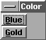
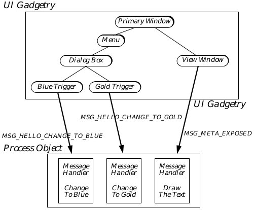
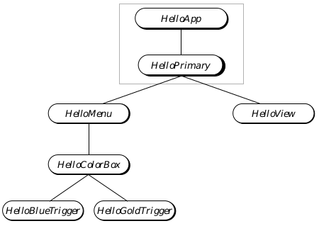
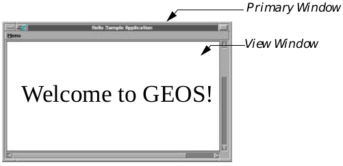
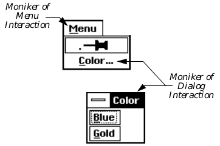

## 4 First Steps: Hello World

This chapter provides you with an application shell to which you can add as 
you learn more about GEOS programming. It describes each portion of the 
introductory (and compulsory) "Hello World" sample program. All 
programmers new to GEOS should read this chapter for a firm understanding 
of the basics of a GEOS application. The source code for Hello World is given 
in this chapter in pieces. It is also available as the Hello3 sample application.

## 4.1 Application Structure

Every GEOS application and library will have at least two files: The Geode 
Parameters file provides the Glue linker with necessary information about 
the geode being compiled and linked. The source file contains the source code. 
Source code files may be split up into modules of source and definition 
files-this allows the programmer to keep large applications in a series of 
smaller files for easy organization and easier debugging.

Essentially there are four different types of files your application may use:

+ Parameters File (.gp)  
The Parameters file, as stated above, provides the Glue linker with 
necessary information. It details specifics about the geode being compiled 
that will be necessary for dynamically linking at runtime. Each geode 
may have only one Parameters file. The Parameters file for Hello World 
is detailed in section 4.3 on page 114. Full reference information for this 
file type can be found in the Routines reference book.

+ Source File (.goc)  
The Source file contains a combination of GEOS UI code and standard C 
code. Many source code files can be used for a single geode; this can help 
you organize your application's functionality into manageable groups of 
routines and objects. An introduction to the basics of the source file is 
given in section 4.4 on page 116.

+ C Header File (.h)  
C Header files may be used to hold definitions of data structures, classes, 
macros, routines, and other items. There are several standard GEOS 
header files you must include in your geode for it to compile properly. 
These are outlined in section 4.4 on page 116.

+ GEOS Header File (.goh)  
This file is essentially the same as the C header files described above. It 
can contain class and routine definitions as well as constants and 
variables. The primary difference between these files and the C header 
files is that .goh files must be included before the geode is run through 
the Goc preprocessor. C header files do not have to go through the Goc 
preprocessor. Simple geodes might have none of their own header files. 
These files are also described in section 4.4 on page 116.

### 4.2 Hello World

The Hello World sample application (Hello3) is very simple and yet 
accomplishes a great deal. With just a few simple steps, this program does 
the following:

+ Creates a complete primary window

+ Creates a scrollable window and scroller objects

+ Draws 48-point text into the scrollable window and redraws the text 
when the user changes a parameter

+ Handles scrolling and window resizes

+ Uses a pinnable menu to bring up a dialog box

+ Uses a dialog box to allow the user to change colors of the text

+ Uses keyboard mnemonics for both the menu and dialog box commands

The Hello World program uses some concepts and constructs with which you 
may not be familiar yet. This section will describe each of those constructs 
and will refer to other sections of the documentation for complete 
information.

#### 4.2.1 Features of Hello World

To the user, the Hello World program is very simple. It consists of a primary 
window with a single menu and a scrollable window within the primary. In 
the scrollable window is a phrase of text: "Welcome to GEOS!"

The menu has a single item, "Color," which brings up a dialog box with two 
buttons in it. One button is labeled "Blue" and turns the text blue, and the 
other is labeled "Gold" and turns the text yellow. The menu is pinnable, like 
all GEOS menus, and the dialog box may be moved around the screen and 
closed like any other independently-displayable dialog box. See Figure 4-1 
for an illustration of the application on the screen.

 

**Figure 4-1** The Hello World Sample Application  
_The Hello World application draws text in a scrolling View and has one menu 
and one dialog box. The Blue trigger changes the text to blue; the Gold trigger 
changes the text to yellow._

#### 4.2.2 Strategy and Internals

The code for Hello World, as you will see, is quite simple. It consists mainly 
of User Interface gadgetry and uses just a few message handlers.

The main component of the application is the Process object, an instance of 
HelloProcessClass (a subclass of GenProcessClass). This object makes 
all drawing and color changes by handling messages sent from the window 
manager and the triggers in the dialog box. The Process object basically 
manages the application, keeping track of the relevant data and interacting 
with the UI gadgetry. (See Figure 4-2 for an illustration of the Hello World 
application's structure.)

The Process object is event-driven, meaning it has no main() routine run 
when the program is launched. Instead, the program does nothing until an 
event occurs (such as the view window sending MSG_META_EXPOSED when 
first opened). When the event (message) is received, the Process object 
responds to it and then waits until the next event occurs. Note, however, that 
the vast majority of events a Process object will receive and handle are not 
generated by your code but by the kernel and the UI.

**Figure 4-2** Structure of Hello World  
_The Process object contains message handlers (methods) for messages sent to 
it by the UI triggers and View. The other UI gadgets operate completely 
independently of the application's code; all of their functionality is 
implemented within the UI._

##### 4.2.2.1 The Menu and Dialog Box

Both the menu and the dialog box, once defined in the source code as objects, 
are implemented automatically by the system software. The application does 
not have to draw or otherwise manage these objects; they will interact 
directly with the UI to do the proper thing.

The triggers within the dialog, however, request actions that must be carried 
out by the application (changing the color to blue and gold, respectively). 
Although the application does not have to instantiate, draw, or otherwise 
modify the trigger objects, it must handle messages sent out by them when 
they are pressed by the user. This is discussed below, under "Changing the 
Text Color."

##### 4.2.2.2 The Scrolling View and Drawing the Text

Almost everything is handled automatically by the User Interface for the 
Hello World application. This includes implementation of the system menus 
for the primary window and the scrolling functionality of the scrollable View 
window.

The view object (of GenViewClass) is powerful and provides a lot of what 
most applications need. It automatically handles all window resizes and 
scrolls, and it will cause proper redrawing when another object (such as a 
pinned menu) is moved across it. The only thing it does not do is actually 
draw the application's images.

When the view senses that some portion of its window has become invalid 
(through scrolling or when the view window is first opened, for example), it 
will send a MSG_META_EXPOSED message to the Hello World application's 
Process object. The Process object will respond by drawing the text 
appropriately-it does not, however, have to worry about what portion of the 
text is visible or what portion of the screen the view window occupies. The 
view will automatically clip the text properly and display it within the 
window's bounds.

##### 4.2.2.3 Changing the Text Color

In all, the Process object can handle six events specific to this application: 
MSG_META_CONTENT_VIEW_WIN_OPENED (sent by the view when it first 
creates its window), MSG_META_CONTENT_VIEW_WIN_CLOSED (sent by the 
view when its window is being destroyed), MSG_META_EXPOSED (described 
above), MSG_HELLO_CHANGE_TO_BLUE (sent by the Blue trigger), 
MSG_HELLO_CHANGE_TO_GOLD (sent by the Gold trigger), and 
MSG_HELLO_REDRAW_DOCUMENT (sent by the Process object to itself).

The Process object maintains two global variables: helloTextColor contains 
the current color of the text, and winHan contains the window handle of the 
view's window. When it draws the text, the Process object checks 
helloTextColor before drawing. Therefore, the handlers for the 
change-color messages change the value of helloTextColor.

However, changing the text's color is not quite that easy. Because the view 
window does not have any way of knowing that the Process object has 
changed the text, the application must inform the UI of the change. 
Otherwise, the change will be made in the document but will not appear on 
the screen until the view window is moved or resized by the user.

Therefore, we must force a window invalidation when we change the color. 
This will cause the View window to generate a new MSG_META_EXPOSED 
that will force the redrawing of the text in the new color. The window handle 
is cached in winHan for just this purpose; when the text color changes, we 
must invalidate the window so the UI will redraw its contents. We invalidate 
the window by calling the special graphics routine GrInvalRect(), passing 
the window's handle. We get the window handle when the view first creates 
the window-it will send out a MSG_META_CONTENT_VIEW_WIN_OPENED. 
When the window closes, the view will send 
MSG_META_CONTENT_VIEW_WIN_CLOSED in which Hello World destroys 
the cached window handle.

#### 4.2.3 Naming Conventions

You might have noticed some of the names of variables, messages, and 
routines and seen a pattern of naming. Geoworks has developed a few 
naming conventions for various different items in the system. You don't have 
to follow these conventions, of course; it may help, however, if you keep to our 
conventions until you're familiar with most of the system. Some of the items 
that have special naming conventions are

**Variables** Typically, variables begin with a lower case letter and have 
each subword in the name capitalized. The variable 
helloTextColor is a good example. Variables with just one 
word in the name are all lower case.

**Classes** Class names should always have the suffix Class. Typically, 
the first portion of a class' name will describe the particular 
application, library, or module it is associated with. The second 
portion of the name should reflect the class' superclass. Each 
portion of the class name should be capitalized. Thus, 
HelloProcessClass conforms because it begins with the 
application's name (Hello), then has the superclass' name 
(Process), and finally has the suffix Class.

**Constants** Constants are typically all upper case with underscores to 
delineate the portions of the name. C_BLUE is a good example; 
it is a set value that does not change. The structure of the name 
should reflect the use of the constant. (In this case, the 
enumerated type Color is reflected in the C_ portion of the 
constant's name.)

**Routines** Kernel and UI routines, as well as method names, should have 
each portion capitalized. They should begin with some 
abbreviation relating to the module they belong to. For 
example, GrCreateState() is a graphics system routine, as is 
GrInvalRect().

**Messages** Message names should be all uppercase and begin with MSG_. 
Each portion of the name should be separated with 
underscores, and the first portion after MSG_ should reflect the 
class in which the message is defined. For example, 
MSG_HELLO_CHANGE_TO_BLUE follows all these conventions.

**Objects** Object names are typically capitalized in the same manner as 
routines and classes. The object's name should reflect both the 
object's module and its class (or its function if not its class). 
HelloView is a good example.

**Instance Data** Instance data fields typically have as their first portion an 
all-caps acronym for the class name with an I tacked on for 
"instance." The second portion is like a variable name, and the 
two portions are separated by an underscore. For example, 
GI_visMoniker is a field of GenClass (hence the GI_), and 
visMoniker is the variable name of the field.

### 4.3 Geode Parameters File

Code Display 4-1 shows the Geode Parameters (hello3.gp) file for the Hello 
World sample application. Each of the components of the parameters file is 
described in detail in the reference-style entries in the Routines book.

---
Code Display 4-1 The Hello World Parameters File
~~~
##############################################################################
#
#	     Copyright (c) GeoWorks 1991, 1993-- All Rights Reserved
#
# PROJECT:	GEOS V2.0
# MODULE:	Hello World (Sample GEOS application)
# FILE:		hello3.gp (Hello World Application Geode Parameters File)
#
# DESCRIPTION:	This file contains Geode definitions for the "Hello World" sample
#		application. This file is read by the Glue linker to
#		build this application.
#
##############################################################################

#
#	Permanent name: This is required by Glue to set the permanent name
#	and extension of the geode. The permanent name of a library is what
#	goes in the imported library table of a client geode (along with the
#	protocol number). It is also what Swat uses to name the patient.
#
name hello3.app

#
#	Long filename: This name can be displayed by GeoManager.
#
longname "Hello World"

#
#	Specify geode type: This geode is an application, will have its own
#	process (thread), and is not multi-launchable.
#
type	appl, process, single

#
#	Specify the class name of the application Process object: Messages
#	sent to the application's Process object will be handled by
#	HelloProcessClass, which is defined in hello3.goc.
#
class	HelloProcessClass

#
#	Specify the application object: This is the object in the
#	application's generic UI tree which serves as the top-level
#	UI object for the application. See hello3.goc.
#
appobj	HelloApp

#
#	Token: This four-letter name is used by GeoManager to locate the
#	icon for this application in the token database. The tokenid
#	number corresponds to the manufacturer ID of the program's author
#	for uniqueness of the token. Eight is Geoworks' manufacturer ID for
# 	sample applications.
#
tokenchars "HELO"
tokenid 8

#
#	stack: This field designates the number of bytes to set aside for
#	the process' stack. (The type of the geode must be process, above.)
#	The default stack size is 2000 bytes.
#
stack 1500

#
# Heapspace: This is roughly the non-discardable memory usage (in words)
# of the application and any transient libraries that it depends on,
# plus an additional amount for thread activity. To find the heapspace
# for an application, use the Swat "heapspace" command.
#
heapspace 3644

#
#	Resources: List all resource blocks which are used by the application.
#	(Standard discardable code resources do not need to be mentioned.)
#
resource APPRESOURCE ui-object
resource INTERFACE ui-object
resource MENURESOURCE ui-object

#
#	Libraries: List which libraries are used by the application.
#
library	geos
library	ui

#
#	User Notes: This field allows the geode to fill its usernotes field
#	(available to the user through GeoManager's File/Get Info function)
#	with meaningful text.
#
usernotes "Sample application for GEOS version 2.0."
~~~

### 4.4 The Source File and Source Code

The Hello World program's source code resides in a single file, hello3.goc. 
Portions of this file are presented throughout this section.

This sample application demonstrates the basics of all GEOS programs, and 
it's likely you will refer to it often until you become proficient with both the 
system and the reference documentation. Among the concepts and 
implementations it demonstrates are the following:

+ Declaration and use of resources

+ Standard inclusion files

+ Basic UI construction

+ Creation of the Primary window

+ Creation of a scrolling view and drawing to the view

+ Creation of a menu

+ Creation of a simple dialog box

+ Declaration of subclasses and messages

+ Definition of message handlers

+ Sending messages to another object

This discussion assumes you have a solid understanding of general 
programming concepts and C constructions. If you don't, you should most 
likely get to know the C programming language before continuing.

#### 4.4.1 Inclusions and Global Variables

As Code Display 4-2 shows, the first thing in a .goc file is a list of other files 
and libraries that must be included. These are designated in the standard C 
protocol, with one exception (described below). All the inclusions and 
libraries a basic application will need are shown in the sample, and only the 
following inclusions is required of every GEOS application:

~~~
@include <stdapp.goh>
~~~

Other inclusions may be required for more complex applications and 
libraries, and these inclusions will be listed in the topics that require them. 
Goc accepts both the standard C #include for .h files and the GEOS 
@include for .goh files. The difference between them is that .h files may not 
include Goc constructs (e.g. @object) whereas .goh files can.

After the inclusions are listed, you should declare any global variables used 
throughout your application. Be aware that global variables, though 
accessible by any object, are owned by the application's Process object and by 
the application's primary thread. Objects running in other threads (such as 
UI objects) should not access these global variables directly because this can 
cause synchronization problems between threads.

Whenever possible, you should avoid using too many global variables. Global 
variables are typically put in a fixed-block resource, and having too many can 
bog down a low-memory machine.

The Hello World application uses only two global variables. The first, 
helloTextColor, holds the value of the currently-displayed text color and is 
initialized to the value C_BLUE (dark blue). The second, winHan, contains 
the window handle of the scrollable view into which we draw our text. How 
these variables are used will be shown later.

---
Code Display 4-2 Inclusion Files and Global Variables
~~~
This is the first portion of the hello3.goc file.

/***********************************************************************
 *	     Copyright (c) GeoWorks 1991, 1993-- All Rights Reserved
 *
 * PROJECT:		GEOS
 * MODULE:		Hello World (Sample GEOS application)
 * FILE:		hello3.goc (Code file for Hello World Sample Application)
 *
 * DESCRIPTION:
 *	This file contains the source code for the Hello World application.
 *	This code will be processed by the goc C preprocessor and then
 *	compiled by a C compiler. After compilation, it will be linked
 *	by the Glue linker to produce a runnable .geo application file.
 *
 ***********************************************************************/

/***************************************************************************
 * Include files
 *	These files are the standard inclusion files to use the basics of
 *	the GEOS system and libraries. All applications should include
 *	at least the following files. Note that all inclusion files
 *	have the suffix .h or .goh indicating they are header files.
 ***************************************************************************/

@include <stdapp.goh>				/* Standard GEOS inclusion file */

/***********************************************************************
 * Global Variables
 ***********************************************************************/

word		helloTextColor = C_BLUE;
WindowHandle	winHan;
~~~

#### 4.4.2 The Process Object

Every GEOS application has an object called the Process object. This object is 
run by the application's primary thread and is an instance of a subclass of 
GenProcessClass. Because the Process is an event-driven object, there is no 
main() routine that is executed when the program is launched. Instead, the 
object will wait until it receives messages (events), at which time it will 
execute the proper methods.

Applications can be of two basic models: The procedural model puts the 
entire functionality of the application within the Process object, not using 
any other objects in the application's thread (UI objects are run by the UI 
thread). All messages sent to the application are handled by the Process 
object, and most OOP issues can be avoided. The object-oriented model allows 
for other objects to be run by the application's primary thread; each of these 
objects will have its own instance data and be located in an object block (a 
resource) associated with its own message queue.

There is no command or directive that determines which model is used-the 
distinction is inherent within the format of message handlers and therefore 
can be virtually ignored. Hello World, for example, is simple enough to use 
the procedural model, handling all functionality with the Process object.

The Process object of Hello World is shown in Code Display 4-3.

---
Code Display 4-3 Hello World's Process Object
~~~
This code display is part of hello3.goc and follows the previous display directly.

/***********************************************************************
 *			Class & Method Definitions
 * This section contains the definition of the application's Process
 * class and its methods. Other classes can also be defined here,
 * along with the message each handles.
 ***********************************************************************/

/*
 * Here we define "HelloProcessClass" as a subclass of the system-provided
 * "GenProcessClass". As this application is launched, an instance of this class
 * will be created automatically to handle application-related events (messages).
 * The application thread will be responsible for running this object,
 * meaning that whenever this object handles a message, it will be executing
 * in the application's thread.
 */

/* You will find no object in this file declared to be of this class. Instead,
 * this class is bound to the application thread in hello3.gp.

@class HelloProcessClass, GenProcessClass;

/* The messages HelloProcessClass objects can handle that are not 
 * system-defined are enumerated here. Each of these messages is sent 
 * by one of the triggers in the dialog box. This is where class- 
 * specific messages for this application (not system-defined messages)
 * are defined. */

@message void MSG_HELLO_CHANGE_TO_BLUE(); /* sent by Blue trigger */
@message void MSG_HELLO_CHANGE_TO_GOLD(); /* sent by Gold trigger */
@message void MSG_HELLO_REDRAW_DOCUMENT(); /* sent by Process to itself */

@endc /* signifies end of class definition */

/* Because this class definition must be stored in memory at runtime,
 * we must declare it here along with a flag indicating how it should
 * be loaded. The "neverSaved" flag is used because Process classes
 * are never saved to state files and therefore no relocation tables
 * need be built. */
@classdecl HelloProcessClass, neverSaved;
~~~

#### 4.4.3 UI Objects

As stated earlier, the bulk of the Hello World application consists of User 
Interface objects. These objects are defined just after the Process object in 
your application's code, and they are given certain attributes and instance 
data. Once they have been defined, in general you will not have to bother 
with them again.

UI objects are organized into a hierarchy. The hierarchy for Hello World is 
shown in Figure 4-3, and the objects required for all applications are boxed. 
UI objects are also arranged into resources. Each resource is allocated a block 
on the global heap when the program is launched; therefore, resources should 
be kept to reasonable sizes whenever possible.

The application object resides within its own resource so the application 
takes up very little memory when iconified (minimized). Menus for complex 
applications are usually put in a menu resource. Most other UI gadgetry is 
put in a resource called "Interface" (though this name is not required).

##### 4.4.3.1 The Application Object

Every application must have an application object, an instance of the class 
GenApplicationClass. The application object handles and manages many 
application-related things such as dispatching input sent by the input 
manager to the application. The application object must be the top-level 
generic object in every application. The name of the application object is also 
stated in the geode parameters file line appobj (see Code Display 4-1).

**Figure 4-3** Generic Tree of Hello World  
_Seven objects make up the generic tree of the Hello World application. Those 
outlined by the box are required of all applications; the others are specific to 
Hello World._

Code Display 4-4 shows Hello World's application object definition. The 
comments in the code are extensive and explain the purpose of each line.

---
Code Display 4-4 Hello World's Application Object
~~~
This display is part of hello3.goc and follows the previous display directly.

/*
 *			Application Object
 * The very top-level generic object of an application MUST be a GenApplication
 * object. The hello3.gp file contains an "appobj" statement which indicates
 * that this "HelloApp" object is in fact the top-level UI object.
 * This object should be in its own resource so it takes up very little memory
 * when minimized. Note that the name of the resource may be whatever you choose;
 * it does not have to be AppResource.
 */

@start	AppResource;			/* Begin definition of objects in AppResource. */

@object GenApplicationClass HelloApp = {
    GI_comp = @HelloPrimary;
			/* The GI_comp attribute lists the generic children
			 * of the object. The HelloApp object has just one
			 * child, the primary window of the application. */

    gcnList(MANUFACTURER_ID_GEOWORKS, GAGCNLT_WINDOWS) = @HelloPrimary; 
			/* This GCN list determines which of the application's
			 * window objects must be made visible when the
			 * application first starts up. */
}

@end	AppResource			/* End definition of objects in AppResource. */
~~~

##### 4.4.3.2 The Primary Window and the View Window

Every application must have a primary window object of class 
GenPrimaryClass. This object will draw and manage the primary window 
and will work with the UI and the geometry manager to arrange all the 
children of the window properly. It will also automatically put up the 
system-controlled gadgets (such as the system window menu, the 
minimize/maximize buttons, and the Express menu).

The Hello World primary window has only two children, one of which is a 
menu. The other is the view object, which occupies the remaining space 
within the primary. The view object, as stated earlier, automatically handles 
all scrolling and clipping of documents. Its scrollable area is eight and a half 
inches by eleven inches. A description of what the view window does and how 
it interacts with the Process object to draw the text is given in section 4.2.2.2.

**Figure 4-4** Hello Primary and View Windows  
_The Primary window groups other UI objects and automatically is given the 
system window menu, the Express menu, and the maximize button. The menu 
bar is also created automatically. The View object is automatically given 
scrollers and a window for painting by the application._

Code Display 4-5 shows the definition and attributes of each of these two 
objects. See Figure 4-4 for a diagram of the two objects implemented under 
the OSF/Motif specification.

---
Code Display 4-5 Hello World's Primary and View Objects
~~~
This display is part of hello3.goc and directly follows the previous display.

@start	Interface;		/* This resource is for miscellaneous UI objects. */

@object GenPrimaryClass HelloPrimary = {
    GI_visMoniker = "Hello World Sample Application";
			/* This title will appear at the top of the primary
			 * window as the name of the application. */

    GI_comp = @HelloView, @HelloMenu;
			/* This window has two children, the GenView object
			 * and the GenInteraction menu object. */

    /* For simplicity, this application is not given an icon. Therefore, we must
     * prevent the user from being able to minimize the application. This is
     * done by applying the following attribute to the GenPrimary object. Note that
     * GenPrimaryClass is a subclass of GenDisplayClass, in which this attribute
     * is actually defined. */

    ATTR_GEN_DISPLAY_NOT_MINIMIZABLE;

    /* The following hint allows the primary window object to size itself
     * according to its children (the view object). */
    HINT_SIZE_WINDOW_AS_DESIRED;

   /*
    * When the specific UI permits, let's not show the menu bar on
    * startup. Some applications would find the extra space this leaves
    * helpful, in particular on the small screens of pen-based devices,
    * though for this simple application it doesn't really matter.
    */
    ATTR_GEN_DISPLAY_MENU_BAR_POPPED_OUT;
    HINT_DISPLAY_MENU_BAR_HIDDEN_ON_STARTUP;
}

/*		GenView object
 * This GenView object creates a window where the application can display portions
 * of a document as necessary. We want it to be scrollable, so the specific UI
 * (OSF/Motif) will create scroll bars which the user can interact with. Whenever a
 * portion of the window needs to be redrawn, the GenView object will invalidate
 * a portion of the window, causing a MSG_META_EXPOSED to be sent to the
 * application. The application will draw the document into the window. The
 * window keeps track of a mask which is used to clip the application's
 * drawing operations so only the invalid portion of the window is drawn. */

@object GenViewClass HelloView = {
    GVI_horizAttrs = @default | GVDA_SCROLLABLE | GVDA_NO_LARGER_THAN_CONTENT;
				/* This makes the View scrollable in the
				 * horizontal dimension and keeps it from
				 * growing larger than our document. */

    GVI_vertAttrs = @default | GVDA_SCROLLABLE | GVDA_NO_LARGER_THAN_CONTENT;
				/* This makes the View scrollable in the
				 * vertical dimension and keeps it from
				 * growing larger than our document. */

    GVI_docBounds = { 0, 0, 72*17/2, 72*11 };
				/* This sets the document size (scrollable
				 * bounds) of the GenView. */

    GVI_content = process;	/* This sets the output of the View--where it will
				 * send its MSG_META_EXPOSEDs--to be the
				 * application's Process object. */

 /*
  * This view will not take text input, so specify that no floating
  * keyboard should come up. Otherwise, we would get a floating
  * keyboard by default on pen-based systems.
  */
 ATTR_GEN_VIEW_DOES_NOT_ACCEPT_TEXT_INPUT;
}

@end	Interface		/* End definition of objects in this resource. */
~~~

##### 4.4.3.3 The Hello World Menu

The Hello World program has one menu, called "Menu" and located in the 
primary window's menu bar. Menus are instances of GenInteractionClass 
with the GIV_POPUP attribute set in the GII_visibility field. The moniker of 
the menu object appears on the menu bar (see Code Display 4-6 for the 
definition of Hello World's menu).

The menu should have one child for each entry in the menu. In Hello World, 
the only child is the dialog box, whose moniker appears as the text of the 
menu item that brings up the box.

---
Code Display 4-6 The Hello World Menu
~~~
This display is part of hello3.goc and follows the previous display directly.

/*			HelloMenu Menu
 * Menus are of GenInteractionClass. The moniker of a menu is used to show the menu
 * on the primary's menu bar (thus, "Menu" will show up in Hello World's menu bar).
 * Each of the menu's children (in the GI_comp field) will be an entry or a
 * collection of entries in the menu. To separate a menu from a dialog
 * box GenInteraction, you must apply the visibility GIV_POPUP. A dialog box will
 * have the visibility GIV_DIALOG. */

@object GenInteractionClass HelloMenu = {
    GI_visMoniker = 'M', "Menu";	/* The moniker of the menu is used in
				 * the primary window's menu bar. */

    GI_comp = @HelloColorBox;		/* The only child of the menu (the only
				 * item in the menu) is the dialog box. */

    GII_visibility = GIV_POPUP;		/* This attribute designates the GenInteraction
				 * as a menu or a submenu. */
}
~~~

##### 4.4.3.4 The Dialog Box and Its Triggers

Code Display 4-7 shows the code for the dialog box and its triggers.

Dialog boxes in GEOS may be of GenInteractionClass, or dialogs may be 
called up and instantiated during execution with kernel routines. Hello 
World uses a GenInteraction in order to have a "floating" dialog box that may 
be retained and moved around the screen.

When a dialog box is brought up by a menu item, the moniker of the dialog 
box object will be used as the text of the menu item. Thus, the word "Color" 
will appear both at the top of the dialog box and in the menu.

**Figure 4-5** Hello World's Menu and Dialog Box  
_The menu consists of a GenInteraction object; its moniker will appear as the 
menu's title in the menu bar. The dialog consists of another GenInteraction 
object; its moniker will appear as both the title of the dialog box and the name 
of the menu item that brings the box up._

Children of a dialog box are arranged by the geometry manager. In general, 
children will be arranged top to bottom (or left to right, depending on the 
specific UI) as they are defined. Thus, the two triggers will appear "Blue" first 
and "Gold" second (on bottom). The dialog box will automatically size itself to 
fit all its children properly. Dialog boxes, unlike windows, are generally not 
resizable.

Each of the triggers will appear as a simple button big enough to hold its 
moniker. Each trigger, when pressed, sends a specified message to a specified 
object. The Blue trigger sends MSG_HELLO_CHANGE_TO_BLUE to the 
application's Process object, and the Gold trigger sends the message 
MSG_HELLO_CHANGE_TO_GOLD to the Process object. These messages are 
placed in the Process object's message queue and require no return values.

---
Code Display 4-7 The Hello World Dialog Box and Its Triggers
~~~
This display is part of hello3.goc and follows the previous display directly.

/*			HelloColorBox Dialog Box
 * Dialog boxes are of GenInteractionClass. The moniker of the dialog box will
 * appear at the top as the box's title. Additionally, if the GenInteraction
 * is a child of a menu interaction, the moniker will also serve as the text that
 * appears in the menu item that brings up the dialog box. The dialog will
 * automatically size itself to be large enough to hold all its children. Thus,
 * this dialog will be small (with just two children, each a trigger with a short
 * moniker). */

@object GenInteractionClass HelloColorBox = {
    GI_visMoniker = 'C', "Color";	/* The moniker will be displayed both as the
				 * dialog's title and as the menu item that
				 * brings the dialog up. */

    GI_comp = @HelloBlueTrigger, @HelloGoldTrigger;
				/* The two triggers are the only gadgets
				 * in the dialog box. */

    GII_visibility = GIV_DIALOG;	/* In order for this interaction to be
				 * a dialog box, this attribute must be set. */
} 

/*			GenTriggers
 * Buttons are implemented by GenTriggerClass. When a trigger is pushed by the user
 * (clicked on with the mouse), it will send the specified message to the specified
 * output object. In both cases below, the trigger will send an application-defined
 * message to the application's Process object. A trigger's moniker is displayed
 * within the trigger. In this case, both are text, but any graphics could be used
 * instead to create graphical triggers easily. (E.g. a blue flag and a gold flag
 * rather than the words "Blue" and "Gold.") */

@object GenTriggerClass HelloBlueTrigger = {
    GI_visMoniker = 'B', "Blue";	/* The 'B' indicates the keyboard navigation
				 * character for this trigger. */
    GTI_destination = process;		/* Send the message to the Process object. */
    GTI_actionMsg = MSG_HELLO_CHANGE_TO_BLUE;	/* Send this message. */
}

@object GenTriggerClass HelloGoldTrigger = {
    GI_visMoniker = 'G', "Gold";	/* The 'G' indicates the keyboard navigation
				 * character for this trigger. */
    GTI_destination = process;		/* Send the message to the Process object. */
    GTI_actionMsg = MSG_HELLO_CHANGE_TO_GOLD;	/* Send this message. */
}
~~~

#### 4.4.4 Code and Message Handlers

One of the first things a C programmer might notice when looking at the 
Hello World program is that it has no main() routine. This illustrates the 
primary distinction between an object-oriented system and a system that 
emulates object-orientedness.

Applications in GEOS consist of a Process object and, optionally, other objects 
in the same or different threads. The Process object of an application is 
event-driven. This means that until it receives a message, it does nothing; 
when it receives a message, however, it will automatically be woken up with 
the instruction pointer pointing at the proper routine's entry point.

GenProcessClass, the superclass of every Process object, handles many 
messages that most applications may never need to know about. For 
example, when the program is first launched, the Process object will receive 
a series of messages from the UI and the kernel telling it how it should start 
up. It automatically responds by setting up the proper message queues and 
executing the proper code. These are things you, as the programmer, do not 
need to know about to create a working GEOS application (though they are 
documented in "Applications and Geodes," Chapter 6).

Throughout the program's life, then, the Process object will receive and 
respond to messages as they are received. Each message has at most one 
corresponding method; if no method exists for a message, the message is 
ignored.

The Hello World Process object can handle six different messages, each of 
which is sent by a UI object. It also uses one routine defined internally and 
not available for use by other objects. Of the six messages it handles, three 
are specific to Hello World and three are universal to all applications using a 
GenView object: MSG_META_EXPOSED, 
MSG_META_CONTENT_VIEW_WIN_OPENED, and 
MSG_META_CONTENT_VIEW_WIN_CLOSED are sent by the view, and 
MSG_HELLO_CHANGE_TO_BLUE, MSG_HELLO_CHANGE_TO_GOLD, and 
MSG_HELLO_REDRAW_DOCUMENT are defined specific to 
HelloProcessClass and are sent by the triggers.

The function HelloDrawText() is internal to Hello World and is called by 
the MSG_META_EXPOSED handler. It is declared before the handler to satisfy 
normal C constraints.

Additionally, two constants are defined to determine the document size. 
These constants, along with the declaration of HelloDrawText(), are shown 
in Code Display 4-8.

---
Code Display 4-8 Constant and Routine Definition
~~~
/*This display is part of hello3.goc and follows the previous display directly.*/

/*************************************************************************
 *			Code for HelloProcessClass
 * Now that all the UI gadgetry has been defined, we must provide the
 * methods and routines used by the application. For simplicity, all
 * messages will be handled by the HelloProcessClass object.
 *************************************************************************/

/* Define constants used by the color-setting methods. Each of these
 * is a document size parameter in points. Therefore, the document is
 * 8.5 inches wide by 11 inches tall (one point is 1/72 of an inch). */
#define HORIZ_DOC_SIZE		(72*17/2)
#define VERT_DOC_SIZE		(72*11)

/* Declare that we will use the function HelloDrawText(), and define its
 * return and parameter values. It has no return value and has one parameter:
 * a graphics state handle called "gstate." */
void HelloDrawText(GStateHandle gstate);

/* The following constants are used by HelloDrawText(). */

#define TEXT_POINT_SIZE		 48	/* point size */
#define TEXT_X_POSITION		 30	/* x position, in document coords. */
#define TEXT_Y_POSITION		100	/* y position, in document coords. */
~~~

##### 4.4.4.1 Handling the Window Messages

As stated earlier, the winHan global variable contains the window handle of 
the view's window. To set the variable, Hello World must intercept and 
handle the message MSG_META_CONTENT_VIEW_WIN_OPENED. This 
message passes the window handle, which HelloProcessClass simply stuffs 
into its winHan variable.

When the view window is destroyed, the application must make sure it 
forgets its window handle. Otherwise, we could try to draw to a nonexistent 
window, which is an error. This will not be a problem for Hello World because 
the only time the view can be destroyed is when the application is being shut 
down. For completeness, however, Hello World handles 
MSG_META_CONTENT_VIEW_WIN_CLOSED and sets winHan to zero.

Both of the methods for the above messages are shown in Code Display 4-9.

---
Code Display 4-9 Messages from the View
~~~
This display is part of hello3.goc and follows the previous display directly.

/* NOTE:
 * Because these are simple methods, the structure and syntax of methods are not
 * handled here. See the handler for MSG_META_EXPOSED, later in this chapter. */

/***********************************************************************
 * MSG_META_CONTENT_VIEW_WIN_OPENED for HelloProcessClass
 ***********************************************************************
 * SYNOPSIS:		Record the handle of the view window when the view
 *		creates it. This allows us to more-easily update the
 *		document when the user changes the text color.
 * PARAMETERS:		void (	word viewWidth,
 *			word viewHeight,
 *			WindowHandle viewWin)
 * SIDE EFFECTS: winHan is set to viewWindow
 ***********************************************************************/

@method HelloProcessClass, MSG_META_CONTENT_VIEW_WIN_OPENED {
	/* Get the window handle of the View. We need this handle in order to
	 * force a window invalidation, causing the View to send a MSG_META_EXPOSED
	 * to the Process object and thereby forcing a redraw of the window. */
    winHan = viewWindow;
}

/***********************************************************************
 * MSG_META_CONTENT_VIEW_WIN_CLOSED for HelloProcessClass
 ***********************************************************************
 * SYNOPSIS:		Take note that the view is now closed, so we don't
 *		try and draw to it or invalidate it any more (at
 *		least until it reopens)
 * PARAMETERS:		void (WindowHandle viewWindow)
 * SIDE EFFECTS:		winHan is set to 0
 *
 ***********************************************************************/

@method HelloProcessClass, MSG_META_CONTENT_VIEW_WIN_CLOSED {
	/* Set our window handle variable to zero. */
    winHan = 0;
}
~~~

#### 4.4.4.2 Handling MSG_META_EXPOSED

As discussed in our HelloView object declaration (see Code Display 4-5), the 
view will send a MSG_META_EXPOSED to the Hello World Process object. 
Receipt of this message indicates that part of the scrollable view window has 
become invalid and must be redrawn.

Therefore, the class of the Hello World Process object (HelloProcessClass) 
must know how to draw the document in response to this message. Note that 
this message did not have to be defined specifically in the earlier definition of 
HelloProcessClass-this is because the message is already defined for 
MetaClass, the superclass of all GEOS classes.

Code Display 4-10 shows the method that handles MSG_META_EXPOSED for 
HelloProcessClass. Notice that the method calls the HelloDrawText() 
routine rather than drawing the text directly. While this may appear 
inefficient at first (and is for such a small, simple application), there are two 
main reasons why this is done:

First, it takes advantage of the GEOS single imaging model. The method 
simply creates the proper GState for drawing to the view window, then calls 
the drawing routine. A similar message for printing (i.e. when the user clicks 
on a "Print" trigger, a print message may be sent to the Process object) can 
use the same drawing routine-its handler would simply set up a GState for 
drawing to a Spool file and then call the drawing routine. Thus, one function 
is used for two purposes, cutting down code size.

Second, it allows more modularity in the testing of your code. If you need to 
make sure, for example, that the message is being received and handled, but 
you don't (yet) care if the drawing is done properly, you can set up 
HelloDrawText() as a dummy function. This would allow you to ensure the 
message is handled properly without having to debug all the drawing code.

---
Code Display 4-10 MSG_META_EXPOSED Handler
~~~
This display is part of hello3.goc and follows the previous display directly.

/***********************************************************************
 * MSG_META_EXPOSED for HelloProcessClass
 ***********************************************************************
 * SYNOPSIS:		Redraw the recently-exposed portion of the View
 * PARAMETERS:		void (WindowHandle win)
 * SIDE EFFECTS:	The invalid region of the window is cleared out
 *
 * STRATEGY:		This message is sent by the windowing system when a
 *		portion of the GenView has become invalid, either
 *		because a window that was obscuring it has been moved,
 *		or because some called GrInvalRect.
 *
 *		We redraw the entire document, after telling the
 *		graphics system we're drawing to the invalid portion
 *		of the window.
 *
 ***********************************************************************/

/* The method is declared with the goc keyword @method. This is followed by
 * the name of the class that knows how to handle the message (in this case,
 * the class is HelloProcessClass). Finally, the name of the message that
 * invokes this method is specified. Other items may also be specified (such
 * as a routine name that can be used instead of a message), but these are not
 * required. */
@method HelloProcessClass, MSG_META_EXPOSED {

    /* The local variable gstate will hold a GState handle. We will do
     * our drawing to this gstate. */
    GStateHandle gstate;

    /* Get a new, default graphics state that we can use while drawing.
     * We must allocate a new graphics state for the View window using
     * the kernel routine GrCreateState(). We pass the window handle of
     * the View window, which we received in a parameter called "win". */

    gstate = GrCreateState(win);

    /* Next, start a window update. This tells the windowing system that
     * we are in the process of drawing to this window. This is very
     * important-it ensures the window will be in a consistent state while
     * we're drawing. Specifically, it locks in the invalidated region to
     * which we'll be drawing; this makes sure that other threads drawing
     * to this window will not have any effect on our GState. A window
     * update is started by calling the kernel routine GrBeginUpdate()
     * with the GState handle. */

    GrBeginUpdate(gstate);

    /* If we had background graphics to draw, we could call the appropriate
     * graphics routines now. But we don't. */

    /* Draw our text into the window (pass the GState). This is done here
     * by calling the function HelloDrawText(), which knows how to draw
     * the appropriate document. (See below.) */

    HelloDrawText(gstate);		/* Special Hello World routine (below). */

    /* Now end the window update (unlock the GState and its window)
     * with the routine GrEndUpdate(), and free the GState handle by calling
     * the kernel routine GrDestroyState(). */

    GrEndUpdate(gstate);		/* Signal that we are done with 
				 * the window update. */
    GrDestroyState(gstate);		/* Destroy the temporary GState. */
}

/***********************************************************************
 * MSG_HELLO_REDRAW_DOCUMENT for HelloProcessClass
 ***********************************************************************
 * SYNOPSIS:		Force the document to be redrawn by marking the
 *		entire document area in the view as invalid.
 * PARAMETERS:		void (void)
 * SIDE EFFECTS:		Any drawing to the document area between this
 *		message and the MSG_META_EXPOSED that it generates
 *		will not show up, as the entire window will be invalid.
 *
 ***********************************************************************/

@method HelloProcessClass, MSG_HELLO_REDRAW_DOCUMENT
{

    /* Now create a temporary GState to use for window invalidation
     * if the window handle is valid, then redraw the window. */
    if (winHan != 0) {
	GStateHandle gstate = GrCreateState(winHan);
	/* Call GrInvalRect using the GState. Invalidate the entire
	 * document. This will cause the View to redraw itself and send
	 * a MSG_META_EXPOSED to the Process object. */
	GrInvalRect(gstate, 0, 0, HORIZ_DOC_SIZE, VERT_DOC_SIZE);
	GrDestroyState(gstate);		/* Free the GState. */
    }
}

/***********************************************************************
 * HelloDrawText
 ***********************************************************************
 * SYNOPSIS:		Draw a single line of text onto the document. Note
 *		that it has no concept of the screen or the view --
 *		it is given a graphics state and draws through it.
 * CALLED BY:		(INTERNAL) HelloProcess::MSG_META_EXPOSED
 * RETURN:		nothing
 * SIDE EFFECTS:		attributes in the gstate are altered
 *
 * STRATEGY:		We separate the drawing from the exposure handler
 *		so the same routine can be used for both window
 *		refresh and for printing.
 *
 *		Set the font, point size and color, then draw the text.
 *
 ***********************************************************************/

/* Functions are declared as they would be in C. Parameters are defined using
 * the ANSI calling convention: The type of the parameter is given, followed
 * by the parameter name. Multiple parameters are separated by commas. This
 * function has a single parameter. */

void HelloDrawText(GStateHandle gstate) {

    /* First change some of the default GState values such as the font
     * and point size. This is done with the routine GrSetFont(). */
    GrSetFont(gstate, FID_DTC_URW_ROMAN, MakeWWFixed(TEXT_POINT_SIZE));

    /* Set the text color to the value in helloTextColor by calling the
     * graphics routine GrSetTextColor(). */
    GrSetTextColor(gstate, CF_INDEX, helloTextColor, 0, 0);

    /* Draw the text onto the document by using the GrDrawText() routine. */
    GrDrawText(gstate, TEXT_X_POSITION, TEXT_Y_POSITION,
			"Welcome to GEOS!", 0);
}
~~~

##### 4.4.4.3 Handling Messages from the Triggers

When the user clicks on one of the two triggers in the Color dialog box, the 
pressed trigger sends off a message to the Hello World Process object. The 
Blue trigger sends MSG_HELLO_CHANGE_TO_BLUE, and the Gold trigger 
sends MSG_HELLO_CHANGE_TO_GOLD. The Process object must be able to 
handle both of these messages.

The methods that handle these messages are similar. Each sets the global 
variable helloTextColor, and each forces the view window to redraw itself 
(by sending MSG_HELLO_REDRAW_DOCUMENT to the Process) so the color 
is changed on the screen as well as in our variable. Code Display 4-11 shows 
the code and comments of both these methods.

---
Code Display 4-11 Handlers for MSG_HELLO_-
~~~
This display is part of hello3.goc and follows the previous display directly.

/***********************************************************************
 * MSG_HELLO_CHANGE_TO_BLUE for HelloProcessClass
 ***********************************************************************
 * SYNOPSIS:		Set the text color to dark blue and redraw the text.
 * PARAMETERS:		void (void)
 * SIDE EFFECTS:		helloTextColor is set to C_BLUE
 *
 ***********************************************************************/

@method HelloProcessClass, MSG_HELLO_CHANGE_TO_BLUE {
    helloTextColor = C_BLUE;	/* Set the helloTextColor variable to blue. */
    @call self::MSG_HELLO_REDRAW_DOCUMENT();
}

/***********************************************************************
 * MSG_HELLO_CHANGE_TO_GOLD for HelloProcessClass
 ***********************************************************************
 * SYNOPSIS:		Set the text color to yellow and redraw the text.
 * PARAMETERS:		void (void)
 * SIDE EFFECTS:		helloTextColor is set to C_YELLOW
 *
 ***********************************************************************/

@method HelloProcessClass, MSG_HELLO_CHANGE_TO_GOLD
{
    helloTextColor = C_YELLOW; /* Set the helloTextColor variable to gold. */
    @call self::MSG_HELLO_REDRAW_DOCUMENT();
}
~~~

### 4.5 Exercises and Suggestions

After studying the Hello World sample application and reading the System 
Architecture chapter, you may be ready to try some exercises before 
embarking on your application. It is strongly suggested that you spend some 
time modifying the Hello World program to get used to the programming 
environment and the Goc UI definition syntax. Some things you might try are 
outlined below-some are extremely easy; some are more difficult. Some will 
require you to read other chapters in this and the User Interface manual. In 
any case, you should go on to read "GEOS Programming," Chapter 5, to 
understand the various keywords and constructs of the Goc programming 
language.

Some simple UI exercises you can incorporate into the Hello World program 
include the following suggestions:

+ Add a new menu item that brings up a dialog box letting the user select 
a point size for the text. In the dialog box you would use a GenValue 
object or perhaps a list of point sizes (or even one or more triggers) to take 
the user's input. The GenValue sends out a message with a new number 
when the user sets it, and your Process object would handle this message 
and set the point size. Your HelloDrawText() routine would then have 
to set the point size of the text as well as the color.

+ Add a feature that lets the user set the position and/or rotation of the 
text. This exercise will help you get used to the GEOS coordinate space.

+ Make HelloView scalable. To do this, you will create a new menu or dialog 
box that lets the user specify the scale. Most likely you will create a 
number of GenTriggers that apply a pre-specified scale; each of these 
triggers will send MSG_GEN_VIEW_SET_SCALE_FACTOR to HelloView. 
You may even try using a GenViewControlClass object.

+ Add background graphics to get used to the coordinate system. Perhaps 
draw a colored rectangle behind the text that changes colors to be the 
inverse of the text (i.e. when the text turns blue, the rectangle turns 
yellow).

+ Add printing. This is not nearly as difficult as you might think. To do this, 
you should read "The Spool Library," Chapter 17 of the Object Reference 
Book, about the spooler and the spool control object. This exercise 
essentially consists of adding a trigger to invoke printing and a message 
handler for the printing message. This handler will create a printing 
GState and call the drawing routine. Instead of drawing to the screen, it 
draws to the Spooler's input.

Some of the exercises may have been implemented in the sample programs 
provided. You should look through the samples for insight into how the 
exercises may be completed. You are also encouraged to make up your own 
exercises to build on Hello World.

If you are new to GEOS programming, you should work through the Tutorial; 
otherwise, you will likely be overwhelmed by the complexity and depth of the 
system and not know where to begin.

[System Architecture](carch.md) <-- &nbsp;&nbsp; [table of contents](../concepts.md) &nbsp;&nbsp; --> [Geos Programming](ccoding.md)
