## 23 Graphics Environment

The GEOS graphics system provides many powerful tools to enhance your 
geode's appearance and graphical capabilities.

The kernel automatically displays much of what appears on the screen. 
Generic and Visual objects display themselves, so if these objects can display 
everything your geode needs, you can probably skip this section for now. On 
the other hand, geodes with any kind of specialized display needs will need 
imaging code, as will any geodes that print.

This, the first chapter of the Imaging Section, explains the thinking behind 
the graphics system and the work you'll have to get done ahead of time to set 
up the space you're going to be drawing to. For actual drawing commands, 
see "Drawing Graphics," Chapter 24.

Before reading this chapter, you should be familiar with the basics of the 
generic UI and messaging. You may also want to review high school geometry.

### 23.1 Graphics Road Map

Graphics is a big topic. It has many applications and thus many ways to 
apply it. If you will be writing graphics-intensive programs, you'll probably 
end up reading everything in these chapters. Chances are, however, that 
you'll only need to learn a few things about the graphics system.

This section is for those people who would like to skip around the GEOS 
imaging system. It contains an outline of the chapter as well as a list of 
definitions for terms that will be used throughout.

#### 23.1.1 Chapter Structure

This chapter is divided into sections. Which sections you'll want to read 
depend on what you're interested in.

1. Road Map	  
You're reading the road map now.

2. Goals  
This section goes into the design philosophy behind the GEOS 
graphics system.

3. Architecture  
The Graphics Architecture section describes the basics behind 
how the graphics system works.

4. How to Use Graphics  
This section is for programmers new to GEOS who know what 
sort of graphics they want their geode to have but don't know 
how to get it. This section discusses the different contexts in 
which graphics appear and how you can work within each of 
those contexts. After going through the section, you may wish 
to return to this road map to find out where to read more about 
whatever sort of graphics you'll be working with.

5. Coordinate Space  
The GEOS graphics system describes locations and distances 
using a rectangular grid coordinate system. This section 
explains how to work with and manipulate this space.

6. Graphics State  
This section describes the GState, a data structure used in 
many contexts and for many purposes throughout the graphics 
system.

7. Bitmaps  
It is possible to specify an image by using a data structure in 
which an array of color values is used to represent a 
rectangular area of the screen. This section describes how such 
a data structure can be manipulated.

8. Graphics Strings and Metafiles  
This section describes how to create and draw Graphics 
Strings, also known as GStrings. (See the Vocabulary section, 
below, for a simple definition of GString.)

9. Graphics Paths  
The graphics system allows you to specify an arbitrary area of 
the display which can be used in powerful graphics operations. 
This section explains how to set up a path, a data structure 
describing the outline of the area you want to specify.

10. Video Drivers  
Most programmers can safely skip this section, but video game 
writers might want to read it. This section includes some 
advanced techniques for getting faster drawing rates.

11. Windowing and Clipping  
This section explains some of the work the graphics system 
does to maintain windows in a Graphical User Interface. 
Included is an in-depth look at clipping, along with some 
commands by which you can change the way clipping works.

#### 23.1.2 Vocabulary

Several terms will crop up again and again in your dealings with graphics. 
Many of these terms will be familiar to programmers experienced with other 
graphics systems, but those not familiar with any of these terms are 
encouraged to find out what they mean.

**GState, Graphics State**  
The graphics system maintains data structures called 
Graphics States, or GStates for short. GStates keep track of 
how a geode wants to draw things: the colors to use, current 
text font, scaling information, and so on. Most graphics 
routines, including all routines that actually draw anything, 
take a GState as one of their arguments. Thus to draw the 
outline of a red rectangle, you would first call the 
GrSetLineColor() routine to change the color used for 
drawing lines and outlines to red. Only after thus changing the 
GState would you call the GrDrawRect() command.

**Standard Coordinate Space, Document Coordinate Space**  
Drawing commands in GEOS use the standard coordinate 
space, also known as the document coordinate space. This is a 
rectangular grid used for expressing locations and distances. 
This grid uses units of 1/72nd of an inch. Thus, drawing a point 
to (72, 72) will draw the point one inch to the right and one inch 
below the top left corner of an ordinary Content or document.

**GString, Graphics String, Metafile**  
GString is short for Graphics String. A GString is a data 
structure representing a sequence of graphics commands. 
Graphics Strings are used many places in the system. GStrings 
are used to pass graphics through the clipboard. They serve as 
the descriptors of graphical monikers, which are in turn used 
as application icons. The printing system uses GStrings to 
describe images to be printed. A graphics Metafile is just a file 
containing a GString, taking advantage of this data structure 
to store a graphics image to disk.

**Bitmap**  
A bitmap is a picture defined as a rectangular array of color 
values. Note that since display devices normally have their 
display area defined as a rectangular grid for which each pixel 
can have a different color value, it is relatively easy to draw a 
bitmap to the screen, and in fact the graphics system normally 
works by constructing a bitmap of what is to be displayed and 
displaying it. Bitmaps are sometimes known as "raster 
images."

**Path**  
Paths provide a precise way to specify arbitrary areas of the 
display area. Like GStrings, they are described by a sequence 
of drawing commands. Instead of defining a picture, these 
commands describe a route across the graphics space. The 
enclosed area can be used in a variety of operations.

**Region**  
Regions provide another approach to describing arbitrary 
display areas. Regions use a compressed scan-line data 
structure to represent a pixel-based shape on the display. 
Though lacking the mathematical precision of paths, 
region-based operations are very fast and thus ideally suited to 
certain simple tasks.

**Palette, RGB Values**  
Many display devices can display a wide variety of colors. Of 
these, most cannot display all their colors at once. Typical 
configurations can show 16 or 256 colors at a time out of a 
possible 256K. A palette is one of these subsets of the set of 
possible colors. When drawing something in color, normally the 
color to draw with is specified by the palette index, that color's 
place in the table.
The value stored in each entry is an RGB value, a color 
described in terms of its red, green, and blue components. Each 
of these three values ranges between 0 and 255. Geodes can 
change the RGB values associated with palette entries and thus 
change the available colors.

**Video Driver**  
These geodes stand between the graphics system and the 
actual display device. They maintain device independence and 
do a lot of the "behind the scenes" work of the graphics system.

**Windowing, clipping, "marked invalid"**   
The windowing and graphics systems are heavily intertwined. 
The graphics system controls how windows should be drawn, 
while the windows system keeps track of which parts of various 
displays are visible. For the most part graphics programmers 
don't have to worry too much about the windowing system, but 
there are some terms worth knowing. Clipping is the process of 
keeping track of what things drawn to a window are actually 
visible. If a geode draws something beyond the edge of a 
window, the system can't just ignore the drawing, as the user 
might later reveal the drawing by scrolling onto that area. The 
graphics system "clips" the graphic, being sure to show only 
those parts that are in the visible part of a window. Further 
clipping takes place when a window is obscured behind another 
window. Any drawing on the lower window must not show up 
until the upper window is moved. The "clipping region" is that 
area of a window which is visible-anything drawn to the 
window outside the region will be clipped (see Figure 23-1). 
Programs can reduce the clipping areas of any of their 
associated windows.

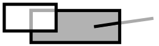  
**Figure 23-1** Clipping  
_Clipping is the process of determining what needs to be drawn. 
If something appears outside the bounds of its window or is 
hidden under another window, the system should not draw it. 
The clipping region is the area of the display where things will 
be drawn: in the window, but not obscured. In the figure, the 
shaded area shows the clipping region._

The windowing system is able to work much more quickly by 
assuming that not too many things are going to be changing at 
once. Normally it can assume that a given area of the screen 
will look like it did a short while ago. When it's time to change 
an area of the screen, that area is said to be "marked invalid," 
since whatever is presently being shown there is no longer 
valid. The normal example is that if a pull-down menu has been 
obscuring part of a document, when the menu goes away, the 
part of the document that becomes visible must be redrawn.

**MSG_VIS_DRAW, MSG_META_EXPOSED**  
These messages are sent to visible objects to instruct them to 
redraw themselves; if you are using graphics to display a 
visible object then you are probably intercepting 
MSG_VIS_DRAW. MSG_META_EXPOSED lets an object know 
that it has been marked invalid; either it has to be drawn for 
the first time, or part or all of it has been exposed (hence the 
name). The UI controller sends this message to the top object in 
the Vis hierarchy. MSG_VIS_DRAW, on the other hand, 
specifically instructs an object to redraw itself. Generally, a Vis 
object will respond to MSG_META_EXPOSED by sending 
MSG_VIS_DRAW to itself; it responds to MSG_VIS_DRAW by 
issuing the appropriate drawing commands, then sending 
MSG_VIS_DRAW to each of its children. 

**Graphic Objects**  
Graphic Objects provide the user with an interface for working 
with graphics in a manner similar to GeoDraw's. They are 
useful for programs which allow the users to construct some 
sort of graphical document or provide a sort of graphical 
overlay for a spreadsheet.

### 23.2 Graphics Goals

The graphics system is in charge of displaying everything in GEOS. Thus, it 
is vital that the GEOS graphics system be both powerful and easy to use. 
Features such as outline font support and WYSIWYG printing, usually 
afterthoughts on other operating systems, have been incorporated into the 
GEOS kernel. The graphics system was designed to be state of the art and 
thus had to achieve several goals:

+ Fast Operation
The GEOS graphics system is heavily optimized for common operations 
on low-end PCs. To allow a windowing system to run on an 8088 machine, 
it is vital that line drawing, clipping, and other common graphical 
operations run very quickly. They do.

+ Device Independence
Applications are sheltered from the hardware. Coordinate system units 
are device independent so that all of your drawing commands use 
real-world measurements. These units are then translated into device 
coordinates by the kernel.

+ Complete Set of Drawing Primitives
The graphics system must be able to draw a wide variety of shapes and 
objects to meet the needs of the UI and applications. It does.

+ Built In Support for Outline Fonts
GEOS includes outline font technology supporting a variety of font 
formats. Outline fonts are text typefaces which are defined by their 
outline shape rather than by a bitmap representation. Outline fonts can 
be scaled with no apparent loss of smoothness. GEOS also supports 
bitmap-based fonts; however the very nature of these fonts makes them 
non-WYSIWYG.

+ Single Imaging Model for Screen and Hardcopy
The graphics system uses the same high level graphics language for 
screen imaging as for printing. Because the GEOS system creates both 
screen and printed images through the same language, the screen can 
display a document just as it will be printed. Except for differences in 
resolution, what you see is what you get.

### 23.3 Graphics Architecture

The graphics system involves many pieces of GEOS working together to turn 
an application's UI and graphics commands into drawings on a display.

The graphics portion of the kernel automatically makes any requested 
transformations to the coordinate space dealing with scaling, rotation, etc. It 
transforms complicated drawing commands into simpler ones supported by 
the video drivers. (See Figure 23-2.)

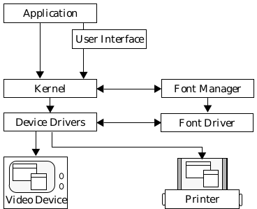  
**Figure 23-2** Graphics System Architecture

The video driver can render these simplified commands directly on the 
device. The video driver checks for collisions, making sure that if whatever is 
being drawn coincides with the mouse pointer, the mouse pointer will be 
drawn on top. The video driver does clipping so a geode doesn't draw outside 
its window. 

Commands and information flow in this manner from application to the 
Video Device, though information also flows in the opposite direction, so that 
the kernel can get information about the display device's resolution, size, and 
capabilities.

If the geode is going to draw text, the graphics system makes calls to the font 
manager. If the requested font isn't already in memory, the font manager 
loads it. The font manager then makes calls to the individual font driver for 
information about specific characters.

### 23.4 How To Use Graphics

When looking at the source code of sample applications, it's usually not too 
hard to pick out the commands that do the actual drawing. Commands with 
names like GrDraw-() generally are self-explanatory. It's not so easy to 
pick out the commands that set up an area in which the drawing will take 
place. Part of the problem is that there are many ways to display graphics; 
each is well suited for different tasks. This section of the chapter provides 
some practical knowledge about the various ways to display graphics and 
which situations are appropriate for each.

When possible, the best way to learn how to perform a graphics action is to 
look at code which performs a similar action. The sample program presented 
in "First Steps: Hello World," Chapter 4 shows a simple graphics 
environment sufficient for many geodes. If you only need to change what is 
being displayed (as opposed to how it is displayed), you can work straight 
from the example, drawing different shapes using commands found in 
"Drawing Graphics," Chapter 24. Most basic graphics techniques are used in 
one sample program or another. By combining and adapting code from the 
sample programs, you can take care of most simple graphics needs.

If you can't find a sample geode to work from, there are several points to 
consider when deciding what sort of graphics environment to set up.

+ Sometimes the only graphics commands in a geode will be those used to 
define that geode's program icon. This is a common enough case that 
instructions for setting up your geode's icon are in the program topics 
section, section 6.2 of chapter 6.

+ Will existing generic UI gadgetry be sufficient for everything you want to 
display? If you're writing a utility, it might be. If you're writing an arcade 
game, it probably won't be.

+ If your geode will be displaying graphics, will the user ever interact 
directly with the graphics? A graphing program might draw a graph 
based on data the user types in. Such a program could draw the graph 
but might not actually allow the user to interact with the graph. On the 
other hand, an art program will probably expect the user to interact with 
the graphics directly.

Once you've figured out just what your geode's graphical needs are, you're 
ready to find out which pieces of graphics machinery are right for you.

For custom graphics that will appear in a view, the content object of the 
GenView must be prepared to issue graphics commands. A common tactic is 
to create a subclass of VisContentClass and let an object of this subclass act 
as the content for a view. The subclass would very likely have a specialized 
MSG_VIS_DRAW. The Process object is another popular choice for the view's 
output descriptor. In this case, the process must be prepared to intercept any 
messages the view is likely to send, with MSG_META_EXPOSED and 
MSG_VIS_DRAW of the most interest. Whichever object, process or content, is 
the content of a view can respond to MSG_META_EXPOSED or 
MSG_VIS_DRAW by calling kernel graphics routines. For more information on 
how to use these objects, see "GenView," Chapter 9 of the Object Reference 
Book.

Geodes that wish to allow the user to edit graphical elements would do well 
to incorporate a Graphic Object into their hierarchies. These objects have 
considerable power and include UI to allow the user to work graphics within 
them. See "Graphic Object Library," Chapter 18 of the Object Reference Book 
for more information about these object classes.

As you learn more advanced graphics concepts you may discover shortcuts. 
As you get deeper into graphics, you should keep a cardinal rule in mind. Any 
time the graphics space is obscured and then exposed, the geode must be able 
to draw correctly, no matter what changes have been made. If your geode only 
draws on a MSG_VIS_DRAW, it will automatically follow this rule. However, 
applications using shortcuts must take MSG_VIS_DRAW into account; it may 
be sent at any time, and what it draws may wipe out what was there before. 
An arcade game that moves a spaceship by blitting a bitmap may be fast; 
however, be sure that the spaceship will be drawn to the right place if the 
game's window is obscured and then exposed. Don't worry if this sounds 
confusing now, but keep these words in mind as you read on.

### 23.5 Coordinate Space

The graphics system uses a rectangular coordinate grid to specify the size 
and position at which drawing commands will be carried out. This is a logical 
choice as most display devices use a rectangular grid of pixels. "Smart" 
devices with built in graphics routines tend to use coordinate grids to set 
place, size, and sometimes movement. "Dumb" devices, capable only of 
displaying bitmaps, always have these bitmaps described in terms of pixels 
on a square grid. The GEOS graphics system expects the geode to use the 
provided device-independent grid to describe graphics commands (see 
Figure 23-3). The graphics system will then convert this information to 
device coordinates: coordinates set up for the specific display device, using a 
grid of pixels.

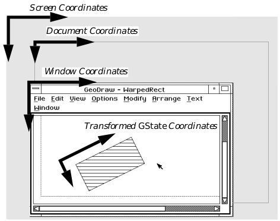  
**Figure 23-3** Coordinate Spaces  
_At any one time, the graphics system keeps track of several coordinate spaces. 
You only have to worry about the coordinate spaces for the GState you are 
working with; GEOS takes care of the rest._

### 23.5.1 Standard Coordinate Space

The standard coordinate space is what the application uses to describe where 
things are to be drawn. It is device independent, based on real world units: 
typographer's points, about 1/72nd of an inch. The origin of the coordinate 
system is normally the upper left corner of the document, but this can change 
with context and with changes made by the kernel or even your geode. The 
coordinate space normally extends from -16384 to 16383 horizontally and 
vertically. These constants may be referenced as MIN_COORD and 
MAX_COORD. Note that if you're going to be printing your document, you 
should restrict yourself to coordinates between -4096 to +4096 to account for 
scaling to draw on high resolution printers. It is possible to define a 32-bit 
coordinate space, which gives more room but costs speed and memory. For 
details about 32-bit spaces, see section 23.5.5 on page 823.

Whenever you draw something, you must specify the coordinates where that 
thing will be drawn. The coordinates you pass specify where in the coordinate 
plane that thing will be drawn; the plane, in turn, may be translated, scaled, 
and/or rotated from the standard window coordinate system (see section 
23.5.2 on page 812).

The system also maintains a device coordinate system, with a device pixel 
defined as the unit of the grid. This is the type of coordinate system most 
programmers are used to, but it is certainly not device independent. The 
graphics system will do all the worrying about device coordinates so your 
program doesn't have to. (Note, however, that GrDrawImage(), 
GrDrawHugeImage(), and GrBrushPolyline() are more 
device-dependant than most routines; see section 24.2.10 of chapter 24 and 
section 24.2.8 of chapter 24 for information on these routines).

Standard GEOS coordinates depart from the device model, taking an 
approach closer to a pure mathematical Cartesian plane. Programmers used 
to working with device-based coordinates are especially encouraged to read 
section 23.5.4 on page 819 to learn about some of the differences. 

#### 23.5.2 Coordinate Transformations

GEOS provides routines which "transform" the coordinate space. These 
commands can shift, magnify, or rotate the coordinate grid, or perform 
several of these changes at once (see Figure 23-4). These transformations 
affect structures in the GState, and new transformations can be combined 
with or replace a GState's current transformation.

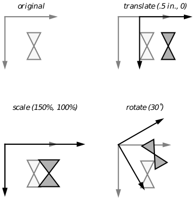  
**Figure 23-4** Effects of Simple Transformations

These transformations apply to the coordinate space, not to individual 
objects. As a result, if you apply a 200% scaling factor to a drawing not 
centered on the origin, not only will its size change, but its position will 
change as well. If you want these operations to affect an object but not its 
position, you should translate the coordinates so that the origin is at the 
desired center of scaling or rotation, apply the scaling or rotation, draw the 
object at the translated origin, then change the coordinates back. For an 
example of this sort of operation, see Figure 23-5.

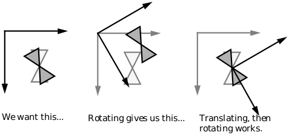  
**Figure 23-5** Rotating an Object About Its Center  
_Remember that transformations apply to the whole coordinate space, their 
effects based around the origin. Thus, to draw a rotated shape at certain 
coordinates, if the space is rotated before drawing, the coordinates at which 
the shape will be drawn will be rotated about the origin as well. There is a 
simple way to draw a shape rotated about an arbitrary axis. First, apply a 
transformation so that the origin is at the planned center of rotation. Next, 
apply the rotation. Finally, draw the figure at the new origin._

Since they are stored in the GState, these transformations endure-they do 
not go away after you've drawn your next object. If you apply a 90 degree 
rotation, you will continue drawing rotated to 90 degrees until you either 
rotate to some other angle or use another Graphics State. Transformations 
are also cumulative. If you rotate your space 30°, then translate it up an inch, 
the result will be a rotated, translated coordinate space. If you want to nullify 
your last transformation, apply the opposite transformation.

When applying a new transformation to a space which has already been 
transformed, the old transformations will affect the new one. Be careful, 
therefore, of the order of your transformations when combining a translation 
with any other kind of transformation. If you make your transformations in 
the wrong order, you may not get what you expected (for an example, see 
Figure 23-6).

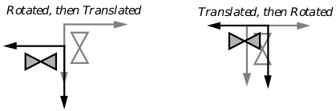  
**Figure 23-6** Ordering Transformation Combinations  
_When combining translations with other transformations, remember that the 
order of the transformations becomes important. The drawing on the left was 
rotated and then translated. The drawing on the right received the same 
transformations but in reverse order. Note that the drawings ended up being 
drawn to different positions._

##### 23.5.2.1 Simple Transformations

GrApplyRotation(), GrApplyScale(), GrApplyTranslation(), 
GrSetDefaultTransform(), GrSetNullTransform(), 
GrInitDefaultTransform(), GrSaveTransform(), 
GrRestoreTransform()

If you find yourself using transformations at all, they will probably all be 
rotations, scalings, and translations. The GEOS graphics system includes 
commands to apply these kinds of transformations to your coordinate system, 
taking the form GrApplyTransformation(). These commands work with a 
transformation data structure associated with the Graphics State, so 
everything drawn in that Graphics State will be suitably transformed. 
Figure 23-4 illustrates the effects of these transformations.

GrApplyRotation() rotates the coordinate space, turning it 
counterclockwise around the origin. All objects drawn after the rotation will 
appear as if someone had turned their drawing surface to a new angle. With 
a 90° rotation, a shape centered at  would draw as if centered at. 
Anything drawn centered at the origin would not change position but would 
be drawn with the new orientation. 

GrApplyScale() resizes the coordinate space; this is useful for zooming in 
and out. After applying a scale to double the size of everything in the x and y 
directions, everything will be drawn twice as big, centered twice as far away 
from the origin. Applying a negative scale causes objects to be drawn with the 
scale suggested by the magnitude of the scaling factor but "flipped over" to 
the other side of the coordinate axes.

GrApplyTranslation() causes the coordinate system to be shifted over. 
After a translation, everything will be drawn at a new position, with no 
change in orientation or size. 

To undo the effects of a transformation, you can apply the opposite 
transformation: rotate the other way, translate in the opposite direction, or 
scale with the inverse factor. 

To undo the effects of all prior transformations, return to the default 
transformation matrix using the GrSetDefaultTransform() command. The 
routine GrSetNullTransform() sets the Graphics State transformation to 
the null transform-nullifying not only your transformations, but any the 
system may have imposed as well. For the most part, you should avoid using 
the GrSetNullTransform() command and use the 
GrSetDefaultTransform() instead. You can change the default 
transformation matrix using GrInitDefaultTransform(), but this is 
generally a bad idea since the windowing system works with the default 
transformation, and if a geode begins making capricious changes, this can 
produce strange images. 

There are "push" and "pop" operations for transformations. To keep a record 
of the GState's current transformation, call GrSaveTransform(). To restore 
the saved transformation, call GrRestoreTransform().

##### 23.5.2.2 Complicated Transformations

GrApplyTransform(), GrSetTransform(), GrGetTransform(), 
GrTransformByMatrix(), GrUntransformByMatrix()

You may want to make some change to the coordinate system that has no 
simple correspondence to scaling, rotation, or translation. Perhaps you know 
some linear algebra and want to use your knowledge to combine several 
transformation functions into a single transformation (thus improving 
execution speed). All transformations on the coordinate system are expressed 
in the form of transformation matrices. A GEOS graphics system 
transformation consists of a matrix containing 6 variables and 3 constants 
(see Equation 23-1). The six variables allow for standard coordinate 
transformations. The constants (0, 0, and 1 respectively) allow these 
transformation matrices to be composed. For example, multiplying a scaling 
matrix with a rotation matrix creates a matrix which represents a combined 
scaling and rotation. The six variable matrix elements are stored in a 
TransMatrix structure.

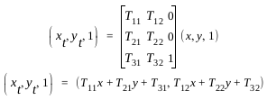  
**Equation 23-1** Transformation Matrices  
_The left hand side shows the new coordinate pair resulting from applying the 
transformation to the old coordinates. The right hand side of the equation 
shows the formula used to compute these new coordinates. The "1" following 
each coordinate pair is a constant to allow matrix multiplications._

The GEOS system uses one matrix to store the Graphics State transformation 
and one to store the Window transformation. When told to apply a new 
transformation, the graphics system constructs a matrix to represent the 
requested transformation change and multiplies this matrix by the old 
transformation matrix. To combine these matrices, GEOS multiplies them 
together to get the cross-product (See Equation 23-2).

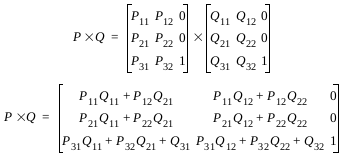  
**Equation 23-2** Combining Transformations  
_Transformations are combined by taking the cross product of their matrices. 
In cases where order is important, the leftmost factor represents the more 
recent transformation._

If you know that there's a particular combination of transformations you're 
going to be using a lot, you can do some math in advance to compute your own 
transformation matrix, then apply the raw matrix as a transformation using 
GrApplyTransform(). Equation 23-3 shows the matrices corresponding to 
the simple transformations. To replace the GState's current transformation 
matrix with the matrix of your choice, use GrSetTransform(). To find out 
the current transformation, call GrGetTransform().

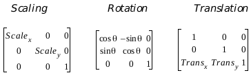  
**Equation 23-3** Matrices for Standard Transformations

GrTransformByMatrix() returns the results of transforming a passed 
coordinate pair using an arbitrary transformation matrix. 
GrUntransformByMatrix() performs the reverse operation, returning the 
coordinates which would have transformed to the passed coordinates.

Sometimes you have to be careful about the order in which these 
transformations are supposed to occur. When multiplying transformation 
matrices together, the transformation that is applied later is the first in the 
multiplication pair. You can combine any number of rotations and scalings 
together without having to worry about order: the resulting matrices will be 
the same. When combining a translation with any other kind of operation, it 
makes a difference what order you make the transformations and thus 
makes a difference based on what order you multiply the matrices (See 
Figure 23-6 and Equation 23-2).

#### 23.5.3 Precise Coordinates

As has been previously stated, coordinates are normally given in 
typographer's points. Most graphics commands accept coordinates accurate 
to the nearest point. This should be more than sufficient for most geodes, but 
for those specialized programs, more precise drawing is possible.

For simple cases, it is possible to create precise drawings by scaling the 
drawings. To make drawings accurate to one fourth of a point, for example, 
scale by 25% and multiply all coordinates accordingly. However, this 
approach is limited and may result in confusing code.

Another way to make precise drawings is to use the graphics commands 
which have been specially set up to take more precise coordinates. These 
commands will not be described in detail here, but keep them in mind when 
planning ultra-high resolution applications. GrRelMoveTo(), 
GrDrawRelLineTo(), GrDrawRelCurveTo(), and 
GrDrawRelArc3PointTo() take WWFixed coordinates, and are thus 
accurate to a fraction of a point. To draw a precise outline, use these 
commands to draw the components of the outline. To fill an area, use the 
precise drawing commands to describe the path forming the outline of the 
area, then fill the path.

#### 23.5.4 Device Coordinates

Most programmers can work quite well within the document space 
regardless of how coordinates will correspond to device coordinates. However, 
some programmers might need to know about the device coordinates as well. 
The system provides clever algorithms for going from document to device 
space for all programmers, as well as routines to get device coordinate 
information from the device driver.

##### 23.5.4.1 What the System Draws on the Device

Consider a device whose pixels are exactly 1/72nd of an inch, such that no 
scaling is required to map document units to device units. The relationship 
of the coordinate systems is illustrated below. Note that a pixel falls between 
each pair of document units. This is a further demonstration of the concept 
that document coordinates specify a location in the document coordinate 
space, not a pixel.

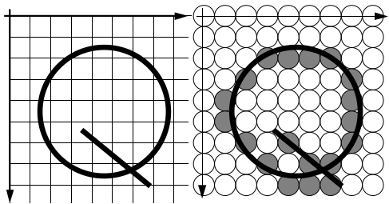  
**Figure 23-7** Document and Device Coordinates  
_When using a device with 72dpi resolution, it's pretty simple to figure out what 
will be drawn to the device._

Next consider a device that has a resolution of 108 dpi, which is 1.5 times 
greater than our default 72 dpi. That is, there are 1.5x1.5 pixels on the device 
for each square document unit. The basic problem here is that the 
coordinates that are specified in document space map to non-integer pixels in 
device space. The graphics system would like the pixels to be half-filled along 
two edges of the rectangle (see Figure 23-8). Unfortunately, a pixel must be 
either filled or empty, so the system needs a set of rules to follow in this 
situation. These rules are

+ If the midpoint of a pixel (i.e., the device coordinate of that pixel) falls 
inside the area's boundary, that pixel is filled. 

+ Conversely, if the midpoint of a pixel falls outside the area's border, the 
pixel is not filled.

+ If the midpoint of the pixel falls exactly on the border of the area to be 
filled, the following rule is used: 
Pixels on the left or the top are not filled; 
Pixels on the right or the bottom are filled; 
Pixels in the left-bottom and top-right corners are not filled.

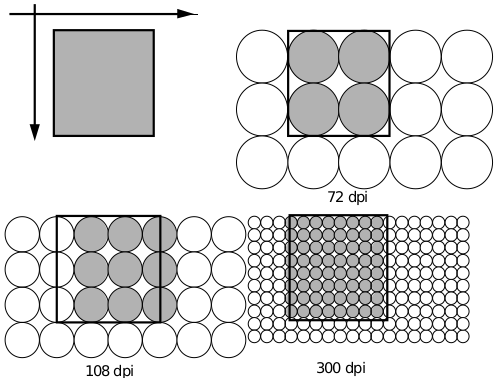  
**Figure 23-8** Different Device Coordinates  
_When using a device with a resolution that is not a multiple of 72dpi, GEOS 
has to decide which borderline pixels have to be filled._

These rules might seem a little odd: Why not just fill all the pixels that would 
be touched by the area? One of the problems with this approach is that areas 
that did not overlap in the document space would overlap on the device. Or 
more specifically, they would overlap only on some devices (depending on the 
resolution), which is even worse. The rules have the property that adjoining 
areas in document space will not overlap in any device space.

Our next set of potential problems comes with lines. Lines can be very thin 
and thus might be invisible on some low-resolution devices. If the graphics 
system used the rules for filled objects then some thin lines would be only 
partially drawn on low resolution devices. GEOS uses Bresenham's algorithm 
for drawing straight thin lines, ensuring that a continuous group of pixels 
will be turned on for a line (see Figure 23-9). This continuity is insured due 
to the behavior of the algorithm:

+ If the line is more horizontal then vertical, exactly one pixel will be 
turned on in each column between the two endpoints.

+ If the line is more vertical than horizontal, exactly one pixel will be 
turned on in each row.

+ If the line is exactly 45 degrees, exactly one pixel will be turned on in each 
column and row.

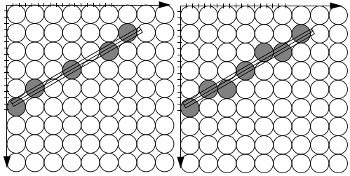  
**Figure 23-9** Drawing Thin Lines  
_If the thin line were drawn as if it were a skinny filled polygon, there would be 
gaps as shown to the left. Using Bresenham's line algorithm, GEOS eliminates 
the gaps, resulting in a continuous line drawn as on the right._

Since ellipses and Bèzier curves are drawn as polylines, Bresenham's 
algorithm will work with them.

##### 23.5.4.2 Converting Between Doc and Device Coordinates

GrTransform(), GrUntransform(), GrTransformWWFixed(), 
GrUntransformWWFixed()

Given a coordinate pair, at times it's convenient to know the corresponding 
device coordinates. Sometimes the reverse is true. Use these functions to 
convert a coordinate pair to device coordinates or vice versa. GrTransform() 
takes a coordinate pair and returns device coordinates. GrUntransform() 
does the reverse. If you want to be able to get a more exact value for these 
coordinates you can use GrTransformWWFixed() and 
GrUntransformWWFixed(). These return fixed point values so you can do 
other math on them before rounding off to get a whole number that the 
graphics system can use.

To transform points through an arbitrary transformation instead of to device 
coordinates, use the GrTransformByMatrix() or 
GrUntransformByMatrix() routines, described previously.

#### 23.5.5 Larger Document Spaces

GrApplyDWordTranslation(), GrTransformDWord(), 
GrUntransformDWord(), GrTransformDWFixed(), 
GrUntransformDWFixed()

Some applications may need a graphics space larger than the 19 foot square 
of the standard coordinate space (10 foot square for printed documents). 
Some spreadsheets can take up a lot of room, as can wide banners. Geodes 
that will need a large drawing space can request a 32-bit graphics space, i.e. 
a coordinate space in which each axis is  points long (more than 4 billion 
points, or 900 miles). Most applications will be able to get by with standard 
16-bit coordinate spaces, and their authors may safely skip this section. Note, 
however, that the Graphic and Spreadsheet objects use 32-bit graphics 
spaces for display.

If a geode will use a 32-bit space in a view, it will need a VisContent object 
with the VCNA_LARGE_DOCUMENT_MODEL attribute.

For the most part, 32-bit documents use the same graphics commands as 
regular 16-bit documents. No single drawing command can cover more than 
a standard document area; each has been optimized to draw quickly in 16 
bits. To draw to the outlying reaches of your document space, apply a special 
translation that takes 32-bit coordinates, then use normal drawing routines 
in your new location. 

A model for working with 32-bit graphics spaces commonly used with 
spreadsheets is to break the graphics space into sections. To draw anything, 
the geode first uses a translation to get to the proper section, then makes the 
appropriate graphics calls to draw within that section. Similarly a 
GeoDraw-style application might translate to the appropriate page, then 
make normal graphics commands to draw to that page (see Figure 23-10).

If you wish to display this 32-bit coordinate graphics space to the screen, 
you'll probably want to do so in a 32-bit content.

The standard graphics commands can only draw to one 16 bit space at a time. 
You will need to translate the coordinate space to choose which 16-bit portion 
of the 32-bit space you want to draw to. To do so you need to use some special 
translation functions. GrApplyDWordTranslation() corresponds to the 
GrApplyTranslation() function normally used.You can use this routine to 
make the jumps necessary to access far away portions of the graphics space. 
Since a coordinate can now be in a much larger area than before, all routines 
that deal with a point's position have 32-bit equivalents.

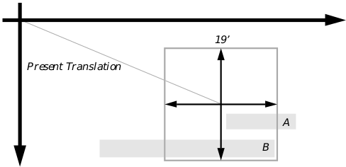  
**Figure 23-10** Thirty-two Bit Graphics Spaces  
_When drawing in a 32-bit space, remember that the drawing commands are 
only prepared to draw in a sixteen-bit subspace. In the figure, rectangle A isn't 
entirely within reach of the origin, so it will be necessary to translate the origin 
again before drawing this rectangle. Rectangle B is not only partially out of 
reach of the origin, it's too big to fit inside of a 16-bit space. In order to draw 
this rectangle, you would have to divide it into two pieces._

GrTransformDWord() and GrUntransformDWord() take the place of 
GrTransform() and GrUntransform(). GrTransformDWFixed() and 
GrUntransformDWFixed() take the place of GrTransformWWFixed() 
and GrUntransformWWFixed(), with two words in the integer part of the 
number instead of one.

#### 23.5.6 Current Position

GrMoveTo(), GrRelMoveTo(), GrGetCurPos(), GrGetCurPosWWFixed()

The graphics system supports the notion of a current position, sometimes 
called a pen position. Note that the pen position metaphor predates "pen 
computing"; please don't confuse these concepts. The concept behind the pen 
position is that all graphics commands are executed by a pen that ends up at 
the last place drawn. So if the last command was to draw a curve ending at 
(20, 20), the pen will still be there. There are special drawing commands that 
work with the pen position, so you could then draw a line from the current 
position to (30, 30). The line would extend from (20, 20) to (30, 30), and the 
pen would then be at (30, 30). 

Calling GrMoveTo() moves the pen position to coordinates of your choice. 
GrRelMoveTo() moves the pen to a location relative to its present position. 
GrRelMoveTo() takes coordinates accurate to a fraction of a point, allowing 
for very precise placement. Call GrGetCurPos() to get the current position, 
GrGetCurPosWWFixed() to do so with greater accuracy.

There are some guidelines to follow when figuring out where your pen 
position is going to end up after a draw operation. If you call the 
GrDrawLineTo() procedure, the pen will end up at the point drawn to. If 
you call any draw/fill procedure that takes two points as arguments, the pen 
position usually ends up at the second point passed; if it does not, the 
reference entry will note where the pen position ends. When text draws at the 
current position, the current position is used to place the left side of the text. 
When done drawing the text, the current position has moved to the right side 
of the text.

### 23.6 Graphics State

The data structure known as the Graphics State, or GState, keeps track of 
changes your code makes about how it wants to draw things. If your geode 
changes its transformation, everything you draw from that point will be 
drawn transformed until you change the transformation again. If your geode 
sets the line width to two points, all lines to come will be drawn two points 
wide until the width is set to something else. Many graphics routines ask 
that you pass a GState along as one of the parameters so they know where 
and how to draw what you've requested.

#### 23.6.1 GState Contents

Sometimes it's convenient to think of the GState as being analogous to the 
Properties boxes in GeoDraw. The GState keeps track of how the program 
wants to draw lines, text, and filled areas, just as the Line Properties, Text 
Properties, and Area Properties boxes keep track of how the GeoDraw user 
wants to draw these objects. 

While handy, this analogy doesn't do the GState justice. The GState keeps 
track of many things:

+ Mix Mode
The graphics system allows for different mix modes (sometimes known as 
copy modes). These drawing modes permit the geode to draw in such 
ways that it erases instead of drawing, draws using the inverse of 
whatever it's drawing on, or uses various other modes.

+ Current Position (also known as Pen Position)
The graphics system keeps track of the position of the last thing drawn. 
If your geode wants to draw something else at this location, there are 
drawing commands that will draw at the current position.

+ Area Attributes
The GState contains information that the graphics system will use when 
filling areas. This information includes the color and fill pattern to use.

+ Line attributes
The graphics system uses information stored in the Graphics State to 
keep track of what color and pattern to use when drawing lines. The 
GState also keeps track of whether lines should be drawn as dotted, and 
if so what sort of dot-dash pattern to use. The GState contains the line 
width. It also contains line join information, which controls how lines will 
be drawn when they meet at an angle, as at the vertices of a polygon.

+ Text Attributes
The Graphics State contains the ID of the current font, the font size, and 
the text style. It also contains a color and pattern to use, information 
about the font, and some esoteric text-drawing options.

+ Coordinate Space Transformations
The GState keeps track of the current coordinate space transformation. 
If there is an associated window, the window's transformation matrix is 
maintained separately with the window's information.

+ Associated Window
The GState knows the handle of the window associated with the GState. 
This is the window that will determine where drawings appear and how 
they are clipped.

+ Associated GString
If the application is building a GString, the GState is aware of it. The 
GState contains a reference to the GString. When the graphics system 
turns graphics commands into GString elements, these elements will be 
appended to the referenced GString.

+ Associated Path
If the application is building a path, the GState contains a pointer to the 
path along which new path elements are passed, similar to the way 
GString elements are passed. The GState also keeps track of whether the 
current path is to be combined with another path or should be used "as 
is."

+ Clipping Information
The GState keeps track of clipping information in addition to that 
maintained by the window.

The function of many of these parts may be fairly intuitive to someone used 
to working with graphics programs. Some of the others may require 
additional explanation, especially when it comes to how to work with them.

#### 23.6.2 Working with GStates

GrCreateState(), GrDestroyState(), GrSaveState(), GrRestoreState()

As has been mentioned, most graphics routines require that a GState handle 
be provided as an argument. Beginning programmers are often unclear on 
just where to get the GState to use.

Many drawing routines are called by MSG_VIS_DRAW. This message provides 
a GState, and all routines in the handlers for this message should use the 
provided GState. Creating a new GState under these circumstances is 
unnecessary and wasteful. However, sometimes you will need to create a 
GState. GrCreateState() creates a GState with the default characteristics. 
You must specify the window with which the GState will be associated.

Commands which change drawing attributes or the current position change 
the GState. 

GrDestroyState() is used to get rid of a GState, freeing the memory to be 
used by other things. If GStates are created but not destroyed, eventually 
they will take too much memory. Normally, for each call to GrCreateState() 
there is a corresponding GrDestroyState(). MSG_VIS_DRAW handlers don't 
need to destroy the passed GState. Graphics states are cached so that 
GrCreateState() and GrDestroyState() don't normally need to call 
MemAlloc() or MemFree(). When GStates are freed, their space is added to 
the cache. When the memory manager needs to find space on the heap, it 
flushes the cache.

A geode is most likely to call GrCreateState() when about to draw a piece 
of geode-defined UI. Other than that, you'll probably be using GStates 
provided to you by the system. You might want to create a GState if you 
wanted to calculate something (perhaps the length, in inches, of a text string) 
when you had no appropriate GState.

GrSaveState() provides a sort of "push" operation that works with GStates. 
When you call certain functions, like GrSetAreaColor(), new values will 
wipe out the values of the old GState. But if you've previously called 
GrSaveState(), then any time you call GrRestoreState() on your saved 
state, it will come back and displace the current state. Your application can 
save a GState to save a commonly used clipping region, which could then be 
restored by restoring the state instead of repeating all the operations needed 
to duplicate the region. GrSaveTransform() and GrRestoreTransform() 
are optimizations of GrSaveState() and GrRestoreState(), but they only 
preserve the GState's transformation.

### 23.7 Working With Bitmaps

GrCreateBitmap(), GrDestroyBitmap(), GrEditBitmap() 
GrGetPoint(), GrSetBitmapMode(), GrGetBitmapMode(), 
GrSetBitmapRes(), GrGetBitmapRes(), GrClearBitmap(), 
GrGetBitmapSize(), GrCompactBitmap(), GrUncompactBitmap()

Bitmaps are useful for describing complicated pictures that don't have to be 
smooth at all resolutions. For example, coming up with all the lines and 
shapes necessary to describe a complicated photograph would be 
time-consuming and a waste of memory. It's much easier to set up a 
rectangular array of cells and to set a color value for each cell. Bitmaps are 
often used for defining program icons. GEOS includes a great deal of bitmap 
support. It has kernel routines to create, modify, and draw bitmaps.

There are three main ways to create a bitmap for an application to use. One 
often used is to embed the data of a desired bitmap directly into a graphics 
string. This is the way normally used for defining system icons. The other 
common way is to call the kernel graphics routine GrCreateBitmap(). 
Another way to create a bitmap, not used so often, is to manipulate memory 
directly: The formats used for describing bitmaps are public, and though it 
would be easier in most cases to work through GrCreateBitmap(), those 
with specialized needs might want to create their bitmap data structures 
from scratch.

The GrCreateBitmap() routine creates an offscreen bitmap and returns a 
Graphics State which can be drawn to; changes to this Graphics State 
become changes to the offscreen bitmap. For example, calling 
GrDrawLine() and passing the Graphics State provided with such a bitmap 
would result in a bitmap depicting a line. To display this bitmap, call the 
GrFillBitmap(), GrDrawHugeBitmap(), GrDrawImage(), or 
GrDrawHugeImage() commands in another graphics space (see section 
24.2.10 of chapter 24).

When creating a bitmap, you must make choices about what sort of bitmap 
you want. Depending on your choices, GEOS will be able to use a variety of 
optimizations. For instance, it takes much less room to store a monochrome 
bitmap than a color bitmap the same size.

Whenever creating a bitmap, you must specify its dimensions and what sort 
of coloring it will use (monochrome, four bit, eight bit, or 24 bit).

You may store a mask with your bitmap. This mask works something like the 
mask used when drawing a view's mouse pointer. When the bitmap is drawn, 
blank areas of the bitmap will be drawn as black for those pixels where the 
mask is turned on. For pixels where the mask is turned off, whatever was 
underneath the bitmap will be allowed to show through.

By asking for a Complex bitmap, you can specify even more information. 
Complex bitmaps may include their own palette and may specify their own 
horizontal and vertical resolution. They are very useful for working with 
bitmaps that may have been captured on other systems or for working with 
display devices.

The GrDestroyBitmap() routine destroys some or all of the information 
associated with a bitmap. You may use this function to free all memory taken 
up by the bitmap. You may also use this function to free only the GState 
associated with a bitmap by GrCreateBitmap(), but leave the bitmap's data 
alone; the BMDestroy argument will determine exactly what is destroyed. 
This usage comes in handy for those times when a bitmap will not be 
changing, but will be drawn. Large bitmaps are stored in HugeArrays so they 
won't take up inordinate amounts of RAM; of course it's always wise to free 
the memory associated with a bitmap when that bitmap is no longer needed.

If you have freed the GState associated with a huge bitmap using 
GrDestroyBitmap() but want to make changes to the bitmap, all is not lost. 
Call GrEditBitmap() to associate a new GState with the bitmap. Be careful, 
however; the bitmap will not recall anything about the old GState, so you 
must set up colors, patterns, and other such information again. To update the 
VM file used to store a bitmap (if any), call GrSetVMFile().

GrClearBitmap() clears the data from a bitmap.

GrGetPoint() can retrieve information from a bitmap, returning its color 
value for some location. It works with all sorts of display areas, not just 
bitmaps. It is mentioned here because of its usefulness for those who wish to 
be able to exercise effects on their bitmaps.

GrSetBitmapMode() gives you control over how drawing commands will 
affect the bitmap. If your bitmap has a mask, use this routine to switch 
between editing the mask and the bitmap itself; the BitmapMode argument 
will specify what is to be edited.

This routine also gives you control over how monochrome bitmaps should 
handle color. When you draw something in color to a monochrome bitmap, the 
system tries to approximate the color using dithering. It turns some pixels on 
and some pixels off in an attempt to simulate the color's brightness. A 
crimson area would appear with most pixels black, and thus rather dark. A 
pink area on the other hand would have mostly white pixels, and thus appear 
light. GrSetBitmapMode() can change which strategy GEOS will use when 
deciding which pixels to turn on. If you wish to use "dispersed" dithering, the 
pixels turned on will be spread out evenly, resulting in a smooth gray. 
However, some output devices (notably certain printers) have trouble 
drawing small, widely spaced dots accurately. Using "clustered" dithering 
causes the system to keep the pixels turned on close together, resulting in 
pictures reminiscent of newspaper photographs. Thus, devices that prefer a 
few big dots to lots of little dots will have an easier time with bitmaps so 
edited. 

The bitmap mode information may also include a color transfer table. These 
tables are normally only used by printer drivers, but your geode is welcome 
to use them, if you can find a reason. Some models of printer have problems 
when mixing colors. Several printers have problems trying to mix dark 
colors, tending to end up with black. The table contains a byte value for each 
possible value of each color component. When mixing the colors, the graphics 
system will find the real color value to use in the table. Thus, if the reds in 
RGB bitmaps are looking somewhat washed out, you might set up a table so 
that reds would be boosted. RGBT_red[1] might be 16, RGBT_red[2] 23, so 
that the device would use more than the standard amount of the red component. 

GrGetBitmapMode() returns the current bitmap editing mode.

GrSetBitmapRes() works with complex bitmaps, changing their resolution. 
Because simple bitmaps are assumed to be 72 dpi, their resolution cannot be 
changed unless they are turned into complex bitmaps. GrGetBitmapRes() 
returns the resolution associated with a complex bitmap.

GrGetBitmapSize() returns a bitmap's size in points. This function might 
be useful for quickly determining how much space to set aside when 
displaying the bitmap. GrGetHugeBitmapSize() retrieves the size of a 
bitmap stored in a HugeArray.

Use GrCompactBitmap() and GrUncompactBitmap() to compact and 
uncompact bitmaps. Compacted bitmaps take up less memory; uncompacted 
bitmaps draw more quickly. Note that the bitmap drawing routines can 
handle compacted and uncompacted bitmaps. These functions are here to aid 
programmers who wish more immediate control over their memory usage.

### 23.8 Graphics Strings

A GString is a data structure which represents a series of graphics 
commands. This structure may be stored in a chunk or VM file so that it may 
be played back later. An application may declare a GString statically or may 
create one dynamically using standard kernel drawing commands. They are 
used for describing application icons and printer jobs, among other things. 

#### 23.8.1 Storage and Loading

GrCreateGString(), GrDestroyGString(), GrLoadGString(), 
GrEditGString(), GrCopyGString(), GrGetGStringHandle(), 
GrSetVMFile()

GStrings may reside an a number of types of memory areas. Depending on 
the GString's storage, you will have to do different things to load it. One 
common case we have already discussed to some extent is when the GString 
is part of a visual moniker. In this case, the gstring will be stored in the 
gstring field of the @visMoniker's implied structure. In this case the UI will 
do all loading and drawing of the GString.

The GString data itself consists of a string of byte-length number values. The 
graphics system knows how to parse these numbers to determine the 
intended drawing commands. You need not know the details of the format 
used-there are routines by which you may build and alter GStrings using 
common kernel graphics routines; however, macros and constants have been 
set up so that you may work with the data directly.

GString data may be stored in any of the following structures (corresponding 
to the values of the GStringType enumerated type):

**Chunk**  
This is the storage structure of choice for GStrings which will 
be used as monikers.

**VM Block**  
Virtual memory is normally used to store GStrings which may 
grow very large. GStrings residing in virtual memory may be 
dynamically edited.

**Pointer-Referenced Memory**  
You may refer to GStrings by means of a pointer. However, this 
will only work for reading operations (i.e. you may not change 
the GString). This is the ideal way to reference a GString which 
is statically declared in a code resource.

**Stream**  
Streams are not actually used to store data-they are used to 
transmit it between threads or devices. If you write a GString 
to a stream, it is assumed that some other application, perhaps 
on another device, will be reading the GString.

Note that a GString stored in a Stream, VM block, or in memory referenced 
only by a pointer is not quite ready to be drawn, only GStrings stored in a 
chunk may be drawn. Fortunately there is a routine which can load any type 
of GString into local memory so that it may be drawn.

If you are editing or creating the GString dynamically, it will have a GState 
associated with it. Any drawing commands made using this GState will be 
appended to the GString. This GState will not be stored with the GString; it 
is instead stored with the other GStates. You may destroy the GState when 
done editing, and hook up a new one if starting some other edit; this will not 
affect the GString's storage.

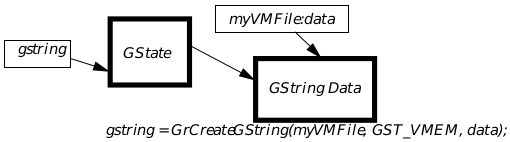  
**Figure 23-11** GStrings and Associated GStates  
_The GString's data may reside in a variety of places. In addition to this data, 
many GString operations will involve a GState. This special GState may be 
used to edit the contents of the GString. Don't confuse the GString's handle 
with that of its associated data. _

To dynamically create an empty GString, call the GrCreateGString() 
routine. You must decide where you want the GString to be stored-either in 
a chunk, a VM block, or a stream. If you wish to store the GString in a chunk 
or VM block, a memory unit of the appropriate type will be allocated for you. 
This routines will return the GState by which the GString may be edited and 
the chunk or VM block created.

The GrDestroyGString() routine allows you to free up the GState handle 
associated with your GString You may also destroy the GString's data if you 
wish; specify exactly what you want to destroy by means of the 
GStringKillType argument. In addition, you may destroy another GState. 
You must pass the global handle of the GString to destroy-this will be the 
handle returned by GrCreateGString(), GrEditGString(), or GrLoadGString().

The GrLoadGString() command loads a GString into a global memory 
block so that it may be drawn. Actually, it doesn't load the entire GString into 
memory, but does initialize the data structure so that it may be referenced 
through the global memory handle which the routine returns.

The GrEditGString() command is very much like GrCreateGString(), 
except that instead of creating a new GString, it allows you to dynamically 
edit an existing GString. This command loads a VM-based GString into a 
special data structure. Like GrCreateGString(), it returns a GState to 
which you may make drawing commands. You may insert or delete drawing 
commands while in this mode, all using kernel drawing routines. For more 
information about using this routine, see "Editing GStrings Dynamically" on 
page 846.

The GrCopyGString() command copies the contents of one GString to 
another. At first you might think that you could do this by allocating the 
target GString with GrCreateGString(), then drawing the source GString 
to the provided GState. However, the GState may only have one GString 
associated with it, whether that GString is being used as a source or target.

To find the handle of the GString data associated with a GState, call 
GrGetGStringHandle(). To update the VM file associated with a GString 
(perhaps after calling VMSave()), use GrSetVMFile().

#### 23.8.2 Special Drawing Commands

GrEndGString(), GrNewPage(), GrLabel(), GrComment(), 
GrNullOp(), GrEscape(), GrSetGStringBounds()

There are certain kernel graphics commands which, though they could be 
used when drawing to any graphics space, are normally only used when 
describing GStrings. Most of these commands have no visible effect, but only 
serve to provide the GString with certain control codes.

The most commonly used of these routines is GrEndGString(). This signals 
that you are done describing the GString, writing a GR_END_GSTRING to the 
GString. This routine will let you know if there was an error while creating 
the GString (if the storage device ran out of space). Its macro equivalent is 
GSEndString().

The GrNewPage() routine signals that the GString is about to start 
describing another page. GStrings are used to describe things to be sent to 
the printer, and unsurprisingly, this routine is often used in that context. An 
example of a prototype multi-page printing loop is shown inCode 
Display 23-1. Whether or not it is drawing to a GString, GrNewPage() 
causes the GState to revert to the default. When calling this routine, specify 
whether or not a form-feed signal should be generated by means of the 
PageEndCommand argument.

---
Code Display 23-1 Multi-Page Printing Loop
~~~
/* The application this code fragment is taken from stores several pages of 
 * graphics in one coordinate space. The pages are arranged each below the other.
 * To display page #X, we would scroll down X page lengths. */

for (curPage=0; curPage < numberOfPages; curPage++) {
	GrSaveState(gstate);
	GrApplyTranslation(gstate, 0,MakeWWFixed(curPage*pageHeight));

	/* -Draw current page- */

	GrRestoreState(gstate);
	GrNewPage(gstate, PEC_NO_FORM_FEED );}
~~~

The GrLabel() routine inserts a special element into the GString. This 
element does not draw anything. However, these GString labels, as they are 
called, are often used like labels in code. By using GString drawing routines 
with a certain option (described below), you may "jump" to this label and 
start drawing from that point in the GString. Alternately, you could start at 
some other part of the GString and automatically draw until you 
encountered that label.

The GrComment() routine inserts an arbitrary-length string of bytes into 
the GString which the GString interpreter will ignore when drawing the 
GString. You might use this to store anything from custom drawing 
commands which only your geode has to be able to understand to a series of 
blank bytes which could act as a sort of placeholder in memory.

---
Code Display 23-2 GSComment Example
~~~
static const byte MyGString[] = {
	GSComment(20), 'C','o','p','y','l','e','f','t',' ','1','9','9','3',
	' ','P','K','i','t','t','y', 
	GSDrawEllipse(72, 72, 144, 108), 
	GSEndString()};
~~~

The GrNullOp() routine draws nothing and does nothing other than take up 
space in the GString (a single-byte element of value GR_NOP). You might use 
it as a placeholder in the GString.

The GrEscape() writes an escape code with accompanying data to the 
GString. Most geodes do not use this functionality; you might use it to embed 
special information in a TransferItemFormat based on GStrings.

Depending on what the system will do with your GString, the bounds of the 
GString may be used for many purposes. Normally the system determines 
the bounds of a GString by traversing the whole GString and finding out how 
much space it needs to draw. The GrSetGStringBounds() allows you to 
optimize this, setting up a special GString element whose data contains the 
bounds of the GString. You should call this routine early on in your GString 
definition so that the system won't have to traverse very much of your 
GString to discover the special element.

#### 23.8.3 Declaring a GString Statically

For most programmers, the first encounter with GStrings (often, in fact, their 
first encounter with any sort of graphics mechanism) is with a program icon. 
Often this program icon consists of one or more GStrings, each of which 
contains a bitmap. These monikers are often set up using the @visMoniker 
keyword. This automatically stores the GString to a chunk. For an example 
of a GString stored this way, see the appSMMoniker GString in Code 
Display 23-3.

---
Code Display 23-3 GString in Visual Monikers
~~~
@start AppResource;
@object GenApplicationClass AppIconApp = {

/* The visual moniker for this application (an icon) is created by selecting the
 * most appropriate moniker from the list below. Each moniker in this list is
 * suitable for a specific display type. The specific UI selects the moniker
 * according to the display type GEOS is running under. A text moniker is also
 * supplied if the specific UI desires a textual moniker. */

 GI_visMoniker = list {
	AppIconTextMoniker, /* simple text moniker */
	appLCMoniker, /* Large Color displays */
	appLMMoniker, /* Large Monochrome displays */
	appSCMoniker, /* Small Color displays */
	appSMMoniker, /* Small Monochrome displays */
	appLCGAMoniker, /* Large CGA displays */
	appSCGAMoniker /* Small CGA displays */ }
} 

@visMoniker AppIconTextMoniker = "C AppIcon Sample Application";
@end AppResource

@start SAMPLEAPPICONAREASMMONIKERRESOURCE, data;
@visMoniker appSMMoniker = {
	style = icon;
/* Small monochrome icons use the standard size and 1 bit/pixel gray coloring. */
	size = standard; color = gray1; aspectRatio = normal; cachedSize = 48, 30;

/* The following lines hold GString data: */
 @gstring {
		/* GSFillBitmapAtCP:
		 * This macro signals that we want to fill a bitmap. The next few
		 * bytes should consist of information about the bitmap; the data
		 * after that holds the bitmap data. The GString reader will know
		 * when it's done reading the bitmap data based on the size stated
		 * in the bitmap's info-it will thus know where to look for the 
		 * next command (in this case a GSEndString() macro. */
 	GSFillBitmapAtCP(186),
		/* Bitmap():
		 * This macro is used to write basic information about the bitmap
		 * to the GString. In this case, that information consists of:
		 * The bitmap is 48x30. It is compressed using PackBits. It is 
		 * monochrome. */
	Bitmap (48, 30, 0, BMF_MONO),
		/* 0x3f, 0xff, 0xff, -:
		 * These numbers are the bitmap data itself. */
	0x3f, 0xff, 0xff, 0xff, 0xff, 0x80, 0x7f, 0xff, 0xff, 0xff, 0xff, 0xc0,
	0x60, 0x00, 0x00, 0x00, 0x00, 0x60, 0x60, 0x00, 0x00, 0x00, 0x00, 0x60,
	0x60, 0x00, 0x00, 0x80, 0x00, 0x60, 0x60, 0x00, 0x01, 0xc0, 0x00, 0x60,
	0x60, 0x00, 0x03, 0xe0, 0x00, 0x60, 0x60, 0x00, 0x07, 0xf0, 0x00, 0x60,
	0x60, 0x00, 0x03, 0xf8, 0x03, 0xfe, 0x60, 0x00, 0x01, 0xfc, 0x00, 0xf9,
	0x60, 0x06, 0x04, 0xfe, 0x01, 0xfd, 0x60, 0x38, 0x06, 0x1f, 0x01, 0xfd,
	0x60, 0x40, 0x03, 0x63, 0x81, 0x05, 0x60, 0x80, 0x01, 0xa3, 0xc1, 0x04,
	0x60, 0x40, 0x00, 0xc3, 0x81, 0x04, 0x60, 0x38, 0x00, 0x6f, 0x01, 0x04,
	0x60, 0x07, 0xfe, 0xf6, 0x00, 0x88, 0x60, 0x00, 0x01, 0xfc, 0x01, 0x8c,
	0x60, 0x00, 0x03, 0xfe, 0x03, 0xde, 0x60, 0x00, 0x07, 0xf5, 0x07, 0x77,
	0x60, 0x00, 0x03, 0xe2, 0x8f, 0xaf, 0x60, 0x00, 0x01, 0xc3, 0xdf, 0xdf,
	0x60, 0x00, 0x00, 0x81, 0xff, 0xff, 0x60, 0x00, 0x00, 0x00, 0xff, 0xff,
	0x60, 0x00, 0x00, 0x00, 0x7b, 0xff, 0x60, 0x00, 0x00, 0x00, 0x03, 0xff,
	0x3f, 0xff, 0xff, 0xff, 0xff, 0xff, 0x1f, 0xff, 0xff, 0xff, 0xff, 0xff,
	0x00, 0x00, 0x00, 0x00, 0x03, 0xff, 0x00, 0x00, 0x00, 0x00, 0x03, 0xff,
		/* GSEndString():
		 * This macro lets the GString interpreter know we're done. */
	GSEndString() } }

@end SAMPLEAPPICONAREASMMONIKERRESOURCE;
~~~

Notice that this example uses macros to set up the data for the GString. We 
could have just written the GString data as a series of numbers, as shown in 
Code Display 23-4, but the macros are usually easier to read. Each macro's 
name, you will notice, is taken from the corresponding graphics command 
name. Thus the GSFillBitmap() macro corresponds to the GrFillBitmap() 
routine. There are no GSGet-() macros; GStrings have no return values or 
conditional statements, and thus have no use for retrieving this sort of 
information.

---
Code Display 23-4 GString Declared Without Macros
~~~
const char byte myGString[] = {
	GR_SET_LINE_STYLE,			/* First we set the line style. */
	LS_DASHED,			/* 	We want a dashed line. */
	0, 			/* 	Draw dashes starting with index 0 */

	GR_DRAW_RECT_TO,			/* Next we draw a rectangle from our current 
				 * position to... */
	0, 72, 0, 72, 			/*	...the point (72, 72). (We need the zeroes
				 * 	because GStrings are arrays of bytes, but
				 * 	we need a word to describe each 
				 * 	coordinate. */
	GR_END_GSTRING
}; /* myGString */
~~~

Just as all monikers are not GStrings, not all GStrings need be declared as 
monikers. See Code Display 23-5 for an example of a statically declared 
GString taken from the Moniker sample application; here the declared 
GString is eventually used as a moniker, but could just as well have been 
passed to GrDrawGString() and drawn to an arbitrary graphics space.

---
Code Display 23-5 Statically Declared GString
~~~
static void _near			SetPreDefinedGStringMoniker(void)
{
/*
 * A predefined graphics string that draws a 
 * MONIKER_WIDTH by MONIKER_HEIGHT * light-blue rectangle at 0, 0.
 */ 
static const byte gstring[] = {
	GSSetAreaColorIndex(C_LIGHT_BLUE),
	GSFillRect(0, 0, MONIKER_WIDTH, MONIKER_HEIGHT),
	GSEndString() };

@call CycleMonikerTrigger::MSG_GEN_REPLACE_VIS_MONIKER(
	VUM_NOW, 				/* Update appearance immediately */
	MONIKER_HEIGHT, MONIKER_WIDTH, 				/* Since source is a GString, we need to 
					 * pass the height and width of the 
					 * GString. */
	sizeof(gstring), 				/* Pass the size of sourceGString. */
 	VMDT_GSTRING, 				/* Source is a gstring.... */
	VMST_FPTR, 				/* ...referenced by a far pointer */
	(dword) gstring); 				/* Pointer to gstring */
} /* End of SetPreDefinedGStringMoniker() */
~~~

For more examples of statically declared GStrings, see the Moniker, GSTest, 
and GSTest2 sample applications.

#### 23.8.4 Creating GStrings Dynamically

Sometimes it comes in handy to be able to create GStrings "on the fly." To add 
elements to a GString, issue normal kernel drawing commands, but use a 
GState which is associated with the GString.

To create a new, empty GString ready for editing (i.e. with an attached 
GState), call GrCreateGString(). At this point, you may draw to the 
GString using normal drawing commands. For an example of creating a 
GString in this manner, see Code Display 23-6.

---
Code Display 23-6 Creating a GString Dynamically
~~~
#define LABEL_BOX    2
#define LABEL_CIRCLE 3

gstate = GrCreateGString(file, GST_VMEM, &myVMBlock);

GrSetLineColor(gstate, CF_INDEX, C_BLUE, 0, 0);
GrDrawRect(gstate, 0, 0, 620, 500);

GrLabel(gstate, LABEL_BOX);
GrSetAreaColor(gstate, CF_INDEX, C_RED, 0, 0);
GrFillRect(gstate, 10, 130, 610, 490);
GrSetLineWidth(gstate, MakeWWFixed(2));

GrLabel(gstate, LABEL_CIRCLE);
GrSetAreaColor(gstate, CF_INDEX, C_RED, 0, 0);
GrFillEllipse(gstate, 130, 10, 490, 370);
GrDrawEllipse(gstate, 130, 10, 490, 370);

GrEndGString(gstate);
GrDestroyGString(gstate, 0, GSKT_LEAVE_DATA);
~~~

Drawing to a GString in this manner is almost exactly like drawing in any 
other GEOS graphics environment. However, there are some important rules 
to keep in mind.

+ The GString must end with a GR_END_GSTRING element; when the 
GString interpreter encounters this element, it knows to stop drawing. 
When creating a GString dynamically, the normal way to assure this is 
to call GrEndGString(). (Actually, this rule is not strictly true-when 
you learn more about drawing GStrings, you will see that it is possible to 
stop GString drawing based on other cues. However, it's always safest to 
end the GString with a GR_END_GSTRING in case some other application 
tries to draw the same GString.)

+ Remember that you are creating a data structure which will be used 
later. The only commands which will affect the GString's contents are the 
kernel graphics routines, and only those which actually draw something 
or change the drawing properties. When creating a GString, it is 
tempting to include constructions like the following:

~~~
if (redFlag)
	{GrSetAreaColor(
		gstate, C_RED, CF_INDEX, 0, 0);}
else  {GrSetAreaColor(
		gstate, C_BLUE,CF_INDEX, 0, 0);}
GrFillRect(gstate, 0, 0, 72, 72);
~~~

You might be surprised when you found out that the following code 
fragments both drew rectangles which were the same color:

~~~
redFlag = FALSE; 
GrDrawGString(			screenGState, 
			myGString, 
			0, 0, 0, elem);
redFlag = TRUE; 
GrDrawGString(			screenGState, 
			myGString, 
			0, 0, 0, elem);
~~~

The factor which would determine the color of the drawing in this 
example would be the value of redFlag when you were creating the 
GString, not when you were drawing it.

+ Think carefully before making coordinate space transformations in 
GStrings. If you want to remove all transformation effects, you should 
always call GrSetDefaultTransform(), instead of 
GrSetNullTransform(). By using GrSetDefaultTransform(), an 
application that is including your GString can apply some other type of 
transformation and make that the default; your application will then 
appear transformed as intended. However, if you call 
GrSetNullTransform(), you ignore that default transform and will 
appear in a strange way.

+ If you use GrInitDefaultTransform(), you should probably bracket its 
use with calls to GrSaveTransform() and GrRestoreTransform(). 
This save/restore pair will also save the current default transformation, 
if there is one. By adding the save and restore, you will be preserving 
whatever default transform the application including yours has set up.

+ If you think your Graphics String will never show up included in some 
other application, consider the following: The print-to-file feature creates 
a graphics string that can be imported into several other applications.

+ If you think you have to use GrSetTransform(), try replacing it with a 
GrSetDefaultTransform()/GrApplyTransform() pair. This will most 
likely have the same effect, but will be more palatable to another 
application using the GString.

+ If you are including some other externally-created Graphics String into 
your document, you probably want to bracket it with GrSaveState() and 
GrRestoreState().

+ If you're creating a multi-page GString which might be printed, make 
sure that each page is independent. There should be nothing assumed 
about the GState at the beginning of any page-you should instead 
assume that each will begin with the default GState. This applies to 
transformations, drawing properties, the GState's path, and so on.
Keep in mind that each page should be able to print by itself if extracted 
from a multi-page document.
The following pseudocode is an example of a "bad" idea:

~~~
for(curPage=0;curPage < numberOfPages; curPage++) {
 /* { draw current page } */
 GrNewPage();
 GrApplyTranslation(0, pageHeight); }

	The following pseudocode provides a "better" way to do the same thing:

for (curPage=0; curPage < numberOfPages; curPage++) 
{ GrSaveState();
  GrApplyTranslation(0,curPage*pageHeight);
  /* {draw current page} */
 GrRestoreState();
 GrNewPage(); }
~~~

Probably the most important piece of advice is to think about how the 
Graphics String will be used. If it will be used only under certain 
well-controlled circumstances, the above concerns may not affect you.

#### 23.8.5 Drawing and Scanning

GrDrawGString(), GrDrawGStringAtCP(), GrSetGStringPos(), 
GrGetGStringBounds(), GrGetGStringBoundsDWord()

There are several ways to use a GString. You've already seen how to use one 
as the visual moniker for a UI gadget. In that case, the UI is responsible for 
drawing the moniker. If you are learning about interfacing with printers, you 
probably know that you pass a GString to a PrintControl object to describe 
print jobs.

There is also a kernel graphics routine for drawing GStrings directly. The 
GrDrawGString() command draws a GString, or a part thereof. Remember 
that the GString must be loaded for drawing; you must call 
GrLoadGString() if you have not done so already (or if you have destroyed 
the GString since you last called GrLoadGString()).

---
Code Display 23-7 GrDrawGString() in Action
~~~
@method StaticContentClass, MSG_VIS_DRAW {
	word 	lElem;
	static const byte gstringData[] = {
		GSSetAreaColorIndex(C_RED), GSFillRect(0, 0, 72, 72),
		GSEndString() };
	@callsuper();
	gstring = GrLoadGString 			(PtrToSegment(gstringData), GST_PTR,
				 PtrToOffset(gstringData));
	GrDrawGString(gstate, gstring, 0, 0, 0, &lElem); }

@method DynamicContentClass, MSG_VIS_DRAW{
	Handle 		gstring;
	VMFileHandle		file;
	char 		fileString[] = ".", 0;
	VMBlockHandle		gstringData;
	GStringElement		lElem;

	@callsuper();
	file = VMOpen(fileString, 
		   (VMAF_FORCE_READ_WRITE | VMAF_USE_BLOCK_LEVEL_SYNCHRONIZATION),
		   VMO_CREATE_TRUNCATE, 
		   0);

	gstring = GrCreateGString(file, GST_VMEM, &gstringData);
	GrSetAreaColor(gstring, CF_INDEX, C_RED, 0, 0);
	GrFillRect(gstring, 0, 0, 72, 72);
	GrEndGString(gstring);
	GrDestroyGString(gstring, NULL, GSKT_LEAVE_DATA);

	gstring = GrLoadGString(file, GST_VMEM, gstringData);
	GrDrawGString(gstate, gstring, 0, 0, 0, &lElem);
	GrDestroyGString(gstring, NULL, GSKT_DESTROY_DATA);

	FileDelete(fileString);
~~~

The GrDrawGString() routine has several arguments. A simple usage of 
the routine is shown in Code Display 23-7. To take advantage 
of some of the more powerful features of GrDrawGString(), you should 
know what the purpose of the arguments.

+ You must provide a GState to draw to. You may wish to call 
GrSaveState() on the GState before drawing the GString (and call 
GrRestoreState() afterwards). If you will draw anything else to this 
GState after the GString, you must call GrDestroyGString() on the 
GString, and pass this GState's handle as the gstate argument so that 
GrDestroyGString() can clean up the GState.

+ You must provide a GString to draw. The GString must be properly 
loaded (probably by means of GrLoadGString()).

+ You can provide a pair of coordinates at which to draw the GString. The 
graphics system will translate the coordinate system by these 
coordinates before carrying out the graphics commands stored in the 
GString.

+ You can provide a GSControl argument which requests that the system 
stop drawing the GString when it encounters a certain type of GString 
element. If the GString interpreter encounters one of these elements, it 
will immediately stop drawing. The GString will remember where it 
stopped drawing. If you call GrDrawGString() with that same GString, 
it will continue drawing where you left off. Note that any time a 
GString-traversing function such as GrDrawGString() returns, it 
returns a GSRetType value which makes it clear exactly why it stopped 
traversing the GString.

+ You must provide a pointer to an empty GStringElement structure. 
GrDrawGString() will return a value here when it is finished drawing. 
If the GString has stopped drawing partway through due to a passed 
GSControl, the returned GStringElement value will tell you what sort 
of command was responsible for halting drawing. For instance, if you had 
instructed GrDrawGString() to halt on an `output' element 
(GrDraw-() or GrFill-() commands), then when GrDrawGString() 
returns, you would check the value returned to see what sort of output 
element was present.

Note that those last two arguments aren't very useful except when used in 
conjunction with some other GString routines which we will get to later.

The GrDrawGStringAtCP() routine functions in much the same way as 
GrDrawGString(), except that the current pen position will be used in the 
place of passed coordinate arguments.

The GrSetGStringPos() routine allows you to skip any number of GString 
elements, or go back to the beginning or end of the GString. You specify 
whether you want to skip to the beginning, end, or ahead by a few steps; this 
is specified by the GStringSetPosType argument. This routine is useful 
both when drawing and editing GStrings. Note that you may also use this 
routine to jump backwards in a GString, but this only works with VM-based 
GStrings. The GString must be loaded for drawing or editing, and you will 
pass in the GString's global handle, as supplied by GrLoadGString() or 
GrEditGString().

---
Code Display 23-8 GrSetGStringPos() In Action
~~~
/* The following routine is used to allow creating an `overlay' effect. Normally,
 * multi-page GStrings will contain form feed elements that signal the break
 * between pages. Here we see a section of code which will filter out form feeds by
 * skipping those elements. The result will be a single page in which all the pages
 * of the original GString are drawn on top of each other. */

	for (	gsr = GrDrawGString(gstate, gstring, 0, 0, GSC_NEW_PAGE, gse);
		gsr == GSR_FORM_FEED;
		gsr = GrDrawGString(gstate, gstring, 0, 0, GSC_NEW_PAGE, gse) )
			{GrSetGStringPos(gstring, GSSPT_SKIP_1, 0); }
~~~

Because a GString remembers its place when you stop drawing partway 
through, if you wish to `reset' the GString position, you should use 
GrSetGStringPos() to set it back to the beginning.

Occasionally you may be curious to know how much space is necessary to 
draw a GString. The GrGetGStringBounds() routine determines this, 
returning the coordinates describing the GString's bounding rectangle. If the 
GString may have very large bounds, you should use the 
GrGetGStringBoundsDWord() routine instead.

#### 23.8.6 Editing GStrings Dynamically

GrEditGString(), GrDeleteGStringElement()

Applications may find cause to dynamically alter an existing GString. You 
might create a sort of template GString and want to fill in some parts at a 
later time. If you will draw several similar GStrings, it might be nice to use 
a single GString, but change only certain parts before drawing each time.

GrEditGString() allows you to edit an existing GString. It only works with 
VM-based GStrings. Calling GrEditGString() allocates a new GState and 
associates it with the GString. Any drawing commands to this GState will be 
appended to the GString. You may use GrDrawGString() (along with 
appropriate GSControl values) and GrSetGStringPos() to change position 
within the GString, allowing you to insert new commands into the middle of 
the GString.

The GrDeleteGStringElement() routine allows you to delete any number 
of GString elements. The elements deleted will be taken starting at your 
position in the GString. This command only works while editing the GString, 
and you must pass the GString's editing GState handle to this routine.

#### 23.8.7 Parsing GStrings

GrGetGStringElement(), GrParseGString()

For complicated GString operations, you may find the following advanced 
routines helpful.

GrGetGStringElement() returns the raw data associated with the current 
GString element. To understand this stream of bytes, you must know what 
sorts of data are associated with each kind of GString element. For example 
GrGetGStringElement () might return GR_DRAW_RECT with the following 
buffer of bytes:

~~~
GR_DRAW_RECT, 0x00, 0x48, 0x00, 0x24, 
0x00, 0x90, 0x00, 0x84
~~~

You must know enough about GString element structures to know that this 
will draw a rectangle with bounds {72, 36, 144, 108}. To find out this sort of 
information, examine the GS-() macros, or search gstring.h for macros 
containing the appropriate GStringElement value.

---
Code Display 23-9 GrGetGStringElement() In Action
~~~
/* Our application allows for a second kind of spline, a B-spline. This spline
 * looks similar to a regular Bézier spline, but is somewhat different and uses
 * a different mathematical formula. When this app creates a GString, it will 
 * output Bézier splines in the normal way.

 * When outputting a B-spline to a GString, it outputs the GString element for a
 * regular spline. That way, other applications will be able to draw the GString
 * mostly correctly. However, all B-spline elements will be preceded by a 
 * GString comment 'B''s''p''l'.:

 *	GSComment(4), 'B','s','p','l',
 *	GSDrawSpline(-), -

 * The following snippet of code will be used when this application draws a 
 * GString. It will look for the significant comments. When it finds them, it will
 * know that the following GR_DRAW_SPLINE element should actually be treated 
 * differently. */

	for (	gsr = GrDrawGString(gstate, gstring, 0, 0, GSC_MISC, gse);
		gsr == GSRT_MISC;
		gsr = GrDrawGString(gstate, gstring, 0, 0, GSC_MISC, gse) )
			{byte canonicalBuffer[] = {GR_COMMENT,'B','s','p','l'};
			 byte buffer[20];
			 int eSize;

			  GrGetGStringElement(gstate, gstring, 
				sizeof(buffer),&buffer, &eSize);

			 /* First check to see if this is the 
			  * comment we're looking for: */
			if (strncmp(buffer, canonicalBuffer, 5)) {
				 /* Skip ahead to the GrDrawSpline element */
				GrSetGStringPos(gstring, GSSPT_SKIP_1, 0);
				GrGetGStringElement(gstate, gstring, 
					sizeof(buffer), &buffer, &eSize);
				 /* Draw spline using our routine */
				MyDrawBSpline(gstate, buffer+3, 
					(eSize-3)/sizeof(Point))
				 /* Advance GString so kernel won't draw a
				  * Bézier spline over our B-spline. */
				GrSetGStringPos(gstring, GSSPT_SKIP_1, 0) }
		}
~~~

The GrParseGString() command calls a callback routine on all elements of 
a GString which match some criterion. The routine may save information 
about the elements, draw to a GState, or something completely different. 
GrParseGString() takes the following arguments:

+ GString to parse.

+ GState handle. GrParseGString() itself will do nothing with this 
handle, and passing a NULL handle is permitted. However, this GState 
will be passed to the callback routine. If your callback routine will draw, 
it is thus convenient to pass a properly initialized GState to 
GrParseGString() which the callback routine may then draw to.

+ A record of type GSControl. This will determine which elements will be 
passed on to the callback routine. If you set GSC_OUTPUT, the callback 
routine will be called only for those GString elements which draw 
something. If you set GSC_ONE, the callback routine will be called upon 
all of the GString elements.

+ Far pointer to the callback routine itself.

The callback routine is passed a pointer to the GString element and the 
handle of the GState that was passed to GrParseGString().

### 23.9 Graphics Paths

GrBeginPath(), GrEndPath(), GrCloseSubPath(), 
GrSetStrokePath(), GrGetPathBounds(), GrTestPointInPath(), 
GrGetPathPoints(), GrGetPathRegion(), GrGetPath(), 
GrSetPath(), GrGetPathBoundsDWord(), GrTestPath()

A path is a data structure which describes a route across a graphics space. 
Normally, applications use the path to specify an arbitrary screen area, 
defining a path that describe's the area's borders. Like a GString, a path is 
created by calling an appropriate initiation routine followed by a series of 
drawing commands.

Paths don't have to be continuous. An unconnected path is said to be made 
up of more than one path element.

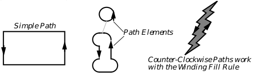  
**Figure 23-12** Graphics Paths

Paths can be created by taking the intersection or union of two or more paths. 
In this case, the paths which are combined to make the resulting path are 
called sub-paths. (See Figure 23-13).

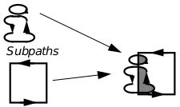  
**Figure 23-13** Combining Paths

Paths are normally used to describe regions. However, regions are basically 
bitmaps, whereas paths are described in terms of the standard coordinate 
space. Thus, while regions don't scale well at all, it is possible to scale a path 
perfectly, then use the transformed path to more correctly compute the 
desired region. If this comparison sounds similar to that between bitmap- 
and outline- based fonts, it should. The "outline" of an outline-based font 
character is, in fact, a specialized form of path. 

Paths are also used to describe clipping regions. It is possible to combine any 
path with a window's clipping region to further restrict the clipping area. 
Thus it is possible to clip to an ellipse or to a Bézier curve, or even to use text 
as a clipping region.

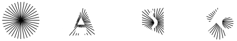  
**Figure 23-14** Geode-Defined Clipping Paths  
_It is possible to clip using paths incorporating text, splines, and other
elements._

When constructing a path, you should keep in mind what it will be used for. 
If the path is to be filled using the winding rule, it is important that all edges 
go the correct direction. The winding rule algorithm assumes that the region 
is described by edges that go around it counterclockwise. Edges going 
clockwise describe hollows. The odd/even fill rule will work independently of 
path direction. See section 24.2.11 of chapter 24 for more information about 
winding rules.

Both the winding and odd/even fill rules demand closed path elements. If any 
path elements are not filled, the routine will treat them as if they were, 
connecting the ends of each open path element with a straight line.

It is also possible to alter an existing path by combining it with another. The 
new path thus formed preserves both paths. If drawn, both paths will appear. 
If the path is filled or used as a clipping region, the geode can specify how the 
regions described by the paths should be combined, whether the intersection 
or union should be taken. Any number of paths can be combined in this 
manner.

GrBeginPath() signals that the geode is about to start describing a path. All 
drawing commands directed at the GState will go into constructing the path 
until GrEndPath() is called. GrBeginPath() is also the routine used to 
combine a path with an existing path. Calling GrBeginPath() when already 
constructing a path signals that further graphics commands should describe 
a new path to be combined with the existing one. The new path can either 
replace the existing one or combine to find the intersection or the union.

GrCloseSubPath() closes the current path element, adding a straight line 
segment from the current position to the starting point if necessary.

 GrGetPathBounds() returns the bounding coordinates of a rectangle that 
completely encloses the current path. GrTestPointInPath() tests whether 
a passed point falls within the current path. GrGetPathPoints() returns all 
the points along a path in the order visited. GrGetPathRegion() returns 
the region defined by the path. GrGetPathBoundsDWord() returns the 
bounds of the path and works in a 32-bit graphics space. If you just want to 
know whether or not a given path exists, then call GrTestPath(), passing 
the GetPathType GPT_CURRENT.

GrSetStrokePath() replaces the current path with the one that would 
result from "stroking" (drawing) the current path with the current line 
attributes. For example, if the current line style is a dotted line, the result 
will most likely be a set of many skinny regions. At this time, stroke paths 
cannot be used for clipping purposes. However, geodes can still draw and fill 
these paths.

Paths can be drawn or filled using the GrDrawPath() and GrFillPath() 
commands. For more information about these routines, see section 24.2.11 of 
chapter 24.

GrGetPath() retrieves the handle of a block containing the path's data. You 
may pass this handle to GrSetPath() and thus copy a path to another 
GState.

### 23.10 Working With Video Drivers

The main benefit of the device independence is that the geode writer can 
issue graphics commands without worrying about the device. Working with 
the video driver is left to the graphics system.

#### 23.10.1 Kernel Routines

GrInvalRect(), GrInvalRectDWord(), GrGrabExclusive(), 
GrGetExclusive(), GrReleaseExclusive(), GrBitBlt(), 
GrGetBitmap(), GrGetWinHandle()

Sometimes the geode may want more power over the driver. It can see what 
device coordinates correspond to a set of standard GEOS coordinates or vice 
versa.

It is possible to update part of a drawing without exposing the whole window. 
Calling GrInvalRect() causes a passed rectangular area to be updated; the 
area outside the rectangle will be unaffected. GrInvalRectDWord() works 
the same way, but for large coordinate spaces.

Programs can also seize exclusive access to a video driver by calling the 
GrGrabExclusive() command, which allows only the passed GState to alter 
what is shown on the screen. This routine is useful for programs such as 
screen dumps who want to accomplish something concerning the screen 
without worrying that programs in other threads will change the screen in 
the meantime. GrReleaseExclusive() ends the exclusive access to the 
screen so that other GStates can update.

To find out if the video exclusive is presently grabbed, call 
GrGetExclusive(). This will return the handle of the GState presently in 
possession of the exclusive, or zero if there is no such GState.

GrBitBlt() is an advanced function used to quickly copy or move data within 
video memory. Effectively, it can copy or move a rectangular part of the 
document space to another part of that space-the passed BLTMode will 
determine whether the area is copied or moved. This might be used in an 
arcade game or animation program to move simple pictures around the 
screen very quickly. Pass this function the source and destination rectangles, 
and whether you are copying or moving the block. After calling GrBitBlt(), 
the changes have been made to video memory but have not actually been 
drawn to the screen. Make sure that the affected areas are redrawn by 
invalidating the appropriate area. If speed is a concern, and if you're using 
GrBitBlt() it probably is, you'll probably want to restrict the clipping area 
when the drawing is refreshed.

GrGetBitmap() basically returns a dump of an arbitrary display area. It is 
an advanced function and should be used with some caution. If asked to 
dump an area from a GState being displayed to screen, GrGetBitmap() 
won't check to see if the dumped area is obscured by another window, and so 
your dump might include a picture of that other window. However, if you're 
working with some sort of offscreen bitmap, this function provides a way to 
look at large portions of it a time. Note that to look at smaller areas, you 
might prefer to use GrGetPoint(), an optimized, easier to use function to 
find out the color of a pixel.

At some times, it may prove useful to know what window, if any, is associated 
with a GState. To find out, call GrGetWinHandle().

#### 23.10.2 Direct Calls to the Driver

Rarely, a geode may wish to make direct calls to the video driver. In most 
cases, anything your code might want the video driver to do can be handled 
better by going through the appropriate graphics routine.

### 23.11 Windowing and Clipping

Windows are the interface between the graphics commands and the GEOS 
user interface. In this section we will discuss some of the graphical 
mechanisms associated with windows in GEOS. 

#### 23.11.1 Palettes

Each window has a color palette associated with it. For more information 
about manipulating palettes, see section 24.3.1.3 of chapter 24. The system 
will use the palette of whatever window is active. As a result, if two windows 
have different palettes, when one window is active, the other's colors will be 
distorted.

#### 23.11.2 Clipping

GrSetClipPath(), GrSetClipRect(), GrGetClipRegion(), 
GrTestRectInMask(), GrSetWinClipRect(), GrGetMaskBounds(), 
GrGetMaskBoundsDWord(), GrGetWinBounds(), 
GrGetWinBoundsDWord()

The graphics system provides some routines which allow geodes to work 
together with the windowing system to control clipping. A window's clipping 
region, you will recall, is that area of the window that must be redrawn. It 
corresponds to that area of the graphics space which is visible inside the 
window and not obscured by another window. The area outside the clipping 
region is supposed to be that area that doesn't need to be redrawn. Geodes 
which are certain that part of their graphics space doesn't need to be (or 
shouldn't be) redrawn can restrict their clipping region to exclude this 
portion.

Restricting the clipping region can lead to quicker redraws, since the 
graphics system doesn't have as much to redraw. Arcade games in which 
most of the action only takes place in one or two areas of the display can 
restrict their clipping region to speed redraws in the smaller, active areas. 
Also, the clip region can be used as a sort of stencil (see Figure 23-14). 

The clip region is defined by a path which describes the boundaries of the 
region. A window typically begins with a rectangular clip region. If it is 
partially obscured by other windows, this rectangle will have "bites" taken 
out of it. This is done using normal path routines used for combining paths. 
The clipping path of a newly obscured window is determined by computing 
its old clipping path with that of the obscuring window.

Since any number of paths may be combined, it is a simple matter for the 
graphics system to combine a window's clipping path with a geode's path 
chosen to restrict the clipping region. Thus the geode can define its restricted 
clipping area without knowing anything about the window's present status.

GrSetClipPath() sets the geode-defined path to use when restricting the 
window's clip path. GrSetClipRect() is an optimization of 
GrSetClipPath() to handle the most common case in which the new path 
element is a rectangle. 

GrGetClipRegion() returns the Region data structure corresponding to 
the current clip path. GrGetMaskBounds() and 
GrGetMaskBoundsDWord() return the bounds of the current clipping 
path.To find out whether there is a clip path at all, just call GrTestPath() 
and pass GPT_CLIP.

GrTestRectInMask() determines whether a rectangular area lies fully, 
partially, or not at all within the clipping area. This routine is useful for 
optimizing redraws.

GrSetWinClipRect() and GrSetWinClipPath() set the clipping path 
associated with the window; you should never have occasion to use it. 
GrGetWinBounds() and GrGetWinBoundsDWord() return the bounds of 
the window clipping path. To find out whether there is a window clipping 
path at all, call GrTestPath() and pass GPT_WIN_CLIP.

#### 23.11.3 Signalling Updates

GrBeginUpdate(), GrEndUpdate()

The kernel provides two messages by which the geode may signal that it is 
updating the contents of a window. When updating a region (as when 
handling a MSG_META_EXPOSED), the geode should call GrBeginUpdate() 
after creating the GState, and call GrEndUpdate() before destroying the 
GState.

This causes the system to store the GState for future comparisons during 
clipping region calculation. If you don't call these functions, the clipping 
region is likely to be wrong for this and other updates. Default system 
MSG_META_EXPOSED handlers call these routines.

Note that you only need call these routines when performing a requested 
update; if you are drawing to a window without being asked to do so, you need 
not call these routines.

[PCCOM Library](cpccom.md) <-- &nbsp;&nbsp; [table of contents](../concepts.md) &nbsp;&nbsp; --> [Drawing Graphics](cchapes.md)
