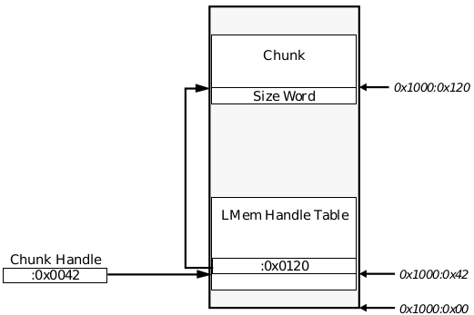
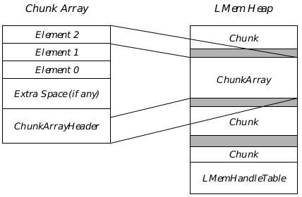

## 16 Local Memory

The GEOS memory manager is well suited to dealing with blocks of memory 
in the 2K-6K range. However, for small amounts of memory, the manager's 
overhead becomes significant. For this reason, GEOS provides local memory 
(or LMem) routines. These routines let an application allocate a block of 
memory and designate it as a local memory heap. The application can then 
request small amounts of memory from this heap. The LMem library 
automatically reorganizes the heap when necessary to make space available.

The local memory routines are also used to manipulate objects. All objects 
are special LMem chunks which are stored in a special type of LMem heap 
(called an object block). Most of the routines which work on chunks can also 
be used on objects.

Before you read this chapter, you should be familiar with the use of handles in 
GEOS and with the 80x86's segment:offset memory referencing. You should also be 
familiar with the global memory manager (see ["Memory Management", Chapter 15](cmemory.md)).

### 16.1 Design Philosophy

The GEOS memory manager is designed to deal with blocks of memory which 
are measured in kilobytes. Every memory block needs an entry in the global 
handle table; each such entry takes up 16 bytes. This memory overhead is 
insignificant for a 10K code block but very significant for, for example, a 100 
byte database entry. Furthermore, GEOS allows a limited number of global 
handles. If an application were to use global blocks for small amounts of data, 
it could use up too many handles.

On the other hand, if an application were to store lots of small pieces of data 
in a single global block, it might have to write elaborate 
memory-management routines. It would have to make sure that it could 
resize a piece of data at will and shuffle other data to make room. This could 
force programmers to spend a lot of their time writing support code.

For these reasons, GEOS provides local memory routines. Applications can 
designate a block of memory as a local-memory heap and use LMem routines 
to request small amounts (chunks) of data. The local memory library 
automatically shuffles chunks in that heap to make room for new requests. 
Applications can change the size of a chunk at will. The cost of using the 
LMem routines is one added layer of indirection and a small amount of 
memory overhead for each chunk. 

The LMem routines have another advantage. They provide a uniform way of 
managing small pieces of memory. This lets GEOS add functionality which 
applications can use in a variety of ways. For example, GEOS implements an 
array-management scheme based on LMem chunks; this scheme comes 
complete with a modified Quicksort routine. Similarly, all GEOS objects are 
stored in object blocks, which are a special kind of local-memory heap. This 
makes it easy to add or delete objects dynamically.

### 16.2 Structure of a Local Memory Heap

A local memory heap looks and acts much like the global heap. However, it is 
contained entirely within a single memory block. This block is initialized 
with a 16-byte **LMemBlockHeader** (described in "Using Local Memory Heaps"]
(#163-using-local-memory-heaps)), a local memory handle table, and a local 
memory heap. Optionally, a space for data may be allocated between the header 
and the handle table.

Each allocated section of memory within a local heap is called a chunk, and 
the handles of these chunks are called chunk handles. See Figure 16-1 
for an illustration of a local heap.

Chunks comprise a chunk of data preceded by a word that contains the 
length of the data (in bytes). When the heap is created, a certain number of 
chunk handles will be allocated. If a chunk is requested after all of these 
chunks have been given out, the local memory routines will enlarge the 
LMem handle table, relocating chunks as necessary. Unused chunks are 
stored in a linked list.

### 16.2.1 The Local Heap

An application may designate any block as a local memory heap. The block 
may or may not be fixed, swapable, or discardable, as the application desires. 

A block may have other data besides the local heap. When a local heap is 
created, an offset into the block can be specified. The heap will put its header 
structure at the beginning of the block and the handle table at the specified 
offset; everything in between will be left untouched by the LMem routines. 
The offset must be larger than the standard header or else may be zero, 
indicating that the default offset should be used.

**Figure 16-1** A Local Memory Heap  
_A block on the Global Heap that has been allocated as a Local Memory heap. 
It is partitioned into a block header, a chunk of fixed data, an LMem handle 
table, and a local memory heap._

Before performing any operations on a local memory heap, an application 
must lock the heap the way it would any other block. Some local memory 
routines may need to resize the block; this may cause the block to be moved 
on the global heap. Therefore, you should assume that these routines may 
invalidate all pointers to the relevant block. The descriptions of routines 
which may behave this way will contain a warning to that effect. When you 
initialize an LMem heap, you can specify that it should never be resized; this 
is advisable if the heap is in a fixed block.

A virtual-memory file block may contain an LMem heap. For details on this, 
see ["Virtual Memory," Chapter 18](cvm.md).

#### 16.2.2 Chunks and Chunk Handles

Just as blocks on the local heap are accessed with handles, chunks are 
accessed via chunk handles. Each chunk handle is an offset into the block 
containing the local memory heap; thus, the segment address of the locked 
heap, combined with the chunk handle, make up a pointer to a location 
within the local memory heap's chunk handle table. That location contains 
another offset which, when combined with the segment address of the block, 
composes a far-pointer to the actual chunk. Figure 16-2 shows 
the use of a chunk handle to access a chunk.

Chunks are movable within the local heap; whenever a chunk is created or 
resized, the local memory manager may move any chunks in that heap. There 
is no locking mechanism for chunks; thus, creating or resizing a chunk can 
potentially invalidate pointers to all the other chunks, forcing the application 
to again dereference the handles for these chunks. Be warned that many 
message handlers can cause heap compaction. As a general rule, you should 
not save chunk addresses around message sends; instead, dereference the 
chunk handles to get the current address.

Chunks are aligned along dwords. This speeds up chunk moves and similar 
operations. This means that when you request a chunk, its size may be 
slightly larger than you request.

Objects are special kinds of LMem chunks. An optr is simply the global 
memory handle of an LMem heap followed by the chunk handle of an object. 
For this reason, many LMem routines come in two formats: one which is 
passed an optr, and one which is passed the global and chunk handles. There 
is also a macro, **ConstructOptr()**, which is passed a memory handle and a 
chunk handle and returns an optr constructed from the two.

**Figure 16-2** Referencing a Chunk  
_A chunk handle consists of an offset into the block containing the local heap; 
this offset indicates an entry in the local memory handle table, where an offset 
to the chunk data is stored. In this case, the block containing the LMem heap 
begins at address 1000:00. All addresses shown are in hexadecimal._

#### 16.2.3 Types of LMem Heaps

LMemType, LMemFlags

In addition to being used for general memory needs, local memory heaps 
perform many specific functions in the GEOS system. When an LMem heap 
is created, a member of the **LMemType** enumerated type is passed, 
indicating to what use the LMem heap will be put. Several types are 
available:

LMEM_TYPE_GENERAL  
The LMem heap will be used for general data storage, possibly 
including a chunk, name, or element array. When an 
application creates an LMem heap, it will almost always be of 
type "General" or "Object."

LMEM_TYPE_WINDOW  
Windows are stored in memory as LMem heaps. The header 
contains information about the window; each region in the 
window is stored as a chunk. Applications will not directly 
create Window heaps.

LMEM_TYPE_OBJ_BLOCK  
Objects are stored in object blocks, which are LMem heaps. An 
object block has some extra header information and contains 
one chunk which contains only flags. All the objects in the block 
are stored as chunks on the heap. Applications can directly 
create object blocks; for more information, see ["GEOS 
Programming," Chapter 5](ccoding.md).

LMEM_TYPE_GSTATE  
A GState is an LMem heap. The GState information is in the 
header, and the application clip-rectangle is stored in a chunk. 
Applications do not directly create GState blocks; rather, they 
call a GState creation routine, which creates the block. (See 
["Graphics Environment," Chapter 23](cgraph.md).)

LMEM_TYPE_FONT_BLOCK  
Font blocks are stored as LMem heaps. Applications do not 
create font blocks directly.

LMEM_TYPE_GSTRING  
Whenever a GString is created or loaded, a GString LMem heap is created, 
and elements are added as chunks. The heap is created automatically by 
the GString routines; applications should not create GString blocks. 
(See [section 23.8 of chapter 23](cgraph.md#238-graphics-strings).)

LMEM_TYPE_DB_ITEMS  
The Virtual Memory mechanism provides routines to create 
and manage database items, short pieces of data which are 
dynamically allocated and are saved with the VM file. These 
items are stored in special database LMem heaps, which are 
created in special database blocks in the VM file. Applications 
do not directly allocate DB blocks; rather, they call DB routines, 
which see to it that the blocks are created. (See ["Database 
Library," Chapter 19](cdb.md).)

When an LMem heap is allocated, certain flags are passed to indicate 
properties the heap should have. Some of these flags are passed only for 
system-created heaps. The flags are stored in a word-length record 
(**LocalMemoryFlags**); the record also contains flags indicating the current 
state of the heap. The **LocalMemoryFlags** are listed below:

LMF_HAS_FLAGS  
Set if the block has a chunk containing only flags. This flag is 
set for object blocks; it is usually cleared for general LMem 
heaps.

LMF_IN_RESOURCE  
Set if the block has just been loaded from a resource and has 
not been changed since being loaded. This flag is set only for 
object blocks created by the compiler.

LMF_DETACHABLE  
Set if the block is an object block which can be saved to a state 
file.

LMF_DUPLICATED  
Set if block is an object block created by the 
**ObjDuplicateResource()** routine. This flag should not be set 
by applications.

LMF_RELOCATED  
Set if all the objects in the block have been relocated. The object 
system sets this when it has relocated all the objects in the 
block. 

LMF_AUTO_FREE  
This flag is used by several object routines. It indicates that if 
the block's in-use count drops to zero, the block may be freed. 
This flag should not be set by applications.

LMF_IN_MEM_ALLOC  
This flag is used in error-checking code to prevent the heap 
from being validated while a chunk is being allocated. For 
internal use only-do not modify.

LMF_IS_VM
Set if LMem heap is in a VM block and the block should be 
marked dirty whenever a chunk is marked dirty. This flag is 
automatically set by the VM code when an LMem heap is 
created in or attached to a VM file. This flag should not be set 
by applications.

LMF_NO_HANDLES  
Set if block does not use chunk handles. A block can be set to 
simulate the C **malloc()** routine; in this case, chunks are not 
relocated after being created, so chunk handles are not needed. 
Ordinarily, these blocks are created by the **malloc()** routine, 
not by applications. (See the discussion of **malloc()** in [section 
15.4 of chapter 15](cmemory.md#154-malloc).)

LMF_NO_ENLARGE  
Indicates that the local-memory routines should not enlarge 
this block to fulfill chunk requests. This guarantees that the 
block will not be moved by a chunk allocation request; however, 
it makes these requests more likely to fail.

LMF_RETURN_ERRORS  
Set if local memory routines should return errors when 
allocation requests cannot be fulfilled. If the flag is not set, 
allocation routines will fatal-error if they cannot comply with 
requests. This flag is generally clear for expandable LMem 
blocks, since many system routines (such as **ObjInstantiate()**) 
are optimized in such a way that they cannot deal with LMem 
allocation errors.

LMF_DEATH_COUNT  
This field occupies the least significant three bits of the flag 
field. It means nothing if the value is zero. If it is non-zero, it 
indicates the number of remove-block messages left which 
must hit **BlockDeathCommon** before it will free the block. 
This flag is used by the handlers for MSG_FREE_DUPLICATE 
and MSG_REMOVE_BLOCK.

STD_LMEM_OBJ_FLAGS  
This is a constant which combines the LMF_HAS_FLAGS and 
LMF_RELOCATED flags. These flags should be set for all object 
blocks.

### 16.3 Using Local Memory Heaps

Local memory heaps are much like the global heap and are accessed in much 
the same way. Local heaps are simple to create and manage.

Many applications will not need to use local heaps directly; instead, they will 
use more advanced data-management mechanisms based on local heaps, 
such as chunk arrays or database blocks. However, even if you use these 
mechanisms, you should be familiar with this section; this will help you 
understand how the other mechanisms work.

Remember that every local memory heap resides in a global memory block. All the 
rules for using memory blocks apply. (See ["Memory Etiquette"](cmemory.md#1531-memory-etiquette))

#### 16.3.1 Creating a Local Heap

LMemInitHeap(), MemAllocLMem()

Before you create a local heap, you must first allocate and lock a block on the 
global heap using **MemAlloc()** and **MemLock()**. (Alternatively, you can 
allocate a fixed block.) Then, you must call **LMemInitHeap()**.

**LMemInitHeap()** creates and initializes a local memory heap. It must be 
passed several arguments:

+ The handle of a locked or fixed block which will contain the local memory 
heap. It may be moveable, discardable, both, or neither; it should not 
have the flag HF_LMEM set. If the LMem heap will be resizable, the block 
may be of any size; the LMem routines will enlarge it if necessary. If the 
heap will not be resizable (i.e. LMF_NO_ENLARGE is passed), it must be 
created large enough to accommodate the heap.

+ The offset within the block where the local heap's handle table will begin. 
The local heap will fill the space to the end of the block; any data between 
the **LMemBlockHeader** and the indicated offset will be zero-initialized. 
If an application will not need a fixed data space, it should specify an 
offset of zero; the handle table will then be put immediately after the 
**LMemBlockHeader**. Often, when an application needs a fixed data 
space, it will define a special structure, the first element of which is an 
**LMemBlockHeader**, and will pass the size of that structure as the 
offset. It can then access the fixed data by using the fields of the 
structure. If the offset specified is non-zero but is less than the size of an 
**LMemBlockHeader**, LMemInitHeap() will return an error.

+ A member of the LMemType enumerated type, specifying the type of 
block to be created (see ["Types of LMem Heaps"](#1623-types-of-lmem-heaps)).

+ A word of LocalMemoryFlags for the heap. (See ["Types of LMem Heaps"](#1623-types-of-lmem-heaps))

+ A word specifying the number of chunk handles to leave room for in the 
starter handle table. When these chunks have all been allocated, the 
local memory manager will expand the LMem handle table to create 
more chunk handles. No matter how big the starter handle table is, the 
heap will initially contain just one chunk (whose size is specified by the 
next argument). Applications should generally pass the constant 
STD_LMEM_INIT_HANDLES.

+ A word specifying the amount of space to be assigned to the chunk 
created when the heap is initialized. When more space is needed, the 
chunks will expand to the end of the block, and (if necessary) the block 
itself will be expanded. Applications should generally pass the constant 
STD_LMEM_INIT_HEAP.

**LMemInitHeap()** creates the **LMemBlockHeader** and the chunk handle 
table. It also creates a single free chunk; more chunks will automatically be 
created as needed. It may resize the block passed (unless the flag 
LMF_NO_ENLARGE is passed); therefore, any pointers to the block may 
become invalid. It does not return anything.

If you want to create a memory block and initialize it as an LMem heap in 
one operation, call **MemAllocLMem()**. This routine takes two arguments: a 
member of the **LMemType** enumerated type, and the amount of space to 
leave for the header (again, a zero size indicates that the default header size 
should be used). **MemAllocLMem()** allocates a movable, swapable block in 
the global heap, then initializes an LMem heap in that block. If you specify 
an **LMemType** of LMEM_TYPE_OBJ_BLOCK, **MemAllocLMem()** will pass 
the STD_LMEM_OBJECT_FLAGS flags; otherwise, it will pass a clear 
**LocalMemoryFlags** record.

#### 16.3.2 Using Chunks

LMemAlloc(), LMemDeref(), LMemFree(), LMemGetChunkSize(), 
LMemReAlloc(), LMemInsertAt(), LMemDeleteAt(), 
LMemDerefHandles(), LMemFreeHandles(), 
LMemGetChunkSizeHandles(), LMemReAllocHandles(), 
LMemInsertAtHandles(), LMemDeleteAtHandles()

Once a local heap has been initialized, you can allocate, use, and free chunks 
at will. Chunks can only be manipulated while the block containing the 
LMem heap is fixed or locked on the global heap.

**LMemAlloc()** allocates a new chunk on the local heap. It is passed the 
handle of the block containing the heap and the size of the chunk needed. 
**LMemAlloc()** returns the handle of the new chunk (which must then be 
dereferenced before the chunk is used). The size requested will be rounded 
up as necessary to ensure that the chunks are dword-aligned. An additional 
two bytes will be allocated to store the size of the chunk; these bytes will be 
before the data. This routine may compact the chunks on the local heap, so 
all pointers to that heap will be invalidated; they will have to be dereferenced 
by their chunk handles. Furthermore, the block itself may be moved (if 
LMF_NO_ENLARGE is not set). Even fixed blocks may be moved if they need 
to expand to accommodate new chunks.

All of the following routines come in two forms. As noted, an optr is simply 
the handle of an object block, followed by the object's chunk handle. For this 
reason, most LMem routines come in two slightly different formats: one 
where the chunk is specified with an optr, and one where it is specified with 
the two handles. In all other ways, the two versions of each routine are 
identical. Indeed, in assembly there is only a single version of each routine; 
the only difference is in how the C routines take their parameters.

Once you have allocated a chunk, you must dereference its chunk handle in 
order to use it. You can do this with **LMemDeref()**. This routine takes a 
singe parameter, namely the optr. It returns a pointer to the data portion of 
the chunk (after the size word). This pointer will remain valid until the block 
is unlocked or until a routine is called which can cause block resizing or heap 
compaction (e.g. **LMemAlloc()**). Since these routines can invalidate 
chunk-pointers, it is important that data-synchronization routines be used if 
more than one thread is accessing the heap; otherwise, one thread may cause 
the heap to be shuffled while another thread is trying to read from it. The 
version which takes handles is named LMemDerefHandles().

When you are done using a chunk of memory, you should free it with 
**LMemFree()**. This routine is passed an optr; it does not return anything. It 
does not resize the block or shuffle chunks; therefore, pointers to other 
chunks will not be invalidated by **LMemFree()**. The version which takes 
handles is named **LMemFreeHandles()**.

You can find out the size of any chunk by calling the routine 
**LMemGetChunkSize()**. This routine is passed an optr; it returns the size 
of the chunk in bytes (not counting the chunk's size word). The version which 
takes handles is named **LMemGetChunkSizeHandles()**.

Chunks can be resized after creation. The Boolean routine **LMemReAlloc()** 
takes two arguments, namely an optr and the new size of the chunk. If the 
new size is larger than the old one, bytes will be added to the end of the 
chunk; chunks may be shuffled and the block may be resized, so all pointers 
to chunks will be invalidated. The new bytes will not be zero-initialized. If the 
new chunk size is smaller than the old one, the chunk will be truncated; 
pointers to chunks will not be invalidated. This routine will fail only if the 
LMem heap ran out of space and could not be resized. In this case, it will 
return non-zero without changing the chunk. If it succeeds, it returns zero. 
The version which takes handles is called **LMemReAllocHandles()**.

You can add bytes inside a chunk with the Boolean routine 
**LMemInsertAt()**. This routine takes three arguments: the optr, an offset 
within the chunk, and the number of bytes to add. The new space is added 
beginning at the specified offset; it is initialized to zeros. This may cause 
chunks to be shuffled and/or the block to be expanded; pointers to chunks are 
therefore invalidated. Note that it is your responsibility to make sure that 
the offset within the chunk really is in the chunk; otherwise, results are 
undefined. If **LMemInsertAt()** fails (because the LMem heap ran out of 
space and could not be expanded), it returns non-zero without changing the 
chunk; otherwise it returns zero. The version which takes handles is named 
**LMemInsertAtHandles()**.

You can delete bytes within a chunk with the routine **LMemDeleteAt()**. 
This routine takes three arguments: the optr, the offset within the chunk of 
the first byte to be deleted, and the number of bytes to delete. This routine 
does not invalidate pointers to chunks. The routine does not return anything. 
Note that it is your responsibility to make sure that all the bytes to be deleted 
are within the chunk, i.e. that the offset and number of bytes passed do not 
specify bytes that are beyond the end of the chunk. If you fail to do this, 
results are undefined. The version which takes handles is named 
**LMemDeleteAtHandles()**.

#### 16.3.3 Contracting the LMem Heap

LMemContract()

The local memory manager routines ordinarily take care of heap compaction. 
However, you can also order compaction at will.

The routine **LMemContract()** compacts the heap and then frees all the 
unused heap space (by truncating the block with the LMem heap). The 
routine takes one argument, namely the handle of the (locked or fixed) block 
containing the LMem heap. It shuffles all the chunks, thus invalidating 
pointers to chunks; however, it is guaranteed not to move the block on the 
global heap. 

#### 16.3.4 Example of LMem Usage

At first, the local memory techniques can seem tricky. This section contains 
an example of LMem usage in Goc. The example shows the basic principles 
of LMem usage.

---
Code Display 16-1 LMem Usage in GOC
~~~
/*
 * Declarations
 */

/* We'll want to have a fixed data area at the start of the block. That area will
 * have to start with an LMemBlockHeader, but after that, we can put whatever we
 * want. To make it easy to access the fixed data, we define a structure.
 */
typedef struct {
        LMemBlockHeader         MLMBH_standardHeader;
        float           MLMBH_someData;
        float           MLMBH_someMoreData;
        char            MLMBH_someChars[10];
} MyLMemBlockHeader;

MyLMemBlockHeader                       *thisHeapsHeader;
MemHandle                       thisHeapsHandle;
ChunkHandle                     firstChH, secondChH;
char                    *firstChPtr, *secondChPtr;
int                     i;

/*
 * Code
 */

/* We have to create the LMem heap. First, we create the block: */
thisHeapsHandle = MemAlloc(                                     /* MemAlloc returns the block handle */
                        2048,           /* Allocate 2K; can grow as necessary */
                        HF_SWAPABLE,            /* Make block swapable. LMemInitHeap()
                                         * will add the flag HF_LMEM. */
                        HAF_ZERO_INIT | HAF_LOCK);                              /* Zero & lock the block
                                                         * upon allocation */

LMemInitHeap(thisHeapsHandle,                                   /* Pass handle of locked block */
                LMEM_TYPE_GENERAL,                      /* Allocate a general heap */
                0,                      /* Don't pass any flags */
                sizeof(MyLMemBlockHeader),      /* Offset to leave room for header */
                STD_INIT_HANDLES,                       /* Standard # of starter handles */
                STD_INIT_HEAP);         /* Allocate standard amt. of empty heap */

/* The block is still locked; we can initialize the fixed data section. */
thisHeapsHeader = (MyLMemBlockHeader *) MemDeref(thisHeapsHandle);
thisHeapsHeader->MLMBH_someData = 3.1415926;

/* Now, we allocate some chunks. This invalidates pointers to this heap (such as 
 * thisHeapsHeader), since chunk allocation may cause the heap to be resized (and
 * thus moved). The block must be locked when we do this.
 */
firstChH = LMemAlloc(                                   /* LMemAlloc returns a chunk handle */
                thisHeapsHandle,                        /* Pass handle of block . . . */
                100);                   /* . . . and number of bytes in chunk */

secondChH = LMemAlloc(thisHeapsHandle, 50);

/* Now, we start writing data to a chunk: */
firstChPtr = (char *) LMemDerefHandles(thisHeapsHandle, firstChH);
for(i = 0; i <= 30; i++)
   firstChPtr[i] = 'x';

/* We can insert 10 bytes into the middle of the second chunk. This may cause the
 * chunks or blocks to be shuffled; all pointers are invalidated
 */
LMemInsertAtHandles(thisHeapsHandle, secondChH,                                                 /* Block & chunk handles */
                20,                             /* Insert after 20th byte */
                30);                            /* Insert 30 null bytes */

/* If we want to access the first chunk, we need to dereference its handle again:
 */
firstChPtr = (char *) LMemDeref(thisHeapsHandle, firstChH);
for(i = 1; i <= 15; i++)
    firstChPtr[(i<<1)] = 'o';

/* When we're done with a chunk, we should free it. This does not invalidate 
 * any pointers to other chunks.
 */
LMemFreeHandles(thisHeapsHandle, firstChH);

/* If we won't be using an LMem heap for a while, we should unlock it the way we 
 * would any block: */
MemUnlock(thisHeapsHandle);

/* When we're done with the LMem heap, we can just free it. */
MemFree(thisHeapsHandle);
~~~

### 16.4 Special LMem Uses

Local memory heaps are used for many purposes in GEOS. Objects are stored 
in special LMem heaps, called object blocks; windows, GStrings, and many 
other things are implemented as LMem heaps; and LMem heaps can be used 
to manage arrays of data. Most of these things are done by the system, 
transparent to the user; however, some of these things can be called on 
directly by applications.

Most of these techniques are described in their own chapters. One use of 
LMem heaps will be described in this chapter; namely, the use of LMem 
chunks to store special arrays of data via the Chunk Array routines. The 
chapter will also describe special purpose variants of the Chunk Array: the 
Element Array and the Name Array.

#### 16.4.1 Chunk Arrays

Very often an application will need to keep track of many different pieces of 
data and access them by an index. An application can do this in the 
traditional way, i.e., allocate a block of memory and set it up as an array. 
However, GEOS provides a mechanism which is often more suitable: the 
chunk array. The chunk array routines let you dynamically insert or delete 
elements in the middle of an array; you can get a pointer to an arbitrary 
element (specified by its index number); you can sort the array based on any 
arbitrary criterion. The array can be specified as "uniform-size" (all elements 
the same size, specified when the chunk array is created), or "variable-size" 
(each element can be created at an arbitrary size and can be resized at will). 
Note that either type of array can grow or shrink dynamically; while the 
elements may be of a fixed size, the array need not be.

The chunk array is implemented on top of the LMem routines. The entire 
array is a single chunk in a local memory heap (hence the name). It therefore 
has a maximum total size of somewhat less than 64K, and memory efficiency 
drops significantly if it is larger than roughly 6K. If you need a larger array, 
you should use a Huge Array (see [section 18.5 of chapter 18](cvm.md#195-huge-arrays)). 
If you will be using the chunk array routines, you should include chunkarr.h.

##### 16.4.1.1 Structure of the Chunk Array

A chunk array is contained in a single chunk in an LMem heap. It begins 
with a special header structure which specifies certain characteristics of the 
chunk array: the number of elements in the array, the size of each element 
(or zero for variable sized arrays), the offset from the start of the chunk to the 
first element, and the offset from the first element to the end of the array. The 
header is a structure of type **ChunkArrayHeader**; an application can 
examine the fields of this structure directly or by using chunk array routines. 
The creating application can request that the chunk array contain some 
blank space between the header and the first element; it can use that space 
however it likes.

Elements can be referenced by index number. The first element has index 
number zero. You can translate element numbers to pointers, and vice versa, 
by calling **ChunkArrayElementToPtr()** and 
**ChunkArrayPtrToElement()** (see [section 16.4.1.3](#16413-adding-removing-and-accessing-elements)).

A uniform-size chunk array has a simple structure. After the header (and the 
extra space, if any) come the elements. They follow one after another, with no 
free space between them, as shown in Figure 16-3. An application can 
request a pointer to any element, specified by index; the chunk array routine 
multiplies the index by the size of each element and adds the product to the 
address of the first element, producing a pointer to the requested element. An 
application can also proceed through the array, going from one element to the 
next, without specifically requesting pointers.

**Figure 16-3** Uniform-Size Chunk Array  
_All elements are the same size; thus, to access an individual element, the 
routines just multiply the element size by the element number and add the 
product to the address of the first element._

The structure of a variable-size chunk array is a little bit more complicated. 
After the header (and extra space) is a lookup-table of two-byte entries, each 
containing the offset from the start of the chunk to the appropriate element. 
The chunk array routines maintain this table automatically. When an 
application wants to reference a given element, the chunk array routine 
doubles the index number and adds it to the offset to the start of this table; 
this produces the address of a table entry, which itself contains the offset to 
the actual element (see Figure 16-4). Effectively, there are two arrays with 
the same number of elements; the first is a uniform-sized array of offsets to 
the entries in the second (variable-sized) array. However, this is transparent 
to the application, which merely requests a pointer to element n and is 
returned that pointer. It does not need to know or care about the extra table 
constructed by the chunk array routines.

**Figure 16-4** Variable-Size Chunk Array  
_A chunk array with variable-size elements is actually two successive arrays; 
the first array is an array of chunk offsets to the elements of the second array._

##### 16.4.1.2 Creating a Chunk Array

ChunkArrayCreate(), ChunkArrayCreateAt(), 
ChunkArrayCreateAtHandles(), ChunkArrayHeader

Chunk arrays are created in local memory heaps. An LMem heap can have 
several chunk arrays, and it can have other types of chunks besides chunk 
arrays; however, since an LMem heap is limited to 64K in total size, the more 
you put in the heap, the less room there is for a chunk array to grow.

The first step in creating a chunk array is to create an LMem heap. Create 
the heap the same way you would any general LMem heap. The heap should 
probably be left resizable, since that way it will be able to grow to 
accommodate the chunk array.

Once you have created the heap, use the routine **ChunkArrayCreate()** to 
create the chunk array. This routine will allocate a chunk for the chunk 
array, initialize the array, and return the chunk handle. Since the routine 
allocates a chunk, it can cause chunk shuffling or heap resizing; thus, all 
pointers to the heap are invalidated. 

**ChunkArrayCreate()** takes three arguments:

+ The handle of a locked block containing the LMem heap;

+ The size of each element, or zero if the elements are variable-size; and

+ The size of the header for the chunk array. If you pass zero, the routine 
will automatically leave enough space for a **ChunkArrayHeader** 
structure; if you pass a non-zero argument, it must be larger than the 
size of a **ChunkArrayHeader**. If you will need a data space at the start 
of the array, it is a good idea to define a structure, the first element of 
which is a **ChunkArrayHeader**, and use that structure to access the 
fixed data area; you can then pass the size of that structure as this 
argument.

There is another version of this routine which creates a chunk array in an 
existing chunk. This routine, **ChunkArrayCreateAt()*, takes three 
arguments, namely an optr indicating the chunk, the size of each element, 
and the size of the header. It allocates a chunk array in that chunk, resizing 
it if necessary, and returns the chunk's handle. Any data in the chunk may 
be overwritten (except for whatever data falls in the header area after the 
**ChunkArrayHeader**). The version which takes handles is called 
**ChunkArrayCreateAtHandles()**.

When you are done with a chunk array, you can free it with **LMemFree()** the 
way you would any other chunk.

##### 16.4.1.3 Adding, Removing, and Accessing Elements

ChunkArrayAppend(), ChunkArrayAppendHandles(), 
ChunkArrayInsertAt(), ChunkArrayInsertAtHandle(), 
ChunkArrayDelete(), ChunkArrayDeleteHandle(), 
ChunkArrayDeleteRange(), ChunkArrayDeleteRangeHandles(), 
ChunkArrayElementResize(), 
ChunkArrayElementResizeHandles(), 
ChunkArrayElementToPtr(), 
ChunkArrayElementToPtrHandles(), 
ChunkArrayPtrToElement(), ChunkArrayPtrToElementHandle(), 
ChunkArrayGetElement(), ChunkArrayGetElementHandles()

The chunk array library provides a high-level interface for working with the 
arrays. The application specifies a request in general terms (e.g., "Insert a 
new element before element five," "Give me a pointer to element 20"). The 
routines take care of the low-level memory management: inserting bytes, 
swapping chunks to make room, etc. These routines depend on the LMem 
routines; therefore, the block containing the LMem heap must be locked or 
fixed when you use these routines (or any other chunk array routines).

When you call a chunk array routine, you must pass the handles specifying 
the chunk. As with other routines which act on a chunk, these routines come 
in two formats: one in which the chunk is specified with an optr, and one in 
which it is specified with the global memory handle and the chunk handle.

Adding elements to a chunk array is easy. To add an element to the end of a 
chunk array, use the routine **ChunkArrayAppend()**. This routine 
automatically updates the **ChunkArrayHeader** (and the lookup-table, if 
elements are variable-sized). The routine takes two arguments, namely the 
optr and the size of the new element. If the array elements are uniform-sized, 
the size argument is ignored. The routine will resize the chunk to 
accommodate the new element, update its header table (and lookup table if 
necessary), and return a pointer to the element. Since the chunk is resized, 
all other chunk pointers (and pointers within the chunk array) are 
invalidated. The version which takes handles is named 
**ChunkArrayAppendHandles()**.

You can also add an element within the middle of an array. The routine 
**ChunkArrayInsertAt()** takes three arguments, namely the optr, a pointer 
to the location at which to insert the element, and the size of the element 
(ignored for uniform-sized arrays). The routine will insert the appropriate 
number of bytes at that location in the chunk, update the header and 
lookup-table, and return a pointer to the new element. Pointers to chunks are 
invalidated. The version which takes the chunk handle, 
**ChunkArrayInsertAtHandle()**, is slightly unusual in that it is passed the 
chunk handle but not the global memory handle; the routine gets the 
segment address of the chunk from the passed pointers.

When you are done with an element, free it with **ChunkArrayDelete()**. 
This routine takes two arguments, namely the optr and a pointer to the 
element to be deleted. It shrinks the chunk; thus, it is guaranteed not to 
shuffle chunks, so chunk pointers remain valid (though pointers to elements 
within the chunk array will be invalidated if the elements come after the 
deleted element). Again, the handle version, **ChunkArrayDeleteHandle()**, 
is passed the chunk handle but not the global handle.

If you need to delete several consecutive elements, call 
**ChunkArrayDeleteRange()**. This routine takes three arguments: the optr 
to the chunk array, the index of the first element to delete, and the number 
of elements to delete. The specified elements will be deleted. As with 
**ChunkArrayDelete()**, the global and local heaps will not be shuffled. The 
handle version, **ChunkArrayDeleteRangeHandles()**, is passed the global 
handle of the LMem heap and the chunk handle of the chunk array instead 
of the optr to the chunk array.

Elements in variable-sized arrays can be resized after creation with the 
routine **ChunkArrayElementResize()**. This routine takes three 
arguments: the optr, the element number, and the new size. The routine 
resizes the element and updates the lookup table. If the new size is larger 
than the old, null bytes will be added to the end of the element; chunks may 
be shuffled, so all chunk pointers are invalidated. If the new size is smaller 
than the old, the element will be truncated. This is guaranteed not to shuffle 
chunks, so pointers to chunks remain valid, though pointers within the array 
may be invalidated. The version which takes handles, 
**ChunkArrayElementResizeHandles()**, is passed both the global memory 
handle and the chunk handle.

If you have the index of an element and you want to access that element, use 
the routine **ChunkArrayElementToPtr()**. It takes three arguments: the 
optr, the element number, and a pointer to a word-length variable. The 
routine writes the size of the element in the variable and returns a pointer to 
the element. (If you are not interested in the element's size, pass a null 
pointer.) It does not change the chunk in any way, so no pointers are 
invalidated. If you pass an index which is out-of-bounds, 
**ChunkArrayElementToPtr()** will treat it as the index of the last element. 
(The constant CA_LAST_ELEMENT is often used for this purpose.) However, 
the error-checking version will always fatal-error if passed the index 
CA_NULL_ELEMENT (i.e. 0xffff). The version which takes handles is named 
**ChunkArrayElementToPtrHandles()**.

If you know the address of an element and you need to find out its index, use 
the routine **ChunkArrayPtrToElement()**. This routine takes two 
arguments, namely the optr and a pointer to the element. It returns the index 
number of the element. The version which takes the chunk handle, 
ChunkArrayPtrToElementHandle(), is passed the chunk handle and the 
pointer but not the global memory handle.

You can copy an element to a specified location with the routine 
**ChunkArrayGetElement()**. This routine takes three arguments: the optr, 
the element number, and a pointer to a buffer big enough to hold the entire 
element. The routine will copy the element to the specified buffer. The 
version which takes handles is called **ChunkArrayGetElementHandles()**.

##### 16.4.1.4 Chunk Array Utilities

ChunkArrayGetCount(), ChunkArrayGetCountHandles(), 
ChunkArrayZero(), ChunkArrayZeroHandles(), 
ChunkArrayEnum(), ChunkArrayEnumHandles(), 
ChunkArrayEnumRange(), ChunkArrayEnumRangeHandles(), 
ChunkArraySort(), ArrayQuickSort()

To find out how many elements are in a chunk array, use the routine 
**ChunkArrayGetCount()**. This routine takes one argument, namely the 
optr. It returns the number of elements in the array. It does not change the 
array; no pointers are invalidated. The version which takes handles is named 
**ChunkArrayGetCountHandles()**.

If you want to delete all elements in the array but you don't want to free the 
array itself, use the routine **ChunkArrayZero()**. This routine takes one 
argument, namely the optr. It does not return anything. This routine deletes 
all the elements in the array, updates the header and lookup tables, and 
resizes the chunk. Since the chunk is truncated, no chunks are swapped, so 
no chunk pointers are invalidated (though pointers to elements are, 
naturally, invalidated). The version which takes handles is named 
**ChunkArrayZeroHandles()**.

If you want to apply a function to every element in the array, use 
**ChunkArrayEnum()**. This routine is passed three arguments:

+ The optr.

+ A pointer to a Boolean callback routine. This routine will be called for 
each element in succession. This routine must be declared _pascal. If the 
callback routine ever returns true, **ChunkArrayEnum()** will 
immediately return with value true (without checking any more 
elements). If the callback routine returns false for every element, 
**ChunkArrayEnum()** will return with value false. 

+ A pointer which is passed to the callback routine.

The callback routine should be written to take two arguments:

+ A pointer to the start of an element

+ The pointer passed to ChunkArrayEnum()

**ChunkArrayEnum()** can be used for many different purposes, depending 
on the nature of the callback routine. For example, it can perform some 
action on every element (in which case it ought always to return false); it can 
analyze the data in the various elements; it can check to see if any element 
meets some criterion. If it needs to write its results, it might do so at the 
location indicated by the pointer. **ChunkArrayEnum()** will not cause heap 
shuffling unless the callback routine causes it; thus, if the callback routine 
avoids shuffling the heap, it can (for example) be passed a pointer to a chunk 
in the same LMem heap as the chunk array. The version which is passed 
handles is named **ChunkArrayEnumHandles()**.

There is another version of **ChunkArrayEnum()** which acts on a range of 
elements. This routine is called **ChunkArrayEnumRange()**. This routine 
takes the same arguments as **ChunkArrayEnum()**, plus two more: a start 
index, and a number of elements to enumerate. 
**ChunkArrayEnumRange()** calls the callback routine for the element with 
the specified index, and for every element thereafter until it has processed 
the specified number of elements. You can have it enumerate to the end of the 
chunk array by passing a count of 0xffff.

The chunk array library also provides a sorting routine, 
**ChunkArraySort()**. This routine performs a modified Quicksort on the 
array, using insertion sorts for subarrays below a certain size. This gives the 
sort a performance of O (nlog n). The sort routine takes three arguments: the 
chunk array's optr, a pointer to a comparison function, and a word of data 
which is passed to the comparison function.

Whenever the sort routine needs to decide which of two elements comes first, 
it calls the comparison routine. The comparison routine takes two 
arguments, namely the optr and the word of data passed to 
**ChunkArraySort()**. It returns a signed word with the following 
significance: If the first of the elements should come first in the sorted array, 
it returns a negative number; if the first element ought to come after the 
second, it should return a positive number; and if it doesn't matter which 
comes first, it should return zero. You can write a general-purpose 
comparison routine which can compare based on any of several parts of the 
element, and you can use the data word to instruct it which part to sort on; 
or you can use the data word to tell it to sort in ascending or descending order. 
**ChunkArraySort()** does not cause heap shuffling as long as the comparison 
routine does not. The routine which takes handles is called 
**ChunkArraySortHandles()**.

**ChunkArraySort()** is based on a more general array sorting routine, 
**ArrayQuickSort()**. **ChunkArraySort()** reads data about the array from 
the array header and passes the information to **ArrayQuickSort()**. You can 
call **ArrayQuickSort()** directly for arrays which are not chunk arrays, 
provided all elements are of uniform size. **ArrayQuickSort()** takes five 
arguments: a pointer to an array (which should be locked or fixed in memory), 
the number of elements in the array, the size of each element, a pointer to a 
callback routine (which has exactly the same format as the 
**ChunkArraySort()** callback routine), and a data word to pass to that 
callback routine. It does not return anything. 

Note that **ChunkArraySort()** is currently implemented only for chunk 
arrays with fixed-sized elements.

##### 16.4.1.5 Example of Chunk Array Usage

This section contains an example of how a chunk array might be used. It 
shows several common chunk array actions, including sorting the array.

---
Code Display 16-2 Example of Chunk Array Usage
~~~
/*
 *      Declarations (not in any routine)
 */

/* We want to store some data right after the chunk array header, so we define our
 * own header structure. Data in this structure (except for the ChunkArrayHeader
 * proper) will not be affected by the chunk array routines. */
typedef struct {
        ChunkArrayHeader                        standardChunkArrayHeader;
        int                     someData;
        float                   someMoreData;
} MyChunkArrayHeader;

/* For simplicity, we define a structure which will be used for each element in the
 * array. (This is entirely optional.) */
typedef struct {
        char    someText[80];
        int     anInteger;
        float   aFloat;
} MyElementStructure;

/* We define some values to pass to the sort routine. The routine will sort by a
 * different field depending on what value it's passed. */
#define SORT_ARRAY_BY_STRING                            0
#define SORT_ARRAY_ASCENDING_BY_INT                             1
#define SORT_ARRAY_DESCENDING_BY_FLOAT                          2

/* This is the routine we will use to sort the array. We pass the address of this
 * routine to ChunkArraySort(), which will call this routine to compare elements.
 * It returns a negative number if the first element should come before the second
 * in the sorted array, and a positive integer if the second should come before the
 * first. If the elements can be in either order, it returns zero. */
sword _pascal MyElementCompareRoutine(
        MyElementStructure                      *e1,    /* Address of first element */
        MyElementStructure                      *e2,    /* Address of second element */
        word            valueForCallback)               /* Datum passed in to ChunkArraySort() */
{

        /* We sort differently depending on what the value of valueForCallback is.
         * That way, we can use this one routine for all our sorting.
         */
        switch(valueForCallback) {
            case SORT_ARRAY_ASCENDING_BY_INT:
            /* Compare the elements based on their integer fields. Smaller int
             * comes first.*/
                if (e1->anInteger < e2->anInteger)
                    return(-1);
                else if (e1->anInteger > e2->anInteger)
                    return(1);
                else return(0);
                break;

            case SORT_ARRAY_DESCENDING_BY_FLOAT:
            /* Compare the elements based on their float fields. Larger float
             * comes first.*/
                if (e1->aFloat > e2->aFloat)
                    return(-1);
                else if (e2->aFloat < e2->aFloat)
                    return(1);
                else return(0);
                break;

            case SORT_ARRAY_BY_STRING:
                /* In this case, we call the localization routine to compare the
                 * two strings. The localization routine has the same return
                 * conventions as this routine, so we return its result directly.
                 */
                        return(LocalCmpStrings(e1->someText, e2->someText, 40));
                        break;
            default:
                /* If we get here, we were passed a bad callback word. The callback
                 * routine therefore does not express a preference in ordering the
                 * two elements; it shows this by returning zero.
                 */
        } /* end of switch */

}

/* All of the above appears in some declaration section. The code below might
 * appear in any routine which creates a chunk array. First, the declarations:
 */
MemHandle                       blockWithHeap;
chunkHandle                     myChunkArray;
MyChunkArrayHeader                      *chunkArrayAddress;
MyElementStructure                      *currentElement;

/* Now the code. Here, blockWithHeap has already been set to hold the block handle
 * of an LMem heap.
 */

MemLock(blockWithHeap); /* Always lock LMem heap before acting on it */
myChunkArray = ChunkArrayCreate(blockWithHeap, 
                        sizeof(MyElementStructure), /* Size of each element */
                        sizeof(MyChunkArrayHeader)); /* Size of header */

/* Let's write some data into our part of the header. We need the array's address: 
*/
chunkArrayAddress = LMemDerefHandles(blockWithHeap, myChunkArray);
chunkArrayAddress->someData = 42;                                               /* This data won't be affected */
chunkArrayAddress->someMoreData = 2.7182818;                                            /* by chunk array actions */

/* Now, let's create an element: */
currentElement = ChunkArrayAppendHandles(blockWithHeap, myChunkArray, 0);
        /* That invalidates chunkArrayAddress */
currentElement->anInteger = 1999;
currentElement->aFloat = 1.4142135;
strcpy(currentElement->someText,                                "Work is the curse of the drinking class.\n" \
                                "  --Oscar Wilde")

/* We're done with the array for the moment, so we unlock it: */
MemUnlock(blockWithHeap);

/* Let's assume that several other elements are created now. */

/* . . . */

/* Now we need to sort the array: */
MemLock(blockWithHeap);
ChunkArraySortHandles(blockWithHeap, myChunkArray, 
                SORT_ARRAY_ASCENDING_BY_INT, /* this is passed to comp. routine */
                MyElementCompareRoutine);

/* Array is now sorted! */
~~~

#### 16.4.2 Element Arrays

Sometimes an application will create an array with a high duplication rate; 
that is, the array may contain many identical elements. This can be 
inefficient if the duplication rate is very high or elements are very large. For 
this reason, GEOS provides a special variant of the chunk array known as the 
element array. Every element in an element array has a reference count. 
When you insert an element, the insertion routine checks whether an 
identical element already exists in the array. If it does, the routine does not 
add another copy; instead, it increments the reference count of the element 
already in the array and returns its element index. If no such element exists, 
the routine copies the new element into the array, gives it a reference count 
of 1, and returns its element number. The application may specify a 
comparison routine which determines whether an element already exists in 
the array; or it may instruct the insertion routine to do a byte-level 
comparison.

Note that elements in an element array may be of fixed, uniform size, or they 
may be of variable size (just as with chunk arrays). When you create an 
element array, you must specify the size of each element; specifying a size of 
zero indicates that the elements are of variable size.

Members of an element array keep their index numbers until they are freed. 
If an element is deleted, the element array routines actually just resize the 
element to zero and add it to a free list. This means that an element with 
index 12 might not be the thirteenth element in the array, as it would in a 
chunk array (remember, indexes start with zero); there might be freed 
elements before it. For this reason, we speak of an element in an element 
array having a "token" instead of an index; you should generally consider a 
token to be an opaque value. Nevertheless, in most situations, element array 
tokens behave just like chunk array indexes.

When you delete a reference to an element, its reference count is 
decremented. If the reference count reaches zero, the routine calls an 
application-specified callback routine to delete the element itself.

Note that adding an element to an element array requires a linear search 
through the existing elements; thus, element arrays are inefficient for large 
numbers of elements, if elements will be continually added. Accessing 
elements, however, takes constant time, since the element array routines can 
quickly translate an element's token into the offset to that element. Thus, it 
takes no longer to access an element in an element array than it does to 
access one in a chunk array.

##### 16.4.2.1 Creating an Element Array

ElementArrayCreate(), ElementArrayCreateAt(), 
ElementArrayCreateAtHandles(), ElementArrayHeader

To create an element array, call the routine **ElementArrayCreate()**. Like 
**ChunkArrayCreate()**, it takes three arguments: the LMem heap's handle, 
the size of each element (or 0 for variable-sized elements), and the size to 
leave for the array header. The routine allocates a chunk in the LMem heap 
and initializes it as an element array. There is one significant difference: 
Element arrays begin with an **ElementArrayHeader**, a structure whose 
first component is a **ChunkArrayHeader**. If you are allocating free space 
between the header and the array, make sure to leave enough room for an 
**ElementArrayHeader**. If you do not need to allocate free space, you can 
pass a header size of zero, as with **ChunkArrayCreate()**.

There is another version of this routine, **ElementArrayCreateAt()**, which 
creates the element array in a pre-existing chunk. This routine takes three 
arguments: an optr indicating the chunk, the size of each element, and the 
size of the header. It creates the element array in the specified chunk, 
resizing it if necessary. Any data in the chunk may be overwritten (except for 
whatever data falls in the header area after the **ElementArrayHeader**). 
There is also a version which takes handles instead of an optr; it is called 
**ElementArrayCreateAtHandles()**.

The routine returns the handle of the newly-created element array. It can 
cause heap compaction or resizing; therefore, all pointers to the heap are 
invalidated.

##### 16.4.2.2 Adding an Element

ElementArrayAddElement(), 
ElementArrayAddElementHandles(), 
ElementArrayAddReference(), 
ElementArrayAddReferenceHandles()

Adding an element to an element array is somewhat different from adding 
one to a chunk array. To add an element to a chunk array, you merely call the 
append routine, then write the element into the allocated space. If you want 
to add an element to an element array, you must first write out the data for 
the element in a buffer. You then pass the address of this data to 
**ElementArrayAddElement()**, which compares your new element with the 
elements already in the array, and copies it into the array if necessary.

**ElementArrayAddElement()** takes four arguments:

+ An optr indicating the element array;

+ The address of the element to copy into the array;

+ A pointer to a callback comparison routine (see below), or a null pointer 
to do a byte-wise comparison;

+ A dword of data to pass to the comparison routine.

You may have your own criteria for deciding whether an element should be 
copied into an array. For example, elements in the array may have three data 
fields; perhaps you count two elements as matching if the first two data fields 
match. For this reason, **ElementArrayAddElement()** lets you specify your 
own comparison routine. The callback routine should be a Boolean routine, 
declared _pascal, which takes three arguments:

+ The address of the element to add;

+ The address of an element in the array to compare the new element to; 

+ The callback data dword passed to **ElementArrayAddElement()**.

**ElementArrayAddElement()** calls the callback routine to compare the 
new element to each element in the array. If the callback routine ever returns 
true, **ElementArrayAddElement()** has found a matching element in the 
array; it will increment that element's reference count and return its index. 
If the callback routine returns false for every element, 
**ElementArrayAddElement()** copies the new element into the array and 
gives it a reference count of 1. It returns the element's index; the element will 
keep that index until it is freed. Note that there is no way to specify where in 
an element array a new element should be added. If there are free spaces in 
the array, the new element will be created in the first free space; otherwise, 
it will be appended to the end of the array.

If you want to do a bytewise comparison, pass in a null pointer as the callback 
routine. **ElementArrayAddElement()** will then do a bytewise comparison 
of the elements, treating two elements as equal only if every byte matches. 
The bytewise comparison is implemented as a machine-language string 
instruction; it is therefore very fast. 

If you know that the element you want to add is already in the array, call 
**ElementArrayAddReference()**. This routine simply increments the 
reference count of a specified element; it does no comparisons. It is therefore 
much faster than **ElementArrayAddElement()**.

Both of these routines have counterparts which are passed handles instead 
of an optr; these counterparts are named 
**ElementArrayAddElementHandles()** and **ElementArrayAddReferenceHandles()**.

##### 16.4.2.3 Accessing Elements in an Element Array

ElementArrayElementChanged(), 
ElementArrayElementChangedHandles()

Elements in element arrays are accessed in almost the same way as elements 
in chunk arrays. There is one major difference. Each element in an element 
array begins with a **RefElementHeader** structure, which contains the 
element's reference count. For this reason, it is a good idea to declare special 
structures for your elements and have the first component of that structure 
be the **RefElementHeader** structure (as in the code sample below).

---
Code Display 16-3 Structure for Element Array Elements
~~~
/* We need to declare two different structures. One will have all the fields in the 
 * element proper. We will use this when we create an element, and we will pass its 
 * address to ElementArrayAddElement(). The other will contain two fields: the 
 * RefElementHeader structure, and the element body structure. When we dereference
 * an element, we are returned the address of such a structure.
 */

typedef struct {
        word            amount;         /* This has the element's data fields */
        float           interestRate;
        char            description[20];
} MyElementBody;

typedef struct {
        RefElementHeader                        header;         /* We won't use this-it holds ref count */
        MyElementBody           body;
} MyElement;
~~~

Note that if you change an element, this may make it identical to another 
element in the element array; in this case, the two could be combined into 
one. To check for this situation, call **ElementArrayElementChanged()**. 
This routine takes four arguments: the optr to the element array, the token 
for the element changed, a callback comparison routine, and a dword of data 
which is passed to the callback routine. **ElementArrayElementChanged()** 
checks to see if the element is identical to any other element in the array. It 
calls the comparison routine to compare elements. (You can force a bytewise 
comparison by passing a null function pointer.) If it matches another 
element, the two elements will be combined; i.e., the element passed will be 
deleted, and the matching element will have its reference count increased 
appropriately. The matching element's token will be returned; you will have 
to change any references to the old element appropriately. If no match is 
found, the token which was passed will be returned. The version which takes 
handles is called **ElementArrayElementChangedHandles()**.

##### 16.4.2.4 Removing An Element From An Element Array

ElementArrayRemoveReference(), 
ElementArrayRemoveReferenceHandles(), 
ElementArrayDelete(), ElementArrayDeleteHandles()

When you want to remove an element from an element array, you should 
ordinarily call **ElementArrayRemoveReference()**. This routine 
decrements the element's reference count; it does not, however, delete the 
element unless the reference count reaches zero (i.e. the last reference to the 
element has been deleted). 

This routine takes four arguments: the optr of the array, the index of the 
element, a pointer to a callback routine, and a dword-sized constant to be 
passed to it. There may be certain bookkeeping tasks you want to perform 
when an element is actually being deleted but not when it is just having its 
reference count decremented. In this case, you can pass the address of a 
callback routine, which will be called on any element to be deleted just before 
the deletion occurs. After the callback routine returns, the element will be 
removed. If you do not need to have a callback routine called, pass a null 
function pointer. As noted, when an element is removed, it is actually just 
resized to zero; that way the index numbers of following elements are 
preserved.

If you want to delete an element regardless of its reference count, call 
**ElementArrayDelete()**. This routine takes two arguments, namely the optr 
indicating the array and the index of the element to be deleted. It does not 
take a callback routine; perform any necessary bookkeeping before you call it.

Both of these routines have counterparts which take handles; these 
counterparts are named **ElementArrayRemoveReferenceHandles()** and 
**ElementArrayDeleteHandles()**.

##### 16.4.2.5 The "Used Index" and Other Index Systems

ElementArrayGetUsedCount(), 
ElementArrayGetUsedCountHandles(), 
ElementArrayUsedIndexToToken(), 
ElementArrayUsedIndexToTokenHandles(), 
ElementArrayTokenToUsedIndex(), 
ElementArrayTokenToUsedIndexHandles()

Sometimes its useful to have a special index system for element arrays. 
Perhaps you would like the used elements to be numbered sequentially, that 
is, the first "used" element would be element "zero," even if there were free 
elements before it. This would require setting up a second index system, 
besides the one used by the element array routines. GEOS provides routines 
with this functionality.

To find out the number of elements in an element array, call 
**ElementArrayGetUsedCount()**. This routine can return either the 
number of elements in use or the number of "in use" elements which satisfy 
any arbitrary criteria. The routine takes three arguments: the optr to the 
element array, a dword of data which is passed to a callback routine, and a 
pointer to a Boolean callback routine. That callback routine should itself take 
two arguments: a pointer to an element, and the dword passed to 
**ElementArrayGetUsedCount()**. The callback routine is called once for 
each "in use" element. The callback should return true if the element should 
be counted; otherwise, it should return false. For example, the callback 
routine might return true if the element is longer than 10 bytes; in this case, 
**ElementArrayGetUsedCount()** would return the number of elements 
which are longer than 10 bytes. To have every used element counted, pass a 
null function pointer. The version of this routine which takes handles is 
called **ElementArrayGetUsedCountHandles()**.

If you use a different indexing scheme, you will need a way to translate the 
index into the normal element array token. To do this, call the routine 
**ElementArrayUsedIndexToToken()**. This routine takes four arguments: 
the optr of the element array, the index count, a dword (which is passed to 
the callback routine), and a callback routine. The callback routine is of the 
same format as the callback routine passed to 
**ElementArrayGetUsedCount()**; it should return true if the element meets 
some criterion. **ElementArrayUsedIndexToToken()** translates the index 
passed into the element array's token for that element. For example, if the 
callback routine returns true for elements which are longer than 10 bytes, 
and you pass an index of five, **ElementArrayUsedIndexToToken()** will 
return the token for the sixth element in the element array which is longer 
than 10 bytes. (Remember, all indexes are zero-based.) Again, passing a null 
function pointer makes the routine count all "in-use" elements. The version 
which takes the element array's handles is called 
**ElementArrayUsedIndexToTokenHandles()**.

To translate a token back into this kind of index, call 
**ElementArrayTokenToUsedIndex()**. This routine takes four arguments: 
the optr to the element array, an element token, a callback routine (as with 
the other routines in this section), and a dword which is passed along to the 
callback routine. The routine finds the element whose token was passed and 
returns the index it would have under the indexing system defined by the 
callback routine. Again, passing a null function pointer makes the routine 
count every "in-use" element. The routine which takes handles is called 
**ElementArrayTokenToUsedIndexHandles()**.

#### 16.4.3 Name Arrays

Applications can build on chunk arrays and element arrays in many ways. 
The chunk array library includes one example of an elaboration on these 
structures: the name array. The name array is a special kind of element array 
in which elements can be accessed by a "name" label as well as by a token. 
Elements in a name array are of variable size. Each element is divided into 
three sections: The first is the **RefElementHeader**; every element in an 
element array must begin with one of these (and the name array is a kind of 
element array). The second is the data section. The data section is the same 
size for every element in a given name array; this size may be anything from 
zero bytes up to a maximum of NAME_ARRAY_MAX_DATA_SIZE (64 bytes). 
The data section is followed by a "name" section. This section contains a 
sequence of bytes of any length up to a maximum of 
NAME_ARRAY_MAX_NAME_SIZE (256 bytes). The name may contain nulls 
and need not be null terminated. You can translate a name into the element's 
token by calling **NameArrayFind()** (described below).

Note that creating elements in a name array, as in any element array, 
requires a search through all elements; it thus takes linear time. 
Furthermore, translating a name into a token also requires a linear search 
through the elements, and thus also takes linear time. Name arrays thus 
become slow if they grow too large. Accessing an element by token, however, 
still takes constant time.

##### 16.4.3.1 Creating a Name Array

NameArrayCreate(), NameArrayCreateAt(), 
NameArrayCreateAtHandles(), NameArrayAdd(), 
NameArrayAddHandles(), NameArrayHeader, NameArrayAddFlags

Creating a name array is much like creating an element array. Every name 
array must begin with a **NameArrayHeader**. This structure has the 
following definition:

~~~
typedef struct {
        ElementArrayHeader                      NAH_meta;
        word                            NAH_dataSize;
} NameArrayHeader;
~~~

This structure contains one new field, namely NAH_datasize. This field 
specifies the size of the data area of each element; the name area is of 
variable size. You may examine this field at will, but you may not change it. 
You may set up a fixed data area between the **NameArrayHeader** and the 
elements. The usual way to do this is to define a structure whose first element 
is a **NameArrayHeader** structure.

To create a name array, call the routine **NameArrayCreate()**. This routine 
is passed three arguments:

+ The global handle of an LMem heap. The name array will be created in 
this block.

+ The size of the data area in each element. The total size of the element 
will vary, depending on the size of the name. Remember, there is a three 
byte **RefElementHeader** at the start of every element (before the data 
section).

+ The size of the header structure for the name array. If you will not need 
a fixed data area, you can pass a size of zero, and enough space will 
automatically be left for a **NameArrayHeader**.

The routine allocates a chunk in the specified heap, initializes a name array 
in that chunk, and returns the chunk's handle. If it fails for any reason, it 
returns a null chunk handle. Since the routine allocates a chunk, all pointers 
to the LMem heap are invalidated.

If you want to create a name array in a specific chunk, call 
**NameArrayCreateAt()**. This routine is almost the same as 
**NameArrayCreate()**. However, instead of being passed a memory handle, 
**NameArrayCreateAt()** is passed an optr to a chunk. The name array will 
be created in that chunk. Any data in that chunk (outside of the fixed data 
area) will be destroyed. Note that if the chunk is too small for the name array, 
**NameArrayCreateAt()** will resize it; thus, pointers to the LMem heap may 
be invalidated. There is a version of this routine which takes the chunk's 
global and chunk handles instead of its optr; this routine is called 
**NameArrayCreateAtHandles()**.

To create an element, call **NameArrayAdd()**. This routine creates an 
element and copies the data and name into it. The routine takes five 
arguments:

+ The optr to the name array.

+ A pointer to an array of characters containing the element's name.

+ The length of the name, in bytes. This many characters will be copied into 
the name. If you pass a length of zero, bytes will be copied until a null 
byte is reached (the null will not be copied).

+ A word-length set of **NameArrayAddFlags**. Only one flag is currently 
defined, namely NAAF_SET_DATA_ON_REPLACE. This flag is described 
below.

+ A pointer to the data section. The data will be copied into the new 
element. (The length of the data portion was specified when the name 
array was created.)

**NameArrayAdd()** allocates the element, copies in the data and name, and 
returns the element's token. If an element with the specified name already 
exists, **NameArrayAdd()** will not create a duplicate. Instead, if the flag 
NAAF_SET_DATA_ON_REPLACE was passed, **NameArrayAdd()** will copy 
the new data section into the existing element; if the flag was not passed, it 
will leave the existing element unchanged. In either case, it will return the 
existing element's token and increment its reference count. If an element is 
added, the name array may have to be resized; therefore, pointers into the 
chunk array will be invalidated. There is a version in which the name array 
is specified by its global and chunk handles; this version is called 
**NameArrayAddHandles()**.

---
Code Display 16-4 Allocating a Name Array
~~~
/* We want a fixed data space, so we define our own header structure. */
typedef struct {
        NameArrayHeader MNAH_meta;              /* Must begin with a NameArrayHeader!!! */
        char *          MNAH_comments[32];
} MyNameArrayHeader;

/* The data section of the name array will be this structure: */
typedef struct {
        double          MDSS_myDataFloat;
        int             MDSS_myDataInts[20];
} MyDataSectionStruct;

/* Every element in the name array will have this structure: */
typedef struct {
        RefElementHeader                        MES_header;             /* For internal use */
        MyDataSectionStruct                     MES_data;
        char                    MES_name[];             /* We don't know how long this
                                                 * will actually be */
} MyElementStruct;

MemHandle               myLMemHeap;             /* Assume this is initialized */
ChunkHandle             myNameArray;

/* Sample call to NameArrayCreate() */
myNameArray = NameArrayCreate(myLMemHeap, sizeof(MyDataSectionStruct),
                                sizeof(MyNameArrayHeader));
~~~

##### 16.4.3.2 Accessing Elements in a Name Array

NameArrayFind(), NameArrayFindHandles(), 
NameArrayChangeName(), NameArrayChangeNameHandles()

Name array routines can be accessed with all the routines used for accessing 
element arrays. However, a few special purpose routines are also provided.

If you know the name of an element and want a copy of its data, call 
**NameArrayFind()**. This routine is passed four arguments:

+ The optr to the name array.

+ A pointer to a character buffer. The buffer should contain the name of the 
element sought.

+ The length of the name. If a length of zero is passed, the name is 
considered to be null terminated (the trailing null is not part of the 
name).

+ A pointer to a return buffer. The data portion of the element will be 
copied to this location.

**NameArrayFind()** will do a linear search through the elements. If it finds 
one with the name specified, it will return that element's token and copy the 
data portion into the return buffer. If there is no element with the specified 
name, **NameArrayFind()** will return the constant CA_NULL_ELEMENT. 
The routine **NameArrayFindHandles()** is identical, except that the name 
array is specified by its global and chunk handles.

To change an element's name, call **NameArrayChangeName()**. This 
routine is passed four arguments:

+ The optr to the name array.

+ The token of the element whose name will be changed.

+ A pointer to a character buffer containing the new name for the element.

+ The length of the new name. If a length of zero is passed, the name is 
considered to be null terminated (the trailing null is not part of the 
name).

**NameArrayChangeName()** changes the element's name. If the new name 
is longer than the old, the element will have to be resized; this will invalidate 
pointers within that block. **NameArrayChangeNameHandles()** is 
identical, except that the name array is specified by its global and chunk handles.

[Memory Management](cmemory.md) <-- &nbsp;&nbsp; [table of contents](../concepts.md) &nbsp;&nbsp; --> [File System](cfile.md)
