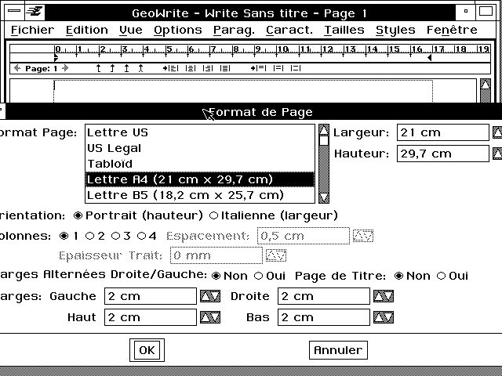

## 8 Localization

Localization is the means by which GEOS adapts to foreign environments. 
The kernel automatically accounts for such country-dependent items as 
currencies and keyboard layouts. Your geodes can work with foreign 
character sets and formatting preferences. Using the ResEdit tool, anyone 
can quickly translate an executable's text into other languages. You should 
look over this chapter whether or not you're planning on distributing your 
software internationally. The chapter includes documentation for some 
functions which you're likely to use regardless.

### 8.1 Localization Goals

The benefit of Geoworks' experience with previous international products 
was designed into GEOS from the start. The kernel was designed with the 
following three goals of localization in mind:

+ Ease of use  
Localization should be easy to use. A cumbersome system would slow 
programmers and leave them reluctant to use the system.

+ Integration with the kernel  
Functions used by many geodes should be part of the kernel. This allows 
for shared code, using less memory and making developers' jobs easier.

+ Economy  
Anyone should be able to translate an executable's text without having to 
understand or access the source code.

If you plan to release your software in other languages, you should code it for 
easy conversion later. Even if you have no such plans, there are still good 
reasons for using the localization features of GEOS.

+ Stay Generic and Adaptable  
By using localization code, your programs can work in a variety of 
environments without modification of source code. Even if you don't 
translate your geode into another language, users can still use it despite 
different keyboards and character sets.

+ Respect user's preferences  
Much of localization deals with user preferences which differ from 
country to country. Regardless of country, users may make changes using 
the Preferences desk tool (see Figure 8-1) and will no doubt appreciate 
having their preferences maintained.

+ Conform to the system  
You're probably going to end up using localization since much of GEOS is 
already localized. If your geodes are going to read DOS text files or 
alphabetize lists, you're going to use localized code; GEOS takes foreign 
character sets into account. Fortunately, localization functions are easy 
to use. In those situations where you don't absolutely have to use 
localized code, usually it's easier to use the localized functions than to 
write your own.

**Figure 8-1** International Formats  
_International formats include variations in how numbers, times, 
currencies, etc. are displayed in various countries. These formats may 
be set in the International section of the Preferences desk tool._

### 8.2 How To Use Localization

Your localization workload will vary depending on whether you plan to 
release your software in other countries. If you don't plan on exporting your 
software, your only contact with localization will come when you use the 
common functions that are localized. If you plan on international 
distribution, you'll be using localization both when writing your geodes and 
later on, during the translation process, in the following steps:

+ Use provided routines.  
Several GEOS functions have been localized to handle foreign variations, 
and you should use these whether you plan international release or not. 
Most of these functions are concerned with "International formats" and 
character sets.

+ Plan ahead for ResEdit.  
You'll probably use the ResEdit tool if you translate your software into 
other languages. You'll have to be careful about how you write your 
programs if ResEdit is to work with them properly. Any text in your 
geode that the user may see will have to be translated. ResEdit looks 
only at chunk is in localizable resources. You should also be prepared for 
the translations of any string to be longer than the original. You may 
want to provide instructions for translators. You may include these 
instructions within the body of your source code, close to the strings that 
will be translated.

+ Use ResEdit.  
The ResEdit tool makes translation easy. It goes through an 
application's resources and checks all objects for strings and bitmaps, 
asking the translator to make any fitting changes. The translator never 
needs to see the source code and doesn't have to know how to program.

### 8.3 Preparing for ResEdit

ResEdit is a GEOS program which speeds geode translations. This section 
won't tell you how to use the ResEdit tool but will explain how to write your 
code if you want ResEdit to work with it correctly.

The important thing to remember is to put all text and bitmaps to be 
localized in localizable resources. ResEdit looks for localizable objects only 
in non-code resources. The string or bitmap itself must be stored in a chunk, 
which you may insure by using either the @chunk or @visMoniker 
keywords. Thus, your application icons are probably stored in the following 
way:

**Figure 8-2** Localizing Strings  
_Some strings may get when translated. If your strings are too 
large, UI gadgets may extend beyond screen boundaries, as 
shown in the above screen dump, where a dialog box has become too 
wide. If you set an absolute size for your UI gadgets, strings may not 
fit inside them and instead may be truncated, as in the buttons 
pictured to the right._

~~~
@start APPSCMONIKERRESOURCE, data
/* Application moniker: */
@visMoniker MyAppSCMoniker = { /* - */}
@end APPSCMONIKERRESOURCE
~~~

At first it might seem surprising that bitmaps should be localized, since 
pictures are supposed to be a sort of universal language. However, this 
attitude may seem less strange when you try to distribute software to a 
culture that finds pictures of yellow arrows offensive.

Your application could keep its strings in a resource in the style illustrated 
in Code Display 8-1.

---
Code Display 8-1 Storing Strings in Localizable Resources
~~~
@start ErrorStrings, data;

@chunk char NoMonkeyError[] = 
	"FTPOOMM failed: No monkey present. Acquire a monkey and try again.";

@chunk char NoPeanutError[] = 
	"FTPOOMM failed: No peanuts present. Please insert peanuts and try again.";

@end ErrorStrings;
~~~

When working with assembly language, this means that any object stored in 
a code resource, idata, or udata will be passed over in the search for 
localizable resources, and thus will not be localizable.

When you know you are storing your strings such that they are localizable, 
you can provide information which will be visible to the translator when they 
use the ResEdit tool. Use the @localize keyword (localize in assembly) to 
set up this help text. The @localize directive should directly follow the 
chunk it applies to.

Remember the @localize syntax:

~~~
	 @localize { <string> <min>-<max> };
	 @localize { <string> <length> };
	 @localize { <string> };
	 @localize <string>; 
 @localize not;
~~~

---
Code Display 8-2 Storing Strings in Localizable Resources
~~~
@start ErrorStrings, data

@chunk char NoMonkeyError[] = 
	"FTPOOMM failed: No monkey present. Acquire a monkey and try again";

@localize "The phrase \"acquire a monkey\" appears in another string. Both should \
be translated in the same way.";

@end ErrorStrings

@object GenGlyphClass BossMon = {
	 GI_visMoniker = "Boss";
	 @localize { "This means hide the game because a boss is coming" 3-6 }; } 
~~~

Another thing to keep in mind is that when strings are translated, they are 
likely to grow 33% to 50%. You have to remember to leave room for larger 
strings, both in memory and in UI. If you use the usual generic UI gadgetry, 
the geometry manager should stretch the various gadgets to fit any larger 
names. You should be careful that it doesn't have to stretch so far that 
components get lost off the edge of the screen. If you decide to get around this 
problem by constraining the size of some gadgetry, keep in mind that if you 
don't allow it to stretch, your new strings may not fit. See Figure 8-2 for 
illustrations of these problems.

### 8.4 International Formats

"International Formats" generally refers to formats which differ from 
country to country. In GEOS, it signifies those formats which the user can set 
in the International section of the Preferences desk tool. GEOS provides 
functions to work with International Formats.

#### 8.4.1 Number and Measure

LocalGetNumericFormat(), LocalSetNumericFormat()
LocalGetMeasurementType(), LocalSetMeasurementType(), 
LocalAsciiToFixed(), LocalFixedToAscii(), 
LocalDistanceToAscii(), LocalDistanceFromAscii()

In the USA, 3.142 is a little more than three. In some other countries, it's a 
little over three thousand. This discrepancy arises from the fact that the 
decimal and thousands separators are interchanged-in some countries the 
"." symbol takes the place of the "," symbol when expressing numbers. To 
allow for local number formats, GEOS provides functions for retrieving and 
setting the user's preferences.

The number format includes the thousands separator, decimal separator, list 
separator, and number of decimal digits, as shown in Figure 8-3. The number 
format also contains a record, NumberFormatFlags, which holds one flag, 
NFF_LEADING_ZERO. This flag is on if the user wants a leading zero.

There is no overall automatic formatting command for numbers. GEOS 
supports many internal numeric formats such as fixed point and floating 
point. If the corresponding math library doesn't contain a formatting 
command for the number format you're using, you will need to work directly 
with the localization functions.

The LocalGetNumericFormat() routine returns the numeric format so 
you may use it to do your own formatting. LocalSetNumericFormat() 
allows you to reset the user's preferences, though this is inadvisable as it 
overrides and erases the user's original settings.

**Figure 8-3** Parts of a Number Format

These routines use the LocalNumericFormat structure to store the 
number format data. 

The LocalGetMeasurementType() and LocalSetMeasurementType() 
routines work with the enumerated type MeasurementType, of which 
there are two: MEASURE_US and MEASURE_METRIC. 
LocalGetMeasurementType() retrieves the user's current preferred 
measurement type; LocalSetMeasurementType() sets the user's 
preference to the passed value. As with any command that resets the user's 
preference, LocalSetMeasurementType() should never be used by most 
geodes.

The LocalAsciiToFixed() routine converts an ascii string (e.g. "12.7") to a 
fixed point number. LocalFixedToAscii() performs the reverse.

To convert between a string like "72 pt" and a number representing a 
distance, use the LocalDistanceFromAscii() routine. 
LocalDistanceToAscii() goes the other way, constructing the string 
corresponding to a given distance. These routines use the DistanceUnit 
enumerated type to specify the measurement units which are used as shown 
in the table below.

When allocating strings to use as the targets for Local-ToAscii() routines, 
allocating a buffer of size LOCAL_DISTANCE_BUFFER_SIZE will be sufficient.

Table 8-1 DistanceUnit types

|DistanceUnit value |# of Points |Display Format |Entry Format(s)    |
|-------------------|------------|---------------|-------------------|
|DU_POINTS          | 1.000      |###.### pt     |###.### pt         |
|DU_INCHES          |72.000      |###.### in     |###.### in ###.###"|
|DU_CENTIMETERS     |28.346      |###.### cm     |###.###cm          |
|DU_MILLIMETERS     | 2.835      |###.### mm     |###.###mm	         |
|DU_PICAS           |12.000      |###.### pi     |###.### pi         |
|DU_EUR_POINTS      | 1.065      |###.### ep     |###.### ep         |
|DU_CICEROS	        |12.787      |###,### ci     |###.### ci	     |

DU_POINTS_OR_MILLIMETERS and DU_INCHES_OR_CENTIMETERS: special cases

#### 8.4.2 Currency

LocalGetCurrencyFormat(), LocalSetCurrencyFormat()

These functions allow you to work with the currency format (see Figure 8-4). 
This format consists of the currency symbol string, number of currency digits 
(which may be different from the number of digits for ordinary numbers), and 
the CurrencyFormatFlags record. The flags in this structure determine 
whether the currency format includes space around the symbol, a negative 
sign, or a leading zero. There are flags to determine the relative order of the 
negative sign, currency symbol, and number. The currency symbol string 
may be of up to length CURRENCY_SYMBOL_LENGTH including the null 
terminator. LocalGetCurrencyFormat() also returns the separator 
characters from the numeric formats, eliminating the need for a separate call 
to LocalGetNumericFormat(). LocalSetCurrencyFormat() allows the 
changing of the set preferences. Most parts of the currency format are stored 
in a LocalCurrencyFormat structure when passed to or returned by these 
functions.

#### 8.4.3 Quotation Marks

LocalGetQuotes(), LocalSetQuotes()

In different countries, people use different types of quotation marks. 
Germans, for example, might use the \BB and \AB characters. Although 
traditionally, the only computer-generated quotation marks available are " 
and ", GEOS allows all geodes to use native quotation marks without 
extraordinary effort.

**Figure 8-4** Parts of the Currency Format

If a user types in a quotation mark, the keyboard knows which character to 
print; thus, if you're using ResEdit on a string, it's easy to have your 
translator type in the correct character. In these cases your geode will have 
no use for LocalGetQuotes() or LocalSetQuotes(). On the other hand, if 
your program is going to construct a string which contains quotation marks, 
use the LocalGetQuotes() routine; it will return the correct characters to 
use. If you want to reset the preferences, use the LocalSetQuotes() routine.

These routines work with the LocalQuotes structure, which simply holds 
four characters to use as the four kinds of quotation mark.

#### 8.4.4 Dates and Times

LocalFormatDateTime(), LocalParseDateTime(),
LocalGetDateTimeFormat(), LocalSetDateTimeFormat(),
LocalCustomFormatDateTime(), LocalCustomParseDateTime(), 
LocalCalcDaysInMonth(), LocalFormatFileDateTime()

LocalFormatDateTime() and LocalParseDateTime() allow display and 
parsing of date and time strings in a variety of formats. Passed the 
appropriate data, LocalFormatDateTime() will return a string with the 
data appropriately formatted. LocalParseDateTime() performs the 
reverse function, reading a string and attempting to extract information from 
it. The strings these functions use should be long enough to hold a formatted 
date or time. The predefined constant DATE_TIME_BUFFER_SIZE is the 
minimum recommended number of characters for one of these strings.

Localization functions use DateTimeFormats to keep track of what sort of 
format is desired. If told to parse "5:28" as hours and minutes, 
LocalParseDateTime() will (depending on the user's time format 
preferences) return 5 in the hours place and 28 in the minutes place. If told 
to parse "5/28" as hours and minutes, LocalParseDateTime() would return 
an error. There are a variety of DateTimeFormats() to choose from 
Table 8-2, and you should decide which format to use based on what 
information you want your application to display or read.

Table 8-2 DateTimeFormat Types

|Format                       |Sample Output           |
|-----------------------------|------------------------|
|DTF_LONG                     |Sunday, March 5th, 1990 |
|DTF_LONG_CONDENSED           |Sun, Mar 5, 1990        |
|DTF_LONG_NO_WEEKDAY          |March 5th, 1990         |
|DTF_LONG_NO_WEEKDAY_CONDENSED|Mar 5, 1990             |
|DTF_SHORT                    |3/5/90                  |
|DTF_ZERO_PADDED_SHORT        |03/05/90                |
|DTF_MD_LONG                  |Sunday, March 5th       |
|DTF_MD_LONG_NO_WEEKDAY	      |March 5th               |
|DTF_MD_SHORT                 |3/5                     |
|DTF_MY_LONG                  |March 1990              |
|DTF_MY_SHORT                 |3/90                    |
|DTF_MONTH                    |March                   |
|DTF_WEEKDAY                  |Wednesday               |
|DTF_HMS                      |1:05:31 PM              |
|DTF_HM                       |1:05 PM                 |
|DTF_H                        |1 PM                    |
|DTF_MS                       |5:31                    |
|DTF_HMS_24HOUR               |13:05:31                |
|DTF_HM_24HOUR                |13:05                   |

_DateTimeFormats with sample strings. Note that these samples only 
illustrate what the U.S. version could produce. The actual output might 
not look like the samples._

Each DateTimeFormat has a string associated with it that contains 
formatting information. This string consists of the characters of the format, 
with place-holding tokens for the fields of the date or time. These tokens are 
delimited by the special character "|". For example, the date/time format 
string "|HH|:|mm| |ap|" would correspond to the formatted string 
"10:37 am". The string for each DateTimeFormat can be accessed or altered 
with the LocalGetDateTimeFormat() and LocalSetDateTimeFormat() 
commands. The recommended minimum size of a date/time format string is 
the constant DATE_TIME_FORMAT_SIZE.

If you don't wish to work through one of the standard DateTimeFormat 
values, you can construct a string containing some date/time tokens and pass 
it as an argument to LocalCustomFormatDateTime(), along with the 
appropriate date and time information. To parse a date/time using a custom 
format, use LocalCustomParseDateTime().

The LocalFormatFileDateTime() utility routine works in the same way as 
LocalFormatDateTime(), except it takes a FileDateAndTime argument. 
It is normally used to format the information returned by 
FileGetDateAndTime().

The LocalCalcDaysInMonth() utility routine takes a month number and 
returns the number of days in that month.

A number of constants have been set up to aid in the computation of the size 
of string necessary to hold a date/time or a date/time format string. These 
constants are DATE_TIME_BUFFER_SIZE, DATE_TIME_FORMAT_SIZE, 
MAX_MONTH_LENGTH, MAX_DAY_LENGTH, MAX_YEAR_LENGTH, 
MAX_WEEKDAY_LENGTH, MAX_SEPARATOR_LENGTH, and 
TOKEN_LENGTH.

#### 8.4.5 Filters for Formats

LocalIsDateChar(), LocalIsTimeChar(), LocalIsNumChar()

The generic UI allows for filters on text objects to keep users from typing 
inappropriate characters. For example, if the user were expected to type in a 
number, the "~" character would be ignored as that isn't part of the number 
format. If you want to use generic text objects, you can give them hints to 
accept only characters from certain formats. If you want to use the filtering 
functions for your own purposes, they are available globally. When passed a 
character, these functions will tell whether the character is a legal part of a 
format. LocalIsDateChar() returns TRUE if the passed character is part of 
the short date format, DTF_SHORT. LocalIsTimeChar() returns TRUE 
when passed a number or time separator character. LocalIsNumChar() 
returns TRUE when passed a number character, a separator, or negative sign.

Table 8-3 DateTimeFormat String Tokens

|Token |Constant                  |Example    |
|------|--------------------------|-----------|
|\|DD\||TOKEN_TOKEN_DELIMITER     |\|         |
|\|LW\||TOKEN_LONG_WEEKDAY        |Wednesday  |
|\|SW\||TOKEN_SHORT_WEEKDAY       |Wed        |
|\|SM\||TOKEN_SHORT_MONTH         |Jun        |
|\|NM\||TOKEN_NUMERIC_MONTH       |6          |
|\|ZM\||TOKEN_ZERO_PADDED_MONTH   |06         |
|\|LD\||TOKEN_LONG_DATE           |9th        |
|\|SD\||TOKEN_SHORT_DATE          |9          |
|\|PD\||TOKEN_SPACE_PADDED_DATE   |9          |
|\|LY\||TOKEN_LONG_YEAR           |1991       |
|\|SY\||TOKEN_SHORT_YEAR          |91         |
|\|HH\||TOKEN_12HOUR              |6          |
|\|hh\||TOKEN_24HOUR              |18         |
|\|Zh\||TOKEN_ZERO_PADDED_24HOUR  |04         |
|\|mm\||TOKEN_MINUTE              |5          |
|\|Zm\||TOKEN_ZERO_PADDED_MINUTE  |05         |
|\|Pm\||TOKEN_SPACE_PADDED_MINUTE |5          |
|\|ss\||TOKEN_SECOND              |3          |
|\|ap\||TOKEN_AM_PM               |pm         |
|\|Ap\||TOKEN_AM_PM_CAP           |Pm         |
|\|AP\||TOKEN_AM_PM_ALL_CAPS      |PM         |

Examples show what U.S. version could produce. Actual output might not 
look like samples.

### 8.5 Lexical Functions

Since different languages have different alphabets, GEOS has to allow for 
characters not in the standard English character set. Thus, many standard 
procedures have been localized. Most of these functions have to do with the 
lexical value of characters, their place in a lexical, or alphabetic, ordering. 
These lexical values take the place of ASCII standard character values that 
you may be used to.

#### 8.5.1 Comparing Strings

LocalCmpStrings(), LocalCmpStringsNoCase(), 
LocalCmpStringsNoSpace(), LocalCmpStringsNoSpaceCase(), 
LocalGetLanguage(), LocalCmpChars(), LocalCmpCharsNoCase()

LocalCmpStrings() takes two strings as arguments and says which, if 
either, comes first alphabetically. LocalCmpStringsNoCase() does the 
same thing but is not case sensitive. LocalCmpStrings() does a better job 
of ordering strings than assembly language instructions such as cmps that 
just compare ASCII values. Since the ASCII value of "a" places it after "Z", it 
is advisable to use LocalCmpStrings(), which uses the localized lexical 
values. When comparing two strings for equality, assembly instructions like 
cmps may be used safely.

The LocalCmpStringsNoSpace() and 
LocalCmpStringsNoSpaceCase() routines are like the 
LocalCmpStrings() and LocalCmpStringsNoCase() routines, except 
that spaces and punctuation marks are ignored. Note that if you are 
comparing only a certain number of characters that spaces and punctuation 
marks will not be included in this number.

The sort order of the strings will depend on the language used when sorting 
them. To find out the current language used for sorting, call 
LocalGetLanguage().

There are two assembly routines LocalCmpChars() and 
LocalCmpCharsNoCase() which allow for the quick lexical comparison of 
two characters.

#### 8.5.2 String Length and Size

LocalStringLength(), LocalStringSize()

There are two routines which determine how long a string is. 
LocalStringLength() returns the number of characters making up the 
string, not including the null terminator, if any. LocalStringSize() returns 
the number of bytes in a string, again not counting any null terminators. 
Normally these two values will be the same, but any applications which want 
to support double byte character support will need separate functions to 
handle those characters that take more than one byte to represent.

#### 8.5.3 Casing

LocalUpcaseChar(), LocalDowncaseChar(), 
LocalUpcaseString(), LocalDowncaseString()

These functions take a character or string and, if possible, transform it to 
upper or lower case. They work only on alphabetic characters; other 
characters will be returned unchanged. These functions can deal with all 
languages, understanding "\C8" is the upper case for "\E8". If you're used to using 
ASCII, you might be tempted to write your own version of these casing 
functions by doing arithmetic operations with the lexical or ASCII values of 
characters, but chances are these will not work with other character sets and 
should be avoided.

#### 8.5.4 Character Categories

LocalIsUpper(), LocalIsLower(), LocalIsAlpha(), 
LocalIsPunctuation(), LocalIsSpace(), LocalIsSymbol(), 
LocalIsControl(), LocalIsDigit(), LocalIsHexDigit(), 
LocalIsAlphaNumeric() LocalIsPrintable(), LocalIsGraphic()

GEOS assembly provides some commonly used character predicates. C users 
may use the standard C functions isupper(), islower(), etc. to access these 
predicates. Passed a character, each of these functions tells whether that 
character falls into a certain category. LocalIsUpper() returns true if the 
character is an uppercase alphabetic character; LocalIsLower() returns 
true if the character is lower case. LocalIsAlpha() approves any alphabetic 
character. LocalIsPunctuation() checks for punctuation marks. 
LocalIsSpace() looks for white space (including spaces, tabs, and carriage 
returns), and LocalIsSymbol() catches just about everything else. 
LocalIsControl() detects control characters (e.g. Control-A). 
LocalIsDigit() returns true for decimal digits. LocalIsHexDigit() approves 
hexadecimal digits (including the characters a-f, A-F). 
LocalIsAlphaNumeric() detects alphabetic characters and decimal digits. 
LocalIsPrintable() returns true when passed a character which takes up a 
space when printed, corresponding to the standard C function isprint(). 
LocalIsGraphic() checks for displayable characters, in the manner of the 
standard C function isgraphic().

#### 8.5.5 Lexical Values

LocalLexicalValue(), LocalLexicalValueNoCase()

If for some reason you want to get the lexical value of a character, these 
functions will return it. LocalLexicalValue(), passed a character, returns 
its lexical value. LocalLexicalValueNoCase() does the same thing but 
ignores case. If the lexical value for one character is lower than another, that 
character comes first alphabetically. For instance, "a" would have a lower 
lexical value than "z." This ordering will be valid in any language using the 
same character set. 

#### 8.5.6 DOS Text & Code Pages

LocalDosToGeos(), LocalGeosToDos(), LocalDosToGeosChar(), 
LocalGeosToDosChar(), LocalCmpStringsDosToGeos(), 
LocalIsDosChar(), LocalCodePageToGeos(), 
LocalGeosToCodePage(), LocalCodePageToGeosChar(), 
LocalGeosToCodePageChar(), LocalGetCodePage(), 
LocalIsCodePageSupported()

There are several functions which work with DOS-format text, converting it 
to and from GEOS format. Normally, converting DOS text files to GeoWrite 
documents is handled by Import/Export routines; for those occasions where 
your code needs to convert DOS text to GEOS format or vice versa, however, 
these functions should be sufficient. They are localized because DOS has its 
own version of localization which it implements as "code pages." Each code 
page is a table of characters. Countries or regions with unusual characters 
have different code pages. If you haven't worked with code pages up to this 
point, you probably won't have to start now but can just rely on GEOS to use 
the native code page correctly. If your geode is going to allow computers from 
one country to communicate with those of another, you might need to use 
specialized functions.

Assuming you want to use the code page native to the user's machine, you 
can use LocalDosToGeos() and LocalGeosToDos() to convert strings from 
one text format to the other. LocalDosToGeosChar() and 
LocalGeosToDosChar() work similarly, converting a single character.

LocalCmpStringsDosToGeos() takes two strings, converts one or both of 
them to GEOS format, then compares them, returning the same values as the 
regular string comparing functions. Pass a 
LocalCmpStringsDosToGeosFlags to specify which strings to convert 
before comparing.

Each of these functions also takes a character as an argument. When a 
character in one format has no corresponding character in the format it's 
being converted to, the character argument will be substituted. At the same 
time a flag will be set to let your geode know that there were some characters 
that couldn't be converted nicely. LocalIsDosChar() checks a GEOS 
character to see if it maps into a DOS character. The MIN_MAP_CHAR 
constant is the smallest value which may need to be mapped. If a character's 
value is below this constant, then it will be the same under any code page.

If your geode is interested in which code page it's using, the 
LocalGetCodePage() instruction will tell you what the default code page is. 
If you want to use a code page other than the native one, the 
LocalCodePageToGeos(), LocalGeosToCodePage(), 
LocalCodePageToGeosChar(), and LocalGeosToCodePageChar() 
behave as their default code page equivalents, except that each takes a code 
page as an argument to be used in conversion. A number of support code page 
values are enumerated in the DosCodePage type. To find out whether the 
user's environment supports a specific code page, call 
LocalIsCodePageSupported().

[The Clipboard](cclipb.md) <-- &nbsp;&nbsp; [table of contents](../Concepts.md) &nbsp;&nbsp; --> [General Change Notification](cgcn.md)
