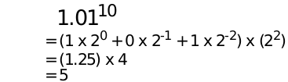
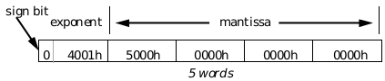
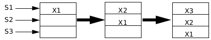
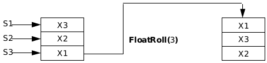
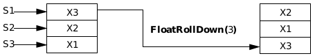
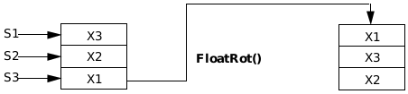
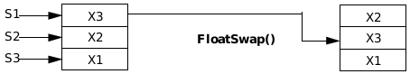
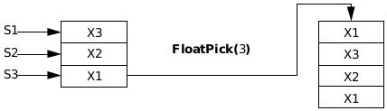
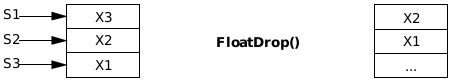
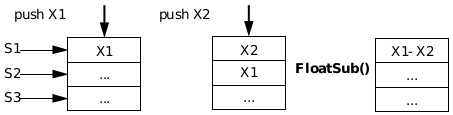

## D The Math Library

The Math Library allows high precision computations not available 
through standard integer operations. Floating Point (FP) numbers use 
decimal representation to express fractional quantities. This format also 
allows scientific notation to represent very large and very small numbers.

To enable floating point operations, an application must include a GEOS 
Math Library. There are two Math Libraries: math.h and math.goh. The 
file math.h includes what you need to get floating point numbers to work 
within your application. The object file, math.goh (which includes 
math.h), includes the float-format controller, an object that allows the user 
to control how floating point numbers are formatted within an application.

In most cases, the mere inclusion of the Math Library will eliminate the 
need to directly call Math Library routines. (The C compiler will parse the 
mathematical expressions into appropriate floating point routines.) You 
may, however, wish to call some of these routines directly. Developers using 
Object Assembly must use this latter approach. C developers may also 
want to directly manipulate the FP stack for involved computations that 
they would rather not leave to the compiler. This approach is discussed in 
the latter half of this chapter.

Use of math.goh is optional, depending on the purpose of the application. 
A spreadsheet application, for example, might want to allow the user to 
format FP numbers. Other applications might not want to include this file.

### D.1 Basic Math Functions

The Math Library includes many routines and structures that make the 
manipulation of FP numbers possible. Most of these are transparent to a C 
programmer.

C includes the following floating point types: **float**, **double**, and **long 
double**. A floating point number in GEOS is of type FloatNum, which uses 
the IEEE 80 bit standard (equivalent to a long double) to represent floating 
point values. **FloatNum** has overloaded the float, double, long double, and 
all basic match functions.

A **FloatNum** consists of a one bit sign, a 15 bit exponent, and a 64 bit 
mantissa. The maximum exponent allowed is 7FFEh. An exponent of 7FFFh 
(FP_NAN) signals an underflow or overflow. You may check the value of this 
exponent using the macro FLOAT_EXPONENT to extract the exponent of a 
**FloatNum**.

---
Code Display D-1 Extracting an Exponent
~~~
FloatNum myNum;

if (FLOAT_EXPONENT((&myNum)) == FP_NAN)
{
     return(ERROR);
}
~~~

If you use any floats, doubles, or long doubles in your application, GEOS will 
convert these types into **FloatNum** values automatically and call the 
appropriate GEOS functions to manipulate the numbers. As this is the case, 
it is usually easier to declare any floating point variables in your 
application as **FloatNum** types (or long doubles). This cuts down on 
conversion time.

The Math Library provides all the familiar mathematical functions to 
manipulate these GEOS FP numbers (addition, multiplication, computation 
of logarithms, etc.). In C, most of these functions will automatically be 
called when their corresponding C operation involving FP numbers take 
place. (For example, when using the `+' binary operator to add two FP 
numbers, the Math Library will use the corresponding **FloatAdd()** 
routine.)

You may, under special circumstances, wish to use these math routines 
directly. If you do so, you will need to manipulate the floating point stack 
manually, pushing numbers on the stack and making sure numbers are in 
the proper stack location to perform each operation. In most cases, the FP 
math routines operate on numbers already in place on the FP stack; they 
take and return no arguments of their own.

Two functions you will need to use if you take this approach are 
**FloatPushNumber()** and **FloatPopNumber()**. **FloatPushNumber()** 
takes the address of a variable (of type **FloatNum**) to push onto the FP 
stack; **FloatPopNumber()** takes the address of a buffer to place an FP 
number popped off the FP stack. Other routines (for example, **FloatAdd()**) 
can then be called to operate on the FP stack. (See Code Display D-2 for an 
example using this approach.)

There are many other routines that perform stack manipulation by shifting 
locations of FP numbers on the stack (**FloatRoll()**, **FloatDrop()**, etc.). 
These routines are covered in detail in the latter part of this chapter 
because they are seldom needed in a C applications.

#### D.1.1 Algebraic Functions

Algebraic routines perform algebraic operations on FP numbers. The Math 
Library provides all of the basic algebraic routines that operate on GEOS 
FP numbers (addition, subtraction, etc.). The table in Table D-1 lists the 
function names and the operations they perform.

|Function         |C Operation |Function                         |
|:----------------|:-----------|:--------------------------------|
|FloatAdd()       |+           |addition                         |
|FloatSub()       |-           |subtraction                      |
|FloatMultiply()  |*           |multiplication                   |
|FloatDivide()    |/           |division                         |
|FloatDIV()       |(int) (X/Y) |division returning integer result|
|FloatMod()       |X % Y       |modulo                           |
|FloatFactorial() |            |factorial                        |
|FloatNegate()    |-X          |negation                         |
|FloatInverse()   |1/X         |inversion                        |
|FloatAbs()       |abs(X)      |absolute value                   |
|FloatMax()       |            |maximum of two numbers           |
|FloatMin()       |            |minimum of two numbers           |
|FloatLt0()       |X < 0       |less than 0                      |
|FloatGt0()       |X > 0       |greater than 0                   |
|FloatEq0()       |X = 0       |equal to 0                       |
|FloatFrac()      |            |returns fractional portion of X  |
|FloatTrunc()     |            |truncates X to its integer value |
|FloatInt()       |(int) X     |returns integer of X, rounded down|
|FloatIntFrac()   |            |separates X into integer and fraction|
|FloatRound()     |            |rounds X to a given decimal places|

**Table 4-1** Basic FP Functions and corresponding C operations (if any)

If you wish to call these routines directly rather than rely on the C 
operations, you may manipulate the floating point stack directly. To add 
two numbers using **FloatAdd()** for example, you would use 
**FloatPushNumber()** twice to push the two values to add onto the FP 
stack, and then call **FloatAdd()** to operate on the FP stack. (See Code 
Display D-2.)

---
Code Display D-2 Adding Two FP Numbers
~~~
/*
 * The following two methods each add two FP numbers and return the result. The 
 * first method is familiar C code. The second example uses the floating point 
 * routines from math.h directly. Note that the C code will be assembled into code 
 * that uses FloatAdd() also, but that this is transparent to the code.
 */

@method MyProcessClass, MSG_SUM_FLOATS {
    long double         number1, number2, number3;

    number1 = 1.0;
    number2 = 2.0;

    number3 = number1 + number2;
    return(number3);
}

@method MyProcessClass, MSG_SUM_FLOATS_MANUALLY {
    long double         number1, number2, number3;

    number1 = 1.0;
    number2 = 2.0;

    FloatPushNumber(&number1);      /* Push number1 onto the FP stack. */
    FloatPushNumber(&number2);      /* Push number2 onto the FP stack. */
    FloatAdd();             /* Add the top two numbers on the FP stack. The
                 * result will be placed on top of the FP stack.*/
    FloatPopNumber(&number3);       /* Pop the result into the number3 variable. */
    return(number3);
}
~~~

Algebraic routines included in the Math Library are listed in Table D-1. As 
can be seen in the table, several functions have no equivalent C operation. 
Consult ["Direct FP Operations"](#d4-direct-fp-operations) for more details on using these 
functions.

#### D.1.2 Transcendental Functions

The Math Library provides an array of transcendental routines that 
operate on GEOS FP numbers. A transcendental function is one which 
cannot be derived through algebraic means. Examples of transcendental 
functions include the trigonometric functions (sine, cosine, etc.) and the 
logarithmic functions (log, natural log, etc.).

The table in Table 4-2 lists the function names and the operations they 
perform. Typical functions in C are listed alongside. (The basic language of 
C itself includes no such transcendental functions but almost all compilers 
include a C math library that does.) As can be seen in the table, several 
functions have no equivalent C operation. Consult ["Float Formats"](#d3-float-formats) 
for more details on using these functions.

|Function          |C Equivalent   |Operation                    |
|:-----------------|:--------------|:----------------------------|
|FloatSin()        |sin()          |sine                         |
|FloatCos()        |cos()          |cosine                       |
|FloatTan()        |tan()          |tangent                      |
|FloatArcSin()     |asin()         |arc-sine (inverse sine)      |
|FloatArcCos()     |acos()         |arc-cosine (inverse cosine)  |
|FloatArcTan()     |atan()         |arc-tangent (inverse tangent)|
|FloatArcTan2()    |               |arc-tangent given two coordinates|
|FloatSinh()       |sinh()         |hyperbolic sine              |
|FloatCosh()       |cosh()         |hyperbolic cosine            |
|FloatTanh()       |tanh()         |hyperbolic tangent           |
|FloatArcSinh()    |asinh()        |hyperbolic arc-sine          |
|FloatArcCosh()    |acosh()        |hyperbolic arc-cosine        |
|FloatArcTanh()    |atanh()        |hyperbolic arc-tangent       |
|FloatExp()        |               |e raised to the power X      |
|FloatExponential()|exp()          |X raised to the Y power      |
|FloatLg()         |               |logarithm to the base 2      |
|FloatLog()        |log()          |logarithm to the base 10     |
|FloatLn()         |               |logarithm to the base e (natural log)|
|FloatLn1plusX()   |               |natural log of (1 + X)       |
|FloatSqr()        |               |square of X                  |
|FloatSqrt()       |sqrt()         |square root                  |

**Table 4-2** Transcendental Floating Point Functions

#### D.1.3 Random Number Generation

FloatRandomize(), FloatRandom(), FloatRandomN()

The Math Library also provides routines to create random numbers. Using 
any of these routines requires that you manually push and pop numbers on 
the FP stack.

**FloatRandomize()** primes the random number generator, in preparation 
for a call to **FloatRandom()** or **FloatRandomN()**. If **FloatRandomize()** 
is passed the flag RGIF_USE_SEED, the routine must also pass a developer 
supplied seed.

**FloatRandom()** returns a random value between 0 (inclusive) and 1 
(exclusive). The number is placed on top of the FP stack. To assign that 
value to a variable, use **FloatPopNumber()**.

**FloatRandomN()** returns a random value between 0 (inclusive) and N 
(exclusive), where N is an integer. The integer value must be on top of the 
FP stack. The returned integer is pushed onto the FP stack.To assign that 
value to a variable, use **FloatPopNumber()**.

---
Code Display D-3 Creating a Random Number
~~~
/*
 * This method takes a passed seed (passedSeed) and returns a random integer 
 * between 0 and 100.
 */

@method MyProcessClass, MSG_GET_RANDOM_FLOAT {
    long double         randomX;
    /* Prime the random number generator. */
    FloatRandomize(RGIF_USE_SEED, passedSeed);
    randomX = 100;
    FloatPushNumber(&randomX);
    FloatRandomN();
    FloatPopNumber(&randomX);
    return(randomX);
}
~~~

### D.2 Conversions to Other Types

In many cases, FP numbers will need to be converted to different types for 
use in different parts of an application. For example, floating point 
numbers may be involved in a complex function that returns an integer. FP 
numbers may also need to appear to the user as ASCII text.

**Converting Into Other Floats**

There are several routines which convert GEOS FP numbers into other float 
formats, compatible with the C types **float** and **double**. Typically in C, this 
conversion is accomplished by casting the FP numbers into the other type. 
It is therefore done automatically for you.

If you are working in Assembly or you wish to directly pass floats or doubles 
to C stubs, consult ["Direct FP Operations"](#d4-direct-fp-operations).

**Converting ASCII to FP Numbers**

FloatAsciiToFloat()

**FloatAsciiToFloat()** converts a number represented in an ASCII text 
format into a FP number. The routine recognizes two flags:

+ FAF_PUSH_RESULT  
Pushes the result onto the FP stack.

+ FAF_STORE_NUMBER  
Stores the result in a specified address.

The routine must also be passed a pointer to the string to convert, the 
number of characters in the string to convert (starting at the address) and 
the buffer to store the FP number if passing FAF_STORE_NUMBER.

**Converting FP Numbers to ASCII**

FloatFloatToAscii(), FloatFloatToAscii_StdFormat(), 
FloatFloatIEEE64ToAscii_StdFormat()

**FloatFloatToAscii()** converts an FP number into ASCII text format. The 
routine must be passed a stack frame, which may be set up by declaring a 
local variable of type **FFA_stackFrame** and moving data into the 
appropriate fields. You should also pass the routine a pointer to a buffer to 
store the resultant string.

The **FFA_stackFrame** is a union of two structures: 
**FloatFloatAsciiData** or **FloatFloatToDateTimeData**. You will want to 
use the **FloatFloatToAsciiData** structure in most cases; 
**FloatFloatToAsciiDateTimeData** is used to format a FP number 
(representing a date and time) into a date-time format passed in the 
structure. The routine checks a bit in the structure to see which structure 
is being passed.

##### D.2.0.1 Normal Conversions

The **FloatFloatToAsciiData** structure is used most often in formatting 
FP numbers into ASCII. The structure is rather large and cumbersome to 
set up. You may wish to use the routine **FloatFloatToAscii_StdFormat()** 
which sets up many of these entries automatically. (Code Display D-4 lists 
the entries of the **FloatFloatToAsciiData** structure.)

---
Code Display D-4 FloatFloatToAsciiData Structure
~~~
typedef struct {

/*
 * FFA_params stores the entries that the caller must set up.
 */
    FloatFloatToAsciiParams         FFA_params;

/*
 * These entries store information returned by FloatFloatToAscii() that may be 
 * examined.
 */
    word            FFA_startNumber;
    word            FFA_decimalPoint;
    word            FFA_endNumber;
    word            FFA_numChars;
    word            FFA_startExponent;

/*
 * The rest of the entries are for internal use only.
 */
    word            FFA_bufSize;
    word            FFA_saveDI;
    word            FFA_numSign;
    byte            FFA_startSigCount;
    byte            FFA_sigCount;
    byte            FFA_noMoreSigInfo;
    byte            FFA_startDecCount;
    byte            FFA_decCount;
    word            FFA_decExponent;
    word            FFA_curExponent;
    byte            FFA_useCommas;
    byte            FFA_charsToComma;
    char            FFA_commaChar;
    char            FFA_decimalChar;
} FloatFloatToAsciiData;
~~~

FFA_params is a structure that stores the following entries of its own:

**formatFlags**  
Flags specifying the look and feel of the ASCII text format 
(see below for allowed flags).

**decimalOffset**  
Integer which specifies the number of decimal places to shift 
the output. For example, to display a number in terms of 
millions, a **decimalOffset** of -6 shifts the decimal point six 
places to the left; to display in terms of tenths would require 
a **decimalOffset** of 1.

**totalDigits**  
Integer which specifies the maximum number of decimal 
places (integer and decimal portions) that the FP number 
may exhibit. The ASCII string is truncated if the length of the 
string is greater than this number.

**decimalLimit**  
Integer which specifies the maximum number of digits to the 
right of the decimal point. For example a **decimalLimit** of 2 
would print out 123.456789 as 123.46.

**preNegative**  
Characters used to precede a negative number, in the format 
of a null terminated text string.

**postNegative**  
Characters used to follow a negative number, in the format of 
a null terminated text string.

**prePositive**  
Characters used to precede a positive number, in the format 
of a null terminated text string.

**postPositive**  
Characters used to follow a positive number, in the format of 
a null terminated text string.

**header**  
Characters used to precede the number, in the format of a 
null terminated text string. For example, a typical header for 
a currency format might be "$". 

**trailer**  
Characters used to follow a FP number, in the format of a null 
terminated text string.

The formatFlags record is a record of type 
FloatFloatToAsciiFormatFlags and defines the format of the ASCII 
output. Set the appropriate flags to get the desired output.

+ FFAF_FROM_ADDR  
Set if routine should take the FP number from a specified address, rather than 
the FP stack. This pointer (*number) should be passed to 
**FloatFloatToAscii()** if this flag is set.

+ FFAF_DONT_USE_SCIENTIFIC  
Set if the result should not be expressed in scientific notation under 
any condition. If this is set, the number will always be formatted in 
fixed format.

+ FFAF_SCIENTIFIC  
Set if the result should be expressed in scientific notation even if the 
number can be expressed in fixed point format. For example, the 
number `2' will be expressed as "2 x 100."

+ FFAF_PERCENT  
Set if the result should be expressed as a percentage.

+ FFAF_USE_COMMAS  
Set if the result should use commas to separate thousands.

+ FFAF_NO_TRAIL_ZEROS  
Set if extraneous zeros to the right of the decimal point should be 
ignored. For example, "123.67000000" will be reduced to "123.67."

+ FFAF_NO_LEAD_ZEROS  
Set to ignore the lead zero for a number less than one. That is, "0.123" 
is reduced to ".123."

+ FFAF_HEADER_PRESENT  
Set if a header is present; this speeds up conversion.

+ FFAF_TRAILER_PRESENT  
Set if a trailer is present; this speeds up conversion.

+ FFAF_SIGN_CHAR_TO_FOLLOW_HEADER  
Set if sign character(s) should follow the header.

+ FFAF_SIGN_CHAR_TO_PRECEDE_TRAILER  
Set if sign character(s) should precede the trailer.

The rest of the entries in **FloatFloatToAsciiData** store information filled 
in by **FloatFloatToAscii()**. These entries are described below:

**FFA_startNumber** stores the offset to the start of numeric characters in the ASCII buffer.

**FFA_decimalPoint** stores the offset to the decimal point character or zero if no decimal point is present.

**FFA_endNumber** stores the offset to the end of the numeric characters in the ASCII buffer.

**FFA_numChars** stores the total number of characters in the ASCII buffer (excluding the 
null terminator). This entry is set to zero if an error is encountered.

**FFA_startExponent** stores the offset to the "E" character in the ASCII buffer or zero if 
no exponent is present. Applications can check this to see if the 
number was expressed in scientific notation using the `E' format.

##### D.2.0.2 Date-Time Conversions

**FFA_stackFrame** may contain **FloatFloatToAsciiDateTimeData** if 
**FloatFloatToAscii()** is being used to convert a FP number into a 
date-time format. In that case **FFA_stackFrame** contains the structure 
**FloatFloatToDateTimeData** instead of **FloatFloatToAsciiData**. 
(**FFA_stackFrame** is a union.)

**FloatFloatToDateTimeData** contains one entry, FFA_dateTimeParams. 
This structure contains several flags which specify how the date-time 
should be formatted and a number of entries which break down the 
date-time into its respective parts (year, month, day etc.) If none of these 
entries are filled in, the date-time is taken from the top of the FP stack.

Date-times are represented by FP numbers in GEOS. The integer portion 
represents dates as integers counted from Jan 1, 1900, which is designated 
as 1. The highest date allowed is 73050 (December 31, 2099). The fractional 
portion represents a fraction of the day between midnight (0.000000) and 
11:59:59 p.m. (0.999988). This fractional value is derived from the hour, 
minute and second of the day.

---
Code Display D-5 DateTime Parameters
~~~
typedef struct {
    FloatFloatToDateTimeFlags               FFA_dateTimeFlags;
    word                FFA_year;
    byte                FFA_month;
    byte                FFA_day;
    byte                FFA_weekday;
    byte                FFA_hours;
    byte                FFA_minutes;
    byte                FFA_seconds;
} FloatFloatToDateTimeParams;

/*
 *  FloatFloatToDateTimeFlags record
 */

typedef WordFlags FloatFloatToDateTimeFlags;
#define FFDT_DATE_TIME_OP  0x8000
#define FFDT_FROM_ADDR     0x4000
#define FFDT_FORMAT        0x3fff
~~~

The flag FFDT_DATE_TIME_OP is set to notify the **FloatFloatToAscii()** 
routine that this operation is a date-time format, not a normal float to 
ASCII conversion. This flag must be set if you want to convert the FP 
number into a date-time format using **FloatFloatToAscii()**.

FFDT_FROM_ADDR is set if the date-time FP number should not be taken 
from the FP stack (or passed directly in the 
**FloatFloatToDateTimeParams** structure) but should instead be taken 
from the address passed in **FloatFloatToAscii()**.

FFDT_FORMAT stores the **DateTimeFormat** that the routine will use to 
format the number into a date-time string.

If the date-time is directly passed in, and not taken from an FP date-time 
number either at a passed address or the top of an FP stack, 
**FloatFloatToAscii()** looks at the other passed parameters.

FFA_year specifies the year. The value must be between 1900 and 2099. 
This is not a one-based year, as it is when presented as a date-time number.

FFA_month is the month of the year, a value between 1 and 12.

FFA_day is the day of a month, a value between 1 and 31. 

FFA_hour specifies the hour of the day, a value between 0 and 23. Zero 
specifies midnight. 

FFA_minutes specifies the minute of the hour, a value between 0 and 59.

FFA_seconds specifies the second of the minute, a value between 0 and 59.

##### D.2.0.3 Using Standard Formats

**FloatFloatToAscii_StdFormat()** uses a pre-set stack frame, eliminating 
the need to set up the variables of the **FloatFloatToAsciiData** structure 
manually. The only flags recognized are FFAF_FROM_ADDR, 
FFAF_SCIENTIFIC, FFAF_PERCENT, FFAF_USE_COMMAS, and 
FFAF_NO_TRAIL_ZEROS. The developer must pass the number of total 
digits and the number of decimal digits desired. If the flag 
FFAF_FROM_ADDR is used, a pointer to a FP number (not on the FP stack) 
must also be passed.

The standard format sets the following elements of the stack frame to zero: 
**decimalOffset**, **header**, **trailer**, **postNegative**, **prePositive**, and 
**postPositive**. The structure element **preNegative** is set to the minus 
sign ("-").

**FloatFloatIEEE64ToAscii_StdFormat()** performs the same operation 
as **FloatFloatToAscii_StdFormat()** except that the FP number is passed 
(in 64 bit format) and is not taken from the stack. The entire FP number 
(not just a pointer to it) must be passed. All criteria for 
**FloatFloatToAscii_StdFormat()** applies to this routine, except that the 
flag FFAF_FROM_ADDR is not used.

##### D.2.0.4 Date and Time Routines

FloatGetDateNumber(), FloatDateNumberGetYear(), 
FloatDateNumberGetMonthAndDay(), 
FloatDateNumberGetWeekday(), FloatGetTimeNumber(), 
FloatTimeNumberGetHour(), FloatTimeNumberGetMinutes(), 
FloatTimeNumberGetSeconds()

**FloatGetDateNumber()**, when passed the month, day, and year, converts 
the data into an FP "date number" representation. This format represents 
dates as integers counted from Jan 1, 1900, which is designated as 1. The 
highest date allowed is 73050 (December 31, 2099).

**FloatDateNumberGetYear()**, **FloatDateNumberGetMonthAndDay()** and 
**FloatDateNumberGetWeekday()** all return the appropriate data, either 
the year, month and day, or weekday, given an FP "date number" as defined 
above. All data are returned as integers, not as FP numbers, and the 
original FP "date number" is popped off of the stack. Years are returned as 
integers between 1900 and 2099. Month and Days are returned as integers 
between 1 and 12, and 1 and 31, respectively. Weekdays are returned as 
integers between 1 and 7, where 1 is Sunday, 2 is Monday, etc. 

**FloatGetTimeNumber()** when passed hours, minutes, and seconds 
returns an FP decimal representation between midnight (0.000000) and 
11:59:59 p.m. (0.999988). 

**FloatTimeNumberGetHour()**, **FloatTimeNumberGetMinutes()** and 
**FloatTimeNumberGetSeconds()** return the appropriate data given an 
FP "time number" as defined above. The original FP "time number" is 
popped off of the stack.

Note that both "date numbers" and "time numbers" can be added to specify 
a specific point in time. For example, 73050.999988 would specify 
December 31, 2099, 11:59:59. Since these formats are in FP format, they 
can be operated on with all standard functions in the FP library. 

##### D.2.0.5 Miscellaneous Date Time Routines

FloatGetDaysInMonth(), FloatGetNumDigitsInIntegerPart(), 
FloatFormatNumber()

**FloatGetDaysInMonth()** returns the total number of days in a specific 
month, for a specific year. The routine must be passed the appropriate 
month and year.

**FloatGetNumDigitsInIntegerPart()** returns the number of digits in the 
integer portion of an FP number. Numbers between zero and one will 
return one as the number of digits.

FloatStringGetDateNumber(), FloatStringGetTimeNumber()

### D.3 Float Formats

FP numbers can be displayed in many ways. For example, as we have seen, 
an FP number may actually represent a date-time. When we display the FP 
number 366.0000, we may want to how it (in text) as "Jan 1, 1901." The 
Math Library has a number of system-defined formats for your use. You 
may also allow users to define their own formats with the Float Format 
controller.

The underlying structures and routines to use and create float format 
options are explained in the next section. In most cases, however, the 
simple inclusion of a Float Format controller (of **FloatFormatClass**) 
provides all of the UI and functionality to create and apply formats to FP 
numbers within text objects.

#### D.3.1 System-defined Formats

A system-defined FP format is stored within a FormatParams structure. 
This structure defines whether the FP number is a number to be converted 
into numerical text or a date-time. These format parameters are stored 
within arrays managed by the format control code. 

---
Code Display D-6 System-defined Float Formats
~~~
/*
 * System-defined float formats are stored in an array that is maintained and 
 * accessed by the float controller code. Each element is made up of a 
 * FormatParams structure.
 */

typedef struct {
    /*
     * The FloatFloatToAsciiParams_Union stores either a
     * FloatFloatToAsciiParams structure if the number is a `pure' FP number,
     * or a FloatFloatToDateTimeParams structure if the number is a date-time. 
     * In this way, it is essentially the same as the FFA_stackFrame discussed
     * earlier.
     */
    FloatFloatToAsciiParams_Union       FP_params;

    /*
     * FP_formatName stores the name of this formatting option that will be 
     * displayed in the float controller's dynamic list. This name is loaded 
     * from the optr given in FP_nameHan and FP_nameOff.(The table where these 
     * strings are kept is within a localizable resource and therefore will
     * have different text under different country setups.)
     */
    char                FP_formatName[FORMAT_NAME_LENGTH+1];
    word                FP_nameHan;     /* MemHandle */
    word                FP_nameOff;     /* ChunkHandle */

    /*
     * FP_listEntryNum stores the zero-based position of this FormatParams 
     * entry within the table.
     */
    word                FP_listEntryNum;

    /*
     * FP_signature is an internal field used for error-checking.
     */
    word                FP_signature;
} FormatParams;
~~~

An application will never need to access this table of formats directly. GEOS 
contains several routines (in math.goh) that can access this table and add, 
delete and modify table entries. Usually, it is easiest to include a Float 
Format controller in your application if you intend to allow the user to 
change float formats with these routines.

There are many system-defined float formatting options. These formats are 
identified by **FormatIdType** enumerations. Each type corresponds to a 
**FormatParams** structure. 

Each **FormatIdType** enumeration is a direct offset into the float format 
lookup table. To distinguish between system-defined and user-defined 
formats, the high bit of a **FormatIdType** is set to indicate that the format 
is system-defined. Thus, 8000h refers to the first system-defined format, 
8000h + (size(**FormatParams**)) refers to the second system-defined 
format, etc.

The format strings themselves are stored within a localizable resource, so 
that they may appear in a manner relevant to the particular country 
involved. For example, an FP number of 12.0 using the **FormatIdType** 
FORMAT_ID_CURRENCY might appear in the U.S. as $12.00, but will 
appear as £12.00 in Great Britain.

---
Code Display D-7 Float Format IDs
~~~
typedef enum {
    FORMAT_ID_GENERAL                       = 0x8000,
    FORMAT_ID_FIXED                         = 0x8061,
    FORMAT_ID_FIXED_WITH_COMMAS             = 0x80c2,
    FORMAT_ID_FIXED_INTEGER                 = 0x8123,
    FORMAT_ID_CURRENCY                      = 0x8184,
    FORMAT_ID_CURRENCY_WITH_COMMAS          = 0x81e5,
    FORMAT_ID_CURRENCY_INTEGER              = 0x8246,
    FORMAT_ID_PERCENTAGE                    = 0x82a7,
    FORMAT_ID_PERCENTAGE_INTEGER            = 0x8308,
    FORMAT_ID_THOUSANDS                     = 0x8369,
    FORMAT_ID_MILLIONS                      = 0x83ca,
    FORMAT_ID_SCIENTIFIC                    = 0x842b,

    FORMAT_ID_DATE_LONG                     = 0x848c,
    FORMAT_ID_DATE_LONG_CONDENSED           = 0x84ed,
    FORMAT_ID_DATE_LONG_NO_WKDAY            = 0x854e,
    FORMAT_ID_DATE_LONG_NO_WKDAY_CONDENSED  = 0x85af,
    FORMAT_ID_DATE_SHORT                    = 0x8610,
    FORMAT_ID_DATE_SHORT_ZERO_PADDED        = 0x8671,
    FORMAT_ID_DATE_LONG_MD                  = 0x86d2,
    FORMAT_ID_DATE_LONG_MD_NO_WKDAY         = 0x8733,
    FORMAT_ID_DATE_SHORT_MD                 = 0x8794,
    FORMAT_ID_DATE_LONG_MY                  = 0x87f5,
    FORMAT_ID_DATE_SHORT_MY                 = 0x8856,
    FORMAT_ID_DATE_YEAR                     = 0x88b7,
    FORMAT_ID_DATE_MONTH                    = 0x8918,
    FORMAT_ID_DATE_DAY                      = 0x8979,
    FORMAT_ID_DATE_WEEKDAY                  = 0x89da,
    FORMAT_ID_TIME_HMS                      = 0x8a3b,
    FORMAT_ID_TIME_HM                       = 0x8a9c,
    FORMAT_ID_TIME_H                        = 0x8afd,
    FORMAT_ID_TIME_MS                       = 0x8b5e,
    FORMAT_ID_TIME_HMS_24HR                 = 0x8bbf,
    FORMAT_ID_TIME_HM_24HR                  = 0x8c20,

    FORMAT_ID_INDETERMINATE                 = 0xffff
} FormatIdType;
~~~

#### D.3.2 User-defined Formats

Users may also design their own float formatting options. These 
user-defined formats are stored in **FormatEntry** structures. The array of 
these user-defined formats is kept separate from the system-defined 
formats. (user-defined formats are stored within their own VM block).

User-defined **FormatIdType** enums do not have the high bit (8000h) set 
in order to distinguish them from system-defined **FormatIdType** enums.

---
Code Display D-8 User-defined Formats
~~~
/*
 * User-defined formats are stored in a VM block that is created and maintained by 
 * the float controller code. As each new format is added, space is made for a 
 * FormatEntry structure. As formats are deleted, their entry's FE_used field is 
 * set to zero to indicate that the entry is free for new formats to overwrite.
 */

typedef struct {

    /*
     * Each FormatEntry contains a corresponding FormatParams structure.
     */
    FormatParams        FE_params;

    /*
     * FE_listEntryNumber is the zero-based position of the format counting 
     * both previous user-defined formats and system-defined formats. For 
     * example, if there are 10 system-defined formats, the first user-defined
     * format will have a FE_listEntryNumber of 10 (because positions are 
     * zero-based).
     */
    word        FE_listEntryNumber;

    /*
     * FE_used, if non-zero, indicates that this entry within the user-defined 
     * list is currently in use. If FE_used is zero, then this entry position 
     * may be used to add a new user-defined entry without increasing the size
     * of the VM block.
     */
    byte        FE_used;

    /*
     * FE_sig is an error-checking field used internally.
     */
    word        FE_sig;
} FormatEntry;
~~~

### D.4 Direct FP Operations

The Math Library allows your application to use floating point (FP) 
numbers. C Developers will find little reason to make direct calls to 
functions in the Math Library as most of this functionality is taken care of 
for you in the C environment. (An exception is conversions from FP 
numbers to ASCII text characters and use of special date-time routines.) 
Assembly developers, however, will find direct use of the functions and 
structures in the Math Library essential.

The latter half of this chapter (from this point on) is provided for Assembly 
developers who need more complete information about the intricacies of 
the Math Library. Much of this information may also be useful for C 
developers who wish to make direct calls to the functions in this library for 
optimization purposes.

#### D.4.1 Floating Point Numbers

The Math Library defines floating point numbers by using binary point 
representation. In this format the bit in the zeros place is multiplied by 20, 
the bit in the minus-ones place is multiplied by 2-1, etc. The exponent is in 
base 2. For example, the Binary Point representation for 5 is:.

  
**Figure D-1** Translating FP to decimal  
_Binary Point Representation for the number five, translated_

Floating Point Numbers in GEOS follow the IEEE 754 standard used by 
Intel. In this format a floating point number is represented in an 80 bit (5 
word) format. (In C, this type is known as a **long double**.) This format 
specifies that the 80 bits contain:

+ a 1 bit sign (the most significant bit).
+ a 15 bit exponent (0000h to 7FFFh).
+ a 64 bit mantissa.

The 15 bit exponent is biased by 3FFFh, so that an exponent of 1 would be 
represented by 4000h, and an exponent of -1 would be represented by 
3FFEh. This produces a hexadecimal range for the exponent of 4000h, or 
a decimal range of ±4932.

Infinity is represented by 7FFFh in the exponent and 1 followed by 63 zeros 
in the mantissa. Therefore, all exponent bits are set to 1. (Negative infinity 
is the same except that the sign bit is also set to 1).

Zero is a special case in which all 80 bits- sign, exponent, and 
mantissa-are set to zero. 

The mantissa is normalized so that the most significant bit is always 1 
(except when the FP number is zero). The binary point follows this 1 bit. 
This produces a precision of approximately 19 decimal places, which is 
adequate for most needs. This most significant bit is not "assumed away"; 
it is always present in the mantissa.

  
**Figure D-2** Diagram of an 80-bit Floating Point Number  
_Here we see 5( 1.25 x 22) represented as a floating point number._

Note that in most uses, the use of binary point representation is 
transparent to the application. 

#### D.4.2 The Floating Point Stack

Floating Point (FP) numbers are placed and manipulated on an FP stack. 
Numbers can be rearranged, operated on, and removed from this stack 
through pushes, pops, and the use of special routines.

##### D.4.2.1 Initialization of the FP Stack

FloatInit(), FloatExit()

Before performing any floating point operations, a thread needs to call 
**FloatInit()** to create and initialize an FP stack. Each thread using floats 
must have its own unique FP stack. This call to **FloatInit()** is 
automatically performed by any application that includes the Math 
Library.

**FloatInit()** creates a swapable block of memory for the thread, initializes 
various stack pointers, and stores the handle for the block in the thread's 
data structure. **FloatInit()** must be passed the size of the stack to create 
(in bytes) and the type of stack (**FloatStackType**) to create. 

The default FP stack holds 25 FP elements (250 bytes). An FP stack must 
be able to hold at least 5 FP elements.

The default floating point stack is FLOAT_STACK_GROW which instructs 
the system to increase the size of the stack whenever its bounds are 
reached. This is done automatically.

Other **FloatStackType** types are FLOAT_STACK_WRAP, which drops the 
FP numbers at the low end of the stack (effectively wrapping over that end) 
and FLOAT_STACK_ERROR which signals an error when the stack limit has 
been reached.

**FloatExit()** detaches the floating point stack for the current thread and 
frees its memory. **FloatExit()** only frees the FP stack associated with the 
current thread; other FP stacks in other threads remain unaffected. As is 
the case with **FloatInit()**, the call to **FloatExit()** is automatically 
performed by any application that includes the Math Library.

If **FloatInit()** is called twice before calling **FloatExit()**, the data on the 
original floating point stack will be lost.

##### D.4.2.2 Pushing and Popping on the FP Stack

FloatPushNumber(), FloatPopNumber(), FloatDepth()

**FloatPushNumber()** pushes an FP number onto the top of the FP stack 
for the current thread from a passed buffer. The number must be already 
set up in 80 bit, FP format. The routine must be passed the pointer to the 
buffer storing the number.

Similarly, **FloatPopNumber()** pops an FP number from the top of the FP 
stack for the current thread into a passed buffer.

**FloatDepth()** returns the number of FP numbers currently in place on the 
stack.

Note: For clarity in diagrams within this chapter, stack locations will be 
numbered in order from the top position of the stack, S1 being first, S2 
being second, etc. Variables will be numbered in the order they are pushed 
onto the stack, so that if X1, X2, and X3 are pushed onto the stack, the 
format in Figure D-3 will result.

  
**Figure D-3** The Floating Point Stack

##### D.4.2.3 FP Stack Manipulation

FloatRoll(), FloatRollDown(), FloatRot(), FloatSwap()

Besides basic pushing and popping, the Float Library also includes many 
other routines which manage FP numbers on the stack. Unless otherwise 
specified, an operation that pushes, pops, or extracts an FP number on the 
stack affects all other FP numbers below the position of the operation by 
shifting their location in the stack either up or down, in standard stack 
fashion. 

**FloatRoll()** pushes a selected FP number (SX) onto the top of the stack 
(S1), removing it from location SX in the process. **FloatRoll()** passed with 
a value of 3 would move the FP number in S3 onto the top of the stack, 
pushing the stack in the process. All FP numbers below the extracted 
number remain unaffected by this routine.

**FloatRollDown()** performs the inverse operation of **FloatRoll()**. popping 
the top stack value (S1) into the specified location on the stack (SX). 
**FloatRollDown()** passed with a value of 3 would move the FP number in 
S1 into location S3, shifting the stack in the process.

Both of these routines must be passed a stack location to move to or from.

**FloatRot()** rotates the top three numbers on the stack, placing S3 onto the 
top of the stack. This is equivalent to a **FloatRoll()** passed with a value of 3. 

**FloatSwap()** exchanges S1 and S2.

Repetitious applications of these routines will return the stack to its former 
state.

##### D.4.2.4 Copying and Deleting Numbers on the FP Stack

FloatPick(), FloatOver(), FloatDrop(), FloatDup()

**FloatPick()** copies the contents of SX and pushes that value onto the FP 
stack. The entire stack is pushed in the process. **FloatPick()** passed with 
a value of 3 would copy the contents of S3 onto the FP stack.

**FloatOver()** copies S2 to the top of the stack, equivalent to a **FloatPick()** 
passed with a value of 2.

**FloatDrop()** drops (pops) the top number (S1) off the FP stack. This 
routine is different than **FloatPopNumber()** because the routine does not 
place the popped number into a memory address, and is therefore much 
faster.

**FloatDup()** duplicates the value at S1, pushing it onto the top of the stack. 
The stack is pushed in the process.

##### D.4.2.5 Comparing Numbers on the FP Stack

FloatComp(), FloatCompESDI(), FloatCompAndDrop()

These routines essentially perform the same operation as the Assembly 
command **cmp**. **FloatComp()** performs a compare of the top two FP 
numbers (S1 and S2) and sets the appropriate flags in the flags register. 
The two FP numbers remain on the stack. **FloatCompESDI()** compares 
the contents of es:[di] with the value in S1 (and the FP number in S1 
remains on the stack). **FloatCompAndDrop()** performs a compare of S1 
and S2 and drops both from the FP stack.

##### D.4.2.6 Recovery of the FP Stack

FloatGetStackPointer(), FloatSetStackPointer()

**FloatGetStackPointer()** returns the current stack pointer value of the 
FP stack. **FloatSetStackPointer()** sets the stack pointer to a previous 
position. This routine must be passed a value that is greater than or equal 
to the current value of the stack pointer. (I.e. you must be throwing 
something, or nothing, away.)

These routines may be useful before the execution of involved routines that 
may push many numbers onto the stack. If an unrecoverable error is 
encountered, the programmer need not pop the intermediate values off the 
stack to return to the previous stack configuration. Only the stack pointer 
is saved; the state of the stack is not. If any numbers below the stack 
pointer are popped or altered, **FloatSetStackPointer()** will not recover 
the previous state of the stack. 

#### D.4.3 Floating Point Math Routines

The Float Library provides a number of routines to modify data on the FP 
stack. These routines can be categorized in several major groups:

+ Constant Routines
+ Math Routines
+ Transcendental Routines
+ Conversion Routines
+ Date and Time Routines

##### D.4.3.1 Constant Routines

Float0(), FloatPoint5(), Float1(), FloatMinusPoint5(), 
FloatMinus1(),Float2(), Float5(), Float10(), Float3600(), 
Float16384(), Float86400()

FloatPi(), FloatPiDiv2(),FloatLg10(), FloatLn2(), 
FloatLn10(), FloatSqrt2()

The Constant Routines provide a means of quickly obtaining an often used 
number or an often used operation with a constant operand. Each of these 
functions pushes the constant FP value onto the top of the FP stack. (For 
example, **FloatMinusPoint5()** pushes -.5 onto the FP stack.)

**FloatPi()**, **FloatPiDiv2()**, **FloatLg10()**, **FloatLn2()**, **FloatLn10()**, and 
**FloatSqrt2()** each push the specified transcendental constant onto the FP 
stack: π,π/2, the log of 10, the natural log of 2, the natural log of 10,and the 
square root of 2, respectively. (See also Transcendental Routines.)

##### D.4.3.2 Constant Operands

FloatMultiply2(), FloatMultiply10(), FloatDivide2(), 
FloatDivide10(), Float10ToTheX()

**FloatMultiply2()**, **FloatMultiply10()**, **FloatDivide2()**, 
**FloatDivide10()** perform the specified operations on the contents of S1, 
either multiplying or dividing the contents of S1 by 2 or 10, and push the 
result onto the FP stack. The original value in S1 is popped off of the stack.

**Float10ToTheX()** pushes 10 to a passed exponent onto the FP stack.

##### D.4.3.3 Algebraic Routines

FloatAbs(), FloatAdd(), FloatSub(), FloatDivide(), 
FloatMultiply(), FloatDIV(), FloatMod(),FloatFactorial(), 
FloatNegate(), FloatInverse()

The Math Routines perform various operations on numbers already placed 
on the FP stack. All of the following routines pop the operated numbers off 
of the stack and push the result onto S1.

**FloatAdd()** adds the contents of S1 and S2, and pushes the result onto the 
top of the FP stack. The original values are popped off the stack.

**FloatSub()** subtracts the contents of S1 from the contents of S2, and 
pushes the result onto the top of the FP stack. The original values are 
popped off the stack.

Note that, in general, numbers will be pushed onto the stack in the order 
they would normally be operated on. For example, to obtain X1-X2, the 
programmer would first push X1, then X2, and call **FloatSub**, as in the 
following diagram:

since X1 would now be in location S2, while X2 is in location S1.

**FloatMultiply()** multiplies the contents of S1 and S2 and pushes the 
result onto the top of the FP stack. The original values are popped off the 
stack.

**FloatDivide()** divides the contents of S2 by the contents of S1 and pushes 
the result onto the top of the FP stack. The original values are popped off 
the stack.

**FloatDIV()** performs a **FloatDivide()**, truncating the fractional portion of 
the number and returning only the integer result. The original values are 
popped off the stack.

**FloatMod()** pushes S2 mod S1 (the remainder of **FloatDivide()**) onto the 
top of the FP stack. The original values are popped off the stack.

**FloatAbs()** pushes the absolute value of S1 onto the top of the FP stack. 
The original value is popped off the stack.

**FloatFactorial()** pushes the factorial (x!) of the value in S1 onto the top of 
the FP stack. The original value is popped off the stack. 

**FloatNegate()** negates the value in S1 and pushes the result onto the top 
of the FP stack. The original value is popped off the stack. 

**FloatInverse()** pushes the inverse of the value in S1 (-S1) onto the top of 
the FP stack. The original value is popped off of the stack.

##### D.4.3.4 Comparison Routines

FloatMax(), FloatMin(), FloatLt0(), FloatEq0(), FloatGt0()

**FloatMax()** performs a compare of the FP numbers in S1 and S2 and, if 
necessary, swaps the greater number into S1.

**FloatMin()** performs a compare of the FP numbers in S1 and S2 and, if 
necessary, swaps the lesser number into S1.

**FloatLt0()**, **FloatEq0()**, **FloatGt0()** check whether the FP number in S1 
is less than zero, equal to zero, or greater than zero. The carry bit is set to 
TRUE if the relationship is true. The original value is popped off of the 
stack. 

##### D.4.3.5 Fractional and Integral Routines

FloatFrac(), FloatTrunc(), FloatInt(), FloatIntFrac(), FloatRound()

**FloatFrac()** pushes the fractional portion of S1 onto the FP stack. The 
original value is popped off of the stack. 

**FloatTrunc()** pushes the integral portion of the contents of S1 onto the FP 
stack. This amounts to a rounding of the FP number toward zero, so that 
**FloatTrunc()** performed on -7.8 would return -7. The original value is 
popped off the stack. 

**FloatInt()** rounds S1 down to its integral component, so that **FloatInt()** 
performed on -7.8 would return -8. Note that for negative numbers, this is 
different from **FloatTrunc()**. The original value is popped off the stack.

**FloatIntFrac()** splits a number into its fractional and integral parts, with 
the fractional part in S1 and the integral part in S2. The original value is 
popped off the stack.

**FloatRound()** rounds S1 to a given number of decimal places. 
**FloatRound()** passed with zero as an argument rounds S1 to the nearest 
integer, rounding up if greater than or equal to .5, rounding down if less 
than .5

##### D.4.3.6 Routines that Return Random Values

FloatRandom(), FloatRandomN(), FloatRandomize()

**FloatRandom()** pushes a random number between 0 (inclusive) and 1 
(exclusive) onto the stack. 

**FloatRandomN()** pushes a random integer between 0 (inclusive) and N 
(exclusive) onto the stack. 

**FloatRandomize()** primes the random number generator. This routine 
expects a seed and some RandomGenInitFlags. If the flag 
RGIF_USE_SEED is passed, then a developer-supplied seed will be used. 
Otherwise, a seed based on the timer clock will be used. 

**FloatRandomize()** should always be called before any of the 
**FloatRandom()** routines to ensure a high degree of randomness.

The random number generation method uses the linear congruential 
method, an algorithm which ensures a high degree of randomness in the 
computation method. 

##### D.4.3.7 Transcendental Functions

Transcendental functions are functions that cannot be constructed using 
normal arithmetic routines. Care must be taken with the following 
routines to ensure that they are operating on a valid range of values. 
Otherwise, the routines will return an error. 

**Trigonometric Routines**

FloatSin(), FloatCos(), FloatTan(), FloatArcSin(), 
FloatArcCos(), FloatArcTan(), FloatArcTan2(), 
FloatSinh(), FloatCosh(), FloatTanh(), FloatArcSinh(), 
FloatArcCosh(), FloatArcTanh()

**FloatSin()**, **FloatCos()**, and **FloatTan()** perform the given operation on 
the contents of S1, pushing the result onto the FP stack. S1 must be 
expressed in radians. The original value is popped off of the stack.

**FloatArcSin()**, **FloatArcCos()**, and **FloatArcTan()** perform the given 
inverse operation on S1, pushing the result onto the FP stack. The result is 
given in radians. The original value is popped off of the stack.

**FloatArcTan2()** calculates the arc tangent given cartesian coordinates x 
and y. The arctangent is calculated from the x-axis through the origin to the 
given point. The value returned is expressed in radians, between -p 
(exclusive) and +p (inclusive). The original values are popped off of the 
stack.

**FloatSinh()**, **FloatCosh()**, and **FloatTanh()** perform the given 
hyperbolic operations on S1, pushing the result onto the FP stack. The 
original value is popped off of the stack.

**FloatArcSinh()**, **FloatArcCosh()**, and **FloatArcTanh()** perform the 
given inverse hyperbolic operations on S1, pushing the result onto the FP 
stack. The original value is popped off of the stack.

**Exponential Routines**

FloatExp(), FloatExponential(), FloatLg(), FloatLog(), 
FloatLn(), FloatLn1plusX(), FloatSqr(), FloatSqrt()

**FloatExp()** performs the exponentiation of e to the power of S1, pushing 
the result onto the FP stack. The original value is popped off of the stack.

**FloatExponential()** performs the exponentiation of S2 to the power of S1, 
pushing the result onto the FP stack. The original values are popped off of 
the stack.

**FloatLg()** performs the logarithm to the base 2 on S1, pushing the result 
onto the FP stack. The original value is popped off of the stack.

**FloatLog()** performs the logarithm to the base 10 on S1. The original value 
is popped off the stack.

**FloatLn()** performs the natural logarithm (log base e) on S1. The original 
value is popped off the stack.

**loatLn1plusX()** performs the natural log of (1 + S1). The original value 
is popped off the stack.

**FloatSqr()** performs the square of S1, pushing the result onto the FP 
stack. The original value is popped off the stack.

**FloatSqrt()** performs the square root of S1, pushing the result onto the FP 
stack. The original value is popped off the stack.

##### D.4.3.8 Conversion Routines

At some point 80-bit FP numbers may need to be converted into different 
formats, or you may need to convert these differently formatted numbers 
into a floating point representation. The Math Library provides for this 
contingency. 

**Conversions Between Integers and FP Numbers**

FloatDwordToFloat(), FloatWordToFloat(), 
FloatFloatToDword()

**FloatDwordToFloat()** converts a passed double-word signed 
integer into a floating point number, and pushes that number onto 
the FP stack.

**FloatWordToFloat()** converts a passed word signed integer into a floating 
point number, and pushes that number onto the FP stack.

**FloatFloatToDword()** converts the FP number in S1 into a double-word 
signed integer. The FP number is converted into an integer by rounding the 
FP number to zero decimal places.

You can convert a FP number into a word value by using 
**FloatFloatToDword()** and just using the low word.

**Conversions Between 80 bit FP Numbers and Other Floats**

FloatGeos80ToIEEE64(), FloatGeos80ToIEEE32(), 
FloatIEEE64ToGeos80(), FloatIEEE32ToGeos80()

**FloatGeos80ToIEEE64()** converts a GEOS FP number (80 bits) into a 64 
bit floating point number (in C, a type of double).

**FloatGeos80ToIEEE32()** converts a GEOS FP number (80 bits) into a 32 
bit floating point number (in C, a type of float).

**FloatIEEE64ToGeos80()** converts a 64 bit FP number into a GEOS 80 bit 
FP number (in C, a type of long double).

**FloatIEEE32ToGeos80()** converts a 32 bit FP number into a GEOS 80 bit 
FP number (in C, a type of long double).

[Libraries](clibr.md) <-- &nbsp;&nbsp; [table of contents](../concepts.md)
