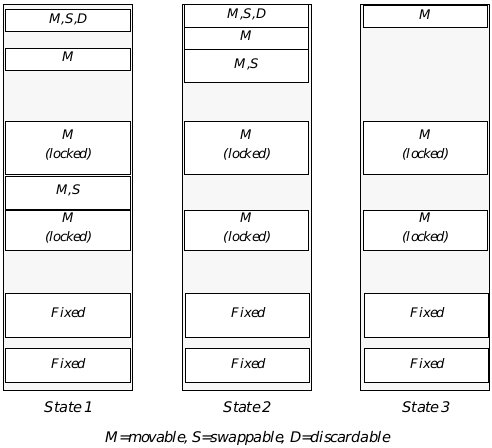

## 15 Memory Management

Managing memory in a multitasking system is complex because many 
different entities-the kernel, libraries, and applications-are all trying to 
use the same memory space. To ensure that each gets all the memory it 
needs, without having to worry about what other memory users are doing, 
GEOS provides a memory manager.

This chapter describes the memory management system used by GEOS. It 
also describes the routines applications can use to get raw memory. Before 
you read this chapter, you should be familiar with the use of handles (see 
["Handles", Chapter 14](chandle.md)).

### 15.1 Design Philosophy

Some systems make each application maintain and manage its own memory. 
In a multitasking system, this is not only difficult and time-consuming but 
also potentially dangerous, as applications can easily start trashing memory 
used by other processes. GEOS protects and relieves applications by 
providing comprehensive memory management.

The GEOS memory management system is designed to meet rigorous 
demands. Some of the requirements are

+ Independence of memory location  
Ideally, an application should not have to keep track of the address of 
each of its data items; rather, the memory management system should 
allow the application to reference its memory virtually.

+ Hardware independence  
Applications are much easier to write and maintain if they can ignore 
hardware specifics. An application should be able to specify its memory 
requirements in generic terms ("I need a package this big which behaves 
in this way") and let the memory manager worry about where it comes 
from.

+ Efficient use of memory  
A good operating system should be able to rearrange memory in order to 
gather as much space as possible. It should also be able to discard certain 
data or copy it to mass-storage devices (like a hard disk) if more memory 
is needed.

+ Management of Shared Data  
Applications should be able to share common data or code. In a 
multitasking system, proper synchronization of shared resources is 
essential to maintain data integrity.

The GEOS memory manager meets all of these needs. Applications often take 
advantage of the memory manager without trying; for example, the memory 
manager swaps methods into memory when messages need to be handled. 
Applications can also request memory at run-time, either by requesting raw 
memory from the memory manager, or by creating Virtual Memory files 
through the VM library (see ["Virtual Memory", Chapter 18](cvm.md)).

### 15.2 The Structure of Memory

The GEOS memory manager currently uses real mode memory addressing, 
and is designed to run on PCs with as little as 512K RAM. Typically, between 
30K and 160K of that is occupied by DOS. The remaining RAM is used for the 
global handle table and the global heap (described below). The GEOS kernel 
is kept in the global heap.

Because of the constraints of real-mode memory addressing, GEOS uses 
memory in segments of at most 64K. Each segment may be subdivided and 
parceled out to fill memory requests from applications. Sometimes an 
application will need a seemingly contiguous section of memory which is 
larger than 64K; in these situations, it should use the HugeArray routines 
(see [section 18.4 of chapter 18](cvm.md#184-vm-chains)).

#### 15.2.1 Expanded/Extended Memory

While GEOS is designed to run on a standard system, it makes efficient use 
of expanded and extended memory, if it is available. GEOS treats extended 
memory as a fast and convenient RAM disk, swapping blocks into the 
extended memory rather than out to a slower disk drive. This incurs none of 
the usual overhead of a RAM disk such as a directory because it is treated as 
normal memory. Expanded memory is used in a similar manner.

#### 15.2.2 Main Memory

Memory available to applications is organized in a data structure called the 
Global Heap. The size of the global heap may vary from machine to machine 
and can change from session to session, but during a single execution of 
GEOS, the heap size remains constant. Usually, the global heap occupies 
approximately 450K bytes of a 640K system.

When an application requests memory, it is allocated a "block" on the heap. 
Blocks may be of almost any size but may not be larger than 64K. (However, 
the heap is most efficient when blocks are 2K-6K in size; see ["Memory 
Etiquette"](#1531-memory-etiquette).) Every block is allocated a unique handle 
(described below) from the Handle Table; by calling a memory manager routine, the 
application can translate a handle to a conventional pointer.

When GEOS shuts down, all the blocks on the global heap are freed, even if 
they are locked or fixed. If an application will need to store the data over a 
shutdown, it should make the block part of a VM file, which it can then reopen 
when it restores from state. The GEOS kernel attaches object blocks to 
system VM files and takes care of storing them to state and restoring them 
when GEOS restarts.

##### 15.2.2.1 Blocks and Handles

GEOS segments memory into blocks. A block is simply a number of 
contiguous bytes on the global heap in which code or data may be stored. Any 
given block may be of any size but must be less than 64K, due to the 
segmented addressing scheme used by the 80x86 processors. A block's size is 
determined when it is allocated-the process that requests the memory must 
specify the desired size.

To facilitate efficient memory usage and to present all applications with 
enough memory to function, blocks are dynamic in nature. This means that 
unless a block is fixed or has been locked (see section 15.3.4 on page 555), 
there is no telling its precise address on the heap, or indeed whether it is on 
the heap at all. For this reason, applications are not given the address of an 
allocated block; rather, they are given the block's handle.

Memory handles are indexes into the global handle table. Geodes may not 
access the table directly. When they want to access the memory indicated by 
a handle, they pass the handle to the memory manager and are returned the 
segment address of the block's current location on the heap.

In addition to storing the actual address of the block, the handle table entry 
records the block's attributes, such as whether the block is discardable, 
swapable, or fixed. The memory manager uses all these attributes to 
manipulate the block.

##### 15.2.2.2 Enabling Block Access

Dynamic memory, while providing significant benefits, poses one major 
problem: What happens if a block is accessed while being moved, swapped, or 
discarded? GEOS responds to this problem with the implementation of a 
system for locking and unlocking blocks. When a block is locked on the heap, 
the Memory Manager may not move, swap, or discard it until it is unlocked. 
This locking mechanism allows applications to gain control over their 
memory during periods of access and relinquish it when it is not in active use. 
Applications, however, should not leave blocks locked for extended periods as 
this may interfere with heap compaction.

When a process wants to use a block, it instructs the memory manager to lock 
the block by calling **MemLock()**. The application passes the 
handle of the block, and the memory manager locks the block and returns a 
pointer to the block's area in the global heap. While a block is unlocked, the 
memory manager can, depending on the block's category, move the block on 
the heap, swap it to disk or extended/expanded memory, or discard it 
altogether.

##### 15.2.2.3 Types of Blocks

When a geode requests memory, it may specify how that memory is to be 
treated by the memory manager. The memory request includes a set of 
**HeapFlags** which specifies how and when the block can be 
moved. Broadly speaking, memory blocks can be divided into four categories:

+ Fixed  
A fixed block has the flag HF_FIXED set to one, and HF_DISCARDABLE 
and HF_SWAPABLE set to zero. A fixed block is allocated on the global 
heap and stays exactly where it was created until it is freed. An 
application can therefore reference data within a fixed block with normal 
pointers; the application does not need to use the memory manager to 
translate a handle into a pointer. Accessing fixed blocks is very quick 
since the memory never needs to be read from disk and the handle does 
not need to be dereferenced. However, since the memory manager cannot 
relocate fixed blocks, they tend to degrade the memory manger's 
performance; therefore, applications should generally use small amounts 
of fixed memory. Note that if a fixed block is resized, it may be moved on 
the global heap; therefore, after resizing a fixed block, a geode should 
reset its pointers within the block by dereferencing the block handle.

+ Moveable  
A moveable block has the flag HF_FIXED set to zero. When a moveable 
block is not in use (i.e. unlocked), the memory manager may move it 
within the global heap. This lets the memory manager keep the global 
heap compacted (see [section 15.2.2.4](#15224-maximizing-free-space-in-memory)). 
Accessing moveable blocks is slightly slower than accessing fixed blocks since the application 
needs to call the memory manager to lock the block and translate the 
memory handle to a pointer. In addition to being moveable, a block may 
also be swapable and/or discardable (as described below).

+ Swapable  
A swapable block has the flag HF_FIXED set to zero and HF_SWAPABLE 
set to one. If a block is marked "swapable," the memory manager has the 
option of swapping it out of main memory (either to the hard disk, or to 
extended or expanded memory) when it is unlocked. This keeps space on 
the global heap free for other requests. If an application tries to lock a 
block which has been swapped out of main memory, the memory manager 
will copy the entire block back to the global heap, then lock it normally. 
By using swapable memory, geodes can potentially use much more 
memory than the roughly 450K available in the global heap. However, 
accessing an unlocked swapable block can potentially be much slower 
than accessing a non-swapable block, as the block may have to be copied 
in from the disk.

+ Discardable  
A discardable block has HF_FIXED set to zero and HF_DISCARDABLE set 
to one. Sometimes it doesn't make sense to copy a block to the disk. For 
example, many memory blocks contain code or unchanging data which is 
read in from the disk. It would make no sense to swap these blocks back 
to disk, since the data is already there. Instead, one can mark a block 
"discardable." This indicates that when the block is unlocked, the 
memory manager can, at will, discard the block. If a process attempts to 
lock a block which has been discarded, the memory manager will return 
an error. The application can then "re-allocate" memory for that block 
(see **MemReAlloc()**) and copy the data back from the disk. 
(The system takes care of reloading discarded code resources as 
necessary.) A block can be both discardable and swapable (indeed, 
discardable blocks are usually swapable). If a block has both 
HF_DISCARDABLE and HF_SWAPABLE set, the memory manager can 
either swap the block to extended/expanded memory or discard it; it will 
not swap the block to the disk.

Fixed blocks must be declared as such when they are allocated, and they 
remain so until they are freed. However, non-fixed blocks may become or 
cease to be discardable or swapable after they are created. To enable or 
disable these characteristics, call the routine **MemModifyFlags()**.

##### 15.2.2.4 Maximizing Free Space in Memory

Moveable, swapable, and discardable blocks are allocated from the top of the 
heap using a first-fit method. Fixed blocks are allocated from the bottom of 
the heap. If there is not enough contiguous free memory to satisfy an 
allocation request, the memory manager attempts to shuffle moveable blocks 
in order to place all free memory together in one large mass.

This shuffling is called heap compaction. If the free space resulting from 
compaction still is not enough, blocks are discarded or swapped to liberate 
more free space, and the heap is again compacted. Because of the 
multitasking nature of GEOS, compaction occurs in the background and is 
invisible to both the user and applications. (See Figure 15-1.) 
The memory manager will also periodically compact memory during periods 
of low activity; this helps insure that there will be memory instantly 
available for a sudden large demand (e.g. when an application is launched).

The compaction is not arbitrary. The kernel decides which blocks to swap or 
discard based on recent usage patterns. This means, for example, that if you 
haven't used routines in a code resource for a while, that resource is more 
likely to be discarded than the resources you've accessed recently. (For this 
reason, geodes normally isolate their initialization code in one resource, 
which can be discarded later.)

One can see from Figure 15-1 that a block left locked for extended periods 
could interfere with heap compaction. Suppose, for example, that the 
moveable locked block in the middle of the heap were left locked during an 
application's entire execution. Essentially, this would cause the heap to be 
fractured into two subheaps, making compaction more difficult and possibly 
slowing the system down.

  
**Figure 15-1** Heap Compaction  
_Compaction of the Global Heap: State 1 is prior to compaction, State 2 is after 
a single pass, and State 3 is after discardable blocks have been discarded and 
swapable blocks have been swapped. Note that the fixed blocks and locked 
moveable blocks are not relocated._

All compaction, swapping, and discarding are functions of the Memory 
Manager. Applications need only indicate how much space is needed and 
when space can be freed. Applications may also resize blocks at will; if 
necessary, the memory manager will compact the heap to accommodate the 
request.

##### 15.2.2.5 Block Attributes

HeapAllocFlags, HeapFlags

Blocks are allocated with certain flags that help the Memory Manager 
manipulate memory efficiently. These flags can be found in the GEOS file 
heap.h, which should be included in all applications that plan to allocate 
memory dynamically with the memory manager routines.

The flags fall into two categories: those used when the block is allocated 
(stored in a record called **HeapAllocFlags**) and those used to describe the 
block as it is manipulated (stored in a record called **HeapFlags**).

The **HeapAllocFlags** record is used to determine what qualities the memory 
manager should give the block when it is first allocated. Some of these flags 
are also relevant when memory is being reallocated. These qualities include:

HAF_ZERO_INIT  
Upon allocation, initialize data in block to zeros.

HAF_LOCK  
Upon allocation, the block should be locked on the global heap. 
Use **MemDeref()** to get a pointer to the block.

HAF_NO_ERR  
Do not return error codes; system error if block cannot be 
allocated. Use of this flag is strongly discouraged.

HAF_OBJECT_RESOURCE  
This block is an object-block. This is set by the system only.

HAF_UI  
If both HAF_OBJECT_RESOURCE and HAF_UI are set, the 
memory manager will set the block to allow the application's UI 
thread to manipulate objects in the block. This is set by the 
system only.

HAF_READ_ONLY  
This block's data will not be modified.

HAF_CODE  
This block contains executable code.

HAF_CONFORMING  
If this block contains code, the code may be run by a less 
privileged entity. If the block contains data, the data may be 
accessed or altered by a less privileged entity.

Once a block is allocated, it has certain properties that govern how the 
Memory Manager manipulates it. These properties are determined by the 
**HeapFlags**. The **HeapFlags** also contain data about whether the block has 
been swapped or discarded. These flags are stored in the block's handle-table 
entry, so they can be retrieved without locking the block. To retrieve the flags, 
call the routine **MemGetInfo()** with the flag MGIT_FLAGS_AND_LOCK_COUNT. 
(See **MemGetInfo()**) Some of the flags can be changed after the block has 
been allocated; for details, see **MemModifyFlags()**. The flags include

HF_FIXED  
The block will not move from its place in the global heap until 
it is freed. If this flag is off, the memory manager may move the 
block when it is unlocked. If it is on, the block may not be 
locked. This flag cannot be changed after the block has been 
allocated.

HF_SHARABLE  
The block may be locked by geodes other than the owner. This 
flag can be changed with **MemModifyFlags()**.

HF_DISCARDABLE  
If the block is unlocked and space is needed, the memory 
manager may discard it. This flag can be changed with 
**MemModifyFlags()**.

HF_SWAPABLE  
If the block is unlocked and space is needed, it may be swapped 
to expanded or extended memory or to the hard disk. This flag 
can be changed with **MemModifyFlags()**.

HF_LMEM  
The block is a local-memory block, managed by the LMem 
module (see ["Local Memory", Chapter 16](cvm.md)). The flag is set 
automatically by **LMemInitHeap()**. It can be changed with 
**MemModifyFlags()**; however, an application should not 
change this flag.

HF_DISCARDED  
The block has been discarded by the memory manager. Only 
the system can set or clear this flag.

HF_SWAPPED  
The block has been swapped to extended or expanded memory 
or to the hard disk. Only the system can set or clear this flag.

### 15.3 Using Global Memory

When an application needs more raw memory at run-time, it can use the 
memory manager kernel routines to allocate, use, and free new blocks. An 
application can also create a Virtual Memory file to get memory with more 
advanced functionality, such as the ability to save to a disk file (see "Virtual 
Memory," Chapter 18). However, one must understand the raw memory 
routines in order to use VM files.

If you will be storing small pieces of information in a block, you should create 
a local memory heap (a special kind of memory block). LMem heaps are also 
useful for storing arrays of information or for storing objects. For more 
information, see ["Local Memory," Chapter 16](clmem.md).

#### 15.3.1 Memory Etiquette

The GEOS memory manager tries to fulfill every memory request. It does not 
enforce many rules on how the geodes should use memory. This gives each 
geode maximum flexibility, but it also means that the geodes have to take 
responsibility for their behavior; they must see to it that their memory usage 
does not degrade the system's performance.

First and foremost, applications should never use memory which has not 
been assigned to them by the memory manager. Unlike some operating 
systems (e.g. UNIX), GEOS does not enforce divisions between memory 
spaces. This allows GEOS to run on PCs which do not provide protected-mode 
access. It means, however, that the system will not stop an application from 
loading a bad address into a pointer, accessing that address, and thus writing 
to another memory space. An application should access only that memory 
which the memory manager assigns to it directly (via calls to memory 
routines or data-space assigned at startup) or indirectly (through other 
libraries, such as the VM library). This also means that you should not save 
pointers to movable memory after unlocking the memory block. If you are not 
careful, you can accidently access memory which no longer contains your 
data, with sometimes-fatal results.

Another rule is to minimize the amount of memory you keep locked at a time. 
When memory is locked, the memory manager cannot move it on the global 
heap or swap it out of memory. This can result in the heap becoming 
fragmented, which in turn makes it more likely that memory requests will 
fail. Keep memory unlocked as much as possible. It's worthwhile to unlock 
memory even if you'll be locking it again very soon; this gives the memory 
manager a chance to compact the heap. If you have some data which you will 
need locked for long periods of time, it is best to put it in a fixed block, since 
fixed blocks are allocated from the bottom of the global heap and thus cause 
less fragmentation. Of course, you should free the fixed block as soon as 
possible.

Try to have as few blocks locked at a time as possible. Every locked block 
increases the danger that the heap will be unable to comply with a memory 
request. Try to organize your use of memory to minimize the number of 
blocks you will have to keep locked at a time.

In the same vein, try to keep the amount of memory you have on the global 
heap to a minimum. You should declare all of your non-fixed memory as 
swappable and/or discardable. Remember, you can use **MemModifyFlags()** 
to change these characteristics; during a timing-critical period, you could 
have a block set as non-swappable, and then make it swappable again as soon 
as timing becomes less important. If you use Virtual Memory files, the VM 
Manager does much of this for you.

Try to keep your memory blocks small. Although memory blocks can, in 
principle, grow to 64K, the memory manager is best suited for dealing with 
blocks in the 2K-6K range. If you need a contiguous data space which grows 
beyond 8K in size, you should use the Huge Array mechanism (see [section 
18.4 of chapter 18](cvm.md#184-vm-chains)), which automatically (and almost transparently) divides 
a large data space across several smaller memory blocks. If you use many 
small data items, you should use the Database library, which automatically 
distributes data items among different memory blocks, keeping each block 
near the optimum size. (See ["Database Library", Chapter 19](cdb.md)).

#### 15.3.2 Requesting Memory

MemAlloc(), MemAllocSetOwner(), MemReAlloc()

When you need a block of raw memory, you must use one of the kernel's 
memory allocation routines. You also must use kernel memory routines to 
change the size of a block or to reallocate space for a discarded block.

**MemAlloc()** creates a block and assigns a handle to it. The routine must be 
passed the size (in bytes) of the block to be allocated, along with the 
**HeapAllocFlags** and **HeapFlags** for that block. **MemAlloc()** will set the 
block's owner as the owner of the thread that called it. It will return the 
handle of the newly-allocated block. 

**MemAllocSetOwner()** is the same as **MemAlloc()**, except that the caller 
explicitly sets the owner of the new block by passing the handle of the owning 
geode. Like **MemAlloc()**, it returns the handle of the new block. This is 
commonly used by drivers and shared libraries, which allocate memory 
owned by the geode which calls them. When the block's owner exits, the block 
will be freed, even if the block's creator is still running.

If you request a fixed block or pass the flag HAF_LOCK, the block will be 
allocated locked on the heap. However, the routine will still return just the 
memory handle. To translate this handle to a pointer, call the routine 
**MemDeref()**. **MemDeref()** is passed a block's handle and returns a pointer 
to the block (or a null pointer if the block has been discarded).

To change the size of a block, call the routine **MemReAlloc()**. This routine is 
also used to allocate memory for a block that has been discarded. The routine 
is passed the memory handle, the new size, and the **HeapAllocFlags**; it 
returns the block's memory handle. You can reallocate a fixed or locked block; 
however, the block may be moved on the global heap to satisfy the request. 
(This is the only way a fixed block can move.) As with **MemAlloc()**, you can 
request that the memory manager lock the block after reallocating it; you will 
then have to call **MemDeref()** to get the address of the block. Note that if the 
new size is smaller than the original size, the routine is guaranteed to 
succeed, and the block will not move from its current position. Reallocating a 
block to zero bytes discards the block but preserves its handle; the block can 
then be reallocated later.

If the memory manager is unable to accommodate a request, it will return an 
error condition. The requestor can prevent error messages by passing the flag 
HAF_NO_ERR; this will result in a system error if the memory cannot be 
allocated. Passing HAF_NO_ERR is therefore strongly discouraged.

#### 15.3.3 Freeing Memory

MemFree()

When you are done using a block, you should free it. Every block takes up 
space in the global handle table; if blocks are not freed, the handle table may 
fill up, causing a system error. Furthermore, non-swapable, non-discardable 
blocks take up space in the global heap until they are freed.

To free a block, call **MemFree()** and pass the handle of the block to be freed. 
The block will be freed even if it is locked. Therefore, if the block can be used 
by other threads, you should make sure no other thread has locked the block 
before you free it.

You can also set a reference count for a block. When a block's reference count 
drops to zero, the memory manager will automatically free it. This is useful 
if several threads will be accessing the same block. For more information, see 
["The Reference Count"](#1538-the-reference-count).

When a geode exits, all blocks owned by it are automatically freed.

#### 15.3.4 Accessing Data in a Block

MemLock(), MemUnlock()

Because the memory manager is constantly reorganizing the global heap, 
applications must have a way of making sure a block stays put when they 
want to use it. Applications must also have a way of recalling swapped blocks 
when they are needed.

These requirements are met by the memory manager's locking scheme. 
Whenever you need to access data in a non-fixed block, you must first lock it. 
This will cause the memory manager to copy the block back into the global 
heap if it had been swapped; the memory manager will not move, swap, or 
discard a block while the block is locked.

Any block may be locked several times. Each lock increments the block's lock 
count (to a maximum of 255 locks per block), and each unlock decrements it. 
The memory manager can only move the block when the lock count is zero.

One warning about locking blocks: Do not try to lock a block which was 
allocated as fixed. Attempting to do so will result in a system error. If you 
need to translate a fixed-block handle to a pointer, call **MemDeref()**.

**MemLock()** locks a block on the heap. It is passed the handle of the block; it 
returns a pointer to the start of the block on the heap. If the block has been 
discarded, **MemLock()** returns a null pointer.

Immediately after you are done using a block, you should unlock it by calling 
**MemUnlock()**. It is better to lock and unlock the same block several times 
than to retain control of it for an extended period, as locked blocks degrade 
the performance of the heap compaction mechanism. To unlock a block, call 
**MemUnlock()**, passing the handle of the block to be unlocked. 
**MemUnlock()** decrements the lock count.

A block may be locked by any of the threads run by its creator; if the block is 
sharable, it may be run by any other thread as well. There is nothing in the 
**MemLock()** routine to prevent different threads from locking a block at the 
same time, causing potential synchronization problems. For this reason, if 
threads will be sharing a block, they should use the synchronization routines 
(see [section 15.3.6](#1536-data-access-synchronization)).

#### 15.3.5 Accessing Data: An Example

Code Display 15-1 shows how to allocate a block, lock it, access a word of data 
in the block, and unlock the block. This example shows the basic principles 
of using blocks.

---
Code Display 15-1 Allocating and Using a Block
~~~
/*
 * Variable Declarations
 */

MemHandle 	myBlockHandle;
char 	charArray[50], *blockBaseAddress;

/* First, we allocate a block of the desired size. Since we'll use the block right
 * away, we allocate the block already locked.
 */
myBlockhandle = MemAlloc(        /* MemAlloc returns the block handle */
		2048,                    /* Allocate 2K of memory */
		HF_SWAPABLE,             /* HeapFlags: Make block swapable */
		HAF_ZERO_INIT|HAF_LOCK); /* HeapAllocFlags: Initialize
						 * the memory to zero & lock it */

/* The block is already locked on the global heap. However, we do not have the
 * block's address; we just have its handle. Therefore, we need to call a routine
 * to dereference the handle. */
blockBaseAddress = (char *) MemDeref(myBlockHandle); /* Returns a ptr to base of
						 * block */

/* Enter some data in the block */
strcpy(blockBaseAddress,
	"I can resist anything except temptation.\n   --Wilde"

/* We're done with the block for the moment, so we unlock it. */
MemUnlock(myBlockHandle); /* blockBaseAddress is now meaningless */

/* Here we do some other stuff . . . */

/* Now we want to use the block again. First we have to lock it. */
blockBaseAddress = (byte *) MemLock(myBlockHandle);			/* Returns a ptr to locked 
						 * block */

/* Read a string from the block: */
strcpy(charArray, blockBaseAddress);

/* We're done with the block, so we free it. Note that we can free the block
 * without unlocking it first.
 */
MemFree(myBlockhandle); /* myBlockHandle is now meaningless */
~~~

#### 15.3.6 Data-Access Synchronization

MemThreadGrab(), MemThreadGrabNB(), MemThreadRelease(), 
MemLockShared(), MemUnlockShared(), MemLockExcl(), 
MemDowngradeExclLock(), MemUpgradeSharedLock(), 
MemUnlockExcl(), HandleP(), HandleV(), MemPLock(), MemUnlockV()

Blocks can have the property of being sharable-that is, the same block may 
be locked by threads owned by several different geodes. However, this can 
cause data synchronization problems; one application can be changing data 
while another application is trying to use it. To prevent this, GEOS provides 
semaphore routines. Only one thread can have the block's semaphore at a 
time. When an application wants to use a shared block, it should call a 
routine to set the semaphore. Once the routine returns, the application can 
use the block; when it is done, it should release the block's semaphore so 
other applications can use the block.

Note that use of semaphores is entirely voluntary by each application. Even 
if thread A has the semaphore on a block, thread B can call **MemLock()** on 
the block and start changing it. However, all threads using shared blocks 
ought to use the semaphore routines to prevent confusion.

There are several different sets of routines which can be used to control a 
block's semaphore. The different sets of routines make different trade-offs 
between faster operation and increased flexibility. Any one block should be 
accessed with only one set of routines; different threads should all be using 
the same routines to access a given block, and a thread should not switch 
from one set of routines to another for a particular block. If this rule isn't 
followed, results are undefined. All of these routines access the HM_otherInfo 
word of the handle table entry; if the block will be locked by any of these 
routines, you must not alter that word. None of these routines is used to 
access object blocks; instead, special object-block locking routines are 
provided.

Most geodes should use **MemThreadGrab()**, **MemThreadGrabNB()**, and 
**MemThreadRelease()** to access sharable blocks. These routines provide 
the maximum protection against deadlock in exchange for a slightly slower 
execution. 

**MemThreadGrab()** gives the thread the semaphore for the block in 
question and locks the block. It is passed the handle of the block and returns 
the block's address on the global heap. If no thread has the block's 
semaphore, it gives the semaphore to the calling thread. If the calling thread 
already has the semaphore, a "semaphore count" is incremented; the thread 
will not release the semaphore until it has been released as many times as it 
has been grabbed. (For example, two different objects run by the same thread 
could each grab the semaphore; the semaphore would not be released until 
each object called **MemThreadRelease()**.) If another thread has the 
semaphore, **MemThreadGrab()** blocks until it can get the semaphore; it 
then increments the semaphore, locks the block, and returns the address.

**MemThreadGrabNB()** is the same as **MemThreadGrab()**, except that it 
never blocks. If you call **MemThreadGrabNB()** while another thread has 
the semaphore, the routine will immediately return an error. 
**MemThreadGrabNB()** takes the handle of the block; it increments the 
semaphore, locks the block, and returns the block's address on the heap.

**MemThreadRelease()** releases a block grabbed by either 
**MemThreadGrab()** or **MemThreadGrabNB()**. It is passed the block's 
handle. It unlocks the block and decrements the block's semaphore. 

One common situation is that several threads may need to read a block but 
only once in a while will an application need to write to the block. In this case, 
there is no synchronization problem in having several readers at once; 
however, if any thread is writing, no other thread should be reading or 
writing. For this situation, GEOS provides this set of **MemLock** routines: 
**MemLockShared()**, **MemUnlockShared()**, **MemLockExcl()**, and 
**MemUnlockExcl()**. 

These routines, like the others, maintain a queue of threads which have 
requested thread access. The difference is that any number of readers can 
have access at once. When a thread wants read access, it calls 
**MemLockShared()**. If the queue is empty and the block is unlocked or 
locked for reading, the routine returns and the thread is given shared access; 
otherwise, the thread is blocked, and the request goes on the queue. When a 
routine is finished reading the block, it should call **MemUnlockShared()**.

When a routine needs to write to a block, it should call **MemLockExcl()**. If 
nobody has locked the block (and thus the queue is empty), the thread will 
immediately be given exclusive access; otherwise, the thread will block, and 
the request will go on the queue. When the thread no longer needs write 
access, it should call **MemUnlockExcl()**.

When all threads with access to a block have released their locks, the queued 
thread with the highest priority will be awakened and given the lock on the 
block. If that thread had requested shared access, all other threads on the 
queue that had requested shared access will also be awakened and given 
locks.

A thread can change its lock from shared to exclusive or vice versa. If a 
thread has an exclusive lock on a block, it can change the lock to shared by 
calling **MemDowngradeExclLock()**. This routine takes one argument, 
namely the block's global handle. It changes the lock to "shared" and wakes 
up all sleeping threads which are waiting for shared access. For convenience, 
**MemDowngradeExclLock()** returns the address of the block; however, the 
block is guaranteed not to move.

If a thread has shared access and wants exclusive access, it can call 
MemUpgradeSharedLock(). If the thread has the only lock on the block, 
its lock will be changed to "exclusive" (even if there are writers on the queue). 
If any other threads have the block locked, the routine will release the 
thread's lock and put the thread on the queue. When the thread comes to the 
head of the queue, the routine will wake the thread and give it an exclusive 
lock. The routine returns the block's address on the global heap. Note that 
the block may be altered or moved during this call if the call blocked.

Once a thread has been given a shared lock, there is nothing to prevent it 
from altering (or even freeing) the block. The routines rely on good 
citizenship by the threads using them.Also, if a thread isn't careful, there is 
a great danger of deadlock. If (for example) a thread requests exclusive access 
to a block when it already has access, the thread will deadlock: it will block 
until the threads with access all release the block, but it can't release its own 
lock because it is blocked. If you may need to have multiple locks on a block, 
use the **MemThread** routines, which check for these situations.

There are other sets of routines which can be used to access a block's 
semaphore. As noted, a block should be accessed via just one set of routines. 
These routines provide less protection against deadlock than the 
MemThread routines do; however, they have a slightly faster response time.

A more primitive group of routines is **HandleP()**, **HandleV()**, 
**MemPLock()**, and **MemUnlockV()**. These routines function much like the 
**MemThread** routines. **HandleP()** grabs the block's semaphore and returns; 
it does not lock the block. This makes it very useful for working with fixed 
blocks (which cannot be locked). **HandleV()** releases the block's semaphore 
and returns; it does not unlock the block. Note, however, that **HandleP()** will 
block if any thread controls the semaphore, even the thread that called 
**HandleP()**. If a thread calls **HandleP()** while it controls the semaphore, it 
will block until the semaphore is released, but it can't release the semaphore 
because it has blocked. Thus, the thread will deadlock, and no other thread 
will be able to get the semaphore. Therefore, a thread should use **HandleP()** 
only if it is very confident that it will never try to double-set the semaphore.

Usually, when a thread grabs a block's semaphore, it needs to have the block 
locked on the heap. For this reason, GEOS provides the routines 
**MemPLock()** and **MemUnlockV()**. **MemPLock()** simply calls **HandleP()** 
and then calls **MemLock()**. **MemUnlockV()**, correspondingly, calls 
**MemUnlock(** and then calls **HandleV()**. These routines are completely 
compatible with **HandleP()** and **HandleV()**; for example, a thread could 
grab and lock a block with **MemPLock()**, then unlock it with **MemUnlock()** 
and release it with **HandleV()**.

**HandleP()** and **HandleV()** are general-purpose handle routines. They can 
be called on any type of global handle. For example, if two threads need to 
synchronize their access to a file, they can lock and unlock the file handle 
with **HandleP()** and **HandleV()**. However, they are most commonly used 
with memory blocks.

#### 15.3.7 Retrieving Block Information

MemDeref(), MemGetInfo(), MemModifyFlags(), 
HandleModifyOwner(), MemModifyOtherInfo()

GEOS offers several routines to retrieve and change information about a 
block. Each of these routines has a full entry in the Routine Reference Book.

**MemDeref()** is passed the handle of a block on the global heap; it returns 
the block's address on the global heap. As noted above, this routine is useful 
when you allocate a fixed or locked block. If the block has been discarded, it 
returns a null pointer. 

**MemGetInfo()** is a general-purpose block information routine. It is passed 
two arguments: the handle of the block, and a member of the 
MemGetInfoType enumerated type. The return value is always 
word-length; however, its significance depends on the **MemGetInfoType** 
value passed:

MGIT_SIZE  
Returns the size of the memory block (in bytes).

MGIT_FLAGS_AND_LOCK_COUNT  
Upper byte is the number of locks on the block; lower eight bits 
are the block's [HeapFlags record](#15225-block-attributes).

MGIT_OWNER_OR_VM_FILE_HANDLE  
If the block is attached to a GEOS Virtual Memory file, 
**MemGetInfo()** returns the VM file handle. Otherwise, it 
returns the **GeodeHandle** of the owning thread.

MGIT_ADDRESS  
Returns the block's segment address, if it is on the global heap; 
otherwise, it returns zero. If the block is resized or is not locked, 
the address may change without warning. Note that the 
segment address is returned as a word, not as a pointer; this is 
of limited utility in C.

MGIT_OTHER_INFO  
Returns the HM_otherInfo word from the block's handle table 
entry. The usage of this word varies depending on the block's 
nature; for example, semaphore routines use this word.

MGIT_EXEC_THREAD  
This is useful for object blocks only. Returns the handle of the 
thread executing methods for objects in the block.

**MemModifyFlags()** is used to change a block's **HeapFlags** record. It takes 
three arguments: The handle of the block, the **HeapFlags** to turn on, and the 
**HeapFlags** to clear. It returns nothing. Not all **HeapFlags** can be changed 
after a block is created; only HF_SHARABLE, HF_DISCARDABLE, 
HF_SWAPABLE, and HF_LMEM can be so changed. 

**HandleModifyOwner()** changes the geode owning a given block. It takes 
two arguments, namely the handle of the block and the handle of the new 
owner. It returns nothing. If the block is not sharable, only the owner of a 
block can change the block's owner.

**MemModifyOtherInfo()** changes the HM_otherInfo word of the block's 
handle table entry. It takes two arguments: The handle of the block, and one 
word of data to store in the HM_otherInfo field. It returns nothing.

#### 15.3.8 The Reference Count

MemInitRefCount(), MemIncRefCount(), MemDecRefCount()

Sometimes several different threads will need to look at the same block of 
memory. For example, a single thread might need to send the same 
information to objects in several different threads. The simplest way to do 
that would be to write the information in a global memory block and pass the 
block's handle to the objects. However, it's a bad idea to allocate global blocks 
for longer than necessary, since this uses up handles. It therefore becomes 
important to free these blocks when everyone's done with them.

GEOS provides a simple mechanism for managing this. Every block can have 
a reference count. When a reference count for a block reaches zero, the block 
is automatically freed. That way, for example, if an object needed to send the 
same information to five objects, it could give the block a reference count of 
five and send its handle to the objects. Each object, when it finished accessing 
the data, would decrement the reference count. When all five objects had 
decremented the reference count, the block would be freed.

You must be careful about a few things while using the reference count 
mechanism. First of all, the reference count is kept in the HM_otherInfo field 
of the block's handle table entry. For this reason, you must not use the 
reference count routines if you will be using HM_otherInfo for any other 
purpose. In particular, you may not use any of the data-access 
synchronization routines described in section 15.3.6, since all of those 
routines store the semaphore in HM_otherInfo. You should generally use the 
reference count only for blocks that will not be changed until they are freed, 
so that data synchronization will not be an issue.

Second, once the reference count is decremented to zero, the block is 
immediately freed. Once a block is freed, its handle may be used for 
something else. If you try to increment or decrement the reference count of 
the block, the results are undefined. For this reason, you should make sure 
that the reference count does not reach zero until all threads are done with 
the block. One way to arrange for this is to have a single thread do all the 
decrementing. For example, an object might set the reference count to five, 
and send the handle to five other objects. Each of these objects, when finished 
with the block, would send a message back to the first object, which would 
decrement the reference count. As an alternative, you could have each of the 
objects decrement the count itself when it was finished. In this case, the first 
object would have to assume that the block was freed as soon as it sent out 
all of the messages, since it would have no way of knowing when the other 
objects would be finished with the block.

Finally, since the reference count is stored in HM_otherInfo, it has a 
maximum value of . If you try to increment the reference count past 
this value, the results are undefined. This will not be a problem for most 
applications.

To set up a reference count for a block, call **MemInitRefCount()**. This 
routine takes two arguments: the handle of a global memory block, and the 
reference count for that block. The reference count must be greater than zero. 
**MemInitRefCount()** sets the block's HM_otherInfo field to the specified 
reference count. **MemInitRefCount()** does not return anything.

To increment the reference count, call **MemIncRefCount()**. This routine is 
passed a single argument, namely the handle of the global memory block. 
The routine simply increments HM_otherInfo. It does not return anything.

To decrement the reference count, call **MemDecRefCount()**. This routine is 
passed the handle of a global memory block. It decrements the block's 
HM_otherInfo field. If the field reaches zero, **MemDecRefCount()** will 
immediately free the block. The routine does not return anything.

### 15.4 malloc()

malloc(), calloc(), realloc(), free()

GEOS provides support for the Standard C memory allocation routines. 
However, support is limited by the nature of the 80x86 and the GEOS memory 
management system.

A geode can request memory with malloc() or calloc(). When a geode does 
this for the first time, the memory manager will allocate a fixed block and 
return a pointer to within the fixed block. (This block is actually a special 
kind of LMem heap.) Because the memory is in a fixed block, the geode does 
not need to access it with handles; it can use the pointer directly. If the block 
fills up, the manager can allocate another fixed block for these requests.

However, there are some problems with this. The main problem is that fixed 
blocks degrade the memory manager's performance. The more a geode uses 
**malloc()**, the more memory is tied up in fixed blocks. And, as always, 
contiguous memory is limited to 64K by the 80x86 segmented addressing 
scheme.

Most of the time, geodes should use other types of memory allocation. For 
allocating small chunks of data, applications should use **LMem** routines or 
techniques built on top of them (database items, chunk arrays, etc.); for 
larger chunks of memory, applications should use memory manager routines 
or HugeArrays. However, to help writers port C code to GEOS, **malloc()** and 
its relatives are available.

To get a stretch of contiguous memory, use the routines **malloc()** or **calloc()**. 
**malloc()** takes one argument, a size in bytes; it returns a void pointer to that 
many bytes of fixed memory. **calloc()** takes two arguments: a number of 
structures, and the size of each such structure. It allocates enough memory 
for that many structures and returns a void pointer to the memory. Both 
**malloc()** and **calloc()** zero-initialize the memory when they allocate it.

If a routine wants to change the size of memory allocated with **malloc()** or 
**calloc()** it can use **realloc()**. **realloc()** takes two arguments: a pointer to a 
piece of memory allocated with **malloc()** or **calloc()**, and a new size in bytes. 
It returns a void pointer to the memory, which may have been moved to 
satisfy the request. If it could not satisfy the request, it returns a null pointer, 
and the original memory is untouched. Note that the pointer you pass 
**realloc()** must be the same pointer that was returned by **malloc/calloc**; if 
(for example) you allocate 100 bytes and are returned 008Bh:30h, and try to 
resize it by passing 008Bh:40h to **realloc()**, inappropriate memory will be 
affected, and the results are undefined.

If you decrease the size of a memory section with **realloc()**, the routine is 
guaranteed to succeed. If you increase the size, it may fail; if it does succeed, 
the new memory will not be zero-initialized. Reallocating a block down to 
zero memory is the same as freeing it. You can pass a null pointer to **realloc()** 
along with the size; this makes **realloc()** function like **malloc()**. 

When you are done with memory allocated by **malloc**-family routines, you 
should call **free()** to free the memory for other **malloc()** calls. As with 
**realloc()**, you must pass the same pointer that you were originally given.

[Handles](chandle.md) <-- &nbsp;&nbsp; [table of contents](../concepts.md) &nbsp;&nbsp; --> [Local Memory](clmem.md)
