## 24 Drawing Graphics

This chapter describes the commands used to draw things on a display. 
["Graphics Environment," Chapter 23](cgraph.md), explains how to set up the display 
necessary to use these commands.

You must have read the previous chapter; in particular, you should be 
familiar with GStates. To use certain commands, you should also be familiar 
with the GEOS fixed point number formats.

### 24.1 Drawing Goals

The graphics system has a set of graphic commands capable of describing 
anything that might ever be drawn; at the same time, the command set 
should not be overwhelming. Common routines must be heavily optimized: if 
the line or text drawing routines are slow, the system will be slowed by a 
similar amount. Commands for drawing the various shapes must exist for all 
the contexts discussed in the previous chapter. In GEOS, you use the same 
graphics commands whether you are drawing to a display, describing a 
GString (which can be sent to a printer), drawing to a bitmap, or describing 
a path. This simplifies graphics programming a great deal.

### 24.2 Shapes

Depending on how much experience you have with the GEOS graphics 
system, you may have some idea already about what sorts of shapes can be 
drawn and the ways to draw them. Most of these commands have names like 
GrDrawShape() or GrFillShape() (e.g. GrDrawRect(), GrFillEllipse()). 
Normally, a command of the form GrDrawShape() draws the outline of a 
shape, while GrFillShape() fills in the interior of the shape. Commands 
with names like GrSetAttribute() (e.g. GrSetAreaColor()) change the 
color, fill pattern, and other attributes of shapes to be drawn. Most of these 
commands are passed a GState. The drawing commands are also passed 
coordinates at which to draw.

For many of these commands, there are GString opcodes which represent the 
command in a GString. Also, the arguments used when drawing these shapes 
often correspond to instance data specific to the Graphic Object which draws 
that shape.

Most of these routines work with standard coordinates, measured in 
typographer's points. For geodes that need to make drawings which are 
precise to a fraction of a point, four routines have been set up to use 
WWFixed coordinates, and are thus accurate to a fraction of a point. These 
routines are GrDrawRelLineTo(), GrRelMoveTo(), 
GrDrawRelCurveTo(), and GrDrawRelArc3PointTo(). Geodes may use 
these routines to draw the outline of any conceivable two-dimensional shape. 
To create a precise, filled shape, use these routines to describe a path and 
then fill the path.

#### 24.2.1 Dots

GrDrawPoint(), GrDrawPointAtCP()

A point is the smallest thing drawable; it will always appear as a single pixel. 
The point's position is defined by a standard coordinate pair. Points are 
drawn using line attributes. After drawing a point, the pen position will be 
at the point's coordinates.

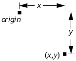  
**Figure 24-1** Point  
_A point is defined by its coordinates._

GrDrawPoint() draws a point at the passed coordinate pair.  
GrDrawPointAtCP() draws a point at the current pen position.

#### 24.2.2 Lines

GrDrawLine(), GrDrawLineTo(), GrDrawRelLineTo(), 
GrDrawHLine(), GrDrawHLineTo(), GrDrawVLine(), 
GrDrawVLineTo()

A line is simply a line segment that connects two points. Lines are drawn 
using the current line attributes stored with the GState. The new pen 
position becomes the last passed coordinate pair.

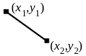  
**Figure 24-2** Line  
_A line is defined by its endpoints._

GrDrawLine() draws a line between points. GrDrawLineTo() draws a line 
from the current pen position to the passed point. GrDrawHLine() draws a 
horizontal line between two points. These two points share the same y 
coordinate (thus the line is horizontal). GrDrawHLineTo() draws a 
horizontal line from the current pen position to a passed x coordinate. 
GrDrawVLine() draws a vertical line between two points which share a 
common x coordinate. GrDrawVLineTo() draws a vertical line from the 
current pen position to a passed y coordinate. The GrDrawH-() and 
GrDrawV-() routines save space compared to GrDrawLine() or 
GrDrawLineTo(), since fewer coordinates are necessary to define the line.

GrDrawRelLineTo() draws a line from the current pen position to the point 
at the specified x and y offset from the starting position. This routine takes 
very precise coordinates, and is useful for describing paths.

#### 24.2.3 Rectangles

GrDrawRect(), GrDrawRectTo(), GrFillRect(), GrFillRectTo()

Rectangles are defined by four coordinates which can be thought of as either 
defining the rectangle's left, top, right, and bottom bounds or as specifying 
two opposite corners of the rectangle.

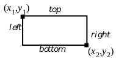  
**Figure 24-3** Rectangle

GrDrawRect() draws the outline of a rectangle using the passed 
coordinates. GrDrawRectTo() draws the outline of a rectangle using the 
current pen position as one of the defining points; the pen position is 
unchanged by this operation. These functions draw the rectangle outline 
using the current line attributes. GrFillRect() draws a filled rectangle 
defined by the passed coordinates. GrFillRectTo() fills a rectangle of which 
the pen position is one corner. GrFillRect() and GrFillRectTo() use the 
GState's area attributes. They do not draw a border around the rectangle; if 
you want a bordered rectangle, call GrFillRect() and follow it with 
GrDrawRect(). Note that if the order of these operations if reversed, the fill 
may obscure the draw.

#### 24.2.4 Ellipses

GrDrawEllipse(), GrFillEllipse()

Ellipses are defined by their bounding rectangles. The pen position becomes 
the first coordinate pair passed. Circles are ellipses with heights equal to 
their widths.

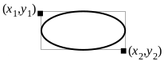  
**Figure 24-4** Ellipse  
_An ellipse with its bounding rectangle._

GrDrawEllipse() draws the outline of an ellipse using the current line 
drawing attributes. GrFillEllipse() fills the ellipse's area using the current 
area attributes.

#### 24.2.5 Elliptical Arcs

GrDrawArc(), GrFillArc()

An arc is a partial ellipse. An arc is defined in terms of its base ellipse, the 
angle at which to start drawing the arc, and the angle at which to stop 
drawing. Angles are counted in degrees counter-clockwise with 0° 
corresponding to the positive x axis (i.e., "3 o'clock").

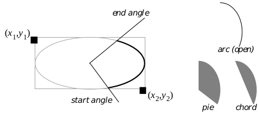  
**Figure 24-5** Elliptical Arc

GrDrawArc() draws the outline of an elliptical arc, a curved line. It does so 
using the GState's current line attributes. GrFillArc() fills the arc. There 
are two ways to fill an arc: you can fill in the wedge described by the arc, or 
you can fill just the region between the arc and its chord; set the style with 
an ArcCloseType value. 

#### 24.2.6 Three-Point Arcs

GrDrawArc3Point(), GrDrawArc3PointTo(), GrFillArc3Point(), 
GrFillArc3PointTo(), GrDrawRelArc3PointTo()

The graphics system allows another way to specify arcs. Given two endpoints 
and one arbitrary point, there is a unique circular arc which has those 
endpoints and passes through that arbitrary point. The closer the arbitrary 
point is to the line connecting the endpoints, the shallower the described arc.

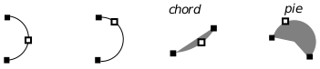  
**Figure 24-6** Three-point Arcs

GrDrawArc3Point() draws the three-point arc corresponding to the passed 
points. The second endpoint passed becomes the new pen position. 
GrDrawArc3PointTo() draws a three-point arc using the present pen 
position as one of the endpoints; the other endpoint becomes the new pen 
position. GrFillArc3Point() fills a three-point arc. GrFillArc3PointTo() 
fills an arc that has the present pen position as an endpoint.

The GrDrawRelArc3PointTo() routine draws a three-point arc where the 
pen position is the first point and the other two points are specified as offsets 
from that position. This routine takes WWFixed coordinates for precision 
drawing. GrFillRelArc3PointTo() fills a three-point arc where the pen 
position is the first point and the other two points are specified as offsets from 
that position.

One time when programmers might especially want to use three point arcs 
is in the construction of paths. An important consideration when 
constructing paths is making sure that the various segments of the path are 
connected; that is, that they share endpoints. When specifying elliptical arcs, 
the endpoints are never explicitly defined. Thus, it is ambiguous in some 
cases whether an arc is supposed to be connected to something else. Because 
three-point arcs include their endpoints with their definition, there is no such 
ambiguity (see Figure 24-7).

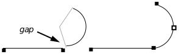  
**Figure 24-7** Advantages of the Three-point Arc  
_The elliptical arc doesn't start quite where the line leaves off, perhaps due to 
a poorly calculated angle. The three-point arc, defined in terms of its 
endpoints, is certain to have an endpoint in common with the line._

#### 24.2.7 Rounded Rectangles

GrDrawRoundRect(), GrDrawRoundRectTo(), GrFillRoundRect(), 
GrFillRoundRectTo()

Rounded rectangles are defined in terms of their bounding rectangle and the 
radius of the circle used to compute the rounded corners. The smaller the 
corner circle is, the sharper the rectangle's corners will be. A larger corner 
circle results in a more rounded corner with more area taken away.

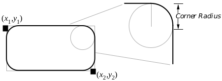  
**Figure 24-8** Rounded Rectangle  
_Pictured here is a rounded rectangle, with detail showing the circle whose 
radius defines the rounded rectangle's corner curvature._

GrDrawRoundRect() draws the outline of a rounded rectangle with the 
passed bounding rectangle and corner circle dimensions. The drawing 
position is set to the first passed coordinate pair. GrDrawRoundRectTo() 
draws the outline of the rounded rectangle for which the current position is 
one corner of the bounding rectangle. The current position is unaffected by 
this operation. GrDrawRoundRect() and GrDrawRoundRectTo() use 
the current line drawing attributes. GrFillRoundRect() fills a rounded 
rectangle with passed bounding rectangle and corner radius using the 
current area attributes. GrFillRoundRectTo() fills a rounded rectangle 
that has the current position as one corner of the bounding rectangle.

#### 24.2.8 Polylines and Polygons

GrDrawPolyline(), GrDrawPolygon(), GrFillPolygon(), 
GrBrushPolyline(), GrTestPointInPolygon()

Polylines and polygons are drawings made up of chains of connected lines. 
They are defined as lists of points, or corners. After drawing a polyline or 
polygon, the pen position will be at the last point of the shape.

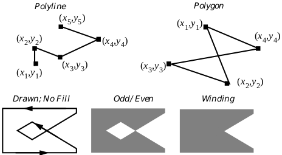  
**Figure 24-9** Polylines, Polygons, and Fill Rules  
_Polylines can't be filled. Polygons can be drawn as with polylines, or filled 
using one of two "fill rules." In the polygon shown, the odd/even fill results in 
a "cavern", or hollow area. The winding rule fills in this cavern._

GrDrawPolyline() draws a polyline using the current line attributes. 
GrDrawPolygon() draws a polygon using the current line attributes. 

To draw a closed figure with GrDrawPolyline(), the first and last point 
must have the same coordinates. GrDrawPolygon() draws figures as closed 
automatically; having the same beginning and ending point is unnecessary.

GrFillPolygon() fills the interior of a polygon. It does so using the current 
area attributes. It also uses a fill rule, describing how the polygon should be 
filled. The odd/even fill rule decides whether a point is within a polygon by 
seeing how many times a ray drawn from the point to the exterior of the 
polygon crosses an edge of that polygon. If the result is odd, the point is 
considered to be in the interior and is filled. If the result is even, the point is 
outside the polygon and is left alone. The winding rule works in a similar 
manner, but whenever the ray crosses an edge, the rule looks at the direction 
of that edge: if it crosses the ray left to right, an accumulator is incremented; 
if it crosses the ray right to left, the accumulator is decremented. Those 
points for which the ray's accumulator is non-zero are considered inside the 
region.

GrBrushPolyline() is an optimized routine. It provides a fast, simple way 
to draw thick polylines. Instead of specifying a line width in points, the caller 
passes the dimensions of a rectangle of pixels. This rectangle will be used as 
a sort of brush, dragged along the course of the polyline. The result is a 
polyline drawn very quickly. However, this function is not 
display-independent, and is therefore not WYSIWYG. Because the rectangle 
dimensions are specified in pixels instead of points, the polyline will be 
thicker or thinner depending on the display's resolution. In the system 
software, this routine provides the "ink" feedback for pen-based systems, 
where speed is a top priority.

To find out whether a given point falls within a polygon, call 
GrTestPointInPolygon().

#### 24.2.9 Bézier Curves and Splines

GrDrawCurve(), GrDrawCurveTo(), GrDrawSpline(), 
GrDrawSplineTo(), GrDrawRelCurveTo()

Bézier curves are mathematical constructs which provide a cheap and easy 
way to define smooth curves in a manner that computers can understand. 
There are other ways to define curves to computers, but the Bézier was 
chosen for the GEOS kernel because it is used in many standard font 
description formats. Splines, as implemented in GEOS, are created by 
drawing curves in sequence.

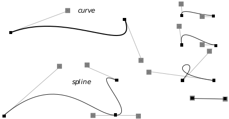  
**Figure 24-10** Splines and Bézier Curves  
_Curves and a spline, shown here with control points._

Bézier curves are defined in terms of four points. Two of these points are the 
endpoints, known as anchor points. The other two points are known as 
control points, one associated with each anchor point. The curve extends from 
anchor point to anchor point. The line between an anchor point and its 
control point determines the slope, or derivative, of the curve at the anchor 
point. The further the control point is from the anchor point, the further the 
curve wants to go along the straight line before curving off towards the other 
anchor point. A control point at zero distance from its anchor point won't 
affect the curve; if both control points are at zero distance from their anchors, 
the result will be a straight line segment.

GrDrawCurve() draws a Bézier curve. It takes four points as arguments, 
using the first and last as anchor points and the middle two as control points. 
GrDrawCurveTo() draws a curve but uses the current pen position as the 
first anchor point, setting the pen position to the second anchor point after 
drawing. 

It would be possible to draw splines by drawing a number of curves which 
had common endpoints, but the graphics system provides the 
GrDrawSpline() routine by which a spline with an arbitrary number of 
spline segments may be drawn with one call. GrDrawSplineTo() draws a 
spline with the current position as the first anchor point. The spline drawing 
routines require the application to set up an array of points. When calling 
GrDrawSpline(), these points should be in the order: anchor, control, 
control, anchor, control, control,..., anchor. The total number of points should 
be equal to 3n+1, where n is equal to the number of spline segments. Since 
GrDrawSplineTo() uses the current position as the first anchor point, for 
this function the array should start with the first control point, and there 
should be 3n points passed.

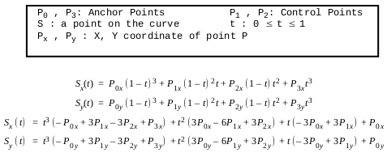  
**Equation 24-1** Bézier Curve Equations  
_Coordinates of the points of a Bézier curve can be expressed by parametric 
equations. The equation for both x and y is given in two forms here, one a 
rearrangement of the other._

For most programmers, that's probably enough to know. Those programmers 
who want to know more and don't mind a bit of math may feel free to continue 
this section.

A curve is defined in terms of four points. There is a formula to determine the 
coordinates of all points on a spline in terms of these four points. The formula 
uses two parameterized cubic equations. These equations determine the x 
and y coordinates of a point on the curve. By finding the points corresponding 
to various parameters, it is possible to approximate the spline as closely as 
necessary. See Equation 24-1 for the equations.

Splines may be created by drawing curves which share endpoints. Given an 
anchor point which two curves of a spline share, if the control point of one lies 
in the exact opposite direction of the other control point, the resulting spline 
will be smooth. If the control points are not only in the exact opposite 
directions but are also the same distance from the anchor point, then not only 
will the resulting spline be smooth, but its derivative will be smooth as well. 

We call smooth splines with smooth derivatives "very smooth," and this 
condition is analogous to  continuity in functions. Smooth splines with 
non-smooth derivatives are called "semi smooth", analogous to  continuity.

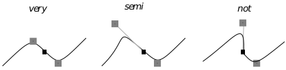  
**Figure 24-11** Levels of Smoothness

#### 24.2.10 Drawing Bitmaps

GrDrawBitmap(), GrDrawBitmapAtCP, GrFillBitmap(), 
GrFillBitmapAtCP(), GrDrawHugeBitmap(), 
GrDrawHugeBitmapAtCP(), GrDrawImage()

In this section only drawing bitmaps will be discussed. For information on 
creating and modifying bitmaps, see section 23.7 of chapter 23.

GrDrawBitmap() draws a bitmap. This routine is very versatile. It can 
draw simple and complex bitmaps. It can draw compacted or uncompacted 
bitmaps, can use a bitmap-specific palette, handles strange resolutions 
intelligently, and generally does the right thing. If you're working with a 
large bitmap and want to manage its storage, you may provide a routine to 
pass in part of the bitmap at a time. If the bitmap is stored in a huge array 
(true of all bitmaps created with GrCreateBitmap()) use 
GrDrawHugeBitmap() instead of GrDrawBitmap(), and it will manage 
memory for you. GrDrawBitmapAtCP() draws a bitmap at the current position.

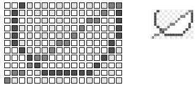  
**Figure 24-12** Bitmap  
_A possible representation of a bitmap data structure and how that bitmap 
might be drawn._

If you just want to draw a monochrome bitmap, consider using the 
GrFillBitmap() command. This routine treats the bitmap like a mask, 
coloring the "on" pixels with the present area color, and leaving the "off" 
pixels alone so that whatever is underneath the bitmap can show through. 
This routine is heavily optimized and very fast. GrFillBitmapAtCP() works 
the same way, filling the bitmap at the current position.

Use GrDrawHugeBitmap() to draw a bitmap that has been stored in a 
HugeArray data structure. Remember that any bitmaps created by 
GrCreateBitmap() are stored in a HugeArray. GrDrawHugeBitmap() 
will automatically take care of memory management. 
GrDrawHugeBitmapAtCP() works the same way, drawing the bitmap at 
the current position. GrFillHugeBitmap() and 
GrFillHugeBitmapAtCP() fill huge bitmaps.

GrDrawImage() is less adaptable but faster than GrDrawBitmap(). 
GrDrawImage() has its own kind of scaling which doesn't work in the 
standard GEOS fashion. This routine ignores the resolutions of both device 
and bitmap and displays the bitmap so that each pixel of the bitmap 
corresponds to one pixel of the display. If the coordinate system has been 
scaled or rotated, GrDrawImage() will ignore the scale and rotation when 
drawing the bitmap. The bitmap may be magnified, but this is not quite the 
same as normal scaling: The bitmap's resolution is still ignored, but each 
pixel of the bitmap will receive a square of pixels on the display. 
GrDrawHugeImage() draws the image of a bitmap stored in a HugeArray.

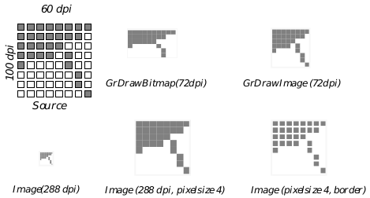  
**Figure 24-13** GrDrawImage()  
_GrDrawImage() is non-WYSIWYG; the output depends on the resolution._

The image-drawing routines take an ImageFlags structure which holds a 
flag to specify whether borders should be drawn between the pixels of the 
bitmap and a bit size field which specifies the magnification to use.

#### 24.2.11 Paths

GrDrawPath(), GrFillPath()

This section will address only the subject of drawing paths. To find out how 
to create, combine, and modify paths, see section 23.9 of chapter 23.

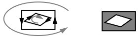  
**Figure 24-14** Path Direction for Winding Fills  
_The path should be counterclockwise overall, with clockwise concavities._

GrDrawPath() draws a path using the current line attributes. 
GrFillPath() fills a path using the current area attributes. GrFillPath() 
can fill the path using either an odd/even or winding fill rule. If the path is to 
be filled using the winding fill rule, the path must have been defined so that 
the segments forming the border of each region go around the region so that 
the interior of the region is to the left. That is, on convex parts of the border, 
edges should be in the counterclockwise direction. On concave parts of the 
border edges should go clockwise. For an illustration of a path following this 
rule, see Figure 24-14. The fill rule is specified by means of a 
RegionFillRule value, which may be one of ODD_EVEN or WINDING.

When you define a path by combining two other paths, the result might not 
be exactly what you would expect. See Figure 24-15 for an example of path 
intersection and union.

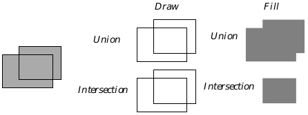  
**Figure 24-15** Path Intersection and Union  
_When drawing a path formed by union or intersection, both paths are drawn, 
perhaps not what was expected. The effects of a union or intersection aren't 
apparent unless the paths are filled (or used to define clip regions)._

#### 24.2.12 Regions

GrGetPathRegion(), GrDrawRegion(), GrDrawRegionAtCP(), 
GrMoveReg(), GrGetPtrRegBounds(), GrTestPointInReg(), 
GrTestRectInReg()

Sometimes it's useful to be able to describe an arbitrary area of a display. 
Regions provide a mechanism for doing so. Regions are ideal for delimiting 
large, blobby areas which are relatively free of detail. They are used by the 
system to describe many "filled shapes."

While it is possible to define a region directly, writers familiar with paths 
may define a path and then call the GrGetPathRegion() routine. To find out 
how to define a region directly, see below.

GrDrawRegion() draws a region at the passed position using the current 
area drawing attributes. GrDrawRegionAtCP() draws a region at the 
current pen position. 

GrMoveReg() changes the coordinates stored within a region data structure 
by the specified x and y offsets.

GrGetPtrRegBounds() returns the coordinates of the passed region's 
bounding rectangle.

GrTestPointInReg() sees if the passed point falls within a region. 
GrTestRectInReg() tests to see whether the passed rectangle falls entirely 
or partially within a region; it returns a value of type TestRectReturnType 
specifying the degree of overlap. These two functions are very useful when 
using regions for clipping purposes; if a given point or rectangle is discovered 
to be outside the clipping region, there's no need to draw the point or 
rectangle.

Some application writers may wish to define regions directly without 
describing a path. Regions are described in terms of a rectangular array (thus 
the similarity to bitmaps). Instead of specifying an on/off value for each pixel, 
however, regions assume that the region will be fairly undetailed and that 
the data structure can thus be treated in the manner of a sparse array. Only 
the cells in which the color value of a row changes are recorded. The tricky 
part here is keeping in mind that when figuring out whether or not a row is 
the same as a previous row, the system works its way up from the bottom, so 
that you should compare each row with the row beneath it to determine 
whether it needs an entry.

The easiest region to describe is the null region, which is a special case 
described by a single word with the value EOREGREC (a constant whose 
name stands for End Of REGion RECord value). Describing a non-null region 
requires several numbers.

The first four numbers of the region description give the bounds of the region. 
Next come one or more series of numbers. Each series describes a row, 
specifying which pixels of that row are part of the region. The only rows 
which need to be described are those which are different from the row below. 
The first number of each row description is the row number, its y coordinate. 
The last number of each series is a special token, EOREGREC, which lets the 
kernel know that the next number of the description will be the start of 
another row. Between the row number and EOREGREC are the column 
numbers where the pixels toggle on and off. The first number after the row 
number corresponds to the first column in which the pixel is on; the next 
number is the first subsequent column in which the pixel is off; and so on.

For example, Figure 24-16 shows a simple region, along with the numbers 
used to define it. Those rows which are the same as the rows beneath them 
have no entry in this structure. Notice that rows four through seven, being 
the same as row eight, have no entries.

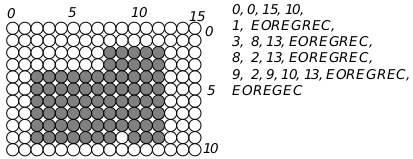  
**Figure 24-16** Sample Region

It is possible to customize a region by taking advantage of a feature of the 
coordinate system. Graphics routines take word-sized (16-bit) coordinate 
arguments. Normal coordinates only require 15 bits. When working with 
regions, the graphics system uses the extra bit to allow for coordinates that 
are described in terms of "parameters."

When you create a region you can specify coordinates as an offset from a 
parameter. When the region is initialized, up to four parameters may be 
defined. Coordinates may then be specified as 13-bit offsets from any one of 
these four parameters. When drawing the construct, new values may be 
passed for the parameters. In this way, it is possible to use a single region to 
describe a variety of shapes, just by changing the parameters.

Coordinates with the values shown below will be interpreted as offsets.

4000h-5FFFh: Offsets from parameter zero, with 5000h corresponding to the 
parameter exactly.

6000h-7FFFh: Offsets from parameter one, with 7000h corresponding to the 
parameter exactly.

8000h-9FFFh: Offsets from parameter two, with 9000h corresponding to the 
parameter exactly.

A000h-BFFFh: Offsets from parameter three, with B000h corresponding to 
the parameter exactly.

Thus, if a coordinate in a GString were 5000h, and the region were drawn 
with parameter zero equal to 72, then that drawing would take place at the 
coordinate 72. The coordinate 4FFFh would be interpreted as 71. Use the 
following constants to clarify parameterized coordinates:

~~~
/* Constants for DrawRegion */
#define PARAM_0 0x5000
#define PARAM_1 0x7000
#define PARAM_2 0x9000
#define PARAM_3 0xb000
~~~

Some or all coordinates of a region description may incorporate parameters. 
Note that the region code doesn't check regions for correctness. If the bounds 
of a region are set incorrectly, the rows are given out of order, or an incorrect 
(odd) number of on/off points is given for a row, the results are undefined. 
Figure 24-17 shows a complicated region which uses parametrized 
coordinates.

#### 24.2.13 Text

Programs normally display text with UI gadgetry such as GenText, VisText, 
and GenGlyph objects. For those times when a geode will display text as part 
of a graphical display, sometimes it's best to display text using direct calls to 
the graphics system.

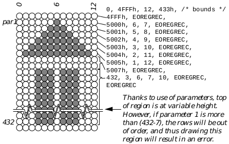  
**Figure 24-17** Complicated Region Example  
_This example shows how a rather unlikely region might be defined. This 
region is set up to draw an up-pointing stylized arrow. The base of the arrow 
will be six inches down from the coordinates passed to the region drawing 
command (432 points). The coordinate of the top of the arrow will be the first 
parameter. The arrow's horizontal position is determined by the second 
parameter. Remember that the coordinate 5000h is not absolute but 
corresponds to the first parameter, and all coordinates between 4000h and 
5FFFh will be relative to this coordinate._

##### 24.2.13.1 Displaying Text

GrDrawText(), GrDrawTextAtCP(), GrDrawChar(), 
GrDrawCharAtCP(), GrDrawTextField()

There are several functions that display text. The GrDrawText() routine 
displays a text string. The passed y position, adjusted by the text mode (see 
below), determines the vertical position. The passed x position determines 
where the text will start printing, as normal. 

GrDrawText() draws a text string at the desired position using the GState's 
current text attributes. This text string should contain no carriage returns, 
line feeds, tabs, or other non-printing characters. GrDrawTextAtCP() 
draws a text string at the current position. GrDrawChar() and 
GrDrawCharAtCP() draw a single character, which should not be a 
non-printing character. GrDrawTextField() draws a field of text-however, 
this routine is only available in Assembly language. 

##### 24.2.13.2 Special Text Attributes

GrGetTextStyle(), GrSetTextStyle(), GrGetTextMode(), 
GrSetTextMode(), GrGetTextSpacePad(), GrSetTextSpacePad(), 
GrGetFont(), GrSetFont(), GrGetTrackKern() 
GrSetTrackKern(), GrGetFontWeight(), GrSetFontWeight(), 
GrGetFontWidth(), GrSetFontWidth(), GrGetSuperscriptAttr(), 
GrSetSuperScriptAttr(), GrGetSubscriptAttr(), 
GrGetSubscriptAttr()

Applications can display text in a number of ways. Thus the GState has 
many attributes it keeps track of solely for drawing text.

Text style is a collective set of attributes (bold, italic, etc.) that affects how the 
text is drawn by the graphics system. GrGetTextStyle() gets the current 
text style, and GrSetTextStyle() allows a new style to be specified. Styles 
are expressed as a TextStyle record. Note that some complicated styles 
which are offered by the text objects are not available here: these styles are 
available only from the text objects; if you wish to offer these styles without 
using a text object, you'll have to do the artwork yourself.

Depending on the text mode attribute, text may either be drawn from the 
bottom of the font box, top of the font box, baseline, or accent line. 
GrGetTextMode() gets the text mode, returning information about which 
offset to use when drawing text. GrSetTextMode() allows this information 
to be reset. The information is stored in a TextMode record. Note that if you 
will be drawing characters of more than one size or font, and if you want 
those characters to line up by baseline, you should use GrSetTextMode() to 
use the TM_DRAW_BASE text mode.

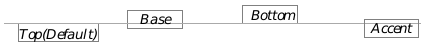  
**Figure 24-18** TextMode and Drawing Position

GrSetTextSpacePad() sets the special amount used to pad space 
characters; GrGetTextSpacePad() retrieves the current space padding.

GrGetFont() returns the current font and type size. The font is identified by 
its fontID; the default font has the ID DEFAULT_FONT_ID and size 
DEFAULT_FONT_SIZE; these are the values which new GStates will start 
with. GrSetFont() sets a new font to use. The font's point size may be 
between MIN_POINT_SIZE and MAX_POINT_SIZE.

Track kerning adjusts the space between characters. A negative kerning 
value means that characters will be drawn closer together. A large negative 
kerning value can make characters draw overlapped. A positive kerning 
value causes characters to draw with more space between them. 
GrGetTrackKern() returns the present track kerning value. 
GrSetTrackKern() changes this value. The kerning value must be between 
MIN_TRACK_KERNING and MAX_TRACK_KERNING; values greater than 
MAX_TRACK_KERNING will be replaced by MAX_TRACK_KERNING, values 
less that MIN_TRACK_KERNING will result in MIN_TRACK_KERNING being 
used. The kerning value will be multiplied as a percentage by the font size to 
get a number of points to use for kerning; if this multiplied value is greater 
than the BBFixed (byte-byte fixed point) number MAX_KERN_VALUE or less 
than MIN_KERN_VALUE then it will be adjusted to fall at the end of this 
range.

A font's weight determines its boldness. For many fonts, there will be only 
two weights defined: plain and bold. However, some fonts allow for finer 
control of weight. To find out the current font weight, call 
GrGetFontWeight(). To use a different font weight, call 
GrSetFontWeight(). Some useful weight values are stored in the 
FontWeight enumerated type. The weight should definitely be between 
FW_MINIMUM and FW_MAXIMUM.

To make characters draw wider or narrower, adjust the font width. Some 
fonts come in wide or narrow versions. If the font does not support the 
requested width, GEOS will simulate the width as best it can. The 
GrGetFontWidth() routine retrieves the current width; 
GrSetFontWidth() changes it. Some helpful width values are stored in the 
FontWidth enumerated type. The width should definitely be between 
FWI_MINIMUM and FWI_MAXIMUM.

Geodes can control how text will be drawn in superscript and subscript 
styles. The super- and subscript attributes determine how to scale the 
characters and how far they should be displaced. There are several standard 
super- and subscript attributes available, including values for footnote 
numbers, and chemical inferiors. Typesetting enthusiasts who wish to adjust 
the width of these characters differently than the height (as in some standard 
super- and sub- script layouts) should work with the font width. Use 
GrGetSuperscriptAttr() and GrGetSubscriptAttr() to find out what the 
present values are. Use GrSetSuperScriptAttr() and 
GrSetSuperScriptAttr() to change these values. Each of these routines 
works with a word sized value: the top byte is a percentage of the font size to 
offset sub- or superscript characters; the low byte is the percentage of font 
size to use for the sub- or superscript character 0x0064 (decimal 100) would 
be full-sized with no displacement.

##### 24.2.13.3 Accessing Available Fonts

GrEnumFonts(), GrCheckFontAvail(), 
GrFindNearestPointsize(), GrGetDefFontID(), GrGetFontName()

To find out which fonts are available in the user's environment, use the 
GrEnumFonts() command. You specify what sorts of fonts you're interested 
in by setting a number of flags, and the routine will fill a buffer with the 
available fonts with their FontIDs and names.

The FontEnumFlags record determines which fonts will be returned. At 
least one of the FEF_OUTLINES and FEF_BITMAPS flags must be set to 
determine whether outline, bitmap, or both kinds of fonts should be 
returned.Keep in mind that only outline fonts will result in true WYSIWYG 
printer output. The FEF_ALPHABETIZE flag will force the returned buffer of 
fonts to appear in lexical order. The FEF_DOWNCASE flag requests that the 
font names appear all in lowercase.

The FEF_FAMILY flag asks that the search be limited to a font family. To 
specify what sort of family you want, use the FontFamily enumerated type.

GrEnumFonts() ignores the FEF__STRING flag; other routines will use this 
flag to find out whether the font is specified by a FontID or its ASCII name.

The other flags narrow the search: if you set the FEF_FIXED_WIDTH flag, 
then only fixed-width fonts will be returned. If you set the FEF_USEFUL flag, 
only those fonts marked as "useful" will be returned.

The font information will be returned as an array of FontEnumStruct 
structures. Each of these structures will contain a FontID and the ASCII 
name of the associated font.

There may be up to MAX_FONTS available on the system. If you're not 
prepared to handle an array large enough to hold this many fonts, be sure to 
pass an argument specifying how large an array is being provided.

To find out if a given font is available in the user's environment, call either 
GrCheckFontAvailID() or GrCheckFontAvailName(), depending on 
whether the font is being identified by its FontID or its ASCII name. If 
programming in assembly language, use the GrCheckFontAvail() routine 
no matter how you're identifying the font. You may narrow the search by 
passing the appropriate FontEnumFlags. Make sure that the FEF_STRING 
bit is clear when searching by ID and set when searching by name.

Some fonts are available only in certain sizes and styles. Bitmap fonts are 
examples of this. The GrFindNearestPointsize() routine takes a typeface, 
size, and style set. It returns the closest available size and style (or returns 
FID_INVALID if the passed font isn't available).

To get the font which the Generic UI will use by default, call 
GrGetDefFontID(). This also returns the font size to use, useful if you wish 
to respect the user's choice of type size.

To find out the ASCII name of a string for which you have the FontID, call 
GrGetFontName(). If the font isn't available, this function will return false; 
otherwise it will fill a passed buffer with the name of the font. The passed 
buffer should be FID_NAME_LEN bytes long.

##### 24.2.13.4 Text Metrics

GrTextWidth(), GrTextWidthWBFixed(), GrCharWidth(), 
GrFontMetrics(), GrCharMetrics()

From time to time it may become important to know something about the size 
of a letter to be drawn. The graphics system has several routines for 
retrieving this information. GrTextWidth() returns the width, in points, of 
a string. GrTextWidthWBFixed() does the same thing, but returns a more 
accurate figure, including a fractional part. GrCharWidth() returns the 
width of a single character. Note that the width of a text string will normally 
be different than the sum of the widths of the component characters. 
GrTextWidth() takes track kerning and pairwise kerning into account.

GrFontMetrics() returns information pertaining to a font (see 
Figure 24-19). The meanings of these metrics are listed below:

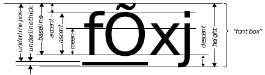  
**Figure 24-19** Common Font Metrics

**Height**  
The height of the "font box." This is how much vertical space 
should be allocated for a line of text. Note that when the text is 
drawn, some characters may go beyond these bounds. Though 
the height is still the vertical distance to set aside for a line of 
text, applications should be prepared for characters to have a 
vertical height equal to the maximum adjusted height, 
discussed below.

**Maximum Adjusted Height**  
The maximum height required to draw the character. Some 
fonts contain characters that are meant to go beyond the 
normal vertical boundaries, perhaps extending into the space 
occupied by text on the next or previous line. This metric is the 
minimum height to guarantee being able to display such a 
character.

**Above Box**  
Normally the top of the font box, the uppermost limit of a font, 
is 3/4 of the font's height above the baseline. For those fonts 
which do not follow this rule, the Above Box metric is the 
number of points by which the true font box extends beyond the 
normal font box.

**Below Box**  
Normally, the bottom of the font box, the bottommost limit of a 
font, is 1/4 of the font's height below the baseline. For those 
fonts which do not follow this rule, the Below Box metric is the 
number of points by which the true font box extends below the 
normal font box.

**Mean**  
The height of a typical lower case character. This metric is 
sometimes called the "x height," since this will be the height of 
a lower case "x."

**Descent**  
How far descending characters (like "y" and "j") extend below 
the baseline.

**Baseline**  
The vertical position of the bottoms of nondescending 
characters. The number referred to as the "baseline" is the 
distance between the baseline and the top of accent marks. 
This corresponds to the text mode TM_DRAW_BASE. 

**Accent**  
How much space to leave for accent marks. This distance is 
measured from the top of the accent mark area to the ascent 
height. This corresponds to the text mode TM_DRAW_ACCENT. 

**Ascent**  
Height of capital letters (and some tall lower-case letters, such as "f").

**Underline Position**  
The distance from the top of the accent line to the top of the 
underline.

**Underline Thickness**  
The width of the underline.

**Strikethrough Position**  
The vertical position of the line used for "strikethrough" text.

**Average Width**  
The average character width. This figure is normally computed 
as a weighted average width of lower-case characters, said 
average weighted based on the frequency distribution of the 
characters.

**Maximum Width**  
Width of the font's widest character.

**Leading**  
The height of the vertical gap between lines of text.

**Kern Count**  
The number of specially kerned pairs in the font. Many fonts 
allow certain pairs of characters to have special spacing, known 
as "pair kerning." For example many fonts try to squish "To" so 
that the "T" and "o" are closer together than normal leading 
would dictate. Do not confuse kerned pairs with ligatures. A 
kerned pair just has strange spacing (e.g. "To" vs. "To"); a 
ligature is a pair of characters which have been combined into 
one (e.g. "¿" and "æ").

**Driver**  
The font driver associated with the font, specified by a member 
of the FontMaker enumerated type.

**First Character**  
The Char value of the first defined, drawable character.

**Last Character**  
The Char value of the last defined, drawable character.

**Default Character**  
The Char value of the drawable character which will be drawn 
as a substitute for any undrawable characters. 

The GrCharMetrics() routine returns useful measurements for a character. 
For each of a font's characters, you may request the following information:

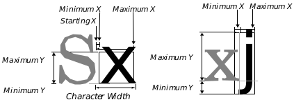  
**Figure 24-20** Character Metrics  
_Unlike most characters, this font's "j" has a negative "Minimum X," meaning 
it extends backwards into the space allotted to the previous character._

**Width**  
While not a metric returned by the GrCharMetrics() routine, 
the character width is very important. It determines how much 
space to allow for the character. The metrics that follow don't 
affect how much space to allow; instead, they give the bounds 
of the area that will be drawn to. As shown in Figure 24-19, 
characters are free to draw beyond the area set aside for them 
by the width, into the space of the previous or next character.

**Minimum X**  
The character's leftmost bound. If this value is positive, it 
means that the character will have some extra space before it. 
If the value is negative, the character may infringe on the space 
of the previous character. This metric is also called the "left side 
bearing."

**Minimum Y**  
The character's bottommost bound. This is the character's 
"descent," the amount it hangs below the baseline.

**Maximum X**  
The character's rightmost drawing bound. This value should be 
greater than the Minimum X. Do not confuse this metric with 
the character's width. 

**Maximum Y**  
The character's topmost bound. This is the distance the 
character extends above the baseline. It is sometimes called the 
character's "ascent."

### 24.3 Shape Attributes

GrSetAreaAttr(), GrSetLineAttr(), GrSetTextAttr()

The graphics system keeps track of many attributes which affect how 
graphics will be drawn. By setting attributes in the graphics state, your 
geode can change the color, fill pattern, and other features that won't affect 
the shape of what you're drawing but will affect its appearance.

The following sections will explain how each of these attributes may be set 
individually. Note that if you wish to set all attributes to use when filling 
areas at once, call GrSetAreaAttr(). Call GrSetLineAttr() to set all 
attributes to use when drawing lines. Use GrSetTextAttr() to set all 
text-rendering attributes.

#### 24.3.1 Color

If your geode displays graphics, you can probably make its graphical display 
more effective by using color. Your geode can have as much control over color 
as it wants, ranging from saying what colors certain objects should be to 
choosing which colors should be available.

Most color controllers work with the concept of a palette, a subset of the 
colors your video device is capable of displaying. Most controllers can only 
use some of these colors at a time; these colors make up the palette. You can 
refer to colors by their color index (i.e. their place in the palette). You can also 
refer to colors by their RGB values.

An RGB value specifies a color by mixing intensities of red, green, and blue. 
The more of each component color added, the more of that color will show up 
in the result. If all components are equal, the result will be a shade of gray. 
If all components are zero, the result will be black. If all components are at 
the maximum (255), the result will be white.

The data structure used to store color information is known as the 
ColorQuad, shown in Code Display 24-1.

---
Code Display 24-1 Color Data Structures
~~~
typedef struct {
	/* The ColorQuad data structure is used to represents a color. There are
	 * many ways to describe a color. The CQ_info field determines how the
	 * color is being specified, and the other fields will be interpreted
	 * based on CQ_info's value. Colors may be referenced by palette index,
	 * RGB value, or grey scale value. */
		/* CQ_redOrIndex
		 * If CQ_info is CF_INDEX, then this is the palette index.
		 * If CQ_info is CF_RGB, then this is the Red component.
		 * If CQ_info is CF_GRAY, then this is the Gray scale */
	byte 	CQ_redOrIndex;

		/* CQ_info:
		 * This ColorFlag determines how the other three fields of the
		 * ColorQuad will be interpreted. The ColorFlag type is shown 
		 * below. */
	ColorFlag 	CQ_info;

		/* CQ_green:
		 * If CF_RGB, then these fields are the Green and Blue components.
		 * Otherwise, these fields are ignored. */
	byte 	CQ_green;
	byte 	CQ_blue;
} ColorQuad;

typedef dword ColorQuadAsDWord;

typedef ByteEnum 	ColorFlag;
	CF_INDEX,	
		/* Color specified by palette index. The values of the first
		 * 16 entries of the system palette are listed in Table 24-1 */
	CF_GRAY,
		/* Color specified by gray value; this is like CF_RGB, but the
		 * value in CQ_redOrIndex will be used for the Green and Blue 
		 * fields as well. */
	CF_SAME,
		/* Used with hatch patterns, if this flag is set, hatches will draw
		 * using the default color (the one set using GrSetXXXXColor()) */
	CF_RGB
		/* Color Set using RGB values */

/* Sample Colors:
 * To use the system palette's light green:						{ C_LIGHT_GREEN, CF_INDEX, 0, 0}
 * To use the 40th color in the palette:						{ 40, CF_INDEX, 0, 0}
 * To use a custom brown:						{ 150, CF_RGB, 90, 0}
 * To use a 75% Gray (75% *256 = 192):						{ 192, CF_GRAY, 0, 0}
 */
~~~

##### 24.3.1.1 Using Available Colors

GrGetAreaColor(), GrSetAreaColor(), GrGetLineColor(), 
GrSetLineColor(), GrGetTextColor(), GrSetTextColor()

If a geode is to draw something in color, it first calls a routine to set which 
color to use, then calls the appropriate drawing routine. The color can be 
specified in terms of its palette index or its RGB value. The data specifying 
which color to use is stored in the GState, with separate color fields to keep 
track of how to draw lines, areas, and text.

GrSetLineColor() changes the color used when drawing lines. The 
GrSetAreaColor() routine sets the color to be used when filling areas. 
GrSetTextColor() sets the color to be used when rendering text. 
GrGetLineColor(), GrGetAreaColor(), and GrGetTextColor() return 
the color values and flags stored with the GState.

|Constant Name |Index |RED   |GREEN |BLUE  |
|:-------------|:-----|:-----|:-----|:-----|
|C_BLACK       |0x00  |0x00  |0x00  |0x00  |
|C_BLUE        |0x01  |0x00  |0x00  |0xAA  |
|C_GREEN       |0x02  |0x00  |0xAA  |0x00  |
|C_CYAN        |0x03  |0x00  |0xAA  |0xAA  |
|C_RED         |0x04  |0xAA  |0x00  |0x00  |
|C_VIOLET      |0x05  |0xAA  |0x00  |0xAA  |
|C_BROWN       |0x06  |0xAA  |0x55  |0x00  |
|C_LIGHT_GRAY  |0x07  |0xAA  |0xAA  |0xAA  |
|C_DARKK_GRAY  |0x08  |0x55  |0x55  |0x55  |
|C_LIGHT_BLUE  |0x09  |0x55  |0x55  |0xFF  |
|C_LIGHT_GREEN |0x0A  |0x55  |0xFF  |0x55  |
|C_LIGHT_CYAN  |0x0B  |0x55  |0xFF  |0xFF  |
|C_LIGHT_RED   |0x0C  |0xFF  |0x55  |0x55  |
|C_LIGHT_VIOLET|0x0D  |0xFF  |0x55  |0xFF  |
|C_YELLOW      |0x0E  |0xFF  |0xFF  |0x55  |
|C_WHITE       |0x0F  |0xFF  |0xFF  |0xFF  |
**Table 24-1** Convenient Color Indexes
_These are the first 16 members of the Color enumerated type. For a full list 
of available Color values, see the Routines reference or color.h._

The default system palette includes several colors whose indexes have been 
set up so they may be referenced by descriptive constant names. The 
constants are members of the enumerated type Color, the most common 
shown in Table 24-1. Thus, instead of having to remember that the index 02 
means green, the constant C_GREEN can be passed to the appropriate color 
setting command.

Other Color values include a 16-shade gray scale (the C_GRAY_-entries), 
some "unused" entries (the C_UNUSED_- entries), and a number of entries 
which have been set up to allow you to specify a color by its red, green, and 
blue components on a zero-to-five scale (the C_R-_G-_B- entries).

 Programmers should use care when using these constants in conjunction 
with palette manipulation, as it is possible to change the RGB color value 
associated with a palette entry. Since the constant names are associated with 
palette indexes instead of RGB values, it is possible to change the RGB value 
of palette entry 02 so that the C_GREEN constant actually refers to, for 
example, a shade of magenta.

##### 24.3.1.2 When the Color Isn't in the Palette

GrSetLineColorMap(), GrSetAreaColorMap(), 
GrSetTextColorMap(), GrGetLineColorMap(), 
GrGetAreaColorMap(), GrGetTextColorMap(), 
GrMapColorIndex(), GrMapColorRGB()

Not all users have video devices which can display 256 colors at a time. Even 
fewer have printers capable of doing so. Therefore, the graphics system 
makes allowances for drawings which use unavailable colors. Exactly what 
the system will do with an unavailable color depends on the color mapping 
mode used. By default, the system will choose the two (or more) closest 
available colors and dither them together in an attempt to form a mixture 
which will appear to be the correct color overall when seen from a distance. 
(See Figure 24-21.)

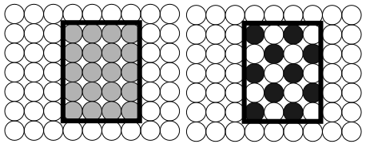  
**Figure 24-21** Dithering  
_Here the system wants to display the rectangle with a light gray. On a black 
and white system, it would simulate the gray by setting some pixels black and 
others white._

GrSetLineColorMap(), GrSetAreaColorMap(), and 
GrSetTextColorMap() set the color mapping to use when drawing with an 
unavailable color. GrGetLineColorMap(), GrGetAreaColorMap(), and 
GrGetTextColorMap() return the current color mapping modes. The geode 
may draw either in the closest available color, or using a dithering of the 
closest colors. Often it's a good idea to have text map to solid colors since its 
detailed nature doesn't go too well with dithering. 

When a geode wants to learn more about which colors are available, it can 
use the GrMapColorIndex() routine to find the RGB value associated with 
an index. The GrMapColorRGB() routine returns the index and true RGB 
color of the palette entry that most closely matches the values passed.

##### 24.3.1.3 Custom Palettes

GrCreatePalette(), GrDestroyPalette(), GrSetPaletteEntry(), 
GrSetPalette(), GrGetPalette()

If the system default palette does not meet a geode's needs, the geode can 
change its own palette. Some bitmaps (such as those in GIF) have palettes 
associated with them, and a geode displaying such bitmaps might wish to 
display the bitmap in its true colors without settling for the closest defaults. 
Specialized tasks such as photo processing, anti-aliasing, and color cycle 
animation tend to depend on the ability to manipulate palettes. A geode can 
create a custom palette associated with a window, then change the color 
values of entries in that palette.

Since the palette is associated with a window, there can be as many custom 
palettes as there are windows. The video driver uses the palette associated 
with the active window. This means that all the inactive windows (and the 
background) will also be drawn with the palette of the active window; thus, 
if you give a window a special palette, that may make inactive windows look 
different. To avoid this, try to avoid changing palette entries 0-15, as the UI 
uses these (These are the entries representing C_RED, etc.).

GrCreatePalette() creates a custom palette and associates it with your 
graphic state's associated window. The custom palette starts with all entries 
having their original RGB values from the default palette. 
GrSetPaletteEntry() takes a palette entry and sets it to a new RGB value. 
GrSetPalette() allows you to specify new values for several palette entries 
at a time. GrSetPalette() can also set an entry back to its default value. 
GrDestroyPalette() destroys the custom palette, freeing the memory used 
for it. 

Given a choice of palette entries to change, you might choose one of the 
C_UNUSED_- entries.

Call GrGetPalette() to get a handle to a memory block containing the 
palette data. Depending on the GetPalType passed, you will either get the 
palette information for your current palette or the default palette. This 
routine returns the handle of a memory block. The memory block contains an 
array with 256 entries (one for each color), each entry consisting of three 
bytes. The first byte of each entry is the color's red component, the second is 
the color's green component, and the third is the color's blue component.

#### 24.3.2 Patterns and Hatching

GrSetAreaPattern(), GrSetAreaPatternCustom(), 
GrSetTextPattern(), GrSetTextPatternCustom(), 
GrGetAreaPattern(), GrGetTextPattern()

Fill patterns allow the application to tile an area with a repeating pattern of 
bits or lines helpful for suggesting textures. The graphics system supports 
two types of fill patterns. Bitmap patterns, familiar to most computer users, 
tile the filled area with a repeated bitmap. Hatch patterns fill the area with 
a repeated sequence of lines. Hatch patterns are defined in terms of families 
of parallel lines. Patterns are referenced by a PatternType and an index, 
stored in a GraphicPattern structure. The pattern types are

PT_SOLID  
The lack of a pattern. Fills the area solid. This is the default. 

PT_SYSTEM_HATCH  
System-defined hatch pattern. These patterns are 
unchangeable and are available to all geodes.

PT_SYSTEM_BITMAP  
System-defined tile bitmap pattern. These patterns are 
unchangeable and available to all geodes.

PT_USER_HATCH  
User-defined hatch pattern. These patterns are available to all 
geodes.

PT_USER_BITMAP  
User-defined tile bitmap pattern. These patterns are available 
to all geodes.

PT_CUSTOM_HATCH  
Application-defined hatch pattern. These patterns are 
application-specific.

PT_CUSTOM_BITMAP  
Application-defined tile bitmap pattern. These patterns are 
application-specific.

Use GrSetAreaPattern() and GrSetTextPattern() to use patterns defined 
outside the application (system- and user-defined patterns). To use the 
system's brick hatch pattern, for example, pass the PatternType 
PT_SYSTEM_HATCH and the SystemHatch SH_BRICK. To use a user-defined 
bitmap pattern, pass PatternType PT_USER_BITMAP and the number of the 
pattern. If you pass an invalid pattern (requesting a user hatch pattern when 
the user hasn't defined one, for instance), the area or text will be filled solid.

Applications may define their own patterns. Before adding custom patterns 
to an application, consider whether such an action is really necessary. 
Remember that the user may define his own patterns. The data associated 
with any application custom pattern may be at most 16Kbytes. 

Hatch patterns are defined in terms of families of lines. The pattern designer 
specifies a series of families; each family consists of a set of equidistant 
parallel lines. Thus, by defining one family of lines, one could cover a surface 
with one set of parallel lines. By asking for two families, the region could be 
filled with a grid. For an example of a possible custom hatch pattern, see 
Figure 24-22.

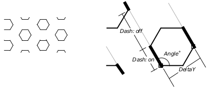  
**Figure 24-22** Custom Hatch Patterns  
_This simple hatch pattern is made up of three line families. The 
measurements used to compute the 120° family are illustrated to the right. 
Full measurements are shown below._
|Origin |DeltaX, DeltaY |Angle |numDash; Dashes |
|:------|:--------------|:-----|:---------------|
|(0, 0) |0, 12*sqrt(3)  |0     |1; 12, 24       |
|(0, 0) |0, 12*sqrt(3)  |120   |1; 12, 24       |
|(12, 0)|0, 12*sqrt(3)  |60    |1; 12, 24       |

For each line family, the application must supply certain information. Your 
application will work with the HatchLine data type to specify

+ Origin  
Since each line family is drawn as a set of equidistant parallel lines, the 
origin might seem useless. Who cares where the lines start, since they fill 
the available space? In fact, the origin will only be meaningful if your 
hatch pattern contains more than one line family. The origin allows you 
to draw one line family at an offset from another. In the case of the 
example presented in Figure 24-22, the third line family needed an origin 
offset from that of the first two families, since none of the lines of the 
third family pass through the point used as the origin by the first two 
families.

+ Delta offset between lines of the family  
Each family has a horizontal and vertical offset. When drawing the 
pattern, the first line will be drawn starting at the origin. The second line 
will be drawn at a perpendicular distance equal to the passed y offset. 
The second line may also be drawn at a parallel offset, but this will only 
affect dotted lines.

+ Angle at which to draw the lines  
Remember that angles are measured in degrees measured 
counterclockwise from the positive x axis. 

+ Color  
You may draw the lines using the default color (area color if pattern is 
filling an area; text if rendering text), or you may draw using a specific 
color.

+ Dashes  
You may draw the lines using a custom dash pattern. See the Line Style 
attribute, below, to learn how to set up a dash pattern.

Custom bitmap patterns are defined in terms of simple bitmaps. To find out 
the structure of a bitmap, see Bitmap on page n 454 of the Routine 
Reference.

To use a custom pattern, call GrSetCustomAreaPattern() or 
GrSetCustomTextPattern(). Along with the usual information, you must 
include a pointer to a memory location which marks the beginning of some 
structures holding the pattern data. The commands and structures are 
detailed in the reference manual. For an example of some code using a 
custom hatch pattern, see Code Display 24-2.

---
Code Display 24-2 Hatch Pattern Data
~~~
/* This example shows how to implement the pattern illustrated in Figure 24-22 */

    /* ... */
    GrSetPatternCustom(myGState, gp, hexHatchPatt);
    /* ... */

GraphicPattern 	gp = {PT_CUSTOM_HATCH, 0};

static HatchPattern hexHatchPatt = { 3 }; /* Three HatchLine structures must follow */

static HatchLine line1 = {
    {MakeWWFixed(0) , MakeWWFixed(0)},    /* Origin */
    MakeWWFixed(0),                       /* Delta X dashes will be in alignment */
    MakeWWFixed(20.7846097),              /* Delta Y lines will be 12*sqrt(3) apart */
    MakeWWFixed(0),                       /* Angle */
    (dword) (CF_SAME<<16),                /* Color will use default color */
    1                                     /* Number of dashes one HatchDash pattern must follow */
};

static HatchDash dash1 = {
    {12, 0},                              /* On for 12 points */
    {24, 0} };                            /* ...and Off for 24 points */

static HatchLine line2 = {
    {MakeWWFixed(0), MakeWWFixed(0)},     /* Origin */
    MakeWWFixed(0),                       /* Delta X */
    MakeWWFixed(20.7846097),              /* Delta Y*/
    {120,0},                              /* Angle */
    (dword) (CF_SAME<<16),                /* Color */
    1                                     /* Number of dashes */
};

static HatchDash dash 2 = {
    {12, 0},                              /* On for 12 points */
    {24, 0} };                            /* ...and Off for 24 points */

static HatchLine line3 = {
    {{12,0} , MakeWWFixed(0)},            /* Origin this line family will be at
                                           * a 12 pt. horizontal offset
                                           * from the other two families. */
    MakeWWFixed(0),                       /* Delta X */
    MakeWWFixed(20.7846097),              /* Delta Y*/
    {60,0},                               /* Angle */
    (dword) (CF_SAME<<16),                /* Color */
    1                                     /* Number of dashes */
};

static HatchDash dash3 = {
    {12, 0},                              /* On for 12 points */
    {24, 0} };                            /* ...and Off for 24 points */
~~~

To find out the current area or text pattern, call GrGetAreaPattern() or 
GrGetTextPattern().

#### 24.3.3 Mix Mode

GrGetMixMode(), GrSetMixMode()

The kernel supports several mix modes. These modes control what will 
happen when something is drawn on top of something else. Normally when 
this occurs the new drawing covers up the old one. This is known as 
MM_COPY, since the new drawing is copied directly onto the graphics space.

There are many other mix modes available (see Figure 24-23): 

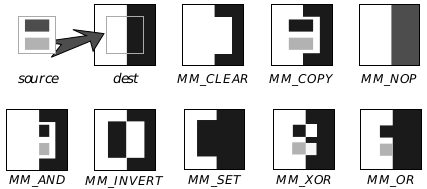  
**Figure 24-23** Mix Modes

MM_COPY  
MM_COPY is the most common mix mode as well as the default. 
It draws the new drawing on top of the old as though the new 
drawing where on opaque paper-nothing of the old drawing 
shows through the region defined by the new drawing.

MM_CLEAR  
The region defined by the new drawing is blanked out. The 
color of the new drawing does not matter.

MM_SET  
The region defined by the new drawing is washed black. The 
color of the new drawing does not matter.

MM_INVERT  
The region defined by the new drawing is inverted. The color 
value displayed will be the logical inverse of the old color. The 
color of the new drawing does not matter.

MM_NOP  
The old drawing remains; nothing is drawn of the new drawing. 
Just about the only thing likely to change is that the pen 
position will be updated.

MM_XOR  
The color value to display is calculated by taking the bitwise 
XOR of the new and old colors. If painting in white, this acts as 
a sort of reverse paint. Note that this bitwise XOR is applied to 
the index numbers of the colors, not to their RGB values.

MM_OR  
The color value to display is calculated by taking the bitwise OR 
of the new and old colors. On a monochrome display, this 
corresponds to drawing on a clear plastic overlay. The OR 
operation is applied to the indexes of the colors as opposed to 
their RGB values.

MM_AND  
The color value to display is calculated by taking the bitwise 
AND of the new and old colors. Where either drawing is blank, 
the result will be blank. On a monochrome display, this results 
in a "clipping" effect. The AND operation is applied to the 
indexes of the colors.

GrGetMixMode() returns the current drawing mode. GrSetMixMode() 
tells the system to use a new mode.

Note that the drawing modes that use logical operators to compute the color 
have some nice effects when used with the default system colors. Due to the 
values of the indexes of the gray colors, MM_OR and MM_AND used with the 
gray colors can be thought of as lightening and darkening operations. For 
instance, AND-ing C_LIGHT_GRAY together with C_LIGHT_RED color results 
in the darker C_RED.

When using drawing modes, it often pays to be aware of where a drawing 
command is drawing something as blank as opposed to where it isn't drawing 
at all. Filling a rectangular area of the screen with a black and white 
checkerboard pattern isn't exactly like drawing only the corresponding black 
squares. When using MM_COPY, the white areas of the checkerboard will 
overwrite whatever was underneath. When drawing a checkerboard with 
individual black squares, the background would show through no matter 
what background because there's nothing drawn between the squares.

#### 24.3.4 Masks

GrSetAreaMaskSys(), GrSetAreaMaskCustom(), GrGetAreaMask(), 
GrSetLineMaskSys(), GrSetLineMaskCustom(), GrGetLineMask(), 
GrSetTextMaskSys(), GrSetTextMaskCustom(), GrGetTextMask()

Masks are the pixellated equivalent of hatch patterns. Instead of specifying 
a set of dashed lines, the program uses an 8x8 bitmap array which will be 
tiled. The graphics system provides a number of standard mask patterns, 
including 65 percentage masks (for achieving, e.g., a 50% fill) and several 
shape patterns. It's simple to ask that the inverse of a system pattern be used 
instead of the pattern itself. The program may also specify and use custom 
draw masks by setting an 8 byte array.

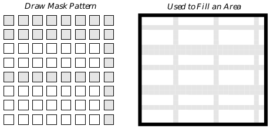  
**Figure 24-24** Masks as Repeating Patterns  
_A drawing mask is a monochrome bitmap. It is repeated to cover an area._

The GrSetAreaMaskSys() routine specifies one of the standard draw 
masks to use when filling areas. GrSetAreaMaskCustom() allows the 
program to specify a custom mask by passing a pointer to an 8 byte. Each 
byte of the buffer represents one row of the mask; the rows are ordered from 
top to bottom. GrGetAreaMask() returns the current area mask.

There are similar routines which set the drawing mask to use when drawing 
lines: GrSetLineMaskSys(), GrSetLineMaskCustom(), and 
GrGetLineMask(). To work with the drawing mask used when rendering 
text, use GrSetTextMaskSys(), GrSetTextMaskCustom(), and GrGetTextMask().

For the most part, it's probably not a good idea to use masks when drawing 
text, since the pixelated nature of the mask is likely to make the text less 
legible. However, when drawing text in very large point sizes, draw masks 
are probably fine.

Since several of the masks are associated with a fill percentage, some 
programmers may confuse masks with gray-scale fills. Grays should be 
implemented with colors, by drawing in a color with equal red, green, and 
blue values.

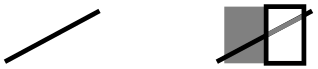  
**Figure 24-25** Drawing with Masks  
_Before drawing the rectangles, the dark line was present. The line shows 
through both the light and dark rectangles. Each rectangle is drawn with a 
50% mask._

When you are building a document image, do not use draw masks just to 
achieve a lighter color. That is, if you are not making use of the "mask" 
property of draw masks (i.e., you don't care if you can see through it), then 
you should just specify a lighter color and let the kernel do the dithering. This 
is important especially because drawing masks in PostScript takes much 
longer than drawing a bitmap of the same size.

When constructing or interpreting system draw mask values, first remember 
that if the SDM_INVERSE flag is set, then the inverse of the mask will be used 
instead of the mask itself. The remaining bits should be a 
SystemDrawMask value, a value between zero and SDM_0. Draw mask 
values between zero and 24 are various graphic draw mask patterns. Values 
between 25 and 89 are percentage fill masks, 89 corresponding to the empty 
fill and 25 to a 100% fill. Several SDM_- constants have been set up with the 
more commonly used system draw patterns. For a list of constants, see the 
Routines manual.

#### 24.3.5 Line-Specific Attributes

GrGetLineWidth(), GrSetLineWidth(), GrGetLineJoin(), 
GrSetLineJoin(), GrGetLineEnd(), GrSetLineEnd(), 
GrSetMiterLimit(), GrGetLineStyle(), GrSetLineStyle(), 
GrSetLineAttr()

Line attributes determine characteristics of lines drawn with the 
GrDraw-() routines. They do not affect anything drawn with the 
GrFill-() routines.

You may work with the width used when drawing lines by means of the 
GrGetLineWidth() and GrSetLineWidth() routines.

The graphics system makes it easy to draw dotted lines. The line style 
attribute controls the "dottedness" with which lines should be drawn; it may 
be changed or retrieved with the GrSetLineStyle() and GrGetLineStyle() 
routines. Lines can be drawn using any of a number of standard system 
LineStyles or by defining a custom dot pattern.

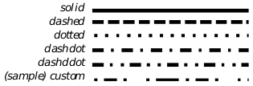  
**Figure 24-26** LineStyles

Custom dot patterns are defined in terms of arrays of pairs of bytes. The first 
byte of each pair gives the distance that the line should be drawn with the 
pen down, the second number the distance with the pen up. The array as a 
whole is stored in a DashPairArray. Dash lengths will scale with the line width.

|Name        |#pairs |on/off pairs |
|:-----------|:------|:------------|
|LS_DASHED   |1      |4 4          |
|LS_DOTTED   |1      |1 2          |
|LS_DASHDOT	 |2      |4 4 1 4      |
|LS_DASHDDOT |3      |4 4 1 4 1 4  |
**Table 24-2** Arrays for System Line Styles

Line joins govern the behavior of angles and corners. Using the appropriate 
line join style, a geode can specify that angles should be blunt, pointed, or 
rounded. GrGetLineJoin() returns the current line join drawing technique, 
while GrSetLineJoin() sets a new line join to use. The join is specified by a 
member of the LineJoin enumerated type. The miter limit governs the 
maximum length of mitererd joins; use GrSetMiterLimit() and 
GrGetMiterLimit() to work with this value.

The GrSetLineEnd() and GrGetLineEnd() routines set and retrieve the 
style with which the graphics system will draw the ends of line segments. 
The ending style is one of the LineEnd values. It may be round, square and 
even with the end of the line, or square and extending past the mathematical 
end of the line.

To set all of the line-drawing attributes at once, call GrSetLineAttr().

[Graphics Environment](cgraph.md) <-- &nbsp;&nbsp; [table of contents](../concepts.md) &nbsp;&nbsp; --> [Machine Architecture](chardw.md)
