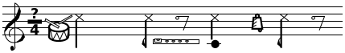
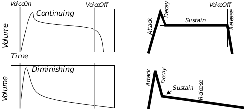
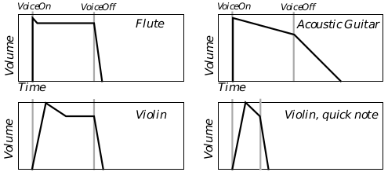
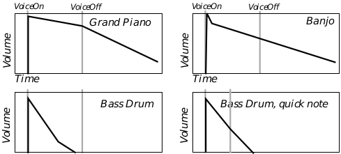

## 13 Sound Library

GEOS includes a powerful sound library. The library allows users to play 
individual notes, sequences of notes, and sampled sounds. It also provides 
support for those sound devices which allow the sampling and playback of 
digitized sounds.

### 13.1 Goals and Motives

The sound library provides multiple tiers of support for a variety of devices. 
You may program multiple-voice compositions (musical pieces which require 
playing more than one note at a time), and the sound driver will determine 
how to best play the sounds if the device does not have enough voices.

The sound library also shows the advantage of a preemptive multithreading 
system like GEOS. The library sets up queues of sounds and arranges for the 
kernel's thread to call the sound driver functions at appropriate times. An 
application can thus arrange ten seconds of music then continue operation as 
the music plays in the background.

The system provides a routine to play standard sounds. By using these, the 
programmer can keep his interface consistent with that of existing programs. 
When the standard system sounds are inappropriate, the programmer can 
use other routines to completely specify the sound's pitch and duration.

### 13.2 Playing UI Sounds

UserStandardSound()

When a program needs to create a UI-related sound, it should call the routine 
**UserStandardSound()**. This routine plays a sound, silencing any other 
sounds which may have been playing. The program may specify either a 
system-standard sound, a custom sound, or a sequence of custom sounds.

Note that if the user has disabled UI sound (via the Preference Manager 
application), **UserStandardSound()** will not play the sound. The sound will 
be played at a high priority-the UI sound will take over the speakers in spite 
of any sound that some other program is generating.

To play one of the standard UI sounds, call **UserStandardSound()** with a 
single argument-a member of the **StandardSoundType** enumerated type. 
**StandardSoundType** has the following members:

SST_ERROR  
The sound produced when an error box appears. 

SST_WARNING  
General-purpose warning tone. 

SST_NOTIFY  
General-purpose tone to notify the user of some occurrence.

SST_NO_INPUT  
Sound produced when the user is making mouse-clicks or 
keypresses that are not going anywhere-the user is clicking 
outside of a modal dialog box, etc. 

SST_KEY_CLICK  
Sound produced when the user types on a real or virtual 
keyboard.

SST_CUSTOM_SOUND 

SST_CUSTOM_NOTE 

SST_CUSTOM_BUFFER  
These are not actually standard sound values, but in fact act as 
signals that you wish to provide a custom sound buffer. 
SST_CUSTOM_BUFFER means that you will provide a pointer 
to a buffer containing the music data. SST_CUSTOM_SOUND 
signals that you are providing a handle to a pre-allocated 
sampled sound. SST_CUSTOM_NOTE signals that you wish to 
play a single note. To learn more about creating custom notes 
and music buffers, see below. 

### 13.3 Representing Tones

Tones are defined by the following characteristics:

+ Frequency (i.e. pitch), expressed in terms of cycles/second (Hertz or Hz). 
The higher the frequency, the higher the pitch. 

+ Duration, which may be measured in milliseconds, sixtieth of a second 
ticks, or by means of a "tempo."

+ Volume, a relative measure of loudness.

+ Instrument, which instructs sound cards which are capable of imitating 
certain musical instruments to do so.

The sound library expects sounds to be specified in terms of cycles/second. 
However, constants have been defined which associate three octaves of tones 
with their values in Hz. As a benchmark, middle A is defined as 880 Hz. 
Doubling the frequency of a pitch is equivalent to raising it by one octave. 
Since there are twelve equal half-steps in an octave, multiplying the 
frequency of a tone by  is equivalent to raising the pitch by a single 
half-step. The constants are defined with the formats

~~~
octave_note
octave_note_accidental
~~~

where octave is "LOW," "MIDDLE," or "HIGH"; note is one of "A" through "G"; 
and accidental, if present, is either "SH" (for sharp) or "b" (for flat). The lowest 
constant defined is LOW_C, approximated as 262 Hz; the highest is HIGH_B, 
approximately 1,976 Hz. 

You may use a frequency that is beyond the range of human hearing (which 
extends from about 20Hz-20,000Hz). Thus, keep in mind that if you can't 
hear a note, the problem may not be that you've set the volume too low.

Duration may be specified in a number of units, by means of the 
**SoundStreamDeltaTimeType** enumerated type. 

~~~
#define SSDTT_MSEC 8
#define SSDTT_TICKS 10
#define SSDTT_TEMPO 12
~~~

Duration may be expressed in milliseconds, timer ticks (each tick is one 
sixtieth of a second), or fractions of notes. Of course, there is no set length for 
a note, but when you actually play the note, you will provide a tempo value 
which will be used to compute the actual sound length. This tempo is just the 
number of milliseconds to play a one-hundred-and-twenty-eighth note. A 
number of constants have been set up to aid you in computing note lengths: 

~~~
#define WHOLE               128
#define HALF                64
#define QUARTER             32
#define EIGHTH              16
#define SIXTEENTH           8
#define THIRTYSECOND        4
#define SIXTYFOURTH         2
#define ONE_HUNDRED_TWENTY_EIGTH   1
#define DOUBLE_DOT_WHOLE     (WHOLE + HALF + QUARTER)
#define DOUBLE_DOT_HALF      (HALF + QUARTER + EIGHTH)
#define DOUBLE_DOT_QUARTER   (QUARTER + EIGHTH + SIXTEENTH)
#define DOUBLE_DOT_EIGHTH    (EIGHTH + SIXTEENTH + THIRTYSECOND)
#define DOUBLE_DOT_SIXTEENTH (SIXTEENTH + THIRTYSECOND + SIXTYFOURTH)
#define DOTTED_WHOLE         (WHOLE + HALF)
#define DOTTED_HALF          (HALF + QUARTER)
#define DOTTED_QUARTER       (QUARTER + EIGHTH)
#define DOTTED_EIGHTH        (EIGHTH + SIXTEENTH)
#define DOTTED_SIXTEENTH     (SIXTEENTH + THIRTYSECOND)
#define DOTTED_THIRTYSECOND  (THIRTYSECOND + SIXTYFOURTH)
~~~

If you're not familiar with the terms "double-dotted eighth note" and "tempo," 
don't worry. Basically, tempo allows you specify your notes' durations in units 
when defining your sound buffer, but delay specifying the length of those 
units until playing time. Thus, you might specify that a note should be 16 
units long when composing your sound buffer. You could then play that note 
with a tempo of 100 milliseconds and the note would sound for 1.600 seconds. 
You might play the sound again later with tempo 50, and that note would last 
only 0.800 seconds. You would not have to do anything to the musical 
composition itself to change this time-scale.

Volume is a relative value, depending on the strength of the machine's 
speakers. You may specify the volume with a word-length value. The 
following constants have been set up to aid you in specifying a volume:

~~~
#define DYNAMIC_FFFF      0xffff /* very loud */
#define DYNAMIC_FFF       0xdfff /* fortississimo */
#define DYNAMIC_FF        0xbfff /* fortissimo */
#define DYNAMIC_F         0x9fff /* forte */
#define DYNAMIC_MF        0x8fff /* mezzo forte */
#define DYNAMIC_MP        0x6fff /* mezzo piano */
#define DYNAMIC_P         0x5fff /* piano */
#define DYNAMIC_PP        0x3fff /* pianissimo */
#define DYNAMIC_PPP       0x1fff /* pianississimo */
#define DYNAMIC_PPPP      0x01ff /* is it playing? */
~~~

By way of comparison, a typical alert beep plays with DYNAMIC_FFF 
(sometimes called "fortissimo," or even "fortississimo") volume.

Some sound devices emulate musical instruments. You may ask that notes be 
played using one of these instruments or even define your own instrument. 
You will specify what sort of instrument you wish to use by means of a 
segment:offset pointer. If the segment is non-null, the pointer should point to 
the instrument's data (for information about setting up this data, see [section 
13.10.3](#13103-advanced-description)); if the segment is NULL, then the "offset" will be 
interpreted as a standard instrument value. The standard instrument 
"patches" are listed in sound.h; they have names like 
IP_ACOUSTIC_GRAND_PIANO and IP_ELECTRIC_SNARE.

Note that many simulated percussion instruments have been set up so that 
they sound most realistic when playing notes of a particular frequency. If 
there is a frequency constant with a name derived from the name of the 
instrument, you should probably play notes of that frequency. For example, 
to simulate an "electric snare," you would use IP_ELECTRIC_SNARE to play a 
note of frequency FR_ELECTRIC_SNARE.

### 13.4 Single Notes

SoundAllocMusicNote(), SoundPlayMusicNote(), 
SoundStopMusicNote(), SoundReallocMusicNote(), 
SoundFreeMusicNote()

The simplest way to play a note is by using **UserStandardSound()** with the 
SST_CUSTOM_NOTE sound type. In this mode, the routine takes a frequency 
and a duration in ticks. The sound will be played immediately, played using 
the instrument patch IP_REED_ORGAN if the sound device supports 
simulated instruments. The note will play with medium loudness.

To play a note at a lower priority (so it won't neccessarily interrupt other 
sounds), or with a different loudness, or as if by an instrument other than a 
reed organ, you will create and play a custom note.

The task of playing a custom note breaks down as follows:

1. Allocate the note with **SoundAllocMusicNote()**.

2. Play it with **SoundPlayMusicNote()** or **UserStandardSound()**.

3. Free it with **SoundStopMusicNote()** and **SoundFreeMusicNote()**.

First, you must set up the data structure containing the note's data. 
**SoundAllocMusicNote()** takes a frequency, a duration, a volume, and an 
instrument and returns the handle to a data structure which the sound 
library will understand. See Code Display 13-1 for an example. 

---
Code Display 13-1 Allocating Single Music Notes
~~~
/* BigBlatt is a Cb (C flat) Half-note, which will sound as if played by a trumpet.
 *  This means a tone of 494Hz with duration (128 * playing tempo). */
SoundErr = SoundAllocMusicNote ( IP_TRUMPET, 0, /* Play as if with a trumpet */
                MIDDLE_C_b,    /* C flat, 494 Hz. */
                DYNAMIC_FFF,   /* Play it rather loudly */
                SSDTT_TEMPO,   /* Length based on 128th notes */
                WHOLE,         /* Duration = 128/128 notes */
                &BigBlatt);     

/* SubliminalTone is an A note lasting 0.3 sec which will sound as if it was being
 *  played very quietly on an electric piano. It will play at 880Hz. */
SoundAllocMusicNote( IP_ELECTRIC_PIANO_1, 0, /* As if on piano */
                MIDDLE_A,      /* Middle A, 880 Hz. */
                DYNAMIC_PP,    /* Play it rather quietly. */
                SSDTT_MSEC,    /* Length based on milliseconds */
                300,           /* Duration = 0.300 seconds */
                &SubliminalTone);
~~~

There are two ways to play a note. The first is to call **UserStandardSound()** 
with the SST_CUSTOM_SOUNDS sound type, passing the handle returned by 
**SoundAllocMusicNote()**. The other is to call **SoundPlayMusicNote()**, 
supplying the proper tempo and priority level. **UserStandardSound()** uses 
a tempo of 8 millisecond per one-hundred-and-twenty-eighth note; this is 
somewhat fast; tempo-based notes are not normally used with 
**UserStandardSound()**.

When playing a note or sound buffer, you must provide a sound priority level. 
Sounds may interrupt one another, so if you ask to play a sound more 
important than that which is presently playing, your sound will take 
precedence and will play immediately. The following sound priority levels are 
available:

SP_SYSTEM_LEVEL  
SP_ALARM  
SP_STANDARD  
SP_GAME  
SP_BACKGROUND  
SP_IMMEDIATE  
SP_THEME

The lower the priority's numerical value, the more important the sound. The 
SP_SYSTEM_LEVEL_IMMEDIATE constant is the most important of those 
listed above and has the lowest numerical value.

The SP_IMMEDIATE and SP_THEME values are a bit unusual in that they are 
meant to be combined with the other priorities, as modifiers of base priority. 
Thus a sound whose priority was (SP_STANDARD + SP_IMMEDIATE) would 
edge out a sound which was just SP_STANDARD. A sound which had priority 
(SP_STANDARD + SP_THEME) would be edged out by the 
SP_STANDARD_SOUND. And all of these sounds would take precedence over 
a sound whose base priority was SP_GAME or SP_BACKGROUND.

---
Code Display 13-2 Playing Single Music Notes
~~~
/* UserStandardSound() with note:
 * We will play a quick high E note for 0.020 seconds. */
UserStandardSound(SST_CUSTOM_NOTE, HIGH_E, 20);

/* UserStandardSound() with allocated note:
 * We will play the Subliminal tone immediately. */
UserStandardSound(SST_CUSTOM_SOUND, SubliminalTone, 0);

/* SoundPlayNote():
 * Total playing time of BigBlatt will be (WHOLE*62)=(128*8)=1024 msec = 1+ sec. */
SoundPlayMusicNote(BigBlatt, SP_STANDARD + SP_IMMEDIATE, 8, EOSF_UNLOCK);
~~~

You may stop a note from playing at any time by invoking 
**SoundStopMusicNote()**. 

To free the note's data structure, call **SoundFreeMusicNote()**. You should 
make sure that the note has stopped playing first (call 
**SoundStopMusicNote()** if you are not sure).

To change any of the characteristics of a note, call 
**SoundReallocMusicNote()**. You should make sure that the note has 
stopped playing first (call **SoundStopMusicNote()** if you are not sure).

---
Code Display 13-3 Stopping and Freeing a Note
~~~
/* Stop the SubliminalTone if we're playing it, then change the stored note */
SoundStopMusicNote(SubliminalTone);
SoundReallocMusicNote(SubliminalTone, LOW_C, DYNAMIC_PPP,
                    SSDTT_MSEC, 500, IP_TINKLE_BELL, 0);

/* Stop the BigBlatt if we're playing it, then discard it */
SoundStopMusicNote(BigBlatt);
SoundFreeMusicNote(BigBlatt);
~~~

### 13.5 Declaring Music Buffers

You may set up a buffer of notes to be played. This buffer may include 
information for several voices. If you are familiar with constructing MIDI 
streams, you will find that setting up GEOS music buffers is a similar process.

Sound buffers are made up of events and timer ticks. The various event types 
are defined in the enumerated type **SoundStreamEvent**-each event is 
signalled by one of the values listed below and includes one or more words of 
data describing the event specifics:  

`SSE_VOICE_ON` Start a note. The next words of data contain the note's characteristics:  

-  **voice** The voice on which the note should play. If your composition
has notes playing on more voices at a time than the device can 
handle, then some will not be played.

- **frequency** The note's frequency (e.g. MIDDLE_C).

- **volume** The note's loudness (e.g. DYNAMIC_MF).

`SSE_VOICE_OFF` End a note. This does not necessarily mean that the voice will stop 
making sound-this corresponds to releasing the key of a piano, and 
some sound may linger on. Ending the note also signifies that the voice 
is "free"; if another sound on the queue wants to appropriate that voice, 
then it can. There is one word of data:

- **voice** The voice which should stop playing.

`SSE_CHANGE` Change a voice's instrument. There are three words of data:

- **voice** The voice to be changed.

- **pointer** Pointer (two words) to new instrument structure to use (or 
standard InstrumentPatch value such as IP_CLARINET 
followed by the IP_STANDARD_TABLE word constant to signal 
that a standard instrument is being used). 

`SSE_GENERAL` A miscellaneous event (some possible values are discussed below). The 
number and meaning of data words will depend on the event.

Time is expressed as a unit and a duration. The unit is one of the 
**SoundStreamDeltaTimeType** values; the duration specifies how many of 
these units should be allowed to pass.

---
Code Display 13-4 Simple Sound Buffer Example
~~~
#define MELODY 0
#define PERC 1
static const word themeSongBuf[] = {
    SSE_CHANGE,     MELODY, IP_FLUTE,   /* We want voice 0 to 
                                         * play like a flute. */

    SSE_CHANGE,     PERC, IP_ACOUSTIC_SNARE,  /* voice 1 should play 
                                               * like a drum. */

    SSE_GENERAL,    GE_SET_PRIORITY, SP_GAME, /*Set priority of sound */

    SSE_VOICE_ON,   PERC, FR_ACOUSTIC_SNARE, DYNAMIC_F, /* Hit the drum. We are
                                                         * hitting it hard (forte)
                                                         * with a C note. */

    SSDTT_TEMPO,    QUARTER,                            /*A quarter note passes-*/

    SSE_VOICE_OFF,  PERC,                               /* Pick up drumstick- */

    SSE_VOICE_ON,   PERC, FR_ACOUSTIC_SNARE, DYNAMIC_F, /* hit the drum */

    SSDTT_TEMPO,    EIGHTH,
    SSE_VOICE_OFF,  PERC,                                 /* Pick up drumstick */

    SSDTT_TEMPO,    EIGHTH,                               /* For one eighth-note, no
                                                           * instruments playing */

    SSE_VOICE_ON,   PERC, FR_ACOUSTIC_SNARE, DYNAMIC_F,   /* Tap the drum- */

    SSE_VOICE_ON,   MELODY, LOW_C, DYNAMIC_MP,            /* -and start the flute */

    SSDTT_TEMPO,    QUARTER,                              /* Advance a quarter-note
                                                           * of time. */

    SSE_VOICE_OFF,  PERC,                                 /* Pick up the drum stick
                                                           * (but we'll continue 
                                                           * the flute) */

    SSE_CHANGE,     PERC, IP_COWBELL,                     /* Switch instruments */

    SSE_VOICE_ON,   PERC, FR_COWBELL, DYNAMIC_F,          /* Hit bell */
    SSDTT_TEMPO,    EIGHTH,                               /* Advance eighth note */
    SSE_VOICE_OFF,  PERC,                                 /* Stop hitting bell */
    SSDTT_TEMPO,    EIGHTH,                               /* Advance one more eighth- */

    SSE_VOICE_OFF,  MELODY,                               /* -and stop blowing on flute */

    SSDTT_TICKS,    120,                                  /* Let sound die out 
                                                           * for two seconds */

    SSE_GENERAL,    GE_END_OF_SONG};                      /* We`re done */
~~~

**Figure 13-1** Sheet Music Excerpt for Example  
_Percussion will play two notes then rest. Next, melody will play a long note, while percussion 
plays a note, switches instruments, plays another note, and rests._

The song buffer must end with a GE_END_OF_SONG event.

The following general events may be incorporated into any sound buffer:

`GE_NO_EVENT`  

No event at this time. This event may be sandwiched between other 
events when a long duration is necessary.

`GE_END_OF_SONG`  

Signals the end of the sound buffer. Every song buffer must end with this 
event.

`GE_SET_PRIORITY`  

Change the sound's priority. It has one word of data:
- **priority** New priority level to use.

GE_SET_TEMPO  

Change the sound's tempo. It has one word of data:

- **tempo** New tempo to use, as measured by the number of milliseconds 
to apportion a one-hundred-and-twenty-eighth note.

`GE_SEND_NOTIFICATION`  

Send a message to an object upon reaching this point in the sound buffer. 
It has three words of data, consisting of a Message and an optr:

- **message** This is a Message value, the message to send to the object. Note 
that this message should not require any arguments. This 
message will be sent as if with the forceQueue message flag.

- **object** This is an optr, the message's intended recipient. This object 
may be disabled.

`GE_V_SEMAPHORE`  

Release a semaphore. There is one word of data:

- **semaphore** The handle of the semaphore to release ("V").

### 13.6 Playing Music Buffers

SoundAllocMusic(), SoundInitMusic(), SoundPlayMusic(), 
SoundStopMusic(), SoundReallocMusic(), SoundFreeMusic()

If your sound buffer is stored in a movable resource, and you only want that 
resource to be locked down while the music is playing, call 
**SoundInitMusic()** and pass the handle of a block containing the music. The 
block should contain a SimpleSoundHeader structure which specifies the 
number of voices in the buffer, followed by a music buffer as described above.

If your sound buffer is in fixed or locked memory, you must allocate space in 
the area accessible to the sound library by calling **SoundAllocMusic()**. This 
returns a handle to a sound block which you will be passing to other sound 
routines. You may pass a flag requesting that the data from which the sound 
was allocated be automatically unlocked and/or freed. Note that since sound 
buffers often become rather large, it is normally a bad idea to leave them in 
fixed memory, and normally inadvisable to make them fixed for very long. If 
you use **SoundAllocMusic()**, the sound buffer will have to remain locked for 
as long as the music is playing.

To play the sound, call **SoundPlayMusic()**. You must provide the handle 
returned from the sound allocation, a tempo, and a priority. 

---
Code Display 13-5 Preparing and Playing Sound Buffers
~~~
SoundInitMusic(MySongResource, 1);

SoundErr = SoundAllocMusic( &themeSongBuf, 
                2,      /* themeSongBuf has two voices,
                         * MELODY and PERC. */
                &theSong);      

SoundPlayMusic(theSong, SP_STANDARD, 125, EOSF_UNLOCK);

UserStandardSound(SST_CUSTOM_SOUND, MySongResource, 33);
~~~

To stop playing the sound, call **SoundStopMusic()**. This routine will not 
affect songs which are not playing.

To free up the sound handle and data associated with the sound, call 
**SoundFreeMusic()**. You should never free a sound which is playing; if you 
think that a sound may be playing, call **SoundStopMusic()** before freeing it.

To reuse a sound handle with a new sound buffer, call 
**SoundReallocMusic()**. The number of voices may not be changed by 
reallocation. You should never reallocate a sound which is playing; if you 
think that a sound may be playing, call **SoundStopMusic()**.

---
Code Display 13-6 Stopping and Freeing a Sound
~~~
/* We are done with the theme song and want to play our ending song. Instead of
 * allocating a new song handle, we'll just reallocate the one we were using to
 * store the data taken from the themeSongBuf, and use the data from 
 * endingSongBuf. The endingSongBuf had better only contain data for two
 * voices (or fewer). */
SoundStopMusic(theSong);
SoundReallocMusic(theSong, (_far)&endingSongBuffer, FREE_ON_EOS);
SoundPlayMusic(theSong, SP_STANDARD, 125);

/* If we're done with "theSong" handle, then we can free it, after making sure 
 * it has stopped playing. */
SoundStopMusic(theSong);
SoundFreeMusic(theSong);
~~~

### 13.7 Playing Very Large Music Buffers

SoundAllocMusicStream(), SoundPlayToMusicStream(), 
SoundStopMusicStream(), SoundFreeMusicStream()

You may wish to play a sound which takes up a great deal of memory. If you 
wish to play an extremely long music buffer, you can play parts of it to a 
music stream. For instance, to play a 1 Megabyte music buffer (requiring too 
large a block of memory for the routines described in the above sections), you 
would play 4K of it at a time to a music stream, which would concatenate the 
music together. Normally, these "music stream" commands are the best to 
use when playing a music buffer whose sound resides on a disk. To allocate a 
special stream which will accept music data, call 
**SoundAllocMusicStream()**. To play music into the stream, call 
**SoundPlayToMusicStream()**, passing a pointer to the buffer of music to 
play. To stop the passage of music through the stream and flush the buffer, 
call **SoundStopMusicStream()**. To free up the music stream, call 
**SoundFreeMusicStream()**. Make sure that there is no music playing 
through the stream when you free it; be sure to call 
**SoundStopMusicStream()** if you are not otherwise sure.

### 13.8 Playing Sampled Sounds

Once you have your sound data structure set up, the basic steps to playing 
the sound are

1. Allocate a DAC stream.

2. Enable the DAC stream.

3. Play your sampled sound data into the enabled stream. Play the sound 
as many times as you like. You may play other sampled sounds to the 
same stream.

4. Disable the DAC stream when you're finished with it.

To allocate a DAC stream, call **SoundAllocSampleStream()**. This will 
return a memory handle which you will use to identify the sound stream as 
you manipulate it with other routines.

When you are ready to start playing sounds to the stream, call 
**SoundEnableSampleStream()**. This routine grabs access to a physical 
DAC player device. Note that you will specify a **SoundPriority** for the 
stream, and that you will not be able to change this priority from sample to 
sample. Also note that if a sound is playing on the stream and you queue 
another sound to the stream, then the second sound will be queued behind 
the first. Thus, if your application wishes to play simultaneous sounds 
capable of interrupting one another, it should allocate more than one sound 
stream. 

If there are more DAC streams than the sound device has DAC outputs, then 
the sound system will have to decide which sounds to play when too many 
play at once.

Sounds with a higher priority will oust those with lower priority. Note that 
the lower priority sound will not come back when the more important sound 
is finished-thus, a short alert noise might cause a few seconds of sampled 
speech not to play at all. If your application will be playing sampled sounds 
at more than one priority, you may thus want to make sure that the 
lower-priority sounds are broken up into small pieces.

If a sound wants to play, but all the available DAC outputs are playing 
higher-priority sounds, then the sound will not play.

To actually play a sound to your enabled sound stream, call 
SoundPlayToSampleStream(). This routine takes a pointer to the sound 
data, (which should be in a locked area of memory). The sound data will be 
copied to the DAC stream's buffer, and you may thus free the sound data after 
you have played it to the DAC stream. The sound will be queued at the end of 
the stream's data. The sound device's sound driver will read from the stream 
and will eventually play the sound.

When you are done playing sounds to a stream, you should free up the stream 
by calling SoundDisableSampleStream(). 

If you wish to enable a new DAC stream with the same sound token, but with 
a different SoundPriority, you may do so using 
**SoundEnableSampleStream()** (You should call 
**SoundDisableSampleStream()** on the token before enabling it in this 
way). You should eventually call **SoundDisableSampleStream()** again in 
this case.

Once the DAC stream has been disabled, you may free up the sound token by 
calling **SoundFreeSampleStream()**. You should call this with all sound 
tokens before your application exits.

### 13.9 Grabbing the Sound Exclusive

SoundGetExclusive(), SoundGetExclusiveNB(), 
SoundReleaseExclusive()

If your sound device has multiple voices and/or DAC outputs, then more than 
one application may play sound at a time. If the highest priority sound does 
not use all of the card's voices, then the next priority sound will be allowed to 
use them.

Most of the time, this is the behavior you want. This allows you to have 
sounds going on in the background and foreground at the same time. 
However, if your application will be creating some sound so important that 
no other application should be allowed to interrupt it, you may grab exclusive 
access to the sound routines. 

**SoundGetExclusive()** grabs a semaphore associated with the sound library 
(performs a "P" operation). Your thread thus makes it known that it wants 
sole access to the sound library, and will wait, if necessary, for any other 
thread which has grabbed sole access to finish. It will then grab exclusive 
access to the sound library's low level routines. Until you release the 
exclusive, no other thread will be able to use the **SoundAllocMusic()**, 
**SoundAllocMusicStream()**, **SoundAllocMusicNote()**, 
**SoundPlayMusic()**, **SoundPlayToMusicStream()**, **SoundStopMusic()**, 
**SoundStopMusicStream()**, **SoundReallocMusic()**, 
**SoundReallocMusicNote()**, **SoundAllocSampleStream()**, 
**SoundEnableSampleStream()**, or **SoundPlayToSampleStream()** routines.

The **SoundGetExclusiveNB()** routine also locks the sound library for 
exclusive access. However, if any other thread has already grabbed the 
exclusive, **SoundGetExclusiveNB()** won't wait; it will just grab the 
exclusive away anyhow. 

To release the exclusive, call **SoundReleaseExclusive()**. This will allow 
sounds to enter the queue and will allow another thread which has called 
**SoundGetExclusive()** to grab the exclusive.

### 13.10 Simulating Musical Instruments

In addition to the standard instruments provided by the system, you may 
define instruments of your own. To do so, you must first find out what sort of 
instrument format the user's sound driver expects. You will then pass a 
pointer to the appropriate data structure.

To find out what sort of data structure the sound driver expects, call 
**SoundSynthDriverInfo()** and note the value returned at the format 
pointer argument.

#### 13.10.1 Acoustics In Brief

Sound may be thought of in terms of waves. A pure tone manifests as a sine 
wave. The higher the frequency of the wave (as measured in Hertz), the 
higher the pitch of the generated sound. A piccolo would generate a wave 
with a high frequency; a tuba would generate a low frequency. The amplitude 
of the wave translates to the sound's volume, or loudness. Cannons generate 
sound waves with great amplitude.

A tone consists of a sound of one frequency. Full, rich sounds are created by 
making sound at more than one frequency. If you generate sound at multiples 
of the base frequency, you get a good broad, rich sound and the frequencies 
beyond that of the note itself are known as "harmonic" frequencies. However, 
the volume levels should be lower at these harmonic frequencies than at that 
of the note itself. Together, these frequencies can form the sounds of chords. 
A rich instrument such as an organ will make sounds on many frequencies 
other than that of the main note. A violin, with a very pure tone, will generate 
almost no sound on frequencies other than that of the note being played.

#### 13.10.2 Simple Instrument Description

The simple instrument description allows you to specify a way for less 
powerful devices to emulate different musical instruments. You describe 
three volume levels, each of which can be between 0 and 255. The 
fundamental tone will play at the first volume level; the second volume will 
be used for playing the first harmonic frequency; the third volume for playing 
the second harmonic.

Simple instruments have another characteristic: you can specify a noise 
component. By means of noise, you impart sibilance to the sound, giving it a 
"breathy," sometimes hissing quality. A sound without noise will seem crisp 
by comparison. At this time, the simple sound format supports three kinds of 
noise:

`NO_NOISE`  
The lack of noise. Use for crisp, acute sounds. This value is 
guaranteed to be zero.

`WHITE_NOISE`  
Noise evenly distributed across all frequencies.

`METAL_NOISE`  
Noise only at the lower frequencies-you may think of this as 
standard white noise which has gone through a low-pass filter. 
Noise generated will have a lower tone, and have a less 
hiss-like quality than those with white noise. If cymbals have 
white noise, then drums have metal noise.

To describe an instrument with no noise component, specify the three volume 
levels and leave the noise component as zero.

~~~
CTIEnvelopeFormat BrokenTuba =
    {255,       /* Primary: full strength */
     64,        /* First harmonic: 25% strength */
     10,        /* 2nd harmonic: 10% strength */
     0};        /* No noise */
~~~

To describe an instrument with noise, you must specify a type and a degree 
of noise (encoded as two bits describing what sort of noise OR'd together with 
six bits describing the degree of noise, if any):

~~~
CTIEnvelopeFormat FunkyPiano = 
    { 255, 32, 17, ((NT_WHITE_NOISE << 6) | 10) };

CTIEnvelopeFormat NoisyDrum = 
    { 0, 0, 0, ((NT_METAL_NOISE << 6) | 63 ) };
~~~

#### 13.10.3 Advanced Description

The advanced instrument description data structures were set up with the 
SoundBlaster card in mind; for detailed information (i.e. timing numbers) 
about these fields, you should purchase a copy of the SoundBlaster 
Development Kit and read the chapter about Programming the FM Chip. 
However, you may first want to read the documentation below for an 
introduction to some of the involved concepts:

+ As with the simple instrument format, you'll specify the richness of your 
instrument, how its sound shows up at frequencies other than the base 
frequency. This is done using a technique known as "Frequency 
Modulation."

+ You will also work with the instrument's loudness, or sound level. You 
may specify that some instruments are louder than others. You may also 
specify how the sound level changes over time.

**Frequency Modulation**

Frequency modulation allows you to specify how an instrument's sounds will 
appear at its harmonic frequencies. You can even use it to set up sound at 
frequencies other than the harmonics. The sound device does this by means 
of a "modulating" frequency.

The sound device actually keeps track of two frequencies. The carrier 
frequency, corresponding to the note being played, can be thought of as 
constant for a given note being played. This frequency may be input to a 
sound wave generator, and the resulting wave to a speaker, resulting in a 
pure tone. A frequency modulating (FM) system does not just use a constant 
frequency, but actually adds a wave signal to the carrier frequency to achieve 
a frequency which changes over time. Consider a siren-its frequency 
changes over time. However, in an FM system, these changes come much 
more quickly. 

The wave signal which gets added to the carrier frequency is known as the 
modulating signal, and you may change the nature of your instrument's 
harmonics by changing the characteristics (amplitude, frequency) of this 
modulating signal. 

The input to the speaker-this wave which is constantly changing frequency, 
thanks to the modulating signal-is called the output signal.

The net effect of this is that the carrier signal will contain several 
frequencies. In fact, those frequencies will be spaced apart by a constant 
distance-the frequency of the modulating signal. If the modulating 
frequency is the same as the frequency of the note being played, then this 
means that the carrier will contain sounds at the note and its harmonic 
frequencies.

Thus, you may use the modulating signal to set up sound on the harmonic 
frequencies, just as you did with the simple instrument description. The FM 
system is a bit more adaptable in that by making the modulating signal some 
multiple of the main note, you can create sound at every other harmonic 
frequency, or possibly at each harmonic and any number of frequencies 
between each harmonic. 

Furthermore, you can change the strength of the sound at the various 
frequencies by changing the amplitude, or level, of the modulating signal.

**Changing Sound Levels**

Notes in a sound buffer have a single volume, or loudness. However, when 
you play a note on a musical instrument, the volume level is not constant. 
When you hit a drum, the sound is instantaneous-it doesn't matter if you 
pull the drumstick back a moment or a minute later, all the sound is 
generated in a single instant. When you press a piano key, a string inside the 
piano will start vibrating, producing sound. This string will continue to 
produce sound (though it will grow gradually quieter). Thus, to truly 
differentiate instruments, we need a model for an instrument's loudness over 
time. This change over time is known as an instrument's envelope. 

The advanced instrument description uses a standard ADSR model of an 
instrument's envelope. That means it breaks a sound's life time into four 
parts: an Attack, Decay, Sustain, and Release. Each instrument has a value 
for each stage of its envelope, and will determine the length of that stage of 
the life-span. Also, you may use an envelope type to specify whether the 
sound should continue for as long as the voice is on (like an organ), or should 
die off automatically (like a drum). In the GEOS model, attack, decay, and 
release are all slopes; sustain is a sound level, expressed as a fraction of the 
note's volume.

  

Figure 13-2 Modeling with the ADSR envelope.  

For a continuing (organ-like) instrument, the sound level will progress thus:

**Attack**  
The sound level will build up to that specified for the note (e.g. 
DYNAMIC_MF). The higher the attack value, the more quickly 
this will occur. Note that if the voice is turned off during this 
stage, the sound will go immediately to the release stage (This 
simulates that the instrument was never allowed to reach peak 
volume, as if an organist had tapped an organ key instead of 
keeping it depressed.

**Decay**  
The sound level will decrease at a rate determined by the decay 
value. The higher the decay, the more quickly the sound level 
will fall off. If the voice is turned off during this stage, the 
sound will immediately enter the release stage.

**Sustain Level**  
The sound level will fall off at the decay rate until it has fallen 
to the sustain level. This sustain level is expressed as a fraction 
of the note level, so you might, for example, specify that the 
sound level should stop decaying once it has fallen 25 percent. 
The sound level will remain at the sustain level until that note 
ends (i.e. the voice is turned off).

**Release**  
The voice will then decrease at a rate determined by the release 
value. The higher the release, the more quickly the sound level 
will fall off. The sound will continue to fall until inaudible.

  
Figure 13-3 Continuing Instrument Envelopes  
_The flute shows a typical continuing instrument envelope, made up of four 
segments. The guitar has a small decay value, and thus the volume has not 
fallen to the sustain level when the voice goes off, and the volume starts 
falling at the release rate. You can see how the Violin can be similar to either 
of these patterns, depending on when the voice is turned off._

For a diminishing (drum-like) instrument, the sound level progresses:

**Attack**  
The sound level will build up to that specified for the note (e.g. 
DYNAMIC_FF). The higher the attack value, the more quickly 
this will occur. If the voice is turned off partway through the 
attack the sound will immediately enter release, never 
reaching full volume, and skipping the decay stage.

**Decay**  
The sound level will decrease at a rate determined by the decay 
value. The higher the decay, the more quickly the sound level 
will fall off. If the voice is turned off during this time, the sound 
will go into release without waiting to reach the sustain level.

**Sustain Level**  
The sound level will fall off at the decay rate until it has fallen 
to the sustain level. This sustain level is expressed as a fraction 
of the note level, so you might, for example, specify that the 
sound level should stop decaying once it has fallen 25 percent. 
Unlike a continuing instrument, the sound level will 
immediately move on to the release stage, regardless of 
whether the voice has been turned off.

**Release**  
The voice will decrease at a rate determined by the release 
value. The higher the release, the more quickly the sound level 
will fall off. The sound will continue to fall until inaudible.

  
Figure 13-4 Diminishing Instrument Envelopes  
_The piano demonstrates the envelope of a typical diminishing instrument 
envelope._

In case that isn't enough to keep track of, consider the following: You may 
also specify an ADSR envelope for your modulating signal. This actually 
comes in handy-many instruments attack with a rather broad sound, but 
will sharpen to a single tone while sustaining or releasing. By setting up a 
modulator envelope so that the modulator signal is strong while the main 
signal is attacking but weak when the modulator is passed this point, you 
may simulate this behavior.

**Pieces of the Advanced Instrument Format**

Now that you understand the main forces governing how your sound will be 
modeled, you are ready to use the SBIEnvelopeFormat data structure. 
This structure has fields for the following values:

**SBIEF_carTimbre: Carrier Timbre**  
This field contains several effects which may be applied to the carrier 
wave.

* Amplitude Tremolo  
This flag requests that a wave signal be added to the carrier's 
sound level, producing a sort of "tremolo" effect. 

* Frequency Vibrato  
This flag requests that a wave signal be added to the carrier's 
frequency, producing a "vibrato" effect. Note that the 
modulating signal adds a wave to the carrier's base frequency, 
but vibrato is separate and different: The modulating 
frequency is dependent on the note frequency, but the vibrato 
wave's frequency is a constant; that is, you may control the 
modulating amplitude, but the vibrato's amplitude is fixed.

* Envelope Type  
This flag specifies the envelope type of the 
instrument-continuing or diminishing.

* Key Scaling Rate  
Some instruments, especially stringed instruments, tend to 
produce shorter notes at the higher frequencies. This flag 
allows you to simulate this type of instrument-at the higher 
frequencies, the carrier's ADSR values will be boosted, so that 
the note's life span will be shorter.

* Frequency Multiplier  
You may apply a multiplying factor to the carrier frequency. If 
this factor is greater than one, then the instrument will tend to 
play notes at a higher pitch-if the factor is two, for example, 
the instrument will play one octave higher than normal. If the 
factor is one-half, then the instrument will play one octave 
lower than normal.

**SBIEF_carScaling: Carrier Scaling**  
This field contains information about the carrier's basic scaling-its 
basic loudness, before the effects of the ADSR envelope are applied.

* Key Scaling Level  
Some instruments tend to play high-pitch notes quietly. You 
may set this value to specify how much the sound level should 
decrease when playing high frequencies: the higher the 
number, the faster the decrease. Zero means you want no 
decrease.

* Total Level  
This is the base loudness of your instrument, but be 
careful-the higher the number, the quieter the instrument. If 
this value is zero, then you want your instrument to sound as 
loud as possible. 

**SBIEF_carAttack: Carrier Attack/Decay**  
This field contains the attack and decay portions of the carrier's ADSR 
envelope.

* Attack  
This is the instrument's "attack," its rate of sound level 
increase from none to the note's sound level. This time could 
range from something measured in seconds to nearly 
instantaneous. Increasing the attack level by one effectively 
doubles the attack rate. Percussive instruments tend to have 
high attacks, bowed and wind instruments tend to have 
medium to low attacks. Not many instruments have attack 
levels towards the bottom of the scale, and the higher attack 
levels are almost exclusively the province of special effects.

* Decay  This is the instrument's "decay," its rate of decrease from the 
note's sound level to the sustain level. This rate of decay is 
about one fifteenth of an Attack of the same level (i.e. decays 
are on a slower scale than attacks). Instruments which get 
quiet soon after being activated will have high attacks 
(especially diminishing-type instruments of this nature). A 
chime would have almost no decay, while a drum would have a 
medium-level decay-almost no instruments will have a decay 
more than halfway up the scale.

**SBIEF_carSustain: Carrier Sustain/Release**  
This field contains the sustain and release portions of the carrier's ADSR 
envelope.

* Sustain  
This is the instrument's "sustain." It is a fraction, which will be 
multiplied by the note level to find the true sustain level. 
Continuing-type instruments will stay at this sound level until 
they encounter a voice-off command. Diminishing instruments 
will not (proceeding immediately to release). 

* Release  
This is the instrument's "release," its rate of decrease from the 
sustain level to silence. This rate will be the same as a decay of 
the same level (i.e. decays and releases happen at the same 
rate). In a piano, a damper hits the string when you release the 
key, stopping sound quickly; a piano has a high release. Bells, 
which continue vibrating for a long time after being hit, have a 
low release rate. 

**SBIEF_carWave: Carrier Wave**  
Most natural sounds correspond to a sine wave. However, you may 
request another type of wave.

**Wave Type** There are four choices of wave:

+ Sine wave. The standard y = sin(x) curve.

+ Truncated sine wave: y = MAX(0, sin(x)). This results in something like a 
square wave.

+ Absolute value sine wave: y = |sin(x)|. This results in something 
approaching a triangle wave. This results in a somewhat "tinny" sound.

+ Chopped sine wave: { 0 \A3 x \A3 90, 180 \A3 x \A3 270: y = |sin(x)|; 90 \A3 x \A3 180, 
270 \A3 x \A3 360: y = 0}. This wave is similar to a sawtooth wave.

**SBIEF_modTimbre: Modulator Timbre**  
This field contains a number of effects which you may apply to the 
modulator signal. Thus, applying a tremolo effect results in a sound 
which wobbles in breadth over time-the amplitude of the modulator is 
being changed, not that of the final signal.

* Amplitude Tremolo  
This flag adds a sine wave signal to the modulator's amplitude. 
You will recall that the modulator's amplitude determines the 
"breadth" of the sound-how far it will extend into other 
frequencies. Applying a tremolo effect to this value will cause 
the sound to vary in breadth over time.

* Frequency Vibrato  
This flag adds a sine wave signal to the modulator's frequency. 
You will recall that the frequency determines the distance 
between frequencies at which the carrier signal will have 
sound. If you have set up the modulating signal to have sound 
appear at the harmonics, then applying this effect will cause 
the supplement sounds to warble around the harmony level.

* Envelope Type  
This flag specifies the envelope type of the modulator signal's 
envelope (continuing or diminishing).

* Key Scaling Rate  
This flag boosts the ADSR values of the modulator signal when 
the note is at a high pitch. You would apply this factor if an 
instrument's breadth dissipated faster at high frequencies.

* Frequency Multiplier  
This is the field which gives you your main control over the 
modulating signal's frequency. You may apply a multiplying 
factor to the modulating signal's frequency. If the modulating 
signal's frequency is the same as the carrier frequency, then it 
will create harmonic frequencies. If the modulating frequency 
is a multiple of the carrier frequency, then it will generate 
harmonic frequencies, and others in between. If the 
modulating frequency is a fraction of the carrier frequency, 
then it will generate some but not all harmonic frequencies. 
Percussion instruments, whose sounds tend to manifest as 
quick bursts of noise, tend to have very high modulator 
frequency multipliers.

**SBIEF_modScaling: Modulator Scaling**  
These fields allow you to control the amplitude of the modulating signal, 
and thus the breadth of the carrier signal.

* Key Scaling Level  
This field specifies that the amplitude should be lower when a 
high-pitch note is played. This means that higher notes will 
seem sharper, more piercing. The greater the value of this field, 
the more quickly the amplitude will fall off; if this value is zero, 
then the amplitude will be unaffected.

* Total Level  
This field allows you to directly change the amplitude of the 
modulator signal-but be careful: the higher the value of this 
field, the lower the amplitude. The lower the value of this field, 
the broader the sound.

**SBIEF_modAttack: Modulator Attack/Decay**  
These fields allow you to control the attack and decay portions of the 
modulating signal's ADSR envelope.

* Attack  
This field determines how quickly the modulating signal will go 
to full amplitude-creating the broadest sound. This is often 
one or two levels higher than the carrier signal's attack level 
(resulting in an actual attack rate two to four times faster), 
resulting in a sound broadest during the carrier's attack 
period, characteristic of many instruments. Wind instruments 
tend to have a slow modulating attack.

* Decay  
This field determines the rate at which the modulating 
amplitude will decrease until it reaches the sustain level. This 
value is normally kept low to maintain the instrument's 
breadth during and beyond the instrument's attack.

**SBIEF_modSustain: Modulator Sustain/Release**  
These fields control the sustain and release portions of the modulating 
signal's ADSR envelope.

* Sustain  
This determines the level to which the amplitude will be 
allowed to decay. If the modulating signal is continuing-type, it 
will remain at this sustain level until the voice is turned off. 

* Release  
This determines the rate at which the amplitude will decrease 
from the sustain level. The higher the value, the faster the 
sound will reduce to a pure tone. 

**SBIEF_modWave: Modulator Wave**  
You may apply any supported wave type in place of a sine wave for the 
modulator signal. This allows you to change the distribution of sounds 
over other frequencies.

**Wave Type** There are four choices of wave:

+ Sine wave. The standard y = sin(x) curve.

+ Truncated sine wave: y = MAX(0, sin(x)). This results in something like a 
square wave.

+ Absolute value sine wave: y = |sin(x)|. This results in something 
approaching a triangle wave. 

+ Chopped sine wave: { 0 \A3 x \A3 90, 180 \A3 x \A3 270: y = |sin(x)|; 90 \A3 x \A3 180, 
270 \A3 x \A3 360: y = 0}. This wave is similar to a sawtooth wave.

**SBIEF_feedback: Feedback**  
This field allows you to change the way the modulator and carrier signals 
are combined.

* Feedback Type  
Instead of adding the modulating signal to the note frequency, 
you can bypass all frequency modulation and just add the 
outputs of the "modulator" and "carrier" signals. If you set this 
flag, then both signals become, in effect "carrier" signals-both 
will generate a note, not a breadth.

* Feedback Level  
Whether it's being used as a modulator signal, or just as 
another "carrier," the modulator can feed back to itself. This 
means that some fraction of its output in a given tick may be 
added to its frequency input. 

[Managing UI Geometry](cgeom.md) <-- &nbsp;&nbsp; [table of contents](../concepts.md) &nbsp;&nbsp; --> [Handles](chandle.md)
