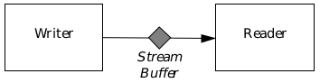

## 21 Using Streams

It is often useful for an application to be able to write out data in an orderly 
manner to be read by another program or sent to a device such as a printer 
or modem. GEOS provides a mechanism called a stream to allow an orderly 
flow of data between two programs, between two threads of a multi-threaded 
program, or between a program and a device such as a serial or parallel port. 
The stream interface includes various ways to notify a program that bytes 
are available to read, or that there is room to write additional data.

The GEOS parallel and serial port drivers use the stream mechanism, so 
programs that will use these ports must do so via this mechanism; however, 
libraries exist to handle some of the more common uses for port 
communications. If you wish to monitor a serial line for pccom 
communications from another machine, you will be working with the PCCom 
library and should read ["PCCom Library," Chapter 22](cpccom.md). Programs do not need 
to access the serial or parallel ports in order to print because the spooler does 
it for them. For more information about the spooler and printing, see ["The 
Spool Library," Chapter 17 of the Object Reference Book](../Objects/oprint.md). 

This chapter may be read with only a general understanding of GEOS and 
Object Assembly. Messaging is used heavily in informing the application 
using a stream of the stream's status, so a good understanding of 
object-oriented programming will be helpful. You should also be familiar with 
the GEOS memory manager. The chapter is divided into three main sections:

+ A general description of a GEOS stream and how the two sides (writers 
and readers) access it.

+ A description of the specific routines and conventions for using streams 
to send data to and receive data from a serial port.

+ A description of the specific routines and conventions for using a stream 
to send data to a parallel port.

### 21.1 Using Streams: The Basics

A stream is a path along which information flows in one direction. At one end 
of the stream is a writer, who puts data into the stream. At the opposite end 
of the stream is a reader, who receives data from the stream. The writer and 
reader can be GEOS programs or device drivers. Data flow in both directions 
can be achieved by using two streams, one in each direction; this is how the 
serial port driver is implemented. See Figure 21-1 for an illustration.

Even though the stream driver is loaded automatically when a stream is 
created, you will need to initialize, configure, and destroy any streams you 
use. The specific steps involved in this process are

1.	Get the handle of the stream driver.
You will need to get this handle to use most of the stream-library 
routines. You can get this handle by calling **GeodeGetInfo()**.

2.	Create the stream.
You must create each stream you plan on using. When a stream is 
initialized, it is designated a token that is used when calling the stream 
driver's strategy routine.

3.	Configure the stream.
Arrange how your geode will be notified by the stream driver when 
certain situations (error received or buffer full/empty) arise, and make 
sure that all geodes accessing the stream have been given the stream's token.

4.	Use the stream.

5.	Shut down the stream.
Not a trivial task, shutting down a stream can involve several 
synchronization issues.

**Figure 21-1** Stream Writer and Reader Interaction  
_Every stream has a writer on one end and a reader on the other, and each 
has access to the stream's central buffer. Note that two-way data transfer 
requires the use of two separate streams, one in each direction._

Streams are created and managed by the Stream Driver. Programs written 
in Object-Assembly can call the driver directly. Goc programs cannot do this; 
instead, they make calls to the Stream Library, which in turn calls the 
Stream Driver, and passes back any return values.

#### 21.1.1 Initializing a Stream

A stream is essentially a first-in-first-out data buffer, in which the writer is 
different from the reader. When the writer writes data to the stream, the 
kernel stores it in the buffer; when the reader requests information from the 
stream, the kernel retrieves the oldest data not yet read. The data is stored 
in a memory block; this block may be either fixed or movable. If it is movable, 
both the reader and the writer must lock the block before calling any stream 
routines.

Note that the kernel does not enforce who is the reader or writer to a stream. 
Any geode may call the appropriate stream library routine, passing in the 
token for a stream, and read or write data. However, in practice, only those 
threads with a legitimate interest in a stream will know the stream's token.

The serial and parallel drivers are built on top of the stream driver. There are 
separate routines to access the serial and parallel ports; these routines are 
discussed in ["Using the Serial Ports"](#212-using-the-serial-ports) for the serial 
driver and ["Using the Parallel Ports"](#213-using-the-parallel-ports) for the 
parallel driver.

#### 21.1.1.1 Creating a Stream

StreamOpen()

To create and initialize a new stream, call the routine **StreamOpen()**. This 
routine takes five arguments:

+ The handle of the stream driver.

+ The size of the stream buffer, in bytes. This may not be larger than 32767.

+ The **GeodeHandle** of the geode that will own this stream. When this 
geode exits, the stream will be freed; however, you should call 
**StreamClose()** before this happens.

+ A set of **HeapFlags**. The routine will have to allocate a block to hold the 
stream. The **HeapFlags** specify whether that block will be fixed or 
movable. If it is fixed, this argument should contain the flag HF_FIXED; 
otherwise it should be blank.

+ The pointer to a **StreamToken** variable. **StreamOpen()** will create the 
stream and write its token to this variable. You will need this token 
whenever you access the stream, for reading or writing.

If the creation is successful, **StreamOpen()** will return zero and store the 
stream's token in the **StreamToken** variable. You must see to it that both 
the reader and the writer have this token. If the stream cannot be created, 
the strategy routine will set an error flag and return either 
STREAM_CANNOT_ALLOC (if the memory for the stream's buffer cannot be 
allocated) or STREAM_BUFFER_TOO_LARGE (if the requested stream size 
was greater than 32767).

##### 21.1.1.2 Assigning Readers and Writers

Once a stream is created, you must make sure that both ends will be 
managed-a stream that has only a writer or only a reader is not a useful 
stream.

When communicating with a device such as a serial or parallel port, the port 
is considered to be the entity on the other end. However, if two threads are 
communicating via a stream, you must make sure the other thread can gain 
access to the stream. The best way to do this is to set up a message that will 
be sent by the creator to the other geode. This message should contain as an 
argument the token of the stream and probably the direction of the stream 
(whether the creator will be reading or writing).

Once both geodes have the stream's token, each can access the stream 
normally. The next several sections explain how to access a stream for 
writing and reading.

#### 21.1.2 Blocking on Read or Write

StreamBlocker, StreamError

A stream is a data buffer of limited size. When a thread writes to the stream, 
there is a chance it could run out of space. Similarly, when a thread reads 
from the stream, there is a possibility that it will try to read more data than 
is available; for example, it might try to read 500 bytes, when only 250 bytes 
of data are sitting in the stream.

There are two ways you can deal with these situations. One way is, you can 
instruct the thread to block. For example, if you try to write 500 bytes to a 
stream and there is only 200 bytes of space available, the driver will write the 
first 200 bytes to that space, then have the writing thread block until more 
space is available (i.e. until the reading thread has read some data). The 
writing thread will not resume execution until all the data has been written. 
Similarly, a reading thread could block until the stream provided all the data 
it requested.

The other approach is to have the stream driver write or read all it can, then 
return an appropriate error code. This requires a little more work by the 
calling thread, as it cannot assume that all the data is always read or written; 
however, it avoids the risk of deadlock.

All read and write routines are passed a member of the **StreamBlocker** 
enumerated type. This type has two members: STREAM_BLOCK, indicating 
that the calling thread should block in the situations described above; and 
STREAM_NO_BLOCK, indicating that the routine should immediately return 
with an error if enough space is not available. A single thread may, if it 
wishes, pass STREAM_BLOCK sometimes and STREAM_NO_BLOCK sometimes.

If a stream routine returns an error, the error will be a member of the 
**StreamError** enumerated type. The possible error values are described in 
the section for each routine.

#### 21.1.3 Writing Data to a Stream

StreamWrite(), StreamWriteByte()

To write data into a stream, call the routine StreamWrite(). This routine 
takes six arguments:

+ The **GeodeHandle** of the stream driver.

+ The **StreamToken** of the stream.

+ A member of the **StreamBlocker** enumerated type, as described in 
[section 21.1.2](#2112-blocking-on-read-or-write).

+ The amount of data to be written, in bytes.

+ A pointer to a data buffer; the data will be copied from that buffer to the 
stream.

+ A pointer to an integer. **StreamWrite()** will write the number of bytes 
actually copied to that integer.

If all the data was written successfully, **StreamWrite()** will return zero and 
write the number of bytes written (i.e. the size of the data buffer passed) to 
the integer pointed to by the sixth argument. If it could not successfully write 
all the data, it will return one of the following **StreamError** values:

**STREAM_WOULD_BLOCK**  
STREAM_BLOCK had been passed, and there was no room to 
write any data to the stream. The sixth argument will be set to 
zero.

**STREAM_SHORT_READ_WRITE**  
If STREAM_NOBLOCK had been passed, this means there was 
not enough room to write all the data. If STREAM_BLOCK had 
been passed, this means the stream was closed before all the 
data could be written. The sixth argument will contain the 
number of bytes actually written to the stream.

**STREAM_CLOSING**  
The stream is in the process of being closed; no writing is 
permitted while this is happening. The sixth argument will be 
set to zero.

**STREAM_CLOSED**  
The stream has already been closed. The sixth argument will 
be set to zero.

You may often want to write a single byte to the stream. There is a special 
routine to do this, **StreamWriteByte()**. This routine takes four arguments:

+ The GeodeHandle of the stream driver.

+ The StreamToken of the stream.

+ A member of the StreamBlocker enumerated type, as described in 
[section 21.1.2](#2112-blocking-on-read-or-write).

+ The byte to be written.

If the byte is written successfully, **StreamWriteByte()** will return zero. 
Otherwise, it will return one of the following error values:

**STREAM_WOULD_BLOCK**  
STREAM_BLOCK had been passed, and there was no room to 
write any data to the stream.

**STREAM_CLOSING**  
The stream is in the process of being closed; no writing is 
permitted while this is happening.

**STREAM_CLOSED**  
The stream has already been closed.

#### 21.1.4 Reading Data from a Stream

StreamRead(), StreamReadByte()

To write data into a stream, call the routine **StreamRead()**. This routine 
takes six arguments:

+ The **GeodeHandle** of the stream driver.

+ The **StreamToken** of the stream.

+ A member of the **StreamBlocker** enumerated type, as described in 
[section 21.1.2](#2112-blocking-on-read-or-write).

+ The amount of data to be read, in bytes.

+ A pointer to a data buffer; the data will be read from the stream into that 
buffer.

+ A pointer to an integer. **StreamRead()** will write the number of bytes 
actually read to that integer.

If the requested amount of data was read successfully, StreamRead() will 
return zero and write the number of bytes read (i.e. the size of the data buffer 
passed) to the integer pointed to by the sixth argument. If it could not 
successfully read the requested amount of data, it will return one of the 
following **StreamError** values:

**STREAM_WOULD_BLOCK**  
STREAM_BLOCK had been passed, and there was no data 
waiting in the stream. The sixth argument will be set to zero.

**STREAM_SHORT_READ_WRITE**  
If STREAM_NOBLOCK had been passed, this means the stream 
did not have the amount of data requested. If STREAM_BLOCK 
had been passed, this means the stream was closed before the 
requested amount of data could be read. The sixth argument 
will contain the number of bytes actually read from the stream.

**STREAM_CLOSING**  
The stream is in the process of being closed; no reading is 
permitted while this is happening. The sixth argument will be 
set to zero.

You may often want to read a single byte from the stream. There is a special 
routine to do this, **StreamReadByte()**. This routine takes four arguments:

+ The **GeodeHandle** of the stream driver.

+ The **StreamToken** of the stream.

+ A member of the StreamBlocker enumerated type, as described in 
[section 21.1.2](#2112-blocking-on-read-or-write).

+ A pointer to a byte-sized variable; the data byte read will be written to 
this variable.

If the byte is written successfully, **StreamReadByte()** will return zero. 
Otherwise, it will return one of the following error values:

**STREAM_WOULD_BLOCK**  
STREAM_BLOCK had been passed, and there was no data 
waiting in the stream.

**STREAM_CLOSING**  
The stream is in the process of being closed; no reading is 
permitted while this is happening.

#### 21.1.5 Shutting Down a Stream

StreamClose()

Either the writer or the reader can instigate stream shutdown by calling 
**StreamClose()**. When one of the two calls this routine, the shut-down 
process is started; it will not be completed until the other calls the routine.

If the writer calls **StreamClose()**, it may specify that the data already in the 
buffer be flushed (immediately cleared), or that it linger. If you specify that 
the data should linger, the data will be preserved as long as the reader has 
the stream open. The reader can continue to read data normally until it runs 
out of data. The last read-operation will most likely return 
STREAM_SHORT_READ_WRITE; after that, all attempts to read data will 
generate the error STREAM_CLOSING. At that point, the reader should call 
**StreamClose()**. (If the data was flushed by the writer, the next read attempt 
will return STREAM_CLOSING.)

To shut down the stream, call the routine StreamClose(). This routine is 
passed the following arguments:

+ The **GeodeHandle** of the stream driver.

+ The **StreamToken** of the stream.

+ A Boolean value saying whether the data in the stream should be kept 
until it's read; false (i.e. zero) indicates it should be flushed.

If you are using the Serial or Parallel drivers (described later in this chapter), 
you do not have to coordinate the closure of a stream.

#### 21.1.6 Miscellaneous Functions

StreamFlush(), StreamQuery()

To flush all the pending (written but unread) data from a stream, call the 
routine **StreamFlush()**. This routine is passed two arguments:

+ The **GeodeHandle** of the stream driver.

+ The **StreamToken** of the stream.

To find out how much free space is available in a stream, or how much data 
is waiting to be read, call **StreamQuery()**. This routine is passed four 
arguments:

+ The **GeodeHandle** of the stream driver.

+ The **StreamToken** of the stream.

+ A member of the **StreamRoles** enumerated type. The only appropriate 
values here are STREAM_ROLES_WRITER (to find the amount of free 
space available for writing) or STREAM_ROLES_READER (to find the 
amount of data waiting to be read).

+ A pointer to an integer variable.

If the call is successful, **StreamQuery()** returns zero and writes its return 
value to the fourth argument. If you pass STREAM_ROLES_WRITER, 
**StreamQuery()** writes the number of bytes of free space available in the 
stream buffer. If you pass STREAM_ROLES_READER, **StreamQuery()** 
returns the number of bytes of data waiting to be read. If the call is 
unsuccessful, **StreamQuery()** returns a **StreamError**.

### 21.2 Using the Serial Ports

The serial driver uses streams to control the flow of data to and from serial 
ports. The kernel automatically copies data from the serial port into one 
stream for reading, and sends data from another stream into the serial port. 
An application which wishes to use the serial port simply reads and writes 
data from those streams. 

#### 21.2.1 Initializing a Serial Port

Like the stream driver, the serial driver is not accessed directly from Goc 
code. Instead, a Goc application makes calls to the Stream Library, which 
passes the requests through to the Serial Driver's strategy routine. Each 
serial-port command must be passed the **GeodeHandle** of the Serial 
Library; again, you can find this handle by calling **GeodeGetInfo()**.

The serial driver uses two streams, one for data going out to the serial port 
(outgoing) and one for data coming in from the serial port (incoming). Your 
program is the writer of the outgoing and the reader of the incoming. (In both 
cases, the port acts as the opposite user.)

##### 21.2.1.1 Opening a Serial Port

SerialOpen()

To open a serial port, call the routine **SerialOpen()**. This routine is passed 
the following arguments:

+ The **GeodeHandle** of the serial-port driver.

+ A member of the **SerialUnit** enumerated type; this specifies which serial 
port is being opened. The type's members are SERIAL_COM1, 
SERIAL_COM2, and so on up to SERIAL_COM8.

+ A member of the **StreamOpenFlags** enumerated type, indicating what 
to do if the requested serial port is busy (either 
STREAM_OPEN_NO_BLOCK, indicating that the routine should return an 
error immediately; or STREAM_OPEN_TIMEOUT, indicating that the 
routine should wait a specified number of clock ticks to see if the port will 
free up).

+ The total size of the stream to be used as an input buffer, in bytes.

+ The total size of the stream to be used as an output buffer, in bytes.

+ The maximum number of ticks to wait for the serial port to become 
available (if STREAM_OPEN_TIMEOUT was passed).

A flag is returned to indicate whether the serial port could be opened; if not, 
a value of type **StreamError** will be returned to indicate the reason. 
Possible stream error values are STREAM_BUFFER_TOO_LARGE and 
STREAM_CANNOT_CREATE, and the additional values STREAM_NO_DEVICE 
(if the serial port does not exist) or STREAM_DEVICE_IN_USE (if the device is 
busy and the **StreamOpenFlags** passed indicate not to wait).

Note that when using the serial driver, you do not identify the stream by a 
stream token but rather by the serial port number, known as a unit number. 
When accessing a serial port, you simply pass the port's unit number along 
with either STREAM_READ (if reading from the stream) or STREAM_WRITE 
(if writing to the stream); because each port has two streams associated with 
it, you must specify both parameters. The serial driver will understand which 
stream you are accessing.

##### 21.2.1.2 Configuring a Serial Port

SerialSetFormat(), SerialGetFormat(),SerialSetModem(), 
SerialGetModem(), SerialSetFlowControl()

Communication using a serial port requires that parity, speed, and flow 
control be properly set. To control these settings, call **SerialSetFormat()**, 
passing the following arguments:

+ The **GeodeHandle** of the serial-port driver.

+ The member of the **SerialUnit** enumerated type.

+ A one-byte record of type **SerialFormat**, specifying the parity, word 
length, and number of stop bits to be used on the serial line; this record 
is described below.

+ A member of the **SerialMode** enumerated type, set to indicate the level 
of flow control: SM_COOKED to indicate XON/XOFF flow control with 
characters stripped to seven bits, SM_RARE to indicate XON/XOFF flow 
control but incoming characters left alone, or SM_RAW to indicate no flow 
control.

+ The baud rate to use, a member of the enumerated type **SerialBauds**, 
which has the following members:

~~~
typedef	enum
{
	SERIAL_BAUD_115200 = 1,
	SERIAL_BAUD_57600  = 2,
	SERIAL_BAUD_38400  = 3,
	SERIAL_BAUD_19200  = 6,
	SERIAL_BAUD_14400  = 8,
	SERIAL_BAUD_9600   = 12,
	SERIAL_BAUD_7200   = 16,
	SERIAL_BAUD_4800   = 24,
	SERIAL_BAUD_3600   = 32,
	SERIAL_BAUD_2400   = 48,
	SERIAL_BAUD_2000   = 58,
	SERIAL_BAUD_1800   = 64,
	SERIAL_BAUD_1200   = 96,
	SERIAL_BAUD_600    = 192,
	SERIAL_BAUD_300    = 384
} SerialBaud;
~~~

**SerialFormat** is a byte-sized record that specifies the parity, word-length, 
and number of stop bits for the serial line. The record has the following fields:

**SERIAL_FORMAT_DLAB**  
This is for internal use only; it must be set to zero.

**SERIAL_FORMAT_BREAK**  
If set, this causes a BREAK condition to be asserted on the line. 
You must explicitly clear this bit again to resume normal 
operation.

**SERIAL_FORMAT_PARITY**  
This three-bit field holds the parity to expect on receive and use 
on transmit. It uses the **SerialParity** enumerated type, which 
has the following members:

~~~
typedef		enum {
	SERIAL_PARITY_NONE	= 0,
	SERIAL_PARITY_ODD	= 1,
	SERIAL_PARITY_EVEN	= 3,
	SERIAL_PARITY_ONE	= 5,
	SERIAL_PARITY_MARK	= 5,
	SERIAL_PARITY_ZERO	= 7,
	SERIAL_PARITY_SPACE	= 7
} SerialParity;
~~~

**SERIAL_FORMAT_EXTRA_STOP**  
If this is set, extra stop-bits will be sent. One stop bit is always 
sent. However, if you set this flag, an extra 1/2 stop bit will be 
sent if the word-length is 5 bits long; an extra 1 stop bit will be 
sent if the frame is 6, 7, or 8 bits long.

**SERIAL_FORMAT_LENGTH**  
This two-bit field holds the length of each data word, minus five 
(i.e. a five-bit word is represented with a zero, a six-bit word 
with a one).

To find out the current settings of a serial port, call **SerialGetFormat()**. 
This routine is passed five arguments:

+ The **GeodeHandle** of the serial-port driver.

+ The member of the **SerialUnit** enumerated type.

+ A pointer to a **SerialFormat** variable. **SerialGetFormat()** will write 
the format data to this variable.

+ A pointer to a **SerialMode** variable. **SerialGetFormat()** will write the 
appropriate mode constant (SM_COOKED, XON/XOFF, or SM_RARE) to 
this variable.

+ A pointer to a **SerialBaud** variable. **SerialFormat()** will write the 
appropriate constant to this variable.

As with other serial port routines, if the routine is successful, it will return 
zero; if it is unsuccessful, it will return an error code.

If you are using a modem's hardware flow control, you will have to configure 
the modem appropriately. You can do this by calling **SerialSetModem()**. 
This routine is passed three arguments:

+ The **GeodeHandle** of the serial-port driver.

+ The member of the **SerialUnit** enumerated type.

+ A record of type **SerialModem**. This record has four fields: 
SERIAL_MODEM_OUT2, SERIAL_MODEM_OUT1, SERIAL_MODEM_RTS, 
and SERIAL_MODEM_DTR. Set these fields to indicate how the 
control-bits should be set.

To find out what flow control is being used, call **SerialGetModem()**. This 
routine is passed three arguments:

+ The **GeodeHandle** of the serial-port driver.

+ The member of the **SerialUnit** enumerated type.

+ A pointer to a record of type **SerialModem**. **SerialGetModem()** will set 
this record's SERIAL_MODEM_OUT2, SERIAL_MODEM_OUT1, 
SERIAL_MODEM_RTS, and SERIAL_MODEM_DTR bits appropriately.

You can also set the flow control without setting the other format options. Do 
this by calling **SerialSetFlowControl()**. This routine is passed the 
following arguments:

+ The **GeodeHandle** of the serial-port driver.

+ The member of the **SerialUnit** enumerated type.

+ A record of type **SerialModem**. This record has four fields: 
SERIAL_MODEM_OUT2, SERIAL_MODEM_OUT1, SERIAL_MODEM_RTS, 
and SERIAL_MODEM_DTR. Set these fields to indicate how the 
control-bits should be set.

+ A member of the **SerialMode** enumerated type, set to indicate the level 
of flow control: SM_COOKED to indicate XON/XOFF flow control with 
characters stripped to seven bits, SM_RARE to indicate XON/XOFF flow 
control but incoming characters left alone, or SM_RAW to indicate no flow 
control.

+ A record of type **SerialModemStatus** to indicate which lines (chosen 
from DCD, DSR, and CTS) should be used to control outgoing data (if 
hardware flow control is selected). When one of the selected lines is 
de-asserted by the remote system, the serial driver will not transmit any 
more data until the state changes.

#### 21.2.2 Communicating

SerialRead(), SerialReadByte(), SerialWrite(), 
SerialWriteByte(), SerialQuery(), SerialFlush()

Communicating with a serial port is very much like using any other stream. 
Special versions of the stream routines are provided, but they function just 
like their stream counterparts.

To read data from a serial port, call **SerialRead()** or **SerialReadByte()**. 
These routines take the same arguments as their **Stream-()** counterparts, 
except that each one must be passed the handle of the Serial Driver, not the 
Stream Driver, and each routine is passed the **SerialUnit** for the 
appropriate port, instead of being passed a stream token. These routines 
behave exactly like their **Stream-()** counterparts.

To write data to a serial port, call **SerialWrite()** or **SerialWriteByte()**. 
Again, these routines behave like their **Stream-()** counterparts, and take 
similar arguments.

To find out if you can read or write data to the port, call **SerialQuery()**. 
Again, this routine behaves like its **Stream-()** equivalent. To flush any data 
from the input or output stream, call **SerialFlush()**.

#### 21.2.3 Closing a Serial Port

SerialClose(), SerialCloseWithoutReset()

To close a serial port, call the routine **SerialClose()**. This routine is passed 
three arguments:

+ The **GeodeHandle** of the serial-port driver.

+ The member of the **SerialUnit** enumerated type.

+ Either STREAM_LINGER (to instruct the kernel to close the port after all 
outgoing data in the buffer has been sent), or STREAM_DISCARD (to 
instruct the kernel to close the port right away and discard all buffered data).

This function returns immediately whether the port was closed right away or 
not. However, if STREAM_LINGER is specified, the port may not be re-opened 
until all the data in the Serial Port's buffer has been dealt with.

You can also instruct the serial driver to close the stream to a port, without 
actually resetting the port. Do this by calling **SerialCloseWithoutReset()**. 
This routine is passed the same arguments as **SerialClose()**.

### 21.3 Using the Parallel Ports

Using a parallel port is simpler than using a serial port since data goes in 
only one direction. GEOS does not currently support reading data from a 
parallel port.

Parallel ports are used primarily for printing, which is handled by the Spool 
Object Library. The information in this section is useful only to programmers 
whose applications will need to send data out through the parallel port 
without using the spooler. Most applications, however, will use the spooler for 
any and all parallel port use.

#### 21.3.1 Initializing a Parallel Port

ParallelOpen()

To open a parallel port, call the routine **ParallelOpen()**. This routine is 
passed the following arguments:

+ The **GeodeHandle** of the parallel-port driver.

+ A member of the **ParallelUnit** enumerated type; this specifies which 
parallel port is being opened. The type's members are PARALLEL_LPT1, 
PARALLEL_LPT2, PARALLEL_LPT3, and PARALLEL_COM4.

+ A member of the **StreamOpenFlags** enumerated type, indicating what 
to do if the requested parallel port is busy (either 
STREAM_OPEN_NO_BLOCK, indicating that the routine should return an 
error immediately; or STREAM_OPEN_TIMEOUT, indicating that the 
routine should wait a specified number of clock ticks to see if the port will 
free up).

+ The unit number of the parallel port in question-this is a value of type 
**ParallelPortNums**.

+ The total size of the stream to be used as an output buffer, in bytes.

+ The maximum number of ticks to wait for the parallel port to become 
available (if STREAM_OPEN_TIMEOUT was passed).

A flag is returned to indicate whether the parallel port could be opened; if not, 
a value of type **StreamError** will be returned to indicate the reason. 
Possible stream error values are STREAM_BUFFER_TOO_LARGE and 
STREAM_CANNOT_CREATE, and the additional values STREAM_NO_DEVICE 
(if the parallel port does not exist) or STREAM_DEVICE_IN_USE (if the device 
is busy and the **StreamOpenFlags** passed indicate not to wait (or not to 
wait any longer)).

Note that when using the parallel driver, you do not identify the stream by a 
stream token but rather by the parallel port number, known as a unit 
number. When accessing a parallel port, you simply pass the port's unit 
number along with either STREAM_READ (if reading from the stream) or 
STREAM_WRITE (if writing to the stream); because each port has two 
streams associated with it, you must specify both parameters. The parallel 
driver will understand which stream you are accessing.

Once the port is selected, the PC will assert the SLCTIN signal, which usually 
will place the device on-line.

#### 21.3.2 Communicating

ParallelWrite(), ParallelWriteByte()

Writing to a parallel port is much like writing to any other stream. To write 
data, call **ParallelWrite()** or **ParallelWriteByte()**. These routines take the 
same arguments as their **Stream-()** components, except that each one must 
be passed the handle of the Parallel Driver, not the Stream Driver, and each 
routine is passed the **ParallelUnit** for the appropriate port, instead of being 
passed a stream token. These routines behave exactly like their **Stream-()** 
counterparts.

#### 21.3.3 Closing a Parallel Port

ParallelClose()

To close a parallel port, **ParallelClose()**. This routine takes the following 
arguments:

+ The **GeodeHandle** of the parallel-port driver.

+ The member of the **ParallelUnit** enumerated type.

+ Either STREAM_LINGER (to instruct the kernel to close the port after all 
outgoing data in the buffer has been sent), or STREAM_DISCARD (to 
instruct the kernel to close the port right away and discard all buffered data).

This function returns immediately whether the port was closed right away or 
not. However, if STREAM_LINGER is specified, the port may not be re-opened 
until all the data in the parallel port's buffer has been dealt with.

[Parse Library](cparse.md) <-- &nbsp;&nbsp; [table of contents](../concepts.md) &nbsp;&nbsp; --> [PCCOM Library](cpccom.md)
