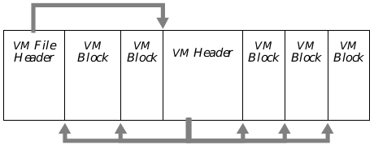
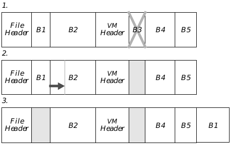
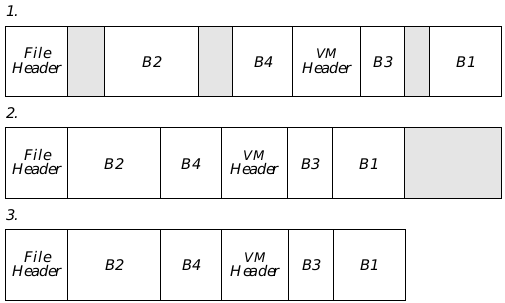
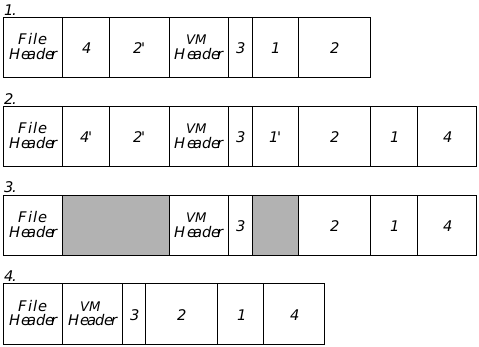
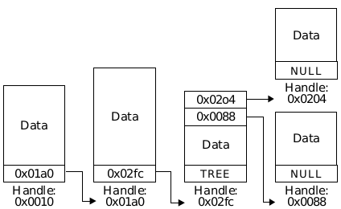
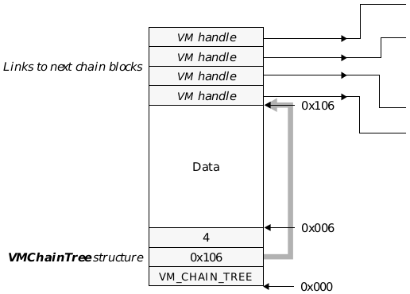
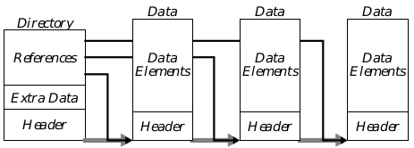

## 18 Virtual Memory

Most disk-operating systems provide minimal file functionality. A file is 
simply treated as a sequence of bytes; applications can copy data from files to 
memory or vice versa, but nothing more elaborate. GEOS provides much more 
elaborate functionality with its Virtual Memory files.

Virtual Memory (VM) is very useful for two reasons. First, it is often 
impractical to read an entire disk file into contiguous memory; indeed, it is 
impossible to do so if the file is larger than 64K. The use of virtual memory 
allows each file to grow arbitrarily large. Second, each disk file is one long, 
cumbersome stream of data. By using virtual memory files, applications can 
break files down into smaller, more manageable blocks which the memory 
manager can handle more efficiently.

Before you read this chapter, you should have read ["Handles," Chapter 14](chandle.md), 
and ["Memory Management," Chapter 15](cmemory.md). You should also be familiar with 
the GEOS file system; you should have at least skimmed ["File System," 
Chapter 17](cfile.md), although you need not have read it in depth.

### 18.1 Design Philosophy

The GEOS Virtual Memory file management system is designed to provide 
features not easily available with standard file systems. Designed primarily 
for use by applications for long-term data storage, it is also used by the 
system for many other purposes, such as to provide state saving (in the UI). 
The main benefits it provides to applications include the following:

+ Convenient file structure
GEOS divides VM files into VM blocks, each of which is accessed via a VM 
block handle. This structure is much like a "disk-based heap," and is 
analogous to (and compatible with) the memory heap. VM blocks are 
accessed the same way whether they are on disk or resident in memory. 
They can be independently resized and locked.

+ Ease of file manipulation
Many file manipulation techniques are much simpler with VM files. For 
example, geodes do not have to keep track of which blocks they have 
changed; instead, when they change a block, they mark it as dirty, and 
when they update the file, the virtual memory routines will 
automatically copy just the changed blocks to the disk.

+ Sharing of Data Files
GEOS maintains information about each VM file and knows when more 
than one thread is using it. This allows the system to notify all users 
when one thread has modified a file. The system provides data 
synchronization for individual blocks.

+ Integrity of Data Files
GEOS provides several features to protect the integrity of VM files. For 
example, you can request that GEOS maintain a backup that can be used 
to restore the file to its last-saved state. In addition, you can have GEOS 
do all writing to the file synchronously to ensure that all the data in the 
file stays consistent even if GEOS is somehow interrupted.

+ Uniform File Structure
Because all GEOS data files are based on VM files, utilities can be written 
which work for all VM files. For example, the Document Control objects 
can take care of opening, closing, and saving all data files which are 
based on VM files. Furthermore, data structures can be designed which 
can be added at will into any VM file.

### 18.2 VM Structure

Virtual memory can be thought of as a heap stored in a disk file. Like the 
global heap, it is divided into blocks which are 64K or smaller; each block is 
accessed via a handle. Blocks can be locked, which brings them into main 
memory. If blocks are modified while in memory, they are copied back to the 
file when the file is updated.

The primary component of virtual memory is the VM file. The VM file consists 
of a VM File Header, a collection of VM blocks, and a special structure called 
a VM Header. The VM File Header is a standard GEOS file header, containing 
the file's extended attributes and system bookkeeping information. Geodes 
may not access it directly; instead, they can make calls to the extended 
attributes routines to access data in the header. ([See section 17.5.3 of chapter 
17](cfile.md#1753-geos-extended-attributes).) The VM blocks and the VM Header 
do not occupy fixed places in the file. In particular, the VM Header does not 
necessarily come before all the blocks. Instead, the VM File Header stores the 
offset within the file to the VM Header, and the VM Header stores information 
about the blocks (such as their locations in the file). Furthermore, the blocks 
in a VM file are arranged in no particular order; they are not necessarily 
arranged in the order they were created, or in any other sequence. See Figure 18-1 
below for a diagram of a VM file.

The VM Header maintains all the bookkeeping information about the VM file. 
For example, it contains the VM Block Table. The block table is much like the 
global handle table. Block handles are offsets into the block handle table; a 
block's entry in the table contains information about the block, such as the 
block's location in the file. Usually, the Block Table contains entries for blocks 
that haven't been created yet; when all of these handles have been used, the 
VM Manager expands the block table. For details, see [section 18.2.3](#1822-vm-handles).

#### 18.2.1 The VM Manager

The VM manager can be thought of as a memory manager for a disk-based 
heap, providing all the services a memory manager would and more. The VM 
manager provides for allocation, use, and deallocation of virtual memory 
blocks. It manages the Block Table, enlarging it as necessary when more VM 
block handles are needed. It keeps track of which VM blocks have been loaded 
into memory, which are currently in use, and which have been "dirtied" 
(modified) since they were read from the disk; it also keeps track of how many 
threads are accessing a given VM file at any time. The VM manager also 
accomplishes all swapping and read/write operations involving VM files. 

**Figure 18-1** Structure of a VM File  
_The VM File Header contains information about the VM file and the offset to 
the VM Header; the VM Header contains information about the VM Blocks and 
their offsets._

### 18.2.2 VM Handles

There are several different types of handles associated with VM files. It is 
important not to get them confused.

+ File Handles
When you open or create a VM file, it is assigned a file handle, as 
discussed in ["File System," Chapter 17](cfile.md). Whenever you call a VM routine, 
you must specify the VM file by passing this handle. The file handle can 
change each time the file is opened. Furthermore, if two different 
network users have the same VM file open at the same time, each user 
might have a different file handle for the same file.

+ VM Block Handles
The VM file has a block table in the VM Header. The block table contains 
the locations of blocks in the file. A given block has the same block handle 
every time the file is opened. If a file is duplicated, blocks in the new file 
will have the same VM handles as the corresponding blocks in the old file. 
In this chapter, references to "block handles" or "VM handles" are 
referring to VM block handles unless otherwise noted.

+ Memory Block Handles
When a VM block is locked, it is copied into a memory block. This memory 
block has an entry in the global handle table. The memory block may 
persist even after the VM block has been unlocked. Ordinarily, you can 
refer to a VM block by its VM block handle whether or not it is resident in 
memory; however, in some cases, you may want to use the memory block 
handle instead of the VM block handle. This saves time when you know 
the block is resident in memory, because the VM manager doesn't have to 
translate the VM block handle into the corresponding global handle. It is 
also necessary if you need to resize or dirty a VM block. You can instruct 
the VM manager to use the same global handle each time a given VM 
block is locked until the file is closed; otherwise, the memory handle for 
a VM block may change each time the block is locked.

+ Chunk Handles and Database/Cell Handles
A VM block can contain a local memory heap. If so, that block will have 
its own chunk handle table. Also, the Database and Cell libraries have 
been designed to let the VM file efficiently manipulate small pieces of 
data. These libraries are based on the LMem library. Each item of data 
has its own DB handle as well as a VM Block handle. Database items are 
discussed in depth in ["Database Library," Chapter 19](cdb.md).

#### 18.2.3 Virtual Memory Blocks

Most file systems treat files as a string of bytes. A user can read a file 
sequentially or can start reading at a specified distance into the file. This 
makes it difficult to work with large files. Reading an entire large file into 
memory may be impractical, and it may be difficult to access different parts 
of the file at once.

For this reason, GEOS divides its Virtual Memory files into VM blocks. This 
division is entirely internal to GEOS. When the file is written to disk, it is still 
a sequence of bytes, and other operating systems can copy the file normally. 
However, GEOS geodes can access the file much more conveniently by 
specifying the blocks they wish to access.

##### 18.2.3.1 The Nature of VM Blocks

A VM block is a sequence of bytes in a VM file. It must be small enough to fit 
in a global memory block (i.e. 64K or less, preferably 2K-6K). It may move 
about in the file; for this reason, it is accessed by a VM block handle. Blocks 
are either free or used. A used block has an entry in the block table and also 
a space allocated in the file. (This could be a block of free space, which will be 
freed the next time the file is compacted.) A free block has a slot in the file's 
handle table but no space in the file; it is available if a thread needs to 
allocate a block. 

Blocks persist after a file has been closed and GEOS has been shut down. A 
given block is always accessed by the same block handle. There are utilities 
to copy blocks within a VM file or between files. Blocks in a VM file are in no 
particular order. If an application wants to set up a sequence of blocks, it can 
create a VM Chain, in which the first word of each block is the handle of the 
next block in the chain. However, even chained blocks will probably not be in 
order in the actual file.

Each VM block can be assigned a "user ID" number. You can request the 
handles of the VM blocks with any given ID number. You do not have to assign 
ID numbers to blocks, but it is sometimes convenient. The ID numbers are 
stored in the handles' entries in the block table, not in the blocks themselves; 
this makes it easy to find a block with a specified user ID. User IDs can be 
changed at will with the routine **VMModifyUserID()**. Note that all user IDs 
from 0xff00 to 0xffff are reserved for system use. You can find a block with a 
specific user ID by calling **VMFind()**.

##### 18.2.3.2 Creating and Using VM Blocks

There are two ways you can create a VM block. The first is to request a VM 
block: You specify the size of the block, the block is created, and you are 
returned the handle. This is the method ordinarily used. The second method 
is to attach memory to a block: You create a global memory block, and 
instruct the VM manager to add it to the VM file. There are sometimes 
advantages to this technique; for example, you can create an LMem heap, 
and then attach it to the VM file; it will then be saved with the file. You can 
also attach a memory block to an existing VM block; this will destroy 
whatever used to be in the VM block and replace it with the contents of the 
new block.

**Figure 18-2** A Fragmenting VM File  
_As blocks are freed and resized, the percentage of the file being used steadily 
decreases:_
1. _A VM file with several blocks. The application is now freeing block 3._
1. _Block 3 has been freed. The application now needs to expand block 1._
1. _Block 1 has been moved to the end of the file, where it has room to grow. The 
file now contains a lot of unused space._

You can dynamically resize a VM block by locking it into memory, resizing the 
memory block, and saving it back to the disk.

These techniques are described in detail in ["Creating and Freeing Blocks"]
(#1834-creating-and-freeing-blocks) and ["Attaching Memory Blocks"](#1835-attaching-memory-blocks).

##### 18.2.3.3 File Compaction

When a VM block is freed, the VM manager will note that there is empty 
space in the file. It will use that space when new blocks are allocated. 
However, since new blocks will probably not fit exactly in the spaces left by 
freed blocks, some space may be wasted. (See Figure 18-2.)

**Figure 18-3** VM File Compaction  
_When the percentage of a file which contains data falls below the "compression 
threshold," the VM manager compacts the file._
1. _A fragmented file._
2. _The VM Manager first copies all the data to the beginning of the file, leaving 
the free space at the end. It updates the File Header and VM Header appropriately._
3. _The VM Manager then deletes the free bytes from the end of the file._

In time, the percentage of wasted file space can grow unacceptably large. To 
prevent this, the Virtual Memory manager periodically compacts the files. 
When the ratio of data to free space drops below a certain threshold, the 
Virtual Memory manager copies the data in the file over the free space (see 
Figure 18-3). While a file is being compacted, any requests for access to the 
file will block until compaction is finished. Note that the format of the 
data is not changed; the free space between data blocks is simply removed.

When a geode creates a VM file, it can specify a "compression threshold." 
When the percentage of used space drops below this threshold, the VM 
manager will automatically compact the file without any attention from the 
application. The geode should take care in setting the threshold. If the 
threshold is too low, the file may grow unacceptably large before it is 
compacted; on the other hand, if the threshold is too high, the VM manager 
might spend too much time compacting the file for relatively low gains. The 
application can specify a threshold of zero; this will cause the system default 
threshold to be used.

Note that if a file is in "backup mode," the file will be compacted only on calls 
to **VMSave()**, **VMSaveAs()**, or **VMRevert()**. If the file is not in backup 
mode, it can be compacted on any call to **VMUpdate()**. 

##### 18.2.3.4 File Updating and Backup

When a block is locked into memory, the VM manager copies the data from 
the disk block to the global memory block. When the block is unlocked, the 
VM manager assumes that it can discard the memory block, since the data is 
already on the disk in the VM block.

If you alter the data in a block, you must notify the VM manager of this fact. 
You do this by marking the block as dirty. When a block has been marked 
dirty, the VM manager knows that the version in memory is more up-to-date 
than the version in the disk file. If the flag VMA_SYNC_UPDATE is off (the 
default), the block will be written back to the file as soon as possible. If the 
attribute is on, the block will not be copied back to the disk file until 
**VMUpdate()** is called; until then, the block will be copied to the disk swap 
space if memory is needed. The next time you lock the block, you will be given 
the new, changed version.

When you want to write the dirty blocks to the disk, you can instruct the VM 
manager to update the file. This copies all the dirtied blocks back to the disk 
and marks all blocks as clean. The VM manager also automatically updates 
the file when it is closed. The updating routines check if the file is currently 
clean; thus, very little time is lost if you try to update a clean file.

The VM manager can be instructed to notify all users of a file when the file 
changes from clean to dirty. This has two main uses: it helps maintain data 
synchronization if many geodes are using the same file, and it lets the 
document control objects know when to enable the "Save" and "Revert" 
triggers. (See ["GenDocument," Chapter 13 of the Object Reference Book]().)

The VM manager can be instructed to maintain a backup of a file. If it is so 
instructed, it will not overwrite the original block when it updates it; instead, 
it will keep a copy of the original block as well as a copy of the new version. 
This is transparent to the application. When the VM Manager is instructed 
to save the file, it deletes all the backup blocks. If it is instructed to revert the 
file to its last-saved version, it replaces the new version of the changed blocks 
with the backup versions, thus restoring the file to its condition as of the last 
time it was saved. If the VM manager is instructed to "save-as" the file, it will 
create a new file, which does not contain the backup blocks; that is, it 
contains the file as it currently exists. It will then revert the original file to 
its last-saved version and close it.

#### 18.2.4 VM File Attributes

VMAttributes

Each VM file has a set of attributes which determine how the VM Manager 
treats the file. These attributes are specified by a set of **VMAttributes** flags. 
When a VM file is created, all of these attributes are off; after a file has been 
created, you can change the attributes with **VMSetAttributes()** (see [section 
18.3.3](#1833-changing-vm-file-attributes)). The following flags are available:

VMA_SYNC_UPDATE  
Allow synchronous updates only. Instructs VM Manager to 
update the file only when you call un updating routine 
(**VMUpdate()**, **VMSave()**, etc.). This attribute is off by default 
(indicating that the VM manager should feel free to update 
blocks whenever they are unlocked). You should set this 
attribute if the file might not be in a consistent state every time 
a block is unlocked.

VMA_BACKUP  
Maintain a backup copy of all data. The file can then be 
restored to its last stored state. This is described above.

VMA_OBJECT_RELOC  
Use the built-in object relocation routines. This attribute must 
be set if the VM file contains object blocks.

VMA_NOTIFY_DIRTY  
If this attribute is set, the VM Manager will notify all threads 
which have the VM file open when the file changes from clean 
to dirty. It notifies threads by sending a MSG_VM_FILE_DIRTY 
to each process that has the file open. (This message is defined 
for **MetaClass**, so any object can handle it.)

VMA_NO_DISCARD_IF_IN_USE  
If this attribute is set, the VM manager will not discard LMem 
blocks of type LMEM_TYPE_OBJ_BLOCK if 
OLMBH_inUseCount is non-zero. This attribute must be set if 
the file contains object blocks. If this attribute is set, each 
object block will be kept in memory as long as any thread is 
using an object in the block.

VMA_COMPACT_OBJ_BLOCK  
If set, the VM manager will unrelocate generic-object blocks 
before writing them. It does this by calling 
**CompactObjBlock()**. This allows a VM file to contain generic 
object blocks.

VMA_SINGLE_THREAD_ACCESS  
Set this if only a single thread will be accessing the file. This 
allows optimizations in **VMLock()**.

VMA_OBJECT_ATTRS  
This is not, strictly speaking, a VM attribute. Rather, it is a 
mask which combines the flags VMA_OBJECT_RELOC, 
VMA_NO_DISCARD_IF_IN_USE, and 
VMA_SINGLE_THREAD_ACCESS. All of these attributes must 
be set if the file contains object blocks. 

### 18.3 Using Virtual Memory

The most common way applications will use Virtual Memory is for their data 
files. However, there are other uses; for example, VM provides a convenient 
way to maintain working memory. Some data structures (such as Huge 
Arrays) can only exist in VM files; an application may create a temporary VM 
file just for these structures.

### 18.3.1 How to Use VM

There are five basic steps to using VM files. The steps are outlined below, and 
described in greater detail in the following sections.

+ Open (or create) the VM file
Before you perform any actions on a VM file, you must open it with 
**VMOpen()**. This routine can be used to open an existing VM file or create 
a new one. If you use the document control objects, they will open and 
create files automatically. Once you have created a VM file, you may want 
to change its attributes with **VMSetAttributes()**.

+ Bring a VM block into the global memory heap
After you open a VM file, you can bring blocks from the file into memory 
with **VMLock()**. You can also create new blocks with **VMAlloc()** and 
**VMAttach()**.

+ Access the data
Once a VM block has been brought into memory, you can access it the way 
you would any other memory block. When you are done with the data, 
you should unlock it with **VMUnlock()**. If you change the memory, you 
should mark it dirty with **VMDirty()** before unlocking it. This ensures 
that the new version of the block will be written to the disk.

+ Update the VM file
Use one of the several VM updating routines to copy the dirty blocks back 
to the disk. (If asynchronous update is allowed, the VM file manager will 
try to update blocks whenever they are unlocked.)

+ Close the VM file
Use **VMClose()** when you are done with the file. It will update the file 
and close it.

#### 18.3.2 Opening or Creating a VM File

VMOpen(), VMOpenTypes, VMAccessFlags

To create or open a VM file, call the routine **VMOpen()**. You may not need to 
open and create files directly; if you use the document control objects, they 
automatically create and open files as the user requests. (See 
["GenDocument," Chapter 13 of the Object Reference Book]().) **VMOpen()** looks 
for the file in the thread's working directory (unless a temporary file is being 
created, as described below). **VMOpen()** takes four arguments and returns 
the file handle. The arguments are:

+ File name
This argument is a pointer to a string of characters. This string is a 
relative or absolute path specifying the file to open; if a temporary file is 
being created, the string is the path of the directory in which to place that 
file, followed by fourteen null bytes (counting the string-ending null). The 
name of the temporary file is appended to the path.

+ **VMAccessFlags**
This argument is a set of flags which specifies how the file is accessed. 
The flags are described below.

+ **VMOpenTypes** enumerated type
This argument specifies how the file should be opened. The 
**VMOpenTypes** are described below.

+ Compression threshold
This is the minimum percentage of a file which must be used for data at 
any given time. If the percentage drops below this threshold, the file is 
compacted. If you pass a threshold of zero, the system default threshold 
is used. The compression threshold is set only when the file is created; 
this argument is ignored if an existing file is opened.

When you use **VMOpen()**, you must specify how the file should be opened. 
You do this by passing a member of the **VMOpenTypes** enumerated type. 
The types are as follows:

VMO_TEMP_FILE  
If this is passed, the file will be a temporary data file. When you 
create a temporary file, you pass a directory path, not a file 
name. The path should be followed by fourteen null bytes, 
including the string's terminating null. The system will choose 
an appropriate file name and add it to the path string.

VMO_CREATE_ONLY  
If this is passed, the document will be created. If a document 
with the specified name already exists in the working directory, 
**VMOpen()** will return an error condition.

VMO_CREATE  
If this is passed, the file will be created if it does not already 
exist; otherwise it will be opened.

VMO_CREATE_TRUNCATE  
If this is passed, the file will be created if it does not already 
exist; otherwise, it will be opened and truncated (all data 
blocks will be freed).

VMO_OPEN  
Open an existing file. If the file does not exist, return an error 
condition.

VMO_NATIVE_WITH_EXT_ATTRS  
The file will have a name compatible with the native 
filesystem, but it will have GEOS extended attributes. This flag 
can be combined with any of the other **VMOpenType** values 
with a bit-wise or.

You also have to specify what type of access to the file you would like. You do 
this by passing a record of VMAccessFlags. This is a byte-length bitfield. 
The following flags are available:

VMAF_FORCE_READ_ONLY  
If set, the file will be opened read-only, even if the default would 
be to open the file read/write. Blocks in read-only files cannot 
be dirtied, and changes in memory blocks will not be updated 
to the disk VM blocks.

VMAF_FORCE_READ_WRITE  
If set, the file will be opened for read/write access, even if the 
default would be to open the file for read-only access.

VMAF_SHARED_MEMORY  
If set, the VM manager should try to use shared memory when 
locking VM blocks; that is, the same memory block will be used 
for a given VM block no matter which thread locks the block.

VMAF_FORCE_DENY_WRITE  
If set, the file will be opened deny-write; that is, no other 
threads will be allowed to open the file for read/write access.

VMAF_DISALLOW_SHARED_MULTIPLE  
If this flag is set, files with the file attribute 
GFHF_SHARED_MULTIPLE cannot be opened.

VMAF_USE_BLOCK_LEVEL_SYNCHRONIZATION  
If set, the block-level synchronization mechanism of the VM 
manager is assumed to be sufficient; the more restrictive 
file-level synchronization is not used. This is primarily 
intended for system software. (See ["File-Access 
Synchronization"](#18311-file-access-synchronization).)

If you open a file with VMAF_FORCE_READ_ONLY, it's generally a good idea 
to also open it with VMAF_FORCE_DENY_WRITE. When you open a file 
VMAF_FORCE_READ_ONLY, if the file is writable, and is located on a writable 
device which can be used by other machines (e.g. a network drive), the kernel 
will load the entire file into memory and make the blocks non-discardable 
(even when they are clean); this keeps the file you see consistent, even if 
another user changes the version of the file on the disk. However, this can 
cause problems if the machine has limited swap space. If the file is opened 
with VMAF_FORCE_DENY_WRITE, no other device will be allowed to change 
the file while you have it open, which means the kernel can just load and 
discard blocks as necessary.

The routine **VMOpen()** returns the file handle. If it cannot satisfy the 
request, it returns a null handle and sets the thread error word. The error 
word can be recovered with the **ThreadGetError()** routine. The possible 
error conditions are:

VM_FILE_EXISTS  
**VMOpen()** was passed VMO_CREATE_ONLY, but the file 
already exists.

VM_FILE_NOT_FOUND  
**VMOpen()** was passed VMO_OPEN, but the file does not exist.

VM_SHARING_DENIED  
The file was opened by another geode, and access was denied.

VM_OPEN_INVALID_VM_FILE  
**VMOpen()** was instructed to open an invalid VM file (or a 
non-VM file).

VM_CANNOT_CREATE  
**VMOpen()** cannot create the file (but it does not already exist).

VM_TRUNCATE_FAILED  
**VMOpen()** was passed VMO_CREATE_TRUNCATE; the file 
exists but could not be truncated.

VM_WRITE_PROTECTED  
**VMOpen()** was passed VMAF_FORCE_READ_WRITE, but the 
file or disk was write-protected.

#### 18.3.3 Changing VM File Attributes

VMGetAttributes(), VMSetAttributes()

When a VM file is created, it is given a set of **VMAttributes**. 
These attributes can be examined with the routine **VMGetAttributes()**. The 
routine takes one argument, namely the handle of the VM file (which is 
overridden if a default VM file is set). It returns the **VMAttributes** flags.

You can change the attributes by calling **VMSetAttributes()**. This routine 
takes three arguments: the file handle (which may be overridden), a set of 
bits which should be turned on, and a set of bits which should be turned off. 
It returns the new **VMAttributes** flags.

#### 18.3.4 Creating and Freeing Blocks

VMAlloc(), VMAllocLMem(), VMFree()

Once you have created a VM file, you have to allocate blocks in order to write 
data to the file. The usual way to do this is with **VMAlloc()**. This routine 
takes three word-sized arguments:

+ The file handle
This argument is overridden if a default VM file is set.

+ A user-ID number
This can be any word of data the application wants to associate with the 
VM block. The application can locate blocks with a given user ID by using 
**VMFind()**.

+ The number of bytes in the block
This may be zero, in which case no memory is allocated; a memory block 
must be specifically attached with **VMAttach()** (see ["Attaching Memory 
Blocks"](#1835-attaching-memory-blocks)).

The routine returns the handle of the VM block. Before you can use the block, 
you have to lock it with **VMLock()**. The block is marked dirty when it is 
allocated.

There is a routine to allocate a block and initialize it as an LMem heap. This 
is useful if you are storing object blocks in a VM file. The routine, 
**VMAllocLMem()**, takes three arguments:

+ The VM file handle
This is overridden if a default VM file is set.

+ A member of the **LMemTypes** enumerated type
This specifies what kind of heap the LMem heap will be. (See [section 
16.2.3](clmem.md#1623-types-of-lmem-heaps).)

+ The size of the block header
Use this if you want to store extra data in the LMem block header. To use 
the standard LMem header, pass an argument of zero. (See [section 16.3.1 
of chapter 16](clmem.md#1631-creating-a-local-heap).)

The routine creates a VM block and allocates a global memory block to go 
with it. It initializes the heap in the global block and marks the block as dirty. 
The LMem heap will begin with two LMem handles and a 64-byte heap; this 
will grow as necessary. The VM block will have a user ID of zero; you can 
change this if you wish. The routine returns the handle of the new VM block. 

There are two other ways to create LMem blocks in a VM file; these ways give 
you more control of the block's initialization. You can allocate a VM block 
normally, lock that block, then get the handle of the associated memory block 
and initialize an LMem heap in it; or you can allocate an LMem heap 
normally, and attach that memory block to the VM file using **VMAttach()**. 
For more details on LMem heaps, see ["Local Memory," Chapter 16](clmem.md).

To free a VM block, call **VMFree()**. This routine is passed two arguments: the 
VM file handle, and the VM block handle. The handle will immediately be 
freed, even if it is locked. Any associated memory will also be freed. If you 
want to keep the memory, detach the global memory block from the file (with 
**VMDetach()**) before you free the block.

#### 18.3.5 Attaching Memory Blocks

VMAttach(), VMDetach()

When you use **VMAlloc()**, the VM manager allocates a global memory block 
and attaches it to a VM block. However, sometimes you want to allocate the 
block yourself, or you may have an existing memory block which you want to 
copy into the VM file. To do this, you call the routine **VMAttach()**.

**VMAttach()** takes three arguments:

+ The VM file handle
The handle of the file to attach.

+ The VM block handle
If you pass a null handle, a free VM block will be allocated and attached 
to the global memory block. If you pass the handle of an existing block, 
the data in the VM block will be replaced with the contents of the global 
memory block.

+ The global memory handle
The memory block must be swappable. After the block is attached, the 
VM manager may discard or free it, as with any other global blocks used 
by the VM file.

**VMAttach()** attaches the global memory block to the VM block. The VM 
Manager becomes the owner of the memory block. The next time the file is 
updated, the memory block will be copied to the file. **VMAttach()** returns the 
handle of the VM block. If it could not perform the attach, it returns a null 
handle and leaves the global memory block unchanged.

You can also detach the global memory block from a VM block. The routine 
**VMDetach()** disassociates a global memory block from its VM block. The 
routine takes three arguments: the VM file handle; the VM block handle; and 
the **GeodeHandle** of the geode which will be made the owner of the memory 
block. (Passing a null **GeodeHandle** will make the calling geode the block's 
owner.) The VM manager disassociates the memory block from the VM block, 
changes the memory block's owner, marks it "non-discardable," and returns 
its handle. If the VM block is not currently in memory, **VMDetach()** will 
automatically allocate a memory block, copy the VM block's data into it, and 
return the memory block's handle. If the VM block was dirty, the block will be 
updated to the file before it is detached. The next time the VM block is locked, 
a new global memory block will be allocated for it.

#### 18.3.6 Accessing and Altering VM Blocks

VMLock(), VMUnlock(), VMDirty(), VMFind(), 
VMModifyUserID(), VMPreserveBlocksHandle()

Once you have opened a VM file and allocated blocks, you will need to access 
blocks. The VM library provides many routines for doing this.

If you need to access the data in a VM file, you can use the routine **VMLock()**. 
This routine moves a VM block onto the global heap. It does this by allocating 
a global memory block (if the VM block is not already associated with a 
memory block), reallocating the global block if it had been discarded, locking 
the memory block on the global heap, and copying the VM block into the 
global block, if necessary. (It will copy the VM block to memory only if 
necessary, i.e. if the memory block is newly-allocated, or had been discarded 
and reallocated.) **VMLock()** takes three arguments: the handle of the VM 
file, the VMBlockHandle of the block to lock, and a pointer to a memHandle 
variable. It returns a pointer to the start of the block, and writes the global 
block's handle into the memHandle variable. You can now access the block 
the same way you would any other block, with one exception: When you are 
done with the block, you do not call **MemUnlock()**; instead, call the routine 
**VMUnlock()**, passing it the handle of the global memory block (not the 
handle of the VM block). This will unlock the global block on the heap.

If you alter the global memory block, you will need to notify the VM manager 
of this so it will know to copy the changes back to the VM file. You do this by 
calling the routine **VMDirty()**. **VMDirty()** takes one argument, the handle 
of the global memory block (not the VM block). It is important to dirty the 
block while it is still locked on the heap; as soon as you unlock a clean block, 
the VM manager may choose to discard it. Dirty blocks are copied back to the 
VM file when it is updated. Note that if an object in a VM block is marked 
dirty (via **ObjMarkDirty()**), the block is automatically dirtied. Similarly, if 
you attach a global memory block to a VM block (via VMAttach()), the VM 
block is automatically dirtied.

You can dynamically resize VM blocks. To do this, lock the VM block with 
**VMLock()**; then resize the global memory block with **MemReAlloc()**. Be 
sure to mark the block dirty so the changes will be copied to the disk file. Note 
that although the global memory block will remain locked, it may move on 
the global heap when it is resized. You will therefore need to dereference the 
global memory handle (with **MemDeref()**) before accessing the memory.

You can locate VM blocks by their user ID numbers. The routine **VMFind()** 
takes three arguments: the VM file handle, a VM block handle, and the user 
ID for which to look. The routine looks through the block table, starting with 
the handle after the one passed, until it finds a block with the specified user 
ID. If it does not find such a block, it returns a null handle; otherwise, it 
returns the block's VMBlockHandle. Thus, by passing in a block handle of 
zero, you will get the handle of the first block with the specified ID; by passing 
back in that block's handle, you will get the next block with that ID; and so 
on, until you get all the blocks (after which you will be returned a null handle). 

You can change a block's user ID number by calling the routine 
**VMModifyUserID()**. This routine takes three arguments: the VM file 
handle, the VM block handle, and the new user ID number. Since user IDs are 
maintained in the block table, not in the blocks themselves, it doesn't matter 
whether the block is locked, or even whether it is associated with data in the 
file. (For example, a block allocated with a size of zero can have its user-ID 
changed.)

Ordinarily, the VM manager can free any unlocked, clean global block if the 
space is needed. However, you can instruct the VM manager not to free the 
global block associated with a specific block by calling the routine 
**VMPreserveBlocksHandle()**. The routine takes two arguments, namely 
the VM file handle and the VM block handle. It sees to it that the specified VM 
block will remain attached to the same global block until the VM block is 
specifically detached (or reattached).

#### 18.3.7 VM Block Information

VMVMBlockToMemBlock(), VMMemBlockToVMBlock(), VMInfo()

Several utilities are provided to give you information about VM blocks.

If you know the handle of a VM block, you can find out the handle of the 
associated global block by calling the routine **VMVMBlockToMemBlock()**. 
This routine takes two arguments, namely the VM file handle and the VM 
block handle. It returns the global memory handle of the associated block; 
however, note the caveats regarding global handles in the above section. If 
the VM block is not currently associated with a global memory block, the 
routine will allocate a memory block, copy the VM block into it, and return its 
handle. If the VM handle is not associated with any data in the file and is not 
attached to a global memory block, **VMVMBlockToMemBlock()** returns a 
null handle.

Conversely, if you know the handle of a global memory block and want to find 
out the VM file and block to which it is attached, call the routine 
**VMMemBlockToVMBlock()**. This routine takes two arguments: the global 
memory handle, and a pointer to a **VMFileHandle** variable. It returns the 
VM block handle of the associated VM block, and writes the handle of the VM 
file to the address passed. If the global memory block is not attached to a VM 
file, it returns null handles.

The Boolean routine **VMInfo()** is an omnibus information routine. It takes 
three arguments: the handle of a VM file, the handle of a VM block, and a 
pointer to a **VMInfoStruct** structure (described below in Code Display 18-1). 
If the VM block is free, out of range, or otherwise invalid, it returns false; 
otherwise, it returns true (i.e. non-zero) and fills in the fields of the 
**VMInfoStruct**.

---
Code Display 18-1 VMInfoStruct
~~~
/* This is the definition of the VMInfoStruct. A pointer to a VMInfoStruct is
 * passed to the routine VMInfo(). The routine fills in the structure's fields.
 */
typedef struct {
	MemHandle		mh;	/* Null handle returned if no block is attached */
	word		size;	/* Size of VM block in bytes */
	word		userID;	/* User ID (or zero if no user ID was specified) 
*/
} VMInfoStruct;
~~~

#### 18.3.8 Updating and Saving Files

VMUpdate(), VMSave(), VMSaveAs(), VMRevert(), 
VMGetDirtyState() VMSave()

When you dirty a memory block, that action notifies the VM manager that the 
block will need to be written back to the file. If the attribute 
VMA_SYNC_UPDATE is off, the VM manager will try to update the block to the 
disk file as soon as the block is unlocked, and will then mark the block as 
clean. However, if the flag is on, the manager does not write the block until it 
is specifically told to update the file. At this point, it copies any dirty blocks 
back over their attached VM blocks, then marks all blocks as clean. If you use 
the document control objects, they will take care of updating and saving the 
file. However, you may need to call the updating routines specifically.

The routine **VMUpdate()** instructs the VM manager to write all dirty blocks 
to the disk. It takes one argument, the VM file handle (which is overridden if 
a thread file has been set). It returns zero if the update proceeded normally; 
otherwise, it returns either one of the **FileErrors** or one of the three 
**VMUpdate()** status codes:

VM_UPDATE_NOTHING_DIRTY  
All blocks were clean, so the VM disk file was not changed.

VM_UPDATE_INSUFFICIENT_DISK_SPACE  
The file has grown since the last update, and there is not 
enough room on the disk to accommodate it.

VM_UPDATE_BLOCK_WAS_LOCKED  
Some of the VM blocks were locked by another thread, so they 
could not be updated to the disk.

**VMUpdate()** is optimized for updating clean files; thus, it costs very little 
time to call **VMUpdate()** when you are not sure if the file is dirty. If a file is 
auto-saved, **VMUpdate()** is used.

A VM file can maintain backup copies of updated blocks. If so, updating the 
file will write changes to the disk, but will not alter those backup blocks. To 
finalize the changes, call the routine **VMSave()**. This routine updates the 
file, then deletes all the backup blocks and compacts the file. (See 
Figure 18-4.) If the file does not have backup capability, **VMSave()** acts the 
same as **VMUpdate()**.

If a file has the backup capability, you cannot directly access the backup 
blocks. However, you can instruct the VM manager to restore the file to its 
last-saved state. The command **VMRevert()** causes the VM manager to 
check the VM file for blocks which have backups. It then deletes the 
non-backup block, and changes the backup block into a regular block. It also 
discards all blocks in memory that were attached to the blocks which just 
reverted. The file will then be in its condition as of the last time it was saved. 
The routine may not be used on files which do not have the flag VMA_BACKUP set.

**Figure 18-4** Saving a backup-enabled VM file  
1. _This is the file when **VMSave()** is called. Backup blocks are noted with an 
apostrophe._
2. _The file is updated (all dirty blocks are written to the disk). This may cause 
more backup blocks to be created._
3. _All backup blocks are freed._
4. _The file is always compacted at the end of a save, whether or not it has 
fallen below the compression threshold._

You can save a file under a new name with the routine **VMSaveAs()**. If the 
file has backup capability, the old file will be restored to its last-saved 
condition (as if **VMRevert()** had been called); otherwise, the old file will be 
left in the file's current state. The routine is passed the name of the new file. 
**VMSaveAs()** copies all the blocks from the old file to the new one. If a block 
has a backup copy, the more recent version is copied. The new file will thus 
have the file in its current state; block handles will be preserved. After the 
new file has been created, if the file has backup-capability, **VMSaveAs()** 
reverts the original file to its last-saved state. It then closes the old file and 
returns the handle of the new file. 

If you manage VM files with the document control objects, you generally don't 
have to call the update or save routines. The document control objects will set 
up a file menu with appropriate commands ("Save," "Save As," etc.), and will 
call the appropriate routines whenever the user chooses a command.

If you need to find out whether a file is dirty, call the routine 
**VMGetDirtyState()**. This routine returns a two-byte value. The more 
significant byte is non-zero if any blocks have been dirtied since the last 
update or auto-save. The less significant byte is non-zero if any blocks have 
been dirtied since the last save, save-as, or revert action. If the file does not 
have backup-capability, both bytes will always be equal. Note that 
**VMUpdate()** is optimized for clean files, so it is generally faster to call 
**VMUpdate()** even if the file might be clean, rather than checking the 
dirty-state with **VMGetDirtyState()**. 

#### 18.3.9 Closing Files

VMClose()

When you are done with a VM file for the time being, you should close it with 
**VMClose()**. This routine updates all the dirty blocks, frees all the global 
memory blocks attached to the file, and closes the file (thus freeing its 
handle). The routine is passed two arguments. The first is the handle of the 
file to close. The second is a Boolean value, noErrorFlag. If this flag is true, 
**VMClose()** will not return error conditions; if it could not successfully close 
the file, it will fatal-error.

If noErrorFlag is false, **VMClose()** will update the file and close it. If the file 
could not be updated, it will return an error condition. Be warned, however, 
that if for some reason **VMClose()** could not finish updating a file (for 
example, because the disk ran out of space), **VMClose()** will return an error 
message, but will close the file and free the memory anyway. Thus, the most 
recent changes will be lost. For this reason, it is usually safer to first update 
the file (and handle any error messages returned) and then close it.

When GEOS shuts down, all files are closed. When it restarts, you can open 
the files manually. 

If the file is backup-enabled, the backup blocks will be preserved until the file 
is next opened. That means, for example, that the next time you open the file, 
you can continue working on it normally, or you can immediately revert it to 
its condition as of the last time it was saved (in the earlier GEOS session).

#### 18.3.10 The VM File's Map Block

VMGetMapBlock(), VMSetMapBlock()

When they're created, the blocks of a VM file are in no particular order. You 
will need some way to keep track of VM block handles so you can find each 
block when you need it. The usual way to do this is with a map block.

A map block is just like any other VM block. Like other blocks, it can be a 
standard block, an LMem heap, etc. It is different in only one way: the VM 
manager keeps track of its handle. By calling the routine 
**VMGetMapBlock()**, you can get the VM handle of the map block. You can 
then look inside the map block to get information about the other blocks.

Note that the structure of the VM map block is entirely the concern of the 
creating geode. The VM manager neither requires nor specifies any internal 
structure or information content.

To create a map block, allocate a VM block through any of the normal 
techniques, then pass its VM handle as an argument to **VMSetMapBlock()**. 
That block will be the new map block. If there already was a map block, the 
old block will become an ordinary VM block.

In addition to setting a map block, you can set a map database item with the 
command **DBSetMap()**. For details, see [section 19.2.5 of chapter 19]
(cdb.md#1925-the-db-map-item).

#### 18.3.11 File-Access Synchronization

VMGrabExclusive(), VMReleaseExclusive()

Sometimes several different geodes will need access to the same VM file. 
Generally, these will be several different copies of the same application, 
perhaps running on different machines on a network. GEOS provides three 
different ways shared-access can be handled.

A VM file can be one of three different types: standard, "public," and 
"shared-multiple." By default, all new VM files are standard. The file's type is 
one of its extended attributes, and can be changed with the routine 
**FileSetHandleExtendedAttributes()** (see [section 17.5.3 of chapter 17]
(cfile.md#1753-geos-extended-attributes)). 
The document control automatically lets the user select what kind of file to 
create, and changes its type accordingly. (See ["GenDocument," Chapter 13 of 
the Object Reference Book](../Objects/ogendoc.md).)

Only one geode may write to a standard GEOS VM file at a time. If a geode 
has the file open for read/write access, no other geode will be allowed to open 
that file. If a geode has the file open for read-only access, other geodes are 
allowed to open it for read-only access, but not for read-write access. If a file 
is opened for read-only access, blocks cannot be dirtied or updated. If a geode 
tries to open a file for writing when the file is already open, or if the geode 
tries to open it for reading when the file has already been opened for writing, 
**VMOpen()** will return an error.

In general, when a file is opened, it is by default opened for read-write access. 
For example, the document control objects present a dialog box which lets the 
file be opened for read-only access, but has this option initially turned off. 
However, some files are used mainly for reference and are infrequently 
changed. For example, a company might keep a client address book on a 
network drive. Most of the time, people would just read this file; the file 
would only occasionally be changed. For this reason, GEOS lets you declare 
VM file as "public." Public files are, by default, opened for read-only access. In 
all other respects the file is the same as a standard GEOS VM file; it can be 
opened by several readers at a time, but by only one geode at a time if the 
geode will be writing.

Sometimes several geodes will need to be able to write to a file at once. For 
example, a company might have a large customer database, and several 
users might be writing records to the database at the same time. For this 
reason, GEOS lets you create "shared-multiple" files. Several geodes can have 
a "shared-multiple" file open at once. However, a geode cannot access the file 
whenever it wants. Instead, it must get the file's semaphore to access the 
file's data. When it needs to access the file, it calls **VMGrabExclusive()**. 
This routine takes four arguments:

+ The handle of the VM file

+ A timeout value
If a timeout value is passed, **VMGrabExclusive()** will give up trying to 
get the semaphore after a specified number of seconds has passed. If a 
timeout value of zero is passed, **VMGrabExclusive()** will block until it 
can get the file's semaphore.

+ A member of the VMOperations enumerated type
This specifies the kind of operation to be performed on the locked file. The 
VMOperations values are described below.

+ A pointer to a word-length variable.
If this call to **VMGrabExclusive()** fails and times out, the operation 
currently being performed will be written here.

The routine returns a member of the **VMStartExclusiveReturnValue** 
enumerated type. The following return values are possible:

VMSERV_NO_CHANGES  
No other thread has changed this file since the last time this 
thread had access to the file.

VMSERV_CHANGES  
The file may have been altered since the last time this thread 
had access to it; the thread should take appropriate actions 
(such as re-reading any cached data).

VMSERV_TIMEOUT  
This call to **VMGrabExclusive()** failed and timed out without 
getting access to the file.

When a geode calls **VMGrabExclusive()**, it must pass a member of the 
**VMOperations** enumerated type. Most of the values are used internally by 
the system; while a geode should never pass these values, they may be 
returned by **VMGrabExclusive()** if the call times out. The following values 
are defined in vm.h:

VMO_READ  
This indicates that the geode will not change the file during 
this access. This lets the kernel perform some optimizations.

VMO_INTERNAL  

VMO_SAVE  

VMO_SAVE_AS  

VMO_REVERT  

VMO_UPDATE  
These values are set only by the kernel. Applications should 
never pass them.

VMO_WRITE  
This indicates that the geode may write to the file during this 
access.

The application may also pass any value between VMO_FIRST_APP_CODE 
and 0xffff. The kernel treats all these values as synonymous with 
VMO_WRITE; however, the application may choose to associate meanings 
with numbers in this range (perhaps by defining an enumerated type whose 
starting value is VMO_FIRST_APP_CODE).

When a thread is done accessing a file, it should release its exclusive access 
by calling **VMReleaseExclusive()**. The routine takes one argument, 
namely the file handle. It does not return anything.

#### 18.3.12 Other VM Utilities

VMCopyVMBlock(), VMSetReloc()

If you would like to duplicate a VM block, or copy it to another file, call 
**VMCopyVMBlock()**. This routine is passed three arguments:

+ The **VMFileHandle** of the file containing the source block.

+ The **VMBlockHandle** of the source block.

+ The **VMFileHandle** of the destination file (which may be the same as 
the source file).

The routine makes a complete duplicate of the source block, copying it to the 
source file. It returns the **VMBlockHandle** of the duplicate block. Note that 
the duplicate block will almost certainly have a different block handle than 
the source block. If the block contains a copy of its own handle, you should 
update it accordingly.

Sometimes you will need to perform special actions whenever loading a block 
into memory or writing it to the disk. For example, you may store data in a 
compressed format on the disk, and need to expand it when it's loaded into 
memory. For this reason, you can set a relocation routine. This routine will 
be called whenever the following situations occur:

+ A VM block has just been copied from the disk into memory (routine will 
be passed the flag VMRT_RELOCATE_AFTER_READ).

+ A block is about to be written from memory to the disk (routine is passed 
VMRT_UNRELOCATE_BEFORE_WRITE).

+ A block in memory has just been written to the disk, but is not being 
discarded (routine is passed VMRT_RELOCATE_AFTER_WRITE).

+ A VM block has just been loaded from a resource (routine is passed 
VMRT_RELOCATE_FROM_RESOURCE). This is called by the relocating 
object, not by the VM manager.

+ A VM block is about to be written to a resource (routine is passed 
VMRT_UNRELOCATE_FROM_RESOURCE). This is called by the 
unrelocating object, not by the VM manager.

Using the routine **VMSetReloc()**, you can instruct the VM manager to call 
your relocation routine whenever appropriate.

### 18.4 VM Chains

A VM file is just a collection of blocks. These blocks are not kept in any 
particular order. If the application wants to keep the blocks in some kind of 
order, it must set up some mechanism to do this.

One common mechanism is the VM chain. This is simply a way of arranging 
blocks in a sequence, in which each block contains the handle of the next 
block. GEOS has a standard format for VM chains and provides utility 
routines which work with chains of this format.

In general usage, a "chain" is a simple tree in which each block has a link to 
at most one other block. However, the GEOS VM chain can also contain 
special "tree blocks," which may have links to any number of child blocks. By 
using these blocks, an application can set up VM trees of unlimited 
complexity.

#### 18.4.1 Structure of a VM Chain

A VM chain is composed of two kinds of blocks: chain blocks (which are linked 
to at most one other block), and tree blocks (which may be linked to any 
number of other blocks). One block is the head of the chain; chain utility 
routines can be passed the handle of this block, and they will act on all the 
blocks in the chain. If a block is a "leaf" block, it should contain a null handle. 
An example of a VM chain with tree blocks is shown in Figure 18-5.

**Figure 18-5** A VM Chain  
_This chain contains a tree node, which allows it to branch. A utility routine 
can be passed the handle of the head; the utility will then work on the entire 
chain._

Be warned that a VM chain must not contain any circuits. That is, by 
following links, you should not be able to go from any block back to itself; and 
there should not be two different routes from any one block to any other. If 
you create such a VM chain and pass it to a chain utility, the results are 
undefined. It is your responsibility to make sure no loops occur.

A VM chain block is the same as any other VM block, with one exception: The 
block must begin with a **VMChain** structure. This structure contains a 
single data field, VMC_next, which is the handle of the next block in the chain. 
If the block is in a chain but has no next link, VMC_next is a null handle. This 
means, for example, that LMem heaps cannot belong to a VM chain (since 
LMem heaps must begin with an **LMemHeader** structure). 

In addition to chain blocks, a VM chain may contain a tree block. A tree block 
may have several links to blocks. The structure of a tree block is shown in 
Figure 18-6. A tree block begins with a **VMChainTree** structure. This 
structure has three fields:

VMCT_meta  
This is a **VMChain** structure. Every block in a VM chain, 
including a tree block, must begin with such a structure. 
However, to indicate that this is a tree block, the VMC_next field 
must be set to the special value VM_CHAIN_TREE.

VMCT_offset  
This is the offset within the block to the first link. All data in 
the tree block must be placed between the **VMChainTree** 
structure and the first link. If you will not put data in this 
block, set this field to sizeof(**VMChainTree**).

VMCT_count  
This is the number of links in the tree block.

Any of the links may be a null handle. To delete the last link in the block, just 
decrement VMCT_count (and, if you wish, resize the block). To delete a link in 
the midst of a block, just change the link to a null handle without 
decrementing VMCT_count. To add a new link to a VM tree block, you can 
either add the handle after the last link and increment VMCT_count; or you 
can replace a null handle (if there are any) with the new handle, without 
changing VMCT_count.

**Figure 18-6** Structure of a VM tree block  
_This is a sample VM tree block. It contains links to four other link (or chain) 
blocks, and enough extra space for 0x100 bytes of data._

#### 18.4.2 VM Chain Utilities

VMChainHandle, VMFreeVMChain(), VMCompareVMChains(), 
VMCopyVMChain(), VMCHAIN_IS_DBITEM(), 
VMCHAIN_GET_VM_BLOCK(), VMCHAIN_MAKE_FROM_VM_BLOCK()

Several utilities are provided for working with VM chains. They allow you to 
compare, free, or copy entire VM chains with a single command.

For convenience, all of these routines can work on either a VM chain or a 
database item. This is useful, because sometimes you will want to use the 
utility on a data structure without knowing in advance how large it will be. 
This way, if there is a small amount of data, you can store it in a DB item; if 
there is a lot, you can store it in a VM chain of any length. Whichever way you 
store the data, you can use the same chain utilities to manipulate it.

The routines all take, as an argument, a dword-sized structure called a 
**VMChain**. This structure identifies the chain or DB item. It is two words in 
length. If it refers to a DB item, it will be the item's **DBGroupAndItem** 
structure. If it refers to a VM chain, the less significant two bytes will be null, 
and the more significant two bytes will be the VM handle of the head of the 
chain. Note that none of the blocks in the VM chain need be locked when the 
routine is called; the routine will lock the blocks as necessary, and unlock 
them when finished. Similarly, a DB item need not be locked before being 
passed to one of these routines. However, the VM file containing the structure 
must be open.

If you want to free an entire VM chain at once, call the routine 
**VMFreeVMChain()**. This routine takes two arguments, namely the VM file 
handle and the **VMChain** structure. It frees every block in the VM chain, and 
returns nothing.

You can compare two different VM chains, whether in the same or in different 
files, by calling **VMCompareVMChains()**. This Boolean routine takes four 
arguments, namely the handles of the two files (which may be the same) and 
the **VMChain** structures of the two chains or items. The geode must have 
both files open when it calls this routine. The routine returns true (i.e. 
non-zero) if the two chains are identical (i.e. the trees have the same 
structures, and all data bytes are identical). Note that if the chains contain 
tree blocks which are identical except in the order of their links, the chains 
will not be considered identical and the routine will return false (i.e. zero).

You can make a copy of a VM chain with the routine **VMCopyVMChain()**. 
This routine copies the entire chain to a specified file, which may be the same 
as the source file. The blocks in the duplicate chain will have the same user 
ID numbers as the corresponding original blocks. The routine takes three 
arguments: the handle of the source file, the **VMChain** of the source chain or 
item, and the handle of the destination file. It copies the chain or item and 
returns the **VMChain** handle of the duplicate structure. As noted, if this 
structure is a VM chain, the less significant word of the **VMChain** will be 
null, and the more significant word will be the VM handle of the head of the 
chain. The geode must have both files open when it calls this routine.

Several utilities are provided for working with **VMChain** structures. They 
are implemented as preprocessor macros, so they are very fast. The macro 
VMCHAIN_IS_DBITEM() is passed a **VMChain** structure. It returns non-zero 
if the structure identifies a DB item (i.e. if the less significant word is 
non-zero); it returns zero if the structure identifies a VM chain. The macro 
VMCHAIN_GET_VM_BLOCK() is passed a **VMChain** structure which 
identifies a VM chain. It returns the VM handle (i.e. the more significant word 
of the structure). Finally, the macro VMCHAIN_MAKE_FROM_VM_BLOCK() 
takes a **VMBlockHandle** value and casts it to type **VMChain**.

### 18.5 Huge Arrays

Sometimes a geode needs to work with an array that can get very large. 
Chunk arrays are very convenient, but they are limited to the size of an 
LMem heap, which is slightly less than 64K; furthermore, their performance 
begins to degrade when they get larger than 6K. Similarly, if a geode uses 
raw memory for an array, it is limited to the maximum size of a global 
memory block, again 64K.

For this reason, GEOS provides the Huge Array library. A Huge Array is 
stored in a VM file. All the elements are stored in VM blocks, as is the 
directory information. The application can specify an array element by its 
index, and the Huge Array routine will lock the block containing that 
element and return its address. Array indices are dword-sized, meaning a 
Huge Array can have up to  elements. Since elements are stored in VM 
blocks, each element has a maximum size of 64K; however, the size of the 
entire array is limited only by the amount of disk space available. The blocks 
in a Huge Array are linked together in a VM chain, so the VM chain utilities 
can be used to duplicate, free, and compare Huge Arrays.

There are a couple of disadvantages to using Huge Arrays. The main 
disadvantage is that it takes longer to access an element: the routine has to 
lock the directory block, look up the index to find out which block contains the 
element, lock that block, calculate the offset into that block for the element, 
and return its address. (However, elements are consecutive within blocks; 
thus, you can often make many array accesses with a single Huge Array 
lookup command.) There is also a certain amount of memory overhead for 
Huge Arrays. Thus, if you are confident that the array size will be small 
enough for a single block, you are generally better off with a Chunk Array 
(see [section 16.4.1 of chapter 16](lmem.md#1641-chunk-arrays)).

Huge arrays may have fixed-size or variable-sized elements. If elements are 
variable-sized, there is a slight increase in memory overhead, but no 
significant slowdown in data-access time.

#### 18.5.1 Structure of a Huge Array

The huge array has two different type of blocks: a single directory block, and 
zero or more data blocks. The blocks are linked together in a simple (i.e., 
non-branching) VM chain. The directory block is the head of the chain. (See 
Figure 18-7 below.) A Huge Array is identified by the handles of the VM file 
containing the array and the directory block at the head of the array.

The directory block is a special kind of LMem block. It contains a header 
structure of type **HugeArrayDirectory** (which begins with an 
**LMemBlockHeader** structure), followed by an optional fixed data area, 
which is followed by a chunk array. The chunk array is an array of 
**HugeArrayDirEntry** structures. There is one such structure for each data 
block; the structure contains the handle of the data block, the size of the 
block, and the index number of the last element in the block.

Each data block is also a special LMem block. It contains a 
**HugeArrayBlock** structure (which begins with an **LMemBlockHeader** 
structure) and is followed by a chunk array of elements. If the Huge Array 
has variable-sized elements, so will each data block's chunk array.

When you want to look up a specific element, the Huge Array routines lock 
the directory block. They then read through the directory chunk array until 
they find the block which contains the specified element. At this point, the 
routine knows both which data block contains the element and which 
element it is in that block's chunk array. (For example, if you look up element 
1,000, the Huge Array routine might find out that block x ends with element 
950 and block y ends with element 1,020. The routine thus knows that 
element 1,000 in the Huge Array is in the chunk array in block y, and its 
element number is 50 in that block's array.)

The routine then unlocks the directory block, and locks the data block 
containing that element. It returns a pointer to that element. It also returns 
the number of elements occurring before and after that element in that 
chunk array. The calling geode can access all the elements in that block 
without further calls to Huge Array routines.

When you insert or delete an element, the Huge Array routines look up the 
element index as described above. They then call the appropriate chunk 
array routine to insert or delete the element in that data block. They then go 
through the directory and adjust the element numbers throughout. If 
inserting an element in a data block would bring the block's size above some 
system-defined threshold, the Huge Array routine automatically divides the 
data block.

**Figure 18-7** Huge Array Structure  
_The Huge Array comprises a VM chain, which begins with a single directory 
block, followed by one or more data blocks. The directory block has 
information on which blocks contain which elements. Elements are sequential 
within a data block._

When the VM routines resize an element block, they automatically make the 
block larger than necessary. This leaves extra space for future insertions in 
that block, so the block won't have to be resized the next time an element is 
added. This improves efficiency, since you may often be adding several 
elements to the same block. However, this also means that most Huge Arrays 
have a fair amount of unused space. If you won't be adding elements to a 
Huge Array for a while, you should compact the Huge Array with 
**HugeArrayCompressBlocks** (see [section 18.5.3](#1853-huge-array-utilities)).

Ordinarily, VM Chains may not contain LMem heaps. Huge Arrays are an 
exception. The reason LMem blocks cannot belong to VM chains is simple. 
Each block in a VM chain begins with the handle of the next block in the chain 
(or VM_CHAIN_TREE if it is a tree block). However, each LMem heap has to 
begin with an **LMemBlockHeader** structure, the first word of which is the 
global handle of the memory block. In order for these blocks to serve as both, 
special actions have to be taken. When a Huge Array block is unlocked, its 
first word is the handle of the next block in the chain. It is thus a VM chain 
block and not a valid LMem heap. When the Huge Array routine needs to 
access the block, it locks the block and copies the block's global handle into 
the first word, storing the chain link in another word. This makes the block 
a valid LMem heap, but it (temporarily) invalidates the VM chain.

Although VM chain utilities work on Huge Arrays, you must be sure that the 
Huge Array is a valid VM chain when you call the utility. In practice, this 
means you cannot use a VM chain utility when any block in the chain is 
locked or while any thread might be accessing the array. If more than one 
thread might be using the array, you should not use the chain utilities.

#### 18.5.2 Basic Huge Array Routines

HugeArrayCreate(), HugeArrayDestroy(), HugeArrayLock(), 
HugeArrayUnlock(), HugeArrayDirty(), HugeArrayAppend(), 
Huge ArrayInsert(), HugeArrayReplace(), HugeArrayDelete(), 
HugeArrayGetCount()

GEOS provides many routines for dealing with Huge Arrays. The basic 
routines are described in this section. Some additional routines which can 
help optimize your code are described in "Huge Array Utilities" on page 713.

Note that you should never have more than one block of a Huge Array locked 
at a time. Furthermore, when you call any routine in this section (except 
**HugeArrayUnlock()**, **HugeArrayDirty()**, and **HugeArrayGetCount()**), 
you should not have any blocks locked. The next section contains several 
routines which may be used while a block is locked. Also, if you use any VM 
chain routines on a Huge Array, you should make sure that no blocks are 
locked.

To create a Huge Array, call **HugeArrayCreate()**. This routine allocates a 
directory block and initializes it. The routine takes three arguments:

+ The handle of the VM file in which to create the huge array. This 
argument is ignored if a default VM file has been set for this thread.

+ The size of each element. A size of zero indicates that arguments will be 
variable-sized.

+ The size to allocate for the directory block's header. If you want to have a 
fixed data area between the **HugeArrayDirectory** structure and the 
chunk array of directory entries, you can pass an argument here. The size 
must be at least as large as sizeof(**HugeArrayDirectory**). 
Alternatively, you can pass an argument of zero, indicating that there 
will be no extra data area, and the default header size should be used.

**HugeArrayCreate()** returns the VM handle of the directory block. This is 
also the handle of the Huge Array itself; you will pass it as an argument to 
most of the other Huge Array routines.

When you are done with a Huge Array, destroy it by calling 
**HugeArrayDestroy()**. This routine frees all of the blocks in the Huge Array. 
It takes two arguments, namely the global handle of the VM file and the VM 
handle of the Huge Array. It does not return anything. You should make sure 
that none of the data blocks are locked when you call this since all of the VM 
chain links must be valid when this routine is called.

To access an element in the array, call **HugeArrayLock()**. This routine 
takes four arguments:

+ The global handle of the VM file which contains the Huge Array. 

+ The VM handle of the Huge Array.

+ The (32-bit) index number of the element.

+ A pointer to a pointer to an element.

The routine figures out which block has the element specified (as described 
above). It then locks that block. It writes a pointer to that element in the 
location passed. It returns a dword. The more significant word is the number 
of consecutive elements in that block, starting with the pointer returned; the 
less significant word is the number of elements in that block before (and 
including) the element specified. For example, suppose you lock element 
1,000. Let's assume that this element is in block x; block x has 50 elements, 
and element 1,000 in the huge array is the 30th element in block x. The 
routine would write a pointer to element 1,000 in the pointer passed; it would 
then return the dword 0x0015001e. The upper word (0x0015) indicates that 
element 1,000 is the first of the last 21 consecutive elements in the block; the 
lower word (0x001e) indicates that the element is the last of the first 30 
consecutive elements. You thus know which other elements in the Huge 
Array are in this block and can be examined without further calls to 
**HugeArrayLock()**.

When you are done examining a block in the Huge Array, you should unlock 
the block with **HugeArrayUnlock()**. This routine takes only one argument, 
namely a pointer to any element in that block. It does not return anything. 
Note that you don't have to pass it the same pointer as the one you were given 
by **HugeArrayLock()**. Thus, you can get a pointer, increment it to work your 
way through the block, and unlock the block with whatever address you end 
up with.

Whenever you insert or delete an element, the Huge Array routines 
automatically mark the relevant blocks as dirty. However, if you change an 
element, you need to dirty the block yourself or the changes won't be saved to 
the disk. To do this, call the routine **HugeArrayDirty()**. This routine takes 
one argument, namely a pointer to an element in a Huge Array. It dirties the 
data block containing that element. Naturally, if you change several 
elements in a block, you only need to call this routine once.

If you want to add elements to the end of a Huge Array, call 
**HugeArrayAppend()**. If elements are of uniform size, you can add up to 
elements with one call to this routine. You can also pass a pointer to a 
template element; it will copy the template into each new element it creates. 
This routine takes four arguments:

+ The global handle of the VM file containing the Huge Array. This 
argument is ignored if a default file has been set.

+ The VM handle of the Huge Array.

+ The number of elements to append, if the elements are of uniform size; or 
the size of the element to append, if elements are of variable size.

+ A pointer to a template element to copy into each new element (pass a 
null pointer to leave the elements uninitialized).

The routine returns the index of the new element. If several elements were 
created, it returns the index of the first of the new elements. This index is a 
dword.

You can also insert one or more elements in the middle of a Huge Array. To 
do this, call the routine **HugeArrayInsert()**. As with 
**HugeArrayAppend()**, you can insert many uniform-sized elements at once, 
and you can pass a pointer to a template to initialize elements with. The 
routine takes five arguments:

+ The global handle of the VM file containing the Huge Array. This 
argument is ignored if a default file has been set.

+ The VM handle of the Huge Array.

+ The number of elements to insert, if the elements are of uniform size; or 
the size of the element to insert, if elements are of variable size.

+ The index of the first of the new elements (the element that currently has 
that index will follow the inserted elements).

+ A pointer to a template element to copy into each new element (pass a 
null pointer to leave the elements uninitialized).

It returns the index of the first of the new elements. Ordinarily, this will be 
the index you passed it; however, if you pass an index which is out of bounds, 
the new elements will be put at the end of the array, and the index returned 
will thus be different.

To delete elements in a Huge Array, call **HugeArrayDelete()**. You can delete 
many elements (whether uniform-sized or variable-sized) with one call to 
**HugeArrayDelete()**. The routine takes four arguments:

+ The global handle of the VM file containing the Huge Array. This 
argument is ignored if a default file has been set.

+ The VM handle of the Huge Array.

+ The number of elements to delete.

+ The index of the first element to delete.

You can erase or replace the data in one or more elements with a call to 
**HugeArrayReplace()**. This is also the only way to resize a variable-sized 
element. You can pass a pointer to a template to copy into the element or 
elements, or you can have the element(s) initialized with null bytes. The 
routine takes five arguments:

+ The global handle of the VM file containing the Huge Array. This 
argument is ignored if a default file has been set.

+ The VM handle of the Huge Array.

+ The number of elements to replace, if the elements are uniform-sized; or 
the new size for the element, if elements are variable-sized.

+ The index of the first of the elements to replace.

+ A pointer to a template element to copy into each new element (pass a 
null pointer to fill the elements with null bytes).

You can find out the number of elements in a Huge Array with a call to 
**HugeArrayGetCount()**. This routine takes two arguments, namely the file 
handle and the handle of the Huge Array. The routine returns the number of 
elements in the array. Since array indices begin at zero, if 
**HugeArrayGetCount()** returns, the last element in the array has index [x-1].

#### 18.5.3 Huge Array Utilities

HugeArrayNext(), HugeArrayPrev(), HugeArrayExpand(), 
HugeArrayContract(), HugeArrayEnum(), 
HugeArrayCompressBlocks(), ECCheckHugeArray()

The routines in the other section may be all you will need for using Huge 
Arrays. However, you can improve access time by taking advantage of the 
structure of a Huge Array. As noted above, you can use any of the VM Chain 
routines on a Huge Array, as long as none of the blocks are locked. 

If you have been accessing an element in a Huge Array and you want to move 
on to the next one, you can call the routine **HugeArrayNext()**. The routine 
takes a pointer to a pointer to the element. It changes that pointer to point to 
the next element in the array, which may be in a different block. If the routine 
changes blocks, it will unlock the old block and lock the new one. It returns 
the number of consecutive elements starting with the element we just 
advanced to. If we were at the last element in the Huge Array, it unlocks the 
block, writes a null pointer to the address, and returns zero.

If you want to move to the previous element instead of the next one, call 
**HugeArrayPrev()**. It also takes a pointer to a pointer to an element. It 
changes that pointer to a pointer to the previous element; if this means 
switching blocks, it unlocks the current block and locks the previous one. It 
returns the number of consecutive elements ending with the one we just 
arrived at. If the pointer was to the first element in the Huge Array, it 
unlocks the block, writes a null pointer to the address, and returns zero.

If you have a block of the Huge Array locked and you want to insert an 
element or elements at an address in that block, call the routine 
**HugeArrayExpand()**. It takes three arguments:

+ A pointer to a pointer to the location where we you want to insert the 
elements. This element must be in a locked block.

+ The number of elements to insert, if the elements are uniform-sized; or 
the size of the element to insert, if elements are variable-sized.

+ A pointer to a template to copy into each new element. If you pass a null 
pointer, elements will not be initialized.

The routine inserts the elements, dirtying any appropriate blocks. It writes 
a pointer to the first new element into the pointer passed. Since the data 
block may be resized or divided to accommodate the request, this address 
may be different from the one you pass. The routine returns the number of 
consecutive elements beginning with the one whose address was written. If 
the new element is in a different block from the address passed, the old block 
will be unlocked, and the new one will be locked.

If you have a block of a Huge Array locked and you want to delete one or more 
elements starting with one within the block, you can call 
**HugeArrayContract()**. This routine takes two arguments:

+ A pointer to the first element to be deleted. The block with that element 
must be locked.

+ The number of elements to delete. Not all of these elements need be in 
the same block as the first.

The routine deletes the elements, dirtying any appropriate blocks. It then 
changes the pointer to point to the first element after the deleted ones. If this 
element is in a different block, it will unlock the old block and lock the new 
one. It returns the number of consecutive elements following the one whose 
address was written.

You may wish to perform the same operation on a number of consecutive 
elements of a Huge Array. **HugeArrayEnum()** is a routine which lets you do 
this efficiently. **HugeArrayEnum()** takes six arguments:

+ The VMFileHandle of the VM file containing the Huge Array.

+ The VMBlockHandle of the Huge Array.

+ The index of the first element to be enumerated (remember, the first 
element has index zero).

+ The number of elements to enumerate, or -1 to enumerate to the end of 
the array.

+ A void pointer; this pointer will be passed to the callback routine.

+ A pointer to a Boolean callback routine. This callback routine should take 
two arguments: a void pointer to an element, and the void pointer which 
was passed to **HugeArrayEnum()**. The callback routine can abort the 
enumeration by returning true (i.e. non-zero).

**HugeArrayEnum()** calls the callback routine for every element, in order, 
from the first element. It passes the callback a pointer to the element and the 
pointer passed to **HugeArrayEnum()**. The callback routine may not do 
anything which would invalidate any pointers to the Huge Array; for 
example, it may not allocate, delete, or resize any of the elements. The 
callback routine should restrict itself to examining elements and altering 
them (without resizing them). The callback routine can abort the 
enumeration by returning true (i.e. non-zero); if it does so, 
HugeArrayEnum() will return true. If **HugeArrayEnum()** finishes the 
enumeration without aborting, it returns false (i.e. zero).

If the count is large enough to take **HugeArrayEnum()** past the end of the 
array, **HugeArrayEnum()** will simply enumerate up to the last element, 
then stop. For example, if you pass a start index of 9,000 and a count of 2,000, 
but the Huge Array has only 10,000 elements, **HugeArrayEnum()** will 
enumerate up through the last element (with index 9,999) then stop. 
However, the starting index must be the index of an element in the Huge 
Array. You can also pass a count of -1, indicating that **HugeArrayEnum()** 
should enumerate through the last element of the array. Therefore, to 
enumerate the entire array, pass a starting element of zero and a count of -1.

As noted above, most Huge Arrays contain a fair amount of unused space. 
This makes it much faster to add and remove elements, since blocks don't 
need to be resized very often. However, if you have a Huge Array that is not 
frequently changed, this is an inefficient use of space. You can free this space 
by calling **HugeArrayCompressBlocks()**. This routine is passed two 
arguments: the handle of the VM file, and the **VMBlockHandle** of the Huge 
Array. The routine does not change any element in the Huge Array; it simply 
resizes the directory and data blocks to be no larger than necessary to hold 
their elements. The routine does not return anything.

If you want to verify (in error-checking code) that a given VM block is the 
directory block of a Huge Array, you can call **ECCheckHugeArray()**. This 
routine is passed the VM file and block handles of the block in question. If the 
block is the directory block of a Huge Array, the routine returns normally; 
otherwise it causes a fatal error. The routine should not, therefore, be used 
in non-EC code.

[File System](cfile.md) <-- &nbsp;&nbsp; [table of contents](../concepts.md) &nbsp;&nbsp; --> [Database Library](cdb.md)
