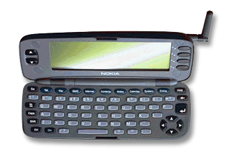
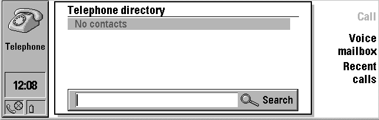
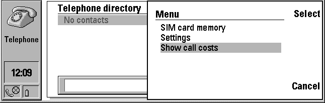
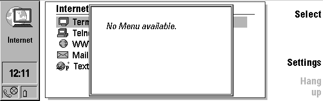
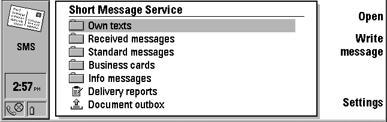
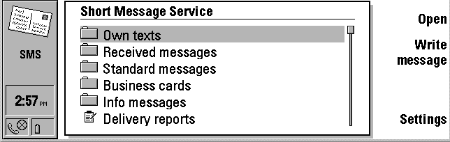
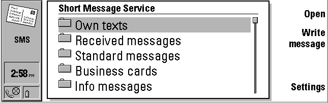

## Nokia 9000/9000i/9110 Communicator Fact Sheet



### Hardware

**The device dimensions are:**

*9000/9000i Communicator*

- 17 cm long
- 6 cm wide
- 4 cm thick
- 400 grams

*9110 Communicator*

- 15.8 cm long
- 5.6 cm wide
- 2.7 cm thick (218 cc)
- 249 grams

**Processor**

- The phone functions are based on a Nokia 2110i.
- 9000/9000i Communicators run on a 24 MHz 80386 chip; the 9110 Communicator uses an AMD 486 processor.

**Memory**

The Nokia 9000i Communicator has 8 megabytes of Flash RAM in it. It is partitioned as follows:

4 MB for "ROM" for the OS and applications

2 MB for application execution and heap space

2 MB for user data storage (essentially a RAM disk)

**Memory Cards**

The Nokia 9110 Communicator has a memory card slot. To insert the postage-stamp size memory card, you must turn off the device, remove the battery, and insert the card behind the battery. A memory card can provide up to 4 MB of additional Flash RAM or ROM, but future cards could provide even more memory. Since memory cards use a 32 bit address, they have a theoretical 4 GB upper limit.

**Screen display**

The display is a grayscale LCD screen 640x200 pixels, measuring 115 by 36 millimeters. The screen is neither touch-sensitive nor pen operable. The left status pane is 80 pixels wide and the command buttons at the right have a variable width, so an application's usable screen dimensions will be less than or equal to 560x200 pixels. For instance, the web browser has 540x200 pixels of usable display for web pages.

Nokia 9000i Communicators support 4 levels of gray, and the newer Nokia 9110 Communicators support 4-bit color (displays 16 levels of gray). Even though the 4-bit color devices default to 4 levels of gray, applications may change modes on-the-fly.

**Keyboard**

The keyboard is a standard QWERTY keyboard. English, French German and Scandinavian versions are currently available.

**Communication**

- Cellular (voice and data)
  
  - Communication is through the GSM digital network, which can transmit cellular voice, data (and fax) and SMS alpha-numeric pages.
    
    - GSM's Short Message Service (SMS) allows mobile devices to send short, 160 character messages as a single packet of information. Nokia 9000i Communicators can send and receive these messages, and route them to specified target applications.
  - E-mail conforms to the SMTP and business card standards.
  - Internet protocols: TCP/IP and PPP.
  - The maximum baud rate for data calls is 9600 baud (14,400 baud on 9110 Communicators).
- The Nokia 9000i supports two COM ports:
  
  - COM1 is the serial port
  - COM3 is the infrared port
  - (COM2 used internally so it is not available to applications.)
- Infrared communication with outside devices via IrDA
  
  - The maximum baud rate for IrDA is 57,600 baud.
- Serial line communication via a RS-232 compatible connection.
  
  - The maximum baud rate for the serial line is 19,200 baud.
- NServer and device debugging at 19,200 baud

**Battery Life**

The Nokia 9110 Communicator uses a 1100 mAh Li-ion Battery that provides 3-6 hours of talk/data/fax, 60-200 hours of standby, up to 400 hours of standby when the phone is off, and takes 2 hours to charge.

### Text

The following is a list of all the available fonts, their sizes, styles, and comments.

|                        |                     |                                  |                                                                                                                                           |
|------------------------|---------------------|----------------------------------|-------------------------------------------------------------------------------------------------------------------------------------------|
| **Font:**              | **Available Size:** | **Styles:**                      | **Comments:**                                                                                                                             |
| FID\_RESPONDER         | 14                  | Bold                             | --                                                                                                                                        |
|                        | 16                  | Plain, Bold                      | --                                                                                                                                        |
|                        | 17                  | Plain                            | --                                                                                                                                        |
|                        | 18                  | Plain, Bold, Italic, Bold-Italic | FID\_RESPONDER 18 is the default font                                                                                                     |
|                        | 20                  | Bold, Bold-Italic                | --                                                                                                                                        |
| FID\_TERMINAL          | 8                   | Plain                            | Tiny, 7 pixel wide font need to display 80 characters per line, for Telnet and the like                                                   |
|                        | 16                  | Plain                            | Also 7 pixels wide, but vertically stretched for legibility; you can only display 12 lines of text on the screen using this font.         |
| FID\_TERMINAL\_GRAPHIC | 8                   | Plain                            | 7 pixel wide font need to display 80 characters per line. Has VT100 graphics above 80h..                                                  |
|                        | 16                  | Plain                            | 7 pixels wide, but vertically stretched for legibility; you can only display 12 lines of text in this font. Has VT100 graphics above 80h. |
| FID\_DTC\_URW\_SANS    | Any Size            | --                               | Outline font.                                                                                                                             |
| FID\_DTC\_URW\_MONO    | Any Size            | --                               | Outline font.                                                                                                                             |
| FID\_DTC\_URW\_ROMAN   | Any Size            | --                               | Outline font.                                                                                                                             |
| FID\_BISON             | --                  | --                               | This font has only one character, '\*'. This is used for passwords.                                                                       |

### Icons

There are two types of icons: Status Pane Icons and File List Icons.

When creating a status pane icon using the Icon Editor, use the following settings:

- Width: 64
- Height: 50
- Color Scheme: 16-color
- Aspect Ratio: VGA
- Format Type: Icon
- Display Size: Standard

When creating a file list icon using the Icon Editor, use the following settings:

- Width: 25
- Height: 18
- Color Scheme: 16-color
- Aspect Ratio: VGA
- Format Type: Icon
- Display Size: Tiny

### Communicator Grays

Nokia 9000i Communicators support 4 levels of gray and the newer Nokia 9110 Communicators support 4-bit color, even though the display is grayscale (16 shades of gray). There are two different grayscale schemes used, one for visMonikers and icons, and the other for normal GEOS drawing routines.

Icons can make use of 4 levels of grey. When drawing an icon, use the following mapping of colors to create the correct gray level in the icon: (if other color values are used, they will not show up on 9000i devices).

|                      |                        |
|----------------------|------------------------|
| **GEOS Color**       | **Icon Level of Gray** |
| **C\_WHITE**         | **White**              |
| **C\_LIGHT\_VIOLET** | **Light Gray**         |
| **C\_GREEN**         | **Dark Gray**          |
| **C\_BLACK**         | **Black**              |

Other graphics can make use of the 16 GEOS enumerated color types to choose the appropriate gray. The device will correctly map the color to the correct level of gray, depending on number of screen grays available. The following table displays how different colors will map to gray on 4- and 16- level grayscale modes.

|                                 |                      |                       |
|---------------------------------|----------------------|-----------------------|
| **GEOS Color**                  | **4 Levels of Gray** | **16 Levels of Gray** |
| **C\_BLACK, C\_DARK\_GRAY**     | **Black**            | **Black**             |
| **C\_BLUE, C\_LIGHT\_BLUE**     |                      | **Dark-dark gray**    |
| **C\_GREEN, C\_LIGHT\_GREEN**   | **Dark gray**        | **Mid-dark gray**     |
| **C\_CYAN, C\_LIGHT\_CYAN**     |                      | **Light-dark gray**   |
| **C\_RED, C\_LIGHT\_RED**       | **Light gray**       | **Dark-light gray**   |
| **C\_VIOLET, C\_LIGHT\_VIOLET** |                      | **Mid-light gray**    |
| **C\_YELLOW, C\_BROWN**         | **White**            | **Light-light gray**  |
| **C\_WHITE, C\_LIGHT\_GRAY**    |                      | **White**             |

### Disk Space Warnings

Often, it is useful to get a qualitative measure of the available free disk space to check whether the disk is dangerously full. The disk warning levels are:

The **Warning Level** is less than 50K.

The **Critical Level** is less than 25K

### UI Conventions: Triggers

**Trigger Usage**

To maintain a consistent look-and-feel for all Nokia 9000i applications, it is important that developers follow the same set of UI conventions. The most important navigation tool on the Nokia 9000i are the four triggers at the right side (see below).

  
*"Call", "Voice mailbox" and "Recent calls" are this application's triggers. "Call" is in slot 0, "Voice mailbox" is in slot 2, etc. This particular application does not use slot 3.*

The application specifies what these triggers are and which slot (0, 1, 2, or 3) each of these triggers belongs in. Newer versions of the Communicator (software verions 4.8 or later) support a fifth trigger, the menu trigger (see [below](#menu_trigger)). In general, applications should use:

    HINT_SEEK_SLOT = 0

The main action (such as Open or Send). Affirmative responses (such as OK).

    HINT_SEEK_SLOT = 1

Secondary functions or Main function if slot 0 is taken.

    HINT_SEEK_SLOT = 2

Settings and similar buttons that bring up options. Apply trigger in dialogs.

    HINT_SEEK_SLOT = 3

Negative responses such as Cancel, Close, or Dismiss. Back triggers. (Back is **always** in slot 3. This is the trigger with ATTR\_TLT\_IS\_BACK\_TRIGGER set.) "OK" if it is for dismissing the dialog box or if there are no other buttons. Settings can go here is slot 2 is already taken.

Applications launched from "Extras" must have a close button that calls `MSG_FSA_RETURN_TO_LAUNCHER`

You can use up to 6 triggers by setting up two panes of triggers. If this is done, than the fourth trigger of each group must be either "More" or "Back" text monikers with the associated right and left pointing icons.

**Menu Trigger**

Software versions 4.8 or later of the Communicator allow for a fifth "Menu" trigger that behaves just like a regular trigger except that it is invisible and does not take up a slot at the right side of the screen. It is activated whenever the user pushes the "Menu" button present on newer versions of the Communicator.

  
*A normal application, with a certain set of visible triggers...*

  
*...may preform a particular action when the "Menu" trigger is activated, even though this trigger does not take up a visible slot at the right side of the screen.*

  
*If the user pushes the "Menu" button and there is no trigger to catch this action, then a pop-up note informs the user that there is no menu specified for this application.*

To create a menu trigger, follow the same steps for creating a normal trigger but do not designate a HINT\_SEEK\_SLOT = {0,...,3} and set `CMI_topText = CMT_MENU;`. This automatically distinguishes it as a menu trigger. For more information, refer to "ComplexMoniker Usage".

Ctrl-F2 corresponds to the menu button on the emulator.

### Zoom Levels

On versions 4.8.8 or later of the 9000i Communicator, the user can press an off-screen "Zoom" button to toggle between three text size settings -- "Zoom" levels -- and adjust the text size for comfortable reading.

  
*Normal zoom level.*

  
*Medium zoom.*

  
*High zoom. Note that only some parts of the UI are enlarged as the user chooses a higher zoom level. It would be impossible to fit larger triggers into the four slots, or increase the size of the clock.*

On the emulator, the "Zoom" button is mapped to Ctrl-F1.

Use `HINT_MAXIMUM_ZOOM_LEVEL` to determine the maximum size that a UI component may be zoomed. `HINT_MAXIMUM_ZOOM_LEVEL = ZL_ZOOM_1;` implies that the component will not be zoomed at all, whereas `HINT_MAXIMUM_ZOOM_LEVEL = ZL_ZOOM_3;` implies that a UI component can be zoomed at the normal, medium, or maximum zoom levels.

The higher the zoom level, the larger the font size, and the fewer the number of characters that will fit into a fixed pixel length field. Thus, if you use a `CreateVisMoniker...()` routine, you should use the routines `FoomZoomGetLevel()` and `FoamConvertToZoomedSize()` to take the zoom level into consideration and create a VisMoniker of appropriate size. (Refer to [Zoom Level UI](../../Nokia9000/UI/9000UI_zoom.htm) for more details.)

### Nokia 9000i Emulator Keyboard Mapping

**This only applies to US QWERTY keyboards**

F1 - Button 1

F2 - Button 2

F3 - Button 3

F4 - Button 4

F5 - launch Phone application

F6 - launch Fax application

F7 - launch SMS application

F8 - launch Internet Services application

F9 - launch Contact manager application

F10 - launch Notebook application

F11 - launch Calendar application

F12 - launch System application

Ctrl F12 - launch Extras application

Left Alt - Chrset

Insert - Help

Page Up - Scroll up

Page Down - Scroll down

Pause - Shutdown demo

Ctrl F1 - Zoom button (software versions 4.8 or later)

Ctrl F2 - Menu button (software versions 4.8 or later)

Ctrl F3 - Detach application

Ctrl F4 - Close application

### Sound

Communicator applications may play `StandardSoundType` sounds through the PDA-side speaker. If you write applications that use sounds, you will have to debug sounds on the actual device since the emulator does not provide sound support.

### The Installer

The Nokia 9000i Communicator SDK comes with an installer application called **NServer.exe**. It uses an installation script that describes your application's name, version, and related files that will need to be transferred.

### To Clear all RAM

To reset the Nokia 9000i Communicator and effectively erase every bit of data on the phone (except, of course, the factory settings and data) you must pull out the main battery, put it back in, then hold down the keys Shift-Esc-f. You will be prompted to format the RAM of the device and you can cancel here if you don't really want to erase the data.

Once the phone has been reset you must re-enter all of the user data again, including your home country, name, and address.

### Version Information

You can get version information from the INI file on the Nokia 9000i Communicator. The information is stored as a string in `[UI]swSerialNumber`. The string is 27 characters long. This same string can be seen on the last line of About this product. The whole string looks like this:

```
      000000/00/2a0030808044001/0. 
```

The interesting part is: 2a0030808044001. The three first characters identify hardware version (here 2.10), six following characters identify software version (here 03.08.08), three following characters identify the country code (44 = Great Britain) and the last three characters identify the keyboard type (here 001 = English).

Here is sample code that shows how to extract the version information:

``` 
@start StringRes;
@chunk TCHAR UICategory[] = "ui";
@chunk TCHAR SWSerialNumber[] = "swSerialNumber";
@end StringRes;

...

@method TestProcessClass, MSG_TEST_PROCESS_GET_VERSION
{
TCHAR   version[28] = "";
TCHAR * category;
TCHAR * key;
word    value;

MemLock( OptrToHandle( @UICategory ) ); 
category = (TCHAR *) LMemDeref( @UICategory ); 
key      = (TCHAR *) LMemDeref( @SWSerialNumber ); 
InitFileReadStringBuffer( category,
	key,
	version,
	IFRF_SIZE | 28,
	&value );

/*
* Extract the information you want from version string. 
*/
MemUnlock( OptrToHandle( @UICategory ) );
}
```

### Lid-closing Event

After the Nokia 9000i Communicator's lid is closed, the Communicator waits for 30 seconds and then turns off the CPU. Of course, the CPU will not turn off until all applications are idle.

To receive notification that the lid is closed, an application should register on the GCN list `GCNSLT_RESPONDER_NOTIFICATIONS`. It should watch for `MSG_META_NOTIFY` with `notificationType == GWNT_RESPONDER_NOTIFICATION`, `manufID == MANUFACTURER_ID_GEOWORKS` and `data == RNT_LID_CLOSED`. (`ResponderNotificationType` is defined in N9000v20\\CInclude\\Internal\\respondr.goh)

### Debugging an actual Nokia 9000i Communicator

To debug on an actual Nokia 9000i Communicator, you need to attach your host PC to the device's 6-pin serial port. Then run the GEOS Setup program and change the "Communication Mode" to Remote and set the "Comm Speed" to 38400. Which "COMM Port" you use depends on which port on your PC you have used to connect to the phone. Remove the battery so the phone shuts down. Then replace the battery and press:

SHIFT-D-O (that is 'oh' not zero) to boot and wait for swat to attach.  
SHIFT-D-B to boot with swat stub loaded, but doesn't wait for swat to attach.

Note that IR connections and PC connectivity won't work while the Nokia 9000i Communicator is in debug mode. (IR shares a UART with the swat port, so you trying to open the port will lock the device.)

Also note that debugging on the device is limited because you cannot set breakpoints in any of the system routines (since they are in ROM). Mostly you can check backtraces and set breakpoints in your own application.