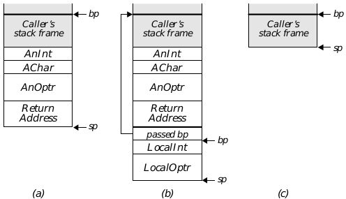
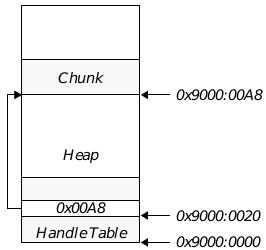
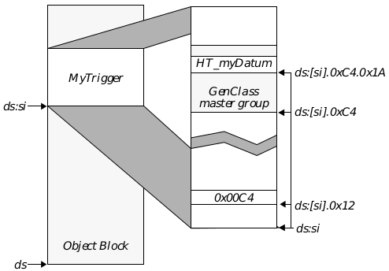

## 3 Routine Writing

This chapter deals with some of Esp's special features, and describes how to 
write routines (and message-handlers) in Esp. 

Not all GEOS programmers will use Esp in the same way. Most will, of 
course, not use it at all, using Goc instead. Some will write a few heavily-used 
routines in Esp, or perhaps write an Esp library which will be called by one 
or more applications which are written in Goc. And some will write entire 
applications in Esp.

This chapter describes how to write Esp routines for a variety of purposes. It 
describes conventions for writing both Esp routines and message-handlers, 
as well as special Esp conventions and techniques which differ significantly 
from their Goc counterparts.

### 3.1 GEOS Conventions

GEOS has certain presumptions about how routines behaves. If you write 
your code to follow these conventions, Esp and Swat can work together to 
make writing and debugging much simpler than they are with other 
assemblers.

Some of these conventions have been described earlier. To recap: You should 
never change ss; the kernel does this automatically when switching between 
threads. You should never change IF or TF. You may set DF, but you must 
clear it before calling any routine or returning. You may not load an invalid 
segment address into ds or es.

Most routines are passed their arguments in registers. If arguments are 
passed on the stack, the routine being called should pop them off the stack 
when returning. (Esp automatically does this if the routine declares its 
arguments properly.) If a routine uses local arguments, it should set bp to 
point to the base of the stack frame; it can then access the arguments with a 
displacement from ss:[bp]. Again, Esp can do this automatically.

Routines can have local variables as well as arguments. The local variables 
are kept on the stack immediately below the return address. As with 
arguments, they are accessed with a displacement from ss:[bp].

For example, suppose the near routine HelloProc is passed three arguments 
on the stack: AnInt, AChar, and AnOptr. HelloProc itself declares two 
local variables, LocalInt and LocalOptr. The calling routine pushes the 
three arguments on the stack, then calls HelloProc. The call pushes the 
return address on the stack (Figure 2-1.a).

HelloProc immediately pushes bp on the stack and copies the current value 
of sp to bp. bp now points to the base of HelloProc's stack frame. HelloProc 
then subtracts six from sp, making room for its local variables (Figure 2-1.b).

When HelloProc is ready to return, it copies bp to sp, thus removing 
everything from the stack up to the saved bp. It then pops bp off the stack; 
bp now has the value it had when HelloProc was called. Finally, it executes 
a retf 8, which pops the arguments off the stack and returns. (Note that 
you can simply use the "ret" pseudo-op; Esp will automatically expand it to 
a retn or retf which pops all local arguments off the stack.)

**Figure 2-1** Stack conventions for GEOS routines  
_(a) This is the stack-s setup when HelloProc was called, but before HelloProc did anything to the stack._  
_(b) This is the stack after HelloProc has finished setting up the stack frame._  
_(c) This is the stack after the ret instuction is executed. The ret pops the return address and the parameters off the stack._

As noted above, Esp does most of the bookkeeping for you. You need simply 
declare your arguments and local variables, then use the .enter and 
.leave directives. Esp will automatically set up the stack as necessary.

Passed parameters are always word-aligned. This is because they are pushed 
on the stack by the caller, and push always pushes a word-sized values. Local 
variables, on the other hand, are not necessarily word-aligned; Esp allocates 
just enough space for the local variables. (It will, if necessary, add a padding 
byte, so the total amount of space used by local variables remains 
word-aligned.)

#### 3.1.1 Parameters and Local Variables

Esp makes it easy to use local variables and parameters. You need simply 
declare them in the beginning of a procedure; Esp will automatically set up 
the stack frame.

Parameters are declared on the same line as the procedure name. The first 
line of a procedure therefore has the following format:

~~~
<ProcName> proc (near|far) \
	[<paramName>:<paramType> \
		[, <paramName>:<paramType>]*]
~~~

**ProcName**  
The name of the procedure. The name's scope is the entire assembly.

**near|far**  
Either "near" or "far". Near routines may only be called from 
within the same resource, but there is slightly less overhead 
when calling or returning.

**paramName**  
The name of a parameter. This name is a label whose scope is 
limited to the procedure.

**paramType**  
The type of the parameter. 

You may specify the order of the parameters with the .model directive. If you 
use ".model pascal" (the default), parameters must be declared in the 
order in which they appear on the stack (that is, the first argument declared 
is the first one to be pushed on the stack). If you use ".model cdecl", the 
last parameter declared is the first one to be pushed on the stack. Assuming 
we use the Pascal convention, HelloProc (described in Figure 2-1), would 
have the following first line:

~~~
HelloProc proc far	AnOptr:optr, AChar:char, AnInt:int
~~~

Local variables are declared immediately after this line. Each local variable 
has the following format:

~~~
<varName>		local <varType>
~~~

**varName**  
The name of the local variable. The scope of this variable is 
limited to the procedure.

**varType**  
The variable's type.

As noted above, passed parameters are word-aligned, since they must be 
pushed on the stack by the caller. Local variables, on the other hand, are not 
aligned. Local variables are not initialized, unless you explicitly specify an 
initial value (as described below).

You can use the name of a parameter or local variable to access it. The name 
is equivalent to an effective-address displacement from ss:[bp]. The name 
is therefore valid only if bp points to the start of the stack frame.

If you use parameters or local variables, you must use the .enter and 
.leave directives. .enter expands into the instructions necessary to create 
the stack frame, as well as the aliases for the variable names. .leave 
destroys the stack frame, restoring sp and bp to their values at the time 
.enter was used.

##### 3.1.1.1 Initializing Local Variables

If you wish, you can specify that local variables be initialized. When Esp 
builds the stack frame (i.e. at the .enter instruction). The initialization is 
done with a "push" instruction; therefore, you can only initialize variables 
with values that can be pushed (i.e. 16-bit registers, memory locations, or 
16-bit immediate values).

There are some rules for initializing local variables:

+ All of the initialized variables must be declared before any of the 
uninitialized variables.

+ Each of the initialized variables must be a whole number of words in size. 
You must push enough values to precisely fill the variable.

+ The values are pushed after the stack frame is set up; therefore, you 
cannot initialize a local variable to contain bp (except as described 
below). If you want to copy the old bp to a local variable, initialize it to 
contain ss:[bp] (the location of the stored bp). If you want to copy the 
new bp (i.e. the current frame pointer) to a local variable, you must do it 
by hand after the .enter instruction.

To initialize the variable, put a push instruction at the end of the declaration, 
on the same line. Like any GEOS push, the instruction may have multiple 
arguments; they will be pushed in order, from left to right (therefore the first 
argument given will be the highest word of the variable).

For example, a procedure might have the following declarations:

~~~
HelloProc	proc near

AnOptr		local optr	push bx, di
AMemValue	local int	push ds:[GlobalVariable]
AByte		local byte		; not initialized

AnotherInt	local int		; not initialized
~~~

When Esp set up the stack frame, it would take steps equivalent to the 
following instructions:

~~~
push	bp		; Set up the stack frame
mov	bp, sp		; (ss:[bp] = base of frame)
push	bx		; Initialize AnOptr: high word
push	di		; low word
push	ds:[GlobalVariable]			; copy mem. location 
				; to local variable
sub	sp, 4		; Leave room for AByte and 
			; AnotherInt (and add one byte, so
			; local vars are word-aligned)
~~~

There is a special case for initializing local variables. The first local variable 
may be initialized with "push bp". (If it is a multi-word variable, the high 
word, and only the high word, may be initialized with bp.) In this case, bp is 
not actually pushed on the stack. Instead, that variable's location is made to 
be ss:[bp]; that is, the variable is another name for the location containing 
the stored bp. You may read the passed bp from this variable; similarly, if you 
write a value to this variable, that value will be returned in bp. This is useful 
if you need to return a value in bp. If you want a local variable to contain the 
passed bp, but you do not want to change bp on return, you should 
push-initialize the variable with ss:[bp], as described above.

#### 3.1.2 The "uses" Directive

Many routines will need to preserve the state of some or all of their registers. 
Esp provides for this with the uses directive. This directive is used to specify 
a list of registers that should be pushed at the start of the routine, and 
popped at the end. Uses has the following format:

~~~
uses	<reg> [, <reg>]*
~~~

uses must be used in conjunction with .enter and .leave. The registers 
will be pushed at the point where .enter is used; they will be popped where 
.leave is used.

#### 3.1.3 .enter and .leave

Esp provides several conveniences for writing routines. It can automatically 
save registers, set up stack frames, and set up local arguments. You can 
signal when to do this by using the .enter and .leave directives. 
Ordinarily, the .enter directive is put right after the local variable 
declarations, and before any actual code. The .leave directive is put just 
before the ret directive. 

.enter sets up a stack frame if necessary. It will only do this if the routine 
declares parameters or local arguments (see [section 3.1.1](#311-parameters-and-local-variables)). Setting 
up a stack frame entails pushing bp on the stack and copying the current sp 
to bp. .enter also pushes any registers declared with "uses". If you use the 
.enter directive, you must use it before you push anything on the stack, try 
to access any of the parameters or local variables, or change any registers 
which must be preserved.

If you use a uses directive, you must use the .enter and .leave directives. 
.enter will push all named registers after it sets up the stack frame. 
.leave will pop the registers before it destroys the stack frame.

To inherit a stack frame, put an inherit instruction after the .enter 
instruction. This is discussed in [section 3.1.4](#314-inheriting-a-stack-frame).

Note that if you use local variables or stack parameters, .enter and .leave 
will automatically preserve bp; that is, bp will have the same value after 
.leave as it had before .enter. If you need to return a value in bp, you 
should set up a local variable to hold the stored bp, as described in [section 
3.1.1.1](#3111-initializing-local-variables). (You can also copy the return value to bp after the .leave 
instruction destroys the stack frame, but before the ret.)

---
Code Display 2-5 Writing a Procedure
~~~
; This shows how Esp automatically sets up the stack frame to accommodate local 
variables and passed parameters, and to preserve registers. The procedure is the 
HelloProc described in section 3.1.

COMMENT @%%%%%%%%%%%%%%%%%%%%%%%%%%%%%%%%%%%%%%%%%%%%%%%%%%%%%%%%%%%%%%%%%%%
 HelloProc
%%%%%%%%%%%%%%%%%%%%%%%%%%%%%%%%%%%%%%%%%%%%%%%%%%%%%%%%%%%%%%%%%%%%%%%%%%%%

SYNOPSIS: This shows how Esp automatically sets up the stack frame to accommodate 
local variables and passed parameters, and to preserve registers. The procedure is 
the HelloProc described in section 3.1.

CALLED BY: HelloOtherProc

PASS:	stack:	AnInt (pushed first)
		AChar
		AnOptr

RETURN:		ax = freeble factor

DESTROYED: nothing

SIDE EFFECTS: none

PSEUDO CODE/STRATEGY:	
Set up the local variables, then call HelloInnerProc to do the dirty work

REVISION HISTORY:

 Name 		Date 		Description
 ---- 		---- 		-----------

 Frank T. Poomm		4/1/93 		Initial version

%%%%%%%%%%%%%%%%%%%%%%%%%%%%%%%%%%%%%%%%%%%%%%%%%%%%%%%%%%%%%%%%%%%%%%%%%%%%@

HelloProc proc far			anOptr:optr, aChar:char, anInt:int

uses bx, cx, dx

localInt		local int		push ax
localOptr		local optr

.enter

	call HelloInnerProc			; Calculate freeble factor; put it in LocalInt
				; (HelloInnerProc presumably inherits the stack
				; frame from HelloProc)
	mov	ax, localInt		; Return the freeble factor

.leave

	ret

HelloProc endp

; Esp would expand this to code like this:

	; Set up stack frame
	push	bp	; preserve value of bp
	mov	bp, sp	; Set bp to point to stack frame
	push	ax	; Initialize LocalInt...
	sub	sp, 4	; ...and leave enough uninitialized space for an optr

	; Set up names of parameters/local variables
	anOptr		equ ss:[bp+6] 		; All of these names have local scope.
	aChar		equ ss:[bp+6][4]
	anInt		equ ss:[bp+6][6]
	localInt		equ ss:[bp][-2]
	localOptr		equ ss:[bp][-6]

	; Preserve registers specified in "uses" line
	push	bx		; Esp recognizes that bp was preserved when the
	push	cx		; stack frame was set up, so it does not push bp 
	push	dx		; again here.

	call	HelloInnerProc

	mov	ax, ss:[bp][-2]		; This copies the "localInt" variable into ax

	; Restore the registers & destroy the stack frame
	pop	dx
	pop	cx
	pop	bx
	mov	sp, bp	; This pops the stack frame
	pop	bp	; This restores bp

	; Return, freeing passed parameters
	retf	8

HelloProc		endp
~~~

#### 3.1.4 Inheriting a Stack Frame

You may write a routine which is called only by a single other routine. For 
example, if you were writing a sort routine, you might write several 
comparison routines, each of which is only called by the sort routine. In this 
situation, you might want to let the routine use local variables and 
parameters that belong to its caller. You can do this by having the routine 
inherit the stack frame of its caller.

If you inherit a stack frame, Esp assumes that ss:[bp] points to the caller's 
stack frame (i.e. that bp was set to point to that routine's stored bp). Esp 
declares variable names in the local namespace which indicate appropriate 
displacements from the frame pointer. If a routine inherits a stack frame, it 
may not (of course) create a stack frame of its own; that is, it may not have 
any of its own local variables or passed parameters.

The simplest way to inherit a stack frame is with a directive of this kind:

~~~
.enter inherit			<routineName>
~~~

**routineName**  
This is the name of the routine whose stack frame will be 
inherited. This routine must be in the same assembly, and 
under certain circumstances it must already have been 
assembled before the inheritor is assembled.

Esp will automatically declare the names of the variables and parameters in 
the local namespace. As always, it is your responsibility to keep ss:[bp] 
pointing to the stack frame.

A routine which inherits a stack frame may specify what local variables and 
parameters it expects to find in that frame. It does this by declaring the local 
variables and parameters exactly the way other routines declare their own 
local variables and parameters. Esp will assume that these correspond to the 
variables in the stack frame, and will declare those local variables 
appropriately. Indeed, you need not even use the name of the routine from 
which the frame is inherited; you can simply use the reserved words "near" 
or "far". (Esp needs to know whether the inherited frame is from a near or 
far procedure in order to figure out how much space the frame uses for the 
return address.)

For example, suppose you have the declaration

~~~
HeirProc  proc near		callerParamOptr:optr,			\
				callerParamInt:int

callerLocalInt			local int
callerLocalOptr			local optr

.enter		inherit near
~~~

As noted, Esp will not change bp; it assumes that ss:[bp] already points to 
the base of the stack frame. Esp will declare the variables in the local scope; 
that is, callerParamOptr will refer to ss:[bp+4], callerParamInt will refer 
to ss:[bp+4][4], callerLocalInt will refer to ss:[bp][-2], and 
callerLocalOptr will refer to ss:[bp][-6]. Esp makes no guarantees that 
these locations hold meaningful values; it is your responsibility to make sure 
that you are describing the actual stack frame.

Note that if a routine declares a parameter or local variable, but never 
accesses it, Esp will generate a warning at assembly time. If you declare a 
variable that is used only by other routines which inherit the stack frame, 
you can disable the warning by using the [ForceRef](ebasics.md#forceref) macro.

### 3.2 LMem Heaps and Chunks

It is worth paying special attention to Local Memory heaps as they are used 
in Esp. The heaps themselves are always the same, whether they are created 
and accessed from Esp code or from Goc code; however, they are manipulated 
in a somewhat different way.

First, a review of the basics of LMem is in order. A local memory heap is held 
within a single "global" block. The block is actually divided into two main 
portions, a handle table and the heap itself. Chunks are assigned in the 
"heap" portion of the block. A chunk's location within a heap may change 
from time to time. For example, when any chunk is allocated or expanded in 
an LMem heap, every chunk in the heap may be moved to accommodate the 
change. Thus, the address of a chunk is very volatile. However, every chunk 
has a handle which is unchanging.

The location of the LMem heap itself is also volatile. Whenever a chunk is 
allocated or expanded, the LMem heap may have to be expanded to make 
room for it. This can cause the LMem heap to move on the global heap.

In Goc, chunk handles are treated as opaque tokens. To get the address of a 
chunk, you call **LMemDeref()**, passing the global handle of the LMem heap 
and the chunk handle of the chunk. **LMemDeref()** returns the address of the 
chunk, as a far-pointer (i.e. segment:offset). You end up having to do this over 
and over; whenever you allocate or resize a chunk, the pointers to every other 
chunk are invalidated.

In Esp, chunk handles are not treated as opaque. A chunk handle is a 
near-pointer; that is, it is an offset from the beginning of the LMem heap. The 
chunk handle is a pointer to an entry in the LMem heap's handle table. The 
entry contains the offset from the beginning of the heap to the chunk itself 
(See Figure 2-2). Whenever you need to get the address of the chunk, you 
simply use the chunk handle to find the current offset of the chunk.

The Esp versions of most LMem routines require you to pass the segment 
address of the LMem heap in ds. Some routines may cause the block to be 
moved. These routines will generally fix ds so it still points to the heap after 
the call, even if the heap moved. Furthermore, if es was the same as ds at 
the time of the call, the routines will generally fix es as well. Some other 
routines (notably **ObjMessage**) fix these registers if you pass a special flag 
instructing them to do so. You should check the reference for any routine 
which can shuffle an LMem heap to see if it automatically fixes these 
registers. Remember, if you store the segment address of the heap, that 
stored address will not be fixed up; you will have to fix the stored address by 
hand.

**Figure 2-2** Structure of LMem Heap  
_The LMem heap is divided into a handle table and the heap proper. The chunk
handle is an offset to an entry in the handle table; that entry contains the offset
to the chunk itself.  
In this example, we assume that the heap is at location 0x9000; we wish to find
the chunk with handle 0x0020._

---
Code Display 2-6 Using an LMem Heap
~~~
; This is an example of how to use an LMem heap in Esp. In this example,
; chunkHandleOne, chunkHandleTwo, and heapHandle are word-sized local variables.
; At the start of this code, chunkHandleOne and heapHandle are already set;
; chunkHandleTwo contains no meaningful value.

; First, we want to get access to the chunk specified by chunkHandleOne:

	mov	bx, heapHandle			; bx = global handle of LMem heap
	call	MemDerefDS			; ds:[0] = LMem heap
	mov	si, chunkHandleOne		; ds:*si = chunk
	mov	si, ds:[si]			; ds:[si] = chunk

; ds:[si] is now the address of the chunk. We can read from or write to the chunk
; at will. Now we want to allocate another chunk. ds still has the segment address
; of the LMem heap.

	clr	al			; Clear all object flags
	mov	cx, MY_CHUNK_SIZE	; cx = size of chunk
	call	LMemAlloc		; ax = chunk handle of new chunk
	mov	chunkHandleTwo, ax	; store the new handle

; Note that the call to LMemAlloc may have moved the LMem heap. LMemAlloc
; automatically fixes ds (and, if appropriate, es); however, if I'd stored the
; address of the heap, the stored address would now be invalid.

; Now I want to look at the first chunk again. However, LMemAlloc can shuffle the
; heap, so I need to dereference the handle again:

	mov	si, chunkHandleOne
	mov	si, ds:[si]
~~~

These principles apply wherever LMem heaps are used. For example, DB 
items are stored in item blocks, which are a kind of LMem heap. When you 
lock a DB item, you are given the item's chunk handle, as well as the segment 
address of the item block. You must dereference the chunk handle the same 
way you would any other chunk handle.

Object Blocks are also LMem heaps. Whenever a message is sent to an object, 
that object may be resized; this can shuffle the block, or cause the object block 
to move on the global heap.

### 3.3 Objects and Classes

One big difference between Esp and other assemblers is Esp's support for 
object-oriented programming. OOP is at the heart of GEOS, and Esp is 
designed to make all the power of OOP available without sacrificing the 
efficiency of assembly language.

Using objects and classes is simple. The issues can be divided into three 
categories: Declaring objects; creating new classes; and handling messages. 
Each issue will be treated in its own section. This section also contains a 
review of the structure of GEOS objects, and how objects are handled in Esp.

#### 3.3.1 Object Structure

This section is a review of how GEOS works with objects. Before you read this, 
you should be familiar with ["GEOS Programming," Chapter 5 of the 
Concepts Book](../Concepts/ccoding.md).

An object's instance data is stored as a chunk in an object block. An object 
block is a special kind of LMem heap. Whenever an instance chunk is created 
or expanded, all the other chunks in that object block may be moved, and the 
block itself may move on the global heap. When this happens, you can get the 
address of the instance chunk by dereferencing the chunk handle, as with 
any chunk.

The instance data for objects is divided into master groups. Master groups 
are discussed in [section 5.3.2.2 of chapter 5 of the Concepts book](../Concepts/ccoding.md#5322-master-classes).

In order to gain access to the instance data for an object, you have to find the 
offset to the master section containing that class's instance data. For 
example, suppose you need to examine the HT_myDatum field of an instance 
of HelloTriggerClass. HelloTriggerClass is subclassed from 
GenTriggerClass, which is itself subclassed from GenClass. GenClass is 
the first master class above HelloTriggerClass; thus, all the instance data 
defined by GenClass, GenTriggerClass, and HelloTriggerClass is in the 
same master group.

Esp automatically defines HT_myDatum as the displacement from the start of 
the master group to the HT_myDatum field. In order to actually examine the 
field, you have to know where the master group begins. The displacement to 
the master section can change during the life of the object; however, you can 
find the displacement by looking at a specific place in the object. To allow you 
to find the displacement, Esp defines a constant instructing you where to 
look. In this case, the constant would be called HelloTrigger_offset. This 
constant says where in the object you should look to find the displacement to 
the master group containing HelloTriggerClass's instance data. (In this 
case, HelloTrigger_offset is the same as GenTrigger_offset and 
Gen_offset.) To actually examine the field, you would take the steps shown 
in "Finding a Class's Master Section", Code Display 2-7.

**Figure 2-3** Finding an Instance Datum in a Master Section  
_We need to find HT_myDatum, a field in HelloTriggerClass. The first master
class above HelloTriggerClass is GenClass, so the field will be in the GenClass
master section.  
In this example, we assume that ds points to the beginning of the object block,
and ds:[si] is the beginning of the instance chunk. HelloTrigger_offset is
assumed to be 0xA2. HT_myDatum is assumed to be 0x1A; that is,
HT_myDatum starts 0x1A bytes from the beginning of the master section._

---
Code Display 2-7 Finding a Class's Master Section
~~~
; We want to examine an instance datum of an object. In particular, we want to
; load the word-sized HT_myDatum field of a HelloTrigger object into ax. ds:[bx]
; points to the beginning of the object's instance chunk.

; First, we need to get the address of the master section. As noted, ds:[bx] 
; points to the beginning of the instance chunk.
	mov	di, ds:[bx].HelloTrigger_offset

; Now, ds:[bx][di] points to the beginning of the master section. To load the 
; datum, we add a displacement to this:
	mov	ax, ds:[bx][di].HT_myDatum
~~~

When a message handler is called, it is given a pointer to the beginning of the 
instance chunk. However, whenever an object does anything which could 
shuffle the heap, it should redetermine this address, as described above.

If there is no master class in an object's class hierarchy, all instance data will 
be located at a constant offset from the start of the chunk. In this case, the 
name of an instance field will evaluate to the displacement from the 
beginning of the chunk to the field. Esp will not define constants of the form 
MyClass_offset; you can simply use the name of the instance data field as the 
displacement from the start of the instance chunk.

For example, if GoodbyeClass is a subclass of **MetaClass** (and is not itself 
a master class), and G_aDatum is an instance data field in that class, then 
G_aDatum will evaluate to the displacement from the beginning of the 
instance chunk to the data field.

If you're writing code for an "masterless" object, it's a good idea to use 
assertions to make the code more robust. For example, lets suppose we want 
to load G_aDatum into ax. The normal approach would be this:

~~~
; ds:[si] points to start of instance chunk
mov	ax, ds:[si].G_aDatum
~~~

There is one danger with this code. In a future rewrite, GoodbyeClass or 
one of its superclasses might be made into a master class. In this case, the 
code would be incorrect; G_aDatum would be the displacement from the start 
of the master group, not from the start of the instance chunk. For this reason, 
it's a good idea to use Esp directives to make sure that GoodbyeClass has 
no master class. One way to do this is to check that Goodbye_offset is 
undefined:

~~~
ifdef 	Goodbye_offset
	.err	<GoodbyeClass now has a master offset!>
endif

mov	ax, ds:[si].G_aDatum
~~~

If any class in GoodbyeClass's class hierarchy becomes a master class, 
Goodbye_offset will become defined, and this code will generate an error.

#### 3.3.2 Messages

Writing code for objects is much like any other coding. Indeed, almost all 
GEOS code is run by one object or another; either it is a message handler (or 
method), or it is a routine which is run by a method, directly or indirectly. 
There are a few conventions which apply specifically to methods; other than 
that, methods can be treated just like other routines.

##### 3.3.2.1 Handling Messages

Writing methods (also known as "message handlers") is little different from 
writing other Esp procedures. This section describes GEOS's conventions for 
handling messages, and how to write methods. ["Sending Messages", section 
3.3.2.2](#3322-sending-messages), describes how to send messages.

A method looks much like any other routine. However, its first line (the line 
containing the method's name) is slightly different:

~~~
<MethodName>	method <static|Dynamic> <Class> <MsgName> [, <MsgName>]*
~~~

**MethodName**  
This is the name of the method which will handle the message. 
By convention, the method's name is a combination of the class 
name and the message name; for example, the 
HelloTriggerClass handler for 
MSG_GEN_TRIGGER_SEND_ACTION would be named 
HelloTriggerSendAction. Nevertheless, you may give a 
method any name you could give to a routine.

**static|dynamic**  
This is one of the reserved words static or dynamic. The 
difference between static and dynamic methods is discussed below.

**Class**  
This is the class for this method.

**MsgName**  
This is the message which activates this method. A single 
method may handle several different messages. Note that the 
message ID is passed to the method in ax, so a method can 
easily determine at run-time which message was sent.

#### Calling Conventions

Every message has its own calling conventions. These conventions specify 
such things as what values are to be passed in the "argument" registers (or 
on the stack), under what circumstances the message should be called, and 
what values will be returned (if the message is "called", as opposed to "sent"). 
These conventions depend on how the message will be used.

If you are adding a new message for a class you have defined, you can set 
these conventions as you see fit. You should simply document what the 
method's conventions are, so all code which sends the message will do it 
properly.

If you are subclassing a message (i.e. writing a new handler for a message 
which was defined by one of your object's superclasses), you will have to 
adhere to existing conventions. You may also have to call the superclass if you 
want the existing behavior to be preserved. You can do this by calling 
**ObjCallSuperNoLock**. This routine is generally called either at the 
beginning or at the end of the method.

#### Register Usage

Methods are generally called indirectly; that is, a process sends a message by 
calling a kernel routine (as described in "Sending Messages" on page 81). and 
the kernel performs necessary bookkeeping, then calls the method. When a 
method is called, certain registers are set up automatically. If the recipient 
object is not a process object, the registers are set up like this:

**ds** This register contains the segment address of the recipient's 
object block.

**es** This register contains the segment address of the block 
containing the recipient's class definition.

**si** This contains the chunk handle of the object. (Together, ds:si 
constitute the optr of the recipient object.)

**bx** This is the offset to the beginning of the instance chunk; that 
is, ds:[bx] is a pointer to the instance chunk. (Thus, bx is the 
same as the value pointed to by ds:[si], and *ds:[si] = 
ds[bx].

**di** If the class's instance data is in a master section, di will be the 
offset from the start of the block to the master section. If the 
class has no master, di will be the offset to the start of the 
instance chunk; that is, di will be the same as bx. In either 
case, you can find instance data fields by using a displacement 
from ds:[di].

**ax**	This is the message number. Sometimes a single method will 
handle several different messages; such a method can examine 
ax to figure out precisely which method was sent.

**cx**, **dx**, **bp** 	These registers are passed intact from the message sender. See, 
however, "Passing Arguments On the Stack" on page 86.

Note that some of the values passed in the registers are very volatile. For 
example, anything that can change the object block can potentially invalidate 
ds (since the block itself may be moved), as well as bx and di (since the 
chunks may be moved around within the block. Note in particular that if you 
send a message to any object in the same block, that can change the 
recipient's size, thus invalidating these registers (unless the message is 
passed on the queue). In these cases, you can recalculate the values for the 
registers with a few simple steps. Most routines which can move an object 
block (such as **ObjMessage**) can be instructed to fix ds when necessary. As 
to the other registers, you can fix them by dereferencing the chunk handles, 
like this:

~~~
; bx and di were invalidated
mov	bx, ds:[si]         ; ds:[bx] = instance chunk
mov	di, bx
add	bx, MyClass_offset  ; or whatever the class
                        ; offset is named
~~~

This assumes that method's class is in a master group. If this is not the case, 
remove the last line.

Any message handler is allowed to destroy bx, si, di, ds, and es (though ds 
and es must always contain valid segment addresses, as discussed in [section 
2.2 of chapter 2](ebasics.md#22-esp-ground-rules)); if the message was "sent", 
the kernel will restore these registers before returning execution to the calling 
routine. If the message was "called", ax, cx, dx, and bp are returned to the sender 
of the message.

#### Passing Arguments on the Stack

Methods are ordinarily passed their arguments in registers. In some cases, 
you may want to pass more data on the stack. GEOS permits this. A method 
should specify whether it expects to be passed data on the stack; it is the 
responsibility of whoever sends a message to be sure that the data is passed 
properly.

Note that the message sender may use a different stack than the recipient 
does. In this case, the kernel will automatically copy the data to the 
recipient's stack. The recipient may not make any assumptions about where 
in the stack the data is; it might be far from the top of the stack.

If data is passed on the stack, some of the registers have different meanings:

**ss:bp** This will point to the lowest byte of the data passed on the 
stack. This may be anywhere on the stack; you may not make 
any assumptions about where on the stack the data is.

**dx** This contains the number of bytes passed on the stack.

**cx** This is passed through intact from the sender, just like always.

(Note that Goc does not support passing arguments both in cx and on the 
stack. Therefore, if the message may be sent from Goc code, you must assume 
that cx contains garbage.)

Esp does not define variable names for the passed parameters. You may 
declare these names by hand. Most commonly, a structure is passed on the 
stack; you can then access the fields of the structure by using the field names 
as displacements from ss:[bp].

#### Static and Dynamic Methods

Most methods are called only by the kernel. Usually, you run a method by 
sending the appropriate message to an appropriate object. This allows GEOS 
to arrange the methods however it wishes within a resource. Such methods 
are said to be dynamic in nature.

If you wish, you may declare a method to be static. You may call a static 
method the same way you call any other routine. However, the kernel will not 
set up any registers before or after the method is called. If you make a call to 
a static method, the registers will be passed, as-is, to the method, and will be 
returned, as they are, from the method. You must therefore set up any 
registers that need to be passed to the method, and see to it that you preserve 
any important registers that the method destroys.

#### Process Class Messages

The application's process object, like any other object, may handle messages. 
Because the process class is a special kind of object, some of the conventions 
are slightly different, In particular, two of the registers passed have different 
values:

**ds** This holds the segment address of the geode's dgroup 
resource. dgroup is notionally the "instance data" for the 
process object.

**si** This register is passed intact from the message sender to the 
method. Thus, you may use this register for another passed 
parameter.

The other registers have the usual values.

##### 3.3.2.2 Sending Messages

By now you should be very familiar with sending messages to objects. 
However, there are enough differences between Esp and Goc in how they 
handle messages that a review is appropriate.

Messages are sent to objects. Every object is run by a thread; that is, the 
object's methods are executed by that thread and use the thread's stack, as 
are the routines called by those messages. Every thread maintains a queue 
of messages which have been sent to that thread's objects from outside the 
thread. If you are running under thread A, and you send a message to an 
object which is run by thread B, the message will ordinarily be put at the end 
of thread B's queue. If you send the message to an object which is run by 
thread A, the calling routine will block while the message is handled, after 
which it will resume; again, this behavior can be overridden, forcing the 
message to be put on the queue.

Remember that when an object receives a message, it may be changed; for 
example, it might have to build out master sections of its instance data. This 
means that the instance chunk might grow, and therefore the object block 
might be shuffled. The object block might even be moved on the global heap. 
If the message is sent via the queue, you needn't worry about this. However, 
if the sender blocks until the message is handled-whether because the 
message is sent within the thread, or because it is sent as a 
"call-and-return"-there is a danger that the recipient object block might be 
shuffled or moved while the sender is blocked.

##### 3.3.2.3 ObjMessage

ObjMessage, MessageFlags

The basic way of sending a message in Esp is with the routine **ObjMessage**. 
This routine is the counterpart to the Goc commands **@call**, **@send**, et al. 

You specify the recipient of the message by passing the object's optr in bx:si. 
(If you are sending a message to a process object, you can pass the process ID 
in bx; in this case, si is passed intact to the method.) Pass the message ID in 
**ax**. **cx**, **dx**, and **bp** are passed intact to the method; you can use 
these to pass arguments to the message.

**di** contains a set of **MessageFlags**. This is a word-sized record that specifies 
how **ObjMessage** should behave. The record has the following fields:

``MF_CALL``  
If this bit is set, the caller will block until the message is 
handled, even if the message is being sent to another thread. 
When **ObjMessage** returns, **ax**, **cx**, **dx**, and **bp** will contain 
whatever values they had when the method returned.

``MF_FORCE_QUEUE``  
If this bit is set, the message will be sent via the thread's event 
queue, even if the message is being sent within a thread. This 
bit is incompatible with MF_CALL.

``MF_STACK``  
If this bit is set, the caller is passing parameters to the method 
on the stack. **ss:bp** must point to the last argument pushed on 
the stack, and **dx** must contain the number of bytes passed on 
the stack. See "Passing Arguments On the Stack" on page 86 
below.

``MF_RETURN_ERROR``  
If this bit is set, **ObjMessage** will indicate an error in sending 
the message by returning a **MessageError** value in di; if 
there is no error, di will be set to MESSAGE_NO_ERROR. If it is 
not set, **ObjMessage** will call **FatalError** if an error occurs.

``MF_CHECK_DUPLICATE``  
This bit may be set only if MF_FORCE_QUEUE is also set. If this 
bit is set, **ObjMessage** will check if there is a matching 
message on the recipient's message queue (i.e. a message with 
the same message ID which is being sent to the same object, 
though the passed arguments and registers may be different). 
If it is, this message will be discarded (unless MF_REPLACE is 
also set). (See ["Manipulating Messages on the Queue"](#manipulating-messages-on-the-queue).) 
This bit is incompatible with MF_STACK.

``MF_CHECK_LAST_ONLY``  
This bit modifies MF_CHECK_DUPLICATE to check only the last 
message in the recipient's queue.

``MF_REPLACE``  
This bit modifies MF_CHECK_DUPLICATE such that if a 
duplicate message is waiting on the event queue, the one on the 
queue will be discarded, and this message will be placed on the 
queue.

``MF_CUSTOM``  
This bit is reserved for use by the kernel.

``MF_DISCARD_IF_NO_MATCH``  
This bit modifies MF_CHECK_DUPLICATE to discard the passed 
message if there isn't a matching message on the queue. It 
must be passed with MF_CUSTOM.

``MF_MATCH_ALL``  
This bit is reserved for use by the kernel.

``MF_INSERT_AT_FRONT``  
If this bit is set and the message is being sent via the queue, the 
message will be put at the head of the event queue (instead of 
the tail). This bit may only be set only if MF_FORCE_QUEUE is 
also set.

``MF_FIXUP_DS``  
If this bit is set, **ObjMessage** will fix ds so it points to the same 
block as it did before the call, even if that block moved during 
the call. ds must point to a memory block the first word of 
which is the block's global handle (e.g. an object block or other 
LMem heap).

``MF_FIXUP_ES``  
If this bit is set, **ObjMessage** will fix es as per MF_FIXUP_DS. 
You must pass MF_FIXUP_DS along with this flag.

``MF_CAN_DISCARD_IF_DESPERATE``  
If this bit is set, **ObjMessage** can discard the message if the 
system is running out of handles.

``MF_RECORD``  
If this bit is set, ObjMessage will behave like the @record Goc 
command; that is, it will pack the message into a recorded 
event and return its handle. The message can be dispatched 
with **MessageDispatch**. The only flag which can be combined 
with MF_RECORD is MF_STACK. (See ["Recording and Dispatching Messages"](#recording-and-dispatching-messages).)

**ObjMessage** may be called with interrupts disabled; however, it will return 
with interrupts enabled. The status flags will be destroyed. The return 
values for **ObjMessage** depend on the **MessageFlags** passed.

If MF_RETURN_ERROR is passed, di will return a member of the 
MessageError enumerated type. The following errors may be returned:

``MESSAGE_NO_ERROR``  
**ObjMessage** was able to deliver the message properly. (This 
does not guarantee that the handler was able to handle the 
message without error.) MESSAGE_NO_ERROR is guaranteed 
to be equal to zero.

``MESSAGE_NO_HANDLES``  
The system was running low on handles, and 
MF_CAN_DISCARD_IF_DESPERATE was passed; accordingly, 
**ObjMessage** discarded this message.

If MF_CALL is passed, **ax**, **cx**, **dx**, **bp**, and CF will return whatever 
values were left in them by the message handler. The other status flags will be 
destroyed.

If MF_CUSTOM is passed, the address of the callback routine will be popped 
off the stack.

If MF_RECORD is passed, the handle of the encapsulated message will be 
returned in di; all other registers will be unchanged.

#### Calling and Sending

In Goc, there is a clear distinction between sending a message and using a 
message as a "call". In Esp, that distinction remains, although the 
boundaries are a little more fluid.

When a message is sent with the flag MF_CALL, **ObjMessage** behaves like 
the Goc command **@call**. The sending routine halts until the method has 
returned. If the message is handled within the same thread, this is almost 
exactly like a routine call-and-return. If, on the other hand, the message is 
sent to another thread, the calling thread immediately blocks, and the 
message is put on the recipient's queue. When the method returns, the 
caller's execution resumes. In either case, as soon as **ObjMessage** returns, 
you may assume that the message has been handled (if there is a handler for 
that message).

If a message is sent with MF_CALL, the method may return values.When 
**ObjMessage** returns, **ax**, **cx**, **dx**, and **bp** will contain whatever 
values were in them when the method returned. CF will likewise be returned from the 
method. Note that when the method is called, it is passed ax, cx, dx, and bp 
exactly as they were passed to **ObjMessage**; therefore, if the method does 
not change these registers, they will be returned intact. (The case is slightly 
different for bp if arguments were passed on the stack; see ["Passing 
Arguments On the Stack"](#passing-arguments-on-the-stack)).

If a message is sent with MF_FORCE_QUEUE, the sender does not block immediately. 
Instead, **ObjMessage** sets up an event structure for the 
message and puts it on the recipient thread's event queue; **ObjMessage** then 
returns. At some unspecified time in the future, the recipient thread will 
handle the message. **ObjMessage** will not change any registers.

If neither MF_CALL nor MF_FORCE_QUEUE is passed, the message may or 
may not go by the queue. If the message is sent within the thread, the sender 
will block and the message will be handled immediately, bypassing the 
queue. In this respect, the message is handled much as if MF_CALL were 
passed; however, no values are returned, and all registers remain 
unchanged. If the message is sent to another thread, it is added to the 
recipient's event queue, exactly as if MF_FORCE_QUEUE were passed.

As noted above, whenever an object handles a message, the object's block may 
be compacted or moved. This would invalidate any segment pointers to that 
block. This can be a problem if the message is sent within a thread, as the 
sender may have the same object block locked down. You can instruct 
**ObjMessage** to automatically fix ds so it points to the same block after the 
call as it did before. To do this, pass the flag MF_FIXUP_DS to **ObjMessage**. 
You may pass this only if ds points to a block whose first word is the block's 
global handle (i.e. ds[0] is the block's global handle). This is true of all 
LMem blocks (including object blocks). If you pass MF_FIXUP_DS and ds does 
not point to an appropriate block, the behavior is undefined.

If you pass MF_FIXUP_DS, you may also pass MF_FIXUP_ES. This instructs 
**ObjMessage** to fix es as well as ds. Both ds and es must point to blocks 
which start with the block's global handle (e.g. LMem heaps, including object 
blocks and DB item blocks); they need not point to the same block.

Note that you cannot fix es without also fixing ds. If you want to fix es but 
not ds (e.g. if ds does not point to an LMem heap), you should use the 
segxchg macro to swap ds and es, then call **ObjMessage** with 
MF_FIXUP_DS, then use segxchg again.

#### Passing Arguments On the Stack

Messages can pass up to three words of data in registers (in cx, dx, and bp). 
This is enough for most messages. However, some may need to pass more. In 
this case, the message can pass arguments on the stack.

**ObjMessage** requires that all arguments passed on the stack be contiguous, 
but they need not be at the top of the stack. If you pass arguments on the 
stack, you must set ss:[bp] to point to the last argument pushed on the 
stack, and dx must contain the total size of those arguments, in bytes. (cx 
may be used to pass an additional argument to the method.)

If the message is not sent via the queue (i.e. the message is sent within one 
thread, and is not sent with MF_FORCE_QUEUE), the arguments are left 
where they are on the stack, and ss:[bp] is passed through to the method 
unchanged (as are cx and dx). However, the arguments might not be 
anywhere near the top of the stack; for example, kernel routines may set up 
stack frames before the method is called. Thus, the method can access the 
arguments with effective addresses, but not by popping them off the stack.

If the message is sent via the queue, the kernel copies all the arguments from 
the stack into the messages event structure, then places that structure on the 
queue. When the message comes to the head of the queue, the kernel copies 
all the arguments onto the recipient's stack, setting ss:[bp] to point to the 
last argument pushed, as before. (Note that this means bp may be different 
when the method is called then it was when the message was sent.) cx and 
dx will be left unchanged.

When **ObjMessage** returns, it leaves the stack unchanged. This is useful if 
the sender will be passing the same arguments on the stack to several 
different methods.

Note that when a message is sent to another thread, bp might change during 
the send. When the sender calls **ObjMessage**, **bp** is an offset into the 
sender's stack; when the method is called, **bp** is an offset into the recipient's 
stack. This is different from usual messaging behavior; when MF_STACK is 
not passed, bp is always passed to the method unchanged. This presents a 
problem when a message is sent across threads with both MF_CALL and 
MF_STACK. Ordinarily, when MF_CALL is passed, **bp** is passed unchanged to 
the method, and when the methods returns, the **bp** is likewise returned to the 
caller. If the method doesn't want to return a value in **bp**, it can simply leave 
**bp** unchanged, and the original value will be returned to the caller. If, on the 
other hand, values are passed on the stack, the method may be passed a 
different **bp** then the one passed by the sender. In this case, if the method 
changes **bp**, the kernel will assume that bp contains a return value, and will 
return that value to the sender. If, on the other hand, the method returns the 
same value of **bp** that it was passed, the kernel will assume that the method 
did not intend to return a value in **bp**. In this case, it will restore **bp** to the 
value the sender had in it, i.e. the offset to the passed arguments on the 
sender's stack. **ax**, **cx**, and **dx** are returned exactly as if MF_STACK had not 
been passed.

For example, suppose HelloProc sends a message to GoodByeTrigger (run 
by a different thread), passing arguments on the stack, and using the 
MF_CALL flag. When HelloProc calls **ObjMessage**, bp contains an offset in 
HelloProc's stack (perhaps 0x0100). **ObjMessage** copies the arguments 
onto GoodbyeTrigger's stack and sets bp appropriately (perhaps to 
0x005b). It then calls the appropriate method. When the method returns, the 
kernel examines the contents of **bp**. If **bp** is still set to 0x005b, the kernel will 
assume that no value is being returned there. It will therefore change **bp** 
back to 0x0100 before restarting HelloProc. If, on the other hand, it finds 
that bp has been changed (perhaps to 0x0060), the kernel will assume that 
bp contains a return value, and will propagate that value to HelloProc; that 
is, when ObjMessage returns, bp will have its new value (in this case, 
0x0060). 

#### Recording and Dispatching Messages

MessageDispatch, MessageSetDestination, ObjGetMessageInfo, 
ObjFreeMessage

You can use **ObjMessage** to encapsulate a message for later delivery (much 
like the **@record** command in Goc). To do this, call **ObjMessage** with the 
flag MF_RECORD. **ObjMessage** will set up an event structure for the 
message, recording the values of all the appropriate registers; if arguments 
are passed on the stack, those arguments will be recorded as well. 
**ObjMessage** will return the handle of the recorded message. You can now 
change the registers or pop arguments off the stack; all the values will have 
been stored in the recorded message. If you record a message, the only flag 
which you may pass to **ObjMessage** (besides MF_RECORD) is MF_STACK.

To send an encapsulated message, call **MessageDispatch**. This message is 
passed two arguments. The handle of the encapsulated message is passed in 
bx. A word of MessageFlags is passed in di. The MessageFlags have the 
same meaning as they do for ObjMessage, with one exception: If 
MF_RECORD is passed to **MessageDispatch**, the encapsulated message will 
be preserved intact, so it can be dispatched again; if this flag is not set, the 
encapsulated message will be destroyed, and the handle will be freed.

If you pass the flag MF_CALL to **MessageDispatch**, the sender will block 
until the message is handled, and values will be returned in **ax**, **cx**, **dx**, and 
**bp** (just as with **ObjMessage**). Note that when the method is called, these 
registers will be set with the values stored in the encapsulated message; 
thus, even if the method doesn't change these registers, they will end up with 
different values then when **MessageDispatch** was called. If you do not pass 
MF_CALL, all registers will be preserved intact, as always.

When you encapsulate a message, the destination is stored in the recorded 
message. If you wish to change the destination, you can call 
**MessageSetDestination**. This routine is passed two arguments. You must 
pass the handle of the encapsulated message in **bx**, and the optr of the 
argument in cx:si. The destination of the encapsulated message will be 
changed accordingly; the old destination will be lost.

To find out information about an encapsulated message, call 
**ObjGetMessageInfo**. This routine is passed the handle of the encapsulated 
message. It returns three values:

``ax``     The message ID.

``cx:si``  The optr of the destination object.

``CF``     This flag is set if the message has arguments on the stack; 
otherwise it is cleared.

When you are done with an encapsulated message, you should free it. You 
will ordinarily do this by dispatching it without the MF_RECORD flag; 
**MessageDispatch** will automatically free the event after sending it. If you 
wish to free an encapsulated message without sending it, call 
**ObjFreeMessage**. This routine is passed the handle of the message (in bx); 
it does not change any registers.

#### Manipulating Messages on the Queue

When you send a message via the queue, you can't be sure how long it will be 
before the message is handled. This can lead to unnecessary duplication. For 
example, suppose you change a Vis object twice in succession. After the first 
change, you send it a MSG_VIS_INVALIDATE, which goes on the object's 
queue. After you make the second change, you send another 
MSG_VIS_INVALIDATE, which also goes on the queue. If the first 
MSG_VIS_INVALIDATE has not yet been processed, then the object will be 
invalidated twice in a row, even though there was no change between the two 
invalidations; that is, the second invalidation is a waste of time.

To avoid situations like this, you can send a message with the flag 
MF_CHECK_DUPLICATE. (This flag must be accompanied by 
MF_FORCE_QUEUE.) If you send this, the messager will check to see if there 
is another similar message waiting on that thread's queue. (A message is 
considered "similar" if it has the same message ID and the same destination, 
even if the passed arguments are different.) If such a message is waiting on 
the queue, then the new message will be discarded; it will not be added to the 
queue.

You can modify this behavior by passing MF_REPLACE. If you pass this flag, 
the latter message will supercede an existing message on the queue; that is, 
the pre-existing message will be discarded, and the new one will take its 
place in the queue. (The only difference between the two messages will be in 
the arguments passed.)

Another way to change the behavior of MF_CHECK_DUPLICATE is to pass 
MF_DISCARD_IF_NO_MATCH. If this flag is passed, the kernel will discard 
the message if there is no matching event on the queue. This flag is generally 
accompanied by MF_REPLACE; in this case, the message will replace an 
existing message on the queue, but will be discarded if no such message 
exists. (Note that if MF_CHECK_DUPLICATE and 
MF_DISCARD_IF_NO_MATCH is passed but MF_REPLACE is not, the message 
will always be discarded.)

##### 3.3.2.4 Other Ways of Sending Messages

ObjCallInstanceNoLock, ObjcallInstanceNoLockES, 
ObjCallSuperNoLock

**ObjMessage** is a general-purpose routine for sending messages. It makes 
very few assumptions about the recipient; in particular, it does not assume 
that the recipient's data is locked in memory. GEOS also provides some 
special-purpose routines for sending messages. These routines are faster, 
though they may only be used in certain circumstances. (If they are used 
improperly, behavior is undefined.)

Objects may often need to send messages to themselves, or to other objects in 
the same resource. In this case, they can use the routine 
**ObjCallInstanceNoLock**. This routine is considerably faster than 
**ObjMessage**, because it makes two assumptions about the recipient:

+ The recipient object must be run by the thread which calls 
**ObjCallInstanceNoLock**.

+ The recipient's object block must be locked or fixed in memory.

Both of these conditions are met when the recipient object is in the same 
resource as the sender (or the special case of this in which an object sends a 
message to itself).

**ObjCallInstanceNoLock** is passed the following arguments:

**ax**  
This register contains message ID number.

**ds**  
This register must contain the segment address of the 
recipient's object block, which must be locked on the global heap.

**si**  
This register contains the recipient's chunk handle.

**cx, dx, bp**  
These registers are passed through to the recipient method.

**ObjCallInstanceNoLock** immediately blocks and calls the appropriate 
method (exactly as if **ObjMessage** had been called with MF_CALL and 
MF_FIXUP_DS). If you need to pass arguments on the stack, you will have to 
do this by hand, i.e. set ss:[bp] to point to the last argument on the stack, 
and set dx to contain the number of data bytes on the stack. Since the 
recipient is guaranteed to use the same stack as the sender, the arguments 
won't have to be copied from one stack to another.

**ObjCallInstanceNoLock** returns the following values:

**ax, cx, dx, bp, CF**  
Returned from the method. If no method is called, the registers 
are returned unchanged, and CF is cleared.

**ds**  
Fixed up to point to the same object block, even if the block 
moved during the call.

**es**  
If this register pointed to the object block, the value is 
invalidated (since the object block may have moved).

If you will need to have es fixed up, call **ObjCallInstanceNoLockES**. This 
routine is exactly the same as **ObjCallInstanceNoLock**, except that both 
ds and es are automatically fixed. If you call this routine, es must point to 
some kind of LMem heap (or another memory block in which the first word 
of the block is the block's global handle).

Esp provides a routine which corresponds to the Goc command **@callsuper**. 
This command is ObjCallSuperNoLock. It is just like 
**ObjCallInstanceNoLock**, with one exception: The message is handled by 
the object's superclass, not by its class. ObjCallSuperNoLock takes all the 
same arguments as **ObjCallInstanceNoLock**, and one more besides: 
es:[di] must be the address of the class structure for the object (or any 
other class in the object's class hierarchy). The message will be handled as if 
the object belonged to the superclass of the class specified by es:[di].

**ObjCallSuperNoLock** is most often used by objects sending messages to 
themselves. If you subclass a message, but want to maintain the default 
behavior for that message, you can just call **ObjCallSuperNoLock** to call 
your superclass's handler for the message. In this case, you can usually leave 
all your registers as they were when your message was called.

[Esp Basics](ebasics.md) <-- &nbsp;&nbsp; [table of contents](../esp.md) &nbsp;&nbsp; --> [The UI Compiler](euic.md)
