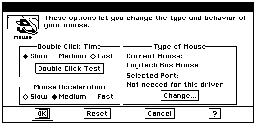
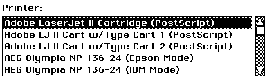

# 22 Config Library
Not all users are the same; not all computing environments are the same. 
Often some part of an application allows the user to tailor the UI to his 
wishes. The user may wish to specify some preferences at a system level 
rather than on an application level. To do this, the user will look to the 
Preferences Manager application. The **config** library provides mechanisms 
for writing Preferences modules.

Normally the purpose of a Preferences module's gadgetry is to set up some 
information in the user's .INI file. If you are encouraging other developers to 
take advantage of the configuration done by your module, be sure to 
document the .INI file categories and keys affected. 

There are three main tasks involved in writing a Preferences module:

+ Providing a tree of UI gadgetry which will act as the module's dialog box.

+ Providing information Preferences will use to construct the module's 
button.

+ Providing any underlying functionality other than writing information to 
the .INI file.

The first two routines exported in the module's .gp file will be responsible for 
carrying out the first two of these tasks. The final task is difficult to define - it 
will depend on the nature of your module.

Preferences modules written in C will need one more thing. To indicate that 
the preferences module is compatible with the standard GEOS 2.0 
Preferences Manager applications, the module will need a local.mk makefile 
for compilation, and that local.mk file should include a line that reads:

	_PROTO = 2.0

For information about local.mk files, see "Using Tools," Chapter 10 of the 
Tools book.

Before you try to write a Preference module, there are some things you 
should already know. Each module is a library, so be sure to read "Libraries," 
Chapter C of the Concepts Book to find out how to write a GEOS library. To 
use the information your module will write to the .INI file, read the 
Initialization File section of "Applications and Geodes," Chapter 6 of the 
Concepts Book.

## 22.1 Providing the UI
There are two steps to providing the UI for your preferences module. The first 
is to declare the objects you will use. The second is to write and export a 
routine which returns the head of the tree of UI gadgetry.

  
**Figure 22-1** *Preferences Dialog*

### 22.1.1 Designing the UI Tree.
Preferences modules present a dialog box to the user. You will need to design 
the dialog for your module. As you do so, you may find objects of the following 
classes useful. Each of the following classes is based upon one of the Generic 
UI classes.

GenClass provides mechanisms by which objects will read and write values 
to the .INI file. Pref- classes provide further functionality, such as storing an 
"original" value to revert to if the user decides to Cancel their changes. 

The following Pref- classes are available:

**PrefDialogClass**  
This class specializes in acting as the root of a Pref module's UI 
tree. It has been set up to provide "OK" and "Cancel" triggers by 
default. It has a mechanism to restart the system on an Apply 
if the module specifies that such a reset will be necessary to 
implement the user's changes.
Often a module will use a subclass of **PrefDialogClass** as the 
head of its UI tree - often the subclass intercepts 
MSG_GEN_APPLY to ensure valid user choices and to take other 
appropriate actions.

**PrefValueClass**  
PrefValue objects act like objects of **GenValueClass**. However, 
these objects have the ability to reset their values to that 
originally stored in the .INI file (in case the user wants to 
cancel). They can handle only word-length values.

**PrefItemGroupClass**  
Objects of this class act like GenItemGroups. In addition, this 
class has the ability to store an "original" value. 

**PrefStringItemClass**  
A PrefItemGroup normally writes data about selected items in 
the form of an integer. However, if its children are 
PrefStringItem objects, the PrefItemGroup can instead write 
out a special string associated with each PrefStringItem, 
resulting in a more readable .INI file.

**PrefBooleanGroupClass**  
This class acts like **GenBooleanGroupClass** with the ability 
to store an "original" value.

**PrefDynamicListClass**  
Use objects of this class where you might otherwise use a 
GenDynamicList. This class will not work together with 
PrefStringItem objects.

**PrefTocListClass**  
This class presents an alphabetized list of files or driver names. 
It is used to provide lists of devices, such as the list of available 
printers. It can also be used to show a list of files with a given 
token in a given directory.

**TitledGlyphClass**  
This specialized subclass of GenGlyph shows both an icon and 
a text moniker. It is used to present the icon and name at the 
top of a typical Preferences module dialog box.

**PrefInteractionClass**  
This class acts like **GenInteractionClass**, but also will relay 
certain messages to its children which GenInteraction would 
not. Those objects which will need to work with the .INI file 
should receive these messages, so any Gen- objects which will 
work with the .INI file and any Pref objects should be grouped 
under PrefInteractions instead of GenInteractions.

**PrefTextClass**  
This class behaves like **GenTextClass**, except that it will load 
and save its value based upon that stored in the .INI file.

**PrefTriggerClass**  
This class acts as does **GenTriggerClass**, but has an extra 
action, so that two separate messages will be sent when the 
trigger is activated.

**PrefControlClass**  
This class acts as a cross between **PrefClass** and 
**GenControlClass**.

**PrefTimeDateControlClass**  
This class allows the user to set the system date and time.

**PrefClass**  
**PrefClass** is something like **GenClass** - while never used 
directly, it is the superclass of all the other Pref- classes, and 
sets up several of the mechanisms which all will use.

There aren't any special restrictions on what sorts of objects appear in the UI 
tree of a Preferences module. However, the following rules will prove useful 
in constructing modules that correctly write their data to the .INI file and 
have a look and feel consistent with existing modules. For an example, see 
Code Display 22-1.

+ As a rule of thumb, the top object of the tree should be a PrefDialog.

+ For a consistent look, the upper portion of the dialog should contain the 
module's icon, name, and some brief help text. This is normally done 
using a TitledGlyph and a GenText object. 

+ Generally the easiest way to specify the .INI file category and key to use 
is by means of ATTR_GEN_INIT_FILE_CATEGORY and 
ATTR_GEN_INIT_FILE_KEY. Assuming that the module will work with 
just one category, it is sufficient to declare an ATTR_GEN_INIT_FILE field 
for just the top object of the module's UI tree.

+ Because of the way messages are relayed, you should use 
PrefInteractions instead of GenInteractions if any objects under the 
interaction will be saving data to the .INI file.

----------
**Code Display 22-1 Pref Module UI Framework**

	@object MPMDialogClass MPMRoot = {
		GI_states = @default & ~GS_USABLE;
		GI_comp = @MPMTitleGroup, @MPMOtherStuff;
		HINT_INTERACTION_SINGLE_USAGE;
		HINT_INTERACTION_COMPLEX_PROPERTIES;
		HINT_ORIENT_CHILDREN_VERTICALLY;
		HINT_LEFT_JUSTIFY_CHILDREN;
		ATTR_GEN_HELP_CONTEXT = "myPrefModule";
		ATTR_GEN_INIT_FILE_CATEGORY = "myPref";
	}

	@object GenInteractionClass MPMTitleGroup = {
		GI_comp = @MPMTitle, @MPMHelp;
		HINT_ORIENT_CHILDREN_HORIZONTALLY;
		HINT_EXPAND_WIDTH_TO_FIT_PARENT;
	}

	@object TitledGlyphClass MPMTitle = {
		GI_visMoniker = list {
		@FontTextMoniker, @FontLCMoniker, @FontLMMoniker, @FontLCGAMoniker
		}
	}

	@object GenTextClass MPMHelp = {
		GI_attrs = @default | GA_READ_ONLY;
		GTXI_text = "Do such and such to configure your so and so.";
		HINT_EXPAND_WIDTH_TO_FIT_PARENT; 
		/* Might want HINT_MINIMUM_SIZE */
	}

----------
### 22.1.2 UI Fetch Routine
Once you have constructed the UI tree, write a routine that returns the head 
of that tree. This should be the first routine exported in your module's .gp file. 
The Preferences Manager knows to call the first exported routine when it 
needs the UI tree for a module.

The routine should have the parameters

	optr _pascal (void)

For an example of such a routine, see Code Display 22-2.

----------
**Code Display 22-2 UI Fetch Routine**

	optr _pascal MPMGetPrefUITree(void) { return (@MPMRoot);}

----------
## 22.2 Module Information Routine
The Preferences application needs to know some information about each 
module to present the trigger which allows the user into said module. 
Preferences does this by calling the second routine exported by the module 
library. Preferences expects this routine to fill in a blank **PrefModuleInfo** 
structure.

By filling in this structure, the routine describes the button that Preferences 
will use to represent the module. Also, you may specify a User Level for the 
module, so it will be presented only to users with enough expertise to use it. 
You may also ask that only users with certain privileges be given access to 
the module; without the proper privileges, they won't see it.

The Routine should have the parameters 

	void _pascal (*PrefModuleInfo)

For an example of such a routine, see Code Display 22-3.

----------
**Code Display 22-3 Module Information Routine**

	void _pascal MPMGetModuleInfo(PrefModuleInfo *info)

	{	/* We'll set up this structure for both system and user information */
	 	moduleInfo->PMI_requiredFeatures = 0;
	 	moduleInfo->PMI_prohibitedFeatures = 0;
	 	moduleInfo->PMI_minLevel = UIIL_ADVANCED;
	 	moduleInfo->PMI_maxLevel = UIIL_MAX_LEVEL;
	 	moduleInfo->PMI_monikerList = @MPMMonikerList;
	 	moduleInfo->PMI_monikerToken = moduleToken;
	}

	const GeodeToken moduleToken = { "MyPf", MANUFACTURER_ID_MINE };

----------
  
**Figure 22-2** *Preferences Buttons*

The following information about the **PrefModuleInfo** structure may prove 
useful when writing the routine:

*PMI_requiredFeatures*  
This field allows you to restrict the display of your module so 
that it will only appear to users which have certain privileges.

PMF_HARDWARE  
These settings are for a user who has permissions to actually 
change the configuration of the workstation. In a network 
environment where users log in to different machines at 
different times, normal users would be prevented from 
changing the mouse drivers, video drivers, etc. 

PMF_SYSTEM  
These changes are more complex and potentially more 
damaging than the basic "user" changes, therefore, some users 
may be prevented from using these settings. 

PMF_NETWORK  
These are network settings. Generally only the system 
administrator should see these settings, as they affect the 
entire network.

PMF_USER  
These are basic user changes. These settings are the most basic 
and least dangerous, controlling user preferences such as 
background color and screen saver types.

*PMI_prohibitedFeatures*  
This flag field allows you to restrict the display of your module 
so that it will only appear to users who *don't* have certain 
privileges. If you had two modules, advanced UI and simple UI, 
one might be for the sysop and the other for normal users - this 
would keep the sysop's Preferences from being "cluttered" by 
the plain user module. The flags available are the same as 
those for *PMI_requiredFeatures*.

*PMI_minLevel*  
This field allows you to specify the minimum User UI Level in 
which your module should appear. If the module's UI is very 
complicated and will confuse novice users, use this field to hide 
it from them.

*PMI_maxLevel*;  
This field allows you to specify the maximum User UI Level in 
which your module should appear. If you have two versions of 
your module - one for advanced users and one for novice 
users - use this field to hide the novice module from the 
advanced users.

*PMI_monikerList*  
Like the moniker list for an application, this will provide the 
icon shown on the main Preferences screen. Create this using 
the Icon editor. You should have icon formats 64x40 color, 
64x40 monochrome, and 64x18 monochrome. 

*PMI_monikerToken*  
A four character token and manufacturer ID by which to 
recognize the module.

## 22.3 Important Messages
If you're going to create a subclass for use in a Preferences module, the 
following messages will be of special interest, as they signal that the user is 
carrying out certain important actions.

MSG_PREF_INIT  
When a dialog box containing Pref objects is brought up, each 
object will receive MSG_PREF_INIT. Developers can subclass 
MSG_PREF_INIT to perform basic initialization procedures.

MSG_META_LOAD_OPTIONS  
Generic objects (and by inheritance, Pref- objects) respond to 
MSG_META_LOAD_OPTIONS by loading a value from the 
appropriate place in the .INI file. This place is determined by 
the object's ATTR_GEN_INIT_FILE_KEY field. If the object has 
an ATTR_GEN_INIT_FILE_CATEGORY field, that category will 
be used; otherwise the default handler will look up the Generic 
tree for an object with a ATTR_GEN_INIT_FILE_CATEGORY 
field defined and will use the value stored there.
Unlike a GenInteraction, a PrefInteraction will relay this 
message to its children. When it's time to load options from the 
.INI file, a MSG_META_LOAD_OPTIONS will be sent to the top 
level of the module's UI tree. This message should be 
propagated down the tree to reach all objects which should read 
their values from the .INI file. This is why it is suggested that 
you use PrefInteractions in place of GenInteractions if any 
Pref- objects will be underneath. If you create a new sort of 
object which should relay this message to other objects, be sure 
to do so.

MSG_META_SAVE_OPTIONS  
Generic objects (and by inheritance, Pref- objects) respond to 
MSG_META_SAVE_OPTIONS by saving a value to the 
appropriate place in the .INI file. This place is determined by 
the object's ATTR_GEN_INIT_FILE_KEY field. If the object has 
an ATTR_GEN_INIT_FILE_CATEGORY field, that category will 
be used; otherwise the default handler will look up the Generic 
tree for an object with a ATTR_GEN_INIT_FILE_CATEGORY 
field defined and will use the value stored there.
Unlike a GenInteraction, a PrefInteraction will relay this 
message to its children. When it's time to save options to the 
.INI file, a MSG_META_SAVE_OPTIONS will be sent to the top 
level of the module's UI tree. This message should be 
propagated down the tree to reach all objects which should 
write their values to the .INI file. This is why it is suggested 
that you use PrefInteractions in place of GenInteractions if any 
Pref- objects will be underneath. If you create a new sort of 
object which should relay this message to other objects, be sure 
to do so.
Often, interceptors of this message will carry out whatever 
actions are necessary to carry out the user's wishes in those 
cases where writing something to the .INI file is not enough to 
bring the change about. 

MSG_GEN_RESET  
If the user clicks on a "Revert" or "Cancel" button, all values in 
UI gadgets should revert to those values originally stored in the 
.INI file. You will note that many Pref- objects have an extra 
field to store their "original" value. If you create your own kind 
of Preferences object, keep in mind that it will need some way 
to store the "original" value (probably initialized while 
handling MSG_META_LOAD_OPTIONS) and should intercept 
MSG_GEN_RESET to replace its value with the "original" value.

MSG_GEN_LOAD_OPTIONS  
Generic objects (and thus Pref- objects) respond to 
MSG_META_LOAD_OPTIONS by sending themselves this 
message. This message is only meant to be used for managing 
the .INI file; any other functionality should occur in the 
handling of MSG_META_LOAD_OPTIONS.

MSG_GEN_SAVE_OPTIONS  
Generic objects (and thus Pref- objects) respond to 
MSG_META_SAVE_OPTIONS by sending themselves this 
message. This message is only meant to be used for managing 
the .INI file; any other functionality should occur in the 
handling of MSG_META_SAVE_OPTIONS.

If you are interested in detecting certain user actions, the following list may 
prove useful:

**User Opens Dialog**  
Any objects which need to do some initialization when the user 
first opens the module's dialog box should intercept 
MSG_PREF_INIT. After receiving MSG_PREF_INIT, each object 
will receive a MSG_META_LOAD_OPTIONS.

**User clicks Apply**  
Assuming the top object of the module's UI tree is a PrefDialog 
and that the dialog has been set up as a Properties dialog (as it 
is by default), then this object will receive a MSG_GEN_APPLY 
when the user activates the Apply trigger. The Pref dialog 
responds to this message by sending itself a 
MSG_META_SAVE_OPTIONS, which it will then pass on to its 
children. 

**User clicks Cancel or Reset**  
All Gen- and Pref- objects within the UI tree will receive a 
MSG_GEN_RESET.

## 22.4 Object Class Reference
If you will use any of the Pref- classes in your module, the following reference 
material may prove useful.

### 22.4.1 PrefClass
**PrefClass** defines several fields of instance data which will be used by all of 
its subclasses.

There are several variable data fields which make sure that a given 
Preference gadget will not be usable by those without the proper privileges; 
other fields make sure that the gadgets will not appear to those users whose 
UI levels indicate that they would be confused by the presence of such an 
object. Keep in mind that if all gadgets in your module demand some 
privilege or User level, you should reflect this in the routine which provide 
Preferences module information about your module.

----------
**Code Display 22-4 PrefClass Instance Data**

	@class PrefClass, GenClass, master, variant;

	@instance PrefAttributes PI_attrs = (PA_LOAD_IF_USABLE|PA_SAVE_IF_USABLE);

	typedef ByteFlags PrefAttributes;
	#define PA_REBOOT_IF_CHANGED 0x80
	/* This bit signals that changes in the state of 
	 * this object requires a system reboot to take effect. */

	#define PA_LOAD_IF_USABLE 0x40
	 /* Load options only if this object is usable (this is ON by default). */

	#define PA_SAVE_IF_USABLE 0x20
	 /* Save options only if this object is usable (this is ON by default) */

	#define PA_SAVE_IF_ENABLED 0x10
	 /* Save options only if this object is enabled */

	#define PA_SAVE_IF_CHANGED 0x08
	 /* Save options only if this object has changed. */

	@vardata optr ATTR_PREF_REBOOT_STRING;
	/* This is the string passed to MSG_PREF_MGR_DO_REBOOT_DIALOG -- the
	 * string must be in a SHARABLE LMEM resource and is incorporated into the
	 * middle of another sentence. In English, the sentence is "The system software
	 * will shut down and restart to change the <reboot_string>. Do you wish
	 * to proceed?"
	 *
	 * If an object has its PA_REBOOT_IF_CHANGED attribute set, it will scan for
	 * this attribute, first in itself, then up the generic tree, until it
	 * finds one. */
	@reloc ATTR_PREF_REBOOT_STRING, 0, optr; 

	@vardata PrefMgrFeatures ATTR_PREF_REQUIRED_FEATURES;
	/* features bits that must be set for this object to be usable. */

	@vardata PrefMgrFeatures ATTR_PREF_PROHIBITED_FEATURES;
	/* features bits that must not be set for this object to be usable. */

	@vardata UIInterfaceLevel ATTR_PREF_MIN_LEVEL;
	/* interface level below which this object will not be usable */

	@vardata UIInterfaceLevel ATTR_PREF_MAX_LEVEL;
	/* interface level above which this object will not be usable */

----------
In addition to the instance data fields, there are messages which allow for the 
dynamic retrieval and updating of these fields.

----------
#### MSG_PREF_SET_INIT_FILE_CATEGORY
	void	MSG_PREF_SET_INIT_FILE_CATEGORY(
			const char *category);

Pref objects automatically respond to this message by changing the value of 
the ATTR_GEN_INIT_FILE_CATEGORY variable data field. This is a utility 
message; similar functionality is available via MSG_META_ADD_VAR_DATA.

**Source:** Anywhere

**Destination:** Any PrefClass object.

**Parameters:**  
**category** - Null-terminated category string.

**Return:** Nothing.

----------
#### MSG_PREF_HAS_STATE_CHANGED
	Boolean	MSG_PREF_HAS_STATE_CHANGED();

This message determines whether the object or any of its children have 
changed since the last time options were loaded. This is used in conjunction 
with the PA_REBOOT_IF_CHANGED flag that can be set for an object-this 
flag signals that, if the object changes state, then GEOS should be restarted 
for the change to go into effect.

**Source:** **PrefClass** object sends this message to itself when handling 
MSG_PREF_GET_REBOOT_INFO.

**Destination:** Self.

**Parameters:** None.

**Return:** Should return *true* (i.e. non-zero) if state has changed, *false* (i.e. zero) 
otherwise.

**Interception:** New *PrefClass* subclasses will use this to compare the object's current 
state against the "original" state, assuming one was stored.

----------
#### MSG_PREF_GET_REBOOT_INFO
	optr	MSG_PREF_GET_REBOOT_INFO();

This message asks whether the system will need to reboot as a result of 
changes. If a reboot is necessary, the dialog will then notify the user of the 
reboot, and give the user a chance to abort (since the system reset may be a 
lengthy process on some systems). 

**Source:** PrefDialog sends this message to all children on an apply.

**Destination:** Any Pref- object.

**Interception:** Subclasses should check the PA_REBOOT_IF_CHANGED flag - if the 
flag is set, the object should compare its present value to its "original" 
value. If a reboot is never needed, then do nothing.
If a reboot is necessary, the method should return the string to use 
when rebooting. The standard way to do this is via 
MSG_PREF_GET_REBOOT_STRING.
If possible, developers should try to avoid situations where a system 
reset is necessary, and use mechanisms such as the General Change 
Notification instead.

**Parameters:** None.

**Return:** Zero if no reboot needed; otherwise the OD of string to insert in the 
confirm-shutdown dialog box. The string will be inserted into a 
sentence; the string should describe what is changing. You may wish to 
use the value of ATTR_PREF_REBOOT_STRING.

**See Also:** MSG_PREF_GET_REBOOT_STRING, ATTR_PREF_REBOOT_STRING.

----------
#### MSG_PREF_GET_REBOOT_STRING
	optr	MSG_PREF_GET_REBOOT_STRING();

This message should return the optr of a string in a sharable local memory 
resource. This string will display in the dialog box which asks the user if it is 
all right to shut down. If a given object doesn't know of a good string to supply, 
it should forward the message on to its parent in the generic tree. The default 
**PrefClass** handler returns the value stored in 
ATTR_PREF_REBOOT_STRING.

**Source:** Pref- object sends this message to itself.

**Destination:** Any **PrefClass** object.

**Parameters:** Nothing.

**Return:** Object Pointer of string (or NULL if not found).

----------
#### MSG_PREF_INIT
	void	MSG_PREF_INIT(
			PrefMgrFeatures 		features,
			UIInterfaceLevel 		level);

This message initializes the object. The object should perform any required 
set-up to appear on-screen. The PrefDialog object will send this object to all 
of its children when the dialog is first initiated.

**Source:** Generic Parent

**Destination:** Any Pref- object.

**Parameters:**  
*features* - This structure tells you a bit what sorts of changes 
the user prepared to make.

*level* - The user's User Level.

**Return:** None.

**Interception:** Default behavior is to determine whether to make the object usable 
based on UI level and features (or will be, when implemented). Subclass 
should call superclass before handling, as subclass behavior may be 
different if the object is not usable,

----------
#### MSG_PREF_NOTIFY_DIALOG_CHANGE
	void	MSG_PREF_NOTIFY_DIALOG_CHANGE(
			PrefDialogChangeType 			type);

This message goes out via PDGCNLT_DIALOG_CHANGE list bound to 
PrefDialog object telling interested parties of a change in the box's state. It is 
sent when the dialog box is being opened, closed, or destroyed.

**Source:** PrefDialog object.

**Destination:** Any Pref- object registered on PDCGCNLT_DIALOG_CHANGE.

**Interception:** This message has no default handler; it must be intercepted to do 
anything useful.

**Structures:** 

	typedef enum {
		PDCT_OPEN,
		PDCT_CLOSE,
		PDCT_DESTROY,
		PDCT_RESTART,
		PDCT_SHUTDOWN
	} PrefDialogChangeType;

----------
#### MSG_PREF_SET_ORIGINAL_STATE
	void	MSG_PREF_SET_ORIGINAL_STATE();

This message copies the object's current state to the "original" value field, 
which will be used on a MSG_GEN_RESET.

**Parameters:** None.

**Return:** Nothing.

**Interception:** Subclasses should respond to this message by copying their current 
value to whatever instance field represents the "original" state of the 
object.

### 22.4.2 PrefValueClass
PrefValue objects behave like GenValue objects except that they have the 
ability to store an "original" value in the *PVI_originalValue* instance data 
field. Unlike GenValue objects, PrefValues can only handle single word 
values.

----------
**Code Display 22-5 PrefValueClass Instance Data**

	@class PrefValueClass, PrefClass;

	@instance word PVI_originalValue = 0;

	@vardata void ATTR_PREF_VALUE_ORIG_IS_INDETERMINATE;

	@vardata word ATTR_PREF_VALUE_ROUND;
	/* Specifies an integer value to which the value will be rounded on .INI file
	 * reads/writes. For instance, with a value for 10 here, the value would always
	 * round off to the nearest 10. Note that the user can still type in an illegal
	 * value, but this value will be rounded before saving to the .INI file.*/

----------
#### MSG_PREF_VALUE_SET_ORIGINAL_VALUE
	void	MSG_PREF_VALUE_SET_ORIGINAL_VALUE(
			word 		orig,
			Boolean 	indeterminate);

This message sets the "original" value of the object-it also sets the value 
stored by the superclass.

### 22.4.3 PrefItemGroupClass
This class acts like **GenItemGroupClass**, but has extended functionality 
for reading/writing strings to the .INI file. When the user triggers the dialog's 
Apply trigger (when the PrefItemGroup receives a 
MSG_META_SAVE_OPTIONS), the PrefItemGroup will respond by writing out 
strings based upon which of its children items are presently selected. These 
strings can be taken from the items' monikers or from strings used with 
**PrefStringItemClass** objects.

When loading options, if either the PIFF_USE_ITEM_MONIKERS or 
PIFF_USE_ITEM_STRINGS is set for the item group, then it will select its 
children based on the strings stored in the .INI file.Otherwise, the item group 
will default to the **GenItemGroupClass** functionality, which uses the 
identifier of the items as a basis for selection.

----------
**Code Display 22-6 PrefItemGroupClass Instance Data**

	@instance PrefInitFileFlags PIGI_initFileFlags = 0;

	typedef ByteFlags PrefInitFileFlags;
	#define PIFF_USE_ITEM_STRINGS 0x80
	/* 
	 * If set, then the item group's children must be of class PrefStringItemClass,
	 * and their strings will be used to interact with the .INI file. */

	#define PIFF_USE_ITEM_MONIKERS 0x40
	/* If set, the monikers of the items are used to interact with the .INI file. */

	#define PIFF_APPEND_TO_KEY 0x20
	/* If set, the strings in this list will be ADDED 
	 * to strings that may already exist for this key */

	#define PIFF_ABSENT_KEY_OVERRIDES_DEFAULTS 0x10
	/* If set, an absent key for the item group will cause it to
	 * behave as if an empty key were in the .INI file, effectively
	 * overriding any default values stored with the group when it was
	 * compiled. Used primarily by those groups where one subclasses
	 * MSG_PREF_STRING_ITEM_CHECK_IF_IN_INIT_FILE_KEY to determine the
	 * initial setting, rather than looking in the .INI file. */

	@instance word PIGI_originalSelection = 0;

	@instance word PIGI_originalNumSelections = 0;

	@instance byte PIGI_suspendCount = 0;
	/* When suspend count is nonzero, the item group won't update text objects, nor
	 * will it enable/disable objects when the selection changes. */

	@vardata PrefEnableData ATTR_PREF_ITEM_GROUP_ENABLE;
	/* allows setting up an object to be enabled/disabled when
	 * settings are made in the item group */

	typedef struct {
		word 			PED_item; 	/* Identifier of the item that controls
							 * enabling/disabling of object. If this
							 * is GIGS_NONE, then the action will be
							 * performed if no items are selected. */
		ChunkHandle 	PED_lptr; 	/* Object to be enabled/disabled */
		PrefEnableFlags PED_flags;
	} PrefEnableData;

	typedef ByteFlags PrefEnableFlags;

	#define PEF_DISABLE_IF_SELECTED 0x80
	/* Disable the object if the associated item is selected,
	 * otherwise do the opposite. */

	#define PEF_DISABLE_IF_NONE 0x40
	/* If this flag is set, then the PED_item field is ignored.
	 * Instead, the item group will disable the specified object if
	 * no items are selected -- or if there are no items in the list. */

	@vardata word ATTR_PREF_ITEM_GROUP_OVERRIDE;
	/* This attribute is used to specify an item which will act
	 * as an OVERRIDE for all other items (in a non-exclusive
	 * item group).
	 *
	 * When the specified item is SELECTED, then all other items are DE-SELECTED.
	 * When any other item is SELECTED, the override item is DE-SELECTED.
	 * If all items are DE-SELECTED, the override item becomes SELECTED */

	@vardata ChunkHandle ATTR_PREF_ITEM_GROUP_TEXT_DISPLAY;
	/* chunk handle of a GenText object that will be updated
	 * with the moniker of the currently selected item on APPLY/RESET. */

	@vardata ChunkHandle ATTR_PREF_ITEM_GROUP_STATUS_TEXT;
	/* chunk handle of a GenText object that will be updated every
	 * time this object receives a MSG_GEN_ITEM_GROUP_SEND_STATUS_MSG. */

	@vardata char ATTR_PREF_ITEM_GROUP_EXTRA_STRING_SECTION[];
	/* If a string is given -- the string will always be written
	 * out as the FIRST string section for the .INI file key. For
	 * example, the "Memory" item group uses this to always insert
	 * "disk.geo" whenever writing out the memory types. Note:
	 * this item is only written if the item group has either the
	 * PIFF_USE_ITEM_MONIKERS or PIFF_USE_ITEM_STRINGS set. */

----------

----------
#### MSG_PREF_ITEM_GROUP_SET_ORIGINAL_SELECTION
	void 	MSG_PREF_ITEM_GROUP_SET_ORIGINAL_SELECTION(
			word selection);

Set the "originalSelection" field of the item group. Also, sends 
MSG_GEN_ITEM_GROUP_SET_SINGLE_SELECTION to superclass. This 
message can only be used with exclusive item groups-for other types, use 
the GenItemGroup messages, and then send the object 
MSG_PREF_SET_ORIGINAL_STATE.

**Source:** Anywhere.

**Destination:** An exclusive PrefItemGroup.

**Parameters:**  
*selection* - Which item to select.

**Return:** Nothing.

**Interception:** Unlikely.

----------
#### MSG_PREF_ITEM_GROUP_GET_SELECTED_ITEM_TEXT
	word 	MSG_PREF_ITEM_GROUP_GET_SELECTED_ITEM_TEXT(
			char 	*buffer,
			word 	bufSize);

This message returns the text in the moniker of the selected item. The value 
returned is the number of characters in the string. If nothing is selected, the 
value returned is zero.

----------
#### MSG_PREF_ITEM_GROUP_GET_ITEM_MONIKER
	word 	MSG_PREF_ITEM_GROUP_GET_ITEM_MONIKER(@stack 
			char 	*buffer,
			word 	bufSize,
			word 	identifier);

This message retrieves the text in the moniker of one of the items of a 
PrefItemGroup. This works for dynamic list subclasses as well. The message 
returns the number of characters in the returned text.

**Parameters:**  
*buffer* - Buffer in which to return moniker text.

*bufSize* - Size of buffer.

*identifier* - Identifier of item whose moniker should be 
returned.

**Return:** Size of item's moniker.

----------
#### MSG_PREF_ITEM_GROUP_UPDATE_TEXT
	void	MSG_PREF_ITEM_GROUP_UPDATE_TEXT(
			ChunkHandle 		textObject);

This message updates the specified text object with text of the currently 
selected item. The PrefItemGroup sends this to itself in conjunction with 
either ATTR_PREF_ITEM_GROUP_TEXT_DISPLAY or 
ATTR_PREF_ITEM_GROUP_STATUS_TEXT. By default, this message will also 
cause the text object to send out its status message.

**Source:** Self.

**Destination:** Self.

**Interception:** Default behavior is to fetch the moniker of the current selection, and 
sent that to the text. The subclasser can use different text, if desired.

### 22.4.4 PrefStringItemClass
Objects of this class, used together with a PrefItemGroup with its 
PIFF_USE_ITEM_STRINGS flag set, allow for objects which act like GenItems 
but can write an arbitrary string out to the .INI file if the user selects them.

----------
**Code Display 22-7 PrefStringItemClass Instance Data**

	@class PrefStringItemClass, GenItemClass;

	@instance ChunkHandle PSII_initFileString = 0;

----------

----------
#### MSG_PREF_STRING_ITEM_SET_INIT_FILE_STRING
	void	MSG_PREF_STRING_ITEM_SET_INIT_FILE_STRING(
			const char 		*str);

This message sets the string that is read and written in the .INI file.

**Interception:** Unlikely but possible. Default behavior sets the string and then checks 
again with the .INI file to make sure item should be selected.

----------
#### MSG_PREF_STRING_ITEM_CHECK_IF_IN_INIT_FILE_KEY
	Boolean	MSG_PREF_STRING_ITEM_CHECK_IF_IN_INIT_FILE_KEY(
			PrefItemGroupStringVars 				*vars);

This message checks the passed string to see if the string bound to this item 
is in one of its pieces. A PrefItemGroup will send this object when loading 
options if it has the PIFF_USE_ITEM_STRINGS flag set.

**Source:** PrefItemGroup object.

**Destination:** PrefStringItem object.

**Interception:** May be intercepted if the subclass needs to check other things to decide 
whether it should be selected. If you also wish to have the default 
behavior, you may call the superclass either before or after you've made 
your own decision, as appropriate.

**Parameters:**  
*vars* - Information about the string.

Return:	Returns *true* (i.e. non-zero) if bound string is within the string stored 
in the local variable.

### 22.4.5 PrefBooleanGroupClass
This class behaves as GenBooleanGroup, except that it saves its original 
state and handles MSG_GEN_RESET appropriately. It can also use item 
strings or monikers when loading and saving options.

----------
**Code Display 22-8 PrefBooleanGroupClass Instance Data**

	@class PrefBooleanGroupClass, PrefClass;
	@instance PrefInitFileFlags 	PBGI_initFileFlags = 0;
	@instance word 					PBGI_originalState = 0;

----------

----------
#### MSG_PREF_BOOLEAN_GROUP_SET_ORIGINAL_STATE
	void	MSG_PREF_BOOLEAN_GROUP_SET_ORIGINAL_STATE(
			word state);

This message sets the "original" state of the Boolean group.

### 22.4.6 PrefDynamicListClass
Objects of **PrefDynamicListClass** act like GenDynamicList objects, but 
with the intelligence to write their data to the .INI file. Developers will 
generally not use this class directly, but instead will subclass, intercepting 
the following messages:

MSG_PREF_DYNAMIC_LIST_BUILD_ARRAY  
To build the data structures which will be used when later 
supplying monikers

MSG_PREF_ITEM_GROUP_GET_ITEM_MONIKER  
To supply the moniker for a requested item on demand

MSG_PREF_DYNAMIC_LIST_FIND_ITEM  
To find a given item when passed its moniker.

By handling these three messages, the developer will have a dynamic list 
that can properly load and save its selection and will scroll to the correct item 
in response to keyboard input.

The load and save mechanism is currently only configured for exclusive 
dynamic lists.

----------
#### MSG_PREF_DYNAMIC_LIST_BUILD_ARRAY
	void MSG_PREF_DYNAMIC_LIST_BUILD_ARRAY();

The PrefDynamicList sends itself this message in response to 
MSG_PREF_INIT.

**Source:** Self.

**Destination:** Self.

**Interception:** The subclasser should create an array of item strings, ideally sorted.

----------
#### MSG_PREF_DYNAMIC_LIST_FIND_ITEM
	 Boolean	MSG_PREF_DYNAMIC_LIST_FIND_ITEM(
				word 			*itemPtr,
				const char 		*str,
				Boolean 		ignoreCase);

This message finds an item given a moniker. It is normally used in the 
context of loading options.

**Source:** Self.

**Destination:** Self.

**Parameters:**  
*itemPtr* - Pointer to space in which to return a word.

*str* - String to search for.

*ignoreCase* - Flag requesting a case-insensitive search.

**Return:** Returns *true* (i.e. non-zero) if an item was found with a moniker 
matching the passed string; *itmPtr* will have been filled with the 
number of the matching item. If no such item was found, the message 
will return *false* (i.e. zero) and *itmPtr* will point to the first item after 
the requested item.

### 22.4.7 TitledGlyphClass
Each TitledGlyph displays two monikers, one icon and one text. 
**TitledGlyphClass** has no unique instance data or messages. You are 
expected to provide a list of monikers in the *GI_visMoniker* field, and this list 
should include several icons and a text moniker. Normally the same icon is 
used as by the routine providing Preferences module information.

### 22.4.8 PrefInteractionClass
If you have any Preferences objects which write out their values to the .INI 
file, and if you would normally have those objects appear under a 
GenInteraction, then you should have them appear under a PrefInteraction 
instead. 

Objects of the class will forward the following messages on to their children:

MSG_PREF_INIT, MSG_PREF_SET_ORIGINAL_STATE  
Object will send these messages to every child that is a subclass 
of PrefClass.

MSG_META_LOAD_OPTIONS  
Object will send this to each child that satisfies the appropriate 
criteria (based on the child's PA_LOAD_IF_USABLE flag).

MSG_META_SAVE_OPTIONS  
Object will send this to each child that satisfies the appropriate 
criteria (based on the child's PA_SAVE_IF_CHANGED, 
PA_SAVE_IF_ENABLED, and PA_SAVE_IF_USABLE flags).

MSG_PREF_HAS_STATE_CHANGED, MSG_PREF_GET_REBOOT_INFO  
Propagates these messages to children, returning the value 
from the first child that returns a non-null response.

----------
**Code Display 22-9 PrefInteractionClass Instance Data**

	@class PrefInteractionClass, PrefClass;

	@instance PrefInteractionAttrs PII_attrs = 0;

	typedef ByteFlags PrefInteractionAttrs;

	#define PIA_LOAD_OPTIONS_ON_INITIATE 0x80
	/* If set, then the dialog will send MSG_PREF_INIT, 
	 * followed by MSG_META_LOAD_OPTIONS to itself when it 
	 * receives a MSG_GEN_INTERACTION_INITIATE */ 

	#define PIA_SAVE_OPTIONS_ON_APPLY 0x40
	/* This flag is normally OFF to allow non-dialog prefInteractions to reside inside
	 * other interactions without duplicate SAVE_OPTIONS messages being sent. */

----------
### 22.4.9 PrefDialogClass
The top level object of any Preferences module UI tree should probably be a 
PrefDialog object. If the user's changes will necessitate a system reset, then 
this object will be responsible for rebooting the system.

On receiving MSG_GEN_APPLY, the dialog sends 
MSG_PREF_GET_REBOOT_INFO to itself (which is propagated to all children 
via **PrefInteractionClass**). If any children require reboot, then the dialog 
sends MSG_PREF_DIALOG_CONFIRM_REBOOT to itself, which normally puts 
up a confirmation dialog box (this can be subclassed to provide other 
behavior). If user confirms reboot, then the dialog will send 
MSG_PREF_DIALOG_REBOOT to itself, and MSG_GEN_APPLY to its 
superclass to save the options (it being assumed that the 
PIA_SAVE_OPTIONS_ON_APPLY flag is set).

----------
Code Display 22-10 PrefDialogClass Instance Data

	@class PrefDialogClass, PrefInteractionClass;

	@default GII_visibility = GIV_DIALOG;

	@default GII_type = GIT_PROPERTIES;

	@default GII_attrs = @default | GIA_NOT_USER_INITIATABLE | GIA_MODAL;

	@default PII_attrs = @default | PIA_SAVE_OPTIONS_ON_APPLY;

----------
#### MSG_PREF_DIALOG_CONFIRM_REBOOT
	@message	Boolean MSG_PREF_DIALOG_CONFIRM_REBOOT(
				optr 		string);

By default, the PrefDialog will respond to this message by putting up a dialog 
box asking the user if he wants to restart the system.

**Parameters:**  
*string* - Object pointer of string which will be inserted in a 
sentence of the form "The system software will shut 
down and restart to change the *string*."

**Return:** Returns *true* (i.e. non-zero) to confirm the reboot; returns *false* (i.e. zero 
to deny the reboot.

----------
#### MSG_PREF_DIALOG_REBOOT
	void	MSG_PREF_DIALOG_REBOOT();

This message causes GEOS to restart. This message does not return.

### 22.4.10 PrefTextClass
Objects of this class act like GenText objects, but have mechanisms to write 
their text string to the .INI file.

----------
**Code Display 22-11 PrefTextClass Instance Data**

	@class PrefTextClass, PrefClass;

	@instance ChunkHandle PTI_originalText = 0;

	@vardata ChunkHandle ATTR_PREF_TEXT_INIT_FILE_CATEGORY_TARGET;
	/* PrefTextClass has the wonderful ability that it can set another
	 * object's .INI. file category from its text. Category gets updated
	 * whenever the text object receives MSG_GEN_TEXT_SEND_STATUS_MSG.
	 * To make this happen, put the ChunkHandle of the object in this field. */

----------
### 22.4.11 PrefControlClass
This subclass of **PrefInteractionClass** acts like GenControl, but bypasses 
some GenControl functionality. This class is assumed not to be on notification 
lists. Objects of this class will pass MSG_GEN_RESET to their children as a 
normal GenInteraction would. This class has no special instance data or 
messages.

### 22.4.12 PrefTimeDateControlClass
This controller allows the user to set the system time. This class' messages 
and instance data fields are internal. To get and set the date and time 
directly, use **TimerGetDateAndTime()** and **TimerSetDateAndTime()**.

### 22.4.13 PrefTriggerClass
**PrefTriggerClass** is not a subclass of **PrefClass**; it is a subclass of 
**GenTriggerClass**. It acts like a normal trigger except that when activated 
it will send a second message if it has been set up with a 
ATTR_PREF_TRIGGER_ACTION field.

----------
**Code Display 22-12 PrefTriggerClass Instance Data**

	@class PrefTriggerClass, GenTriggerClass;

	@vardata PrefTriggerAction ATTR_PREF_TRIGGER_ACTION;

	typedef struct {
		word PTA_message;
		optr PTA_dest;
	} PrefTriggerAction;

----------
### 22.4.14 PrefTocListClass
**PrefTocListClass** allows users to choose a device driver by selecting the 
appropriate device name. It is assumed that each driver can control one or 
more types of devices. When you set up each driver, you will set up strings to 
describe which devices that driver can control.

This class is a fully functional subclass of **PrefDynamicListClass** (i.e. it 
handles those messages one must intercept to create a viable Preferences 
dynamic list class). It can be used to scan a list of files (not necessarily device 
drivers), as long as all of those files are in the same directory and have the 
same characters in their token. 

  
**Figure 22-3** *PrefTocList in Action*

----------
**Code Display 22-13 PrefTocListClass Instance Data**

	@class PrefTocListClass, PrefDynamicListClass; 

	@instance TocUpdateCategoryFlags PTLI_flags = 0;

	typedef WordFlags TocUpdateCategoryFlags;
	#define TUCF_EXTENDED_DEVICE_DRIVERS 0x8000
	/* Files being enumerated are assumed to be extended device drivers. */

	#define TUCF_CUSTOM_FILES 0x4000
	/* The TUCP_fileArrayElementSize field will be used when creating the files array.
	 * Otherwise, each element of the files array will be of size TocFileStruct. 
	 * NOTE: If this flag is used, the data structure used for each file
	 * element MUST contain TocFileStruct as its first element. */

	#define TUCF_ADD_CALLBACK 0x2000
	/* TUCP_addCallback contains a fptr to a callback
	 * routine that will be called when a file is added to the files array. */

	#define TUCF_DIRECTORY_NOT_FOUND 0x1000
	/* Don't actually scan the directory, because it doesn't exist.
	 * Just create the category, and leave it empty. */

	@instance TocCategoryStruct PTLI_tocInfo = {"", 0, 0};

	typedef struct {
		TokenChars 			TCS_tokenChars;
		DBGroupAndItem 		TCS_files; 		/* file name array */
		DBGroupAndItem 		TCS_devices; 		/* device name array--only if
							 * TCF_EXTENDED_DEVICE_DRIVERS is set. */
	} TocCategoryStruct;

	@vardata PrefTocExtraEntry ATTR_PREF_TOC_LIST_EXTRA_ENTRY_1; 
	@vardata PrefTocExtraEntry ATTR_PREF_TOC_LIST_EXTRA_ENTRY_2;

	typedef struct {
		ChunkHandle 		PTEE_item;
		/* lptr of item name. For device lists, this is 
		 * the device. For others, this is the file name */

		ChunkHandle 		PTEE_driver;
		/* Driver name (for device lists ONLY) */

		word 				PTEE_info;
		/* Extra word of information */
	} PrefTocExtraEntry;

	@vardata char ATTR_PREF_TOC_LIST_INFO_KEY[];
	/* This key is used to write the "info" word for device lists */

----------
Use ATTR_GEN_PATH_DATA to tell the PrefTocList object in which directory 
to look for the device drivers. The PrefTocList will store the list of device 
drivers and device names in DB items referenced in the *PTLI_toolInfo* field's 
*TCS_files* and *TCS_devices* slots - it will do this automatically, so if you wish 
the default behavior, leave these as zero when declaring the object. If you will 
write your own handlers for keeping track of driver information, you may 
wish to work with these fields as there are some routines which have been set 
up to work with them.

----------
**Code Display 22-14 PrefTocList Framework**

	@object PrefTocListClass MyPrefToc = {
		PTLI_flags			= @default | TUCF_EXTENDED_DEVICE_DRIVERS;
		PTLI_tocInfo		= {"TOKN", 0, 0};
		HINT_ITEM_GROUP_SCROLLABLE;
		ATTR_GEN_INIT_FILE_KEY = "keyName";
		ATTR_GEN_PATH_DATA 	= { file path containing drivers };
	}

----------
The following routines are rather esoteric. You should only use them if you 
wish to subclass **PrefTocListClass**' behavior and wish to continue using its 
existing data structures.

**TocSortedNameArrayAdd()**  
Use this routine to add a new name to a sorted array. The new 
name will be inserted in its correct place in the alphabetically 
sorted array.

**TocSortedNameArrayFind()**  
This routine determines whether a given name is in the TOC 
List's sorted name array, and will return the position of the 
name's element if found.

**TocFindCategory()**  
Use this routine to find a category in the Toc file. The 
*TCS_tokenChars* field of the passed **TocCategoryStruct** 
should already be filled in; this routine will fill in the other 
fields.

**TocNameArrayFind()**  
Use this routine to get back the token associated with a name 
in the name array. If the name is not found, the routine will 
return CA_NULL_ELEMENT.

**TocNameArrayGetElement()**  
This routine takes a name array and a token and returns 
information about the name array element with the given 
token.

**TocUpdateCategory()**  
This complicated routine will update a category using a 
callback routine which you must write. It updates the file lists 
by scanning the current directory.

**TocNameArrayAdd()**  
Use this routine to add an element to a Toc name array.

**TocDBLock()**  
Use this routine to lock one of the name arrays.

**TocDBLockGetRef()**  
This C-only routine does the same thing as **TocDBLock()** and 
also returns the DB item's pointer and optr.

**TocGetFileHandle()**  
Use this routine to get the handle of the file in which all Toc 
device driver information is stored.

----------
#### MSG_PREF_TOC_LIST_GET_SELECTED_ITEM_INFO
	Boolean	MSG_PREF_TOC_LIST_GET_SELECTED_ITEM_INFO(
			word 		*infoPtr);

This message returns the info word about the currently selected item. This 
message can only be used with PrefTocList objects that have the 
TCF_EXTENDED_DEVICE_DRIVERS flag set.

**Parameters:**  
*infoPtr* - Pointer to a word in which to return the info word.

**Return:** Returns *false* (i.e. zero) if item was found, returns *true* (i.e. non-zero) if 
item was not found.

----------
#### MSG_PREF_TOC_LIST_GET_SELECTED_DRIVER_NAME
	word	MSG_PREF_TOC_LIST_GET_SELECTED_DRIVER_NAME(
			char 		*buf,
			word 		bufSize);

This message returns the name of the driver for the selected device. This 
message may only be used if TCF_EXTENDED_DEVICE_DRIVERS is set. 

**Parameters:**  
*buf* - Pointer to buffer to fill with the driver name.

**bufSize** - The size of *buf*.

**Return:** If the device name fits in *buf*, then *buf* is filled and the message returns 
the size of the device name. If the device name doesn't fit, then the 
message will return zero.

----------
#### MSG_PREF_TOC_LIST_GET_SELECTED_ITEM_PATH
	void	MSG_PREF_TOC_LIST_GET_SELECTED_ITEM_PATH(
			TocItemPath 		*data);

This message returns the absolute path of the selected driver or file.

**Structures:** 

	typedef struct {
		word 			TIP_disk; /* disk handle */
		MemHandle 		TIP_pathBlock; 
			/* Handle of block holding path (locked) */
		char 			*TIP_path; 
			/* Locked null-terminated absolute path */
	} TocItemPath;

----------
#### MSG_PREF_TOC_LIST_CHECK_DEVICE_AVAILABLE
	Boolean	MSG_PREF_TOC_LIST_CHECK_DEVICE_AVAILABLE(
			word 		*retvalPtr);

This message determines if the device selected by the list is available in the 
machine. This message may only be called for PrefTocList objects that have 
the TCF_EXTENDED_DEVICE_DRIVERS flag set.

**Parameters:**  
*retValPtr* - Pointer to a word which will be filled with the 
return value.

Return:	Returns *true* (i.e. non-zero if the device is available; if the driver is a 
video driver, **retValPtr* is set to the device's **DisplayType**. If the device 
is not available, returns false (i.e. zero); *retValPtr* is zero of the device 
doesn't exist; otherwise it will be the value of the appropriate 
**GeodeLoadError** plus one. 

[Pen Object Library](open.md) <-- [Table of Contents](../objects.md) &nbsp;&nbsp; --> [VisClass](ovis.md)

