# 2 GenClass

**GenClass** provides the basic functionality, via message handlers and 
instance data, for all objects in the generic object library. All generic objects 
are subclassed off this master class. Therefore, all generic objects will contain 
common behavior in the instance fields and message handlers of **GenClass**. 
**GenClass** allows you to create generic trees, manage state data, and attach 
data such as visual monikers, keyboard accelerators, and even 
variable-length data to a specific object.

The Gen world, along with the Vis world, contains a large variety of 
pre-defined objects ready to install into your applications. **GenClass** itself is 
not a normally usable object, however. It should not be directly subclassed 
and used by your application. The functionality within this chapter will 
normally be accessed within one of **GenClass**' subclasses.

All of these pre-defined objects will contain behavior explained in this 
chapter. The instance data and message handlers described in this chapter 
may be implemented differently under different specific UIs, but the basic 
functionality will remain the same. Therefore, it is important to fully 
understand the concepts explained in this chapter before using any generic 
object.

You should be familiar with object-oriented programming and message 
handling before reading this chapter. See "The GEOS User Interface," 
Chapter 10 of the Concepts Book for an overview of each generic object in the 
user interface. You should be particularly familiar with setting up and 
modifying instance data.

## 2.1 GenClass Features

**GenClass** provides the instance fields and message handlers common to all 
generic objects. You will need to understand and manipulate **GenClass** 
operations in almost every generic object you create. **GenClass** is very 
powerful and diverse, providing a number of wide-ranging functions within 
your user interface. **GenClass** in specific provides the following:

+ an abstract UI providing code common within any specific user interface. 

+ an object-oriented generic tree structure, including dynamic creation and 
destruction of generic UI objects "on the fly."

+ an object-oriented messaging system, including generic upward queries, 
allowing the UI objects to pass messages without defining a specific 
destination.

+ pre-instantiation and persistence (state-saving) across sessions.

+ window sizing and positioning with an abstract geometry manager 
without involved coordinate space computations.

+ a generic visual update mechanism for your application, allowing you to 
ensure an accurate and visually up-to-date UI.

+ the ability to create custom UI gadgets of your own.

Most importantly, **GenClass** provides the common functionality that will be 
accessed by all generic objects from the simplest GenTrigger to the most 
complex GenView.

## 2.2 GenClass Instance Data

Generic objects, along with visual objects, are the main means through which 
a user can communicate with an application. All generic objects follow an 
object-oriented class hierarchy with **GenClass** acting as their superclass. 
Therefore, all generic objects will share the attributes and behavior of 
GenClass, although many may not make use of the entire utility provided.

### 2.2.1 Instance Fields

**GenClass** provides a set of instance fields common to all subclasses. These 
instance fields are listed in Code Display 2-1.

----------

**Code Display 2-1 GenClass Instance Data Fields**

		@instance @link					GI_link;
		@instance @visMoniker			GI_visMoniker;
		@instance @composite			GI_comp;
		@instance @kbdAccelerator		GI_kbdAccelerator;
		@instance GenAttrs				GI_attrs = 0;
		@instance GenStates GI_states = GS_USABLE | GS_ENABLED;
	
	/* GenAttrs store attributes of a generic object. */
	
	typedef ByteFlags GenAttrs;
	#define GA_SIGNAL_INTERACTION_COMPLETE		0x80
	#define GA_INITIATES_BUSY_STATE				0x40
	#define GA_INITIATES_INPUT_HOLD_UP			0x20
	#define GA_INITIATES_INPUT_IGNORE			0x10
	#define GA_READ_ONLY						0x08
	#define GA_KBD_SEARCH_PATH					0x04
	#define GA_TARGETABLE						0x02
	#define GA_NOTIFY_VISIBILITY				0x01
	
	/* GenStates store the usability states of a generic object. */
	
	typedef ByteFlags GenStates;
	#define GS_USABLE			0x80
	#define GS_ENABLED			0x40*

----------

*GI_visMoniker* chooses the title for the generic object, usually added in an 
appropriate location within the object by the specific UI. The moniker can be 
text, in the form of a null-terminated text string, or as a graphics string, 
usually set up separately. For more information on visual monikers, see 
"Visual Monikers" below.

*GI_comp* assigns child objects to the current object (the parent). *GI_comp* 
takes a list of generic objects separated by commas as arguments in its 
instance field. It then sets each of those arguments as children of the current 
object. In the Goc preprocessor, the *GI_comp* arguments will be used to create 
a generic tree structure, reassigning present links using both the *GI_comp* 
instance field and an internal instance field, *GI_link*. The *GI_link* instance 
field is therefore an elemental instance field for every generic object but is 
rarely, if ever, accessed directly. For more information, see "Composite Links" 
below.

*GI_kbdAccelerator* sets a given keystroke as a keyboard accelerator for the 
object. Usually, an object is activated in a manner relating to its specific UI 
implementation. Pressing the accelerator keystroke will activate the object 
in the same manner as if its default activation action had occurred. The 
instance field takes a modifier (*alt*, *shift*, *ctrl*, or combinations of these) and a 
character (a valid keyboard character) as its arguments. You can further 
specify the specific keyboard set to use. For more information, see "Keyboard 
Accelerators" below.

*GI_attrs* defines how actions performed by the generic object will affect user 
interface input and output. You may set any, all, or none of these attributes 
within your object declaration. For more information, see "Attributes" below.

*GI_states* defines in what state a generic object will be represented. Default 
states are GS_USABLE and GS_ENABLED. You may set any, all, or none of 
these states within your object declaration. For more information, see 
"States" below.

### 2.2.2 Vardata

**GenClass** provides a multitude of pre-defined vardata instance fields. You 
may add these vardata entries to a generic object directly within its object 
declaration. Vardata instance fields perform several key roles for a generic 
object. Specifically, they provide two distinct uses:

+ hints to the specific UI on its implementation of an object. Hints always 
appear in the form HINT_*hintname*. 

+ an attribute data storage area considered part of an object's state data 
(which may therefore be saved to state). Vardata storage areas act as 
attributes attached to an object if they are explicitly declared within the 
object declaration. These data appear in the form ATTR_*attributename*. 
These data act in much the same way as fixed instance fields.

Any of these data may be accessed and altered using object system routines. 
For more information, see "GEOS Programming," Chapter 5 of the Concepts 
Book.

#### 2.2.2.1 Vardata Attributes

Vardata attributes may contain the same functionality as other instance 
fields. Variable attributes, however, will only be allocated space within an 
object declaration if they are actually declared; instance data fields always 
take up space within an object, whether used or not. Therefore, vardata 
attributes are ideal for data that should only take up space if actually used. 
Vardata attributes are prefaced with ATTR_. Several ATTRs are included in 
**GenClass**. See Code Display 2-2 for a complete list of these vardata 
attributes.

----------

**Code Display 2-2 ATTR vardata fields**

	@vardata void 			ATTR_GEN_PROPERTY;
	@vardata void 			ATTR_GEN_NOT_PROPERTY;
	
	@vardata DestinationClassArgs		ATTR_GEN_DESTINATION_CLASS;
		@reloc ATTR_GEN_DESTINATION_CLASS, 0, optr;

	@vardata char[]			ATTR_GEN_INIT_FILE_KEY;
	@vardata char[]			ATTR_GEN_INIT_FILE_CATEGORY;
	@vardata void			ATTR_GEN_INIT_FILE_PROPAGATE_TO_CHILDREN;
	@vardata void			ATTR_GEN_USES_HIERARCHICAL_INIT_FILE_CATEGORY;
	
	@vardata Point			ATTR_GEN_POSITION;
	@vardata sword			ATTR_GEN_POSITION_X;
	@vardata sword			ATTR_GEN_POSITION_Y;
	
	@vardata void			ATTR_GEN_SEND_APPLY_MSG_ON_APPLY_EVEN_IF_NOT_MODIFIED;
	@vardata void			ATTR_GEN_SEND_APPLY_MSG_ON_APPLY_EVEN_IF_NOT_ENABLED;
	
	@vardata dword			ATTR_GEN_VISIBILITY_DATA;
	@vardata word			ATTR_GEN_VISIBILITY_MESSAGE;
	@vardata optr			ATTR_GEN_VISIBILITY_DESTINATION;
		@reloc ATTR_GEN_VISIBILITY_DESTINATION, 0, optr;
	
	@vardata GenFilePath			ATTR_GEN_PATH_DATA;
	
	@vardata ChunkHandle			ATTR_GEN_FEATURE_LINK;
	
	@vardata GenDefaultMonikerType	ATTR_GEN_DEFAULT_MONIKER;
	
	@vardata optr 			ATTR_GEN_OUTPUT_TRAVEL_START;
		@reloc ATTR_GEN_OUTPUT_TRAVEL_START, 0, optr;
	
	/* Generic Help attributes */
	
	@vardata char[]			ATTR_GEN_HELP_FILE;
	@vardata byte			ATTR_GEN_HELP_TYPE;
	@vardata void			ATTR_GEN_HELP_FILE_FROM_INIT_FILE;
	@vardata optr			ATTR_GEN_FOCUS_HELP;
	@vardata optr			ATTR_GEN_FOCUS_HELP_LIB;
		@reloc ATTR_GEN_FOCUS_HELP_LIB, 0, optr;
	@vardata char[]			ATTR_GEN_HELP_CONTEXT;
	
	/* Generic Window attributes */

	@vardata MemHandle			ATTR_GEN_WINDOW_CUSTOM_LAYER_ID;
		@reloc ATTR_GEN_WINDOW_CUSTOM_LAYER_ID, 0, optr;
	@vardata WinPriority		ATTR_GEN_WINDOW_CUSTOM_WINDOW_PRIORITY;
	@vardata LayerPriority		ATTR_GEN_WINDOW_CUSTOM_LAYER_PRIORITY;
	@vardata MemHandle			ATTR_GEN_WINDOW_CUSTOM_PARENT;
	@vardata void				ATTR_GEN_CUSTOM_WINDOW;
	@vardata void				ATTR_GEN_WINDOW_ACCEPT_INK_EVEN_IF_NOT_FOCUSED;
	@vardata KeyboardOverride	ATTR_GEN_WINDOW_KBD_OVERRIDE;
	@vardata Point				ATTR_GEN_WINDOW_KDB_POSITION;

----------

ATTR_GEN_PROPERTY and ATTR_GEN_NOT_PROPERTY affect a 
generic object's ability to behave as a properties group. These attributes 
override the property group's default behavior. Generic objects marked as 
properties in which case in delayed or immediate mode. For more 
information, see "Generic Properties" below.

ATTR_GEN_DESTINATION_CLASS specifies an object class that should 
handle all messages sent out along a destination path. The type 
**DestinationClassArgs** contains a pointer to a **ClassStruct**. Typically, this 
attribute is used with a **TravelOption** destination to form a search path. 
The message for that generic object travels down a path specified in the 
**TravelOption** until it encounters an object class of type 
ATTR_GEN_DESTINATION_CLASS; at that point, the message will be 
handled. For more information, see "Destination Classes" below.

ATTR_GEN_INIT_FILE_KEY, ATTR_GEN_INIT_FILE_CATEGORY, 
ATTR_GEN_INIT_FILE_PROPAGATE_TO_CHILDREN, and 
ATTR_GEN_USES_HIERARCHICAL_INIT_FILE_CATEGORY allow a generic 
object to load options from the .INI file upon startup (after receiving a 
MSG_META_ATTACH). Generic objects with these attributes will receive a 
MSG_GEN_LOAD_OPTIONS (with the category and key of the proper entry in 
the .INI file) and may intercept that message to provide additional behavior. 
For more information, see "Initialization File Management" below.

ATTR_GEN_POSITION, ATTR_GEN_POSITION_X, and 
ATTR_GEN_POSITION_Y override default geometry management of an object 
and set a precise position for the object to appear within the UI, offset from 
the parent object. ATTR_GEN_POSITION specifies both a horizontal and a 
vertical position to place the object. ATTR_GEN_POSITION_X and 
ATTR_GEN_POSITION_Y specify either a horizontal or vertical position to 
align the object along. You should avoid using these attributes because they 
override default behavior and may result in different (and potentially 
unsightly) appearances under different specific UIs. For more information, 
see "Altering Default Geometry Management" below.

ATTR_GEN_SEND_APPLY_MSG_ON_APPLY_EVEN_IF_NOT_MODIFIED and 
ATTR_GEN_SEND_APPLY_MSG_ON_APPLY_EVEN_IF_NOT_ENABLED affect 
generic objects that contain an apply message - a message that an object 
sends out when it wishes to apply changes made within that object. By 
default, an apply message will not be sent out if the object's state has not 
changed since the last apply or if the object is not enabled; these attributes 
tell the object to send out its apply message regardless of these conditions. 
For more information, see "Altering Delayed Mode Activity" below.

ATTR_GEN_VISIBILITY_DATA, ATTR_GEN_VISIBILITY_MESSAGE, and 
ATTR_GEN_VISIBILITY_DESTINATION set the data, message or destination 
to use with the visibility notification mechanism in **GenClass**. The visibility 
mechanism allows an application to know when an object becomes visible 
and not visible. An object provides this notification if its 
GA_NOTIFY_VISIBILITY bit is set. For more information, see "Notification of 
Visibility" below.

ATTR_GEN_PATH_DATA stores an object's generic path information in the 
form of a **GenFilePath** structure. This structure contains disk and path 
information including path name and file name; generic objects can use this 
attribute to store current or default paths and files. For more information, 
see "Generic Paths" below.

ATTR_GEN_FEATURE_LINK contains a link to the next feature used by the 
GenControl mechanism when a controller's features map to multiple objects. 
It is unlikely you will use this attribute. For more information, see "Feature 
Links" below.

ATTR_GEN_DEFAULT_MONIKER specifies a default moniker for a generic 
object. This is generally used for graphic monikers that occur several places 
within the system. For more information, see "Default Monikers" below.

ATTR_GEN_OUTPUT_TRAVEL_START allows you to set a specific object to 
begin the **TravelOption**. Normally, objects that contain a **TravelOption** in 
their destination field use their own object as the point of reference for 
sending messages along travel paths. (I.e sending a message TO_FOCUS 
would send a message along the focus path, starting at the sending object.) 
This can be used for optimization purposes, enabling you to skip several 
layers of hierarchies.

ATTR_GEN_HELP_FILE, ATTR_GEN_HELP_TYPE, 
ATTR_GEN_HELP_FILE_FROM_INIT_FILE, ATTR_GEN_FOCUS_HELP, 
ATTR_GEN_FOCUS_HELP_LIB, and ATTR_GEN_HELP_CONTEXT specify the 
configuration of the help files for a generic object. Focus help starts help 
notification when the generic object gains the focus. For more information on 
Help files, see "Help Management" below.

ATTR_GEN_WINDOW_CUSTOM_LAYER_ID, 
ATTR_GEN_WINDOW_CUSTOM_WINDOW_PRIORITY, 
ATTR_GEN_WINDOW_CUSTOM_LAYER_PRIORITY, 
ATTR_GEN_WINDOW_CUSTOM_PARENT, and 
ATTR_GEN_CUSTOM_WINDOW specify a window's interaction and place 
within the window system. 
ATTR_GEN_WINDOW_ACCEPT_INK_EVEN_IF_NOT_FOCUSED, 
ATTR_GEN_WINDOW_KBD_OVERRIDE, and 
ATTR_GEN_WINDOW_KBD_POSITION affect how input flows within a generic 
window. For more information, see "Window Management" below.

#### 2.2.2.2 Hints

Hints to the specific UI suggest added functionality to your application, and 
are prefaced with HINT_ (such as HINT_SEEK_REPLY_BAR). Hints may also 
have data structures attached to them. There are a large number of 
pre-defined hints with **GenClass**. See "Hints to the Specific UI" below 
for details on the operation of hints.

Many of the hints provided in **GenClass** manage the geometry of generic 
objects. For complete information on these hints, see "Managing UI 
Geometry," Chapter 12 of the Concepts Book.

----------

**Code Display 2-3 Geometry Hints**

	/* These hints are explained within the Geometry Management chapter. */
	
	@vardata void			HINT_DONT_ALLOW_CHILDREN_TO_WRAP;
	@vardata void			HINT_ALLOW_CHILDREN_TO_WRAP;
	@vardata word			HINT_WRAP_AFTER_CHILD_COUNT;
	@vardata word			HINT_WRAP_AFTER_CHILD_COUNT_IF_VERTICAL_SCREEN;

	@vardata void			HINT_BOTTOM_JUSTIFY_CHILDREN;
	@vardata void			HINT_LEFT_JUSTIFY_CHILDREN;
	@vardata void			HINT_RIGHT_JUSTIFY_CHILDREN;
	@vardata void			HINT_TOP_JUSTIFY_CHILDREN;
	
	@vardata void			HINT_FULL_JUSTIFY_CHILDREN_HORIZONTALLY;
	@vardata void			HINT_FULL_JUSTIFY_CHILDREN_VERTICALLY;
	@vardata void			HINT_DONT_FULL_JUSTIFY_CHILDREN;

	@vardata SpecSizeSpec	HINT_CUSTOM_CHILD_SPACING;
	@vardata SpecSizeSpec	HINT_CUSTOM_CHILD_SPACING_IF_LIMITED_SPACE;
	@vardata void			HINT_DONT_INCLUDE_ENDS_IN_CHILD_SPACING;
	@vardata void			HINT_INCLUDE_ENDS_IN_CHILD_SPACING;
	@vardata void 			HINT_MINIMIZE_CHILD_SPACING;
	
	@vardata void			HINT_LEFT_JUSTIFY_MONIKERS;
	@vardata void			HINT_CENTER_MONIKER;
	@vardata void			HINT_DO_NOT_USE_MONIKER;
	@vardata void			HINT_ALIGN_LEFT_MONIKER_EDGE_WITH_CHILD;
	
	@vardata void			HINT_CENTER_CHILDREN_HORIZONTALLY;
	@vardata void			HINT_CENTER_CHILDREN_ON_MONIKERS;
	@vardata void			HINT_CENTER_CHILDREN_VERTICALLY;
	
	@vardata optr			HINT_ALIGN_LEFT_EDGE_WITH_OBJECT;
		@reloc HINT_ALIGN_LEFT_EDGE_WITH_OBJECT, 0, optr;
	@vardata optr			HINT_ALIGN_TOP_EDGE_WITH_OBJECT;
		@reloc HINT_ALIGN_TOP_EDGE_WITH_OBJECT, 0, optr;
	@vardata optr			HINT_ALIGN_RIGHT_EDGE_WITH_OBJECT;
		@reloc HINT_ALIGN_RIGHT_EDGE_WITH_OBJECT, 0, optr;
	@vardata optr			HINT_ALIGN_BOTTOM_EDGE_WITH_OBJECT;
		@reloc HINT_ALIGN_BOTTOM_EDGE_WITH_OBJECT, 0, optr;
	
	@vardata CompSizeHintArgs			HINT_FIXED_SIZE;
	@vardata CompSizeHintArgs			HINT_INITIAL_SIZE;
	@vardata CompSizeHintArgs			HINT_MAXIMUM_SIZE;
	@vardata CompSizeHintArgs			HINT_MINIMUM_SIZE;
	@vardata void			HINT_SIZE_WINDOW_AS_DESIRED;
	
	@vardata void			HINT_DRAW_IN_BOX;
	
	@vardata void			HINT_EXPAND_HEIGHT_TO_FIT_PARENT;
	@vardata void			HINT_EXPAND_WIDTH_TO_FIT_PARENT;
	
	@vardata void			HINT_MAKE_REPLY_BAR;
	
	@vardata void			HINT_NO_TALLER_THAN_CHILDREN_REQUIRE;
	@vardata void			HINT_NO_WIDER_THAN_CHILDREN_REQUIRE;
	
	@vardata void			HINT_ORIENT_CHILDREN_HORIZONTALLY;
	@vardata void			HINT_ORIENT_CHILDREN_VERTICALLY;
	@vardata void			HINT_ORIENT_CHILDREN_ALONG_LARGER_DIMENSION;
	@vardata void			HINT_SAME_ORIENTATION_AS_PARENT;
	
	@vardata void			HINT_PLACE_MONIKER_ABOVE;
	@vardata void			HINT_PLACE_MONIKER_BELOW;
	@vardata void			HINT_PLACE_MONIKER_TO_LEFT;
	@vardata void			HINT_PLACE_MONIKER_TO_RIGHT;
	@vardata void			HINT_PLACE_MONIKER_ALONG_LARGER_DIMENSION;
	@vardata void			HINT_NO_BORDER_ON_MONIKERS
	
	@vardata void			HINT_SEEK_MENU_BAR;
	@vardata void			HINT_AVOID_MENU_BAR;
	
	@vardata void			HINT_SEEK_REPLY_BAR;
	
	@vardata void			HINT_SEEK_X_SCROLLER_AREA;
	@vardata void			HINT_SEEK_Y_SCROLLER_AREA;
	
	@vardata void			HINT_SEEK_LEFT_OF_VIEW;
	@vardata void			HINT_SEEK_TOP_OF_VIEW;
	@vardata void			HINT_SEEK_RIGHT_OF_VIEW;
	@vardata void			HINT_SEEK_BOTTOM_OF_VIEW;
	
	@vardata void			HINT_SEEK_TITLE_BAR_LEFT;
	@vardata void			HINT_SEEK_TITLE_BAR_RIGHT;
	
	@vardata void			HINT_USE_INITIAL_BOUNDS_WHEN_RESTORED;
	
	@vardata void			HINT_DIVIDE_WIDTH_EQUALLY;
	@vardata void			HINT_DIVIDE_HEIGHT_EQUALLY;
	
	@vardata void			HINT_KEEP_INITIALLY_ONSCREEN;
	@vardata void			HINT_DONT_KEEP_INITIALLY_ONSCREEN;
	@vardata void			HINT_KEEP_PARTIALLY_ONSCREEN;
	@vardata void			HINT_DONT_KEEP_PARTIALLY_ONSCREEN;
	@vardata void			HINT_KEEP_ENTIRELY_ONSCREEN;
	@vardata void			HINT_KEEP_ENTIRELY_ONSCREEN_WITH_MARGIN;
	
	@vardata void			HINT_POPS_UP_TO_RIGHT;
	@vardata void			HINT_POPS_UP_BELOW;
	
	@vardata void			HINT_NOT_MOVABLE;
	
	@vardata SpecWinSizePair HINT_POSITION_WINDOW_AT_RATIO_OF_PARENT;
	@vardata void			HINT_POSITION_WINDOW_AT_MOUSE;
	
	@vardata void			HINT_WINDOW_NO_TITLE_BAR;
	@vardata void			HINT_WINDOW_NO_SYS_MENU;
	
	@vardata void			HINT_STAGGER_WINDOW;
	@vardata void			HINT_CENTER_WINDOW;
	@vardata void			HINT_TILE_WINDOW;
	
	@vardata void			HINT_EXTEND_WINDOW_TO_BOTTOM_RIGHT;
	@vardata void			HINT_EXTEND_WINDOW_NEAR_BOTTOM_RIGHT;
	
	@vardata SpecWinSizePair HINT_SIZE_WINDOW_AS_RATIO_OF_PARENT;
	@vardata SpecWinSizePair HINT_SIZE_WINDOW_AS_RATIO_OF_FIELD;
	@vardata void			HINT_WINDOW_NO_CONSTRAINTS;
	
	@vardata SpecWinSizePair HINT_POSITION_ICON_AS_RATIO_OF_FIELD;

----------

Other hints in **GenClass** do not affect geometry. These hints are listed below 
and are explained within this chapter. Within **GenClass**, some hints are 
internal and are not listed in this code display.

----------

**Code Display 2-4 Hints Explained Within This Chapter**

	/* These hints are explained within this chapter (or they are self-explanatory). */
	
	@vardata void			HINT_FREQUENTLY_USED;
	@vardata void			HINT_INFREQUENTLY_USED;
	@vardata void			HINT_AN_ADVANCED_FEATURE;
	
	@vardata void			HINT_DEFAULT_DEFAULT_ACTION;
	@vardata void			HINT_ENSURE_TEMPORARY_DEFAULT;
	@vardata void			HINT_PREVENT_DEFAULT_OVERRIDES;
	
	@vardata void			HINT_SAME_CATEGORY_AS_PARENT;
	
	@vardata void			HINT_USE_TEXT_MONIKER;
	@vardata void			HINT_USE_ICONIC_MONIKER;

	@vardata void			HINT_DEFAULT_FOCUS;
	@vardata void			HINT_DEFAULT_TARGET;
	@vardata void			HINT_DEFAULT_MODEL;

	@vardata void			HINT_PRESERVE_FOCUS;
	@vardata void			HINT_DO_NOT_PRESERVE_FOCUS;
	
	@vardata void			HINT_GENERAL_CONSUMER_MODE;
	
	@vardata void			HINT_NEVER_ADOPT_MENUS;
	@vardata void			HINT_ALWAYS_ADOPT_MENUS;
	
	@vardata void			HINT_NAVIGATION_ID;
	@vardata void			HINT_NAVIGATION_NEXT_ID
	
	@vardata void			HINT_DISMISS_WHEN_DISABLED;
	
	@vardata void			HINT_HELP;
	
	@vardata void			HINT_TOOLBOX;
	
	@vardata void			HINT_SHOW_SHORTCUT;
	@vardata void			HINT_DONT_SHOW_SHORTCUT;
	@vardata void			HINT_DRAW_SHORTCUT_BELOW;
	
	@vardata void			HINT_CAN_CLIP_MONIKER_WIDTH;
	@vardata void			HINT_CAN_CLIP_MONIKER_HEIGHT;
	@vardata void			HINT_SHOW_ENTIRE_MONIKER;
	
	@vardata BackgroundColors	HINT_GADGET_BACKGROUND_COLORS;
	@vardata word			HINT_GADGET_TEXT_COLOR;
	
	@vardata SystemAttrs	HINT_IF_SYSTEM_ATTRS;
	@vardata void			HINT_ENDIF;
	@vardata void			HINT_ELSE;

----------

HINT_FREQUENTLY_USED, HINT_INFREQUENTLY_USED, and 
HINT_AN_ADVANCED_FEATURE are descriptive hints that describe the 
generic object's role within the UI. It is, of course, left up to the specific UI to 
implement any special behavior based on these hints.

HINT_DEFAULT_DEFAULT_ACTION, 
HINT_ENSURE_TEMPORARY_DEFAULT, and 
HINT_PREVENT_DEFAULT_OVERRIDES affect the default activation of 
objects within the UI. Objects with default activation can be activated 
indirectly (e.g., pressing the ENTER key within a dialog box activates a 
default trigger). For more information, see "Default Actions" below.

HINT_SAME_CATEGORY_AS_PARENT indicates to the specific UI that this 
object should be treated in the same manner as its parent. Currently, this 
hint only affects GenInteractions. By default, GIV_SUB_GROUP 
GenInteractions within a GIV_POPUP menu have separator lines drawn 
around them to set them apart from other children. This hint removes those 
lines.

HINT_USE_TEXT_MONIKER and HINT_USE_ICONIC_MONIKER indicates 
that the generic object should choose either a text moniker or an iconic 
moniker if there exists a choice within the object's moniker list. Currently, 
these hints are not implemented.

HINT_DEFAULT_FOCUS, HINT_DEFAULT_TARGET, and 
HINT_DEFAULT_MODEL specify that the generic object is the default focus, 
target, or model node at this level in the application. 
HINT_PRESERVE_FOCUS and HINT_DO_NOT_PRESERVE_FOCUS affect how 
the focus node changes after an object's activation. For a complete discussion 
of the focus and target hierarchies, see "Input," Chapter 11 of the Concepts 
Book.

HINT_GENERAL_CONSUMER_MODE instructs the specific UI to show the 
object in GCM mode. This hint takes an argument of type 
**GeneralConsumerModeFlags**; this record contains two three-bit flags: 
GCMF_LEFT_ICON and GCMF_RIGHT_ICON, which specify which icon to use 
on both the left and right sides of the title bar. Each icon must be of type 
**GCMIcon**; current types are GCMI_NONE, GCMI_EXIT, and GCMI_HELP.

HINT_NEVER_ADOPT_MENUS and HINT_ALWAYS_ADOPT_MENUS affect the 
behavior of menus placed within a GenDisplay. Menus can either sit within 
the GenDisplay or appear in the associated GenPrimary when that 
GenDisplay is the target. Menus within GenDisplays are discouraged, 
however, as they are a fairly advanced UI metaphor.

HINT_NAVIGATION_ID and HINT_NAVIGATION_NEXT_ID allow the field 
navigation path within a windowed object. HINT_NAVIGATION_NEXT_ID sets 
the object to navigate to from the current object. An object with a matching 
HINT_NAVIGATION_ID must exist. For more information, see "Keyboard 
Navigation Hints" below.

HINT_DISMISS_WHEN_DISABLED instructs the specific UI to dismiss the 
object when it is no longer fully enabled. This is typically useful for 
independently-displayable windows that should be dismissed in such cases.

HINT_HELP is currently unsupported.

HINT_TOOLBOX indicates that the generic object and all objects below it in 
the visual hierarchy are part of a "toolbox" and should draw themselves 
appropriately. Objects in toolboxes are typically much smaller than other 
components. For more information on toolboxes, see "GenInteraction," 
Chapter 7.

HINT_SHOW_SHORTCUT, HINT_DONT_SHOW_SHORTCUT, and 
HINT_DRAW_SHORTCUT_BELOW affect the display of keyboard accelerators 
for generic objects. For more information, see "Keyboard Accelerators" below.

HINT_CAN_CLIP_MONIKER_WIDTH and 
HINT_CAN_CLIP_MONIKER_HEIGHT instruct the specific UI to clip the 
object's moniker height or width if not enough space is provided for them. 
Objects with HINT_SHOW_ENTIRE_MONIKER will force the object to leave 
enough space to show its entire moniker, if possible.

HINT_GADGET_BACKGROUND_COLORS causes grouping objects in toolboxes 
to draw custom background colors. The hint takes an argument of type 
**BackgroundColors**. Two colors can each be chosen for both the unselected 
state and the selected state; they will be blended together depending on the 
state of the object. If both colors are set to the same value, a solid color 
results. HINT_GADGET_TEXT_COLOR selects the text color of a visual 
moniker, typically within a toolbox. This hint takes an argument of type 
**TextColors**.

HINT_IF_SYSTEM_ATTRS, HINT_ENDIF, and HINT_ELSE may be used 
together to conditionally add hints to an object based on certain system 
criteria. If the **SystemAttrs** set in the HINT_IF_SYSTEM_ATTRS field are 
true for the current system, then the hints that follow (until a HINT_ENDIF 
is encountered) are included. If no HINT_ENDIF is encountered, then only the 
next hint is included. If the **SystemAttrs** do not match the current system, 
the following group of hints is deleted. For more information, see "System 
Attributes" below.

Remember that these vardata entries are hints; they can be ignored by the 
specific UI and their implementation varies from object to object. Some hints, 
for example, are only relevant for certain object classes. Your mileage may 
vary.

## 2.3 GenClass Basics

In most cases, you will set much of your generic object's instance data upon 
instantiation according to the values you include in your **.goc** file. You may 
also update and manipulate this instance data during execution with a 
variety of messages. The following section deals only with directly setting 
instance fields in your **.goc** file. For information on dynamically altering this 
instance data, see "Modifying GenClass Instance Data" below.

### 2.3.1 Visual Monikers

A visual moniker is a text or graphics string attached to a generic object. This 
visual moniker displays the given string in a manner relevant to the specific 
implementation of an object. For example, a GenTrigger might create a 
button with text inserted as the object's main visual implementation. The 
visual moniker in this case might cover the object's total area. A GenPrimary, 
on the other hand, might only add such text in a title bar of the window. In 
all cases, the specific user interface has final control over how a visual 
moniker is displayed to the user.

#### 2.3.1.1 Simple Visual Monikers

You may set the visual moniker of an object using the *GI_visMoniker* instance 
field. This instance field expects an argument of type **@visMoniker**. The 
visual moniker of an object is not actually stored within this instance field, 
however. The visual moniker of an object is stored within its own chunk, 
outside of the object itself. The *GI_visMoniker* instance field contains a chunk 
handle to this visual moniker chunk. Because a visual moniker can only be 
referenced by a chunk handle, visual monikers for an object must reside in 
the same block as the object that points to them. The UI will set up this chunk 
and chunk handle automatically.

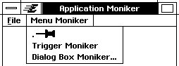

**Figure 2-1** *Visual Monikers.*  
*The Title Bar of the Application contains a visual moniker, as do the menu, 
trigger and dialog box menu items.*

Within the object's definition, set the *GI_visMoniker* field to the desired visual 
moniker (either a text or graphics string). This can be done either by directly 
setting the *GI_visMoniker* field to the string or by indirectly setting the field 
to a visual moniker chunk defined elsewhere within your user interface with 
the Goc keyword **@visMoniker**. (See Code Display 2-5.)

----------

**Code Display 2-5 Setting Visual Monikers**

	/* A visual moniker can be set directly within the object's definition. */
	
	@object GenTriggerClass MyTrigger = {
		GI_visMoniker = "Push Me";
	}
	
	/* A visual moniker may also be defined indirectly within a .goc file. */
	
	/* The data for MyMoniker is set using the Goc keyword @visMoniker. This moniker
	 * must reside in the same resource block as the object using it. This moniker
	 * should be declared before being used in an object declaration. */
	
	@visMoniker MyMoniker = "Push Me";
	
	@object GenTriggerClass MyTrigger = {
		GI_visMoniker = @MyMoniker;
	}

----------

Remember that the *GI_visMoniker* instance field only stores a chunk handle 
to the actual string. The visual moniker for the object is not contained in the 
object chunk itself.

Text monikers may also specify a character to act as a mnemonic. Mnemonics 
are keyboard shortcuts used to activate an object without use of the mouse. 
Menus, menu items, and buttons frequently have mnemonic characters 
attached. This allows a user to navigate quickly to other UI objects or to 
activate them. If the specified character is within the text moniker, that 
letter will be highlighted in whatever fashion the specific UI decides is 
relevant. For instance, in OSF/Motif, mnemonic characters are underlined.

Usually the first letter of the text moniker is used for the mnemonic, though 
any character may be used. The specific UI will underline the first such 
occurrence of the character within the text moniker. If the character is not 
within the text itself, the specific UI may place the character within 
parentheses at the end of the text moniker. Mnemonics are activated 
according to specifications in the specific UI. In OSF/Motif, pressing the ALT 
key puts the user interface into its keyboard navigation mode. In this mode, 
all mnemonics for objects in the focus are activated by pressing the character 
of the mnemonic without need of an additional keystroke.

Mnemonics are set by enclosing the desired character in single quotes before 
the text string in your instance data. Mnemonics are case specific when 
defined. For example, if a visual moniker is the text "File," only an uppercase 
mnemonic of F would highlight the first character in the text. Mnemonics are 
not case specific in their activation methods, however. For example, either 
alt-f or alt-F will activate a keyboard mnemonic of F. 

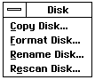

**Figure 2-2** *Some examples of mnemonics.*  
*The characters C, F, R, and e are all mnemonics and are underlined in 
OSF/Motif.*

Mnemonics are only valid for an object if that object is visually displayed and 
currently has the focus (see "Input," Chapter 11 of the Concepts Book). 
Therefore, you may duplicate mnemonics for objects that will not exist at the 
same focus level. (An example of objects at the same focus level would be 
objects within the same menu.) Be careful not to duplicate the same 
mnemonic within the same focus level, as the UI will only associate the 
mnemonic with the first object that matches it.

The mnemonic may also store one of the following constants:

+ VMO_CANCEL corresponds to the specific UI defined cancel mnemonic. Use 
this rather than a special cancel mnemonic of your own 
choosing to keep the UI consistent.

+ VMO_MNEMONIC_NOT_IN_MKR_TEXT indicates that the mnemonic occurs 
after the null-terminator for the moniker text. This moniker is 
itself not null-terminated.

+ VMO_NO_MNEMONIC indicates that this moniker contains no mnemonic.

If you need other functionality that requires keyboard control of some form 
and mnemonics are not satisfactory, see "Keyboard Accelerators" below.

----------

**Code Display 2-6 Setting Mnemonic Characters**

	/* Mnemonics are case specific. If the following example enclosed f instead of
	 * F within single quotes, then the character f in parentheses would follow the
	 * text "File." Note that this case specificity does not apply to the user's
	 * activation of the object. That is, alt f will activate a mnemonic of F. */
	
	@object MyTrigger GenTriggerClass {
		GI_visMoniker = `F', "File";
	}
	
	/* You can also specify the character to highlight with an actual numerical
	 * position, counting from a zero-based (1st character is 0, 2nd character is 1,
	 * etc.) character position in the text string. The "5" in the following example
	 * will underline the F character (the sixth character in the text string.) */
	
		GI_visMoniker = 5, "Open File";

----------

#### 2.3.1.2 Graphics String Visual Monikers

The *GI_visMoniker* instance field recognizes several keywords. These 
keywords are listed below and are usually only used in the construction of 
gstring visual monikers. 

+ style = { *text, abbrevText, graphicText, icon, tool* }  
This keyword specifies the **VMStyle** in use by this visual moniker.  
*text* - Normal text moniker  
*abbrevText* - Abbreviated text moniker (i.e., a short textual 
description rather than the full title). This is used 
for the name under an icon of an iconified 
GenPrimary.  
*graphicText* - Textual gstring  
*icon* - Normal gstring moniker  
*tool* - Moniker for a tool, usually smaller than a standard 
visual moniker

+ size = { *tiny, standard, large, huge* }  
This keyword specifies the **DisplaySize** that this moniker is intended 
for. It has nothing to do with the actual size of the moniker, which can be 
set with the keyword "cachedSize." Each size corresponds to a display 
type's resolution level.  
*tiny* - Tiny screens: CGA, 256x320.  
*standard* - Standard screens: EGA, VGA, HGC, MCGA  
*large* - Large screens: 800x680 SVGA  
*huge* - Huge screens  
You should not, in general, use monikers whose sizes are larger than 
their intended display type. (I.e. using `huge' sized monikers on VGA 
screens.) You may use smaller monikers on larger screens, however.

+ color = { *gray1, gray2, gray4, gray8, color2, color4, colorRGB* }  
This keyword specifies the color capability of the display that this setting 
is intended for. Each setting corresponds to a **DisplayClass**.  
*gray1* - 1 bit/pixel gray scale  
*gray2* - 2 bit/pixel gray scale  
*gray4* - 4 bit/pixel gray scale  
*gray8* - 8 bit/pixel gray scale  
*color2* - 2 bit/pixel color index  
*color4* - 4 bit/pixel color index  
*colorRGB* - color with RGB values

+ aspectRatio = { *normal, squished, verySquished* }  
This keyword specifies the aspect ratio of the display that this moniker 
is intended for.  
*normal* - VGA, MCGA  
*squished* - EGA, HGC (though normal is usually used)  
*verySquished* - CGA

+ cachedSize = { *X, Y* }  
This keyword sets the cached size (pixel by pixel) of the moniker.

+ gstring { *\<GString OpCodes>* }  
This keyword stores the gstring operations used in creating the visual 
moniker. These operations may also specify the creation of a bitmap by 
using the **Bitmap** operator.

----------

**Code Display 2-7 Examples of GString Visual Monikers**

	/* A Graphics string consisting of GString opcodes. */
		GI_visMoniker = {
			size = tiny;
			color = color4;
			aspectRatio = normal;
			cachedSize = 15,15;
			gstring{
				GSSaveTransform(),
				GSApplyRotation(45),
				GSFillEllipse(0,0,10,15),
				GSRestoreTransform(),
				GSDrawEllipse(0,0,10,15),
				GSEndString()
			}
		}
	
	/* A Graphics string containing a bitmap. */
	@visMoniker MyBitmap = {
			style = icon;
			size = standard;
			color = color4;
			aspectRatio = normal;
			cachedSize = 64, 40;
			gstring {
				GSDrawBitmapAtCP(166),
				Bitmap (64,40,BMC_PACKBITS, (BMT_MASK|BMF_4BIT)),
				251, 0,
				233, 221,
				...,
				GSEndString()
			}
	}

----------
#### 2.3.1.3 Visual Moniker Lists

In some cases, an application may wish to use different visual monikers 
under specific circumstances. For example, a GenApplication's icon may need 
separate graphics strings for different display types (VGA, SVGA, etc.) In such 
cases, the argument for the moniker instance field should be given as a list 
of separate and distinct visual monikers. (See Code Display 2-8.)

You may then place each of these monikers within its own separate resource. 
Because only one moniker will be selected from the list, only one resource will 
be loaded into the object block, thereby conserving memory. When the 
application selects its appropriate moniker, the list will be replaced with the 
specific moniker, copied into the object block. The system performs this 
function automatically.

----------
**Code Display 2-8 Simple Lists**

	/* A list of monikers. */
		GI_visMoniker = list {
			@moniker1, 
			@moniker2, 
			@moniker3
		}
	
	/* If several monikers are specified in a list, they must be explicitly defined
	 * somewhere else. If these monikers are complicated (as in the case of graphics
	 * strings) they should each reside within their own resource because they will be
	 * loaded in only once per application run. (Those that will be used together can
	 * be within the same resource.) For example, in GEOS, several monikers
	 * pertaining to different display types would be placed within separate resources.
	 * When the appropriate moniker is selected, the list will be replaced with the
	 * specific moniker. */
	
	@start AppMonikerOneResource, notDetachable;
	
	@visMoniker moniker1 = {
		size = large;
		color = color4;
		aspectRatio = normal;
		cachedSize = 64, 40;
		gstring {gstring data}
	}
	
	@end AppMonikerOneResource;
	
	/* That moniker could then be declared within the object's instance data. */
	@object GenPrimaryClass MyObject = {
		GI_visMoniker = list { @moniker1 }
	}
		
	/*
	 * The GenApplication object usually contains a moniker list that allows the 
	 * specific UI to select a moniker based on the display.
	 */
	@object GenApplicationClass MyApplication = {
		GI_visMoniker = list {
				@TrigTextMoniker,		/* a simple text string */
				@TrigLCMoniker,			/* Large Color */
				@TrigLMMoniker,			/* Large Mono */
				@TrigSCMoniker,			/* Small Color */
				@TrigSMMoniker,			/* Small Mono */
				@TrigLCGAMoniker,		/* Large CGA */
				@TrigSCGAMoniker		/* Small CGA */
		}
	}
	
	@visMoniker TrigTextMoniker = "Push Me";

	/* Graphics monikers might then appear within their own resource block. This
	 * enables efficient memory management. */
	
	@start AppMonikerResource, notDetachable;
	
	@visMoniker TrigLCMoniker = {
		style = icon;
		size = large;
		color = color4;
		aspectRatio = normal;
		cachedSize = 64, 40;
		gstring {
			GSDrawBitmapAtCP(166),
			Bitmap (64,40,BMC_PACKBITS, (BMT_MASK|BMF_4BIT)),
			/*** insert Bitmap here ***/
			GSEndString()
		}
	}
	
	@end AppMonikerResource

----------
#### 2.3.1.4 The Inner Workings of Visual Monikers

The following section explains the inner workings of visual monikers within 
GEOS. It is not necessary to understand many of these concepts but it is 
illustrative of the system, and may aid in debugging and custom moniker 
use.

*GI_visMoniker* can take several types and combinations of arguments, all 
involving either text or graphics strings. Specifically, *GI_visMoniker* may 
indicate the following:

1. a simple text string
2. a text string with a mnemonic character
3. a graphics string consisting of GString opcodes
4. a graphics string containing a bitmap
5. a list of monikers of any type above.

Each of these arguments can be set up with the **@visMoniker** Goc keyword, 
but each will store their data in different manners. GEOS automatically sets 
up the visual moniker in the correct format.

All visual monikers make use of the **VisMoniker** structure. This basic 
structure indicates whether the moniker is text, a gstring, or a list of several 
types.

----------
**Code Display 2-9 The Basic VisMoniker Structure**

	/* The Basic VisMoniker structure contains a header which describes the type of 
	 * VisMoniker (VisMonikerType) and stores the cached width (width in pixels) of the 
	 * VisMoniker. The actual visual moniker data (either text or a gstring) follows
	 * this header. 
	 *
	 * If the visual moniker is text, this VisMoniker structure is contained within a
	 * VisMonikerWithText structure. If the visual moniker is a gstring, this 
	 * VisMoniker structure is contained within a VisMonikerWithGString structure.*/
	
	typedef struct {
		byte		VM_type;		/* VisMonikerType */
		word		VM_width;		/* Cached width of moniker */
	} VisMoniker;
	
	/* VisMonikerType specifies the type of moniker contained in the VisMoniker 
	 * structure. 
	 *
	 * The flag VMT_MONIKER_LIST is actually a dummy flag. (This flag is never set
	 * within a VisMoniker structure.) VisMonikerListEntryType has a matching flag 
	 * in the same location (VMLET_MONIKER_LIST). If that flag is set, it tells the 
	 * system that this isn't actually a VisMoniker structure but is instead a
	 * VisMonikerListEntry. This is used in moniker lists (see below). 
	 *
	 * The flag VMT_GSTRING is set if the visual moniker is in the form of a gstring 
	 * instead of a simple text string. If this flag is set, VMT_GS_ASPECT_RATIO and
	 * VMT_GS_COLOR specify the DisplayAspectRatio and DisplayClass used by this
	 * gstring. 
	 */
	
	typedef ByteFlags VisMonikerType;
	#define VMT_MONIKER_LIST		0x80
	#define VMT_GSTRING				0x40
	#define VMT_GS_ASPECT_RATIO		0x30	/* DisplayAspectRatio */
	#define VMT_GS_COLOR			0x0f	/* Color */
	
	#define VMT_GS_ASPECT_RATIO_OFFSET 4
	#define VMT_GS_COLOR_OFFSET 0

----------
If the visual moniker is a simple text string, the ChunkHandle within 
*GI_visMoniker* will point to a chunk containing a **VisMonikerWithText** 
structure. This chunk will contain the basic **VisMoniker** header, along with 
the moniker's mnemonic character and a null-terminated text-string.

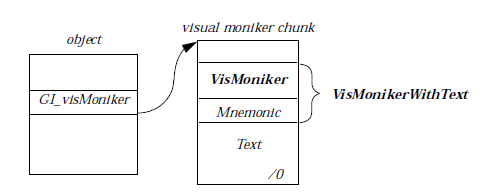

**Figure 2-3** *A Simple Text Moniker*  
*The object and the visual moniker chunk reside in the same resource block. 
The null-terminated text appears after the **VisMonikerWithText** structure.*

----------
**Code Display 2-10 VisMonikers With Text**

	/* If the VisMoniker contains simple text, the ChunkHandle within GI_visMoniker 
	 * points to a VisMonikerWithText structure. This structure contains the 
	 * basic VisMoniker header and the character of the mnemonic. (A value of -1 is 
	 * stored in VMWT_mnemonicOffset if there is no mnemonic for this visual moniker.) 
	 */
	
	typedef struct {
		VisMoniker		VMWT_common;
		char			VMWT_mnemonicOffset;
	} VisMonikerWithText;
	
	/* The text, in the form of a null-terminated text string, follows this structure. 
	 * This text may be accessed (though it is not recommended) with the VMWT_text 
	 * offset. */
	
	#define VMWT_text	(sizeof(VisMonikerWithText)) /* Start of text. */

----------
If the visual moniker is a gstring, the ChunkHandle within *GI_visMoniker* 
will point to a **VisMonikerWithGString** structure instead. This structure 
will contain the basic **VisMoniker** header, along with the moniker's cached 
height and the actual gstring. (The cached width is stored within the 
**VisMoniker** header.)

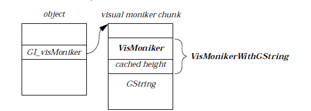

**Figure 2-4** *A GString Moniker*  
*The object and the visual moniker chunk reside in the same resource block. 
The gstring appears after the **VisMonikerWithGString** structure.*

----------
**Code Display 2-11 VisMonikers With GStrings**

	/* If the VisMoniker contains a gstring, the ChunkHandle within GI_visMoniker 
	 * points to a VisMonikerWithGString structure. This structure contains the 
	 * basic VisMoniker header and the cached height of the gstring. (The cached width 
	 * is stored within the VisMoniker structure.
	 */
		
	typedef struct {
		VisMoniker		VMWGS_common;
		word		VMWGS_height;
	} VisMonikerWithGSTring;
	
	/* The gstring follows this structure.This gstring may be accessed (though it is 
	 * not recommended) with the VMWGS_gString offset. */
	
	#define VMWGS_gString	(sizeof(VisMonikerWithGString)) /* Start of gstring. */

----------
If instead of a single visual moniker, be it a text string or a gstring, 
*GI_visMoniker* specifies a list of monikers, the case is more complex.

If *GI_visMoniker* contains a list of monikers, that ChunkHandle will point to 
a group of **VisMonikerListEntry** structures (one for each moniker in the 
list). Each of these list entries will contain the type of moniker it references 
and the optr of the moniker it refers to. The actual moniker itself is not stored 
in that chunk. Also, because the moniker may be referred to by an optr, the 
actual visual monikers may reside in separate resources.

When the object containing the moniker list is first built, the system will 
select one of the monikers in the list (based on matching criteria in the 
*VMLE_type* field) and replace the moniker list with the single selected visual 
moniker.

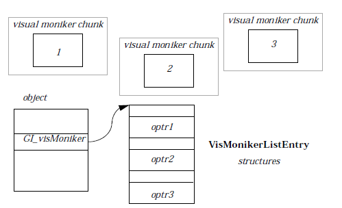

**Figure 2-5** *A Visual Moniker List*  
*The GI_visMoniker instance field points to a chunk containing a number of 
VisMonikerListEntry structures. Each of these structures contains an optr to 
a visual moniker chunk, which may reside outside the current object block.*

----------
**Code Display 2-12 VisMoniker Lists**

	/* If GI_visMoniker contains a list of monikers instead of a single moniker, the 
	 * ChunkHandle of that instance field actually points to a collection of 
	 * VisMonikerListEntry structures. (The total number can be calculated by dividing 
	 * the size of the chunk by sizeof(VisMonikerListEntry) if needed.)
	 *
	 * Each VisMonikerListEntry structure contains a header which describes the type of 
	 * VisMoniker stored in that list entry (VisMonikerListEntryType) and the optr of 
	 * the stored moniker. The actual moniker may reside in a different resource. */
	
	typedef struct {
		word		VMLE_type;
		optr		VMLE_moniker;
	} VisMonikerListEntry;
	
	/* VisMonikerListEntryType specifies the type of moniker specified in the 
	 * VisMonikerListEntry structure. 
	 *
	 * The flag VMLET_MONIKER_LIST must be set within this structure. This flag tells
	 * the system that this isn't actually a VisMoniker structure but is instead a
	 * VisMonikerListEntry.
	 *
	 * The system uses the other flags in this structure to determine the type of 
	 * moniker contained as the list entry. The system will use this information to
	 * select the most appropriate moniker that will satisfy the system's needs. This
	 * method is used most often in the selection of a GenPrimary's main application 
	 * moniker based on the DisplaySize of the system.
	 * 
	 * VMLET_GS_SIZE stores the DisplaySize that this moniker is most appropriate for. 
	 * This DisplaySize is set using the "size" entry within the visual moniker 
	 * declaration.
	 *
	 * VMLET_STYLE stores the VMStyle that this moniker most closely matches. This 
	 * VMStyle is set using the "style" entry within the visual moniker declaration.
	 *
	 * VMLET_GSTRING specifies that this moniker list entry is in the form of a gstring
	 * If this flag is set, VMLET_GS_ASPECT_RATIO and VMLET_GS_COLOR specify the 
	 * DisplayAspectRatio and DisplayClass used by this gstring.
	 */
	
	typedef ByteFlags VisMonikerListEntryType;
	#define VMLET_GS_SIZE			0x0300 	/* DisplaySize. */
	#define VMLET_STYLE				0x0f00	/* VMStyle */
	#define VMLET_MONIKER_LIST		0x0080
	#define VMLET_GSTRING			0x0040
	#define VMLET_GS_ASPECT_RATIO	0x0030	/* DisplayAspectRatio */
	#define VMLET_GS_COLOR			0x000f	/* DisplayClass */
	
	#define VMLET_GS_SIZE_OFFSET			12
	#define VMLET_STYLE_OFFSET				8
	#define VMLET_GS_ASPECT_RATIO_OFFSET	4
	#define VMLET_GS_COLOR_OFFSET			0
	
	/* VMStyle specifies the style of the visual moniker. The system may select a 
	 * moniker based on the style it wishes to display. */
	
	typedef ByteEnum VMStyle;
	#define VMS_TEXT 0				/* Simple text */
	#define VMS_ABBREV_TEXT 1		/* Abbreviated text */
	#define VMS_GRAPHIC_TEXT 2		/* Textual graphics string */
	#define VMS_ICON 3				/* Normal gstring */
	#define VMS_TOOL 4				/* Tool-sized gstring */

----------
For information on manipulating visual monikers dynamically using 
**GenClass** messages, see "Managing Visual Monikers" below.

### 2.3.2 Composite Links
**Composite links form the connections between parent objects and child 
objects within a generic tree (see "The GEOS User Interface," Chapter 10 of 
the Concepts Book). These links are set up using the *GI_comp* and *GI_link* 
instance fields. The *GI_comp* field points to an object's first child. The *GI_link* 
field points to an object's next sibling or to its parent if no next sibling exists. 
(See Figure 2-6 for an illustration.) In Goc, however, this usage is greatly 
simplified. The developer only needs to set the *GI_comp* field equal to its 
complete list of children for the parent object. The Goc preprocessor will then 
create and reassign all necessary links.

----------
**Code Display 2-13 Using GI_comp to Add Children**

	/* The GenInteraction (MyInteraction) acts as the parent object for the three
	 * child GenTriggers. All three GenTrigger children will be placed within the
	 * GenInteraction object. */
	
	@object GenInteractionClass MyInteraction = {
		GI_visMoniker = "Menu";					 /* Text Moniker */
		GII_visibility = GIV_POPUP;				 /* Creates a Menu */
		GI_comp = @MyFirstChild, @MySecondChild, @MyThirdChild;
												/* list of children */
	}
	
	@object GenTriggerClass MyFirstChild= {
		GI_visMoniker = "Child 1";				/* Text Moniker */
	}
	
	@object GenTriggerClass MySecondChild = {
		GI_visMoniker = "Child 2";				/* Text Moniker */
	}
	
	@object GenTriggerClass MyThirdChild = {
		GI_visMoniker = "Child 3";				/* Text Moniker */
	}

----------
This simple functionality is all you need to know to add children to your 
generic objects (and thus to create generic trees). However, it is somewhat 
helpful in certain cases (as in debugging) to understand what takes place 
underneath the surface. When an object in GEOS is assigned children, the 
preprocessor actually only assigns one composite link (*GI_comp*) to the first 
child. Each additional child acquires a link from its previous sibling using the 
internal instance field *GI_link*. Therefore, the parent will have a *GI_comp* to 
its first child, the first child will have a *GI_link* to the next sibling (the 
parent's second child) and so forth. The last sibling (the parent's last child) 
will have a *GI_link* back to the parent. This *GI_link* will have the 
LF_IS_PARENT bit set to indicate that the child points to a parent and not to 
a sibling. This forms what amounts to a circular linked list rather than a 
branching tree structure. (See Figure 2-6.)

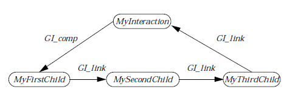

**Figure 2-6** *A sample generic tree structure*  
*The GI_comp points to the first child. The GI_link points to the next sibling 
or to the parent object if no next sibling exists.* 

This structure provides a simple and convenient usage. Any object will 
always have at most two links to other children or parent objects. Therefore 
the two instance fields GI_comp and GI_link provide the entire means of 
constructing a generic tree.

As can be seen in Figure 2-6, you can travel anywhere in the generic tree 
through these two links. For example, for MyInteraction to communicate 
with MyThirdChild, it follows the path of the *GI_comp* to the first child, 
MyFirstChild, and then continues through the two *GI_links* to the third 
child. Conversely, a child can reach a parent by travelling along the *GI_links* 
of siblings until it reaches the last sibling, whose *GI_link* points to its parent 
object.

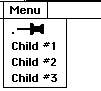

**Figure 2-7** *A Menu with Three Children.*  
*A GenInteraction menu with three GenTrigger children.*

**GenClass** message handlers provide several means of pointing to the proper 
parent/child object without needing to explicitly state the proper *GI_comp* 
and *GI_link* paths. In practice, you will never need to, and in fact should not, 
manipulate the *GI_link* field at all. This information is provided merely for 
your use in debugging your applications. In fact, you can usually assume that 
a conventional branching tree structure exists rather than the linked-list 
tree structure shown here.

For information on manipulating these links dynamically using **GenClass** 
messages, see "Generic Trees" below.

### 2.3.3 Keyboard Accelerators

Keyboard accelerators permit the user to activate objects without the use of 
default activations in the specific UI. (Much of the default activations in most 
graphical user interfaces use the mouse, for example.) In most cases, these 
keyboard accelerators require the use of a modifier (the *alt*, *shift* or *ctrl* key) 
and another key. The keyboard accelerator may also be a function key (F10, 
etc.). In general, you should avoid using the alt key because of its special role 
as a keyboard mnemonic within a visual moniker (see "Visual Monikers" above).

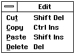  
**Figure 2-8** *Some Sample Keyboard Accelerators*  
*The keyboard accelerators are placed in the right-hand column of the menu. 
Notice that some entries have both a mnemonic and a keyboard accelerator.* 

Keyboard accelerators may be activated at any time; they are valid at any 
point within the application whether the generic object involved is being 
displayed currently or not. (The only exception to this is during the display 
of a modal dialog box, which will block input to any other part of the 
application.) The system will search through the generic tree for the object 
containing the proper key sequence. In this manner, accelerators differ from 
mnemonics, which are only valid for an active level. Therefore, only use 
keyboard accelerators for heavily utilized commands; this prevents a glut of 
modified keystrokes, which may confuse the user. In general, it is good 
practice to use the "control" key exclusively for keyboard accelerators to 
prevent overlapping with GEOS keyboard acclelators and mnemonics.

**Table 2-1** *Valid Action Keys for Keyboard Accelerators*  
*These keys are only valid using the specific UI keyword. These Action Keys 
must also be combined with valid Modifiers (alt, shift, or ctrl)*.  

	NUMPAD_0				SPACE		UP
	NUMPAD_1				TAB			DOWN
	NUMPAD_2				ESCAPE		RIGHT
	NUMPAD_3				F1			LEFT
	NUMPAD_4				F2			HOME
	NUMPAD_5				F3			END
	NUMPAD_6				F4			PAGEUP
	NUMPAD_7				F5			PAGEDOWN
	NUMPAD_8				F6			INSERT
	NUMPAD_9				F7			DELETE
	NUMPAD_PLUS				F8			BACKSPACE
	NUMPAD_MINUS			F9			MINUS
	NUMPAD_DIV				F10			ENTER
	NUMPAD_MULT				F11
	NUMPAD_PERIOD			F12

You can set up keyboard accelerators using the *GI_kbdAccelerator* attribute. 
A keyboard accelerator must contain a valid modifier such as *alt*, *shift*, 
*control*, or *ctrl*. You may use any alpha-numeric character as the action key 
for the modifier to act on. In addition to alpha-numeric characters, the action 
keys within Table 2-1 are also available.

The specific UI has final control over how and whether a keyboard accelerator 
will be implemented. Currently, keyboard accelerators will only work for 
GenTriggers and GenItems. In most cases, a keyboard accelerator will be 
displayed alongside the text for the visual moniker of an object. In OSF/Motif, 
keyboard accelerators are shown to the right of menu items and to the left of 
other items (see Figure 2-8 above). You may add 
HINT_DRAW_SHORTCUT_BELOW on non-menu items to draw the keyboard 
accelerator below the object's visual moniker.

Code Display 2-14 Using a Keyboard Accelerator

----------
	@object GenTriggerClass MyTrigger = {
		/* Case is ignored for keyboard accelerators. */
		GI_kbdAccelerator = ctrl `R';		/* `ctrl' and `control' are both valid. */
	}
	
	/ * Other examples:
		GI_kbdAccelerator = control `A';
	
		Case is ignored for keyboard accelerators (unlike mnemonics). If you need
		an uppercase `A', use `shift' as a modifier.
	
		GI_kbdAccelerator = control shift `A';
		GI_kbdAccelerator = alt `z';
		GI_kbdAccelerator = alt shift `Z';
		GI_kbdAccelerator = ctrl shift `G';
	
		If you know what specific keyboard set will be implemented, you can add such
		special characters with the @specificUI keyword, though this is discouraged.
	
		GI_kbdAccelerator = @specificUI alt shift DELETE;
		GI_kbdAccelerator = @specificUI F6;						*/

----------
For information on manipulating keyboard accelerators dynamically, see 
"Managing Keyboard Accelerators" below.

### 2.3.4 Attributes

	GI_attrs, MSG_GEN_GET_ATTRIBUTES, MSG_GEN_SET_ATTRS

The *GI_attrs* attribute is a record specifying how an object will behave under 
various circumstances. In some cases, the *GI_attrs* instance field indicates 
that an object may initiate a busy state within the application. Several 
attributes only affect how an object will behave during activation. Prior to an 
object's activation, some of these attributes will not affect the object's 
behavior.

GA_SIGNAL_INTERACTION_COMPLETE  
This flag instructs the UI that an Interaction has been 
completed. The specific UI may then decide whether to dismiss 
the Interaction or not. Most often, this attribute is attached to 
a GenTrigger within an independently displayable 
GenInteraction (dialog box). This attribute is useful for 
dismissing temporary dialogs that request information from 
the user. This attribute will cause the generic object to send a 
MSG_GEN_GUP_INTERACTION_COMMAND to its generic 
parent with the *InteractionCommand* 
IC_INTERACTION_COMPLETE. This message is then passed up 
the generic tree until it reaches an appropriate Interaction. See 
"GenInteraction," Chapter 7 for more information.

GA_INITIATES_BUSY_STATE  
This flag instructs the UI to mark the application as busy 
whenever the generic object is activated. You should only set 
this attribute for objects that may initiate long operations. This 
attribute requests that the UI visually change the cursor to 
show that the application is busy. (In OSF/Motif this is 
represented by an hourglass.) When the application finishes its 
operation, the cursor will revert to its former state. This 
attribute causes the object to send 
MSG_GEN_APPLICATION_MARK_BUSY to the object's 
application object along with 
MSG_GEN_APPLICATION_MARK_NOT_BUSY sent via the 
process' event queue. This allows the system to process the first 
message (showing the busy cursor) and only process the second 
message (removing the busy cursor) after the application 
finishes its current operation. (If the action is processed 
quickly, the cursor will often not appear.) The busy state cursor 
is only reflected in the current application; if the cursor roams 
outside the application bounds, the default behavior will occur.

GA_INITIATES_INPUT_HOLD_UP  
This flag instructs the UI to mark the application as busy and 
to delay processing input messages until the UI and 
Application queues have been flushed. The application will 
then complete its current operation before beginning to process 
its input events. You should set this attribute when an object's 
activation may modify the UI, thereby preventing the user from 
clicking on objects that may become invalid after the operation. 
This attribute immediately sends a 
MSG_GEN_APPLICATION_HOLD_UP_INPUT to the application 
object along with a MSG_GEN_APPLICATION_RESUME_INPUT 
delayed via the process' event queue. This functionality is only 
reflected in the current application; if the cursor roams outside 
the application bounds, the default behavior will occur.

GA_INITIATES_INPUT_IGNORE  
This flag instructs the UI to mark the application as busy and 
to completely ignore all subsequent input events to the 
application. The application will enter a *modal* state, meaning 
that all other application events will be ignored until the UI 
and Application queues are flushed. Usually, this state is 
conveyed to the user by broadcasting an audible beep whenever 
an input event is attempted. The generic object will 
immediately send a MSG_GEN_APPLICATION_IGNORE_INPUT 
to the application object along with a 
MSG_GEN_APPLICATION_ACCEPT_INPUT delayed via the 
application queue. This functionality is only reflected in the 
current application; if the cursor roams outside the application 
bounds, the default behavior will occur.

GA_READ_ONLY  
This flag indicates that this object's only function is to display 
information to the user; the user will not be able to interact 
with this object. This attribute is set most often in lists or text 
objects.

GA_KBD_SEARCH_PATH  
This flag indicates that this generic branch contains objects 
with keyboard accelerators and should therefore be searched 
when evaluating such events. This attribute bit is set 
internally by the system. There should be no need for your 
application to deal with this attribute directly.

GA_TARGETABLE  
This flag indicates that this object is targetable and is eligible 
to receive the target exclusive within its target level. Most 
specific UIs will automatically grab the target for this object 
whenever the user interacts with it. This attribute is set by 
default within the following classes:

GenField  
GenApplication  
GenPrimary  
GenDisplayControl  
GenDisplay  
GenView  

GA_NOTIFY_VISIBILITY  
This flag indicates that this object should send notification 
when it becomes visible and not visible. Objects thus will send 
MSG_GEN_APPLICATION_VISIBILITY_NOTIFICATION to the 
GenApplication object whenever the state of their visibility 
changes (see "GenApplication," Chapter 3). You may alter this 
behavior by including one of the visibility vardata attributes. 

----------
**Code Display 2-15 Using GI_attrs in a Dialog Box**

	@object GenInteractionClass MyDialogBox = {
		GI_comp = @MyButton, @MyOtherButton;
		GII_visibility = GIV_DIALOG;	/* build this Interaction as a dialog box.*/
	}
	
	@object GenTriggerClass MyButton = {
		GTI_actionMsg = MSG_MY_SPECIAL_MESSAGE;
		GTI_destination = process;
		/* MyButton, when activated, will send the message above to the
		 * process object. Only when that happens will it activate the
		 * behavior within the GI_attrs instance data below. */
		GI_attrs = @default | 
		/* This flag will close the MyDialogBox object */
		GA_SIGNAL_INTERACTION_COMPLETE |
		/* This flag will set the application to ignore all input events while the
		 * message above is processed. */
		GA_INITIATES_INPUT_IGNORE;
	}

----------

----------
#### MSG_GEN_GET_ATTRIBUTES

	byte	MSG_GEN_GET_ATTRIBUTES();

This message retrieves the *GI_attrs* instance data for the object the message 
is sent to. This message returns a byte length bitfield.

**Source:** Unrestricted.

**Destination:** Any generic object.

**Return:** Byte length GI_attrs bitfield.

**Interception:** Generally not intercepted.

----------
#### MSG_GEN_SET_ATTRS

	void	MSG_GEN_SET_ATTRS(
			byte attrsToSet,
			byte attrsToClear);

This message sets the recipient's *GI_attrs* field. This message takes two 
arguments: the attributes to set and the attributes to clear. There is no need 
to repeat attributes that have been previously set. Note that these attributes 
will not take effect until the object is activated in the normal manner. 
(Sending this message does not in itself initiate the activity described).

You should only send this message while an object is not GS_USABLE, 
because these attributes are only checked when an object is specifically built. 
Setting the attributes of a GS_USABLE object may cause an error.

**Source:** Unrestricted.

**Destination:** Any non-usable generic object.

**Parameters:**  
*attrsToSet* - GenAttributes to set in GI_attrs.

*attrsToClear* - GenAttributes to clear in GI_attrs.

**Interception:** Generally not intercepted.

----------
**Code Display 2-16 Conditionally Altering the GI_attrs Field**

	@method MyProcessClass, MSG_DO_CUSTOM_ATTRS {
		byte MyAttrs;

		/* retrieve the GI_attrs field */
		MyAttrs = @call @MyObject::MSG_GEN_GET_ATTRIBUTES();
	
		/* If the GA_COMPLETES_INTERACTION bit is set, then set it 
		 * GA_INITIATES_BUSY_STATE also. Otherwise set it
		 * GA_INITIATES_INPUT_IGNORE. */
	
		if (MyAttrs & GA_COMPLETES_INTERACTION){
			@call @MyObject::MSG_GEN_SET_NOT_USABLE();
			@call @MyObject::MSG_GEN_SET_ATTRS(GA_INITIATES_BUSY_STATE, 0);
	
			/* Note that setting an object's GA_INITIATES_BUSY_STATE attribute will
			 * not in itself initiate a busy state. That object will only issue a busy
			 * state when it is activated in the normal fashion. */
	
			@call @MyObject::MSG_GEN_SET_USABLE();
		} else {
			@call @MyObject::MSG_GEN_SET_NOT_USABLE();
			@call @MyObject::MSG_GEN_SET_ATTRS(GA_INITITATES_INPUT_IGNORE, 0);
			@call @MyObject::MSG_GEN_SET_USABLE();
		}
	}

----------
### 2.3.5 States

	GI_states

The *GI_states* attribute is a record that holds the state of the generic object. 
These states affect the object's visual representation and its functionality. By 
default, all objects have both GS_USABLE and GS_ENABLED set when first 
built. There are two *GI_states*:

GS_USABLE  
This state controls the usability of an object. Setting an object 
GS_USABLE will indicate that both the object and the entire 
generic branch below this object should be considered as an 
active part of the user interface and therefore should be 
visually represented. An object that is not set GS_USABLE 
cannot appear as part of the user interface. Before an object can 
be visually built and considered part of the user interface, 
however, it must satisfy two conditions: The object itself must 
be GS_USABLE, and all ancestors (parents) of the object must 
also be GS_USABLE.

This means that a continuous path of GS_USABLE objects must 
exist from the top node of your application to the object for it to 
be usable. In this case, an object is considered to be *fully* usable. 
Conversely, if an object is not GS_USABLE, then no object in the 
branch below it can be visually displayed either (even if it is 
GS_USABLE). Therefore, an object may be set GS_USABLE 
without being fully usable. This allows you to set an entire 
branch fully usable by setting just one node object usable, 
provided that all other objects below that node had previously 
been set GS_USABLE. This attribute is set by default. (See 
Figure 2-9 for an example.)

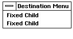 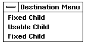

**Figure 2-9** *Setting an Object GS_USABLE*  
*When the GenTrigger object "Usable Child" is set GS_USABLE, it is built into 
the menu.*

GS_ENABLED  
This state sets the object enabled. This state controls whether 
the object is available to the user for activity. An object must be 
enabled for the user to interact with it. If an object is set 
GS_USABLE but not GS_ENABLED, it will be visually displayed 
but will not accept input from the user. The object will also be 
unable to perform its normal activities. This is usually 
represented by "graying out" the object's visual moniker. Before 
an object can be "enabled" for user input and activation, 
however, it must satisfy two conditions: The object must be 
GS_ENABLED; all ancestors (parents) of the object must also be 
GS_ENABLED. Therefore, a continuous path of GS_ENABLED 
objects must exist from the top node of your application to the 
object in question for it to be enabled. In this case, an object is 
considered to be *fully* enabled.

Conversely, if an object is not GS_ENABLED, then no object in 
the branch below it can be interacted with either (even if it is 
GS_ENABLED). Therefore, an object may be GS_ENABLED 
without being fully enabled. This allows you to set an entire 
branch fully enabled by setting just one node object enabled, 
provided that all other objects below that node had previously 
been set GS_ENABLED. See Figure 2-10 for an example.

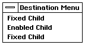 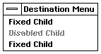

**Figure 2-10** *Setting an Object GS_ENABLED*  
*When the GenTrigger object "Enabled Child" is set not GS_ENABLED, it is 
grayed out (disabled).*

These states not only affect the state of the current object but all of its 
descendants as well. When your user interface is first built (or rebuilt) it 
conducts a top-down search, building any objects that are declared 
GS_USABLE. If an object is not GS_USABLE, it will not be visually built. 
Furthermore, none of its descendants will be searched (or built). Therefore, 
if any single node is not GS_USABLE, no other object below that node will be 
fully usable. 

In cases where you wish to alter any fundamental behavior of an object, you 
may have to set the object not usable, change its behavior, and then set the 
object GS_USABLE again. This ensures that the object is built out correctly 
(including visually) according to the new criteria.

----------
**Code Display 2-17 Setting GI_states**

	@object GenTriggerClass MyTrigger = {
		/* The default GI_states are GS_USABLE and GS_ENABLED.
		 * This object will only be GS_USABLE */
		GI_states = @default & ~GS_ENABLED;
	}

----------

#### 2.3.5.1 The Usable State

	MSG_GEN_GET_USABLE, MSG_GEN_SET_USABLE, 
	MSG_GEN_SET_NOT_USABLE, MSG_GEN_CHECK_IF_FULLY_USABLE 

Setting an object GS_USABLE will incorporate the object into the generic tree 
and regard the object as part of the user interface. (It will not by itself enable 
an object for user input; this requires an object to be set GS_ENABLED also.) 
If an object is not GS_USABLE, it cannot be used in any manner including any 
visual implementation by the user interface. The following messages 
manipulate an object's usable state.

----------
#### MSG_GEN_GET_USABLE

	Boolean	MSG_GEN_GET_USABLE();

This message checks the GS_USABLE bit of the *GI_states* field.

**Source:** Unrestricted.

**Destination:** Any generic object.

**Parameters:** None.

**Return:** Will return *true* if the object is GS_USABLE, false if it is not usable.

**Interception:** Generally not intercepted.

----------
#### MSG_GEN_SET_USABLE

	void	MSG_GEN_SET_USABLE(
			VisUpdateMode updateMode);

This message sets an object GS_USABLE. (This message has no effect on an 
object already GS_USABLE.) Objects may be set GS_USABLE only after they 
have been attached to a generic tree. Setting an object usable forces that 
object to be specifically built. If the object's associated window is realized, the 
object will be visually built and updated. Setting an object GS_USABLE that 
is not attached to the generic tree will cause an error.

Setting an object usable allows that object to become part of the user 
interface. Before the object can be used, though, it must be *fully usable*. An 
object becomes fully usable only if all of its ancestors are GS_USABLE. If any 
ancestor is not GS_USABLE, then the entire branch below it will not be fully 
usable. You can check if an object is fully usable with the message 
MSG_GEN_CHECK_IF_FULLY_USABLE.

Conversely, setting a node GS_USABLE, in which every branch object below 
it is already GS_USABLE will make that entire branch fully usable. This is 
useful for bringing up an entire section of a generic tree by setting a single 
object usable.

**Source:** Unrestricted.

**Destination:** Any generic object.

**Parameters:**  
updateMode - **VisUpdateMode** to use when updating changes to 
the screen.

**Return:** Nothing.

**Interception:** Generally not intercepted.

----------
#### MSG_GEN_SET_NOT_USABLE

	void	MSG_GEN_SET_NOT_USABLE(
			VisUpdateMode updateMode);

This message sets an object not usable (clears the GS_USABLE bit). Because 
an object may be visually unbuilt by this message, the **VisUpdateMode** 
VUM_MANUAL is not allowed.

**Source:** Unrestricted.

**Destination:** Any generic object.

**Parameters:**  
*updateMode* - **VisUpdateMode** to use when updating changes to 
the screen. May not be VUM_MANUAL.

**Return:** Nothing.

**Interception:** Generally not intercepted.

----------
#### MSG_GEN_CHECK_IF_FULLY_USABLE

	Boolean	MSG_GEN_CHECK_IF_FULLY_USABLE();

This message checks whether an object is fully usable. The object and all of 
its parents must be GS_USABLE for the object to be fully usable. 

**Source:** Unrestricted.

**Destination:** Any generic object.

**Return:** Will return *true* if the object is fully usable, false if it is not.

**Interception:** Generally not intercepted.

#### 2.3.5.2 The Enabled State

	MSG_GEN_GET_ENABLED, MSG_GEN_SET_ENABLED, 
	MSG_GEN_SET_NOT_ENABLED, MSG_GEN_CHECK_IF_FULLY_ENABLED

An object that is GS_ENABLED is ready for user interaction. As in the case 
with GS_USABLE, all parents of the object in question must be GS_ENABLED 
to *fully enable* the object. An object may be fully enabled without being fully 
usable, but the object will not be visually represented. You can check if an 
object is fully enabled with MSG_GEN_CHECK_IF_FULLY_ENABLED. 

An object that is not enabled but is set usable will be represented in the user 
interface; it will not, however, allow the user to interact with it. In many 
cases, the specific UI implements this by "graying out" the object. Setting a 
disabled object will visually update it.

----------

#### MSG_GEN_GET_ENABLED
	Boolean  MSG_GEN_GET_ENABLED();

This message returns the enabled state of the object the message is sent to.

**Source:** Unrestricted.

**Destination:** Any generic object.

**Return:** Will return true if the object is enabled, false if it is not.

**Interception:** Generally not intercepted.

----------

#### MSG_GEN_SET_ENABLED

	void	MSG_GEN_SET_ENABLED(
			VisUpdateMode updateMode);

This message sets an object GS_ENABLED. (This message has no effect on an 
object already GS_ENABLED.) You must pass this message a 
**VisUpdateMode**. Sending this message allows the object to receive user 
input. Only send this message if your application will be ready to interact 
with the object after the period specified in the **VisUpdateMode** has passed.

**Source:** Unrestricted.

**Destination:** Any generic object.

**Parameters:**  
*updateMode* - **VisUpdateMode** to use when updating changes to 
the screen.

**Interception:** Generally not intercepted.

----------

#### MSG_GEN_SET_NOT_ENABLED

	void	MSG_GEN_SET_NOT_ENABLED(
			VisUpdateMode updateMode);

This message sets the object not enabled (clears the object's GS_ENABLED 
bit.) You must pass the message a **VisUpdateMode**. In most specific UIs a 
disabled state is implemented by "graying out" the object. The user will be 
unable to interact with the object according to the **VisUpdateMode** passed. 

**Source:** Unrestricted.

**Destination:** Any generic object.

**Parameters:**  
*updateMode* - **VisUpdateMode** to use when updating changes to 
the screen. May not be VUM_MANUAL.

**Interception:** Generally not intercepted.

----------

#### MSG_GEN_CHECK_IF_FULLY_ENABLED

	Boolean	MSG_GEN_CHECK_IF_FULLY_ENABLED();

This message checks whether an object is fully enabled. An object is only fully 
enabled (ready for user interaction) when both it and all of its ancestors are 
enabled.

**Source:** Unrestricted.

**Destination:** Any generic object.

**Return:** Will return *true* if fully enabled, *false* if not.

**Interception:** Generally not intercepted.

## 2.4 Modifying GenClass Instance Data

Instance data need not be set solely within your **.goc** file. You may also 
retrieve or alter this data dynamically with messages in **GenClass**. The 
following section details messages to modify the *GI_visMoniker*, 
*GI_kbdAccelerator*, *GI_attrs* and *GI_states* instance fields. This section also 
details ways of using the variable data object routines and messages to 
modify a generic object's vardata.

Remember that when accessing and modifying instance data, you may need 
to dereference the pointer to the object's instance data if the location of that 
instance data may have changed. This pointer (**pself**) is automatically set up 
correctly inside a method upon receipt of the corresponding message. If you 
perform actions within that method that may move the object, you can use 
**ObjDerefGen()** to dereference **pself** again.

If the instance fields you wish to modify are related to generic tree 
mechanisms (*GI_comp* and *GI_link*), see "Special Message Passing" below.

### 2.4.1 Visual Monikers

A visual moniker must reside in a local memory (LMem) chunk. That chunk 
should be located within the object block of the particular generic object it is 
associated with. Once monikers are defined, there are several messages in 
GenClass that you can use to change the visual moniker for an object.

The *GI_visMoniker* field contains a ChunkHandle of the **VisMoniker** 
structure. The **VisMoniker** structure contains three pieces of data: the type 
of moniker, the width of the moniker chunk, and the moniker data.

### 2.4.2 Managing Visual Monikers

	MSG_GEN_GET_VIS_MONIKER, MSG_GEN_USE_VIS_MONIKER, 
	MSG_GEN_CREATE_VIS_MONIKER, MSG_GEN_REPLACE_VIS_MONIKER, 
	MSG_GEN_REPLACE_VIS_MONIKER_OPTR, 
	MSG_GEN_REPLACE_VIS_MONIKER_TEXT, MSG_GEN_FIND_MONIKER, 
	MSG_GEN_DRAW_MONIKER, MSG_GEN_GET_MONIKER_POS, 
	MSG_GEN_GET_MONIKER_SIZE, MSG_GEN_RELOC_MONIKER_LIST, 
	MSG_GEN_FIND_OBJECT_WITH_TEXT_MONIKER

Sending MSG_GEN_GET_VIS_MONIKER to an object returns the chunk 
handle of the visual moniker (*GI_visMoniker*) for that object. You can then 
inspect that visual moniker or use it within other objects (though this is not 
recommended). You must be careful when sharing monikers with other 
objects, as freeing one object (and therefore its associated moniker) will 
interfere with any other objects referencing that moniker.

Sending MSG_GEN_USE_VIS_MONIKER to an object sets a visual moniker for 
that object to use. The message must pass the chunk handle of the moniker 
desired for the object along with a **VisUpdateMode**. Valid 
**VisUpdateModes** are described in "VisClass," Chapter 23. The moniker to 
use must reside in the same block as the object being set. If you need to set 
an object to use a new moniker from a location outside of its object block, use 
MSG_GEN_REPLACE_VIS_MONIKER to copy the moniker to the new location.

MSG_GEN_REPLACE_VIS_MONIKER copies a visual moniker from a source 
location into a destination. This message must pass parameters specifying 
the type of copy operation. The source for the moniker can be referenced 
using an optr or a simple text string. Use this message when you wish to copy 
a moniker from outside of the object's current object block.

MSG_GEN_REPLACE_VIS_MONIKER_OPTR and 
MSG_GEN_REPLACE_VIS_MONIKER_TEXT are simplified versions of the 
above message, allowing you to set a visual moniker from an optr or from a 
pointer to a null-terminated text string without having to pass many other 
arguments. 

MSG_GEN_CREATE_VIS_MONIKER creates a visual moniker (within the 
resource block of the object this message is sent to), copying it from a source; 
it does not, however, attach this moniker to any object. 

MSG_GEN_FIND_MONIKER searches for a specific type of moniker within a 
moniker list. You may then use the moniker directly. You can also replace the 
original moniker list with the specified moniker.

MSG_GEN_DRAW_MONIKER, MSG_GEN_GET_MONIKER_POS, and 
MSG_GEN_GET_MONIKER_SIZE all manipulate a currently existing moniker. 
These messages are most useful for custom gadgets. 
MSG_GEN_DRAW_MONIKER draws the moniker according to the criteria 
passed with the message. MSG_GEN_GET_MONIKER_POS and 
MSG_GEN_GET_MONIKER_SIZE return GEOS coordinates specifying the 
location and size of the moniker, respectively. You may then inspect and alter 
these coordinates before sending the moniker a MSG_GEN_DRAW_MONIKER 
to redraw the moniker according to the changed criteria.

The utility message MSG_GEN_RELOC_MONIKER_LIST relocates an object's 
moniker list. 

To find an object with a particular visual moniker, send 
MSG_GEN_FIND_OBJECT_WITH_MONIKER_FLAGS to the object at which to 
start the top-down search, passing the text to perform the match.

----------
#### MSG_GEN_GET_VIS_MONIKER

	ChunkHandle	 MSG_GEN_GET_VIS_MONIKER();

This message retrieves the instance data in the object's current 
GI_visMoniker instance field. This message returns the ChunkHandle of the 
moniker data structure. You can then use that chunk handle to manipulate 
the visual moniker directly or to copy the moniker for use by other objects.

**Source:** Unrestricted.

**Destination:** Any generic object.

**Return:** The chunk handle of the visual moniker in use by this object.

**Interception:** Generally not intercepted.

----------

#### MSG_GEN_USE_VIS_MONIKER
	void	MSG_GEN_USE_VIS_MONIKER(
			ChunkHandle moniker,
			VisUpdateMode updateMode);

This message allows an object to reference a visual moniker; this message 
does not destroy the chunk of the object's current visual moniker. The 
moniker must reside in the same block as the object. Use 
MSG_GEN_REPLACE_VIS_MONIKER if you wish to set a moniker from a 
source outside the object block or if you wish to use a new moniker, 
overwriting the old one.

You cannot pass a moniker list's chunk handle using this message. See 
MSG_GEN_FIND_MONIKER for information on selecting monikers from 
within a list.

**Source:** Unrestricted.

**Destination:** Any generic object.

**Parameters:**  
*moniker* - The chunk handle of the visual moniker to use

*updateMode* - **VisUpdateMode** to determine when the moniker 
will be redrawn.

**Return:** Nothing.

**Interception:** Generally not intercepted.

----------
**Code Display 2-18 Getting and Using Visual Monikers**

	/* This method effectively copies a visual moniker from ObjectOne into ObjectTwo.
	 * Both objects must reside in the same object block. Note that in effect, both
	 * ObjectOne and ObjectTwo will "share" the same moniker. This can be dangerous if
	 * one object is freed, thereby causing the other object to become dereferenced.
	 * For more complex copy operations, use MSG_GEN_REPLACE_VIS_MONIKER instead. */
	
	@method MyProcessClass, MSG_MY_MONIKER_MESSAGE {
		/* Set up variable to store the chunk handle of the visual moniker. */
		ChunkHandle MyVisMonikerCH;
	
		/* Retrieve the visMoniker of ObjectOne and store it in the variable. */
		MyVisMonikerCH = @call @ObjectOne::MSG_GEN_GET_VIS_MONIKER();
	
		/* Set the visMoniker of Object Two to MyVisMonikerCH and update
		 * immediately. Use @send if you don't expect a return value. */
		@send @ObjectTwo::MSG_GEN_USE_VIS_MONIKER(MyVisMonikerCH, VUM_NOW);
	}
	
	/* You can also declare visual monikers in your .goc file and set them later */
	
		@visMoniker OnMoniker = "On";
		@visMoniker OffMoniker = "Off";

		/* Within a method, the following routine will set the moniker to "On". The
		 * OptrToChunk operator casts the object from an optr to a ChunkHandle. */
		@call @MyObject::MSG_GEN_SET_MONIKER(OptrToChunk(@OnMoniker), VUM_NOW);
	
		/* Within a method, the following routine will set the moniker to "Off" */
	    @call @MyObject::MSG_GEN_SET_MONIKER(OptrToChunk(@OffMoniker), VUM_NOW);

----------

----------
#### MSG_GEN_REPLACE_VIS_MONIKER

	ChunkHandle	 MSG_GEN_REPLACE_VIS_MONIKER(@stack
				VisUpdateMode			updateMode,
				word					height,
				word					width,
				word					length,
				VisMonikerDataType		dataType,
				VisMonikerSourceType	sourceType,
				dword					source);

This message copies a visual moniker from a source to the object that sent the 
message. The message returns the chunk handle of the newly copied 
moniker. The object's current visual moniker is overwritten by this message; 
therefore, if more than one object shares the overwritten block, the other 
object should be updated with MSG_GEN_USE_VIS_MONIKER. This message 
can copy a visual moniker from a variety of sources.

This message is a general, all-purpose, moniker replacement device. If your 
visual moniker source is a **visMoniker** structure or a null-terminated text 
string, you may be able to use the simpler messages 
MSG_GEN_REPLACE_VIS_MONIKER_OPTR and 
MSG_GEN_REPLACE_VIS_MONIKER_TEXT.

**Source:** Unrestricted.

**Destination:** Any generic object.

**Parameters:**  
*updateMode* - Specifies the **VisUpdateMode** to use when 
visually updating the changes to the screen. See 
"VisClass," Chapter 23 for more information on 
**VisUpdateMode** types.

*height* - If moniker is a GString, this specifies the height of 
the moniker in points. Otherwise, set this to zero.

*width* - If the moniker is a GString, this specifies the width 
of the moniker in points. Otherwise, set this to zero.

*length* - If the moniker is a GString, this specifies the length 
of the moniker in points. Otherwise, set this to zero.

*dataType* - Specifies the type of data referenced by the source. 
Valid **VisMonikerDataType** types include 
VMDT_VIS_MONIKER, VMDT_TEXT, 
VMDT_GSTRING, or VMDT_TOKEN.

*sourceType* - Specifies the type of pointer referencing the source. 
Valid **VisMonikerSourceType** types are 
VMST_FPTR, VMST_OPTR, and VMST_HPTR.

*source* - Specifies the source of the moniker to be used 
during the copy process. This source may be a 
pointer to a text string, an optr pointing to a visual 
moniker outside the current block, or a variety of 
other sources. The source type should be specified 
in *sourceType*. 

**Return:** The chunk handle of the new visual moniker for the object.

**Interception:** Generally not intercepted.

----------
#### MSG_GEN_REPLACE_VIS_MONIKER_OPTR

	ChunkHandle	 MSG_GEN_REPLACE_VIS_MONIKER_OPTR(
				optr				source,
				VisUpdateMode		updateMode);

This message is a simplified version of MSG_GEN_REPLACE_VIS_MONIKER. 
If your visual moniker source is an existing **visMoniker** structure, you can 
use this message to replace an object's moniker. 

**Source:** Unrestricted.

**Destination:** Any generic object.

**Parameters:**  
*source* - The optr of the visMoniker structure to use in the 
replacement operation.

*updateMode* - Specifies the **VisUpdateMode** to use when 
visually updating the changes to the screen.

**Return:** The chunk handle of the new visual moniker for the object.

**Interception:** Generally not intercepted.

----------
#### MSG_GEN_REPLACE_VIS_MONIKER_TEXT

	ChunkHandle	 MSG_GEN_REPLACE_VIS_MONIKER_TEXT(
				const char			*source,
				VisUpdateMode		updateMode);

This message is a simplified version of MSG_GEN_REPLACE_VIS_MONIKER. 
If your visual moniker source is a pointer to a null-terminated text string, 
you can use this message to replace an object's moniker without having to 
pass the arguments of MSG_GEN_REPLACE_VIS_MONIKER.

**Source:** Unrestricted.

**Destination:** Any generic object.

**Parameters:**  
*source* - A pointer to a null-terminated character string to 
use in the replacement operation.

*updateMode* - Specifies the **VisUpdateMode** to use when 
visually updating the changes to the screen.

**Return:** The chunk handle of the new visual moniker for the object.

**Interception:** Generally not intercepted.

----------
#### MSG_GEN_CREATE_VIS_MONIKER

	ChunkHandle MSG_GEN_CREATE_VIS_MONIKER(@stack
				CreateVisMonikerFlags		flags,
				word						height,
				word						width,
				word						length,
				VisMonikerDataType			dataType,
				VisMonikerSourceType		sourceType,
				dword						source);

This message creates a visual moniker chunk within the resource block of the 
object sent this message. The moniker is copied from the source specified but 
is not attached to any object in the new object block.

**Source:** Unrestricted

**Destination:** Any GenClass object

**Parameters:**  
*flags* - Flags to use in the creation of the new visual 
moniker. CVMF_DIRTY marks the new moniker 
chunk OCF_DIRTY.

*height* - If moniker is a GString, this specifies the height of 
the moniker in points. Otherwise, set this to zero.

*width* - If the moniker is a GString, this specifies the width 
of the moniker in points. Otherwise, set this to zero.

*length* - If the moniker is a GString, this specifies the length 
of the moniker in points. Otherwise, set this to zero.

*dataType* - Specifies the type of data referenced by the source. 
Valid **VisMonikerDataType** types include 
VMDT_VIS_MONIKER, VMDT_TEXT, 
VMDT_GSTRING, or VMDT_TOKEN.

*sourceType* - Specifies the type of pointer referencing the source. 
Valid **VisMonikerSourceType** types are 
VMST_FPTR, VMST_OPTR, and VMST_HPTR.

*source* - Specifies the source of the moniker to be used 
during the copy process. This source may be a 
pointer to a text string, an optr pointing to a visual 
moniker outside the current block, or a variety of 
other sources. The source type should be specified 
in *sourceType*. 

**Return:** The chunk handle of the new visual moniker for the object.

**Interception:** Generally not intercepted.

----------
#### MSG_GEN_FIND_MONIKER

	optr	MSG_GEN_FIND_MONIKER(
			Boolean			useAppMonikerList,
			word			searchFlags,	/* VisMonikerSearchFlags */
			MemHandle		destBlock);

This message scans a list of monikers and selects a specific moniker (or the 
most appropriate moniker). The moniker selected is determined according to 
the passed **VisMonikerSearchFlags**. This message is usually used by the 
specific UI to select an application moniker from a list.

If the first argument (*useAppMonikerList*) is not zero, the message will use 
the GenApplication's moniker list instead of the recipient's. This is useful for 
finding the icon used for an iconified application.

Note that this message returns an optr, not a chunk handle, as this message 
is most often used to find a moniker outside of the current object block. This 
message returns zero if no moniker is found.

**Source:** Unrestricted.

**Destination:** Any generic object.

**Parameters:**  
*useAppMonikerList* - Non-zero to use the moniker list of the application 
associated with this object.

*searchFlags* - **VisMonikerSearchFlags** to use for the search 
criteria. If VMSF_COPY_CHUNK is specified in the 
searchFlags, a block handle must be supplied in 
*destBlock*. The selected moniker will be copied into 
that block.

*destBlock* - Block to copy a moniker into, if 
VMSF_COPY_CHUNK is specified in the 
searchFlags.

**Return:** The optr of the moniker found according to the search criteria. (This 
may be outside the current object block.)

**Interception:** Generally not intercepted.

----------
#### MSG_GEN_DRAW_MONIKER

	void	MSG_GEN_DRAW_MONIKER(@stack
			DrawMonikerFlags	monikerFlags,
			word				textHeight,
			GStateHandle		gState,
			word				yMaximum,
			word				xMaximum,
			word				yInset,
			word				xInset);

This message draws a moniker for an object according to the parameters 
passed. The moniker must currently exist. You can use this message to 
change the way you wish a visual moniker to appear within a generic object 
without actually changing the visual moniker itself.

**Source:** Unrestricted.

**Destination:** Any GS_USABLE generic object.

**Parameters:**  
*monikerFlags* - Specifies the **DrawMonikerFlags** to use when 
drawing the moniker. The **DrawMonikerFlags** 
record specifies the conditions to draw the moniker 
under.

*textHeight* - Specifies the height of the system text. Passing this 
value speeds the processing of this message. If you 
do not know the height of the system text, pass 
zero. 

*gState* - Specifies the GState, if any, to use when drawing 
the moniker.

*yMaximum, xMaximum* - These specify the maximum height and width of 
the moniker. Typically, these are used with 
DMF_CLIP_TO_MAX_WIDTH (in 
**DrawMonikerFlags**) to perform a clipping 
operation on the moniker. Pass zero if no maximum 
width is desired.

*yInset* - Specifies the point to begin drawing the moniker if 
the moniker is right or left justified.

*xInset* - Specifies the point to begin drawing the moniker if 
the moniker is top or bottom justified.

**Return:** Nothing

**Interception:** Generally not intercepted. Custom gadgets may handle this if they are 
supplementing or replacing default functionality.

**Structures:** The **DrawMonikerFlags** record defines the parameters to use when 
drawing a currently existing visual moniker. This record is used by 
MSG_GEN_DRAW_MONIKER, MSG_GEN_GET_MONIKER_POS and 
MSG_GEN_GET_MONIKER_SIZE. Its flags are shown below:

	DMF_UNDERLINE_ACCELERATOR
	DMF_CLIP_TO_MAX_WIDTH
	DMF_NONE
	DMF_Y_JUST_MASK		/* of type Justifications */
	DMF_X_JUST_MASK		/* of type Justifications */

Use DMF_UNDERLINE_ACCELERATOR to underline the keyboard 
accelerator of a text moniker. Use DMF_CLIP_TO_MAX_WIDTH to clip the 
visual bounds of the moniker to the width specified in maxWidth. Use 
DMF_NONE to draw the moniker at the current pen position.

The two justification masks are of type **Justification**, and they specify the 
vertical and horizontal justifications to use when drawing the moniker. The 
values you can use in the justification fields are

	J_LEFT
	J_RIGHT
	J_CENTER
	J_FULL

----------
#### MSG_GEN_GET_MONIKER_POS

	XYValueASDWord MSG_GEN_GET_MONIKER_POS(@stack
			DrawMonikerFlags	monikerFlags,
			word				textHeight,
			GStateHandle		gState,
			word				yMaximum,
			word				xMaximum,
			word				yInset,
			word				xInset);

This message returns the x and y coordinates of the moniker for the object as 
if the moniker were drawn according to the passed parameters (the same as 
for MSG_GEN_DRAW_MONIKER). Use the macros DWORD_X and DWORD_Y 
to extract the appropriate coordinates from the returned value.

This message, along with MSG_GEN_DRAW_MONIKER and 
MSG_GEN_GET_MONIKER_SIZE is most useful in the construction and 
modification of custom gadgets.

**Source:** Unrestricted.

**Destination:** Any generic object.

**Parameters:** See MSG_GEN_DRAW_MONIKER.

**Return:**	**XYValueAsDWord** which can be split up into x and y coordinates of 
the moniker position with the macros DWORD_X and DWORD_Y.

**Interception:** Generally not intercepted.

----------
n	MSG_GEN_GET_MONIKER_SIZE

	SizeAsDWord MSG_GEN_GET_MONIKER_SIZE(
			word		textHeight,
			GStateHandle		gState);

This message returns the width and height (in points) of the moniker for the 
object. Use the macros DWORD_WIDTH and DWORD_HEIGHT to extract the 
appropriate coordinates from the returned value. This message, along with 
MSG_GEN_DRAW_MONIKER and MSG_GEN_GET_MONIKER_POS, is most 
useful in the construction and modification of custom gadgets.

**Source:** Unrestricted.

**Destination:** Any generic object.

**Parameters:**  
*textHeight* - The system text height, if known; otherwise, pass 
zero.

*gstate* - The GState handle of the GState to draw to.

**Return:** *SizeAsDWord* which can be split up into with and height with the 
macros DWORD_WIDTH and DWORD_HEIGHT.

**Interception:** Generally not intercepted.

----------
#### MSG_GEN_RELOC_MONIKER_LIST

	void 	MSG_GEN_RELOC_MONIKER_LIST(
			optr		monikerList,
			word 		relocFlag); /* 0: relocate; 1: unrelocate */

This method (un)relocates a passed moniker list. 

**Source:** Anyone.

**Destination:** Any GenClass object.

**Parameters:**  
*monikerList* - optr of moniker list.

*reloc* - Flag specifying whether relocation or unrelocation 
is desired.

**Return:** Nothing.

**Interception:** Generally not intercepted.

----------
#### MSG_GEN_FIND_OBJECT_WITH_TEXT_MONIKER

	optr	MSG_GEN_FIND_OBJECT_WITH_TEXT_MONIKER(
			char	*text,
			word	flags);

This message recursively searches through the generic tree (starting at the 
object that sent the message) for an object whose visual moniker matches the 
passed text. This match does not need to be complete (unless the flag 
GFTMF_EXACT_MATCH is passed); the message will return the first object 
whose initial characters match the given text. The message must pass 
**GenFindObjectWithMonikerFlags**.

		typedef WordFlags GenFindObjectWithMonikerFlags;
		#define GFTMF_EXACT_MATCH 0x8000
		#define GFTMF_SKIP_THIS_NODE 0x4000

If GFTMF_EXACT_MATCH is passed, the text and the visual moniker text 
must match exactly (null-terminated). If GFTMF_SKIP_THIS_NODE is 
passed, the object sent the message will not be checked; only it's children will 
be checked.

**Source:** Unrestricted.

**Destination:** Any generic object.

**Parameters:**  
*text* - Null-terminated text.

*flags* - **GenFindObjectWithMonikerFlags**.

**Return:** optr of the object with the matching moniker, or null if no moniker was 
found.

**Interception:** Generally not intercepted.

### 2.4.3 Managing Keyboard Accelerators

	MSG_GEN_GET_KBD_ACCELERATOR, MSG_GEN_SET_KBD_ACCELERATOR, 
	MSG_GEN_CHANGE_ACCELERATOR 

Keyboard Accelerators provide keyboard shortcuts for heavily used 
application functions. For complete information on valid GI_kbdAccelerator 
instance data and the functionality those data provide, see "Keyboard 
Accelerators" above.

MSG_GEN_GET_KBD_ACCELERATOR returns a word of data specifying the 
current keyboard accelerator, if any, for the object the message is sent to.

MSG_GEN_SET_KBD_ACCELERATOR sets the keyboard accelerator of the 
object the message is sent to. The message must pass the keyboard 
accelerator to use along with a **VisUpdateMode**. If you wish to remove a 
keyboard accelerator from an object, pass this message with a keyboard 
acclerator of zero.

MSG_GEN_CHANGE_ACCELERATOR changes the keyboard accelerator using 
a low-level replace operation.

----------
#### MSG_GEN_GET_KBD_ACCLERATOR

	word	MSG_GEN_GET_KBD_ACCELERATOR();

This message returns the object's current *GI_kbdAccelerator*. The message 
returns a word-length data structure (**KeyboardShortcut**). You can then 
manipulate or use this word of data to set other object's keyboard 
accelerators. Make sure that you do not have two objects sharing the same 
keyboard accelerator. 

**Source:** Unrestricted.

**Destination:** Any generic object.

**Return:** **KeyboardShortcut** of the generic object (in *GI_kbdAccelerator*).

**Interception:** Generally not intercepted.

----------
#### MSG_GEN_SET_KBD_ACCELERATOR

	void	MSG_GEN_SET_KBD_ACCELERATOR(
			word		accelerator,
			VisUpdateMode		updateMode);

This message sets the *GI_kbdAccelerator* of the object the message is sent to.

**Source:** Unrestricted.

**Destination:** Any generic object.

**Parameters:**  
*accelerator* - **KeyboardShortcut** to set *GI_kbdAccelerator* of 
the generic object to.

*updateMode* - **VisUpdateMode** to determine when redrawing 
occurs.

**Interception:** Generally not intercepted.

----------
**Code Display 2-19 Using a Keyboard Accelerator**

	@kbdAccelerator ShortcutOne = ctrl shift `k';
	
		/* @specificUI keyword needed to use DELETE key */
	@kbdAccelerator ShortcutTwo = @specificUI ctrl DELETE;
	
	@object GenTriggerClass MyTrigger = {
		GI_kbdAccelerator = ShortcutOne;	/* sets accel to "ctrl shift `k'" */
	}
	@object GenTriggerClass MyOtherTrigger = {
		GI_kbdAccelerator = ShortcutCopy;	/* Copies "ctrl shift `k'" to
											 * MyOtherTrigger */
	}

----------
#### MSG_GEN_CHANGE_ACCELERATOR

	void	MSG_GEN_CHANGE_ACCELERATOR(
			word	bitsToClear,
			word	bitsToSet);

This message changes the keyboard accelerator using constants defined in 
the input library. In most cases, use MSG_GEN_SET_KBD_ACCELERATOR 
instead. MSG_GEN_CHANGE_ACCELERATOR is useful in some cases where 
you wish to tinker slightly with the keyboard shortcut's usage (as in a case 
where an accelerator of ctrl z should change to alt z in the duplication of a 
template object).

**Source:** Unrestricted.

**Destination:** Any generic object.

**Parameters:**  
*bitsToClear* - **KeyboardShortcut** and/or **VChar** to clear.

*bitsToSet* - **KeyboardShortcut** and/or **VChar** to set.

**Interception:** Generally not intercepted.

## 2.5 Generic Trees

Generic trees are constructed in several ways. The most common is to add, 
remove, and move individual children. These children may be the top of a 
generic branch and will therefore add, remove, or move the entire branch 
below them. **GenClass** also provides other means of manipulating entire 
branches of generic trees. Each manner of generic tree construction and 
destruction has certain advantages and disadvantages. The various methods 
are detailed below:

+ The object may be declared in the **.goc** file, attached to the generic tree. 
In this case, there is no need to add the child as this is taken care of by 
the compiler. You can remove the object and any of its children with 
MSG_GEN_REMOVE (or MSG_GEN_REMOVE_CHILD). After removal, any 
single object may be destroyed with MSG_META_OBJ_FREE. You may also 
destroy a tree of generic objects with MSG_GEN_DESTROY. You may add 
the removed object (and its children) to a different location in the generic 
tree with MSG_GEN_ADD_CHILD.

+ The object may exist in your **.goc** file but remain unattached to the 
generic tree. You may attach the object with MSG_GEN_ADD_CHILD. You 
can remove the object, and any children of this object, with 
MSG_GEN_REMOVE (or MSG_GEN_REMOVE_CHILD). After removal, 
destroy any single object with MSG_META_OBJ_FREE. You can destroy a 
tree of generic objects with MSG_GEN_DESTROY.

+ **ObjInstantiate()**
This routine creates a new instance of a single object. You can then add 
the object to your generic tree with MSG_GEN_ADD_CHILD. After a child 
is removed using MSG_GEN_REMOVE (or MSG_GEN_REMOVE_CHILD), it 
can be destroyed using MSG_META_OBJ_FREE. The object destroyed in 
such a manner must not have any children attached to it at the time of 
destruction.

+ **ObjDuplicateResource()**
This routine duplicates an instance of a previously defined object 
resource. That object block may contain one or more objects. Only use 
this routine if you want to duplicate an instance of a predefined resource 
block. After a block duplicated in this manner is removed using 
MSG_GEN_REMOVE (or MSG_GEN_REMOVE_CHILD), it can be destroyed 
using MSG_FREE_DUPLICATE.

+ MSG_GEN_COPY_TREE 
This message copies an entire generic branch headed by the recipient. 
The branch will be set usable and added automatically without need for 
a MSG_GEN_ADD_CHILD. A generic branch created in this manner can be 
removed with MSG_GEN_DESTROY. These messages are useful because 
they can duplicate and destroy generic trees across object blocks. (The 
copied branch will reside in one block, however.) 

Objects created in these ways must be added using MSG_GEN_ADD_CHILD 
(except for those created with MSG_GEN_COPY_TREE).

+ MSG_GEN_ADD_CHILD 
This message adds a generic object that was previously created but not 
attached to the generic tree. The object may have been created in your 
**.goc** file but not attached as a child of any other object. The object may 
also have been created through **ObjInstantiate()** or with 
**ObjDuplicateResource()** (see above). Use MSG_GEN_REMOVE (or 
MSG_GEN_REMOVE_CHILD) to remove a child added in this manner.

### 2.5.1 Child/Parent Searches

	MSG_GEN_FIND_CHILD, MSG_GEN_FIND_CHILD_AT_POSITION, 
	MSG_GEN_FIND_PARENT, MSG_GEN_COUNT_CHILDREN

The following messages provide means of searching the generic tree. It is 
necessary (in most cases) to check whether a child exists for an object before 
attempting to delete or access the child. Note that it is bad practice to retrieve 
optrs using these messages and then some time later send messages 
manipulating these optrs directly because the tree might change. Instead, 
use the generic dispatch messages MSG_GEN_CALL_PARENT, 
MSG_GEN_SEND_TO_CHILDREN, etc.

----------
#### MSG_GEN_FIND_CHILD
	word	MSG_GEN_FIND_CHILD(
			optr child);

This message checks whether the object is a child of the recipient. If so, it 
returns the child's position. If you wish to find out if a specific child currently 
exists at a certain position, use MSG_GEN_FIND_CHILD_AT_POSITION. 

**Source:** Unrestricted.

**Destination:** Any generic object.

**Parameters:**  
*child* - The optr of child to search for.

**Return:** The numbered position (zero-based) of the child, or -1 if the specific 
child is not found.

**Interception:** Generally not intercepted.

----------
#### MSG_GEN_FIND_CHILD_AT_POSITION

	optr	MSG_GEN_FIND_CHILD_AT_POSITION(
			word position);

This message returns the optr of the child at *position*, if any. Pass the 
message the zero-based (zero indicates the first child) position to check. If no 
child is found, the message returns zero.

**Source:** Unrestricted.

**Destination:** Any generic object.

**Parameters:**  
*position* - The position (zero-based) of the child to search for.

**Return:** The optr of child at position passed, if found. Otherwise returns zero.

**Interception:** Generally not intercepted.

----------
#### MSG_GEN_FIND_PARENT

	optr	MSG_GEN_FIND_PARENT();

This message returns the parent of the recipient object, if any.

**Source:** Unrestricted.

**Destination:** Any generic object.

**Return:** The optr of the parent object. If no parent is found, this message 
returns zero.

**Interception:** Generally not intercepted.

----------
#### MSG_GEN_COUNT_CHILDREN

	word	MSG_GEN_COUNT_CHILDREN();

This message returns the number of children of the recipient.

**Source:** Unrestricted.

**Destination:** Any generic object.

**Return:** The number of children the object has.

**Interception:** Generally not intercepted.

### 2.5.2 Manipulating Children Directly

	MSG_GEN_ADD_CHILD, MSG_GEN_REMOVE, MSG_GEN_REMOVE_CHILD, 
	MSG_GEN_MOVE_CHILD, MSG_GEN_ADD_CHILD_UPWARD_LINK_ONLY

The following messages create, move, and remove objects set up directly in 
your **.goc** file or created with **ObjInstantiate()** or 
**ObjDuplicateResource()**. These objects may have children, in which case 
those children will travel with their parent (and be moved and destroyed 
with the parent).

When adding or removing children, you typically have to use a 
**CompChildFlags** record. This record has two fields, one of which is a dirty 
flag; the other is a position number indicating a child's position. The record 
has the following structure:

	typedef WordFlags CompChildFlags;
	#define CCF_MARK_DIRTY			0x8000 /* high bit */
	#define CCF_REFERENCE			0x7FFF /* low 15 bits */
	
	#define CCF_REFERENCE_OFFSET			0
	/* The CCF_REFERENCE field may have any integral
	 * number or may be set to one of the following
	 * constants:
	 *	CCO_FIRST			first child's position
	 *	CCO_LAST			last child's position */

The **CompChildFlags** fields are

CCF_MARK_DIRTY  
If set, this flag indicates that the operation in progress should 
mark the affected objects dirty. Any objects marked dirty will 
be saved to the state file upon shutdown.

CCF_REFERENCE  
This field consists of the lower 15 bits of the word and is a 
positive integer representing the position of the child in its 
parent's child list. This number cannot be greater than 32767 
(0x7fff hex). If the number given is greater than the number of 
current children, the child will be assumed to be last. For 
example, a CCF_REFERENCE of five would specify the fourth 
child of the parent object, or the last child if there are fewer 
than five children currently. When specifying a position for 
CCF_REFERENCE, use the CCF_REFERENCE_OFFSET (using 
the shift operator).

CCO_FIRST and CCO_LAST specify either the first or last child of the parent, 
respectively. There is no need to use the CCF_REFERENCE_OFFSET in these 
cases.

----------
#### MSG_GEN_ADD_CHILD
	void	MSG_GEN_ADD_CHILD(
			optr				child,
			CompChildFlags		flags);

This message adds the passed object as a child of the recipient. The child 
object must not be GS_USABLE before being added to the generic tree. Make 
sure not to add a child that is already a child of some other parent. It is also 
illegal to add an object that is already a child of the parent. If necessary, 
check first if the specific child currently exists using MSG_GEN_FIND_CHILD.

In most cases a routine that adds a new child will follow three phases: 
checking whether the child exists, adding the child, and setting the child 
GS_USABLE.

The child object, if already specifically initialized, must be unbuilt before 
being added to the parent. This ensures that the object will be built out 
correctly. The internal keyboard search path attribute, 
GA_KBD_SEARCH_PATH, is also cleared and reset for the child.

Pass this message the optr of the child object to add, along with the 
**CompChildFlags** to use. If CCF_MARK_DIRTY is specified, the new linkage 
will be saved to state when the application is detached. You must pass a 
CCF_REFERENCE in **CompChildFlags** to specify the position to add the 
child. The special constants CCO_FIRST and CCO_LAST, which are special 
cases of CCF_REFERENCE, will add the object as the first or last child of the 
parent, respectively.

Note that the object must currently exist. MSG_GEN_ADD_CHILD merely sets 
up the correct linkage and reconfigures your UI. Note also that successive 
additions of children using the flag CCO_FIRST will result in a "reverse order" 
of children (the last added will be the first child, the first added will be the 
last).

**Source:** Unrestricted.

**Destination:** Any generic object.

**Parameters:**  
*child* - The optr of the object to add to the current object's 
children. This child must not be usable.

*flags* - **CompChildFlags** to use when adding the child.

**Interception:** Generally not intercepted. Custom gadgets may intercept to 
supplement or supersede default functionality.

----------
**Code Display 2-20 ObjDuplicateBlock() with MSG_GEN_ADD_CHILD**

	/* This method duplicates a pre-instantiated version of MyMenu.
		 * A duplicated object block may also be added using MSG_GEN_ADD_CHILD.*/

	@method MyProcessClass, MSG_DUPLICATE_MY_MENU {
		MemHandle newBlock;		/* The handle of the Duplicate block. */
		optr newMenu;			/* The optr of the new menu. */
		GeodeHandle procHan;	/* The geode handle of the process. */

		procHan = GeodeGetProcessHandle();
		newBlock = ObjDuplicateBlock(OptrToHandle(@MyMenu), procHan);
				/* Pass the handle of MyMenu's resource as well as the
				 * GeodeHandle of the process. */

		/* The new optr is created from the newly created block. */
		newMenu = ConstructOptr(newBlock, OptrToChunk(MyMenu));

		/* Add the duplicated object tree (MyMenu) as the
		* first child of MyPrimary. */
		@call @MyPrimary::MSG_GEN_ADD_CHILD(newMenu, (CCF_MARK_DIRTY | CCO_FIRST));

		/* Then set it usable. Remember, you cannot add a child
		* that is already GS_USABLE. */
		@call @newMenu::MSG_GEN_SET_USABLE(VUM_NOW);
	}

----------

----------
#### MSG_GEN_ADD_CHILD_UPWARD_LINK_ONLY

	void	MSG_GEN_ADD_CHILD_UPWARD_LINK_ONLY(
			optr		child);

This message sets a parent link to a passed child object without adding a 
composite link from the parent to the child. This is a "one way" link in that 
the parent does not have knowledge of its new child. Therefore, it must be 
used with caution. 

**Source:** Unrestricted.

**Destination:** Any generic object.

**Parameters:**  
*child* - optr of the child to add with an upward link.

**Interception:** Generally not intercepted. 

----------
#### MSG_GEN_REMOVE

	void 	MSG_GEN_REMOVE(
			VisUpdateMode 		updateMode,
			CompChildFlags 		flags) 

This message removes the receiving object from the generic tree. The object 
to be removed need not be set not usable.

**Source:** Anyone.

**Destination:** Any generic object.

**Parameters:**  
*updateMode* - Visual update mode. VUM_MANUAL is not allowed.

*flags* - Set CCF_MARK_DIRTY to mark links dirty.

**Return:** Nothing.

**Interception:** Generally not intercepted. 

----------
#### MSG_GEN_REMOVE_CHILD

	void	MSG_GEN_REMOVE_CHILD(
			optr				child,
			CompChildFlags		flags);

This message removes the passed object from the recipient. A child must be 
marked not GS_USABLE in order to be removed. The child must currently 
exist, so your routine should check this using MSG_GEN_FIND_CHILD. 

Pass this message the optr of the child object to be removed along with a word 
of **CompChildFlags**. If CCF_MARK_DIRTY is specified, the updated linkage 
will be saved to state when the application is detached.

**Source:** Unrestricted.

**Destination:** Any generic object.

**Parameters:**  
*child* - The optr of child to remove. This child must be 
non-usable in order to be removed. The child must 
also exist as a child of the recipient.

*flags* - **CompChildFlags** to use when removing the child.

**Interception:**	Generally not intercepted. Custom gadgets may intercept to 
supplement or supersede default functionality.

----------
**Code Display 2-21 MSG_GEN_REMOVE_CHILD**

	/* This sample method removes the MyChild object from its parent, MyParent. */
	@method MyProcessClass, MSG_REMOVE_MY_CHILD {
		/* If the child currently exists, mark it not usable and remove it. */
		if (@call @MyParent::MSG_GEN_FIND_CHILD(@MyChild) != -1) {
			@call @MyChild::MSG_GEN_SET_NOT_USABLE(VUM_NOW);
			@call @MyParent::MSG_GEN_REMOVE_CHILD(@MyChild, CCF_MARK_DIRTY);
		}
	}

----------

----------
#### MSG_GEN_MOVE_CHILD
	void	MSG_GEN_MOVE_CHILD(
			optr				child,
			CompChildFlags		flags);

This message moves the given object from the location it currently occupies 
among its siblings to another location among its siblings. The object will still 
remain a child of the same parent. 

Pass this message the optr of the child to move along with a word of 
**CompChildFlags**. If you pass the flag CCF_MARK_DIRTY, the new linkage 
will be saved to state when the application is detached. You must also pass a 
CCF_REFERENCE so the object will be moved to the position specified. 
CCO_FIRST and CCO_LAST will move the object to the first or last position, 
respectively.

If no flags are specified, the object will be moved to the parent object's first 
position without marking the linkages dirty. Note that for successive moves 
of children this will result in a "reverse order" of the children.

Note that this message only moves a child among its siblings. To move an 
object from one parent of the generic tree to another (different) parent, you 
must use MSG_GEN_REMOVE (or MSG_GEN_REMOVE_CHILD) and 
MSG_GEN_ADD_CHILD.

**Source:** Unrestricted.

**Destination:** Any generic object.

**Parameters:**  
*child* - The optr of the child to move.

*flags* - **CompChildFlags** to use when moving the child.

**Interception:** Generally not intercepted.

### 2.5.3 Branch Construction/Destruction

	MSG_GEN_COPY_TREE, MSG_GEN_DESTROY, 
	MSG_GEN_DESTROY_AND_FREE_BLOCK, 
	MSG_GEN_BRANCH_REPLACE_PARAMS, 
	MSG_GEN_BRANCH_REPLACE_OUTPUT_OPTR_CONSTANT 

In addition to instantiating and manipulating generic objects one at a time, 
you can create, move, and destroy entire branches. One way of doing this is 
copying a resource using **ObjDuplicateResource()** and sending 
MSG_GEN_ADD_CHILD to the top object. This method has the advantage of 
retaining the same chunk offsets to objects within the duplicated block as in 
the source block.

----------
**Code Display 2-22 Using ObjDuplicateResource()**

	@start ResourceToCopy;
	
	@object GenItemGroupClass MyList = {
    GI_comp = @AirplaneEntry, @TrainEntry, @CarEntry, @BicycleEntry;
	}
	@object GenItemClass AirplaneEntry = {}
	@object GenItemClass TrainEntry = {}
	@object GenItemClass CarEntry = {}
	@object GenItemClass BicycleEntry = {}
	
	@end ResourceToCopy;
	
	@method MyProcessClass, MSG_COPY_MY_RESOURCE {
		MemHandle newBlock;
	
		newBlock = ObjDuplicateResouce(OptrToHandle(@MyList));
		@call @MyPrimary::MSG_GEN_ADD_CHILD(ConstructOptr(newBlock,
							OptrToChunk(@MyList));
	}

----------

Another way to duplicate groups of objects is with MSG_GEN_COPY_TREE. 
This message greatly simplifies generic tree construction. Those branches of 
the tree which are roughly similar can be duplicated with one message 
instead of several.

In many cases, it might be useful to create a UI resource template. This 
template should contain objects but should not contain object-specific 
information such as visual monikers, optrs, etc., as this information may be 
different for different instances of the branch. You can then duplicate these 
templates with MSG_GEN_COPY_TREE. The trees can then be updated to 
reflect their unique data either object by object or by using 
MSG_GEN_BRANCH_REPLACE_PARAMS, which will replace instance data 
within an entire branch.

To set up a template, create the generic tree you wish to function as a 
template, making sure that the top-level object of that tree is not usable 
(~GS_USABLE). Then use MSG_GEN_COPY_TREE to copy the tree to the 
proper location. You can then set the other instance data within the method. 
Finally, to make that tree appear on screen, set the top-level object 
GS_USABLE. You can remove any tree created with MSG_GEN_COPY_TREE 
with MSG_GEN_DESTROY. If you use **ObjDuplicateResource()** to copy a 
resource block, you can send MSG_FREE_DUPLICATE to any object in that 
block to remove it. If the generic branch to be destroyed resides completely 
within a single block, you may send 
MSG_GEN_DESTROY_AND_FREE_BLOCK to the top object in that generic 
branch.

----------
#### MSG_GEN_COPY_TREE

	optr	MSG_GEN_COPY_TREE(
			MemHandle		destBlock,
			ChunkHandle		parentChunk,
			word			flags);

This message copies an entire branch of a generic object tree, starting at the 
object first called. Pass this message the handle of the destination object 
block. The object sent the message must not be GS_USABLE. 

You may pass *parentChunk* null if you wish the block to remain unattached 
to the generic tree. Note that if a generic tree is copied using 
MSG_GEN_COPY_TREE, the objects contained therein not only will have a 
new resource handle but will also have new chunk handles. Note that this is 
different from using **ObjDuplicateResource()**, which will keep the same 
chunk offsets into the object block.

Unlike **ObjDuplicateResource()**, this message will copy the entire branch 
desired, even if those objects reside in separate resources. This message is 
therefore more flexible than **ObjDuplicateResource()**, which only copies a 
given object block.

**GenClass** provides the default behavior of broadcasting this message down 
a generic tree, where each object will make a copy of itself in the destination 
block. It creates an object chunk the same size as the object chunk being 
copied, copies over the entire contents of any instance fields and creates an 
outside chunk for a visual moniker, if any.

If you have a subclass of a generic object which references (and therefore 
might need to create) a chunk outside the object, you must be sure to 
intercept this message and allocate, copy over, and update any references to 
this chunk. 

**Source:** Unrestricted.

**Destination:** Any generic object.

**Parameters:**  
*destBlock* - The block to copy the tree into. This block cannot be 
the same as the source object block.

*parentChunk* - The chunk handle of a generic object in the 
destination block. The recipient of this message 
will be copied into *parentChunk*. If zero, copy tree 
into block without linking it to a particular chunk.

*flags* - **CompChildFlags** to use when adding the tree.

**Interception:** This message is handled by all generic objects. If you wish to intercept 
this message, you should first call the superclass to copy over the 
**GenClass** instance data and then copy over any lmem chunks that are 
referenced by instance data of the intercepting class.

----------
**Code Display 2-23 MSG_GEN_COPY_TREE**

	/* Create a template resource block. For demonstration purposes, this block will
	 * only contain one object, a GenItem. All declared resources must also be
	 * declared in an application's corresponding .gp file. */
	
	@start MyTemplate;
	@object GenItemClass TemplateItem = {
		GI_states = @default & ~GS_USABLE;		/* Make sure it is NOT usable. */
	}
	@end MyTemplate;
	
	/* Start the Interface resource block */
	@start Interface;
	@object GenItemGroupClass MyList = { }
			/* Object the template above will be added to. */
	@end Interface
	
	@method MyProcessClass, MSG_COPY_A_LIST_ITEM {
		optr		newListEntry;

		/* This call copies TemplateItem to the location at MyList. The macros
		 * OptrToHandle and OptrToChunk are used to cast the optr of MyList into
		 * the proper type for MSG_GEN_COPY_TREE. This new linkage will be marked
		 * dirty, and the child will become the first child of MyList. */
		newListEntry = @call @TemplateItem::MSG_GEN_COPY_TREE(
						OptrToHandle(@MyList),
						OptrToChunk(@MyList),
						(CCF_MARK_DIRTY | CCO_FIRST));
	
		/* The newListEntry is set usable to bring it up on screen. */
		@call @newListEntry::MSG_GEN_SET_USABLE(VUM_NOW);
	}

----------

----------
#### MSG_GEN_DESTROY

	void	MSG_GEN_DESTROY(
			VisUpdateMode		updateMode,
			word				flags);

This message destroys a generic branch starting at the object called. The 
message sets all required generic objects not usable, removes them from the 
generic tree, and destroys them, including any chunks associated with the 
specific object destroyed. This message is the safest way to destroy a generic 
branch. 

The message will leave the block that the objects previously resided in intact 
(except for objects removed, of course), but any chunks coming from those 
resources will be marked dirty and will be resized to zero.

It is usually a good idea to destroy generic branches that are not needed to be 
saved to state when an application detaches or exits. This ensures that when 
an application is reattached, it will not contain the previous links. This keeps 
the state file more compact and avoids the possibility of a child not being 
saved to state while retaining the parent's child pointer.

The only valid flag in **CompChildFlags** is CCF_MARK_DIRTY, which will 
mark the links as dirty and save them to state.

**Source:** Unrestricted.

**Destination:** Any generic object.

**Parameters:**  
*updateMode* - **VisUpdateMode** to determine when the generic 
tree is to be visually updated. May not be 
VUM_MANUAL.

*flags* - **CompChildFlags** to use when destroying the 
branch (either CCF_MARK_DIRTY or zero).

**Interception:** This message is handled by all generic objects. If you wish to intercept 
this message, you should first destroy any chunks that are referenced 
by instance data of the intercepting class and then call the superclass 
to destroy the object's **GenClass** instance data.

----------
#### MSG_GEN_DESTROY_AND_FREE_BLOCK

	Boolean	MSG_GEN_DESTROY_AND_FREE_BLOCK();

This is a utility message used to destroy a generic branch which resides 
completely within one block. The block will be freed. The object called with 
this message must be the only top object in the block. This message is called 
by **UserDestroyDialog()**.

If any object within the block resides on the application active list, or if the 
object is not a window, a slow, non-optimized approach is taken: the branch 
is set not usable, removed from the generic tree, and sent 
MSG_META_BLOCK_FREE. If no object of the block can be found on this list, 
an optimized approach is taken: the window is taken off the screen; FTVMC, 
mouse, etc. exclusives released; the linkage changed to be one-way upward; 
and the block sent MSG_META_BLOCK_FREE. In other words, the whole 
unbuild process is carefully avoided. 

**Source:** Unrestricted

**Destination:** Top object within a block to be freed.

**Return:** true if the message was handled, false otherwise.

**Interception:** Generally not intercepted.

----------
#### MSG_GEN_BRANCH_REPLACE_PARAMS

	void	MSG_GEN_BRANCH_REPLACE_PARAMS(@stack
			BranchReplaceParamType		type,
			dword						replaceParam,
			dword						searchParam);

This message travels down a generic branch to all of an object's children; the 
message replaces all instance data specified in type with replacement 
instance data. A typical way to implement this is to set up a template UI 
branch with MSG_GEN_COPY_TREE. Most often, you will use this message to 
search and replace optrs set within your template. This is easily done by 
setting these optrs to certain constant values and then searching for those 
values in type. If you only wish to replace your destination optrs, use 
MSG_GEN_BRANCH_REPLACE_OUTPUT_OPTR_CONSTANT, which is just a 
specialized case of this message.

When replacing optrs, the constant BRPT_DUMMY_OPTR_START should be 
used as the searchParam value. If multiple optrs are to be replaced, 
enumerated values based on that value should be used for other optrs. These 
values will be constants, and since the **TravelOption** types are also 
constants, care must be taken to replace these dummy values before 
anything else is done on the generic branch; otherwise, their output may be 
interpreted as a **TravelOption**.

This message may not be supported by several subclasses of **GenClass**.

**Source:** Unrestricted.

**Destination:** Any generic object.

**Parameters:**  
*searchParam* - Specifies the search parameter. Typically this 
search parameter is a pre-set constant used to 
identify the instance data to replace. The search 
parameter must be a dword.

*replaceParam* - Specifies the replacement parameter. Any instance 
data in the generic branch that matches 
*searchParam* will be replaced with the data 
specified in *replaceParam*. The data must be a 
dword.

*type* - A value of **BranchReplaceParamType**. The only 
value supported is BRPT_OUTPUT_OPTR, which 
specifies that all optrs with values matching 
*searchParam* should be replaced by the value in 
*replaceParam*.

**Interception:** This message is handled by most generic objects (although not all). If 
you wish to intercept this message, you should first call the superclass 
to search and replace any **GenClass** instance data, if applicable, and 
then search and replace any instance data in the intercepting class.

----------
#### MSG_GEN_BRANCH_REPLACE_OUTPUT_OPTR_CONSTANT

	void	MSG_GEN_BRANCH_OUTPUT_OPTR_CONSTANT(
			optr		replacementOptr,
			word		searchConstant);

This message is a special case of MSG_GEN_BRANCH_REPLACE_PARAMS 
where the **BranchReplaceParamType** is BRPT_OUTPUT_OPTR with a 
search parameter of a constant value set up beforehand. You must pass this 
message the optr to replace the search constant found.

**Source:** Unrestricted.

**Destination:** Any generic object.

**Parameters:**  
*replacementOptr* - The optr to replace all instance fields with 
destinations matching the *searchConstant*.

*searchConstant* - The constant to search for and replace with the 
*replacementOptr*.

**Interception:** Generally not intercepted. This message invokes 
MSG_GEN_BRANCH_REPLACE_PARAMS so intercept that instead.

## 2.6 Vardata

Within **GenClass**, much of your instance data will appear within the basic 
instance fields allocated with @**instance**. These instance data fields are 
fixed; each generic object you create will contain each one of these instance 
fields. You may also make use of special instance data (variable data, also 
called "vardata") using the object variable data storage mechanism. See 
"GEOS Programming," Chapter 5 of the Concepts Book for complete 
information on variable data. 

Vardata performs many of the same functions that fixed instance data does. 
However, vardata differs significantly from fixed instance data in that it will 
only occupy memory if it is in fact declared. You may also only access vardata 
entries through special kernel routines and messages. For generic objects, 
most vardata is either in the form of attributes (beginning with ATTR\_) or 
hints (beginning with HINT_).

### 2.6.1 Optional Attributes (ATTRs)

Vardata attribute entries begin with the form ATTR_*attributename* (as in 
ATTR_GEN_DESTINATION_CLASS). You can initialize this data within your 
Goc object declaration. ATTRs within **GenClass** are available for use by any 
generic object. Several subclasses of **GenClass** also contain their own ATTR 
vardata entries. In **GenClass** no vardata attributes or hints are set by 
default.

ATTRs often behave as additional instance data that just happens to be 
vardata (and therefore optionally added). For generic objects, these should 
always be considered part of the generic state of an object and therefore may 
be saved out to the state file. You may, of course, decide not to save any such 
fields to the state file.

Temporary vardata to be used by an object class can be specified using the 
format TEMP_*tempname*. Any data set up with TEMP in a generic object 
should not be saved to state and should not be considered part of the API but 
rather an internal field. In almost all cases, you will not need to access such 
vardata entries. 

For information on manipulating the variable length instance fields 
dynamically, along with a list of valid hints for GenClass, see "Dynamically 
Managing VarData" below.

#### 2.6.1.1 Destination Classes

	ATTR_GEN_DESTINATION_CLASS

ATTR_GEN_DESTINATION_CLASS specifies the object class that should 
handle messages sent out by this object. Typically, an object marked with this 
ATTR will not have a specific destination optr, but instead a destination path 
defined by a **TravelOption**. The message for a generic object with a 
destination class travels down the generic tree along the path specified in the 
**TravelOption** until it encounters an object class of type 
ATTR_GEN_DESTINATION_CLASS; at that point, the message will be 
handled.

ATTR_GEN_DESTINATION_CLASS takes an argument of type 
**DestinationClassArgs**. This type contains a pointer to a ClassStruct. You 
may have to cast the class name into a **ClassStruct** type when setting 
ATTR_GEN_DESTINATION_CLASS.

	typedef struct {
		ClassStruct		* DCA_class;
	} DestinationClassArgs;

----------
**Code Display 2-24 Using ATTR_GEN_DESTINATION_CLASS**

	/* This object will send MSG_META_CUT to the application object and follow the
	 * target path until it encounters a VisTextClass object. At that point, the
	 * message will be handled. */

	@object GenTriggerClass MyTrigger = {
		GI_visMoniker = "This trigger cuts text from the target object."
		GTI_actionMsg = MSG_META_CUT;
		GTI_destination = (TO_APP_TARGET);
	/* The class pointer points to a ClassStruct structure. */
		ATTR_GEN_DESTINATION_CLASS = { (ClassStruct *)&VisTextClass };
	} 
	
	/* To set up a destination class as any generic object, set
	 * ATTR_GEN_DESTINATION_CLASS to GenClass. This interaction sends
	 * MSG_GEN_SET_NOT_USABLE to the first focus object below the GenInteraction. */
	
	@object GenTriggerClass MyTrigger = {
		GI_visMoniker = "Remove the Focus object";
		GTI_actionMsg = MSG_GEN_SET_NOT_USABLE;
		GTI_destination = (TO_FOCUS);
		ATTR_GEN_DESTINATION_CLASS = { (ClassStruct *)&GenClass };
	}

----------

	typedef enum {
			/* These values may be used as normal
			 * TravelOptions, and have been set up
			 * so that they will have no value in
			 * common with normal TravelOptions. */
		TO_GEN_PARENT=_FIRST_GenClass,
		TO_FOCUS,
		TO_TARGET,
		TO_MODEL,
		TO_APP_FOCUS,
		TO_APP_TARGET,
		TO_APP_MODEL,
		TO_SYS_FOCUS,
		TO_SYS_TARGET,
		TO_SYS_MODEL,
	} GenTravelOption;

The **TravelOption** types provided with **GenClass** are additional 
enumerations of the types supplied with **MetaClass**. **MetaClass** provides 
the types TO_NULL, TO_SELF, TO_OBJ_BLOCK_OUTPUT and TO_PROCESS. 
Therefore, any generic object can use these types or the further enumerations 
included here.

These **TravelOption** types typically replace a generic object's destination 
with a path for a message to be delivered along. Most often, these 
**TravelOptions** are used in conjunction with the vardata attribute 
ATTR_GEN_DESTINATION_CLASS. Together, they allow a message to follow a 
path specified in **TravelOption** until it encounters an object of a class 
specified in ATTR_GEN_DESTINATION_CLASS. This allows an object to 
generically send a message down an output path without knowing a specific 
destination.

#### 2.6.1.2 Initialization File Management

	MSG_GEN_LOAD_OPTIONS, MSG_GEN_SAVE_OPTIONS, 
	ATTR_GEN_INIT_FILE_KEY, ATTR_GEN_INIT_FILE_CATEGORY, 
	ATTR_GEN_INIT_FILE_PROPAGATE_TO_CHILDREN, 
	ATTR_GEN_USES_HIERARCHICAL_INIT_FILE_CATEGORY

Your object may request information from the GEOS.INI file upon startup. 
Each object on the appropriate GenApplication GCN list may receive a 
MSG_GEN_LOAD_OPTIONS upon receiving MSG_META_ATTACH (and a 
MSG_GEN_SAVE_OPTIONS upon MSG_META_SAVE_OPTIONS). Various 
generic objects intercept this message and perform actions according to the 
information provided.

Your object may also access information in the GEOS.INI file as it is being 
attached by including ATTR_GEN_INIT_FILE_CATEGORY of the GEOS.INI 
category you are interested in and the ATTR_GEN_INIT_FILE_KEY of the 
specific keyword you want the data for. If a file key, but no file category, exists 
within an object declaration, then the system will query the application 
object for its ATTR_GEN_INIT_FILE_CATEGORY. 

Normally only the GenApplication object and any objects in its GCN list will 
receive MSG_GEN_LOAD_OPTIONS and MSG_GEN_SAVE_OPTIONS. If you 
wish other children below these objects to also receive these messages (and 
therefore request or save information from the GEOS.INI file) you can add the 
attribute ATTR_GEN_INIT_FILE_PROPAGATE_TO_CHILDREN. Any objects 
with this attribute will send these messages on down the generic tree to their 
children. Any children may then also contain this attribute and pass the 
messages on down to their children, etc.

Normally, the object itself and then the GenApplication object is queried for 
an ATTR_GEN_INIT_FILE_CATEGORY. If instead, the object wants a generic 
upward query of the object's parents, you can attach 
ATTR_GEN_USES_HIERARCHICAL_INIT_FILE_CATEGORY to the object. In 
this case, the object will be queried for its file category, and then query up the 
generic tree for the first object encountered with an 
ATTR_GEN_INIT_FILE_CATEGORY. In this manner, one parent may contain a 
file category and several children may contain different file keys within that 
category. 

Because this method is recursive, it is slow and therefore should be avoided. 
Most applications should only need one init file category.

----------
#### MSG_GEN_LOAD_OPTIONS

	void	MSG_GEN_LOAD_OPTIONS(
			GenOptionsParams		*params);

This message instructs the generic object to load a value from the GEOS.INI 
file. It is called automatically by the handler in **GenClass** for 
MSG_META_LOAD_OPTIONS. The message scans the object's vardata for an 
ATTR_GEN_INIT_FILE_KEY and an ATTR_GEN_INIT_FILE_CATEGORY to 
scan the .INI file. If no file category is found in the object's vardata, the 
handler will search up the generic tree for a parent with an 
ATTR_GEN_INIT_FILE_CATEGORY.

You may send this message, passing it the proper GenOptionsParams. The 
return value must be cast into the proper type of whatever the entry within 
the file key is. This is a null-terminated text string.

**Source:** Sent by **GenClass** on MSG_META_ATTACH. **GenClass** generates the 
**GenOptionsParams** structure by looking in the object's vardata (and 
by querying up the generic tree, if necessary). 

**Destination:** Any generic object.

**Parameters:**  
*params* - **GenOptionsParams** structure (automatically 
generated by **GenClass**). See 
MSG_GEN_SAVE_OPTIONS.

**Return:** Return values must be cast into the proper type of whatever the entry 
of category and file key is. 

**Interception:** Various generic classes intercept this and provide default behavior

----------
#### MSG_GEN_SAVE_OPTIONS

	void	MSG_GEN_SAVE_OPTIONS(
			GenOptionsParams		*params);

This message instructs the generic object to save its options to the 
initialization file.

**Source:** Sent by **GenClass** on MSG_META_SAVE_OPTIONS. **GenClass** 
generates the proper **GenOptionsParams** structure by looking in the 
object's vardata (and querying up the generic tree, if necessary). 

**Destination:** Any generic object.

**Parameters:**  
*params* - **GenOptionsParams** structure (automatically 
generated by **GenClass**).

**Return:** Return values must be cast into the proper type of whatever the entry 
of category and file key is.

**Interception:** Various generic classes intercept this and provide default behavior

**Structures:** The **GenOptionsParams** structure is defined as follows:

	typedef struct {
		char	GOP_category[INIT_CATEGORY_BUFFER_SIZE];
		char	GOP_key[INIT_CATEGORY_BUFFER_SIZE];
	} GenOptionsParams;

----------

#### 2.6.1.3 Altering Default Geometry Management

	****ATTR_GEN_POSITION, ATTR_GEN_POSITION_X, ATTR_GEN_POSITION_Y

You may wish, in rare cases, to hard-wire a generic object's position relative 
to its parent. You can do this by including one of these attributes with a 
position offset from the parent. These attributes supersede the geometry 
manager; because of this, you should exercise extreme caution whenever 
using these attributes. You should only use these attributes in the rare cases 
when the geometry manager (and hints) cannot accommodate your geometry 
concerns.

ATTR_GEN_POSITION takes a **Point** argument, specifying the x and y offset 
(in points) from the parent's top left corner. This point will become the object's 
top left corner.

ATTR_GEN_POSITION_X specifies the horizontal (x) offset (in points) from the 
left edge of the parent. The vertical (y) offset will be left to the specific UI (or 
ATTR_GEN_POSITION_Y) to determine.

ATTR_GEN_POSITION_Y specifies the vertical (y) offset (in points) from the 
top edge of the parent. The horizontal (x) offset will be left to the specific UI 
(or ATTR_GEN_POSITION_X) to determine.

Several hints also accomplish similar geometry overrides. 
HINT_ALIGN_TOP_EDGE_WITH_OBJECT aligns an object's top edge with the 
top edge of the object (optr) this hint is set to. Similarly, 
HINT_ALIGN_LEFT_EDGE_WITH_OBJECT, 
HINT_ALIGN_RIGHT_EDGE_WITH_OBJECT, and 
HINT_ALIGN_BOTTOM_EDGE_WITH_OBJECT all line up an object's edge 
with the same edge of the object these hints are set to. One of these hints can 
be used in each direction. The same concerns over superceding the default 
geometry manager in the above attributes are valid here as well. Therefore, 
avoid using these hints if possible.

#### 2.6.1.4 Altering Delayed Mode Activity

	ATTR_GEN_SEND_APPLY_MSG_ON_APPLY_EVEN_IF_NOT_MODIFIED, 
	ATTR_GEN_SEND_APPLY_MSG_ON_APPLY_EVEN_IF_NOT_ENABLED

Most generic objects act on changes made by the user. Some generic objects 
may not immediately react to these changes; instead these objects allow the 
user to select a variety of settings and then later "apply" these changes. 
These generic objects operate in *delayed mode* and each has an "apply 
message" associated with it. For these objects, the user may alter the state of 
the object or its children, but the application only sends out the action to 
perform those changes when the "apply" message is sent out.

For example, a dialog box may contain a list of settings that represent the 
state of a paragraph in a word processor. If the user ever actually changes 
those settings, the dialog box is marked as modified, but the changes are not 
actually made until the object receives notification to apply its changes (send 
out its apply message).

By default, these generic objects check whether their state has been modified 
since the last apply message has been sent out. If their state has not been 
modified and they receive a request to apply changes made, they instead will 
ignore the request. Likewise, objects set not enabled will ignore the request. 
ATTR_GEN_SEND_APPLY_MSG_ON_APPLY_EVEN_IF_NOT_MODIFIED and 
ATTR_GEN_SEND_APPLY_MSG_ON_APPLY_EVEN_IF_NOT_ENABLED 
override this behavior, telling the generic object to send out its apply message 
regardless of the modified or enabled state of a generic object.

In the above example, this would mean that whenever the dialog box receives 
notification to apply its changes it would not check whether its settings have 
been altered since the last time it applied its changes. Instead it would apply 
these changes anyway.

#### 2.6.1.5 Notification of Visibility

	ATTR_GEN_VISIBILITY_DATA, ATTR_GEN_VISIBILITY_MESSAGE, 
	ATTR_GEN_VISIBILITY_DESTINATION

If a generic object has its GA_NOTIFY_VISIBILITY bit set, it will notify the 
GenApplication object when it becomes visible or not visible. The object does 
this by sending MSG_GEN_APPLICATION_VISIBILITY_NOTIFICATION to the 
GenApplication object, passing the sending object's optr as data.

You can alter this default behavior by including one or more attributes. 
ATTR_GEN_VISIBILITY_MESSAGE specifies a different message than 
MSG_GEN_APPLICATION_VISIBILITY_NOTIFICATION; 
ATTR_GEN_VISIBILITY_DESTINATION specifies a different destination to 
send visibility notification to than the GenApplication object; 
ATTR_GEN_VISIBILITY_DATA specifies a different word of data to send out 
than the default data (the optr of the sending object). These attributes will 
have no effect on objects not marked GA_NOTIFY_VISIBILITY.

#### 2.6.1.6 Generic Properties

	ATTR_GEN_PROPERTY, ATTR_GEN_NOT_PROPERTY

Objects that exhibit properties (List Objects, GenValues, GenTexts, etc.) 
sometimes do not exhibit immediate effects when the user interacts with the 
object. These objects act in what is known as *delayed mode*; they only apply 
their properties when their object receives a MSG_GEN_APPLY. 

Properties objects such as these are usually placed within a 
GIT_PROPERTIES GenInteraction object. The GIT_PROPERTIES dialog box 
provides an "Apply" trigger to get the objects to apply their properties. You 
can, however, change this default behavior, though it is uncommon to need to 
do so.

ATTR_GEN_PROPERTY, when added to an object that exhibits properties, 
allows an object to act like it is within a properties dialog box even if it 
normally operates in immediate mode. That is, it will not apply its changes 
until explicitly told to do so (using MSG_GEN_APPLY).

ATTR_GEN_NOT_PROPERTY allows an object within a GIT_PROPERTIES 
dialog box to act like it is not within such a dialog box. That is, any user 
interaction with the object will result in an immediate application of those 
changes.

#### 2.6.1.7 Window Management

GenClass supplies several optional attributes that affect the display of 
windows within the user interface. Windowed objects include GenPrimarys, 
GenDisplays, and GenInteractions (as dialog boxes). 

The optional attributes that follow are divided into two groups. Window 
layering affects how windowed objects are arranged on the screen; i.e., where 
they appear and whether they appear above or below other windowed objects. 
In general, this layering behavior is only determined for windowed objects 
having the same parent, i.e., windows having the same parent can be custom 
layered, and their parents will be layered among its siblings.

There also exist optional attributes to alter the manner in which input 
travels within a window. These optional attributes allow the application to 
provide floating keyboards for pen input.

##### Window Layering

	ATTR_GEN_WINDOW_CUSTOM_LAYER_ID, 
	ATTR_GEN_WINDOW_CUSTOM_WINDOW_PRIORITY, 
	ATTR_GEN_WINDOW_CUSTOM_LAYER_PRIORITY, 
	ATTR_GEN_WINDOW_CUSTOM_PARENT, 
	ATTR_GEN_WINDOW_CUSTOM_WINDOW

ATTR_GEN_WINDOW_CUSTOM_LAYER_ID sets a unique layer identifier for 
the windowed object. All objects with a common identifier are considered part 
of the same window layer. These layers can then be manipulated as a unit. 
By convention, these IDs are usually set to the handles owned by the 
application; this avoids collisions with other application window layer IDs.

If a null layer ID is specified, the handle of the block the object lies in will be 
selected as the layer ID at run-time. This is the common method of assigning 
layer IDs.

ATTR_GEN_WINDOW_CUSTOM_LAYER_PRIORITY allows a windowed object 
to set its layer priority to a custom value. The optional attribute expects an 
argument of type **LayerPriority**. Note that all windowed objects with the 
same Layer ID must have the same layer priority; therefore, this attribute 
must be used with care. It should only be used if a layer ID declared with 
ATTR_GEN_WINDOW_CUSTOM_LAYER_ID is also used.

ATTR_GEN_WINDOW_CUSTOM_WINDOW_PRIORITY sets a custom window 
priority for this specific window among all other windows of the same layer 
ID. This optional attribute expects an argument of type **WindowPriority**. 

ATTR_GEN_WINDOW_CUSTOM_PARENT allows windowed objects to set a 
custom parent window. Because window layering applies only to the ordering 
of windows having the same parent, a window with a custom parent will have 
its layer ID, layer priority, and window priority compared to other windows 
having the same parent as ATTR_GEN_WINDOW_CUSTOM_PARENT.

If ATTR_GEN_WINDOW_CUSTOM_PARENT is set null, this indicates that the 
system screen window should be the parent. Because this window is the 
parent window for all base windows in the system, an object setting the 
screen window as its custom parent will be able to appear on top of (or below) 
all other windows in the system (that do not have a matching layer ID). This 
is very low-level behavior and should be used with caution, however.

##### Window Input Management

	ATTR_GEN_WINDOW_ACCEPT_INK_EVEN_IF_NOT_FOCUSED, 
	ATTR_GEN_WINDOW_KBD_OVERRIDE, 
	ATTR_GEN_WINDOW_KBD_POSITION, MSG_GEN_SET_KBD_OVERRIDE, 
	MSG_GEN_SET_KBD_POSITION

ATTR_GEN_WINDOW_ACCEPT_INK_EVEN_IF_NOT_FOCUSED indicates that 
the object should accept ink even if it doesn't have the focus. In general, 
presses on non-focused windows will never turn into ink. If this attribute is 
present, then presses on the window can turn into ink. The normal 
mechanism for determining if a press should be ink is then followed.

ATTR_GEN_WINDOW_KBD_OVERRIDE indicates the manner in which a 
floating keyboard is provided for a given window. This optional attribute 
expects an argument of type of **KeyboardOverride**. This attribute specifies 
whether a floating keyboard is provided for text input via a pen device.

The following **KeyboardOverride** values are valid:

KO_NO_KEYBOARD  
This type indicates that the window should act as if none of its 
children accepts text input; no floating keyboard will be made 
available.

KO_KEYBOARD_REQUIRED  
This type indicates that the window should act as if one of its 
children requires text input; a floating keyboard will be 
brought on-screen whenever the window gains the focus.

KO_KEYBOARD_EMBEDDED  
This type indicates that the application is directly providing 
the keyboard; no system-created floating keyboard will be 
provided.

You can change the **KeyboardOverride** exhibited by a windowed object by 
sending the object MSG_GEN_SET_KBD_OVERRIDE.

The following rules will ensure that a keyboard will be present whenever the 
user interacts with a display requiring a keyboard: Set the 
KO_KEYBOARD_REQUIRED bit for any GenDisplay which should be 
accompanied by a floating keyboard. If all GenDisplays in your geode require 
a floating keyboard, then set this bit for each of them. GenDisplays that 
contain embedded keyboards should have the KO_KEYBOARD_EMBEDDED 
bit set instead of the KO_KEYBOARD_REQUIRED bit.

If you want a keyboard to appear visible even when no GenDisplays are open, 
mark the GenPrimary KO_KEYBOARD_REQUIRED and mark each 
GenDisplay KO_NO_KEYBOARD.

ATTR_GEN_WINDOW_KBD_POSITION specifies the default position for the 
floating keyboard to appear when the window gains the focus. If the user 
moves the floating keyboard, this attribute is updated to reflect the new 
position and the keyboard will appear at that position when brought up in 
the future.

You can change this keyboard position by sending the object 
MSG_GEN_SET_KBD_POSITION, passing it the **Point** to position the 
keyboard at.

----------
#### MSG_GEN_SET_KBD_OVERRIDE

	void	MSG_GEN_SET_KBD_OVERRIDE(
			KeyboardOverride 		override);

This message sets an object's ATTR_GEN_WINDOW_KBD_OVERRIDE to the 
passed **KeyboardOverride** value.

**Source:** Unrestricted.

**Destination:** Any windowed generic object.

**Parameters:**  
*override* - **KeyboardOverride**.

**Interception:** Generally not intercepted.

----------
### MSG_GEN_SET_KBD_POSITION

	void	MSG_GEN_SET_KBD_POSITION(
			sword		xCoord,
			sword		yCoord);

This message sets an object's ATTR_GEN_WINDOW_KBD_POSITION to the 
passed **Point** values. 

**Source:** Unrestricted.

**Destination:** Any windowed generic object.

**Parameters:**  
*xCoord* - X coordinate to position the keyboard (relative to 
the window).

*yCoord* - Y coordinate to position the keyboard (relative to 
the window).

**Interception:** Generally not intercepted.

#### 2.6.1.8 Help Management

The Help system is discussed in full in "Help Object Library," Chapter 15. 
You should read that chapter if you wish to include help within your 
application. The information provided here is mostly an overview of that 
information.

##### Help Files

	ATTR_GEN_HELP_FILE, ATTR_GEN_HELP_TYPE, 
	ATTR_GEN_HELP_FILE_FROM_INIT_FILE, ATTR_GEN_HELP_CONTEXT

ATTR_GEN_HELP_FILE stores the help file associated with this object. Help 
files are generated by the help editor (a modified GeoWrite) from GeoWrite 
documents and are located in USERDATA\HELP.If the help system queries 
this object for a help file and this optional attribute does not exist, it will 
query up the generic tree for the first object with an ATTR_GEN_HELP_FILE.

An object can use ATTR_GEN_HELP_FILE_FROM_INIT_FILE to specify that 
its help file should be taken from the GEOS.INI file. If this attribute is used, 
the help controller will look in the GEOS.INI file for a category of the same 
name as the application and a key named "helpfile." Thus, to set the help file 
to "My Own Help File" for the HelpSamp application, you could add the 
following to your GEOS.INI file:

	[HelpSamp]
	helpfile = My Own Help File

If, however, no object has ATTR_GEN_HELP_FILE_FROM_INIT_FILE, this init 
file entry will not be noticed by the help controller.

ATTR_GEN_HELP_TYPE stores the **HelpType** associated with this object. If 
the help system queries this object for a help type and this optional attribute 
does not exist, it will query up the generic tree for the first object with an 
ATTR_GEN_HELP_TYPE.

Each help file must have several contexts named within the file. These 
contexts are set up when the help file is written. When an object brings up 
help, it should reference the specific context for which the user needs help. 
This context is stored within the object's ATTR_GEN_HELP_CONTEXT field. 
Usually this optional attribute is placed on a windowed GenInteraction 
(dialog box).

If an object needs to set a different help context for itself at run-time, it can 
use MSG_META_DELETE_VAR_DATA and MSG_META_ADD_VAR_DATA to 
alter the contents of the object's ATTR_GEN_HELP_CONTEXT.

##### Focus Help

	ATTR_GEN_FOCUS_HELP, ATTR_GEN_FOCUS_HELP_LIB

ATTR_GEN_FOCUS_HELP is currently unsupported. This help mechanism is 
a simple, scaled down version of the previously mentioned help system. A 
fixed area at the bottom of the screen on certain displays acts as a help text 
area. An object with ATTR_GEN_FOCUS_HELP indicates that this text area 
should display the its help text when this object gains the focus within the 
application. This field expects an optr pointing to the required text.

ATTR_GEN_FOCUS_HELP_LIB is similar to ATTR_GEN_FOCUS_HELP but 
only applies to objects exported from a library(e.g., controllers).

#### 2.6.1.9 Default Monikers

	ATTR_GEN_DEFAULT_MONIKER, GenDefaultMonikerType

ATTR_GEN_DEFAULT_MONIKER specifies a default moniker for this object. 
Default monikers are generally used for gstring monikers that occur several 
places within the system (i.e., they are stored outside of the application). 
ATTR_GEN_DEFAULT_MONIKER expects an argument of type 
**GenDefaultMonikerType**.

	typedef enum {
		GDMT_LEVEL_0,
		GDMT_LEVEL_1,
		GDMT_LEVEL_2,
		GDMT_LEVEL_3,
		GDMT_HELP,
		GDMT_HELP_PRIMARY
	} GenDefaultMonikerType;

The GDMT_LEVEL monikers correspond to the gstring monikers used to 
indicate the current user level. GDMT_HELP corresponds to the default help 
trigger moniker. GDMT_HELP_PRIMARY corresponds to the special help 
trigger for a GenPrimary object.

#### 2.6.1.10 Feature Links

	ATTR_GEN_FEATURE_LINK

This optional attribute indicates that a feature within a GenControl object 
maps to multiple generic trees within the child block. If a feature in a 
GenControl so marked is turned off, for example, the controller will remove 
the feature from the first generic tree associated with this feature and then 
will remove the feature from the link to the next generic tree. Controllers and 
features are discussed more fully in "Generic UI Controllers," Chapter 12.

#### 2.6.1.11 Generic Paths

	ATTR_GEN_PATH_DATA, MSG_GEN_PATH_SET, MSG_GEN_PATH_GET, 
	GenFilePath

**GenClass** is able to keep track of file path information. **GenClass** does not 
use this information itself, but maintains it so that various subclasses (e.g., 
the file selector and document control) will be able to use the same instance 
fields and messages.

Because handlers for all these messages are implemented in **GenClass**, it is 
possible to store a path with any generic object, whether the particular object 
normally does anything with the file system or not.

The path itself is stored in the object's vardata in the ATTR_GEN_PATH_DATA 
field. In the absence of such a field, **GenClass** will use SP_TOP as the 
standard path. Subclasses can change this default by intercepting 
MSG_META_INITIALIZE_VAR_DATA, filling in the **GenFilePath** structure 
after it has called the superclass (which will actually allocate the attribute).

The ATTR_GEN_PATH_DATA field contains the following structure;

	typedef struct {
		DiskHandle 		GFP_disk;
		PathName 		GFP_path;
	} GenFilePath;

*GFP_disk* stores the handle of the disk on which the path resides. This value 
may be initialized to a **StandardPath** constant. *GFP_path* stores the 
absolute path to the directory; this path may be a relative path if *GFP_disk* is 
a **StandardPath** directory.

You can retrieve an object's current path with MSG_GEN_PATH_GET. You can 
alter an object's path with MSG_GEN_PATH_SET.

----------
#### MSG_GEN_PATH_SET

	Boolean 	MSG_GEN_PATH_SET(
				char 		*path,
				DiskHandle 		disk);

This message sets the path associated with the object. Normally, a complete 
path name must be passed. Note that this path string should not include a 
drive specifier, as this is implied by the passed disk handle. If the passed 
**DiskHandle** is actually a **StandardPath** value, then the path string will be 
taken to be relative to this standard path.

**Source:** Unrestricted.

**Destination:** Generic object which has an associated path.

**Parameters:**  
*path* - Null-terminated pathname; may not be in the same 
block as the object receiving this message. (If null, 
default handler will use root directory of disk 
handle or directory associated with standard path.)

*disk* - Disk handle of path, or **StandardPath** constant.

**Return:** Returns *true* if error.

**Interception:** Generally not intercepted. If the object is specifically grown, the 
message will be forwarded to the specific class after it has been acted 
on by **GenClass**.

----------
#### MSG_GEN_PATH_GET

	Boolean 	MSG_GEN_PATH_GET(
				char 		*buffer,
				word 		bufSize);

This message returns a null-terminated complete path (no drive 
letter-drive is implied by the disk handle) for the object. Note that if the 
object is within a standard directory, the disk handle will be a 
**StandardPath** constant and the path will appear relative.

**Source:** Unrestricted.

**Destination:** Generic object which has an associated path.

**Parameters:**  
*buffer* - Pointer to character buffer which will be filled with 
return value.

*bufSize* - Size of the above buffer.

**Return:** Returns *true* if error (if the path won't fit in the passed buffer or is 
invalid).  
*buffer* - Null-terminated pathname.

**Interception:** Generally not intercepted.

----------
#### MSG_GEN_PATH_GET_BLOCK

	@alias (MSG_GEN_PATH_GET)  MemHandle 	MSG_GEN_PATH_GET_BLOCK(
			char 		*buffer, 	/* This must be NULL */
			word 		bufSize);

This message returns the handle of a block containing the path.

**Source:** Unrestricted.

**Destination:** Generic object which has an associated path.

**Parameters:**  
*buffer* - This must be NULL.

*bufSize* - This argument is not used.

**Return:** Handle of block containing path.

**Interception:** Generally not intercepted.

----------
#### MSG_GEN_PATH_GET_DISK_HANDLE

	DiskHandle MSG_GEN_PATH_GET_DISK_HANDLE();

This message returns the disk handle for the path bound to the object.

**Source:** Unrestricted.

**Destination:** Generic object which has an associated path.

**Parameters:** None.

**Return:** Disk handle associated with path, or **StandardPath** if object is 
associated with a standard directory.

**Interception:** Generally not intercepted.

### 2.6.2 Hints to the Specific UI

Hints permit the developer to add suggested behavior to the user interface 
without requiring the specific UI to implement that functionality. Hints 
therefore provide the specific UI with less stringent guidelines than other 
attributes. The specific UI has the option of completely ignoring a hint if it 
cannot understand it or implement it in the requested fashion. 

For example, some hints deal with the spacial arrangement of objects and 
can be ignored if the specific UI cannot accommodate their requests. 
Developers should use hints to add suggested user interface behavior 
throughout their UI. This suggested use, however, should not be crucial to 
their application. 

For example, the hint HINT_LIST_CHECKBOXES has no effect under 
OSF/Motif because the OSF/Motif specification does not include checkboxes. 
However, in some other specific UI (OpenLook, for example) that feature may 
be implemented.

----------
**Code Display 2-25 Setting Hints**

	@object GenInteractionClass MyInteraction = {
		GI_comp = @OneTrigger, @TwoTrigger, @ThreeTrigger;
	
		/* Hints are added directly in an object's declaration. Note that each
		 * vardata entry will expand the size of the object in memory. */
		HINT_ORIENT_CHILDREN_HORIZONTALLY;
		/* This hint instructs the specific UI to arrange the object's children
		 * in one or more horizontal rows, if possible. */
	}
	
	/* Hints are entered separately in C if multiple hints are desired. */
	
	@object MyObjectClass MyObject = {
		GI_comp = @MyObjectChild;
		HINT_LIST_CHECKBOXES;
		HINT_ORIENT_CHILDREN_HORIZONTALLY;
	}

----------
#### 2.6.2.1 System Attributes

	SystemAttrs, HINT_IF_SYSTEM_ATTRS, HINT_ELSE, HINT_ENDIF

The system attributes are global flags that describe what sort of environment 
is running the generic object. HINT_IF_SYSTEM_ATTRS is used to 
conditionally add hints to an object based on these **SystemAttrs**. If the 
**SystemAttrs** set in the HINT_IF_SYSTEM_ATTRS field are true for the 
current system, then the hints that follow (until a HINT_ENDIF is 
encountered) are included. If no HINT_ENDIF is encountered, then only the 
next hint is included. If the **SystemAttrs** do not match the current system, 
the following group of hints is instead deleted.

The following **SystemAttrs** are defined:

SA_TINY  
If set, the screen must be either horizontally or vertically tiny.

SA_HORIZONTALLY_TINY  
If set, the screen must be horizontally tiny.

SA_VERTICALLY_TINY  
If set, the screen must be vertically tiny.

SA_COLOR  
If set, the system must have a color screen.

SA_PEN_BASED  
If set, the system must be pen-based.

SA_KEYBOARD_ONLY  
If set, the system must be set keyboard-only.

SA_NO_KEYBOARD  
If set, the system must be set no-keyboard.

SA_NOT  
If this flag is set, any other set bits indicate criteria that must 
*not* match. This is the equivalent of a logical NOT operation.

The HINT_ELSE hint can be used between HINT_IF_SYSTEM_ATTRS and 
HINT_END_IF. This allows the inclusion of a separate set of hints to be 
included when the system conditions in HINT_IF_SYSTEM_ATTRS are not 
satisfied.

----------
**Code Display 2-26 System Attributes**

	/* The SA_NOT bit acts as a logical not operation. In this case, the hint 
	 * HINT_EXPAND_HEIGHT_TO_FIT_PARENT will only be included in the object 
	 * declaration if the system is not pen-based. In addition, if the system is tiny,
	 * the other hints will be included. The HINT_ENDIF marks the end of these
	 * conditional hints. */

		HINT_IF_SYSTEM_ATTRS = SA_NOT | SA_PEN_BASED;
			HINT_EXPAND_HEIGHT_TO_FIT_PARENT;
		HINT_IF_SYSTEM_ATTRS = SA_TINY;
			HINT_MINIMIZE_SIZE;
			HINT_DISPLAY_CURRENT_SELECTION;
		HINT_ENDIF;
	
	/* Example within an object declaration. */
	
	@object GenInteractionClass GroupingObject = {
		GI_comp = @One, @Two, @Three, @Four, @Five, @Six;
		HINT_IF_SYSTEM_ATTRS = SA_HORIZONTALLY_TINY;
			HINT_ORIENT_CHILDREN_VERTICALLY;
			HINT_WRAP_AFTER_CHILD_COUNT = 3;
		HINT_ELSE;
			HINT_ORIENT_CHILDREN_HORIZONTALLY;
		HINT_ENDIF;
	}

----------
#### 2.6.2.2	Default Actions

	HINT_DEFAULT_DEFAULT_ACTION, 
	HINT_ENSURE_TEMPORARY_DEFAULT, 
	HINT_PREVENT_DEFAULT_OVERRIDES

Normally, objects in the user interface are activated by direct action (e.g., 
clicking on them). Objects may also be indirectly activated, however. The 
object activated indirectly is known as the default action object. For example, 
within a window, pressing ENTER or sending the window 
MSG_GEN_ACTIVATE_INTERACTION_DEFAULT will activate the object 
marked as the default action.

HINT_DEFAULT_DEFAULT_ACTION marks an object as the default action for 
the window it appears in. This hint is only relevant for GenTriggers or dialog 
GenInteractions (that are brought up by an activation trigger). The default 
activation object is usually activated by pressing the ENTER key within the 
window.

Normally, whenever a trigger is activated within a window, it will become the 
default activation object the next time around. Even if a trigger has 
HINT_DEFAULT_DEFAULT_ACTION, if some other trigger is activated, that 
other trigger will become the default action in the future. To prevent these 
automatic default overrides, add HINT_PREVENT_DEFAULT_OVERRIDES to 
the object's instance data.

HINT_ENSURE_TEMPORARY_DEFAULT ensures that an object that can be 
navigated to (via the TAB key for example) will act as a default activation 
object even if the specific UI does not normally allow such behavior. 
(OSF/Motif does this automatically.)

#### 2.6.2.3 Keyboard Navigation Hints

	HINT_NAVIGATION_ID, HINT_NAVIGATION_NEXT_ID

Most specific UIs allow keyboard navigation within windows, usually 
through use of the TAB key. Normally, the navigation path follows the order 
of the children within the windowed object, and this is sufficient for most 
needs. 

HINT_NAVIGATION_ID sets a navigation identifier for an object. Objects may 
"jump" to this object by including HINT_NAVIGATION_NEXT_ID in their 
instance data with a value equal to the matching navigation ID of the object 
to travel to.

----------
**Code Display 2-27 Navigation IDs**

	/* Essentially, this code allows keyboard navigation to skip the Two 
	 * trigger. Hitting the TAB key on the `One' trigger navigates the focus to the
	 * Three trigger. */
	
	@object GenTriggerClass One = {
		GI_visMoniker = "TAB here to get to Three";
		HINT_NAVIGATION_NEXT_ID = 3;
	}
	
	@object GenTriggerClass Two = {
		GI_visMoniker = "2";
	}
	
	@object GenTriggerClass Three = {
		GI_visMoniker = "3";
		HINT_NAVIGATION_ID = 3;
	}

----------
Note that an object with a matching navigation ID must exist, so this method 
is not recommended. If possible, your UI should be constructed in such a way 
to allow the default behavior.

### 2.6.3 Dynamically Managing VarData

	MSG_META_ADD_VAR_DATA, MSG_META_DELETE_VAR_DATA, 
	MSG_GEN_ADD_GEOMETRY_HINT, MSG_GEN_REMOVE_GEOMETRY_HINT

You must use special kernel routines and **MetaClass** messages to access, 
add, or remove entries within an object's instance fields.

+ **ObjVarScanData()**  
This routine scans an object's vardata and calls routines listed in the 
variable data handler table. This routine is useful for processing several 
HINTs and ATTRs at one time.

+ MSG_META_ADD_VAR_DATA  
You can use this message to add a vardata entry to an object. The object 
must first be set not usable before adding the entry. Set the object usable 
again after you have added the vardata entry.

+ MSG_META_DELETE_VAR_DATA  
Use this message to delete a vardata entry from an object. The object 
must first be set not usable before removing the entry. Set the object 
usable again after you have removed the vardata entry.

+ **ObjVarFindData()** 
This routine checks the object for the passed type and returns a pointer 
to its data. The message returns *true* if the entry is present, *false* if it is 
not. This routine is useful for processing a single vardata entry.

In addition to these routines and messages, two messages specific to 
**GenClass** allow you to add or remove hints dynamically: 
MSG_GEN_ADD_GEOMETRY_HINT and 
MSG_GEN_REMOVE_GEOMETRY_HINT. These messages allow geometry and 
window positioning hints to be added or removed while the object is 
on-screen. Sending a GS_USABLE object one of these messages with a valid 
geometry hint forces that object to redraw itself according to the new 
geometry.

----------
#### MSG_GEN_ADD_GEOMETRY_HINT

	void	MSG_GEN_ADD_GEOMETRY_HINT(
			word				hint,
			word				hintArgument,
			VisUpdateMode		updateMode);

This message adds a geometry hint to a generic object. The object may be 
GS_USABLE at the time, in which case the object is redrawn according to the 
new geometry configuration.

**Source:** Unrestricted.

**Destination:** Any generic object.

**Parameters:**  
*hint* - The hint to add to the object's instance data

*hintArgument* - A word of data for any hints that require an 
argument.

*updateMode* - **VisUpdateMode** to determine when the object 
will be redrawn.

**Interception:** Generally not intercepted.

----------
#### MSG_GEN_REMOVE_GEOMETRY_HINT

	void	MSG_GEN_REMOVE_GEOMETRY_HINT(
			word				hint,
			VisUpdateMode		updateMode);

This message removes a geometry hint from an object's instance data. The 
object may be GS_USABLE at the time, in which case it will be redrawn 
according to the new geometry configuration.

**Source:** Unrestricted.

**Destination:** Any generic object.

**Parameters:**  
*hint* - The hint to remove.

*updateMode* - **VisUpdateMode** to determine when the object 
will be redrawn.

**Interception:** Generally not intercepted.

## 2.7 Special Message Passing

It is often useful to pass messages "generically" rather than having to specify 
the particular optr directly. For example, in many cases, retrieving and 
storing the optr of an object is cumbersome, and it would be much easier to 
say "deliver this message to my parent." **GenClass** provides many useful 
messages which handle cases such as these. These message passers are of 
three types:

+ Parent and Child Generic Message Passers

+ Generic Upward Queries

+ Object-Specific Upward Queries

In all cases, the message must be stored as a classed event. A classed event 
is a combination of a class and a message. The message itself may pass data. 
The classed event enables the object to specify which class it would like the 
message to be handled by. In Goc, a classed event is created by encapsulating 
the message and class using the @**record** keyword.

### 2.7.1 Parent and Child Message Passing

	MSG_GEN_CALL_PARENT, MSG_GEN_SEND_TO_PARENT, 
	MSG_GEN_SEND_TO_CHILDREN

Three messages enable you to pass other messages to a generic object's 
parents and children without having to know the proper optrs. Using these 
messages, you can perform operations on any generic object's parents and 
children. If you need return values from an operation being performed by the 
parent object, use MSG_GEN_CALL_PARENT. If no return values are needed, 
you may use MSG_GEN_SEND_TO_PARENT. 

To pass a message to all of your generic children, use 
MSG_GEN_SEND_TO_CHILDREN. Note that no comparable 
MSG_GEN_CALL_CHILDREN exists because it is meaningless to expect 
return values from multiple objects for a single event.

You may also use the Goc macros **genParent** and **genChildren** to send a 
message to a parent or the generic children of an object.

----------
#### MSG_GEN_CALL_PARENT

	void	MSG_GEN_CALL_PARENT(
			EventHandle		event);

This message delivers an event to the generic parent of the recipient. This 
message must pass a classed event that the parent object will handle. You 
should use this message if return values are expected. Always make sure to 
cast the return (following the call) into the proper type. The most effective 
way to do this is by enclosing the actual message sent within parentheses. 
The event will be freed after it is sent.

**Source:** Unrestricted.

**Destination:** Any generic object.

***Parameters:**  
event* - The classed event to deliver to parent of this object.

**Return:** The return value of the classed event (cast to the proper type).

**Interception:** Generally not intercepted. Custom gadgets may handle to supplement 
or supersede default functionality.

----------
**Code Display 2-28 MSG_GEN_CALL_PARENT**

	/* The following method retrieves the visual moniker
	 * of an object's parent. */
	
	@method MyProcessClass, MSG_GET_MY_PARENTS_MONIKER {
		ChunkHandle parentMoniker;
		EventHandle myEvent;
	
		/* Encapsulate the message to be handled
		 * by any generic (GenClass) object. */

		myEvent = @record GenClass::MSG_GEN_GET_MONIKER();

		/* Calls the parent of EntryNumberTwo with the classed event specified above. Note
		 * that the return value is cast to type (MSG_GEN_GET_MONIKER) because
		 * MSG_GEN_CALL_PARENT itself returns void. */

		parentMoniker = @call (MSG_GEN_GET_MONIKER) 
				@EntryNumberTwo::MSG_GEN_CALL_PARENT(myEvent);
		return(parentMoniker); /* return the parentMoniker. */
	}

----------

----------
#### MSG_GEN_SEND_TO_PARENT

	void	MSG_GEN_SEND_TO_PARENT(
			EventHandle event);

This message sends an encapsulated event to the parent but expects no 
return values. The event will be freed after it is sent.

**Source:** Unrestricted.

**Destination:** Any generic object.

**Parameters:**  
*event* - The classed event to deliver to parent of this object.

**Interception:** Generally not intercepted. Custom gadgets may handle to supplement 
or supersede default functionality. 

----------
#### MSG_GEN_SEND_TO_CHILDREN

	void	MSG_GEN_SEND_TO_CHILDREN(
			EventHandle event);

This message sends an encapsulated event to all children of the generic 
object receiving it. This message cannot return values. The event will be 
freed after it is sent.

**Source:** Unrestricted.

**Destination:** Any generic object.

**Parameters:**  
*event* - The classed event to deliver to all children.

**Interception:** Generally not intercepted. Custom gadgets may handle to supplement 
or supersede default functionality.

### 2.7.2 Generic Upward Queries

	MSG_GEN_GUP_CALL_OBJECT_OF_CLASS, 
	MSG_GEN_GUP_SEND_TO_OBJECT_OF_CLASS, 
	MSG_GEN_GUP_TEST_FOR_OBJECT_OF_CLASS, 
	MSG_GEN_GUP_FIND_OBJECT_OF_CLASS, MSG_GEN_GUP_QUERY, 
	MSG_GEN_GUP_INTERACTION_COMMAND, MSG_GEN_GUP_FINISH_QUIT

**GenClass** provides the capability to search up the generic tree beyond the 
parent. Using the following messages, the UI can continue passing classed 
events up the generic tree until it reaches an object of the proper class. This 
behavior is known as a Generic UPward query (GUP).

For example, if you specify **GenInteractionClass** in your classed event and 
later send a GUP message to any object in the generic tree, the stored 
message will be handled at the first available GenInteraction object it 
encounters. 

MSG_GEN_GUP_CALL_OBJECT_OF_CLASS performs a GUP, returning values 
from the passed message. You must cast the return values into the proper 
type based on the return values of the passed message. 
MSG_GEN_GUP_SEND_TO_OBJECT_OF_CLASS performs a GUP but does not 
allow return values.

MSG_GEN_GUP_TEST_FOR_OBJECT_OF_CLASS performs a GUP whose sole 
function is to search for the existence of an object of the specified class among 
the object's parents.

MSG_GEN_GUP_FIND_OBJECT_OF_CLASS performs a GUP searching for any 
object of the passed class, but it also returns the optr of the object found. Note 
that it is unwise to later use this optr as the generic tree may have changed.

----------
#### MSG_GEN_GUP_CALL_OBJECT_OF_CLASS

	void	MSG_GEN_GUP_CALL_OBJECT_OF_CLASS(
			EventHandle event);

This message performs a generic upward query, passing the classed event 
upward until it reaches an object of the passed class. This message allows 
return values and should be cast into whatever return values are expected of 
the passed message. This is most easily done by enclosing the message sent 
within parentheses.

An object of the expected class should be present or the event will not be 
delivered to any object. To check for the existence of such a class, use 
MSG_GEN_GUP_TEST_FOR_OBJECT_OF_CLASS.

**Source:** Unrestricted.

**Destination:** Any generic object.

**Parameters:**  
*event* - The classed event to deliver to an object up the 
generic tree.

**Return:** The return values of the classed event (cast to the proper type).

**Interception:** Generally not intercepted. Custom gadgets may handle to supplement 
or supersede default functionality. 

----------
#### MSG_GEN_GUP_SEND_TO_OBJECT_OF_CLASS

	void	MSG_GEN_GUP_SEND_TO_OBJECT_OF_CLASS(
			EventHandle event);

This message performs a generic upward query, passing the classed event 
upward until it reaches an object of the described class. Since this message 
performs a send, it does not allow return values. An object of the expected 
class should be present; otherwise, the event will not be delivered to any 
object. To check for the existence of such a class, use 
MSG_GEN_GUP_TEST_FOR_OBJECT_OF_CLASS.

**Source:** Unrestricted.

**Destination:** Any generic object.

**Parameters:**  
*event* - The classed event to deliver to an object up the 
generic tree.

**Interception:** Generally not intercepted. Custom gadgets may handle to supplement 
or supersede default functionality. 

----------
**Code Display 2-29 Nesting Classed Events**

	/* The following method can be used by any object in the generic tree below the
	 * primary to set all menus and GenInteractions below the primary window enabled
	 * all at once. */
	
	@method MyProcessClass, MSG_ENABLE_ALL_MY_MENUS {
		EventHandle menuEvent, primaryEvent;
	
	/* The first classed event (menuEvent) encapsulates MSG_GEN_SET_ENABLED for any
	 * object of GenInteractionClass (typically menus). The @record keyword
	 * encapsulates the message to be handled by GenInteractionClass. The
	 * VisUpdateMode delays updates via the Application queue to avoid constant visual
	 * updates and "flashing." */
	
		menuEvent = @record GenInteractionClass::MSG_GEN_SET_ENABLED( 
					VUM_DELAYED_VIA_APP_QUEUE);
	
	/* The second classed event binds MSG_GEN_SEND_TO_CHILDREN to the GenPrimaryClass.
	 * Sending this message to the GenPrimary will send the menuEvent to all
	 * its children. In this case, sending this event to the Primary will send
	 * MSG_GEN_SET_ENABLED to all its GenInteraction children. */
	
		primaryEvent = @record GenPrimaryClass::MSG_GEN_SEND_TO_CHILDREN(menuEvent);

	/* Finally, to send this message to the GenPrimary from any object below the
	 * GenPrimary, simply send a MSG_GEN_GUP_SEND_TO_OBJECT_OF_CLASS with the
	 * PrimaryEvent above. The GUP message will send the message
	 * MSG_GEN_SEND_TO_CHILDREN up the generic tree until it encounters the GenPrimary,
	 * at which point the Primary will send the MenuEvent MSG_GEN_SEND_TO_CHILDREN to
	 * all its GenInteraction children. */
	
		@send @MyObject::MSG_GEN_GUP_SEND_TO_OBJECT_OF_CLASS(primaryEvent);
	}

----------

----------
#### MSG_GEN_GUP_TEST_FOR_OBJECT_OF_CLASS

	Boolean	MSG_GEN_GUP_TEST_FOR_OBJECT_OF_CLASS(
			ClassStruct  *class);

This message searches up the generic tree for any object of the specific class. 
This message is useful for testing the existence of required classes before 
sending MSG_GEN_GUP_CALL_OBJECT_OF_CLASS and 
MSG_GEN_GUP_SEND_TO_OBJECT_OF_CLASS. 

**Source:** Unrestricted.

**Destination:** Any generic object.

**Parameters:**  
*class* - **ClassStruct** to search for among the object's 
parents.

**Return:**	Will return *true* if the class is found, *false* if not.

**Interception:** Generally not intercepted. Custom gadgets may handle to supplement 
or supersede default functionality.

----------
#### MSG_GEN_GUP_FIND_OBJECT_OF_CLASS

	optr	MSG_GEN_GUP_FIND_OBJECT_OF_CLASS(
			ClassStruct  *class);

This message performs a function similar to that of 
MSG_GEN_GUP_TEST_FOR_OBJECT_OF_CLASS, but it returns the optr of the 
class found, if any. This optr can then be used as the recipient of other 
messages. You should not use an optr returned by this message at a later 
time, as the object may have been removed.

**Source:** Unrestricted.

**Destination:** Any generic object.

**Parameters:**  
*class* - **ClassStruct** to search for.

**Return:** The optr of the object of the requested class, or a null optr if no such 
object was found.

**Interception:** Generally not intercepted. Custom gadgets may handle to supplement 
or supersede default functionality.

----------
#### MSG_GEN_GUP_QUERY

	void 	MSG_GEN_GUP_QUERY(
			GenReturnParams 	*retValue,
			word 				queryType);

This message is used to query up the generic composite tree. 

**Source:** Anyone.

**Destination:** Any usable generic object, though only certain objects will answer 
certain queries.

**Parameters:**  
*retValue* - Structure to hold return values.

*queryType* - **GenUpwardQueryType**.

The **GenUpwardQueryType** should be one of the following:

GUQT_DELAYED_OPERATION  
This query type determines if a gadget should be operating in 
"delayed mode," i.e., whether it should wait for a 
MSG_GEN_APPLY before sending notification to its output, or 
whether it should send notification whenever it changes state.

GUQT_FIELD  
Returns field object in *GRP_cx:GRP_dx* and window (if realized) 
handle in *GRP_bp*. This is a reasonably safe thing to do, since 
the field window will remain open until all applications within 
the field are shut down. Only field objects or substitutes for 
them should intercept this message.

GUQT_SCREEN  
Returns screen object in *GRP_cx:GRP_dx* and window (if any) 
handle in *GRP_bp*. This is a reasonably safe thing to do, since 
the screen window will remain open until all applications 
within the field are shut down. Screen object being returned 
will be default screen for the field.

**Return:** Nothing returned explicitly. *retValue* struct filled with values which 
depend on query type.

**Structures:**  

	typedef struct {
		word 	GRP_ax;
		word 	GRP_bp;
		word 	GRP_cx;
		word 	GRP_dx;
	
	} GenReturnParams;

----------
#### MSG_GEN_GUP_INTERACTION_COMMAND

	Boolean 	MSG_GEN_GUP_INTERACTION_COMMAND(
				InteractionCommand 		command);

This message travels up the generic tree until it reaches a 
non-GIT_ORGANIZATIONAL GenInteraction. Once there, it performs the 
indicated **InteractionCommand**. See **InteractionCommand** declaration 
for the different command types and how specific user interfaces interpret 
the commands. If the GenInteraction is a dialog brought up with 
**UserDoDialog()**, **InteractionCommand** will be returned to the caller, 
after performing the command, via 
MSG_GEN_INTERACTION_RELEASE_BLOCKED_THREAD_WITH_RESPONSE
.

**Source:** Unrestricted. Normally sent by a 
MSG_GEN_INTERACTION_ACTIVATE_COMMAND handler or by a 
custom trigger's action message handler to perform some default 
command after perform some application-specific function.

**Destination:** Any generic object. Will travel up generic tree, stopping at first non 
organizational interaction.

***Parameters:**  
command* - Standard InteractionCommand.

**Return:** Returns *true* if handled.

**Interception:** Not normally intercepted.

----------
#### MSG_GEN_GUP_FINISH_QUIT

	void 	MSG_GEN_GUP_FINISH_QUIT(
			Boolean 		abortFlag, 
			Boolean 		notifyParent); 

Message to be used by nodes that implement a GCN active list. This should 
be used if MSG_META_QUIT is handled and sent to the active list items by 
that node. When a node has finished sending a MSG_META_QUIT to the active 
list or if the quit is aborted, this allows the notification of the above node in 
the generic tree.

**Source:** Sent by active list nodes that implement quit mechanism.

**Destination:** Any generic object involved in quit mechanism.

**Parameters:**  
*abortFlag* - Pass *true* to abort. This will be passed on to 
MSG_META_FINISH_QUIT.

*notifyParent* - Pass *true* to notify parent of finished quit sequence.

**Interception:** Generally not intercepted. Default handler sends 
MSG_META_FINISH_QUIT to self, then sends to generic parent if flag 
indicates such. MSG_META_FINISH_QUIT is normally the message to 
intercept to know when a quit is aborted or finished.

### 2.7.3 Object-Specific Queries

	MSG_GEN_CALL_APPLICATION, MSG_GEN_SEND_TO_PROCESS, 
	MSG_GEN_CALL_SYSTEM,MSG_GEN_OUTPUT_ACTION 
	MSG_GEN_QUERY_NEED_TO_BE_ON_ACTIVE_LIST

Besides the Generic Upward Queries, **GenClass** also contains several 
object-specific queries. These messages behave in the same manner as the 
GUP messages except that there is no need to set up a classed event. The 
object-specific upward query automatically sets up the class to send the 
message to.

MSG_GEN_CALL_APPLICATION sends a message up the generic tree to the 
GenApplication object. This message allows return values and should be cast 
to whatever return values are expected of the passed message.

MSG_GEN_SEND_TO_PROCESS sends a message to the process object 
associated with this object. Because this message may cross threads, no 
return values are allowed.

MSG_GEN_CALL_SYSTEM sends a message up the generic tree to the 
GenSystem object. This message allows return values and should be cast into 
whatever return values are expected of the passed message.

MSG_GEN_QUERY_NEED_TO_BE_ON_ACTIVE_LIST 

#### MSG_GEN_CALL_APPLICATION
	void	MSG_GEN_CALL_APPLICATION(
			EventHandle event);

This message calls the GenApplication object associated with the recipient. 
This message allows return values and should be cast to whatever return 
values are expected of the passed message.

**Source:** Unrestricted.

**Destination:** Any generic object.

**Parameters:**  
*event* - The classed event to deliver to the object's 
GenApplication object.

**Return:** The return values of the classed event (cast to the proper type).

**Interception:** Generally not intercepted. Custom gadgets may handle to supplement 
or supersede default functionality.

----------
#### MSG_GEN_SEND_TO_PROCESS

	void	MSG_GEN_SEND_TO_PROCESS(
			EventHandle event);

This message sends the event to the Process object of your application. 
Because the message may cross threads, return values are not allowed.

**Source:** Unrestricted.

**Destination:** Any generic object.

**Parameters:**  
*event* - The classed event to deliver to the object's 
GenProcess object.

**Interception:** Generally not intercepted. Custom gadgets may handle to supplement 
or supersede default functionality.

----------
#### MSG_GEN_CALL_SYSTEM

	void	MSG_GEN_CALL_SYSTEM(
			EventHandle event);

This message calls the GenSystem object (the root object) associated with 
your application and sends the event. If you expect return values, make sure 
to cast them into the proper variable type.

**Source:** Unrestricted.

**Destination:** Any generic object.

**Parameters:**  
*event* - The classed event to deliver to the object's 
GenSystem object.

**Return:** The return values of the classed event (cast to the proper type).

**Interception:** Generally not intercepted. Custom gadgets may handle to supplement 
or supersede default functionality.

----------
#### MSG_GEN_OUTPUT_ACTION

	void	MSG_GEN_OUTPUT_ACTION(
			EventHandle		event,
			optr			dest);

This message sends an event via the destination optr (if any) of the object 
sent the message. The default handler (which is rarely subclassed) also scans 
the vardata looking for an ATTR_GEN_DESTINATION_CLASS and records 
that class in a classed event.

This message is usually sent at a low level and dispatches a message via the 
destination optr of the object. You may intercept 
MSG_GEN_OUTPUT_ACTION if you wish knowledge of when an object is 
being activated (although you may wish to intercept MSG_GEN_ACTIVATE in 
those cases). If you do send this message yourself, you must either pass a 
destination optr or leave it null, depending on the object being activated.

**Source:** Normally sent by an object to itself.

**Destination:** Normally sent by an object to itself.

**Parameters:**  
*event* - A classed event.

*optr* - The destination optr to send event to or a 
**TravelOption**.

**Interception:** Generally not intercepted.

----------
#### MSG_GEN_QUERY_NEED_TO_BE_ON_ACTIVE_LIST

	Boolean	MSG_GEN_QUERY_NEED_TO_BE_ON_ACTIVE_LIST();

This message queries whether an object still needs to be on an active list. The 
active list mechanism sends this message if a mechanism no longer needs an 
object to remain on the active list; it checks whether any other mechanism 
also needs the object to be on the active list also. Windowed specific UI 
objects, for example, will return true if ATTR_INITIATE_ON_STARTUP is 
present on the object, because this optional attribute requires the object to be 
on the active list.

**Source:** Unrestricted, though it is generally called on itself. Specifically, if an 
object no longer needs to remain on the active list for a particular 
reason, this message should be called on the object to see if it should 
remain on the active list for any other reason. If so, the caller should 
not remove the object from the active list. The only exception to this 
would be if the object were being destroyed, in which the object should 
be removed in any case.

**Destination:** Any generic object.

**Return:** *true* if the object needs to remain on the active list for some other 
reason.

**Interception:** Object classes which add the object to the active list must intercept this 
message and return *true* if the class desires the object to remain on the 
active list. If the message is intercepted and this is not the case, it 
should be sent to the superclass for handling.

## 2.8 Visual Refreshing

	MSG_GEN_UPDATE_VISUAL

MSG_GEN_UPDATE_VISUAL performs a visual update of the object sent the 
message. Use this message to force a visual update on objects previously 
updated using the **VisUpdateMode** VUM_MANUAL.

----------
#### MSG_GEN_UPDATE_VISUAL

	void	MSG_GEN_UPDATE_VISUAL(
			VisUpdateMode updateMode);

This message updates the visual tree at the node specified and is used for 
updating objects modified with VUM_MANUAL.

**Source:** Unrestricted.

**Destination:** Any generic object.

**Parameters:**  
*updateMode* - **VisUpdateMode** to determine when the object 
should be redrawn.

**Interception:** Generally not intercepted.

## 2.9 Setting Sizes

	MSG_GEN_SET_INITIAL_SIZE, MSG_GEN_SET_MINIMUM_SIZE, 
	MSG_GEN_SET_MAXIMUM_SIZE, MSG_GEN_SET_FIXED_SIZE, 
	MSG_GEN_GET_INITIAL_SIZE, MSG_GEN_GET_MINIMUM_SIZE, 
	MSG_GEN_GET_MAXIMUM_SIZE, MSG_GEN_GET_FIZED_SIZE, 
	MSG_GEN_RESET_TO_INITIAL_SIZE, CompSizeHintArgs

These messages all perform resizing operations on generic objects. In some 
cases, the geometry is not redone by sending these messages; the object will 
need to be set not usable and then set usable to force the new sizing scheme. 
In most cases, however, sending these messages will affect the current 
geometry of an object. These messages manipulate their associated hints, 
either by creating new hints or by altering old ones. As such, these messages 
will only affect an object if the associated hint does also.

These messages alter four size restrictions associated with an object: initial, 
maximum, minimum, and fixed. These restrictions are set up using the 
**GenClass** hints HINT_INITIAL_SIZE, HINT_MAXIMUM_SIZE, 
HINT_MINIMUM_SIZE, and HINT_FIXED_SIZE, all of which are described in 
"Managing UI Geometry," Chapter 12 of the Concepts Book.

The size parameter required by each of these hints is a structure of type 
**CompSizeHintArgs**. This structure is shown below:

	typedef struct {
		SpecWidth			CSHA_width;
		SpecHeight			CSHA_height;
		sword				CSHA_count;
	} CompSizeHintArgs;

Many of the messages pass a structure of **GetSizeArgs** to place size 
information retrieved from the message. This size information is used by the 
specific UI to visually construct the object, bypassing default sizes in the 
process. The structure is shown below:

	typedef struct {
		word		GSA_width;
		word		GSA_height;
		word		GSA_unused;
		word		GSA_count;
	} GetSizeArgs;

----------
#### MSG_GEN_GET_INITIAL_SIZE

	void	MSG_GEN_GET_INITIAL_SIZE(
			GetSizeArgs *initSize);

This message retrieves the initial size specifications of a generic object stored 
in the hint HINT_INITIAL_SIZE. The object must be passed a pointer to a 
structure of type **GetSizeArgs** to store the retrieved data. If the hint 
HINT_INITIAL_SIZE does not exist for this object, the structure passed to the 
object of size **GetSizeArgs** will remain empty.

**Source:** Unrestricted.

**Destination:** Any generic object.

**Parameters:**  
*initSize* - A pointer to an empty **GetSizeArgs** structure.

**Return:** The **GetSizeArgs** structure will contain the object's initial size.

**Interception:** Generally not intercepted.

----------
#### MSG_GEN_SET_INITIAL_SIZE

	void	MSG_GEN_SET_INITIAL_SIZE(@stack
			byte		updateMode,
			word		count,
			word		height,		/* SpecHeight */
			word		width);		/* SpecWidth */

This message sets the initial size of a generic object (its size on being first 
built). This is only done by creating or modifying the hint 
HINT_INITIAL_SIZE; there is no guarantee that the specific UI will 
implement this message in the expected fashion. 

The message must pass a **VisUpdateMode**. This message will only affect 
the size of an object when it first opens; it will not modify the geometry of a 
currently built object. For the defined geometry to take effect on an already 
built object, the object must be set not usable and then set usable again.

**Source:** Unrestricted.

**Destination:** Any generic object.

***Parameters:**  
count* - The number of children (or zero, if not applicable).

*height* - The height of each child.

*width* - The width of the composite.

**Interception:** Generally not intercepted.

----------
#### MSG_GEN_RESET_TO_INITIAL_SIZE

	void	MSG_GEN_RESET_TO_INITIAL_SIZE(
			VisUpdateMode		updateMode);

This message forces the recipient and all of its children to be resized 
according to their initial size specifications. If the objects contain 
HINT_INITIAL_SIZE, they will be resized according to the hint; otherwise 
they will be resized according to their default geometry. This message is 
useful for activating sizes set with MSG_GEN_SET_INITIAL_SIZE.

**Source:** Unrestricted.

**Destination:** Any GS_USABLE generic object.

**Parameters:**  
*updateMode* - **VisUpdateMode** to determine when the object 
will be redrawn.

**Interception:** Generally not intercepted.

----------
#### MSG_GEN_GET_MINIMUM_SIZE

	void	MSG_GEN_GET_MINIMUM_SIZE(
			GetSizeArgs  *minSize);

This message retrieves the recipient's minimum size specifications stored in 
the hint HINT_MINIMUM_SIZE. If HINT_MINIMUM_SIZE is not set, the 
structure passed to the object will remain empty.

**Source:** Unrestricted.

**Destination:** Any generic object.

**Parameters:**  
*minSize* - A pointer to an empty GetSizeArgs structure.

**Return:** The **GetSizeArgs** structure will contain the object's minimum size.

**Interception:** Generally not intercepted.

----------
#### MSG_GEN_SET_MINIMUM_SIZE

	void	MSG_GEN_SET_MINIMUM_SIZE(@stack
			byte	updateMode,
			word	count,
			word	height,		/* SpecHeight */
			word	width);		/* SpecWidth */

This message sets the minimum allowable size of an object. An object with a 
minimum size is not allowed to shrink smaller than the bounds set in 
HINT_MINIMUM_SIZE. This message alters the minimum size by creating or 
modifying the hint HINT_MINIMUM_SIZE. Due to the nature of hints, there 
is no guarantee that the specific UI will implement this message in the 
expected fashion. 

This message will modify the geometry of a currently built object, forcing that 
object to be unbuilt and then built again. Note that the minimum size of an 
object has nothing to do with the minimized state of an object (for 
GenDisplays, the iconification of an object) but merely the minimum 
allowable size of an object in its normal usable state.

**Source:** Unrestricted.

**Destination:** Any generic object.

**Parameters:**  
*count* - The number of children (or zero, if not applicable).

*height* - The height of each child.

*width* - The width of the composite.

**Interception:** Generally not intercepted.

----------
#### MSG_GEN_GET_MAXIMUM_SIZE

	void	MSG_GEN_GET_MAXIMUM_SIZE(
			GetSizeArgs  *maxSize);

This message retrieves the recipient's maximum size stored in the hint 
HINT_MAXIMUM_SIZE. If HINT_MAXIMUM_SIZE is not set, the structure 
passed will remain empty.

**Source:** Unrestricted.

**Destination:** Any generic object.

**Parameters:**  
*maxSize* - A pointer to an empty **GetSizeArgs** structure.

**Return:** The **GetSizeArgs** structure will contain the object's maximum size.

**Interception:** Generally not intercepted.

----------
#### MSG_GEN_SET_MAXIMUM_SIZE

	void	MSG_GEN_SET_MAXIMUM_SIZE(
			word	count,
			word	height,		/* SpecHeight */
			word	width);		/* SpecWidth */

This message sets the maximum allowable size of an object. An object with a 
maximum size is not allowed to grow larger than the bounds set with 
HINT_MAXIMUM_SIZE. This message alters the maximum size by creating or 
modifying the hint HINT_MAXIMUM_SIZE. Due to the nature of hints, there 
is no guarantee that the specific UI will implement this message in the 
expected fashion.

This message will modify the geometry of a currently built object, forcing that 
object to be unbuilt and then built again. Note that the maximum size of an 
object has nothing to do with the maximized state of an object but merely the 
maximum allowable size of an object in its normal usable state.

**Source:** Unrestricted.

**Destination**: Any generic object.

**Parameters:**  
*count* - The number of children (or zero, if not applicable).

*height* - The height of each child.

*width* - The width of the composite.

**Interception:** Generally not intercepted.

----------
#### MSG_GEN_GET_FIXED_SIZE

	void	MSG_GEN_GET_FIXED_SIZE(
			GetSizeArgs *fixedSize);

This message retrieves the size stored in HINT_FIXED_SIZE. If 
HINT_FIXED_SIZE is not set, the structure passed will remain empty.

**Source:** Unrestricted.

**Destination:** Any generic object.

**Parameters:**  
*fixedSize* - A pointer to an empty **GetSizeArgs** structure.

**Return:** The **GetSizeArgs** structure will contain the object's fixed size.

**Interception:** Generally not intercepted.

----------
#### MSG_GEN_SET_FIXED_SIZE

	void	MSG_GEN_SET_FIXED_SIZE(
			word	count,
			word	height,		/* SpecHeight */
			word	width);		/* SpecWidth */

This message sets the fixed size of an object. An object with a fixed size is 
forced to remain at the size set with HINT_FIXED_SIZE. This message alters 
this fixed size by creating or modifying HINT_FIXED_SIZE. Due to the nature 
of hints, there is no guarantee that the specific UI will implement this 
message in the expected fashion. 

**Source:** Unrestricted.

**Destination:** Any generic object.

**Parameters:**  
*count* - The number of children (or zero, if not applicable).

*height* - The height of each child.

*width* - The width of the composite.

**Interception:** Generally not intercepted.

## 2.10 Activation Messages

	MSG_GEN_APPLY, MSG_GEN_PRE_APPLY, MSG_GEN_POST_APPLY, 
	MSG_GEN_RESET, MSG_GEN_MAKE_APPLYABLE, 
	MSG_GEN_MAKE_NOT_APPLYABLE, MSG_GEN_ACTIVATE, 
	MSG_GEN_ACTIVATE_INTERACTION_DEFAULT 

These messages only affect objects with contain properties. These property 
gadgets (such as GenItemGroups, GenValues, GenTexts, etc.) typically 
operate in one of two modes: *immediate* or *delayed*.

If an object is operating in immediate mode, any changes in the object's state 
will cause an immediate change to occur in the application (through the 
sending of an *apply* message in the object's instance data). For example, if a 
GenBooleanGroup is operating in immediate mode, every time the user 
makes a selection within the BooleanGroup, those changes will be applied to 
the application immediately, as they occur.

If instead an object is operating in delayed mode, any changes in the object's 
state will not be sent out immediately. They will only be sent out at a later 
time when the object receives instructions to apply its changes. The UI asks 
a generic object to apply its changes with MSG_GEN_APPLY. 

Typically, each properties gadget operating in delayed mode has a modified 
state, indicating whether the object has changed since it last applied its 
changes. Upon receiving MSG_GEN_APPLY, the object checks whether it has 
been modified; if it has, it will send out its apply message in the object's 
instance data. Either you or the system may send out MSG_GEN_APPLY to 
force a properties gadget to apply its changes. Sending out MSG_GEN_APPLY 
clears any modified states associated with a properties gadget (after those 
properties are applied, of course). 

If MSG_GEN_APPLY is sent to either a dialog GenInteraction or another 
GenInteraction within that dialog, it will be propagated to all property 
gadgets within that Interaction. In this manner, you can apply multiple 
properties within a dialog box all at once. A GIT_PROPERTIES 
GenInteraction automatically sends out MSG_GEN_APPLY upon receiving 
MSG_GEN_GUP_INTERACTION_COMMAND with the 
**InteractionCommand** IC_APPLY. (This is typically through an "Apply" 
trigger in the dialog box.) The dialog will also send MSG_GEN_PRE_APPLY 
and MSG_GEN_POST_APPLY messages before and after the apply, 
respectively. 

MSG_GEN_RESET also exhibits this automatic propagation behavior; if this 
message is sent to a dialog GenInteraction, it will be sent to all property 
gadgets within that Interaction. However, generic property gadgets provide 
no default handling for MSG_GEN_RESET. If you wish for an object to reset 
its properties upon receiving MSG_GEN_RESET, you must subclass the object 
and handle this message yourself. A GIT_PROPERTIES GenInteraction 
automatically sends out MSG_GEN_RESET upon receiving 
MSG_GEN_GUP_INTERACTION_COMMAND with the 
**InteractionCommand** IC_RESET. (This is typically through a "Reset" 
trigger in the dialog box.)

MSG_GEN_MAKE_APPLYABLE instructs an object to enable any apply and 
reset mechanisms that may be disabled. The object must be in delayed mode.

MSG_GEN_MAKE_NOT_APPLYABLE instructs an object to disable any apply 
and reset mechanisms. The object must be in delayed mode.

MSG_GEN_ACTIVATE activates a generic object as if it had been activated by 
the user through the specific UI. For example, sending a GenTrigger 
MSG_GEN_ACTIVATE will cause the trigger to send out its action message in 
the same manner as if the user had clicked on the trigger.

MSG_GEN_ACTIVATE_INTERACTION_DEFAULT sends a 
MSG_GEN_ACTIVATE to the object marked as the default within a 
GenInteraction. This message travels up the generic tree to the first 
independently-displayable object (usually a dialog box) and then activates 
the default object for that windowed object.

----------
#### MSG_GEN_APPLY

	void	MSG_GEN_APPLY();

This message is sent to property gadgets to cause them to dispatch their 
"apply" message and at the same time reset any modified states associated 
with that object. If this message is sent to a GenInteraction within a dialog 
box, the GenInteraction will propagate this message to all of its children.

This message may be sent by a GIT_PROPERTIES Interaction upon receipt of 
MSG_GEN_GUP_INTERACTION_COMMAND with IC_APPLY. You may send 
this message yourself if you wish for changes in state within the dialog box 
to be reflected in your application.

**Source:** Usually a GIT_PROPERTIES Interaction (with an IC_APPLY trigger). 
You may send this message yourself to force generic objects to apply 
their changes.

**Destination:** Any GenInteraction within a dialog box, or any gadget with properties 
(GenItemGroup, GenValue, etc.).

**Parameters:** None.

**Return:** Nothing.

**Interception:** Generally not intercepted. 

----------
#### MSG_GEN_PRE_APPLY

	Boolean 	MSG_GEN_PRE_APPLY();

A properties dialog will send this message before MSG_GEN_APPLY. Geodes 
may use this to do validation of settings or to prepare for applying of changes.

**Source:** Normally sent by properties dialog before sending MSG_GEN_APPLY.

**Destination:** Same as MSG_GEN_APPLY.

**Parameters:** None.

**Return:** Return *true* if error.

**Interception:** Must be intercepted to handle properties validation.

----------
#### MSG_GEN_POST_APPLY

	void	MSG_GEN_POST_APPLY();

A properties dialog will send this message after MSG_GEN_APPLY. This can 
be used to clean up after application of changes.

**Source:** Normally sent by properties dialog after sending MSG_GEN_APPLY.

**Destination:** Same as MSG_GEN_APPLY.

**Parameters:** None.

**Return:** Nothing.

**Interception:** Can be intercepted to handle clean up work after MSG_GEN_APPLY.

----------
#### MSG_GEN_RESET

	void	MSG_GEN_RESET();

This message, if sent to a GenInteraction within a GIT_PROPERTIES dialog 
box, will propagate to all children below the receiving Interaction. This 
message provides a convenient means to reset properties within gadgets. 
There is no default handling of MSG_GEN_RESET by generic objects. You 
must provide the reset behavior yourself by subclassing individual objects.

**Source:** Usually a GIT_PROPERTIES GenInteraction (with an IC_RESET 
trigger), or your application.

**Destination:** Any GenInteraction within a dialog box, or any gadget subclassed to 
handle MSG_GEN_RESET.

**Parameters:** None.

**Return:** Nothing.

**Interception:** Your subclassed generic object should intercept this message to provide 
its own custom reset behavior.

----------
#### MSG_GEN_MAKE_APPLYABLE

	void	MSG_GEN_MAKE_APPLYABLE();

This message is typically sent to a dialog GenInteraction to enable its default 
"apply" and "reset" buttons. This message also sets up the proper user and 
actual states for the object. This message is useful in the implementation of 
custom gadgets.

**Source:** Unrestricted.

**Destination:** Any GS_USABLE **GenClass** object. (This message is only meaningful 
for objects within a GIT_PROPERTIES GenInteraction, however.) 

**Parameters:** None.

**Return:** Nothing.

**Interception:** Generally not intercepted.

----------
#### MSG_GEN_MAKE_NOT_APPLYABLE

	void	MSG_GEN_MAKE_NOT_APPLYABLE();

This message is typically sent to a dialog GenInteraction to disable its 
default "apply" and "reset" buttons. This message is useful in the 
implementation of custom gadgets.

**Source:** Unrestricted.

**Destination:** Any GS_USABLE **GenClass** object. (This message is only meaningful 
for objects within a GIT_PROPERTIES GenInteraction, however.) 

**Parameters:** None.

**Return:** Nothing.

**Interception:** Generally not intercepted.

----------
#### MSG_GEN_ACTIVATE

	void	MSG_GEN_ACTIVATE();

This message manually activates an object as if the user had activated it in 
the manner defined by the specific UI. For example, this message may 
activate GenTriggers without use of the mouse. This message causes all 
normal visual cues associated with the activation.

**Source:** Unrestricted.

**Destination:** Usually sent by an object to itself.

**Parameters:** None.

**Return:** Nothing.

**Interception:** Generally not intercepted. 

----------
#### MSG_GEN_ACTIVATE_INTERACTION_DEFAULT

	Boolean	MSG_GEN_ACTIVATE_INTERACTION_DEFAULT();

This message acts on a default exclusive object within a window, forcing that 
object to activate as in MSG_GEN_ACTIVATE. This message travels up the 
visible tree to the first WIN_GROUP (windowed) object and sends a 
MSG_GEN_ACTIVATE to the default object selected there. (This default object 
is typically marked with the hint HINT_DEFAULT_DEFAULT_ACTION.)

**Source:** Unrestricted.

**Destination:** Any GS_USABLE **GenClass** object (usually within a dialog box).

**Parameters:** None.

**Return:** Will return *true* if the object was activated, *false* if it was not.

**Interception:** Generally not intercepted.

## 2.11 Focus Modifications

	MSG_GEN_BRING_TO_TOP, MSG_GEN_LOWER_TO_BOTTOM 

**MetaClass** provides the main means of changing the focus and target 
hierarchies within an application. **GenClass** also provides two messages to 
perform special cases with windowed objects.

MSG_GEN_BRING_TO_TOP brings a windowed object to the front of all 
overlapping windowed objects within its window layer. Depending on the 
specific UI, this message may alter the focus and target by sending 
MSG_META_GRAB_FOCUS_EXCL or MSG_META_GRAB_TARGET_EXCL to the 
window brought to the front.

MSG_GEN_LOWER_TO_BOTTOM lowers a windowed object to the bottom of 
all overlapping windowed objects within its window layer. Depending on the 
specific UI, this message may alter the focus and target hierarchies by 
sending a MSG_META_RELEASE_FOCUS_EXCL and 
MSG_META_RELEASE_TARGET_EXCL to the window lowered to the bottom.

----------
#### MSG_GEN_BRING_TO_TOP

	void	MSG_GEN_BRING_TO_TOP();

This message brings a windowed object to the front if it is in a maximized or 
overlapping arrangement with other window objects. This message may also 
grab the focus and target exclusives for the window involved, if the specific 
UI allows such behavior.

**Source:** Unrestricted.

**Destination:** Any GS_USABLE **GenClass** object. (Only GenDisplays, independently 
displayable GenInteractions, and GenPrimarys are affected.)

**Parameters:** None.

**Return:** Nothing.

**Interception:** Generally not intercepted.

----------
#### MSG_GEN_LOWER_TO_BOTTOM

	void	MSG_GEN_LOWER_TO_BOTTOM();

This message lowers a windowed object to the bottom if it is in an overlapping 
arrangement with other windowed objects. This message may also release 
the focus and target exclusives for the window involved, if the specific UI 
allows such behavior.

**Source:** Unrestricted.

**Destination:** Any GS_USABLE **GenClass** object. (Only GenDisplays, independently 
displayable GenInteractions, and GenPrimarys are affected.)

**Parameters:** None.

**Return:** Nothing.

**Interception:** Generally not intercepted.

## 2.12 Navigation Methods

	MSG_GEN_NAVIGATE_TO_NEXT_FIELD, 
	MSG_GEN_NAVIGATE_TO_PREVIOUS_FIELD, 
	MSG_GEN_NAVIGATION_QUERY

These messages move the navigation cursor between fields at the same level. 
Typically, these messages alter the focus and target exclusives to implement 
this behavior. These messages are rarely used within applications.

----------
#### MSG_GEN_NAVIGATE_TO_NEXT_FIELD

	void	MSG_GEN_NAVIGATE_TO_NEXT_FIELD();

This message moves the navigation cursor from its current object to the next 
valid object. This message is useful if you are trapping keyboard characters 
using MSG_META_KBD_CHAR and wish to use special characters to navigate 
the cursor to various fields within a View.

**Source:** Normally sent by the specific UI, although your application could also 
send this.

**Destination:** Any GS_USABLE **GenClass** object.

**Parameters:** None.

**Return:** Nothing.

**Interception:** Generally not intercepted. To alter navigation functionality, intercept 
MSG_GEN_NAVIGATION_QUERY instead.

----------
#### MSG_GEN_NAVIGATE_TO_PREVIOUS_FIELD

	void	MSG_GEN_NAVIGATE_TO_PREVIOUS_FIELD();

This message moves the navigation cursor from its current object to the 
previous valid object. This message is useful if you are trapping keyboard 
characters using MSG_META_KBD_CHAR and wish to use special characters 
to navigate the cursor to various fields within a View.

**Source:** Normally sent by the specific UI, although your application could also 
send this.

**Destination:** Any GS_USABLE **GenClass** object.

**Parameters:** None.

**Return:** Nothing.

**Interception:** Generally not intercepted. To alter navigation functionality, intercept 
MSG_GEN_NAVIGATION_QUERY instead.

----------
#### MSG_GEN_NAVIGATION_QUERY

	void 	MSG_GEN_NAVIGATION_QUERY(
			NavigationQueryParams 	*retValue,
			optr 					queryOrigin,
			word 					navFlags);

This message can be used by applications to initiate navigation-oriented 
queries, as the MSG_GEN_NAVIGATE_TO_[NEXT|PREVIOUS]_FIELD 
messages do. 

This structure's return values determine how it fits into the navigation 
network. If the *NQP_focusableFlag* is set, then the object which should 
receive the focus was found, and the *NQP_nextObject* field will hold the 
pointer of this object. 

If the *NQP_focusableFlag* is not set, then the focusable object has not yet been 
found. The *NQP_nextObject* field contains the field of the next object to try, the 
*NQP_navFlags* contains the updated navigation flags which should be passed 
in the next query.

**Source:** Unrestricted.

**Destination:** Any generic object.

**Parameters:**  
*navFlags* - Flags giving state of navigation.

*queryOrigin* - Object which originated this query.

*retValue* - Structure to hold return values.

**Return:** Nothing returned explicitly. The *retValue* structure will be filled.

**Structures:**

	typedef struct {
		optr 		NQP_nextObject;
		word 		NQP_navFlags;
		byte 		NQP_focusableFlag;
		byte 		NQP_unused;
	} NavigationQueryParams;

## 2.13 Window Positions and Sizes

	MSG_GEN_SET_WIN_POSITION, MSG_GEN_SET_WIN_SIZE, 
	MSG_GEN_SET_WIN_CONSTRAIN

These messages allow window objects to override their default window 
behavior. Sending these messages may cause the objects involved to be 
specifically rebuilt.

You may also override the default constraints on a windowed object. To do so, 
send the windowed object MSG_GEN_SET_WIN_CONSTRAIN, passing it the 
**WinConstrainType** to set for the window. 

----------
#### MSG_GEN_SET_WIN_POSITION

	void	MSG_GEN_SET_WIN_POSITION(
			word				modeAndType,
			SpecWinSizeSpec		xPosSpec,
			SpecWinSizeSpec		yPosSpec);

This message sets a window's position. The message must be passed a 
**WinPositionType** along with two x and y coordinates passed in 
**SpecWinSizeSpec** structures. The window's upper left corner will be drawn 
at the supplied coordinates.

**Source:** Unrestricted.

**Destination:** Any GS_USABLE GenDisplay, GenPrimary, or 
independently-displayable GenInteraction.

**Parameters:**  
*modeAndType* - **VisUpdateMode** and **WinPositionType**. This 
message expects a **VisUpdateMode** and 
**WinPositionType** passed in the parameter 
*modeAndType*. Use the macro GET_MM_AND_TYPE 
to combine these two values into one word.

*xPosSpec* - The new x coordinates of the window.

*yPosSpec* - The new y coordinates of the window.

**Return:** Nothing.

**Interception:** Generally not intercepted.

----------
#### MSG_GEN_SET_WIN_SIZE

	void	MSG_GEN_SET_WIN_SIZE(
			word				modeAndType,
			SpecWinSizeSpec		xSizeSpec,
			SpecWinsizeSpec		ySizeSpec);

This message sets a window's size. The message must be passed a 
**WinPositionType** along with two x and y coordinates passed in 
**SpecWinSizeSpec** structures.

**Source:** Unrestricted.

**Destination:** Any GS_USABLE GenDisplay, GenPrimary, or 
independently-displayable GenInteraction.

**Parameters:**  
*modeAndType* - **VisUpdateMode** and **WinSizeType**. Use the 
macro GET_MM_AND_TYPE to combine these two 
values into one word.

*xSizeSpec* - The new x coordinates of the window.

*ySizeSpec* - The new y coordinates of the window.

**Return:** Nothing.

**Interception:** Generally not intercepted.

----------
####MSG_GEN_SET_WIN_CONSTRAIN

	void	MSG_GEN_SET_WIN_CONSTRAIN(
			VisUpdateMode		updateMode,
			byte				constrainType);

This message changes a window's constrain type to the passed 
**WindowConstrainType**. 

**Source:** Unrestricted.

**Destination:** Any GS_USABLE GenPrimary or GenInteraction object.

**Parameters:**  
*updateMode* - **VisUpdateMode**.

*constrainType* - **WinConstrainType**.
WCT_NONE  
WCT_KEEP_PARTIALLY_VISIBLE  
WCT_KEEP_VISIBLE  
WCT_KEEP_VISIBLE_WITH_MARGIN

**Interception:** Generally not intercepted.

[System Classes](osyscla.md) <-- [Table of Contents](../objects.md) &nbsp;&nbsp; --> [GenApplication](ogenapp.md)
