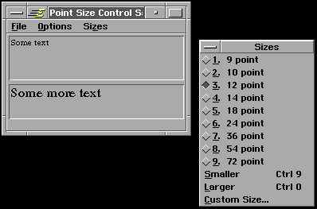
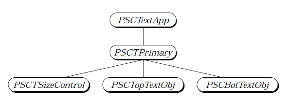
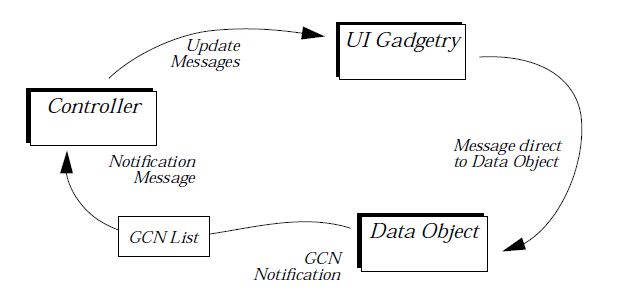
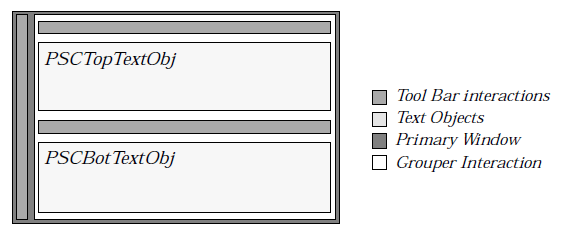
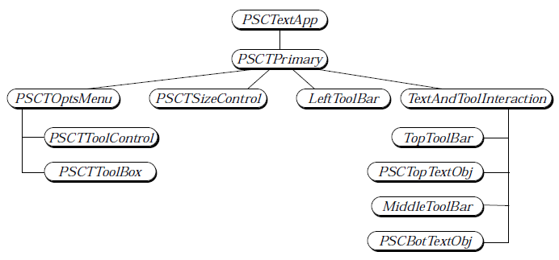

# 12 Generic UI Controllers
Many applications will create their menus and dialog boxes from scratch, 
using various GenInteraction and GenTrigger objects. Several system 
components, however, use a standard base format across all applications. For 
these components, GEOS provides a number of controller objects.

A controller object is one that provides UI gadgetry to control a certain set of 
features. For example, the GenViewControl object provides all the 
UI - including menus, dialogs, and tool bars, if appropriate - to alter a 
GenView's scaling and other features. Many libraries such as the text library 
provide controller objects that make the use of the library almost trivial.

To make inclusion of these controllers even easier, the UI offers a 
GenToolControl; this object provides all the functionality and UI gadgetry to 
allow the user to configure his own toolbars and menus from the tools 
provided by a controller.

Finally, developers writing libraries or suites of applications may wish to 
create their own controller classes. This is neither difficult nor complex, 
though it will be done primarily by programmers writing libraries for use by 
many applications.

This chapter describes what controllers are and how they work. It also 
discusses which controllers are available in the system, as well as the 
GenToolControl object and how it's used. Finally, it details how to create your 
own controller classes. In order to fully understand this chapter, you should 
be familiar first with the generic UI, menus and dialog boxes, and the 
General Change Notification mechanism.

## 12.1 Controller Features and Functions
Controller objects let you include a library's features in your applications 
with limited work. The controller provides the basic UI gadgetry and feature 
management functions so you don't have to.

Every library has a set of features that will be used by all or most of the 
library's users. For example, applications which use the text objects (GenText 
and VisText) are likely to allow the user to alter justification, font, and text 
style. Rather than forcing every application to create its own menus and 
dialogs and lists for managing these features, the text library exports a 
number of controllers that can be included in the application's UI; these 
controllers provide and manage the menu items and lists for the user. They 
also interact directly with the text objects to change the attributes affected.

### 12.1.1 Controller Features
Controller objects provide the following features and benefits to application 
and library programmers:

+ Ease of use  
Controllers are intended to be "plug-and-play" objects. Programmers 
simply include the controller to get all the appropriate UI gadgetry.

+ Consistency of appearance  
All applications that use a particular controller will appear consistent to 
the user. The controller knows the appropriate structure of its menus and 
dialogs, and all such controllers will appear the same to the user, 
increasing the application's ease of use.

+ Automatic tool management  
By using controllers along with a GenToolControl object, an application 
can allow the user to configure his own tool set. Controllers can have 
their UI placed along a display's edge, in the normal menus, or in a 
floating tool box; the GenToolControl allows users to decide where the 
tools will appear without affecting the application at all.

+ Extendability of features  
Any application that uses a controller can automatically include future 
features of a library. For example, if the GenView object were upgraded 
in the future to allow new features, the GenViewControl object would 
likely also be updated. Any application including the GenViewControl 
would automatically get the new UI and features without recompilation. 
Applications that do not use controllers will not automatically gain the 
benefits of upgraded libraries.

The GenControl is most useful for simple controllers. It is based on core UI 
objects (GenTrigger, GenInteraction, etc.) and is subclassed from 
**GenInteractionClass**. Applications that will have extremely complex 
controller-type functions may want to write their controllers from 
scratch - this is discussed in "Creating Your Own Controllers" below.

### 12.1.2 How Controllers Work
When you use a controller object, you are really using three different types of 
objects: The controller itself, the UI gadgetry it creates and manages, and the 
controlled object (sometimes called a "data item") it acts on. For the most 
part, you will not have to understand these relationships unless you are 
creating your own controllers with **GenControlClass**.

To explain how a controller works with both of these other objects, this 
section uses a simple application that uses a single controller. The controller 
used is a PointSizeControl object, exported by the text library and used with 
the GenText and VisText objects; in this example, it interacts with two 
GenText objects. The entire source code of the application's **psctext.goc** file 
is given in Code Display 12-1 below. This code display does not show 
the **psctext.gp** file because it is similar to Hello World's parameters file.

  
**Figure 12-1** *Sample Controller Application*  
*The Sizes menu is managed by the PointSizeControl object.*

A screen dump of the application is shown in Figure 12-1, and the entire 
object tree declared in the application is shown in Figure 12-2. The controller 
object (PSCTSizeControl) declares and sets up the entire menu structure of 
the Sizes menu, so the menu items do not need to be declared in the 
application's **.goc** file.

  
**Figure 12-2** *The psctext.goc Object Tree*  
*This application has five generic objects, two of which are text objects acting 
in concert with the Point Size Control.*

The interaction between the controller, the text objects, and the controller's 
UI objects is simple. When the controller is first loaded in from the 
application's Interface resource block, it also loads in the associated UI 
gadgetry for the Sizes menu. The menu items are added as children of the 
controller without the programmer having to do anything extra.

The data item objects (in this example the GenText objects), when loaded or 
created, create and set up special General Change Notification (GCN) lists. In 
the PSCText sample application, the text library sets up a GCN list for the 
notification type GAGCNLT_APP_TARGET_NOTIFY_CHAR_ATTR_CHANGE. 
When changes to the text object occur, the text object will send a message to 
this GCN list.

The controller object knows inherently which GCN lists it should be added to. 
When it is loaded, it adds itself to these lists. In the sample application, the 
PSCTSizeControl object will add itself automatically to the GCN list for 
GAGCNLT_APP_TARGET_NOTIFY_CHAR_ATTR_CHANGE.

The interactions between the three components are summarized in 
Figure 12-3. The application programmer needs to know very little about the 
interactions of these components; in fact, unless you are creating your own 
controller objects, you can get away with knowing only a very few things. 
Building your own controller is detailed in "Creating Your Own Controllers" 
below, and the basics of controller use, along with the source code for 
**psctext.goc**, are shown in "Using Controllers" below.

  
**Figure 12-3** *Controller Interactions*  
*When the user clicks an item in the UI gadgetry, that gadget sends a message 
(e.g. MSG_VIS_TEXT_SET_CHAR_ATTR) to the Data Object. When the Data 
Object changes, it notifies the appropriate GCN list, which notifies the 
controller. The controller then enables/disables the UI gadgetry.*

### 12.1.3 Using Controllers
As stated above, for an application to use a controller (or several controllers), 
the application programmer needs to know very little about the controller 
itself. Code Display 12-1 shows the *entire* code for the PSCText sample 
application; note that the programmer has to add no code (just object 
declarations) to create two editable text objects which can have selectable 
and settable point sizes.

The application programmer must do two essential things to use a controller 
object: First, you must include and set up the controller properly. In the 
example application, the PSCTSizeControl object is a menu; it could easily 
have been set up as GIV_DIALOG (typically, though, this particular controller 
is implemented as a menu). Because **GenControlClass** is a subclass of 
**GenInteractionClass**, you can set up the controller exactly like any other 
GenInteraction.

Second, you must set up your data objects to interact with the controller. The 
data objects should be written for this automatically; for example, the 
GenText objects automatically send the proper notification to the GCN 
mechanism to ensure that all appropriate controllers are notified of all 
changes. Note, however, that the GenText objects have to be set targetable 
before the controller can operate on them. Some data objects will be set up to 
work with their controllers automatically; others may need to have certain 
attributes set. The GenText objects, for example, are not by default 
targetable; the controller, however, sends its messages to the application's 
target object. If the GenTexts are not targetable, they will never gain the 
application's target and therefore will never react to the controller's requests.

To use a particular controller, you should learn about how that controller's 
data object needs to be set up. To help you with this, "Standard Controllers" 
below lists the various controllers included in the system and where 
they are documented.

----------
**Code Display 12-1 A Sample Controller Application (psctext.goc)**

    @include <stdapp.goh>
    @include <ui.goh>
    @include <Objects/Text/tCtrlC.goh>

    /* The PSCText application's process class runs the application's primary
     * thread. For a description of GenProcessClass, see Hello World. */

    @class PSCTextProcessClass, GenProcessClass;
    @endc
    @classdecl PSCTextProcessClass;

    @start AppResource;
    /* The PSCTextApp object defines the application object for the
     * application. For full information, see Hello World.
     * The controller is also placed on the application's self-load-options
     * GCN list to ensure that it loads its options properly when returning
     * from saved state. This is shown below in the second of the two
     * GCN list declarations. */
    @object GenApplicationClass PSCTextApp = {
        GI_visMoniker = "Point Size Control Sample Application";
        GI_comp = @PSCTPrimary;
        gcnList(MANUFACTURER_ID_GEOWORKS,GAGCNLT_WINDOWS) = @2PSCTPrimary;
        gcnList(MANUFACTURER_ID_GEOWORKS,GAGCNLT_SELF_LOAD_OPTIONS) = @PSCTSizeControl;
    }

    @end AppResource

    @start Interface;

    /* The PSCTPrimary object serves as the primary window of this sample application.
     * Its children are the Point Size Control object and the two GenText objects. */
    @object GenPrimaryClass PSCTPrimary = {
        GI_comp = @PSCTSizeControl, @PSCTopTextObj, @PSCBotTextObj;
        HINT_SIZE_WINDOW_AS_DESIRED;
        HINT_ORIENT_CHILDREN_VERTICALLY;
    }

    /* The PSCTSizeControl object is the controller that provides all the point size
     * functionality. It will automatically create a menu called "Sizes" (due to the
     * GI_visMoniker) and all the entries of that menu.
     * This controller will work on whichever of the two GenText objects
     * (PSCGTopTextObj and PSCBotTextObj) is set the target; the controller's UI
     * objects (the Sizes menu) send their messages directly to the target via the
     * TravelOption TO_TARGET. If a point size is selected as the user's first action,
     * it will work on PSCTopTextObj because that is set up as the default target. */
    @object PointSizeControlClass PSCTSizeControl = {
        GI_visMoniker = 'z', "Sizes";   /* Give the controller a name */
        GII_visibility = GIV_POPUP;     /* Make the controller a menu */
    }

    /* These two GenText objects are simple; they use only the defaults plus the
     * items shown here. Both must be set targetable (GA_TARGETABLE) to be included
     * in the target hierarchy; this is necessary when using controllers because of
     * the note in the above comment. The PSCTopTextObj is made the default focus
     * (to get keyboard input) and the default target (for controller operation). */
    @object GenTextClass PSCTopTextObj = {
        GI_attrs = @default | GA_TARGETABLE;
        /* Initially, this text object uses the VisTextDefaultSize VTDS_12
         * (12 pts) and the VisTextDefaultFont VTDF_URW_ROMAN. You can use
         * the PointSizeControl object to change this point size. */
        ATTR_GEN_TEXT_DEFAULT_CHAR_ATTR = ((VTDS_12 << VTDCA_SIZE_OFFSET) |
                                         VTDF_URW_ROMAN);
        /* Set the font mapping to none to turn off the defaults. */
        HINT_DEFAULT_FOCUS;
        HINT_DEFAULT_TARGET;
    }

    @object GenTextClass PSCBotTextObj = {
        GI_attrs = @default | GA_TARGETABLE;
        ATTR_GEN_TEXT_DEFAULT_CHAR_ATTR = ((VTDS_12 << VTDCA_SIZE_OFFSET) |
                                         VTDF_URW_ROMAN);
    }
    @end Interface

----------
## 12.2 Standard Controllers
This section lists the various controller classes exported by system objects 
and libraries. Many are part of the GEOS UI; others are part of particular 
libraries. Some are system-wide (such as the ColorSelectorClass); others are 
object-specific (such as the InkControllerClass).

All of these controllers are set up to work with **GenToolControlClass** and 
**GenToolGroupClass**. When a GenToolControl object is also included in an 
application, users may set up menus and floating toolboxes however they like 
with the various tools from the controller's lists. For more information on the 
GenToolControl and how it is used, see "Using Tools" and 
"GenToolControlClass" below.

+ **GenToolControlClass**  
This controller class provides the UI for the user to select where other 
controller tools appear. Controller tools must be specified by the 
individual controller classes; **GenToolControlClass** simply manages 
them according to the user's specifications. Individual tools may be 
placed in a floating tool box, in an application's tool bar, alongside the 
active display, alongside the primary display, or other places. 
GenToolControlClass is described in full in "Using Controllers" below.

+ **GenEditControlClass**  
This controller class provides the Edit menu with the Undo, Cut, Copy, 
Paste, Select All, and Delete triggers. This controller will cooperate fully 
with most system objects such as the text, graphic object, spreadsheet, 
and Ink objects. The GenEditControl sends out MSG_META_CUT, 
MSG_META_COPY, etc., to these objects. **GenEditControlClass** is 
described in "The Clipboard," Chapter 7 of the Concepts Book.

+ **GenViewControlClass**  
This controller class provides a View menu with the functions for 
changing a GenView's scale, paging, scrolling, aspect ratio, and other 
features. It is described in full in "GenView," Chapter 9.

+ **GenDisplayControlClass**  
This controller class provides the UI for a multiple display interface. It 
works with the GenDisplayGroup and GenDisplay objects and is 
described in full in "GenDisplay / GenPrimary," Chapter 4.

+ **GenDocumentControlClass**  
This controller class provides all the functions of the File menu including 
New, Open, Use Template, Close, Save, Save As, and Revert. It also 
interacts with the GenDocument and GenDocumentGroup objects to 
manage how the user interacts with documents in general. 
**GenDocumentControlClass** is described in full in "GenDocument," 
Chapter 13.

+ **GenPageControlClass**  
This controller class provides the UI for a user to go to a previous, next or 
specified page. It is described in full in "GenPageControlClass" below.

+ **PrintControlClass**, **PageSizeControlClass**  
Both of these controller classes are exported by the spool object library. 
Both are described in full in "The Spool Library," Chapter 17.

+ **ImportControlClass**, **ExportControlClass**  
These controller classes provide the UI and functions necessary for the 
user to select files for importing and exporting. They are exported by the 
Impex library are described in full in "Impex Library," Chapter 16.

+ **InkControlClass**  
This controller class provides the tool interface for working with 
Ink-related tools. It is exported by the pen library and is described in full 
in "Pen Object Library," Chapter 21.

+ **ColorSelectorClass**  
This controller class provides the UI for a user to set a color using either 
the palette index or a set of RGB values, to set a draw mask, and to set an 
area fill pattern. **ColorSelectorClass** is described in 
"ColorSelectorClass" below.

+ **StyleSheetControlClass**  
This controller class provides the UI and functions necessary for a user to 
define and change an application-specific style type and apply style 
changes. It works primarily with the Text library and graphic object 
library.

+ **FloatFormatClass**  
This controller class provides the UI and functions to allow the user to 
format numerical values into text (for example scientific notation, dates 
and times, etc.) This controller is described in "The Float Format 
Controller" below.

+ Various Text Controller Classes  
The text library exports a number of controllers that are specific to text 
operations. These classes are described in "The Text Objects," 
Chapter 10.

+ Various GrObj Controller Classes  
The graphic object library exports a number of controller classes that are 
specific to operations on and with the GrObj. These are all detailed in 
"Graphic Object Library," Chapter 18.  

+ Various Spreadsheet Controller Classes  
Several controller class provide UI and functions for the user to interact 
with the floating point library and the spreadsheet object. They are 
exported by the spreadsheet library and are documented in "Spreadsheet 
Objects," Chapter 20.

+ Various Ruler Controller Classes  
The ruler library exports a number of controllers that manage the user's 
interactions and control over the ruler objects. These controller classes 
include **RulerTypeControlClass**, **GuideCreateControlClass**, and 
**RulerGridControlClass**. They are described in full in "Ruler Object 
Library," Chapter 19.

## 12.3 Using Controllers
There are essentially two ways to use controller objects: The first, and the 
simplest, is to simply include an object of an existing controller class and the 
data object for which it's designed (e.g. using a PointSizeControl object with 
a GenText object). The second, and quite more complex, is to create either 
your own data objects or your own controllers.

This section describes the basic components of a controller object on the most 
general level - how to include a pre-existing controller along with its data 
object. For full information on how the **GenControlClass** works and how a 
data object interacts with it, see "Creating Your Own Controllers" below. This section focuses on how you can use a controller object; nearly all of 
this will be academic if you use a GenToolControl object in your application.

### 12.3.1 Using a Basic GenControl Object
To use a typical controller, you have to set up its instance data appropriately 
and set up the generic tree properly. This section describes the basics of 
**GenControlClass** instance data; for full information on **GenControlClass**, 
see section 12.4 below.

Every controller has a default set of features and a default set of tools. When 
you use a controller in your application, you can use the default 
configuration, the configuration appropriate to the application's user level, or 
a specific configuration. Most applications will want to use the second option; 
the controller queries the GenApplication object for its *GAI_appFeatures* 
record and determines from that which of its features and tools should be 
active.

Controllers can be manifested in any way the specific UI determines 
appropriate; three main ways, however, are menus or submenus, floating tool 
boxes (dialogs), and groupings along a tool bar in a window. These three 
modes correspond to the three manifestations of a typical GenInteraction 
object: GIV_POPUP (menus), GIV_DIALOG (dialogs and tool boxes), and 
GIV_SUB_GROUP (groupings of other generic objects). If you use a 
GenToolControl, you can let the user decide how the controller is displayed; 
otherwise, you will have to set it manually (as in the samples previously).

Every controller also has two sets of UI objects: The first set represents the 
UI objects used for menu entries (when the controller is in GIV_POPUP mode). 
The second set represents the tools that appear in a tool box (GIV_DIALOG 
mode) or tool bar (GIV_SUB_GROUP mode). Tools are almost always 
functionally redundant to the "menu" feature set. Because the tool and the 
menu UI resources contain different objects, the UI objects can exist in any 
combination of interactable states - for example, a particular feature could 
be in the menu only, in the tool box only, in both, or in neither. The feature 
can not, however, be in both a tool bar and a tool box at the same time because 
the set of tools can be grouped in only one location.

#### 12.3.1.1 Using Normal Features
    ATTR_GEN_CONTROL_REQUIRE_UI, ATTR_GEN_CONTROL_PROHIBIT_UI

**GenControlClass** has no controller features of its own; instead, each 
controller class must define the features it supports in both the menu 
implementation and the tool implementation. Any controller object is free to 
determine which of the features it will support and which it will not.

To set individual features on or off for a controller object in your application, 
use the vardata fields ATTR_GEN_CONTROL_REQUIRE_UI and 
ATTR_GEN_CONTROL_PROHIBIT_UI; these specify which features will be on 
and which will be off. For listings of a controller class' features, you must see 
the description of the individual class.

The example in Code Display 12-2 extends the example from earlier in the 
chapter to turn on only the 10-, 12-, and 24-point as well as the "Larger" and 
"Smaller" features. It turns off all other features.

----------
**Code Display 12-2 Declaring a Controller's Features**

    /* This example is based on that of Code Display 12-1. It shows what
     * would change in order to turn on only the 10-, 12-, and 24-point as well as the
     * "Larger" and "Smaller" features. Note that only the Controller object must
     * be altered. */

    @object PointSizeControlClass PSCTSizeControl = {
        GI_visMoniker = 'z', "Sizes";       /* Give the controller a name */
        GII_visibility = GIV_POPUP;         /* Make the controller a menu */
        /* The following attribute defines which of the controller's
         * features are to be supported. These menu items will appear
         * in the controller's Size menu. */
        ATTR_GEN_CONTROL_REQUIRE_UI = (PSCF_10 | PSCF_12 | PSCF_24 |
                PSCF_SMALLER | PSCF_LARGER);
        /* The following attribute defines which of the controller's
         * features will not be supported. These menu items will not
         * appear in the controller's Size menu. */
        ATTR_GEN_CONTROL_PROHIBIT_UI = (PSCF_14 | PSCF_18 | PSCF_36 | PSCF_54 |
                 PSCF_72 | PSCF_CUSTOM_SIZE);
    }

----------
#### 12.3.1.2 Adding Application-Specific UI Gadgetry
    ATTR_GEN_CONTROL_APP_UI, ATTR_GEN_CONTROL_APP_TOOLBOX_UI

Occasionally, an application will want to add its own UI gadgetry to a 
controller. This is not the same as changing the controller's functionality - to 
do that, you would need to subclass the controller class. Rather, this entails 
simply specifying a group of generic UI objects (e.g. a GenInteraction and 
some GenTriggers) that will be included with the controller's UI objects.

The **GenControlClass** vardata attribute ATTR_GEN_CONTROL_APP_UI 
allows you to specify a generic tree that will be added as a child of the 
controller. The top node of this tree must be an object that can be a child of a 
GenInteraction object - typically, it will be a GenInteraction, a GenTrigger, 
or a GenValue.

For example, if you wanted the sample application to have two extra triggers 
added to the Size menu, you would use ATTR_GEN_CONTROL_APP_UI as 
shown in Code Display 12-3. This example adds two triggers that turn the 
bottom GenText object on and off. (Of course, you would not likely put such 
functionality in the Size menu; this is given for illustration.)

This attribute has no effect on the tools managed by the controller, only on 
its features. To add application-specific tools to a controller, you must use 
ATTR_GEN_CONTROL_APP_TOOLBOX_UI.

----------
**Code Display 12-3 Adding UI to a Controller**

    /* This display shows the modified PointSizeControl object and the additional
     * UI gadgetry required to add two triggers to it. Although the triggers are
     * shown here in the same resource block as the controller, they do not have to
     * be. They do, however, have to be run by the same thread as the controller. */

    @object PointSizeControlClass PSCTSizeControl = {
        GI_visMoniker = 'z', "Sizes";   /* Give the controller a name */
        GII_visibility = GIV_POPUP;     /* Make the controller a menu */
        /* The following attribute specifies the top object of a generic
         * tree to be included with the controller's UI. This attribute does
         * not affect the toolbar implementation of the controller. */
        ATTR_GEN_CONTROL_APP_UI = (@PSCTSpecialTrigs);  /* must be an optr */
    }

    /* This GenInteraction and its children (the two GenTriggers) will be included in
     * the controller's default representation (typically a menu). The GenInteraction
     * will appear as a submenu in OSF/Motif. All of the objects must be set not
     * usable (~GS_USABLE); they will be made usable by the controller when it becomes
     * usable. */
    @object GenInteractionClass PSCTSpecialTrigs = {
        GI_comp = @PSCTEnableTrig, @PSCTDisableTrig;
        GI_states = @default & ~GS_USABLE;
        GII_visibility = GIV_POPUP;     /* Appear as a submenu-type item */
    }

    /* The triggers set the bottom GenText object usable or not usable. The instance
     * data of the triggers is unimportant for this example, but it is shown here
     * to complete the example. */
    @object GenTriggerClass PSCTEnableTrig = {
        GI_visMoniker = "Use Two Text Fields";
        GI_states = @default & ~GS_USABLE;
        GTI_actionMsg = MSG_GEN_SET_USABLE;
        GTI_destination = PSCBotTextObj;
        ATTR_GEN_TRIGGER_ACTION_DATA = (VUM_NOW);
    }

    @object GenTriggerClass PSCTDisableTrig = {
        GI_visMoniker = "Use One Text Field";
        GI_states = @default & ~GS_USABLE;
        GTI_actionMsg = MSG_GEN_SET_NOT_USABLE;
        GTI_destination = PSCBotTextObj;
        ATTR_GEN_TRIGGER_ACTION_DATA = (VUM_NOW);
    }

----------
### 12.3.2 Using Tools
    HINT_GEN_CONTROL_TOOLBOX_ONLY, 
    ATTR_GEN_CONTROL_REQUIRE_TOOLBOX_UI, 
    ATTR_GEN_CONTROL_PROHIBIT_TOOLBOX_UI, 
    ATTR_GEN_CONTROL_APP_TOOLBOX_UI

As stated earlier, any GenControl object can be manifested either as menus 
and menu items or as a set of tools. In fact, the controller can potentially have 
both its menu and its tools usable at once. Creating and using a toolbox or 
tool bar is a bit more complex than simply including the controller, however.

You can add the use of tool bars and tool boxes to your application in two 
ways: First, you can simply add a GenToolControl object and associated 
GenToolGroups and let them do all the work for you. Second, you can interact 
directly with the controller object(s) to put up, take down, and otherwise 
manage the tools. In nearly all cases, the first is preferable.

This section focuses on the use of a GenToolControl and GenToolGroup 
objects to manage and place your tools and toolboxes. If you want to manage 
tools without using a GenToolControl, you will have to know more about 
GenControlClass; see section 12.4 below for complete details.

#### 12.3.2.1 Components of Tool Management
Tools are most often represented by specific buttons or popup lists presented 
in various toolbars for easy use. They are functionally redundant to the menu 
features represented by the normal features of the controller, but the tools 
and menus can both be visible and usable at the same time.

To provide and manage tools, you need to understand the following 
components:

+ Controller  
The controller is the same GenControl subclass object discussed and 
shown in the previous sections. You can set minimum and maximum tool 
sets just like setting minimum and maximum feature set.

+ Tool Group  
Each controller object should have exactly one corresponding 
GenToolGroup object. The GenToolGroup manages the controller's tools 
and is, in turn, managed by the GenToolControl object (below).

+ Tool Controller  
You should have exactly one GenToolControl object; this object is a 
controller that allows the user to turn on and off individual tools and 
entire tool sets. It also controls placement of each tool group-which tool 
bar the tool group appears in.

+ Tool Bars and Tool Boxes  
You can have any number of tool bars and floating tool boxes. A tool bar 
or tool box is simply a GenInteraction set up properly and accessible by 
the user. Examples of tool bars are given in the next sections.

+ Data Tables  
Because the GenToolControl needs to describe both the tool bars and the 
tool groups to the user, you must set up special data chunks containing 
tables of names for each tool bar and tool group you use.

#### 12.3.2.2 Using a Basic Tool Box
The most basic tool configuration includes a floating tool box in which the 
controllers' tools appear. To use a tool box, you only need to define a toolbox 
GenInteraction, add a GenToolControl object, and put them both in a menu. 
Typically, this will be an "Options" menu.

  
**Figure 12-4** *A Tool Box*  
*The PointSizeControl tools have been placed in the floating tool box. The 
numbered tool is actually a popup list; the others are triggers.*

Code Display 12-4 shows the configuration required for providing a basic tool 
box as well as the controller's default menu. (You could prohibit the 
appearance of the menu by setting ATTR_GEN_CONTROL_TOOLBOX_ONLY in 
the controller's instance data.) This example provides all the tools by setting 
the application's UI level in the GenApplication object. All the tools will then 
appear in the toolbox and its associated popups as shown in Figure 12-4.

##### Setting Up the Tool Box
The tool box must be a GenInteraction object; for a floating tool box (as 
opposed to a tool bar), set it to be a dialog box (GIV_DIALOG). It should also 
have a moniker and HINT_TOOLBOX. The tool box must also be given a name. 
This name is used by the GenToolControl to identify the tool box. The name 
is set in a separate chunk and is a simple character string.

At startup, the GenToolGroup for the point size controller is set as a child of 
the floating tool box. The GenToolControl will move the GenToolGroup to 
other toolbars if possible; the tools must be set somewhere at startup, though, 
and the tool box is the logical starting point.

##### Setting Up the Tool Controller
The GenToolControl object will be of **GenToolControlClass**, as shown. It 
must at least have the *GTCI_toolboxList* field set to the chunk handle of a 
table of tool locations. In this example, the only location available to tools is 
in the floating tool box; other locations may be specified as detailed in "Tool 
Placement" below.

The table must appear in its own chunk in the same resource block as the 
GenToolControl object. It is an array of **ToolboxInfo** structures, each of 
which contains two optrs. The first is the optr of a tool location (typically a 
GenInteraction that may contain tools), and the second is the optr of the 
associated name. The structure of **ToolboxInfo** is shown below:

    typedef struct {
        optr    TI_object;      /* A GenInteraction that
                                 * can contain tools */
        optr    TI_name;        /* The name chunk of the
                                 * TI_object object */
    } ToolboxInfo;

The table is defined as shown in Code Display 12-4. If you had other 
controllers to be managed by the tool control, you would add other entries 
separated by commas.

The GenToolControl also has a tool group list indicating the name of each 
GenToolGroup. It is set up in a similar form to the tool box table.

----------
**Code Display 12-4 Providing a Basic Tool Box**

    /* This code display shows the entire psctext.goc file, with changes noted. All
     * unchanged code has had its comments stripped. For descriptions, see earlier
     * displays in this chapter. */

    @include <stdapp.goh>
    @include <ui.goh>
    @include <Objects/Text/tCtrlC.goh>

    @class  PSCTextProcessClass, GenProcessClass;
    @endc

    @classdecl PSCTextProcessClass, neverSaved;

    @start  AppResource;
    @object GenApplicationClass PSCTextApp = {
        GI_visMoniker = "Point Size Control Sample Application";
        GI_comp = @PSCTPrimary;
        gcnList(MANUFACTURER_ID_GEOWORKS, GAGCNLT_WINDOWS) = @PSCTPrimary;
        gcnList(MANUFACTURER_ID_GEOWORKS, GAGCNLT_SELF_LOAD_OPTIONS) =
                     @PSCTSizeControl, @PSCTToolControl;
    }

    @end    AppResource

    @start  Interface;

    /*  GenPrimary Object
     * Typically, an Options menu will be set up as a child of the Primary and
     * the tool box and tool control will be children of that menu. */
    @object GenPrimaryClass PSCTPrimary = {
        GI_comp =       @PSCTSizeControl, @PSCTopTextObj, @PSCBotTextObj, @PSCTOptionsMenu;
        HINT_SIZE_WINDOW_AS_DESIRED;
        HINT_ORIENT_CHILDREN_VERTICALLY;
    }

    /*  Options Menu
     * This menu is the parent for both the Tool Box and the tool controller. */
    @object GenInteractionClass PSCTOptMenu = {
        GI_comp = @PSCTToolBox, @PSCTToolControl;
        GII_visibility = GIV_POPUP;
        ATTR_GEN_INTERACTION_GROUP_TYPE = (GIGT_OPTIONS_MENU);
    }

    /*  Tool Box Location Table
     * The Tool Box Location Table is used by the GenToolControl object
     * to associate tool locations with their names. The table is an array
     * of ToolboxInfo structures. Multiple entries would be separated with
     * commas. */
    @chunk ToolboxInfo PSCTToolboxList[] = {
        {@PSCTToolBox, @PSCTToolBoxName}    /* The single tool location is the
                                 * floating tool box PSCTToolBox. */
    };

    /*  Tool Group Information Table
     * The Tool Group Information Table is used by the GenToolControl to associate
     * tool groups with their names. The table is an array of ToolGroupInfo structures.
     * Multiple entries would be separated with commas. */
    @chunk ToolGroupInfo PSCTToolGroupTable[] = {
        {@PSCTPointSizeToolGroup}
    };

    /*  Floating Tool Box
     * The Tool Box object is a GenInteraction dialog box. All toolboxes must
     * have HINT_TOOLBOX and may have any additional geometry hints you
     * deem necessary. Because every controller's GenToolGroup object must
     * be a child of some tool bar, the PSCTPointSizeToolGroup is set at
     * startup as a child of this floating toolbox. */
    @object GenInteractionClass PSCTToolBox = {
        GI_visMoniker = `T', "Tools";
        GI_comp = @PSCTPointSizeToolGroup;
        GII_visibility = GIV_DIALOG;
        HINT_TOOLBOX;
        HINT_ALLOW_CHILDREN_TO_WRAP;
        HINT_ORIENT_CHILDREN_HORIZONTALLY;
        HINT_FULL_JUSTIFY_CHILDREN_HORIZONTALLY;
    }

    /* The Tool Box Name must be specified for the tool control object. It
     * must be a character string, and there must be one for each entry in
     * the Tool Location table. */
    @chunk char PSCTToolBoxName[] = "Floating Tool Box";

    /*  GenToolControl Object
     * The Tool Control object must have just the GTCI_toolboxList and
     * GTCI_toolGroupList fields set; these contain lists of tool bars and
     * tool groups along with their names. */
    @object GenToolControlClass PSCTToolControl = {
        GTCI_toolboxList = @PSCTToolboxList;
        GTCI_toolGroupList = @PSCTToolGroupTable;
        HINT_SAME_CATEGORY_AS_PARENT;
    }

    /*  PointSizeControl            */
    @object PointSizeControlClass PSCTSizeControl = {
        GI_visMoniker = `z', "Sizes";
        GII_visibility = GIV_POPUP;
    }

    /*  GenToolGroup Object
     * Each controller object has exactly one GenToolGroup object for managing
     * its tools and for management by the GenToolControl. The Tool Group has
     * a single instance field specifying the controller for which it works. */
    @object GenToolGroupClass PSCTPointSizeToolGroup = {
        GTGI_controller = @PSCTSizeControl;
    }

    /*  GenText Objects         */
    @object GenTextClass PSCTopTextObj = {
        GI_attrs = @default | GA_TARGETABLE;
        HINT_DEFAULT_FOCUS;
        HINT_DEFAULT_TARGET;
        ATTR_GEN_TEXT_DEFAULT_CHAR_ATTR = ((VTDS_12 << VTDCA_SIZE_OFFSET) |
                            VTDF_URW_ROMAN);
    }

    @object GenTextClass PSCBotTextObj = {
        GI_attrs = @default | GA_TARGETABLE;
        ATTR_GEN_TEXT_DEFAULT_CHAR_ATTR =
                    ((VTDS_12 << VTDCA_SIZE_OFFSET) | VTDF_URW_ROMAN);
    }
    @end Interface

----------
#### 12.3.2.3 Tool Placement
Tools are movable; this means that controller tools can appear in any 
GenInteraction you may specify in the Tool Location Table. For example, you 
may want the user to be able to specify where she or he wants the tools to 
appear: in the floating tool box, at the top of the primary window, at the left 
of the display, or between the text objects. To support these locations for the 
tools, all you need to do is set up empty GenInteraction objects in the 
appropriate locations and add entries to the Tool Location Table.

  
**Figure 12-5** *Toolbars of the Sample Application*  
*Three tool bars in addition to the floating tool box are defined for the new 
configuration.*

The setup described above requires quite a few GenInteraction objects to be 
added to the application's generic tree. A line drawing of the geometry with 
all the empty GenInteractions is given in Figure 12-5, and the new generic 
tree of the application is shown in Figure 12-6.The code representing this 
configuration is shown in Code Display 12-5-pay particular attention to the 
Tool Location Table and to the fact that each GenInteraction must have the 
hint HINT_TOOLBOX set in order to receive the tools.

  
**Figure 12-6** *Modified psctext.geo Object Tree*  
*The Options Menu has two triggers, each of which brings up a dialog box. The 
TextAndToolInteraction object groups the other objects vertically.*

----------
**Code Display 12-5 Movable Tools**

    /* This code display builds on Code Display 12-4 on page u 804 to show how tools
     * may be moved around your application's window by the user. Although this is
     * not difficult to do from scratch, it is quite involved; if you want this
     * functionality, it is best to include a GenToolControl object.
     * This code display only shows those objects that are additional to or altered
     * from the previous display. */

    /*  GenPrimary Object
     * Two GenInteractions are made children of the Primary for geometry purposes.
     * The first, LeftToolBar, is actually a tool bar; the second,
     * TextAndToolInteraction, is a grouper interaction for geometry purposes. */
    @object GenPrimaryClass PSCTPrimary = {
    GI_comp = @LeftToolBar, @PSCTSizeControl, @PSCTOptionsMenu,
                    @TextAndToolInteraction;
    gcnList(MANUFACTURER_ID_GEOWORKS, GAGCNLT_SELF_LOAD_OPTIONS) =
                    @PSCTSizeControl, @PSCTToolControl;
    HINT_SIZE_WINDOW_AS_DESIRED;
    HINT_ORIENT_CHILDREN_HORIZONTALLY;
    }

    /*  Tool Location Table
     * The Tool Location Table is updated with the new tool box information. Each of
     * the new tool boxes is given a name, and each must appear in this table. 
     * Note that the ToolGroup Information Table does not change. */
    @chunk ToolboxInfo PSCTToolboxList[] = {
            {@PSCTToolBox, @PSCTToolBoxName},
            {@LeftToolBar, @LeftToolBarName},
            {@TopToolBar, @TopToolBarName},
            {@MiddleToolBar, @MiddleToolBarName}
    };

    /*  TextAndToolInteraction Interaction
     * This GenInteraction is used solely as a place holder grouping object to allow
     * the LeftToolBar object to extend the full height of the Primary window. */
    @object GenInteractionClass TextAndToolInteraction = {
        GI_comp = @TopToolBar, @PSCTopTextObj, @MiddleToolBar, @PSCBotTextObj;
        HINT_ORIENT_CHILDREN_VERTICALLY;
        HINT_EXPAND_WIDTH_TO_FIT_PARENT;
    }

    /*  New Tool Box Interactions
     * These GenInteraction objects are all tool boxes that appear in the Tool Location
     * Table. None actually has tools in it on startup; the tool controller allows the
     * user to place the tools of each active controller in any of these tool boxes. */
    @object GenInteractionClass LeftToolBar = {
        HINT_TOOLBOX;
        HINT_EXPAND_HEIGHT_TO_FIT_PARENT;
        HINT_ALLOW_CHILDREN_TO_WRAP;
        HINT_ORIENT_CHILDREN_VERTICALLY;
    }
    @chunk char LeftToolBarName[] = "Left of Text";

    @object GenInteractionClass TopToolBar = {
        HINT_TOOLBOX;
        HINT_EXPAND_WIDTH_TO_FIT_PARENT;
        HINT_ORIENT_CHILDREN_HORIZONTALLY;
        HINT_ALLOW_CHILDREN_TO_WRAP;
    }
    @chunk char TopToolBarName[] = "Above Text";

    @object GenInteractionClass MiddleToolBar = {
        HINT_TOOLBOX;
        HINT_EXPAND_WIDTH_TO_FIT_PARENT;
        HINT_ORIENT_CHILDREN_HORIZONTALLY;
        HINT_ALLOW_CHILDREN_TO_WRAP;
    }
    @chunk char MiddleToolBarName[] = "In Between Text";

----------
#### 12.3.2.4 Adding Application-Specific UI to the Tool Box
    ATTR_GEN_CONTROL_APP_TOOLBOX_UI

Occasionally an application may want to add some additional UI gadgetry to 
a set of controller tools. ATTR_GEN_CONTROL_APP_TOOLBOX_UI is 
analogous to ATTR_GEN_CONTROL_APP_UI, described in "Adding 
Application-Specific UI Gadgetry" above. This attribute specifies a 
generic object tree that can be attached to the controller's tools as if it were 
part of the controller normally. For an example of 
ATTR_GEN_CONTROL_APP_UI's use, see "Adding Application-Specific UI 
Gadgetry" above.

## 12.4 Creating Your Own Controllers
To create your own controller classes, you will have to subclass 
**GenControlClass** and handle certain messages and data structures. Most 
applications, however, will find that the controller classes provided with 
GEOS are adequate for their needs. Some library programmers may want to 
create their own controller classes.

**GenControlClass** is a subclass of **GenInteractionClass**. All instance 
data, hints, and messages appropriate for a GenInteraction are also 
appropriate for a GenControl object.

Typically, when you create your own controller, you will create a library in 
which the controller will reside. The controller may be in a library with a 
particular data object (e.g. **PointSizeControlClass** is part of the text 
library), or it may be in a library all by itself. For this discussion, the 
controller is considered to be part of a larger library.

The files of this library are

**psCtrl.gp** - The global parameters file for the controller's library. Only 
those portions of this file that pertain to the controller are 
discussed in this section.

**psCtrl.goh** - The header file containing the class definition of the controller 
class. This is separated from the class' code so the user of the 
controller can include the **.goh** file and thereby the controller.

**psCtrl.goc** - The code and resource file of the controller class. This file 
contains the UI objects and the methods of the controller.

All of these files are detailed throughout the following subsections. Each code 
display explains in which of these files it belongs.

### 12.4.1 GenControlClass Instance Data
**GenControlClass** has several instance data fields that determine the 
controller's features and supported tool set. These instance fields, along with 
the messages defined for the class, are shown in Code Display 12-6.

----------
**Code Display 12-6 GenControlClass Instance Data**

    /* GenControlClass has one static instance data field and several dynamic (vardata)
     * fields. These are shown below. */

    /* The GCI_output field contains the optr of the object to which
     * the controller is currently sending its "apply" messages. This
     * field is typically set to a GenTravelOption (such as TO_APP_TARGET)
     * or a TravelOption (such as TO_OBJ_BLOCK_OUTPUT). */
    @instance       optr    GCI_output;

    /* Controller class objects are set disabled by default. When the
     * controller is initialized, it will set itself enabled. */
    @default        GI_states = (@default & ~GS_ENABLED);

    /* the following attributes and hints determine the controller's
     * feature set. All of these hints and attributes are described in
     * "Using Controllers" on page 796. */
    @vardata void           HINT_GEN_CONTROL_TOOLBOX_ONLY;
    @vardata WordFlags      ATTR_GEN_CONTROL_REQUIRE_UI;
    @vardata WordFlags      ATTR_GEN_CONTROL_PROHIBIT_UI;
    @vardata WordFlags      ATTR_GEN_CONTROL_REQUIRE_TOOLBOX_UI;
    @vardata WordFlags      ATTR_GEN_CONTROL_PROHIBIT_TOOLBOX_UI;

    /* The following two attributes control additional UI gadgetry added to a
     * controller object. */
    @vardata optr           ATTR_GEN_CONTROL_APP_UI;
        @reloc  ATTR_GEN_CONTROL_APP_UI, 0, optr;
    @vardata optr           ATTR_GEN_CONTROL_APP_TOOLBOX_UI;
        @reloc  ATTR_GEN_CONTROL_APP_TOOLBOX_UI, 0, optr;

    /* The following two hints allow an application to specify the initial
     * state of a controller including its placement, features, and
     * additional UI objects. */
    @vardata GenControlUserData HINT_GEN_CONTROL_MODIFY_INITIAL_UI;
    @vardata GenControlUserData HINT_GEN_CONTROL_USER_MODIFIED_UI;

    /* The following temporary data field is used to determine the tool settings
     * for a controller's set of tools. */
    @vardata TempGenControlInstance TEMP_GEN_CONTROL_INSTANCE;

----------
In general, a controller class will not have to worry about the instance data 
fields in Code Display 12-6. Instead, it will handle a particular message, set 
up some UI resources, and rely on the functionality built into 
**GenControlClass**.

### 12.4.2 Subclassing GenControlClass
When creating your own controller, you must subclass **GenControlClass**. 
You must also follow the steps outlined below (each is described in more 
detail throughout this section):

1. Define the features and tool records  
You must define records and flags for the entire feature set and tool set 
of the controller. Each bit in one of these records corresponds to a single 
feature or tool of the controller; by turning these bits on and off, the 
controller manages which features and tools are available to the user. See 
"Defining a Controller's Feature and Tool Sets" below.

2. Define the default UI configuration  
Define a resource block containing the objects that will be the controller's 
default UI representation (typically a menu structure). See "Defining the 
Default UI and Tool Configurations" below.

3. Define the tool configuration  
Define a resource block containing generic UI objects that will make up 
the controller's tool set. See "Defining the Default UI and Tool 
Configurations" below.

4. Handle MSG_GEN_CONTROL_GET_INFO  
Every controller must handle this message and return critical 
information about the controller, its features, and its tools. This is the 
most involved step of creating a controller. See "Mandatory Message 
Handling" below.

5. Intercept appropriate GenControlClass messages  
Different controller classes will intercept different GenControlClass 
messages depending on how much additional functionality they require. 
Most controllers will intercept MSG_GEN_CONTROL_UPDATE_UI.

6. Define and handle controller-specific messages  
Some controllers will set up their features and tools so that the messages 
they generate require some translation. For example, if a controller has 
one feature that sets a value based on all the other values, that feature 
may send a "set" message to the controller, which will determine the 
appropriate value to set. The controller will then pass the result on to the 
output object.

#### 12.4.2.1 Defining a Controller's Feature and Tool Sets
Every controller must have a definition of all its features and tools. This 
definition typically resides in the controller class header file (in this case, 
**psCtrl.goh**). Applications that use the controller must be able to turn on and 
off individual tools and features. These definitions take the form of records in 
which each bit represents a particular feature or tool. No controller may have 
more than sixteen features or tools; the controller has just one word 
representing which features and tools are "on."

To define the feature set of your controller class, define a record type of type 
**WordFlags** and one flag for each feature. The record type you define may be 
named anything; typically, however, its name will consist of the acronym of 
the controller class with the suffix "Features." For example, the features type 
and flags of **PointSizeControlClass** are shown below:

    typedef WordFlags PSCFeatures;
    #define PSCF_10             0x0400
    #define PSCF_12             0x0200
    #define PSCF_14             0x0100
    #define PSCF_18             0x0080
    #define PSCF_24             0x0040
    #define PSCF_36             0x0020
    #define PSCF_54             0x0010
    #define PSCF_72             0x0008
    #define PSCF_SMALLER        0x0004
    #define PSCF_LARGER         0x0002
    #define PSCF_CUSTOM_SIZE    0x0001

Each of the flags represents one feature of the controller. For example, the 
PSCF_10 flag represents the "10 Point" trigger in the Sizes menu, and the 
PSCF_SMALLER flag represents the "Smaller" trigger. When a flag is set, the 
feature it represents is turned on; when clear, its feature is off.

Each controller class must create a similar record type and flags for its tool 
set. Because the tools are independent of the default features, two different 
sets of flags must be defined. An example (the PSCToolboxFeatures record 
of **PointSizeControlClass**) follows.

    typedef WordFlags PSCToolboxFeatures;
    #define PSCTF_9         0x0400
    #define PSCTF_10        0x0200
    #define PSCTF_12        0x0100
    #define PSCTF_14        0x0080
    #define PSCTF_18        0x0040
    #define PSCTF_24        0x0020
    #define PSCTF_36        0x0010
    #define PSCTF_54        0x0008
    #define PSCTF_72        0x0004
    #define PSCTF_SMALLER   0x0002
    #define PSCTF_LARGER    0x0001

After you have defined your controller class' feature and tool sets, you should 
define the controller's default feature and tool sets. The definitions for 
**PointSizeControlClass** are shown below:

    #define PSC_DEFAULT_FEATURES    (PSCF_9 | PSCF_10 |
            PSCF_12 | PSCF_14 | PSCF_18 | PSCF_24 |
            PSCF_36 | PSCF_72 | PSCF_CUSTOM_SIZE |
            PSCF_SMALLER | PSCF_LARGER)

    #define PSC_DEFAULT_TOOLBOX_FEATURES (PSCTF_9 |
            PSCTF_10 | PSCTF_12 | PSCTF_14 |
            PSCTF_18 | PSCTF_24 | PSCTF_36 |
            PSCTF_72 | PSCTF_SMALLER | PSCTF_LARGER)

These values and flags will be used in your handler for the controller message 
MSG_GEN_CONTROL_GET_INFO.

####12.4.2.2 Defining the Default UI and Tool Configurations
After you have determined which features and tools your controller class will 
support, you must create the UI objects that correspond to them. To do this, 
declare two separate resource segments - one to contain the feature objects 
and the other to contain the tool objects. Then declare a third that contains 
just chunks with text strings in it.

Both resources should be defined notDetachable, meaning that the feature 
and tool objects will not be saved to a state file. In the global parameters file 
for your controller, each resource must be declared with the *ui-object*, 
*read-only*, and *shared* flags as below:

    resource SIZECTRLUI ui-object read-only shared
    resource SIZECTRLTOOLUI ui-object read-only shared
    resource CONTROLSTRINGS lmem read-only shared

The UI resources typically contain list objects and their corresponding items. 
As an alternative, they can contain triggers and dialogs. These objects are 
declared as a standard object resource with generic objects, as shown in Code 
Display 12-7. All these objects must be set not usable (~GS_USABLE).

----------
**Code Display 12-7 Controller UI Resources**

    /* This display contains only code that appears in the psCtrl.goc file. The first
     * elements of the file are other included files, followed by a class declaration
     * statement. The two UI resources are shown after that, simplified somewhat;
     * Only redundant objects are left out of the display. */

    /* Include the controller class definition and declare the class structure. */
    @include <psCtrl.goh>
    @classdecl PointSizeControlClass;

    @start  SizeCtrlUI, notDetachable;

    /* Define the features UI resource. This resource can contain any objects that may
     * typically appear in a menu (e.g. GenInteractions, GenTriggers, and list
     * objects). This example shows a single list object and a few of its entries. */
    @object GenItemGroupClass SizesList = {
        GI_states = @default & ~GS_USABLE;      /* Set the list not usable */
        /* The children of the list are defined below. Each entry in the
         * list will appear as a single menu item. */
        GI_comp = @Size10Entry, @Size12Entry, @Size14Entry, @Size18Entry,
                @Size24Entry, @Size36Entry, @Size54Entry, @Size72Entry;
        /* The "apply" message will be sent to the destination specified
         * in the GIGI_destination field. */
        GIGI_applyMsg = MSG_PSC_SET_POINT_SIZE_FROM_LIST;
        /* The destination is defined as the TravelOption TO_OBJ_BLOCK_OUTPUT.
         * This will send the apply message to the controller's output object. */
        GIGI_destination = (TO_OBJ_BLOCK_OUTPUT);
    }

    /* An example of a GenItem for the above list. all the other children are similar
     * with different monikers and identifiers. The identifiers in this case are
     * equivalent to the point size setting for the feature. */
    @object GenItemClass Size10Entry = {
        GI_visMoniker = `1', "1. 10 point";
        GII_identifier = 10;
    }

    /* A GenTrigger. Shown below is the "Smaller" menu entry of the Point Size
     * controller. Another trigger ("Larger") and a GenInteraction (the "Custom
     * Size" entry) are also declared. These objects do not have to be declared
     * as children of any object; they will automatically, like the list above,
     * be designated as children of the controller when it is initialized.
     * Note that all of these objects must also be set not usable. */
    @object GenTriggerClass SmallerTrigger = {
        GI_states = @default & ~GS_USABLE;
        GI_visMoniker = `S', "Smaller";
        GI_kbdAccelerator = control `9';
        GTI_actionMsg = MSG_PSC_SMALLER_POINT_SIZE;
        GTI_destination = (TO_OBJ_BLOCK_OUTPUT);
    }

    @end    SizeCtrlUI

    /* Define the Tools UI resource. This follows exactly the same rules as the
     * Features UI resource above, but it represents the UI gadgetry that will appear
     * in the controller's tool boxes rather than its default menus. */

    @start  SizeCtrlToolUI, notDetachable;

    @object GenItemGroupClass SizesToolList = {
        /* Same as SizesList above, but with the following hints applied: */
        HINT_ITEM_GROUP_MINIMIZE_SIZE;
        HINT_ITEM_GROUP_DISPLAY_CURRENT_SELECTION;
    }

    /* The list entry items have the exact configuration as above but different
     * names that reflect their tool usage.
     * The only objects allowed as tools for the Point Size controller are the
     * point size list entries, the larger trigger, and the smaller trigger. The
     * "Custom Size" entry is not allowed in the tool box as a matter of style. */
    @object GenTriggerClass SmallerToolTrigger = {
        GI_states = @default & ~GS_USABLE;
        GI_visMoniker = "S";
        /* The moniker of a tool is typically a graphic. The moniker
         * specified here is text for simplicity. */
        GTI_actionMsg = MSG_PSC_SMALLER_POINT_SIZE;
        GTI_destination = TO_OBJ_BLOCK_OUTPUT;
    }

    @end    SizeCtrlToolUI

    @start  ControlStrings;

    /* In addition to the above two resources, you must also create a third that
     * contains name strings for the various tools and features. These name strings
     * will be used by the GenToolControl to identify the feature type in its
     * dialog box. */
    @chunk char     PSCName[] = "Point Size";
    @chunk char     Size10Name[] = "10 Point";
    @chunk char     Size12Name[] = "12 Point";
    /* The rest of the point sizes are similar */
    @chunk char     SmallerName[] = "Smaller Point Size";
    @chunk char     LargerName[] = "Larger Point Size";
    @chunk char     CustomSizeName[] = "Custom Point Size";

    @end    ControlStrings

----------
#### 12.4.2.3 Mandatory Message Handling
    MSG_GEN_CONTROL_GET_INFO, GenControlBuildInfo

Every controller must handle MSG_GEN_CONTROL_GET_INFO. This 
message is sent to the controller in several circumstances, and it must return 
critical information about the controller's state and configuration. It takes a 
pointer to an empty **GenControlBuildInfo** structure and must fill in all the 
structure's fields before returning. This structure is shown in Code 
Display 12-9 with a description of each of its fields following.

----------
**Code Display 12-8 The GenControlBuildInfo Structure**

    /* This structure must be filled and returned by the controller class. It details
     * general information as well as specific information about the controller, the
     * controller's features, and the controller's tools. */

    typedef struct {
        GenControlBuildFlags            GCBI_flags;
        const char                      *GCBI_initFileKey;
        const GCNListType               *GCBI_gcnList;
        word                            GCBI_gcnCount;
        const NotificationType          *GCBI_notificationList;
        word                            GCBI_notificationCount;
        optr                            GCBI_controllerName;

        MemHandle                       GCBI_dupBlock;
        const GenControlChildInfo       *GCBI_childList;
        word                            GCBI_childCount;
        const GenControlFeaturesInfo    *GCBI_featuresList;
        word                            GCBI_featuresCount;
        WordFlags                       GCBI_features;

        MemHandle                       GCBI_toolBlock;
        const GenControlChildInfo       *GCBI_toolList;
        word                            GCBI_toolCount;
        const GenControlFeaturesInfo                *GCBI_toolFeaturesList;
        word                            GCBI_toolFeaturesCount;
        WordFlags                       GCBI_toolFeatures;

        char                            *GCBI_helpContext;
        byte                            GCBI_reserved[8];
    } GenControlBuildInfo;

----------
The following fields define general information about the controller.

*GCBI_flags* - A record of **GenControlBuildFlags**. These flags affect several 
UI-related and object storage related functions, and they are 
detailed below.

*GCBI_initFileKey* - A pointer to a text string indicating the controller's key in the 
GEOS.INI file. Controller options will be saved under this key.

*GCBI_gcnList* - A pointer to a list of GCN list types. Objects of this controller 
class will be added to these GCN lists and will receive 
notification from them. GCN lists are detailed in "General 
Change Notification," Chapter 9 of the Concepts Book.

*GCBI_gcnCount* - The size of the list pointed to by *GCBI_gcnList* above. This size 
should be *sizeof(GCNListType)* times the number of lists 
specified.

*GCBI_notificationList* - A pointer to a list of notification types supported by the 
controller.

*GCBI_notificationCount* - The size of the list pointed to by *GCBI_notificationList* above.

*GCBI_controllerName* - The optr of a chunk containing the text string that serves as the 
controller's name. This name string is displayed by the 
GenToolControl in its dialog box to identify the controller.

The following fields define information about the controller's features. These 
fields will be filled dependent on the features set in the object's instance data 
and the UI level of the controller.

*GCBI_dupBlock* - The handle of the resource block containing the controller's 
feature generic objects. In the example, this would contain the 
handle of the *SizeCtrlUI* resource.

*GCBI_childList* - A pointer to a list of **GenControlChildInfo** structures; each of 
these structures details which features are set and which 
should always be set for each of the controller's children. This 
structure is shown below:

    typedef struct {
        ChunkHandle         GCCI_object;
        WordFlags           GCCI_featureMask;
        GenControlChildFlags GCCI_flags;
    } GenControlChildInfo;

Each structure contains the chunk handle of the given child in 
the resource block, a feature mask indicating which features 
are possibly supported by the child, and a record indicating 
whether the child is a feature or not and whether the child is 
always added to the controller's UI. More specific information 
is shown below.

*GCBI_childCount* - The number of children specified in *GCBI_childList* above.

*GCBI_featuresList* - A pointer to a list of GenControlFeaturesInfo structures, 
one for each child. These structures define the following:

    typedef struct {
        ChunkHandle         GCFI_object;
        optr                GCFI_name;
        GenControlFeatureFlags GCFI_flags;
    } GenControlFeaturesInfo;

The three fields are the chunk handle of the child; the optr of 
the child's name string, as defined in the name string resource; 
and a record of **GenControlFeatureFlags**. This structure 
and its fields are described more fully below.

GCBI_featuresCount - The number of **GenControlFeaturesInfo** structures listed in 
*GCBI_featuresList* above.

GCBI_features - A features mask describing the features supported by the 
current UI level as specified in the GenApplication's 
*GAI_appFeatures* field.

The following fields describe information about the controller's tools and 
their configuration.

*GCBI_toolBlock* - 
The handle of the resource block containing the controller's tool 
generic objects. In the example, this would contain the handle 
of the *SizeCtrlToolUI* resource.

*GCBI_toolList* - A pointer to a list of **GenControlChildInfo** structures; each of 
these structures details which tools are set and which should 
always be set for each of the controller's children. This 
structure is shown below:

    typedef struct {
        ChunkHandle         GCCI_object;
        WordFlags           GCCI_featureMask;
        GenControlChildFlags GCCI_flags;
    } GenControlChildInfo;

Each structure contains the chunk handle of the given child in 
the resource block, a feature mask indicating which tools are 
possibly supported by the child, and a record indicating 
whether the child is a tool or not (e.g. a list) and whether the 
child is always added to the controller's tool box UI. More 
specific information is shown below.

*GCBI_toolCount* - The number of children specified in *GCBI_toolList* above.

*GCBI_toolFeaturesList* - A pointer to a list of **GenControlFeaturesInfo** structures, 
one for each child. These structures define the following:

    typedef struct {
        ChunkHandle         GCFI_object;
        optr            GCFI_name;
        byte            GCFI_flags;
                /* GenControlFeatureFlags */
    } GenControlFeaturesInfo;

The three fields are the chunk handle of the child; the optr of 
the child's name string, as defined in the name string resource; 
and a record of **GenControlFeatureFlags**. This structure 
and its fields are described more fully below.

*GCBI_toolFeaturesCount* - The number of **GenControlFeaturesInfo** structures in the 
list pointed to by *GCBI_toolFeaturesList* above.

*GCBI_toolFeatures* - A tools mask describing the tools supported for the UI level 
specified in the GenApplication's *GAI_appFeatures* field.

The following field is used by controllers that offer their own help files and 
help text.

*GCBI_helpContext* - A pointer to a character string giving the name of the 
controller's help context. If this is a non-null pointer, then the 
controller will automatically add ATTR_GEN_HELP_CONTEXT 
to itself with the specified string.

The structure also has eight bytes that are reserved for the use of 
GenControlClass, in the *GCBI_reserved* field.

##### GenControlBuildFlags
This flags record defines several UI-related things about the controller object. 
Set them appropriate to your controller. The flags are

GCBF_SUSPEND_ON_APPLY  
Causes MSG_META_SUSPEND to be sent on feature activation 
and MSG_META_UNSUSPEND afterward. This is often set by 
controllers.

GCBF_USE_GEN_DESTROY  
Ensures that unused objects can not be freed with 
**LMemFree()**. Not often set by controllers.

GCBF_SPECIFIC_UI  
Indicates that the controller may be implemented in the 
specific UI and therefore some special action must be taken. 
Very rarely set by controllers.

GCBF_CUSTOM_ENABLE_DISABLE  
Indicates that the controller uses a custom enable/disable 
mechanism rather than responding to GCN notifications.

GCBF_ALWAYS_UPDATE  
Indicates that the controller should always undergo visual 
updates even if it appears unnecessary. Not often set by 
controllers.

GCBF_EXPAND_TOOL_WIDTH_TO_FIT_PARENT  
Indicates that the tool width should be expanded to take full 
advantage of all the space available in the parent composite.

GCBF_ALWAYS_INTERACTABL  E
Indicates that the controller should always be on its 
appropriate GCN lists, even if no part of it is visible. This flag 
requires GCBF_IS_ON_ACTIVE_LIST.

GCBF_ALWAYS_ON_GCN_LIST  
Indicates that the controller should constantly be on the GCN 
lists rather than periodically adding and removing itself as is 
done in some optimization code. Not often set by controllers. 
This flag requires GCBF_IS_ON_ACTIVE_LIST.

GCBF_MANUALLY_REMOVE_FROM_ACTIVE_LIST  
Indicates that the controller should not remove itself from the 
active list in its default detach handler.

GCBF_IS_ON_ACTIVE_LIST  
Indicates that the controller is on the active list in its **.goh** file 
definition.

GCBF_IS_ON_START_LOAD_OPTIONS_LIST  
Indicates this controller must be on the startup load options 
list.

GCBF_NOT_REQUIRED_TO_BE_ON_SELF_LOAD_OPTIONS_LIST  
Indicates this controller is not required to be on any 
options-load list.

##### GenControlChildInfo
The **GenControlChildInfo** structure defines the features or tools 
appropriate to each object in a controller's UI resources. It has the following 
structure, and its fields are described below:

    typedef struct {
        ChunkHandle             GCCI_object;
        WordFlags               GCCI_featureMask;
        GenControlChildFlags    GCCI_flags;
    } GenControlChildInfo;

*GCCI_object* - The chunk handle of the object in the appropriate resource.

*GCCI_featureMask* - The feature mask representing the feature set represented by 
the object.

*GCCI_flags* - A record of GenControlChildFlags, the flags of which are 
described below.

The **GenControlChildFlags** flags are

GCCF_NOTIFY_WHEN_ADDING  
This flag indicates that the child will be notified before the 
feature is added and set usable with 
MSG_GEN_CONTROL_NOTIFY_ADDING_FEATURE.

GCCF_ALWAYS_ADD  
This flag indicates that the child object should always be added 
to the controller's UI, even if it is not specified.

GCCF_IS_DIRECTLY_A_FEATURE  
This flag indicates that the child is a feature in itself and thus 
on the feature list. This is typically set for most objects. (It is 
not set, for example, for list objects, whose children are the 
actual features.)

##### GenControlFeaturesInfo
The **GenControlFeaturesInfo** structure describes each UI feature's name 
and certain flags. The structure is defined below, and its fields are described 
following:

    typedef struct {
        ChunkHandle             GCFI_object;
        optr                    GCFI_name;
        GenControlFeatureFlags  GCFI_flags;
    } GenControlFeaturesInfo;

*GCFI_object* - The chunk handle of the child in the appropriate resource 
block.

*GCFI_name* - The optr of the chunk containing the object's name. This name 
is used by the GenToolControl to represent the particular 
feature or tool in its dialog box.

*GCFI_flags* - A record of **GenControlFeatureFlags**, reserved.

----------
#### MSG_GEN_CONTROL_GET_INFO
    void    MSG_GEN_CONTROL_GET_INFO(
            GenControlBuildInfo *info);

This message must be handled by all controllers. It takes an empty 
**GenControlBuildInfo** structure and fills it; this message is called in 
several circumstances by different objects and controller methods.

**Source:** Unrestricted-typically generated in **GenControlClass** methods.

**Destination:** Any controller object.

**Parameters:**  
*info* - A pointer to an empty **GenControlBuildInfo** 
structure.

**Return:** The **GenControlBuildInfo** structure filled with the appropriate 
controller information.

**Interception:** Every controller class *must* intercept this message. There is no need to 
call the superclass anywhere in the handler.

----------
**Code Display 12-9 MSG_GEN_CONTROL_GET_INFO Handler**

    /* This method is a sample of how to handle MSG_GEN_CONTROL_GET_INFO. It is
     * specific to UICTextStyleControlClass. To handle this message, it is easiest to
     * set up a number of static local variables with the base information and set
     * the structure to these variables. */

    /* Handler for MSG_GEN_CONTROL_GET_INFO
     * void (GenControlBuildInfo *info);                    */

    @method UICTextStyleControlClass, MSG_GEN_CONTROL_GET_INFO {

        /* General information constants */
        static const char TSC_IniFileKey[] = "textStyleControl";
        static const GCNListType TSC_gcnList[] = {
            {MANUFACTURER_ID_GEOWORKS, GAGCNLT_APP_TARGET_NOTIFY_TEXT_CHAR_ATTR_CHANGE}
        }; 

        static const NotificationType TSC_notifyTypeList[] = {
            {MANUFACTURER_ID_GEOWORKS, GWNT_TEXT_CHAR_ATTR_CHANGE}
        };

        /* Features information constants */
        static const GenControlChildInfo TSC_childList[] = {
        {@PlainTextList, TSCF_PLAIN, GCCF_IS_DIRECTLY_A_FEATURE},
        {@TextStyleList, TSCF_BOLD|TSCF_ITALIC|TSCF_UNDERLINE|TSCF_STRIKE_THRU| 
        TSCF_SUBSCRIPT|TSCF_SUPERSCRIPT, 0}
        };

        /* The order of this list is actually backwards from the
         * record it reflects. */
        static const GenControlFeaturesInfo TSC_featuresList[] = {
            {@SuperscriptEntry, @SuperscriptName, 0},
            {@SubscriptEntry, @SubscriptName, 0},
            {@StrikeThruEntry, @StrikeThruName, 0},
            {@UnderlineEntry, @UnderlineName, 0},
            {@ItalicEntry, @ItalicName, 0},
            {@BoldEntry, @BoldName, 0},
            {@PlainTextList, @PlainTextName, 0}
        };

        /* Tools information constants */
        static const GenControlChildInfo TSC_toolList[] = {
            {@PlainTextToolList, TSCTF_PLAIN, GCCF_IS_DIRECTLY_A_FEATURE},
            {@TextStyleToolList, TSCTF_BOLD|TSCTF_ITALIC|TSCTF_UNDERLINE|
            TSCTF_STRIKE_THRU|TSCTF_SUBSCRIPT|TSCTF_SUPERSCRIPT, 0} };
        };

        static const GenControlFeaturesInfo TSC_toolFeaturesList[] = {
            {@SuperscriptToolEntry, @SuperscriptName, 0},
            {@SubscriptToolEntry, @SubscriptName, 0},
            {@StrikeThruToolEntry, @StrikeThruName, 0},
            {@UnderlineToolEntry, @UnderlineName, 0},
            {@ItalicToolEntry, @ItalicName, 0},
            {@BoldToolEntry, @BoldName, 0},
            {@PlainTextToolList, @PlainTextName, 0}
        };

        /* Our constant for the GenControlBuildInfo structure.
         * Fields with a marker to the left of their names are
         * filled in dynamically by the handler following the
         * constant definition. */
        static const GenControlBuildInfo TSC_dupInfo = {
            GCBF_SUSPEND_ON_APPLY,          /* GCBI_flags */
            TSC_IniFileKey,                 /* GCBI_initFileKey */
            TSC_gcnList,                    /* GCBI_gcnList */
            ARRAY_LEN(TSC_gcnList,GCNListType), /* GCBI_gcnCount */
            TSC_notifyTypeList,             /* GCBI_notificationList */
            ARRAY_LEN(TSC_notifyTypeList, NotificationType), 
                                            /* GCBI_notificationCount */
            @TSCName,                       /* GCBI_controllerName */ 

            /* ## */ NullHandle,            /* GCBI_dupBlock */
            TSC_childList,                  /* GCBI_childList */
            ARRAY_LEN(TSC_childList, GenControlChildInfo),
                            /* GCBI_childCount */
            TSC_featuresList,               /* GCBI_featuresList */
            ARRAY_LEN(TSC_featuresList, GenControlFeaturesInfo),
                            /* GCBI_featuresCount */
            TSC_DEFAULT_FEATURES,           /* GCBI_features */
            /* ## */ NullHandle,            /* GCBI_toolBlock */
            TSC_toolList,                   /* GCBI_toolList */
            ARRAY_LEN(TSC_toolList, GenControlChildInfo),
                            /* GCBI_toolCount */
            TSC_toolFeaturesList,           /* GCBI_toolFeaturesList */
            ARRAY_LEN(TSC_toolFeaturesList, GenControlFeaturesInfo),
                            /* GCBI_toolFeaturesCount */
            TSC_DEFAULT_TOOLBOX_FEATURES    /* GCBI_toolFeatures */
        };

        /* Here is the code that fills in the above missing fields and
         * returns the proper structure. */

        /* Copy the structure containing most of the correct information. */
        memcpy(info, MemLockFixedOrMovable(&TSC_dupInfo), sizeof(GenControlBuildInfo));
        MemUnlockFixedOrMovable(&TSC_dupInfo);

        /* Fill the remaining fields in manually. */
        info->GCBI_dupBlock = HandleOf(@PlainTextList);
        info->GCBI_toolBlock = HandleOf(@PlainTextToolList); 
    }

----------
### 12.4.3 Advanced GenControlClass Usage
Everything you need to create a basic custom controller class is detailed in 
the previous sections. **GenControlClass**, however, has a number of 
messages and structures that will be used by some subclasses, though this 
will be relatively rare. This section details these messages and structures.

#### 12.4.3.1 Adding and Removing UI Gadgetry
    MSG_GEN_CONTROL_GENERATE_UI, MSG_GEN_CONTROL_DESTROY_UI, 
    MSG_GEN_CONTROL_GENERATE_TOOLBOX_UI, 
    MSG_GEN_CONTROL_DESTROY_TOOLBOX_UI, 
    MSG_GEN_CONTROL_UPDATE_UI, 
    MSG_GEN_CONTROL_ENABLE_DISABLE, 
    MSG_GEN_CONTROL_ADD_APP_UI, 
    MSG_GEN_CONTROL_ADD_APP_TOOLBOX_UI, 
    MSG_GEN_CONTROL_REBUILD_NORMAL_UI, 
    MSG_GEN_CONTROL_REBUILD_TOOLBOX_UI

**GenControlClass** has several messages that add, remove, and manipulate 
the controller UI gadgetry. Keep in mind also that, as a subclass of 
**GenInteractionClass** and thereby of **GenClass**, the GenControl also can 
use any of the generic UI messages for object tree manipulation. These 
messages are detailed in the following list.

----------
#### MSG_GEN_CONTROL_GENERATE_UI
    void    MSG_GEN_CONTROL_GENERATE_UI();

This message generates the UI gadgetry for the controller.

**Source:** Unrestricted - sent by self as part of specific UI build.

**Destination:** Any GenControl object

**Interception:** If subclassed to add functionality, the subclass must call the superclass 
at the beginning of the handler.

**Warnings:** If you intercept this message, you should also intercept 
MSG_GEN_CONTROL_DESTROY_UI, below.

----------
#### MSG_GEN_CONTROL_DESTROY_UI
    void    MSG_GEN_CONTROL_DESTROY_UI();

This message destroys the UI gadgetry for the controller.

**Source:** Unrestricted-sent by self when being taken off the screen.

**Destination:** Any GenControl object

**Interception:** Any subclass that intercepts MSG_GEN_CONTROL_GENERATE_UI 
must intercept this. The subclass must call the superclass at the end of 
the handler.

----------
#### MSG_GEN_CONTROL_GENERATE_TOOLBOX_UI
    void    MSG_GEN_CONTROL_GENERATE_TOOLBOX_UI(
            optr    parent);

This message generates the UI gadgetry for the controller's tool box.

**Source:** Sent by tool box object via the active list as part of its specific UI build 
mechanism.

**Destination:** The GenControl object that owns the tool box.

**Parameters:**  
*parent* - The optr of GenInteraction that will be the parent 
of the controller's tools.

**Return:** Nothing.

**Interception:** A subclass may intercept this to add UI gadgetry to the toolbox when 
the toolbox is built. The subclass must call the superclass at the 
beginning of the handler.

**Warnings:** Any controller that subclasses this message must also subclass 
MSG_GEN_CONTROL_DESTROY_TOOLBOX_UI as well.

----------
#### MSG_GEN_CONTROL_DESTROY_TOOLBOX_UI
    void    MSG_GEN_CONTROL_DESTROY_TOOLBOX_UI();

This message destroys all toolbox UI associated with the controller.

**Source:** Sent by the tool box being destroyed as part of its specific UI 
destruction mechanism.

**Destination:** The GenControl object that owns the tool box.

**Interception:** Any controller class that subclasses the message 
MSG_GEN_CONTROL_GENERATE_TOOLBOX_UI must also subclass 
this message. The subclass must call its superclass at the end of its 
handler.

----------
#### MSG_GEN_CONTROL_UPDATE_UI
    void    MSG_GEN_CONTROL_UPDATE_UI(@stack
            MemHandle       toolBlock,
            MemHandle       childBlock,
            WordFlags       toolboxFeatures,
            WordFlags       features,
            MemHandle       data,
            word            changeID,
            ManufacturerID  manufID);

This message updates all UI components for the recipient controller.

**Source:** Sent by **GenControlClass** in its default handler for 
MSG_META_NOTIFY_WITH_DATA_BLOCK.

**Destination:** The GenControl object being updated.

**Parameters:**  
*toolBlock* - Handle of the object resource block containing the 
controller's tool UI gadgetry.

*childBlock* - Handle of the object resource block containing the 
controller's default UI gadgetry. This may be taken 
from the TEMP_GEN_CONTROL_INSTANCE 
vardata field.

*toolboxFeatures* - A record of flags indicating which tools are 
currently on for the controller. This may be taken 
from the TEMP_GEN_CONTROL_INSTANCE 
vardata field.

*features* - A record of flags indicating which features are 
currently on for the controller. This may be taken 
from the TEMP_GEN_CONTROL_INSTANCE 
vardata field.

*data* - The data block handle passed with the notification 
message.

*changeID* - The type of update to undergo, as passed with the 
notification message.

*manufID* - The manufacturer ID of the notification type passed 
with the notification message.

**Interception:** Controllers should intercept this message in order to properly update 
their UI gadgetry. There is no default handler for this message.

**Structures:** The TEMP_GEN_CONTROL_INSTANCE vardata field is of type 
*TempGenControlInstance*, which has the following structure:

    typedef struct {
        GenControlInteractableFlags
                            TGCI_interactableFlags;
        MemHandle           TGCI_childBlock;
        MemHandle           TGCI_toolBlock;
        optr                TGCI_toolParent;
        WordFlags           TGCI_features;
        WordFlags           TGCI_toolboxFeatures;
        GCNListType         TGCI_activeNotificationList;
        GenControlInteractableFlags TGCI_upToDate;
    } TempGenControlInstance;

*TGCI_interactableFlags*  
This record describes which, if any, of a controller's UI parts is 
interactable (visible and usable). Its flags are listed below.

*TGCI_childBlock*  
The handle of the resource block containing the controller's 
default UI objects.

*TGCI_toolBlock*  
The handle of the resource block containing the tool objects.

*TGCI_toolParent*  
The optr of the object passed with 
MSG_GEN_CONTROL_GENERATE_TOOLBOX_UI, if any (tools 
will be added to this object).

*TGCI_features*  
A record of flags indicating which controller features are 
currently active.

*TGCI_toolboxFeatures*  
A record of flags indicating which controller tools are currently 
active.

*TGCI_activeNotificationList*  
The notification type currently active.

*TGCI_upToDate*  
The status of **GenControlInteractableFlags** at the time of 
the last notification; that is, which portions of the controller's 
UI were up to date. This is used by the specific UI for drawing 
optimizations.

The flags for the **GenControlInteractableFlags** record are listed below:

GCIF_CONTROLLER  
This flag indicates the controller object is interactable.

GCIF_TOOLBOX_UI  
This flag indicates that some or all of the controller's tool 
gadgetry is interactable.

GCIF_NORMAL_UI  
This flag indicates that some or all of the controller's normal 
feature gadgetry is interactable.

----------
#### MSG_GEN_CONTROL_ENABLE_DISABLE
    void    MSG_GEN_CONTROL_ENABLE_DISABLE(
            Message             msg;
            VisUpdateMode       updateMode);

This message enables or disables the controller object as well as its default 
and tool box UI gadgetry.

**Source:** Sent by **GenControlClass** to the controller object when it receives 
MSG_META_NOTIFY_WITH_DATA_BLOCK.

**Destination:** Sent by controller to itself.

**Parameters:**  
*msg* - Either MSG_GEN_SET_ENABLED or 
MSG_GEN_SET_NOT_ENABLED as appropriate.

*updateMode* - A VisUpdateMode indicating when the visual 
update should occur.

**Interception:** Unlikely-typically should not be intercepted.

----------
#### MSG_GEN_CONTROL_ADD_APP_UI
    void    MSG_GEN_CONTROL_ADD_APP_UI(
            optr    appUI);

This message adds the passed UI object to the controller's generic tree as if it 
had been originally defined in the default child block. By default, the new 
object is added as the last child of the controller.

**Source:** Unrestricted-generated as part of the default functionality of 
MSG_GEN_CONTROL_GENERATE_UI if the controller has 
ATTR_GEN_CONTROL_APP_UI set.

**Destination:** Any GenControl object.

**Parameters:**  
*appUI* - The optr of the object to be added.

**Interception:** Should be intercepted by controllers that wish to add the new object 
somewhere other than as the last child.

----------
#### MSG_GEN_CONTROL_ADD_APP_TOOLBOX_UI
    void    MSG_GEN_CONTROL_ADD_APP_TOOLBOX_UI(
            optr    appUI);

This message adds the passed UI object to the controller's tool UI gadgetry as 
if it had been defined as a tool in the tool resource block. By default, the new 
object is added as the last child of the controller.

**Source:** Unrestricted-generated as part of the default functionality of 
MSG_GEN_CONTROL_GENERATE_TOOLBOX_UI if the controller has 
ATTR_GEN_CONTROL_APP_TOOLBOX_UI set.

**Destination:** Any GenControl object.

**Parameters:**  
*appUI* - The optr of the object to be added.

**Interception:** Should be intercepted by controllers that wish to add the new object 
somewhere other than as the last child.

----------
#### MSG_GEN_CONTROL_REBUILD_NORMAL_UI
    void    MSG_GEN_CONTROL_REBUILD_NORMAL_UI();

This message forces the normal UI of the controller to be rebuilt; each 
component will be visually destroyed and rebuilt.

**Source:** Unrestricted.

**Destination:** Any GenControl object.

**Interception:** Should not be intercepted.

----------
#### MSG_GEN_CONTROL_REBUILD_TOOLBOX_UI
    void    MSG_GEN_CONTROL_REBUILD_TOOLBOX_UI();

This message forces the toolbox UI of the controller to be rebuilt; each 
component will be visually destroyed and rebuilt.

**Source:** Unrestricted.

**Destination:** Any GenControl object.

**Interception:** Should not be intercepted.

#### 12.4.3.2 Adding and Removing Features and Tools
    MSG_GEN_CONTROL_SCAN_FEATURE_HINTS, 
    MSG_GEN_CONTROL_ADD_FEATURE, 
    MSG_GEN_CONTROL_REMOVE_FEATURE, 
    MSG_GEN_CONTROL_ADD_TOOLBOX_FEATURE, 
    MSG_GEN_CONTROL_REMOVE_TOOLBOX_FEATURE, 
    MSG_GEN_CONTROL_GET_NORMAL_FEATURES, 
    MSG_GEN_CONTROL_GET_TOOLBOX_FEATURES

Besides being able to set and clear features of a given controller, both the 
controller class and outside agents can dynamically alter the features of a 
given controller object. **GenControlClass** has several messages that you 
can use for this purpose; these messages are detailed below.

----------
#### MSG_GEN_CONTROL_SCAN_FEATURE_HINTS
    void    MSG_GEN_CONTROL_SCAN_FEATURE_HINTS(
            GenControlUIType        type,
            GenControlScanInfo      *info);

This message scans the feature hints set for the controller object to set the 
required and prohibited features.

**Source:** Unrestricted-Sent by **GenControlClass** to itself in numerous 
circumstances.

**Destination:** The GenControl object to be scanned.

**Parameters:**  
*type* - An indicator whether the normal or tool box UI 
hints are to be scanned. This should be 
GCUIT_NORMAL for the normal hints, 
GCUIT_TOOLBOX for the tool box hints.

*info* - A pointer to an empty **GenControlScanInfo** 
structure to be filled in by the handler. This 
structure is shown below.

**Return:** No value is returned directly.

*info* - The pointer to the **GenControlScanInfo** 
structure filled in by the method.

**Interception:** Should not be intercepted.

**Structures:** The GenControlScanInfo structure has the following fields:

    typedef struct {
        WordFlags       GCSI_userAdded;
        WordFlags       GCSI_userRemoved;
        WordFlags       GCSI_appRequired;
        WordFlags       GCSI_appProhibited;
    } GenControlScanInfo;

*GCSI_userAdded*  
A record of features added by the user through the use of the 
GenToolControl object. This record also reflects the use of 
MSG_GEN_CONTROL_ADD_FEATURE.

*GCSI_userRemoved*  
A record of features removed by the user through the use of the 
GenToolControl object.

*GCSI_appRequired*  
A record of features required; this is set for the controller with 
ATTR_GEN_CONTROL_REQUIRE_TOOLBOX_UI or 
ATTR_GEN_CONTROL_REQUIRE_UI.

*GCSI_appProhibited*  
A record of features prohibited; this is set for the controller 
with ATTR_GEN_CONTROL_PROHIBIT_TOOLBOX_UI or 
ATTR_GEN_CONTROL_PROHIBIT_UI.

----------
#### MSG_GEN_CONTROL_ADD_FEATURE
    void    MSG_GEN_CONTROL_ADD_FEATURE(
            WordFlags featureToAdd);

This message adds a feature to those currently supported by the controller. 
This is used for the default settings only, not for tool box UI. The controller is 
destroyed and then rebuilt with the new feature, causing it to be marked for 
saving to the state file in the new configuration.

**Source:** Unrestricted.

**Destination:** Any GenControl object.

**Parameters:**  
*featureToAdd* - A feature record with the flag of the feature to be 
added set.

**Interception:** Should not be intercepted.

----------
#### MSG_GEN_CONTROL_REMOVE_FEATURE
    void    MSG_GEN_CONTROL_REMOVE_FEATURE
            WordFlags featureToRemove);

This message removes a feature from those currently supported by the 
controller. It does not affect the active tools. The controller will be marked for 
saving to the state file in the new configuration; it is destroyed and rebuilt 
with feature removed.

**Source:** Unrestricted.

**Destination:** Any GenControl object.

**Parameters:**  
featureToRemove - A feature record with the flag of the feature to be 
removed set.

**Interception:** Should not be intercepted.

----------
#### MSG_GEN_CONTROL_ADD_TOOLBOX_FEATURE
    void    MSG_GEN_CONTROL_ADD_TOOLBOX_FEATURE(
            WordFlags featureToAdd);

This message adds a tool to those currently supported by the controller. This 
is used for the tool box settings only, not for the default UI features. The 
controller is destroyed and then rebuilt with the new tool, causing it to be 
marked for saving to the state file in the new configuration.

**Source:** Unrestricted.

**Destination:** Any GenControl object.

**Parameters:**  
*featureToAdd* - A feature record with the flag of the to be added set.

**Interception:** Should not be intercepted.

----------
#### MSG_GEN_CONTROL_REMOVE_TOOLBOX_FEATURE
    void    MSG_GEN_CONTROL_REMOVE_TOOLBOX_FEATURE(
            WordFlags featureToRemove);

This message removes a tool from those currently supported by the 
controller. It does not affect the default active feature list. The controller will 
be marked for saving to the state file in the new configuration; it is destroyed 
and rebuilt with the tool removed.

**Source:** Unrestricted.

**Destination:** Any GenControl object.

**Parameters:**  
*featureToRemove* - A feature record with the flag of the tool to be 
removed set.

**Interception:** Should not be intercepted.

----------
#### MSG_GEN_CONTROL_GET_NORMAL_FEATURES
    void MSG_GEN_CONTROL_GET_NORMAL_FEATURES(
        GenControlGetFeaturesReturn *return);

This message returns a structure indicating which of the default features of 
the controller are currently active, which are required, and which are 
prohibited.

**Source:** Unrestricted-typically GenToolControl.

**Destination:** Any GenControl object.

**Parameters:**  
*return* - A pointer to an empty structure to be returned.

**Return:** The return parameter, upon return, points to a filled 
**GenControlGetFeaturesReturn** structure.

**Structures:** The **GenControlGetFeaturesReturn** structure is shown below:

    typedef struct {
        WordFlags       GCSR_features;
        WordFlags       GCSR_required;
        WordFlags       GCSR_prohibited;
        WordFlags       GCSR_supported;
    } GenControlGetFeaturesReturn;

*GCSR_features*  
A record of flags indicating which features are currently active.

*GCSR_required*  
A record of flags indicating which features, at the least, are 
required for the controller.

*GCSR_prohibited*  
A record of flags indicating which features are prohibited to the 
controller.

*GCSR_supported*  
A record of flags indicating the full range of supported features.

----------
#### MSG_GEN_CONTROL_GET_TOOLBOX_FEATURES
    void MSG_GEN_CONTROL_GET_TOOLBOX_FEATURES(
            GenControlGetFeaturesReturn *return);

This message returns a structure indicating which of the controller's tools 
are currently active, which are required, and which are prohibited.

**Source:** Unrestricted-typically GenToolControl.

**Destination:** Any GenControl object.

**Parameters:**  
**return** - A pointer to an empty structure to be returned.

**Return:** The return parameter, upon return, points to a filled 
**GenControlGetFeaturesReturn** structure.

**Structures:** The **GenControlGetFeaturesReturn** structure is shown in 
MSG_GEN_CONTROL_GET_NORMAL_FEATURES, above.

#### 12.4.3.3 Working with GCN Lists
    MSG_GEN_CONTROL_ADD_TO_GCN_LISTS, 
    MSG_GEN_CONTROL_REMOVE_FROM_GCN_LISTS

Because GenControlClass uses GCN lists, it has two messages that add 
itself to and remove itself from the lists. You can intercept or send these if you 
need to; applications generally will not, however. These two messages are 
detailed below.

----------
#### MSG_GEN_CONTROL_ADD_TO_GCN_LISTS
    void    MSG_GEN_CONTROL_ADD_TO_GCN_LISTS();

This message adds the controller object to the GCN lists specified by its 
return value of MSG_GEN_CONTROL_GET_INFO. It will force a status update 
to ensure that the controller updates itself.

**Source:** Generated internally on startup and at other times.

**Destination:** Sent to self.

**Interception:** Generally not intercepted. Subclasses should use this only to see when 
the controller is being added to its lists; it should call the superclass to 
do the actual addition.

----------
#### MSG_GEN_CONTROL_REMOVE_FROM_GCN_LISTS
    void    MSG_GEN_CONTROL_REMOVE_FROM_GCN_LISTS();

This message removes the controller from all its GCN lists.

**Source:** Generated internally on shutdown and at other times.

**Destination:** Sent to self.

**Interception:** Generally not intercepted. Subclasses should use this only to see when 
the controller is being removed from its lists; it should call the 
superclass to do the actual removal.

#### 12.4.3.4 Working with Controller Visibility
    MSG_GEN_CONTROL_NOTIFY_INTERACTABLE, 
    MSG_GEN_CONTROL_NOTIFY_NOT_INTERACTABLE, 
    MSG_GEN_CONTROL_UNBUILD_NORMAL_UI_IF_POSSIBLE

Because controllers are generic objects which may or may not be interactable, 
GenControlClass has two messages to handle the interactable state. It has 
an additional message to close the normal UI tools, if possible. These three 
messages are detailed below.

----------
#### MSG_GEN_CONTROL_NOTIFY_INTERACTABLE
    void    MSG_GEN_CONTROL_NOTIFY_INTERACTABLE(
            GenControlInteractableFlags flags);

This message instructs the controller to take any actions necessary before 
being put on the screen and made interactable. It causes the controller to add 
itself to its GCN lists (if it wasn't already) and take any final steps to get 
ready to go on the screen.

**Source:** Generated Internally-do not generate externally.

**Destination:** Sent to self.

**Parameters:**  
*flags* - A single record of flags indicating which portions of 
the controller will be made interactable.

**Interception:** May be intercepted to circumvent default behavior.

----------
#### MSG_GEN_CONTROL_NOTIFY_NOT_INTERACTABLE
    void    MSG_GEN_CONTROL_NOTIFY_NOT_INTERACTABLE(
            GenControlInteractableFlags flags);

This message indicates that the UI has determined that the controller can no 
longer be seen or interacted with by the user. The default behavior of the 
controller is to remove itself from its GCN lists for optimization.

**Source:** Generated Internally - do not generate externally.

**Destination:** Sent to self.

**Parameters:**  
*flags* - A single record of flags indicating which portions of 
the controller are no longer interactable.

**Interception:** May be intercepted to circumvent default behavior.

----------
#### MSG_GEN_CONTROL_UNBUILD_NORMAL_UI_IF_POSSIBLE
    void    MSG_GEN_CONTROL_UNBUILD_NORMAL_UI_IF_POSSIBLE();

This internal message requests that the normal default controller UI 
gadgetry be removed and destroyed if they are not in use. This is an 
optimization intended to save swap space and perhaps memory space; it 
causes the objects to be loaded back in again when needed, however. Thus, 
the optimization is only suited to machines with limited swap space (it 
originated due to these conditions on palmtop machines).

**Source:** Generated internally. Do not generate externally.

**Destination:** Sent to self.

**Interception:** May be intercepted to avoid the optimization. May also need to be 
intercepted if a subclass creates its own UI gadgetry by intercepting 
MSG_GEN_CONTROL_GENERATE_UI.

## 12.5 GenToolControlClass
**GenToolControlClass** is a subclass of **GenControlClass**; the tool control 
allows the user to manipulate and manage all the other controllers in an 
application and save the configuration he or she sets up.

Previous sections of this chapter explain how to include a GenToolControl 
object in your application; this section details the specific structures, 
messages, and internals of **GenToolControlClass**. Most application 
programmers will never need to know this information, though some library 
programmers will want to read the next section.

**GenToolControlClass** has two instance fields beyond those inherited from 
**GenControlClass**. One field is the chunk handle of the Tool Location Table, 
and the other is the chunk handle of the Tool Group List, both defined below:

    @instance ChunkHandle               GTCI_toolboxList;
    @instance ChunkHandle               GTCI_toolGroupList;
        @default GI_states = @default | GS_ENABLED;

The Tool Location Table must be set up for any application that uses a 
GenToolControl. The structure of this table is given in "Using Tools" above. The total number of allowable entries in the Tool Location Table is 
MAX_NUM_TOOLBOXES, which is 25. Because the GenToolControl uses one 
of these entries, you can have at most 24 other locations for a controller's 
tools to appear.

The Tool Group List is a list of all the GenToolGroup objects associated with 
controllers in the application. Each controller may have exactly one 
GenToolGroup object for managing its tools, and all the ToolGroups must 
appear in this list if the GenToolControl is to manage them. The Tool Group 
List is described in "Using Tools" above.

**GenToolControlClass** also uses a vardata field to store temporary 
information about a particular controller; the tool control uses this 
information when presenting the user with options of where the controller's 
features may be placed. This vardata field is shown below (both the definition 
of the field and the structure it uses):

    @vardata TempGenToolControlInstance
                TEMP_GEN_TOOL_CONTROL_INSTANCE;

    typedef struct {
        optr        TGTCI_curController;
        word        TGTCI_features;
        word        TGTCI_required;
        word        TGTCI_allowed;
    } TempGenToolControlInstance;

The individual fields of the temporary structure are described below.

*TGTCI_curController*  
The optr of the current controller whose tool options are being 
presented to the user. The GenToolControl allows the user to 
select and edit the features and location of this controller. If the 
user selects a new controller for editing, this field will be 
changed to the new controller's optr.

*TGTCI_features*  
The mask of the currently active features of the controller.

*TGTCI_required*  
The mask of the features which the controller object has 
defined as required-these must always be active and can not 
be "hidden" by the user. This mask is set by the controller with 
ATTR_GEN_CONTROL_REQUIRE_TOOLBOX_UI.

*TGTCI_allowed*  
The mask of features that are allowed by both the controller 
and the application. Features set in this mask but not in 
*TGTCI_features* will be implemented but will be "hidden" from 
the user. Features not in either list will not be implemented by 
the controller for the application.

The GenToolControl uses a number of internal messages that should not be 
intercepted. You can, however, use the data structures of 
**GenToolControlClass** in a subclass and add functionality to the tool 
controller.

## 12.6 GenToolGroupClass
The GenToolGroup object is used to group tools for an individual controller. 
It is highly unlikely you will ever need to subclass or interact directly with 
**GenToolGroupClass**, though you will often use GenToolControl objects.

**GenToolGroupClass** is subclassed from **GenInteractionClass** because its 
primary functions are grouping and geometry management. Each 
GenControl object in your application should have exactly one GenToolGroup 
associated with it, and all the GenToolGroups should appear in the Tool 
Group List of the GenToolControl.

**GenToolGroupClass** has one instance data field in addition to those 
inherited from **GenInteractionClass**:

    @instance optr          GTGI_controller;
        @default GI_states = (@default & ~GS_ENABLED);

This field contains the optr of the GenControl object whose tools are managed 
by this GenToolGroup. This field is nearly always set in your **.goc** file.

The GenToolGroup also has a temporary vardata field that indicates the color 
in which the tool group should be highlighted; this allows the user to better 
see which set of tools is being "discussed" (e.g. which set is currently being 
manipulated by the GenToolControl).

    @vardata Color TEMP_TOOL_GROUP_HIGHLIGHT;

To set the highlight type, **GenToolGroupClass** has a single message. 
MSG_GEN_TOOL_GROUP_SET_HIGHLIGHT sets the color of the group's 
highlight; if the group should not be highlighted, the color should be set to -1.

----------
#### MSG_GEN_TOOL_GROUP_SET_HIGHLIGHT
    void    MSG_GEN_TOOL_GROUP_SET_HIGHLIGHT(
            ToolGroupHighlightType          hlType);

This message sets the highlight color of the tool group. This is used almost 
exclusively by the GenToolControl.

**Source:** GenToolControl object; can also be sent by others.

**Destination:** The GenToolGroup whose highlight color is to be set.

**Parameters:**  
*hlType* - The new highlight type to be used by the tool group. 
The values are TGHT_INACTIVE_HIGHLIGHT, 
TGHT_ACTIVE_HIGHLIGHT, and 
TGHT_NO_HIGHLIGHT.

**Return:** Nothing.

**Interception:** Should not be intercepted.

## 12.7 Other Controllers
Most system objects provide their own controllers; those controllers are 
documented along with the objects they control. Some controllers, however, 
may be used by more than one system object; these are documented here. The 
three classes below are **ColorSelectorClass**, **GenPageControlClass**, and 
**StyleSheetControlClass**.

### 12.7.1 ColorSelectorClass
The ColorSelector controller provides all the UI necessary to allow the user 
to select a color, a draw mask, and a draw pattern. The color may be selected 
either as an index or an RGB value. The ColorSelector must be put on the 
GenApplication's GAGCNLT_SELF_LOAD_OPTIONS GCN list.

The ColorSelector has the following features:

    typedef WordFlags CSFeatures;
    #define CSF_FILLED_LIST         0x10
    #define CSF_INDEX               0x08
    #define CSF_RGB                 0x04
    #define CSF_DRAW_MASK           0x02
    #define CSF_PATTERN             0x01
    #define CS_DEFAULT_FEATURES     (CSF_FILLED_LIST |
                CSF_INDEX | CSF_RGB | CSF_DRAW_MASK |
                CSF_PATTERN)

In addition, the ColorSelector has several instance fields, all shown below:

    @instance ColorQuad             CSI_color = {0, 0, 0, 0};
        /* currently selected color */
    @instance byte              CSI_colorIndeterminate;
        /* true if color is indeterminate */
    @instance SystemDrawMask CSI_drawMask = SDM_0;
        /* draw mask in use by the color */
    @instance byte              CSI_drawMaskIndeterminate;
        /* true if mask is indeterminate */
    @instance GraphicPattern CSI_pattern = {0, 0};
        /* pattern in use by the color */
    @instance byte              CSI_patternIndeterminate;
        /* true if pattern indeterminate */

    @instance ColorModifiedStates CSI_states = 0;
        /* indicates which aspects have changed:
         * CMS_COLOR_CHANGED
         * CMS_DRAW_MASK_CHANGED
         * CMS_PATTERN_CHANGED */
    @instance ColorToolboxPreferences CSI_toolboxPrefs
                        = CTP_IS_POPUP;
        /* preferences for color selector:
         * CTP_INDEX_ORIENTATION
         * CTP_DRAW_MASK_ORIENTATION
         * CTP_PATTERN_ORIENTATION
         * CTP_IS_POPUP */

    @vardata optr ATTR_COLOR_SELECTOR_DISABLE_OBJECT;
        /* when color selector is disabled, the
         * object named will also be disabled */

#### 12.7.1.1 Messages Sent Out by the ColorSelector
    MSG_META_COLORED_OBJECT_SET_COLOR, 
    MSG_META_COLORED_OBJECT_SET_DRAW_MASK, 
    MSG_META_COLORED_OBJECT_SET_PATTERN

The ColorSelector sends out three messages to its data objects. These 
messages each serve to set a particular attribute of the object it currently 
controls (the target object). The target object must be able to handle these 
messages if it is to use the ColorSelector.

----------
#### MSG_META_COLORED_OBJECT_SET_COLOR
    void    MSG_META_COLORED_OBJECT_SET_COLOR(
            ColorQuad color);

This message notifies the controlled object that it should set its color to the 
passed value.

**Source:** ColorSelector object.

**Destination:** The current Target object.

**Parameters:**  
*color* - The **ColorQuad** structure describing the color to 
be set.

**Return:** Nothing.

**Interception:** Must be intercepted by the controlled object if it is to work with the 
ColorSelector controller.

----------
#### MSG_META_COLORED_OBJECT_SET_DRAW_MASK
    void    MSG_META_COLORED_OBJECT_SET_DRAW_MASK(
            SystemDrawMask mask);

This message notifies the controlled object that it should set its draw mask 
to the passed value.

**Source:** ColorSelector object.

**Destination:** The current Target object.

**Parameters:**  
*mask* - The **SystemDrawMask** to be set as the object's 
draw mask.

**Return:** Nothing.

**Interception:** Must be intercepted by the controlled object if it is to work with the 
ColorSelector controller.

----------
#### MSG_META_COLORED_OBJECT_SET_PATTERN
    void    MSG_META_COLORED_OBJECT_SET_PATTERN(
            GraphicPattern pattern);

This message notifies the controlled object that it should sets its draw 
pattern to that passed.

**Source:** ColorSelector object.

**Destination:** The current Target object.

**Parameters:**  
*pattern* - The **GraphicPattern** to be set as the object's draw 
pattern.

**Return:** Nothing.

**Interception:** Must be intercepted by the controlled object if it is to work with the 
ColorSelector controller.

#### 12.7.1.2 Messages Handled by ColorSelectorClass
    MSG_COLOR_SELECTOR_GET_COLOR, 
    MSG_COLOR_SELECTOR_SET_COLOR, 
    MSG_COLOR_SELECTOR_GET_DRAW_MASK, 
    MSG_COLOR_SELECTOR_SET_DRAW_MASK, 
    MSG_COLOR_SELECTOR_GET_PATTERN, 
    MSG_COLOR_SELECTOR_SET_PATTERN

The ColorSelector handles a number of messages including the normal 
**GenControlClass** messages it inherits. These messages allow the setting or 
retrieval of the instance data of the controller.

----------
#### MSG_COLOR_SELECTOR_GET_COLOR
    void    MSG_COLOR_SELECTOR_GET_COLOR(
            ColorQuad       *retVal);

This message retrieves the controller's *CSI_color* field.

**Source:** Unrestricted.

**Destination:** Any ColorSelector object.

**Parameters:**  
*retVal*    A pointer to an empty **ColorQuad** structure.

**Return:** The **ColorQuad** structure pointed to by *retVal* will be the color set in 
*CSI_color*.

**Interception:** Generally not intercepted.

----------
#### MSG_COLOR_SELECTOR_SET_COLOR
    void    MSG_COLOR_SELECTOR_SET_COLOR(
            ColorQuad color);

This message sets the color in *CSI_color*.

**Source:** Unrestricted.

**Destination:** Any ColorSelector object.

**Parameters:**  
*color* - The **ColorQuad** structure representing the new 
color for the *CSI_color* field.

**Return:** Nothing.

**Interception:** Generally not intercepted.

----------
#### MSG_COLOR_SELECTOR_GET_DRAW_MASK
    SystemDrawMask MSG_COLOR_SELECTOR_GET_DRAW_MASK();

This message retrieves the draw mask set in *CSI_drawMask*.

**Source:** Unrestricted.

**Destination:** Any ColorSelector object.

**Parameters:** None.

**Return:** The **SystemDrawMask** set in *CSI_drawMask*.

**Interception:** Generally not intercepted.

----------
#### MSG_COLOR_SELECTOR_SET_DRAW_MASK
    void    MSG_COLOR_SELECTOR_SET_DRAW_MASK(
            SystemDrawMask mask);

This message sets the draw mask stored in *CSI_drawMask*.

**Source:** Unrestricted.

**Destination:** Any ColorSelector object.

**Parameters:**  
*mask* - The new **SystemDrawMask** to be set into 
*CSI_drawMask*.

**Return:** Nothing.

**Interception:** Generally not intercepted.

----------

####MSG_COLOR_SELECTOR_GET_PATTERN
    GraphicPattern MSG_COLOR_SELECTOR_GET_PATTERN();

This message returns the pattern set in *CSI_pattern*.

**Source:** Unrestricted.

**Destination:** Any ColorSelector object.

**Parameters:** None.

**Return:** The **GraphicPattern** currently set in *CSI_pattern*.

**Interception:** Generally not intercepted.

----------
#### MSG_COLOR_SELECTOR_SET_PATTERN
    void    MSG_COLOR_SELECTOR_SET_PATTERN(
            GraphicPattern pattern);

This message sets the drawing pattern stored in *CSI_pattern*.

**Source:** Unrestricted.

**Destination:** Any ColorSelector object.

**Parameters:**  
*pattern* - The **GraphicPattern** value to be set.

**Return:** Nothing.

**Interception:** Generally not intercepted.

----------
#### MSG_COLOR_SELECTOR_UPDATE_COLOR
    See colorC.goh

Update the current color in the toolbox and normal UI. This message is 
normally sent from within a MSG_GEN_CONTROL_UPDATE_UI handler.

**Source:** Unrestricted-sent in a MSG_GEN_CONTROL_UPDATE_UI handler.

**Destination:** Any ColorSelector object.

**Parameters:** A ColorQuad structure and an indeterminate flag.

**Return:** Nothing.

**Interception:** Generally not intercepted.

----------
#### MSG_COLOR_SELECTOR_APPLY_COLOR
    See colorC.goh

Makes the color selector send MSG_META_COLORED_OBJECT_SET_COLOR.

**Source:** Unrestricted.

**Destination:** Any ColorSelector object.

**Parameters:** A Color enumeration value.

**Return:** Nothing.

**Interception:** Generally not intercepted.

----------
#### MSG_COLOR_SELECTOR_UPDATE_FILLED_STATUS
    See colorC.goh

Makes the color selector update the draw mask and associated UI.

**Source:** Unrestricted.

**Destination:** Any ColorSelector object.

**Parameters:** A **SystemDrawMask**, an indeterminate flag, and a tools update flag.

**Return:** Nothing.

**Interception:** Generally not intercepted.

----------
#### MSG_COLOR_SELECTOR_GET_FILLED_MONIKER
    See colorC.goh

Returns the VisMoniker that should be used to represent the "do draw" item 
in the color selector.

**Source:** Unrestricted.

**Destination:** Any ColorSelector object.

**Parameters:** None.

**Return:** The optr of the VisMoniker chunk or NullOptr to use the default.

**Interception:** Generally not intercepted.

----------
#### MSG_COLOR_SELECTOR_GET_UNFILLED_MONIKER
    See colorC.goh

Returns the VisMoniker that should be used to represent the "don't draw" 
item in the color selector.

**Source:** Unrestricted.

**Destination:** Any ColorSelector object.

**Parameters:** None.

**Return:** The optr of the VisMoniker chunk or NullOptr to use the default.

**Interception:** Generally not intercepted.

----------
#### MSG_COLOR_SELECTOR_UPDATE_DRAW_MASK
    See colorC.goh

Update the current draw mask in the toolbox and the UI. This is often sent 
from within a MSG_GEN_CONTROL_UPDATE_UI handler.

**Source:** Unrestricted-sent in a MSG_GEN_CONTROL_UPDATE_UI handler.

**Destination:** Any ColorSelector object.

**Parameters:** A **SystemDrawMask** value and an indeterminate flag.

**Return:** Nothing.

**Interception:** Generally not intercepted.

----------
#### MSG_COLOR_SELECTOR_APPLY_DRAW_MASK
    See colorC.goh

Generates MSG_META_COLORED_OBJECT_SET_DRAW_MASK.

**Source:** Unrestricted.

**Destination:** Any ColorSelector object.

**Parameters:** A **SystemDrawMask** value.

**Return:** Nothing.

**Interception:** Generally not intercepted.

----------
#### MSG_COLOR_SELECTOR_UPDATE_PATTERN
    See colorC.goh

Update the current pattern in the toolbox and the UI. This is often sent from 
within a MSG_GEN_CONTROL_UPDATE_UI handler.

**Source:** Unrestricted-sent in a MSG_GEN_CONTROL_UPDATE_UI handler.

**Destination:** Any ColorSelector object.

**Parameters:** A **GraphicPattern** value and an indeterminate flag.

**Return:** Nothing.

**Interception:** Generally not intercepted.

----------
#### MSG_COLOR_SELECTOR_APPLY_PATTERN
    See colorC.goh

Generates MSG_META_COLORED_OBJECT_SET_PATTERN.

**Source:** Unrestricted.

**Destination:** Any ColorSelector object.

**Parameters:** A **GraphicPattern** value.

**Return:** Nothing.

**Interception:** Generally not intercepted.

----------
#### MSG_CS_SET_FILLED_STATUS
    See colorC.goh

Tells the controller to disable itself and set the mask to zero or to re-enable 
itself and set the mask to 100, based on the passed flag.

**Source:** Unrestricted.

**Destination:** Any ColorSelector object.

**Parameters:** A **SysDrawMask** value.

**Return:** Nothing.

**Interception:** Generally not intercepted.

----------
#### MSG_CS_SET_CF_INDEX
    See colorC.goh

Sent by the color list to set a color via an index.

**Source:** The color list.

**Destination:** Any ColorSelector object.

**Parameters:** See **colorC.goh**.

**Return:** Nothing.

**Interception:** Generally not intercepted.

----------
#### MSG_CS_SET_CF_RGB_RED
    See colorC.goh

Sent by the color list to set a color's red value.

**Source:** The color list.

**Destination:** Any ColorSelector object.

**Parameters:** see **colorC.goh**.

**Return:** Nothing.

**Interception:** Generally not intercepted.

----------
#### MSG_CS_SET_CF_RGB_GREEN
    See colorC.goh

Sent by the color list to set a color's green value.

**Source:** The color list.

**Destination:** Any ColorSelector object.

**Parameters:** see **colorC.goh**.

**Return:** Nothing.

**Interception:** Generally not intercepted.

----------
#### MSG_CS_SET_CF_RGB_BLUE
    See colorC.goh

Sent by the color list to set a color's blue value.

**Source:** The color list.

**Destination:** Any ColorSelector object.

**Parameters:** see **colorC.goh**.

**Return:** Nothing.

**Interception:** Generally not intercepted.

----------
#### MSG_CS_SET_DRAW_MASK
    See colorC.goh

Sets the draw mask for the color selector.

----------
#### MSG_CS_SET_PATTERN
    See colorC.goh

Sets the pattern for the color selector.

### 12.7.2 GenPageControlClass
**GenPageControlClass** provides a controller object that allows the user to 
go to any page in a page range. This controller provides UI gadgetry for going 
to a specified page, going to the next page, or going to the previous page.

The GenPageControl must be put on the GAGCNLT_SELF_LOAD_OPTIONS 
GCN list in the GenApplication object. It responds to the notification type 
MANUFACTURER_ID_GEOWORKS.GWNT_PAGE_STATE_CHANGE (sent with 
a **NotifyPageStateChange** structure) and sends out three messages 
exported from **MetaClass**.

**GenPageControlClass** is subclassed from **GenControlClass** and has the 
features and tools shown below. It has none of its own instance data fields.

    typedef WordFlags GPCFeatures;
    #define GPCF_GOTO_PAGE                  0x0004
    #define GPCF_NEXT_PAGE                  0x0002
    #define GPCF_PREVIOUS_PAGE              0x0001

    typedef WordFlags GPCToolboxFeatures;
    #define GPCTF_PREVIOUS_PAGE             0x0004
    #define GPCTF_GOTO_PAGE                 0x0002
    #define GPCTF_NEXT_PAGE                 0x0001

    #define GPC_DEFAULT_FEATURES (GPCF_GOTO_PAGE |
                GPCF_NEXT_PAGE | GPCF_PREVIOUS_PAGE)

    #define GPC_DEFAULT_TOOLBOX_FEATURES
                (GPCTF_GOTO_PAGE | GPCTF_NEXT_PAGE |
                 GPCTF_PREVIOUS_PAGE)

    @default GCI_output = (TO_APP_TARGET);

The messages this controller sends out must be handled by any object 
controlled by it.

----------
#### MSG_META_PAGED_OBJECT_GOTO_PAGE
    void    MSG_META_PAGED_OBJECT_GOTO_PAGE(
            word    page);

This message causes the paged object to go to the specified page.

**Source:** The GenPageControl object.

**Destination:** The target paged object.

**Parameters:**  
*page* - The page number to which the recipient should go.

**Return:** Nothing.

**Interception:** This message must be intercepted for the paged object to interact 
properly with the GenPageControl object.

----------
#### MSG_META_PAGED_OBJECT_NEXT_PAGE
    void    MSG_META_PAGED_OBJECT_NEXT_PAGE();

This message indicates that the recipient should go to the next page.

**Source:** The GenPageControl object.

**Destination:** The target paged object.

**Interception:** This message must be intercepted for the paged object to interact 
properly with the GenPageControl object.

----------
#### MSG_META_PAGED_OBJECT_PREVIOUS_PAGE
    void    MSG_META_PAGED_OBJECT_PREVIOUS_PAGE();

This message indicates that the recipient should go to the previous page.

**Source:** The GenPageControl object.

**Destination:** The target paged object.

**Interception:** This message must be intercepted for the paged object to interact 
properly with the GenPageControl object.

----------
#### MSG_PC_GOTO_PAGE
    see gPageCC.goh

Causes the page control object to go to the specified page.

**Source:** Unrestricted.

**Destination:** The page control object.

**Parameters:** The page to go to.

**Return:** Nothing.

**Interception:** Should not be intercepted.

----------
#### MSG_PC_NEXT_PAGE
    void    MSG_PC_NEXT_PAGE();

Causes the page controller to go to the next page.

**Source:** Unrestricted.

**Destination:** The page control object.

**Interception:** Should not be intercepted.

----------
#### MSG_PC_PREVIOUS_PAGE
    void    MSG_PC_PREVIOUS_PAGE();

Causes the page controller to go to the previous page.

**Source:** Unrestricted.

**Destination:** The page control object.

**Interception:** Should not be intercepted.

### 12.7.3 The Float Format Controller
Including the Float Format controller in your application allows the user to 
format FP numbers into any of the system-defined formats. The controller 
also allows the user to define his or her own formats. 

The following messages, routines and data structures all manage arrays of 
system-defined and user-defined formats. If you include a Float Format 
controller, you will need to intercept these messages and call many of these 
routines.

#### 12.7.3.1 Retrieving Parameters of the Current Entry
    FloatFormatGetFormatParamsWithListEntry(), 
    FloatFormatGetFormatParamsWithToken(),  
    FloatFormatGetFormatTokenWithName()

The Float Format controller routines use a **FormatInfoStruc** structure to 
hold information about a particular format. This structure is convenient to 
pass around to other float format routines. The Float Format controller 
contains one instance field, *formatInfoStrucHan*, that stores the handle to 
the current **FormatInfoStruc**, if one is being used by the controller.

----------
**Code Display 12-10 FormatInfoStruc**

    typedef struct {

    /*
     * FIS_signature is used internally for error-checking.
     */
    word            FIS_signature;

    /*
     * These two entries store the user defined format array for the 
     * controller to work on. This array is created by FloatFormatInit().
     */
    FileHandle      FIS_userDefFmtArrayFileHan;
    VMBlockHandle   FIS_userDefFmtArrayBlkHan;

    /*
     * These two entries store the object block and format list chunk that the 
     * controller resides in.
     */
    word            FIS_childBlk;
    word            FIS_chooseFmtListChunk;

    /*
     * FIS_features stores the features list of the controller.
     */
    word            FIS_features;

    /*
     * FIS_editFlag is -1 if we are editing a current user-defined entry and 0 
     * if we are creating a new user-defined entry.
     */
    byte            FIS_editFlag;

    /* FIS_curSelection stores the current selection in the format list. */
    word            FIS_curSelection;

    /* FIS_curToken stores the token of the selected item in the list. */
    word            FIS_curToken;

    /* FIS_curParams stores the FormatParams of the selected item. */
    FormatParams    FIS_curParams;
    } FormatInfoStruc;

----------
**FloatFormatGetFormatParamsWithListEntry()** fills in a 
**FormatInfoStruc** corresponding to the passed list entry position in the 
Float Format controller's dynamic list. The routine must be passed a 
**FormatInfoStruc** with the entry position in *FIS_curSelection* already filled 
in. You must also have the *FIS_userDefFmtArrayFileHan* and 
*FIS_userDefFmtArrayBlkHan* filled in properly before calling this routine.

This routine is called whenever the user clicks on a new item, or whenever 
the dynamic list needs to retrieve new monikers for the list. You will also 
probably need to use this routine in your application code when intercepting 
many of the Float Format controller messages.

**FloatFormatGetFormatParamsWithToken()** fills in the 
**FormatParams** of a particular format entry when passed a format's token. 
The routine must be passed the **FormatInfoStruc** with *FIS_curToken* 
already filled in. You must also have the *FIS_userDefFmtArrayFileHan* and 
*FIS_userDefFmtArrayBlkHan* filled in properly before calling this routine.

**FloatFormatGetFormatTokenWithName()** returns the format token of a 
particular format when passed its name (in a **FormatInfoStruc**).

#### 12.7.3.2 Initializing the UI
    MSG_FLOAT_CTRL_UPDATE_UI, MSG_FLOAT_CTRL_REQUEST_MONIKER, 
    FloatFormatInit(), FloatFormatInitFormatList()

**FloatFormatInit()** initializes a format array to serve as the storage space 
for user-defined formats. It must be passed the VM file handle to create the 
array within. 

MSG_FLOAT_CTRL_UPDATE_UI is sent to the Float Format controller 
whenever the controller needs to perform a visual update. Your Float Format 
controller should intercept this message and call 
**FloatFormatInitFormatList()**.

**FloatFormatInitFormatList()** initializes the Float Format dynamic list 
whenever the list needs to display a new moniker. It extracts the moniker 
text of the selected format from the **FormatInfoStruc** structure. Make sure 
that this structure has the proper VM file and block handles filled in prior to 
calling this routine.

MSG_FLOAT_CTRL_REQUEST_MONIKER is sent to the Float Format 
controller whenever it needs to display the text within the controller's 
dynamic list. To extract the current format's moniker, intercept this message 
and call **FloatFormatGetFormatParamsWithListEntry()**. You can then 
pass the format's textual name (from *FIS_curParams.FP_formatName*) to 
MSG_GEN_DYNAMIC_LIST_REPLACE_ITEM_TEXT.

#### 12.7.3.3 Setting Up Selected Formats
    MSG_FLOAT_CTRL_FORMAT_SELECTED, 
    FloatFormatProcessFormatSelected()

MSG_FLOAT_CTRL_FORMAT_SELECTED is sent to the Float Format 
controller whenever the user makes a new selection. This message allows 
your application to set up a new FormatInfoStruc based on the new 
selection. Your handler for this message needs to call 
**FloatFormatProcessFormatSelected()**.

#### 12.7.3.4 User Defined Format Creation
    MSG_FLOAT_CTRL_USER_DEF_INVOKE, 
    FloatFormatInvokeUserDefDB(), MSG_FLOAT_CTRL_USER_DEF_OK, 
    FloatFormatUserDefOK()

MSG_FLOAT_CTRL_USER_DEF_INVOKE is sent to the Float Format 
controller whenever the user has defined a new format and wishes to add it 
to the controller's dynamic list. Your handler for this message should call 
**FloatFormatInvokeUserDefDB()** in turn. If the user attempts to create a 
new format when MAX_FORMATS already exist, the routine will invoke an 
error box.

MSG_FLOAT_CTRL_USER_DEF_OK is sent to the Float Format controller to 
check whether the user-defined format is legal or previously duplicated. Your 
handler for this message should call **FloatFormatUserDefOK()** to perform 
this check and apply the user-defined format to the list of format entries if it 
is successful.

#### 12.7.3.5 Deleting Formats
    MSG_FLOAT_CTRL_FORMAT_DELETE, FloatFormatDelete()

MSG_FLOAT_CTRL_FORMAT_DELETE is sent to the Float Format controller 
when the user attempts to delete a user-defined entry. Your handler for this 
message needs to call **FloatFormatDelete()**.

#### 12.7.3.6 Applying Formats
    MSG_FLOAT_CTRL_FORMAT_APPLY

MSG_FLOAT_CTRL_FORMAT_APPLY is sent to the FloatFormat controller 
when the user attempts to apply a format selected in the controller to the 
appropriate text selection. Your handler will need to extract information from 
the **FormatInfoStruc** and call the appropriate text formatting routine (e.g. 
**FloatFloatToAsciI()**).

[The List Objects](ogenlst.md) <-- [Table of Contents](../objects.md) &nbsp;&nbsp; --> [GenDocument](ogendoc.md)
