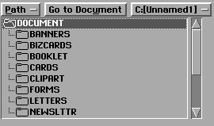

# 14 GenFile Selector
The GenFileSelector provides the user interface and functionality to allow a 
user to traverse directories and volumes (disks) and view the files contained 
therein. It can be customized to limit the displayed file names or to expand 
the listings to include special files.

This object is used by the GenDocumentControl object to provide most file 
dialog boxes. If your application uses the Document Control objects, you will 
probably not need to add a GenFileSelector.

You should be familiar with user interface objects in general before reading 
this chapter. You should also have an understanding of file names, GEOS 
files, disk handles, and the DOS directory structure. For this information, see 
both "GenDocument," Chapter 13 of this book, and "File System," Chapter 17 
of the Concepts Book.

## 14.1 File Selector Overview
When you are not using the Document Control objects but need to allow the 
user to traverse directories and disks in order to locate a given file, you 
should use a GenFileSelector. The File Selector is designed to give 
tremendous flexibility for many different types of file searches, providing 
both directory scanning and user interface. An OSF/Motif File Selector is 
shown in Figure 14-1.

  
**Figure 14-1** *A GenFileSelector*  
*The simple configuration shown will normally be supplemented by a Reply 
Bar and placed in a dialog box.*

The File Selector allows users to browse all the directories and disks readable 
by DOS, including readable network drives. This browsing is completely 
internal to the File Selector; until the user selects a file from the list, your 
application does not need to know what the File Selector is doing.

You can customize the searches the File Selector makes in several different 
ways:

+ Setting paths, volumes, and selections  
You may direct the File Selector to show any given directory on any given 
volume, and you may also set the selected file displayed. Additionally, 
you can navigate directories with messages sent to the File Selector. See 
section 14.4.2 below.

+ Limiting a directory scan to certain files  
The File Selector can limit its directory scans to show only the files you 
request. You may limit the scan based on file types, file attributes, or 
filename extensions. See section 14.3 below.

+ Searching for associated files  
You can limit the File Selector's searches to only those files that match a 
given creator or token. That is, the File Selector will display only files 
created by a particular geode. See section 14.3.3 below.

+ Customizing the searches  
If the available search options don't fit your needs, you can create a 
customized search. If this type of search is employed, the File Selector 
will send a special message to itself - to take advantage of this, you can 
easily subclass the GenFileSelector and write a custom handler for this 
special message. See section 14.3.8 below.

All of the directory scanning and path navigation is internal to the 
GenFileSelector. When a selection is made (a user single- or double-clicks on 
an entry, for example), the File Selector will send out a message indicating 
the selection. You can, however, force the File Selector to change to any 
directory or search criteria at any time.

## 14.2 File Selector Basics
The simplest File Selector configuration is shown in Figure 14-1. Nearly all 
applications, however, will use a configuration similar to that shown in 
Figure 14-2. The following sections describe how to set up and use the File 
Selector in this configuration and how to modify the configuration for 
common uses.

Most File Selectors will be put in dialog boxes like that shown in Figure 14-2 
and will be accompanied by at the least a Reply Bar. (In the figure, the 
"Open," "Cancel," and "?" buttons comprise the Reply Bar. For more 
information on Reply Bars in general, see "GenInteraction," Chapter 7.) 
Typically, the dialog box will be brought up by a menu item such as *Open...* 
or *Insert From Text File...*.

  
**Figure 14-2** *An Open File Selector for GeoWrite*  
*Generally, a File Selector is given a Reply Bar and in some cases other 
objects for added functionality.*

Figure 14-2 shows a sample *Insert From Text File* dialog box. (Note that you 
would probably use the Impex object for this functionality; this is provided 
for example.) This box has three basic elements: The GenGlyphDisplay (the 
title at the top), the File Selector (the scrolling list of files and the disk and 
folder icons), and the Reply Bar. In nearly all cases, these three elements will 
be included with every File Selector in its dialog box.

### 14.2.1 Setting Up the File Selector
To set up the File Selector as shown in Figure 14-2, you will have to set up a 
GenInteraction as a dialog box. (For information on menus and dialog boxes, 
see "GenInteraction," Chapter 7.) The File Selector and other elements of the 
dialog should be placed as children of the Interaction.

Code Display 14-1 shows the Goc code required to display and use a File 
Selector in this basic form. You can use this code to create a similar dialog box 
with the proper elements or modify it to gain the functionality you want. 
Specific permutations of this configuration will be described in section 14.2.4 
below; however, the remainder of this section describes the basics of the 
File Selector.

----------
Code Display 14-1 A Basic File Selector

	/* Extra code for menus and other UI objects is left out. Only what is
	 * required for these objects is included. */

	/* This dialog box provides the organization needed to contain the File
	 * Selector, the name of the box, and the Reply Bar. */
	@object GenInteractionClass MyDialogBox = {
		GI_visMoniker = `I', "Insert From Text File";
		GI_comp = MyGlyph, MyFileSel, MyInsertTrigger;
		GII_visibility = (GIV_DIALOG);
		GII_type = (GIT_COMMAND);
	};

	/* The Glyph Display provides the label in the dialog box. Alternatively, the
	 * moniker of the GenInteraction could be used for this functionality. */
	@object GenGlyphClass MyGlyph = {
		GI_visMoniker = "Insert From Text File";
	}

	/* The File Selector is as basic as possible. */
	@object GenFileSelectorClass MyFileSel = {
		GFSI_destination = process;		/* The object receiving notification. */
		GFSI_notificationMsg = MSG_MY_APP_FILE_SELECTED;
							/* The message sent
							 * upon selection. */
	};

	@object GenTriggerClass MyInsertTrigger = {
		GI_visMoniker = "Insert";
		GTI_destination = process;
		GTI_actionMsg = MSG_MY_APP_INSERT_TRIGGER_SELECTED;
		HINT_SEEK_REPLY_BAR;
	};

	/* Note that in most cases, this trigger will not be needed. Generally, the File
	 * Selector will include an "OK" or "Use This File" trigger in its reply bar that
	 * executes an IC_OK function. For your trigger above to demonstrate that
	 * functionality, remove the GTI_- fields and add the line
	 * ATTR_GEN_TRIGGER_INTERACTION_COMMAND = (IC_OK);
	 */

----------
### 14.2.2 Supporting the File Selector
To use the File Selector as shown in Code Display 14-1, your application must 
have some object (which may be the Process object) that can handle all the 
cases that may arise from a user's interaction with the dialog box. All of these 
cases are listed below:

+ The user clicks once on an entry in the File Selector's list.
When this happens, the File Selector highlights the selected entry and 
sends its notification message to its destination object. With the message 
will come a record of flags indicating the action was a single click.

+ The user double-clicks on an entry in the File Selector's list.
This action causes the File Selector to send its notification message to its 
destination object. The default action for the dialog box containing the 
File Selector will also occur (e.g. the default action is what happens when 
the "Insert" trigger is pressed). If the current selection is a directory, the 
application does not need to do anything; the File Selector will open the 
directory automatically. If the current selection is a file, the application 
must deal with the file properly and then close the dialog box containing 
the File Selector.

+ The user clicks on the "Insert" trigger.
This action causes the trigger to send its notification message to its 
destination object. In most cases, the trigger will be an IC_OK trigger 
that will cause the File Selector to act as if a double-click had occurred. 
If the current selected entry in the list is a directory, the application 
should instruct the File Selector to open the directory and display its file 
list. If the current selection is a file, the application is responsible for 
dealing properly with the file; additionally, the application should then 
close the dialog box containing the File Selector.

The above list describes the basics of File Selector support. Different File 
Selectors (such as SaveAs dialogs that allow the user to type in a file name) 
can easily be defined by adding other gadgetry to the controller. All other 
actions possible are internal to the file selector (e.g. the "Go To Document" 
button is a feature of the File Selector which is invisible to the application).

### 14.2.3 Messages to Handle
The list above shows two different messages that your File Selector's basic 
configuration sends: The first results from the user clicking on an entry and comes 
from the File Selector object, and the second is sent by the "Insert" trigger 
when the user clicks on it. The following descriptions show what you must do 
when handling these messages. (Note that in many cases only one message, 
the File Selector's action message, will be used; this occurs when the "Insert" 
trigger is actually an IC_OK or similar response trigger.)

Code Display 14-2 shows a sample handler for the message sent by the File 
Selector. Code Display 14-3 shows a sample handler for the message sent by 
the Reply Bar's Insert trigger. Both these handlers are written to go with the 
code in Code Display 14-1, and both handle the simplest case. Where 
application-specific code is required, comments have been inserted. 

You should not, in general, have to handle any more than the File Selector's 
notification message. You may add your own gadgetry to add other 
functionality, however.

The File Selector's notification message is the message you set in 
*GFSI_notificationMsg*. This message should have the same definition as the 
prototype GEN_FILE_SELECTOR_NOTIFICATION_MSG, which is defined 
below. You can either define it with the same parameters, or you can define 
it exactly on the prototype. (The latter is recommended.) The prototype 
carries with the notification a word of **GenFileSelectorEntryFlags**; this 
record contains the following flag fields:

GFSEF_TYPE  
This is a two-bit field (at offset GFSEF_TYPE_OFFSET) that 
describes the type of the selection. This may be one of 
GFSET_FILE (selection is a file), GFSET_SUBDIR (selection is a 
subdirectory), or GFSET_VOLUME (selection is a volume or 
disk). These are values of **GenFileSelectorEntryType**.

GFSEF_OPEN  
Set if the selection action was an "open" (i.e. double-click).

GFSEF_NO_ENTRIES  
Set if no entries are in the list.

GFSEF_ERROR  
Set if there was an error opening the selected entry on a 
double-click or a MSG_GEN_FILE_SELECTOR_OPEN_ENTRY.

GFSEF_TEMPLATE  
Set if the file is a template (i.e. has GFHF_TEMPLATE set).

GFSEF_SHARED_MULTIPLE  
Set if the file is shared with multiple writers (i.e. has 
GFHF_SHARED_MULTIPLE).

GFSEF_SHARED_SINGLE  
Set if the file is shared and has a single writer (i.e. has 
GFHF_SHARED_SINGLE).

GFSEF_READ_ONLY  
Set if the file is read-only (i.e. has FA_RDONLY).

GFSEF_PARENT_DIR  
Set if the current selection is the parent directory (i.e. the first 
entry in the file selector's list).

----------
#### GEN_FILE_SELECTOR_NOTIFICATION_MSG
	void	GEN_FILE_SELECTOR_NOTIFICATION_MSG(
			word							entryNum,
			GenFileSelectorEntryFlags		entryFlags);

This prototype should be used for all notification messages sent out by the 
File Selector; that is, any message you set in *GFSI_notificationMsg* should be 
based on this prototype.

**Source:** The GenFileSelector object.

**Destination:** The object specified in *GFSI_destination*.

**Parameters:**  
*entryNum* - The entry number selected in the list.

*entryFlags* - A **GenFileSelectorEntryFlags** record describing 
the selection. To get the entry type from the flags 
record, use the macro GFS_GET_ENTRY_TYPE, 
described after this reference entry.

**Return:** Nothing.

**Structures:** **GenFileSelectorEntryFlags** is a record with the following flags:

	typedef WordFlags GenFileSelectorEntryFlags;
	#define GFSEF_TYPE					0xc000
	#define GFSEF_OPEN					0x2000
	#define GFSEF_NO_ENTRIES 			0x1000
	#define GFSEF_ERROR 				0x0800
	#define GFSEF_TEMPLATE 				0x0400
	#define GFSEF_SHARED_MULTIPLE 		0x0200
	#define GFSEF_SHARED_SINGLE 		0x0100
	#define GFSEF_READ_ONLY 			0x0080
	#define GFSEF_PARENT_DIR 			0x0040
	#define GFSEF_TYPE_OFFSET 		14

The GFSEF_TYPE field is two bits defined by one of the following 
**GenFileSelectorEntryType** constants. These two bits define the type of 
entry selected.

	typedef ByteEnum GenFileSelectorEntryType;
	#define GFSET_FILE			0
	#define GFSET_SUBDIR		1
	#define GFSET_VOLUME		2

**Interception:** The notification message must be intercepted and handled for the 
selection of a file to have any effect in your application. There is no 
default behavior, except in the document control objects (which create 
their own File Selectors).

----------
#### GFS_GET_ENTRY_TYPE
	byte	GFS_GET_ENTRY_TYPE(flags)
			word	flags;

This macro extracts the high two bits from a **GenFileSelectorEntryFlags** 
record delivered as a parameter of a File Selector's notification message. 
Compare the value to GFSET_FILE, GFSET_SUBDIR, and GFSET_VOLUME.

----------
**Code Display 14-2 Handling a File Selector Selection**

	/*
	 * C handler for MSG_MY_APP_FILE_SELECTED. The message is sent by the File Selector
	 * object (MyFileSel) to the application's Process object (MyProcessClass) when the
	 * user clicks on an entry in the displayed file list. This code display is per the
	 * setup in Code Display 14-1.
	 */

	/*
	 * Format of the message:
	 * void MSG_MY_APP_FILE_SELECTED(word entryNum,
	 *					GenFileSelectorEntryFlags entryFlags)
	 */

	@method	MyProcessClass, MSG_MY_APP_FILE_SELECTED {
		/* First check if this is an OPEN operation (double-click). If so,
		 * then test whether the selection is a file. If so, simulate the "Insert"
		 * trigger by sending the trigger's message to ourselves. If it is not a file,
		 * or if the operation is not OPEN, we need do nothing. */

		if (GFS_GET_ENTRY_TYPE(entryFlags) & GFSEF_OPEN) {    /* Is the operation
						      * a double-click? */
			if (GFS_GET_ENTRY_FLAGS(entryFlags) & GFSET_FILE) {
							/* Is the selection a file? */
				/* Execute application-specific code here. */
			}
		}
	}

	/* Note that we do not necessarily have to handle double-click operations in this
	 * way. Since a double-click automatically activates the GenInteraction's default
	 * element (typically an "Ok" trigger), we can simply handle the press of the
	 * "Ok" trigger as shown in Code Display 14-3. */

----------

----------
**Code Display 14-3 Handling a File Selector "OK" Button**

	/* C handler for MSG_MY_APP_INSERT_TRIGGER_SELECTED, the message sent by the Insert
	 * trigger to the application's Process object when the user clicks on it.
	 * Format of this message: void MSG_MY_APP_INSERT_TRIGGER_SELECTED().
	 * This code display is per the setup shown in Code Display 14-1. */

	@method	MyProcessClass, MSG_MY_APP_INSERT_TRIGGER_SELECTED {
		/* Declare a local dword of flags and entry number. */
		dword selFlags;

		/* First, retrieve the selection number and flags from the File Selector.
		 * For now, we can ignore the selection name and path. To retrieve this
		 * information, send the message MSG_GEN_FILE_SELECTOR_GET_SELECTION to the 
		 * File Selector. This message will return a dword (selFlags) that contains the
		 * selection's entry number and a GenFileSelectorEntryFlags record. (To ignore
		 * the selection name, pass a null pointer with the message.) */

		selFlags = @call MyFileSel::MSG_GEN_FILE_SELECTOR_GET_SELECTION(NULL);

		/* Next, determine whether the selection is a file. To do this, check the
		 * returned GenFileSelectorEntryFlags record against GFSET_FILE. If the result
		 * is true, the selection is a file. If false, it is a directory or volume. If
		 * the selection is a file, we will operate on it appropriately (this is
		 * specific to each application). If not, we will direct the File Selector to
		 * open the entry. Note that we can assume an OPEN operation is in progress
		 * because the only two ways to get to this point are through a double-click
		 * on a selection and through a click on the "Insert" trigger.
		 */

		/* Note the use of the two macros GFS_GET_ENTRY_FLAGS and GFS_GET_ENTRY_NUMBER.
		 * The first extracts the GenFileSelectorEntryFlags record from the dword
		 * selFlags, and the second extracts the entry number from selFlags. */

		if (GFS_GET_ENTRY_FLAGS(selFlags) == GFSET_FILE) {	/* the selection is a file */

			/* Execute application-specific code here. */

		} else {		/* the selection is a volume or directory */

			/* Now direct the File Selector to open the entry. Use the message
			 * MSG_GEN_FILE_SELECTOR_OPEN_ENTRY, which returns a flag; if the flag is
			 * set, then an error occurred. If the flag is clear, the operation
			 * succeeded. */

			if (@call MyFileSel::MSG_GEN_FILE_SELECTOR_OPEN_ENTRY(
					GFS_GET_ENTRY_NUMBER(selFlags))) {
			/* Provide a proper error message or beep sound. */
		}
	}

----------
### 14.2.4 Some Common Customizations
Although the basics are all covered under the previous sections and you need 
nothing more to add a File Selector to your application, you will probably 
want to customize it somewhat. Typical simple customizations include 
limiting the types of files displayed, restricting the search to a single 
directory or volume, limiting the display to directories only (no files), and 
limiting the search to only those files with a given filename extension.

Each of these is shown in the displays following this section. Notice that the 
only changes you need to make to implement any of these customizations is 
to the File Selector's Goc code. You will not need to handle any other 
messages or add other code to your application. These customizations are 
shown in Code Display 14-4 through Code Display 14-8 and show how to do 
the following (you may apply any combination):

+ Show directories only.  
The File Selector will display no files, only directories.

+ Show all files in a single directory.  
The File Selector will show all files but will restrict directory navigation; 
the user can only select files in the current directory.

+ Show hidden files as well as normal files.

+ Show all files created by a given geode.  
The File Selector will restrict displayed files to only those that were 
created by the geode with the given **tokenChars** and **tokenID**.

+ Show all files with a given filename extension.  
The File Selector will restrict the files displayed to only those with the 
given filename extension.

These are not the only customizations you can make. Although they will 
satisfy the needs of the large majority of applications, you can change the File 
Selector's searches any way you want (you can even set up a callback routine 
to filter every single file or directory). The remainder of this chapter explains 
in detail the different things you can do to the File Selector.

----------
**Code Display 14-4 Display Only Directories**

	@object GenFileSelectorClass DirectorySelector = {
		GFSI_destination = process;
		GFSI_notificationMsg = MSG_MY_APP_DIRECTORY_SELECTED;
		GFSI_fileCriteria = FSFC_DIRS;
	};

----------

----------
**Code Display 14-5 Limit the Search to a Single Directory**

	@object GenFileSelectorClass SingleDirFileSelector = {
		GFSI_destination = process;
		GFSI_notificationMsg = MSG_MY_APP_FILE_SELECTED;
		GFSI_attrs = 			FSA_HAS_FILE_LIST;
		GFSI_fileCriteria =		FSFC_NON_GEOS_FILES | FSFC_GEOS_EXECUTABLES
								| FSFC_GEOS_NON_EXECUTABLES;
		ATTR_GEN_PATH_DATA = {0, DIRECTORY};
			/* Limit the display to this standard directory.
			 * Note that paths may be given; relative paths are taken as
			 * relative to the specified standard path. This attribute
			 * is defined in GenClass. */
	};

----------

----------
**Code Display 14-6 Show Hidden Files As Well As Normal Files**

	@object GenFileSelectorClass HiddenFileSelector = {
		GFSI_destination = process;
		GFSI_notificationMsg = MSG_MY_APP_FILE_SELECTED;
			/* Specify that FA_SYSTEM files are the only ones not to be displayed. */
		ATTR_GEN_FILE_SELECTOR_FILE_ATTR = { 0, FA_SYSTEM};
	};

----------

----------
**Code Display 14-7 Show Only Files Created by a Given Geode**

	@object GenFileSelectorClass CreatorFileSelector = {
		GFSI_destination = process;
		GFSI_notificationMsg = MSG_MY_APP_FILE_SELECTED;
		ATTR_GEN_FILE_SELECTOR_CREATOR_MATCH = {{"CRTR"}, 0};
	};

----------

----------
**Code Display 14-8 Show Only Files with a Given Filename Extension**

	@object GenFileSelectorClass ExtensionFileSelector = {
		GFSI_destination = process;
		GFSI_notificationMsg = MSG_MY_APP_FILE_SELECTED;
		ATTR_GEN_FILE_SELECTOR_NAME_MASK = {"*.BAT"};	/* Show files ending with BAT. */
			/* Note that the mask is case sensitive. This means that the mask must be
			 * in upper case to match DOS files. */
	};

----------
## 14.3 File Selector Instance Data
The File Selector is diverse and flexible, and you can customize it in many 
different ways. Typically, you will only need to add or modify a few lines of 
Goc code to achieve the results you need; however, if you have changing 
needs, you can change the File Selector during execution by sending it 
various messages.

The File Selector has a number of attributes and variable data fields that 
determine its functionality. These are listed in Code Display 14-9, along with 
comments and the defaults that are set.

----------
**Code Display 14-9 File Selector Attributes**

	/* Following are several type definitions used in the instance data. */

	typedef FileLongName		GenFileSelectorSelection;
	typedef WordFlags			FileSelectorFileCriteria;
	typedef WordFlags			FileSelectorAttrs;
	typedef FileLongName		GenFileSelectorMask;

	typedef struct {
		FileAttrs		GFSFA_match;
		FileAttrs		GFSFA_mismatch;
	} GenFileSelectorFileAttrs;

	typedef struct {
		GeodeAttrs		GFSGA_match;
		GeodeAttrs		GFSGA_mismatch;
	} GenFileSelectorGeodeAttrs;

	/* GFSI_selection
	 * The selection field contains the name of the current selection being
	 * displayed by the File Selector. */
    @instance GenFileSelectorSelection		GFSI_selection = {0};

	/* GFSI_fileCriteria
	 * The file criteria field contains flags that determine the search and
	 * filter criteria used by the File Selector when scanning directories. */
	@instance FileSelectorFileCriteria	GFSI_fileCriteria = 
						FSFC_DIRS | FSFC_NON_GEOS_FILES |
						FSFC_GEOS_EXECUTABLES |
						FSFC_GEOS_NON_EXECTUTABLES;
		/* Possible flags for GFSI_fileCriteria:
		 * FSFC_DIRS					FSFC_NON_GEOS_FILES
		 * FSFC_GEOS_EXECUTABLES		FSFC_GEOS_NON_EXECUTABLES
		 * FSFC_MASK_CASE_INSENSITIVE	FSFC_FILE_FILTER
		 * FSFC_FILTER_IS_C				FSFC_TOKEN_NO_ID
		 * FSFC_USE_MASK_FOR_DIRS */

	/* GFSI_attrs
	 * The attributes field determines what features of the File Selector are
	 * to be implemented. */
    @instance FileSelectorAttrs		GFSI_attrs =	FSA_ALLOW_CHANGE_DIRS |
						FSA_HAS_CLOSE_DIR_BUTTON |
						FSA_HAS_OPEN_DIR_BUTTON |
						FSA_HAS_DOCUMENT_BUTTON |
						FSA_HAS_CHANGE_DIRECTORY_LIST |
						FSA_HAS_CHANGE_DRIVE_LIST |
						FSA_HAS_FILE_LIST;
		/* Possible flags for GFSI_attrs:
		 * FSA_ALLOW_CHANGE_DIRS		FSA_SHOW_FIXED_DISKS_ONLY
		 * FSA_SHOW_FILES_DISABLED		FSA_HAS_CLOSE_DIR_BUTTON
		 * FSA_HAS_OPEN_DIR_BUTTON		FSA_HAS_DOCUMENT_BUTTON
		 * FSA_HAS_CHANGE_DIRECTORY_LIST FSA_HAS_CHANGE_DRIVE_LIST
		 * FSA_HAS_FILE_LIST			FSA_USE_VIRTUAL_ROOT

	/* GFSI_destination and GFSI_notificationMsg
	 * When a user selects a file, the File Selector sends the message
	 * specified in GFSI_notificationMsg to the object specified in
	 * GFSI_destination. */
	@instance optr				GFSI_destination;
	@instance Message			GFSI_notificationMsg;

	/* Token and creator matches
	 * These two vardata fields filter files according to their tokens.
	 * A file that has a token other than that set will not be displayed
	 * by the File Selector. If you only want to match files with certain
	 * token characters, you can set FSFC_TOKEN_NO_ID in GFSI_fileCriteria. */
	@vardata GeodeToken		ATTR_GEN_FILE_SELECTOR_TOKEN_MATCH;
	@vardata GeodeToken		ATTR_GEN_FILE_SELECTOR_CREATOR_MATCH;

	/* File attributes
	 * This vardata field filters files according to the files' native
	 * attributes. If a file does not have the attributes specified in
	 * GFSFA_match, or if it has an attribute specified in GFSFA_mismatch,
	 * it will not be displayed. */
	@vardata GenFileSelectorFileAttrs	ATTR_GEN_FILE_SELECTOR_FILE_ATTR;

	/* Geode attributes
	 * This vardata field filters files according to the files' geode
	 * attributes. If a file does not have the attributes specified in
	 * GFSGA_match, or if it has an attribute specified in GFSGA_mismatch,
	 * it will not be displayed. */
	@vardata GenFileSelectorGeodeAttrs	ATTR_GEN_FILE_SELECTOR_GEODE_ATTR;

	/* Mask
	 * This vardata field filters files based on their names. The mask is
	 * a text string matched against file names. Files which coincide with the
	 * mask string are displayed; others are not. The mask string will also
	 * be applied to volumes and directories if FSFC_USE_MASK_FOR_DIRS is
	 * set in GFSI_fileCriteria. */
	@vardata GenFileSelectorMask	ATTR_GEN_FILE_SELECTOR_NAME_MASK;

	/* Virtual Root
	 * This vardata field defines a "virtual root" for the file selector. The
	 * user will not be allowed to navigate above the "virtual root" except
	 * with the Change Drives popup list, if available. If the Change Drives
	 * list is used, the virtual root is afterwards ignored. */
	@vardata GenFilePath		ATTR_GEN_FILE_SELECTOR_VIRTUAL_ROOT;

	/* Scalable UI Support
	 * This hint is used to support scalable UI within the File Selector based
	 * on the application's features (MSG_GEN_APPLICATION_GET_APP_FEATURES).
	 * This hint takes an array of GenFileSelectorScalableUIEntry structures.
	 * Typically, one element will have GFSSUIC_SET_FEATURES_IF_APP_FEATURE_ON,
	 * and one element will have GFSSUIC_SET_FEATURES_IF_APP_FEATURE_OFF.
	 * The structures are defined below. */
	@vardata GenFileSelectorScalableUIEntry HINT_FILE_SELECTOR_SCALABLE_UI_DATA;

	/* The structures for the above hint are given below.
	 * GenFileSelectorScalableUIEntry is a structure with three fields; each
	 * element in the array is one of these structures.
	 * GenFileSelectorScalableUICommand is the type of the first field.
	 * If the data in GFSSUIE_appFeature is true according to the type in
	 * GFSSUIE_command, then the features in GFSSUIE_fsFeatures will be set
	 * accordingly. */
	typedef ByteEnum GenFileSelectorScalableUICommand;
	#define GFSSUIC_SET_FEATURES_IF_APP_FEATURE_ON		0
	#define GFSSUIC_SET_FEATURES_IF_APP_FEATURE_OFF		1
	#define GFSSUIC_ADD_FEATURES_IF_APP_FEATURE_ON		2
	#define GFSSUIC_SET_FEATURES_IF_APP_LEVEL			3
	#define GFSSUIC_ADD_FEATURES_IF_APP_LEVEL			4

	typedef struct {
		GenFileSelectorScalableUICommand	GFSSUIE_command;
		WordFlags							GFSSUIE_appFeature;
		FileSelectorAttrs					GFSSUIE_fsFeatures;
	} GenFileSelectorScalableUIEntry;

	/* Number of files
	 * This hint determines the number of files that are visible at once. */
	@vardata word		HINT_FILE_SELECTOR_NUMBER_OF_FILES_TO_SHOW;

	/* File List Width
	 * This hint defines the width of the file list. The data is a number of
	 * average-width characters, up to a maximum of 255.
	@vardata word 		HINT_FILE_SELECTOR_FILE_LIST_WIDTH;

----------
### 14.3.1 The GFSI_attrs Field
	GFSI_attrs, MSG_GEN_FILE_SELECTOR_GET_ATTRS, 
	MSG_GEN_FILE_SELECTOR_SET_ATTRS

The GenFileSelector has ten attributes in *GFSI_attrs*, shown below. They are 
stored as a word-sized record of type **FileSelectorAttrs**; they may be 
retrieved with MSG_GEN_FILE_SELECTOR_GET_ATTRS and set with 
MSG_GEN_FILE_SELECTOR_SET_ATTRS.

FSA_ALLOW_CHANGE_DIRS  
This flag allows the user to change directories by double 
clicking; it is set by default.

FSA_SHOW_FIXED_DISKS_ONLY  
This flag does not allow removable volumes (e.g. floppy disks) 
to be shown in the File Selector volume list. By default, this flag 
is off.

FSA_SHOW_FILES_DISABLED  
This flag instructs the File Selector to display files as disabled. 
This is useful for SaveAs operations, for example, when files 
must be displayed but should not be selectable by the user. By 
default, this flag is off. Setting this flag will turn all other 
search criteria off, so all filenames will be displayed.

FSA_HAS_CLOSE_DIR_BUTTON  
This flag causes the File Selector to include a "Close Directory" 
button.

FSA_HAS_OPEN_DIR_BUTTON  
This flag causes the File Selector to include an "Open 
Directory" button.

FSA_HAS_DOCUMENT_BUTTON  
This flag causes the File Selector to include a "Go to Document" 
button that displays the DOCUMENT directory.

FSA_HAS_CHANGE_DIRECTORY_LIST  
This flag causes the File Selector to include a list that allows 
the user to change directories.

FSA_HAS_CHANGE_DRIVE_LIST  
This flag causes the File Selector to include a list that allows 
the user to change drives.

FSA_HAS_FILE_LIST  
This flag causes the File Selector to include a file list.

FSA_USE_VIRTUAL_ROOT  
This flag causes the File Selector to use the information in the 
ATTR_GEN_FILE_SELECTOR_VIRTUAL_ROOT attribute. This 
allows changing the File Selector without altering the vardata.

----------
#### MSG_GEN_FILE_SELECTOR_SET_ATTRS
	void	MSG_GEN_FILE_SELECTOR_SET_ATTRS(
			FileSelectorAttrs attributes);

This message sets the File Selector's *GFSI_attrs* record to a new set of 
attributes. The File Selector will rescan the current directory using the new 
attributes. If the File Selector is not visible when it receives this message, it 
will set the attributes but will not rescan the directory.

**Source:** Unrestricted.

**Destination:** Any GenFileSelector object.

**Parameters:**  
*attributes* - A record of **FileSelectorAttrs** to set into the File 
Selector's *GFSI_attrs* record.

**Return:** Nothing.

**Interception:** Generally not intercepted.

----------
#### MSG_GEN_FILE_SELECTOR_GET_ATTRS
	FileSelectorAttrs MSG_GEN_FILE_SELECTOR_GET_ATTRS();

This message returns the current attributes set in the File Selector's 
*GFSI_attrs* instance data.

**Source:** Unrestricted.

**Destination:** Any GenFileSelector object.

**Parameters:** None.

**Return:** A record of **FileSelectorAttrs** representing the flags set in the File 
Selector's *GFSI_attrs* field.

**Interception:** Generally not intercepted.

### 14.3.2 The GFSI_fileCriteria Field
	GFSI_fileCriteria, 
	MSG_GEN_FILE_SELECTOR_GET_FILE_CRITERIA, 
	MSG_GEN_FILE_SELECTOR_SET_FILE_CRITERIA

Each File Selector can limit or extend its searches in several different ways. 
The File Selector's instance data contains information about which types of 
files to include in the display, which not to include, and other special criteria. 
(Note that if the proper *GFSI_attrs* are set, directories and volumes will be 
unaffected by these scan limitations.)

The attribute field *GFSI_fileCriteria* is a record that indicates which of 
several search limiters should be considered in a directory scan. Note that 
some limitations may be invoked without a corresponding *GFSI_fileCriteria* 
entry. There are several possible entries in *GFSI_fileCriteria*, and any or all 
may be turned on at once. Each flag in the field is shown below, along with 
the field that it affects:

FSFC_DIRS  
This flag indicates that subdirectories should be displayed in 
the File Selector's directory scans. This flag is set by default.

FSFC_NON_GEOS_FILES  
This flag indicates that non-GEOS files should be displayed. 
This flag is set by default.

FSFC_GEOS_EXECUTABLES  
This flag indicates that GEOS executable files should be 
displayed. This flag is set by default.

FSFC_GEOS_NON_EXECUTABLES  
This flag indicates that GEOS non-executable files (documents 
and other types) should be displayed. This flag is set by default.

FSFC_MASK_CASE_INSENSITIVE  
This flag indicates that the filename mask (if any) should be 
case-insensitive. The mask applies only to files unless 
FSFC_USE_MASK_FOR_DIRS is also set (see below); the mask is 
set in ATTR_GEN_FILE_SELECTOR_NAME_MASK.

FSFC_FILE_FILTER  
This flag makes the File Selector use an application-defined 
callback routine when scanning. The callback routine is used 
after all other filters have been applied. The callback routine 
must be defined in a subclass of **GenFileSelectorClass**.

FSFC_FILTER_IS_C  
This flag indicates that the callback filter routine is written in 
C and follows the Pascal calling convention.

FSFC_TOKEN_NO_ID  
This flag indicates that when using a token to match files, the 
File Selector should ignore the token ID. In other words, it will 
only match the token characters.

FSFC_USE_MASK_FOR_DIRS  
This flag indicates that if a filename mask is used, the File 
Selector should apply the mask to directories as well as to files. 
By default, the mask is applied only to file names.

You should set the proper *GFSI_fileCriteria* attributes in your application's 
Goc code. However, you can change the *GFSI_fileCriteria* field at run-time 
with MSG_GEN_FILE_SELECTOR_SET_FILE_CRITERIA. You can also get the 
flags with MSG_GEN_FILE_SELECTOR_GET_FILE_CRITERIA. Both of these 
messages are detailed below.

----------
#### MSG_GEN_FILE_SELECTOR_SET_FILE_CRITERIA
	void	MSG_GEN_FILE_SELECTOR_SET_FILE_CRITERIA(
			FileSelectorFileCriteria fileCriteria);

This message sets the File Selector's *GFSI_fileCriteria* record to a new set of 
flags. If the File Selector is visible when it receives this message, it will 
rescan the current directory with the new attributes. Otherwise, it will set 
the *GFSI_fileCriteria* record but will not rescan.

**Source:** Unrestricted.

**Destination:** Any GenFileSelector object.

**Parameters:**  
*fileCriteria* - A record of **FileSelectorFileCriteria** to set into 
the File Selector's *GFSI_fileCriteria* record.

**Return:** Nothing.

**Interception:** Generally not intercepted.

**See Also:**  
MSG_GEN_FILE_SELECTOR_SET_FILE_ATTRS,  
MSG_GEN_FILE_SELECTOR_SET_TOKEN,  
MSG_GEN_FILE_SELECTOR_SET_CREATOR,  
MSG_GEN_FILE_SELECTOR_SET_GEODE_ATTRS,  
MSG_GEN_FILE_SELECTOR_SET_MASK

----------
#### MSG_GEN_FILE_SELECTOR_GET_FILE_CRITERIA
	FileSelectorFileCriteria MSG_GEN_FILE_SELECTOR_GET_FILE_CRITERIA();

This message returns the File Selector's current *GFSI_fileCriteria* record. 

**Source:** Unrestricted.

**Destination:** Any GenFileSelector object.

**Parameters:** None.

**Return:** A record of **FileSelectorFileCriteria** representing the File Selector's 
*GFSI_fileCriteria* flags.

**Interception:** Generally not intercepted.

**See Also:**  
MSG_GEN_FILE_SELECTOR_SET_FILE_ATTRS,  
MSG_GEN_FILE_SELECTOR_SET_TOKEN,  
MSG_GEN_FILE_SELECTOR_SET_CREATOR,  
MSG_GEN_FILE_SELECTOR_SET_GEODE_ATTRS,  
MSG_GEN_FILE_SELECTOR_SET_MASK

### 14.3.3 Matching a File Token
	ATTR_GEN_FILE_SELECTOR_TOKEN_MATCH, 
	MSG_GEN_FILE_SELECTOR_SET_TOKEN, 
	MSG_GEN_FILE_SELECTOR_GET_TOKEN

Since every GEOS file has a token associated with it, you can limit directory 
scans to include only those files with a given token. (Note that directories and 
volumes are not affected by this limitation.) Alternatively, because the token 
is made up of two items, the token chars and the token ID, you can arrange a 
search based on just the token characters (you can not search on only the ID).

Both the match token ID and the match token characters are stored in the 
File Selector's ATTR_GEN_FILE_SELECTOR_TOKEN_MATCH instance field. 
This field is of type **GeodeToken**, the structure of which is shown below:

	typedef struct {
		TokenChars			GT_chars[TOKEN_CHARS_LENGTH];
		ManufacturerID		GT_manufID;
	} GeodeToken;

The *GT_chars* field is four characters as defined in the geode's geode 
parameters (**.gp**) file. The *GT_manufID* field is the manufacturer ID number 
allotted to the particular developer who created the geode.

If the *GFSI_fileCriteria* attribute FSFC_TOKEN_NO_ID is set, only the token 
characters will be matched. The ID portion of the token will be ignored by the 
File Selector (until FSFC_TOKEN_NO_ID is turned off). See section 14.3.2 above for more information on *GFSI_fileCriteria*.

If no token information is set, no filter will be applied based on tokens. To set 
the token at run-time, send MSG_GEN_FILE_SELECTOR_SET_TOKEN to the 
File Selector. To retrieve the token match information, send 
MSG_GEN_FILE_SELECTOR_GET_TOKEN.

----------
#### MSG_GEN_FILE_SELECTOR_SET_TOKEN
	void	MSG_GEN_FILE_SELECTOR_SET_TOKEN(
			dword				tokenChars,
			ManufacturerID		manufacturerID);

This message sets the ATTR_GEN_FILE_SELECTOR_TOKEN_MATCH field to 
the two passed values. The token set with this message will be used to filter 
out certain files; directories and volumes are not affected by this filter.

If the File Selector is visible when it receives this message, it will rescan the 
current directory using the new token information. Otherwise, the File 
Selector will store the passed token.

**Source:** Unrestricted.

**Destination:** Any GenFileSelector object.

**Parameters:**  
*tokenChars* - The token characters of the token to match files 
against. Use the macro SET_TOKEN_CHARS 
(below) to set this dword value from the four 
individual characters.

*manufacturerID* - The token ID of the token to match files against.

**Return:** Nothing.

**Interception:** Generally not intercepted.

**See Also:**  
MSG_GEN_FILE_SELECTOR_SET_FILE_CRITERIA,  
MSG_GEN_FILE_SELECTOR_SET_CREATOR

----------
#### MSG_GEN_FILE_SELECTOR_GET_TOKEN
	void	MSG_GEN_FILE_SELECTOR_GET_TOKEN(
			GetTokenCreatorParams *retValue);

This message returns the current token match information set in the File 
Selector's ATTR_GEN_FILE_SELECTOR_TOKEN_MATCH field.

**Source:** Unrestricted.

**Destination:** Any GenFileSelector object.

**Parameters:**  
*retValue* - A pointer to a **GetTokenCreatorParams** 
structure, shown below. The structure may be 
empty when passed.

**Return:** The **GetTokenCreatorParams** structure pointed to by *retValue* will 
contain the token in ATTR_GEN_FILE_SELECTOR_TOKEN_MATCH.

**Structures:** The **GetTokenCreatorParams** structure consists of two elements: a 
**GeodeToken** structure containing the File Selector's token characters 
and manufacturer ID fields, and a reserved word. Its structure is shown 
below:

	typedef struct {
		GeodeToken   GTP_Token;
		word         GTP_Unused;		/* reserved */
	} GetTokenCreatorParams;

**Interception:** Generally not intercepted.

**See Also:**  
MSG_GEN_FILE_SELECTOR_SET_FILE_CRITERIA,  
MSG_GEN_FILE_SELECTOR_GET_CREATOR

----------
#### SET_TOKEN_CHARS
	dword	SET_TOKEN_CHARS(ch1, ch2, ch3, ch4);
			char	ch1, ch2, ch3, ch4;

This macro creates a single dword containing the four given characters. Use 
this macro to create the *tokenChars* parameter for 
MSG_GEN_FILE_SELECTOR_SET_TOKEN and 
MSG_GEN_FILE_SELECTOR_SET_CREATOR.

### 14.3.4 Matching a File Creator App
	ATTR_GEN_FILE_SELECTOR_CREATOR_MATCH, 
	MSG_GEN_FILE_SELECTOR_SET_CREATOR, 
	MSG_GEN_FILE_SELECTOR_GET_CREATOR

Most applications will store their documents in a special type of file; each of 
these files will include the token of the creator geode. (This is a function of 
the Document Control objects.)

As a result, you may limit the File Selector's searches to only those files 
created by a given geode. Set the token to be matched in the File Selector's 
ATTR_GEN_FILE_SELECTOR_CREATOR_MATCH variable data instance field. 
This search is employed in the same manner as a token search (above), so it 
is also subject to the FSFC_TOKEN_NO_ID attribute of *GFSI_fileCriteria*.

The ATTR_GEN_FILE_SELECTOR_CREATOR_MATCH field is a **GeodeToken** 
structure that contains both the match ID and the match characters of the 
creator token. The **GeodeToken** structure is shown in the previous section. 
You can set the creator information in the File Selector's Goc code, or you can 
set it at run-time with MSG_GEN_FILE_SELECTOR_SET_CREATOR. To 
retrieve the creator token, use MSG_GEN_FILE_SELECTOR_GET_CREATOR.

----------
#### MSG_GEN_FILE_SELECTOR_SET_CREATOR
	void	MSG_GEN_FILE_SELECTOR_SET_CREATOR(
			dword				tokenChars,
			ManufacturerID		manufacturerID);

This message sets the ATTR_GEN_FILE_SELECTOR_CREATOR_MATCH field 
to the two passed values. This field is a vardata instance record of type 
**GeodeToken**. The token set with this message will be used to filter out 
certain files; directories and volumes are not affected by this filter. Only files 
which have their creator token the same as that of the File Selector will be 
displayed.

If the File Selector is visible when it receives this message, it will rescan the 
directory using the new token as a filter. Otherwise, the File Selector will 
store the passed token for later use.

**Source:** Unrestricted.

**Destination:** Any GenFileSelector object.

**Parameters:**  
*tokenChars* - The token characters of the creator token to match 
files against. Use the macro SET_TOKEN_CHARS to 
set this dword value from the four individual 
characters. This macro is shown in the previous 
section.

*manufacturerID* - The token ID of the creator token to match files 
against.

**Return:** Nothing.

**Interception:** Generally not intercepted.

**See Also:**  
MSG_GEN_FILE_SELECTOR_SET_FILE_CRITERIA,  
MSG_GEN_FILE_SELECTOR_SET_TOKEN

----------
#### MSG_GEN_FILE_SELECTOR_GET_CREATOR
	void	MSG_GEN_FILE_SELECTOR_GET_CREATOR(
			GetTokenCreatorParams *retValue);

This message returns the current creator match information set in the File 
Selector's ATTR_GEN_FILE_SELECTOR_CREATOR_MATCH field.

**Source:** Unrestricted.

**Destination:** Any GenFileSelector object.

**Parameters:**  
*retValue* - A pointer to a **GetTokenCreatorParams** 
structure, shown below. The structure may be 
empty when passed.

**Return:** The **GetTokenCreatorParams** structure pointed to by *retValue* will 
contain the token in ATTR_GEN_FILE_SELECTOR_CREATOR_MATCH.

**Structures:** The **GetTokenCreatorParams** structure consists of two elements: a 
**GeodeToken** structure containing the File Selector's token characters 
and manufacturer ID fields, and a reserved word. Its structure is shown 
below:

	typedef struct {
		GeodeToken   GTP_token;
		word         GTP_unused;		/* reserved */
	} GetTokenCreatorParams;

**Interception:** Generally not intercepted.

**See Also:**  
MSG_GEN_FILE_SELECTOR_SET_FILE_CRITERIA,  
MSG_GEN_FILE_SELECTOR_GET_TOKEN 

### 14.3.5 Matching File Geode Attributes
	ATTR_GEN_FILE_SELECTOR_GEODE_ATTR, 
	MSG_GEN_FILE_SELECTOR_SET_GEODE_ATTRS, 
	MSG_GEN_FILE_SELECTOR_GET_GEODE_ATTRS

Every geode in GEOS has a structure of type **GeodeAttrs** stored in its file. 
As a result, you can limit the File Selector's searches to include only a certain 
set of geodes - those with the attributes set in the File Selector's 
ATTR_GEN_FILE_SELECTOR_GEODE_ATTR vardata instance field.

ATTR_GEN_FILE_SELECTOR_GEODE_ATTR is a structure of type 
**GenFileSelectorGeodeAttrs**, which consists of two parts. *GFSGA_match* 
represents the geode attributes an acceptable file must have on, and 
*GFSGA_mismatch* represents the geode attributes an acceptable file must 
have off. The structure's definition is shown below:

	typedef struct {
		GeodeAttrs    GFSGA_match;
		GeodeAttrs    GFSGA_mismatch;
	} GenFileSelectorGeodeAttrs;

To retrieve the current geode match information, send the message 
MSG_GEN_FILE_SELECTOR_GET_GEODE_ATTRS to the File Selector object. 
To set them, send MSG_GEN_FILE_SELECTOR_SET_GEODE_ATTRS. If you do 
not explicitly set the geode match information, the File Selector will not 
apply the geode match filter to its directory scans.

The possible geode attributes on which you can match or mismatch are 
shown below. They are all flags of the **GeodeAttrs** record, a system type that 
is not specific to **GenFileSelectorClass**. Note that none of these flags is set 
by default. (Geode attributes are described in detail in "Applications and 
Geodes," Chapter 6 of the Concepts Book.)

GA_PROCESS  
This flag indicates the geode is a process (has an initial thread).

GA_LIBRARY  
This flag indicates the geode is a library (exports routines). 

GA_DRIVER  
This flag indicates the geode is a driver (has a Driver Table).

GA_KEEP_FILE_OPEN  
This flag indicates the .**geo** file must stay open (e.g. is a 
resource that is designated as discardable).

GA_SYSTEM  
This flag indicates the geode is a GEOS system geode. 

GA_MULTI_LAUNCHABLE  
This flag indicates the geode may be loaded more than once. 

GA_APPLICATION  
This flag indicates the geode is a user-launchable application.

GA_DRIVER_INITIALIZED  
Set on the fly by GEOS if the geode's driver aspect has been 
initialized (should not be matched).

GA_LIBRARY_INITIALIZED  
Set on the fly by GEOS if the geode's library aspect has been 
initialized (should not be matched).

GA_GEODE_INITIALIZED  
Set on the fly by GEOS if the geode's process aspect has been 
initialized (should not be matched).

GA_USES_COPROC  
This flag indicates that the geode uses a coprocessor if one is 
available.

GA_REQUIRES_COPROC  
This flag indicates the geode requires a coprocessor or 
coprocessor emulator.

GA_HAS_GENERAL_CONSUMER_MODE  
This flag indicates the geode can be run in GCM mode.

GA_ENTRY_POINTS_IN_C  
This flag indicates that the geode has library/driver entry 
points in C.

----------
#### MSG_GEN_FILE_SELECTOR_SET_GEODE_ATTRS
	void	MSG_GEN_FILE_SELECTOR_SET_GEODE_ATTRS(
			GeodeAttrs		matchGeodeAttrs,
			GeodeAttrs		mismatchGeodeAttrs);

This message sets the File Selector's vardata instance field 
ATTR_GEN_FILE_SELECTOR_GEODE_ATTR to the two passed values.

If the File Selector is visible when it receives this message, it will 
automatically rescan the current directory, applying the new geode filter. 
Otherwise, the new geode match/mismatch records will be stored but no 
rescan will occur.

**Source:** Unrestricted.

**Destination:** Any GenFileSelector object.

**Parameters:**  
*matchGeodeAttrs* - A **GeodeAttrs** record indicating the flags that 
every acceptable file must have set. This record will 
be set into *GFSGA_match*.

*mismatchGeodeAttrs* - A **GeodeAttrs** record indicating the flags that 
every acceptable file *must have clear. This record 
will be set into *GFSGA_mismatch*.

**Return:** Nothing.

**Interception:** Generally not intercepted.

**See Also:** MSG_GEN_FILE_SELECTOR_SET_FILE_CRITERIA

----------
#### MSG_GEN_FILE_SELECTOR_GET_GEODE_ATTRS
	dword	 MSG_GEN_FILE_SELECTOR_GET_GEODE_ATTRS();

This message returns the File Selector's current geode attribute match 
information.

**Source:** Unrestricted.

**Destination:** Any GenFileSelector object.

**Parameters:** None.

**Return:** The returned dword consists of the two **GeodeAttrs** records stored in 
the File Selector's ATTR_GEN_FILE_SELECTOR_GEODE_ATTR vardata 
field. To extract the match attributes (*GFSGA_match*), use the macro 
GET_MATCH_ATTRS. To extract the mismatch attributes 
(*GFSGA_mismatch*), use GET_MISMATCH_ATTRS.

**Interception:** Generally not intercepted.

**See Also:** MSG_GEN_FILE_SELECTOR_SET_FILE_CRITERIA

----------
#### GET_MATCH_ATTRS
	word	GET_MATCH_ATTRS(attr);
			dword	attr;

This macro extracts the *GFSGA_match* record (**GeodeAttrs**) from the given 
dword (returned by MSG_GEN_FILE_SELECTOR_GET_GEODE_ATTRS).

----------
#### GET_MISMATCH_ATTRS
	word	GET_MISMATCH_ATTRS(attr);
			dword	attr;

This macro extracts the *GFSGA_match* record (**GeodeAttrs**) from the given 
dword (returned by MSG_GEN_FILE_SELECTOR_GET_GEODE_ATTRS).

### 14.3.6 Masking File Names
	ATTR_GEN_FILE_SELECTOR_NAME_MASK, 
	MSG_GEN_FILE_SELECTOR_SET_MASK, 
	MSG_GEN_FILE_SELECTOR_GET_MASK

By setting up a filename mask, you can limit the File Selector's displays to 
only those files that conform to the mask characters. For example, to show 
only those files with the .BAT extender, you could set the mask to *.BAT.

Only one mask may be in use at any given time. If you need to mask for two 
different sets of characters (e.g. *.BAT and *.EXE), you will need to subclass 
the File Selector and modify its behavior. (See section 14.3.8 below for 
more information.)

The mask is stored in the File Selector's variable data instance attribute 
ATTR_GEN_FILE_SELECTOR_NAME_MASK and consists of a null-terminated 
character string. This field is defined as type **GenFileSelectorMask**, the 
same as **FileLongName**. This string may contain the DOS "\*" and "?" 
wildcard characters. The filter applied by the File Selector is the same as that 
applied by the **FileEnum()** routine detailed in "FileEnum()" in Chapter 17 of the Concepts Book. In short, the mask is taken 
as a character string matched to the entire file name (thus, a mask of "*.*" 
implies all files with a period in their names; the period separating a filename 
and an extension will not count as a period).

Normally, the mask is applied only to files and not to directories or volumes. 
However, if the *GFSI_fileCriteria* attribute FSFC_USE_MASK_FOR_DIRS is 
set, directories will also be subject to the mask. (Volumes are never subject to 
the mask filter.)

By default, the mask filter is case-sensitive. You can make the mask filter be 
case-insensitive, however, by setting FSFC_MASK_CASE_INSENSITIVE in the 
File Selector's *GFSI_fileCriteria* instance field.

You can set the mask in your application's Goc code or by sending the 
message MSG_GEN_FILE_SELECTOR_SET_MASK to the File Selector. To 
retrieve the current mask, use MSG_GEN_FILE_SELECTOR_GET_MASK. If 
you do not explicitly set a mask string, the File Selector will not make any 
filename mask comparisons.

----------
#### MSG_GEN_FILE_SELECTOR_SET_MASK
	void	MSG_GEN_FILE_SELECTOR_SET_MASK(
			char	*mask);

This message sets the ATTR_GEN_FILE_SELECTOR_NAME_MASK variable 
instance field of the File Selector. This field contains a null-terminated 
character string (of type **GenFileSelectorMask**); during a directory scan, 
the File Selector checks all filenames against this mask, and only those files 
that contain the mask characters are displayed. The mask string may 
contain DOS wildcard characters ("*" and "?").

The mask works for both DOS and GEOS files. However, unless the 
FSFC_USE_MASK_FOR_DIRS flag is set in the *GFSI_fileCriteria* attribute, 
directories will be unaffected by the mask. Volumes are unaffected in any 
case.

If the File Selector is visible on the screen when it receives this message, it 
will automatically rescan the current directory with the new mask. 
Otherwise, the new mask will be stored for later use.

**Source:** Unrestricted.

**Destination:** Any GenFileSelector object.

**Parameters:**  
*mask* - A pointer to the mask string to be set. This is a 
null-terminated character string.

**Return:** Nothing.

**Interception:** Generally not intercepted.

**See Also:** MSG_GEN_FILE_SELECTOR_SET_FILE_CRITERIA

----------
#### MSG_GEN_FILE_SELECTOR_GET_MASK
	void	MSG_GEN_FILE_SELECTOR_GET_MASK(
			char	*mask);

This message returns the mask string in the File Selector's 
ATTR_GEN_FILE_SELECTOR_NAME_MASK field.

**Source:** Unrestricted.

**Destination:** Any GenFileSelector object.

**Parameters:**  
*mask* - A pointer to an empty character string. The string 
must be at least **sizeof(GenFileSelectorMask)** 
characters.

**Return:** The character string pointed to by *mask* will contain the mask string 
set in ATTR_GEN_FILE_SELECTOR_NAME_MASK.

**Interception:** Generally not intercepted.

**See Also:**  
MSG_GEN_FILE_SELECTOR_SET_MASK, 
MSG_GEN_FILE_SELECTOR_SET_FILE_CRITERIA

### 14.3.7 Matching File Attributes
	ATTR_GEN_FILE_SELECTOR_FILE_ATTR, 
	MSG_GEN_FILE_SELECTOR_GET_FILE_ATTRS, 
	MSG_GEN_FILE_SELECTOR_SET_FILE_ATTRS

All files have a number of attributes stored in a record of type **FileAttrs**. (For 
full information on **FileAttrs**, see "File System," Chapter 17 of the Concepts 
Book.) To filter files based on the **FileAttrs** record, set your File Selector's 
variable data instance field ATTR_GEN_FILE_SELECTOR_FILE_ATTR to 
reflect the attributes that must be on and those that must be off.

ATTR_GEN_FILE_SELECTOR_FILE_ATTR is a structure of type 
**GenFileSelectorFileAttrs**, shown below. This structure contains two 
fields: *GFSFA_match* represents the attributes an acceptable file has on, and 
*GFSFA_mismatch* represents the attributes an acceptable file has off.

	typedef struct {
		FileAttrs    GFSFA_match;
		FileAttrs    GFSFA_mismatch;
	} GenFileSelectorFileAttrs;

The allowable file attributes are listed below and are discussed fully in "File 
System," Chapter 17 of the Concepts Book. If you don't explicitly set the file 
attribute limitations, the File Selector will automatically filter out all files 
with either FA_SYSTEM or FA_HIDDEN.

FA_ARCHIVE  
This flag indicates that the file requires a backup.

FA_SYSTEM  
This flag indicates that the file used by DOS.

FA_HIDDEN  
This flag indicates that the file not seen by normal searches. 

FA_RDONLY  
This flag indicates that the file is read-only.

Note: For directories not to be filtered out when FSFC_DIRS isn't set, you 
must mismatch FA_SYSTEM and FA_HIDDEN. That is, to show only those 
subdirectories which match your filter criteria, ensure FSFC_DIRS is not set, 
and set mismatch attributes thus:

	ATTR_GEN_FILE_SELECTOR_FILE_ATTR = {
					0,
					FA_HIDDEN | FA_SYSTEM
	}

You may retrieve the current file attributes by sending the message 
MSG_GEN_FILE_SELECTOR_GET_FILE_ATTRS to the File Selector object. 
You may set new file attribute limitations by sending it the message 
MSG_GEN_FILE_SELECTOR_SET_FILE_ATTRS.

----------
#### MSG_GEN_FILE_SELECTOR_SET_FILE_ATTRS
	void	MSG_GEN_FILE_SELECTOR_SET_FILE_ATTRS(
			FileAttrs	setAttrs,
			FileAttrs	clearAttrs);

This message sets the ATTR_GEN_FILE_SELECTOR_FILE_ATTR vardata 
instance field of the File Selector. If the File Selector is visible on the screen 
when it receives this message, it will rescan the directory immediately with 
the new attributes.

**Source:** Unrestricted.

**Destination:** Any GenFileSelector object

**Parameters:**  
*setAttrs* - A **FileAttrs** record to be set into *GFSFA_match*. 
Only files with these flags set will pass the filter.

*clearAttrs* - A **FileAttrs** record to be set into *GFSFA_mismatch*. 
Only files with these flags cleared will pass the 
filter.

**Return:** Nothing.

**Interception:** Generally not intercepted.

**See Also:** MSG_GEN_FILE_SELECTOR_SET_FILE_CRITERIA

----------
#### MSG_GEN_FILE_SELECTOR_GET_FILE_ATTRS
	word	MSG_GEN_FILE_SELECTOR_GET_FILE_ATTRS();

This message returns the ATTR_GEN_FILE_SELECTOR_FILE_ATTR of the 
File Selector. This attribute contains two byte-sized fields which represent 
the match and mismatch attributes (see above).

**Source:** Unrestricted.

**Destination:** Any GenFileSelector object.

**Parameters:** None.

**Return:** A word value: The high byte represents the mismatch attributes, and 
the low byte represents the match attributes. To extract these two 
fields from the returned value, use the macros 
GET_MATCH_FILE_ATTRS and GET_MISMATCH_FILE_ATTRS (below).

**Interception:** Generally not intercepted.

**See Also:** MSG_GEN_FILE_SELECTOR_SET_FILE_CRITERIA

----------
#### GET_MATCH_FILE_ATTRS
	byte	GET_MATCH_FILE_ATTRS(attr);
			word	attr;

This macro extracts the *GFSFA_match* portion of the word value returned by 
MSG_GEN_FILE_SELECTOR_GET_FILE_ATTRS. The extracted value is a 
record of **FileAttrs**.

----------
#### GET_MISMATCH_FILE_ATTRS
	byte	GET_MISMATCH_FILE_ATTRS(attr);
			word	attr;

This macro extracts the *GFSFA_mismatch* portion of the word value returned 
by MSG_GEN_FILE_SELECTOR_GET_FILE_ATTRS. The extracted value is a 
record of **FileAttrs**.

### 14.3.8 Searching Via Callback Routine
	MSG_GEN_FILE_SELECTOR_GET_FILTER_ROUTINE, 
	GenFileSelectorFilterRoutine

If the built-in search limitations do not provide the functionality you require, 
you can set up a callback routine that the File Selector will call for each file 
or subdirectory in a directory scan. This routine will serve as the final filter 
for each file; if a file passes all other filters, it will be subjected to your 
routine. This procedure adds overhead to any scan, of course, so you should 
try to use the built-in File Selector functions whenever possible.

To set the File Selector to use the callback functionality, you must set 
FSFC_FILTER_FILE in the *GFSI_fileCriteria* field. If your callback routine is 
written in C, you must also set FSFC_FILTER_IS_C; the routine must also 
follow the Pascal calling convention.

In order to take advantage of the callback functionality, you must first 
subclass **GenFileSelectorClass** to handle the message 
MSG_GEN_FILE_SELECTOR_GET_FILTER_ROUTINE, which the File Selector 
will send to itself before beginning the directory scan. Your handler should 
return the address of the callback routine along with a pointer to an array of 
attributes that will be passed to it.

The callback routine can assume that if it is being called, the file has passed 
all other filters - the callback is therefore the last word on acceptance or 
rejection of the file. In essence, the callback is asked whether the file should 
be rejected: It should return the constant TRUE if the file is to be rejected but 
FALSE if it is not to be rejected.

As mentioned above, you can designate an array of extended file attributes 
that will be passed to the callback routine. This array contains a number of 
**FileExtAttrDesc** structures, each of which defines a certain attribute and 
some extra data for the attribute. This structure is shown below:

	typedef struct {
		FileExtendedAttribute	FEAD_attr;
					/* file attribute to
					 * get or set */
		void					* FEAD_value;
					/* pointer to a buffer
					 * or new value */
    	word					FEAD_size;
					/* size of buffer or
					 * new value */
		char					* FEAD_name;
					/* if custom attribute,
					 * pointer to name */
	} FileExtAttrDesc;

In the above context, *FEAD_value* is meaningless and *FEAD_size* is the 
number of bytes required to hold the value of the attribute. Note that this 
array is not passed to the callback routine; instead, it specifies the structure 
and composition of the values that will be.

An example of filtering files using a callback routine is shown in Code 
Display 14-10. The **FileExtAttrDesc** structure is defined and detailed in 
"File System," Chapter 17 of the Concepts Book.

----------
**Code Display 14-10 Filtering Files Via a Callback Routine**

	/*******************************************************************************
	 * This is a sample handler for MSG_GEN_FILE_SELECTOR_GET_FILTER_ROUTINE.
	 * You should be able to use this code in your subclass. Note that the routine
	 * name "FilterFileSelectorRoutine" is application-specific; it can be whatever
	 * you want. It must be declared as static Boolean, however. See below.
	 * PARAMETERS: 
	 * void (GenFileSelectorGetFilterRoutineResults *filter) 
	 *******************************************************************************/

	@method FilterFileSelectorClass, MSG_GEN_FILE_SELECTOR_GET_FILTER_ROUTINE {

		/* We need to return a virtual pointer to the filter routine so the
		 * file selector can lock and unlock the routine's code resource as
		 * appropriate. Unfortunately, the compiler optimizes the simple
		 * implementation (just assigning filter->filterRoutine the address of
		 * the routine) by storing CS for the segment, which is unhelpful. So
		 * we need a static variable holding the routine's address instead. */

		static GenFileSelectorFilterRoutine *const filterRoutine =
									&FilterFileSelectorRoutine;

		/* Specify the address of the routine to call. It need not be locked into
		 * memory, as the GenFileSelector will do that for us. */

		filter->filterRoutine = filterRoutine;

		/* Specify the additional attributes we need to look at in our filter
		 * routine. As with the filterRoutine, these need not be in fixed or
		 * locked memory. */

		filter->filterAttrs = &filterFileSelectorFilterAttrs;
	}

	/*******************************************************************************
	 * This is a sample File Selector callback routine. It may be called whatever
	 * you want and must be declared static Boolean.
	 * This routine is called once per file or directory that passes all other File
	 * Selector filters. This routine is limited to examining the attributes of the
	 * file. It may not do anything that could cause the File Selector's instance chunk
	 * to move in memory.
	 * Return: TRUE to reject the file, FALSE to accept the file.
	 *******************************************************************************/

	static Boolean FilterFileSelectorRoutine(optr oself,
								FileEnumCallbackData *fecd, word frame)

	/* The code of the routine is not included here; to see it, look at the FSFilter
	 * sample application. */

		/* Following is the array of attributes examined by our filter routine.
		 * This array contains an arbitrary number of elements, the last of which
		 * has FEA_END_OF_LIST as its FEAD_attr field. FEAD_value is unused in this
		 * context. FEAD_size is set to the total number of bytes needed for each
		 * attribute. 
		 * Each structure's fields are FEAD_attr, FEAD_value, FEAD_size,
		 * and FEAD_name */

	const FileExtAttrDesc filterFileSelectorFilterAttrs[] = {
		{ FEA_NAME, 0, sizeof(FileLongName), NULL },
		{ FEA_FILE_ATTR, 0, sizeof(FileAttrs), NULL },
		{ FEA_FILE_TYPE, 0, sizeof(GeosFileType), NULL },
		{ FEA_END_OF_LIST, 0, 0, NULL }
	};

----------

----------
#### MSG_GEN_FILE_SELECTOR_GET_FILTER_ROUTINE
	void	MSG_GEN_FILE_SELECTOR_GET_FILTER_ROUTINE(
			GenFileSelectorGetFilterRoutineResults *filter);

This message returns the address of the callback routine used by the File 
Selector as well as the array of **FileExtAttrDesc** structures specifying the 
callback's parameters.

For the callback function to be used, you must set FSFC_FILE_FILTER in the 
File Selector's *GFSI_fileCriteria* instance data field. If your callback routine 
is in C, you must also set FSFC_FILTER_IS_C. In addition, the callback 
routine must follow the Pascal calling convention.

**Source:** Sent by the File Selector object to itself before calling **FileEnum()**. 
Also may be used by other objects to retrieve the callback information 
for the File Selector.

**Destination:** Any GenFileSelector object.

**Parameters:**  
*filter* - A pointer to an empty return value structure. This 
structure is detailed below.

**Return:** The structure pointed to by filter must be filled by this method.

**Structures:** The single parameter is a pointer to an empty structure of type 
**GenFileSelectorGetFilterRoutineResults**. This structure has two 
parts: *filterRoutine* is a pointer to your callback routine, and *filterAttrs* 
is a pointer to an array of **FileExtAttrDesc** structures. You must fill 
in this structure in your handler so the File Selector knows how to call 
your callback routine. The structure is shown below:

	typedef struct {
		GenFileSelectorFilterRoutine		*filterRoutine;
		const FileExtAttrDesc				*filterAttrs;
	} GenFileSelectorGetFilterRoutineResults;

**Interception:** If a callback routine is to be used, you must subclass and handle this 
message to return the proper structures.

**Tips:** If your callback has no requirements other than the file name, you can 
pass NULL in the *filterAttrs* field of *filter*.

**Warnings:** The handler for this message must return a virtual segment for the 
callback routine in *filter*'s *filterRoutine* field. This can cause problems 
with most compilers; to avoid these problems, set a static variable in 
your method as shown in Code Display 14-10, above (taken from the 
FSFilter sample application).

**See Also:** FileEnum()

----------
#### GenFileSelectorFilterRoutine()
	Boolean	GenFileSelectorFilterRoutine(
			optr					oself,
			FileEnumCallbackData	*fecd,
			word					frame);

This routine is defined by your application and is called for each file in a 
directory scan. It may be of any name of your choice as shown in Code 
Display 14-10. It serves as the final filter; when called, it can assume the 
subject file has passed all other filters applied. This routine is set up and 
executed in the same manner as the callback routine for **FileEnum()**; see 
"FileEnum()" in Chapter 17 of the Concepts Book 
for complete details.

**Parameters:**  
*oself* - The optr of the File Selector object

*fecd* - A pointer to a **FileEnumCallbackData** structure.

*frame* - An inherited stack frame passed by **FileEnum()** to 
each of its helper routines.

**Return:** Your callback must return the constant FALSE if the file should be 
accepted, TRUE if the file should be rejected.

**Warnings:** Your routine must not do anything that may cause the File Selector or 
its object block to move in memory (adding variable data fields, for 
instance).

**See Also:** FileEnum()

### 14.3.9 Resetting a Filter
Once a filter is set (such as a filename mask or a file attribute 
match/mismatch filter), you may wish to delete the filter. To remove a filter 
designated by a flag in an instance field, simply clear the flag with the 
appropriate message.

If the filter is applied via a variable data field, however, you will have to use 
MSG_META_DELETE_VARDATA. This message is detailed in **MetaClass** and 
must be passed the name of the variable data field to be removed. Removal 
of the field equates to removal of the filter.

## 14.4 File Selector Use
Besides setting the File Selector's attributes and dynamically manipulating 
its instance data, you can change its display and current file lists using 
several messages. You can also retrieve its current state with other 
messages. These functions are detailed in the following sections.

### 14.4.1 When a User Selects a File
	GFSI_destination, GFSI_notificationMsg, 
	MSG_GEN_FILE_SELECTOR_GET_ACTION, 
	MSG_GEN_FILE_SELECTOR_SET_ACTION

When a user selects an entry in the File Selector's displayed list, either by 
double-clicking or by clicking on an "Open" button, the File Selector will 
notify a predetermined object or process that a selection has been made. In 
addition, if the selection is a volume or a directory, the File Selector will 
automatically (on a double-click) open the selection and show the new file list.

When defining your GenFileSelector, you must designate an output object 
and a message that will be sent to it when the user makes a selection. The 
message is stored in the *GFSI_notificationMsg* instance field, and the object's 
optr is stored in the *GFSI_destination* instance field. Note that instead of an 
optr, you may use a **TravelOption** as the output destination (TO_TARGET, 
TO_FOCUS, etc.); you can also use ATTR_GEN_DESTINATION_CLASS to 
specify the class of the output object to ensure the notification message is 
only delivered to a class that can handle it.

When the user makes a selection, the File Selector will send the notification 
message to the destination object along with flags indicating whether the 
selection was a single or double click. The message is defined by the class that 
will receive it; for example, the File Selector definition in Code Display 14-1 
designates MSG_MY_APP_FILE_SELECTED as the notification message that 
will be sent to the application's process object (the destination object).

You must set both the notification message and the destination object in your 
File Selector's Goc code. If you don't, no message will be sent, and your 
application will ignore user input to the File Selector. (The File Selector will 
still allow the user to navigate throughout the file system, and your 
application can query the File Selector as to its current selection, however.)

You may retrieve or set the File Selector's notification message and 
destination object at run-time by sending the following messages:

MSG_GEN_FILE_SELECTOR_GET_ACTION
Returns the File Selector's current notification message and 
destination object.

MSG_GEN_FILE_SELECTOR_SET_ACTION
Sets the File Selector's GFSI_destination and 
GFSI_notificationMsg fields to new values.

----------
#### MSG_GEN_FILE_SELECTOR_GET_ACTION
	void	MSG_GEN_FILE_SELECTOR_GET_ACTION(
			GetActionParams *retValue);

This message returns the File Selector's output object and notification 
message.

**Source:** Unrestricted.

**Destination:** Any GenFileSelector object.

**Parameters:**  
*retValue* - A pointer to an empty **GetActionParams** 
structure (detailed below), which will be filled with 
the return data.

**Return:** The **GetActionParams** structure pointed to by *retValue* will contain 
the output optr and notification message set for the File Selector.

**Structures:** The GetActionParams structure is shown below:

	typedef struct {
		Message		GAP_message;	/* GFSI_notificationMsg */
		word		GAP_unused;		/* Internal field */
		optr		GAP_output;		/* GFSI_destination */
	} GetActionParams;

**Interception:** Generally not intercepted.

----------
#### MSG_GEN_FILE_SELECTOR_SET_ACTION
	void	MSG_GEN_FILE_SELECTOR_SET_ACTION(
			optr		actionOD,
			Message		actionMessage);

This message sets the File Selector's *GFSI_notificationMsg* field to 
*actionMessage* and the *GFSI_destination* field to *actionOD*.

**Source:** Unrestricted.

**Destination:** Any GenFileSelector object.

**Parameters:**  
*actionOD* - The optr of the new output object.

*actionMessage* - The new output notification message.

**Return:** Nothing.

**Interception:** Generally not intercepted.

### 14.4.2 The Current Selection
	GFSI_selection

Most directory and volume navigation is handled internally by the File 
Selector, and the application has no need to know what is happening until a 
file is actually selected.

The File Selector maintains the name of the current selection in its 
*GFSI_selection* instance data field. The current full path, volume name, and 
disk are stored in variable data entries defined by **GenClass**. The 
application can easily, at any time, retrieve or set the current selection, path, 
or volume. Volume names, paths, and file names are all stored as 
null-terminated character strings in the GEOS character set. 

Current path and directory are supported by **GenClass** and are not specific 
to **GenFileSelectorClass**.

The File Selector's current path is stored in a variable data field called 
ATTR_GEN_PATH_DATA. This field is a **GenFilePath** structure, defined 
below. This structure stores both an absolute path and the handle of the disk 
on which the path resides. For the GenFileSelector, this structure represents 
the currently-displayed directory.

	typedef struct {
		DiskHandle  GFP_disk;
		PathName    GFP_path;
	} GenFilePath;

To retrieve the current path, send the File Selector a MSG_GEN_PATH_GET. 
To set the path, send it MSG_GEN_PATH_SET. To retrieve just the disk handle, 
send MSG_GEN_PATH_GET_DISK_HANDLE. Each of these messages is 
detailed fully in "GenClass," Chapter 2.

#### 14.4.2.1 Traversing the File System
	MSG_GEN_FILE_SELECTOR_UP_DIRECTORY, 
	MSG_GEN_FILE_SELECTOR_OPEN_ENTRY

To set the currently-displayed directory, you can send one of the following 
messages to the File Selector object (these are all, of course, subject to the 
File Selector's attributes and applied filters):

MSG_GEN_FILE_SELECTOR_UP_DIRECTORY  
Cause the File Selector to go up one directory. If already at the 
root, switch to volume selection. Does nothing if 
FSA_ALLOW_CHANGE_DIRS is not set in *GFSI_attrs*.

MSG_GEN_FILE_SELECTOR_OPEN_ENTRY  
Cause the File Selector to attempt to open the passed entry in 
the current directory. Nothing will be done if the passed entry 
is a file; this message opens only directories and volumes. Use 
this with MSG_GEN_FILE_SELECTOR_GET_SELECTION when 
a user clicks on an "Open" button (or something similar) in the 
File Selector's dialog box.

----------
#### MSG_GEN_FILE_SELECTOR_UP_DIRECTORY
	void	MSG_GEN_FILE_SELECTOR_UP_DIRECTORY();

This message causes the File Selector to go up one directory in the directory 
tree. If the File Selector is already in the root directory, it will switch to the 
volume list (if FSA_ALLOW_CHANGE_VOLUMES is set in *GFSI_attrs*). This 
message is only valid when the File Selector is visible on the screen.

**Source:** Unrestricted.

**Destination:** Any GenFileSelector object that is on the screen.

**Interception:** Generally not intercepted.

----------
#### MSG_GEN_FILE_SELECTOR_OPEN_ENTRY
	Boolean	MSG_GEN_FILE_SELECTOR_OPEN_ENTRY(
			word	entryNumber);

This message causes the File Selector to open and display the contents of the 
entry specified. It returns an error flag: if the entry opens successfully, the 
error flag is returned *false*; if some error occurs, the flag is returned *true*.

The entry specified with this message must be in the current file list. First, 
retrieve the entry number from the File Selector with the message 
MSG_GEN_FILE_SELECTOR_GET_SELECTION. If the entry can be opened 
(i.e. it is in the current file list and it is a volume or directory), the File 
Selector will open it, scan the directory, and display the new file list. If the 
entry is not a directory or volume, the File Selector will do nothing. This 
message is only valid when the File Selector is visible on the screen.

**Source:** Unrestricted.

**Destination:** Any GenFileSelector object that is on the screen.

**Parameters:**  
*entryNumber* - The number of the entry to be opened.

**Return:** An error flag: true if error, false if no error.

**Interception:** Generally not intercepted.

#### 14.4.2.2 The Current Selection
	MSG_GEN_FILE_SELECTOR_SET_SELECTION, 
	MSG_GEN_FILE_SELECTOR_SET_FULL_SELECTION_PATH, 
	MSG_GEN_FILE_SELECTOR_GET_SELECTION, 
	MSG_GEN_FILE_SELECTOR_GET_FULL_SELECTION_PATH

The File Selector keeps track of which item is currently designated as the 
selection. The selection appears on the screen as the only highlighted entry 
in the current list (the highlighted entry may be scrolled out of the view but 
remains the selection). Additionally, the selection is the file or folder on which 
any operations (such as open) will be executed.

The *GFSI_selection* field of the GenFileSelector's instance data is a 
null-terminated character string representing the name of the selection. The 
format of the selection string depends on the context: If the File Selector is 
displaying the volume list and thus the selection is a volume label, the string 
will consist of a drive name followed by a colon. (For non-removable disks, the 
colon will be followed by [*volume name*].) If the File Selector is displaying a 
directory and the selection is a file or directory, the selection string will 
consist of the name of the file or directory selected. The selection does not 
contain any information about the current volume or directory.

By sending the following messages, you can retrieve or set the current 
selection in your application. These messages affect ATTR_GEN_PATH_DATA, 
managed by **GenClass** for the File Selector, as well as the *GFSI_selection* 
instance field.

MSG_GEN_FILE_SELECTOR_SET_SELECTION  
Attempt to set the selection to the given volume, file, or 
directory name. The given file or subdirectory must be in the 
currently-displayed list.

MSG_GEN_FILE_SELECTOR_SET_FULL_SELECTION_PATH  
Attempt to set the path and selection to the given volume, file, 
or directory name. The passed selection must be in the 
directory at the end of the given path.

MSG_GEN_FILE_SELECTOR_GET_SELECTION  
Gives a null-terminated character string representing the 
name of the current selection. This may be a volume, directory, 
or file name.

MSG_GEN_FILE_SELECTOR_GET_FULL_SELECTION_PATH  
Gives the disk handle as well as a null-terminated character 
string representing the full path name of the current selection, 
excluding the drive name.

The selection retrieval messages return two word values in a single dword 
argument. These two values are a record of **GenFileSelectorEntryFlags**, 
flags that indicate the type of selection and operation underway, and an 
integer that indicates the place of the selection in the current file list. Two 
macros allow you to extract these values from the dword argument:

GFS_GET_ENTRY_NUMBER  
Extracts the entry number from the given dword.

GFS_GET_ENTRY_FLAGS  
Extracts the selection's flags record.

----------
#### GFS_GET_ENTRY_NUMBER
	word	GFS_GET_ENTRY_NUMBER(arg);
			dword	arg;

This takes the return value of MSG_GEN_FILE_SELECTOR_GET_SELECTION 
and MSG_GEN_FILE_SELECTOR_GET_FULL_SELECTION_PATH and returns 
the entry number of the selection.

----------
#### GFS_GET_ENTRY_FLAGS
	word	GFS_GET_ENTRY_FLAGS(arg);
			dword	arg;

This takes the return value of MSG_GEN_FILE_SELECTOR_GET_SELECTION 
and MSG_GEN_FILE_SELECTOR_GET_FULL_SELECTION_PATH and returns 
the **GenFileSelectorEntryFlags** for the selection.

----------
#### MSG_GEN_FILE_SELECTOR_SET_SELECTION
	Boolean	MSG_GEN_FILE_SELECTOR_SET_SELECTION(
			char	*selection);

This message causes the File Selector to attempt to select a given file, 
directory, or volume from the currently-displayed file list. It sets the selection 
by setting the File Selector's *GFSI_selection* field to the passed string.

If the File Selector is not on the screen or is suspended when it receives this 
message, it will set the selection and hold it until it scans the directory. The 
validity of the selection is not determined until the directory is again 
scanned. If the directory is not scanned immediately, the message's return 
value will be *true*. If the File Selector is on the screen and is not suspended, 
it will determine the validity of the selection immediately and return a value 
appropriate to the file's validity.

If the selection is valid, the user will see it highlighted in the File Selector's 
display. The selection will not be opened by this message; it is only selected.

**Source:** Unrestricted.

**Destination:** Any GenFileSelector object.

***Parameters:**  
selection* - A pointer to a character string giving the name of 
the file to be selected. The selection string is 
case-sensitive; if selecting a DOS file, it must be all 
upper case.

**Return:** An error flag: *false* if the selection is successfully made. The error 
condition can occur if the file is not found or if the File Selector can not 
currently be updated (it is not visible or is suspended).

**Interception:** Generally not intercepted.

----------
#### MSG_GEN_FILE_SELECTOR_GET_SELECTION
	dword	MSG_GEN_FILE_SELECTOR_GET_SELECTION(
			char	*selection);

This message returns the name, the entry number, and the entry flags of the 
file or directory currently selected.

**Source:** Unrestricted.

**Destination:** Any GenFileSelector object.

**Parameters:**  
*selection* - A pointer to an empty character string at least 
**sizeof(FileLongName)** characters long. If just 
the entry number and entry flags are desired, pass 
a null pointer.

**Return:** The high word of the dword return value is the number of the selection 
in the File Selector's current file list. The low word is a record of type 
**GenFileSelectorEntryFlags**. Use GFS_GET_ENTRY_NUMBER to 
extract the entry number; use GFS_GET_ENTRY_FLAGS to extract the 
flags record.

*selection* - The character string pointed to will be the 
null-terminated name of the current selection.

**Interception:** Generally not intercepted.

----------
#### MSG_GEN_FILE_SELECTOR_SET_FULL_SELECTION_PATH
	Boolean	MSG_GEN_FILE_SELECTOR_SET_FULL_SELECTION_PATH(
			char			*selection,
			DiskHandle		diskHandle);

This message causes the File Selector to set its path data and its 
*GFSI_selection* field according to the string passed in *selection*. The string's 
format is described below. The entry may be in any directory on any volume; 
the volume is specified by the passed disk handle.

If the File Selector is suspended or not currently on the screen when it 
receives this message, it will set the path and selection but will do nothing 
else until it becomes unsuspended or visible. Otherwise, the message will be 
handled immediately, and the File Selector will navigate to and scan the 
proper directory, setting the selection if possible.

If the path is valid but the selection is not, the File Selector will display the 
proper file list and set the selection to the first entry in the list. If any part of 
the path other than the selection is invalid, the File Selector will show the 
volume list.

**Source:** Unrestricted.

**Destination:** Any GenFileSelector object that is on the screen.

**Parameters:**  
*selection* - A pointer to a character string containing the full 
path to be set as the File Selector's current path 
and selection. The path may be absolute or 
relative - if relative, it is considered relative to the 
File Selector's current directory and diskHandle 
will be ignored.

*diskHandle* - The disk handle specifying the volume on which 
the new selection resides. If zero, the File Selector's 
currently-displayed disk will be used. If a relative 
path is specified in selection, this parameter will be 
ignored.

**Return:** This message returns an error flag: If the selection is successfully 
made, the flag will be *false*. If an error occurs, the flag will be *true*.

**Interception:** Generally not intercepted.

----------
#### MSG_GEN_FILE_SELECTOR_GET_FULL_SELECTION_PATH
	dword	MSG_GEN_FILE_SELECTOR_GET_FULL_SELECTION_PATH(
			char	*selection);

This message returns the disk handle and flags as well as the full pathname 
of the current selection.

**Source:** Unrestricted.

**Destination:** Any GenFileSelector object.

**Parameters:**  
*selection* - A pointer to a character string at least 
PATH_BUFFER_SIZE characters long. Upon return, 
this string will contain the full selection path.

**Return:** The returned dword contains two word-sized fields: The high word 
represents the File Selector's current disk handle, and the low word is 
a **GenFileSelectorEntryFlags** record with the selection's flags. Use 
the macro GFS_GET_FULL_SELECTION_PATH_DISK_HANDLE to 
extract the disk handle, and use GFS_GET_ENTRY_FLAGS to extract 
the flags record. If sent when the File Selector is not visible on the 
screen, the message will return the disk handle and path of the last 
valid selection.

*selection* - The character string pointed to will contain the full 
path and name of the current selection.

**Interception:** Generally not intercepted.

----------
#### GFS_GET_FULL_SELECTION_PATH_DISK_HANDLE
	DiskHandle	GFS_GET_FULL_SELECTION_PATH_DISK_HANDLE(arg);
				dword	arg;

This macro extracts the disk handle (the high word) from a dword argument 
returned by MSG_GEN_FILE_SELECTOR_GET_FULL_SELECTION_PATH.

----------
### 14.4.3 Rescanning Directories
	MSG_GEN_FILE_SELECTOR_RESCAN, 
	MSG_GEN_FILE_SELECTOR_SUSPEND, 
	MSG_GEN_FILE_SELECTOR_END_SUSPEND

Each time the File Selector changes directories, it scans that directory and 
displays only the files it is supposed to. It looks into each file briefly to check 
the file against each criterion set in the File Selector. You can force the 
GenFileSelector to rescan the current directory with the message 
MSG_GEN_FILE_SELECTOR_RESCAN.

Occasionally you will want to scan the current directory only once after 
changing many parameters instead of rescanning after each change (search 
limitations, current volume, current selection, etc.). To optimize redrawing 
and rescanning, you can temporarily keep the GenFileSelector from scanning 
each time a MSG_GEN_FILE_SELECTOR_SET_... message is sent. To do this, 
send the following messages (both must be used, though not at the same 
time):

MSG_GEN_FILE_SELECTOR_SUSPEND  
Notifies the File Selector that several operations in a row are 
coming and that it should suspend scanning the disk until the 
counterpart to this message (below) is received.

MSG_GEN_FILE_SELECTOR_END_SUSPEND  
Indicates to the File Selector that directories may now be 
rescanned and displayed.

----------
#### MSG_GEN_FILE_SELECTOR_RESCAN
	void	MSG_GEN_FILE_SELECTOR_RESCAN();

This message causes the File Selector to rescan its current directory. The File 
Selector will re-build and re-display its entire file list. This message will only 
work when the File Selector is visible on the screen.

**Source:** Unrestricted.

**Destination:** Any GenFileSelector object that is on the screen.

**Interception:** Generally not intercepted.

----------
#### MSG_GEN_FILE_SELECTOR_SUSPEND
	Boolean	MSG_GEN_FILE_SELECTOR_SUSPEND();

This message causes the File Selector to suspend directory scans until a 
MSG_GEN_FILE_SELECTOR_END_SUSPEND is received. This provides the 
ability to avoid unnecessary directory rescans when several different 
attributes are being changed in succession (e.g. volume, mask, and file types).

No user action is affected by this message; only the following 
attribute-setting messages will be affected (their normal automatic rescan 
will not happen). Note that all messages have the prefix 
MSG_GEN_FILE_SELECTOR_:

	SET_SELECTION				SET_FULL_SELECTION_PATH
	SET_MASK					SET_FILE_ATTRS
	SET_TOKEN					SET_CREATOR
	SET_GEODE_ATTRS				SET_ATTRS
	SET_FILE_CRITERIA

In addition to the above messages, the **GenClass** message 
MSG_GEN_PATH_SET will also be suspended.

**Source:** Unrestricted.

**Destination:** Any non-suspended GenFileSelector object.

**Parameters:** None.

**Return:** An error flag: *true* if the File Selector is already suspended, false if the 
suspension is successful.

**Interception:** Generally not intercepted.

**Warnings:** After suspending a File Selector with this message, be sure to 
unsuspend it with MSG_GEN_FILE_SELECTOR_END_SUSPEND.

----------
#### MSG_GEN_FILE_SELECTOR_END_SUSPEND
	Boolean	MSG_GEN_FILE_SELECTOR_END_SUSPEND();

This message unsuspends a File Selector that had previously been 
suspended with MSG_GEN_FILE_SELECTOR_SUSPEND. This message 
automatically causes a directory rescan. Because multiple suspension 
attempts are disallowed, this message only needs to be sent once to 
unsuspend the File Selector.

**Source:** Unrestricted.

**Destination:** Any suspended GenFileSelector object.

**Parameters:** None.

**Return:** An error flag: *true* if the File Selector was not previously suspended, 
*false* if the File Selector is successfully unsuspended.

**Interception:** Generally not intercepted.

### 14.4.4 Setting Scalable UI Data
	HINT_FILE_SELECTOR_SCALABLE_UI_DATA

The File Selector lets you set which features you want based on the current 
application features, using HINT_FILE_SELECTOR_SCALABLE_UI_DATA. 
This hint will query the application object to get the current application 
features set, and it will set the File Selector's feature set (*GFSI_attrs*) 
accordingly.

The hint takes an array of **GenFileSelectorScalableUIEntry** structures, 
each of which has three fields:

*GFSSUIE_command*  
This field is a **GenFileSelectorScalableUICommand**, which 
is an enumerated type describing the effect of this particular 
entry. The five commands are detailed below.

*GFSSUIE_appFeature*  
This word represents the application's feature set or user level. 
The hint, when processed, will query the GenApplication object 
(the *GAI_appFeatures* value) and check those features against 
the features in this field. If they match, the hint will cause the 
features in *GFSSUIE_fsFeatures* to be set or cleared as 
appropriate.

*GFSSUIE_fsFeatures*  
This field represents the File Selector attributes that should be 
turned on or off depending on the command and the application 
features (see both fields above). The commands are defined 
below.

Following are the **GenFileSelectorScalableUICommands**. Each queries 
the *GFSSUIE_appFeature* field and then acts appropriately.

GFSSUIC_SET_FEATURES_IF_APP_FEATURE_ON  
This command will set the features in *GFSSUIE_fsFeatures* if 
the feature(s) in *GFSSUIE_appFeature* are turned on.

GFSSUIC_SET_FEATURES_IF_APP_FEATURE_OFF  
This command will set the features in *GFSSUIE_fsFeatures* if 
the feature(s) in *GFSSUIE_appFeature* are off.

GFSSUIC_ADD_FEATURES_IF_APP_FEATURE_ON  
This command will turn on the additional features in 
*GFSSUIE_fsFeatures* if the features in *GFSSUIE_appFeature* 
are turned on.

GFSSUIC_SET_FEATURES_IF_APP_LEVEL  
This command will set the features in *GFSSUIE_fsFeatures* if 
the application is at the user level specified in 
*GFSSUIE_appFeature*.

GFSSUIC_ADD_FEATURES_IF_APP_LEVEL  
This command will add the additional features in 
*GFSSUIE_fsFeatures* if the application is at the user level 
specified in *GFSSUIE_appFeature*.

[GenDocument](ogendoc.md) <-- [Table of Contents](../objects.md) &nbsp;&nbsp; --> [Help Object Library](ohelp.md)