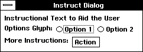
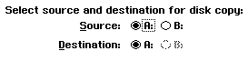
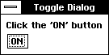

# 6 GenGlyph

The GenGlyph object allows you to easily display single lines of text without 
using a more complex GenText object. A GenGlyph can be thought of as a 
label in which you can display text but which offers no other functionality.

## 6.1 GenGlyph Features

Frequently throughout your application, you may need to write simple lines 
of text. In many cases, instructional text is needed to request the user to 
make a selection. In other cases, text may be needed to alert the user to a 
certain application condition. The GenGlyph offers a simple, easy to use text 
display object. Most often, a GenGlyph is used to display instructional text 
within dialog boxes.

**Figure 6-1** *A Collection of GenGlyphs.*  
*Glyphs are useful to write instructional text. The "Instructional Text...", 
"Options Glyph:" and "More Instructions:" text fields are all GenGlyphs.*

One other generic object, GenText, provides a powerful means to display text 
with functions such as word-wrapping, font scalability, and an arbitrarily 
large buffer size. If you do not need such a versatile and powerful text display 
capability, however, it is wiser and easier to use a GenGlyph. This object only 
displays text in the default font and style for your application.

## 6.2 GenGlyph Basics

The GenGlyph object does not, by itself, offer any instance fields or messages. 
The functionality of a GenGlyph object is included entirely within the 
instance fields and messages of its superclass, **GenClass**.

Unlike text within a GenText, the text of a GenGlyph is taken solely from the 
object's GI_visMoniker. Therefore, the primary use of a GenGlyph lies in its 
visual moniker. Any **GenClass** messages dealing with an object's visual 
moniker will modify the appearance of a GenGlyph.

A GenGlyph does not allow word-wrapping; if your text may be longer than 
the object's horizontal constraints, either break up the lines of text into 
smaller, single-line GenGlyphs or use a GenText object. 

**Figure 6-2** *Examples of GenGlyphs.*  
*In this example, the instruction line, along with the "Source:" and 
"Destination:" text objects are all GenGlyphs. 
The radio buttons (A:, B:) are GenItems within GenItemGroups.*

----------
**Code Display 6-1 Using Hints to Manage GenGlyphs**

	/* This code will duplicate the display shown in Figure 6-2 */

	@object GenInteractionClass DiskCopyBox = {
		GI_comp = @DiskCopyHeader, @SourceSelection, @DestinationSelection;
		GII_visibility = GIV_DIALOG;
		HINT_ORIENT_CHILDREN_VERTICALLY;
	}

	/* The DiskCopyHeader will be the line of instructional text. */

	@object GenGlyphClass DiskCopyHeader = {
		GI_visMoniker = "Select source and destination for disk copy:";
		HINT_CENTER_MONIKER;		/* Centers the moniker horizontally. */
	}

	/* These objects will form the "Source" line. */

	@object GenInteractionClass SourceSelection = {
		GI_comp = @SourceText, @SourceList;
		HINT_ORIENT_CHILDREN_HORIZONTALLY;
		HINT_CENTER_MONIKER;
	}

	/* This group of objects will form the "Destination" line. */

	@object GenInteractionClass DestinationSelection = {
		GI_comp = @DestinationText, @DestinationList;
		HINT_ORIENT_CHILDREN_HORIZONTALLY;
		HINT_CENTER_MONIKER;
	}

	/* For simplicity, the List objects are not shown. */

	@object GenGlyphClass SourceText = {
		GI_visMoniker = "Source:";
	}

	@object GenInteractionClass DestinationText = {
		GI_visMoniker = "Destination:";
	}

----------
## 6.3 Modifying a GenGlyph

You may wish at some point to change the text in a GenGlyph. Because a 
GenGlyph's text is entirely within its visual moniker, it is a simple matter to 
use **GenClass** messages to change the moniker dynamically. Use 
MSG_GEN_GET_VIS_MONIKER to return a GenGlyph's current moniker; use 
MSG_GEN_USE_VIS_MONIKER (or MSG_GEN_REPLACE_VIS_MONIKER) to 
set a new moniker for a GenGlyph. Doing so will ensure that the object is 
visually rebuilt with the new moniker.

 

**Figure 6-3** *A Toggleable GenGlyph * 
*This Glyph shows the before and after states of Code Display 6-2.*

----------

**Code Display 6-2 A Toggle On/Off Switch Dialog Box**

	@object GenInteractionClass MyDialogBox = {
		GI_comp = @DialogText, @DialogButton;
		GII_visibility = GIV_DIALOG;
	}
	
	/* Monikers for the Instructions (the GenGlyphs). */

	@visMoniker OnTextMoniker = "Click the `ON' button";
	@visMoniker OffTextMoniker = "Click the `OFF' button";

	/* Monikers for the triggers. */

	@visMoniker OnButtonMoniker = "ON";
	@visMoniker OffButtonMoniker = "OFF";

	/* The object begins in the "On" state. */

	@object GenGlyphClass DialogText = {
		GI_vismoniker = @OnTextMoniker;
	}

	/* Whenever the button is pressed, MSG_FLIP_THE_SWITCH will change both the glyph
	 * and the trigger monikers. */

	@object GenTriggerClass DialogButton = {
		GI_visMoniker = @OnButtonMoniker;
		GTI_actionMsg = MSG_FLIP_THE_SWITCH;
		GTI_destination = process;
	}

	@method MyProcessClass, MSG_FLIP_THE_SWITCH {
		ChunkHandle testMoniker;		/* Stores the temporary moniker. */
		testMoniker = @call DialogButton::MSG_GEN_GET_VIS_MONIKER;

	/* If the moniker is "ON", turn both it and the glyph to the Off monikers.
	 * Otherwise (the moniker is "OFF"), turn both it and the glyph to the On
	 * monikers. Both visual updates are delayed via the UI queue (and will therefore
	 * be updated at the same time rather than separately) to avoid flashing. */

		if (testMoniker == "ON") {
			@call DialogButton::MSG_GEN_USE_VIS_MONIKER(OptrToChunk(@OffButtonMoniker),
						VUM_DELAYED_VIA_UI_QUEUE);
			@call DialogText::MSG_GEN_USE_VIS_MONIKER(OptrToChunk(@OffTextMoniker),
								VUM_DELAYED_VIA_UI_QUEUE);
		}
		else {
			@call DialogButton::MSG_GEN_USE_VIS_MONIKER(OptrToChunk(@OnButtonMoniker),
						VUM_DELAYED_VIA_UI_QUEUE);
			@call DialogText::MSG_GEN_USE_VIS_MONIKER(OptrToChunk(@OnTextMoniker),
						VUM_DELAYED_VIA_UI_QUEUE);
		}
	}

[GenTrigger](ogentrg.md) <-- [Table of Contents](../objects.md) &nbsp;&nbsp; --> [GenInteraction](ogenint.md)