# 7 GenInteraction

GenInteraction is a high-level object whose purpose is to manage groups of 
other generic objects. These groups of objects can appear as part of a window, 
as their own menu or even as a separate dialog box. **GenInteractionClass** 
also provides the means to interpret actions of its children and adjust the 
behavior of the Interaction accordingly. Therefore, it is meaningless for an 
Interaction to appear without children to manage. 

**GenInteractionClass** is a subclass of **GenClass** and therefore inherits all 
of its functionality. Of special interest for GenInteractions is geometry 
management with hints provided in **GenClass**. See "GenClass," Chapter 2 
and "Managing UI Geometry," Chapter 12 of the Concepts Book for more 
information.

You should be familiar with generic objects before reading this chapter. 
Please see "The GEOS User Interface," Chapter 10 of the Concepts Book for 
an overview of each generic object in the user interface. You should be 
particularly familiar with the instance data of and messages handled by 
GenClass. (See "GenClass," Chapter 2.)

## 7.1 GenInteraction Features

Because of the nature of **GenInteractionClass**, objects of this class may 
appear in a variety of forms. The specific UI will have some control over the 
visual presentation of GenInteractions, but your application can usually 
specify in what manner the Interaction should appear. Your application may 
also add hints to the specific UI to modify the arrangement of objects within 
the Interaction.

GenInteraction provides three main visual implementations:

+ A sub-group, having no inherent visual representation at all. (The visual 
implementation depends on the Interaction's parent.)

+ A popup (typically a menu) remaining hidden from the application until 
activated, and then normally only remaining on-screen for the duration 
of the selection. 

+ An independently displayable window (dialog box) coming on-screen 
whenever activated and going off-screen whenever instructed to.

+ Popout dialog boxes which can act as sub-group GenInteractions (for 
example a menu bar) that can be "popped out" into dialog boxes. Note 
that popouts are not related to pop-ups.

Specifically, a GenInteraction also provides the following features:

+ organization of the spacial arrangement of other objects.

+ the capability to apply properties within an Interaction either 
immediately (in immediate mode) or at a later time (in delayed mode).

+ the display of progress reports on the state of a process or object.

+ the ability to initiate commands.

+ several default dialog boxes for notification and affirmation responses.

+ modal dialog boxes that block other threads of execution until responded 
to.

### 7.1.1 Sub-Group Interactions

A sub-group Interaction is the simplest manifestation of a GenInteraction. A 
sub-group may only appear as part of a larger window. You will most often 
use sub-group Interactions to arrange and group other objects (the 
Interaction's children) within proper places in the UI. This grouping is also 
sometimes useful to perform geometry actions upon and otherwise 
manipulate a group of objects as a whole. Using Interactions eliminates the 
need to provide individual requirements to each child object.

For example, you can use the hint HINT_ORIENT_CHILDREN_VERTICALLY 
on a single GenInteraction object to display its children in a vertical row. The 
Interaction's only function in this case is to provide an object for the hint to 
act upon. Interactions of this type may contain any number and type of 
children. Because they are not independently displayable, however, their use 
becomes limited to the constraints of the larger window. If you need the 
Interaction's children to be hidden from view until needed, you should use a 
popup or dialog Interaction.

**Figure 7-1** *Sub-Group Interactions*  
*The GenPrimary (GenInteraction Sample App) contains two Sub-Group 
Interaction children. The first groups the three children One, Two, and Three. 
The second groups the triggers Four, Five, and Six. The geometry is out of 
kilter due to different child spacing.*

### 7.1.2 Popup Interactions (Menus)

A popup is an Interaction that you can use to contain commands or selections 
that should only be displayed when the popup itself is activated. A popup 
usually conceals its children from view until needed, therefore avoiding 
cluttering up the UI with dozens of objects at any given time. Popups are 
most often implemented as menus. Popups usually only remain on-screen 
until either a selection within the popup is made or the user activates some 
other object. Menus in OSF/Motif, for example, will only remain on-screen 
until an object in the menu is selected or until the user clicks somewhere else 
in the application. (GEOS' implementation of OSF/Motif does allow popups to 
be pinned, however.)

Popups are not independently displayable; they must appear as part of 
another window. The popup Interaction's visual moniker usually serves as 
the only visual cue to the existence of the menu until it is activated. These 
menu titles usually appear in an appropriate menu bar of the window.

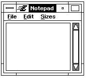 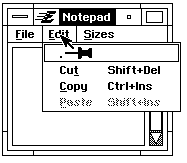

**Figure 7-2** *Popups in a GenPrimary.*  
*The GenInteraction's visual monikers are the only visual cue to the existence 
of popups. Once a menu is activated (by clicking on its menu title), the menu 
appears.*

### 7.1.3 Dialog Boxes

A dialog box is an Interaction that takes the form of an independently 
displayable window. Typically, a dialog box is a temporary window brought 
up by the application to request information from the user. Dialogs differ 
from Primary and Document windows in several ways, however. (For 
example, most dialogs are not resizable.). 

**Figure 7-3** *A Dialog Box.*  
*This dialog box prompts the user to answer either yes or no to a question.*

A dialog box can be in either of two conditions: modal or non-modal. By 
default, dialog boxes are non-modal. A modal dialog box is one in which all 
other input to the application is blocked until the user responds to the dialog. 
You will usually need modal dialog boxes when an application must gain 
some further information before proceeding. For example, many of the 
System Preferences dialog boxes are modal to prevent the user from 
changing other aspects of the system while these dialogs are up.

Dialog boxes come on-screen either through direct user activation or through 
the application's instigation. By default, a dialog box will usually have an 
associated trigger object placed within the UI. This trigger's only function is 
to allow the user to bring the dialog box on-screen. You may remove this 
default activation trigger if your application code should bring up the dialog 
box instead.

### 7.1.4 PopOuts

A popout GenInteraction is really just a grouping object that exists as either 
a simple sub-group or as a dialog box. Popouts generally begin life as 
sub-groups but can be "popped out" into dialog boxes that can be repositioned 
wherever the user wishes them. The dialog boxes can also be popped back 
into their sub-group arrangement.

  
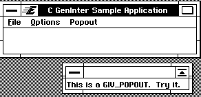

In general, the GenInteraction is either popped-out or popped-in by 
double-clicking within the Interaction bounds. 

**Figure 7-4** *Popouts*  
*In the sample application, the popout GenInteraction titled "This is a 
GIV_POPOUT, try it." is acting as a sub-group below the GenPrimary. When it 
is double-clicked on, it pops out into the dialog box shown.*

## 7.2 GenInteraction Instance Data

GenInteraction has a set of instance fields; all are listed in Code Display 7-1. 
Any objects of **GenInteractionClass** or one of its subclasses will contain 
these instance fields, along with the instance fields of **GenClass**.

----------
**Code Display 7-1 GenInteraction Instance Fields**

	@instance GenInteractionType GII_type = GIT_ORGANIZATIONAL;
	
	typedef ByteEnum GenInteractionType;
	#define GIT_ORGANIZATIONAL 0
	#define GIT_PROPERTIES 1
	#define GIT_PROGRESS 2
	#define GIT_COMMAND 3
	#define GIT_NOTIFICATION 4
	#define GIT_AFFIRMATION 5
	#define GIT_MULTIPLE_RESPONSE 6

	@instance GenInteractionVisibility GII_visibility = GIV_SUB_GROUP;

	typedef ByteEnum GenInteractionVisibility;
	#define GIV_NO_PREFERENCE 0
	#define GIV_POPUP 1
	#define GIV_SUB_GROUP 2
	#define GIV_CONTROL_GROUP 3
	#define GIV_DIALOG 4
	#define GIV_POPOUT 5

	@instance GenInteractionAttrs GII_attrs = 0;

	typedef ByteFlags GenInteractionAttrs;
	#define GIA_NOT_USER_INITIATABLE			0x80
	#define GIA_INITIATED_VIA_USER_DO_DIALOG	0x40
	#define GIA_MODAL							0x20
	#define GIA_SYS_MODAL						0x10

----------
*GII_type* describes the function of the GenInteraction. 

*GII_visibility* describes the visual implementation of the GenInteraction. 
Typically, this affects where and how the object and its children are arranged 
within the UI. A GenInteraction's visibility may also affect the behavior of the 
children, though this is generally a function of the *GII_type* field.

*GII_attrs* define attributes that affect how a GenInteraction is initiated, and 
whether input to other parts of the application (or system) is affected.

----------
**Code Display 7-2 GenInteraction Hints**

	/* 
	 * Hints that affect Properties GenInteractions. These hints are described in the 
	 * GIT_PROPERTIES GenInteraction section.
	 */

	@vardata void HINT_INTERACTION_SINGLE_USAGE;
	@vardata void HINT_INTERACTION_COMPLEX_PROPERTIES;
	@vardata void HINT_INTERACTION_SIMPLE_PROPERTIES;
	@vardata void HINT_INTERACTION_RELATED_PROPERTIES;
	@vardata void HINT_INTERACTION_UNRELATED_PROPERTIES;
	@vardata void HINT_INTERACTION_SLOW_RESPONSE_PROPERTIES;
	@vardata void HINT_INTERACTION_FAST_RESPONSE_PROPERTIES;
	@vardata void HINT_INTERACTION_REQUIRES_VALIDATION;

	/* Hints that affect all types of GenInteractions. */

	@vardata void HINT_INTERACTION_FREQUENT_USAGE;
	@vardata void HINT_INTERACTION_INFREQUENT_USAGE;
	@vardata void HINT_INTERACTION_MAKE_RESIZABLE;
	@vardata void HINT_INTERACTION_CANNOT_BE_DEFAULT;
	@vardata void HINT_INTERACTION_MODAL;
	@vardata void HINT_INTERACTION_NO_DISTURB;
	@vardata void HINT_INTERACTION_DEFAULT_ACTION_IS_NAVIGATE_TO_NEXT_FIELD;
	@vardata void HINT_CUSTOM_SYS_MENU;
	@vardata void HINT_INTERACTION_MAXIMIZABLE;
	@vardata void HINT_INTERACTION_POPOUT_HIDDEN_ON_STARTUP;

----------

HINT_INTERACTION_FREQUENT_USAGE indicates that the 
GenInteraction is frequently used, and the specific UI may alter default 
functionality to reflect this. In most cases, this prevents dialog boxes from 
being automatically dismissed when the user is done interacting with them.

HINT_INTERACTION_INFREQUENT_USAGE indicates that the 
GenInteraction is infrequently used. In some specific UIs, this prevents 
sub-menus from automatically cascading.

HINT_INTERACTION_MAKE_RESIZABLE indicates that this GenInteraction 
may be resized even if it not normally allowed to do so. This hint usually only 
applies to dialog boxes.

HINT_INTERACTION_CANNOT_BE_DEFAULT indicates that this 
GenInteraction should not be activated as a system default. This hint 
prevents children of this GenInteraction from being activated as system 
defaults also. You should use this hint to mark groups of objects that may be 
potentially destructive; the user will be prevented from accidentally 
activating any objects in the GenInteraction.

HINT_INTERACTION_MODAL indicates that this GenInteraction (a dialog 
box) should be application modal. This hint should be used in place of 
GIA_MODAL in cases where modality is not needed for functionality, but is 
needed to present a cleaner UI to the user. Ideally, you should be able to go 
back and remove these hints by reworking the UI at some later time.

HINT_INTERACTION_NO_DISTURB indicates that this GenInteraction, if 
initiated, should be brought on-screen without disturbing the focus of the 
application. Usually, this hint is placed on notification type dialog boxes 
(such as new-mail notifications) so that the dialog box doesn't irritate the 
user by drawing away the focus.

HINT_INTERACTION_DEFAULT_ACTION_IS_NAVIGATE_TO_NEXT_FIELD 
indicates that the default action for this Interaction group is to navigate to 
the next field. If something activates the GenInteraction's default action (for 
example by double-clicking within its confines) objects within the Interaction 
will not be activated; the focus will travel to the next field.

HINT_CUSTOM_SYS_MENU indicates that this GenInteraction menu is a 
custom system menu. Depending on the specific UI, the standard system 
menu will be added as a sub-menu of the custom system menu. This hint 
takes an integer value that specifies the child position to place the standard 
system menu (0 being the first position).

HINT_INTERACTION_MAXIMIZABLE indicates that this GenInteraction 
should be maximizable. This hint also allows the GenInteraction to become 
restorable to its non-maximizable state.

HINT_INTERACTION_POPOUT_HIDDEN_ON_STARTUP indicates that the 
GIV_POPOUT GenInteraction should be initially off-screen.

----------
**Code Display 7-3 GenInteraction Optional Attributes**

	/* Optional Attributes. */

	@vardata byte ATTR_GEN_INTERACTION_GROUP_TYPE;						/* GenInteractionGroupType */

	typedef ByteEnum GenInteractionGroupType;
	#define GIGT_FILE_MENU 0
	#define GIGT_EDIT_MENU 1
	#define GIGT_VIEW_MENU 2
	#define GIGT_OPTIONS_MENU 3
	#define GIGT_WINDOW_MENU 4
	#define GIGT_HELP_MENU 5
	#define GIGT_PRINT_GROUP 6

	@vardata void ATTR_GEN_INTERACTION_OVERRIDE_INPUT_RESTRICTIONS;
	@vardata void ATTR_GEN_INTERACTION_ABIDE_BY_INPUT_RESTRICTIONS;
	@vardata void ATTR_GEN_INTERACTION_POPPED_OUT;
	@vardata void ATTR_GEN_INTERACTION_POPOUT_NOT_CLOSABLE;

----------
ATTR_GEN_INTERACTION_GROUP_TYPE indicates that this GenInteraction 
(typically a menu) is a special group that the specific UI should be aware of. 
This optional attribute takes a **GenInteractionGroupType** as its 
argument. For more information on these standard menus, see "Standard 
Interactions (Menus)" below.

ATTR_GEN_INTERACTION_OVERRIDE_INPUT_RESTRICTIONS instructs the 
specific UI to override any input restrictions in place on a modal dialog box. 
Many dialog types (GIT_PROGRESS, GIT_NOTIFICATION, GIT_AFFIRMATION 
and GIT_MULTIPLE_RESPONSE) override these input restrictions by default 
anyway; this hint is for use in cases where this override is not provided.

ATTR_GEN_INTERACTION_ABIDE_BY_INPUT_RESTRICTIONS instructs the 
specific UI to abide by any input restrictions in place on a modal dialog box. 
In general, this changes the default behavior for many dialog types 
(GIT_PROGRESS, GIT_NOTIFICATION, GIT_AFFIRMATION and 
GIT_MULTIPLE_RESPONSE) which normally override any input restrictions 
be default.

ATTR_GEN_INTERACTION_POPPED_OUT indicates that a GIV_POPOUT 
GenInteraction is in its popped-out state. Absence of this optional attribute 
indicates that the popout is in its popped-in state. This attribute can be set 
initially, in which case the Popout will appear popped out. This attribute is 
also set internally by the UI whenever the state of the GIV_POPOUT changes.

ATTR_GEN_INTERACTION_POPOUT_NOT_CLOSABLE indicates that a 
GIV_POPOUT, when popped out in its dialog box state, will not be closable; 
you will only be able to pop it back into its sub-group state.

### 7.2.1 GenInteraction Visibility

	GII_visibility, MSG_GEN_INTERACTION_GET_VISIBILITY, 
	MSG_GEN_INTERACTION_SET_VISIBILITY

The *GII_visibility* instance field describes in what manner the user interface 
will display the Interaction. This is important for GenInteractions because of 
the wide variety of ways they may appear within an application. In most 
cases, this attribute will not directly affect the functionality of the children 
of the Interaction but only the visual implementation and specific UI 
activations of the objects. 

Certain *GII_types* (see below) may only be meaningful under certain 
*GII_visibility* types, however. For example, GIT_NOTIFICATION, 
GIT_AFFIRMATION, and GIT_MULTIPLE_RESPONSE gain most of their 
significant functionality within dialog boxes (visibility GIV_DIALOG). In 
these cases the visibility will affect the functionality of the Interaction.

Each of the following visibilities is an enumeration of type 
*GenInteractionVisibility*; therefore, you may select one and only one of the 
following types for your Interaction. By default, a GenInteraction is 
GIV_SUB_GROUP.

GIV_SUB_GROUP  
This specifies that the Interaction serves as a visual grouping 
of objects within a larger window. This visibility creates an 
Interaction within the parent window and is therefore not 
independently displayable. This visibility is the default case.

GIV_POPUP  
This specifies that this Interaction is temporary and only 
appears on-screen for the duration of a single selection. In most 
specific UIs, the popup will stay up until either an object in the 
Interaction is activated or until the user clicks somewhere else. 
Some specific UIs allow a menu to be pinned, however. The 
most common manifestation of a popup is a menu. Popups 
typically appear within appropriate "menu bars" of an 
application but may be independently displayable under 
different specific UIs. 

GIV_DIALOG  
This specifies that this Interaction should appear as a dialog 
box. A dialog box is a temporary window used to display 
controls or request information from the user. A dialog box can 
typically contain any number or variety of other generic 
objects. A dialog box may be either modal or non-modal.

GIV_CONTROL_GROUP  
This specifies that this Interaction contains controls and 
therefore should not appear as a popup Interaction. This 
prevents the Interaction from disappearing before the user can 
select an entry in the control group. A control group Interaction 
may appear as either a sub-group or dialog, depending on the 
specific UI and its position within the application's generic 
object tree.

GIV_NO_PREFERENCE  
This specifies that there is no visual preference for this 
Interaction. The specific UI will create the Interaction based on 
hints, the types of children it contains, and its location in the 
generic tree.

You may also retrieve or set the visibility of any Interaction at run-time. To 
retrieve the **GenInteractionVisibility** stored in *GII_visibility*, send the 
Interaction a MSG_GEN_INTERACTION_GET_VISIBILITY. You can set the 
visibility of any Interaction by sending it a 
MSG_GEN_INTERACTION_SET_VISIBILITY. Make sure that any Interaction 
you set the visibility for is not currently GS_USABLE or an error will result.

----------
#### MSG_GEN_INTERACTION_GET_VISIBILITY

	byte	MSG_GEN_INTERACTION_GET_VISIBILITY();

This message retrieves the current **GenInteractionVisibility** stored in the 
*GII_visibility* instance field of an Interaction.

Source:	Unrestricted.

**Destination:** Any GenInteraction object.

**Parameters:** None.

**Return:** **GenInteractionVisibility** of the Interaction object.

**Interception:** Generally not intercepted.

----------
#### MSG_GEN_INTERACTION_SET_VISIBILITY

	void	MSG_GEN_INTERACTION_SET_VISIBILITY(
			byte	visibility);

This message sets the *GII_visibility* instance data for the GenInteraction. 
This message must pass a valid **GenInteractionVisibility** type to the 
Interaction object. The Interaction must not be GS_USABLE when receiving 
this message. The new visibility will take effect when the Interaction is next 
made GS_USABLE.

**Source:** Unrestricted.

**Destination:** Any non-usable GenInteraction object.

**Parameters:**  
*visibility* - **GenInteractionVisibility** for interaction.

**Return:** Nothing.

**Interception:** Generally not intercepted.

**Warnings:** Make sure that the object sent this message is not GS_USABLE.

#### 7.2.2 Standard Interactions (Menus)
	ATTR_GEN_INTERACTION_GROUP_TYPE, GenInteractionGroupType

Often you will set up standard menus such as the File menu, the Window 
menu, the Edit menu, and the View menu. You can set these menus up very 
simply, with the attribute ATTR_GEN_INTERACTION_GROUP_TYPE.

This attribute specifies the type of menu the GenInteraction is via a value of 
type **GenInteractionGroupType**. This can be any of the following:

GIGT_FILE_MENU  
Creates a standard File menu. Typically has a document 
control and print control as its children.

GIGT_EDIT_MENU  
Creates a standard Edit menu with Cut, Copy, Paste, and Undo 
as appropriate. Typically has a GenEditControl as its child.

GIGT_VIEW_MENU  
Creates a standard View menu; typically has a GenView 
controller as its child.

GIGT_OPTIONS_MENU  
Creates a standard Options menu; typically, this menu has 
application-specific option entries as well as a GenToolControl 
as its children.

GIGT_WINDOW_MENU  
Creates a standard Window menu; typically has a display 
controller as its child.

GIGT_HELP_MENU  
Creates a standard Help menu; typically has the help objects as 
its children.

GIGT_PRINT_GROUP  
Indicates that the GenInteraction is the print group. Typically 
contains a print controller and other print commands.

Each of the above types will set up the proper GenInteraction attributes and 
other generic objects to complete the interactions. Thus, by setting up a 
GenInteraction like this:

	@object GenInteractionClass MyEditMenu = {
		GI_comp = MyEditControl;
		GII_visibility = GIV_POPUP;
		ATTR_GEN_INTERACTION_GROUP_TYPE =
				(GIGT_EDIT_MENU);
	}

you can have a complete Edit menu in your program. (Of course, you must 
also supply the GenEditControl object that would be MyEditControl in the 
example.)

### 7.2.3 GenInteraction Types

	GII_type, MSG_GEN_INTERACTION_GET_TYPE, 
	MSG_GEN_INTERACTION_SET_TYPE

The *GII_type* instance field describes the contents of the Interaction. This 
attribute depends on the makeup of the children within the Interaction. 
(Note that it would be unusual for an Interaction to appear without children.) 
In most cases, this will directly affect the functionality of the particular 
Interaction. Every GenInteraction object should contain children that 
perform some function within the UI. That function is determined in part by 
this instance field.

Each of the following types is an enumeration of **GenInteractionType**; 
therefore, you may select one and only one of the following types for your 
Interaction. By default, a GenInteraction is GIT_ORGANIZATIONAL. 

GIT_ORGANIZATIONAL  
This specifies that the Interaction is merely organizational. 
This allows the Interaction to provide geometry management 
(and not much else) to its children. Any objects within an 
organizational Interaction should be able to perform their 
actions independently. Organizational Interactions may 
appear in any visual form: sub-groups, menus, or dialog boxes.

GIT_PROPERTIES  
This specifies that the Interaction contains properties 
(attributes) that the user can change. Typically, a properties 
Interaction will operate in one of two modes: immediate or 
delayed. If the *GII_visibility* attribute causes this Interaction to 
appear as a dialog box, the specific UI may create "Apply" and 
"Reset" triggers. In delayed mode, an apply trigger allows the 
Interaction to process changes made within the properties 
Interaction as a group rather than individually; the reset 
trigger allows the Interaction to reset the properties to their 
former state. If a popup is GIT_PROPERTIES, it will operate in 
immediate mode even if hints attempt to override this.

GIT_PROGRESS  
This specifies that the Interaction displays a progress report 
for some operation. For example, a dialog box may appear 
showing a disk copy operation with the time remaining to its 
completion. If the *GII_visibility* attribute causes this 
Interaction to appear as a dialog box, the specific UI may create 
a "Stop" trigger that halts the operation in progress and the 
progress reporting. Your application is responsible for stopping 
the Interaction from communicating its progress report and 
may dismiss the Interaction if the specific UI desires.

GIT_COMMAND  
This specifies that the Interaction contains commands that the 
application provides. If the *GII_visibility* attribute causes this 
Interaction to appear as a dialog box, the specific UI may create 
a "Close" trigger to dismiss the dialog. You will have to supply 
your own specific command triggers within a GIT_COMMAND 
dialog box. 

GIT_NOTIFICATION  
This specifies that the Interaction sends notification of some 
event. If the *GII_visibility* attribute causes this Interaction to 
appear as a dialog box, the specific UI may create an "OK" 
trigger that the user can press to acknowledge the notification.

GIT_AFFIRMATION  
This specifies that the Interaction asks for confirmation of an 
operation. If the GII_visibility attribute causes this Interaction 
to appear as a dialog box, the specific UI may create "Yes" and 
"No" triggers. Depending upon the Specific UI, these triggers 
may dismiss the dialog box.

GIT_MULTIPLE_RESPONSE  
This specifies that this Interaction may include multiple items 
that the user can respond to. (Your application should add 
custom response triggers using the GenTrigger's vardata 
ATTR_GEN_TRIGGER_INTERACTION_COMMAND.) If you wish 
these triggers to appear in a dialog box reply bar, use 
HINT_SEEK_REPLY_BAR.

You may retrieve or set the type of any Interaction at run-time. To retrieve 
the **GenInteractionType** stored in the *GII_type* instance field, send 
MSG_GEN_INTERACTION_GET_TYPE. You can set the type of any Interaction 
by sending it MSG_GEN_INTERACTION_SET_TYPE. Make sure that any 
Interaction you set the type for is not currently GS_USABLE or an error will 
result.

----------
#### MSG_GEN_INTERACTION_GET_TYPE

	byte	MSG_GEN_INTERACTION_GET_TYPE();

This message returns the current **GenInteractionType** stored in the 
*GII_type* instance field for the Interaction.

**Source:** Unrestricted.

**Destination:** Any GenInteraction object.

**Parameters:** None.

**Return:** GenInteractionType of the Interaction.

**Interception:** Generally not intercepted.

----------
#### MSG_GEN_INTERACTION_SET_TYPE

	void	MSG_GEN_INTERACTION_SET_TYPE(
			byte	type);

This message sets the *GII_type* instance data for the GenInteraction. This 
message must pass a valid **GenInteractionType** enumerated type to the 
Interaction object. The Interaction must not be GS_USABLE when receiving 
this message; the new type will take effect when the Interaction is next made 
GS_USABLE.

**Source:** Unrestricted.

**Destination:** Any non-usable GenInteraction object.

**Parameters:**  
*type* - **GenInteractionType** for the Interaction.

**Return:** Nothing.

**Interception:** Generally not intercepted.

**Warnings:** Make sure that the object is not GS_USABLE when sending it this 
message.

### 7.2.4 GenInteraction Attributes

	GII_attrs, MSG_GEN_INTERACTION_GET_ATTRS, 
	MSG_GEN_INTERACTION_SET_ATTRS

The *GII_attrs* instance field describes how the Interaction behaves under 
various circumstances. These attributes only affect the behavior of dialog 
boxes. If the Interaction given these attributes is not a dialog box, the 
attributes will have no effect. This field specifies how a GIV_DIALOG 
Interaction may be initiated and whether input to other parts of the UI is 
allowed while the Interaction is active. The *GII_attrs* instance field is a 
bitfield and therefore any combination of these attributes may be set. 

None of these attributes is set by default.

GIA_NOT_USER_INITIATABLE  
This attribute specifies that the user cannot bring up the dialog 
directly. Unless this attribute is set, most specific UIs will place 
a default activation trigger within a proper place in the UI to 
initiate the dialog box. This attribute prevents this trigger from 
appearing. To bring up a dialog box set 
GIA_NOT_USER_INITIATABLE, your application must send the 
dialog a MSG_GEN_INTERACTION_INITIATE. Usually, these 
Interactions should be direct children of either a GenPrimary 
or GenApplication. 

GIA_INITIATED_VIA_USER_DO_DIALOG  
This attribute specifies that the application brings up this 
Interaction through **UserDoDialog()**. You should use this 
routine in special cases where you need the user to respond to 
a dialog box before continuing with your application thread. 
(This routine blocks the calling thread until the user responds 
to the dialog box.) Any dialog boxes marked with this attribute 
should not be initiated with 
MSG_GEN_INTERACTION_INITIATE.

GIA_MODAL  
This attribute specifies that while this dialog is up, all other 
input to the application should be ignored. This attribute will 
create an application modal dialog box.

GIA_SYS_MODAL  
This attribute specifies that while this dialog is up, all other 
input to the system (including other applications) should be 
ignored. This attribute will create a system modal dialog box.

You may retrieve or set the *GII_attrs* of any Interaction at run-time. To 
retrieve the **GenInteractionAttrs**, send the Interaction a 
MSG_GEN_INTERACTION_GET_ATTRS. You can set the 
**GenInteractionAttrs** of any Interaction by sending it a 
MSG_GEN_INTERACTION_SET_ATTRS. Make sure that any Interaction you 
set these attributes for is not currently GS_USABLE or an error will result.

If your application contains several dialog boxes sitting directly under a 
GenPrimary (typically with their GIA_NOT_USER_INITIATABLE attribute), 
the application may take longer to start up. This happens because the system 
will have to process each of the dialogs individually and determine at that 
point that a trigger should not be created for them.

You may instead wish to create an organizational Interaction to manage 
these non-user initiatable Interactions. To do this, create a single 
GIT_ORGANIZATIONAL GIA_NOT_USER_INITIATABLE dialog box under the 
GenPrimary. All "real" dialogs should then be placed as children of this 
"holding" Interaction. When the application starts up, it only needs to process 
this one Interaction. 

Grouping dialogs in this way also allows easier initiation and dismissal of the 
dialogs all at once. Simply encapsulate MSG_GEN_INTERACTION_INITIATE 
or MSG_GEN_GUP_INTERACTION_COMMAND with IC_DISMISS and use 
MSG_GEN_SEND_TO_CHILDREN on the one Interaction.

----------
#### MSG_GEN_INTERACTION_GET_ATTRS

	byte	MSG_GEN_INTERACTION_GET_ATTRS();

This message retrieves the current *GII_attrs* instance field from the 
Interaction sent the message.

**Source:** Unrestricted.

**Destination:** Any GenInteraction object.

**Parameters:** None.

**Return:** **GenInteractionAttrs** of the Interaction.

**Interception:** Generally not intercepted.

----------
#### MSG_GEN_INTERACTION_SET_ATTRS

	void	MSG_GEN_INTERACTION_SET_ATTRS(
			byte	setAttrs,
			byte	clearAttrs);

This message sets the *GII_attrs* instance data for the GenInteraction sent the 
message. The Interaction must not be GS_USABLE when receiving this 
message. The new attributes will take effect when the Interaction is next 
made GS_USABLE.

**Source:** Unrestricted.

**Destination:** Any non-usable GenInteraction object.

**Parameters:**  
*setAttrs* - **GenInteractionAttrs** to set.

*clearAttrs* - **GenInteractionAttrs** to clear.

**Return:** Nothing.

**Interception:** Generally not intercepted.

**Warnings:** Make sure that the object is not GS_USABLE when sending it this 
message.

## 7.3 GenInteraction Usage

You will probably need to create GenInteractions at various points within 
your application. The GenInteraction object is one of the most flexible generic 
objects within GEOS. Not only can an Interaction operate as a menu, dialog, 
or sub-group, but there also exist several pre-defined dialog boxes with 
default triggers for your use. These dialogs will make writing your 
application easier and faster. The simplest way to see the wide variety of 
options available to you is to examine the different types of Interactions 
available with different instance data values.

### 7.3.1 Visibilities

When first creating an Interaction, you must decide in what form to visually 
present your communication between the application and the user. This 
concern may be somewhat cosmetic in form but may also affect the 
functionality of the Interaction itself. For instance, more than one 
**GenInteractionType** will support different actions with different visibility 
types.

#### 7.3.1.1 GenInteraction Sub-Groups (GIV_SUB_GROUP)

The simplest GenInteraction is one used to arrange the geometry of other 
objects. To do this, a GenInteraction should be GIV_SUB_GROUP (the 
default).

You can use hints provided in GenClass to arrange the appearance of objects 
within the GenInteraction. Interactions usually provide the greatest 
flexibility for geometry manipulation. For full information, see "Managing UI 
Geometry," Chapter 12 of the Concepts Book.

Note that a GIV_SUB_GROUP Interaction may only appear within a parent 
window as it is not itself independently displayable.

----------
**Code Display 7-4 Arranging a Group of Children**

	/* This Interaction creates a typical number keypad arrangement. */

	@object GenInteractionClass MyKeyPad = {
		/* The Interaction by default is GIV_SUB_GROUP and 	GIT_ORGANIZATIONAL,
		 * so there is no need to set these types. */
		GI_comp = Row789, Row456, Row123;
		/* The Interaction's three children will be arranged vertically. The
		 * UI will also draw a border around the Interaction itself. */
		HINT_ORIENT_CHILDREN_VERTICALLY;
		HINT_DRAW_IN_BOX;
	}

	@object GenInteractionClass Row789= {
		GI_comp = Key7, Key8, Key9;
		/* Each row is then arranged horizontally to gain three rows
		 * of three items each. */
		HINT_ORIENT_CHILDREN_HORIZONTALLY;
	}

	@object GenInteractionClass Row456= {
		GI_comp = Key4, Key5, Key6;
		HINT_ORIENT_CHILDREN_HORIZONTALLY;
	}

	@object GenInteractionClass Row123= {
		GI_comp = Key1, Key2, Key3;
		HINT_ORIENT_CHILDREN_HORIZONTALLY;
	}

	/* Each of the child `keys' will be a GenTrigger with appropriate visual
	 * moniker. (For simplicity, only one trigger is shown here.) */
	@object GenTriggerClass Key9 = {
		GI_visMoniker = "9";
	}

----------
Many hints from **GenClass** may affect the appearance of GIV_SUB_GROUP 
Interactions. See "Managing UI Geometry," Chapter 12 of the Concepts Book 
for details. 

**Figure 7-5** *A Keypad example*  
*The main GenInteraction sub-group is drawn within a box. The smaller 
sub-groups (the horizontal rows) each contain three trigger children.*

Of special interest to sub-group Interactions is HINT_DRAW_IN_BOX. This 
hint will enclose the associated Interaction within a line border. You should 
use this hint when you wish to distinguish a collection of objects within an 
Interaction from some other objects.

#### 7.3.1.2 GenInteractions as Menus (GIV_POPUP)

Most specific UIs implement GIV_POPUP as a menu. Menus are interactions 
with options that only appear when the menu is activated by the user. 
Popups make it possible for a user to browse and choose among a variety of 
commands without cluttering up the UI with dozens of objects. A popup may 
appear at almost any location within the UI. If a popup is placed as a direct 
child of a GenPrimary, it may appear in an appropriate menu bar location 
across the top of the window. (See Figure 7-6 below.)

A popup is most often one of GIT_ORGANIZATIONAL, GIT_PROPERTIES, or 
GIT_COMMAND. (See "GenInteraction Types" on page 399.) What type of 
popup you select depends on the type of children the Interaction contains. For 
example, an application may implement a font menu as a GIT_PROPERTIES 
popup. A GIT_COMMAND popup might issue commands relating to the 
appearance of text within a text editor. Depending on the 
**GenInteractionType**, a popup may appear in forms other than a menu. 
(The specific UI has final say over the appearance of a popup.)

A GIV_POPUP Interaction must contain a group of children. If the Interaction 
appears as a menu, these children will become menu items. Most often, these 
children will be GenTriggers or GenItems within GenItemGroups.

----------
**Code Display 7-5 Using a GenInteraction to Create a Menu**

	/* This example is taken from the Hello World sample application. */

	@object GenInteractionClass HelloMenu = {
		GI_visMoniker = 'M', "Menu";	/* The moniker of the menu is used in
					 * the primary window's menu bar (if the
					 * specific UI employs a menu bar). */
		GI_comp = HelloColorBox;		/* The only child of the menu (the only
					 * item in the menu) is the dialog box. */
		GII_visibility = GIV_POPUP;		/* This attribute designates the
					 * interaction as a menu or a sub-menu. */
	}

	@object GenInteractionClass HelloColorBox = {
		GI_comp = HelloBlueTrigger, HelloGoldTrigger;
		GI_visMoniker = 'C', "Color";
		GII_visibility = GIV_DIALOG;
	}

	@object GenTriggerClass HelloBlueTrigger = {
		GI_visMoniker = 'B', "Blue";	/* The 'B' indicates the keyboard navigation
				 * character for this trigger. */
		GTI_destination = process;		/* Send the message to the Process object. */
		GTI_actionMsg = MSG_HELLO_CHANGE_TO_BLUE;	/* Send this message. */
	}

	@object GenTriggerClass HelloGoldTrigger = {
		GI_visMoniker = 'G', "Gold";	/* The 'G' indicates the keyboard navigation
				 * character for this trigger. */
		GTI_destination = process;		/* Send the message to the Process object. */
		GTI_actionMsg = MSG_HELLO_CHANGE_TO_GOLD;	/* Send this message. */
	}

----------

 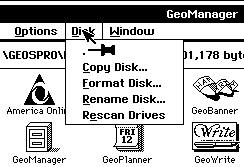

**Figure 7-6** *GenInteractions as Popups (Menus)*  
*Menus can have a variety of children. Here, the "Options" menu consists of a 
GenBooleanGroup containing five GenBoolean children and a single 
GenTrigger. The "Disk" menu consists of four GenTriggers.*

If a child of the GIV_POPUP Interaction is another Interaction, the specific UI 
might change the visual implementation of that child. What change takes 
place depends on the specific UI. In OSF/Motif, for example, placing a 
sub-group Interaction within a popup Interaction causes the UI to draw lines 
separating the sub-group from the other children in the popup. (You may 
prevent this line by adding HINT_SAME_CATEGORY_AS_PARENT.)

**Figure 7-7** *Interactions Within Popups*  
*This popup (Menu) contains a sub-group interaction (the item group) which is 
separated from the other menu items by a solid line. The menu items for the 
dialog box and the sub-menu contain indicators (an ellipsis and an arrow) to 
show that these menu items lead to other objects.*

Placing a popup interaction within another popup is a special case and will 
create nested menus under most specific UIs. To do this, merely create a 
GIV_POPUP Interaction as a child of another GIV_POPUP Interaction. The 
specific UI will automatically create the second menu as a sub-menu of the 
first. The item in the menu bringing up the sub-menu may be labeled with an 
arrow under certain specific UIs. (See Figure 7-8.) Menus may be nested to 
an arbitrary number of levels. 

**Figure 7-8** *GenInteraction with Nested Menus*  
*Both the Text and Justification GenInteractions are set GIV_POPUP. Note that 
OSF/Motif supplies an arrow leading to the sub-menu.*

----------

**Code Display 7-6 Nested Menus**

	@object GenInteractionClass TextMenu = {
		GI_comp = JustificationSubMenu;
		GI_visMoniker = `T', "Text";
		GII_visibility = GIV_POPUP;
	}

	@object GenInteractionClass JustificationMenu = {
		GI_comp = JustificationList;
		GI_visMoniker = `J', "Justification";
		GII_visibility = GIV_POPUP;
	}

	@object GenItemGroupClass JustificationList = {
		GI_comp = LeftEntry, RightEntry, CenterEntry, FullEntry;
		/* These children are not shown. */
	}

----------

List Objects (GenItemGroups and GenBooleanGroups) within a GIV_POPUP 
Interaction may be used to show object properties in a menu. The menu 
should be GIT_PROPERTIES in this case. Depending on the Specific UI, a 
properties menu may be implemented in a different fashion from other 
menus. (In OSF/Motif, there is no visual difference between a properties 
menu and other menus.) Other types have no effect on the behavior or 
appearance of GIV_POPUPs.

#### 7.3.1.3 GenInteractions as Dialog Boxes (GIV_DIALOG)

The GIV_DIALOG visibility will instruct the specific UI to build the 
Interaction as a dialog box. A dialog box is an independently - displayable 
interface element used to display information or other UI objects. Therefore, 
it is similar to a window although there are some differences. (Most dialog 
boxes, for example, are not resizable whereas most windows are.)

Dialog boxes also enhance the functionality of other **GenInteractionTypes**. 
Many GII_types are only significant as dialog boxes. For example, a 
GIT_NOTIFICATION Interaction will only appear with an "OK" trigger if it is 
also a dialog box. A GIT_PROPERTIES Interaction may contain properties 
within any visibility, but only if built as a dialog can it implement delayed 
mode. (If a GIT_PROPERTIES Interaction is built as a menu or sub-group, it 
will always operate in immediate mode.) Delayed mode allows the user to 
change the properties of an object and later apply those changes all at once. 
Within a dialog box, an "Apply" trigger will make these changes.

Most specific UIs will build a dialog box with an activation trigger present in 
the UI that brings up the dialog box. These dialog boxes are known as user 
initiatable. There are ways to override this behavior if you need a non-user 
initiatable dialog box or a dialog box that blocks the calling thread until 
answered (forcing the user to respond to the dialog box immediately). See 
"Modality for Dialogs" below.

**Figure 7-9** *Properties Dialog in Delayed Mode*  
*This dialog box operates in delayed mode because it supplies a trigger to apply 
changes made.*

By default, dialog boxes are not resizable. They will not contain any resizing 
mechanism. HINT_INTERACTION_MAKE_RESIZABLE may be used on such a 
non-modal dialog box to make that dialog resizable. In OSF/Motif, the Specific 
UI will supply such a dialog with a means to alter its shape.

HINT_INTERACTION_MAKE_RESIZABLE is only meaningful for GIV_DIALOG 
Interactions. By default, dialog boxes cannot be resized; their dimensions are 
solely dependent on the number and type of children the dialog contains. Any 
dialog boxes created with this hint may contain a resizing mechanism to alter 
their visible dimensions. 

#### 7.3.1.4 GenInteractions as Popouts (GIV_POPOUTS)

	MSG_GEN_INTERACTION_POP_IN, MSG_GEN_INTERACTION_POP_OUT, 
	MSG_GEN_INTERACTION_TOGGLE_POPOUT

Popouts are special GenInteractions that may act as either sub-group 
Interactions and as dialog boxes, depending on what state they are in. 
Usually, popouts act as normal sub-group Interactions until the user or the 
application "pops" them out into a dialog box. Popouts are normally "popped 
out" into their dialog box state by double-clicking within the confines of the 
GenInteraction. This popout state is reflected with either the presence or 
absence of the ATTR_GEN_INTERACTION_POPPED_OUT vardata entry.

You can pop out a GIV_POPOUT GenInteraction in its sub-group state by 
sending it MSG_GEN_INTERACTION_POP_OUT. Similarly, you can pop a 
GIV_POPOUT back into its sub-group state from the dialog box state by 
sending it MSG_GEN_INTERACTION_POP_IN. 
MSG_GEN_INTERACTION_TOGGLE_POPOUT toggles a popout from whatever 
state it currently is into its other state.

**Figure 7-10** *A "popped out" Popout*  
*The dialog box of the GIV_POPOUT in its popped-out state provides both a 
default close trigger (on the left hand side of the dialog title bar) and a 
"pop-in" button, on the right-hand side of the title bar)*.

By default, popouts in their dialog box state contain a special trigger to pop 
them back into their sub-group state. They may also be popped back in by 
double-clicking within the popped-out GenInteraction. Popouts also 
normally provide a close trigger; this trigger dismisses the dialog box but 
does not return the popout to its sub-group state. You should provide a trigger 
somewhere within your UI that sends MSG_GEN_INTERACTION_POP_IN or 
MSG_GEN_INTERACTION_POP_OUT to the popout, so that the user can bring 
any popout they dismiss back on-screen. Alternatively, you can add 
ATTR_GEN_INTERACTION_POPOUT_NOT_CLOSABLE on the Popout to 
prevent the creation of a "Close" trigger.

### 7.3.2 Types

Possibly more important than how an Interaction is visually displayed is 
what role that Interaction should play within your UI. That role depends in 
part on what children the Interaction contains. What the Interaction does 
with those children is determined by the **GenInteractionType** of that 
object. Interactions of different visibility may function in essentially the 
same manner, but Interactions of different types may differ greatly in their 
functionality.

For example, if an Interaction contains a GenItemGroup with three GenItem 
children, it will not affect the basic functionality if that Interaction is built as 
a dialog, popup, or sub-group. Each item will still perform its default function 
(such as sending a message). The *GII_type* of Interaction might affect that 
functionality, however, by forcing the Items to send out their messages as a 
group or individually (for example in a GIT_PROPERTIES Interaction).

You should pick the **GenInteractionType** based on what actions you wish 
to perform on the children you select for the Interaction. By default, an 
Interaction is of type GIT_ORGANIZATIONAL. In some cases, the 
functionality you need will reside entirely with the children; in those cases, 
a GIT_ORGANIZATIONAL will most likely suffice.

Certain *GenInteractionType* Interactions, if built as GIV_DIALOG, may 
create a reply bar with *standard response triggers*. A reply bar is a special 
area of a dialog Interaction to place commands for user responses. Standard 
response triggers perform additional actions for dialog Interactions, apart 
from any functionality your application provides. You do not need to add 
these triggers yourself; they are added by the Specific UI.

Standard response triggers perform one of several pre-defined 
**InteractionCommand** commands. Depending on the particular type of 
Interaction, each command may perform different actions. An 
**InteractionCommand** is a special data type that the Specific UI recognizes. 
The Specific UI decides what action to take upon receiving this command; 
depending on the value of the **InteractionCommand**, the Specific UI may 
perform several different actions. 

For example, the GIT_NOTIFICATION type, if built as a dialog box, may create 
an "OK" trigger automatically. The trigger will become one of the dialog box's 
children. This trigger sends out the *InteractionCommand* IC_OK when 
activated. The Specific UI will also decide how to implement that IC_OK 
message. (In OSF/Motif, for example, IC_OK will dismiss the dialog box as one 
of its actions.) 

You can create your own response triggers within an Interaction. You can also 
replace any standard response trigger by supplying one of your own. For 
complete information on how **InteractionCommands** and response 
triggers work, see "Interaction Commands" below.

#### 7.3.2.1 Organizational Interactions

An organizational interaction is the simplest type of interaction. It is also the 
default **GenInteractionType**. An organizational Interaction only functions 
to contain objects-without indicating any meaning to the makeup of those 
objects. Because of this, a GIT_ORGANIZATIONAL Interaction should not 
interpret any **InteractionCommand** types. See "Interaction Commands" 
below.

GIT_ORGANIZATIONAL Interactions are only used, therefore, to group their 
children; there is never any implied meaning to the children they contain. 
The Interaction may have a certain visual form defined in its 
**GenInteractionVisibility** field, but presumably the Interaction should 
perform its activity under any visible arrangement.

You will most often need an organizational Interaction to arrange objects 
within another window, whether that "window" is a GenPrimary or a 
GIV_DIALOG GenInteraction. For example, you may need organizational 
Interactions solely to arrange a group of generic children in a horizontal or 
vertical row. There are several hints in **GenClass** that may affect the visual 
implementation of an organizational Interaction. See "Managing UI 
Geometry," Chapter 12 of the Concepts Book for full details. 

Organizational Interactions may appear as sub-groups, menus, or dialog 
boxes; each of its items should already contain all the functionality needed. 
For example, an edit menu (GIV_POPUP Interaction) with three triggers 
(Cut, Copy, and Paste) could be organizational if each of those triggers is 
capable of performing its action purely through the sending of a message (a 
function of **GenTriggerClass**). 

No standard response triggers are provided with a GIT_ORGANIZATIONAL 
Interaction, even if it is built as a dialog box, though you may supply your 
own. See "Standard Response Triggers" below.

----------
**Code Display 7-7 Organizational Interactions**

	/* This properties dialog box will group a collection of GIT_ORGANIZATIONAL 
	 * Interactions. */

	@object GenInteractionClass MyMasterInteraction = {
		GI_comp = FirstOrganizational, SecondOrganizational;
		GII_visibility = GIV_DIALOG;
		GII_type = GIT_PROPERTIES;
	}

	@object GenInteractionClass FirstOrganizational = {
	/* GenInteractions are GIT_ORGANIZATIONAL by default. */
		GI_comp = One, Two, Three;
	}

	@object GenInteractionClass SecondOrganizational = {
		GI_comp = Four, Five, Six;
	}

	@object GenTriggerClass One = {
	/* This trigger, after sending out MY_SPECIAL_MESSAGE to the process, will send a
	 * MSG_GEN_GUP_INTERACTION_COMMAND with IC_INTERACTION_COMPLETE to the first
	 * non-GIT_ORGANIZATIONAL Interaction it encounters up the tree
	 * (MyMasterInteraction). This behavior is due to the GenAttribute
	 * GA_SIGNAL_INTERACTION_COMPLETE. (See GenClass.) */

		GTI_actionMsg = MY_SPECIAL_MESSAGE;
		GTI_destination = process;
		GI_attrs = GA_SIGNAL_INTERACTION_COMPLETE;
	}

----------
#### 7.3.2.2 Properties Interactions

GIT_PROPERTIES Interactions allow the Interaction to display and set 
attributes of a specific selected object (the "current selection"). In many cases, 
this current selection will be the target of the application. (See "Input," 
Chapter 11 of the Concepts Book.) Users can change the UI gadgets in the 
properties group to change the attributes of the selected object. When the 
user selects a different object, the UI gadgetry changes to reflect the 
attributes of the new selection.

For example, a properties dialog may alter text properties within a text 
editor. If some text is selected, changing properties in the text dialog will 
change the appearance of the text. 

Properties Interactions may appear as sub-groups, popups, or dialog boxes. 
If a properties Interaction takes the form of a dialog box, the Specific UI may 
create response triggers with the **InteractionCommand** types IC_APPLY, 
IC_RESET and IC_DISMISS. These triggers will either apply changes made in 
the properties group, reset those changes to their initial state, or close the 
dialog, respectively. In OSF/Motif these triggers are labeled "Apply" or "OK," 
"Reset," and "Close" or "Cancel." 

**Figure 7-11** *A Properties Dialog Box.*  
*The Specific UI supplies the "Apply" trigger.* 

----------

**Code Display 7-8 GenInteraction as Properties Dialog Box**

	@object GenInteractionClass MyInteraction = {
		GI_visMoniker = "Dialog Box";
		GI_comp = PropertiesList;
		GII_visibility = GIV_DIALOG;
		GII_type = GIT_PROPERTIES;
	}

	/* The GenItemGroup below is a list of three properties. */

	@object GenItemGroupClass PropertiesList = {
		GI_visMoniker = "Properties List";
		GI_comp = PropOne, PropTwo, PropThree;
		GIGI_behaviorType = GIGBT_NON_EXCLUSIVE;
	}

	@object GenItemClass PropOne = {
		GI_visMoniker = "A";
	}

	@object GenItemClass PropTwo = {
		GI_visMoniker = "B";
	}

	@object GenItemClass PropThree = {
		GI_visMoniker = "C";
	}

----------
There are two ways that an application can deal with UI gadgetry in a 
property dialog. Either the application can work completely off the state 
change notification messages sent by the UI gadgetry when the properties are 
changed, or the application may need to do some extra work after the 
properties are changed. This extra work can include checking for valid 
settings in the UI gadgetry, querying the UI gadgetry for their states, or 
dealing with the UI gadgetry as a group rather than individually (i.e. fetching 
each of their states and using them all at once to make a single change 
instead of making separate changes for each state).

#### Delayed and Immediate Mode

Properties dialogs work in one of two modes: immediate and delayed. In 
immediate mode, the UI gadgetry within a properties box reflects the actual 
state of those objects. Changing selections within the properties Interaction 
changes the state of those objects immediately. For example, if a "Fonts" 
dialog box containing a list of font selections is in immediate mode, selecting 
each separate font will cause the selected text to immediately display itself 
in the selected font.

In delayed mode, the UI gadgetry within the properties box reflects a 
separate "user" state rather than the actual state. The user is free to change 
settings within the properties Interaction without causing such changes to be 
made on the object immediately. The UI does this by storing two states for the 
UI gadgetry: the actual state (which reflects the current state of the objects) 
and a user state (which reflects the state specified in the dialog box). The user 
can apply changes made within a delayed mode properties Interaction with 
use of an "Apply" mechanism. Usually, the Specific UI will provide an "Apply" 
trigger for such a case.

If either the Specific UI or hints determine that the properties dialog box 
should be run in delayed mode, an apply trigger will be supplied. In 
OSF/Motif, an "Apply" trigger will be placed in a reply bar along with a 
"Close" trigger that dismisses the property box. 

#### Properties Hints

The GIT_PROPERTIES type and GIV_DIALOG visibility indicate to the Specific 
UI to build a property dialog box. The Specific UI will also determine whether 
this box should run in immediate or delayed mode. Because the application 
works completely through its UI gadgets within the dialog, it will support 
either mode. However, there are good reasons for wanting the properties to 
work in one mode or another. You can supply additional hints for this 
purpose.

These hints only affect the behavior of properties dialog boxes (GIV_DIALOG). 
Therefore, if an Interaction is a GIV_POPUP or GIV_SUB_GROUP, these hints 
will have no effect. If the Interaction is a GIV_CONTROL_GROUP or 
GIV_NO_PREFERENCE, these hints may force the object to appear as a dialog 
box.

HINT_INTERACTION_COMPLEX_PROPERTIES indicates that the properties 
dialog box contains complex properties and therefore a means to reset the 
properties to their initial state should be supplied if available. In OSF/Motif, 
for example, a "Reset" response trigger is supplied.

HINT_INTERACTION_SIMPLE_PROPERTIES indicates that the properties 
dialog box contains simple properties and therefore a means to reset the 
properties to their initial state is probably unneeded. 

HINT_INTERACTION_RELATED_PROPERTIES indicates that the properties 
dialog contains properties that are closely related. Therefore, the specific UI 
should run the objects as a group in delayed mode and provide an "Apply" 
trigger. This might be useful if you set several graphics area properties (such 
as color, texture, and dithering) and only wish to send out the changes after 
the final selection has been made for all the properties. (See Figure 7-12.)

HINT_INTERACTION_UNRELATED_PROPERTIES indicates that the 
properties dialog contains unrelated properties that may be set individually. 
Therefore, the Interaction can be run in immediate mode and no "Apply" 
trigger is needed.

HINT_INTERACTION_SLOW_RESPONSE_PROPERTIES indicates that the 
properties dialog contains properties that may take a long time to be reflected 
in the state of the object. The specific UI may create an "Apply" trigger 
operating in delayed mode so that the user can set these attributes all at 
once.

HINT_INTERACTION_FAST_RESPONSE_PROPERTIES indicates that this 
properties dialog contains properties in which changes can be quickly 
reflected. The Interaction will be run in immediate mode without any "Apply" 
and "Reset" triggers.

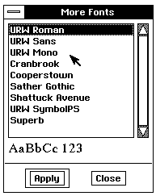

**Figure 7-12** *A Properties Dialog*  
T*his "MoreFonts" dialog has HINT_INTERACTION_RELATED_PROPERTIES. 
OSF/Motif supplies both an "Apply" and a "Close" trigger.*

#### Modifying Triggers for Custom Properties

	HINT_INTERACTION_REQUIRES_VALIDATION

If an application needs to do additional work on a properties dialog box, such 
as validation of the attributes, you should define a "custom" properties dialog 
box. You can do this by replacing the default "Apply" and "Reset" triggers 
with ones of your own design.

HINT_INTERACTION_REQUIRES_VALIDATION indicates that this properties 
dialog should prompt the user for verification before implementing changes 
to the properties group. The Interaction will thus be implemented in delayed 
mode while also allowing a custom "Apply" trigger. The trigger action should 
be handled in the normal fashion to add any additional functionality to 
validate before proceeding with the apply.

You can modify the standard IC_APPLY trigger by adding your own apply 
trigger with ATTR_GEN_TRIGGER_INTERACTION_COMMAND set to 
IC_APPLY. This trigger will replace the default IC_APPLY trigger that the 
Specific UI would have supplied otherwise. HINT_SEEK_REPLY_BAR places 
the trigger in the property dialog's reply bar. In the GenInteraction itself, you 
might want to include HINT_INTERACTION_REQUIRES_VALIDATION or 
another more appropriate hint to ensure that the properties dialog will be 
working in delayed mode.

An application-supplied trigger allows the application to define whatever 
action output and method it desires. When the user activates this trigger, the 
action message will be sent out to the action output (as usual for 
GenTriggers); the default IC_APPLY functionality will not be performed. In 
the handler for this custom message, the application can do whatever is 
necessary with the properties dialog (such as validation of the attributes). 

When finished, the application can either manually fetch the state of the 
attributes or send MSG_GEN_GUP_INTERACTION_COMMAND with 
IC_APPLY to the GenInteraction. (This is the default behavior of an IC_APPLY 
**InteractionCommand**.) You may choose not to send out this message if you 
wish to replace instead of supplement the default behavior.

Finally, you can send MSG_GEN_GUP_INTERACTION_COMMAND with 
IC_INTERACTION_COMPLETE to notify the GenInteraction that the user has 
finished a single usage of the Interaction. (You may also mark such a trigger 
with GA_SIGNAL_INTERACTION_COMPLETE.) Upon this notification, the 
specific UI will decide if the GenInteraction should be dismissed. Instead, you 
may send IC_DISMISS to unconditionally dismiss the Interaction.

----------
**Code Display 7-9 Replacing the Default IC_APPLY Trigger**

	@object GenInteraction LineProperties = {
		GI_visMoniker = "Line Properties";
		GI_comp = LineWidth, LineStyle, LinePropertiesApply;
		GII_type = GIT_PROPERTIES;
		GII_visibility = GIV_DIALOG;
		HINT_INTERACTION_REQUIRES_VALIDATION;	/* Forces delayed mode. */
	}

	@object GenItemGroupClass LineWidth = {
		/* ... */
	}

	@object GenItemGroupClass LineStyle = {
		/* ... */
	}

	@object GenTriggerClass LinePropertiesApply = {
		GTI_destination = process;
		GTI_actionMsg = MSG_MY_PROCESS_PROPERTIES_APPLY;
		/* Setting GA_SIGNAL_INTERACTION_COMPLETE will dismiss the dialog
		 * after applying the properties. */
		GI_attrs = @default | GA_SIGNAL_INTERACTION_COMPLETE;
		/* Setting this attribute to IC_APPLY tells the specific UI to replace
		* the standard response trigger with this one. */
		ATTR_GEN_TRIGGER_INTERACTION_COMMAND = { IC_APPLY };
		HINT_SEEK_REPLY_BAR;
	}

----------
The moniker for an application-supplied apply trigger may be set by the 
application or (preferably) left blank so that the Specific UI can provide an 
appropriate moniker. The Specific UI uses the IC_APPLY data in the 
ATTR_GEN_TRIGGER_INTERACTION_COMMAND vardata and any properties 
hints to determine what moniker to use. (In OSF/Motif this is either "Apply" 
or "OK.") 

If the application wants to alter a moniker but does not need to do any other 
work, the trigger's output fields should be left blank. Because the trigger has 
ATTR_GEN_TRIGGER_INTERACTION_COMMAND, if the output fields are 
null, the trigger will send MSG_GEN_GUP_INTERACTION_COMMAND with 
the ATTR_GEN_TRIGGER_INTERACTION_COMMAND data to itself. This 
message will travel up to the appropriate properties GenInteraction where it 
will be handled, as usual. If doing this, you should make sure to mark any 
replacement triggers GA_SIGNAL_INTERACTION_COMPLETE so that the 
Specific UI can determine whether to dismiss the dialog or not when the 
trigger is activated. (See Code Display 7-10.)

----------
**Code Display 7-10 Replacing the Default IC_APPLY moniker**

	@object GenTriggerClass LinePropertiesApply = {
		GI_visMoniker = "Set Line Properties";
		GI_attrs = @default | GA_SIGNAL_INTERACTION_COMPLETE;
		ATTR_GEN_TRIGGER_INTERACTION_COMMAND = { IC_APPLY };
		HINT_SEEK_REPLY_BAR;
	}

----------
An alternate way to supplement an apply trigger's default behavior is to 
subclass **GenInteractionClass** and intercept 
MSG_GEN_GUP_INTERACTION_COMMAND. If the **InteractionCommand** 
sent is IC_APPLY, the application's supplemental apply work may then be 
done. Then call the superclass to finish with the default apply behavior.

Note that this method cannot be used to override the default 
GA_SIGNAL_INTERACTION_COMPLETE behavior as that is done separately 
with MSG_GEN_GUP_INTERACTION_COMMAND and 
IC_INTERACTION_COMPLETE.

For either default or custom properties dialogs, if the properties dialog 
contains a large number of attributes, it may be useful to provide a means to 
reset the properties to their former state. This is often done with a hint such 
as HINT_INTERACTION_COMPLEX_PROPERTIES.

Just as you may use ATTR_GEN_TRIGGER_INTERACTION_COMMAND with 
IC_APPLY to provide a custom apply trigger, you may use 
ATTR_GEN_TRIGGER_INTERACTION_COMMAND with IC_RESET to provide a 
custom reset trigger. This is useful if the application needs to do some 
additional work when the user resets the attributes or if the application 
wishes to override the default reset moniker ("Reset" in OSF/Motif). You may 
still perform the default reset behavior (sending MSG_GEN_RESET to the UI 
objects) by sending MSG_GEN_GUP_INTERACTION_COMMAND with 
IC_RESET to the properties Interaction.

#### 7.3.2.3 Command Interactions

GIT_COMMAND Interactions allow the user to set up parameters for and 
issue commands. For example, a "rename file" command in a file manager 
application needs to request the new name for the file from the user. This can 
be done with a command dialog that shows the file's current name and has a 
text entry field for the file's new name. A reply bar with a "Rename" action 
trigger could be provided to initiate the rename action when the user has 
finished entering the new name. 

Command Interactions can appear as menus, dialogs, or sub-groups within a 
larger window. If the Interaction is displayed as a dialog, the specific UI may 
provide a response trigger with the IC_DISMISS **InteractionCommand** that 
closes the dialog without executing any commands. In OSF/Motif, this trigger 
is labeled "Close" or "Cancel." You should supply your own additional 
command triggers yourself. You may also add custom response triggers with 
ATTR_GEN_TRIGGER_INTERACTION_COMMAND set to a custom 
**InteractionCommand**. (See "GenTrigger," Chapter 5.)

**Figure 7-13** *A Command Dialog Box.*  
*The Specific UI supplies the "Close" trigger.* 

Command dialogs provide applications with a place to group related 
commands. They also provide a convenient place to locate UI gadgetry needed 
to set up parameters used by commands. A command dialog usually contains 
one or more command triggers in the dialog reply bar. The Specific UI will 
usually create a trigger to close the dialog box (with IC_DISMISS) but will not 
supply any command triggers; you must set up any command triggers or 
custom response triggers yourself. 

----------

**Code Display 7-11 Using a Command Dialog Box**

	/* The Command Dialog created below contains one command trigger (RenameTrigger)
	 * which sends MSG_MY_PROCESS_RENAME to the process object. */

	@object GenInteractionClass RenameBox = {
		GI_visMoniker = "Rename";
		GI_comp = RenameSource, RenameDest, RenameTrigger;
		GII_type = GIT_COMMAND;
		GII_visibility = GIV_DIALOG;
	}

	@object GenTextClass RenameSource = {
		/* Single-line text entry object */
	}

	@object GenTextClass RenameDest = {
		/* Single-line text entry object */
	}

	@object GenTriggerClass RenameTrigger = {
		GI_visMoniker = "Rename";
		GTI_destination = process;
		GTI_actionMsg = MSG_MY_PROCESS_RENAME;
		GI_attrs = @default | GA_SIGNAL_INTERACTION_COMPLETE;
		HINT_SEEK_REPLY_BAR;
	}

----------

The Rename trigger in the above example is marked 
HINT_SEEK_REPLY_BAR to place it in the reply bar of the Interaction, though 
this is not necessary. The GA_SIGNAL_INTERACTION_COMPLETE attribute 
on the command trigger indicates that when the user activates this trigger, 
their use of the dialog is complete and the Specific UI may dismiss the dialog, 
if it desires. By default, non-modal command dialogs in OSF/Motif are not 
dismissed. You may use hints to override this behavior.

You may wish to modify this closing behavior, however. For example, if the 
user chooses an invalid destination name, you might not want to close that 
dialog; instead, the dialog should remain up and the user should be alerted 
that he has chosen an incorrect destination. In this case, you should remove 
the GA_SIGNAL_INTERACTION_COMPLETE attribute from the trigger. You 
should then handle the closing behavior, after validating the destination, in 
the MSG_MY_PROCESS_RENAME handler. To dismiss the command dialog, 
send MSG_GEN_GUP_INTERACTION_COMMAND with IC_DISMISS to it. (You 
may also use IC_INTERACTION_COMPLETE if you wish to defer to the 
Specific UI whether to close the dialog box.)

The Specific UI will also create a standard response trigger to dismiss the 
command dialog box. If some action needs to take place when the user 
attempts to close this dialog box, you should replace the default Close trigger 
by adding your own trigger to replace the IC_DISMISS 
**InteractionCommand**. As with IC_APPLY and IC_RESET, use 
ATTR_GEN_TRIGGER_INTERACTION_COMMAND with IC_DISMISS to replace 
the default trigger. You should also mark this trigger 
HINT_SEEK_REPLY_BAR if you wish it to appear in the Interaction's reply 
bar. 

----------
**Code Display 7-12 Replacing the Default Close Trigger**

	@object GenInteractionClass RenameBox = {
		GI_visMoniker = "Rename";
		GI_comp = RenameSource, RenameDest, RenameTrigger, RenameClose;
		GII_type = GIT_COMMAND;
		GII_visibility = GIV_DIALOG;
	}

	@object GenTextClass RenameSource = {
		/* Single-line text entry object */
	}

	@object GenTextClass RenameDest = {
		/* Single-line text entry object */
	}

	@object GenTriggerClass RenameTrigger = {
		GI_visMoniker = "Rename";
		GTI_destination = process;
		GTI_actionMsg = MSG_MY_PROCESS_RENAME;
		GI_attrs = @default | GA_SIGNAL_INTERACTION_COMPLETE;
		HINT_SEEK_REPLY_BAR;
	}

	@object GenTriggerClass RenameClose = {
		GTI_destination = process;
		GTI_actionMsg = MSG_MY_PROCESS_CLOSE_RENAME;
		ATTR_GEN_TRIGGER_INTERACTION_COMMAND = { IC_DISMISS };
		HINT_SEEK_REPLY_BAR;
	}

----------
#### 7.3.2.4 Progress Interactions

GIT_PROGRESS Interactions report the progress of an operation. You will 
need progress dialogs most often to show the status of an ongoing operation. 
Progress Interactions may appear as either a dialog or as part of a larger 
window. (Typically progress reports should not appear within a popup, as 
popups will not remain on-screen.) 

If a progress Interaction takes the form of a dialog box, the Specific UI may 
create a response trigger with the **InteractionCommand** IC_STOP. This 
trigger will halt the operation (and therefore the progress report) and may 
close the dialog box if the Specific UI or the application desires this. In 
OSF/Motif this trigger is labeled "Stop." The Specific UI will not supply a 
default way to close the dialog other than this IC_STOP trigger. In OSF/Motif 
this means that a system menu for a non-modal progress dialog will have its 
"Close" trigger disabled.

For example, you can use a progress dialog to report the progress of a disk 
format. Gadgets within the progress dialog might reflect the current state of 
the disk format (for example, a bar indicating the time - percentage of the 
operation completed). A "Stop" trigger in the reply bar allows the user to 
abort the disk format. Your application should intercept the 
**InteractionCommand** IC_STOP in this case so that you can perform any 
actions required in the halting operation.

A progress dialog may be either modal or non-modal, depending on the 
application and the operation in progress. The **GenInteractionType** 
GIT_PROGRESS is designed for cases where the application supports stopping 
an in-progress operation.

While the Specific UI will supply an IC_STOP trigger in the reply bar for 
halting the on-going operation, the trigger by itself does nothing. You must 
either replace this IC_STOP trigger with one that performs the required 
halting operation, or you must provide a subclass of GenInteraction to 
intercept MSG_GEN_GUP_INTERACTION_COMMAND with IC_STOP. 
Providing a replacement IC_STOP trigger is the easiest method.

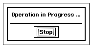

**Figure 7-14** *A Progress Dialog Box.*  
*The Specific UI supplies the "Stop" trigger.* 

----------
**Code Display 7-13 Replacing the Default IC_STOP Trigger**

	/* This Progress Dialog shows the progress of a data transfer. Its first child
	 * shows the number of packets sent in the operation, and the second child is an
	 * IC_STOP trigger to halt the transfer operation. */ 

	@object GenInteractionClass FileTransferProgress = {
		GI_visMoniker = "File Transfer Status";
		GI_comp = FileTransferPktCount, FileTransferStop;
		GII_visibility = GIV_DIALOG;
		GII_type = GIT_PROGRESS;
	}

	/* The GenText object shows the title "Packets Sent" and updates the GTI_text field
	 * with the current number of packets sent. */

	@object GenTextClass FileTransferPktCount = {
		GI_visMoniker = "Packets sent:";
		GTXI_text = "0";
	}

	/* When the user activates the "Abort File Transfer" trigger, the trigger sends out
	 * MSG_MY_PROCESS_ABORT_FILE_TRANSFER to the process. This action should also
	 * close the dialog box. Since this trigger may initiate a destructive action,
	 * HINT_TRIGGER_DESTRUCTIVE_ACTION makes sure that the focus does not lie on the
	 * dialog box (and therefore the trigger cannot be activated by a default
	 * activation method such as hitting RETURN). */

	@object GenTriggerClass FileTransferStop = {
		GI_visMoniker = "Abort File Transfer";
		/* OSF/Motif will dismiss this dialog box if marked
		 * GA_SIGNAL_INTERACTION_COMPLETE because it is GIT_PROGRESS. */
		GI_attrs = @default | GA_SIGNAL_INTERACTION_COMPLETE;
		GTI_destination = process;
		/* The handler for MSG_MY_PROCESS_ABORT_FILE_TRANSFER must stop the
		 * operation. You may also dismiss the dialog at that time. */
		GTI_actionMsg = MSG_MY_PROCESS_ABORT_FILE_TRANSFER;
		ATTR_GEN_TRIGGER_INTERACTION_COMMAND = { IC_STOP };
		HINT_SEEK_REPLY_BAR;
		HINT_TRIGGER_DESTRUCTIVE_ACTION;		/* Don't place focus here. */
}

----------
#### 7.3.2.5 Notification Interactions

GIT_NOTIFICATION Interactions allow your application to send notices to the 
user. You should use a notification Interaction when you wish to notify the 
user of an event without needing to prompt the user for further information.

GIT_NOTIFICATION interactions normally appear as dialogs. If so, the 
Specific UI will create a response trigger with the **InteractionCommand** 
IC_OK. This command will close the dialog box in most Specific UIs. In 
OSF/Motif, this trigger is labeled "OK." The Specific UI will not supply a way 
to close the dialog without responding with this trigger. In OSF/Motif, this 
means that the system menu in a non-modal notification dialog will have its 
"Close" trigger disabled.

A notification Interaction may in theory be of any visibility, but it usually 
takes the form of a modal dialog box. Therefore, the user should only need to 
acknowledge the dialog box (usually by activating the "OK" trigger).

You will usually require a notification dialog when you need to let the user 
know that something has occurred that may or may not require his 
immediate attention. For example, a notification dialog would be appropriate 
to notify the user that new e-mail has arrived; a notification dialog would also 
be appropriate to notify the user that an error has occurred. 

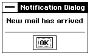

**Figure 7-15** *A Notification Dialog Box.*  
*The Specific UI supplies the "OK" trigger.* 

Notifications that require immediate attention should be marked 
GIA_MODAL or HINT_INTERACTION_MODAL, depending on the application's 
dependence on their modality. Interactions that do not require immediate 
attention may be marked HINT_INTERACTION_NO_DISTURB so that when 
brought up, they do not disturb the focus or target of the application. This is 
especially useful for cases such as e-mail notification, where switching the 
focus away from another application at each new notice might become 
irritating to the user. 

----------
**Code Display 7-14 An E-mail Notification Dialog**

	/* The Notification dialog is marked HINT_INTERACTION_NO_DISTURB so that it
	 * will not grab the focus and target. The notification itself has only one child:
	 * the text to display to the user. The Specific UI will also create an IC_OK
	 * trigger that is used to acknowledge and dismiss the notification. */

	@object GenInteractionClass NewMailNotice = {
		GI_visMoniker = "Mailbox";
		GI_comp = NewMailText;
		GII_type = GIT_NOTIFICATION;
		GII_visibility = GIV_DIALOG;
		HINT_INTERACTION_NO_DISTURB;
	}

	@object GenGlyphClass NewMailText = {
		GI_visMoniker = "New mail has arrived";
	}

----------
By default the IC_OK trigger will just dismiss the dialog. If some other action 
might need to be taken when the user acknowledges the notification, you 
should provide a custom IC_OK trigger to replace the specific UI supplied one. 

----------
**Code Display 7-15 Replacing the IC_OK Trigger**

	/* This Notification dialog now contains two explicit children: the text to
	 * display to the user and a custom trigger to acknowledge the notification. */

	@object GenInteractionClass NewMailNotice = {
		GI_visMoniker = "Mailbox";
		GI_comp = NewMailText, NewMailAcknowledge;
		GII_type = GIT_NOTIFICATION;
		GII_visibility = GIV_DIALOG;
		HINT_INTERACTION_NO_DISTURB;
	}

	@object GenGlyphClass NewMailText = {
		GI_visMoniker = "New mail has arrived";
	}

	/* When the user clicks on the Acknowledge Trigger, MSG_MY_PROCESS_NEW_MAIL_ACK is
	 * sent to the process class. Marking the trigger as IC_OK replaces the default
	 * trigger. Note that the Specific UI is still allowed to pick the visual moniker
	 * for this trigger as its GI_visMoniker field is left blank. */

	@object GenTriggerClass NewMailAcknowledge = {
		GTI_destination = process;
		GTI_actionMsg = MSG_MY_PROCESS_NEW_MAIL_ACK;
		GI_attrs = @default | GA_SIGNAL_INTERACTION_COMPLETE;
		ATTR_GEN_TRIGGER_INTERACTION_COMMAND = { IC_OK };
		HINT_SEEK_REPLY_BAR;
	}

----------
#### 7.3.2.6 Affirmation Interactions

GIT_AFFIRMATION Interactions allow your application to provide the user 
with a choice of yes or no. GIT_AFFIRMATIONs normally appear as dialog 
boxes. If so, the Specific UI will create response triggers with the commands 
IC_YES and IC_NO. In OSF/Motif, the triggers are labeled "Yes" and "No." The 
Specific UI will not provide a default manner to close the dialog without 
responding to one of these. In OSF/Motif, this means that non-modal dialog 
boxes will have their "Close" triggers disabled. 

For example, your application may need to prompt the user with a yes or no 
question (such as "Do you want to continue?"). Depending on the value 
returned in the **InteractionCommand**, the dialog box may continue or 
abort any impending operations. In most cases, you will want to use an 
affirmation interaction when you wish to force the user to make a choice.

**Figure 7-16** *An Affirmation Dialog Box.*  
*The Specific UI supplies the "Yes" and "No" triggers* 

An affirmation dialog allows the user to make a single yes or no choice, 
without an option to ignore the choice and close the dialog. In general, this 
type of dialog is normally modal or used with **UserDoDialog()** to block the 
calling thread until the user responds. When the user chooses, the caller will 
be unblocked and **UserDoDialog()** will return IC_YES or IC_NO. 
Alternatively, you can supply replacement IC_YES or IC_NO (or both) triggers 
which send out custom messages when activated.

----------
**Code Display 7-16 An Affirmation Dialog for Deleting a File**

	/* Rather than using UserDoDialog(), this dialog is simply marked GIA_MODAL.
	 * This approach has the advantage of allowing any views that are run by the
	 * process thread to be updated if they are exposed by the application. */

	/* This dialog keeps the default IC_NO trigger to dismiss the dialog but
	 * replaces the default IC_YES trigger. */

	@object GenInteractionClass DeleteAffirmation = {
		GI_comp = DeleteAffirmationText, DeleteAffirmationYes;
		GII_type = GIT_AFFIRMATION;
		GII_visibility = GIV_DIALOG;
		GII_attrs = @default | GIA_MODAL;
	}

	@object GenGlyphClass DeleteAffirmationText = {
		GI_visMoniker = "Are you sure you want to delete this file?";
	}

	/* This trigger replaces the default IC_YES trigger. */

	@object GenTriggerClass DeleteAffirmationYes = {
		GI_attrs = @default | GA_SIGNAL_INTERACTION_COMPLETE;
		GTI_destination = process;
		GTI_actionMsg = MSG_MY_PROCESS_DELETE_FILE;
		ATTR_GEN_TRIGGER_INTERACTION_COMMAND = {IC_YES};
		HINT_SEEK_REPLY_BAR;
	}

----------
#### 7.3.2.7 Multiple Response Interactions

GIT_MULTIPLE_RESPONSE Interactions allow the UI to provide the user 
with a number of choices, one of which must be selected. 
GIT_MULTIPLE_RESPONSE Interactions normally appear as dialog boxes. 
The Specific UI itself supplies no standard response triggers; you must add 
your own response triggers. (See "Standard Response Triggers" below.) 
There is no default provision to just close or cancel the dialog, ignoring the 
choice. In OSF/Motif, this means the system menu for a non-modal dialog will 
have its "Close" trigger disabled.

The GIT_MULTIPLE_RESPONSE type allows you to build a custom dialog box. 
By default, a multiple-response dialog provides no standard response 
triggers and no way to close the dialog. You must therefore provide any 
response triggers you might need (including an IC_DISMISS 
**InteractionCommand**). If not, the dialog will only be dismissable by the 
application, not by the user. In general, you should use a 
GIT_MULTIPLE_RESPONSE when you wish to prompt the user with several 
choices, one of which must be chosen.

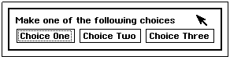

**Figure 7-17** *A Multiple Response Dialog Box.*  
*You must supply the triggers yourself. Note that the specific UI makes this 
dialog box modal, therefore preventing it from being dismissed without 
responding to one of the choices.*

----------
**Code Display 7-17 A Fragmentation Warning Dialog Box**

	@object GenInteractionClass DatabaseFragmentWarning = {
		GI_comp = DBFragmentText, DBFragmentCompact, DBFragmentContinue;
		GII_type = GIT_MULTIPLE_RESPONSE;
		GII_visibility = GIV_DIALOG;
		GII_attrs = @default | GIA_MODAL;
	}

	@object GenGlyphClass DBFragmentText = {
		GI_visMoniker = "Database is getting fragmented."
	}

	/* As none of the following triggers are standard trigger replacements, there is no
	 * need to use ATTR_GEN_TRIGGER_INTERACTION_COMMAND. */

	@object GenTriggerClass DBFragmentCompact = {
		GI_visMoniker = "Run Compaction utility.";
		GTI_destination = process;
		GTI_actionMsg = MSG_MY_PROCESS_DB_COMPACT;
		GI_attrs = @default | GA_SIGNAL_INTERACTION_COMPLETE;
		HINT_SEEK_REPLY_BAR;
	}

	@object GenTriggerClass DBFragmentContinue = {
		GI_visMoniker = "Continue without Compacting.";
		GTI_destination = process;
		GTI_actionMsg = MSG_MY_PROCESS_DB_CONTINUE;
		GI_attrs = @default | GA_SIGNAL_INTERACTION_COMPLETE;
		HINT_SEEK_REPLY_BAR;
	}

----------
#### 7.3.2.8 Toolboxes

Toolboxes are useful to display small icons for commonly used operations. 
Toolboxes are normally provided by controllers. (See "Generic UI 
Controllers," Chapter 12.) In many cases toolboxes are non-modal 
GIT_ORGANIZATIONAL dialog boxes. Any GenInteraction may be marked 
HINT_TOOLBOX, however. (In some cases, you may wish a toolbox to be 
GIT_MULTIPLE_RESPONSE.) GeoDraw provides a toolbox to alter the 
properties of graphics objects. This toolbox appears at appropriate times in 
the GeoDraw application and will remain on-screen until the user explicitly 
closes it by selecting "Close" in its system menu.

Toolbox dialogs should never steal the focus or target of the application; this 
prevents the user from constantly having to reselect current objects. The hint 
HINT_TOOLBOX provides this functionality. This hint prevents a toolbox 
Interaction from grabbing the focus whenever an object within the toolbox is 
activated.

## 7.4 Supplemental Usage

The previous section described most of what you need to get an Interaction 
into your application. Much of the behavior of an Interaction is taken care of 
by the Specific UI. If you wish to modify this behavior, the following section 
details several ways in which you can alter these defaults.

### 7.4.1 Initiating Interactions

	MSG_GEN_INTERACTION_INITIATE, 
	MSG_GEN_INTERACTION_INITIATE_NO_DISTURB

For the most part, the Specific UI decides in what way Interactions should be 
initiated. For example, a popup built as a menu will create a menu title 
which, when activated, brings down the menu. A dialog box will create an 
activation trigger within the UI that, when activated, brings the dialog box 
on-screen. (Notice that it is meaningless to "initiate" a sub-group Interaction 
as these objects are not independently-displayable.)

You may wish to modify this behavior, either to prevent the user from directly 
initiating an Interaction, or to add additional ways to bring these 
Interactions on-screen. 

Although in most cases the user is responsible for activating menus (by 
activating the menu title), an application may manually open a menu with 
MSG_GEN_INTERACTION_INITIATE.

A GIV_DIALOG Interaction may be initiated in several ways:

+ In the default case, the specific UI will create an activation trigger whose 
sole function is to bring up the dialog box. The trigger will appear as a 
child of the dialog's parent, in the spot within the UI that the dialog would 
normally reside were it not independently displayable.

+ A dialog box may be set GIA_NOT_USER_INITIATABLE to prevent the 
building of the default trigger. Any Interaction set non-user initiatable 
should be sent a MSG_GEN_INTERACTION_INITIATE or a 
MSG_GEN_INTERACTION_INITIATE_NO_DISTURB to bring the dialog 
on-screen. You may also put Interactions on the GAGCNLT_WINDOWS 
GCN list to automatically bring them on-screen when an application is 
launched. Any Interaction must be fully usable and enabled to be brought 
up in such a manner. Note: If a dialog box is also marked 
GIA_INITIATED_VIA_USER_DO_DIALOG, it should be initiated with 
**UserDoDialog()**, not MSG_GEN_INTERACTION_INITIATE. These 
methods are exclusive.

+ A dialog box may be brought up with **UserDoDialog()** if it is set 
GIA_INITIATED_VIA_USER_DO_DIALOG. This routine is useful when you 
wish to block the calling thread until the user responds to the dialog box. 
A dialog box initiated via **UserDoDialog()** should also be marked 
GIA_NOT_USER_INITIATABLE. Note that this dialog box may only be 
brought up with **UserDoDialog()**; it cannot be brought up with 
MSG_GEN_INTERACTION_INITIATE.

Within most specific UIs a trigger will appear whose sole function is to 
initiate the dialog. Activating the trigger will bring the dialog box on-screen. 
You can prevent the display of this default trigger by setting the Interaction 
GIA_NOT_USER_INITIATABLE in its GII_attrs instance field. (See 
"GenInteraction Attributes" above).

**Figure 7-18** *Dialog with Activation Trigger*  
*The dialog box (Command dialog), when placed within a menu, creates a 
menu item trigger that initiates the dialog box.*

Your GenInteraction subclass may intercept 
MSG_GEN_INTERACTION_INITIATE to determine when a dialog is being 
brought on-screen and then perform any needed actions at that time. This is 
useful if you need to update the UI objects within the dialog before building 
its visual implementation. You should always call the superclass after setting 
any of this initial data to avoid unnecessary visual updates of the dialog box. 
MSG_GEN_INTERACTION_INITIATE_NO_DISTURB may also be subclassed, 
but there is little need to intercept it.

----------
#### MSG_GEN_INTERACTION_INITIATE

	void	MSG_GEN_INTERACTION_INITIATE();

This message brings an Interaction on-screen, giving it focus and target if 
possible. The Interaction must be both within the generic tree and set 
GS_USABLE before receiving this message. The Interaction must also be fully 
usable and enabled before it can be initiated. Interactions marked 
GIA_INITIATED_VIA_USER_DO_DIALOG should not be sent this message. To 
initiate those dialogs, you must use **UserDoDialog()**. (See "Thread Blocking 
Routines" below.)

You may intercept this message to determine when a dialog is coming 
on-screen. This is useful if you need to set up UI gadgetry in the dialog to 
show some initial status. The gadgetry should be set up before calling the 
superclass to avoid unnecessary visual updating of the object. 
**Source:** Unrestricted.

**Destination:** Any GS_USABLE GenInteraction, though usually only meaningful for 
GIV_DIALOG interactions.

**Parameters:** None.

**Return:** Nothing.

**Interception:** May be intercepted to find out when an Interaction is appearing 
on-screen. This is useful for cases in which the UI gadgetry of a dialog 
box needs to be set up before being visually built. The superclass should 
be called after setting up the UI to avoid unnecessary visual changes 
once the interaction is on-screen.

----------
#### MSG_GEN_INTERACTION_INITIATE_NO_DISTURB

	void	MSG_GEN_INTERACTION_INITIATE_NO_DISTURB();

This message brings an Interaction on-screen but does not give the dialog the 
focus or target. This message may place the dialog behind other windows. 
The Interaction must be both within the generic tree and set GS_USABLE 
before receiving this message. The Interaction must also be fully usable and 
enabled before it can be initiated. Interactions marked 
GIA_INITIATED_VIA_USER_DO_DIALOG should not be sent this message. To 
initiate those dialogs, you must use **UserDoDialog()**. (See "Thread Blocking 
Routines" below.)

**Source:** Unrestricted.

**Destination:** Any GS_USABLE GenInteraction, though usually only meaningful for 
GIV_DIALOG Interactions. Not allowed for GIA_MODAL or 
GIA_INITIATED_VIA_USER_DO_DIALOG Interactions.

**Parameters:** None.

**Return:** Nothing.

**Interception:** May be intercepted to find out when an Interaction is appearing 
on-screen. This is useful for cases in which the UI gadgetry of a dialog 
box needs to be set up before being visually built. The superclass should 
be called after setting up the UI to avoid unnecessary visual changes 
once the interaction is on-screen.

### 7.4.2 Dismissing Interactions

You may dismiss dialogs and popups under application control by sending 
MSG_GEN_GUP_INTERACTION_COMMAND with the 
**InteractionCommand** IC_DISMISS to them. This will force dialogs to close 
even if the user has such a dialog pinned (in Specific UIs that support 
pinning). Dialogs may also be dismissed when the user activates reply bar 
response triggers with the GA_SIGNAL_INTERACTION_COMPLETE attribute 
set. (See "GenClass," Chapter 2.)

You may intercept MSG_GEN_GUP_INTERACTION_COMMAND to determine 
when a dialog is about to be dismissed. The handler for this message should 
check the incoming **InteractionCommand** to make sure it is IC_DISMISS 
before doing whatever work is needed. You should make sure to pass any 
non-IC_DISMISS **InteractionCommand** immediately to the superclass. The 
handler may or may not need to call the superclass for IC_DISMISS, 
depending on what behavior the handler is adding.

### 7.4.3 Modality for Dialogs

	MSG_GEN_INTERACTION_TEST_INPUT_RESTRICTABILITY

By default, GIV_DIALOG GenInteractions appear as non-modal windows. You 
may specify a dialog Interaction to appear as modal by setting either the 
GIA_MODAL attribute in the *GII_attrs* instance data field or by adding 
HINT_INTERACTION_MODAL in the object's vardata. When a modal dialog is 
displayed, input to all other parts of the application will be ignored until the 
dialog is dismissed. In OSF/Motif, modal dialogs will appear with thick 
borders.

You should use GIA_MODAL dialogs when the application depends on an 
Interaction being modal to operate correctly. For example, if a dialog shows 
information about the current selection but the application cannot update 
that information if the user were to change the current selection, you should 
use a GIA_MODAL dialog.

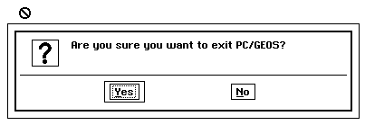

**Figure 7-19** *A modal dialog box*  
*Whenever the cursor roams outside the bounds of the modal dialog box, input 
to other parts of the application is blocked.*

You should use HINT_INTERACTION_MODAL dialogs for cases where the 
modality of a dialog simplifies the interface between the application and the 
user but is not needed for the application's correct operation. The 
Interaction's modality in this case will make the UI clearer and simpler for 
the user to understand. For example, a dialog for setting obscure options that 
is brought up from a command dialog might be marked 
HINT_INTERACTION_MODAL so that the user is forced to set the options 
before returning to the command dialog. This will prevent the user from 
using this dialog box in a context where the options are not self-evident. As 
with all hints, the Specific UI may decide to ignore the hint and implement a 
HINT_INTERACTION_MODAL dialog with a non-modal dialog. 

You may also initiate a modal dialog with **UserDoDialog()**. Such a dialog 
must have both the GIA_INITIATED_VIA_USER_DO_DIALOG and 
GIA_MODAL attributes set. Using this routine not only blocks input to other 
parts of the application but blocks the calling thread's execution until the 
dialog is dismissed. **UserDoDialog()** is useful for displaying notifications 
where the user's response is required before the application's thread may 
continue. For more information, see "Thread Blocking Routines" below.

Dialogs displayed with **UserStandardDialog()** and 
**UserStandardDialogOptr()** are also modal. Both will block the calling 
thread until the dialog is dismissed. (See "Thread Blocking Routines" below.)

Some modal dialogs will have subcomponents such as pop-up lists that must 
be interactable while the dialog is modal. The GenApplication object running 
the modal dialog will query the dialog to test both its input restrictions and 
its interactability in these cases; it uses two messages, described below.

----------
#### MSG_GEN_INTERACTION_TEST_INPUT_RESTRICTABILITY

	Boolean	MSG_GEN_INTERACTION_TEST_INPUT_RESTRICTABILITY(
			optr	obj);

This message is called on a modal window by a GenApplication object to find 
out whether or not the various input restricting mechanisms (input hold-up, 
input ignore, busy states, etc.) should be overridden or not.

**Source:** Part of the input flow/modality mechanism-sent by the 
GenApplication object to the modal window.

**Destination:** The modal GenInteraction object.

**Parameters:**  
*obj* - The optr of the windowed object that may or may 
not be restricted.

**Return:** Will return *true* if input restrictions should be overridden, *false* 
otherwise. A *true* return value indicates that mouse and keyboard 
input will flow to the object regardless of hold-up, ignore, or busy 
states.

**Interception:** May be intercepted to allow the passed windowed object to override its 
input restrictions in certain cases.

### 7.4.4 Managing Input

	ATTR_GEN_INTERACTION_OVERRIDE_INPUT_RESTRICTIONS, 
	ATTR_GEN_INTERACTION_ABIDE_BY_INPUT_RESTRICTIONS, 
	HINT_INTERACTION_DEFAULT_ACTION_IS_NAVIGATE_TO_NEXT_FIELD

Typically, specific UIs will determine how input (primarily keyboard input) 
affects GenInteractions and their components. For example, many UIs will 
have the Tab key navigate from the active component of a dialog box to the 
next available component.

HINT_INTERACTION_DEFAULT_ACTION_IS_NAVIGATE_TO_NEXT_FIELD 
allows you to trade the normal "default action" (the action typically causing 
the dialog to send its "apply" message) for navigation. For example, if hitting 
the return key normally invoked an "Apply" trigger, this hint would instead 
cause it to navigate to the next field in the dialog box.

Two other attributes allow a GenInteraction to either disobey or abide by 
certain default input restrictions (modality, input hold-up, input ignore, and 
busy states). ATTR_GEN_INTERACTION_OVERRIDE_INPUT_RESTRICTIONS 
allows the GenInteraction to override the input restrictions; 
ATTR_GEN_INTERACTION_ABIDE_BY_INPUT_RESTRICTIONS allows the 
GenInteraction to override default behavior ignoring those restrictions.

### 7.4.5 Thread Blocking Routines

Occasionally, you may need a response from the user before continuing with 
a thread of execution. In these cases, you should use a dialog box to prompt 
the user for the needed response. However, you also need a means to block 
the thread of execution until the user responds to this dialog box. The 
routines **UserDoDialog()**, **UserStandardDialog()**, and 
**UserStandardDialogOptr()** provide this functionality.

#### 7.4.5.1 UserDoDialog()

	UserDoDialog(), UserCreateDialog(), UserDestroyDialog()

You may bring dialog boxes on-screen with several routines. The most 
common and easiest to use of these routines is **UserDoDialog()**. 
**UserDoDialog()** only operates on GIV_DIALOG Interactions set both 
GIA_MODAL and GIA_INITIATED_WITH_USER_DO_DIALOG. 

This routine, when passed the optr of a dialog box, will bring the dialog 
Interaction on-screen. In addition to bringing up a dialog, however, 
**UserDoDialog()** will also block the calling thread until a response trigger in 
the dialog is activated by the user. When this happens, **UserDoDialog()** 
returns a value representing the response trigger selected. This return value 
is usually an **InteractionCommand**.

The dialog may contain any UI gadgetry but must have response triggers 
with valid **InteractionCommands** to terminate the dialog box. These 
triggers should have a null output and message and have 
ATTR_GEN_TRIGGER_INTERACTION_COMMAND vardata set to the proper 
**InteractionCommands**. (See "GenTrigger," Chapter 5.) This 
**InteractionCommand** will be the response value returned by 
**UserDoDialog()** when that trigger is activated. This can be one of the 
predefined **InteractionCommands** or an application-defined one with 
IC_CUSTOM_START. 

The response triggers should also have the attribute 
GA_SIGNAL_INTERACTION_COMPLETE set to ensure that the dialog will be 
dismissed when they are activated. (This may be omitted to gain manual 
control over dismissal over the dialog, but you still must provide a way to 
dismiss the dialog.) Any response triggers in the dialog should have the hint 
HINT_SEEK_REPLY_BAR to place the triggers within the dialog's reply bar, 
but this is not necessary.

Because the calling thread is blocked by **UserDoDialog()**, views run by that 
thread will not be updated when exposed.

----------
**Code Display 7-18 Using UserDoDialog()**

	/* This dialog box asks for confirmation before beginning a delete file operation.
	 * Therefore, it is advisable to block threads before beginning this operation. The
	 * dialog using UserDoDialog() should be marked both GIA_MODAL and
	 * GIA_INITIATED_VIA_USER_DO_DIALOG. */

	@object GenInteractionClass ConfirmDeleteBox = {
		GI_comp = ConfirmDeleteText;
		GII_type = GIT_AFFIRMATION;
		GII_visibility = GIV_DIALOG;
		GII_attrs = @default | GIA_INITIATED_VIA_USER_DO_DIALOG | GIA_MODAL;
	}

	@object GenTextClass ConfirmDeleteText = {
		GTI_text = "Are you sure you want to delete this file?";
	}

	/* This dialog box is displayed through a normal routine call with
	 * the optr of the dialog box as its one argument. */

	/* Check for positive response. */
	if (UserDoDialog(ConfirmDeleteBox) == IC_YES) {
		/* delete file. */
	}

----------
**UserDoDialog()** may also return IC_NULL to indicate that the modal dialog 
has been dismissed by the system, so it is always a good idea to check for and 
act on positive responses even if only one response is possible (such as in a 
GIT_NOTIFICATION dialog box).

**UserCreateDialog()** duplicates a dialog box to initiate later with 
**UserDoDialog()**. Typically, the dialog box duplicated is within a template 
object block; the dialog box must be both not GS_USABLE and not attached to 
the generic tree when created. The dialog box must also be marked 
GIA_INITIATED_VIA_USER_DO_DIALOG.

The template block that contains the dialog box and its children must be 
sharable and read-only. **UserCreateDialog()** duplicates a template dialog 
box, attaches the dialog box to the GenApplication object and sets it fully 
GS_USABLE; it may then be called with **UserDoDialog()**. When you no 
longer have a need for the dialog box, send it **UserDestroyDialog()**.

These routines are useful for conserving memory space; they only take up 
space when actually being used. In some cases, you may need to use these 
routines. For example, within libraries, dialog boxes must be duplicated 
before being used because multiple applications may require their own copy 
of the dialog box template.

----------
**Code Display 7-19 Using UserCreateDialog(), UserDestroyDialog()**

	/* 
	 * The template dialog box must not be GS_USABLE. The object must also be marked 
	 * GIA_INITIATED_VIA_USER_DO_DIALOG. The block must be sharable, read-only, and 
	 * the top GenInteraction must not be linked into the generic tree.
	 */

	@object GenInteractionClass MyDialogTemplate = {
		GI_visMoniker = "Template";
		GI_states = @default & ~GS_USABLE;
		GII_visibility = GIV_DIALOG;
		GII_attrs = @default | GIA_INITIATED_VIA_USER_DO_DIALOG | 
				GIA_NOT_USER_INITIATABLE | GIA_MODAL;
		GII_type = GIT_NOTIFICATION;
		GI_comp = @NotificationGlyph;
	}

	@method SomeProcessClass, MSG_BRING_UP_DUPLICATED_DIALOG
	{
		optr		newDialog;

		newDialog = UserCreateDialog(@MyDialogTemplate);

		if (UserDoDialog(@newDialog) == IC_OK) {
			/*** code ***/
		}

		UserDestroyDialog(@newDialog);
	}

----------
#### 7.4.5.2 UserStandardDialog()

	UserStandardDialog(), UserStandardDialogOptr(), 
	CustomDialogBoxFlags

**UserStandardDialog()** displays standardized dialog boxes. The dialog is 
standardized in that it has a text area, an icon glyph representing the type 
of situation that caused the dialog to be displayed, and one or more response 
triggers. Like **UserDoDialog()**, **UserStandardDialog()** blocks the calling 
thread until the user activates one of the response triggers. Unlike 
**UserDoDialog()**, however, **UserStandardDialog()** does not need an 
application-defined dialog box. **UserStandardDialog()** builds a dialog box 
at run-time following the specifications passed.

**UserStandardDialog()** passes a number of parameters:

+ **CustomDialogBoxFlags**
This bitfield stores the **CustomDialogType** (CDBF_DIALOG_TYPE) and 
the **GenInteractionType** (CDBF_INTERACTION_TYPE) to display the 
Interaction with, along with several miscellaneous flags

CDBF_SYSTEM_MODAL  
indicates that the dialog box brought up by 
**UserDoDialog()** should not only be application modal but also 
system modal.

CDBF_DESTRUCTIVE_ACTION  
indicates that an affirmative response by the 
user to the dialog box denotes a destructive action, and thus 
should not be made the default. 

CDBF_DIALOG_TYPE  
indicates the type of situation creating the dialog box. 
This type determines the icon glyph that represents what 
caused the dialog to be displayed. The available types 
**(CustomDialogType)** are:

CDT_QUESTION: - Ask the user a question;  
CDT_WARNING: - Warn the user of a potential problem;  
CDT_NOTIFICATION: - Notify the user of some event;  
CDT_ERROR: - Report an error to the user.

The Specific UI will determine the appropriate icon glyph to use 
for each dialog type. For example, in OSF/Motif, a 
CDT_QUESTION icon glyph is a graphic question mark.

The system will also issue a beep when a CDT_ERROR dialog is 
displayed.

CDBF_INTERACTION_TYPE  
indicates the type of GenInteraction being 
initiated. This type specifies what response triggers should be 
built and is a sub-set of the supplied GenInteractionType 
enums. The available types are:

GIT_NOTIFICATION  
The specific UI will supply a standard response trigger that has 
the IC_OK response value.

GIT_AFFIRMATION  
The specific UI will supply standard response triggers that 
have the IC_YES and IC_NO response values.

GIT_MULTIPLE_RESPONSE  
The application must provide its own trigger monikers and 
response values. If this value is set, you will have to pass the 
array of custom triggers.

+ Dialog string (and *arg1* and *arg2*)
This is the string to display in the dialog box text area. The string can 
have up to two parameters. These parameters are other strings that are 
passed to **UserStandardDialog()** in *arg1* and *arg2*. They will replace all 
occurrences of *arg1* and *arg2* in the dialog string. This is useful for 
including filenames or other variable text in the dialog string.

+ Response trigger monikers and values
If GIT_MULTIPLE_RESPONSE is used, this indicates how many triggers 
and what labels and response values the response triggers should have.

+ Help context
The help context to use for this dialog box layer.

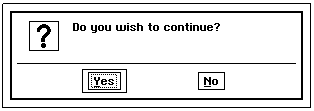   
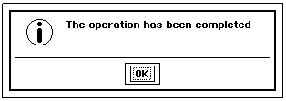 

**Figure 7-20** *Standard Dialog Boxes*  
*Each CustomDialogType provides its own standard graphic glyph and 
standard response triggers. The CDT_ERROR dialog also provides an audible 
warning.* 

----------
**Code Display 7-20 Using UserStandardDialog()**

	/* 
	 * This simple example uses no help context, custom triggers, or string arguments. 
	 */

	if ((UserStandardDialog((char *)0,
					(char *)0,
					(char *)0,
					(char *)0,
					"Do you wish to continue?",
					((CDT_QUESTION << CDBF_DIALOG_TYPE_OFFSET) |
					(GIT_AFFIRMATION << CDBF_INTERACTION_TYPE_OFFSET))
					) == IC_YES)) {
		/* code to perform on a positive response. */
	}
	else {
		/* code to perform on a negative response. */
	}

----------
You may also use **UserStandardDialogOptr()** for cases in which the 
strings are referenced through optrs rather than pointers.

----------
**Code Display 7-21 A ConfirmDeleteBox with explicit monikers**

	/* For this case, since we want to provide explicit monikers, we must use the
	 * GIT_MULTIPLE_RESPONSE interaction type. Using this allows us to pass in the
	 * monikers and response values for the response triggers for the dialog. This is
	 * done by passing a pointer to a table consisting of the number of triggers in the
	 * dialog and a StandardDialogResponseTriggerEntry for each trigger. Each entry
	 * contains an optr of the moniker to use and the response value for the trigger.
	 * The moniker may be simple text or a graphics string. The response value may be
	 * one of the predefined InteractionCommands or an application-defined value based
	 * on IC_CUSTOM_START. */

	@visMoniker ConfirmYesMoniker = "Delete this file";

	@visMoniker ConfirmNoMoniker = "Skip this file";

	/* Create a table to hold the trigger data. */

	static const StandardDialog2ResponseTriggerTable confirmResponseTable [] = {
		2,						/* SD2RTT_numTriggers */
		/* WRT_trigger1 */
		{ConfirmYesMoniker,		/* SDRTE_moniker */
			IC_YES}, 			/* SDRTE_responseValue */
		/* WRT_trigger2 */
		{ConfirmNoMoniker,		/* SDRTE_moniker */
			IC_NO}				/* SDRTE_responseValue */
	};

	/* Display the dialog with UserStandardDialog(). */

	if (UserStandardDialog((char *)0,
				(char *)&confirmResponseTable,
				(char *)0,
				(char *)0,
				"Are you sure you want to delete this file?",
				((CDT_QUESTION << CDBF_DIALOG_TYPE_OFFSET) |
				/* interaction type - application supplied trigger */
				(GIT_MULTIPLE_RESPONSE << CBDF_INTERACTION_TYPE_OFFSET)))
			== IC_YES) {
		/* delete file */
	}

----------
**Code Display 7-22 A IC_CUSTOM_START Interaction**

	#define SAVE_CHANGES				IC_CUSTOM_START+0
	#define ABORT_CHANGES				IC_CUSTOM_START+1
	#define CANCEL_CLOSE				IC_CUSTOM_START+2

	@visMoniker CloseSaveMoniker = "Save Changes";
	@visMoniker CloseAbortMoniker = "Abort Changes":
	@visMoniker CloseCancelMoniker = "Cancel Close";

	static const StandardDialog3ResponseTriggerTable closeResponseTable [] = {
		3, 							/* SD2RTT_numTriggers */
		/* WRT_trigger1 */
		{CloseSaveMoniker,			/* SDRTE_moniker */
		IC_YES},					/* SDRTE_responseValue */
		/* WRT_trigger2 */
		{CloseAbortMoniker,			/* SDRTE_moniker */
		IC_YES},					/* SDRTE_responseValue */
		/* WRT_trigger3 */
		{CloseCancelMoniker,		/* SDRTE_moniker */
		IC_NO}						/* SDRTE_responseValue */
	};

	closeWithChangesResponse = 
		(UserStandardDialog(
				(char *)0,
				(char *)&closeResponseTable),
				(char *)0,
				(char *)0,
				((CDT_QUESTION << CDBF_DIALOG_TYPE_OFFSET) |
				/* interaction type - application supplied triggers */
				(GIT_MULTIPLE_RESPONSE << CDBF_INTERACTION_TYPE_OFFSET)));

	switch (closeWithChangesResponse) {
		case SAVE_CHANGES:
		/* save changes */
		case ABORT_CHANGES:
		/* abort changes */
		case IC_CANCEL_CLOSE:
		/* cancel close */
		case IC_NULL:
		/* IC_NULL is always a potential response */
	}

----------
## 7.5 Interaction Commands

Much of the flexibility of GenInteraction lies in its ability to recognize and 
process a variety of special **InteractionCommands**. These commands are 
data types that the Specific UI and the Interaction can use to decide what 
actions to take. Depending on the **InteractionCommand**, the UI may 
perform several pre-defined actions. Much of this functionality is automatic 
through the inclusion of standard response triggers within a dialog box.

Some **GenInteractionTypes** provide one or more triggers for your use when 
the Interaction is built as a dialog box. These default triggers are 
automatically provided without your needing to create and attach triggers to 
the Interaction itself. Triggers provided in this manner are known as 
standard response triggers. Standard response triggers usually appear 
within an area of the dialog box known as a reply bar. 

Each standard response trigger has a specific **InteractionCommand** 
associated with it. These triggers perform their actions by sending out their 
**InteractionCommand** with the message 
MSG_GEN_GUP_INTERACTION_COMMAND to themselves when activated. 
The message will travel up the tree to the first GIV_DIALOG Interaction, 
where it will be handled. See "InteractionCommand Types" below for 
the pre-defined **InteractionCommands**.

### 7.5.1 InteractionCommand Types

Many of these **InteractionCommands** are sent out by standard response 
triggers provided with the Specific UI. Different types of Interactions may 
provide different standard response triggers with **InteractionCommands**. 
For example, the "OK" trigger for a GIT_NOTIFICATION dialog box in 
OSF/Motif sends out the **InteractionCommand** IC_OK. 

The **InteractionCommand** represents the actions that can be performed on 
an Interaction. The predefined commands are as follows:

+ IC_NULL  
This **InteractionCommand** is a special case for alerting a 
**UserDoDialog()** or **UserStandardDialog()** dialog box that it is being 
dismissed because of system shutdown. Because of thread blocking, you 
should always check for this case to occur in any **UserDoDialog**() 
routines. You should never set any custom triggers to this 
**InteractionCommand**.

+ IC_DISMISS  
This command instructs the UI to dismiss the Interaction. An Interaction 
receiving this command will come down whether or not the user has 
selected the Interaction to remain up (such as by pinning the dialog box). 

+ IC_APPLY  
This command instructs the UI to apply properties selected within a 
GIT_PROPERTIES Interaction. This **InteractionCommand** causes 
MSG_GEN_APPLY to be sent to the Interaction's children.

+ IC_RESET  
This command instructs the UI to reset properties within a 
GIT_PROPERTIES Interaction. This **InteractionCommand** causes 
MSG_GEN_RESET to be sent to the Interaction's children.

+ IC_OK  
This command instructs the UI to signal an acknowledgment to a 
GIT_NOTIFICATION Interaction. 

+ IC_YES  
This command instructs the UI to signal a positive response to a 
GIT_AFFIRMATION Interaction. 

+ IC_NO  
This command instructs the UI to signal a negative response to a 
GIT_AFFIRMATION Interaction.

+ IC_STOP  
This command instructs the UI to halt a GIT_PROGRESS Interaction.

+ IC_EXIT  
This command instructs the UI to exit the application (not just the 
window). This **InteractionCommand** is only supported for GenTriggers 
under GIV_POPUP GenInteractions. This value should only be used with 
ATTR_GEN_TRIGGER_INTERACTION_COMMAND.

+ IC_HELP  
This command instructs the UI to bring up the proper help context for 
this dialog. This value should only be used with 
ATTR_GEN_TRIGGER_INTERACTION_COMMAND.

+ IC_INTERACTION_COMPLETE  
This command notifies the UI that an interaction has been completed. 
This **InteractionCommand** is sent out by any trigger with the attribute 
GA_SIGNAL_INTERACTION_COMPLETE before the trigger's main action 
has been sent out. Note that this **InteractionCommand** is always sent 
out in addition to another IC. You should never set any custom triggers 
to this **InteractionCommand**.

IC_DISMISS, IC_APPLY, IC_RESET, IC_OK, IC_YES, IC_NO, and IC_STOP 
correspond to standard response triggers provided with the Specific UI for 
dialogs of various **GenInteractionType**. (See "GenInteraction Types" above.)

You may replace any of these standard response triggers by adding your own 
triggers with an **InteractionCommand**. You should do this by setting the 
trigger's ATTR_GEN_TRIGGER_INTERACTION_COMMAND vardata to the 
proper **InteractionCommand** to replace. (See "Replacing Default Triggers" 
below.)

#### 7.5.1.1 Adding Custom Response Triggers

In some cases, you may want to add your own response triggers. In many of 
these cases, a trigger tied to one of the predefined **InteractionCommands** 
will be sufficient for your needs. If a dialog box does not contain one of the 
pre-defined response triggers by default, you can add any of these yourself. 

You are not limited to one of these predefined types, however. 
**UserDoDialog()** and GIT_MULTIPLE_RESPONSE **UserStandardDialog()** 
allow you to define your own **InteractionCommand** types. Applications can 
define their own **InteractionCommand** by starting an enumeration at the 
special value IC_CUSTOM_START. This is to avoid conflicting with other 
predefined values, which still have their usual meaning to the dialog.

----------
**Code Display 7-23 Using IC_CUSTOM_START**

	/* You may define values directly. */

	#define IC_SAVE_FILE IC_CUSTOM_START+1;
	#define IC_KILL_FILE IC_CUSTOM_START+2;

	/* You may also use typedef to enumerate those values. */

	typedef enum {
		IC_SAVE_FILE = IC_CUSTOM_START+1,
		IC_KILL_FILE = IC_CUSTOM_START+2
	} MyInteractionCommand;

	/* Any triggers set up with these InteractionCommands would appear like so: */

	@object GenTriggerClass MyTrigger = {
		GI_visMoniker = "Save File";
		ATTR_GEN_TRIGGER_INTERACTION_COMMAND = { IC_SAVE_FILE };
		HINT_SEEK_REPLY_BAR;
	}

	/* An Interaction invoked with UserDoDialog() (with MyTrigger as one of its
	 * children) will return IC_SAVE_FILE when that trigger is activated. Your
	 * application can then perform any required actions. */

----------
### 7.5.2 Dialog Control

	MSG_GEN_GUP_INTERACTION_COMMAND, 
	MSG_GEN_INTERACTION_ACTIVATE_COMMAND

There are two ways of delivering an **InteractionCommand** to an 
Interaction. The first is through the **GenClass** message 
MSG_GEN_GUP_INTERACTION_COMMAND. In most cases, this is the 
message you will use to deliver commands to your dialog boxes. For example, 
you may send MSG_GEN_GUP_INTERACTION_COMMAND with IC_DISMISS 
to dismiss a dialog box. The second involves sending 
MSG_GEN_INTERACTION_ACTIVATE_COMMAND with one of the specified 
**InteractionCommand** types.

The system sends this message whenever the user activates a response 
trigger with null action fields. The system will pass the command in 
ATTR_GEN_TRIGGER_INTERACTION_COMMAND vardata with the message 
up the generic tree until handled by the first GIV_DIALOG Interaction. 
Handling may include unblocking and returning a **UserDoDialog()** 
response value, applying or resetting properties, and dismissing, depending 
on the **InteractionCommand**. Note that if an action is specified in the 
trigger's instance data, MSG_GEN_GUP_INTERACTION_COMMAND will not 
be sent-the specified action will instead.

In OSF/Motif, dialogs perform the following default activity with their various 
**InteractionCommands**:

IC_DISMISS - This command dismisses the dialog, resets gadgets if 
GIT_PROPERTIES and modal (i.e. "Cancel" trigger).

IC_APPLY - This command applies gadgets (whether or not 
GIT_PROPERTIES), then unblocks and returns a 
**UserDoDialog()** value if needed.

IC_RESET - This command resets gadgets (whether or not 
GIT_PROPERTIES), then unblocks and returns a 
**UserDoDialog()** value if needed.

IC_INTERACTION_COMPLETE - This command dismisses, depending on dialog context, the 
dialog box and unblocks and returns a **UserDoDialog()** value 
if needed.

All other **InteractionCommands** will just unblock and return a 
**UserDoDialog()** value if needed.

GIV_DIALOG GenInteractions are the most likely recipients of any 
**InteractionCommands**. Popup Interactions only support IC_DISMISS and 
IC_INTERACTION_COMPLETE and will pass other **InteractionCommands** 
up the generic tree. Any other Interactions (e.g. sub-groups) will always pass 
MSG_GEN_GUP_INTERACTION_COMMAND up the generic tree.

MSG_GEN_INTERACTION_ACTIVATE_COMMAND is a higher-level function. 
When sent to a dialog GenInteraction with a relevant 
**InteractionCommand**, it will find the standard trigger for that 
**InteractionCommand** and activate it. This can be a Specific UI-supplied 
trigger or a replacement trigger supplied by the application. If no such 
trigger exists, the message sends MSG_GEN_GUP_INTERACTION_COMMAND 
to perform the default handling. This message is only supported by dialog 
Interactions.

----------
#### MSG_GEN_INTERACTION_ACTIVATE_COMMAND

	void	MSG_GEN_INTERACTION_ACTIVATE_COMMAND(
			word	command);

This message activates a GenTrigger having the passed command in its 
ATTR_GEN_TRIGGER_INTERACTION_COMMAND; if no such trigger exists, 
this message calls MSG_GEN_GUP_INTERACTION_COMMAND to the 
Interaction itself with the supplied command value. Note that 
**InteractionCommand** type IC_INTERACTION_COMPLETE should not be 
used as this is a notification rather than a command.

**Source:** Unrestricted.

**Destination:** Any non GIT_ORGANIZATIONAL GenInteraction object.

**Parameters:**  
*command* - InteractionCommand to activate (except 
IC_INTERACTION_COMPLETE and IC_NULL).

**Return:** Nothing.

**Interception:** May be intercepted to change or supplement default functionality of 
standard or custom interaction commands. Standard response triggers 
will use this message, so intercepting this message will allow changing 
the default behavior of these triggers without having to replace them 
with your own triggers.

### 7.5.3 Standard Response Triggers

The Specific UI provides standard response triggers for certain 
**GenInteractionType**, when built as dialog boxes. These standard response 
triggers contain an appropriate **InteractionCommand** and usually a visual 
moniker chosen by the Specific UI.

The standard response triggers (and their visual monikers under OSF/Motif) 
for each *GII_type* are shown in Table 7-1.

**Table 7-1** Standard Response Triggers

	Interaction Type	Trigger Type	Moniker

	GIT_NOTIFICATION	IC_OK			"OK"  
	GIT_AFFIRMATION		IC_YES			"Yes"  
						IC_NO			"No"  
	GIT_PROGRESS		IC_STOP			"Stop"  
	GIT_COMMAND			IC_DISMISS		"Close" or "Cancel"  
	GIT_PROPERTIES		IC_APPLY		"Apply" or "OK"  
						IC_RESET		"Reset"  
						IC_DISMISS		"Close" or "Cancel"  

The Specific UI automatically places these standard response triggers in a 
reply bar within the dialog. In most cases, you will not have to deal directly 
with any of these standard response triggers; the Specific UI will create and 
manage them. In other cases, you must either supply additional response 
triggers or replace the existing default response triggers. Additional triggers 
must be supplied for GIT_COMMAND and GIT_MULTIPLE_RESPONSE 
Interactions. You may replace existing triggers to customize their behavior or 
even just to change their visual monikers.

You should add HINT_SEEK_REPLY_BAR to any additional triggers you 
supply so that they will be placed in the reply bar area of the Interaction 
(though this is not necessary). If you add more than one trigger, their order 
within the Interaction's children will be the order they appear in the reply 
bar. However, supplemental reply bar triggers will appear to the right of any 
IC_OK, IC_YES, IC_STOP, or IC_APPLY and to the left of any IC_DISMISS, 
IC_RESET, or IC_NO trigger.

Certain triggers may act as default triggers in the reply bar. Default triggers 
do not need to be explicitly activated (i.e. clicked on) to send out their action. 
Default triggers may also be activated if the user performs a default 
activation (normally hitting "Return" or double-clicking on an object within 
the dialog). Normally this default activation trigger will be the first trigger 
in the reply bar. Default triggers may be highlighted in some manner by the 
Specific UI. You can override this behavior by marking any reply trigger of 
your choosing with the hint HINT_DEFAULT_DEFAULT_ACTION.

The Specific UI gives HINT_DEFAULT_DEFAULT_ACTION to the IC_APPLY, 
IC_OK and IC_YES triggers in any reply bars it creates. (These are normally 
the first triggers anyway.) For example, the "OK" trigger in a 
GIT_NOTIFICATION dialog may be activated by either clicking on the trigger 
or hitting RETURN.

Whenever a dialog is initially brought on-screen, the trigger marked with 
HINT_DEFAULT_DEFAULT_ACTION will act as the default activation trigger. 
However, activating any other trigger will make that trigger the default 
activation trigger the next time the dialog is brought on-screen. You can 
avoid this by adding HINT_PREVENT_DEFAULT_OVERRIDES on the 
GenInteraction itself. This will allow the HINT_DEFAULT_DEFAULT_ACTION 
trigger to always remain the default trigger.

### 7.5.4 Replacing Default Triggers

You may replace a trigger supplied by the Specific UI by adding your own 
custom GenTrigger (as a child of the GenInteraction) with its 
ATTR_GEN_TRIGGER_INTERACTION_COMMAND set to the proper 
**InteractionCommand** of the trigger to replace. You should also mark such 
triggers with HINT_SEEK_REPLY_BAR to place them within the reply bar, 
though this is not required. If there is no such hint, the trigger will appear 
within the body of the dialog. 

You should set the trigger to perform whatever action your application 
requires (including the function of the trigger being replaced, if applicable). 
If necessary, the action handler should also perform the default handling of 
the replaced trigger. A moniker need not be supplied as the Specific UI will 
choose one based on the InteractionCommand and the context of the 
dialog. You may supply your own moniker.

In fact, in some cases you might want to merely change the default moniker 
of a standard response trigger without changing the functionality of the 
trigger itself. In this case, you should provide an override trigger with 
ATTR_GEN_TRIGGER_INTERACTION_COMMAND. You should then add your 
new visual moniker to this replacement but leave the action fields blank. The 
specific UI will assign any trigger set up with 
ATTR_GEN_TRIGGER_INTERACTION_COMMAND and a blank action to have 
the default behavior of the replaced trigger.

----------
**Code Display 7-24 Replacing a Standard Response Trigger**

	/* The GenInteractionType GIT_NOTIFICATION, when built as a dialog, automatically
	 * contains a standard response trigger to send out the InteractionCommand IC_OK.
	 * You can replace this trigger with one of your own by adding a trigger with that
	 * InteractionCommand. Your trigger will override the system default. */

	@object GenInteractionClass MyInteraction = {
		GII_type = GIT_NOTIFICATION;
		GII_visibility = GIV_DIALOG;
		GII_attrs = @default | GIA_NOT_USER_INITIATABLE | GIA_MODAL;
		GI_comp = MyGlyph, MyResponseTrigger;
	}

	@object GenGlyphClass MyGlyph = {
		GI_visMoniker = "New Mail has arrived";
	}

	/* MyResponseTrigger replaces the IC_OK default trigger for the Notification dialog
	 * box. In this case, we will only change the visual moniker of the trigger. By
	 * leaving the output fields blank, we cause the system to send
	 * MSG_GEN_GUP_INTERACTION_COMMAND with IC_OK. (This is the default behavior.)
	 * HINT_SEEK_REPLY_BAR is used to place this trigger within the reply bar of the
	 * notification dialog. */

	@object GenTriggerClass MyResponseTrigger = {
		GI_visMoniker = "OK, I acknowledge";
		ATTR_GEN_TRIGGER_INTERACTION_COMMAND = { IC_OK };
		HINT_SEEK_REPLY_BAR;
	}

----------
ATTR_GEN_TRIGGER_INTERACTION_COMMAND also performs a special 
function in dialogs displayed with **UserDoDialog()**. Whenever the user 
completes an Interaction in a **UserDoDialog()** dialog box by activating one 
of the response triggers, the **InteractionCommand** stored in the 
ATTR_GEN_TRIGGER_INTERACTION_COMMAND of the activated trigger will 
be returned. You can use this return value to determine which trigger the 
user activated. (See "Thread Blocking Routines" above.)

### 7.5.5 Triggers Completing Interactions

The **GenClass** attribute GA_SIGNAL_INTERACTION_COMPLETE is used to 
indicate that a response trigger completes a single user interaction within 
the dialog that contains it. Depending on the context (modality, type, hints) 
of the dialog, the Specific UI may or may not dismiss the dialog box.

For example, the "Yes" trigger (IC_YES) in a GIT_AFFIRMATION dialog might 
dismiss a dialog if the trigger is also marked 
GA_SIGNAL_INTERACTION_COMPLETE because the user has given the 
dialog final information. An "Apply" trigger (IC_APPLY) marked 
GA_SIGNAL_INTERACTION_COMPLETE might not dismiss its dialog because 
it might be useful to use the dialog to repeatedly apply different properties. 
This behavior depends on the Specific UI.

All standard response triggers provided by the Specific UI with the various 
**GenInteractionType**, except for the IC_RESET trigger), have 
GA_SIGNAL_INTERACTION_COMPLETE set. The IC_RESET trigger normally 
does not indicate the end of user interaction with the dialog and thus should 
not dismiss the dialog under any circumstances.

In OSF/Motif, a trigger marked GA_SIGNAL_INTERACTION_COMPLETE will 
dismiss the dialog containing the trigger if the dialog is not of 
**GenInteractionType** GIT_PROPERTIES or GIT_COMMAND, or if the dialog 
is modal. A non-modal GIT_PROPERTIES or GIT_COMMAND dialog is not 
dismissed when its response triggers are activated. If you do wish to dismiss 
the dialog in such cases, you can mark the dialog box with 
HINT_INTERACTION_SINGLE_USAGE. This hint tells the Specific UI that it 
expects the user will only use the dialog box once each time it is brought up. 
You may also want to do this if the dialog box is infrequently used.

Similarly, HINT_INTERACTION_FREQUENT_USAGE allows a dialog to stay 
up even if one of its GA_SIGNAL_INTERACTION_COMPLETE triggers would 
normally bring it down. In most cases, however, it is advisable to remove the 
GA_SIGNAL_INTERACTION_COMPLETE attribute on whichever triggers 
should not dismiss the Interaction. This is preferred over adding 
HINT_INTERACTION_FREQUENT_USAGE because the Specific UI may ignore 
the hint, but it cannot ignore the state of its 
GA_SIGNAL_INTERACTION_COMPLETE bit.

When using HINT_INTERACTION_FREQUENT_USAGE, you should ensure 
that the dialog is dismissed. In most cases, this can be done by sending 
MSG_GEN_GUP_INTERACTION_COMMAND with IC_DISMISS to the 
Interaction. This can be done in an action handler for a response trigger.

[GenGlyph](ogengly.md) <-- [Table of Contents](../objects.md) &nbsp;&nbsp; --> [GenValue](ogenval.md)