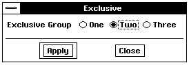

# 11 The List Objects
The GenItemGroup and GenBooleanGroup objects manage lists of objects 
(GenItems or GenBooleans, respectively) that contain user-selectable 
options. **GenDynamicListClass** is a subclass of **GenItemGroupClass** 
which allows efficient dynamic and scrolling lists. All of the list objects 
manage children which each represent a particular option. The user can 
generally select and deselect options in such a group, and in doing so cause 
an action to take place.

The list groups and list items work together to manage states of objects 
within your application. These list objects perform all of the complex state 
management of their children; the selection items themselves are very 
simple objects. 

You should be familiar with generic objects before reading this chapter. 
Please see "The GEOS User Interface," Chapter 10 of the Concepts Book for 
an overview of each generic object in the user interface. You should be 
particularly familiar with the instance data of and messages handled by 
**GenClass**.

## 11.1 List Object Features
The list objects provide a highly flexible way to display and manage 
user-selectable options. Depending on the Specific UI and the type of list, 
these objects may be built out in a variety of fashions. In some UIs, 
BooleanGroups may appear as checkboxes, GenItemGroups may appear as 
radio buttons, etc. For examples in OSF/Motif, see Figure 11-1.

  
  

**Figure 11-1** *Examples of several list objects*  
*Examples of a GenItemGroup (exclusive), GenBooleanGroup and 
GenDynamicList object*.

You may manipulate the grouping objects in much the same way as a 
GIV_SUB_GROUP GenInteraction. For example, hints may alter the 
placement and dimensions of the grouping object's children or the list may 
appear with special dimensions. The items themselves are simple generic 
objects that can be easily added to your grouping object. The grouping object 
will manage the geometry and selection state of these children; it will also 
perform any required actions based on the state of these children.

There are three list management objects. 

+ **GenItemGroup**  
An all-purpose grouping object, this list may be exclusive (only one item 
may be selected at a time) or non-exclusive and may also have scroll bars. 
A GenItemGroup may only contain GenItemClass objects as its 
children.

+ **GenBooleanGroup**  
This list is designed for entries that are either true of false ("on" or "off") 
independent of other entries. The BooleanGroup keeps track of its 
selections with a bitfield representing the boolean state of each of its 
children. A GenBooleanGroup object may only contain 
GenBooleanClass objects.

+ **GenDynamicList**  
This list is designed for very long or changing length lists. In many 
respects it is similar to a GenItemGroup but also allows efficient dynamic 
lists. A GenDynamicList does not specify any explicit "children"; instead 
it contains a list of monikers to display to the user within a scrolling list.

These are the following main list item objects:

+ **GenItem**  
Objects used as entries in a GenItemGroup. In OSF/Motif, these objects 
appear in most cases as "diamond" settings.

+ **GenBoolean**  
Objects used as entries in a GenBooleanGroup representing true or false 
states. In OSF/Motif, these items appear most often as selectable "boxes."

The GenDynamicList does not specify any generic children, but instead will 
contain a list of visual monikers to cycle through a scrolling list.

## 11.2 Common Behavior
Each list object acts differently and you will need to carefully review these 
differences before using them. There are a number of similarities in the 
functionality of these list objects, however. This next section details these 
similarities.

Each list group acts as a grouping object for its generic children. The list 
groups have much of the same geometry capabilities as a GIV_SUB_GROUP 
Interaction; they can arrange their children in a variety of fashions and can 
also be manipulated within their parent.

The items themselves may in general be either "on" (selected) or "off" 
(unselected). Depending on the behavior of the list, selecting an item may 
cause an action to occur and may affect the other selections. In exclusive lists, 
for example, selecting any item deselects any other item. 

### 11.2.1 Applying the Action
Often, each list object will contain an "apply" message. This message will be 
sent out when the list's state has changed and the new state should be 
applied in the application. For example, a list of colors ("Red", "Green", and 
"Blue") may have a message MSG_GEN_VIEW_SET_COLOR that sets the 
background color of a GenView. Changing the state of the list (by selecting an 
item) will cause this notification message to be sent to the view. More 
typically, though, the apply message will be sent to the application or a 
controller object.

Alternatively, you could forego including an apply message in the list object's 
instance data. In this case, whenever the object receives a MSG_GEN_APPLY 
it would query the state of its children and act upon that state.

When the user makes a selection, the apply action may or may not be sent 
out immediately, depending on the operating mode of the list. 
GenItemGroups, GenBooleanGroups, and GenDynamicLists may operate in 
one of two modes: immediate or delayed. (For a more complete discussion of 
delayed and immediate modes, see "GenInteraction," Chapter 7.) Typically, a 
list object will operate in delayed mode if it is placed within a 
GIT_PROPERTIES Interaction. Other generic objects such as 
GenInteractions, GenTexts, and GenValues also utilize delayed and 
immediate mode.

In immediate mode, any changes made in the list's state are reflected 
immediately in the application. If the user changes an immediate mode list 
object concerning a text style change, the text style of the current selection 
will change immediately. Changing the state of the list will cause the apply 
action associated with that object to be sent out immediately.

In delayed mode, any changes made in the list's state are not reflected until 
some later time, when the changes are "applied." This apply may be effected 
by the user (through an "apply" trigger) or by the application when it deems 
it appropriate. In delayed mode, the notification message will not be sent on 
changes to the state of the list but only when the list receives notice to apply 
the changes.

Occasionally, a list operating in delayed mode may wish to send out a 
different message whenever the user changes its state, even if that change 
should not be immediately applied. In this case, you can supply a status 
message for the object to send to the destination whenever the user makes 
changes within the list group.

Each list must have a destination to send its apply action and, if needed, 
status messages to. This destination can be any object or process capable of 
handling the message. 

### 11.2.2 State Information
In most cases, a selection will be either on or off. In some cases, however, a 
selection or a list's state will be indeterminate - considered neither 
completely on or off. For example, a styles list may show the characteristics 
of the current highlighted text (bold, italic, underlined, etc.). Selecting a 
whole paragraph of text in which only one word is bold will leave the "bold" 
entry in the styles list in an indeterminate state - some of the selected text is 
bold, some is not. 

The lists keep track of these indeterminate states themselves. In some cases, 
an entire list may be indeterminate; in other cases, individual items may be 
indeterminate. It is up to the specific UI to represent an indeterminate state. 
(In OSF/Motif settings that are indeterminate are shown unselected.)

If a list object is operating in delayed mode, changes within the list will not 
be effected until either the user or the application "applies" them. The list 
objects keep track of changes in state by storing a modified state of either the 
list or individual items. Whenever an apply action is made on a list group, the 
group will check whether its list (or its items) have been modified. If nothing 
has been marked modified, the list will not apply those changes (unless you 
wish to override this default behavior).

This modified state is independent of the list's mode. In immediate mode, a 
change in state to a list object will automatically mark that list object 
modified and simultaneously call MSG_GEN_APPLY on the list object. The list 
object will recognize that it is modified and will send out the group's apply 
action. In delayed mode, any changes made to the object will also mark the 
group modified; at some later point, MSG_GEN_APPLY will be sent to the list; 
the object will recognize that the group has been modified and will then send 
out its apply action.

## 11.3 GenItemGroups
The **GenItemGroupClass** and **GenItemClass** work together to allow an 
application to set up a list of options for a user to choose. A GenItemGroup 
may contain one or more GenItems; each GenItem may represent a 
particular option in the list. The user may select one or more of the options 
at any time, depending upon the behavior specified for the list, and the user 
can generally select or deselect an option by activating the corresponding 
GenItem.

GenItemClass objects are simple list items. GenItems are used only as 
entries within a GenItemGroup. In most cases, a GenItem will only need a 
moniker and a special identifier associated with the selection. The 
GenItemGroup will use this identifier to refer to the object when it needs to 
communicate to the items or when it sends out messages. 

Your application interacts with GenItems though the GenItemGroup; this 
group controls the items and keeps track of which are selected. The 
GenItemGroup object has all of the same geometry features as a grouping 
type GenInteraction. (See "GenInteraction," Chapter 7).

### 11.3.1 GenItemGroup Instance Data

GenItemGroup and GenItem objects contain a variety of information. The 
bulk of the functionality of the list is contained in the GenItemGroup; the 
items themselves only contain identifying information that the list uses.

The GenItemGroup contains instance fields relating to the state of its 
children GenItems. These instance fields are listed in Code Display 11-1. Any 
objects of **GenItemGroupClass** or one of its subclasses will contain these 
instance fields, along with the instance fields of **GenClass**. 

----------
**Code Display 11-1 GenItemGroup Instance Data**

    @instance GenItemGroupBehaviorType  GIGI_behaviorType = GIGBT_EXCLUSIVE;

    /* The GenItemGroupBehaviorType enumerations are used in the GIGI_behaviorType
     * instance field. */

    typedef ByteEnum GenItemGroupBehaviorType;
    #define GIGBT_EXCLUSIVE 0
    #define GIGBT_EXCLUSIVE_NONE 1
    #define GIGBT_EXTENDED_SELECTION 2
    #define GIGBT_NON_EXCLUSIVE 3

        @instance GenItemGroupStateFlags        GIGI_stateFlags = 0;

    /* The GenItemGroupStateFlags are used in the GIGI_stateFlags instance field. */

    typedef ByteFlags GenItemGroupStateFlags;
    #define GIGSF_INDETERMINATE         0x80
    #define GIGSF_MODIFIED              0x40

        @instance word                  GIGI_selection = GIGS_NONE;

    /* The GIGS_NONE constant is used with the GIGI_selection instance field and may
     * also be returned by MSG_GEN_ITEM_GROUP_GET_SELECTION. */

    #define GIGS_NONE (0xffff)

        @instance word                  GIGI_numSelections = 0;
        @instance optr                  GIGI_destination;
        @instance Message               GIGI_applyMsg = 0;

----------
*GIGI_behaviorType* describes the selection behavior of the list. The default 
type is GIGBT_EXCLUSIVE, which creates an exclusive list. A full description 
of each type is provided in "GenItemGroup Behavior" below.

*GIGI_stateFlags* contains flags that affect the state of the GenItemGroup. 
These flags indicate whether a GenItemGroup is in an indeterminate or a 
modified state.

*GIGI_selection* contains the name of the current GenItem child that is 
selected. GenItemGroups use the identifying keywords stored in each 
GenItem's *GII_identifier* instance field to reference those selections. If more 
than one item may be selected at a time (if *GIGI_numSelections* is greater 
than one), this instance field will point to a list of GenItem identifiers rather 
than store a single identifier.

*GIGI_numSelections* contains the number of GenItems currently selected. 
For exclusive or exclusive-none lists, this number will be either one or zero. 
For multiple selection lists, this number may be greater than zero. Unless 
you have an item group that initially appears with more than one selection, 
you will not need to set this up in your object declaration.

*GIGI_destination* contains the optr of the object or process to handle 
messages sent out by this GenItemGroup. This destination object will receive 
the notification message in the *GIGI_applyMsg* instance field whenever state 
changes are applied within the GenItemGroup.

*GIGI_applyMsg* stores the apply action for the GenItemGroup to send out 
whenever state changes should be applied, either through an immediate 
state change or through a delayed mode activation.

The GenItemGroup also has several vardata fields.

----------
**Code Display 11-2 GenItemGroup Vardata Instance Fields** 

    @vardata Message        ATTR_GEN_ITEM_GROUP_STATUS_MSG;
    @vardata void           ATTR_GEN_ITEM_GROUP_SET_MODIFIED_ON_REDUNDANT_SELECTION;
    @vardata Message        ATTR_GEN_ITEM_GROUP_CUSTOM_DOUBLE_PRESS;
    @vardata optr           ATTR_GEN_ITEM_GROUP_LINK;
        @reloc ATTR_GEN_ITEM_GROUP_LINK, 0, optr;
    @vardata void           ATTR_GEN_ITEM_GROUP_INIT_FILE_BOOLEAN;

    /* Hints */
    @vardata void       HINT_ITEM_GROUP_RADIO_BUTTON_STYLE;
    @vardata void       HINT_ITEM_GROUP_TOOLBOX_STYLE;
    @vardata void       HINT_ITEM_GROUP_SCROLLABLE;
    @vardata void       HINT_ITEM_GROUP_MINIMIZE_SIZE;
    @vardata void       HINT_ITEM_GROUP_DISPLAY_CURRENT_SELECTION;
    @vardata void       HINT_ITEM_GROUP_MINIMIZE_SIZE_IF_VERTICAL_SCREEN;

----------
ATTR_GEN_ITEM_GROUP_STATUS_MSG assigns a status message to your 
GenItemGroup. A status message allows objects to receive notice of a change 
in the GenItemGroup's current state without forcing an apply action. This 
attribute is useful for cases where the state of your GenItemGroup may 
reflect information in other user interface objects, and should therefore be 
updated whenever its state changes, regardless of the need to apply those 
changes.

In exclusive or extended-selection lists, selecting an already-select item will 
not change the state of the GenItemGroup and will not mark it modified. 
ATTR_GEN_ITEM_GROUP_SET_MODIFIED_ON_REDUNDANT_SELECTION 
alters this default behavior for a GenItemGroup. Including this attribute in 
the object's instance data will cause the group to be marked modified 
whenever the user makes a redundant selection, thereby forcing an apply 
action to later take place. Use this attribute for operations you may wish to 
repeat even if the state of the GenItemGroup has not changed.

ATTR_GEN_ITEM_GROUP_LINK allows two or more GenItemGroups to be 
linked together and act as one GenItemGroup. Each GenItemGroup may 
contain one or more items with identifiers unique to all other items within 
the linked GenItemGroups. The links should be circular, with the last group 
pointing back to the first. All of these GenItemGroups should have identical 
states and behavior types so they will work correctly. Use this attribute to 
circumvent undesirable geometry constraints. For more information, see 
"GenItemGroup Links" below.

ATTR_GEN_ITEM_GROUP_CUSTOM_DOUBLE_PRESS allows a special 
activation message to be sent out on double press events; it is used only in 
exclusive GenBooleanGroup lists.

ATTR_GEN_ITEM_GROUP_INIT_FILE_BOOLEAN forces the GenItemGroup to 
use "true" and "false" in the .INI file rather than numerical values.

HINT_ITEM_GROUP_RADIO_BUTTON_STYLE indicates that the Item Group 
should appear as "radio buttons" if the Specific UI allows such behavior. 
OSF/Motif does this by default. HINT_ITEM_GROUP_TOOLBOX_STYLE 
indicates that the item's should be drawn in toolbox style, with a simple box 
around the visual moniker.

HINT_ITEM_GROUP_MINIMIZE_SIZE and 
HINT_ITEM_GROUP_MINIMIZE_SIZE_IF_VERTICAL_SCREEN force the item 
group to use only the smallest space available. In OSF/Motif, for example, 
this would cause the item group to be a popup menu. The latter of the two 
hints takes effect only on screens that are taller than they are wide.

### 11.3.2 GenItem Instance Data
**GenItemClass** is a subclass of **GenClass**. It has one new instance field:

    @instance word GII_identifier;

*GII_identifier* sets the indentifying keyword (usually an enumerated type) 
that uniquely identifies this GenItem. This identifier is used by the 
GenItemGroup parent to indicate the current selection and otherwise 
reference the item. Each GenItem identifier within the same GenItemGroup 
must evaluate to a unique value.

### 11.3.3 GenItemGroup Basics
The GenItemGroup manages a group of GenItems. In general, you must 
decide which behavior type you wish your GenItemGroup to exhibit, the 
message for the list to send out, and the object (or process) to handle 
messages sent out by this group. You may also set a number of initial 
conditions (items selected, whether the list is indeterminate or modified, etc.) 
for the list.

#### 11.3.3.1 GenItemGroup Behavior
    GIGI_behaviorType, MSG_GEN_ITEM_GROUP_SET_BEHAVIOR_TYPE, 
    MSG_GEN_ITEM_GROUP_GET_BEHAVIOR_TYPE

There are several types of user selection behavior for a GenItemGroup. Items 
can be set up so that only one is selected at a time, one or none is selected at 
a time, multiple items can be selected, or multiple items can be selected only 
when extending the selection (e.g. dragging the mouse).

The *GIGI_behaviorType* instance field defines the selection behavior of the 
list. The instance data must be of the enumerated type 
**GenItemGroupBehaviorType**. The default type is GIGBT_EXCLUSIVE, 
which creates an exclusive list; one and only one selection in an exclusive list 
may be selected at any time. The available types are listed below.

GIGBT_EXCLUSIVE  
This is a list where only one option may be selected at a time. 
Once a selection has been made, making another selection will 
deselect the previous item. The user may not deselect a 
currently selected item. Many specific UIs represent these 
items with radio buttons; OSF/Motif represents these items 
with "diamond" settings. This type of list is the default for a 
GenItemGroup. 

GIGBT_EXCLUSIVE_NONE  
This list is also exclusive - at most one option may be selected 
at a time-but the user can also deselect an item, leaving no 
items selected. GenItemGroups show a "none-selected" state 
with GIGS_NONE in their GIGI_selection instance fields.

GIGBT_EXTENDED_SELECTION  
This list is normally exclusive, unless the user "extends" the 
selection. The user can extend the selection either by dragging 
the mouse through another selection or by clicking on a new 
selection in conjunction with a special keystroke. In OSF/Motif, 
clicking on an item while holding the SHIFT key will extend the 
selection (leaving any other selections unaffected) to the one 
clicked on. Extending a selection to a currently selected item 
will deselect that item.

GIGBT_NON_EXCLUSIVE  
This list does not exhibit any exclusive behavior. Any or all 
settings may be on at any time, and selecting any items will not 
affect the state of other settings. In many cases, you may want 
to use a GenBooleanGroup in place of a non-exclusive 
GenItemGroup. For example, a non-exclusive GenItemGroup 
cannot store individual indeterminate or modified states for its 
children; GenBooleanGroup stores this information.

#### Exclusive Lists

Exclusive lists are designed for cases in which one and only item should be 
selected at any given time. For example, a graphics application may want to 
prompt the user to select a color for drawing lines. The application can 
display this list of colors within an exclusive list. Only one color may be 
selected. Once a color is selected, selecting any other color will deselect the 
first color.

Exclusive lists may (and by default do) appear without any item initially 
selected. This may lead to problems if the application tries to apply any 
changes before an item is selected (such as within a delayed-mode dialog 
box). If your application needs an item to be selected at all times in order to 
operate correctly, your list should appear with one of the items initially 
selected (or with the "apply" trigger disabled).

#### Exclusive-None Lists

Exclusive-None lists are designed for cases in which either one item must be 
selected or no items should be selected. For example, a word processor may 
have a "Justifications" menu with several options such as left-justified, 
right-justified, or center-justified. Selecting any of these options will perform 
the justification operation on the current paragraph, but the user may also 
deselect any option, leaving no justification on the paragraph.

Exclusive-None lists by default appear without any items initially selected. 
Your application should, of course, be able to handle this case of nothing 
selected; if it cannot, the list should probably not be exclusive-none.

#### Extended-Selection Lists

Extended-Selection lists are designed for cases in which the application 
usually needs an exclusive selection but also desires to let the user select 
multiple items for bulk operations. Multiple selections are stored as lists of 
items.

For example, a disk copy operation may have an extended-selection list to 
specify the drive to copy a file to. In most cases, the user will only want to 
copy to one drive, and the list normally operates in exclusive mode to 
accommodate this. By extending the selection, however, the user can request 
the list to copy the file to multiple drives.

It is up to the specific UI how the user may extend a selection. In OSF/Motif, 
the user may select another item in tandem with a special keystroke (the 
SHIFT key) to extend the selection from one item to several. Extending a 
selection to an already selected item will deselect that item, leaving any other 
items unchanged.

#### Non-Exclusive Lists

Non-exclusive lists are designed for cases in which any or all of the items may 
be selected at once. Multiple selections, as in the extended-selection 
GenItemGroup, are stored as lists of items. Selecting an already selected 
item will deselect that item. Therefore, there may be a state where nothing 
is selected within a non-exclusive list.

For example, an interactive tutorial may ask the user if he wants more 
information on certain topics, giving these topics in a non-exclusive list. The 
user can freely choose as many or as few items as he wishes, and then select 
"Print" to print out information on those items.

In most cases, however, you might rather use a GenBooleanGroup object in 
place of a non-exclusive GenItemGroup. A GenBooleanGroup acts similar to 
a non-exclusive list but is streamlined to operate efficiently for lists with 16 
or fewer items. (GenBooleanGroups represent their children's state through 
a word-length bitfield; therefore they may only accommodate 16 children.) 
You may also need to use a GenBooleanGroup if you need to keep track of 
individual indeterminate and modified states.

MSG_GEN_ITEM_GROUP_GET_BEHAVIOR_TYPE returns the behavior type 
stored in the list's *GIGI_behaviorType* instance field. To set a new behavior 
type, send the list a MSG_GEN_ITEM_GROUP_SET_BEHAVIOR_TYPE.

----------
#### MSG_GEN_ITEM_GROUP_GET_BEHAVIOR_TYPE
    GenItemGroupBehaviorType MSG_GEN_ITEM_GROUP_GET_BEHAVIOR_TYPE();

This message returns the current behavior type of a GenItemGroup (stored 
in the *GIGI_behaviorType* instance field).

**Source:** Unrestricted.

**Destination:** Any GenItemGroup.

**Parameters:** Nothing.

**Return:** The **GenItemGroupBehaviorType** of the GenItemGroup.

**Interception:** Generally not intercepted.

----------
#### MSG_GEN_ITEM_GROUP_SET_BEHAVIOR_TYPE
    void    MSG_GEN_ITEM_GROUP_SET_BEHAVIOR_TYPE(
            GenItemGroupBehaviorType        behaviorType);

This message sets a new behavior type for a GenItemGroup by changing the 
object's *GIGI_behaviorType* instance field. This message should only be sent 
while the object is not usable. 

**Source:** Unrestricted.

**Destination:** Any non-usable GenItemGroup object.

**Parameters:**  
*behaviorType* - The new **GenItemGroupBehaviorType**.

**Return:** Nothing.

**Interception:** Generally not intercepted.

#### 11.3.3.2 GenItemGroup Selections
    GIGI_selection, GII_identifier, GIGI_numSelections, 
    MSG_GEN_ITEM_GROUP_SET_NONE_SELECTED, 
    MSG_GEN_ITEM_GROUP_SET_SINGLE_SELECTION, 
    MSG_GEN_ITEM_GROUP_SET_MULTIPLE_SELECTIONS, 
    MSG_GEN_ITEM_GROUP_GET_SELECTION, 
    MSG_GEN_ITEM_GROUP_GET_NUM_SELECTIONS, 
    MSG_GEN_ITEM_GROUP_GET_MULTIPLE_SELECTIONS

Within a GenItemGroup, each GenItem must contain an identifier, often an 
enumerated value, to uniquely identify that item. The GenItemGroup will 
use this identifying value whenever referencing the GenItem (or items), 
either through its instance data or through messages. This value is stored in 
the GenItem's *GII_identifier* instance data. 

In most cases, your collection of GenItems within a particular GenItemGroup 
should be different enumerated values. Each item within a specific 
GenItemGroup must have a unique identifier to reference each item. To 
ensure this, it is usually convenient to use an enumerated type. Make sure 
that you don't use two different enumerated types because they may not 
contain unique values across types.

In an exclusive or exclusive-none list, the GenItemGroup will store the 
identifier of the current selection in the *GIGI_selection* instance field. If no 
item is selected, this instance field will instead store the value GIGS_NONE 
(-1). (For an exclusive list, this case could only arise before an item is initially 
selected.)

Note that -1 is still a legal identifier for a GenItem. If you do use this 
identifier you must be sure to check the *GIGI_numSelections* instance field to 
check whether the *GIGI_selection* value corresponds to an item or to the 
GIGS_NONE value.

GenItemGroups by default appear with no items initially set (*GIGI_selection* 
is set to GIGS_NONE). If you wish a GenItemGroup to initially appear with a 
selection set to one of the GenItems, set *GIGI_selection* to the identifier of that 
GenItem.

----------
**Code Display 11-3 Setting Enumerated Types As Identifiers**

    /* In most cases, each GenItemGroup should have a single set of enumerated types
     * to name its children. In this case, MyCityGroup will have settings all related
     * to the enumerated type USCities, and San Francisco will be the initial
     * selection. */

    typedef ByteEnum USCitiesEnum;
    #define CITY_CHICAGO 1
    #define CITY_NEW_YORK 2
    #define CITY_SAN_FRANCISCO 3
    #define CITY_LOS_ANGELES 4

    @object GenItemGroupClass MyCityGroup = {
        GI_comp = @Chicago, @NewYork, @SanFrancisco, @LosAngeles;
        GIGI_selection = CITY_SAN_FRANCISCO;
    }

    @object GenItemClass Chicago = {
        GI_visMoniker = `C', "Chicago";
        GII_identifier = CITY_CHICAGO;
    }

    @object GenItemClass NewYork = {
        GI_visMoniker = `N', "New York";
    GII_identifier = CITY_NEW_YORK;
    }

    @object GenItemClass SanFrancisco = {
        GI_visMoniker = `S', "San Francisco";
        GII_identifier = CITY_SAN_FRANCISCO;
    }

    @object GenItemClass LosAngeles = {
        GI_visMoniker = `L', "Los Angeles";
        GII_identifier = CITY_LOS_ANGELES;
    }

----------
In an extended-selection or non-exclusive list, more than one item may be 
selected at a time. In this case, the *GIGI_selection* instance field will not store 
a single identifier but instead will store a ChunkHandle to a list of 
identifiers. This functionality is internal to the operation of the list.

You may set up a list (if it is extended-selection or non-exclusive) to initially 
appear with multiple selections. The list of identifiers may be of arbitrary 
size but must be manually set up in its own chunk. Set *GIGI_selection* to the 
ChunkHandle of the chunk containing this list. In this case, you must also 
set *GIGI_numSelections* to the proper number of selections. (See Code 
Display 11-4.)

For multiple selection lists (GIGBT_EXTENDED_SELECTION or 
GIGBT_NON_EXCLUSIVE) GIGI_numSelections may be set greater than 1 if 
more than one item is selected. In this case, *GIGI_selection* will contain a 
ChunkHandle to a list of identifiers instead of a single identifier.

----------
**Code Display 11-4 Setting Multiple Initial Selections**

    /* To set a GenItemGroup to appear initially with multiple selections, set up a
     * chunk containing the identifiers and a ChunkHandle in the GIGI_selection
     * instance field. Only the new list chunk and the GenItemGroup are shown; other
     * information is in the previous code display. */

    @object GenItemGroupClass MyCityGroup = {
        GI_comp = @Chicago, @NewYork, @SanFrancisco, @LosAngeles;
        GIGI_behaviorType = GIGBT_NON_EXCLUSIVE;
        GIGI_numSelections = 2;
        GIGI_selection = (ChunkHandle) ChunkOf(@SelectionList);
    }

    @chunk word SelectionList[2] = {
        CITY_CHICAGO, CITY_SAN_FRANCISCO
    };

----------
In most cases, the user will change the selections of the GenItemGroup by 
clicking on items. Your application may also retrieve or alter the items 
selected with the following messages. In many of these messages, you may 
have to pass an indeterminate state; if you are unsure about what 
indeterminate state a list object should be in, pass FALSE. Most 
GenItemGroups do not need to worry about their indeterminate state.

None of the messages which alter the state or number of selections cause an 
apply or status message to be sent out by the GenItemGroup. If you wish to 
send out an apply or a status message in these cases, mark the 
GenItemGroup modified and send the object MSG_GEN_APPLY or 
MSG_GEN_ITEM_GROUP_SEND_STATUS_MSG.

MSG_GEN_ITEM_GROUP_GET_SELECTION returns the currently selected 
item for the GenItemGroup. If there are no items currently selected, this 
message will return GIGS_NONE. If there is more than one item selected, this 
message will only return the first item selected in that GenItemGroup. (You 
should use MSG_GEN_ITEM_GROUP_GET_MULTIPLE_SELECTIONS in this 
case.) 

MSG_GEN_ITEM_GROUP_GET_MULTIPLE_SELECTIONS returns the current 
list of selections for non-exclusive and extended-selection lists. You must pass 
this message a pointer to a buffer to hold the list of selections, along with the 
number of items the buffer can hold. Make sure to allocate enough space in 
this buffer, or the buffer will not be filled in. Also make sure to send this 
message with @**call** and not @**send**, as it passes a pointer. You can check for 
the number of items currently selected with 
MSG_GEN_ITEM_GROUP_GET_NUM_SELECTIONS.

MSG_GEN_ITEM_GROUP_SET_NONE_SELECTED deselects any settings 
currently on so that the list will appear with no items selected. It takes a flag 
indicating whether the list should be in its indeterminate state. This 
message will also clear the object's modified flag. If you wish to set this flag, 
send the GenItemGroup a MSG_GEN_ITEM_GROUP_SET_MODIFIED_STATE 
after sending this message.

MSG_GEN_ITEM_GROUP_SET_SINGLE_SELECTION sets a single selection 
for a GenItemGroup. Any old selections will be deselected automatically, 
regardless of the behavior type of the list. It takes a flag indicating whether 
the list should be in its indeterminate state. If the GenItemGroup is 
scrollable and exclusive, this message will usually ensure that the list will 
automatically scroll to the selected item. This message also clears the object's 
modified flag.

MSG_GEN_ITEM_GROUP_SET_MULTIPLE_SELECTIONS sets a a group of 
selections for a GenItemGroup. Any previously selected items will be 
deselected. The message must pass the number of selections and a pointer to 
the list of identifiers to set. This message will clear the GenItemGroup's 
modified flag. 

----------
#### MSG_GEN_ITEM_GROUP_GET_SELECTION
    word    MSG_GEN_ITEM_GROUP_GET_SELECTION();

This message returns the current selection identifier for the GenItemGroup. 
If there is no selection, this message returns GIGS_NONE. If there are 
multiple selections, this message only returns the first selection. Use 
MSG_GEN_ITEM_GROUP_GET_MULTIPLE_SELECTIONS for multiple 
selections. A selection may be returned even if the item is not usable, not 
enabled, or not in the GenItemGroup.

If you are using a GenItemGroup which may contain a selection of -1, you will 
want to call MSG_GEN_ITEM_GROUP_GET_NUM_SELECTIONS to 
differentiate between the item with -1 being selected and GIGS_NONE.

**Source:** Unrestricted.

**Destination:** Any GenItemGroup object.

**Return:** The current selection stored in the GenItemGroup's *GIGI_selection* 
instance field (or GIGS_NONE if there are no selections).

**Interception:** Generally not intercepted.

----------
#### MSG_GEN_ITEM_GROUP_GET_MULTIPLE_SELECTIONS
    word    MSG_GEN_ITEM_GROUP_GET_MULTIPLE_SELECTIONS(
            word    *selectionList,
            word    maxSelections);

This message returns the current list of selections for non-exclusive and 
extended-selection GenItemGroups. The caller must allocate a buffer for the 
entries and pass the size of that buffer. If there is insufficient space in the 
passed buffer, no entries will be filled in. You should call 
MSG_GEN_ITEM_GET_NUM_SELECTIONS beforehand in order to allocate the 
correct maximum size for the buffer. 

This message returns the number of selections filled into the buffer. The 
buffer is filled in with the proper identifiers. The list of identifiers within the 
buffer will not be null-terminated.

If you are using an exclusive or exclusive-none list, use 
MSG_GEN_ITEM_GROUP_GET_SELECTION instead.

**Source:** Unrestricted.

**Destination:** Any GenItemGroup object.

**Parameters:**  
*selectionList* - A pointer to the buffer to store the selection entries. 

*maxSelections*  - The maximum number of selections that may be 
returned by the message.

**Return:** The total number of selections returned in the buffer.

*selectionList* - The pointer to the buffer containing the identifiers 
of the selections.

**Interception:** Generally not intercepted.

----------
#### MSG_GEN_ITEM_GROUP_GET_NUM_SELECTIONS
    word    MSG_GEN_ITEM_GROUP_GET_NUM_SELECTIONS();

This message returns the GenItemGroup's current number of selections 
(stored in *GIGI_numSelections*), or zero if there is no selection. 

**Source:** Unrestricted.

**Destination:** Any GenItemGroup object.

**Return:** The number of selections in the GenItemGroup.

**Interception:** Generally not intercepted.

----------
#### MSG_GEN_ITEM_GROUP_SET_NONE_SELECTED
    void    MSG_GEN_ITEM_GROUP_SET_NONE_SELECTED(
            Boolean     indeterminate);

This message sets a GenItemGroup to show no selections; it should not be 
sent to an exclusive GenItemGroup. This message will also clear the 
GenItemGroup's modified flag. If you wish to set the modified flag, send the 
list a MSG_GEN_ITEM_GROUP_SET_MODIFIED_STATE. 

**Source:** Unrestricted.

**Destination:** Any GenItemGroup object.

**Parameters:**  
*indeterminate* - Pass TRUE if the GenItemGroup should be marked 
indeterminate, FALSE otherwise.

**Return:** Nothing.

**Interception:** Generally not intercepted.

----------
#### MSG_GEN_ITEM_GROUP_SET_SINGLE_SELECTION
    void    MSG_GEN_ITEM_GROUP_SET_SINGLE_SELECTION(
            word        identifier,
            Boolean     indeterminate);

This message sets exactly one selection for a GenItemGroup. Any 
previously-selected items will be deselected, regardless of the 
GenItemGroup's behavior type. To set items without disturbing other 
settings, use MSG_GEN_ITEM_GROUP_SET_ITEM_STATE. If the list is 
on-screen, this message will cause a visual update. If the GenItemGroup is 
scrollable, this message will usually ensure that the item selected will appear 
on-screen.

This message clears the list's modified state. If you wish to set the group 
modified, send it a MSG_GEN_ITEM_GROUP_SET_MODIFIED_STATE. You 
may set a selection that is not usable, not enabled, or even not in the 
GenItemGroup. (This is useful for linked GenItemGroups.) 

**Source:** Unrestricted.

**Destination:** Any GenItemGroup.

**Parameters:**  
*identifier* - The identifier (enumerated value) of the item to 
select.

*indeterminate* - Pass TRUE if the group should be marked 
indeterminate.

**Return:** Nothing.

**Interception:** Generally not intercepted.

**Tips:** An item with a matching identifier need not be present to become the 
GenItemGroup's "selection." Using this knowledge, you can set up 
several "linked" GenItemGroups, each with only one selection. (See 
"GenItemGroup Links" below for information and examples.)

----------
#### MSG_GEN_ITEM_GROUP_SET_MULTIPLE_SELECTIONS
    void    MSG_GEN_ITEM_GROUP_SET_MULTIPLE_SELECTIONS(
            word    *selectionList,
            word    numSelections);

This message sets multiple selections for a GenItemGroup. The caller must 
pass a pointer to a list of identifiers that should be selected, along with the 
number of selections to set. This message will clear the GenItemGroup's 
modified flag. If you wish to set the group modified send it a 
MSG_GEN_ITEM_GROUP_SET_MODIFIED_STATE. 

**Source:** Unrestricted.

**Destination:** Any GenItemGroup object.

**Parameters:**  
*selectionList* - A pointer to the buffer containing a list of item 
identifiers.

*numSelections* - The number of selections in the passed list.

**Return:** Nothing.

**Interception:** Generally not intercepted.

#### 11.3.3.3 GenItemGroup States
    GIGI_stateFlags, 
    ATTR_GEN_ITEM_GROUP_SET_MODIFIED_ON_REDUNDANT_SELECTION, 
    MSG_GEN_ITEM_GROUP_SET_INDETERMINATE_STATE, 
    MSG_GEN_ITEM_GROUP_IS_INDETERMINATE, 
    MSG_GEN_ITEM_GROUP_SET_MODIFIED_STATE, 
    MSG_GEN_ITEM_GROUP_IS_MODIFIED

The *GIGI_stateFlags* contains flags relating to the state of the entire 
GenItemGroup. The two flags possible are

+ GIGSF_INDETERMINATE  
This flag marks the GenItemGroup indeterminate. Only the group may 
be indeterminate; individual GenItems may not be marked 
indeterminate.

+ GIGSF_MODIFIED  
This flag marks the GenItemGroup modified. Only the group may be 
marked as modified; individual GenItems may not be marked as 
modified.

A GenItemGroup is in the indeterminate state if its *GIGI_stateFlags* contains 
the GIGSF_INDETERMINATE flag. GenItems cannot be in an indeterminate 
state by themselves; either the entire list is indeterminate or it is not. If you 
want individual items to be indeterminate, you may want to use a 
GenBooleanGroup object instead.

A GenItemGroup is in the modified state if its *GIGI_stateFlags* contains the 
GIGSF_MODIFIED flag. GenItems may not be in a modified state by 
themselves; either the entire list is modified or it is not. If you want to mark 
individual items as modified, you may want to use a GenBooleanGroup object 
instead.

In immediate mode, any user change to the GenItemGroup's state 
automatically sets the GIGSF_MODIFIED flag and also forces an "apply." 
Therefore, in immediate mode, any user changes will, by default, cause the 
apply action to be sent out immediately. In delayed mode, the 
GIGSF_MODIFIED flag is set, but an apply action will not automatically occur. 
The apply action will only occur when the user forces it (such as clicking on 
an "apply" trigger) or when the application forces it (by sending out a 
MSG_GEN_APPLY).

You can force an apply by sending the GenItemGroup MSG_GEN_APPLY. You 
can also override the default behavior, forcing the object to send out its 
notification message on all applies, by including 
ATTR_GEN_SEND_APPLY_MSG_ON_APPLY_EVEN_IF_NOT_MODIFIED in the 
object's instance data. Any time the object receives an "apply," the 
GenItemGroup will send out the notification message even if the object does 
not contain any modified GenItem children.

In general, if the user makes redundant changes (such as repeatedly 
selecting the same item) the group will not be marked modified-the group 
has not changed state since the last apply, so there is no need to send out a 
notification message. If, however, you wish for the group to be set modified on 
redundant changes, add the vardata attribute 
ATTR_GEN_ITEM_GROUP_SET_MODIFIED_ON_REDUNDANT_SELECTION 
to the object's instance data. Whenever the user makes any selection, the 
group will be marked modified. 

To check whether a GenItemGroup is indeterminate, send it a 
MSG_GEN_ITEM_GROUP_IS_INDETERMINATE. The message will return true 
if the list is indeterminate, false if it is not. 

To set a GenItemGroup indeterminate, send it 
MSG_GEN_ITEM_GROUP_SET_INDETERMINATE_STATE. Note that the 
messages to set a GenItemGroup's selections already provide an argument to 
set the GenItemGroup indeterminate. 

To check whether a GenItemGroup has been modified, send it 
MSG_GEN_ITEM_GROUP_IS_MODIFIED. This will return true if the list has 
been modified, false if it has not. To set a GenItemGroup modified, send it a 
MSG_GEN_ITEM_GROUP_SET_MODIFIED_STATE.

----------
#### MSG_GEN_ITEM_GROUP_SET_INDETERMINATE_STATE
    void    MSG_GEN_ITEM_GROUP_SET_INDETERMINATE_STATE(
            Boolean     indeterminateState);

This message sets the GenItemGroup's GIGSF_INDETERMINATE flag in its 
*GIGI_stateFlags* instance field. Usually this message is used in conjunction 
with MSG_GEN_ITEM_GROUP_SET_MULTIPLE_SELECTIONS. 
(MSG_GEN_ITEM_GROUP_SET_NONE_SELECTED and 
MSG_GEN_ITEM_GROUP_SET_SINGLE_SELECTION set the indeterminate 
state themselves.)

**Source:** Unrestricted.

**Destination:** Any GenItemGroup object.

**Parameters:**  
*indeterminate* - Pass TRUE to mark the group indeterminate, 
FALSE to set the group not indeterminate.

**Return:** Nothing.

**Interception:** Generally not intercepted.

----------
#### MSG_GEN_ITEM_GROUP_IS_INDETERMINATE
    Boolean MSG_GEN_ITEM_GROUP_IS_INDETERMINATE();

This message checks whether a GenItemGroup is in the indeterminate state; 
it checks the GIGSF_INDETERMINATE flag in the GenItemGroup's 
*GIGI_stateFlags*. 

**Source:** Unrestricted.

**Destination:** Any GenItemGroup object.

**Return:** TRUE if the GenItemGroup is indeterminate, FALSE otherwise.

**Interception:** Generally not intercepted.

----------
#### MSG_GEN_ITEM_GROUP_SET_MODIFIED_STATE
    void    MSG_GEN_ITEM_GROUP_SET_MODIFIED_STATE(
            Boolean     modifiedState);

This message marks a GenItemGroup modified by setting the 
GIGSF_MODIFIED flag in its *GIGI_stateFlags* instance field.

**Source:** Unrestricted.

**Destination:** Any GenItemGroup object.

**Parameters:**  
*modifiedState* - TRUE to mark the list modified, FALSE otherwise.

**Return:** Nothing.

**Interception:** Generally not intercepted.

----------
#### MSG_GEN_ITEM_GROUP_IS_MODIFIED
    Boolean MSG_GEN_ITEM_GROUP_IS_MODIFIED();

This message checks whether a GenItemGroup has been modified by 
checking the GIGSF_MODIFIED flag in the GenItemGroup's *GIGI_stateFlags*. 

**Source:** Unrestricted.

**Destination:** Any GenItemGroup object.

**Parameters:** None.

**Return:** TRUE if GenItemGroup is marked modified, FALSE otherwise.

**Interception:** Generally not intercepted.

#### 11.3.3.4 Sending the Event
    GIGI_applyMsg, GIGI_destination, GEN_ITEM_GROUP_APPLY_MSG, 
    ATTR_GEN_SEND_APPLY_MSG_ON_APPLY_EVEN_IF_NOT_MODIFIED, 
    MSG_GEN_ITEM_GROUP_GET_DESTINATION, 
    MSG_GEN_ITEM_GROUP_SET_DESTINATION, 
    MSG_GEN_ITEM_GROUP_GET_APPLY_MSG, 
    MSG_GEN_ITEM_GROUP_SET_APPLY_MSG

When the GenItemGroup receives notice to apply any changes to its state, it 
will first check its GIGSF_MODIFIED flag. If the list has been modified, the 
GenItemGroup will send the apply action stored in its *GIGI_applyMsg* field 
to the destination stored in its *GIGI_destination* field.

*GIGI_applyMsg* stores the apply action you wish the GenItemGroup to send 
out whenever you make a selection choice within the group. This message 
should be based on the prototype GEN_ITEM_GROUP_APPLY_MSG so that the 
proper arguments (*selection*, *numSelections*, and *stateFlags*) are 
automatically passed. *GIGI_destination* should store the object or process you 
wish to handle the message sent out by this group. This object should have a 
handler for the *GIGI_applyMsg*.

You can force a GenItemGroup to apply its changes with MSG_GEN_APPLY. 
You can also override the default behavior, forcing the object to send out its 
apply action on all applies, whether modified or not, by including 
ATTR_GEN_SEND_APPLY_MSG_ON_APPLY_EVEN_IF_NOT_MODIFIED in the 
object's instance data. Any time the object needs to apply its changes, the 
GenItemGroup will send out the notification message even if the object is not 
marked GIGSF_MODIFIED.

To retrieve the object or process stored in the GenItemGroup's 
*GIGI_destination* instance field or the message stored in its *GIGI_applyMsg* 
instance field, send the list MSG_GEN_ITEM_GROUP_GET_DESTINATION or 
MSG_GEN_ITEM_GROUP_GET_APPLY_MSG.

To set the GenItemGroup's destination, send the list 
MSG_GEN_ITEM_GROUP_SET_DESTINATION, passing the optr of the new 
destination. To set the GenItemGroup's notification message, send the list 
MSG_GEN_ITEM_GROUP_SET_APPLY_MSG, passing it the message to use.

----------
#### GEN_ITEM_GROUP_APPLY_MSG
    void    GEN_ITEM_GROUP_APPLY_MSG(
            word    selection,
            word    numSelections
            byte    stateFlags);

Use this prototype to define the apply message for your GenItemGroup 
(stored in the *GIGI_applyMsg* instance field). This prototype ensures that the 
message passes the correct parameters to your message handler. 

**Source:** Your GenItemGroup object.

**Destination:** Destination of your GenItemGroup.

**Parameters:**  
*selection* - The current selection of the GenItemGroup.

*numSelections* - The current number of selections of the 
GenItemGroup.

*stateFlags* - The current state flags of the GenItemGroup.

**Return:** Nothing.

----------
#### MSG_GEN_ITEM_GROUP_GET_DESTINATION
    optr    MSG_GEN_ITEM_GROUP_GET_DESTINATION();

This message returns the optr of the current destination object as specified 
in the *GIGI_destination* instance field.

**Source:** Unrestricted.

**Destination:** Any GenItemGroup object.

**Parameters:** Nothing.

**Return:** The optr of the current destination object.

**Interception:** Generally not intercepted.

----------
#### MSG_GEN_ITEM_GROUP_SET_DESTINATION
    void    MSG_GEN_ITEM_GROUP_SET_DESTINATION(
            optr    dest);

This message sets a new destination object for the list, stored in the list's 
*GIGI_destination* field. The apply and status messages of this GenItemGroup 
will be sent to this new destination.

**Source:** Unrestricted.

**Destination:** Any GenItemGroup.

**Parameters:**  
*dest* - The optr of the new destination object to be put in 
*GIGI_destination*.

**Return:** Nothing.

**Interception:** Generally not intercepted.

----------
#### MSG_GEN_ITEM_GROUP_GET_APPLY_MSG
    Message MSG_GEN_ITEM_GROUP_GET_APPLY_MSG();

This message returns the current apply message in the GenItemGroup's 
*GIGI_applyMsg* instance field.

**Source:** Unrestricted.

**Destination:** Any GenItemGroup.

**Parameters:** Nothing.

**Return:** The current apply message.

**Interception:** Generally not intercepted.

----------
#### MSG_GEN_ITEM_GROUP_SET_APPLY_MSG
    void    MSG_GEN_ITEM_GROUP_SET_APPLY_MSG(
            Message     message);

This message sets a new apply message in the GenItemGroup's 
*GIGI_applyMsg* instance field.

**Source:** Unrestricted.

**Destination:** Any GenItemGroup object.

***Parameters:**  
message* - The new notification message.

**Return:** Nothing.

**Interception:** Generally not intercepted.

#### 11.3.3.5 Sending Status Messages
    GEN_ITEM_GROUP_STATUS_MSG, 
    ATTR_GEN_ITEM_GROUP_STATUS_MSG, 
    MSG_GEN_ITEM_GROUP_SEND_STATUS_MSG

If you wish your application to receive notice whenever the list's state 
changes, even if those changes will not be immediately applied, you may set 
a status message in the object's instance data. 

For example, a color selection dialog box provides two means to set the RGB 
value of a color: one in a GenItemGroup listing the total possible states and 
another in a GenBooleanGroup with separate toggle states for Red, Green, 
and Blue. In delayed mode, setting the values in one group should change the 
display of the other group simultaneously but should not result in an apply 
action until the user activates the apply trigger. 

One list can notify its partner of state changes with a status message. The 
other list can respond to state changes (and therefore change its 
corresponding state) without actually applying those changes.

To set up a status message, add a message based on the prototype 
GEN_ITEM_GROUP_STATUS_MSG. This message will be sent to the list's 
destination object. Set ATTR_GEN_ITEM_GROUP_STATUS_MSG to the status 
message.

----------
**Code Display 11-5 Status Message in GenItemGroup**

    /* Use the prototype GEN_ITEM_GROUP_STATUS_MSG to set up a status message. The
     * prototype takes three arguments: selection (the contents of GIGI_selection),
     * numSelections (the contents of GIGI_numSelections), and stateFlags (the contents
     * of GIGI_stateFlags). */

    /* In the destination's class definition: */
    @message (GEN_ITEM_GROUP_STATUS_MSG) MSG_COLOR_STATUS_CHANGE;

    /* In the GenItemGroup's object declaration, set
     * ATTR_GEN_ITEM_GROUP_STATUS_MSG to the message you declared. */
    @object GenItemGroupClass MyColorGroup = {
        GIGI_applyMsg = MSG_COLOR_CHANGE;
        GIGI_destination = process;
        ATTR_GEN_ITEM_GROUP_STATUS_MSG = MSG_COLOR_STATUS_CHANGE;
    }

    /* Finally, in your handler for this status message, do required work. */
    @method MyProcessClass, MSG_COLOR_STATUS_CHANGE {
        switch (selection) {
        case C_BLACK:
            /* ...(code)... */
        case C_WHITE:
            /* ...(code)... */
        }
    }

----------

----------
#### GEN_ITEM_GROUP_STATUS_MSG
    void    GEN_ITEM_GROUP_STATUS_MSG(
            word    selection,
            word    numSelections,
            byte    stateFlags);

Use this prototype to define a status message for your GenItemGroup (stored 
in the ATTR_GEN_ITEM_GROUP_STATUS_MSG vardata). This prototype 
ensures that your status message passes the correct parameters.

**Source:** Your GenItemGroup object.

**Destination:** The destination of your GenItemGroup.

**Parameters:**  
*selection* - The current selection (enumerated type stored in 
*GIGI_selection*) of the GenItemGroup.

*numSelections* - The current number of selections (stored in 
*GIGI_numSelections*) of the GenItemGroup.

*stateFlags* - The current state flags (stored in *GIGI_stateFlags*) 
of the GenItemGroup.

**Return:** Nothing.

**Tips:** It is usually convenient to set up a switch statement based on the 
enumerated value of the selection passed in this message handler.

----------
#### MSG_GEN_ITEM_GROUP_SEND_STATUS_MSG
    void    MSG_GEN_ITEM_GROUP_SEND_STATUS_MSG(
            Boolean modifiedState);

This message causes the GenItemGroup to send out the status message to 
the destination object. This status message is stored in 
ATTR_GEN_ITEM_GROUP_STATUS_MSG.

**Source:** Unrestricted.

**Destination:** Any GenItemGroup object that contains a status message.

**Parameters:**  
*modifiedState* - Pass TRUE if the GenItemGroup should be marked 
modified.

**Return:** Nothing.

**Interception:** Generally not intercepted.

### 11.3.4 Working with Items
With several GenItem and GenItemGroup messages, you can work with 
individual items. The following sections detail these messages.

#### 11.3.4.1 Altering the Identifiers
    MSG_GEN_ITEM_GET_IDENTIFIER, MSG_GEN_ITEM_SET_IDENTIFIER, 
    MSG_GEN_ITEM_GROUP_GET_UNIQUE_IDENTIFIER

You may change the identifiers of GenItems dynamically. To retrieve a 
GenItem's identifier, send the GenItem MSG_GEN_ITEM_GET_IDENTIFIER. 
To set a GenItem's identifier, send it MSG_GEN_ITEM_SET_IDENTIFIER, 
passing the message the value you wish to set it to. Make sure that this value 
is unique and not duplicated by any other GenItem in the same 
GenItemGroup.

To generate a unique identifier for an item in a group, the GenItemGroup 
may use MSG_GEN_ITEM_GROUP_GET_UNIQUE_IDENTIFIER.

----------
#### MSG_GEN_ITEM_GET_IDENTIFIER
    word    MSG_GEN_ITEM_GET_IDENTIFIER();

This message returns the identifier stored in the item's GII_identifier 
instance field.

**Source:** Unrestricted.

**Destination:** Any GenItem object.

**Return:** The identifier of the GenItem object.

**Interception:** Generally not intercepted.

----------
#### MSG_GEN_ITEM_SET_IDENTIFIER
    void    MSG_GEN_ITEM_SET_IDENTIFIER(
            word    identifier);

This message sets a GenItem's *GII_identifier* instance field to a new value. 
There is no effect on the list itself. The item whose identifier is changed must 
not be currently selected. It is therefore up to the application to make sure 
that the item is de-selected before changing its identifier.

**Source:** Unrestricted.

**Destination:** Any GenItem object.

**Return:** Nothing.

**Interception:** Generally not intercepted.

**Warnings:** The new enumerated value should be unique among all of the items in 
the list. Use MSG_GEN_ITEM_GROUP_GET_UNIQUE_IDENTIFIER.

----------
#### MSG_GEN_ITEM_GROUP_GET_UNIQUE_IDENTIFIER
    word    MSG_GEN_ITEM_GROUP_GET_UNIQUE_IDENTIFIER();

This message returns an identifier that is unique among the items in the 
GenItemGroup's group. It does not check across links, however.

**Source:** Unrestricted.

**Destination:** Any non-usable GenItemGroup object.

**Parameters:** None.

**Return:** The unique item identifier.

**Interception:** Generally not intercepted.

#### 11.3.4.2 Altering the Item's State
    MSG_GEN_ITEM_GROUP_GET_ITEM_OPTR, 
    MSG_GEN_ITEM_GROUP_SET_ITEM_STATE, 
    MSG_GEN_ITEM_GROUP_IS_ITEM_SELECTED

You can retrieve the optr of a selection by sending the GenItemGroup a 
MSG_GEN_ITEM_GROUP_GET_ITEM_OPTR, passing the identifier of the 
requested item. You may then use this item optr to send messages directly to 
the individual items or to set items enabled/disabled, usable/not usable, etc. 
If the item is not found, this message will return null.

You may also set an item selected without altering any other settings in the 
GenItemGroup. Send the list a MSG_GEN_ITEM_GROUP_SET_ITEM_STATE, 
passing it the identifier of the item to mark as selected. If the list is exclusive 
or exclusive-none, any other settings will be deselected; if the list is 
extended-selection or non-exclusive, the other settings will remain intact.

To check on whether an item is selected, send the GenItemGroup a 
MSG_GEN_ITEM_GROUP_IS_ITEM_SELECTED, passing it the identifier of the 
item in question. This message will return *true* if the item is currently 
selected, *false* if it is not.

Send MSG_GEN_ITEM_GROUP_MAKE_ITEM_VISIBILE to force a scrolling 
GenItemGroup to scroll to an item. Pass this message the identifier of the 
requested item. This message has no effect on non-scrolling lists.

----------
#### MSG_GEN_ITEM_GROUP_GET_ITEM_OPTR
    optr    MSG_GEN_ITEM_GROUP_GET_ITEM_OPTR(
            word    identifier);

This message returns the optr of a GenItem within a GenItemGroup. You 
may then use this optr for directly manipulating the GenItem. If an item with 
the requested identifier is not found as one of the GenItemGroup's children, 
this message will return a null optr.

**Source:** Unrestricted.

**Destination:** Any GenItemGroup object.

**Parameters:**  
*identifier* - The identifier of the item to search for (stored in the 
GenItem's *GII_identifier* instance field).

**Return:** The optr of the GenItem with the requested identifier (or a null optr if 
none is found).

**Interception:** Generally not intercepted.

----------
#### MSG_GEN_ITEM_GROUP_SET_ITEM_STATE
    void    MSG_GEN_ITEM_GROUP_SET_ITEM_STATE(
            word        identifier,
            Boolean     state);

This message sets the state (selected or unselected) of a particular GenItem 
within a GenItemGroup. Other items will be unaffected by the new state. 
This message also clears the GenItemGroup's modified state. If an identifier 
is passed which does not match an item within the GenItemGroup (or 
matches a not usable item), it will still be made the selection. 

**Source:** Unrestricted.

**Destination:** Any GenItemGroup object.

**Parameters:**  
*identifier* - The identifier of the item to change state.

*state* - TRUE to mark item selected, FALSE to mark item 
unselected.

**Return:** Nothing.

**Interception:** Generally not intercepted.

**Tips:** An item with a matching identifier need not be present to become the 
GenItemGroup's selection. Using this knowledge, you can set up 
several "linked" GenItemGroups, each with only one selection. (See 
"GenItemGroup Links" below for information and examples.)

----------
#### MSG_GEN_ITEM_GROUP_IS_ITEM_SELECTED
    Boolean MSG_GEN_ITEM_GROUP_IS_ITEM_SELECTED(
            word    identifier);

This message checks whether an item within a GenItemGroup is selected, 
even if that item is not usable, not enabled, or not within the GenItemGroup. 
The message returns *true* if the item is selected, *false* if it is not selected. 

**Source:** Unrestricted.

**Destination:** Any GenItemGroup object.

**Parameters:**  
*identifier* - The identifier of the item to check for.

**Return:** Will return true if the item is selected, false if it is not.

**Interception:** Generally not intercepted.

### 11.3.5 Scrolling GenItemGroups
    HINT_ITEM_GROUP_SCROLLABLE, 
    MSG_GEN_ITEM_GROUP_MAKE_ITEM_VISIBLE

A scrolling list is a special version of a GenItemGroup that allows the user to 
scroll through a list of items which are not all visible at one time. Scrolling 
lists usually provide scrollbars or some other means to quickly scan through 
a list. You may make a GenItemGroup scrollable if the specific UI allows by 
including the hint HINT_ITEM_GROUP_SCROLLABLE in the list's object 
declaration.

The list will come up in a standard size determined by the specific UI. You 
may override this by adding a size hint to the object (HINT_FIXED_SIZE, 
HINT_INITIAL_SIZE, etc.). Notification of changes for a scrolling list, as well 
as setting and getting the selections, works the same for a scrolling list as for 
a normal GenItemGroup. If an item is selected, the scrolling list will almost 
always scroll automatically to the selected item.

To force a GenItemGroup to scroll to an item, send 
MSG_GEN_ITEM_GROUP_MAKE_ITEM_VISIBLE. Pass this message the 
identifier of the item to be made visible in the scrolling list. This message has 
no effect on a non-scrolling list.

You may wish in some cases for a scrolling list to be for display only. If so, set 
the scrollable GenItemGroup's *GI_attrs* instance data to include the flag 
GA_READ_ONLY. The user will be unable to interact with a display-only 
scrolling list (although, of course, the user will still be able to scroll through 
the list). 

If your scrolling list will have many settings or will often be dynamically 
updated, you should consider using a GenDynamicList instead.

----------
#### MSG_GEN_ITEM_GROUP_MAKE_ITEM_VISIBLE
    void    MSG_GEN_ITEM_GROUP_MAKE_ITEM_VISIBLE(
            word    identifier);

This message ensures that an item within a scrolling GenItemGroup is 
visible, by scrolling the list if necessary. This message has no effect if the 
GenItemGroup is not scrollable or is not usable. 

**Source:** Unrestricted.

**Destination:** Any scrollable, usable GenItemGroup object.

**Parameters:**  
*identifier* - The identifier of the item to be made visible.

**Return:** Nothing.

**Interception:** Generally not intercepted.

### 11.3.6 GenItemGroup Links
    ATTR_GEN_ITEM_GROUP_LINK

In some cases, geometry constraints interfere with functionality. For 
example, you may wish for "nested" GenItemGroup behavior. Each main 
selection should act as an exclusive selection within the GenItemGroup, but 
it should also allow other generic objects "in-between" these exclusive items. 
Normal geometry constraints prevent this, as GenItemGroups may only 
contain GenItems as children.

To enable this, you may set up each main section as a separate 
GenItemGroup with a single selection. Within each GenItemGroup, include 
a link to the next GenItemGroup with ATTR_GEN_ITEM_GROUP_LINK. Links 
should be circular; i.e., if three GenItemGroups should be linked, the first 
group should point to the second, the second to the third, and the third back 
to the first. The three linked GenItemGroups will act as one entity. If each 
GenItemGroup is exclusive, one group will select its single item child if 
selected and the other groups will deselect their children. 

These links work because you are allowed to "select" items that are not 
actually within a GenItemGroup. If an item not within the group is selected, 
any current selection will therefore be de-selected.

### 11.3.7 Limitations of the GenItemGroup
GenItemGroups may only have GenItems as children. Likewise, GenItems 
must always be generic children of a GenItemGroup object. There also is no 
capability to allow some items under a GenItemGroup object to be exclusive 
while others are non-exclusive. This can often be accomplished instead by 
making the list non-exclusive and clearing other items when necessary to 
create the exclusive behavior.

In some cases, you may wish to store modified or indeterminate states for 
individual items rather than for only the whole group. In this case, you 
should probably use a GenBooleanGroup.

For long lists of items or lists that may require frequent updating, you might 
wish to use a GenDynamicList instead.

## 11.4 GenDynamicListClass
The **GenDynamicListClass** is a subclass of **GenItemGroupClass** that 
allows an application to pass monikers to the object as needed rather than 
specify a GenItem for each item in the list. In almost all cases, you will want 
a GenDynamicList to be a scrolling list so that not all of the list entries will 
be displayed at any given time. (You can, however, still choose to create a 
non-scrolling dynamic list.)

The GenDynamicList displays a list of monikers; this list of monikers is 
usually in the form of a data chunk managed by some other 
(application-supplied) object. For each moniker the GenDynamicList wishes 
to display, it will send out a query message and the position of the moniker 
requested. The object handling the query message will return a pointer to the 
moniker and will draw the moniker within the GenDynamicList. In this way, 
monikers for a GenDynamicList are only drawn as needed.

The dynamic list allows the following:

+ Long Lists  
Very long lists can be stored by the application in any way it wants and 
as efficiently as possible. Because these lists are often scrolling lists, the 
UI is not cluttered up with a multitude of list entries. Only those within 
the scroller's bounds will be visually displayed.

+ Dynamic Display of Data  
Applications can easily create a scrolling list from arbitrarily organized 
data. As long as you provide a means to convert the data into the proper 
moniker format, you can use any data you wish for moniker entries. You 
can also dynamically access this data and update the list entries.

An application specifies the number of items in the list and if desired can set 
up a custom size for the dynamic list. Whenever the object needs to display a 
moniker, it will query its destination for the visual moniker to display as an 
item in the list. At any time, the application can remove or add items from 
the dynamic list or change the total number of items and start with all new 
items. Because the list only queries for items as they become visible, it is 
more efficient than having to display a large number of entries in a long list.

Since **GenDynamicListClass** is a subclass of **GenItemGroupClass**, all of 
the same messages that are passed to GenItemGroups can be passed to 
GenDynamicList (except MSG_GEN_ITEM_GROUP_GET_ITEM_OPTR, which 
has no meaning for a GenDynamicList). The lists can be exclusive, 
exclusive-none, extended-selection, or non-exclusive. The user can select and 
deselect items depending on the behavior type, etc.

### 11.4.1 DynamicList Instance Data
**GenDynamicListClass** inherits all of the instance fields of 
**GenItemGroupClass**. The GenDynamicList object provides two additional 
instance fields:

    @instance word GDLI_numItems = 0;
    @instance word GDLI_queryMsg = 0;

*GDLI_numItems* stores the number of items in the dynamic list. This field 
should be set to the initial number of monikers needed within your 
GenDynamicList. If this value is initially unknown (i.e. is retrieved 
dynamically) then you should set this value after the number of items 
becomes known (using MSG_GEN_DYNAMIC_LIST_INITIALIZE). If this 
instance field is zero, no items will be drawn.

*GDLI_queryMsg* stores the querying message that the dynamic list sends 
each time it needs to display an entry's moniker. (For example, when initially 
realized, a scrolling dynamic list may display only four out of 16 entries; this 
message will be sent out four times to retrieve the monikers for the items 
initially displayable.) 

The query message will be handled by whatever object you set in 
*GIGI_destination*. The handler should search a list of data for the visual 
monikers to display within the list. You will want to set up a custom handler 
for this message and the list of data to search through. Note that this list of 
data will serve as the GenDynamicList's "children"; there are no GenItems 
allowed as children of a GenDynamicList. The query message is based on the 
prototype GEN_DYNAMIC_LIST_QUERY_MSG.

----------
#### GEN_DYNAMIC_LIST_QUERY_MSG
    void    GEN_DYNAMIC_LIST_QUERY_MSG(
            optr    list,
            word    item);

Use this prototype to define the query message for your GenDynamicList 
(stored in *GDLI_queryMsg*). This prototype ensures that the message passes 
the correct parameters to your message handler. 

**Source:** Your GenDynamicList object.

**Destination:** The destination of your GenDynamicList object (*GIGI_destination*).

**Parameters:**  
*list* - The optr of the list.

*item* - The item (position number) needing a moniker.

**Return:** Nothing.

### 11.4.2 DynamicList Basics
    MSG_GEN_DYNAMIC_LIST_REPLACE_ITEM_MONIKER, 
    MSG_GEN_DYNAMIC_LIST_REPLACE_ITEM_MONIKER_OPTR, 
    MSG_GEN_DYNAMIC_LIST_REPLACE_ITEM_TEXT

You will need to perform several preparatory steps in order to use a 
GenDynamicList object, even in its most basic form. The following steps are 
required for all dynamic lists.

+ Create a GenDynamicList object. You must include the number of items 
to appear in your list (or set them dynamically when this number is 
known) and a query message to handle the extraction and display of 
monikers from a list of data.

+ Create a list of data to use as entries in the list. For simplicity, this can 
be a chunk of data containing a list of visual monikers, although the data 
may come from any source - as long as you provide the means to convert 
the data into monikers. 

+ Create a query message handler to search through the list of data. This 
handler should convert any data into a proper format (if necessary) and 
send the moniker to the dynamic list to display the item. You can convert 
the data into a proper format by using one of several messages provided 
with **GenDynamicListClass**. These messages may take text strings, 
visual monikers, or other forms of data to set the monikers for the 
dynamic list.

----------
**Code Display 11-6 Creating a GenDynamicList object**

    /* In the definition of your destination object's class, define a message based
     * on the prototype GEN_DYNAMIC_LIST_QUERY. This prototype passes two arguments:
     * list (the optr of the list sending info) and item (the selection enum). */

    @message (GEN_DYNAMIC_LIST_QUERY_MSG) MSG_QUERY_COLOR_MONIKER;

    /* Set up the selections, just as you would in a normal GenItemGroup. */
    typedef enum {
        MC_RED, MC_YELLOW, MC_BLUE, MC_GREEN
    } MyColors;
    #define NUM_COLORS MC_GREEN+1

    /* In the object declaration, include normal instance data for a GenItemGroup,
     * making sure to also fill in GDLI_numItems and GDLI_queryMsg with the proper
     * information. Note that there are no generic children provided for this object.
     * The list will retrieve and display monikers automatically through the query
     * message as they are needed. */

    @object GenDynamicListClass MyList = {
        /* Set the initial selection MC_BLUE (and the number of items selected to 1).*/
    GIGI_selection = MC_BLUE;
        GIGI_applyMsg = MSG_NOTIFY_COLOR_CHANGE;
        GIGI_destination = process;

        /* Set numItems to the total number of items to appear in this list. If you
         * will not know this initially, make sure to set this instance data when you
         * do know (with MSG_GEN_DYNAMIC_LIST_INITIALIZE). */
        GDLI_numItems = NUM_COLORS;
        GDLI_queryMsg = MSG_QUERY_COLOR_MONIKER;
        HINT_ITEM_GROUP_SCROLLABLE;
    }

----------
When a dynamic list is first built, the specific UI will decide how many items 
within the scrolling list should be initially displayed. For each of these items, 
the dynamic list will send out a query message, passing the number 
(position) of the item to search for. The querying message will search through 
a list of data (either custom or pre-existing), extracting and converting the 
data into text, graphics strings, or visual monikers, etc.

Finally, your query message handler should set each moniker in the list using 
one of the MSG_GEN_DYNAMIC_LIST_REPLACE_ITEM_MONIKER messages. 
There are three messages to set the moniker of a dynamic list entry:

+ MSG_GEN_DYNAMIC_LIST_REPLACE_ITEM_MONIKER  
This is a general purpose moniker replacement message. It can take a 
variety of source types (optrs, fptrs, hptrs), data types (visMonikers, text 
strings, graphics strings, or even geode tokens), and (in the case of 
graphics strings) the height and width of the moniker. This message also 
provides a flag allowing a moniker entry to appear visually disabled 
(grayed out in OSF/Motif).

+ MSG_GEN_DYNAMIC_LIST_REPLACE_ITEM_MONIKER_OPTR  
This is a simplified version of the above message which takes a visual 
moniker and displays it within the dynamic list. The message's only 
arguments are the item in the list to update and the optr of the moniker 
for that item.

+ MSG_GEN_DYNAMIC_LIST_REPLACE_ITEM_TEXT  
This is another simplified version of the first message which takes a text 
string and displays it within the dynamic list. The message's only 
arguments are the item in the list to update and a pointer to the text 
string to use.

The simpler messages are useful if your data is a list of complete visual 
moniker structures or is a list of text strings. If you need to retrieve special 
data (such as GStrings or geode tokens), or if you need to perform special 
operations on the moniker (such as bringing it up disabled), then you must 
use MSG_GEN_DYNAMIC_LIST_REPLACE_ITEM_MONIKER.

The data itself may be placed in several areas of your code. If the data is 
simple text strings, set up within an array, it may appear within the dynamic 
list's object block, its own resource block, or within the handler for the query 
message. If the data is visual monikers, the data must appear within a 
resource block. 

If the data is within a different block from the dynamic list, that block must 
be locked before its data can be accessed. Make sure to unlock the block after 
using the data.

----------
**Code Display 11-7 Creating the List of Data**

    /* Create the list of data (in this case within its own data block). This list of
     * data will be in form of text strings. */

    @start ItemText, data;

    @chunk char *listMonikers[NUM_COLORS] = {
        "Red", "Yellow", "Blue", "Green"
    };

    @end ItemText

    /* Create the query message handler. Each time the GenDynamicList needs to display
     * an item, it will call this querying message with the number (position) of the
     * item it needs to display. In this case, since the monikers are already in the
     * form of text strings, you can use MSG_GEN_DYNAMIC_LIST_REPLACE_ITEM_TEXT
     * to set the moniker of the list item using the text string.
     * DEFINITION: void MSG_QUERY_COLOR_MONIKER(optr list, word item) */

    @method MyProcessClass, MSG_QUERY_COLOR_MONIKER {
    char *listString;
        /* The method will retrieve the entry's text moniker from the array of
         * text monikers in listMonikers. It locks itemText, extracts the
         * text string, and uses the REPLACE_ITEM message to set the dynamic list
         * entry. */
        MemLock(HandleOf(@listMonikers));
        listString = listMonikers[item];

        /* Then send off the item string to the dynamic list
         * and unlock the data block. */
        @call listObject::MSG_GEN_DYNAMIC_LIST_REPLACE_ITEM_TEXT(item, listString);
        MemUnlock(HandleOf(@listMonikers));
    }

----------

----------
#### MSG_GEN_DYNAMIC_LIST_REPLACE_ITEM_MONIKER
    void    MSG_GEN_DYNAMIC_LIST_REPLACE_ITEM_MONIKER(@stack
            word                    item,
            word                    flags,
            word                    height,
            word                    width,
            word                    length,
            VisMonikerDataType      dataType,
            VisMonikerSourceType    sourceType,
            dword                   source);

This message sends a moniker to use for a particular list item and is usually 
sent in response to a moniker query by a dynamic list object. Within your 
query message handler (*GDLI_queryMsg*), you should access the data for the 
moniker to use and send off this message with the proper parameters. You 
may also use this message to change an item's moniker, guaranteeing that it 
is updated if currently visible.

If you pass this message the flag RIMF_NOT_ENABLED, the moniker for the 
item will be disabled (usually grayed out).

This is an all-purpose message that allows many different source types and 
many ways to reference the data in these sources. If you are using lists of 
visual monikers or simple text strings and you do not to perform any fancy 
operations on this data, you may use 
MSG_GEN_DYNAMIC_LIST_REPLACE_ITEM_MONIKER_OPTR or 
MSG_GEN_DYNAMIC_LIST_REPLACE_ITEM_TEXT.

**Source:** The object handling a dynamic list's query message.

**Destination:** The GenDynamicList specified in the query message.

**Parameters:**  
*item* - The position of the item needing a moniker.

*flags* - RIMF_NOT_ENABLED if the item's moniker should 
be shown disabled.

*height* - If the item is a GString, the height in points.

*width* - If the item is a GString, the width in points.

*length* - Size of moniker data, in bytes. This value is ignored 
for VMST_OPTR. If the dataType is VMDT_TEXT 
and length is zero, the text moniker is assumed to 
be null-terminated. If the dataType is 
VMDT_GSTRING and the length is zero, the 
GString is assumed to end with a 
GR_END_GSTRING element.

*dataType* - The **VisMonikerDataType** of the actual moniker.

*sourceType* - The type of pointer referencing the moniker.

*source* - A pointer to the moniker data.

**Structures:** The **VisMonikerDataType** and **VisMonikerSourcetype** are defined 
by **VisClass**. Their values are shown here for easy reference.

    typedef ByteEnum VisMonikerDataType;
    /*  VMDT_NULL
     *  VMDT_VIS_MONIKER
     *  VMDT_TEXT
     *  VMDT_GSTRING
     *  VMDT_TOKEN */

    typedef ByteEnum VisMonikerSourceType;
    /*  VMST_FPTR
     *  VMST_OPTR
     *  VMST_HPTR */

**Return:** Nothing.

**Interception:** Generally not intercepted.

----------
#### MSG_GEN_DYNAMIC_LIST_REPLACE_ITEM_MONIKER_OPTR
    void    MSG_GEN_DYNAMIC_LIST_REPLACE_ITEM_MONIKER_OPTR(
            word    item,
            optr    moniker);

This message is a simplified version of 
MSG_GEN_DYNAMIC_LIST_REPLACE_ITEM_MONIKER. The moniker must 
be of type **VisMoniker** and referenced by an optr. No special operations 
(such as marking the item disabled) are possible with this message. In those 
cases, use MSG_GEN_DYNAMIC_LIST_REPLACE_ITEM_MONIKER.

**Source:** The object handling a dynamic list's query message.

**Destination:** The GenDynamicList object specified by the query message.

**Parameters:**  
*item* - The position of the item to display.

*optr* - The optr of the **VisMoniker** to use.

**Return:** Nothing.

**Interception:** Generally not intercepted.

----------
#### MSG_GEN_DYNAMIC_LIST_REPLACE_ITEM_TEXT
    void    MSG_GEN_DYNAMIC_LIST_REPLACE_ITEM_TEXT(
        word    item,
        char    *text);

This message is a simplified version of 
MSG_GEN_DYNAMIC_LIST_REPLACE_ITEM_MONIKER. The moniker passed 
must be a null-terminated text string. No special operations (such as 
marking the item disabled) are possible with this message. In those cases, 
use MSG_GEN_DYNAMIC_LIST_REPLACE_ITEM_MONIKER

**Source:** The object handling a dynamic list's query message.

**Destination:** The GenDynamicList object specified by the query message.

**Parameters:**  
*item* - The position of the item to display.

*text* - A pointer to the null-terminated text string.

**Return:** Nothing.

**Interception:** Generally not intercepted.

### 11.4.3 Altering Instance Data
You may alter the instance data of a GenDynamicList dynamically. Any of 
the appropriate GenItemGroup messages are valid for a GenDynamicList 
object except for MSG_GEN_ITEM_GROUP_GET_ITEM_OPTR.

#### 11.4.3.1 Altering the Number of Items
    MSG_GEN_DYNAMIC_LIST_INITIALIZE, 
    MSG_GEN_DYNAMIC_LIST_GET_NUM_ITEMS

In order to ensure the proper display of monikers in a dynamic list, the list 
object must know the total number of items that may be displayed. In most 
cases, you will set this number in the initial instance data for the object. In 
some cases, however, you will not initially know how many entries may be 
displayed; the total number of items will only be known after the data block 
is accessed. 

In these cases, you should use MSG_GEN_DYNAMIC_LIST_INITIALIZE, 
MSG_GEN_DYNAMIC_LIST_ADD_ITEMS or 
MSG_GEN_DYNAMIC_LIST_REMOVE_ITEMS to dynamically set the 
*GDLI_numItems* instance field. You can retrieve the current number of items 
with MSG_GEN_DYNAMIC_LIST_GET_NUM_ITEMS.

----------
#### MSG_GEN_DYNAMIC_LIST_INITIALIZE
    void    MSG_GEN_DYNAMIC_LIST_INITIALIZE(
            word    numItems);

This message initializes a dynamic list, updating the display to reflect a new 
number of items or new data within the moniker list. If the list is already 
usable, this message invalidates all the current items and requests new 
monikers for all displayable items. The dynamic list will clear all previous 
selections; it will not scroll to any new selections. Use 
MSG_GEN_ITEM_GROUP_MAKE_ITEM_VISIBLE to scroll to a selected item. 

This message is useful for cases when initially building a dynamic list 
without knowing the number of items; after you know the number of items, 
make sure to send the dynamic list this message.

**Source:** Unrestricted.

**Destination:** Any GenDynamicList object.

**Parameters:**  
*numItems* - The new number of items for the dynamic list or 
GDLI_NO_CHANGE to keep the current number of 
selections.

**Return:** Nothing.

**Interception:** Generally not intercepted.

----------
#### MSG_GEN_DYNAMIC_LIST_GET_NUM_ITEMS
    word    MSG_GEN_DYNAMIC_LIST_GET_NUM_ITEMS();

This message returns the current number of items for a dynamic list. If no 
items are within the list, this message returns zero. 

**Source:** Unrestricted.

**Destination:** Any GenDynamicList object.

**Parameters:** None.

**Return:** The number of items in the GenDynamicList (*GDLI_numItems*).

#### 11.4.3.2 Adding and Removing Items Dynamically
    MSG_GEN_DYNAMIC_LIST_ADD_ITEMS, 
    MSG_GEN_DYNAMIC_LIST_REMOVE_ITEMS, 
    MSG_GEN_DYNAMIC_LIST_REMOVE_ITEM_LIST

Part of the strength of a dynamic list is its ability to be easily updated with 
new data. MSG_GEN_DYNAMIC_LIST_ADD_ITEMS adds one or more new 
entries at any position in a dynamic list. The total number of items 
(*GDLI_numItems*) will be automatically incremented, and all entries after the 
added item will have their positions increased by one.

The constants GDLP_FIRST and GDLP_LAST indicate either the first or last 
item, respectively, and are available for use with these messages.

MSG_GEN_DYNAMIC_LIST_REMOVE_ITEMS removes one or more entries 
from any position within a dynamic list. The total number of items 
(*GDLI_numItems*) will be decremented, and all entries after the deleted item 
will have their positions decreased by one.

----------
#### MSG_GEN_DYNAMIC_LIST_ADD_ITEMS
    void    MSG_GEN_DYNAMIC_LIST_ADD_ITEMS(
            word    item,
            word    numItems);

This message adds an item after the position passed. All items that 
previously appeared at or after the position specified will have their positions 
incremented, and the total number of items will be incremented by 
*numItems*.

Usually, you will send this message after a change in the moniker data 
occurs. The moniker for the new item will be requested when it is made 
visible.

**Source:** Unrestricted.

**Destination:** Any GenDynamicList object.

**Parameters:**  
*item* - The position of the first item to be added to the list. 
You may pass GDLP_FIRST to add the items at the 
beginning of the list or GDLP_LAST to add them at 
the end.

*numItems* - The number of items to add.

**Return:** Nothing.

**Interception:** Generally not intercepted.

----------
#### MSG_GEN_DYNAMIC_LIST_REMOVE_ITEMS
    void    MSG_GEN_DYNAMIC_LIST_REMOVE_ITEMS(
            word    item,
            word    numItems);

This message removes the specified item(s) from a dynamic list at the 
position passed. All items that previously appeared after those deleted will 
have their positions decremented, and the total number of items will be 
decremented by the number of items removed.

Usually, you will send this message after a change in the moniker data. If the 
moniker for the deleted item is visible, a visual update will occur to reflect 
the list's new item positions. If the deleted item was selected, it will be 
deselected before being removed.

**Source:** Unrestricted.

**Destination:** Any GenDynamicList object.

**Parameters:**  
*itemPosition* - The position of first item to be removed. 
GDLP_LAST or GDLP_FIRST specify the first or last 
position in the list.

*numItems* - The number of items to be removed.

**Return:** Nothing.

**Interception:** Generally not intercepted.

----------
#### MSG_GEN_DYNAMIC_LIST_REMOVE_ITEM_LIST
    void    MSG_GEN_DYNAMIC_LIST_REMOVE_ITEM_LIST(
            word    *deletionList,
            word    numItems);

This message removes a list of items from a dynamic list. Therefore, unlike 
MSG_GEN_DYNAMIC_LIST_REMOVE_ITEMS, this message can remove 
separate items that occur at different positions in the list. The message 
updates other item positions appropriately, causing a visual refresh, if 
necessary, and updates the total number of items.

**Source:** Unrestricted.

**Destination:** Any GenDynamic List.

**Parameters:**  
*deletionList* - Pointer to buffer storing positions (word values) of 
the items to be removed.

*numItems* - Number of items being deleted.

**Interception:** Generally not intercepted.

## 11.5 GenBooleanGroups
GenBooleanGroupClass provides a list of items (GenBoolean objects) that 
may be individually set regardless of the state of other items in the list. The 
GenBooleanGroup is similar in behavior to a non-exclusive GenItemGroup in 
that each item may be selected independently of other selections. Unlike a 
non-exclusive GenItemGroup, however, GenBooleanGroup also allows your 
application to keep track of individual states for each item.

The GenBooleanGroup uses a word of data (16 bits) to keep track of the 
various states of its GenBoolean children. As a result, the maximum number 
of children allowed for a GenBooleanGroup object is 16. If you need 
non-exclusive behavior but have more than 16 children, you should either 
split the children between several GenBooleanGroups or use a non-exclusive 
GenItemGroup (or GenDynamicList).

**GenBooleanClass** is the basic item class for the **GenBooleanGroupClass**. 
It contains an entry that is set on or off. For example, a menu of font styles 
might have many entries such as "bold" or "italic," each of which could be on 
or off, independent of each other. Each of those entries should be represented 
as a GenBoolean object.

### 11.5.1 GenBooleanGroup Instance Data
GenBooleanGroup and GenBoolean objects contain a variety of information. 
The bulk of the functionality of the list is contained in the GenBooleanGroup; 
the items themselves only contain identifying information that the list uses. 

#### 11.5.1.1 GenBooleanGroup Instance Data
The GenBooleanGroup contains instance fields relating to the state of its 
individual children. These instance fields are listed in Code Display 11-8. 

----------
**Code Display 11-8 GenBooleanGroup Instance Fields**

    @instance word          GBGI_selectedBooleans = 0;
    @instance word          GBGI_indeterminateBooleans = 0;
    @instance word          GBGI_modifiedBooleans = 0;
    @instance optr          GBGI_destination;
    @instance Message       GBGI_applyMsg = 0;

    @vardata Message        ATTR_GEN_BOOLEAN_GROUP_STATUS_MSG;
    @vardata optr           ATTR_GEN_BOOLEAN_GROUP_LINK;
        @reloc ATTR_GEN_BOOLEAN_GROUP_LINK, 0, optr;
    @vardata void           ATTR_GEN_BOOLEAN_GROUP_INIT_FILE_BOOLEAN;

    /* Hints */

    @vardata void           HINT_BOOLEAN_GROUP_SCROLLABLE;
    @vardata void           HINT_BOOLEAN_GROUP_MINIMIZE_SIZE;
    @vardata void           HINT_BOOLEAN_GROUP_CHECKBOX_STYLE;
    @vardata void           HINT_BOOLEAN_GROUP_TOOLBOX_STYLE;

----------
*GBGI_selectedBooleans* is a record representing the selection state of the 
GenBooleanGroup's children. If a bit is set, the GenBoolean corresponding to 
that position is selected. Because of this field's size, no more than 16 
GenBooleans may belong to a single GenBooleanGroup.

*GBGI_indeterminateBooleans* is a record representing the indeterminate 
state of the GenBooleanGroup's children. A GenBoolean is indeterminate if 
it cannot be considered either selected or unselected. If a bit is set, the 
GenBoolean corresponding to that position is indeterminate.

*GBGI_modifiedBooleans* is a record representing the modified state of the 
GenBooleanGroup's children. A GenBoolean is modified if its state (selected, 
deselected, or indeterminate) has changed since the last apply. If a bit is set, 
the GenBoolean corresponding to that position has been marked modified.

*GBGI_destination* contains the optr of the object or process that handles 
messages sent out by the GenBooleanGroup. This destination object will 
receive the apply action stored in *GBGI_applyMsg* whenever the user changes 
the GenBooleanGroup and that state change is later applied.

*GBGI_applyMsg* stores the apply action for the GenBooleanGroup to send out 
whenever a MSG_GEN_APPLY takes place, either through an immediate state 
change or through a delayed mode activation.

ATTR_GEN_BOOLEAN_GROUP_STATUS_MSG assigns a status message to 
your GenBooleanGroup. A status message allows objects to receive notice of 
a change in the BooleanGroup's current state without forcing an apply. This 
attribute is useful for cases where the state within your BooleanGroup may 
reflect information within other user interface objects and should therefore 
be updated whenever its user changes occur, regardless of the need to apply 
those changes.

ATTR_GEN_BOOLEAN_GROUP_LINK allows two or more GenBooleanGroups 
to be linked together and act as one BooleanGroup. Each BooleanGroup may 
contain one or more booleans with constant values unique to all other 
booleans within the linked BooleanGroups. The links should also be circular, 
with the last group pointing back to the first. All of these BooleanGroups 
should have identical states so they will work correctly. Use this attribute to 
circumvent undesirable geometry constraints. All of the GenBooleanGroups 
should have identical states.

ATTR_GEN_BOOLEAN_GROUP_INIT_FILE_BOOLEAN forces the 
GenBooleanGroup to use "true" and "false" values in the GEOS.INI file.

HINT_BOOLEAN_GROUP_SCROLLABLE implements the Boolean Group as a 
scrollable list, if that feature is supported by the specific UI. 
HINT_BOOLEAN_GROUP_MINIMIZE_SIZE instructs the UI to minimize the size 
of the Boolean Group. Depending on the specific UI, the Boolean group may be placed 
within a popup list or made scrollable.

HINT_BOOLEAN_GROUP_CHECKBOX_STYLE indicates that the Boolean 
Group should display its Booleans with the "checkbox" style, if that style is 
supported by the Specific UI. HINT_BOOLEAN_GROUP_TOOLBOX_STYLE 
indicates that the group should use the toolbox style, with a simple box 
around the Boolean's visual moniker. This style is the default for toolboxes in 
OSF/Motif, but not for other Booleans.

#### 11.5.1.2 GenBoolean Instance Data
**GenBooleanClass** contains one additional instance field:

    @instance word          GBI_identifier;

*GBI_identifier* sets the identifying keyword (a 16-bit mask representing a 
specific bit-or bits-within a word-length bitfield) that uniquely identifies 
this GenBoolean. This identifier is used by the GenBooleanGroup parent to 
reference the Boolean. No two Booleans may specify common bits set, 
although a single Boolean's identifier may have several bits set.

### 11.5.2 GenBooleanGroup Usage
The GenBooleanGroup manages up to 16 GenBoolean objects. You must 
define a new (or use a pre-existing) constant to represent each GenBoolean 
within the GenBooleanGroup. Each constant represents a bit within a 
word-length record. 

The GenBooleanGroup uses 16-bit records to designate its list of items; each 
bit in the record corresponds to an item. The GenBooleanGroup keeps three 
such records: *GBGI_selectedBooleans*, *GBGI_indeterminateBooleans*, and 
*GBGI_modifiedBooleans* to represent the selected state, the indeterminate 
state, and the modified state of each GenBoolean.

#### 11.5.2.1 Selected Booleans
    GBI_identifier, GBGI_selectedBooleans

*GBI_identifier* stores the identifying keyword for a GenBoolean item. The 
BooleanGroup object will always use this identifier when referring to 
GenBooleans. These identifiers are set up as constants representing bits in a 
16-bit record. (See Code Display 11-9.)

----------
**Code Display 11-9 Setting Up a GenBooleanGroup**

    /* The identifiers for any particular GenBooleanGroup are
     * constant bits within a word-length bitfield. */

    typedef WordFlags USCities;
    #define USC_CHICAGO             0x0001      /* The first bit */
    #define USC_NEW_YORK            0x0002      /* The second bit */
    #define USC_SAN_FRANCISCO       0x0004      /* The third bit */

    @object GenBooleanGroupClass CityList = {
        GI_comp = @Chicago, @NewYork, @SanFrancisco;
        /* The first and second bit in the selectedBooleans record are set to
         * indicate that Chicago and New York are initially selected. */
        GBGI_selectedBooleans = USC_CHICAGO | USC_NEW_YORK;
    }

    @object GenBooleanClass Chicago = {
        GI_visMoniker = "Chicago";
        GBI_identifier = USC_CHICAGO;
    }

    @object GenBooleanClass NewYork = {
        GI_visMoniker = "New York";
        GBI_identifier = USC_NEW_YORK;
    }

    @object GenBooleanClass SanFrancisco = {
        GI_visMoniker = "San Francisco";
        GBI_identifier = USC_SAN_FRANCISCO;
    }

----------
*GBGI_selectedBooleans* stores a 16-bit record corresponding to the selection 
state of a GenBooleanGroup's children. Selecting or deselecting the Booleans 
will alter the bit representing that GenBoolean child in this instance field. By 
setting selections in this field, you can specify initial selections for the 
GenBooleanGroup to initially appear set.

#### 11.5.2.2 Indeterminate and Modified Booleans
    GBGI_indeterminateBooleans, GBGI_modifiedBooleans

*GBGI_indeterminateBooleans* stores a 16-bit record corresponding to the 
indeterminate state of a GenBooleanGroup's children. Your BooleanGroup 
may appear initially with GenBooleans in an indeterminate state. As 
opposed to a GenItemGroup, where either the entire list is indeterminate or 
not, individual Booleans may be indeterminate on their own accord. 

A GenBoolean may be indeterminate while it is either selected or unselected. 
Making an item indeterminate will not change its selected state, though the 
item's visual representation might change. (In OSF/Motif, an indeterminate 
selection appears "off" whether or not it is also selected.)

*GBGI_modifiedBooleans* stores a 16-bit record corresponding to the modified 
state of a GenBooleanGroup's children. Any GenBooleans that have been 
modified since the occurrence of the last apply action will be marked 
modified. In general, you should not need to set any GenBooleans initially 
modified.

Whenever the GenBooleanGroup receives notice to "apply" any changes, it 
will check whether any Booleans have been modified. If any have, the 
GenBooleanGroup will send its apply action to its destination. 

In immediate mode, any change to the GenBoolean's state automatically sets 
the corresponding bit in the BooleanGroup's *GBGI_modifiedBooleans* 
instance data and also sends out MSG_GEN_APPLY. Therefore, in immediate 
mode, any user changes will cause the apply action to be sent out 
immediately. In delayed mode, the corresponding bits in the 
*GBGI_modifiedBooleans* are set, but MSG_GEN_APPLY will be sent out at a 
later time. The apply action will only occur when the user forces it (such as 
clicking on an "apply" trigger) or when the application forces it (with 
MSG_GEN_APPLY).

#### 11.5.2.3 Destination
    GBGI_applyMsg, GBGI_destination, 
    GEN_BOOLEAN_GROUP_APPLY_MSG, 
    ATTR_GEN_SEND_APPLY_MSG_ON_APPLY_EVEN_IF_NOT_MODIFIED

When the GenBooleanGroup receives notice to apply any changes made in 
the list, it will first determine whether the group has been modified (by 
checking **GBGI_modifiedBooleans**). If any GenBoolean has been modified, the 
BooleanGroup will send the apply message stored in **GBGI_applyMsg** to the 
destination stored in **GBGI_destination**.

**GBGI_applyMsg** should contain the message you wish the GenBooleanGroup 
to send out whenever changes should be applied. This message should be 
based on the prototype GEN_BOOLEAN_GROUP_APPLY_MSG so the proper 
arguments are passed to its handler. **GBGI_destination** should contain the 
object or process that will handle the message sent out by this group.

You can force an apply to occur by marking GenBooleans modified with 
MSG_GEN_BOOLEAN_GROUP_SET_MODIFIED_STATE and sending 
MSG_GEN_APPLY to the GenBooleanGroup. You can also override the default 
behavior, forcing the object to send out its apply action on all applies, with 
ATTR_GEN_SEND_APPLY_MSG_ON_APPLY_EVEN_IF_NOT_MODIFIED in the 
object's instance data.

----------
#### GEN_BOOLEAN_GROUP_APPLY_MSG
    void    GEN_BOOLEAN_GROUP_APPLY_MSG(
            word    selectedBooleans,
            word    indeterminateBooleans,
            word    modifiedBooleans);

Use this prototype to define the apply message for your GenBooleanGroup 
(stored in **GBGI_applyMsg**). This prototype ensures that the message passes 
the correct parameters to your message handler. 

**Source:** Your GenBooleanGroup object.

**Destination:** The destination of your GenBooleanGroup.

**Parameters:**  
*selectedBooleans* - The currently selected GenBooleans (the contents 
of the *GBGI_selectedBooleans* instance field).

*indeterminateBooleans* - The current indeterminate GenBooleans (the 
contents of the *GBDI_indeterminateBooleans* 
instance field).

*modifiedBooleans* - The current modified GenBooleans (the contents of 
the *GBGI_modifiedBooleans* instance field).

**Return:** Nothing.

#### 11.5.2.4 Sending the Status Messages
    GEN_BOOLEAN_GROUP_STATUS_MSG, 
    ATTR_GEN_BOOLEAN_GROUP_STATUS_MSG, 
    MSG_GEN_BOOLEAN_GROUP_SEND_STATUS_MSG

In delayed mode, GenBooleanGroups will only send out their apply action if 
an apply occurs. If you wish your application to receive notice whenever any 
user changes take place in the list's state, even if those changes should not 
be "applied," you may set up a status message in the object's instance data. 

Set a message based on the prototype GEN_BOOLEAN_GROUP_STATUS_MSG. 
Set ATTR_GEN_BOOLEAN_GROUP_STATUS_MSG to this message in your 
object declaration, and provide a handler for this message in the class.

----------
#### GEN_BOOLEAN_GROUP_STATUS_MSG
    void    GEN_BOOLEAN_GROUP_STATUS_MSG(
            word    selectedBooleans,
            word    indeterminateBooleans,
            word    changedBooleans);

Use this prototype to define a status message for your GenBooleanGroup 
(stored in the ATTR_GEN_BOOLEAN_GROUP_STATUS_MSG vardata). This 
prototype ensures that the message passes the correct parameters to your 
message handler. 

**Source:** Your GenBooleanGroup object.

**Destination:** The destination of your GenBooleanGroup object.

**Parameters:**  
*selectedBooleans* - The currently selected GenBooleans (the contents 
of the *GBGI_selectedBooleans* instance field).

*indeterminateBooleans* - The current indeterminate GenBooleans (the 
contents of the *GBDI_indeterminateBooleans* 
instance field).

*changedBooleans* - The GenBooleans that caused the status message 
to be sent out (not necessarily the contents of the 
*GBGI_modifiedBooleans* instance field).

**Return:** Nothing.

----------
#### MSG_GEN_BOOLEAN_GROUP_SEND_STATUS_MSG
    void    MSG_GEN_BOOLEAN_GROUP_SEND_STATUS_MSG(
            word    changedBooleans);

This message causes the GenBooleanGroup to send out its status message 
stored in ATTR_GEN_ITEM_GROUP_STATUS_MSG. The message should 
include the current state of the GenBooleanGroup. (Base the status message 
on the prototype GEN_BOOLEAN_GROUP_STATUS_MSG to ensure this.) To 
mark individual GenBooleans as changed since the last apply action, pass 
this message a record of the changed GenBooleans.

**Source:** Unrestricted.

**Destination:** Any GenBooleanGroup object with a status message.

**Parameters:**  
*changedBooleans* - A record representing the GenBooleans that have 
changed to cause this GenBooleanGroup to send 
out its status message.

**Return:** Nothing.

**Interception:** Generally not intercepted.

#### 11.5.2.5 BooleanGroup Links
ATTR_GEN_BOOLEAN_GROUP_LINK

Just as you may create links between GenItemGroups, you may also create 
links between BooleanGroups. For more complete information on the 
purpose and effects of linked groups, see "GenItemGroup Links" above.

To enable linked BooleanGroups, you may set up small sub-sets of 
GenBooleans as separate GenBooleanGroups. Within each BooleanGroup, 
include a link to the next BooleanGroup with 
ATTR_GEN_BOOLEAN_GROUP_LINK. Links should be circular; i.e., if three 
BooleanGroups should be linked, the first group should point to the second, 
the second to the third, and the third to the first. The three linked 
BooleanGroups will act as one entity.

#### 11.5.2.6 Scrolling Boolean Groups
    HINT_BOOLEAN_GROUP_SCROLLABLE, 
    MSG_GEN_BOOLEAN_GROUP_MAKE_BOOLEAN_VISIBLE

Boolean group lists, like item group lists, can be scrollable. To make a 
Boolean list scrollable, set HINT_BOOLEAN_GROUP_SCROLLABLE. To make 
a particular item in a scrollable Boolean list visible, use the message 
MSG_GEN_BOOLEAN_GROUP_MAKE_BOOLEAN_VISIBLE.

----------
#### MSG_GEN_BOOLEAN_GROUP_MAKE_BOOLEAN_VISIBLE
    void    MSG_GEN_BOOLEAN_GROUP_MAKE_BOOLEAN_VISIBLE(
            word    identifier);

This message, when sent to a scrollable BooleanGroup object, will make the 
specified GenBoolean visible in the list. If the passed identifier is unknown 
or is not usable, the BooleanGroup will do nothing.

**Source:** Unrestricted.

**Destination:** Any scrollable, usable GenBooleanGroup.

**Parameters:**  
*identifier* - The item number of the GenBoolean to be made 
visible.

**Return:** Nothing.

**Interception:** Generally not intercepted.

### 11.5.3 Altering Instance Data
Both the BooleanGroups and the Booleans themselves may be dynamically 
changed to alter the behavior of the list objects. 

#### 11.5.3.1 Altering the Identifiers
    MSG_GEN_BOOLEAN_GET_IDENTIFIER, 
    MSG_GEN_BOOLEAN_SET_IDENTIFIER

Each GenBoolean object contains an instance field to store the identifier of 
that object. It is this identifier that the parent GenBooleanGroup object uses 
when referring to individual GenBoolean items. You may change these 
identifiers dynamically if you wish. 

To get a Boolean's identifier, send it MSG_GEN_BOOLEAN_GET_IDENTIFIER. 
To change a GenBoolean's identifier, send the object a 
MSG_GEN_BOOLEAN_SET_IDENTIFIER, passing the new identifier. You can 
send the GenBoolean object this message at any time, though sending it 
while the item is still GS_USABLE would be unusual.

----------
#### MSG_GEN_BOOLEAN_GET_IDENTIFIER
    word    MSG_GEN_BOOLEAN_GET_IDENTIFIER();

This message returns the identifier for the GenBoolean item.

**Source:** Unrestricted.

**Destination:** Any GenBoolean object.

**Parameters:** None.

**Return:** Identifier stored in the object's *GBI_identifier* instance field.

**Interception:** Generally not intercepted.

----------
#### MSG_GEN_BOOLEAN_SET_IDENTIFIER
    void    MSG_GEN_BOOLEAN_SET_IDENTIFIER(
            word    identifier);

This message sets a new identifier for a GenBoolean object. No change is 
made to the GenBooleanGroup object. You must make sure that you are not 
referencing the GenBoolean with its old identifier before sending this 
message.

**Source:** Unrestricted.

**Destination:** Any GenBoolean object.

**Parameters:**  
*identifier* - A word representing the constant of the new 
identifier. This should be a mask representing a bit 
within a 16-bit record.

**Return:** Nothing.

**Interception:** Generally not intercepted.

**Warnings:** The GenBooleanGroup must not be referring to the object when the 
GenBoolean receives this message. You should also not refer to the 
GenBoolean by its old identifier from then on.

#### 11.5.3.2 Altering the Group State

You may alter the state of a GenBooleanGroup's children in two ways: First, 
you can set the entire group's state by setting the 16-bit records in the 
GenBooleanGroup's instance data. Second, you may set individual bits 
representing an item's state individually. 

##### Setting the State Collectively
    MSG_GEN_BOOLEAN_GROUP_GET_SELECTED_BOOLEANS, 
    MSG_GEN_BOOLEAN_GROUP_SET_GROUP_STATE, 
    MSG_GEN_BOOLEAN_GROUP_GET_INDETERMINATE_BOOLEANS, 
    MSG_GEN_BOOLEAN_GROUP_SET_GROUP_INDETERMINATE_STATE, 
    MSG_GEN_BOOLEAN_GROUP_GET_MODIFIED_BOOLEANS, 
    MSG_GEN_BOOLEAN_GROUP_SET_GROUP_MODIFIED_STATE

To retrieve the contents of the *GBGI_selectedBooleans* instance field, send the 
BooleanGroup a MSG_GEN_BOOLEAN_GROUP_GET_SELECTED_BOOLEANS. 
This message returns a 16-bit record which you may then examine and alter. 
You can set the selection state of a BooleanGroup's children by sending the 
group a MSG_GEN_BOOLEAN_GROUP_SET_GROUP_STATE. 

To retrieve the contents of the *GBGI_indeterminateBooleans* instance field, 
use MSG_GEN_BOOLEAN_GROUP_GET_INDETERMINATE_BOOLEANS. This 
message returns a 16-bit record. You can set the indeterminate state with MSG_GEN_BOOLEAN_GROUP_SET_GROUP_INDETERMINATE_STATE.

To retrieve the contents of the *GBGI_modifiedBooleans* instance field, use 
MSG_GEN_BOOLEAN_GROUP_GET_MODIFIED_BOOLEANS. This message 
returns a 16-bit record which you may then examine and alter. You can set the 
selection state of a BooleanGroup's children by sending the group a 
MSG_GEN_BOOLEAN_GROUP_SET_GROUP_MODIFIED_STATE. 

----------
#### MSG_GEN_BOOLEAN_GROUP_GET_SELECTED_BOOLEANS
    word    MSG_GEN_BOOLEAN_GROUP_GET_SELECTED_BOOLEANS();

This message returns the current state of all GenBooleans in a 
GenBooleanGroup (selected or unselected) by returning the contents of the 
*GBGI_selectedBooleans* instance field.

**Source:** Unrestricted.

**Destination:** Any GenBooleanGroup object.

**Parameters:** None.

**Return:** A record indicating the GenBooleans selected.

**Interception:** Generally not intercepted.

----------
#### MSG_GEN_BOOLEAN_GROUP_GET_INDETERMINATE_BOOLEANS
    word    MSG_GEN_BOOLEAN_GROUP_GET_INDETERMINATE_BOOLEANS();

This message returns the indeterminate items of a GenBooleanGroup by 
returning the contents of the *GBDI_indeterminateBooleans* instance field.

**Source:** Unrestricted.

**Destination:** Any GenBooleanGroup object.

**Parameters:** None.

**Return:** A record indicating the current indeterminate booleans.

**Interception:** Generally not intercepted.

----------
#### MSG_GEN_BOOLEAN_GROUP_SET_GROUP_STATE
    void    MSG_GEN_BOOLEAN_GROUP_SET_GROUP_STATE(
            word    selectedBooleans,
            word    indeterminateBooleans);

This message sets new selections and indeterminate states for a 
GenBooleanGroup (altering the contents of the *GBGI_selectedBooleans* and 
*GBGI_indeterminateBooleans* instance field). You should pass the records 
indicating the GenBooleans to select and/or mark indeterminate. Any 
GenBooleans which are not set will be cleared.

**Source:** Unrestricted.

**Destination:** Any GenBooleanGroup object.

**Parameters:**  
*selectedBooleans* - The GenBooleans which should be selected.

*indeterminateBooleans* - The GenBooleans which should be marked 
indeterminate.

**Return:** Nothing.

**Interception:** Generally not intercepted.

----------
#### MSG_GEN_BOOLEAN_GROUP_GET_MODIFIED_BOOLEANS
    word    MSG_GEN_BOOLEAN_GROUP_GET_MODIFIED_BOOLEANS();

This message returns selections marked modified within a 
GenBooleanGroup since the last apply (by returning the contents of the 
*GBGI_modifiedBooleans* instance field).

**Source:** Unrestricted.

**Destination:** Any GenBooleanGroup object.

**Parameters:** None.

**Return:** The current modified Booleans.

**Interception:** Generally not intercepted.

----------
#### MSG_GEN_BOOLEAN_GROUP_SET_GROUP_MODIFIED_STATE
    void    MSG_GEN_BOOLEAN_GROUP_SET_GROUP_MODIFIED_STATE(
            word    setBooleans,
            word    clearBooleans);

GenBooleans are normally marked modified any time their state is altered, 
and they are marked not modified after these changes have been applied. You 
may also mark GenBooleans modified (or mark them nor modified) with this 
message. You should pass this message both the GenBooleans to set and the 
GenBooleans to clear (in the *GBGI_modifiedBooleans* instance field).

**Source:** Unrestricted.

**Destination:** Any GenBooleanGroup object.

**Parameters:**  
*setBooleans* - A record indicating the GenBooleans to be set 
modified in *GBGI_modifiedBooleans*.

*clearBooleans* - A record (mask) indicating the GenBooleans to be 
set not modified (cleared) in 
*GBGI_modifiedBooleans*.

**Return:** Nothing.

**Interception:** Generally not intercepted.

##### Setting the Booleans Individually
    MSG_GEN_BOOLEAN_GROUP_GET_BOOLEAN_OPTR, 
    MSG_GEN_BOOLEAN_GROUP_IS_BOOLEAN_SELECTED, 
    MSG_GEN_BOOLEAN_GROUP_SET_BOOLEAN_STATE, 
    MSG_GEN_BOOLEAN_GROUP_IS_BOOLEAN_INDETERMINATE, 
    MSG_GEN_BOOLEAN_GROUP_SET_BOOLEAN_INDETERMINATE_STATE, 
    MSG_GEN_BOOLEAN_GROUP_IS_BOOLEAN_MODIFIED, 
    MSG_GEN_BOOLEAN_GROUP_SET_BOOLEAN_MODIFIED_STATE

You can retrieve the optr of a particular GenBoolean object by sending the 
BooleanGroup MSG_GEN_BOOLEAN_GROUP_GET_ITEM_OPTR, passing it 
the identifier of the boolean in question. You can then use that optr to directly 
communicate with the object for purposes such as enabling/disabling, setting 
not usable, etc.

To check on whether a GenBoolean is currently selected, send the 
BooleanGroup MSG_GEN_BOOLEAN_GROUP_IS_BOOLEAN_SELECTED, 
passing it the identifier to check. To set the selection state of a Boolean, send 
the BooleanGroup MSG_GEN_BOOLEAN_GROUP_SET_BOOLEAN_STATE, 
passing it the identifier and the selection state (on or off).

To check on the indeterminate state of a GenBoolean, send the BooleanGroup 
MSG_GEN_BOOLEAN_GROUP_IS_BOOLEAN_INDETERMINATE, passing the 
identifier to check. To set the indeterminate state of a Boolean, send 
MSG_GEN_BOOLEAN_GROUP_SET_BOOLEAN_INDETERMINATE_STATE, 
passing it the identifier and the indeterminate state to set the Boolean to.

To check on the modified state of a GenBoolean, send the BooleanGroup 
MSG_GEN_BOOLEAN_GROUP_IS_BOOLEAN_MODIFIED, passing the 
identifier to check. To set the modified state of a Boolean, send 
MSG_GEN_BOOLEAN_GROUP_SET_BOOLEAN_MODIFIED_STATE, passing it 
the identifier and the modified state.

----------
#### MSG_GEN_BOOLEAN_GROUP_GET_BOOLEAN_OPTR
    optr    MSG_GEN_BOOLEAN_GROUP_GET_BOOLEAN_OPTR(
            word    identifier);

This message returns the optr of the requested GenBoolean. You may then 
use this optr to alter that Boolean's state individually. If the GenBoolean with 
the matching identifier is not found, a null optr will be returned.

**Source:** Unrestricted.

**Destination:** Any GenBooleanGroup object.

**Parameters:**  
*identifier* - The identifier of the GenBoolean to look for.

**Return:** The optr of the requested GenBoolean object (or a null optr if none is 
found).

**Interception:** Generally not intercepted.

----------
#### MSG_GEN_BOOLEAN_GROUP_IS_BOOLEAN_SELECTED
    Boolean MSG_GEN_BOOLEAN_GROUP_IS_BOOLEAN_SELECTED(
            word    identifier);

This message checks whether the GenBoolean with the passed identifier is 
selected.

**Source:** Unrestricted.

**Destination:** Any GenBooleanGroup object

**Parameters:**  
*identifier* - The identifier of the GenBoolean to check.

**Return:** Will return true if GenBoolean is selected, false if GenBoolean is 
unselected.

**Interception:** Generally not intercepted.

----------
#### MSG_GEN_BOOLEAN_GROUP_SET_BOOLEAN_STATE
    void    MSG_GEN_BOOLEAN_GROUP_SET_BOOLEAN_STATE(
            word        identifier,
            Boolean     state);

This message sets an individual GenBoolean's selection state, leaving other 
GenBooleans unaffected. You may alter the selection state of individual 
GenBooleans even if they are not usable, not enabled, or not even within the 
BooleanGroup. (This is useful for linked BooleanGroups.)

**Source:** Unrestricted.

**Destination:** Any GenBooleanGroup.

**Parameters:**  
*identifier* - The identifier of the GenBoolean.

*state* - TRUE to mark selected, FALSE to mark unselected.

**Return:** Nothing.

**Interception:** Generally not intercepted.

----------
#### MSG_GEN_BOOLEAN_GROUP_IS_BOOLEAN_INDETERMINATE
    Boolean MSG_GEN_BOOLEAN_GROUP_IS_BOOLEAN_INDETERMINATE(
            word    identifier);

This message checks whether the GenBoolean with the passed identifier is 
indeterminate (by examining the *GBDI_indeterminateBooleans* instance 
field).

**Source:** Unrestricted.

**Destination:** Any GenBooleanGroup object.

**Parameters:**  
*identifier* - The identifier of the GenBoolean to check.

**Return:** Will return true if the GenBoolean is indeterminate, false if is not.

**Interception:** Generally not intercepted.

----------
#### MSG_GEN_BOOLEAN_GROUP_SET_BOOLEAN_INDETERMINATE_STATE
    void    MSG_GEN_BOOLEAN_GROUP_SET_BOOLEAN_INDETERMINATE_STATE(
            word        identifier,
            Boolean     indeterminateState);

This message sets the indeterminate state of an individual GenBoolean 
without affecting any other GenBooleans. You may mark GenBooleans 
indeterminate even if they are not usable, not enabled, or not even present 
within the BooleanGroup.

**Source:** Unrestricted.

**Destination:** Any GenBooleanGroup object.

**Parameters:**  
*identifier* - The identifier of the GenBoolean.

*indeterminateState* - Pass TRUE to mark the GenBoolean indeterminate, 
FALSE to mark it not indeterminate.

**Return:** Nothing.

**Interception:** Generally not intercepted.

----------
#### MSG_GEN_BOOLEAN_GROUP_IS_BOOLEAN_MODIFIED
    Boolean MSG_GEN_BOOLEAN_GROUP_IS_BOOLEAN_MODIFIED(
            word    identifier);

This message checks whether the GenBoolean with the passed identifier has 
been modified (by examining the *GBGI_modifiedBooleans* instance field).

**Source:** Unrestricted.

**Destination:** Any GenBooleanGroup object.

**Parameters:**  
*identifier* - The identifier of the GenBoolean to check.

**Return:** Will return true if boolean has been modified, false if it has not.

**Interception:** Generally not intercepted.

----------
#### MSG_GEN_BOOLEAN_GROUP_SET_BOOLEAN_MODIFIED_STATE
    void    MSG_GEN_BOOLEAN_GROUP_SET_BOOLEAN_MODIFIED_STATE(
            word        identifier,
            Boolean     modifiedState);

This message sets the modified state of an individual GenBoolean without 
affecting any other GenBooleans. You may mark GenBooleans modified even 
if they are not usable, not enabled, or not even present within the 
BooleanGroup.

**Source:** Unrestricted.

**Destination:** Any GenBooleanGroup object.

**Parameters:**  
*identifier* - The identifier of the GenBoolean.

*modifiedState* - TRUE to mark the GenBoolean modified, FALSE to 
mark it not modified.

**Return:** Nothing.

**Interception:** Generally not intercepted.

#### 11.5.3.3 Altering the Destination
    MSG_GEN_BOOLEAN_GROUP_GET_DESTINATION, 
    MSG_GEN_BOOLEAN_GROUP_SET_DESTINATION, 
    MSG_GEN_BOOLEAN_GROUP_GET_APPLY_MSG, 
    MSG_GEN_BOOLEAN_GROUP_SET_APPLY_MSG

To retrieve the GenBooleanGroup's destination stored in its 
*GBGI_destination* instance field or the message stored in its *GBGI_applyMsg* 
instance field, use MSG_GEN_BOOLEAN_GROUP_GET_DESTINATION or 
MSG_GEN_BOOLEAN_GROUP_GET_APPLY_MSG.

To set the GenBooleanGroup's destination to an object or process, send the 
list a MSG_GEN_BOOLEAN_GROUP_SET_DESTINATION, passing it the optr 
of the new destination. This object will thereafter handle all apply actions 
sent by the GenBooleanGroup.

To set the GenBooleanGroup's apply action to a new message, send the list a 
MSG_GEN_BOOLEAN_GROUP_SET_APPLY_MSG, passing it the message to 
use.

----------
#### MSG_GEN_BOOLEAN_GROUP_GET_DESTINATION
    optr    MSG_GEN_BOOLEAN_GROUP_GET_DESTINATION();

This message returns the current destination object for the BooleanGroup, as 
specified in the *GBGI_destination* instance field.

**Source:** Unrestricted.

**Destination:** Any GenBooleanGroup object.

**Parameters:** None.

**Return:** The optr of the current destination object.

**Interception:** Generally not intercepted.

----------
#### MSG_GEN_BOOLEAN_GROUP_SET_DESTINATION
    void    MSG_GEN_BOOLEAN_GROUP_SET_DESTINATION(
            optr    dest);

This message sets a new destination object for a BooleanGroup. The apply 
and status messages of this BooleanGroup will be sent to this new 
destination.

**Source:** Unrestricted.

**Destination:** Any GenBooleanGroup.

**Parameters:**  
*dest* - The optr of the new destination object; this will be 
put into *GBGI_destination*.

**Return:** Nothing.

**Interception:** Generally not intercepted.

----------
#### MSG_GEN_BOOLEAN_GROUP_GET_APPLY_MSG
    Message MSG_GEN_BOOLEAN_GROUP_GET_APPLY_MSG();

This message returns the current apply action in the GenBooleanGroup's 
*GBGI_applyMsg* instance field.

**Source:** Unrestricted.

**Destination:** Any GenBooleanGroup.

**Parameters:** None.

**Return:** The current apply message.

**Interception:** Generally not intercepted.

----------
#### MSG_GEN_BOOLEAN_GROUP_SET_APPLY_MSG
    void    MSG_GEN_BOOLEAN_GROUP_SET_APPLY_MSG(
            Message     message);

This message sets a new apply message in the GenBooleanGroup's 
*GBGI_applyMsg* instance field.

**Source:** Unrestricted.

**Destination:** Any GenBooleanGroup object.

**Parameters:**  
*message* - The new apply message.

**Return:** Nothing.

**Return:** Generally not intercepted.

[The Text Objects](otext.md) <-- [Table of Contents](../objects.md) &nbsp;&nbsp; --> [Generic UI Controllers](ogenctl.md)