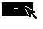

# 5 GenTrigger
The GenTrigger object allows a user to initiate an action. In most graphical 
user interfaces, a GenTrigger is represented by a button; clicking on the 
button initiates the action. This action sends a pre-specified message to a 
pre-specified object or process in the trigger's instance data. You may also 
customize a GenTrigger to pass data along with the message.

You should be familiar with the function of generic objects in general before 
you begin reading this chapter. This can be accomplished by a cursory review 
of "GenClass," Chapter 2. You should at least read "First Steps: Hello World," 
Chapter 4 of the Concepts Book.

## 5.1 GenTrigger Overview

Whenever you need to allow the user to initiate a single action, you should 
probably use a GenTrigger. When activated, a GenTrigger simply sends a 
message to another object or process. Both the message and its destination 
can be set up in the GenTrigger's instance data. The trigger can also send 
data with the message. This is useful if several triggers send the same 
message (for example MSG_CHOOSE_COLOR) but send different data (for 
example "Blue," "Red," or "Green"). 

 

**Figure 5-1** *Example GenTriggers*  
*A trigger's visual moniker can be either text or a graphics string.*

In some cases, the use of triggers is readily apparent (the "OK" button in a 
dialog box, for example, which will dismiss the dialog box) while at other 
times the use of triggers is not as obvious (as menu items, for example). The 
GenTrigger is a simple and widely used object, appearing in menus, dialog 
boxes, and primary windows-wherever you need a UI object whose sole 
action is to send out a message, a GenTrigger will probably suffice.

Several GenTriggers are shown in Figure 5-1. Because of the trigger's basic 
role, they cannot have children. Note that this does not mean that activating 
a trigger may not necessarily bring up an object indirectly (such as a dialog 
box), but only that an object may not be directly attached below a GenTrigger 
in a generic object tree.

Your application will choose the function of the trigger but it is left to the 
Specific UI to choose in what manner a trigger will be activated. (For 
example, under OSF/Motif, a GenTrigger may be built as a button and will be 
activated by clicking on the button.) 

**GenTriggerClass** provides two instance fields. These instance fields are 
listed in Code Display 5-1.

----------
**Code Display 5-1 GenTrigger Instance Fields**

	/* GenTrigger inherits all the instance fields of GenClass. */

		@instance optr GTI_destination = 0;
		@instance Message GTI_actionMsg = 0;

	@vardata void HINT_TRIGGER_BRINGS_UP_WINDOW;
	@vardata void ATTR_GEN_TRIGGER_IMMEDIATE_ACTION;
	@vardata void HINT_TRIGGER_DESTRUCTIVE_ACTION;
	@vardata word ATTR_GEN_TRIGGER_ACTION_DATA;
	@vardata word ATTR_GEN_TRIGGER_INTERACTION_COMMAND;
	@vardata Message ATTR_GEN_TRIGGER_CUSTOM_DOUBLE_PRESS;

	/* Alias for messages with "void (word a, word b)" */
	typedef struct { word a, b; } TwoWordArgs;
	@vardataAlias (ATTR_GEN_TRIGGER_ACTION_DATA)
				TwoWordArgs ATTR_GEN_TRIGGER_ACTION_TWO_WORDS;

	/* Alias for messages with "void (word a, word b, word c)" */
	typedef struct { word a, b, c; } ThreeWordArgs;
	@vardataAlias (ATTR_GEN_TRIGGER_ACTION_DATA)
				ThreeWordArgs ATTR_GEN_TRIGGER_ACTION_THREE_WORDS;

	/* Alias for messages with "void (optr output, word a)" */
	typedef struct { optr output; word a; } OptrWordArgs;
	@vardataAlias (ATTR_GEN_TRIGGER_ACTION_DATA)
				OptrWordArgs ATTR_GEN_TRIGGER_ACTION_OPTR_AND_WORD;

----------
The *GTI_actionMsg* instance field sets the message for the trigger to send out 
upon activation. The activation itself is determined by the specific UI. The 
trigger will send this message to the output specified in the *GTI_destination* 
instance field.

The *GTI_destination* instance field sets the object or process for the trigger to 
send its message to upon activation. The trigger will send the message in the 
*GTI_actionMsg* field to this optr. Often this will be a **TravelOption** or a 
**GenTravelOption**.

**Figure 5-2** *GenTriggers as Menu Items*.  
*GenTriggers may become menu items within a GIV_POPUP GenInteraction.* 

## 5.2 GenTrigger Usage

A simple GenTrigger should contain a message to send out upon activation, 
a destination to send the message to, and a visual moniker to distinguish the 
trigger from other objects (and describe its function to the user).

You may use the prototype GEN_TRIGGER_ACTION to define the action 
message. This prototype passes the optr of the sending trigger in the variable 
name `trigger' and can be accessed within a message handler.

GenTriggers may appear within GenPrimarys, GenViews, or, most often, 
within a GenInteraction. If a GenTrigger is placed as a child of a GIV_POPUP 
GenInteraction, the GenTriggers may be represented as menu items. (See 
Figure 5-2).

----------
**Code Display 5-2 Code for Basic GenTriggers**

	/* Use the prototype GEN_TRIGGER_ACTION to define a GenTrigger's action message. 
	 * Within a method, you can retrieve this optr with the variable name `trigger.' */

	@message (GEN_TRIGGER_ACTION) MSG_HELLO_CHANGE_TO_BLUE();
	@message (GEN_TRIGGER_ACTION) MSG_HELLO_CHANGE_TO_GOLD();

	/* The GenInteraction object will contain the child GenTriggers. */

	@object GenInteractionClass HelloColorBox = {
		GI_comp = @HelloBlueTrigger, @HelloGoldTrigger;
		GI_visMoniker = 'C', "Color";
		GII_visibility = GIV_DIALOG;
	}

	/* GenTriggers
	 * Buttons are implemented by GenTriggerClass. When the trigger is pushed by
	 * the user (clicked on with the mouse), it will send the specified message
	 * to the specified destination object. In both cases below, the trigger will
	 * send an application-defined message to the application's Process
	 * object. A trigger's moniker is displayed within the trigger. In this
	 * case both are text, but any graphics string could also be used to create
	 * graphical triggers. */

	@object GenTriggerClass HelloBlueTrigger = {
		GI_visMoniker = 'B', "Blue";
		/* Send MSG_HELLO_CHANGE_TO_BLUE to the Process object. */
		GTI_destination = process;
		GTI_actionMsg = MSG_HELLO_CHANGE_TO_BLUE;
	}

	@object GenTriggerClass HelloGoldTrigger = {
		GI_visMoniker = 'G', "Gold";
		/* Send MSG_HELLO_CHANGE_TO_GOLD to the Process object. */
		GTI_destination = process;
		GTI_actionMsg = MSG_HELLO_CHANGE_TO_GOLD;
	}

----------
## 5.3 Supplemental GenTrigger Usage

GenTriggers may also perform other actions besides the simple sending of a 
message to an object.

 For example, your trigger may pass data along with its message; you may 
then use this data within a method to perform some additional work. In some 
cases, this data may be interpreted by a GenInteraction object to provide 
additional functionality to dialog boxes.

You may also alter the manner in which a trigger is initiated through the 
implementation of hints and several messages. You can also modify the 
trigger's instance data dynamically, reassigning its action message and 
destination.

### 5.3.1 Passing Data with a GenTrigger

	ATTR_GEN_TRIGGER_ACTION_DATA, 
	ATTR_GEN_TRIGGER_ACTION_TWO_WORDS, 
	ATTR_GEN_TRIGGER_ACTION_THREE_WORDS, 
	ATTR_GEN_TRIGGER_ACTION_OPTR_AND_WORD

A GenTrigger may pass data along with its message. Use 
ATTR_GEN_TRIGGER_ACTION_DATA to assign a word of data that you wish 
to pass with the particular message. If you need to pass more than a single 
word of data, you will have to use @vardataAlias; this Goc keyword allows 
ATTR_GEN_TRIGGER_ACTION_DATA to pass a structure instead of a single 
word.

Several ATTR_GEN_TRIGGER_ACTION_DATA aliases already exist for your 
use. ATTR_GEN_TRIGGER_ACTION_TWO_WORDS and 
ATTR_GEN_TRIGGER_ACTION_THREE_WORDS allow you to pass two or 
three words of data along with the trigger's message. 
ATTR_GEN_TRIGGER_ACTION_OPTR_AND_WORD allows you to pass an optr 
and a word of data along with the trigger's message.

If you need to pass more than three words of data with a message, you will 
need to use the stack to pass arguments. To do so, use the @**stack** parameter 
within your message definition; because of the implementation of the stack, 
make sure to set up your structure to pass its arguments *in reverse order*.

----------
**Code Display 5-3 Passing Data from a GenTrigger**

	/* In a class declaration, you should define a message that passes data. */

	@class MyProcessClass, GenProcessClass;
	@message void MSG_SET_MY_DATA(int myData);
	@endc;

	@object GenTriggerClass MyHundredTrigger = {
		/* This trigger will pass 100 to the method for MSG_SET_MY_DATA. */
		GI_visMoniker = "Set My Data to 100";
		GTI_actionMsg = MSG_SET_MY_DATA;
		GTI_destination = process;
		ATTR_GEN_TRIGGER_ACTION_DATA = 100;		/* This object's data is 100. */
	}

	@object GenTriggerClass MyTenTrigger = {
		/* This trigger will pass `10' to the method for MSG_SET_MY_DATA.*/
	GI_visMoniker = "Set My Data to 10";
	GTI_actionMsg = MSG_SET_MY_DATA;
	GTI_destination = process;
	ATTR_GEN_TRIGGER_ACTION_DATA = 10;		/* This object's data is 10. */
	}

	@method MyProcessClass, MSG_SET_MY_DATA {
		/* This message passes one parameter (the integer myData). Goc knows
		 * that the data is located within the ATTR_GEN_TRIGGER_ACTION_DATA
		 * field. */
		UpdateDisplay(myData);		/* Use that data for your own purposes. */
	}

	/* The following examples show how to pass longer structures than the above. */

	/* Define the message. */
	@message void MSG_CUSTOM_MESSAGE(@stack char name[10], optr arg1, int arg2);
	/* Define the structure you wish to pass with the message. If the
	 * message will pass parameters on the stack (as in this case), you
	 * must define your structure to pass its elements in reverse order. */
	typedef struct { 
		int			MS_arg2;
		optr		MS_arg1;
		char		MS_name[10]
	} MyStruct;

	/* Use @vardataAlias to define your own attribute (ATTR_MY_STRUCT_TO_PASS)
	 * to store the custom structure. */
	@vardataAlias (ATTR_GEN_TRIGGER_ACTION_DATA) MyStruct ATTR_MY_STRUCT_TO_PASS;

	/* Declare your object and set the arguments to pass. */
	@object GenTriggerClass MyTrigger = {
		GI_visMoniker = "Custom Trigger";
		GTI_actionMsg = MSG_CUSTOM_MESSAGE;
		GTI_destination = process;
		ATTR_MY_STRUCT_TO_PASS = { 100, @ListObject, "Zow!" }
	}

----------
### 5.3.2 Interaction Commands

	ATTR_GEN_TRIGGER_INTERACTION_COMMAND

A GenTrigger may perform special actions within a GenInteraction object. 
The ATTR_GEN_TRIGGER_INTERACTION_COMMAND attribute sets the 
special activity for these types of triggers. This attribute indicates that the 
GenTrigger is an Interaction command trigger for the parent GenInteraction 
object. ATTR_GEN_TRIGGER_INTERACTION_COMMAND takes a word of data 
(of type **InteractionCommand**) specifying the command type of the trigger. 
A trigger with an **InteractionCommand** can perform one of several 
standard actions. Most of these actions are specific to dialog boxes.

The **InteractionCommand** types are

IC_NULL  
This command is special, alerting an application that the 
interaction containing the trigger has been closed because the 
system is about to shut down. You should never set any triggers 
to this InteractionCommand. 

IC_DISMISS  
This command instructs the UI to dismiss the parent 
GenInteraction. Set this if you want the trigger to dismiss an 
Interaction or provide a custom "Close" trigger.

IC_INTERACTION_COMPLETE  
This command is special, indicating to the UI that a single 
interaction has been completed (the user has clicked on an 
**InteractionCommand** trigger marked with 
GA_SIGNAL_INTERACTION_COMPLETE). You should never set 
any triggers to this **InteractionCommand**. If you wish a 
trigger to exhibit this behavior, set its *GI_attrs* field to include 
GA_SIGNAL_INTERACTION_COMPLETE. (See section 2.2.1 of 
chapter 2.)

IC_APPLY  
This command instructs the UI to apply any properties within 
a GIT_PROPERTIES Interaction. By default, this trigger will 
send out a MSG_GEN_APPLY.

IC_RESET  
This command instructs the UI that this is a "reset" trigger for 
a properties Interaction; the application is responsible for 
actual reset behavior. You should provide a method to handle 
the message sent out by this trigger, set up the state of items to 
reset, and call MSG_GEN_RESET within that handler.

IC_OK  
This command instructs the UI that the user has 
acknowledged a GIT_NOTIFICATION and should take any 
appropriate measures.

IC_YES  
This command instructs the UI that the user has signalled a 
positive response from a GIT_AFFIRMATION Interaction. 

IC_NO  
This command instructs the UI that the user has signalled a 
negative response from a GIT_AFFIRMATION Interaction.

IC_STOP  
This command instructs the UI to halt a GIT_PROGRESS 
Interaction; (the application is responsible for halting any 
ongoing operations related to that Interaction).

IC_EXIT  
This command is special, causing the trigger to exit the 
application. Typically, the File menu already has a trigger set 
to this command. 

IC_HELP  
This command indicates that this GenTrigger brings up help, 
searching for the proper help context 
(ATTR_GEN_HELP_CONTEXT) and bringing up the help dialog 
box with that context. Any contexts below the trigger's 
containing dialog are ignored, however; i.e. the lowest possible 
context is the that on the dialog box itself. For more 
information on Help, see "Help Object Library," Chapter 15 of 
the Concepts Book.

In most cases, you should not provide a visual moniker for any triggers with 
an **InteractionCommand**; the specific UI will select an appropriate 
moniker. (You may supply a moniker if you wish to override the specific UI's 
selection, however.) 

Activating an ATTR_GEN_TRIGGER_INTERACTION_COMMAND trigger will 
cause the UI to send MSG_GEN_GUP_INTERACTION_COMMAND to the 
trigger itself. This message will travel up to the appropriate GenInteraction 
object, where it will be handled. 

This activity only occurs if both the trigger's destination and its action 
message fields are null, however. If these fields are non-null (specifying your 
own action message and destination), the sending of the 
**InteractionCommand** will be overridden. You may want to do this to 
replace the default functionality of a Specific UI-supplied trigger. For 
complete usage of an InteractionCommand trigger within a 
GenInteraction object, see "GenInteraction," Chapter 7.

### 5.3.3 Interpreting Double Clicks

	ATTR_GEN_TRIGGER_CUSTOM_DOUBLE_PRESS

Your trigger sends out the message in the *GTI_actionMsg* field and data in the 
ATTR_GEN_TRIGGER_ACTION_DATA field whenever the user clicks on the 
trigger, whether that click is a single or a double-click. If you wish your 
trigger to send out an alternate message if the user double-clicks, use 
ATTR_GEN_TRIGGER_CUSTOM_DOUBLE_PRESS. 

If you set a message for this attribute, the trigger may send out two different 
messages: one for a single click action and another for a double-click action.

----------
**Code Display 5-4 A Trigger with a Double-Click Message**

@object GenTriggerClass DoubleClickTrigger = {

	/* If the user single-clicks on this trigger, MSG_MY_ACTION will be sent along
	 * with data1 to the process. If the user double-clicks,
	 * MSG_MY_DOUBLE_PRESS_ACTION will be sent instead. */

		GTI_actionMsg = MSG_MY_ACTION;
		GTI_destination = process;
		GI_visMoniker = "Single or Double Click!";
		ATTR_GEN_TRIGGER_ACTION_DATA = data1;
		ATTR_GEN_CUSTOM_DOUBLE_PRESS = MSG_MY_DOUBLE_PRESS_ACTION;
	}

----------

### 5.3.4 Initiating an Action

	MSG_GEN_TRIGGER_SEND_ACTION, MSG_GEN_ACTIVATE 

In almost all cases, the specific UI initiates the action of the GenTrigger. Once 
the specific UI determines that a trigger is activated, it will send a 
MSG_GEN_TRIGGER_SEND_ACTION to the object, which will in turn send the 
message in *GTI_actionMsg* to the object in *GTI_destination*. In some rare 
cases, however, you may wish to manually "trigger" the GenTrigger yourself. 
This can be done by sending the object the 
MSG_GEN_TRIGGER_SEND_ACTION yourself. 

Note that this message, in effect, skips the specific UI and thus any specific 
functionality defined for activating a trigger will be ignored. In OSF/Motif, for 
example, a trigger may "blink" (display itself in reverse video) when 
activated. To perform the default specific UI behavior, send the object a 
MSG_GEN_ACTIVATE instead, which will perform the default activation for 
an object and then call MSG_GEN_TRIGGER_SEND_ACTION. 

  

**Figure 5-3** *Default GenTrigger activation.*  
*A GenTrigger in OSF/Motif might "blink" when activated.*

----------
#### MSG_GEN_TRIGGER_SEND_ACTION

	void	MSG_GEN_TRIGGER_SEND_ACTION(
			Boolean doublePressFlag);

This message causes a GenTrigger to send its action message specified in 
*GTI_actionMsg* to the output specified in *GTI_destination* if the object is 
GS_USABLE. This message is sent automatically by the UI as part of the 
default behavior when a GenTrigger is activated by the specific UI. If you 
wish to simulate a double-click, sending the message included in an object's 
ATTR_GEN_TRIGGER_CUSTOM_DOUBLE_PRESS, pass this message with a 
value of true. Double-press messages may not pass any data in a trigger's 
ATTR_GEN_TRIGGER_ACTION_DATA.

Slightly more useful is the **GenClass** message MSG_GEN_ACTIVATE, 
which activates the trigger at the specific UI's level, performing any default 
activation behavior (such as making the trigger blink to show that it is 
being activated).

**Source:** Unrestricted. Usually the specific UI.

**Destination:** Any usable GenTrigger object

**Parameters:**  
*doublePressFlag* - Pass *true* to use the message stored in 
ATTR_GEN_TRIGGER_CUSTOM_DOUBLE_PRESS 
rather than message in GTI_actionMsg.

**Return:** Nothing.

**Interception:** Generally not intercepted.

**See Also:** MSG_GEN_ACTIVATE 

### 5.3.5 Setting a Trigger As the Default

	MSG_GEN_TRIGGER_MAKE_DEFAULT_ACTION

Often, a dialog box or other windowed generic object will have several 
triggers. You will likely want one of these triggers to be the default 
action-the default action is activated when the user double-clicks on some 
item in the dialog or when the user hits Return, typically. (Specific UIs can 
determine how the activation occurs.)

To set a trigger the default, use HINT_DEFAULT_DEFAULT_ACTION; this only 
works for the first time the trigger is created, though. To set a trigger to be 
the default action item dynamically, use the message 
MSG_GEN_TRIGGER_MAKE_DEFAULT_ACTION.

----------
#### MSG_GEN_TRIGGER_MAKE_DEFAULT_ACTION

	void	MSG_GEN_TRIGGER_MAKE_DEFAULT_ACTION();

This message sets the trigger to be the default action in its windowed parent. 
It is the message equivalent of HINT_DEFAULT_DEFAULT_ACTION, defined 
in **GenClass**.

**Source:** Unrestricted.

**Destination:** Any GenTrigger object.

**Interception:** Generally not intercepted.

### 5.3.6 Manipulating Instance Data

	MSG_GEN_TRIGGER_GET_ACTION_MSG, 
	MSG_GEN_TRIGGER_SET_ACTION_MSG, 
	MSG_GEN_TRIGGER_GET_DESTINATION, 
	MSG_GEN_TRIGGER_SET_DESTINATION 

A GenTrigger's instance data need not be static. The instance data can be 
altered dynamically using the following messages of **GenTriggerClass**.

----------
#### MSG_GEN_TRIGGER_GET_ACTION_MSG

	Message MSG_GEN_TRIGGER_GET_ACTION_MSG();

This message retrieves the *GTI_actionMsg* instance data of the trigger.

**Source:** Unrestricted.

**Destination:** Any GenTrigger object.

**Parameters:** None.

**Return:** Message in *GTI_actionMsg*.

**Interception:** Generally not intercepted.

----------
#### MSG_GEN_TRIGGER_SET_ACTION_MSG

	void	MSG_GEN_TRIGGER_SET_ACTION_MSG(
			Message message);

This message sets the *GTI_actionMsg* instance field of a GenTrigger to the 
message passed.

**Source:** Unrestricted.

**Destination:** Any GenTrigger object.

**Parameters:**  
*message* - Message to assign GTI_actionMsg to.

**Return:** Nothing.

**Interception:** Generally not intercepted.

----------
#### MSG_GEN_TRIGGER_GET_DESTINATION

	optr	MSG_GEN_TRIGGER_GET_DESTINATION();

This message returns the *GTI_destination* instance data field of the 
GenTrigger. 

**Source:** Unrestricted.

**Destination:** Any GenTrigger object.

**Parameters:** The optr of destination object (in *GTI_destination*).

**Return:** Nothing.

**Interception:** Generally not intercepted.

----------
#### MSG_GEN_TRIGGER_SET_DESTINATION

	void	MSG_GEN_TRIGGER_SET_DESTINATION(
			optr dest);

This message sets the *GTI_destination* instance field of the GenTrigger to 
the optr passed.

**Source:** Unrestricted.

**Destination:** Any GenTrigger object.

**Parameters:**  
*dest* - The optr of the new destination.

**Return:** Nothing.

**Interception:** Generally not intercepted.

### 5.3.7 Other Hints

	HINT_TRIGGER_BRINGS_UP_WINDOW, 
	ATTR_GEN_TRIGGER_IMMEDIATE_ACTION, 
	HINT_TRIGGER_DESTRUCTIVE_ACTION 

Besides the hints discussed in earlier sections and the hints inherited from 
**GenClass**, **GenTriggerClass** provides two others, as well as one additional 
attribute:

+ HINT_TRIGGER_BRINGS_UP_WINDOW  
Use this hint if your trigger action indirectly brings up a window (such 
as a GIV_DIALOG GenInteraction or some other interaction window). 
This hint, depending on the specific UI, may be used to display the button 
with an ellipsis "..." to symbolize that the trigger leads to some other 
interaction.

+ ATTR_GEN_TRIGGER_IMMEDIATE_ACTION  
Use this attribute if your trigger is in a menu (GIV_POPUP interaction) 
and its action should take place immediately before other pending UI 
events. This will prevent default UI events from occurring before the 
trigger's action. For example, this attribute is used for the tack trigger in 
the menu box, to prevent the menu from being closed before it is tacked. 

+ HINT_TRIGGER_DESTRUCTIVE_ACTION  
Use this hint if your action may be potentially destructive. This hint 
prevents the trigger from being recognized as the default trigger. 

For more information on other hints not specific to GenTriggers see 
"Managing UI Geometry," Chapter 12 of the Concepts Book and hints defined 
under **GenClass**.

## 5.4 Customizations

You may customize a GenTrigger using all the basic GenClass attributes as 
shown in "GenClass," Chapter 2. Of special significance are the ways in 
which you can tailor a moniker to print a graphics string on a button, as in a 
DOS room icon. The moniker should have as its argument a GString. (See 
"Graphics Environment," Chapter 23 of the Concepts Book).

----------
**Code Display 5-5 Code for a "Graphic Button" GenTrigger**

	@start TriggerGraphicsMonikerResource, notDetachable;

	@visMoniker TriggerGraphicsMoniker = {
		size = standard;
		color = color4;
		aspectRatio = normal;
		cachedSize = 95, 70;
		gstring {
			GSBeginString
			GSDrawBitmapAtCP <(EndTriggerGraphicsIcon-
						StartTriggerGraphicsIcon)>
			StartTriggerGraphicsIcon label byte
			<...Bitmap here...>
			EndTriggerGraphicsIcon label byte
			GSEndString
		}
	}

	@end	TriggerGraphicsMonikerResource;

	@object GenTriggerClass GraphicTrigger = {
		GI_visMoniker = list
			{
			TriggerGraphicsMoniker
			}
		GTI_actionMsg = MSG_CUSTOM_MESSAGE;
		GTI_destination = process;
		ATTR_GEN_TRIGGER_ACTION_DATA = {DataToPass};
	}

----------

[GenDisplay](ogendis.md) <-- [Table of Contents](../objects.md) &nbsp;&nbsp; --> [GenGlyph](ogengly.md)