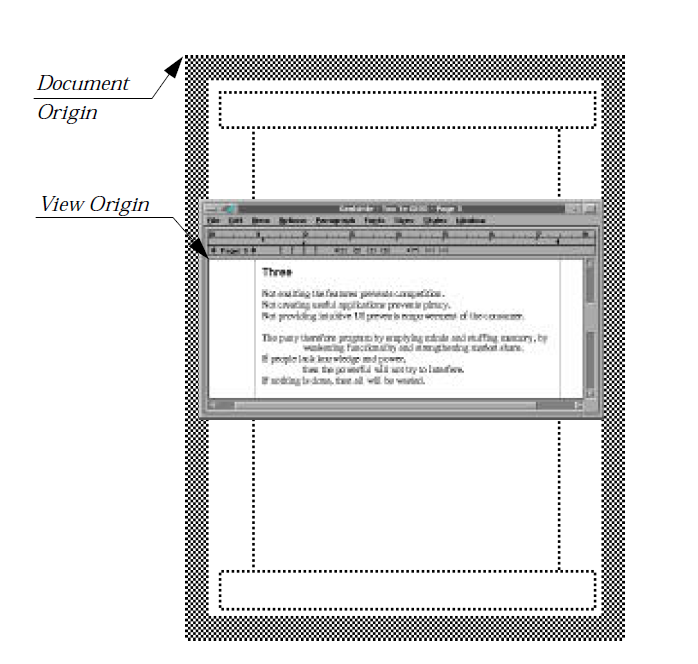
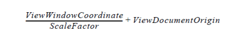

# 9 GenView
The GenView provides a means of displaying data on the screen in a 
scrollable, sizeable, scalable window. This data may be in the form of a 
graphics document, a generic object tree, or a visible object tree. If your geode 
requires a means of displaying data visually, you will most likely want to use 
a view.

This chapter discusses how to create and use the GenView. You should have 
a good knowledge of the UI in general, and you should understand the GEOS 
coordinate system.

## 9.1 GenView Overview
The primary goal of the GenView is to display data on the screen. It provides 
a window into which applications may draw any type of document from a 
generic object tree to a visible object tree to graphics strings defined by 
graphics routines. Nearly all document-oriented applications will use a view 
in some capacity.

### 9.1.1 GenView Model
The GenView is simply an object that maintains a window for your geode's 
use. It must be instructed in how to display your data, although it defaults to 
a certain display scheme. It receives and sends out messages that define how 
and when your data is drawn; you must provide an object that can receive the 
view's messages and respond correctly.

The object that communicates with the view on the application's side is 
known as the *content* object. The content may be one of three different classes 
(see below) depending on the type of data you wish to display. Essentially, 
what type of object you designate as your content is irrelevant to the view; 
the view sends and receives the same messages regardless.

There are three basic models you may employ based on the type of data you 
have to display:

+ Graphic document  
If you are just displaying standard graphics, you will want the content to 
be an object of **ProcessClass**. This means that your application's Process 
object will receive all the messages sent by the view (including 
MSG_META_EXPOSED, described later) and must know how to draw the 
graphics document when notified. This model is common.

+ Visible object tree  
If you have a tree of visible objects, you will want to set the view's content 
as an object of **VisContentClass**. This object understands how to 
respond to several of the view's messages and how to draw a visible tree 
when notified. This approach is also common.

+ Generic object tree  
Though seldom used, it is possible to display generic gadgets in a 
scrolling view by setting the view's content to be a GenContent object. 
The GenContent is analogous to the VisContent but works with generic 
object trees rather than visible object trees. The GenContent is used most 
often as the superclass of **GenDocumentClass** (see "GenDocument," 
Chapter 13).

As described in "Graphics Environment," Chapter 23 of the Concepts Book, 
GEOS uses two different coordinate systems, both of which are based on 
points (1/72 inch). The default system uses 16-bit coordinates and allows 
documents up to 113 inches on a side. The large model uses 32-bit 
coordinates, resulting in documents up to 2,147,483,648 points on a side, or 
940 miles square. The GenView uses the large model (32-bit coordinates) by 
default. This means that all coordinates related to the view will be 32 bits, 
though you can still use 16 bit coordinates for your documents.

Because the graphic document model described above is the simplest, this 
chapter will focus on having a **ProcessClass** object as your view's content.

### 9.1.2 View Features and Goals

The GenView is a powerful and flexible object that does most of your display 
work for you. It is designed to provide not only the functionality required by 
nearly all applications but also many additional features that more advanced 
applications will use. The following goals helped shape the GenView:

+ Common functionality  
The view, like all of GEOS, is designed with common application 
functionality in mind. Those functions common to many applications are 
integrated as much as possible to relieve programmers of having to code 
and debug the same features again and again.

+ Consistency of use  
The view, like every generic UI object, allows all GEOS applications to 
behave and look consistent. Users find this important when using several 
different applications.

+ Ease of use  
The view, in its simplest form, is almost trivial to implement. 
Applications can gain a scrolling window by adding very little code (as 
evidenced in the Hello World program).

+ Expandability  
Using the view's more advanced features requires little more than 
incremental changes to an application; you can easily and quickly add 
scaling to or change the background color of your view.

To meet these goals, the view provides several advanced features and makes 
them easy to use for all applications. All the following features are available 
to applications with limited effort, and most are expandable to be very 
powerful.

+ Drawing to the view  
Drawing to the view is simple, as simple as calling the proper graphics 
routines to draw to a GState. The view will send a MSG_META_EXPOSED 
to its content object whenever the document must be drawn (for example, 
when the view scrolls or when a window has uncovered a portion of the 
view); the content then simply must draw it. The view will handle all 
necessary clipping, placement, scaling, and translation for the video 
driver. See section 9.4.2 below.

+ Scrolling  
You can set up your view to be scrollable and all scrolling to be automatic. 
You can also cause the view to scroll or even change how the view scrolls. 
See section 9.4.7 below.

+ Scaling  
Every view has a scale factor that determines the scale at which the 
document is drawn. You may leave this at the default (the normal size), 
or you may dynamically change it. The view simply asks the content 
object to redraw its document, and the view will handle all the scaling 
geometry. See section 9.4.5 below.

+ Sizing  
Because most Views are resizable, you can easily alter the sizing 
behavior of your view. You may also set it to have a certain minimum, 
maximum, or fixed size. See section 9.4.4 below.

+ Setting the Background Color  
Depending on the view's purpose, you may wish it to be either the same 
color as its GenPrimary parent or a different color. The View in Hello 
World, for example, is white; it could easily be any other color. See section 
9.3.3 below.

+ Handling Input  
Unless your view is display-only, your content will be able to handle 
either pointer or keyboard events passed through it. You can specify the 
level of input you want and easily get mouse or typed character events. 
In addition, the Ink standard for pen input is also supported.

+ Setting the Content Size and Origin  
Every content object has a size associated with it. The size defines where 
the content sits in the coordinate space and what part of the coordinate 
space the view has access to for scrolling. Every view also has an origin 
describing which part of the content is currently visible. See section 9.4.2 
below.

+ Changing the Content
Although most Process objects will hang on to their Views, it is possible 
to change the view's content object. This is most likely used by 
applications that use the VisContent rather than the Process object as 
their content. See section 9.4.10 below.

+ Defining Children of the view  
Every view may have UI objects designated as its children. These objects 
may appear at any edge of the view. By defining special scroller objects 
as children of the view, you can alter their placement; for example, you 
could have the vertical scroller always appear on the left rather than 
whatever is the default (typically the right). See section 9.4.6 below.

### 9.1.3 The GenViewControl Object
The GenView, like many objects in the UI, has its own UI controller object to 
further simplify its use. Though you can implement anything in the 
controller on your own, it's much easier simply to include a GenViewControl 
object and let it control the View features for you.

**GenViewControlClass** is described after the GenView; you must 
understand the GenView before you can take full advantage of the controller. 
See section 9.5 below for complete details.

## 9.2 Getting Started: View Basics
As stated earlier, this chapter will demonstrate how an application would 
display a graphic document in a scrollable window. You can look at the Hello 
World and VisSamp sample applications for examples of the view's features 
and how to manipulate them. The entire code listing of the Hello World 
application is located in "First Steps: Hello World," Chapter 4 of the Concepts 
Book.

This section is meant to show you the basic requirements for implementation 
of a view. It begins with a review of the concepts employed by the GEOS 
graphics system and then describes how to define a GenView in your Goc 
code. It also shows how to handle important messages sent by the view.

### 9.2.1 Graphics System Review

The GEOS graphics system is explained in full in "Graphics Environment," 
Chapter 23 of the Concepts Book. Some of it is reviewed here, although you 
should read the graphics discussions to fully understand how to draw a 
graphic document.

The GEOS default document space is represented by signed, 16-bit 
coordinates relative to a central origin. Coordinates are in 72 points per inch, 
and documents that use this space can be up to 8192 points, or 113.8 inches, 
on a side. If your document must be larger than this, you may make use of 
the "large document" model, which uses 32-bit signed coordinates. Large 
documents can be over 940 miles on a side.

Every document is drawn to a GState which keeps track of such current state 
as pen position, color, rotation, and scale. You may apply transformations on 
the GState to get different rotation and placement within the document 
space.

To display a graphic document in a view, you must set up the view to have 
your Process object as its content. This means that your Process object must 
be able to draw the document, handle messages received from the view, and 
control the view's behavior as required. The Process object must also know 
how to support the UI mechanisms with which the view's content object 
might want to interact (such as the quick-transfer mechanism).

The view defaults to using the large coordinate space for all its operations, 
though this does not mean only large documents can be displayed in the view. 
Large documents are represented in a signed, 32-bit (long integer) document 
coordinate space. This means large documents may be up to 2,147,483,648 
points high by 2,147,483,648 points wide (941.5 miles on a side). Because 
the graphics system is optimized for 16-bit operations, there are special 
considerations you must take into account when using a view to display large 
documents.

There are two basic ways to deal with 32-bit coordinates in a 16-bit graphics 
system. Both involve performing an extended translation on the GState in 
order to draw in a "local" 16-bit graphics space. The extended translation is 
performed with **GrApplyTranslationDWord()**, which takes two 32-bit 
coordinates and translates the GState's origin to those coordinates. Any 
16-bit drawing operations are then automatically done relative to the new 
origin. All translations are cumulative.

One of the two ways to handle large documents is to apply the extended 
translation before each drawing operation and untranslate after each 
operation. This obviously incurs quite a bit of additional overhead.

The other way of handling large documents is to "tile" them, just as the 
Spooler does when printing large documents on small paper. In this case, you 
would apply the extended translation once, from then on drawing in 16-bit 
coordinates relative to the local origin. When you wanted to move to another 
tile, you would apply another extended translation to the new tile. The 
drawback to this is that your drawing code has to recognize when the 16-bit 
local boundaries are being crossed and a transformation is necessary.

### 9.2.2 Defining the Basic View

To use a view to display a document, you should define it in your application's 
Goc code. The view can legally be a child of GenPrimary, GenDisplay, or 
GenInteraction. In simple applications, the view will be a child of the 
application's GenPrimary object. More complex applications will have 
multiple displays with a view in one or more GenDisplay objects.

The most basic view is resizable and has a white background. You may draw 
any size document in this view, and it will be clipped properly by the 
windowing system. At its most basic, the view is not scrollable; however, by 
setting two attributes as shown in Code Display 9-1, the view becomes 
scrollable in both dimensions.

The most common view is resizable and scrollable with a white background. 
It generally has boundaries on its scrollable area, called document bounds. 
Code Display 9-1 shows this type of view.

Notice that the Goc code for the view is simple; much of the power of the view 
as a display tool rests in its dynamic flexibility. Once the basic view is defined, 
you can change its scale, color, scrolling behavior, and document bounds 
simply by sending messages to it. This dynamic flexibility is also exploited 
extensively by the GenViewControl.

----------
**Code Display 9-1 The Basic GenView**

	/*
	 * The GenView object creates a window in which the application may draw all or
	 * portions of its document. Whenever a portion of this window becomes "invalid"
	 * (when the window is resized or moved, for example), the view will send
	 * MSG_META_EXPOSED to its content (in this case the application's Process object)
	 * indicating that a redraw is required. The view keeps track of the clipping
	 * boundaries and will automatically display the document properly.
	 */

	/*
	 * The view defined here provides a window with the default white background and
	 * normal scrolling and sizing behavior. Its document boundaries are set to 11
	 * by 17 inches (the default has all bounds set to zero). The view provides
	 * scrollbars automatically, and the application does not need to understand how
	 * scrolling is implemented; instead, the view will simply request a redraw of the
	 * entire document.
	 */

	@object GenViewClass MyView = {

		/*
		 * The document bounds are set to build an 11 x 17 inch document. Document
		 * coordinates are in 1/72 inch (points), and document bounds must also be
		 * specified in points. The upper-left corner of the document is placed at
		 * (0,0), and the coordinates increase down and right to the far corner
		 * (792, 1224).
		 */

		GVI_docBounds = {
			0,			/* left bound */
			0,			/* top bound */
			792,		/* right bound */
			1224};		/* bottom bound */

		/*
		 * The GVI_horizAttrs and GVI_vertAttrs fields determine the view's
		 * scrolling, linking, and sizing behavior in the appropriate dimension.
		 * Setting the scrollable attribute in both these fields will make the view
		 * create and maintain scrollers (in OSF/Motif, these will appear as
		 * scrollbars). All scrolling will happen automatically.
		 * These lines are necessary if scrolling is desired.
		 */
		GVI_horizAttrs = @default | GVDA_SCROLLABLE;
		GVI_vertAttrs = @default | GVDA_SCROLLABLE;

		/* Lastly, we must designate which object (our Process 	object in this case)
		 * will receive and handle the message to draw the 	displayed data
		 * (MSG_META_EXPOSED). This object is called the content object and may
		 * be the Process, a GenContent, or a VisContent.
		 * Note that no message is defined here as with most action descriptors;
		 * the view will send only MSG_META_EXPOSED. You must set this attribute no
		 * matter what object is designated as the content; when using a
		 * GenContent or a VisContent, the object's name should appear in
		 * place of process.
		 */
		GVI_content = process;
	}

----------

### 9.2.3 Handling View Messages

After defining the GenView, you must create the method that will handle 
MSG_META_EXPOSED sent by the view in order to draw in the view's window. 
This is absolutely necessary, even if your view is not scrollable; the view will 
send MSG_META_EXPOSED when any part of its display window becomes 
invalid - this includes when the view is first instantiated and its window is 
first displayed.

In this simple model, MSG_META_EXPOSED is the only message your 
application will need to handle relating to the view. If you are managing large 
documents, then you may also have to handle a few others pertaining 
primarily to input. A sample handler for MSG_META_EXPOSED-one you can 
modify and put in your own code-is shown in Code Display 9-2.

If you are planning on displaying visible objects in the view (as opposed to 
having your Process object draw graphics), you should instead pay attention 
to MSG_VIS_DRAW. This message is defined by VisClass and is sent by a 
VisContent object to itself as the default behavior for MSG_META_EXPOSED. 
For full information on MSG_VIS_DRAW and visible objects, see "Drawing to 
the Screen" in "VisClass," Chapter 23.

----------
**Code Display 9-2 MSG_META_EXPOSED Handler**

	/* Each time some part of the view window becomes invalid, the view will send a
	 * MSG_META_EXPOSED to its content object. When MSG_META_EXPOSED is received,
	 * the content must draw the document to a newly-created GState, then pass the
	 * GState to the windowing system for drawing to the screen. */

	/* The format of this message is
	 * 	void MSG_META_EXPOSED(WindowHandle win);
	 * The passed value is the window handle of the view window; it will be used in
	 * conjunction with the temporary GState for drawing. */

	@method	MyProcessClass, MSG_META_EXPOSED {
		/* Set up a temporary GState handle variable for our document. */
		GStateHandle tempGState;

		/* Initialize the GState to the default. */
		tempGState = GrCreateState(win);

		/* Now start a window update. The routine GrBeginUpdate() notifies the window
		 * system that we are in the process of drawing in the region in the window
		 * that was invalidated. GrBeginUpdate() allows drawing to be clipped to only
		 * the region that was invalidated. */

		GrBeginUpdate(tempGState);

		/* Now that we have a GState and have notified the windowing system that we
		 * intend to draw, we can draw our document. Here, your method should call
		 * whatever routines are appropriate for drawing the entire document.
		 * A good hint here relates also to printing: Because printing and drawing to a
		 * view are essentially the same operation, you might want to consolidate all
		 * your drawing into a single routine that is called by both this method and
		 * your printing method. This is what is done here; the routine called
		 * MyDrawingRoutine() draws the document we wish displayed. MyDrawingRoutine()
		 * will also be called by our printing method with a different GState. */

		MyDrawingRoutine(tempGState);

		/* Now that we have finished drawing the document, we must inform the window
		 * system that we are done. Additionally, we must now destroy the temporary
		 * GState we used to draw the document. This is essential as not destroying
		 * gstates causes small locked blocks to remain on the heap, eroding system
		 * performance quickly and eventually making the system run out of handles. */

		GrEndUpdate(tempGState);
		GrDestroyState(tempGState);
	}

----------
### 9.3 Basic View Attributes

The GenView has several instance data fields that it uses to maintain its 
current status. It also has other attribute fields that determine its scrolling, 
scaling, and sizing behavior as well as the manner in which it accepts input 
events. Listed in Code Display 9-3 are all the GenView's instance data fields. 
Each is described later in the chapter. Additionally, each is dynamically 
changeable with the use of messages defined by GenView.

----------
**Code Display 9-3 GenView Instance Data**

	/* Default settings are shown in the definitions. Other possible settings are
	 * shown in a comment after the definition. */

		@instance PointDWFixed			GVI_origin = {{0, 0}, {0,0}};
		@instance RectDWord				GVI_docBounds = {0, 0, 0, 0};
		@instance PointDWord			GVI_increment = {20, 15};
		@instance PointWWFixed			GVI_scaleFactor = {{0, 1}, {0, 1}};
		@instance ColorQuad				GVI_color = {WHITE, 0, 0, 0};
		@instance GenViewAttrs			GVI_attrs = (GVA_FOCUSABLE);
			/* Possible flags for GVI_attrs:
			 *	GVA_CONTROLLED			GVA_GENERIC_CONTENTS
			 *	GVA_TRACK_SCROLLING		GVA_DRAG_SCROLLING
			 *	GVA_NO_WIN_FRAME		GVA_SAME_COLOR_AS_PARENT_WIN
			 *	GVA_VIEW_FOLLOWS_CONTENT_GEOMETRY
			 *	GVA_WINDOW_COORDINATE_MOUSE_EVENTS
			 *	GVA_DONT_SEND_PTR_EVENTS GVA_DONT_SEND_KBD_RELEASES
			 *	GVA_SEND_ALL_KBD_CHARS	GVA_FOCUSABLE
			 *	GVA_SCALE_TO_FIT		GVA_ADJUST_FOR_ASPECT_RATIO */

		@instance GenViewDimensionAttrs		GVI_horizAttrs = 0;
		@instance GenViewDimensionAttrs		GVI_vertAttrs = 0;
			/* Possible flags for the dimension attribute records:
			 *	GVDA_SCROLLABLE			GVDA_SPLITTABLE
			 *	GVDA_TAIL_ORIENTED		GVDA_DONT_DISPLAY_SCROLLBAR
			 *	GVDA_NO_LARGER_THAN_CONTENT
			 *	GVDA_NO_SMALLER_THAN_CONTENT
			 *	GVDA_SIZE_A_MULTIPLE_OF_INCREMENT
			 *	GVDA_KEEP_ASPECT_RATIO			*/

		@instance GenViewInkType		GVI_inkType = GVIT_PRESSES_ARE_NOT_INK;
			/* Possible flags for GVI_inkType:
			 *	GVIT_PRESSES_ARE_NOT_INK	GVIT_INK_WITH_STANDARD_OVERRIDE
			 *	GVIT_PRESSES_ARE_INK		GVIT_QUERY_OUTPUT */

		@instance @optr				GVI_content;
		@instance @optr				GVI_horizLink;
		@instance @optr				GVI_vertLink;

	/* The following are the hints and attributes defined for the GenView's vardata.
	 * Because GenViewClass is a subclass of GenClass, it inherits all other generic
	 * hints as well. */

		@vardata void		HINT_VIEW_LEAVE_ROOM_FOR_VERT_SCROLLER;
		@vardata void		HINT_VIEW_LEAVE_ROOM_FOR_HORIZ_SCROLLER;

		@vardata void		HINT_VIEW_IMMEDIATE_DRAG_UPDATES;
		@vardata void		HINT_VIEW_DELAYED_DRAG_UPDATES;
		@vardata void		HINT_VIEW_REMOVE_SCROLLERS_WHEN_NOT_SCROLLABLE;
		@vardata void		HINT_VIEW_SHOW_SCROLLERS_WHEN_NOT_SCROLLABLE;

		@vardata InkDestinationInfoParams ATTR_GEN_VIEW_INK_DESTINATION_INFO;
			@reloc ATTR_GEN_VIEW_INK_DESTINATION_INFO,
				word_offsetof(InkDestinationInfoParams, IDIP_dest), optr;

		@vardata void ATTR_GEN_VIEW_DOES_NOT_ACCEPT_TEXT_INPUT;

		@vardata XYSize			ATTR_GEN_VIEW_PAGE_SIZE;
		@vardata void			ATTR_GEN_VIEW_SCALE_TO_FIT_BASED_ON_X;
		@vardata void			ATTR_GEN_VIEW_SCALE_TO_FIT_BOTH_DIMENSIONS;
		@vardata void			ATTR_GEN_VIEW_DO_NOT_WIN_SCROLL;

	/* By default, all GenView objects are targetable. */
		@default GI_attrs = @default | GA_TARGETABLE;

----------
The attributes shown in Code Display 9-3 are all dynamically changeable; in 
fact, many (such as the scale factor) become interesting only when set or 
changed as a feature of the application (as in the scaling features of GeoWrite 
and GeoDraw). Each attribute, therefore, is described under its appropriate 
section of this chapter.

### 9.3.1 The GVI_attrs Attribute
	GVI_attrs, MSG_GEN_VIEW_SET_ATTRS, MSG_GEN_VIEW_GET_ATTRS

The *GVI_attrs* field, as shown in Code Display 9-3, controls many aspects of 
the view, including several features related to scrolling, input events, and the 
content object. It is implemented as a bitfield record, and any or all of its 
attributes may be set at once.

Generally, the attributes specified in this field are not changed at run-time; 
if your application needs to change or retrieve them, however, it may with the 
messages MSG_GEN_VIEW_GET_ATTRS and MSG_GEN_VIEW_SET_ATTRS, 
both of which are shown below.

The attributes that can be set in *GVI_attrs* are shown in the listing below. The 
default settings are given in Code Display 9-3.

GVA_CONTROLLED  
Set if the GenView is connected to a GenViewControl object and 
should therefore send out notification as appropriate and add 
itself to the proper GCN lists.

GVA_GENERIC_CONTENTS  
Set if the content is a **GenContentClass** object. If this bit is 
set, the mouse grab mode and pointer sending mode are set by 
the specific UI, overriding whatever is set in the instance data.

GVA_TRACK_SCROLLING  
Set if track scrolling is desired. If this is set, the view will send 
scrolling events to the content object. The content can then 
alter the scrolling behavior and send the event on to the view.

GVA_DRAG_SCROLLING  
Set if drag scrolling is desired. If this bit is set, drag scrolling 
(when the user drags outside the window bounds, the window 
scrolls in that direction) is implemented by the view. The 
content does not have to do anything special; drag scrolling is 
implemented entirely by the view.

GVA_NO_WIN_FRAME  
Set if no frame around the subview window is desired. This is 
set only if the view is meant to be a display view with its 
borders obscured (e.g. a text display that has no frame).

GVA_SAME_COLOR_AS_PARENT_WIN  
Set if the background color of the view should be whatever color 
the parent window's background is. This is used in nearly every 
case where GVA_GENERIC_CONTENTS is also set.

GVA_VIEW_FOLLOWS_CONTENT_GEOMETRY  
Set if the view should follow the size of the content in all 
non-scrollable dimensions. This can only be used if the view 
and the content are running in the same thread and if the 
content is not the process object.

GVA_WINDOW_COORDINATE_MOUSE_EVENTS  
Set if mouse coordinates passed to the content are in window 
coordinates (relative to the window's origin) rather than 
document coordinates. If the document bounds are set outside 
the 16-bit boundaries of the standard graphics system, then 
this bit must be set. For full information on mouse event 
handling, see "Input," Chapter 11 of the Concepts Book.

GVA_DONT_SEND_PTR_EVENTS  
Set if pointer events should not be sent to the GenView's 
content. Use this for optimization if pointer events do not need 
to be sent through the view.

GVA_DONT_SEND_KBD_RELEASES  
Set if no keyboard releases should be sent to the content. 
Applications will set this if they only care about presses, not 
releases.

GVA_SEND_ALL_KBD_CHARS  
Set if the view should pass all keyboard presses and releases to 
the content before the Specific UI has a chance to interpret 
them. Normally, the Specific UI will receive keyboard events, 
filter out the ones it uses (including application-defined 
accelerators), and then pass the unused events on to the view. 
This flag will, in essence, override the authority of the Specific 
UI and therefore is generally highly undesirable. If an 
application finds a need for this flag, the application is 
responsible for passing unused characters on to the UI for 
proper processing. If the unused characters do not get passed 
on, synchronization problems could result; if an application 
decides to handle reserved characters, the specific UI's reaction 
will be unpredictable.

GVA_FOCUSABLE  
Set if the view window can gain the input focus. This is set by 
default and should be set for nearly all views.

GVA_SCALE_TO_FIT  
Set if the GenView should operate in "scale to fit" mode. In this 
mode, the vertical scale factor will automatically be set so the 
entire document fits vertically within the view window; the 
horizontal scale factor will then be set based on the vertical. 
This behavior can be modified by designating a page size (via 
ATTR_GEN_VIEW_PAGE_SIZE), by changing the scaling to be 
based on the horizontal (via the attribute 
ATTR_GEN_VIEW_SCALE_TO_FIT_BASED_ON_X), or by setting 
ATTR_GEN_VIEW_SCALE_TO_FIT_BOTH_DIMENSIONS.

GVA_ADJUST_FOR_ASPECT_RATIO  
Set if the GenView should alter its scale factors appropriate to 
the aspect ratio of the screen.

----------
#### MSG_GEN_VIEW_SET_ATTRS
	void	MSG_GEN_VIEW_SET_ATTRS(
			word			attrsToSet,
			word			attrsToClear,
			VisUpdateMode	updateMode);

This message changes the view's *GVI_attrs* record to new values.

**Source:** Unrestricted.

**Destination:** Any GenView object.

**Parameters:**  
*attrsToSet* - A record of **GenViewAttrs** to set in *GVI_attrs*.

*attrsToClear* - A record of **GenViewAttrs**; each flag set in this 
parameter will be cleared in *GVI_attrs*.

*updateMode* - A **VisUpdateMode** indicating when the GenView 
should be visually updated.

**Return:** Nothing.

**Interception:** Generally not intercepted.

----------
#### MSG_GEN_VIEW_GET_ATTRS
	word	MSG_GEN_VIEW_GET_ATTRS();

This message returns a word representing the current *GVI_attrs* record. To 
check whether an attribute is set, mask the returned word value against the 
attribute.

**Source:** Unrestricted.

**Destination:** Any GenView object.

**Parameters:** None.

**Return:** The current **GenViewAttrs** record in the *GenView*'s GVI_attrs field.

**Interception:** Generally not intercepted.

### 9.3.2 Dimensional Attributes
	GVI_horizAttrs, GVI_vertAttrs, 
	MSG_GEN_VIEW_GET_DIMENSION_ATTRS, 
	MSG_GEN_VIEW_SET_DIMENSION_ATTRS

Together, the *GVI_horizAttrs* and *GVI_vertAttrs* fields are called the 
"dimension attributes." They determine the characteristics of the view in 
each dimension-whether it is scrollable or splittable, whether a scrollbar 
should be displayed, and whether certain rules should be applied to sizing 
and scaling.

These attributes, once set, are not frequently changed during execution. Both 
of these attributes are bitfield records. Each has the same set of possible 
flags, and these flags are listed below (they are bits in the record 
**GenViewDimensionAttrs**):

GVDA_SCROLLABLE  
Set if view is scrollable in the given dimension.

GVDA_SPLITTABLE  
Set if the view is splittable in the given dimension. This is not 
currently implemented but is planned.

GVDA_TAIL_ORIENTED  
Set if the document prefers to be displayed at its end. This flag 
will cause the view to stay at the bottom of the document when 
the document's length or size is changed - if scrolling to the 
middle or top, however, the tail orientation will be ignored. 
Currently, tail orientation is not implemented across threads 
but may be approximated with track scrolling.

GVDA_DONT_DISPLAY_SCROLLBAR  
Set if the scroller for the given dimension should not be 
displayed even if the dimension is scrollable.

GVDA_NO_LARGER_THAN_CONTENT  
Set if the view should never get larger than the content's 
maximum size in the given dimension (based on the current 
*GVI_docBounds* settings). By default, there are no restrictions 
on the size of the view - it is generally dictated by the view's 
parent window unless a size hint is applied to the view.

GVDA_NO_SMALLER_THAN_CONTENT  
Set if the view should always stay large enough to show the 
entire content in the given dimension (based on the current 
*GVI_docBounds* settings). By default, there are no restrictions 
on the size of the view.

GVDA_SIZE_A_MULTIPLE_OF_INCREMENT  
Set if the view size should always be rounded down to a 
multiple of the *GVI_increment* value in the given dimension. If 
greater control over the sizing behavior is required, a subclass 
of **GenViewClass** should be used with an altered handler of 
MSG_GEN_VIEW_CALC_WIN_SIZE.

GVDA_KEEP_ASPECT_RATIO  
Set if the aspect ratio implied by the view's initial length and 
width should be maintained. If set in *GVI_horizAttrs*, the view 
will calculate the width according to the height. If set in 
*GVI_vertAttrs*, the view will calculate the height according to 
the width. This flag is normally used in conjunction with 
HINT_INITIAL_SIZE. It is an error to set this flag in both 
dimensions.

If your application must retrieve or set these attributes during execution, it 
may do so with the messages MSG_GEN_VIEW_GET_DIMENSION_ATTRS and 
MSG_GEN_VIEW_SET_DIMENSION_ATTRS. Also, to combine and separate 
the attribute fields, you can use the three macros also shown below.

----------
#### MAKE_SET_CLEAR_ATTRS
	word	MAKE_SET_CLEAR_ATTRS(setAttrs, clearAttrs);
			byte	setAttrs, clearAttrs;

This macro takes two byte values and combines them into a one-word 
argument. It is used with MSG_GEN_VIEW_SET_DIMENSION_ATTRS, below.

----------
#### MAKE_HORIZ_ATTRS
	byte	MAKE_HORIZ_ATTRS(val);
			word	val;

This macro takes a word-sized value and returns the high byte only (used 
with MSG_GEN_VIEW_GET_DIMENSION_ATTRS, below, to retrieve the 
*GVI_horizAttrs* flag from the returned value).

----------
#### MAKE_VERT_ATTRS
	byte	MAKE_VERT_ATTRS(val);
			word	val;

This macro takes a word and returns the low byte only. It should be used with 
MSG_GEN_VIEW_GET_DIMENSION_ATTRS, below, to extract the 
*GVI_vertAttrs* flag from the returned value.

----------
#### MSG_GEN_VIEW_SET_DIMENSION_ATTRS
	void	MSG_GEN_VIEW_SET_DIMENSION_ATTRS(
			word			horizAttrsToSetClear,
			word			vertAttrsToSetClear,
			VisUpdateMode	updateMode);

This message changes the *GVI_horizAttrs* and *GVI_vertAttrs* records of the 
view.

**Source:** Unrestricted.

**Destination:** Any GenView object.

**Parameters:**  
*horizAttrsToSetClear* - A word consisting of two records of 
**GenViewDimensionAttrs** flags. The high byte 
represents the flags to be cleared, and the low byte 
represents the flags to be set; these flags pertain to 
the *GVI_horizAttrs* field.

*vertAttrsToSetClear* - A word consisting of two records of 
**GenViewDimensionAttrs** flags. The high byte 
represents the flags to be cleared, and the low byte 
represents the flags to be set; these flags pertain to 
the *GVI_vertAttrs* field.

*updateMode* - A **VisUpdateMode** type.

**Interception:** Nothing.

**Warnings:** Generally not intercepted.

**Tips:** The macro MAKE_SET_CLEAR_ATTRS is defined above and combines 
two byte-sized records into one word-sized record for the Goc 
preprocessor. Its use is shown in the example below.

	@call MyView::MSG_GEN_VIEW_SET_DIMENSION_ATTRS(
		MAKE_SET_CLEAR_ATTRS(horizSet, horizClear),
		MAKE_SET_CLEAR_ATTRS(vertSet, vertClear),
		VUM_NOW);

----------
#### MSG_GEN_VIEW_GET_DIMENSION_ATTRS
	word	MSG_GEN_VIEW_GET_DIMENSION_ATTRS();

This message returns the GenView's current dimension attribute records.

**Source:** Unrestricted.

**Destination:** Any GenView object.

**Parameters:** None.

**Return:** A word consisting of two **GenViewDimensionAttrs** records. Retrieve 
the horizontal attributes (*GVI_horizAttrs*) with the macro 
MAKE_HORIZ_ATTRS and the vertical attributes (*GVI_vertAttrs*) with 
the macro MAKE_VERT_ATTRS.

**Interception:** Generally not intercepted.

### 9.3.3 Setting the Background Color
	GVI_color, MSG_GEN_VIEW_SET_COLOR, MSG_GEN_VIEW_GET_COLOR, 
	GVCD_INDEX, GVCD_RED, GVCD_FLAGS, GVCD_BLUE_AND_GREEN, 
	GVCD_BLUE, GVCD_GREEN

A view can have its background color determined by an RGB value, a 
grayscale value, a CMY value, or as a GEOS color index.

If a view is managing generic objects or is displaying text, it may be most 
appropriate for the view to appear with the same background color as its 
parent Primary window. To do this, set the view's *GVI_attrs* field to the 
following:

	GVI_attrs = @default | GVA_SAME_COLOR_AS_PARENT_WIN;

Otherwise, you will probably want to set the view to something other than 
the parent's color. To use a standard color index (16-color EGA set), set the 
*GVI_color* attribute as follows:

	GVI_color = {index, 0, 0, 0};
		/* index is a GEOS color index, one
		 * of the Color enumerated type. */

There is no need to set any of the other color fields if you are using an index. 
The default background color is determined by the specific UI but is normally 
C_WHITE. (Color indexes are described in "Graphics Environment," 
Chapter 23 of the Concepts Book.)

If you want to use the RGB scheme for setting the background color, you must 
know the structure used for defining the color. The view uses the structure 
ColorQuad to hold all four of the color data fields. This structure is defined 
as follows:

	typedef struct {
		byte			CQ_redOrIndex;
						/* color index or red value */
		ColorFlag		CQ_info;
		byte			CQ_green;		/* green value */
		byte			CQ_blue;		/* blue value */
	} ColorQuad;

When using a color index, you only need to set the *CQ_info* field to the proper 
index and set the flags to zero. When using other types of value, however, you 
must set the *CQ_info* byte to the type and the other fields to their proper 
values as shown below:

	GVI_color = { redVal,		/* red RGB value */
				CF_RGB,			/* RGB flag */
				greenVal,		/* green RGB value */
				blueVal }		/* blue RGB value */

The **ColorFlag** record determines how the color will appear on the screen. It 
 may have any of one the following values:

CF_INDEX - This flag indicates the color is a palette index, specified in the 
*CQ_redOrIndex* field.

CF_GRAY - This flag indicates the color will be set with a grayscale value 
as determined by the other three fields.

CF_SAME - This flag indicates the color will not be changed (used for hatch 
patterns, for example).

CF_CMY - This flag indicates the color is set with CMY values.

CF_RGB - This flag indicates the colors are specified in RGB values in the 
other three color fields.

As an alternative, you may retrieve, set, or change the view's background 
color during execution with the messages MSG_GEN_VIEW_SET_COLOR and 
MSG_GEN_VIEW_GET_COLOR. These messages are shown below. You may 
also use the macros referenced below to construct and extract color 
arguments.

----------
#### MSG_GEN_VIEW_SET_COLOR
	void	MSG_GEN_VIEW_SET_COLOR(
			byte		indexOrRed,		/* color index or red value */
			ColorFlag		flags,		/* color flags */
			word		greenBlue);		/* green and blue values */

This message sets the background color of the view. It will not affect the 
document or printing. The color may be specified either by standard GEOS 
color index or by RGB value.

**Source:** Unrestricted.

**Destination:** Any GenView object.

**Parameters:**  
*indexOrRed* - If specifying the color as an index, this is the index 
value. If specifying as an RGB value, this is the red 
component of the value.

*flags* - A record of **ColorFlag**. If specifying the color as an 
RGB value, set this to CF_RGB. If specifying the 
color as a palette index, set this to CF_INDEX.

*greenBlue* - The green and blue components of the RGB value. 
If specifying color as an index, set this to zero. If 
specifying as an RGB value, combine the green and 
blue components into a single parameter with the 
macro GVC_GREEN_AND_BLUE.

**Return:** Nothing.

**Interception:** Generally not intercepted.

----------
#### MSG_GEN_VIEW_GET_COLOR
	dword	MSG_GEN_VIEW_GET_COLOR();

This message returns all four fields of the view's background color in a single 
dword value.

**Source:** Unrestricted.

**Destination:** Any GenView object.

**Parameters:** None.

**Return:** The four color specifier fields of the GenView's current background 
color. The individual values may be retrieved with the macros below.

**Interception:** Generally not intercepted.

----------
#### GVCD_INDEX
	byte	GVCD_INDEX(val);
			dword	val;

This macro extracts the color index byte from the given dword value. It is 
intended for use when an index is used.

----------
#### GVCD_RED
	byte	GVCD_RED(val)
			dword	val;

This macro extracts the red component byte from the given dword value. It 
is intended for use with RGB values.

----------
#### GVCD_FLAGS
	byte	GVCD_FLAGS(val)
			dword	val;

This macro extracts the color flags byte from the given dword.

----------
#### GVCD_GREEN
	byte	GVCD_GREEN(val)
			dword	val;

This macro extracts the green component byte from the given dword.

----------
#### GVCD_BLUE
	byte	GVCD_BLUE(val)
			dword	val;

This macro extracts the blue component byte from the given dword.

#### 9.3.4	The GVI_increment Attribute
GVI_increment, MSG_GEN_VIEW_GET_INCREMENT, 
MSG_GEN_VIEW_SET_INCREMENT

Every view has an increment associated with it; this increment may be used 
in scrolling and sizing the view window. The increment has both a horizontal 
and a vertical component which are separate from each other. The increment 
must be specified in document coordinates (points) and is represented by a 
signed long number. By default, the horizontal increment is set to 20 and the 
vertical to 15.

The increment values are stored in the *GVI_increment* field. This field is a 
structure of type **PointDWord**. This structure consists of two signed long 
integers, as follows:

	typedef struct {
		sdword		PD_x;		/* x increment */
		sdword		PD_y;		/* y increment */
	} PointDWord;

It is easy to set the increment values in your Goc code, thus:

	GVI_increment = {
			horiz,    /* horizontal increment value */
			vert }    /* vertical increment value */

In general, the increment will not change during execution. However, if you 
find it necessary to do so, you can retrieve and set the increment with 
MSG_GEN_VIEW_GET_INCREMENT and MSG_GEN_VIEW_SET_INCREMENT.

----------
#### MSG_GEN_VIEW_SET_INCREMENT
	void	MSG_GEN_VIEW_SET_INCREMENT(@stack
			sdword	yIncrement,
			sdword	xIncrement);

This message sets the horizontal and vertical increment values for the view. 
If the increment had been used before for scrolling, sizing, or scaling, all the 
same operations will subsequently use the new increment. The two 
increment values must be in document coordinates (1/72 inch).

**Source:** Unrestricted.

**Destination:** Any GenView object.

**Parameters:**  
*yIncrement* - The new vertical increment value.

*xIncrement* - The new horizontal increment value.

**Return:** Nothing.

**Interception:** Generally not intercepted.

----------
#### MSG_GEN_VIEW_GET_INCREMENT
	void	MSG_GEN_VIEW_GET_INCREMENT(
			PointDWord *increment);

This message returns the view's current horizontal and vertical increments 
in document coordinates.

**Source:** Unrestricted.

**Destination:** Any GenView object.

**Parameters**:  
*increment* - A pointer to an empty **PointDWord** structure.

**Return:** The *increment* pointer will point to the **PointDWord** structure 
containing the horizontal and vertical increment values.

**Interception:** Generally not intercepted.

## 9.4 Advanced Concepts and Uses
The GenView's greatest strength is its dynamic flexibility. By sending a 
message, you can change the scale factor or scroll to any point in a document. 
You can even define your own scroller objects and objects that can appear at 
the edges of the view with the scrollers.

This section of this chapter explains the features, messages, and functions of 
the view that beginners can defer for now; however, the view in general is not 
complicated and can easily be shaped into what you need.

### 9.4.1 The Life of a View
When a view is first instantiated, the window system wants to make sure 
everything happens properly. As a result, the view sends out a series of 
messages intended to notify the content that the view is opening and that it 
should be ready to draw its document soon. Most of these messages are 
intended for the GenContent and VisContent objects, and you will not need 
to handle them if you designate your Process object as the view's content. 
Similarly, when the view is shutting down, it notifies its content of the fact 
that it is closing. Again, the Process does not typically need to handle these 
messages.

#### 9.4.1.1 Handling View Messages
	MSG_META_CONTENT_SET_VIEW, 
	MSG_META_CONTENT_VIEW_ORIGIN_CHANGED, 
	MSG_META_CONTENT_VIEW_SCALE_FACTOR_CHANGED, 
	MSG_META_CONTENT_VIEW_WIN_OPENED, 
	MSG_META_CONTENT_VIEW_OPENING, 
	MSG_META_CONTENT_VIEW_SIZE_CHANGED

When a GenView is instantiated, the UI takes care of most of the work. 
However, the view will send several messages to its new content in order to 
notify it that the view is opening.

The first message sent will be a MSG_META_CONTENT_SET_VIEW, which you 
may intercept if you need to know the view's object pointer (optr). 

The content will then receive a series of other messages indicating the view's 
initial state. These messages are also sent whenever the view changes its 
state-for example, when the user moves a scrollbar, the view's origin will 
change. In general, your Process will not need to handle these. However, if 
you are using one of the content objects, you may need them. They are all 
detailed below (for full reference information on these messages, see 
"Messages Received from the View" in "VisContent," 
Chapter 25):

+ MSG_META_CONTENT_VIEW_ORIGIN_CHANGED  
This message indicates the initial origin of the view. See section 9.4.2.2 
for more information.

+ MSG_META_CONTENT_VIEW_SCALE_FACTOR_CHANGED  
This message indicates the original scale factor of the view. If you are 
displaying large documents, you will need to know this in order to handle 
input events.

+ MSG_META_CONTENT_VIEW_WIN_OPENED  
This message indicates that the view window is being created. Unless 
you plan on keeping track of several open views, you will not need to 
handle this message. It is sent before the window is actually opened; this 
means that the view may or may not be mapped, and you should not draw 
your document in response to this message. You should instead wait until 
you receive a MSG_META_EXPOSED. Some applications may intercept 
this message to get the window handle of the GenView and cache it for 
future use (until the window is closed).

+ MSG_META_CONTENT_VIEW_OPENING  
This message indicates that the view has received a MSG_VIS_OPEN and 
that the content will soon be put on the screen. Your Process object will 
not likely handle this message, though some special VisContents may in 
order to prepare information needed before drawing.

+ MSG_META_CONTENT_VIEW_SIZE_CHANGED  
This message indicates a change in size of the view - your Process object 
will not need to intercept this message unless you plan on using the 
view's width and height for something special.

After the view has been created and opened and is on the screen, it will send 
a MSG_META_EXPOSED to the content. At this time, the content must make 
sure the document gets drawn properly (see section 9.4.3 below). No 
special handler is required when a view starts up; the MSG_META_EXPOSED 
is the same as would be received normally.

#### 9.4.1.2 When the View Shuts Down
	MSG_META_CONTENT_VIEW_CLOSING, 
	MSG_META_CONTENT_VIEW_WIN_CLOSED, 
	MSG_META_CONTENT_SET_VIEW

When a view is about to be closed, a MSG_META_CONTENT_VIEW_CLOSING 
is sent to the content to notify it of the shutdown. This message is primarily 
used by **VisContentClass** so it can send MSG_VIS_CLOSE to itself and all its 
children.

When the view is being destroyed in addition to being closed, the content will 
receive a MSG_META_CONTENT_VIEW_WIN_CLOSED. You will only need to 
handle this message if you have cached the view's window handle. If so, your 
application should throw out the old window handle to avoid any future 
drawing to the nonexistent window.

The content will then receive a MSG_META_CONTENT_SET_VIEW again (see 
above), this time with a null value passed as the view's optr. As with the 
MSG_META_CONTENT_SET_VIEW received when the view started up, your 
Process object will not need to intercept this message.

### 9.4.2 Documents in a View
The coordinate space is the graphics space owned by your geode for drawing. 
Your actual data may occupy any portion of it, but the view considers the 
entire space to be valid. However, you can constrain the view to a certain 
portion of the coordinate space-for example, if your data only fills 8.5 inches 
by 11 inches, you can instruct the view to scroll only in that 8.5 by 11 area (or 
any smaller or larger portion of it).

#### 9.4.2.1 Document Coordinates
Applications do all their drawing to a device-independent coordinate space. 
Document coordinates occur in real-world points (72 points per inch). The 
default graphics system is 8192 points square, with the origin in the middle. 
The maximum size of a default document is about 113.8 inches on a side. 
GEOS uses a "large" graphics space as well, represented by 32-bit coordinates 
that allow documents up to 940 miles on a side. The GenView's coordinates 
are all given in these 32-bit values to accommodate either the large or the 
default system.

Your document's data may fill any or all of the coordinate space. Most small 
documents will have their upper-left corners at the origin and will occupy 
only a small portion of a 16-bit coordinate space.

#### 9.4.2.2 Current Origin
	GVI_origin, MSG_GEN_VIEW_SET_ORIGIN, 
	MSG_GEN_VIEW_GET_ORIGIN, MSG_GEN_VIEW_SET_ORIGIN_LOW

The GenView must know where in the coordinate space it is located. To do 
this, it maintains an origin-the upper left coordinates of the window's 
scrollers (see Figure 9-1). That is, the origin is the upper-left position in the 
document. The origin is stored in the field GVI_origin, a **PointDWFixed** 
structure containing two **DWFixed** structures. The **PointDWFixed** 
structure definition is shown below:

	typedef struct {
			DWFixed		PDF_x;		/* x origin coord */
			DWFixed		PDF_y;		/* y origin coord */
	} PointDWFixed;

The view notifies its content each time the origin is changed with the 
message MSG_META_CONTENT_VIEW_ORIGIN_CHANGED. Typically, the 
view will also automatically scroll its window to the new origin when the 
origin changes. You can override this behavior, forcing the view not to scroll 
on origin changes, by setting the vardata attribute 
ATTR_GEN_VIEW_DO_NOT_WIN_SCROLL. This attribute, in effect, 
disconnects the scrollers from the visible position of the document. The 
notification message MSG_META_CONTENT_VIEW_ORIGIN_CHANGED will 
still be sent to the content; the window will not scroll, however.

The default origin of the view is (0,0), but this may be set in your Goc code as 
follows:

	GVI_origin = {
		xPosition,			/* x coordinate of origin */
		yPosition			/* y coordinate of origin */
	}

You can also change the origin during execution either by causing the view to 
scroll or by sending a MSG_GEN_VIEW_SET_ORIGIN. To retrieve the view's 
current origin, use MSG_GEN_VIEW_GET_ORIGIN.

**Figure 9-1** *Various Coordinate Spaces*

*The view used in GeoWrite (actually a child of a GenDisplay object) displays 
a portion of the entire document. The upper-left of the document is the 
document origin, and the upper-left of the view window is the view's origin, 
stored in the GVI_origin instance field.*

----------
#### MSG_GEN_VIEW_SET_ORIGIN
	void	MSG_GEN_VIEW_SET_ORIGIN(@stack
			sdword	yOrigin,		/* y coordinate of new origin */
			sdword	xOrigin);		/* x coordinate of new origin */

This message changes the view's current origin, causing it to scroll 
immediately to the new location. The origin represents the upper-left corner 
of the view in the scrollable document space and is made up of two signed 
long integers. Each coordinate must be in document coordinates (points).

**Source:** Unrestricted.

**Destination:** Any GenView object.

**Parameters:**  
*yOrigin* - The new Y coordinate of the origin.

*xOrigin* - The new X coordinate of the origin.

**Return:** Nothing.

**Interception:** Generally not intercepted.

**See Also:** MSG_GEN_VIEW_SCROLL, MSG_GEN_VIEW_SCROLL_-, 
MSG_GEN_VIEW_MAKE_RECT_VISIBLE

----------
#### MSG_GEN_VIEW_GET_ORIGIN
	void	MSG_GEN_VIEW_GET_ORIGIN(
			PointDWord *origin);

This message returns a **PointDWord** structure containing the current X and 
Y coordinates of the view's origin.

**Source:** Unrestricted.

**Destination:** Any GenView object.

**Parameters:**  
*origin* - A pointer to an empty **PointDWord** structure.

**Return:** The *origin* pointer will point to a filled structure containing the X and 
Y coordinates of the current origin. This corresponds to the GenView's 
*GVI_origin* field.

**Interception:** Generally not intercepted.

**See Also:** MSG_GEN_VIEW_GET_DOC_BOUNDS, 
MSG_GEN_VIEW_GET_DOC_SIZE

----------
#### MSG_GEN_VIEW_SET_ORIGIN_LOW
	void	MSG_GEN_VIEW_SET_ORIGIN_LOW(@stack
			sdword		yOrigin,
			sdword		xOrigin);

This low-level scroll message is just like MSG_GEN_VIEW_SET_ORIGIN 
except that it will not propagate to linked views.

**Source:** Unrestricted - usually encapsulated by MSG_GEN_VIEW_SET_ORIGIN 
for later dispatch with MSG_GEN_VIEW_SEND_TO_HLINK or 
MSG_GEN_VIEW_SEND_TO_VLINK handler.

**Destination:** Any GenView.

**Parameters:**  
*yOrigin* - The new vertical origin of the GenView, in 
document coordinates. For no change, pass 
GVSOL_NO_CHANGE.

*xOrigin* - The new horizontal origin of the GenView, in 
document coordinates. For no change, pass 
GVSOL_NO_CHANGE.

**Return:** Nothing.

**Interception:** Generally not intercepted.

**Structures:** GVSOL_NO_CHANGE is equal to 0x8000000.

#### 9.4.2.3 Document Bounds
	GVI_docBounds, MSG_GEN_VIEW_SET_DOC_BOUNDS, 
	MSG_GEN_VIEW_GET_DOC_BOUNDS

Because most documents will not actually require the entire document space, 
the view has an instance data field that defines the view's scrollable 
boundaries. This field is a **RectDWord** structure containing four signed 
dwords, each of which represents a specific boundary of the document. The 
**RectDWord** structure is shown below:

	typedef struct {
			sdword		RD_left;		/* left bound */
			sdword		RD_top;			/* top bound */
			sdword		RD_right;		/* right bound */
			sdword		RD_bottom;		/* bottom bound */
	} RectDword;

The document bounds are stored in the view's *GVI_docBounds* instance field. 
The defaults are shown in the following code; note that each of the values in 
the field must be in document coordinates.

	GVI_docBounds = {0, 0, 0, 0};		/* zero size */

To change the scrollable document bounds at run-time, send the view a 
message MSG_GEN_VIEW_SET_DOC_BOUNDS. To retrieve the current 
document bounds, send MSG_GEN_VIEW_GET_DOC_BOUNDS.

----------
#### MSG_GEN_VIEW_SET_DOC_BOUNDS
	void	MSG_GEN_VIEW_SET_DOC_BOUNDS(@stack
			sdword	bottom,		/* new bottom document bound */
			sdword	right,		/* new right document bound */
			sdword	top,		/* new top document bound */
			sdword	left);		/* new left document bound */

This message sets the view's scrollable document bounds to those passed. 
Each of the four parameters must be given in document coordinates (points), 
and all are signed long integers. If the new document bounds cause the view 
to show invalid coordinates, the view will scroll until it is showing valid 
document space.

**Source:** Unrestricted.

**Destination:** Any GenView object.

**Parameters:**  
*bottom, right, top, left* - As described in the header above.

**Return:** Nothing.

**Interception:** Generally not intercepted.

----------
#### MSG_GEN_VIEW_GET_DOC_BOUNDS
	void	MSG_GEN_VIEW_GET_DOC_BOUNDS(
			RectDWord *bounds);

This message returns the current boundaries of the view's scrollable 
document space.

**Source:** Unrestricted.

**Destination:** Any GenView object.

**Parameters:**  
*bounds* - A pointer to an empty **RectDWord** structure, to be 
filled in by the method.

**Return:** The structure pointed to by *bounds* will be filled with the current 
scrollable document boundaries of the GenView, as stored in 
*GVI_docBounds*.

**Interception:** Generally not intercepted.

#### 9.4.2.4 Current Coordinates in the View
	MSG_GEN_VIEW_GET_VISIBLE_RECT

To learn what visible rectangle the view is currently displaying, send it a 
MSG_GEN_VIEW_GET_VISIBLE_RECT. This message will return the current 
visible rectangle in document coordinates (a **RectDWord** structure). If the 
view is not on the screen, the message will return a structure full of zeros.

----------
#### MSG_GEN_VIEW_GET_VISIBLE_RECT
	void	MSG_GEN_VIEW_GET_VISIBLE_RECT(
			RectDWord *rect);

This message returns the rectangle currently visible in the view, in document 
coordinates.

**Source:** Unrestricted.

**Destination:** Any GenView object.

**Parameters:**  
*rect* - A pointer to an empty **RectDWord** structure to be 
filled in by the method.

**Return:** The structure pointed to by rect will contain the bounds of the visible 
portion of the document. If the view window is not visible on the screen, 
the structure will contain all zeros.

**Interception:** Generally not intercepted.

**Tips:** If your document is particularly complex, you might want to call this 
message and draw only the visible portions upon receiving either 
MSG_META_EXPOSED or MSG_VIS_DRAW.

### 9.4.3 Drawing the Document
	MSG_GEN_VIEW_GET_WINDOW, MSG_GEN_VIEW_REDRAW_CONTENT

Displaying your document inside a view is as easy as drawing the document. 
Any time part of the view becomes invalid (due to scrolling or window 
movement, for example), the content will receive a MSG_META_EXPOSED. 
Your content object must have a handler for MSG_META_EXPOSED. See Code 
Display 9-2 above for an example of handling MSG_META_EXPOSED.

You may also cause your application to redraw the window at any time. 
However, you will need to either save the window handle when the view is 
created (see MSG_META_CONTENT_VIEW_WIN_OPENED) or retrieve it with 
MSG_GEN_VIEW_GET_WINDOW. When your content has the window handle, 
it can create a GState for that window and draw to it as if a 
MSG_META_EXPOSED had been sent; drawing the changed portion of the 
document will change the drawing on the screen. Note that the content 
should not send itself a MSG_META_EXPOSED - this message should be 
generated only by the window system because the window system will then 
know which parts of the screen have become invalid. For a self-generated 
MSG_META_EXPOSED to work, you must also get the view's visible rectangle 
(with MSG_GEN_VIEW_GET_VISIBLE_RECT, above) and call **GrInvalRect()** 
to invalidate the view's window.

A simpler way to force a redraw is to make the GenView redraw its entire 
document with MSG_GEN_VIEW_REDRAW_CONTENT. One example of when 
this might be used is a "Refresh" or "Redraw" option; this causes the window 
to be redrawn in order to clean up anything extra that may be left on the 
screen. Note that this is an option provided by the GenViewControl object.

----------
#### MSG_GEN_VIEW_GET_WINDOW
	WindowHandle MSG_GEN_VIEW_GET_WINDOW();

This message returns the window handle of the view window. As an 
alternative, you can store the view's window handle when 
MSG_META_CONTENT_VIEW_WIN_OPENED is sent upon view startup (see 
section 9.4.1 above) and discard it when you receive 
MSG_META_CONTENT_VIEW_CLOSING.

**Source:** Unrestricted.

**Destination:** Any GenView object.

**Parameters:** None.

**Return:** The window handle of the GenView's window.

**Interception:** Generally not intercepted.

**See Also:** MSG_META_CONTENT_VIEW_WIN_OPENED, 
MSG_META_CONTENT_VIEW_CLOSING

----------
#### MSG_GEN_VIEW_REDRAW_CONTENT
	void	MSG_GEN_VIEW_REDRAW_CONTENT();

This message causes the GenView to redraw its entire content. This is 
essentially the same as exposing the entire view window.

**Source:** Unrestricted - typically the GenViewControl

**Destination:** Any GenView object.

**Interception:** Generally not intercepted.

### 9.4.4 Document and View Size
Typically, the document's size will be independent of the view's size. The 
visual relationship between the two is maintained with the use of scrollers. 
In these situations, the view will size itself according to the size of its parent 
Primary window. However, you can change the sizing behavior of the view 
simply by setting attributes or applying hints.

#### 9.4.4.1 Setting the View's Size
	HINT_INITIAL_SIZE, HINT_MINIMUM_SIZE, HINT_MAXIMUM_SIZE, 
	HINT_FIXED_SIZE

Although the view normally sizes itself to fit the specifications of its parent 
window, you can change this behavior by applying one of four hints or by 
setting vertical or horizontal attributes.

+ HINT_INITIAL_SIZE  
This hint sets the initial size of the view to a given width and height. The 
view window will never shrink smaller than the size set with this hint.

+ HINT_MINIMUM_SIZE  
This hint sets the smallest possible size of the view window. The view's 
initial size is unaffected by this hint except to ensure that the parent 
Primary opens large enough to accommodate the view window.

+ HINT_MAXIMUM_SIZE  
This hint sets the maximum allowable size of the view window. This may 
be used in place of or in addition to the document bounds.

+ HINT_FIXED_SIZE  
This hint has the effect of setting initial, minimum, and maximum sizes 
at once to set a permanent size for the view window.

All the above hints deal with the structure **CompSizeHintArgs**. This 
structure allows specification of size in any of a number of different formats 
including pixels, percentage of screen size, multiples of character widths, 
number of text lines, and others.

You may also set GVDA_NO_LARGER_THAN_CONTENT and/or 
GVDA_NO_SMALLER_THAN_CONTENT in the *GVI_horizAttrs* and 
*GVI_vertAttrs* attribute fields to ensure that the view stays with the content's 
size. These attributes can be set as follows:

	GVI_horizAttrs = @default
					 | GVDA_NO_LARGER_THAN_CONTENT
					 | GVDA_NO_SMALLER_THAN_CONTENT;

	GVI_vertAttrs = @default
					 | GVDA_NO_LARGER_THAN_CONTENT
					 | GVDA_NO_SMALLER_THAN_CONTENT;

The above lines will ensure that the view will remain exactly the same size 
as the content (within screen boundaries).

You can also instruct the view window to snap its width or height to a 
multiple of the current horizontal or vertical increment. To do this, set the 
*GVI_vertAttrs* or *GVI_horizAttrs* attribute 
GVDA_SIZE_A_MULTIPLE_OF_INCREMENT as below:

	GVI_horizAttrs = @default
					 | GVDA_SIZE_A_MULTIPLE_OF_INCREMENT;
	
	GVI_vertAttrs = @default
					 | GVDA_SIZE_A_MULTIPLE_OF_INCREMENT;

#### 9.4.4.2 Leaving Room for Scrollers
	HINT_VIEW_LEAVE_ROOM_FOR_VERT_SCROLLER, 
	HINT_VIEW_LEAVE_ROOM_FOR_HORIZ_SCROLLER

Occasionally, you may want to leave extra room for scroller objects even when 
your view will not have scrollers. You can do so with the hints 
HINT_VIEW_LEAVE_ROOM_FOR_VERT_SCROLLER and 
HINT_VIEW_LEAVE_ROOM_FOR_HORIZ_SCROLLER. Although these hints 
will not affect the size of the view's window, they will affect the view's 
geometry with respect to its parent window.

#### 9.4.4.3 Adjusting the view's Size
	MSG_GEN_VIEW_CALC_WIN_SIZE

When determining its size initially, the view sends itself the message 
MSG_GEN_VIEW_CALC_WIN_SIZE. This message, while not useful to 
applications in and of itself, may be subclassed to get special window sizing 
behavior. When this message is sent, it includes a suggested window size; by 
subclassing the GenView and altering the functionality of this message, you 
can return a different suggested size. The new suggestion will be used to set 
the view's new size, except at very small sizes - the view will make itself 
large enough to show scrollers and other children if required.

----------
#### MSG_GEN_VIEW_CALC_WIN_SIZE
	SizeAsDWord MSG_GEN_VIEW_CALC_WIN_SIZE(
			word	width,		/* suggested new width of view window */
			word	height);		/* suggested new height of view window */

This message is sent by the view to itself when it is first being initialized. It 
takes a suggested size and returns a new suggested size, adjusted for specific 
conditions.

**Source:** Unrestricted.

**Destination:** Any GenView object.

**Parameters:**  
*width* - The new suggested width of the view window.

*height* - The new suggested height of the view window.

**Return:** A dword representing both the height and the width determined by the 
method. The width occupies the low word, and the height occupies the 
high word.

**Interception:** If you require special sizing behavior from your GenView window, 
subclass this method. Be sure to call the superclass in the handler.

### 9.4.5 Document Scaling
	GVI_scaleFactor, MSG_GEN_VIEW_GET_SCALE_FACTOR, 
	MSG_GEN_VIEW_SET_SCALE_FACTOR, MSG_GEN_VIEW_SCALE_LOW, 
	ATTR_GEN_VIEW_PAGE_SIZE, 
	ATTR_GEN_VIEW_SCALE_TO_FIT_BASED_ON_X, 
	ATTR_GEN_VIEW_SCALE_TO_FIT_BOTH_DIMENSIONS

Many applications implement scaling to allow users to view and modify their 
documents at various scale factors. This scaling behavior, apart from the 
implementation of the view menu, is almost entirely internal to the view. The 
application simply needs to instruct the view in what scale factor to use; the 
view will provide the proper geometry and math involved in displaying, 
scrolling, and resizing your document.

Every view has a scale factor stored as a **PointWWFixed** structure in the 
*GVI_scaleFactor* instance field. The default scale factor is one, or 100 percent. 
A scale factor of two means that your document will appear twice as large to 
the user (200 percent normal size). You can set the scale factor in your Goc 
code and change it with MSG_GEN_VIEW_SET_SCALE_FACTOR.

The **PointWWFixed** structure contains two fields, each of which is a 
**WWFixed** structure. Both **WWFixed** and **PointWWFixed** are shown below.

	typedef struct {
			word		WWF_frac;	/* 16 bits decimal */
			word		WWF_int;	/* 16 bits integral */
	} WWFixed;
	
	typedef struct {
			WWFixed		PF_x;		/* x scale factor */
			WWFixed		PF_y;		/* y scale factor */
	} PointWWFixed;

A scale factor of 2.5 (250%) in both dimensions would be declared as follows:

	GVI_scaleFactor = {{5, 2}, {5, 2}};

A scale factor of 100% in the horizontal and 250% in the vertical would be 
declared as follows:

	GVI_scaleFactor = {{0, 1}, {5, 2}};

To change the scale factor at run-time (for example, when a user clicks on a 
Zoom button), send MSG_GEN_VIEW_SET_SCALE_FACTOR to the view, 
passing the proper scale factors. Additionally, you may choose a point on the 
screen around which to scale. You may also retrieve the current scale factor 
of a view with the message MSG_GEN_VIEW_GET_SCALE_FACTOR. Note that 
the GenViewControl has many interactive scaling and zoom features and 
tools available.

Another way to ensure a certain point is on the screen after scaling is to force 
it there by causing the view to scroll after scaling. You can suspend the 
window update, scale the view, then cause the view to scroll with a 
MSG_GEN_VIEW_MAKE_RECT_VISIBLE. When you then unsuspend the 
window update, the view will draw with the proper point in the proper place. 
See section 9.4.7 below for an in-depth discussion of scrolling the view.

In addition to the dynamic scaling described above, you can have your view 
scale itself automatically to fit the entire document in its window. To do so, 
set the GVI_attrs flag GVA_SCALE_TO_FIT. This will cause the view to scale 
itself so the entire document fits vertically in the view; the horizontal scale 
factor will change to correspond with the new vertical scale factor. You can 
alter this behavior with three different vardata attributes:

ATTR_GEN_VIEW_PAGE_SIZE  
This attribute takes an argument of type **XYSize** (shown 
below). The view will scale itself to fit this page size rather than 
its entire document size.

	typedef struct {
		word		XYS_width;		/* width of page */
		word		XYS_height;		/* height of page */
	} XYSize;

ATTR_GEN_VIEW_SCALE_TO_FIT_BASED_ON_X  
This attribute causes the view to scale itself based on the 
horizontal size rather than the vertical size. The vertical scale 
factor will follow the horizontal scale factor.

ATTR_GEN_VIEW_SCALE_TO_FIT_BOTH_DIMENSIONS  
This attribute causes the view to scale both dimensions 
independently when scaling to fit. The horizontal and vertical 
scale factors may end up different.

----------
#### MSG_GEN_VIEW_SET_SCALE_FACTOR
	void	MSG_GEN_VIEW_SET_SCALE_FACTOR(@stack
		sdword	yOrigin,			/* New Y origin coordinate after scaling */
		sdword	xOrigin,			/* New X origin coordinate after scaling */
		ScaleViewType scaleType,			/* Determines Positioning after scaling */
		WWFixedAsDWord yScaleFactor,		/* New scale factor on Y axis */
		WWFixedAsDWord xScaleFactor);		/* New scale factor on X axis */

This message changes the view's scale factor, causing it to redraw at the new 
scale. The view will continue to display your document at the new scale until 
it is either shut down or instructed to change the scale factor again.

**Source:** Unrestricted.

**Destination:** Any GenView object.

**Parameters:**  
*yOrigin* - New vertical origin of the view window after 
scaling, if SVT_AROUND_POINT is passed in 
scaleType. Ignored otherwise.

*xOrigin* - New horizontal origin of the view window after 
scaling, if SVT_AROUND_POINT is passed in 
scaleType. Ignored otherwise.

*scaleType* - A value of ScaleViewType indicating how the 
view is to react after scaling. The three allowable 
values are described below, under "Structures."

*yScaleFactor* - The new vertical scale factor. To create a 
WWFixedAsDWord structure, use the macro 
MakeWWFixed().

*xScaleFactor* - The new horizontal scale factor. To create a 
WWFixedAsDWord structure, use the macro 
MakeWWFixed().

**Return:** Nothing.

**Interception:** Generally not intercepted. If you want to alter scaling behavior, you 
may intercept this message to change the parameters. Be sure to call 
the superclass at the end of the handler.

**Structures:** The type **ScaleViewType** defines the way the view will be scaled. It is 
an enumerated type with three possible values:

SVT_AROUND_UPPER_LEFT  
Scale the view around the upper-left corner, and keep the origin 
the same before and after scaling. The *xOrigin* and *yOrigin* 
parameters will be ignored.

SVT_AROUND_CENTER  
Scale the view around its center, keeping the point that is 
central in the view before scaling in the center after scaling. 
The *xOrigin* and *yOrigin* parameters will be ignored.

SVT_AROUND_POINT  
Scale the view around the document point whose coordinates 
are provided in *yOrigin* and *xOrigin*, making sure the new 
coordinates are set as the view's new origin.

----------
#### MSG_GEN_VIEW_GET_SCALE_FACTOR
	void	MSG_GEN_VIEW_GET_SCALE_FACTOR(
			GetScaleParams *retValue);

This message returns the current scale factors of the view.

**Source:** Unrestricted.

**Destination:** Any GenView object.

**Parameters:**  
*retValue* - A pointer to an empty **GetScaleParams** structure 
to be filled in by the method.

**Return:** The structure pointed to by *retValue* will be filled with the current scale 
factor of the view.

**Interception:** Generally not intercepted.

**Structures:** The **GetScaleParams** structure is made up of two 
**WWFixedAsDWord** values. The high word of each represents the 
fractional (decimal) portion of the scale factor, and the low word 
represents the integral portion. The **GetScaleParams** structure 
definition is shown below:

	typedef struct {
		WWFixedAsDWord			GSP_yScaleFactor;			/* y */
		WWFixedAsDWord			GSP_xScaleFactor;			/* x */
	} GetScaleParams;

----------
#### MSG_GEN_VIEW_SCALE_LOW
	void	MSG_GEN_VIEW_SCALE_LOW(@stack
			sdword				yOrigin,
			sdword				xOrigin,
			ScaleViewType		scaleType,
			WWFixedAsDWord		yScaleFactor,
			WWFixedAsDWord		xScaleFactor);

This low-level message is similar to MSG_GEN_VIEW_SET_SCALE_FACTOR 
except that it does not propagate to linked views. It is generally encapsulated 
by the GenView when another scaling message is received, then dispatched 
to linked views later.

**Source:** Sent by the GenView to itself.

**Destination:** Any GenView object.

**Parameters:** See MSG_GEN_VIEW_SET_SET_SCALE_FACTOR.

**Return:** Nothing.

**Interception:** Should not be intercepted.

### 9.4.6 Children of the View
	HINT_SEEK_X_SCROLLER_AREA, HINT_SEEK_Y_SCROLLER_AREA, 
	HINT_SEEK_LEFT_OF_VIEW, HINT_SEEK_RIGHT_OF_VIEW, 
	HINT_SEEK_TOP_OF_VIEW, HINT_SEEK_BOTTOM_OF_VIEW

Children of GenView objects always appear at a specified edge of the view; 
you may decide which children appear on the top, left, right, or bottom, but 
all children must appear along one of the view's edges. Additionally, you may 
request that the children be placed next to the view's scrollers; for example, 
if you wanted a page number to appear at the foot of the view, you might 
define a GenGlyph that seeks the horizontal scroller.

Each child's placement is determined independently of the others. Each 
child, therefore, must have a hint that describes where in relation to the view 
it would like to appear. If the requested configuration is supported by the 
specific UI, the object will appear where requested. If the specific UI does not 
support the desired configuration, the child will likely appear below the view. 
The view may have more than one child. If no hint of location is given for any 
child, that child will appear with the horizontal scroller.

The location hints (defined by **GenClass**) available to a GenView's children 
include

- HINT_SEEK_X_SCROLLER_AREA  
The object should be placed with the horizontal scroller object.

- HINT_SEEK_Y_SCROLLER_AREA  
The object should be placed with the vertical scroller object.

+ HINT_SEEK_LEFT_OF_VIEW  
The object should be forced to the left side of the view.

+ HINT_SEEK_RIGHT_OF_VIEW  
The object should be forced to the right side of the view.

+ HINT_SEEK_TOP_OF_VIEW  
The object should be forced to the top edge of the view.

+ HINT_SEEK_BOTTOM_OF_VIEW  
The object should be forced to the bottom edge of the view.

You may also specify your own scroller objects anywhere below the view in 
the generic object tree. This is described in the section on Scrolling, below.

### 9.4.7 Scrolling
When a document is larger than the view window, the user must have some 
means of navigation around it. The most common implementation of this is 
scrolling. In most situations, scrolling will be automatic when you use a view. 
However, you can modify the view's scrolling behavior.

#### 9.4.7.1 Removing the Scrollbars
	HINT_VIEW_REMOVE_SCROLLERS_WHEN_NOT_SCROLLABLE, 
	HINT_VIEW_SHOW_SCROLLERS_WHEN_NOT_SCROLLABLE

You can determine when scrollbars will be visible on your 
GVDA_SCROLLABLE view in several ways. One is to set the 
GVDA_DONT_DISPLAY_SCROLLBAR attribute, either dynamically or in your 
.goc file, to force a scrollbar not to be displayed. Another is to allow the user 
to use the GenViewControl to turn the scrollbars on or off.

A third is to allow the GenView to update itself dynamically, by using the 
hints HINT_VIEW_REMOVE_SCROLLERS_WHEN_NOT_SCROLLABLE and 
HINT_VIEW_SHOW_SCROLLERS_WHEN_NOT_SCROLLABLE.

The first causes the view to remove the scroller objects when scrolling is not 
needed (i.e. when the entire content or document fits inside the view's 
window). The second causes the view to show scrollers in all cases, as long as 
the view is GVDA_SCROLLABLE and GVDA_DONT_DISPLAY_SCROLLBAR is 
not set.

#### 9.4.7.2 Making the View Scrollable

Views, by default, are not scrollable. To make your view scrollable, set the 
GVDA_SCROLLABLE attribute in both the *GVI_horizAttrs* and *GVI_vertAttrs* 
records. It is easiest to do this in your Goc code, as follows:

	GVI_horizAttrs = @default | GVDA_SCROLLABLE;
	GVI_vertAttrs = @default | GVDA_SCROLLABLE;

You can also set these attributes during execution by sending the message 
MSG_GEN_VIEW_SET_DIMENSION_ATTRS to the view. See section 9.3.2 above.

#### 9.4.7.3 Normal Scrolling

There are three basic ways scrolling can be initiated: First, the user can click 
on a special scroller object. Second, the user can initiate "drag scrolling" by 
clicking within the view and dragging outside the window's bounds. Third, 
the view's content object can request a scrolling action. Only the first of these 
three is activated by default.

When a scrollable view is first created, scroller objects are also instantiated. 
This is automatic and for the most part transparent to the geode. The scroller 
objects may be customized or placed in a certain spot in the generic tree: to 
learn how to do this, see section 9.4.7.7 below.

Scrollers are generic by nature so they can conform to the specific UI in use; 
in OSF/Motif, for example, scrollers are manifested as scrollbars that position 
themselves at the right and bottom sides of the view. However, other specific 
UIs might implement dials, sliders, or some other gadgets for scrolling.

In normal scrolling, the user provides input to a scroller (for example, 
clicking on the up-arrow of a vertical scrollbar in OSF/Motif). The scroller 
then sends a message to the view indicating that a scroll should take place. 
The view calculates the new portion of the document and sends a 
MSG_META_EXPOSED to its content to indicate that the document must be 
redrawn. The content then draws its document to the view's window handle, 
and the view takes care of clipping the document and translating it to the 
screen.

To take advantage of the normal scrolling features, therefore, you only have 
to make the view scrollable and respond to MSG_META_EXPOSED.

#### 9.4.7.4 Drag Scrolling
	MSG_GEN_VIEW_INITIATE_DRAG_SCROLL, 
	MSG_GEN_VIEW_SET_DRAG_BOUNDS, 
	HINT_VIEW_IMMEDIATE_DRAG_UPDATES, 
	HINT_VIEW_DELAYED_DRAG_UPDATES

In many cases, applications will want to supplement normal scrolling with 
drag scrolling, in which a user clicks within the view and drags beyond its 
edge, causing the view to scroll in that direction. Also, some applications may 
wish to implement scrolling without the use of scrollers - drag scrolling 
provides a good way of doing this.

Two hints affect how drag scrolling is implemented. 
HINT_VIEW_IMMEDIATE_DRAG_UPDATES causes the view to be updated 
constantly during drags. HINT_VIEW_DELAYED_DRAG_UPDATES causes the 
view to be updated only at the end of drags. The default behavior is to update 
periodically during the drag in order to provide visual feedback to the user 
and to avoid excessive overhead in drawing repeatedly.

To implement drag scrolling, your view must be scrollable. It also must have 
the GVA_DRAG_SCROLLING attribute of the *GVI_attrs* record set. You can do 
this in Goc as follows:

	GVI_horizAttrs = @default | GVDA_SCROLLABLE;
	GVI_vertAttrs = @default | GVDA_SCROLLABLE;
	GVI_attrs = @default | GVA_DRAG_SCROLLING;

You can also set the drag scrolling attribute by sending the view the message 
MSG_GEN_VIEW_SET_ATTRS (see section 9.3.1 above).

Normally, drag scrolling works only for the select button (in OSF/Motif, the 
left mouse button). MSG_GEN_VIEW_INITIATE_DRAG_SCROLL allows you to 
change this. For example, if you received a MSG_META_START_MOVE_COPY 
(indicating that the user used the direct-action button), you might want to 
initiate drag scrolling if your application does not support quick-transfer.

Additionally, if you wanted drag scrolling to work only in a portion of your 
document (for example, if you wanted the user to be able to move an object 
on the screen but only move it so far), you could set the temporary drag 
bounds directly after initiating the drag scrolling. This is done by sending the 
view a MSG_GEN_VIEW_SET_DRAG_BOUNDS.

----------
#### MSG_GEN_VIEW_INITIATE_DRAG_SCROLL
	void	MSG_GEN_VIEW_INITIATE_DRAG_SCROLL();

This message instructs the view to begin drag scrolling until the pressed 
mouse button is let go by the user. When drag scrolling is enabled, the select 
button initiates it; this message allows initiation by any mouse button.

**Source:** Unrestricted-called by an application on a MSG_META_START_--- 
mouse event.

**Destination:** The GenView in which the mouse button was clicked.

**Interception:** Generally not intercepted.

----------
#### MSG_GEN_VIEW_SET_DRAG_BOUNDS
	void	MSG_GEN_VIEW_SET_DRAG_BOUNDS(@stack
			sdword	bottom,	 /* bottom scrolling bound */
			sdword	right,	 /* right scrolling bound */
			sdword	top,	 /* top scrolling bound */
			sdword	left);	 /* left scrolling bound */

This message sets a temporary rectangle in which drag scrolling can operate 
if the user should not drag scroll across the entire document.

**Source:** Unrestricted  -called by an application on the initiation of drag 
scrolling.

**Destination:** The GenView in which the drag scrolling is underway.

**Parameters:**  
*bottom, right, top, left* - The bounds (in document coordinates) of the 
rectangle limiting scrolling. These temporary 
bounds will be used only during the current drag 
scroll. The restriction will then be lifted.

**Return:** Nothing.

**Interception:** Generally not intercepted.

#### 9.4.7.5 Modifying Scrolling

Many applications may find a need to scroll the view without user input or to 
modify the scrolling behavior of the view. For example, if your application has 
a trigger or menu item that brings a certain portion of the document onto the 
screen, you will need to instruct the view to scroll to that point, or perhaps 
your application must scroll by different increments depending on the 
situation.

##### Scrolling from the Content
	MSG_GEN_VIEW_SCROLL_---

All typical messages sent by scrollers to the view are also available for 
sending by applications and other geodes. These messages are listed below. 
Note: With the exception of MSG_GEN_VIEW_SCROLL, these messages work 
only when the view is visibly initialized. This means that a view that is not 
on the screen will ignore these messages.

----------
#### MSG_GEN_VIEW_SCROLL
	void	MSG_GEN_VIEW_SCROLL(@stack
			sdword	yOffset,		/* amount to scroll vertically */
			sdword	xOffset);		/* amount to scroll horizontally */

This message causes the view to scroll a given amount in both the X and Y 
directions.

**Source:** Unrestricted.

**Destination:** Any GenView object.

**Parameters:**  
*yOffset* - The signed vertical amount to scroll.

*xOffset* - The signed horizontal amount to scroll.

**Return:** Nothing.

**Interception:** Generally not intercepted. If you want to alter scrolling behavior, see 
"Tracking the Scrolling" below.

----------
#### MSG_GEN_VIEW_SCROLL_TOP
	void	MSG_GEN_VIEW_SCROLL_TOP();

Causes the view to scroll to the top of the document.

**Source:** Unrestricted.

**Destination:** Any GenView object-views not visible will ignore these messages.

**Interception:** Generally not intercepted.

----------
#### MSG_GEN_VIEW_SCROLL_PAGE_UP
	void	MSG_GEN_VIEW_SCROLL_PAGE_UP();

Causes the view to scroll up one window height.

**Source:** Unrestricted.

**Destination:** Any GenView object-views not visible will ignore these messages.

**Interception:** Generally not intercepted.

----------
#### MSG_GEN_VIEW_SCROLL_UP
	void	MSG_GEN_VIEW_SCROLL_UP();

Causes the view to scroll up one increment.

**Source:** Unrestricted.

**Destination:** Any GenView object-views not visible will ignore these messages.

**Interception:** Generally not intercepted.

----------
#### MSG_GEN_VIEW_SCROLL_SET_Y_ORIGIN
	void	MSG_GEN_VIEW_SCROLL_SET_Y_ORIGIN(
			sdword	yOrigin);

Causes the view to scroll to a given vertical point and sets the Y component 
of the origin to the passed value. It keeps the X component of the origin fixed.

**Source:** Unrestricted.

**Destination:** Any GenView object-views not visible will ignore these messages.

**Interception:** Generally not intercepted.

----------

#### MSG_GEN_VIEW_SCROLL_DOWN
	void	MSG_GEN_VIEW_SCROLL_DOWN();

Causes the view to scroll down one increment.

**Source:** Unrestricted.

**Destination:** Any GenView object-views not visible will ignore these messages.

**Interception:** Generally not intercepted.

----------
#### MSG_GEN_VIEW_SCROLL_PAGE_DOWN
	void	MSG_GEN_VIEW_SCROLL_PAGE_DOWN();

Causes the view to scroll down one window height.

**Source:** Unrestricted.

**Destination:** Any GenView object-views not visible will ignore these messages.

**Interception:** Generally not intercepted.

----------
#### MSG_GEN_VIEW_SCROLL_BOTTOM
	void	MSG_GEN_VIEW_SCROLL_BOTTOM();

Causes the view to scroll to the bottom of the document.

**Source:** Unrestricted.

**Destination:** Any GenView object-views not visible will ignore these messages.

**Interception:** Generally not intercepted.

----------
#### MSG_GEN_VIEW_SCROLL_LEFT_EDGE
	void	MSG_GEN_VIEW_SCROLL_LEFT_EDGE();

Causes the view to scroll to the document's left edge.

**Source:** Unrestricted.

**Destination:** Any GenView object-views not visible will ignore these messages.

**Interception:** Generally not intercepted.

----------
#### MSG_GEN_VIEW_SCROLL_PAGE_LEFT
	void	MSG_GEN_VIEW_SCROLL_PAGE_LEFT();

Causes the view to scroll left one window width.

**Source:** Unrestricted.

**Destination:** Any GenView object-views not visible will ignore these messages.

**Interception:** Generally not intercepted.

----------
#### MSG_GEN_VIEW_SCROLL_LEFT
	void	MSG_GEN_VIEW_SCROLL_LEFT();

Causes the view to scroll left one increment.

**Source:** Unrestricted.

**Destination:** Any GenView object-views not visible will ignore these messages.

**Interception:** Generally not intercepted.

----------

#### MSG_GEN_VIEW_SCROLL_SET_X_ORIGIN
	void	MSG_GEN_VIEW_SCROLL_SET_X_ORIGIN(
			sdword	xOrigin);

Causes the view to scroll to a given horizontal point and sets the X component 
of the origin to the passed value. It keeps the Y component of the origin fixed.

**Source:** Unrestricted.

**Destination:** Any GenView object-views not visible will ignore these messages.

**Interception:** Generally not intercepted.

----------
#### MSG_GEN_VIEW_SCROLL_RIGHT
	void	MSG_GEN_VIEW_SCROLL_RIGHT();

Causes the view to scroll right one increment.

**Source:** Unrestricted.

**Destination:** Any GenView object-views not visible will ignore these messages.

**Interception:** Generally not intercepted.

----------
#### MSG_GEN_VIEW_SCROLL_PAGE_RIGHT
	void	MSG_GEN_VIEW_SCROLL_PAGE_RIGHT();

Causes the view to scroll right one window width.

**Source:** Unrestricted.

**Destination:** Any GenView object-views not visible will ignore these messages.

**Interception:** Generally not intercepted.

----------
#### MSG_GEN_VIEW_SCROLL_RIGHT_EDGE
	void	MSG_GEN_VIEW_SCROLL_RIGHT_EDGE();

Causes the view to scroll to the document's right edge.

**Source:** Unrestricted.

**Destination:** Any GenView object-views not visible will ignore these messages.

**Interception:** Generally not intercepted.

##### Making a Rectangle Visible
	MSG_GEN_VIEW_MAKE_RECT_VISIBLE

You can easily make any portion of your document visible with the passage 
of a single message. For example, if you were displaying a map of the United 
States and the user clicked on a menu item to show the area around 
Cincinnati, you could easily determine the coordinates of Cincinnati and 
instruct the view to scroll there.

To make a certain rectangle of the document visible in the view, pass the 
message MSG_GEN_VIEW_MAKE_RECT_VISIBLE to the view. You can include 
a percentage to indicate how far through the rectangle the view should 
scroll-zero percent causing the rectangle to appear just at the near edge of 
the view and 100 percent causing the rectangle to appear just at the far edge. 
Fifty percent causes the object to be centered in the view window.

Normally, this message will not cause any scrolling if the rectangle is already 
on the screen. However, you can indicate that this message should always 
cause scrolling (useful if you want to center a rectangle that is already 
partially on the screen).

----------
#### MSG_GEN_VIEW_MAKE_RECT_VISIBLE
	void	MSG_GEN_VIEW_MAKE_RECT_VISIBLE(@stack
			word	yFlags,		/* MakeRectVisibleFlags for y dimension */
			word	yMargin,	/* percentage to scroll onto screen in y */
			word	xFlags,		/* MakeRectVisibleFlags for x dimension */
			word	xMargin,	/* percentage to scroll onto screen in x */
			sdword	bottom,		/* bottom bound of the target rectangle */
			sdword	right,		/* right bound of the target rectangle */
			sdword	top,		/* top bound of the target rectangle */
			sdword	left);		/* left bound of the target rectangle */

This message causes the view to scroll until a given portion of a passed 
rectangle is visible in the display window. If the rectangle is already partially 
visible, the view will not scroll unless instructed to do so by the flags 
arguments. If the view is not visibly initialized, this message will have no 
effect.

**Source:** Unrestricted.

**Destination:** Any GenView object.

**Parameters:**  
*yFlags* - A record of flags indicating when and how scrolling 
occurs. See below.

*yMargin* - The amount of the rectangle to be scrolled onto the 
screen in the vertical dimension. This is a 
percentage of the screen height and is based from 
the edge of the screen closest to the rectangle. For 
example, a *yMargin* of 50% centers the rectangle 
vertically; a *yMargin* of 100% puts the rectangle at 
the far edge of the screen from where it started. The 
percentages available are shown below.

*xFlags* - A record of flags indicating when and how scrolling 
occurs. See below.

*xMargin* - The amount of the rectangle to be scrolled onto the 
screen in the horizontal dimension. This is a 
percentage of the screen width and is based from 
the edge of the screen closest to the rectangle. For 
example, an *xMargin* of 50% centers the rectangle 
horizontally; an *xMargin* of 100% puts the 
rectangle at the far edge of the screen from where 
it started. The percentages available are shown 
below.

*bottom, right, top, left* - The bounds of the rectangle to be made visible. 
These should be in document coordinates.

**Return:** Nothing.

**Structures:** The yFlags and xFlags parameters are of type 
**MakeRectVisibleFlags**; this type has the following values:

MRVF_ALWAYS_SCROLL  
This flag indicates that the view should scroll even when the 
rectangle is already partially visible.

MRVF_USE_MARGIN_FROM_TOP_LEFT  
This flag indicates that margin percentages should be taken 
relative to the top and left edges of the view rather than the 
edges closest to the defined rectangle.

The percentages passed in *yMargin* and *xMargin* have a special format. You 
can use a predefined constant, or you can pass custom percentage. To use 
your own percentage, multiply the decimal representing the desired 
percentage (e.g. ".50" represents 50 percent) by the hexadecimal number 
0xffff; or, instead of doing that math, you can use one of the following 
system-provided constants:

	MRVM_0_PERCENT
	MRVM_25_PERCENT
	MRVM_50_PERCENT
	MRVM_75_PERCENT
	MRVM_100_PERCENT

**Interception:** Generally not intercepted.

##### Handling Complex Scrolling Operations
	MSG_GEN_VIEW_SUSPEND_UPDATE, MSG_GEN_VIEW_UNSUSPEND_UPDATE

If you cause the view to go through several scrolling operations in rapid order, 
you may want to suspend the view from sending a MSG_META_EXPOSED 
after each-it is much better to wait until all the updates have been made 
before the redrawing occurs.

To suspend a view's updates temporarily, send it the message 
MSG_GEN_VIEW_SUSPEND_UPDATE. After you have finished sending the 
scrolling messages, unsuspend the view's updates by sending 
MSG_GEN_VIEW_UNSUSPEND_UPDATE.

----------
#### MSG_GEN_VIEW_SUSPEND_UPDATE
	void	MSG_GEN_VIEW_SUSPEND_UPDATE();

This message causes the view to suspend sending MSG_META_EXPOSED 
until it receives MSG_GEN_VIEW_UNSUSPEND_UPDATE. 
Suspend-unsuspend pairs can be nested.

**Source:** Unrestricted.

**Destination:** Any GenView object.

**Interception:** Generally not intercepted.

----------
#### MSG_GEN_VIEW_UNSUSPEND_UPDATE
	void	MSG_GEN_VIEW_UNSUSPEND_UPDATE();

This message allows the view to send a MSG_META_EXPOSED again after 
being suspended with MSG_GEN_VIEW_SUSPEND_UPDATE.

**Source:** Unrestricted.

**Destination:** Any GenView object.

**Interception:** Generally not intercepted.

**Warnings:** It is an error to send this message to a non-suspended view.

#### 9.4.7.6 Tracking the Scrolling

	MSG_META_CONTENT_TRACK_SCROLLING, 
	MSG_GEN_VIEW_SETUP_TRACKING_ARGS, 
	MSG_GEN_VIEW_TRACKING_COMPLETE

For flexibility, the view allows applications to track scrolling as it happens 
and alter it before it gets implemented. When GVA_TRACK_SCROLLING is set 
in *GVI_attrs*, all scrolling events will be sent to the content object before being 
implemented. Because there are often many scrolling events, you should 
avoid track scrolling unless truly necessary.

If you are going to track the scrolling, your content object *must* handle the 
message MSG_META_CONTENT_TRACK_SCROLLING. This message passes a 
**TrackScrollingParams** structure containing all the information needed 
about the upcoming scrolling event. When you receive it, you must do the 
following three steps:

1. Send MSG_GEN_VIEW_SETUP_TRACKING_ARGS to the view
This message fills in all the information of the **TrackScrollingParams** 
structure. You must call this routine to ensure that there are no 
synchronization problems with the scrolling event.

2. Alter the scrolling event
If you choose to alter the scrolling event, change the 
**TrackScrollingParams** structure to the appropriate values.

3. Send MSG_GEN_VIEW_TRACKING_COMPLETE to the view
This message updates the **TrackScrollingParams** structure based on 
your changes, then sends a message to the view with the new scrolling 
information. The view will then scroll according to your changes.

The **TrackScrollingParams** structure contains complete information about 
the scrolling event including context information, the view's width and 
height, the view's document origin, and the action in progress. It also 
contains a field called TSP_change, which is a structure of type **PointDWord** 
and should, after you change the scrolling, contain an offset from the 
proposed origin to the new origin you desire. See Code Display 9-4 for the 
definition of the structure.

----------

**Code Display 9-4 TrackScrollingParams and Associated Structures**

	/*
	 * The TrackScrollingParams structure contains all the necessary information about
	 * a given scrolling event. It is made up of several substructures, each of which
	 * is shown below.
	 */

	/*
	 * ScrollAction is an enumerated type, each enumeration of which designates a
	 * different type of event. The handler should not change these.
	 */
	typedef ByteEnum ScrollAction;		/* byte-length enumeration */
	/*  SA_NOTHING			* No scrolling action
	    SA_TO_BEGINNING		* Scrolling to beginning of document
	    SA_PAGE_BACK		* Scrolling back one screen height or width
	    SA_INC_BACK			* Scrolling back one increment
	    SA_INC_FWD			* Scrolling forward one increment
	    SA_DRAGGING			* Drag scrolling is underway
	    SA_PAGE_FWD			* Scrolling forward one page
	    SA_TO_END			* Scrolling to end of document
	    SA_SCROLL			* Generic scrolling message sent
	    SA_SCROLL_INTO		* Scrolling while keeping a point on screen
	    SA_INITIAL_POS		* Indicating the initial scrolling position.
	    					* Subsequent scroll messages will be relative to
	    					* this origin.
	    SA_SCALE			* Scaling may cause scrolling
	    SA_PAN				* Pan-scrolling is underway. Otherwise
	    					* identical to SA_SCROLL
	    SA_DRAG_SCROLL		* Drag-scrolling, otherwise like SA_SCROLL
	    SA_SCROLL_FOR_SIZE_CHANGE	* Scrolling because view size changed
	*/

	/*
	 * ScrollFlags is a byte record of flags used to determine the type of scrolling
	 * taking place and the context of the scroll.
	 */

	typedef ByteFlags ScrollFlags;
	#define	SF_VERTICAL		0x80	/* Scrolling is vertical if set. If clear,
				 * scrolling is horizontal. Invalid for
				 * ScrollAction types SA_SCROLL_INTO,
				 * SA_SCROLL, and SA_INITIAL_POS. */
	#define	SF_ABSOLUTE		0x40	/* Scrolling is to an absolute point. Set for
				 * ScrollAction types SA_TO_BEGINNING,
				 * SA_TO_END, SA_INITIAL_POS, SA_SCROLL_INTO,
				 * SA_DRAGGING, and some SA_SCROLL. */
	#define	SF_DOC_SIZE_CHANGE 0x20		/* Scroll resulted from document size change. */
	#define	SF_WINDOW_NOT_SUSPENDED 0x10
				/* Flag used internally only. */
	#define	SF_SCALE_TO_FIT		0x08	/* Flag used when the View is in scale-to-fit
				 * mode (often changes scrolling behavior). */
	#define	SF_SETUP_HAPPENED  0x04		/* Flag for error checking only. */

	/*
	 * The TrackScrollingParams structure contains several elements, each of
	 * which is described in the comments below. All the fields will be filled by
	 * MSG_GEN_VIEW_SETUP_TRACKING_ARGS; however, only certain fields will be filled
	 * by MSG_META_CONTENT_TRACK_SCROLLING. Therefore, you should always send
	 * MSG_GEN_VIEW_SETUP_TRACKING_ARGS in the handler for this message.
	 */

	typedef struct {
		ScrollAction	TSP_action;		/* The type of scrolling underway */
		ScrollFlags		TSP_flags;		/* flags shown above */
		optr			TSP_caller;		/* The sender of the scroll message */
		PointDWord		TSP_change;		/* The relative amount being scrolled */
		PointDWord		TSP_newOrigin;	/* The new absolute origin */
		PointDWord		TSP_oldOrigin;	/* The original origin */
		sword			TSP_viewWidth;	/* Current view width */
		sword			TSP_viewHeight;	/* Current view height */
	} TrackScrollingParams;

----------

To set *TSP_change*, you must first understand how the entire 
**TrackScrollingParams** structure is used. When a scrolling event is being 
tracked, three sets of information are needed:

+ The current origin and size of the view. This is represented by the field 
*TSP_oldOrigin*.

+ The scrolling event's proposed change to the view's origin. This is 
represented by the field *TSP_newOrigin*.

+ The final change to the view's origin after your adjustments have been 
added. This is represented by a combination of *TSP_oldOrigin* and 
*TSP_change*. You should set *TSP_change* understanding that it gets 
added to *TSP_oldOrigin* to produce the final origin of the view.

Tracking the scrolling, however, can introduce noticeable lag in scrolling 
speed. If you do not need to track the scrolling, you probably shouldn't. 
However, if you need to track the scrolling for simple or few changes, you 
should consider subclassing **GenViewClass** and altering the functionality of 
the method for MSG_META_CONTENT_TRACK_SCROLLING. The GenView's 
handler for this message simply passes the message on to the content.

If you just need to track changes to the origin, subclass **GenViewClass** and 
intercept MSG_META_CONTENT_VIEW_ORIGIN_CHANGED.

----------
**Code Display 9-5 Handling Track Scrolling**

	/* This message is sent by the view to its content object when track scrolling is
	 * enabled and a scrolling event is begun. If you plan to track the scrolling, you
	 * MUST handle this message. The first thing your handler should do is send
	 * MSG_GEN_VIEW_SETUP_TRACKING_ARGS to the view. This message fills in the
	 * TrackScrollingParams structure. The last thing the handler must do is send
	 * MSG_GEN_VIEW_TRACKING_COMPLETE to the view. This message locks your changes
	 * in and directs the view to implement them.
	 * The format of this message is
	 *	void (TrackScrollingParams *args);								*/

	@message		MyProcessClass, MSG_META_CONTENT_TRACK_SCROLLING {
		@call (args->TSP_caller)::MSG_GEN_VIEW_SETUP_TRACKING_ARGS(args);
		/* Here you can do whatever you want to args->TSP_change. */
		@call MyView::MSG_GEN_VIEW_TRACKING_COMPLETE(&args);
	}

----------

#### MSG_GEN_VIEW_SETUP_TRACKING_ARGS
	void	MSG_GEN_VIEW_SETUP_TRACKING_ARGS(
			TrackScrollingParams *args);

This message takes the **TrackScrollingParams** structure and fills in 
remaining fields not passed by MSG_META_CONTENT_TRACK_SCROLLING.

**Source:** The content object tracking scrolling (in the handler for 
MSG_META_CONTENT_TRACK_SCROLLING).

**Destination:** The calling object, found in *args->TSP_caller*.

**Parameters:**  
*args* - A pointer to the mostly complete structure of 
**TrackScrollingParams**, to be filled in by the 
method.

**Return:** The structure pointed to by args will be filled.

**Structures:** See Code Display 9-4 above.

**Interception:** Generally not intercepted.

----------
#### MSG_GEN_VIEW_TRACKING_COMPLETE
	void	MSG_GEN_VIEW_TRACKING_COMPLETE(
			TrackScrollingParams *args);

This message sets the altered scrolling arguments and makes them official, 
instructing the view to implement them.

**Source:** The content object tracking scrolling (in its handler for 
MSG_META_CONTENT_TRACK_SCROLLING).

**Destination:** The calling object, found in *args->TSP_caller*.

**Parameters:**  
*args* - A pointer to the completed structure of 
**TrackScrollingParams**.

**Return:** Nothing.

**Structures:** See Code Display 9-4 above.

**Interception:** Generally not intercepted.

----------
#### MSG_META_CONTENT_TRACK_SCROLLING
	void	MSG_META_CONTENT_TRACK_SCROLLING(
			TrackScrollingParams *args);

This message is sent by the GenView to its content if the content has 
requested track-scrolling (with GVA_TRACK_SCROLLING set in the 
GenView's instance data).

**Source:** Sent by a GenView object to its content when a scrolling event occurs 
and the view has GVA_TRACK_SCROLLING set.

**Destination:** The content of the GenView.

**Parameters:**  
**args** - A pointer to a **TrackScrollingParams** structure.

**Return:** Nothing.

**Structures:** See "TrackScrollingParams and Associated Structures" above.

**Interception:** Any content that tracks scrolling must handle this message. It should 
send MSG_GEN_VIEW_SETUP_TRACKING_ARGS and 
MSG_GEN_VIEW_TRACKING_COMPLETE to the object specified in 
TSP_caller.

#### 9.4.7.7 Customizing the Scrollers
	HINT_VALUE_X_SCROLLER, HINT_VALUE_Y_SCROLLER

Although a view's scrollers should remain generic to maintain UI consistency, 
you may set your own GenValue objects to be the scrollers of your view. This 
allows special placement of the scrollers not only around the view but also 
within the generic object tree.

Before creating its own scrollers, the view will search for any objects below it 
in the generic object tree that have the hint HINT_VALUE_X_SROLLER or 
HINT_VALUE_Y_SCROLLER. For example, if you wanted to put your vertical 
scroller on the left of the view rather than on the right, you could add the 
following code:

	@object GenViewClass MyView = {
		/* other view attributes */
		GI_comp = MyViewScroller;
	}

	@object GenRangeClass MyViewScroller = {
		HINT_Y_SCROLLER;
		HINT_SEEK_LEFT_OF_VIEW;
	}

Custom scrollers do not need to be direct children of the view; instead, they 
may be any number of generations below the view in the generic object tree.

### 9.4.8 Monitoring Input
Often, applications will want to receive input - keyboard, mouse, or pen 
events - through the view. While keyboard events are fairly straightforward, 
receiving mouse and pen events can be somewhat more complicated. 
Depending on the types of events you choose to receive, however, input 
handling can be quite simple.

#### 9.4.8.1 Mouse Events
Many applications will want to receive mouse events through the view. By 
default, the view's content will receive all pointer events, whether or not a 
mouse button has been pressed. However, you can determine which types of 
events you want to receive by setting the appropriate attributes in the 
*GVI_attrs* field:

+ GVA_DONT_SEND_PTR_EVENTS  
This overrides the default and ensures that no mouse (pointer) events are 
passed on to the content. This is used for optimization when your content 
will not interact with the user directly.

+ GVA_WINDOW_COORDINATE_MOUSE_EVENTS  
This changes the format of the mouse event as received by the content 
object and is used with large documents. See below for more information 
about handling input to large documents.

Both of the above attributes may be set either in your geode's Goc code or 
with MSG_GEN_VIEW_SET_ATTRS. To retrieve which attributes are set, use 
MSG_GEN_VIEW_GET_ATTRS. Due to overhead incurred by passing input 
events, you should only set the attributes you need. (See section 9.3.1 above for more detail on these messages.)

##### Handling 32-Bit Input Events
Because normal pointer events use the standard GEOS 16-bit coordinate 
system, large documents must be able to translate these 16-bit events into 
32-bit coordinates. The GenView makes this easy for you.

First, set the attribute GVA_WINDOW_COORDINATE_MOUSE_EVENTS in the 
*GVI_attrs* record. This will change the format of pointer data passed from the 
view to the content object. The new format will contain offset coordinates 
describing the pointer's position relative to the view's screen origin (in screen 
coordinates).

When you receive one of these events (called "large" mouse events), you can 
apply the simple formula shown in Equation 9-1 to get 32-bit document 
coordinates. Once you have the coordinates of the pointer event, you can deal 
with it appropriately.

To keep track of the view's origin and scale factor, you should intercept the 
messages MSG_META_CONTENT_VIEW_ORIGIN_CHANGED and 
MSG_META_CONTENT_VIEW_SCALE_FACTOR_CHANGED. You should save 
the values passed by these messages for use in this equation. (For full details 
on these messages, see section 25.2.2 of the Objects books.)

**Equation 9-1** *Translating Input Events*  
*ViewWindowCoordinate is the distance, in screen pixels, between the pointer 
and the view's upper left corner. ScaleFactor is the view's scale factor. 
ViewDocumentOrigin is the 32-bit origin, in document coordinates. The 
result of this equation provides 32-bit document coordinates for 16-bit mouse 
and pointer events. To do the division, use the routine **GrSDivWWFixed()**.*

##### Losing Mouse Grabs
During certain operations-for example, quick-transfers - your geode will 
have the mouse grab. When it loses the grab, it will be notified with a 
MSG_META_CONTENT_LOST_GADGET_EXCLUSIVE.

##### Supporting Quick-Transfer
	MSG_GEN_VIEW_ALLOW_GLOBAL_TRANSFER

When using a view and supporting the quick-transfer mechanism, the view 
will grab the mouse when a quick-transfer operation is invoked. Conclusion 
of the quick-transfer operation, requires, however, that other objects know 
when the mouse crosses their bounds; otherwise, no other object in the 
system could ever become a destination for the transfer.

To relinquish the mouse grab while continuing the transfer operation, you 
must send MSG_GEN_VIEW_ALLOW_GLOBAL_TRANSFER to the view. The 
view will then let other objects get pointer events, thus letting them know 
when they become a potential destination for the transfer.

----------
#### MSG_GEN_VIEW_ALLOW_GLOBAL_TRANSFER
	void	MSG_GEN_VIEW_ALLOW_GLOBAL_TRANSFER();

This message indicates to the view that it should relinquish the mouse grab 
to allow a quick-transfer operation to continue. Pointer events will then be 
sent to other objects in the system, allowing them to accept or reject the 
transfer.

**Source:** The object with the mouse grab in the view.

**Destination:** The GenView displaying the caller object.

**Interception:** Generally not intercepted.

#### 9.4.8.2 Keyboard Events
By default, all keyboard events not handled by the Specific UI library are 
passed through to the content when the view has the keyboard focus. Only 
views with the GVA_FOCUSABLE flags set in *GVI_attrs* will ever gain the 
focus (this is the default). Many character strokes are used for keyboard 
navigation or as mnemonics or accelerators and will therefore be intercepted 
by the Specific UI. Those that aren't will be passed on to your content.

You can set up your content to receive all keyboard events before the Specific 
UI has a chance to intercept them. This can have unpredictable results, 
however, and should be avoided unless absolutely necessary. To set up your 
content in this manner, set the flag GVA_SEND_ALL_KBD_CHARS in the 
view's *GVI_attrs* field. If you handle keyboard events before passing them on, 
you must be sure to pass every unused MSG_META_KBD_CHAR on to the UI 
in the form of MSG_META_VUP_KBD_CHAR. If you do not, undesirable 
synchronization problems could result.

You can indicate that you do not want to receive keyboard releases by setting 
the attribute GVA_DONT_SEND_KBD_RELEASES in the *GVI_attrs* record. 
This is provided as an optimization to improve keyboard response in 
applications. Most applications need to know when a key has been pressed 
but do not care when it has been released.

A better way to handle accelerator characters that don't appear in your UI 
objects is to subclass **GenViewClass** and intercept MSG_META_KBD_CHAR; 
in the handler, take the characters you want and then call the superclass 
with @**callsuper()** to make sure unused events get passed on. As an 
alternative, you can subclass **GenApplicationClass** and change the 
handler for MSG_META_VUP_KBD_CHAR; in the method, take the events you 
want and then call the superclass with @**callsuper()**.

#### 9.4.8.3 Pen Input and Ink
	GVI_inkType, MSG_GEN_VIEW_SET_INK_TYPE, 
	MSG_GEN_VIEW_SET_EXTENDED_INK_TYPE, 
	MSG_GEN_VIEW_RESET_EXTENDED_INK_TYPE, 
	ATTR_GEN_VIEW_DOES_NOT_ACCEPT_TEXT_INPUT

Pen input will be sent to applications through the Ink library - it is suggested 
that you read "Pen Object Library," Chapter 21, as well as "Input," 
Chapter 11 of the Concepts Book, before working with Ink in the view. The 
GenView accepts Ink input events and can pass them to the content either as 
ink or as mouse events. How the view determines which type of events are 
desired is mandated by the value of the instance field *GVI_inkType*.

In addition, some views that get the focus do not accept text input. By default 
on many pen systems, focusable GenViews will cause an on-screen keyboard 
to come up on the assumption that the user may wish to enter text to objects 
within the view. ATTR_GEN_VIEW_DOES_NOT_ACCEPT_TEXT_INPUT allows 
you to specify that your view does not accept text input and therefore should 
not cause a floating keyboard to come up. Non-textual keyboard events (e.g. 
up-arrow used for scrolling) will still be transmitted to the GenView.

The *GVI_inkType* field will contain one of the following values (each is an 
enumeration of **GenViewInkType**):

GVIT_PRESSES_ARE_NOT_INK  
Mouse press events are not Ink input, and Ink input is not 
expected by the content. This is the default for views.

GVIT_INK_WITH_STANDARD_OVERRIDE  
Mouse press events are considered and expected to be Ink 
events, but they can be overridden by the user in the normal 
way.

GVIT_PRESSES_ARE_INK  
Mouse press events are considered and expected to be Ink.

GVIT_QUERY_OUTPUT  
This value indicates that the content will expect Ink events 
only in certain contexts. Note that if this attribute is set, the 
content *must* handle the 
MSG_META_QUERY_IF_PRESS_IS_INK message.

The *GVI_inkType* field may be set either in your Goc code or with the message 
MSG_GEN_VIEW_SET_INK_TYPE, shown below.

Applications that handle Ink input can also set extended information about 
the Ink. The type of extended information you can set includes the color of 
the Ink as it's drawn, the thickness of the Ink brush, etc. Use the messages 
MSG_GEN_VIEW_SET_EXTENDED_INK_TYPE and 
MSG_GEN_VIEW_RESET_EXTENDED_INK_TYPE, shown below.

You can also pre-set the extended Ink information with the vardata attribute 
ATTR_GEN_VIEW_INK_DESTINATION_INFO. This attribute has an extra 
data structure of type **InkDestinationInfoParams**, shown below.

	typedef struct {
		optr		IDIP_dest;
					/* destination object
					 * for Ink output. */
		word		IDIP_brushSize;
					/* Size of Ink brush. 
					 * High byte is x size,
					 * Low byte is y size. */
		byte		IDIP_color;		/* Color of Ink */
		Boolean		IDIP_createGState;
						/* Boolean indicating
						 * if the Ink should
						 * have its own
						 * GState. */
	} InkDestinationInfoParams;

----------
#### MSG_GEN_VIEW_SET_INK_TYPE
	void	MSG_GEN_VIEW_SET_INK_TYPE(
			GenViewInkType inkType);		/* value of GenViewInkType */

This message sets the type of Ink input expected by the view's content.

**Source:** Unrestricted.

**Destination:** Any GenView object.

**Parameters:**  
*inkType* - The type of Ink input expected.

**Return:** Nothing.

**Interception:** Generally not intercepted.

----------
#### MSG_GEN_VIEW_SET_EXTENDED_INK_TYPE
	void	MSG_GEN_VIEW_SET_EXTENDED_INK_TYPE(@stack
			Boolean		createGState,
			Color		inkColor,
			word		brushSize,
			optr		destObj);

This message sets the extended Ink type for the GenView. The extended Ink 
type is stored in the vardata ATTR_GEN_VIEW_INK_DESTINATION_INFO.

**Source:** Unrestricted.

**Destination:** Any GenView object.

**Parameters:**  
*createGState* - A boolean specifying whether the view should 
create a new GState for the Ink or not.

*inkColor* - A palette index to use as the color of the Ink.

*brushSize* - The brush size, in points, to be used for the Ink.

*destObj* - The optr of the destination object for Ink input to 
this view. After the Ink is collected, it will be sent 
to this object.

**Return:** Nothing.

**Interception:** Generally not intercepted.

----------
#### MSG_GEN_VIEW_RESET_EXTENDED_INK_TYPE
	void	MSG_GEN_VIEW_RESET_EXTENDED_INK_TYPE();

This message resets the extended Ink type to default values.

**Source:** Unrestricted.

**Destination:** Any GenView object.

**Interception:** Generally not intercepted.

#### 9.4.8.4 Target and Focus
	MSG_GEN_VIEW_UPDATE_CONTENT_TARGET_INFO

Some applications may draw some portion of their documents differently if 
they have the target or focus. The view will pass along the following 
target/focus messages: MSG_META_CONTENT_ENTER, 
MSG_META_CONTENT_LEAVE, MSG_META_RAW_UNIV_ENTER, 
MSG_META_RAW_UNIV_LEAVE, and 
MSG_META_CONTENT_VIEW_LOST_GADGET_EXCLUSIVE.

If you want your geode to be able to grab the focus, you must set the 
GVA_FOCUSABLE attribute in the *GVI_attrs* record.

----------
#### MSG_GEN_VIEW_UPDATE_CONTENT_TARGET_INFO
	void	MSG_GEN_VIEW_UPDATE_CONTENT_TARGET_INFO(
			ViewTargetInfo *targetInfo);

This message is sent to the view from **VisContentClass** contents whenever 
target information within the view changes. This is done so that 
MSG_META_GET_TARGET_EXCL may be used to retrieve target information 
about the portion of the target hierarchy which is within the content itself. 
(The UI can't directly call objects running in other threads, so this message 
is required to update it with the latest information.)

**Source:** A VisContent within the view.

**Destination:** The GenView associated with the caller.

**Parameters:**  
*targetInfo* - A pointer to a **ViewTargetInfo** structure, shown 
below.

**Return:** Nothing.

**Structures:** The **ViewTargetInfo** structure has two fields, as shown:

	typedef struct {
		optr		TR_object;		/* optr of object */
		ClassStruct	*TR_class;		/* class of object */
	} TargetReference;
	typedef struct {
		TargetReference			VTI_target;
		TargetReference			VTI_content;
	} ViewTargetInfo;

The *VTI_target* field contains the optr and class pointer of the object in the 
view that currently has the target exclusive. The *VTI_content* field contains 
the optr and class pointer of the view's content object.

**Interception:** Generally not intercepted.

#### 9.4.8.5 Setting the Pointer Image
	MSG_GEN_VIEW_SET_PTR_IMAGE

If you want to change the pointer's image while it is over your view or while 
the view has the focus, use MSG_GEN_VIEW_SET_PTR_IMAGE. To use this 
message, you must create the new pointer image in a sharable memory block, 
lock the block, and pass the pointer to the locked block. To reset your request 
(return to the default pointer), send the same message with the pointer 
zeroed. The pointer image structure is detailed in section 11.2.4 of chapter 11.

----------
#### MSG_GEN_VIEW_SET_PTR_IMAGE
	void	MSG_GEN_VIEW_SET_PTR_IMAGE(
			optr			pointerDef;		/* Optr of pointer definition */
			PtrImageLevel	level);			/* Image level of pointer */

This message causes the view to set the pointer image to a custom image 
whenever the pointer is over the view.

**Source:** Unrestricted.

**Destination:** Any GenView object.

**Parameters:**  
*pointerDef* - The optr of a chunk containing the **PointerDef16** 
structure of the new pointer definition for the 
GenView (this chunk must be in a sharable 
memory block). Pass NullOptr for no image 
request. Pass the handle portion of the optr as a 
NullHandle and the chunk portion of the optr as a 
**PtrImageValue** value (see below).

*level* - A value of **PtrImageLevel**. This should be either 
PIL_GADGET, to allow individual gadgets within 
the view to set the pointer, or PIL_WINDOW, to set 
the background cursor of the view. Note that if 
PIV_UPDATE is passed in *pointerDef*, the level 
parameter is not used.

**Return:** Nothing.

**Structures:** **PointerDef16** has the following structure (see the appropriate 
reference entry for a full description):

	typedef struct {
		byte		PD_width;
		byte		PD_height
		sbyte		PD_hotX;
		sbyte		PD_hotY;
		byte		PD_mask[STANDARD_CURSOR_IMAGE_SIZE];
		byte		PD_image[STANDARD_CURSOR_IMAGE_SIZE];
	} PointerDef16;

**Interception:** Generally not intercepted.

### 9.4.9 Linking Views
	GVI_horizLink, GVI_vertLink, MSG_GEN_VIEW_SEND_TO_LINKS, 
	MSG_GEN_VIEW_SEND_TO_VLINK, MSG_GEN_VIEW_SEND_TO_HLINK, 
	MSG_GEN_VIEW_CALL_WITHOUT_LINKS

Views may be linked together either in the horizontal or the vertical 
dimension. Classed events may then be sent to the view's links, causing the 
events to propagate through all the links. Most scrolling events will be 
propagated through the links.

Each view may have one horizontal and one vertical link, though no links are 
required. The links are stored as optrs in the instance fields *GVI_horizLink* 
and *GVI_vertLink*, and links should be circular. In other words, if three views 
are linked in a single dimension, the links should be as follows: view one 
points to view two, view two points to view three, and view three points back 
to view one.

Views linked in the horizontal will share vertical scroll events; those linked 
in the vertical will share horizontal scroll events.

When one of the linked views receives a scrolling event, the event will 
automatically propagate to the view's links. Other events can be sent to all 
the linked views; by using @**record** to set up an encapsulated event, you can 
then send that event to the linked views with any of 
MSG_GEN_VIEW_SEND_TO_LINKS, MSG_GEN_VIEW_SEND_TO_VLINK, or 
MSG_GEN_VIEW_SEND_TO_HLINK. If you want to send an encapsulated 
message to a linked view without propagating the event, use 
MSG_GEN_VIEW_CALL_WITHOUT_LINKS.

----------
#### MSG_GEN_VIEW_SEND_TO_LINKS
	void	MSG_GEN_VIEW_SEND_TO_LINKS(
			EventHandle event,		/* handle of recorded event */
			optr	originator);	/* optr of view first receiving event */

This message sends a recorded event to the receiving view and then to all the 
view's links. Any linked view will send this message upon receiving a 
scrolling event.

**Source:** A linked view when it receives a scrolling event.

**Destination:** The linked View sends this to itself; it will then dispatch the passed 
event to itself and all views linked to it.

**Parameters:**  
*event* - The EventHandle of the recorded event to be 
dispatched to all linked views. Typically this is the 
scrolling event received by the originator.

*originator* - The optr of the GenView that originally received 
the scrolling event and sent this message out.

**Return:** Nothing.

**Interception:** Generally not intercepted.

----------
#### MSG_GEN_VIEW_SEND_TO_VLINK
	void	MSG_GEN_VIEW_SEND_TO_VLINK(
			EventHandle event,		/* handle of recorded event */
			optr	originator);	/* optr of view first receiving event */

This message sends a recorded event to the receiving view and then to all the 
view's vertical links. It works the same as MSG_GEN_VIEW_SEND_TO_LINKS 
except that it restricts itself to vertically-linked views.

**Source:** A linked view when it receives a scrolling event, or a handler for 
MSG_GEN_VIEW_SEND_TO_LINKS.

**Destination:** The linked View sends this to itself; it will then dispatch the passed 
event to itself and all views linked to it.

**Parameters:**  
*event* - The EventHandle of the recorded event to be 
dispatched to all vertically linked views. Typically 
this is the scrolling event received by the 
originator.

*originator* - The optr of the GenView that originally received 
the scrolling event and sent this message out.

**Return:** Nothing.

**Interception:** Generally not intercepted.

----------
#### MSG_GEN_VIEW_SEND_TO_HLINK
	void	MSG_GEN_VIEW_SEND_TO_HLINK(
			EventHandle event,		/* handle of recorded event */
			optr	originator);	/* optr of view first receiving event */

This message sends a recorded event to the receiving view, then to the view's 
horizontal links. It works the same as MSG_GEN_VIEW_SEND_TO_LINKS 
except that it restricts itself to horizontally-linked views.

**Source:** A linked view when it receives a scrolling event, or a handler for 
MSG_GEN_VIEW_SEND_TO_LINKS.

**Destination:** The linked View sends this to itself; it will then dispatch the passed 
event to itself and all views linked to it.

**Parameters:**  
*event* - The EventHandle of the recorded event to be 
dispatched to all horizontally linked views. 
Typically this is the scrolling event received by the 
originator.

*originator* - The optr of the GenView that originally received 
the scrolling event and sent this message out.

**Return:** Nothing.

**Interception:** Generally not intercepted.

----------
#### MSG_GEN_VIEW_CALL_WITHOUT_LINKS
	void	MSG_GEN_VIEW_CALL_WITHOUT_LINKS(
			EventHandle		event,			/* handle of recorded event */
			MessageFlags	messageFlags);	/* flags normally sent with
											 * classed event */

This message sends the recorded event to the view and ensures the event 
does not get passed on to any of the recipient's links. Because the recorded 
event is sent to only one GenView, it is called immediately and therefore can 
have return values or pass pointers.

**Source:** Unrestricted.

**Destination:** Any linked GenView object

**Parameters:**  
*event* - The EventHandle of the recorded event to be sent 
to only the recipient GenView.

*messageFlags* - A record of **MessageFlags** for the recorded event. 
If the event should return values, be sure to pass 
the flag MF_CALL in this record.

**Return:** Nothing.

**Interception:** Generally not intercepted.

### 9.4.10 Setting the Content
	MSG_GEN_VIEW_SET_CONTENT, MSG_GEN_VIEW_GET_CONTENT

The GVI_content field in the GenView instance data determines what object 
is designated as its content. By default, an application's Process object acts 
as the content. Because the output field defaults to the Process object, you do 
not have to explicitly set it unless you plan on using a GenContent or 
VisContent.

Though not usually used when the Process is the content, it is possible to 
change the content during execution with MSG_GEN_VIEW_SET_CONTENT. 
Along with this message you must pass the optr of the object that will become 
the new content. When the view receives this message, it will shut down the 
current content just as if the view were being shut down. Then it will 
initialize the new content as if the view were opening for the first time.

To retrieve the optr of the current content object of a view, send the view 
MSG_GEN_VIEW_GET_CONTENT.

----------
#### MSG_GEN_VIEW_SET_CONTENT
	void	MSG_GEN_VIEW_SET_CONTENT(
			optr	content);

This message sets the view's *GVI_content* instance data field to a new optr. 
The current content will receive messages as if the view were shutting down, 
and the new content will receive messages as if the view were being created 
anew. (See section 9.4.1 above.)

**Source:** Unrestricted.

**Destination:** Any GenView object.

**Parameters:**  
*content* - The optr of the new content object.

**Return:** Nothing.

**Interception:** Generally not intercepted.

----------
#### MSG_GEN_VIEW_GET_CONTENT
	optr	MSG_GEN_VIEW_GET_CONTENT();

This message returns the optr of the object currently set as the view's 
content.

**Source:** Unrestricted.

**Destination:** Any GenView object.

**Parameters:** None.

**Return:** The optr currently set as the GenView's content.

**Interception:** Generally not intercepted.

### 9.4.11 Internal Utilities
	MSG_GEN_VIEW_DETERMINE_VIS_PARENT

Some messages supported by the view may be used as general utilities. Most 
of these, however, will never be needed by applications.

----------
#### MSG_GEN_VIEW_DETERMINE_VIS_PARENT
	optr	MSG_GEN_VIEW_DETERMINE_VIS_PARENT(
			optr	child);

This message returns the optr of the visible parent for a GenView's child 
object. This is used by the GenView's children during its specific-UI building 
and should not be needed by applications.

**Source:** A generic child of the GenView.

**Destination:** The GenView being specifically built.

**Parameters:**  
*child* - The optr of the child to get the visible parent of.

**Return:** The optr of the visible parent.

**Interception:** Should not be intercepted.

----------
#### MSG_GEN_VIEW_SEND_NOTIFICATION
	void	MSG_GEN_VIEW_SEND_NOTIFICATION();

This message is part of the GenViewControl mechanism and is used almost 
exclusively by the GenView. It sends the special notification from the 
GenView to the controller, if needed.

**Source:** Part of GenView control mechanism.

**Destination:** Any GenView object.

**Interception:** Generally not intercepted.

----------
#### MSG_GEN_VIEW_SET_CONTROLLED_ATTRS
	void	MSG_GEN_VIEW_SET_CONTROLLED_ATTRS(
			GenViewControlAttrs		controlAttrs,
			word		scaleFactor);

This message sets attributes controlled by the GenViewControl.

**Source:** Typically a GenViewControl object, automatically.

**Destination:** A controlled GenView object.

**Parameters:**  
*controlAttrs* - A record of **GenViewControlAttrs** flags 
indicating the attributes to be set.

*scaleFactor* - The new scale factor to be set for the view.

**Return:** Nothing.

**Interception:** Generally not intercepted.

## 9.5 The GenViewControl
**GenViewControlClass** works with GenView objects to provide a number of 
features to your user interface. It is a subclass of **GenControlClass** and 
works with the GenToolControl to implement tool bars and tool boxes for the 
view.

For the controller to interact with a GenView, the view must have the 
GVA_CONTROLLED flag set in its *GVI_attrs* field. The GenViewControl will 
interact with all views having this flag set.

The GenViewControl features and tools are shown in Code Display 9-6. All 
GenViewControl objects must be placed on the MGCNLT_ACTIVE_LIST and 
GAGCNLT_SELF_LOAD_OPTIONS GCN lists. The view itself should be on the 
GAGCNLT_CONTROLLED_GEN_VIEW_OBJECTS list.

----------
**Code Display 9-6 GenViewControl Features and Tools**

	/* The GenViewControl supports the following features. */

	typedef		WordFlags GVCFeatures;
	#define	GVCF_MAIN_100			0x4000	/* sets scale to 100% from View menu */
	#define	GVCF_MAIN_SCALE_TO_FIT	0x2000	/* allows scale-to-fit in View menu */
	#define	GVCF_ZOOM_IN			0x1000	/* zooms in on the document */
	#define	GVCF_ZOOM_OUT			0x0800	/* zooms out on the document */
	#define	GVCF_REDUCE				0x0400	/* reduces the view's scale factor */
	#define	GVCF_100				0x0200	/* sets scale to 100% in View submenu */
	#define	GVCF_ENLARGE			0x0100	/* enlarges the view's scale factor */
	#define	GVCF_BIG_ENLARGE		0x0080	/* enlarges the scale factor twice */
	#define	GVCF_SCALE_TO_FIT		0x0040	/* scales the view to fit the document */
	#define	GVCF_ADJUST_ASPECT_RATIO 0x0020	/* adjusts scale for aspect ratio */
	#define	GVCF_APPLY_TO_ALL		0x0010	/* applies to all active views */
	#define	GVCF_SHOW_HORIZONTAL	0x0008	/* shows/hides the horizontal scroller */
	#define	GVCF_SHOW_VERTICAL		0x0004	/* shows/hides the vertical scroller */
	#define	GVCF_CUSTOM_SCALE		0x0002	/* allows custom scaling */
	#define	GVCF_REDRAW				0x0001	/* refreshes the view window */

	/* The GenViewControl provides the following tools. */
	typedef		WordFlags GVCToolboxFeatures;
	#define	GVCTF_100				0x1000	/* sets the scale factor to 100% */
	#define	GVCTF_SCALE_TO_FIT		0x0800	/* scales the view to fit the document */
	#define	GVCTF_ZOOM_IN			0x0400	/* zooms in; enlarges the scale factor */
	#define	GVCTF_ZOOM_OUT			0x0200	/* zooms out; reduces the scale factor */
	#define	GVCTF_REDRAW			0x0100	/* refreshes the view window */
	#define	GVCTF_PAGE_LEFT			0x0080	/* scrolls left/back one page width */
	#define	GVCTF_PAGE_RIGHT		0x0040	/* scrolls right/forward one page width */
	#define	GVCTF_PAGE_UP			0x0020	/* scrolls up/back one page height */
	#define	GVCTF_PAGE_DOWN			0x0010	/* scrolls down/forward one page height */
	#define	GVCTF_ADJUST_ASPECT_RATIO 0x0008 /* adjusts scale for aspect ratio */
	#define	GVCTF_APPLY_TO_ALL		0x0004	/* applies to all active views */
	#define	GVCTF_SHOW_HORIZONTAL	0x0002	/* shows/hides the horizontal scroller */
	#define	GVCTF_SHOW_VERTICAL		0x0001	/* shows/hides the vertical scroller */

	/* Default features and tools */
	#define GVC_DEFAULT_FEATURES	(GVCF_MAIN_100 | GVCF_MAIN_SCALE_TO_FIT |
					 GVCF_REDUCE | GCVF_ENLARGE | GVCF_BIG_ENLARGE |
					 GVCF_SCALE_TO_FIT | GVCF_ADJUST_ASPECT_RATIO |
					 GVCF_APPLY_TO_ALL | GVCF_SHOW_HORIZONTAL |
					 GVCF_SHOW_VERTICAL | GVCF_CUSTOM_SCALE)

	#define GVC_DEFAULT_TOOLBOX_FEATURES (GVCTF_100 | GVCTF_ZOOM_IN | GVCTF_ZOOM_OUT)

	#define GVC_SUGGESTED_SIMPLE_FEATURES (GVCF_MAIN_100 | GVCF_MAIN_SCALE_TO_FIT |
					 GVCF_ZOOM_IN | GVCF_ZOOM_OUT)

	#define GVC_SUGGESTED_INTRODUCTORY_FEATURES (GVCF_MAIN_100 | GVCF_ZOOM_IN |
					 GVCF_ZOOM_OUT)

	#define GVC_SUGGESTED_BEGINNING_FEATURES (GVC_SUGGESTED_INTRODUCTORY_FEATURES |
					 GVCF_MAIN_SCALE_TO_FIT)

----------
### 9.5.1 GenViewControl Instance Data
In addition to the normal instance data of **GenControlClass**, 
**GenViewControlClass** has four other fields. These are shown in Code 
Display 9-7 along with their default values.

----------
**Code Display 9-7 GenViewControl Instance Data**

	/* The GenViewControl has four instance fields in addition to those inherited
	 * from GenControlClass. You may wish to set these to determine the controller's
	 * initial configuration, but typically you will not need to. */

	/* Constants used for scaling boundaries */
	#define DEFAULT_ZOOM_MINIMUM		 25
	#define DEFAULT_ZOOM_MAZIMUM		200

	/* GVCI_minZoom determines the minimum percentage zoom allowed. */
	/* GVCI_maxZoom indicates the maximum zoom percentage allowed. */
	/* GVCI_scale indicates the current view scale factor setting. */
	/* GVCI_attrs indicates which attributes the controller should
	 * implement on startup. */

    @instance word		GVCI_minZoom =		DEFAULT_ZOOM_MINIMUM;
    @instance word		GVCI_maxZoom =		DEFAULT_ZOOM_MAXIMUM;
    @instance word		GVCI_scale = 		100;
    @instance GenViewControlAttrs GVCI_attrs =	(GVCA_SHOW_HORIZONTAL |
									 GVCA_SHOW_VERTICAL |
									 GVCA_APPLY_TO_ALL);

	/* Possible GenViewControlAttrs flags:
	 *	GVCA_ADJUST_ASPECT_RATIO				GVCA_APPLY_TO_ALL
	 *	GVCA_SHOW_HORIZONTAL					GVCA_SHOW_VERTICAL */

    @default GI_attrs = (@default | GA_KBD_SEARCH_PATH);
				/* This adds the view controller to the default
				 * keyboard accelerator search path. */

----------
### 9.5.2 Notification Received

When a view's attributes change and the controller will be affected, the view 
sends notification to the controller. The type of notification handled by the 
controller is NT_VIEW_STATE_CHANGE. This notification type will carry with 
it a block containing a structure of type **NotifyViewStateChange**, shown in 
Code Display 9-8.

The **NotifyViewStateChange** structure contains much more information 
about the view than just those features affected by the controller. Additional 
information includes background color, increment, document bounds, Ink 
information, origin, etc. If you want to add functionality to the 
GenViewControl, you can set up additional UI gadgetry with the 
**GenControlClass** attribute ATTR_GEN_CONTROL_APP_UI and have it 
change and handle the appropriate attributes.

----------
**Code Display 9-8 The NotifyViewStateChange Structure**

	/* This structure is passed to the GenViewControl object when a feature of the
	 * active view changes. It is passed with notification NT_VIEW_STATE_CHANGE. */

	typedef struct {
		PointDWFixed		NVSC_origin;		/* absolute origin of the view */
		RectDWord			NVSC_docBounds;		/* document bounds of the view */
		PointDWord			NVSC_increment;		/* the view's increment value */
		PointWWFixed		NVSC_scaleFactor;	/* view's current scale factor */
		ColorQuad			NVSC_color;			/* view's background color */
		GenViewAttrs		NVSC_attrs;			/* view's GVI_attrs record */
		GenViewDimensionAttrs	NVSC_horizAttrs; /* view's GVI_horizAttrs record */
		GenViewDimensionAttrs	NVSC_vertAttrs;	/* view's GVI_vertAttrs record */
		GenViewInkType		NVSC_inkType;		/* view's GVI_inkType value */
	/* The following four fields are used internally by the GenViewControl. */
		XYSize				NVSC_contentSize;
		XYSize				NVSC_contentScreenSize;
		PointDWord			NVSC_originRelative;
		PointDWord			NVSC_documentSize;
	} NotifyViewStateChange;

----------
### 9.5.3 GenViewControl Example
An example of the use of a GenViewControl is shown in Code Display 9-9. 
This example is built on the Hello World application, and only the differences 
between Hello World and the example are shown. As an exercise, try adding 
a GenToolControl to Hello World as well.

----------
**Code Display 9-9 An Example of GenViewControl**

	/* This display builds on the Hello World sample application. You should make the
	 * changes shown here to that program, compile it, and run it to get a solid feel
	 * for how the GenViewControl works and the features it provides.
	 * Only the alterations to Hello World are shown here; the basic code can be found
	 * in "The Source File and Source Code" on page 116 of
	 * "First Steps: Hello World," Chapter 4 of the Concepts Book. */

	/* HelloApp changes
	 * Add a new GCN list type to the application object, and add the HelloViewControl
	 * object to the list. This list is typical of system-provided controllers. */

	@object GenApplicationClass HelloApp = {
		GI_visMoniker = list { @HelloTextMoniker };
		GI_comp = @HelloPrimary;
		gcnList(MANUFACTURER_ID_GEOWORKS, GAGCNLT_WINDOWS) =							@HelloPrimary;
		gcnList(MANUFACTURER_ID_GEOWORKS, GAGCNLT_SELF_LOAD_OPTIONS) =	/* add */
									@HelloViewControl;
	}

	/* HelloPrimary changes
	 * Add a new menu to the Primary's list of children. This new menu is called
	 * HelloViewMenu and is declared below. */

	@object GenPrimaryClass HelloPrimary = {
		GI_visMoniker = "Hello Sample Application";			/* unchanged */
		GI_comp = @HelloView, @HelloMenu, @HelloViewMenu;	/* add @HelloViewMenu */
		ATTR_GEN_DISPLAY_NOT_MINIMIZABLE;					/* unchanged */
		HINT_DISPLAY_SIZE_WINDOW_AS_DESIRED;				/* unchanged */
	}

	/* HelloViewMenu declaration
	 * Declare a new menu, HelloViewMenu. The GenViewControl object will add its
	 * features to this menu. */

	@object GenInteractionClass HelloViewMenu = {
		GII_visibility = GIV_POPUP;		/* This makes the GenInteraction a menu */
		GI_comp = HelloViewControl;		/* Add the GenViewControl as the menu's child */
		ATTR_GEN_INTERACTION_GROUP_TYPE = (GIGT_VIEW_MENU);
						/* Give this menu the default characteristics
						 * of the standard View menu. */
	}

	/* HelloViewControl declaration
	 * Declare the GenViewControl object, HelloViewControl. This needs no extra
	 * settings; we will use all the defaults. */

	@object GenViewControlClass HelloViewControl = {
	}

	/* HelloView changes
	 * The only change necessary to the GenView itself is to mark it controlled.
	 * This entails setting the GVA_CONTROLLED flag in GVI_attrs. */

	@object GenViewClass HelloView = {
		GVI_attrs = @default | GVA_CONTROLLED;	/* set the controlled attr */
		GVI_horizAttrs = @default | GVDA_SCROLLABLE | GVDA_NO_LARGER_THAN_CONTENT;
												/* unchanged */
		GVI_vertAttrs = @default | GVDA_SCROLLABLE | GVDA_NO_LARGER_THAN_CONTENT;
												/* unchanged */
		GVI_content = process;					/* unchanged */
	}

----------
### 9.5.4 Messages Handled
	MSG_GEN_VIEW_CONTROL_SET_ATTRS, 
	MSG_GEN_VIEW_CONTROL_SET_MINIMUM_SCALE_FACTOR, 
	MSG_GEN_VIEW_CONTROL_SET_MAXIMUM_SCALE_FACTOR

**GenViewControlClass** handles several messages that allow its 
characteristics to be set or modified at run-time. It also has several other 
internal messages which are not documented here.

----------
#### MSG_GEN_VIEW_CONTROL_SET_ATTRS
	void	MSG_GEN_VIEW_CONTROL_SET_ATTRS(
			GenViewControlAttrs		attrsToSet,
			GenViewControlAttrs		attrsToClear);

This message sets the GenViewControlAttrs in GVCI_attrs. Attributes noted 
in both parameters will be turned off for the controller.

**Source:** Unrestricted.

**Destination:** Any GenViewControl object.

**Parameters:**  
*attrsToSet* - Attributes to be turned on should be set.

*attrsToClear* - Attributes to be turned off should be set.

**Return:** Nothing.

**Interception:** Generally not intercepted.

----------
#### MSG_GEN_VIEW_CONTROL_SET_MINIMUM_SCALE_FACTOR
	void	MSG_GEN_VIEW_CONTROL_SET_MINIMUM_SCALE_FACTOR(
			word	minimumScaleFactor);

This message sets the view controller's minimum allowable scale factor.

**Source:** Unrestricted.

**Destination:** Any GenViewControl object.

**Parameters:**  
*minimumScaleFactor* - The new minimum scale factor (a percentage).

**Return:** Nothing.

**Interception:** Generally not intercepted.

----------
#### MSG_GEN_VIEW_CONTROL_SET_MAXIMUM_SCALE_FACTOR
	void	MSG_GEN_VIEW_CONTROL_SET_MAXIMUM_SCALE_FACTOR(
			word	maximumScaleFactor);

This message sets the maximum settable scale factor for the view controller.

**Source:** Unrestricted.

**Destination:** Any GenViewControl object.

**Parameters:**  
*maximumScaleFactor* - The maximum settable scale factor (as a percent).

**Return:** Nothing.

**Interception:** Generally not intercepted.

[GenValue](ogenval.md) <-- [Table of Contents](../objects.md) &nbsp;&nbsp; --> [The Text Objects](otext.md)