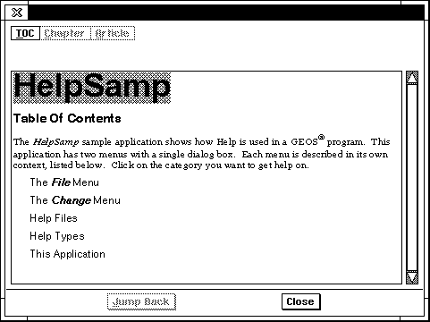
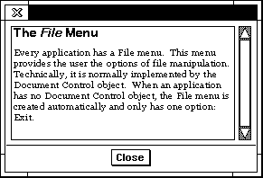
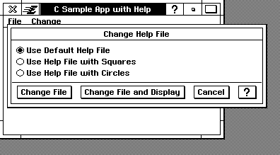
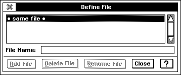
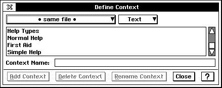

# 15 Help Object Library
On-line help is important for many applications, especially in the world of 
graphical interfaces and consumer devices. Many users will opt for 
exploration of an application rather than reading through the manual, and 
on-line help can assist them.

The GEOS on-line help system is an information viewing tool to be used by 
most if not all GEOS applications. It is automated, and adding it to an 
application is simple. All you need to do is create your help documents with 
GeoWrite and then add a few help attributes to your application's generic UI 
objects.

Before using this chapter, you should know how to set up generic object 
resources (see "GEOS Programming," Chapter 5 of the Concepts Book), and 
be familiar with GeoWrite and its features.

## 15.1 What Is Help?
GEOS provides four basic flavors of help ranging from simple descriptions to 
a full-featured information viewer complete with linked text and embedded 
graphics. GEOS help is both context-sensitive and random-access; a user may 
get help on the current dialog box, for example, or may invoke your help 
system's table of contents directly.

How a user gets help depends on the system in use: A standard desktop PC 
will allow keyboard access with the F1 key as well as help triggers 
throughout the application's UI. A small-screen device may hide the help 
triggers and allow only a special "hard icon," special pen gesture, or other 
means of activation to save screen space. (Such decisions are up to the 
specific UI.)

Nearly all applications will use "Normal Help," which provides a 
full-featured help viewer. The four types available are described below.

### 15.1.1 Normal Help
Most applications will include Normal Help, which provides a full-featured 
help viewer complete with embedded graphics and hyperlinked text. Normal 
help allows you to organize your help data in any manner; it has a single 
Table of Contents (TOC) page, which the user can access at any point in 
viewing help. Your TOC page should hyperlink to any other pages associated 
or appropriate (it depends on the information you're presenting). See 
Figure 15-1 for a sample of Normal Help.

Normal Help, like the other help types (see below), is also context-sensitive. 
You must define the contexts, but the help system will bring up the proper 
help page for the context. If the user clicks the help trigger on the primary 
window, for example, the TOC page is presented (by default). If the user clicks 
the trigger in a dialog box, however, the help page for that dialog box is 
presented.

  
**Figure 15-1** *Normal Help*  
*A sample screen of Normal Help. This is a TOC page from a help file defined 
for the HelpSamp application.*

### 15.1.2 First Aid
*First Aid* help, like Normal Help, provides a full-featured help viewer. First 
Aid files are also organized by context, but the information is presented in a 
different format. Whereas Normal Help is organized around the structure of 
the application, First Aid is presented in a book format.

When a user clicks the First Aid trigger, the help page for the proper context 
is displayed; this will typically be taken from the current Focus object (as in 
Standard Help). From there, the user may navigate throughout the help 
"book" via both hyperlinks in the text and three buttons at the top of the help 
window: Contents, Chapter, and Article. An illustration of the First Aid help 
box is shown in Figure 15-2.

To use First Aid, an application needs its own HelpControl object. Simply add 
one as a child of your GenApplication and set its help type to HT_FIRST_AID. 
The help controller must also be put on the application's active list.

  
**Figure 15-2** *First Aid Help*  
*A sample screen of First Aid Help.*

### 15.1.3 Simple Help

*Simple Help* provides a small scrolling dialog box with help text. This is 
useful for places where very simple help is required, perhaps only a few lines 
to illustrate a simple operation. Simple Help may be most useful for 
appliance-type applications; most applications will use Standard Help or 
First Aid help. A sample screen of Simple help is shown in Figure 15-3.

Simple help, like First Aid, requires that the application have its own 
HelpControl object and that the help controller be on the active list. Text in 
simple help does not link, so all help text pertaining to the item must appear 
on a single page.

  
**Figure 15-3** *Simple Help*  
*A sample screen of Simple Help.*

## 15.2 Adding Help to Your Application
For most applications, simply creating help files and adding 
ATTR_GEN_HELP_CONTEXT to certain generic objects will be sufficient. 
Other applications, though, such as those that use First Aid help, will require 
the addition of a HelpControl object (Normal help uses a system-provided 
and UI-run help controller).

The HelpControl object interacts with the **GenClass** and **MetaClass** aspects 
of generic objects to create help triggers, put up help screens, and determine 
which help file is used and what help context is displayed. For normal help, 
you don't need a HelpControl object; the system provides one. You do, 
however, have to know how to declare help contexts and work with help files.

### 15.2.1 Help Contexts and Help Triggers
    ATTR_GEN_HELP_CONTEXT, HINT_PRIMARY_NO_HELP_BUTTON

The help controller displays help pages based on an object's context. An object 
sets its context with ATTR_GEN_HELP_CONTEXT, which holds the name of 
the context. If an object does not have an assigned context, it will query up 
the tree until one of its ancestors assigns a context. The help control will 
display the help page with the same name as the assigned context.

This attribute has some side effects. If placed on a GenPrimary object, it will 
create the help trigger that appears in the application's title bar (unless other 
restrictions are applied - see below). If placed on a dialog box GenInteraction, 
it will create a help trigger in the dialog box (placement of the trigger is 
subject to the specific UI, but it will normally be on the far right of the reply 
bar). Both of these triggers invoke help with the context of their objects; both 
are illustrated in Figure 15-4.

Almost always, the GenPrimary's help context should be "TOC" to bring up 
the TOC help page. This is the default context, so if you don't specify a context 
for any object, help will always try to bring up the TOC page.

  
**Figure 15-4** *Help Triggers*  
*The Primary's help trigger and that in the dialog box are both created 
automatically by the HelpControl object.*

As stated above, ATTR_GEN_HELP_CONTEXT will by default create help 
triggers in certain situations. There are two times when creation of these 
help triggers will be suppressed: First, on small-screen devices or other 
situations wherein help triggers are not desired. In this situation, the .INI file 
will have a certain help option turned off. The simplest way to do this is to set

    [uiFeatures]
    helpOptions = 1

in the .INI file. This corresponds to the single help option 
UIHO_HIDE_HELP_BUTTONS and will suppress the help triggers. Both the 
F1 key (or equivalent) and MSG_META_BRING_UP_HELP will still invoke 
help properly.

Second, you can suppress only the GenPrimary's help trigger by adding 
HINT_PRIMARY_NO_HELP_BUTTON to the GenPrimary. Other help triggers 
will appear as dictated by the other requirements.

You can create your own help triggers if you like, though there is rarely a 
need to. Help triggers can be normal GenTrigger objects, with special 
settings. If the trigger is in a dialog box, it should have IC_HELP as its 
interaction type (ATTR_GEN_TRIGGER_INTERACTION_COMMAND). 
Otherwise, it should send MSG_META_BRING_UP_HELP to the object that 
should provide the context for the help. Also, the trigger should have its 
moniker specified with ATTR_GEN_DEFAULT_MONIKER, with the value 
GDMT_HELP. This will ensure your help trigger looks like other help triggers.

Help triggers you create, however, will not be suppressed by the system. 
Thus, if you want your application to be adaptable to small-screen UIs, you 
should only use system-provided help triggers.

### 15.2.2 Adding Default Normal Help
To add normal help to your application, you only need to add 
ATTR_GEN_HELP_CONTEXT to the objects that should have help contexts. 
You can look at the HelpSamp sample application, though that does much 
more than you need. The code shown in Code Display 15-1 is taken from 
HelpSamp and shows a dialog box with a list, in which each entry has its own 
context.

You will want to put ATTR_GEN_HELP_CONTEXT on any generic object that 
could conceivably need help text. Nearly all applications will put help only on 
GenInteractions and GenPrimaries, but it is available for all generic objects. 
For example, items in a GenItemGroup may have help contexts (as shown in 
HelpSamp) so that when the user hits the F1 key, help will be invoked for 
that particular item. Likewise, menus and menu items may have their own 
help contexts.

Nearly all GenPrimary objects should have the context "TOC" set for them.

----------
**Code Display 15-1 Objects with Help Contexts**

    /*     The TypeDialog box has its own help context: Help Types. This will cause
     * the UI to put a help trigger in the dialog's reply bar and, when that trigger
     * is clicked, will cause the system's help object to bring up the normal help
     * viewer on the "Help Types" page in the current help file.
     *     Each item in the GenItemGroup has its own help context. The list itself
     * does not have a context because if the user presses the F1 key, the help system
     * will bring up the selected item's help. If it were a list in which there could
     * be zero items selected, then the list might have its own context as well. */

    @object GenInteractionClass TypeDialog = {
        GI_visMoniker = 'T', "Change Help Type";
        GI_comp = @TypeList;
        GII_visibility = GIV_DIALOG;
        GII_type = GIT_PROPERTIES;
        ATTR_GEN_HELP_CONTEXT = "Help Types";
    }

    @object GenItemGroupClass TypeList = {
        GI_comp = @NormalItem, @FirstAidItem, @SimpleItem;
        GIGI_numSelections = 1;
        GIGI_selection = HT_NORMAL_HELP;
        GIGI_applyMsg = MSG_HELPSAMP_SET_TYPE;
        GIGI_destination = process;
        HINT_ORIENT_CHILDREN_VERTICALLY;
    }

    @object GenItemClass NormalItem = {
        GI_visMoniker = "Normal Help";
        GII_identifier = HT_NORMAL_HELP;
        ATTR_GEN_HELP_CONTEXT = "Normal Help";
    }

    @object GenItemClass FirstAidItem = {
        GI_visMoniker = "First Aid";
        GII_identifier = HT_FIRST_AID;
        ATTR_GEN_HELP_CONTEXT = "First Aid";
    }

    @object GenItemClass SimpleItem = {
        GI_visMoniker = "Simple Help";
        GII_identifier = HT_SIMPLE_HELP;
        ATTR_GEN_HELP_CONTEXT = "Simple Help";
    }

----------
### 15.2.3 Bringing Up Help on the Fly
    HelpSendHelpNotification()

The Help Controller library provides a routine to bring up a help context, or 
to switch to a help context, at any time. This routine, 
**HelpSendHelpNotification()**, generates the proper notification event 
using the values you pass, then sends that notification to the help control 
object you've selected. This routine is detailed in the routines reference 
manual.

This routine becomes most useful when, for example, you want help on 
visible objects in a GenView or in a document. To call up a help viewer with 
a specific help file and context, you would have the visible object intercept 
both your special "help key" (e.g. the user clicks the middle mouse button) 
and MSG_META_BRING_UP_HELP, then call **HelpSendHelpNotification()**. 
In the handler for the input event, the object should not call the superclass. 
One example of this could be a special diagram of a floorplan, with each room 
a visible object; each "room" would bring up a different help context 
describing the characteristics of the room.

## 15.3 Customizing Help
If you want to use one of the other help types, or if you want to use multiple 
help types in a single application, you must do more than just apply help 
contexts to objects. You can customize several things about the help system:

+ Help Type  
You can set or change the type of help offered by your application. You 
must have one HelpControl object for each type of help offered. You can 
set different objects to display or use different help types.

+ Help File  
Any object can specify the name of the file from which it draws its help. 
You can set the help file statically, change it dynamically, or have it 
defined by the GEOS.INI file.

+ Pointer Image  
The help system lets you define a custom pointer image to be used when 
the mouse pointer is over a hyperlink. You define the image, and the help 
controller uses that instead of the standard link pointer.

+ Help Features  
Because the HelpControl object is a controller, it has a certain feature set 
that may be turned on and off with ATTR_GEN_CONTROL_REQUIRE_UI 
and ATTR_GEN_CONTROL_PROHIBIT_UI. The features include the 
buttons presented to the user for navigating the help file and for closing 
the dialog box.

You can even create special "viewer" applications based on the help object. To 
make any of the above customizations, however, you must add one or more 
HelpControl objects to your application.

### 15.3.1 Bringing Up Initial Help
    ATTR_HELP_INITIAL_HELP_FILE, ATTR_HELP_INITIAL_HELP

An object may use ATTR_HELP_INITIAL_HELP_FILE and 
ATTR_HELP_INITIAL_HELP to bring up a help context when the object 
becomes usable. ATTR_HELP_INITIAL_HELP_FILE defines the help file from 
which the help is to be taken; it is only used if ATTR_HELP_INITIAL_HELP is 
also present. This one defines the help context to be brought up on startup.

These attributes are used normally only by help-viewer applications, as it is 
unlikely help will be required on startup. Normally, help is brought up by the 
user pressing a help trigger.

### 15.3.2 Adding the HelpControl
To add a help controller to your application, simply declare an instance of 
**HelpControlClass** and add it as a child of your GenApplication, adding it to 
the active list. The code in Code Display 15-2 is taken from the HelpSamp 
sample application and illustrates what you have to do to support custom 
help. The steps are

+ Declare the HelpControl  
Declare an object of **HelpControlClass**. You must set its *HCI_helpType* 
field to the **HelpType** value it will manage. Because the standard 
behavior is to have the help window always appear on top of other dialog 
boxes, you should set the window priority accordingly (as shown). Also, 
because most controllers will come up disabled, set the GS_ENABLED flag 
to have the help buttons enabled when help is first invoked.

+ Add the HelpControl to the active list  
The HelpControl, as all controllers, must be put on the active list, the 
MGCNLT_ACTIVE_LIST GCN list. All of your help controllers must be on 
this list.

+ Set the help type in the GenApplication  
If you're simply using a different help type, set it in the GenApplication 
object with ATTR_GEN_HELP_TYPE. The sample code shown does not 
have this attribute because the application uses multiple types but 
defaults to Normal Help. The user has the option of changing the help 
type; when the type is changed, ATTR_GEN_HELP_TYPE is added to the 
GenApplication dynamically.

Other than the above customizations, using another help type is as simple as 
using Normal Help. Other considerations must be observed when creating 
the help files, but the code difference is simple.

----------
**Code Display 15-2 Adding Help Controllers**

    /*    The GenApplication has two help controllers as its children.
     * FirstAidHelpControl manages First Aid help, and SimpleHelpControl manages
     * Simple Help. In addition, the Normal Help controller-provided by the
     * system-manages Normal Help. Both custom help controllers must be put both on
     * the active list and on the GAGCNLT_NOTIFY_HELP_CONTEXT_CHANGE list.
     *    Normally, the GenApplication would have ATTR_GEN_HELP_TYPE declaring the
     * help type used. This application, however, defaults to HT_SYSTEM_HELP and
     * therefore does not need the attribute. */

    @object GenApplicationClass HelpSampApp = {
        GI_visMoniker = list { @HelpSampTextMoniker };
        GI_comp = @HelpSampPrimary, @FirstAidHelpControl, @SimpleHelpControl;
        gcnList(MANUFACTURER_ID_GEOWORKS,GAGCNLT_WINDOWS) = @HelpSampPrimary;
        gcnList(MANUFACTURER_ID_GEOWORKS, MGCNLT_ACTIVE_LIST) =
                                @FirstAidHelpControl, @SimpleHelpControl;
    }

    @visMoniker HelpSampTextMoniker = "C Sample App with Help";

    /*    The help controllers may manage at most one HelpType each. Thus, you must
     * set the HCI_helpType field so the controller knows what type of help it
     * manages. */

    @object HelpControlClass FirstAidHelpControl = {
        GI_states = @default | GS_ENABLED;
        HCI_helpType = HT_FIRST_AID;
    }

    @object HelpControlClass SimpleHelpControl = {
        GI_states = @default | GS_ENABLED;
        HCI_helpType = HT_SIMPLE_HELP;
    }

----------
### 15.3.3 Sizing the Help Dialog Box
    HINT_HELP_TEXT_FIXED_SIZE, HINT_HELP_NOT_RESIZABLE

Depending on what you're using help for, you may want to keep the help 
dialog box a fixed size, or you may wish to make it not resizable. For both 
cases, you must use a custom help controller object and set one of the 
following hints on the controller:

HINT_HELP_TEXT_FIXED_SIZE  
This hint is exactly the same as **GenClass**' HINT_FIXED_SIZE; 
it takes a **CompSizeHintArgs** structure as its extra data and 
sets the help controller's dialog box to the fixed size.

HINT_HELP_NOT_RESIZABLE  
Normally, help controllers set up as GIV_DIALOG are resizable. 
This hint will counteract that behavior and make the window 
not resizable.

### 15.3.4 Managing Help Types
    HelpType, ATTR_GEN_HELP_TYPE, MSG_META_GET_HELP_TYPE

The type of help your application provides is defined by its **HelpType**. This 
value is set in the HelpControl object's *HCI_helpType* instance field. For 
normal help, you don't need to set anything; the type will automatically be 
HT_SYSTEM_HELP for the system help object (you should not set this type for 
your own help control objects).

There are five other help types you can use: HT_NORMAL_HELP, 
HT_FIRST_AID, HT_STATUS_HELP, HT_SIMPLE_HELP, and 
HT_SYSTEM_MODAL_HELP. You should only explicitly use 
HT_NORMAL_HELP if you want the normal help setup with some 
customizations or you are creating a viewer application. The others you must 
use explicitly if you want to provide those types of help.

(Note: HT_SYSTEM_MODAL_HELP is used for providing help within 
system-modal dialog boxes only. It is rare that an application will ever use 
system-modal dialog boxes, but if yours does and you need to provide help 
within it, use this special type. Such dialog boxes should be given the 
attribute ATTR_GEN_HELP_TYPE with this type to distinguish them from 
other dialogs.)

To set an application's help type, you have to first supply a HelpControl object 
as a child of the GenApplication and set its *HCI_helpType* field to the proper 
help type. You also have to put your HelpControl object on the 
GenApplication's GAGCNLT_NOTIFY_HELP_CONTEXT_CHANGE GCN list. 
You may have one HelpControl object for each help type supported by your 
application.

Examples of how to set up the proper objects are shown above in Code 
Display 15-2.

Any object may have any help type associated with it. You could have, for 
example, one dialog box set to Normal Help and another set for Simple Help. 
This is unusual, and you will usually want to stick to a single help type 
within one application. To set an object's help type, use 
ATTR_GEN_HELP_TYPE. You can retrieve the current help type of an object 
by sending it MSG_META_GET_HELP_TYPE.

### 15.3.5 Managing Help Files
    ATTR_GEN_HELP_FILE, ATTR_GEN_HELP_FILE_FROM_INIT_FILE, 
    MSG_META_GET_HELP_FILE, MSG_META_SET_HELP_FILE, 
    ATTR_GEN_CONTROL_DO_NOT_USE_LIBRARY_NAME_FOR_HELP

The help controller gets the text it displays from help files. Help files are 
generated by the help editor (a modified GeoWrite) from GeoWrite documents 
and are located in USERDATA\HELP. An application may use a single help 
file or multiple help files, and hyperlinks may extend across files.

The help controller figures out the help file to use by looking for 
ATTR_GEN_HELP_FILE on the generic object that brings up the help. For 
example, if the user clicks a help trigger in a dialog box, the help controller 
first gets the context of the dialog box (contexts are described in "Help 
Contexts and Help Triggers" above) and will then get its help file. If the 
dialog box has an ATTR_GEN_HELP_FILE specifying a particular help file, the 
help controller will try to use that file.

If the dialog box does not have that attribute, the help controller queries up 
the generic tree until it either finds an ancestor with the attribute or gets to 
the GenApplication object. If no help file is specified, the help controller will 
by default use a file with the same name as the geode's permanent name with 
the extender characters removed. For example, in the sample application 
HelpSamp, which has the permanent name *helpsamp.app* (which is defined 
in the **helpsamp.gp** file), the default file name would be **helpsamp**.

An object can use ATTR_GEN_HELP_FILE_FROM_INIT_FILE to specify that 
its help file should be garnered from the GEOS.INI file. If this attribute is 
used, the help controller will look in the GEOS.INI file for a category of the 
same name as the application and a key named "helpfile." Thus, to set the 
help file to "My Own Help File" for the HelpSamp application, you could add 
the following to your GEOS.INI file:

    [HelpSamp]
    helpfile = My Own Help File

If, however, no object has ATTR_GEN_HELP_FILE_FROM_INIT_FILE, this 
entry will not be noticed by the help controller.

Controller objects, which typically exist within their own libraries, may use 
the help files provided by the application that includes them rather than the 
help file normally used by the library. To have a controller do this, set 
ATTR_GEN_CONTROL_DO_NOT_USE_LIBRARY_NAME_FOR_HELP for the 
controller in your application. This will have the controller continue querying 
up the generic tree when searching for the proper help file to use.

The help file used by a given object may also be changed dynamically with 
MSG_META_SET_HELP_FILE. This message takes a pointer to the new file's 
name and sets the object's ATTR_GEN_HELP_FILE attribute to the new file. 
This message is used by the HelpSamp sample application.

The help file can be retrieved with MSG_META_GET_HELP_FILE. This 
message returns the name of the file being used by the recipient generic 
object.

### 15.3.6 Customizing the Pointer Image
    ATTR_HELP_CUSTOM_POINTER_IMAGE, 
    MSG_HELP_CONTROL_GET_POINTER_IMAGE

The help controller changes the pointer image when the pointer is over a link 
in the help text. This is so the user knows where to click and expects a link 
to be followed. Applications that want custom pointers can set the "link" 
pointer image with ATTR_HELP_CUSTOM_POINTER_IMAGE. This attribute 
takes an optr to a custom pointer image definition.

The pointer image is a **PointerDef** structure and must be stored in a chunk 
in a sharable, non-duplicated data block. Note also that to use a custom 
pointer image, you must explicitly declare a HelpControl object, even for 
Normal Help.

You can retrieve the link pointer image by sending 
MSG_HELP_CONTROL_GET_POINTER_IMAGE to the HelpControl object. 
This will return the current image in use, either a custom image or the 
default. This message is detailed below.

### 15.3.7 Changing the Help Features
Because the HelpControl is a subclass of **GenControlClass**, you can change 
the features it offers both in your .goc file and dynamically. For complete 
information, see section 12.1.1 of chapter 12. The features of the help 
controller are detailed in "HelpControlClass Reference" below.

## 15.4 Creating Help Files
Perhaps the most involved step of adding help to your application is actually 
creating the help files. Help files are special, compressed versions of 
GeoWrite files that reside in the \USERDATA\HELP directory. There are 
several steps to creating help files:

1. Enable the Help Editor  
The Help Editor is simply a special version of GeoWrite.

2. Organize and write the text  
Depending on your application, your help text, and how you wish to 
present it, this can be simple or complex. You must keep several things 
in mind when organizing your help.

3. Define files and contexts  
Each help file must have its contexts named, and each context must be 
defined. If you are using multiple help files, you must define the help 
contexts for each file in use, and you must "define" each file being used.

4. Set contexts  
Each page of help must have its own context name.

5. Set hyperlinks  
After all contexts are named and set, you may set hyperlinks to them.

6. Generate the help files  
When the help text is ready, you must generate the help file(s). They will 
then be available for your application to open and view.

### 15.4.1 Enabling the Help Editor
The Help Editor is GeoWrite with the Help Editor option turned on. To turn 
on this option, manually edit your .INI file to add the category and key as 
follow:

    [configure]
    helpEditor = true

Without the above lines, you can't access the Help Editor. After adding them, 
start up GeoWrite and change the user level. Choose "Customize" and turn 
on the Help Editor option at the end of the list. When you apply the change, 
a new "Help Editor" menu should appear towards the right of the menu bar.

### 15.4.2 Organizing and Writing the Text
If your help text is simple and straightforward, you can probably dive right 
in and write it. If it is not, though, you should spend some time up front 
organizing it, naming the contexts and files, and figuring out where 
hyperlinks will be placed. Defining contexts and links as you're writing can 
quickly get confusing, even for experienced writers.

Most help text will be configured for Normal Help. This type of help typically 
has a table of contents page (TOC) and numerous other contexts, many of 
which are linked to each other. Normally, a help context (page) will be 
accessible through two means: First, the user could click a help trigger or hit 
F1 at the right time to bring up the proper context. In this case, the user can 
not "go back" to the previous context, although he can get to the TOC page by 
clicking the Contents button. Second, the user could navigate through the 
help system via hyperlinks and get to the context.

Not all contexts may be available through links, however; some may be 
accessible only through clicking a help trigger or hitting F1. Other contexts 
may be accessible only via navigation of hyperlinks in the help document. 
You should plan this out in advance so you can write effective text and set 
your links properly.

#### 15.4.2.1 Organizing the Help
Perhaps the most straightforward help organization is a simple listing of 
topics, each of which is a hyperlink to another help screen. For example, the 
"Change File" help screen in the HelpSamp sample application's default file 
gives a brief description of the Change File dialog box and then three 
subtopics, each of which links to another context in the help file. (This screen 
is shown in Figure 15-5.)

  
**Figure 15-5** *A Sample Help Context* 
*This page has a brief description with a list of subtopics, each of which is a 
link to another help context.*

A First Aid file, however, is designed differently. It has three "levels" of help: 
Contents, Chapter, and Article. The Contents page is a TOC page, just as in 
Normal Help. The TOC button allows the user quick access to that level at all 
times. When the user selects an entry on the TOC page, a Chapter-level 
context should be brought up. At this point, only the TOC button is enabled, 
and the Chapter button is enabled and selected.

The Chapter-level context should similarly list subtopics of interest. When 
the user selects one of these, an Article-level context will be displayed. At this 
point, both the Contents button and the Chapter button will be enabled, 
allowing the user to "back up" to one of those previous levels. Also at this 
point, the Article button will be enabled and selected. The Article-level 
context (currently viewed) may contain a list of several questions or 
subtopics. When the user follows one of these links, the Article button will be 
enabled but deselected, allowing the user to quickly return to any of the three 
levels traversed to this point.

First Aid, like Normal Help, may have contexts linked to any other contexts 
in the same or other files; they are not restricted to the TOC-Chapter-Article 
links mentioned above.

Simple Help normally will not have any links because it offers no way to go 
back or even to return to a TOC page. If your application offers Simple Help, 
you should keep it straightforward and not put in any links.

#### 15.4.2.2 Using Visual Cues and Graphics
Although the help controller will change the pointer image when the pointer 
is over a hyperlink, you should use graphics or highlighted text whenever 
possible to call attention to the links. Because the Help Editor is extended 
GeoWrite, anything you can do to normal GeoWrite text you can put in your 
help files.

Long pages of text can be difficult to read unless you put in headers or other 
highlighting. Some suggested highlighting techniques are to use colored or 
gradient-filled text, use the boxed or button text styles, or underline the text. 
Using different sizes and fonts is also effective. Keep in mind, however, that 
many users will have monochrome, CGA-style screens.

You can also embed graphics in the text. This does not include using the 
"graphic layer" of GeoWrite, however-since the Help Editor uses only the 
text layer, it will not use graphics pasted to the graphic layer. You must paste 
them directly into the text.

A useful tip to creating consistent help documents is to pre-define a number 
of style sheets in GeoWrite and use those styles for all your help. Any time a 
new style is required, create a new style sheet.

### 15.4.3 Defining Files and Contexts
If all your help resides within single files and links do not cross files (all links 
are internal to their own files), then defining contexts is simple. However, if 
links can cross files, you must do a little more work.

When you "define a context," you are notifying the Help Editor that a context 
with a given name and type exists in the specified file. When all links are 
internal to a single file, or when you have no links (as with Simple Help), you 
can simply define contexts for the "same file." However, if you have links 
crossing files, you must define both the file and context for each external link 
(similar in function to an "external" definition in your code).

##### To Define a File
Open the Define File dialog box via the Help Editor menu. Type the name of 
the file that will have links into it, and click "Add File." You can delete or 
rename previously defined files.

  
**Figure 15-6** *The Define File Dialog*  
*Define each file linked to. You can't set a link to a context unless it has been 
defined for the file in which it resides.*

##### To Define a Context
Open the Define Context dialog box via the Help Editor menu. Use the 
upper-left popup list to select which file the new context will be defined for. 
Use the upper-right popup list to define the type of the file:

**Text** - A normal text help page. Use this for all contexts in all help 
types except First Aid as noted below.

**TOC** - A First Aid TOC page.

**Chapter** - A First Aid Chapter-level page.

**Article** - A First Aid Article-level page.

Once you've selected the proper type, name the context and click "Add 
Context." You can also delete and rename previously-defined contexts.

  
**Figure 15-7** *The Define Context Dialog*  
*Define contexts for each file linked to. You can't set a link to a context unless it 
has been defined for the file in which it resides.*

##### To Set a Context
Each help page may be recognized as only one context. The context for the 
page must be set at the page's beginning. To set a context, first open the "Set 
Context" dialog box via the Help Editor menu. Then select some text at the 
beginning of the help page, select the context name from the dialog box, and 
click "Apply." That page will be set to the selected context.

Pages in the GeoWrite file that do not have help contexts applied will not be 
generated into the help file. This fact is useful for recording information 
within the file about the file itself (release dates, draft dates, author name, 
revision notes, etc.).

  
**Figure 15-8** *The Set Context Dialog*  
*Set a page's context at the very beginning of the page. Only the context at the 
beginning is recognized.*

### 15.4.4 Using Hyperlinks
You can set any selected text or graphic to be a hyperlink to another context 
in any help file. To set a hyperlink, open the "Set Hyperlink" dialog box via 
the Help Editor menu. Select the text that, when clicked on, should cause the 
new context page to appear. Then select, in the "Set Hyperlink" dialog, the 
appropriate file and context names. Click "Apply," and the selected text 
and/or graphic will act as a hyperlink to that file and context.

Once a hyperlink is created, you can follow it in the GeoWrite document by 
using the "Follow Hyperlink" entry in the Help Editor menu. This option will 
not be enabled unless the current cursor or selection is a hyperlink.

### 15.4.5 Generating the Help Files
Once the help file is created, all the contexts are defined and set, and all the 
hyperlinks (if any) are established, you can generate the help file. When the 
file is generated, it is automatically placed in USERDATA\HELP, and it will 
have the same name as the GeoWrite document being edited. Thus, if you are 
editing a file called "helpsamp," the help file would be 
USERDATA\HELP\\**helpsamp**.

  
**Figure 15-9** *The Set Hyperlink Dialog*  
*Set a hyperlink to the file and context selected.*

The help file may be compressed or not. The default is to compress the help 
data to save disk space. Since help files are read-only, the help controller 
decompresses the data when loading it, then simply discards it when done. 
The "Compress Data in File" option in the Help Editor menu allows you to 
specify whether the help file should be compressed or not (just about the only 
time it should not be compressed is for Status Help).

To generate the help file, simply select "Generate Help File" in the Help 
Editor menu. The generation is one-way; you can not edit a help file. You 
should, therefore, keep your original GeoWrite documents containing the 
help text available in case they require editing or update.

## 15.5 HelpControlClass Reference
This section will only be useful if you plan on customizing help for your 
application. Nearly all of what you need for creating normal help files and 
adding help to your application is described in the previous sections. The 
following is detailed reference information for **HelpControlClass** (shown in 
Code Display 15-3).

----------
**Code Display 15-3 HelpControlClass**

        @instance HelpType      HCI_helpType;           /* See HelpType, below */
        @instance MemHandle     HCI_curFile;            /* Internal */
        @instance MemHandle     HCI_historyBuf;         /* Internal */
        @instance word          HCI_nameArrayVM;        /* Internal */
        @instance GeodeHandle       HCI_compressLib;    /* Internal */
            @default GII_attrs = (@default | GIA_NOT_USER_INITIATABLE);
            @default GII_visibility = GIV_DIALOG;

        @vardata void               ATTR_HELP_SUPPRESS_INITIATE;
        @vardata char[]             ATTR_HELP_INITIAL_HELP;
        @vardata optr               ATTR_HELP_CUSTOM_POINTER_IMAGE;
        @vardata CompSizeHintArgs   HINT_HELP_TEXT_FIXED_SIZE;
        @vardata void               HINT_HELP_NOT_RESIZABLE;
        @vardata char[]             ATTR_HELP_INITIAL_HELP_FILE;

    typedef ByteEnum HelpType;
        #define HT_NORMAL_HELP              0
        #define HT_FIRST_AID                1
        #define HT_STATUS_HELP              2
        #define HT_SIMPLE_HELP              3
        #define HT_SYSTEM_HELP              4   /* Reserved for system use */

    /* Internal Vardata fields-do not use these. */
        @vardata char[]         TEMP_HELP_ERROR_FILENAME;
        @vardata char[]         TEMP_HELP_TOC_FILENAME;
        @vardata void           TEMP_HELP_DETACH_RECEIVED;

----------
**HelpControlClass** is a subclass of **GenControlClass** and, as such, inherits 
the feature management attributes and messages thereof. For complete 
information on feature and tool sets, see section 12.1 of chapter 12. The 
HelpControl object has features but no tools. The feature set of 
**HelpControlClass** is shown in Code Display 15-4.

----------
**Code Display 15-4 HelpControl Features**

    /* These features can be turned on or off with ATTR_GEN_CONTROL_REQUIRE_UI and
     * ATTR_GEN_CONTROL_PROHIBIT_UI. They can be turned on or off dynamically with
     * MSG_GEN_CONTROL_ADD_FEATURE and MSG_GEN_CONTROL_REMOVE_FEATURE. */

    typedef WordFlags HPCFeatures;
        #define HPCF_HELP               0x0100  /* has a "help on help" trigger */
        #define HPCF_TEXT               0x0080  /* has text */
        #define HPCF_CONTENTS           0x0040  /* has "Contents" button */
        #define HPCF_HISTORY            0x0020  /* has "History" button */
        #define HPCF_GO_BACK            0x0010  /* has "Go Back" button */
        #define HPCF_CLOSE              0x0008  /* has "Close" button */
        #define HPCF_INSTRUCTIONS       0x0004  /* has "Instructions" button */
        #define HPCF_FIRST_AID_GO_BACK  0x0002  /* has "Go Back" button for
                                                 * First Aid */
        #define HPCF_FIRST_AID          0x0001  /* has First Aid configuration */

----------
**HelpControlClass**, as a GenControl subclass, receives notification when 
the controlled item changes. For example, a change in help context will cause 
the HelpControl object to display the new context page. The HelpControl 
object must be put on the GAGCNLT_NOTIFY_HELP_CONTEXT_CHANGE 
notification list. When a context change occurs, the help controller will 
receive MSG_META_NOTIFY_WITH_DATA_BLOCK, with the notification type 
GWNT_HELP_CONTEXT_CHANGE. This notification type passes a data block 
containing a **NotifyHelpContextChange** structure, which is shown below.

----------
**Code Display 15-5 Help Notification Structure**

    /* This data structure is passed in MSG_META_NOTIFY_WITH_DATA_BLOCK to the help
     * controller when a change in the help context occurs. This structure can be
     * generated by calling HelpSendHelpNotification(). This structure uses the
     * following constant and type. */

    #define MAX_CONTEXT_NAME_SIZE               20

    typedef char        ContextName[MAX_CONTEXT_NAME_SIZE];

    typedef struct {
        HelpType            NHCC_type;          /* HelpType involved in change */
        ContextName         NHCC_context;       /* New context to link to */
        FileLongName        NHCC_filename;      /* New file name to link to */
        FileLongName        NHCC_filenameTOC;   /* File name to get TOC from */
    } NotifyHelpContextChange;

----------
**HelpControlClass** has two exported messages that subclasses may 
intercept. These are not often intercepted by subclasses. Their reference 
information is presented below.

----------
#### MSG_HELP_CONTROL_FOLLOW_LINK
Cause the HelpControl object to follow the specified link in the help file.

**Source:** Unrestricted; typically internal to the controller.

**Destination:** The HelpControl object to follow the link.

**Parameters:**  
*link name* - 16-bit token of the link name.

*link file* - 16-bit token of the link file.

**Return:** Nothing.

**Interception:** Not generally intercepted.

----------
#### MSG_HELP_CONTROL_GET_POINTER_IMAGE

Return the pointer image to be used when the pointer is over a link in the 
help text. It looks for ATTR_HELP_CUSTOM_POINTER_IMAGE and returns 
the pointer stored there; if no custom pointer exists, the default is returned.

**Source:** Unrestricted; typically internal to the controller.

**Destination:** The HelpControl object using the custom pointer.

**Parameters:**  
*not over link* - Pass FALSE if the pointer is *not* over a link, TRUE if 
it is. (Must pass TRUE, not just non-zero).

**Return:** A word of **MouseReturnFlags**. If MRF_SET_POINTER_IMAGE is set in 
this record, the optr of the pointer image will also be returned. 
Otherwise, the optr will be NullOptr.

**Interception:** A "viewer" application may subclass this and return its own pointer 
images if they are dynamic. If static pointer images are used, the 
application should use ATTR_HELP_CUSTOM_POINTER_IMAGE 
instead. There is no need to call the superclass with this message.

[GenFile Selector](ogenfil.md) <-- [Table of Contents](../objects.md) &nbsp;&nbsp; --> [Impex Library](oimpex.md)

