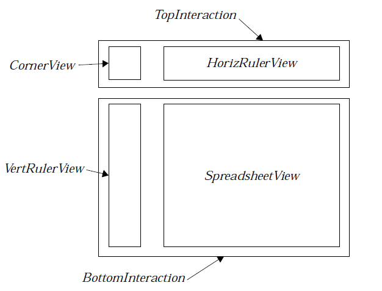

# 20 Spreadsheet Objects
The spreadsheet objects provide most of the functionality that any 
spreadsheet will need. They let the user enter information in cells without 
direct involvement by the application. They also manage all interaction with 
the Parse library. The application can then ignore these issues, or it can 
intervene to add functionality.

Before you read this chapter, you should be familiar with the database 
routines (see "Database Library," Chapter 19 of the Concepts Book). In 
particular, you should be familiar with the section on the cell library. You 
should also have read the first few sections of the Parse Library chapter 
("Parse Library," Chapter 20 of the Concepts Book); you need not read the 
"Advanced Usage" section. You should also be familiar with Ruler objects 
("Ruler Object Library," Chapter 19) and VisComp objects ("VisComp," 
Chapter 24).

## 20.1 Spreadsheet Overview
The spreadsheet library provides a high-level interface with the Cell and 
Parse libraries. It also provides all the user interface for a spreadsheet. The 
objects are subclassed from common Vis objects and inherit much of their 
functionality from them; this means that applications can alter spreadsheet 
objects in a very intuitive way. Applications can also use the spreadsheet 
objects in "engine" mode. When the Spreadsheet is in engine mode, it does not 
provide any user interface, but it still provides a convenient interface to the 
Cell and Parse libraries.

There are three main spreadsheet objects; most spreadsheet applications will 
use all three. Applications which use the spreadsheet in engine mode will not 
need to use all of the objects. There are also several controllers which work 
with the spreadsheet objects. Most spreadsheet applications will end up 
including all of these.

### 20.1.1 Quick Look at the Objects
Three different classes of objects are provided for use with the spreadsheet. 
Most spreadsheet applications will use all three of these. To see how the 
objects are arranged, see Figure 20-1 below

**SpreadsheetClass**  
This is the main spreadsheet object, a subclass of 
**VisCompClass**. The spreadsheet object manages a cell file; it 
automatically looks up values for cells and displays them, and 
copies new data into the cell file. This object does the bulk of a 
spreadsheet application's work. Every open spreadsheet will 
have its own Spreadsheet object; applications usually use the 
Document Control to duplicate this object automatically for 
every open file. All references in the text to the "Spreadsheet 
Object" are to this object.

**SpreadSheetRuler**  
This is a subclass of **VisRulerClass**. It is usually placed just to 
the left of the Spreadsheet object. It usually contains the labels 
for the cell rows; however, it can be set to show measurements 
in any of the standard forms (inches, centimeters, points, etc.). 
Like all rulers, it is usually displayed in a RulerView and is 
usually the Vis child of a RulerContent. It is linked to the 
Spreadsheet object, and thus it can automatically show 
information about the active area of the spreadsheet. Most 
applications will have two rulers, one horizontal and one 
vertical (determined by settings of the VRA_HORIZONTAL flag) 
One ruler will receive messages from the Spreadsheet; the 
other ruler will be its slave. For more information about rulers, 
see "Ruler Object Library," Chapter 19.

**SSEditBarControlClass**  
This is a subclass of **GenControlClass**. The controller 
displays the value or formula for the active cell. The user can 
use this controller to change the value in a cell. The controller 
is usually made a child of the Edit menu, if there is one. As with 
all controllers, the user can put this controller wherever he 
prefers; it is usually put at the top of the primary window, just 
below the menu bar.

**Other Controllers**  
The Spreadsheet library provides other controllers which do 
such things as add notes to cells, change row and column width, 
and sort rows or columns. Applications which include these 
objects will not have to perform these tasks directly.

### 20.1.2 Managing Cell Files
As explained in "Database Library," Chapter 19 of the Concepts Book, cell 
files are ways of accessing DB items in a VM file. Ordinarily, every DB item is 
accessed via two tokens: the VM handle of the item's DB group, and the DB 
handle of the item. When items are arranged in a cell file, the application can 
access the items by a row and column address. In order to do this, the 
application must do some bookkeeping; for example, the application has to 
keep track of a **CellFunctionParameters** structure. If you use the 
spreadsheet objects, you can avoid this bookkeeping.

When you create a new spreadsheet file, the Spreadsheet object will allocate 
a "spreadsheet map" block in the file. (This is different from the ordinary VM 
map block; a file can have both a map block and a "spreadsheet map" block.) 
The spreadsheet objects will record essential bookkeeping information (such 
as the **CellFunctionParameters** structure) in this block. While it is 
running, it will cache the information in its own instance data; however, 
whenever the file is saved or updated, it will write the cache back to this 
block. The application should treat this block as entirely opaque.

When the spreadsheet object attaches a new file, it must be passed the 
handle of the spreadsheet map block. It can then read all the information it 
needs about the file. The spreadsheet will automatically allocate cells when 
needed, and free them when appropriate. *Note that since cells are ungrouped 
DB items, whenever a cell is allocated or resized, potentially any or all 
ungrouped items in that VM file could be moved. For this reason, if you use 
ungrouped items, you should not leave them locked; it's probably safest not 
to use ungrouped items at all, if you can avoid them.* (See section 19.2.4 of 
"Database Library," Chapter 19 of the Concepts Book.)

Every cell in a spreadsheet can contain one of three possible values: a 
number, a text string, or a token string. The application may set a cell's value 
with a message, or the user may set the selected cell's value with the 
SSEditBarControl. If the user entered a number in any acceptable format, 
the spreadsheet will set the cell's value to equal that number. If the user 
entered a character sequence which begins with an equals sign, the 
spreadsheet will call the parser to parse all the characters after the equals 
sign. If the sequence is a well-formed expression, the token sequence will be 
stored in the cell; otherwise an error will be displayed. If the user enters a 
character sequence which is not a well-formed number and does not begin 
with an equal sign, the spreadsheet object will interpret it as a string, and 
copy the string verbatim to the cell.

In addition, every cell can have a note associated with it. The note may be 
any null-terminated string. The note does not affect how the cell is evaluated. 
Users will generally add and view the notes with the SSNoteControl object.

Whenever the Spreadsheet changes any data in the file, it marks the 
appropriate block as dirty. If you use the Document Control objects, they will 
automatically take appropriate actions (such as enabling the "Save" trigger).

### 20.1.3 Parsing Expressions
The Spreadsheet object automatically calls the appropriate Parse Library 
routines to parse formula strings, as well as to evaluate and format token 
strings. It performs all necessary interaction with the Parse library; for 
example, when the Evaluator needs to know the current value of a cell, the 
Spreadsheet find's the cell's contents, performs any evaluations necessary, 
and returns the data to the Evaluator. 

When the user enters a formula into a cell (i.e. a character sequence which 
begins with an equals sign), the spreadsheet automatically calls the Parse 
library routine to transform the character sequence into the corresponding 
token sequence. It stores the token sequence in the cell. It then calls the 
evaluator to simplify the token sequence. Finally, it calls the formatter to 
transform the simplified token sequence into a character string, and it 
displays this string in the spreadsheet display area. If the formula is 
well-formed, but cannot be evaluated (e.g. because it depends on a cell which 
has a bad value), it will display an appropriate error message in the cell. The 
formula is reevaluated whenever a the value of a cell or variable in the 
formula changes.

If the user wants to see or edit the actual formula, he can select the cell. The 
spreadsheet will call the formatter to transform the formula's token sequence 
back into a character string, which will be displayed in the edit bar, where 
the user can edit it. When the user is done editing, the new formula will again 
be parsed, and the new token sequence will be entered in the cell.

The Spreadsheet detects circular references; it can be instructed to break 
circular references, or to evaluate a set number of times through the circle to 
approximate the "true" value (i.e. the value if the circuit were followed an 
infinite number of times). Of course, this iteration is only useful if the cells' 
values converge.

## 20.2 The Spreadsheet Objects
There are four basic objects in the Spreadsheet library. These objects are 
fairly simple to use. Most of the functionality is in the Spreadsheet object; the 
other objects are straightforward modifications of classes which are 
documented elsewhere.

### 20.2.1 SpreadsheetClass
The spreadsheet object is the basis of the spreadsheet library. It does all the 
interaction with the cell and parse libraries. The spreadsheet has a lot of 
instance data fields. Some of them are of interest to the application; some are 
initialized by the application, and ignored thereafter; and some are of 
interest only to the spreadsheet object's internal code. The instance data is 
shown in Code Display 20-1. Those fields which are of interest to the 
application are described in detail in the following sections.

The spreadsheet object is a subclass of **VisCompClass**. If the spreadsheet is 
not being used in "engine" mode, it should be linked to a GenView object, just 
like any other VisComp object would be. For more information, "VisComp," 
Chapter 24.

----------
**Code Display 20-1 SpreadsheetClass Instance Data**

    /* This is the instance data for the SpreadsheetClass object. Some of these fields
     * must be initialized by the application; some are set and maintained entirely by
     * the object. */

    /* The first field of the spreadsheet object is always the CellFunctionParameters
     * structure for the cell file. Therefore, a pointer to the instance data of a
     * Spreadsheet object can be used as a pointer to the CellFunctionParameters. */
    @instance CellFunctionParameters        SSI_cellParams= {0, 0, {0}};

    /* SSI_maxRow and SSI_maxCol store the indices of the leftmost row and bottommost
     * column allowed in the spreadsheet. The application may set these; they must be
     * no larger than the spreadsheet library constants MAX_ROW (8191) and MAX_COLUMN
     * (255). */
    @instance word          SSI_maxRow = MAX_ROW;
    @instance word          SSI_maxColumn = MAX_COLUMN;

    /* SSI_mapBlock is the VM handle of the attached file's spreadsheet map block. The
     * spreadsheet sets this when a spreadsheet file is initialized; applications must
     * provide this when they instruct a spreadsheet object to open a file. */
    @instance VMBlockHandle             SSI_mapBlock;

    /* SSI_flags is a word-length record of SpreadsheetFlags. Some of these flags are
     * set by the application; others are set automatically by the spreadsheet object.
     * The application can change some of these at run-time. The SpreadsheetFlags are
     * described at length in section 20.2.1.4 below. The following flags are
     * available:
     *      SF_MANUAL_RECALC                SF_ALLOW_ITERATION
     *      SF_SUPPRESS_REDRAW              SF_APPLICATION_FUNCTIONS
     *      SF_QUICK_DRAW_IN_PROGRESS       SF_DOING_FEEDBACK
     *      SF_IN_VIEW                      SF_IS_TARGET
     *      SF_IS_FOCUS */
    @instance SpreadsheetFlags      SSI_flags = 0;

    /* SSI_drawFlags is a word-sized record of SpreadsheetDrawFlags. These flags
     * specify how the spreadsheet will draw itself on-screen. The application can
     * change some of these at run-time. The SpreadsheetDrawFlags are described at
     * length in section 20.2.1.5 on page 1221. The following flags are available:
     *      SDF_DRAW_GRAPHICS           SDF_DRAW_NOTE_BUTTON
     *      SDF_DRAW_GRID               SDF_SIDEWAYS
     *      SDF_SCALE_TO_FIT            SDF_DRAW_ROW_COLUMN_TITLES
     *      SDF_SKIP_DRAW               SDF_CENTER_VERTICALLY
     *      SDF_CENTER_HORIZONTALLY     SDF_CONTINUOUS
     *      SDF_DRAW_HEADER             SDF_DRAW_FOOTER
     *      SDF_PRINT_DOCUMENT          SDF_PRINT_NOTES
     *      SDF_DONE */
    @instance SpreadsheetDrawFlags      SSI_drawFlags = 0;

    /* SSI_attributes is a byte-sized record of SpreadsheetAttributes flags. The flags
     * are discussed at length in section 20.2.1.6 below. The following flags
     * are available:
     *      SA_TARGETABLE           SA_ENGINE_MODE */
    @instance SpreadsheetAttributes     SSI_attributes = 0;

    /* SSI_circCount specifies how many times the Spreadsheet should follow circular
     * references to approximate the cells' values. This is ignored if the
     * SF_ALLOW_ITERATION bit is not set. If the count is set to zero, circular
     * references will be flagged as errors. */
    @instance word          SSI_circCount = 0;

    /* SSI_converge specifies how close an approximation we want with circular
     * references. If each of the cells in a circular reference changes its value by
     * less than the SSI_converge value, the spreadsheet will stop following the loop.
     * If the converge value is left at zero, the spreadsheet will make the full
     * SSI_circCount circuits. */
    @instance FloatNum          SSI_converge = {0, 0, 0, 0, 0};

    /* SSI_ruler must be set by the application when the objects are defined. This
     * field holds an optr to one of the two SpreadsheetRuler objects; the other ruler
     * should be a slave of this ruler. */
    @instance optr          SSI_ruler;

    /* The following instance data fields are for internal use by the spreadsheet.
     * Applications should never set or change these fields, and should not count on 
     * values in these fields being consistent at any given time.*/

    /* SSI_active contains a reference to the active cell. This field is automatically
     * set and maintained by the spreadsheet object. */
    @instance CellReference             SSI_active;

    /* SSI_header and SSI_footer specify "header" and "footer" ranges of cells. These
     * cells will automatically be printed at the top and bottom of each page (when
     * the spreadsheet is printed). Users will generally set these with the Header and 
     * Footer controllers. */
    @instance CellRange         SSI_header = {0, 0, 0, 0};
    @instance CellRange         SSI_footer = {0, 0, 0, 0};

    /* The spreadsheet object caches the CellFunctionParameters structure in its own
     * instance data, and writes it to the spreadsheet map block whenever the file is
     * saved or updated. The spreadsheet object initializes and updates this field
     * automatically. */
    @instance CellFunctionParameters    SSI_cellParams = {0, 0, {0}};

    /*
     * The following fields are intended to be entirely transparent to the
     * application. Applications should not examine, set, or change these fields.
     */

    /* SSI_chunk is the chunk handle of the spreadsheet object. This is set and
     * maintained by the object. */
    @instance ChunkHandle           SSI_chunk = NullHandle;

    /* SSI_styleArray, SSI_nameArray, SSI_formatArray, and SSI_nameArray store the
     * handles of VM blocks within the spreadsheet file. These blocks contain
     * information about the file. The handles are also stored in the spreadsheet map
     * block. The spreadsheet object sets and maintains these fields automatically. */
    @instance VMBlockHandle             SSI_styleArray;
    @instance VMBlockHandle             SSI_rowArray;
    @instance VMBlockHandle             SSI_formatArray;
    @instance VMBlockHandle             SSI_nameArray;

    /* SSI_offset is the offset to the visible portion of the spreadsheet. This field
     * is maintained automatically by the spreadsheet object. */
    @instance PointDWord            SSI_offset;

    /* SSI_visible stores the row and column indices of the currently visible portion
     * of the spreadsheet. This field is maintained automatically by the spreadsheet
     * object. */
    @instance CellRange             SSI_visible;

    /* SSI_quickSource is used for bookkeeping during a quick move/copy. During the
     * move, the row/column indices of the source area are stored here. */
    @instance CellRange             SSI_quickSource;

    /* SSI_selected contains the row/column indices of the currently selected region.
     * This field is automatically set and maintained by the spreadsheet object. */
    @instance CellRange         SSI_selected;

    /* SSI_curAttrs contains the token for the current style attributes. All text
     * entered will have this style. This field is automatically set and maintained by
     * the spreadsheet object. */
    @instance word          SSI_curAttrs;

    /* SSI_gstate is used to cache the gstate handle used for drawing to the screen.
     * This field is set and maintained by the spreadsheet object. */
    @instance word          SSI_gstate;

    /* SSI_gsRefCount is used to keep track of the number of references to the gstate;
     * this lets the spreadsheet object know when to free the gstate. This field is
     * set and maintained by the spreadsheet object. */
    @instance byte          SSI_gsRefCount;

    /* SSI_ancestorList, SSI_childList, and SSI_finalList are cached in the instance
     * data for efficiency. Applications should ignore these fields. */
    @instance word          SSI_ancestorList;
    @instance word          SSI_childList;
    @instance word          SSI_finalList;

    /* SSI_bounds holds the bounds of the portion of the spreadsheet which contains
     * data. This field is set and maintained by the spreadsheet. */
    @instance RectDWord         SSI_bounds = {0, 0, 0, 0}

----------
#### 20.2.1.1 SSI_mapBlock
The spreadsheet object has to keep track of certain information about files 
between executions. To do this, it writes data in a "spreadsheet map block." 
This block may be any VM block in the file containing the spreadsheet; it need 
not be the file's map block (indeed, it usually is not). When the spreadsheet 
object initializes a new spreadsheet file, it allocates a map block and returns 
the spreadsheet map block's VM handle. When you attach an existing file to 
the spreadsheet object (with MSG_SPREADSHEET_ATTACH_FILE), you must 
provide this handle; the spreadsheet will lock the map block and get all 
appropriate information from it. Applications may not access the 
spreadsheet map block directly; they should never lock or unlock it.

Initializing and attaching files is described at length in section 20.3.2 below.

#### 20.2.1.2 SSI_maxRow and SSI_maxColumn
The application can specify the maximum dimensions for the spreadsheet. 
The upper-left corner of the spreadsheet is always cell A1 (row index 0, 
column index 0). The application can specify the maximum row and column 
indices allowed. These indices must be less than or equal to the constants 
MAX_ROW (8191) and MAX_COL (255).

#### 20.2.1.3 The Active Cell
One of the cells in a spreadsheet is always the "active" cell. When a formula 
or value is entered in the formula bar, the value is copied to the active cell. 
Similarly, the formula bar displays the formula for the active cell (whereas 
the cell's space in the spreadsheet displays the value to which the formula 
evaluates). The active cell's coordinates are stored in the fields *SSI_curRow* 
and *SSI_curCol*. Ordinarily, the user - not the application - sets the active 
cell, not the application. However, the application can change the active cell 
by sending the message MSG_SPREADSHEET_MOVE_ACTIVE_CELL.

----------
#### MSG_SPREADSHEET_MOVE_ACTIVE_CELL
    void    MSG_SPREADSHEET_MOVE_ACTIVE_CELL(
            word    row,    /* Move to cell with this row index */
            word    column);    /* and this column index */

This message instructs the spreadsheet to change the active cell. 
Applications should not usually need to send this message; they can rely on 
the spreadsheet's user interface for this.

**Source:** Unrestricted.

**Destination:** Any Spreadsheet object.

***Parameters:**  
row* - The row index of the new active cell. This should be 
specified in zero-based form; that is, the first row 
has an index of zero.

*column* - The column index of new active cell. This should be 
specified in zero-based form; that is, the first 
column has an index of zero.

**Interception:** This message is not ordinarily subclassed.

#### 20.2.1.4 Recalculation and Iteration
    SpreadsheetFlags, SpreadsheetRecalcParams, 
    MSG_SPREADSHEET_CHANGE_RECALC_PARAMS, 
    MSG_SPREADSHEET_GET_RECALC_PARAMS, MSG_SPREADSHEET_RECALC

The Spreadsheet object uses the **SpreadsheetFlags** record to keep track of 
details about the Spreadsheet's current state. Some of these fields are saved 
to the Spreadsheet map block, and some are not. There are only a two fields 
in this record that are of interest to the application:

SF_MANUAL_RECALC  
If this flag is clear, whenever a cell's value is changed, the 
spreadsheet will automatically recalculate the cell's value (and 
the values of all cells which depend on it). If the flag is set, the 
application must force a recalculation by sending 
MSG_SPREADSHEET_RECALC to the spreadsheet object. By 
default, the flag is clear.

SF_ALLOW_ITERATION  
If this flag is clear, the spreadsheet will not allow circular cell 
references (e.g. A1 = 10 + B1, B1 = 1/A1); all cells in a circular 
reference will evaluate to the error PSEE_CIRCULAR_REF, and 
all cells which depend on these cells will evaluate to 
PSEE_CIRCULAR_DEP. If the flag is set, the spreadsheet will 
follow circular references for a set number of circuits (specified 
in *SSI_circCount*) or until values converge within a specified 
tolerance (specified in *SSI_converge*).

Both of these flags are saved in the spreadsheet map block; thus, when a 
spreadsheet file is opened, these flags will be set to their values as of the last 
time the file was saved.

If you allow circular references, you must specify how many times a circuit 
will be followed. You do this by setting two instance data fields, 
*SSI_circCount* and *SSI_converge*. *SSI_circCount* specifies how many times a 
circuit should be followed in order to approximate the "true" values. If you set 
*SSI_circCount* to zero, the Spreadsheet will act the same as if 
SF_ALLOW_ITERATION had been cleared. You can also set a threshold value 
in the FloatNum datum *SSI_converge*. If, during a circuit, none of the cells' 
values change by more than the amount specified in *SSI_converge*, the 
spreadsheet will accept the values as accurate (even if it has not completed 
*SSI_circCount* circuits). If *SSI_converge* is set to zero, the spreadsheet will 
make the full *SSI_circCount* iterations.

To change the current recalculation parameters, send 
MSG_SPREADSHEET_CHANGE_RECALC_PARAMS to the spreadsheet object. 
This message takes one argument, a pointer to a 
**SpreadsheetRecalcParams** structure:

    typedef struct {
        SpreadsheetFlags    SRP_flags;
        word                SRP_circCount;
        FloatNum            SRP_converge;
    } SpreadsheetRecalcParams;

The spreadsheet object will set its *SSI_circCount* instance datum to equal the 
setting of *SRP_circCount*, and will set *SSI_converge* to equal *SRP_converge*. It 
will also set its SF_MANUAL_RECALC and SF_ALLOW_ITERATION flags to 
match their settings in *SRP_flags*; it will not change any of the other flags in 
*SSI_flags*.

To find out the current recalculation/iteration settings, call 
MSG_SPREADSHEET_GET_RECALC_PARAMS. This message takes one 
argument, namely a pointer to a **SpreadsheetRecalcParams** structure. 
The spreadsheet object will copy its *SSI_flags*, *SSI_circCount*, and 
*SSI_converge* data into the structure's *SRP_flags*, *SRP_circCount*, and 
*SRP_flags* fields.

----------
#### MSG_SPREADSHEET_RECALC
    void    MSG_SPREADSHEET_RECALC()

This message instructs the spreadsheet to recalculate the values of all of its 
cells. This message is needed if the spreadsheet has had automatic 
recalculation disabled; otherwise, the spreadsheet will automatically 
recalculate cells as needed.

**Source:** Unrestricted.

**Destination:** Any Spreadsheet object.

**Parameters:** None.

**Return:** Nothing.

**Interception:** This message is not ordinarily subclassed.

----------
#### MSG_SPREADSHEET_GET_RECALC_PARAMS
    void    MSG_SPREADSHEET_GET_RECALC_PARAMS(
            SpreadsheetRecalcParams         *ssRecalcParams);

This message gets the current values of the Spreadsheet object's *SSI_flags*, 
*SSI_circCount*, and *SSI_converge* fields. The fields are copied into the 
corresponding fields of a **SpreadsheetRecalcParams** structure.

**Source:** Unrestricted.

**Destination:** Any Spreadsheet object.

**Parameters:**  
*ssRecalcParams* - A pointer to a **SpreadsheetRecalcParams** 
structure. The data will be copied into this 
structure.

**Return:** Appropriate values copied into **ssRecalcParams*.

**Structures:** **SpreadsheetRecalcParams** (described above).

**Interception:** This message is not ordinarily subclassed.

----------
#### MSG_SPREADSHEET_CHANGE_RECALC_PARAMS
    void    MSG_SPREADSHEET_CHANGE_RECALC_PARAMS(
            const SpreadsheetRecalcParams*      ssRecalcParams);

This message changes the current values of the spreadsheet object's 
*SSI_flags*, *SSI_circCount*, and *SSI_converge* fields. The spreadsheet object 
copies the **SpreadsheetRecalcParams** structure's *SRP_circCount*, and 
*SRP_converge* fields into its own *SSI_circCount* and *SSI_converge* fields. It 
also sets its SF_MANUAL_RECALC and SF_ALLOW_ITERATION flags to 
correspond to the settings in *SRP_flags*; it does not change any of the other 
flags in *SSI_flags*.

**Source:** Unrestricted.

**Destination:** Any Spreadsheet object.

**Parameters:**  
*ssRecalcParams* - A pointer to a **SpreadsheetRecalcParams** 
structure. The settings will be copied from this 
structure into the spreadsheet's instance data.

**Return:** Nothing.
**
**Structures:** SpreadsheetRecalcParams** (described above).

**Interception:** This message is not ordinarily subclassed.

#### 20.2.1.5 SpreadsheetDrawFlags
    SpreadsheetDrawFlags, MSG_SPREADSHEET_GET_DRAW_FLAGS, 
    MSG_SPREADSHEET_ALTER_DRAW_FLAGS

The application can specify how the spreadsheet should draw itself by setting 
the **SpreadsheetDrawFlags**. Many of these flags are relevant only when 
the spreadsheet is being printed; they are ignored when the spreadsheet is 
being drawn to the screen. The application can set these in the object 
declaration, or it can change them at run-time by sending 
MSG_SPREADSHEET_ALTER_DRAW_FLAGS. It can also find out the current 
settings by sending MSG_SPREADSHEET_GET_DRAW_FLAGS.

**SpreadsheetDrawFlags** has the following flags:

SDF_DRAW_GRAPHICS  
Draw graphics associated with the spreadsheet.

SDF_DRAW_NOTE_BUTTON  
Add glyphs in cells which contain notes, as well as in header or 
footer cells.

SDF_DRAW_GRID  
Draw grid lines between cells.

SDF_SIDEWAYS  
Draw the spreadsheet sideways. This is relevant only for 
printing.

SDF_SCALE_TO_FIT  
Scale the selected range to fill a page. This is significant only 
for printing.

SDF_DRAW_ROW_COLUMN_TITLES  
Draw the row and column titles.

SDF_SKIP_DRAW  
Do not draw anything to the screen. Set this if you want to find 
out how the pages will lie, without actually drawing or printing 
them.

SDF_CENTER_VERTICALLY  
Center each page's contents vertically. This is relevant only for 
printing.

SDF_CENTER_HORIZONTALLY  
Center each page's contents vertically. This is relevant only for 
printing.

SDF_CONTINUOUS  
Print the spreadsheet continuously; that is, don't leave space 
between pages or at the edges (or leave as little margin as the 
printer allows). This is relevant only for printing.

SDF_DRAW_HEADER  
Print the header cells at the top of each page. This is relevant 
only for printing.

SDF_DRAW_FOOTER  
Print the footer cells at the bottom of each page. This is 
relevant only for printing.

SDF_PRINT_DOCUMENT  
This flag is never set or checked by the spreadsheet object. It is 
provided for the convenience of objects which use the 
spreadsheet.

SDF_PRINT_NOTES  
This flag is never set or checked by the spreadsheet object. It is 
provided for the convenience of objects which use the 
spreadsheet.

----------
#### MSG_SPREADSHEET_GET_DRAW_FLAGS
    SpreadsheetDrawFlags    MSG_SPREADSHEET_GET_DRAW_FLAGS()

This message returns the spreadsheet object's *SSI_drawFlags* instance data 
field.

**Source:** Unrestricted.

**Destination:** Any Spreadsheet object.

**Parameters:** None.

**Return:** Spreadsheet object's *SSI_drawFlags* field.

**Interception:** This message is not ordinarily subclassed.

----------
#### MSG_SPREADSHEET_ALTER_DRAW_FLAGS
    void    MSG_SPREADSHEET_ALTER_DRAW_FLAGS(
            SpreadsheetDrawFlags        bitsToSet,
            SpreadsheetDrawFlags        bitsToClear);

This message changes the settings of the spreadsheet object's *SSI_drawFlags* 
field. If the same bit is set in *bitsToSet* and *bitsToClear*, the results are 
undefined.

**Source:** Unrestricted.

**Destination:** Any Spreadsheet object.

**Parameters:**  
*bitsToSet* - Turn on these flags in *SSI_drawFlags*.

*bitsToClear* - Turn off these flags in *SSI_drawFlags*.

**Return:** Nothing.

**Interception:** This message is not ordinarily subclassed.

#### 20.2.1.6 Engine Mode
    SpreadsheetAttributes

Some applications will want to use the spreadsheet object to manage cell files 
and to interact with the parser, but will not want to use its user-interface. 
These applications can run the spreadsheet in "engine" mode. When the 
spreadsheet is in engine mode, it does not draw anything to the screen. 
Applications must arrange for the spreadsheet object to get data for cells, and 
must directly request data from the cells. 

To run a spreadsheet in engine mode, set the SA_ENGINE_MODE bit in the 
field *SSI_attributes*. This is the only field in *SSI_attributes* with which 
applications need concern themselves.

#### 20.2.1.7 SSI_ruler
The spreadsheet object needs to be linked to the SpreadsheetRuler objects. 
To set up the link, put an optr to one of the rulers in *SSI_ruler*; have the other 
ruler be a slave of the first.

### 20.2.2 Spreadsheet Rulers
A special ruler object is defined for use with spreadsheets, 
**SpreadsheetRulerClass**. Applications can treat this the same way they 
treat ordinary ruler objects. Most applications will have two ruler objects, 
one horizontal and one vertical. Each of these should be a child of a 
RulerContent object, and should be displayed in a RulerView. For more 
information about rulers, see "Ruler Object Library," Chapter 19.

Each ruler has a single instance datum which ordinary rulers lack, namely 
*SRI_spreadsheet*. This field should be initialized to contain an optr to the 
spreadsheet object.

### 20.2.3 The Spreadsheet Controller
Users enter data and formulae into the spreadsheet by using the 
Spreadsheet Edit-Bar Controller (i.e. **SSEditBarControlClass**, a subclass 
of **GenControlClass**). The controller is usually displayed in the tool-palette 
just below the menu bar; however, as with all controllers, the user can put 
the edit bar wherever he prefers.

The edit bar has two main functions: it is used to *display* the contents of cells, 
and it is used to *change* the contents. The spreadsheet object does not exactly 
display the contents of the cells. To be sure, if the cell contains a number or 
a string, the spreadsheet will display this in the cell's space; however, if the 
cell contains a formula, the spreadsheet will display not the formula, but 
rather the value to which the cell evaluates. For example, if a cell contains 
the formula "= 1 + 1", the spreadsheet object will display the number two in 
the cell. The edit bar, on the other hand, displays the contents of the active 
cell; in this case, it would display the text "= 1 + 1".

The edit bar is also used for changing the contents of cells. As noted, the edit 
bar displays the contents of the active cell. The user can change this text at 
will. The edit bar contains two special icons. One instructs the spreadsheet 
to store the new formula in the cell; this causes the edit bar to pass the string 
to the spreadsheet, which parses the string and stores the parsed version in 
the cell, then recalculates all affected cells. The other icon instructs the edit 
bar to throw out the changed version, and get the original formula from the 
spreadsheet. The edit bar also displays the coordinates of the active cell.

**SSEditBarControlClass** has no instance data (beyond what 
**GenControlClass** has). It uses only one message which is of interest to 
applications, namely MSG_SSEBC_INITIAL_KEYPRESS. This message is 
described below.

## 20.3 Basic Use
The spreadsheet objects are very simple to use. Once the application defines 
the objects, they almost run themselves. There are a few messages which 
applications have to know to send; these are described below. There are also 
some advanced utilities which applications may want to use.

### 20.3.1 Declaring the Objects
The Spreadsheet objects are all subclassed off of fairly common objects, and 
should be declared the way those objects would be. The SSEditBarControl is 
generally the child of an "edit menu" interaction, and is often placed in the 
same resource as the edit menu; it should be run by the UI thread. The 
Spreadsheet and SpreadsheetRuler objects are usually put in the same 
resource. The rulers should be children of RulerContent objects. The 
spreadsheet object, as well as the ruler contents, should be displayed in their 
own GenView objects.

  
**Figure 20-1** *Arranging Spreadsheet Objects*  
*This is how the sample spreadsheet objects are arranged on the page. Each 
Spreadsheet object (except for the controllers) is displayed in its own view. 
Applications will also have to declare a special view to space the objects 
properly. For an example of how the objects are declared, see Code 
Display 20-2.*

A simple usage of the spreadsheet objects is shown in Code Display 20-2. The arrangement of objects can be confusing; Figure 20-1 is a diagram of the various GenViews and GenInteractions and 
how they are arranged.

----------
**Code Display 20-2 Declaring the Spreadsheet Objects**

    /* First, we declare the Generic UI objects. These will be run by the UI thread.
     * Not all of the application's objects are shown here. */

    @start Interface;
    /* The SSEditBarControl is the child of an edit menu. It is declared just like any
     * other controller. */
    @object SampleEditBarControl SSEditBarControl = {
        GI_visMoniker = "Edit bar";
        GI_visibility = dialog;
        HINT_EXPAND_WIDTH_TO_FIT_PARENT;
        HINT_GEN_CONTROL_USE_DEFAULT_TOOLS;
    }
    @end Interface

    /*****************************************************************************
     *  View Objects
     *****************************************************************************/

    /* All of the views will be in a single resource. They will children of the
     * GenPrimary; GenInteraction objects are used to arrange the objects on the
     * screen. */
    
    @start ViewResource;
    /* This constant is used for sizing. */
    #define RULER_WIDTH             40
    #define DOCUMENT_WIDTH          MAX_COORD
    #define DOCUMENT_HEIGHT         MAX_COORD
    
    /* This GenInteraction contains all the Spreadsheet view objects. */
    @object GenInteractionClass SampleOuterInteraction = {
        GI_comp = TopInteraction, BottomInteraction;
        HINT_ORIENT_CHILDREN_VERTICALLY;
        HINT_MINIMIZE_CHILD_SPACING;
        HINT_EXPAND_WIDTH_TO_FIT_PARENT;
        HINT_EXPAND_HEIGHT_TO_FIT_PARENT;
    }

    /* This GenInteraction contains the horizontal ruler view, as well as a
     * space-filling corner view. */
    @object GenInteractionClass TopInteraction = {
        GI_comp = CornerView, HorizRulerView;
        HINT_ORIENT_CHILDREN_HORIZONTALLY;
        HINT_MINIMIZE_CHILD_SPACING;
        HINT_EXPAND_WIDTH_TO_FIT_PARENT;
    }

    /* This GenInteraction contains the vertical ruler view and the Spreadsheet
     * object's view. */
    @object GenInteractionClass BottomInteraction = {
        GI_comp = VertRulerView, SpreadsheetView;
        HINT_ORIENT_CHILDREN_HORIZONTALLY;
        HINT_MINIMIZE_CHILD_SPACING;
        HINT_EXPAND_WIDTH_TO_FIT_PARENT;
        HINT_EXPAND_HEIGHT_TO_FIT_PARENT;
    }

    /* The CornerView is used to make the space where the horizontal and vertical
     * rulers meet. */
    @object GenViewClass CornerView = {
        GI_attrs = @default & ~GA_TARGETABLE;
        GVI_attrs = @default | GVA_SAME_COLOR_AS_PARENT_WIN;
        GVI_horizAttrs = @default | GVDA_NO_LARGER_THAN_CONTENT;
        GVI_vertAttrs = @default | GVDA_NO_LARGER_THAN_CONTENT;
        ATTR_GEN_VIEW_PAGE_SIZE = {RULER_WIDTH, RULER_WIDTH};
        HINT_FIXED_SIZE = {HEADER_WIDTH, HEADER_WIDTH, 0};
    }

    /* These RulerViews are used to display the spreadsheet rulers. */
    @object RulerViewClass HorizRulerView = {
        ATTR_GEN_VIEW_PAGE_SIZE = {DOCUMENT_WIDTH, RULER_WIDTH};
        HINT_FIXED_SIZE {0, HEADER_HEIGHT, 0};
        GVI_content = HorizRulerContent;
    }

    @object RulerViewClass VertRulerView = {
        ATTR_GEN_VIEW_PAGE_SIZE = {RULER_WIDTH, DOCUMENT_HEIGHT};
        HINT_FIXED_SIZE {0, HEADER_HEIGHT, 0};
        GVI_content = VertRulerContent;
    }

    /* The spreadsheet is displayed in its own view. The content of this view is the
     * spreadsheet object itself. As explained in section 20.3.3 on page 1234, this
     * view must have a special handler for MSG_META_KBD_CHAR; for this reason, we use
     * a subclass of GenViewClass. */
    @object SampleSpreadsheetViewClass SpreadsheetView = {
        GVI_attrs = @default | GVA_CONTROLLED | GVA_DONT_SEND_POINTER_RELEASES 
                    | GVA_DRAG_SCROLLING | GVA_WINDOW_COORDINATE_MOUSE_EVENTS;
        GVI_horizAttrs = @default | GVDA_SCROLLABLE;
        GVI_vertAttrs = @default | GVDA_SCROLLABLE;
        ATTR_GEN_VIEW_PAGE_SIZE = {DOCUMENT_WIDTH, DOCUMENT_HEIGHT};
        HINT_DEFAULT_FOCUS;
        HINT_DEFAULT_TARGET;
        GVI_CONTENT = SampleSpreadsheet;
    }
    @end ViewResource

    /*****************************************************************************
     *  Vis Objects
     *****************************************************************************/

    /* These are the actual spreadsheet objects, as well as the contents in which the
     * rulers are displayed. The spreadsheet object is itself a subclass of
     * VisContent, so it need not be a child of a content. This resource is generally
     * run by the application thread. */

    @start VisResource;
    /* The spreadsheet object can generally be left with its default settings. */
    @object SpreadsheetClass SampleSpreadsheet = {
        VI_bounds = {0,0,DOCUMENT_WIDTH, DOCUMENT_HEIGHT};
        VI_attrs = @default & ~VA_MANAGED;
        VI_optFlags = @default & ~VOF_GEOMETRY_INVALID & ~VOF_GEO_UPDATE_PATH;
        SSI_drawFlags = SDF_DRAW_GRID | SDF_DRAW_NOTE_BUTTON;
        SSI_ruler = HorizRuler;
    }

    /* Each ruler object is the child of a ruler content. */
    @object RulerContentClass HorizRulerContent = {
        VI_bounds = {0,0, DOCUMENT_WIDTH, RULER_WIDTH};
        VI_attrs = @default & ~VA_MANAGED;
        VI_optFlags = @default & ~VOF_GEOMETRY_INVALID & ~VOF_GEO_UPDATE_PATH;
        VCI_comp = HorizRuler;
        VCNI_attrs = VCNA_SAME_HEIGHT_AS_VIEW | VCNA_LARGE_DOCUMENT_MODEL \
                    | VCNA_WINDOW_COORDINATE_MOUSE_EVENTS;
    }

    /* We declare the HorizRuler as the "master" ruler; the spreadsheet sends messages
     * to it, and it relays them to the "slave" VertRuler. (It could as easily have
     * been the other way around.) */
    @object SpreadsheetRulerClass HorizRuler = {
        VRI_type = VRT_CUSTOM;
        VI_bounds = {0, 0, DOCUMENT_WIDTH, RULER_WIDTH};
        VI_attrs = @default & ~ VA_MANAGED;
        VI_optFlags = @default & ~VOF_GEOMETRY_INVALID & ~VOF_GEO_UPDATE_PATH;
        SRI_spreadsheet = SampleSpreadsheet;
        VRI_slave = VertRuler;
        VRI_rulerAttrs = @default & ~(VRA_SHOW_GRID | VRA_SHOW_MOUSE | VRA_HORIZONTAL);
    }

    /* This is the content object for the vertical ruler. */
    @object RulerContentClass VertRulerContent = {
        VI_bounds = {0,0, RULER_WIDTH, DOCUMENT_HEIGHT};
        VI_attrs = @default & ~VA_MANAGED;
        VI_optFlags = @default & ~VOF_GEOMETRY_INVALID & ~VOF_GEO_UPDATE_PATH;
        VCI_comp = HorizRuler;
        VCNI_rulerAttrs = VCNA_SAME_WIDTH_AS_VIEW | VCNA_LARGE_DOCUMENT_MODEL \
                         | VCNA_WINDOW_COORDINATE_MOUSE_EVENTS;
    }

    /* We declare the VertRuler as the "slave" ruler; it will get its messages from
     * the "master" HorizRuler. (It could as easily have been the other way around.) */
    @object SpreadsheetRulerClass VertRuler = {
        VRI_type = VRT_CUSTOM;
        VI_bounds = {0, 0, RULER_WIDTH, DOCUMENT_HEIGHT};
        VI_attrs = @default & ~ VA_MANAGED;
        VI_optFlags = @default & ~VOF_GEOMETRY_INVALID & ~VOF_GEO_UPDATE_PATH;
        SRI_spreadsheet = SampleSpreadsheet;
        VRI_rulerAttrs = \
                (@default & ~(VRA_SHOW_GRID | VRA_SHOW_MOUSE)) | VRA_HORIZONTAL;
    }
    @end VisResource

----------
### 20.3.2 Working with Files
    SpreadsheetInitFile(), SpreadsheetInitFileData, 
    MSG_SPREADSHEET_ATTACH_FILE, MSG_SPREADSHEET_GET_FILE, 
    MSG_SPREADSHEET_READ_CACHED_DATA, 
    MSG_SPREADSHEET_WRITE_CACHED_DATA

The spreadsheet objects work with files almost transparently to the 
application. The application need only take a few steps to set things up and 
keep them working.

When an application creates a new spreadsheet file, it must first create a VM 
file, and then call **SpreadsheetInitFile()**. This routine initializes a cell file 
in the VM file; it also sets up the spreadsheet map block. It returns the handle 
of the spreadsheet map block; applications must store this, since they will 
need to pass it when they want to attach the file.

**SpreadsheetInitFile()** takes one argument: a pointer to a 
**SpreadsheetInitFileData** structure. **SpreadsheetInitFileData** has the 
following fields:

    typedef struct {
        VMFileHandle    SIFD_file;
        word            SIFD_numRows;
        word            SIFD_numCols;
    } SpreadsheetInitFileData;

*SIFD_file* - This is the VM handle of the spreadsheet file.

*SIFD_numRows* - This is the number of rows in the spreadsheet. It is ordinarily 
equal to the spreadsheet's instance data field *SSI_maxRow* + 1.

*SIFD_numCols* - This is the number of columns in the spreadsheet. It is 
ordinarily equal to the spreadsheet's instance data field 
*SSI_maxCol* + 1.

When an application has just initialized a new spreadsheet file or opened a 
pre-existing one, it must attach the file to the spreadsheet object. The 
application can do this by sending MSG_SPREADSHEET_ATTACH_FILE to the 
spreadsheet object. This message takes two arguments: the VM file's handle, 
and the VMBlockHandle of the spreadsheet map block. The spreadsheet will 
copy appropriate information from the spreadsheet map block into its own 
instance data and will display the visible cells. You can find out what file is 
attached by sending MSG_SPREADSHEET_GET_FILE to the spreadsheet 
object; this message returns the file's handle.

When you save the VM file, you must make sure that the spreadsheet copies 
all of its cached data to the file. That way the spreadsheet will be able to get 
up-to-date information when it restarts. To do this, send the message 
MSG_SPREADSHEET_WRITE_CACHED_DATA to the spreadsheet object. This 
message takes one argument, namely the handle of the VM file. This may be 
a new file if, for example, you are performing a "save-as" operation; the 
spreadsheet will assume that the file handle you pass supersedes its existing 
file handle. Applications which use the Document Control objects should 
send this message in their handlers for 
MSG_GEN_DOCUMENT_WRITE_CACHED_DATA_TO_FILE (see 
"GenDocument," Chapter 13).

At times, you may need to instruct the spreadsheet objects to reread its 
cached data from the file. For example, if you revert the file to its last-saved 
state, the spreadsheet will have to reread all its cached data. To do this, send 
MSG_SPREADSHEET_READ_CACHED_DATA to the spreadsheet object. This 
message takes two arguments: the file handle, and the spreadsheet map 
block's **VMBlockHandle**. These supercede the handles stored in the 
spreadsheet's instance data. The spreadsheet responds to this message by 
opening the specified map block and rereading its instance data from this 
block. Applications which use the Document Control objects should send this 
message in their handlers for 
MSG_GEN_DOCUMENT_READ_CACHED_DATA_FROM_FILE.

----------
#### MSG_SPREADSHEET_ATTACH_FILE
    void    MSG_SPREADSHEET_ATTACH_FILE(
            VMBlockHandle       mapBlockHandle,
            VMFileHandle        fileHandle);

This message instructs a spreadsheet object to attach itself to a spreadsheet 
file. The spreadsheet object will copy the appropriate information from the 
specified map block into its own instance data. Applications must send this 
when they open any spreadsheet file, whether a newly-initialized one or a 
pre-existing one.

**Source:** Unrestricted.

**Destination:** Any Spreadsheet object.

**Parameters:**  
*mapBlockHandle* - The VMBlockHandle of the spreadsheet map block.

*fileHandle* - The VMFileHandle of the spreadsheet file.

**Interception:** This message is not ordinarily subclassed.

----------
#### MSG_SPREADSHEET_GET_FILE
    VMFileHandle MSG_SPREADSHEET_GET_FILE()

This message returns the VMFileHandle of the file attached to the recipient 
Spreadsheet object.

**Source:** Unrestricted.

**Destination:** Any Spreadsheet object.

**Parameters:** None.

**Return:** The VMFileHandle of the attached file.

**Interception:** This message is not ordinarily subclassed.

----------
#### MSG_SPREADSHEET_READ_CACHED_DATA
    void    MSG_SPREADSHEET_READ_CACHED_DATA(
            VMFileHandle        fileHandle,
            VMBlockHandle       mapBlockHandle);

This message instructs a spreadsheet object to read its cached data from the 
specified file and block. The handles passed supersede the handles in the 
Spreadsheet object's instance data. Applications which use the Document 
Control should send this message in their handlers for 
MSG_GEN_DOCUMENT_READ_CACHED_DATA_FROM_FILE.

**Source:** Unrestricted.

**Destination:** Any Spreadsheet object.

**Parameters:**  
*fileHandle* - The VMFileHandle of the spreadsheet file.

*mapBlockHandle* - The VMBlockHandle of the spreadsheet map block.

**Interception:** This message is not ordinarily subclassed.

----------
#### MSG_SPREADSHEET_WRITE_CACHED_DATA
    void    MSG_SPREADSHEET_WRITE_CACHED_DATA(
            VMFileHandle        file);

This message instructs the spreadsheet object to write any cached data to the 
spreadsheet file. The file handle passed supersedes any file handle in the 
spreadsheet's instance data. Applications which use the Document Control 
should send this message in their handlers for 
MSG_GEN_DOCUMENT_READ_CACHED_DATA_FROM_FILE.

**Source:** Unrestricted.

**Destination:** Any Spreadsheet object.

**Parameters:**  
*fileHandle* - The VMFileHandle of the spreadsheet file.

**Interception:** This message is not ordinarily subclassed.

### 20.3.3 Interacting with the Edit Bar
The spreadsheet and the edit bar will work together with very little 
intervention from the application. There is only one task which the 
application needs see to personally.

When the user's focus is on the spreadsheet, some of the keypresses will be 
for navigation; for example, the arrow keys change the active cell. However, 
some keypresses will be intended for the formula bar. For example, if the 
focus is on the spreadsheet and the user types "=2+2", the user expects this 
to be entered in the formula bar; he will not want to have to click on the edit 
bar every time he wants to enter a formula. The application must determine 
if a keypress is intended for the spreadsheet or the edit bar.

For this reason, the application should define a subclass of **GenViewClass** 
and have the spreadsheet displayed in one of these objects. The subclass 
needs only one new thing: a handler for MSG_META_KBD_CHAR. When the 
view receives this message, it should decide whether to transfer the focus to 
the edit bar. If the character is a keyboard accelerator, a navigational key, or 
a key release, for example, the method should simply call its superclass 
method. However, if the keypress is intended for the edit bar (i.e. if it is an 
alphanumeric or punctuation character) the handler should send 
MSG_SSEBC_INITIAL_KEYPRESS to the edit bar. This message takes the 
same arguments as MSG_META_KBD_CHAR, so the MSG_META_KBD_CHAR 
handler can simply pass its own arguments along. When the edit bar receives 
this message, it will take the focus away from the spreadsheet's view, and will 
process that keypress and all succeeding keypresses until a navigational key 
is pressed. At that time, it will return the focus to the spreadsheet's view.

----------
#### MSG_SSEBC_INITIAL_KEYPRESS
    void    MSG_SSEBC_INITIAL_KEYPRESS(
            word    character,
            word    flags,
            word    state);

Spreadsheet objects are put in a subclass of **GenViewClass**. When this 
subclassed View receives a keypress (via MSG_META_KBD_CHAR), it must 
decide whether to process the keypress itself (by calling the superclass' 
handler for MSG_META_KBD_CHAR) or hand the keypress and the focus over 
to the spreadsheet edit bar. This message gives the keypress and the focus to 
the edit bar.

The arguments are the same as those to MSG_META_KBD_CHAR. Thus, the 
View can simply pass along the arguments it received with 
MSG_META_KBD_CHAR.

**Source:** Subclass of **GenViewClass** whose content is Spreadsheet object; sent 
by handler for MSG_META_KBD_CHAR.

**Destination:** SSEditBarControl object.

**Parameters:**  
*character* - Key which was pressed. This is the character 
argument to MSG_META_KBD_CHAR.

*flags* - Character flags and shift state. This is the flags 
argument to MSG_META_KBD_CHAR.

*state* - ToggleState and scan code. This is the state 
argument to MSG_META_KBD_CHAR.

**Return:** Nothing.

**Interception:** This message is not ordinarily subclassed.

## 20.4 Other Spreadsheet Controllers
The Spreadsheet Library provides several controllers which are designed to 
work with the Spreadsheet objects. These controllers act transparently to the 
application; you need merely declare them in your source code, and the user 
will be able to use them to modify the spreadsheet at will. All of these 
controllers should be on the application's GAGCNLT_SELF_LOAD_OPTIONS 
GCN list.

Other controllers are continually being added; as new ones are written, 
applications will be able to incorporate them easily into existing 
spreadsheets.

### 20.4.1 The SSEditControl
This object implements the UI for clearing, inserting, and deleting cells.

### 20.4.2 Notes and SSNoteControlClass
Every cell in a spreadsheet actually contains two pieces of information. One 
of these is the cell's number, string, or formula. It is this which is displayed 
in the spreadsheet window and in the formula bar; when we speak of a cell's 
value, we mean the cell's number or string, or the value to which the formula 
evaluates.

However, every cell can have another piece of information, namely a note. 
The note is a null-terminated text string. The note does not have any effect 
on the cell's value; it is used entirely for commenting.

If you declare an SSNoteControl object, the user will be able to see and 
change the notes. The SSNoteControl is much like the formula bar; it 
automatically displays the note for the active cell, and the user will be able 
to change it at will.

### 20.4.3 Row and Column Size
Most spreadsheets will want to use the SSRowHeightControl and 
SSColumnWidthControl objects. These objects allow the user to change the 
height and width of the cells. As with the other controllers, these act 
transparently to the application.

### 20.4.4 Sorting and SSSortControlClass
A controller has been provided which allows users to sort a group of rows or 
columns. The user can specify whether the sort is done in ascending or 
descending order. If you are sorting rows, the column containing the active 
cell is the index column; it contains the values by which the rows will be 
sorted. (For example, if the active cell is B4 and the user sorts "ascending by 
row," the row with the lowest value in column 4 will be first.)

The Sort controller automatically uses the localization libraries to sort 
strings in the local language's alphabetical order.

### 20.4.5 Defining and Using Names
Users may often find it convenient to use names for cells or values. For 
example, a user may want to define "YearTotal" as a synonym for cell A1; 
whenever he uses YearTotal in an equation, the spreadsheet would use the 
value in cell A1. The Spreadsheet object supports this with the Name 
controller. The user can use the SSDefineNameControl controller to associate 
a name with a string, number, cell reference, or cell range. When the user 
enters a formula in a cell, the name will be passed through to the Parse 
routine. The evaluator will call the spreadsheet to find out what the current 
value of the name is and pass it back to the evaluator. All of this happens 
transparently to the application.

The user can also select one of the names he has defined, and paste it into the 
formula bar, by using the SSChooseNameControl object.

### 20.4.6 Headers and Footers
The user can define a range of cells as a "header". When the spreadsheet is 
printed, the header will be displayed at the top of every page. Similarly, the 
user can specify a "footer" which will appear at the bottom of every printed 
page. The user uses the SSHeaderFooterControl to specify these ranges.

[Ruler Object Library](oruler.md) <-- [Table of Contents](../objects.md) &nbsp;&nbsp; --> [Pen Object Library](open.md)

