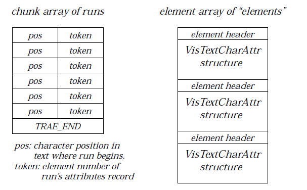
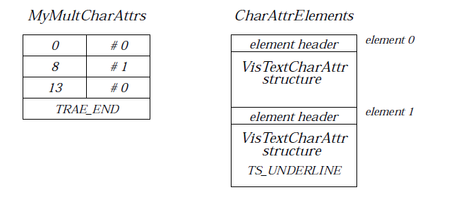

# 10 The Text Objects
Text support is one of the integral and most important pieces of the GEOS 
system software. Many text formatting, editing, publishing, and advanced 
features are built into the system; therefore, many applications will never 
need to deal directly with these issues. The text features of GeoWrite, for 
example, are almost entirely implemented within the text object library.

If your geode will display text, receive text input, or provide any type of text 
formatting features, you should use one of the text objects, either GenText or 
VisText. (If you only need a single-line non-editable text field, you may be 
able to use a simple GenGlyph instead.)

The GenText object is primarily a user interface object, designed to 
communicate directly with the user and accept keyboard input. The VisText 
object is a much more versatile (and complex) object designed not only to 
display text but provide complex formatting and WYSIWYG word processing 
operations.

Both objects make use of common functionality defined within the Text 
Object Library. Therefore, it is important to be familiar with the features and 
standards of that object library before using either GenText or VisText. 
Additionally, if you plan on using your text object to perform any complex 
style sheets, you should be familiar with the chunk array mechanisms, as 
these are widely employed in complex text objects.

## 10.1 The Text Objects
Many applications will require some form of typed input from the user. Some 
will provide text formatting, word processing, or WYSIWYG desktop 
publishing features, and nearly all will have some text-based information 
displayed on the screen. Each of these features can be provided easily with 
either GenText or VisText objects. To use either of these objects, you should 
make sure to include the text library in your geode.

Both the VisText and GenText objects have many common features. Under 
the hood, both the VisText and GenText objects contain similar instance data, 
and both are capable of handling messages from the text object library. Which 
object you use depends on what role you need your text object to assume. 

### 10.1.1 Which Object Should I Use?
The VisText object is the more complex of the two objects. In general, a 
VisText object may exhibit any of the many features present within the text 
object library; the GenText object may only exhibit a subset of this behavior. 
The GenText object is not a low-level object, however; in most cases, 
**GenTextClass** may use most of the messages provided with **VisTextClass**. 
It is only in more complex text operations (such as drawing text to regions or 
incorporating complex graphics into text) that a GenText object is not as 
useful.

Typically, geodes that want full-featured word processing will use a VisText 
object (typically within a scrollable GenView and a VisContent). Simple text 
editing and input (within a database field, for example) are normally done 
with an editable GenText object. For other cases, it is up to you. There are 
advantages to either approach. GenText is easier to use, but VisText is more 
versatile. 

Typically, the makeup of your user interface will decide which text object is 
more appropriate. GenText objects should be attached to the generic tree; 
VisText objects should instead be attached to the visible tree. Most of the 
features listed below are described with respect to VisText objects; in most 
cases, however, they are equally applicable to the GenText.

The main functional difference between a VisText and a GenText object is the 
ability of VisText to use what is known as the large text model. The large 
model allows a text object to define flow regions, provide for text to be stored 
within a VM file, and offers several other rather complex features. This 
behavior is essential for providing complex text formatting features. It is 
usually not required for most text needs, however.

The GenText object does not support this text model. In cases where you feel 
you need to use functionality of the large model, you should use a VisText 
object within a visible tree. Luckily, most of these capabilities are automatic 
when using a VisText object. (You will rarely set up a VisText object already 
using this model, for instance; instead, whenever the VisText is forced to use 
operations requiring the large model, the application will force it to convert 
itself.) 

### 10.1.2 How this Chapter is Organized
This chapter is organized in a special fashion. Not including this section, the 
contents of this chapter are:

**10.2** - A description of some of the more powerful features of the text 
objects.

**10.3** - A complete list of the features defined within the text object 
library, for use with both GenText and VisText.

**10.4** - An in-depth description of the common ways to change text and 
attributes within a text object. These are the most commonly 
used operations for text objects.

**10.5** - A description in detail of the VisText object. 

**10.6** - A description in detail of the GenText object.

**10.7** - A description of the controllers specifically tailored for use with 
the text objects.

If you are using a simple GenText object for getting and setting text, you will 
probably only need to read the in-depth description of how to alter text and 
the GenText section. If you need other functionality, you should probably 
read this chapter straight through.

## 10.2 General Text Features
The Text objects provide a powerful tool for complex text formatting. This 
section describes some of the more powerful features of these text objects.

### 10.2.1 Input Management and Filters

A large portion of the text library is devoted to input management and 
interaction with the UI and the user. Almost every input and display function 
for text is implemented within the text library, relieving your applications 
from containing often complex code. In almost all cases, you will not need to 
know how input is transferred to your text objects. 

The text library handles all keyboard and mouse input to text fields, 
interacting intelligently with the UI to process input events. (This includes 
pen input supported by the input manager and the pen input mechanisms.) 
Selection with the mouse and keyboard is handled automatically, as are 
quick-transfer operations.

Because the text objects understand the focus and target hierarchies of the 
UI, they can interact directly with the controller objects. Applications using 
the text objects don't even have to know when a user has applied a new style, 
changed the paragraph spacing, or set the text color. The user can select text, 
call up the Style menu, and apply a new style without using a line of 
application-specific code. If you wish such behavior to happen automatically, 
you should mark your text object GA_TARGETABLE in its GI_attrs instance 
field.

GEOS also provides filters to text objects; these filters allow the text object to 
selectively intercept and process text as it is being added to a text object 
(usually a GenText), either from direct keyboard typing or from a more 
complex operation (such as a clipboard paste). Filters allow the text object to 
accept or reject text on a number of bases (such as character by character). 

### 10.2.2 Text Flow Through Regions
The text library also allows a continuous stream of text to flow through 
various connected regions. These regions may be of arbitrary size, shape, and 
location, and each region occupies one spot in the text object's region list. The 
text library, once the region list is created, takes care of all text flowing and 
rippling from one region to the next. GenText objects may not implement 
regions, though; ideally their geometry should be left up to the specific UI.

Applications can easily set up regions using the graphics system's path code, 
then add the regions to the text object's region list. These two simple steps 
can result in powerful publishing features such as flowing text around 
graphics and flowing text through arbitrarily-shaped regions. Unusual flow 
patterns are illustrated in Figure 10-1.

**Figure 10-1** *Sample Text Flows*

*Arbitrarily-Shaped Regions*  
*Text can flow from one 
arbitrarily-shaped region to 
another. If the text object's region 
list were [1, 2, B, 3, 4], then text 
would flow from the top of region 1 
to the bottom of region 4 in that 
order. If region A were to have text 
independent of the other regions, it 
would have to be in a different 
VisText object in the same visible 
object tree.*

*Specialized Layouts*  
*Text can flow across pages if 
consecutive regions are on different 
pages. Thus, an application can set 
up flows that automatically 
arrange pages for printing 
pamphlets or books.*

### 10.2.3 Style Sheets
Many word processors and publishing programs today implement styles. A 
style is a set of character and paragraph attributes typically associated with 
a specific name; the user chooses the attributes for the style and then can 
apply that style to any selected text by choosing the associated name. A style 
sheet is a set of styles. Styles can be (and normally are) based on other styles.

Normally, the definition and use of styles is left entirely to the application. In 
GEOS, however, the text library provides a controller object for styles and 
style sheets, so if your application will use style sheets, it can do so without 
needing complex code.

### 10.2.4 Undo
For complex text formatting, the ability to "undo" any changes is nearly a 
necessity. The GEOS text library provides a single-level undo that will work 
with all text-edit objects. This undo may be implemented by either the user 
or the application.

### 10.2.5 General Import and Export
Through the Impex Library, any application using a text object can import 
from and export to many popular word processor formats. You don't have to 
go through the work of creating your own format translator for each 
supported format; any format supported by the Impex Library will 
automatically be supported by your application. (See "Impex Library," 
Chapter 16.) In addition, the Impex Library is designed so users can add new 
translators to the importer/exporter; these translators are then accessible to 
your application without recompiling or upgrading.

### 10.2.6 Geometry Management
The GenText object automatically will interact with its parent generic object 
(usually a GenInteraction or GenPrimary) to provide the proper sizing 
behavior. GenText objects automatically implement their own scrolling when 
necessary, adding horizontal or vertical scrollers as the need arises. 

VisText, however, does not provide automatic scrolling. The VisText may only 
exist as a node in a visible object tree under a VisContent; the content (in 
concert with its parent GenView) will provide whatever scrolling, scaling, 
and sizing that is required.

### 10.2.7 Embedded Graphics and Characters
Every text field with the capability to define regions may contain embedded 
graphics strings. Each graphic appears as a single character within the text, 
and graphics may be pasted in by the user. 

It is also possible to flow text around graphics. The large object model 
provides this feature, but the regular text model does not. Thus, to flow text 
around graphics requires a VisText object set up for large text.

### 10.2.8 Search and Replace
Global search-and-replace functions are included in the text object. GEOS 
provides a standard search-and-replace dialog box that can be called up by 
any text object. The search-and-replace mechanism can work with all text 
objects in the system; if two applications are both using search-and-replace 
at the same time, only one dialog box will appear on the screen. The search 
and replace controller understands which application is the current target of 
the search operations and interacts intelligently with the active applications.

### 10.2.9 Spell-Checking
Like search-and-replace, spell-checking is a function of the text library and 
is available globally to all applications and libraries that use text objects. 
GEOS uses a licensed Houghton-Mifflin dictionary and spell-checking engine; 
this engine as well as the common UI are available to each application and 
library that uses a text object. The spelling checker, like the 
search-and-replace mechanism, interacts intelligently with the text object 
and the UI to ensure that only one spell-check dialog box is on the screen.

The simplest and most efficient way to include spell-checking in your 
application is to include an object of SpellControlClass in your application, 
linking it to the text object to spell-check. This controller is discussed in 
"Search and Replace and Spell-Checking" below.

### 10.2.10 Printing
VisText objects automatically know how to print themselves when sent the 
proper messages. In nearly all cases where printing text is essential, a 
VisText will be included in a visual object tree. Then, when printing occurs, 
the topmost object in the tree (most likely a VisContent) will receive the print 
message; this message will be passed down the tree until all the visual 
objects (including any VisTexts) have printed themselves.

### 10.2.11 Text Controller Objects
As with several other major features of the GEOS user interface, the text 
library has associated controller classes for many features. Because text 
formatting has so many options and choices for the user, providing the 
menus, dialog boxes, and choices can be a lot of work for an application. The 
text controller objects, however, remove nearly all this work while allowing 
applications the full support they require.

Nearly every feature of the text library has one corresponding controller 
object. In addition, master controllers exist to manage other controller 
objects. Therefore, if you use a master controller, other controllers that may 
be added to the text object (by Geoworks) will be automatically included in 
your geode without changing the source code or recompiling.

Using controllers and an editable text object, you can actually create a simple 
but full-featured word processor without writing any code other than UI 
object definitions. Controllers typically work on both GenText or VisText 
objects; whichever text object has the target will receive updates from 
controllers.

## 10.3 The Text Object Library
Both Text Objects rely on a single framework; this framework is the Text 
Object Library. The Text Object Library (**tCommon.h**) contains many 
definitions and structures that text objects will use. Every definition and 
structure in this section can be used by both VisText and GenText objects.

**VisTextClass** is the class that utilizes most of these features directly. 
**GenTextClass** also utilizes almost every one of these features through 
**VisTextClass**. This is because **GenTextClass**, as a generic object, is 
manifested through **VisClass** by specific UI libraries.

The text library also has data structures and mechanisms defined to support 
other features that, due to time constraints, have no strict API definition in 
the library. To provide these "potential features" in your applications, you can 
directly access the text data structures and set them appropriately. (For 
example, automatic paragraph numbering is not directly supported, but the 
paragraph attributes data structures allow defining characters that get 
prepended to individual paragraphs.)

Many of the features are implemented and controlled automatically by 
GEOS. For common features (character styles and font sizes, for example), 
controller objects can handle almost everything. For less common features 
(automatic paragraph numbering, for example), your application will likely 
have to provide the UI and the control mechanisms necessary. 

### 10.3.1 Character Attribute Definitions

The text object library provides a multitude of ways to shape the appearance 
of individual characters. Each character within a text object may even 
exhibit its own individual attributes, if the object is defined to use multiple 
character attributes. The definitions within this section show the full range 
of possibilities for character attributes.

#### 10.3.1.1 The VisTextCharAttr Structure

The **VisTextCharAttr** structure provides a great variety of attributes for 
characters within text objects. Many of the **VisTextCharAttr** fields use 
graphics structures to tailor the appearance of individual characters within 
the text object. You may wish to review the "Graphics Environment," 
Chapter 23 of the Concepts Book chapter to discover the full features of this 
structure.

----------
**Code Display 10-1 The VisTextCharAttr Structure**

    typedef struct {
        StyleSheetElementHeader     VTCA_meta;
        FontID                      VTCA_fontID;
        WBFixed                     VTCA_pointSize;
        TextStyle                   VTCA_textStyles;
        ColorQuad                   VTCA_color;
        sword                       VTCA_trackKerning;
        byte                        VTCA_fontWeight;
        byte                        VTCA_fontWidth;
        VisTextExtendedStyles       VTCA_extendedStyles;
        SystemDrawMask              VTCA_grayScreen;
        GraphicPattern              VTCA_pattern;
        ColorQuad                   VTCA_bgColor;
        SystemDrawMask              VTCA_bgGrayScreen;
        GraphicPattern              VTCA_bgPattern;
        byte                        VTCA_reserved[7];
    } VisTextCharAttr;

----------
*VTCA_meta* stores a **StyleSheetElementHeader**. This structure field 
allows the **VisTextCharAttr** structure to act as an element in an element 
array. For complete information on using character attribute element arrays 
to implement character style runs, see "Character Runs" below.

*VTCA_fontID* stores the **FontID** of the font to be used for this character. Any 
current font allowed by the system is valid. There may exist up to 65536 fonts 
of type **FontID**.

*VTCA_pointSize* stores the point size of the character. This may be any fixed 
point value between 4 and 792.

*VTCA_textStyles* stores the text styles (of type **TextStyle**) to be applied to this 
character. For a list of text styles, see "Graphics Environment," Chapter 23 
of the Concepts Book.

*VTCA_color* stores the current color (of type **ColorQuad**) of the foreground 
text character.

*VTCA_trackKerning* stores the kerning value (either positive or negative) for 
this character. This value is expressed in points and reflects how much extra 
space (if positive) or removal of space (if negative) to apply between this 
character and the next character.

*VTCA_fontWeight* stores the font-weight (thickness) of the character. This 
value is expressed in a (positive or negative) percentage of 256 and is 
independent of the current font in use.

*VTCA_fontWidth* stores the width of the font as a (positive or negative) 
percentage of 256 and is independent of the current font in use.

*VTCA_extendedStyles* stores any **VisTextExtendedStyles** (separate from 
the **TextStyle** in *VTCA_textStyles*) in use by this character. These styles are 
defined in the text object library. See Code Display 10-2 below for a 
list of extended styles.

*VTCA_grayScreen* stores the **SystemDrawMask** to use when displaying this 
text. This mask is applied to the text characters but not to the background. 

*VTCA_pattern* stores the **GraphicPattern** to use when displaying this text. 
This pattern is applied to the text characters but not to the background.

*VTCA_bgColor* stores the background color to apply to the character's 
background (but not to the character itself).

*VTCA_bgGrayScreen* stores the **SystemDrawMask** to apply to the 
character's background.

*VTCA_bgPattern* stores the **GraphicPattern** to apply to the character's 
background.

----------
**Code Display 10-2 VisTextExtendedStyles**

    /* These flags are stored in the VisTextCharAttr entry VTCA_extendedStyles */
    typedef WordFlags VisTextExtendedStyles;
    #define VTES_BOXED              0x8000
    #define VTES_BUTTON             0x4000
    #define VTES_INDEX              0x2000
    #define VTES_ALL_CAP            0x1000
    #define VTES_SMALL_CAP          0x0800
    #define VTES_HIDDEN             0x0400
    #define VTES_CHANGE_BAR         0x0200
    #define VTES_BACKGROUND_COLOR   0x0100

----------
VTES_BOXED draws the character within a box (a rectangle surrounding the 
character). If consecutive characters are marked VTES_BOXED they will all 
be drawn within a single rectangular outline.

VTES_BUTTON frames the text characters within a drop shadow. Consecutive 
characters marked VTES_BUTTON will be framed within a single 
drop-shadow.

VTES_INDEX marks the character for indexing purposes. This feature is 
currently not implemented.

VTES_ALL_CAP indicates that the character should be capitalized in the 
current point size. 

VTES_SMALL_CAP indicates that the character should be capitalized, but at 
a smaller point size.

VTES_HIDDEN indicates that this character acts as hidden text. Hidden text 
may exhibit special properties (such as being masked out when printing). 

VTES_CHANGE_BAR is currently unimplemented.

VTES_BACKGROUND_COLOR indicates that this character exhibits a special 
background color.

#### 10.3.1.2 Default Character Attributes

You may decide that you do not need your characters to exhibit the many 
attributes available within the **VisTextCharAttr** structure. If your text 
object is simple, you may want instead to use the default character attributes 
provided in the text object library. These default attributes supersede the use 
of the **VisTextCharAttr** structure. All of these attributes will fit into a single 
word record.

The **VisTextDefaultCharAttr** record allows your text object to exhibit three 
styles (underline, bold, and italic), 16 color indexes of type **Color**, eight point 
sizes, and 32 different fonts. 

----------
**Code Display 10-3 VisTextDefaultCharAttr**

    typedef WordFlags VisTextDefaultCharAttr;
    #define VTDCA_UNDERLINE     0x8000
    #define VTDCA_BOLD          0x4000
    #define VTDCA_ITALIC        0x2000
    #define VTDCA_COLOR         0x0f00  /* Color */
    #define VTDCA_SIZE          0x00e0  /* VisTextDefaultSize */
    #define VTDCA_FONT          0x001f  /* VisTextDefaultFont */

    #define VTDCA_COLOR_OFFSET          8
    #define VTDCA_SIZE_OFFSET           5
    #define VTDCA_FONT_OFFSET           0

    typedef ByteEnum VisTextDefaultSize;
        #define     VTDS_8  0       /* Point size of 8 */
        #define     VTDS_9  1       /* Point size of 9 */
        #define     VTDS_10 2       /* Point size of 10 */
        #define     VTDS_12 3       /* Point size of 12 */
        #define     VTDS_14 4       /* Point size of 14 */
        #define     VTDS_18 5       /* Point size of 18 */
        #define     VTDS_24 6       /* Point size of 24 */
        #define     VTDS_36 7       /* Point size of 36 */

    typedef ByteEnum VisTextDefaultFont;
        #define     VTDF_BERKELEY   0       /* Berkeley Font */
        #define     VTDF_CHICAGO    1       /* Chicago Font */
        #define     VTDF_BISON      2       /* Bison Font */
        #define     VTDF_WINDOWS    3       /* Windows Font */
        #define     VTDF_LED        4       /* LED Font */
        #define     VTDF_ROMA       5       /* Roma Font */
        #define     VTDF_UNIVERSITY 6       /* University Font */
        #define     VTDF_URW_ROMAN  7       /* URW Roman Font */
        #define     VTDF_URW_SANS   8       /* URW Sans Font */
        #define     VTDF_URW_MONO   9       /* URW Mono Font */
        #define     VTDF_URW_SYMBOLPS 10    /* URW Symbols Font */
        #define     VTDF_CENTURY_SCHOOLBOOK 11  /* Century Schoolbook Font */

    #define VIS_TEXT_INITIAL_CHAR_ATTR \
            ((VTDS_12 << VTDCA_SIZE_OFFSET) || VTDF_BERKELEY)

----------
#### 10.3.1.3Macros for Defining VisTextCharAttr Structures

The text object library also provides several macros to make the definition of 
the **VisTextCharAttr** structure simpler. These macros are listed in Code 
Display 10-4. In many cases, these macros make the definition of character 
style runs vastly easier.

----------
**Code Display 10-4 VisTextCharAttr Macros**

    #define CHAR_ATTR_STYLE_FONT_SIZE_STYLE_COLOR(ref, style, font, psize, tstyle, \ 
    color) { \
        {{{ref, 0}}, style}, font, {0, psize}, tstyle, \
            {color, CF_INDEX, 0, 0}, 0, FWI_MEDIUM, FW_NORMAL, 0, SDM_100, {0}, \
            {C_WHITE, CF_INDEX, 0, 0}, SDM_0, {0}, {0, 0, 0, 0, 0, 0, 0}}

    #define CHAR_ATTR_FONT_SIZE_STYLE(font, psize, tstyle) \
            CHAR_ATTR_STYLE_FONT_SIZE_STYLE_COLOR(2, CA_NULL_ELEMENT, font, \
                        psize, tstyle, C_BLACK)

    #define CHAR_ATTR_FONT_SIZE(font, psize) \
            CHAR_ATTR_STYLE_FONT_SIZE_STYLE_COLOR(2, CA_NULL_ELEMENT, font, \
                        psize, 0, C_BLACK)

----------
### 10.3.2 Paragraph Attribute Definitions

The text object library also provides many ways to shape the appearance of 
individual paragraphs. Each paragraph within a text object may exhibit its 
own individual attributes if the text object is set to allow multiple paragraph 
attributes. The definitions within this section show the full range of 
possibilities for paragraph attributes.

#### 10.3.2.1 The VisTextParaAttr Structure

The **VisTextParaAttr** structure provides the largest set of attributes for use 
by paragraphs within text objects. These entries are listed in Code 
Display 10-5. Comments follow the code display.

----------
**Code Display 10-5 VisTextParaAttr**

    typedef struct {
        StyleSheetElementHeader     VTPA_meta;
        VisTextParaBorderFlags      VTPA_borderFlags;
        ColorQuad                   VTPA_borderColor;
        VisTextParaAttrAttributes   VTPA_attributes;
        word                        VTPA_leftMargin;
        word                        VTPA_rightMargin;
        word                        VTPA_paraMargin;
        BBFixedAsWord               VTPA_lineSpacing;
        word                        VTPA_leading;
        BBFixedAsWord               VTPA_spaceOnTop;
        BBFixedAsWord               VTPA_spaceOnBottom;
        ColorQuad                   VTPA_bgColor;
        byte                        VTPA_numberOfTabs;
        byte                        VTPA_borderWidth;
        byte                        VTPA_borderSpacing;
        byte                        VTPA_borderShadow;
        SystemDrawMask              VTPA_borderGrayScreen;
        SystemDrawMask              VTPA_bgGrayScreen;
        HatchPattern                VTPA_borderHatch;
        HatchPattern                VTPA_bgHatch;
        word                        VTPA_defaultTabs;
        word                        VTPA_startingParaNumber;
        char                        VTPA_prependChars[4];
        VisTextHyphenationInfo      VTPA_hyphenationInfo;
        VisTextKeepInfo             VTPA_keepInfo;
        VisTextDropCapInfo          VTPA_dropCapInfo;
        word                        VTPA_nextStyle;
        StandardLanguage            VTPA_language;
        byte                        VTPA_reserved[15];
    } VisTextParaAttr;

----------
*VTPA_meta* stores a **StyleSheetElementHeader**. This structure field allows 
the **VisTextParaAttr** structure to act as an element in an element array. For 
complete information on using paragraph attribute element arrays to 
implement paragraph style runs, see "Paragraph Runs" on page 646.

*VTPA_borderFlags* stores the **VisTextParaBorderFlags** to use in drawing 
any borders around the text paragraph.

*VTPA_borderColor* stores the color (of type **ColorQuad**) of the border. 

*VTPA_attributes* stores the **VisTextParaAttrAttributes** to use on this 
paragraph. These attributes specify whether the paragraph uses keep-with, 
drop caps, automatic hyphenation, or paragraph numbering.

*VTPA_leftMargin* stores the left margin of the paragraph. This margin is the 
distance (offset in points) from the left edge of the text object.

*VTPA_rightMargin* stores the right margin of the paragraph. This margin is 
the distance (offset in points) from the right edge of the text object.

*VTPA_paraMargin* stores the paragraph margin. This margin is the 
additional distance (offset in points from the left margin) to indent the first 
line of a paragraph.

*VTPA_lineSpacing* stores the distance between lines of the paragraph. 
Single-spacing (a VTPA_lineSpacing of 1.0) is the default value. 

*VTPA_leading* stores the leading of the paragraph. Leading is the additional 
space between all lines of a paragraph, independent of line spacing. This 
value is expressed in points.

*VTPA_spaceOnTop* stores the additional vertical distance (expressed in 
points) before the first line of the paragraph. *VTPA_spaceOnTop* plus 
*VTPA_spaceOnBottom* is the total vertical distance between paragraphs.

*VTPA_spaceOnBottom* stores the additional vertical distance (expressed in 
points) after the last line of the paragraph. *VTPA_spaceOnTop* plus 
*VTPA_spaceOnBottom* is the total vertical distance between paragraphs.

*VTPA_bgColor* stores the background color (of type **ColorQuad**) of the 
paragraph. Note this is different from the background color of an individual 
character (in *VTCA_bgColor*). The background color of a character, if any, 
takes precedence over the background color of a paragraph.

*VTPA_numberOfTabs* stores the number of tab stops contained in this 
paragraph. Tabs are added at the end of the **VisTextParaAttr** structure. 
Therefore, this structure may be of variable size, depending on the number 
of tabs.

*VTPA_borderWidth* stores the width (in units of eight pixels) of the border, if 
any, attached to this paragraph.

*VTPA_borderSpacing* stores the spacing (in units of eight pixels) between the 
paragraph border, if any, and the paragraph itself.

*VTPA_borderShadow* stores the distance (in units of eight pixels) of the 
border shadow, if any, from the main border. 

*VTPA_borderGrayScreen* stores the **SystemDrawMask** to use when drawing 
the paragraph border.

*VTPA_bgGrayScreen* stores the **SystemDrawMask** to use when drawing the 
paragraph background.

*VTPA_borderHatch* stores **HatchPattern** to use when drawing the border.

*VTPA_bgHatch* stores the **HatchPattern** to use when drawing the 
background.

*VTPA_defaultTabs* stores the spacing for default tabs.

*VTPA_startingParaNumber* stores the sequential number of this paragraph. 
This value depends on the **VisTextNumberType** in *VTPA_attributes*.

*VTPA_prependChars* stores the characters (up to four) to prepend to the 
beginning of this paragraph. 

*VTPA_hyphenationInfo* stores the **VisTextHyphenationInfo** (see below) to 
use between lines of text within a paragraph.

*VTPA_keepInfo* stores the **VisTextKeepInfo** (see below) to use between this 
and other paragraphs.

*VTPA_dropCapInfo* stores the **VisTextDropCapInfo** (see below) to use at 
the start of this paragraph.

*VTPA_nextStyle* and *VTPA_language* represent text attributes that are 
currently unimplemented but will be added.

*VTPA_reserved* reserves fifteen bytes of data at the end of the 
**VisTextParaAttr** structure. These bytes are used to designate extra tabs.

----------
**Code Display 10-6 VisTextParaBorderFlags**

    typedef WordFlags VisTextParaBorderFlags;
    #define VTPBF_LEFT              0x8000
    #define VTPBF_TOP               0x4000
    #define VTPBF_RIGHT             0x2000
    #define VTPBF_BOTTOM            0x1000
    #define VTPBF_DOUBLE            0x0800
    #define VTPBF_DRAW_INNER_LINES  0x0400
    #define VTPBF_SHADOW            0x0200
    #define VTPBF_ANCHOR            0x0003 /* ShadowAnchor */

    #define VTPBF_ANCHOR_OFFSET             0

    typedef ByteEnum ShadowAnchor;
    #define SA_TOP_LEFT         0
    #define SA_TOP_RIGHT        1
    #define SA_BOTTOM_LEFT      2
    #define SA_BOTTOM_RIGHT     3

----------
The **VisTextParaBorderFlags** specify the manner in which a border should 
be drawn around the paragraph. 

VTPBF_LEFT, VTPBF_TOP, VTPBF_RIGHT, and VTPBF_BOTTOM all specify 
whether their respective side is drawn with a border. If you wish a border to 
entirely surround the text object, you should set all of these flags.

VTPBF_DOUBLE specifies that there should be a two-line border around this 
paragraph. This flag will double any lines set to be drawn with VTPBF_LEFT, 
VTPBF_TOP, VTPBF_RIGHT, and VTPBF_BOTTOM.

VTPBF_DRAW_INNER_LINES draws lines between bordered paragraphs. If 
two consecutive paragraphs are marked with this flag, a line border will be 
drawn between them.

VTPBF_SHADOW specifies that the border should be shadowed. The direction 
of shadowing is specified in the VTPBF_ANCHOR flag. 

VTPBF_ANCHOR specifies the **ShadowAnchor** to use if drawing a border 
shadow. The **ShadowAnchor** specifies the corner of the paragraph to anchor 
the shadow. The shadowing effect on the paragraph will proceed from this 
corner towards the opposite corner.

----------
**Code Display 10-7 VisTextNumberType**

    typedef ByteEnum VisTextNumberType;
    #define VTNT_NUMBER                 0
    #define VTNT_LETTER_UPPER_A         1
    #define VTNT_LETTER_LOWER_A         2
    #define VTNT_ROMAN_NUMERAL_UPPER    3
    #define VTNT_ROMAN_NUMERAL_LOWER    4

----------
The **VisTextNumberType** specifies the paragraph numbering scheme for 
this paragraph. For each paragraph with a numbering type, the object will 
number that paragraph sequentially based on the last occurrence of a 
paragraph with the same type. The text object stores this sequential number 
in the *VTPA_startingParaNumber* entry. 

----------
**Code Display 10-8 VisTextParaAttrAttributes**

    typedef WordFlags VisTextParaAttrAttributes;
    #define VTPAA_JUSTIFICATION             0xc000
    #define VTPAA_KEEP_PARA_WITH_NEXT       0x2000
    #define VTPAA_KEEP_PARA_TOGETHER        0x1000
    #define VTPAA_ALLOW_AUTO_HYPHENATION    0x0800
    #define VTPAA_DISABLE_WORD_WRAP         0x0400
    #define VTPAA_COLUMN_BREAK_BEFORE       0x0200
    #define VTPAA_PARA_NUMBER_TYPE          0x01c0
    #define VTPAA_DROP_CAP                  0x0020
    #define VTPAA_KEEP_LINES                0x0010

    #define VTPAA_JUSTIFICATION_OFFSET      14
    #define VTPAA_PARA_NUMBER_TYPE_OFFSET   5

----------
VTPAA_JUSTIFICATION stores the **Justification** to use with this paragraph.

VTPAA_KEEP_PARA_WITH_NEXT ensures that this paragraph and the next 
one will not be split along page breaks.

VTPAA_KEEP_PARA_TOGETHER ensures that the entire paragraph will not 
be split along page breaks. In most cases, this will cause a paragraph capable 
of being split to appear at the top of the next page. 

VTPAA_ALLOW_AUTO_HYPHENATION allows the paragraph to 
automatically hyphenate words that cross line breaks. If this flag is set, the 
entry *VTPA_hyphenationInfo* will store the **VisTextHyphenationInfo** to use 
when hyphenating words.

VTPAA_DISABLE_WORD_WRAP disables automatic word wrapping. Each line 
break will immediately wrap to next line without keeping words together. 

VTPAA_PARA_NUMBER_TYPE stores the **VisTextParaType** for this 
paragraph. The actual paragraph number is stored in the 
*VTPA_startingParaNumber* entry. The paragraph number type in tandem 
with the paragraph number determines what number heading this 
paragraph will have.

VTPAA_DROP_CAP signifies that a this paragraph uses Drop Caps. If this flag 
is set, the **VisTextParaAttr** entry *VTPA_dropCapInfo* stores the 
**VisTextParaDropCapInfo** (see below).

VTPAA_KEEP_LINES specifies that this paragraph should make sure that 
beginning or ending lines of certain lengths should not be allowed to stand 
alone. If this flag is set, the **VisTextParaAttr** entry *VTCA_keepInfo* stores 
the **VisTextKeepInfo** (see below).

----------
**Code Display 10-9 VisTextHyphenationInfo**

    typedef WordFlags VisTextHyphenationInfo;
    #define VTHI_HYPHEN_MAX_LINES               0xf000
    #define VTHI_HYPHEN_SHORTEST_WORD           0x0f00
    #define VTHI_HYPHEN_SHORTEST_PREFIX         0x00f0
    #define VTHI_HYPHEN_SHORTEST_SUFFIX         0x000f

    #define VTHI_HYPHEN_MAX_LINES_OFFSET            12
    #define VTHI_HYPHEN_SHORTEST_WORD_OFFSET         8
    #define VTHI_HYPHEN_SHORTEST_PREFIX_OFFSET       4
    #define VTHI_HYPHEN_SHORTEST_SUFFIX_OFFSET       0

----------
If the *VTPA_attributes* flag VTPAA_ALLOW_AUTO_HYPHENATION is set, 
**VisTextHyphenationInfo** stores the criteria to use when hyphenating 
words in *VTPA_hyphenationInfo*. If hyphenation is set, words will be 
automatically hyphenated using a Houghton-Mifflin engine. 

VTHI_SHORTEST_WORD sets the shortest word-length (in character counts) 
to hyphenate. Words shorter than this character count will be wrapped to the 
next line. 

VTHI_SHORTEST_PREFIX and VTHI_SHORTEST_SUFFIX set the shortest 
prefix and suffix to leave on a line after hyphenation. Prefixes or suffixes 
shorter than this character count will be tied to the main word and wrapped, 
if necessary.

----------
**Code Display 10-10 VisTextKeepInfo**

    typedef ByteFlags VisTextKeepInfo;
    #define VTKI_TOP_LINES              0xf0
    #define VTKI_BOTTOM_LINES           0x0f

    #define VTKI_TOP_LINES_OFFSET       4
    #define VTKI_BOTTOM_LINES_OFFSET    0

----------
If the *VTPA_attributes* flag VTPAA_KEEP_LINES is set, **VisTextKeepInfo** 
specifies the number of lines at the beginning and end of a paragraph that 
should not remain across page breaks. This prevents "widows" and 
"orphans" - single lines either at the end of one page or the beginning of 
another.

VTKI_TOP_LINES specifies the minimum number of lines at the beginning of 
a paragraph to be considered able to stand alone and not kept part of the 
main paragraph along a page break.

VTKI_BOTTOM_LINES specifies the minimum number of lines at the end of a 
paragraph to be considered able to stand alone and not kept part of the main 
paragraph along a page break.

For example, if VTKI_BOTTOM_LINES is set to three, then single or double 
lines will not be able to stand on their own at the top of a page, and either the 
orphans will be kept with the main paragraph or additional line(s) will be 
brought over from the preceding page to pad the next page.

----------
**Code Display 10-11 VisTextDropCapInfo**

    typedef WordFlags VisTextDropCapInfo;
    #define VTDCI_CHAR_COUNT            0xf000
    #define VTDCI_LINE_COUNT            0x0f00
    #define VTDCI_POSITION              0x00f0

    #define VTDCI_CHAR_COUNT_OFFSET         12
    #define VTDCI_LINE_COUNT_OFFSET         8
    #define VTDCI_POSITION_OFFSET           4

----------
If the *VTPA_attributes* flag VTPAA_DROP_CAP is set, **VisTextDropCapInfo** 
specifies the criteria to use when implementing Drop Caps. Drop Caps are 
currently not implemented in GEOS though they will be supported for later 
releases.

VTDCI_CHAR_COUNT sets the number of characters to capitalize at the start 
of the paragraph before resuming normal capitalization.

VTDCI_LINE_COUNT sets the number of lines to capitalize at the start of a 
paragraph before resuming normal capitalization.

----------
**Code Display 10-12 Tabs**

    typedef ByteEnum TabLeader;
    #define TL_NONE         0
    #define TL_DOT          1
    #define TL_LINE         2
    #define TL_BULLET       3
    #define TL_GRAY_LINE    4

    typedef ByteEnum TabType;
    #define TT_LEFT         0
    #define TT_CENTER       1
    #define TT_RIGHT        2
    #define TT_ANCHORED     3

    typedef ByteFlags TabAttributes;
    #define TA_LEADER       0x1c        /* TabLeader */
    #define TA_TYPE         0x03        /* TabType */

    #define TA_LEADER_OFFSET    2
    #define TA_TYPE_OFFSET      

    typedef struct {
        word            T_position;
        TabAttributes   T_attr;         /* TabAttributes */
        SystemDrawMask  T_grayScreen;
        byte            T_lineWidth;
        byte            T_lineSpacing;
        word            T_anchor;
    } Tab;

    typedef struct {
        VisTextParaAttr     VTMPA_paraAttr;
        Tab                 VTMPA_tabs[VIS_TEXT_MAX_TABS];
    } VisTextMaxParaAttr;

----------
The **Tab** structure allows your paragraph to add custom tab stops to a 
paragraph. These tabs are in addition to any default tab stops that are 
defined in *VTPA_defaultTabs*. You may add up to 25 custom tabs to each 
paragraph. These tabs are added at the end of the **VisTextParaAttr** 
structure. Therefore, different paragraphs may have paragraph attributes of 
different lengths depending on the number of custom tabs in use by that 
paragraph.

#### 10.3.2.2 Default Paragraph Attributes

You may decide that you do not need many of the features within the 
**VisTextParaAttr** structure in your paragraphs. If your text object is simple, 
you may want to use a set of default paragraph attributes provided in the text 
object library. These default attributes supersede the use of the 
**VisTextParaAttr** structure. All of these attributes will fit into a single word 
record of type **VisTextDefaultParaAttr**.

The **VisTextDefaultParaAttr** structure allows your text object to exhibit a 
Justification, a subset of default tabs, and left, right, and paragraph 
margins.

----------
**Code Display 10-13 VisTextDefaultParaAttr**

    typedef WordFlags VisTextDefaultParaAttr;
    #define VTDPA_JUSTIFICATION             0xc000 /* Justification */
    #define VTDPA_DEFAULT_TABS              0x3000 /* VisTextDefaultTab */
    #define VTDPA_LEFT_MARGIN               0x0f00 /* In units of half-inches */
    #define VTDPA_PARA_MARGIN               0x00f0 /* In units of half-inches */
    #define VTDPA_RIGHT_MARGIN              0x000f /* In units of half-inches */

    #define VTDPA_JUSTIFICATION_OFFSET          14
    #define VTDPA_DEFAULT_TABS_OFFSET           12
    #define VTDPA_LEFT_MARGIN_OFFSET            8
    #define VTDPA_PARA_MARGIN_OFFSET            4
    #define VTDPA_RIGHT_MARGIN_OFFSET           0

    #define VIS_TEXT_INITIAL_PARA_ATTR ( (0*2) << VTDPA_LEFT_MARGIN_OFFSET) | \
                ( (0*2) << VTDPA_PARA_MARGIN_OFFSET) | \
                ( (0*2) << VTDPA_RIGHT_MARGIN_OFFSET) | \
                (VTDDT_INCH << VTDPA_DEFAULT_TABS_OFFSET) | \
                (J_LEFT << VTDPA_JUSTIFICATION_OFFSET)

    typedef ByteEnum VisTextDefaultDefaultTab;
    #define VTDDT_NONE              0
    #define VTDDT_HALF_INCH         1
    #define VTDDT_INCH              2
    #define VTDDT_CENTIMETER        3

----------
The **VisTextDefaultDefaultTab** type is solely for use within a 
**VisTextDefaultParaAttr** record. The default tab stops provide either no 
tab stops (VTDDT_NONE) or tab stops every half-inch, centimeter, or inch. 
Note that no other application-defined tabs are allowed when using the 
default paragraph attributes.

### 10.3.2.3 Macros for Defining VisTextParaAttr Structures
The text object library also provides a macro to make the definition of the 
**VisTextParaAttr** structure simpler; there are also a few macros to aid in 
setting up justification and tab structures. These macros are listed in Code 
Display 10-14. In many cases, these macros make the definition of paragraph 
style runs vastly easier.

----------
**Code Display 10-14 VisTextParaAttr Macros**

    #define PARA_ATTR_STYLE_JUST_LEFT_RIGHT_PARA(ref, style, just, left, right, para)\
    { \
            {{{ref, 0}}, style}, 0, {C_BLACK, CF_INDEX, 0, 0}, \
            just << VTPAA_JUSTIFICATION_OFFSET, (left)*PIXELS_PER_INCH, \
            (right)*PIXELS_PER_INCH, (para)*PIXELS_PER_INCH, \
            1<<8, 0, 0, 0, {C_WHITE, CF_INDEX, 0, 0}, \
            0, 1*8, 2*8, 1*8, SDM_100, SDM_0, {0}, {0}, \
            PIXELS_PER_INCH/2*8, VIS_TEXT_DEFAULT_STARTING_NUMBER, "", 0, 0, 0,
            CA_NULL_ELEMENT, SL_ENGLISH, {0,0,0,0,0,0,0,0,0,0,0,0,0,0,0}}

    #define DEF_PARA_ATTR_JUST_TABS(just, tabs) \
            (( (0*2) << VTDPA_LEFT_MARGIN_OFFSET ) | \
             ( (0*2) << VTDPA_PARA_MARGIN_OFFSET ) | \
             ( (0*2) << VTDPA_RIGHT_MARGIN_OFFSET ) | \
             ( (tabs) << VTDPA_DEFAULT_TABS_OFFSET ) | \
             ( (just) << VTDPA_JUSTIFICATION_OFFSET ))

    #define DEF_PARA_ATTR_CENTER DEF_PARA_ATTR_JUST_TABS(J_CENTER, VTDDT_INCH)

    #define DEF_PARA_ATTR_RIGHT DEF_PARA_ATTR_JUST_TABS(J_RIGHT, VTDDT_INCH)

----------
### 10.3.3 Storage Flags

As you have seen, the Text Object Library provides a multitude of character 
and paragraph attributes to use in the display of text. The library also 
provides a number of different subsets of attributes and ways to store these 
attributes.

A simple text object may only need a 16-bit record (such as 
**VisTextDefaultCharAttr** or **VisTextDefaultParaAttr**) to store its text 
attributes; a highly complex text object may need a chunk array of several 
30+ byte elements. The manner in which these attributes are stored is 
specified in the **VisTextStorageFlags** of the text object.

----------
**Code Display 10-15 VisTextStorageFlags**

    typedef ByteFlags VisTextStorageFlags;
    #define VTSF_LARGE                  0x80
    #define VTSF_MULTIPLE_CHAR_ATTRS    0x40
    #define VTSF_MULTIPLE_PARA_ATTRS    0x20
    #define VTSF_TYPES                  0x10
    #define VTSF_GRAPHICS               0x08
    #define VTSF_DEFAULT_CHAR_ATTR      0x04
    #define VTSF_DEFAULT_PARA_ATTR      0x02
    #define VTSF_STYLES                 0x01

----------
VTSF_LARGE  
This flag states that this text object is using the large model for 
its data. In this case, the rest of the settings in 
**VisTextStorageFlags** are ignored. The large model is a highly 
complex text formatting tool; you should avoid it entirely until 
you are familiar with other aspects of the text object.

VTSF_MULTIPLE_CHAR_ATTRS  
This flag specifies that the text may display multiple character 
attributes. Each character may then display its own character 
attributes independent of other characters. If this flag is set, 
VTSF_DEFAULT_CHAR_ATTRS must be not set.

VTSF_MULTIPLE_PARA_ATTRS  
This flag specifies that the text may display multiple 
paragraph attributes. Each paragraph may then display its 
own attributes independent of other paragraphs. If this flag is 
set, VTSF_DEFAULT_PARA_ATTRS must not be set.

VTSF_TYPES  
This flag specifies that this text object contains a types run.

VTSF_GRAPHICS  
This flag specifies that this text object contains a graphics run.

VTSF_DEFAULT_CHAR_ATTRS  
This flag specifies that this text object only uses a set of 
provided default character attributes. These default attributes 
are represented by a record of type 
**VisTextDefaultCharAttrs**. If this flag is not set, the text 
object will use the larger **VisTextCharAttr** structure to store 
its character attributes instead.

VTSF_DEFAULT_PARA_ATTRS  
This flag specifies that this text object only uses a set of 
provided default paragraph attributes. These default 
attributes are represented by a record of type 
**VisTextDefaultParaAttrs**. If this flag is not set, the text 
object will use the larger **VisTextParaAttr** structure to store 
its paragraph attribute.

VTSF_STYLES  
This flag specifies that this text object contains a styles run.

## 10.4 Text Object Chunks
Each text object contains several instance fields that may reference outside 
chunks. Most non-large text objects will reference the following chunks:

+ A text chunk containing the string of text for that object.

+ A lines/fields chunk containing internal information about the length 
and position of lines and tab fields.

+ A character attributes chunk, containing either a single 
**VisTextCharAttr** structure or (for multiple character attributes) a list 
of **VisTextCharAttr** structures.

+ A paragraph attributes chunk, containing either a single 
**VisTextParaAttr** structure or (for multiple paragraph attributes) a list 
of **VisTextParaAttr** structures.

+ For multiple character attributes, a chunk of character attribute runs, 
referencing the list of **VisTextCharAttr** structures above.

+ For multiple paragraph attributes, a chunk of paragraph attribute runs, 
referencing the list of **VisTextParaAttr** structures above.

The Text Object Library provides many other features, but these are the most 
often-used and difficult to master. You should have a complete grasp of these 
mechanisms before using either VisText or GenText. To make their use 
easier, both objects use these features in essentially the same manner.

### 10.4.1 The Text
The most important data associated with a text object is the text itself. The 
text of all non-large Text Objects is stored within a single chunk; this chunk 
is located in the same resource as the object itself. Text objects contain an 
instance field with a ChunkHandle to this text chunk. (In GenText objects, 
this is the instance field *GTXI_text*; in VisText objects, this is *VTI_text*.)

Unless your text object uses the complex large model, it stores all of its text 
within this chunk. You may set initial text for your text object to appear 
within its instance data. The text object library automatically handles 
keyboard input from the user and translates that into characters displayed 
within the text object, altering the contents of the text chunk at the same 
time. 

The text within the chunk is represented by a null-terminated character 
string. Each character of the text occupies a zero-based position within the 
text field. (The first character in the text field is at position zero.) These 
character positions are useful for setting character and paragraph attributes, 
marking the current selection, and marking the insertion point for new text.

The text object library provides a number of operations that you can perform 
to alter the display of text. These messages may take text from a variety of 
sources and include it within your text object; alternatively, you may retrieve 
text from your object and send it to other objects or processes.

Though the text within a non-large text object will always reside in a chunk 
(and may therefore be referenced with an optr) text may come from (and go 
to) several different sources. If you intend to retrieve text from or send text 
to a text object, you must know what type of source (or destination) you are 
dealing with.

Typically, text outside of a text object will reside in one of the following six 
forms. The first two cases are the most common. 

+ A pointer to null terminated text string.

+ An optr to a chunk. (This is the same format the text object itself stores 
its text.)

+ A handle of a global memory block.

+ A handle of a VM block.

+ A database item.

+ A huge array.

For each operation on a text object, the text object library provides specific 
messages tailored to the format you are retrieving text from or transferring 
text to.

#### 10.4.1.1 Text Ranges
    VisTextRange, MSG_VIS_TEXT_GET_RANGE, VisTextRangeContext, 
    MSG_VIS_TEXT_GET_TEXT_SIZE

Frequently, your application may wish to specify a range of text to act on. 
This range specifies the starting and ending points within the text for the 
relevant operation. Each of these starting and ending points is a zero-based 
character position. 

    typedef struct {
        dword   VTR_start;
                /* starting character position */
        dword   VTR_end;
                /* ending character position */
    } VisTextRange;

To select a starting point at the first character, set VTR_start to zero. To select 
an ending point at the last character, set VTR_end to the special constant 
TEXT_ADDRESS_PAST_END.

If you want to pass the current selection as a range in any message that 
demands a **VisTextRange**, pass VIS_TEXT_RANGE_SELECTION to indicate 
that the currently selected area should be used to specify the range. Note that 
for some operations (such as paragraph attribute changes) the affected area 
may be larger than the text selection. Pass 
VIS_TEXT_RANGE_PARAGRAPH_SELECTION if you want the currently 
selected area to be used after it has been adjusted to reflect its paragraph 
boundaries.

You can use MSG_VIS_TEXT_GET_RANGE to return an actual VisTextRange 
of the selection (or paragraph selection). Pass this message a 
**VisTextRangeContext**, which specifies whether the range will include just 
the selection or kick out the range to its paragraph boundaries.

    typedef WordFlags VisTextRangeContext;
    #define VTRC_PARAGRAPH_CHANGE               0x8000
    #define VTRC_CHAR_ATTR_CHANGE               0x4000
    #define VTRC_PARA_ATTR_BORDER_CHANGE        0x2000

MSG_VIS_TEXT_GET_TEXT_SIZE returns the total size of the text within the 
text object.

----------
#### MSG_VIS_TEXT_GET_RANGE
    void    MSG_VIS_TEXT_GET_RANGE(
            VisTextRange    *range,
            word            context);

This message fills in a **VisTextRange** buffer based on the selection criteria 
passed in the context argument. The context information specifies whether 
the range will be used for a character attribute change (in which case the 
normal selection positions will be used) or whether the range will be used for 
a paragraph attribute change (in which case the boundaries of the selection 
will be kicked out to paragraph boundaries).

**Source:** Unrestricted.

**Destination:** Any text object.

**Parameters:**  
*range* - Buffer to hold the range text positions returned 
from the message handler.

*context* - **VisTextRangeContext**.

**Return:** The **VisTextRange** buffer filled in.

**Interception:** Generally not intercepted.

----------
#### MSG_VIS_TEXT_GET_TEXT_SIZE
    dword   MSG_VIS_TEXT_GET_TEXT_SIZE();

This message returns the current size of text.

**Source:** Unrestricted.

**Destination:** Any text object.

**Return:** The size of the text within the text object.

**Interception:** Generally not intercepted.

#### 10.4.1.2 Replacing Text All At Once

    MSG_VIS_TEXT_REPLACE_ALL_PTR, 
    MSG_VIS_TEXT_REPLACE_ALL_OPTR, 
    MSG_VIS_TEXT_REPLACE_ALL_BLOCK, 
    MSG_VIS_TEXT_REPLACE_ALL_VM_BLOCK, 
    MSG_VIS_TEXT_REPLACE_ALL_DB_ITEM, 
    MSG_VIS_TEXT_REPLACE_ALL_HUGE_ARRAY

You may replace the text displayed within a Text Object all at once with the 
following messages. Any previous text within the text object will be replaced 
with new text. The new text may come from any of the formats previously 
described. The format of this source determines which message you should 
use to replace the text.

MSG_VIS_TEXT_REPLACE_ALL_PTR replaces the text with text referenced by 
a simple pointer to a text string.

MSG_VIS_TEXT_REPLACE_ALL_OPTR replaces the text with text referenced 
by an optr. (This is the format that non-large text objects store their text.)

MSG_VIS_TEXT_REPLACE_ALL_BLOCK replaces the text with text residing 
in a global memory block.

MSG_VIS_TEXT_REPLACE_ALL_VM_BLOCK replaces the text with text 
residing in a VM block. Text objects that use the large model usually store 
their text within a VM block, so this message is useful for transferring text 
from one VisText object to another, for example.

MSG_VIS_TEXT_REPLACE_ALL_DB_ITEM replaces the text with text from a 
database item.

MSG_VIS_TEXT_REPLACE_ALL_HUGE_ARRAY replaces the text with text 
from a huge array.

----------
#### MSG_VIS_TEXT_REPLACE_ALL_PTR
    void    MSG_VIS_TEXT_REPLACE_ALL_PTR(
            const char      *text, 
            word            textLen);

This message replaces the text string within a text object (either a VisText or 
a GenText object) with the text referenced by the passed pointer. 

**Source:** Unrestricted.

**Destination:** Any GenText or VisText object.

**Parameters:**  
*text* - A pointer to a text string.

*textLen* - The text length (in characters) or zero if 
null-terminated.

**Return:** Nothing. The Text object's text is replaced. 

**Interception:** Generally not intercepted.

----------
#### MSG_VIS_TEXT_REPLACE_ALL_OPTR
    void    MSG_VIS_TEXT_REPLACE_ALL_OPTR(
            optr    o,
            word    textLen);

This message replaces the text string within a text object (either a VisText or 
a GenText) with the text referenced by the passed optr. 

**Source:** Unrestricted.

**Destination:** Any GenText or VisText object.

**Parameters:**  
*o* - The optr of the chunk containing the text.

*textLen* - Length of the text string or zero if null-terminated.

**Return:** Nothing. The text object's text is replaced.

**Interception:** Generally not intercepted.

----------
#### MSG_VIS_TEXT_REPLACE_ALL_BLOCK
    void    MSG_VIS_TEXT_REPLACE_ALL_BLOCK(
            word    block,
            word    textLen);

This message replaces the text string within a text object (either a VisText or 
a GenText) with the text within the passed data block. 

**Source:** Unrestricted.

**Destination:** Any GenText or VisText object.

**Parameters:**  
*block* - The handle of the data block containing the text to 
use in the replacement operation.

*textLen* - The length of the text or zero if null-terminated.

**Return:** Nothing. The text object's text is replaced.

**Interception:** Generally not intercepted.

----------
#### MSG_VIS_TEXT_REPLACE_ALL_VM_BLOCK
    void    MSG_VIS_TEXT_REPLACE_ALL_VM_BLOCK(
            VMFileHandle        file,
            VMBlockHandle       block,
            word                textLen);

This message replaces the text string within a text object (either a VisText or 
a GenText) with the text within the passed data block. 

**Source:** Unrestricted.

**Destination:** Any GenText or VisText object.

**Parameters:**  
*file* - The handle of the VM file containing the text.

*block* - The VM block handle of the block within the VM 
file.

*textLen* - The length of the text or zero if null-terminated.

**Return:** Nothing. The text object's text is replaced.

**Interception:** Generally not intercepted.

----------
#### MSG_VIS_TEXT_REPLACE_ALL_DB_ITEM
    void    MSG_VIS_TEXT_REPLACE_ALL_DB_ITEM(
            VMFileHandle    file,
            DBGroup         group,
            DBItem          item);

This message replaces the text string within a text object (either a VisText or 
a GenText) with the text within the passed database item. The text is 
assumed to be null-terminated.

**Source:** Unrestricted.

**Destination:** Any GenText or VisText object.

**Parameters:**  
*file* - The handle of the database item's associated VM 
file.

*group* - The database group containing the text.

*item* - The DB item containing the text.

**Return:** Nothing. The text object's text is replaced.

**Interception:** Generally not intercepted.

----------
#### MSG_VIS_TEXT_REPLACE_ALL_HUGE_ARRAY
    void    MSG_VIS_TEXT_REPLACE_ALL_HUGE_ARRAY(
            VMFileHandle        file,
            VMBlockHandle       hugeArrayBlock,
            word                textLen);

This message replaces the text string within a text object (either a VisText or 
a GenText) with the text within the passed HugeArray.

**Source:** Unrestricted.

**Destination:** Any GenText or VisText object.

**Parameters:**  
*file* - The handle of the huge array's associated VM file.

*hugeArrayBlock* - The VM block handle of the huge array directory 
block.

*textLen* - The length of the text or zero if null-terminated.

**Return:** Nothing. The text object's text is replaced.

**Interception:** Generally not intercepted.

#### 10.4.1.3 Replacing the Text Within a Selection

    MSG_VIS_TEXT_REPLACE_SELECTION_PTR, 
    MSG_VIS_TEXT_REPLACE_SELECTION_OPTR, 
    MSG_VIS_TEXT_REPLACE_SELECTION_BLOCK, 
    MSG_VIS_TEXT_REPLACE_SELECTION_VM_BLOCK, 
    MSG_VIS_TEXT_REPLACE_SELECTION_DB_ITEM, 
    MSG_VIS_TEXT_REPLACE_SELECTION_HUGE_ARRAY

The text object library automatically allows text selection. By using the 
mouse (or other device, depending on the specific UI), a user may select any 
section of text and perform operations on this selected text. The following 
messages replace any selected text with text from one of the described 
sources. What message you use depends on what type of source your text 
comes from.

Note that if no text is selected, these messages will enter text at the current 
cursor position. This allows these messages either to replace selected text or 
to "insert" text if none is selected. You may override this insertion behavior 
by setting paragraph attributes. In those cases, text entered at the current 
position will overstrike current text.

----------
#### MSG_VIS_TEXT_REPLACE_SELECTION_PTR
    void    MSG_VIS_TEXT_REPLACE_SELECTION_PTR(
            const char      *text,
            word            textLen);

This message replaces the current selection within a text object with the text 
contained in the passed string pointer. If no text is currently selected, the text 
will be inserted at the current cursor position.

**Source:** Unrestricted.

**Destination:** Any GenText or VisText object.

**Parameters:**  
*text* - The pointer to the character string.

*textLen* - The length of the text in characters or zero, if 
null-terminated.

**Return:** Nothing.

**Interception:** Generally not intercepted.

----------
#### MSG_VIS_TEXT_REPLACE_SELECTION_OPTR
    void    MSG_VIS_TEXT_REPLACE_SELECTION_OPTR(
            optr    o,
            word    textLen);

This message replaces the current selection within a text object with the text 
in the chunk specified by o. If no text is currently selected, the text will be 
inserted at the current cursor position.

**Source:** Unrestricted.

**Destination:** Any GenText or VisText object.

**Parameters:**  
*o* - The optr of the text chunk.

*textLen* - The length of the text in characters or zero, if 
null-terminated.

**Return:** Nothing.

**Interception:** Generally not intercepted.

----------
#### MSG_VIS_TEXT_REPLACE_SELECTION_BLOCK
    void    MSG_VIS_TEXT_REPLACE_SELECTION_BLOCK(
            word    block,
            word    textLen);

This message replaces the current selection within a text object with the text 
contained in the passed block. If no text is currently selected, the text will be 
inserted at the current cursor position.

**Source:** Unrestricted.

**Destination:** Any GenText or VisText object.

**Parameters:**  
*block* - Handle of the text block.

*textLen* - The length of the text in characters or zero, if 
null-terminated.

**Return:** Nothing.

**Interception:** Generally not intercepted.

----------
#### MSG_VIS_TEXT_REPLACE_SELECTION_VM_BLOCK
    void    MSG_VIS_TEXT_REPLACE_SELECTION_VM_BLOCK(
            VMFileHandle        file,
            VMBlockHandle       block,
            word                textLen);

This message replaces the current selection within a text object by the text 
contained in the passed VM block. If no text is currently selected, the text will 
be inserted at the current cursor position.

**Source:** Unrestricted.

**Destination:** Any GenText or VisText object.

**Parameters:**  
*file* - Handle of the VM file containing the text.

*block* - Handle of the block within the VM file.

*textLen* - The length of the text in characters or zero, if 
null-terminated.

**Return:** Nothing.

**Interception:** Generally not intercepted.

----------
#### MSG_VIS_TEXT_REPLACE_SELECTION_DB_ITEM
    void    MSG_VIS_TEXT_REPLACE_SELECTION_DB_ITEM(
            VMFileHandle        file,
            DBGroup             group,
            DBItem              item);

This message replaces the current selection within a text object with the text 
contained in the passed database item. If no text is currently selected, the 
text will be inserted at the current cursor position. The text is assumed to be 
null-terminated.

**Source:** Unrestricted.

**Destination:** Any GenText or VisText object.
**
Parameters:**  
*file* - The handle of the VM file containing the text.

*group* - The database group containing the text.

*item* - The database item.

**Return:** Nothing.

**Interception:** Generally not intercepted.

----------
#### MSG_VIS_TEXT_REPLACE_SELECTION_HUGE_ARRAY
    void    MSG_VIS_TEXT_REPLACE_SELECTION_HUGE_ARRAY(
            VMFileHandle        file,
            VMBlockHandle       hugeArrayBlock,
            word                textLen);

This message replaces the current selection within a text object with the text 
contained in the passed huge array. If no text is currently selected, the text 
will be inserted at the current cursor position.

**Source:** Unrestricted.

**Destination:** Any GenText or VisText object.

**Parameters:**  
*file* - The VM file containing the huge array.

*hugeArrayBlock* - The VM block handle of the huge array directory 
block.

*textLen* - The length of the text in characters or zero, if 
null-terminated.

**Return:** Nothing.

**Interception:** Generally not intercepted.

#### 10.4.1.4 Appending the Text
    MSG_VIS_TEXT_APPEND_PTR, MSG_VIS_TEXT_APPEND_OPTR, 
    MSG_VIS_TEXT_APPEND_BLOCK, MSG_VIS_TEXT_APPEND_VM_BLOCK, 
    MSG_VIS_TEXT_APPEND_DB_ITEM, 
    MSG_VIS_TEXT_APPEND_HUGE_ARRAY

In many cases, you may not want to replace text but instead add it to the end 
of the current text. You may use any of the following messages to append text 
to your text object. Again, the new text may come from any of the formats 
previously described. The format of this source determines which message 
you should use to add the text.

----------
#### MSG_VIS_TEXT_APPEND_PTR
    void    MSG_VIS_TEXT_APPEND_PTR(
            const char      *text,
            word            textLen);

This message appends text to a text object; the text is added at the end of the 
current text. None of the previous text is changed.

**Source:** Unrestricted.

**Destination:** Any VisText or GenText object.

**Parameters:**  
*text* - The pointer to the character string.

*textLen* - The length of the text in characters or zero, if 
null-terminated.

**Return:** Nothing.

**Interception:** Generally not intercepted.

----------
#### MSG_VIS_TEXT_APPEND_OPTR
    void    MSG_VIS_TEXT_APPEND_OPTR(
            optr    o,
            word    textLen);

This message adds text to a text object; the text is added at the end of the 
current text. None of the previous text is changed.

**Source:** Unrestricted.

**Destination:** Any VisText or GenText object.

**Parameters:**  
*o* - The optr of the text chunk.

*textLen* - The length of the text in characters or zero, if 
null-terminated.

**Return:** Nothing.

**Interception:** Generally not intercepted.

----------
#### MSG_VIS_TEXT_APPEND_BLOCK
    void    MSG_VIS_TEXT_APPEND_BLOCK(
            word    block,
            word    textLen);

This message appends text to a text object; the text is added at the end of the 
current text. None of the previous text is changed.

**Source:** Unrestricted.

**Destination:** Any VisText or GenText object.

**Parameters:**  
*block* - Handle of the text block.

*textLen* - The length of the text in characters or zero, if 
null-terminated.

**Return:** Nothing.

**Interception:** Generally not intercepted.

----------
#### MSG_VIS_TEXT_APPEND_VM_BLOCK
    void    MSG_VIS_TEXT_APPEND_VM_BLOCK(
            VMFileHandle        file,
            VMBlockHandle       block,
            word                textLen);

This message appends text to a text object; the text is added at the end of the 
current text. None of the previous text is changed.

**Source:** Unrestricted.

**Destination:** Any VisText or GenText object.

**Parameters:**  
*file* - Handle of the VM file containing the text.

*block* - Handle of the block within the VM file.

*textLen* - The length of the text in characters or zero, if 
null-terminated.

**Return:** Nothing.

**Interception:** Generally not intercepted.

----------
#### MSG_VIS_TEXT_APPEND_DB_ITEM
    void    MSG_VIS_TEXT_APPEND_DB_ITEM(
            VMFileHandle        file,
            DBGroup             group,
            DBItem              item);

This message appends text to a text object; the text is added at the end of the 
current text. None of the previous text is changed. The text is assumed to be 
null-terminated.

**Source:** Unrestricted.

**Destination:** Any VisText or GenText object.

**Parameters:**  
*file* - The handle of the VM file containing the text.

*group* - The database group containing the text.

*item* - The database item.

**Return:** Nothing.

**Interception:** Generally not intercepted.

----------
#### MSG_VIS_TEXT_APPEND_HUGE_ARRAY
    void    MSG_VIS_TEXT_APPEND_HUGE_ARRAY(
            VMFileHandle        file,
            VMBlockHandle       hugeArrayBlock,
            word                textLen);

This message appends text to a text object; the text is added at the end of the 
current text. None of the previous text is changed.

**Source:** Unrestricted.

**Destination:** Any VisText or GenText object.

**Parameters:**  
*file* - The VM file containing the huge array.

*hugeArrayBlock* - The block handle of the huge array.

*textLen* - The length of the text in characters or zero, if 
null-terminated.

**Return:** Nothing.

**Interception:** Generally not intercepted.

#### 10.4.1.5 Retrieving the Text
    MSG_VIS_TEXT_GET_ALL_PTR, MSG_VIS_TEXT_GET_ALL_OPTR, 
    MSG_VIS_TEXT_GET_ALL_BLOCK, 
    MSG_VIS_TEXT_GET_ALL_VM_BLOCK, 
    MSG_VIS_TEXT_GET_ALL_DB_ITEM, 
    MSG_VIS_TEXT_GET_ALL_HUGE_ARRAY

You may also retrieve the text from your text object and place its text into any 
of the previously mentioned formats. The format of your destination 
determines which message you should use.
#### MSG_VIS_TEXT_GET_ALL_PTR
    word    MSG_VIS_TEXT_GET_ALL_PTR(
            const char      *text);

This message retrieves the entire text of a text object and copies it to the 
buffer passed. The text within the text object is unchanged.

**Source:** Unrestricted.

**Destination:** Any VisText or GenText object.

**Parameters:**  
*text* - The pointer to a locked or fixed buffer. The buffer 
must be large enough to accommodate all the text.

**Return:** The length of the null-terminated string not counting the null 
character.

*text* - The buffer pointed to by text will contain the 
null-terminated text of the text object.

**Interception:** Generally not intercepted.

----------
#### MSG_VIS_TEXT_GET_ALL_OPTR
    word    MSG_VIS_TEXT_GET_ALL_OPTR(
            optr    o);

This message retrieves the entire text of a text object and copies it into the 
chunk specified by o. The text within the text object is unchanged. 

**Source:** Unrestricted.

**Destination:** Any VisText or GenText object.

**Parameters:**  
*o* - The optr of the chunk into which the text will be 
copied. Pass a valid memory handle with a null 
chunk handle to have the message allocate a new 
chunk.

**Return:** The chunk handle of the resized (or new) chunk. The chunk will always 
exist upon return and will contain at least the terminating null 
character.

**Interception:** Generally not intercepted.

----------
#### MSG_VIS_TEXT_GET_ALL_BLOCK
    word    MSG_VIS_TEXT_GET_ALL_BLOCK(
            word    block);

This message retrieves the entire text of a text object and copies it into the 
passed data block.

**Source:** Unrestricted.

**Destination:** Any VisText or GenText object.

**Parameters:**  
*block* - Handle of the memory block into which the text will 
be copied. Pass a null handle to have the message 
allocate a new block.

**Return:** The handle of the resized (or new) block. The block will always exist 
upon return and will contain at least the terminating null character.

**Interception:** Generally not intercepted.
#### MSG_VIS_TEXT_GET_ALL_VM_BLOCK
    word    MSG_VIS_TEXT_GET_ALL_VM_BLOCK(
            VMFileHandle        file,
            VMBlockHandle       block);

This message retrieves the entire text of a text object and copies it into the 
passed VM block.

**Source:** Unrestricted.

**Destination:** Any VisText or GenText object.

**Parameters:**  
*file* - The VM file handle of the VM file.

*block* - The VM block handle of the VM block into which the 
text will be copied. Pass a null handle to have the 
message allocate a new VM block in the file.

**Return:** The VM block handle of the resized (or new) VM block. The VM block 
will always exist (assuming a valid VM file was passed), and it will 
contain at least the terminating null character.

**Interception:** Generally not intercepted.

----------
#### MSG_VIS_TEXT_GET_ALL_DB_ITEM
    DBGroupAndItem  MSG_VIS_TEXT_GET_ALL_DB_ITEM(
                    VMFileHandle    file,
                    DBGroup         group,
                    DBItem          item);

This message retrieves the entire text of a text object and copies it into the 
passed database item. 

**Source:** Unrestricted.

**Destination:** Any VisText or GenText object.

**Parameters:**  
*file* - The VM file handle of the VM file.

*group* - The database group number (may be 
DB_UNGROUPED - if so, a new group will be 
returned as part of the return value).

*item* - The item number of the database item into which 
the text will be copied. Pass zero to allocate a new 
database item in the specified group.

**Return:** The **DBGroupAndItem** representing the resized (or new) DB item 
into which the text was copied. The item will always exist (assuming a 
valid VM file was specified) upon return, and it will contain at least the 
terminating null character.

**Interception:** Generally not intercepted.

----------
#### MSG_VIS_TEXT_GET_ALL_HUGE_ARRAY
    word    MSG_VIS_TEXT_GET_ALL_HUGE_ARRAY(
            VMFileHandle        file,
            VMBlockHandle       hugeArrayBlock);

This message retrieves the entire text of a text object and copies it into the 
passed huge array block.

**Source:** Unrestricted.

**Destination:** Any VisText or GenText object.

**Parameters:**  
*file* - The VM file handle of the VM file containing the 
huge array.

*hugeArrayBlock* - The VM block handle of the huge array. Pass a null 
handle to have the message allocate a new huge 
array.

**Return:** The VM block handle of the first block of the resized (or new) huge 
array. The huge array will always exist upon return (assuming a valid 
VM file was specified), and it will contain at least the terminating null 
character.

**Interception:** Generally not intercepted.

#### 10.4.1.6 Retrieving the Text Within a Selection

    MSG_VIS_TEXT_GET_SELECTION_PTR, 
    MSG_VIS_TEXT_GET_SELECTION_OPTR, 
    MSG_VIS_TEXT_GET_SELECTION_BLOCK, 
    MSG_VIS_TEXT_GET_SELECTION_VM_BLOCK, 
    MSG_VIS_TEXT_GET_SELECTION_DB_ITEM, 
    MSG_VIS_TEXT_GET_SELECTION_HUGE_ARRAY

To retrieve the text within the current selection, you may send any of the 
following messages to your text object. If no text is currently selected no text 
will be retrieved.

----------
#### MSG_VIS_TEXT_GET_SELECTION_PTR
    word    MSG_VIS_TEXT_GET_SELECTION_PTR(
            const char      *text);

This message retrieves the currently selected text and stores it in the 
character string referenced by the passed pointer. The text remains selected 
and intact in the original text object. The passed buffer must be large enough 
to accommodate the text.

**Source:** Unrestricted.

**Destination:** Any VisText or GenText object.

**Parameters:**  
*text* - The pointer to the character string.

**Return:** The length of the string not including the terminating null character.

*text* - The buffer pointed to by text will contain the 
null-terminated character string.

**Interception:** Generally not intercepted.

----------
#### MSG_VIS_TEXT_GET_SELECTION_OPTR
    word    MSG_VIS_TEXT_GET_SELECTION_OPTR(
            optr    o);

This message retrieves the currently selected text and copies it into the 
passed chunk. The text remains selected and intact in the original text object.

**Source:** Unrestricted.

**Destination:** Any VisText or GenText object.

**Parameters:**  
*o* - The optr of the text chunk into which the text will 
be copied. Pass a valid memory handle and a null 
chunk handle to have the message allocate a new 
chunk in the given block.

**Return:** The chunk handle of the resized (or new) chunk containing the text. 
The chunk will contain at least the terminating null character.

**Interception:** Generally not intercepted.

----------
#### MSG_VIS_TEXT_GET_SELECTION_BLOCK
    word    MSG_VIS_TEXT_GET_SELECTION_BLOCK(
            word    block);

This message retrieves the currently selected text and copies it into the 
passed data block. The text remains selected and intact in the original text 
object.

**Source:** Unrestricted.

**Destination:** Any VisText or GenText object.

**Parameters:**  
*block* - Handle of the text block to place the text into. Pass 
a null handle to have the message allocate a new 
memory block.

**Return:** The memory handle of the resized (or new) block containing the 
selected text. The block will contain at least the terminating null 
character.

**Interception:** Generally not intercepted.

----------
#### MSG_VIS_TEXT_GET_SELECTION_VM_BLOCK
    word    MSG_VIS_TEXT_GET_SELECTION_VM_BLOCK(
            VMFileHandle        file,
            VMBlockHandle       block);

This message retrieves the currently selected text and copies it into the 
passed VM block. The text remains selected and intact in the original text 
object.

**Source:** Unrestricted.

**Destination:** Any VisText or GenText object.

**Parameters:**  
*file* - The VM file handle of the VM file.

*block* - The VM block handle of the VM block into which the 
text will be copied. Pass a null block handle to have 
the message allocate a new VM block in the file.

**Return:** The VM block handle of the resized (or new) VM block. The VM block 
will contain at least the terminating null character.

**Interception:** Generally not intercepted.

----------
#### MSG_VIS_TEXT_GET_SELECTION_DB_ITEM
    DBGroupAndItem  MSG_VIS_TEXT_GET_SELECTION_DB_ITEM(
                    VMFileHandle    file,
                    DBGroup         group,
                    DBItem          item);

This message retrieves the currently selected text and copies it into the given 
database item. The text remains selected and intact in the original text 
object.

**Source:** Unrestricted.

**Destination:** Any VisText or GenText object.

**Parameters:**  
*file* - The VM file handle of the VM file.

*group* - The group number of the passed item (if 
DB_UNGROUPED, a group will be determined).

*item* - The item number of the database item into which 
the text will be copied. Pass zero to have the 
message allocate a new database item in the 
specified group and file.

**Return:** The **DBGroupAndItem** representing the resized (or new) database 
item. The item will contain at least the terminating null character.

**Interception:** Generally not intercepted.

----------
#### MSG_VIS_TEXT_GET_SELECTION_HUGE_ARRAY
    word    MSG_VIS_TEXT_GET_SELECTION_HUGE_ARRAY(
            VMFileHandle        file,
            VMBlockHandle       hugeArrayBlock);

This message retrieves the currently selected text and copies it into the 
passed huge array. The text remains selected and intact in the original text 
object.

**Source:** Unrestricted.

**Destination:** Any VisText or GenText object.

**Parameters:**  
*file* - The VM file handle of the VM file.

*hugeArrayBlock* - The VM block handle of the huge array into which 
the text will be copied. Pass a null handle to have 
the message allocate a new huge array in the 
passed VM file.

**Return:** The VM block handle of the resized (or new) huge array block. The huge 
array will contain at least the terminating null character.

**Interception:** Generally not intercepted.

#### 10.4.1.7 Other Operations on the Text
    MSG_VIS_TEXT_DELETE_ALL, MSG_VIS_TEXT_DELETE_SELECTION

To delete the entire contents of a text object, send it 
MSG_VIS_TEXT_DELETE_ALL. This message will also resize the text's chunk 
to its minimum size. To delete only the current selection, send the text object 
MSG_VIS_TEXT_DELETE_SELECTION. No text will be selected after this 
message is sent. 

----------
#### MSG_VIS_TEXT_DELETE_ALL
    void    MSG_VIS_TEXT_DELETE_ALL();

This message deletes the entire contents of a text object's text chunk. The 
chunk will be resized to zero.

**Source:** Unrestricted.

**Destination:** Any VisText or GenText object.

**Parameters:** None.

**Return:** Nothing

**Interception:** Generally not intercepted.

----------
#### MSG_VIS_TEXT_DELETE_SELECTION
    void    MSG_VIS_TEXT_DELETE_SELECTION();

This message deletes the currently selected text. The text after the deletion 
will be automatically repositioned, and the text chunk will be resized.

**Source:** Unrestricted.

**Destination:** Any VisText or GenText object.

**Parameters:** None.

**Return:** Nothing.

**Interception:** Generally not intercepted.

#### 10.4.1.8 Marking the Text Selection
    MSG_VIS_TEXT_GET_SELECTION_RANGE, 
    MSG_VIS_TEXT_SELECT_RANGE, 
    MSG_VIS_TEXT_SELECT_RANGE_SMALL, MSG_VIS_TEXT_SELECT_ALL, 
    MSG_VIS_TEXT_SELECT_START, MSG_VIS_TEXT_SELECT_END, 
    MSG_VIS_TEXT_SELECT_RELATIVE

MSG_VIS_TEXT_GET_SELECTION_RANGE returns the **VisTextRange** of the 
current selection. 

MSG_VIS_TEXT_SELECT_RANGE selects the selected area of text to the 
passed range. This message can be used with both large and small model text 
objects.

MSG_VIS_TEXT_SELECT_RANGE_SMALL selects a range of text. The 
message must pass the **VisTextRange** to "select." This message only works 
with non-large text objects. Any previous selection will be deselected.

MSG_VIS_TEXT_SELECT_ALL selects the recipient's entire text.

MSG_VIS_TEXT_SELECT_START selects the start of the text with a 
**VisTextRange** of zero length. This places the cursor at the beginning of the 
text object and deselects any previous selection.

MSG_VIS_TEXT_SELECT_END selects the end of the text with a 
**VisTextRange** of zero length. This places the cursor at the end of the text 
object and deselects any previous selection.

MSG_VIS_TEXT_SELECT_RELATIVE moves the cursor from its current 
position to a new location relative to the old position. You may pass this 
message a relative selection range to move the cursor and select text at the 
new position.

----------
#### MSG_VIS_TEXT_GET_SELECTION_RANGE
    void    MSG_VIS_TEXT_GET_SELECTION_RANGE(
            VisTextRange        *vtr);

This message returns the range of the text object's current selection. You 
must pass this message a **VisTextRange** buffer for the message to fill in with 
the selection range.

**Source:** Unrestricted.

**Destination:** Any VisText or GenText object.

**Parameters:**  
*vtr* - A pointer to a **VisTextRange** structure to fill in 
with the selection range.

**Return:** The **VisTextRange** buffer will be filled in.

**Interception:** Generally not intercepted.

----------
#### MSG_VIS_TEXT_SELECT_RANGE
    void    MSG_VIS_TEXT_SELECT_RANGE(@stack
            dword   end
            dword   start);

This message creates a selection for a text object. The message must pass the 
starting and ending character positions to mark as the text object's selection. 
Any previous selection will be deselected. Note that this message uses dword 
offsets into the text, and can therefore be used with LARGE model text 
objects.

**Source:** Unrestricted.

**Destination:** Any VisText or GenText object.

**Parameters:**  
*start* - The zero-based character position of the start of the 
selection.

*end* - The zero-based character position of the end of the 
selection. This must be equal to or larger than the 
start position.

**Return:** Nothing.

**Interception:** Generally not intercepted.

----------
#### MSG_VIS_TEXT_SELECT_RANGE_SMALL
    void    MSG_VIS_TEXT_SELECT_RANGE_SMALL(
            word    start,
            word    end);

This message creates a selection for a text object. The message must pass the 
starting and ending character positions to mark as the text object's selection. 
Any previous selection will be deselected.

**Source:** Unrestricted.

**Destination:** Any VisText or GenText object.

**Parameters:**  
*start* - The zero-based character position of the start of the 
selection.

*end* - The zero-based character position of the end of the 
selection. This must be equal to or larger than the 
start position.

**Return:** Nothing.

**Interception:** Generally not intercepted.

----------
#### MSG_VIS_TEXT_SELECT_ALL
    void    MSG_VIS_TEXT_SELECT_ALL();

This message selects the entire text of a text object as its selection. 

**Source:** Unrestricted.

**Destination:** Any VisText or GenText object.

**Parameters:** None.

**Return:** Nothing.

**Interception:** Generally not intercepted.

----------
#### MSG_VIS_TEXT_SELECT_START
    void    MSG_VIS_TEXT_SELECT_START();

This message places the cursor at the start of the text. Any current selection 
will be deselected.

**Source:** Unrestricted.

**Destination:** Any VisText or GenText object.

**Parameters:** None.

**Return:** Nothing.

**Interception:** Generally not intercepted.

----------
#### MSG_VIS_TEXT_SELECT_END
    void    MSG_VIS_TEXT_SELECT_END();

This message places the cursor at the end of the text. Any current selection 
will be deselected.

**Source:** Unrestricted.

**Destination:** Any VisText or GenText object.

**Parameters:** None.

**Return:** Nothing.

**Interception:** Generally not intercepted.

----------
#### MSG_VIS_TEXT_SELECT_RELATIVE
    void    MSG_VIS_TEXT_SELECT_RELATIVE(
            word    newStart,
            word    newEnd);

This message moves a selection from the current cursor position to a position 
relative to that position.

**Source:** Unrestricted.

**Destination:** Any VisText or GenText object.

**Parameters:**  
*newStart* - The number of character positions from the current 
cursor position to start the new selection.

*newEnd* - number of character positions from the current 
cursor position to end the new selection. This value 
must be equal to or greater than newStart.

**Return:** Nothing.

**Interception:** Generally not intercepted.

### 10.4.2 Lines and Fields
Each text object contains a chunk storing its line and field information. The 
line and field information is internal; you should not alter it. 

### 10.4.3 Character Runs
The character attributes of your text object may be singular or multiple. 
Singular character attributes have one common set of character attributes 
for use by all characters within a text object. Multiple character attributes 
store their characteristics in "runs" which allow separate characters in the 
same object to show different character attributes.

#### 10.4.3.1 Singular Character Attributes
In many cases, your text object will need only one set of attributes for all 
characters. In those cases, the text object's character attributes instance field 
(VTI_charAttrRuns for VisText, ATTR_GEN_TEXT_DEFAULT_CHAR_ATTR or 
ATTR_GEN_TEXT_CHAR_ATTR for GenText) will store a single set of 
attributes. This word of data will contain either a 16-bit record or a 
ChunkHandle to a **VisTextCharAttr** structure. Those attributes will be 
exhibited by all characters in that text object.

Unless your **VisTextStorageFlags** specify VTSF_MULTIPLE_CHAR_ATTRS, 
your character attributes will be singular. (For GenText, this field is set 
automatically if using the singular attributes shown above.) All text within 
the text object will exhibit the same characteristics; also, any changes to the 
character attributes will affect every character in the entire text. If you need 
your text object to allow different characters to show different attributes 
(such as in a word processor), see "Multiple Character Attributes" below.

If your character attributes are singular, you have two choices: use a default 
set of characteristics or use a more complex (and complete) set of 
characteristics. For most simple generic text objects, the default set offers 
enough variety to accomplish most goals. If you need other character styles 
not offered in the default set, you will have to use the complete set of 
character attributes.

To use the default character attributes with a VisText, specify 
VTSF_DEFAULT_CHAR_ATTRS in your **VisTextStorageFlags**. The default 
set uses the **VisTextDefaultCharAttr** record to store the character's 
attributes. This record offers a simple collection of character fonts, point 
sizes, and other attributes (see below). If you need other character styles not 
found in this record, you should not set VTSF_DEFAULT_CHAR_ATTRS. The 
text object will automatically use the **VisTextCharAttr** structure.

By default, text objects using the default character attributes will be set to a 
font of VTDF_BERKELEY, a point size of VTDS_12, and a text color of 
C_BLACK.

If you do not use the default character attributes record, you must use the 
**VisTextCharAttr** structure to store your text object's character attributes. 
(In this case, do not set the VTSF_DEFAULT_CHAR_ATTRS flag in 
**VisTextStorageFlags**.) The text object's character attributes instance field 
will contain a ChunkHandle to this structure instead of the 
**VisTextDefaultCharAttr** record (see Code Display 10-16).

----------
**Code Display 10-16 Setting Character Attributes**

    /* This example shows how to set the default character attributes. */

    @object GenTextClass MyTextObject = {
        GTXI_text = "";
        ATTR_GEN_TEXT_DEFAULT_CHAR_ATTR = (VTDCA_UNDERLINE |
                (VTDS_18 << VTDCA_SIZE_OFFSET) | VTDF_BERKELEY);
                /* This sets the default character attributes record (of type
                 * VisTextDefaultCharAttr) to use underlined Berkeley font in
        * point size 18. */
    }

    /* This example shows how to use non-default singular character attributes. */

    @object GenTextClass MyTextObject = {
        GTXI_text = "";
        ATTR_GEN_TEXT_CHAR_ATTR = (ChunkHandle) @MyTextCharAttrs;
                /* This is a chunk handle to the chunk holding the text
                 * attributes (of type VisTextCharAttr). */
    }

    @chunk VisTextCharAttr MyCharAttrs = 
        CHAR_ATTR_FONT_SIZE_STYLE(FID_DTC_URW_ROMAN, 32, TS_UNDERLINE);
                /* This chunk holds the record that will determine the character
                 * attributes of all the GenText's text. The text will be
                 * 32-point Roman, underlined. */

----------
#### 10.4.3.2 Multiple Character Attributes
To allow a VisText object to exhibit multiple character attributes, you should 
set VTSF_MULTIPLE_CHAR_ATTRS and clear VTSF_DEFAULT_CHAR_ATTR 
flag in the object's **VisTextStorageFlags** (stored in VTI_storageFlags). For 
GenText, you should set ATTR_GEN_TEXT_MULTIPLE_CHAR_ATTR_RUNS. 
Any multiple character attribute object will not be able to use any of the 
default character attributes of type **VisTextDefaultCharAttr**.

Multiple character attributes allow your object's individual characters to 
exhibit different attributes. One character may be bold and italic; another 
may be underlined and in a different font. Any character may exhibit any of 
the attributes allowed within the **VisTextCharAttr** structure.

Multiple attributes are stored as lists of **VisTextCharAttr** structures within 
element arrays. (If you are not familiar with element arrays, see "Local 
Memory," Chapter 16 of the Concepts Book.) Because each character may 
exhibit different characteristics, the list of multiple character attributes may 
be of varying size, depending on the breadth of choice within a particular text 
object. 

**Figure 10-2** *Structure of a Style Run*  
*Each entry in the chunk array of runs contains a zero-based character 
position and an index token identifying the character attributes record. Each 
element contains the VisTextCharAttr structure to use for the current run.*

Character attributes are specified by "runs." Each character run is used until 
another run is encountered, at which point the new character attributes are 
used. Runs are defined by a character position within a chunk array and an 
associated token element. At the character position, the token corresponds to 
a **VisTextCharAttr** element. The character attributes specified in this 
**VisTextCharAttr** structure are used until the character position of the next 
**VisTextCharAttr** token.

If, for example, a GenText object contains the text "Initial Text Here" with the 
word "Text" underlined, the chunk array of elements would look as shown in 
Figure 10-3.

----------
**Code Display 10-17 Setting Multiple Character Attribute Runs**

    @object GenTextClass MultipleCharAttrsObject = {
        ATTR_GEN_TEXT_MULTIPLE_CHAR_ATTR_RUNS = (ChunkHandle) @MyMultCharAttrs;
        GTXI_text = "Initial Text Here";
    }
    #define MCA_PLAIN           0
    #define MCA_UNDERLINE       1

    CHAR_ATTR_ELEMENT_ARRAY_HEADER CharAttrElements = {
        CHAR_ATTR_FONT_SIZE_STYLE(FID_DTC_URW_ROMAN, 12, 0),            /* Element 0 */
        CHAR_ATTR_FONT_SIZE_STYLE(FID_DTC_URW_ROMAN, 12, TS_UNDERLINE)  /* Element 1 */
    };

    RUN_ARRAY_HEADER(CharAttrElements) MyMultCharAttrs = {
        TRAE_ABS(0, MCA_PLAIN),                 /* Element 0 */
        TRAE_ABS(8, MCA_UNDERLINE),             /* Element 1 */
        TRAE_END
    };

----------

**Figure 10-3** *Example of a Character Run*  
*GEN_TEXT_MULTIPLE_CHAR_ATTR_RUNS points to the chunk array 
containing the character runs (in this case, MyMultCharAttrs). This chunk 
array refers to the element array containing the actual character styles of 
each run (in this case, CharAttrElements). This example shows three style 
runs of two different styles.*

#### 10.4.3.3 Changing Character Attributes
    MSG_VIS_TEXT_GET_CHAR_ATTR,VisTextCharAttrFlags, 
    VisTextCharAttrDiffs, VisTextGetAttrFlags, 
    MSG_VIS_TEXT_SET_CHAR_ATTR_BY_DEFAULT, 
    MSG_VIS_TEXT_SET_CHAR_ATTR, MSG_VIS_TEXT_SET_FONT_ID, 
    MSG_VIS_TEXT_SET_POINT_SIZE, MSG_VIS_TEXT_SET_TEXT_STYLE

There may be cases in which you would like to change the attributes 
exhibited by certain characters in your Text object. In most cases, you can do 
this most easily by including one of the controllers mentioned at the end of 
this chapter. The controllers leave any underlying work up to the specific 
controller implementation.

If you wish to manually change these character attributes, however, there 
are several messages to retrieve and set character attributes.

----------
#### MSG_VIS_TEXT_GET_CHAR_ATTR
    word    MSG_VIS_TEXT_GET_CHAR_ATTR(@stack
            VisTextGetAttrFlags         flags,
            VisTextCharAttrDiffs        *diffs,
            VisTextCharAttr             *attrs,
            dword                       rangeEnd,
            dword                       rangeStart);

This message returns a buffer filled in with the **VisTextCharAttr** attributes 
of the given range of text. If VTGAF_MERGE_WITH_PASSED is passed in the 
**VisTextGetAttrFlags**, then the passed **VisTextCharAttr** structure will be 
merged with the range of text that this message is sent to. (If this flag is not 
passed, any information initially in that buffer will be ignored.)

Over the passed range, different characters may exhibit different attributes; 
a pointer to a **VisTextCharAttrDiffs** structure is also passed to store 
information about attributes that are different across the range of text. This 
structure contains a list of **VisTextCharAttrFlags** specifying what 
attributes are multiply present. The structure also contains the bitfields of 
the **TextStyle** and **VisTextExtendedStyles** present over the range of text.

Possible **VisTextCharAttrFlags**:  
VTCAF_MULTIPLE_FONT_IDS  
VTCAF_MULTIPLE_POINT_SIZES  
VTCAF_MULTIPLE_COLORS  
VTCAF_MULTIPLE_GRAY_SCREENS  
VTCAF_MULTIPLE_PATTERNS  
VTCAF_MULTIPLE_TRACK_KERNINGS  
VTCAF_MULTIPLE_FONT_WEIGHTS  
VTCAF_MULTIPLE_FONT_WIDTHS  
VTCAF_MULTIPLE_BG_COLORS  
VTCAF_MULTIPLE_BG_GRAY_SCREENS  
VTCAF_MULTIPLE_BG_PATTERNS  
VTCAF_MULTIPLE_STYLES  

**Structures:**

    typedef struct {
        VisTextCharAttrFlags                VTCAD_diffs;
        VisTextExtendedStyles               VTCAD_extendedStyles;
        TextStyle               VTCAD_textStyles;
        byte                VTCAD_unused;
    } VisTextCharAttrDiffs;

**Source:** Unrestricted.

**Destination:** Any text object.

**Parameters:**  
*flags* - VTGAF_MERGE_WITH_PASSED to merge the 
retrieved text attributes with the text in the passed 
range.

*diffs* - Pointer to a **VisTextCharAttrDiffs** structure to 
store attribute differences.

*attrs* - Pointer to a **VisTextCharAttr** buffer to store the 
retrieved character attributes. If 
VTGAF_MERGE_WITH_PASSED is passed in flags, 
this buffer initially contains attributes to match 
against the retrieved attributes.

*rangeEnd* - End of the range (character position).

*rangeStart* - Beginning of the range (character position).

**Return:** The token of the specific character attribute run (word value) if the text 
object is storing runs of **VisTextCharAttr** structures. The *attrs* and 
*diffs* buffers are also filled with their relevant information.

**Interception:** Generally not intercepted.

----------
#### MSG_VIS_TEXT_SET_CHAR_ATTR_BY_DEFAULT
    void    MSG_VIS_TEXT_SET_CHAR_ATTR_BY_DEFAULT(@stack
            VisTextDefaultCharAttr      defCharAttrs,
            dword                       rangeEnd,
            dword                       rangeStart);

This message sets the character attributes passed in 
**VisTextDefaultCharAttr** over the specified range of the text object. If the 
text object is not in "default" character attribute mode (i.e. it is storing runs 
of **VisTextCharAttr** structures) it will translate the default attributes into 
their matching **VisTextCharAttr** attributes.

**Source:** Unrestricted.

**Destination:** Any Text object.

**Parameters:**  
*defCharAttrs* - **VisTextDefaultCharAttr** record to set over the 
passed range of text.

*rangeEnd* - End of the range (Character position).

*rangeStart* - Start of the range (Character position).

**Interception:** Generally not intercepted.

----------
#### MSG_VIS_TEXT_SET_CHAR_ATTR
    void    MSG_VIS_TEXT_SET_CHAR_ATTR(@stack
            VisTextCharAttr     *attrs,
            dword               rangeEnd,
            dword               rangeStart);

This message sets the character attributes passed in the **VisTextCharAttr** 
buffer over the specified range of the text object. If the text object is in 
"default" character attribute mode, it will force the text object to begin 
storing runs of **VisTextCharAttr** structures.

**Source:** Unrestricted.

**Destination:** Any Text object.

**Parameters:**  
*attrs* - Pointer to a **VisTextCharAttr** buffer.

*rangeEnd* - End of the range (Character position).

*rangeStart* - Start of the range (Character position).

**Interception:** Generally not intercepted.

----------
#### MSG_VIS_TEXT_SET_FONT_ID
    @importMessage MetaTextMessages, void MSG_VIS_TEXT_SET_FONT_ID(@stack
            FontID      fid,
            dword       rangeEnd,
            dword       rangeStart);

This message sets the passed **FontID** over the specified range of the text 
object. If the text object currently displays its values in "default" character 
attributes, it will force the text object to use character attribute runs to store 
its **VisTextCharAttr** structures.

**Source:** Unrestricted.

**Destination:** Any Text object.

**Interception:** Generally not intercepted.

----------
#### MSG_VIS_TEXT_SET_POINT_SIZE
    @importMessage MetaTextMessages, void MSG_VIS_TEXT_SET_POINT_SIZE(@stack
            WWFixedAsDWord      pointSize,
            dword               rangeEnd,
            dword               rangeStart);

This message sets the passed point size over the specified range of the text 
object. If the text object currently displays its values in "default" character 
attributes, it will force the text object to use character attribute runs to store 
its **VisTextCharAttr** structures.

**Source:** Unrestricted.

**Destination:** Any Text object.

**Interception:** Generally not intercepted.

----------
#### MSG_VIS_TEXT_SET_TEXT_STYLE
    @importMessage MetaTextMessages, void MSG_VIS_TEXT_SET_TEXT_STYLE(@stack
            word        extBitsToClear, 
            word        extBitsToSet,
            word        styleBitsToClear, 
            word        styleBitsToSet,
            dword       rangeEnd,
            dword       rangeStart);

This message sets the passed text styles over the specified range of the text 
object. You must specify the specific style bits to set and clear, both for the 
*VTCA_styles* and the *VTCA_extendedStyles* entries.

If the text object currently displays its values in "default" character 
attributes, it will force the text object to use character attribute runs to store 
its **VisTextCharAttr** structures.

**Source:** Unrestricted.

**Destination:** Any Text object.

**Interception:** Generally not intercepted.

### 10.4.4 Paragraph Runs
The paragraph attributes of your text object may also be singular or multiple. 
Singular paragraph attributes use one common set of characteristics for all 
the text in the text object. Multiple paragraph attributes store their 
characteristics in "runs" which allow separate paragraphs in the same object 
to use different attributes.

#### 10.4.4.1 Singular Paragraph Attributes
You may only need your text object to exhibit a singular set of paragraph 
attributes. In this case, the text object's paragraph attributes instance field 
(*VTI_paraAttrRuns* for VisText, GEN_TEXT_DEFAULT_PARA_ATTR or 
GEN_TEXT_PARA_ATTR for GenText) will store a single set of attributes. This 
word of data will contain either a 16-bit record or a ChunkHandle to a chunk 
of more complex attributes.

Unless your **VisTextStorageFlags** (in *VTI_storageFlags*) specify 
VTSF_MULTIPLE_PARA_ATTRS, your paragraph attributes will be singular. 
(This flag will be set automatically for GenTexts using the above attributes.) 
Initially, all text within the text object will exhibit these same 
characteristics; also, any changes to the text object's paragraph attributes 
will affect the entire text. If your text object should allow different 
paragraphs to exhibit different attributes, see "Multiple Paragraph 
Attributes" below.

If your paragraph attributes are singular, you have two choices: use a default 
set of characteristics or use a more complex (and complete) set of 
characteristics. What you use depends on the variety of choices you wish your 
application to have over the display of its text. For most simple generic text 
objects, the default set offers enough variety to accomplish most goals.

To use the default paragraph attributes, specify 
VTSF_DEFAULT_PARA_ATTRS in the text object's *VTI_storageFlags* field (for 
VisText) or set ATTR_GEN_TEXT_DEFAULT_PARA_ATTR (for GenText). The 
default set uses the **VisTextDefaultParaAttr** record to store the 
paragraph's attributes. This record offers a simple collection of paragraph 
justifications, tab stops and margins, and its definition is given in Code 
Display 10-13 above. If you need other paragraph styles not found in 
this record, you should not set VTSF_DEFAULT_PARA_ATTRS.

By default, text objects using the default paragraph attributes will be 
left-justified, have default tab stops at one inch intervals, and have zero 
right, left, and paragraph margins.

If you do not use the default paragraph attributes record, you must use the 
**VisTextParaAttr** structure to store your text object's paragraph attributes. 
(In this case, do not set VTSF_DEFAULT_PARA_ATTRS in *VTI_storageFlags*.) 
The text object's paragraph attributes instance field will contain a 
ChunkHandle to this structure instead of the **VisTextDefaultParaAttr** 
record.

----------
**Code Display 10-18 Setting VisTextParaAttr Attributes**

    /* This example shows setting the initial default paragraph attributes. */
    @object GenTextClass MyTextObject = {
        GTXI_text = "";
        ATTR_GEN_TEXT_DEFAULT_PARA_ATTR = ((J_CENTER << VTDPA_JUSTIFICATION_OFFSET) | 
                    ( (2*2) << VTDPA_LEFT_MARGIN_OFFSET) |
                    ( (1*2) << VTDPA_PARA_MARGIN_OFFSET) |
                    ( VTDDT_HALF_INCH << VTDPA_DEFAULT_TABS_OFFSET));
    }

    /* This example shows setting non-default singular paragraph attributes. */
    @object GenTextClass MyTextObject = {
        GTXI_text = "";
        ATTR_GEN_TEXT_PARA_ATTR = (ChunkHandle) @MyParaAttrs;
    }

    @chunk VisTextParaAttr MyParaAttrs = 
        PARA_ATTR_STYLE_JUST_LEFT_RIGHT_PARA(0, 0, J_CENTER, 0, 2, 1);

----------
#### 10.4.4.2 Multiple Paragraph Attributes

To allow your VisText object to exhibit individual paragraph attributes, you 
should set VTSF_MULTIPLE_PARA_ATTRS and clear the 
VTSF_DEFAULT_PARA_ATTR flag in the object's *VTI_storageFlags* record. For 
GenText, set the attribute ATTR_GEN_TEXT_MULTIPLE_PARA_ATTR_RUNS. 
Any multiple paragraph attribute object will not be able to use any of the 
default paragraph attributes of type **VisTextDefaultParaAttr**. 

Multiple paragraph attributes allow your object's individual paragraphs to 
exhibit different attributes. One paragraph may be left justified; another 
may be centered with different margins. Any paragraph may exhibit any of 
the attributes allowed within the **VisTextParaAttr** structure separately.

Multiple paragraph attributes are stored in the same manner as multiple 
character attributes. See "Character Runs" above for a full description 
of how runs are stored.

Paragraph attributes are specified by runs. Each paragraph run is used until 
another run is encountered, at which point the new paragraph attributes are 
applied and used. Runs are defined by the character position within a chunk 
array and an associated token element; therefore, you must take care when 
defining a paragraph run so that it coincides with the first character of a new 
paragraph. At the character position, the token corresponds to a 
**VisTextParaAttr** element. The paragraph attributes specified in this 
**VisTextParaAttr** structure are used until the next **VisTextParaAttr** 
element.

#### 10.4.4.3 Changing Paragraph Attributes
    MSG_VIS_TEXT_GET_PARA_ATTR,VisTextParaAttrFlags, 
    VisTextParaAttrBorderFlags, VisTextParaAttrDiffs, 
    MSG_VIS_TEXT_SET_PARA_ATTR_BY_DEFAULT, 
    MSG_VIS_TEXT_SET_PARA_ATTR, 
    MSG_VIS_TEXT_SET_PARA_ATTRIBUTES, 
    MSG_VIS_TEXT_ADD_PARA_ATTR

There may be cases in which you would like to change the attributes 
exhibited by certain paragraphs in your Text object. As with character 
attributes, you can do this most easily by including one of the controllers 
mentioned at the end of this chapter.

If you wish to manually change these character attributes, however, there 
are several messages to retrieve and set character attributes.

----------
#### MSG_VIS_TEXT_GET_PARA_ATTR
    word    MSG_VIS_TEXT_GET_PARA_ATTR(@stack
            VisTextGetAttrFlags     flags,
            VisTextParaAttrDiffs    *diffs,
            VisTextParaAttr         *attrs,
            dword                   rangeEnd,
            dword                   rangeStart);

This message returns a buffer filled in with the **VisTextParaAttr** attributes 
of the given range of text. If VTGAF_MERGE_WITH_PASSED is passed in the 
**VisTextGetAttrFlags**, then a passed **VisTextParaAttr** structure will be 
merged with the range of text that this message is sent to. (If this flag is not 
passed, any information initially in that buffer will be ignored.)

Over the passed range, different paragraphs may exhibit different attributes; 
a pointer to a **VisTextParaAttrDiffs** structure is also passed to store 
information about attributes that are different across the range of text. This 
structure contains lists of **VisTextParaAttrFlags** and 
**VisTextParaAttrBorderFlags** specifying what paragraph and paragraph 
border attributes are multiply present. The structure also contains the 
bitfields of the **VisTextParaAttrAttributes**, **VisTextHyphenationInfo**, 
**VisTextKeepInfo**, and **VisTextDropCapInfo** present over the range of 
text.

Possible **VisTextParaAttrFlags**. If any of these are set, the selection 
exhibits the indicated multiple property over the range of text:  
VTPAF_MULTIPLE_LEFT_MARGINS  
VTPAF_MULTIPLE_RIGHT_MARGINS  
VTPAF_MULTIPLE_PARA_MARGINS  
VTPAF_MULTIPLE_LINE_SPACINGS  
VTPAF_MULTIPLE_DEFAULT_TABS  
VTPAF_MULTIPLE_TOP_SPACING  
VTPAF_MULTIPLE_BOTTOM_SPACING  
VTPAF_MULTIPLE_LEADINGS  
VTPAF_MULTIPLE_BG_COLORS  
VTPAF_MULTIPLE_BG_GRAY_SCREENS  
VTPAF_MULTIPLE_BG_PATTERNS  
VTPAF_MULTIPLE_TAB_LISTS  
VTPAF_MULTIPLE_STYLES  
VTPAF_MULTIPLE_PREPEND_CHARS  
VTPAF_MULTIPLE_PARA_NUMBERS  

Possible **VisTextParaAttrBorderFlags**:  
VTPABF_MULTIPLE_BORDER_LEFT  
VTPABF_MULTIPLE_BORDER_TOP  
VTPABF_MULTIPLE_BORDER_RIGHT  
VTPABF_MULTIPLE_BORDER_BOTTOM  
VTPABF_MULTIPLE_BORDER_DOUBLES  
VTPABF_MULTIPLE_BORDER_DRAW_INNERS  
VTPABF_MULTIPLE_BORDER_ANCHORS  
VTPABF_MULTIPLE_BORDER_WIDTHS  
VTPABF_MULTIPLE_BORDER_SPACINGS  
VTPABF_MULTIPLE_BORDER_SHADOWS  
VTPABF_MULTIPLE_BORDER_COLORS  
VTPABF_MULTIPLE_BORDER_GRAY_SCREENS  
VTPABF_MULTIPLE_BORDER_PATTERNS

**Structures:**

    typedef struct {
        VisTextParaAttrFlags            VTPAD_diffs;
        VisTextParaAttrBorderFlags      VTPAD_borderDiffs;
        VisTextParaAttrAttributes       VTPAD_attributes;
        VisTextHyphenationInfo          VTPAD_hyphenationInfo;
        VisTextKeepInfo                 VTPAD_keepInfo;
        VisTextDropCapInfo              VTPAD_dropCapInfo;
    } VisTextParaAttrDiffs;

**Source:** Unrestricted.

**Destination:** Any text object.

**Parameters:**  
*flags* - VTGAF_MERGE_WITH_PASSED to merge the 
retrieved text attributes with the text in the passed 
range.

*diffs* - Pointer to a **VisTextParaAttrDiffs** structure to 
store attribute differences.

*attrs* - Pointer to a **VisTextParaAttr** buffer to store the 
retrieved paragraph attributes. If 
VTGAF_MERGE_WITH_PASSED is passed in flags, 
this buffer initially contains attributes to match 
against the retrieved attributes.

*rangeEnd* - End of the range (character position).

*rangeStart* - Beginning of the range (character position).

**Return:** The token of the specific paragraph attribute run (word value) if the 
text object is storing runs of **VisTextParaAttr** structures. The *attrs* 
and *diffs* buffers are also filled with their relevant information.

**Interception:** Generally not intercepted.

----------
#### MSG_VIS_TEXT_SET_PARA_ATTR_BY_DEFAULT
    void    MSG_VIS_TEXT_SET_PARA_ATTR_BY_DEFAULT(@stack
            VisTextDefaultParaAttr      defParaAttrs,
            dword                       rangeEnd,
            dword                       rangeStart);

This message sets the paragraph attributes passed in 
**VisTextDefaultParaAttr** over the specified range of the text object. If the 
text object is not in "default" paragraph attribute mode (i.e. it is storing runs 
of **VisTextParaAttr** structures) it will translate the default attributes into 
their matching **VisTextParaAttr** attributes.

**Source:** Unrestricted.

**Destination:** Any Text object.

**Parameters:**  
*defParaAttrs* - **VisTextDefaultParaAttr** record to set over the 
passed range of text.

*rangeEnd* - End of the range (Character position).

*rangeStart* - Start of the range (Character position).

**Interception:** Generally not intercepted.

----------
#### MSG_VIS_TEXT_SET_PARA_ATTR
    void    MSG_VIS_TEXT_SET_PARA_ATTR(@stack
            VisTextParaAttr     *newParaAttrs,
            dword               rangeEnd,
            dword               rangeStart);

This message sets the paragraph attributes passed in the **VisTextParaAttr** 
buffer over the specified range of the text object. If the text object is in 
"default" paragraph attribute mode, it will force the text object to begin 
storing runs of **VisTextParaAttr** structures.

**Source:** Unrestricted.

**Destination:** Any Text object.

**Parameters:**  
*newParaAttrs* - Pointer to a **VisTextParaAttr** buffer.

*rangeEnd* - End of the range (Character position).

*rangeStart* - Start of the range (Character position).

**Interception:** Generally not intercepted.

----------
#### MSG_VIS_TEXT_ADD_PARA_ATTR
    word    MSG_VIS_TEXT_ADD_PARA_ATTR(
            VisTextMaxParaAttr      *paraAttr);

This message adds a given set of paragraph attributes passed in the 
**VisTextParaAttr** buffer to the paragraph "run" for that text object. The text 
object must not be in "default" paragraph attribute mode; it must already be 
storing runs of **VisTextParaAttr** structures.

**Source:** Unrestricted.

**Destination:** Any Text object that is storing runs of **VisTextParaAttr** structures.

**Parameters:**  
*paraAttr* - Pointer to a **VisTextParaAttr** buffer.

**Return:** Token of the paragraph run entry (word-value).

**Interception:** Generally not intercepted.

## 10.5 Using VisText

This section describes how to use a VisText object. At the time of 
documentation printing, **VisTextClass** is undergoing improvement and will 
therefore be covered fully in future documentation releases. This section 
currently gives much useful information about the class, however.

Code Display 10-19 shows all the instance data fields of **VisTextClass**. 
Following the display are descriptions of the individual fields.

----------
Code Display 10-19 VisText Instance Fields

    /* These are all the instance data fields of the VisText. Many of them are used
     * internally by the class and should not be used by applications. Because they
     * are documented as internal, Geoworks reserves the right to change their meaning
     * or use at any time. Those that are internal are clearly noted as such. */

    @instance ChunkHandle           VTI_text;
    @instance word                  VTI_charAttrRuns = VIS_TEXT_INITIAL_CHAR_ATTR;
    @instance word                  VTI_paraAttrRuns = VIS_TEXT_INITIAL_PARA_ATTR;
    @instance VMFileHandle          VTI_vmFile = NullHandle;
    @instance word                  VTI_lines = 0;          /* INTERNAL */
    @instance VisTextStorageFlags   VTI_storageFlags = (VTSF_DEFAULT_CHAR_ATTR |
                                         VTSF_DEFAULT_PARA_ATTR);
    @instance VisTextFeatures       VTI_features = 0;
    @instance VisTextStates         VTI_state = 0;
    @instance VisTextIntFlags       VTI_intFlags = 0;       /* INTERNAL */
    @instance VisTextIntSelFlags    VTI_intSelFlags = 0;    /* INTERNAL */
    @instance GSRefCountAndFlags    VTI_gsRefCount = 0;     /* INTERNAL */
    @instance GStateHandle          VTI_gstate = NullHandle; /* INTERNAL */
    @instance word                  VTI_gstateRegion = -1;  /* INTERNAL */
    @instance dword                 VTI_selectStart = 0;
    @instance dword                 VTI_selectEnd = 0;
    @instance PointDWord            VTI_startEventPos = {0,0}; /* INTERNAL */
    @instance dword                 VTI_selectMinStart = 0; /* INTERNAL */
    @instance dword                 VTI_selectMinEnd =0;    /* INTERNAL */
    @instance dword                 VTI_lastOffset = 0;     /* INTERNAL */
    @instance word                  VTI_goalPosition = 0;   /* INTERNAL */
    @instance Point                 VTI_cursorPos = {0,0};  /* INTERNAL */
    @instance word                  VTI_cursorRegion = 0;   /* INTERNAL */
    @instance word                  VTI_leftOffset = 0;     /* INTERNAL */
    @instance byte                  VTI_lrMargin = 0;
    @instance byte                  VTI_tbMargin = 0;
    @instance ColorQuad             VTI_washColor = {
                                            C_WHITE,
                                            CF_INDEX,
                                            0, 0 }
    @instance word                  VTI_maxLength = 10000;
    @instance VisTextFilters        VTI_filters = 0;
    @instance optr                  VTI_output;
    @instance WBFixed               VTI_height = {0,0};     /* INTERNAL */
    @instance word                  VTI_lastWidth = -1;     /* INTERNAL */
    @instance TimerHandle           VTI_timerHandle = NullHandle; /* INTERNAL */
    @instance word                  VTI_timerID = 0;        /* INTERNAL */

----------
*VTI_text* stores the ChunkHandle of the object's text chunk. This chunk will 
be stored within a chunk in the same resource as the text object. See "The 
Text" above for a full discussion of how to manipulate and alter text.

*VTI_storageFlags* contains flags related to how a VisText object stores its 
paragraph and character attributes. The composition of these flags affects 
the function of *VTI_charAttrRuns* and *VTI_paraAttrRuns*.

*VTI_charAttrRuns* stores the character attributes for the text object. 
Depending on *VTI_storageFlags*, this instance field may contain a 16-bit 
record, a ChunkHandle to a **VisTextCharAttr** structure, or a ChunkHandle 
to a chunk array of character style runs.

*VTI_paraAttrRuns* stores the paragraph attributes for the text object. 
Depending on *GTI_storageFlags*, this instance field may contain a 16-bit 
record, a ChunkHandle to a **VisTextParaAttr** structure, or a ChunkHandle 
to a chunk array of paragraph style runs.

*VTI_features* stores a **VisTextFeatures** record to display text within this 
text object. These features allow such utilities as word wrapping, 
hyphenation, smart quotes, etc. 

*VTI_state* stores different states of type **VisTextStates** that the text object 
can operate under, such as editable, selectable, targetable, etc.

*VTI_vmFile* stores the handle for a text object's associated VM file; this VM 
file will store the text if the text object incorporates the large model. This 
instance field is only used for text objects using the large model.

*VTI_selectStart* stores the character position of the selection's start. 
*VTI_selectEnd* stores the character position of the selection's end. If both the 
selection start and selection end coincide, there is no selected text.

*VTI_lrMargin* stores the left and right margins of the paragraph in points. 
*VTI_tbMargin* stores the top and bottom margins of the paragraph in points.

*VTI_washColor* stores the background color (of type **ColorQuad**) of the text 
object.

*VTI_maxLength* stores the maximum number of characters allowed in this 
text object (for non-large objects).

*VTI_filters* stores the **VisTextFilters** in use by this text object. Filters allow 
your text object to accept or reject certain sets of characters. 

*VTI_destination* stores the destination for actions taken by this text object. 

----------
**Code Display 10-20 VisText Variable Data**

    @vardata word       ATTR_VIS_TEXT_TYPE_RUNS;
    @vardata word       ATTR_VIS_TEXT_GRAPHICS_RUNS;
    @vardata word       ATTR_VIS_TEXT_REGION_ARRAY;
    @vardata word       ATTR_VIS_TEXT_STYLE_ARRAY;
    @vardata word       ATTR_VIS_TEXT_NAME_ARRAY;

    @vardata word       ATTR_VIS_TEXT_SELECTED_TAB;
    @vardata void       ATTR_VIS_TEXT_DO_NOT_INTERACT_WITH_SEARCH_CONTROL;
    @vardata VisTextExtendedFilterType ATTR_VIS_TEXT_EXTENDED_FILTER;

    typedef struct {
        word                VTSD_count;
        VisTextRange        VTSD_recalcRange;
        VisTextRange        VTSD_selectRange;
        dword               VTSD_showSelectionPos;
        WordFlags           VTSD_notifications;
        byte                VTSD_needsRecalc;
    } VisTextSuspendData;

    @vardata VisTextSuspendData ATTR_VIS_TEXT_SUSPEND_DATA;

    @vardata void       ATTR_VIS_TEXT_NOTIFY_CONTENT;
    @vardata void       ATTR_VIS_TEXT_DO_NOT_NOTIFY_CONTENT;
    @vardata void       ATTR_VIS_TEXT_SEND_CONTEXT_NOTIFICATIONS_EVEN_IF_NOT_FOCUSED;

    typedef struct {
        wchar       VTCFD_startOfRange;
        wchar       VTCFD_endOfRange;
    } VisTextCustomFilterData;

    @vardata ChunkHandle ATTR_VIS_TEXT_CUSTOM_FILTER;

    @vardata word       ATTR_VIS_TEXT_CHAR_ATTR_INSERTION_TOKEN;
    @vardata word       ATTR_VIS_TEXT_TYPE_INSERTION_TOKEN;

    @vardata void       ATTR_VIS_TEXT_UPDATE_VIA_PROCESS;
    @vardata void       ATTR_VIS_TEXT_DOES_NOT_ACCEPT_INK;
    @vardata WBFixed        ATTR_VIS_TEXT_MINIMUM_SINGLE_LINE_HEIGHT;

    @vardata word       ATTR_VIS_TEXT_ADD_SPACE_TO_ALL_LINES;

----------
ATTR_VIS_TEXT_TYPE_RUNS specifies the Type runs for this text object. You 
should not need type runs unless you need hyperlink capabilities. 
ATTR_VIS_TEXT_GRAPHIC_RUNS specifies a graphics run to use within the 
text object.

ATTR_VIS_TEXT_REGION_ARRAY specifies the array of regions defined for 
this text object. Text within the VisText will flow from each of the defined 
regions to the next region. ATTR_VIS_TEXT_STYLE_ARRAY specifies the name 
array of styles used in the VisText's style sheets.

 ATTR_VIS_TEXT_SELECTED_TAB specifies the position of the 
currently-selected tab, if any.

ATTR_VIS_TEXT_DO_NOT_INTERACT_WITH_SEARCH_CONTROL instructs 
the text object not to send the search-control notification.

ATTR_VIS_TEXT_EXTENDED_FILTERS stores the 
**VisTextExtendedFilterType** to use instead of the **VisTextFilters** stored 
within *VTI_filters*. Extended filters offer more powerful (and complex) 
filtering mechanisms for accepting and rejecting text. Including this 
attribute will affect the performance of your text object, however.

ATTR_VIS_TEXT_SUSPEND_DATA stores data to be used by the text object 
during a SUSPEND/UNSUSPEND operation (**VisTextSuspendData**).

ATTR_VIS_TEXT_SEND_CONTEXT_NOTIFICATIONS_EVEN_IF_NOT_FOCUSED
 sends out context notification even if the object is not focused. Applications 
must make sure that objects with this attribute do not get modified while 
another text object has the focus.

ATTR_VIS_TEXT_UPDATE_VIA_PROCESS indicates that status updates must 
be sent via the process object (usually because there are targetable text 
objects in multiple threads).

ATTR_VIS_TEXT_DOES_NOT_ACCEPT_INK indicates that the VisText object 
will not accept ink.

ATTR_VIS_TEXT_MINIMUM_SINGLE_LINE_HEIGHT defines the height of 
one-line text objects so that custom graphics, etc. can be placed inside the 
text object.

ATTR_VIS_TEXT_ADD_SPACE_TO_ALL_LINES adds additional spacing above 
all lines in a text object, and it takes a word argument. This optional 
attribute is intended to be added to objects that use accent characters that 
may draw above the top of the text's "font box." This spacing value differs 
depending on the system that text is implemented on; only use this attribute 
if redraws are not drawing your text characters properly. This attribute will 
also affect any text lines that contain borders, adding additional space 
between the text and the border.

### 10.5.1 VisText Features
    VTI_features, VisTextFeatures, MSG_VIS_TEXT_SET_FEATURES, 
    MSG_VIS_TEXT_GET_FEATURES

*VTI_features* stores a bitfield of **VisTextFeatures** specifying whether a 
particular feature is enabled in the Text object. These flags are listed below.

VTF_NO_WORD_WRAPPING  
If set, no word-wrapping is allowed. Characters added after the 
end of the line will start at the next line. 

VTF_AUTO_HYPHENATE  
If set, the text object will auto-hyphenate words that span a 
line break.

VTF_ALLOW_SMART_QUOTES  
If set, smart quotes will be allowed if they are enabled.

VTF_ALLOW_UNDO  
If set, undo operations will be allowed on the text object. (The 
text object will handle MSG_META_UNDO.)

VTF_SHOW_HIDDEN_TEXT  
If set, hidden text will be displayed. This feature is currently 
not implemented.

VTF_OUTLINE_MODE  
If set, text will be shown in outline mode. This feature is 
currently not implemented.

VTF_DONT_SHOW_SOFT_PAGE_BREAKS  
If set, any soft page breaks (i.e. any page breaks that are not 
C_PAGE_BREAK) will be ignored.

VTF_DONT_SHOW_GRAPHICS  
If set, any graphics in the text object will not be displayed.

VTF_TRANSPARENT  
If set, the text object will not do a background wash behind the 
text after it draws.

VTF_USE_50_PCT_TEXT_MASK  
If set, the text object will use a 50% draw mask when drawing, 
regardless of other character attribute runs. This is used by the 
GenText object to show a disabled state.

----------
#### MSG_VIS_TEXT_SET_FEATURES
    void    MSG_VIS_TEXT_SET_FEATURES(
            VisTextFeatures     bitsToSet,
            VisTextFeatures     bitsToClear);

This message sets a text object's **VisTextFeatures** (*VTI_features*). 

**Source:** Unrestricted.

**Destination:** Any text object.

**Parameters:**  
*bitsToSet* - **VisTextFeatures** to add.

*bitsToClear* - **VisTextFeatures** to remove.

**Return:** Nothing.

**Interception:** Generally not intercepted.

----------
#### MSG_VIS_TEXT_GET_FEATURES
    VisTextFeatures MSG_VIS_TEXT_GET_FEATURES();

This message retrieves the text object's **VisTextFeatures** (*VTI_features*).

**Source:** Unrestricted.

**Destination:** Any text object.

**Parameters:** None.

**Return:** **VisTextFeatures** in use by the text object.

**Interception:** Generally not intercepted.

#### 10.5.2 VisText States
    VTI_state, VisTextStates, MSG_VIS_TEXT_GET_STATE, 
    MSG_VIS_TEXT_GET_USER_MODIFIED_STATE, 
    MSG_VIS_TEXT_SET_NOT_USER_MODIFIED, 
    MSG_VIS_TEXT_SET_USER_MODIFIED, 
    MSG_VIS_TEXT_ENTER_OVERSTRIKE_MODE, 
    MSG_VIS_TEXT_ENTER_INSERT_MODE

*VTI_state* stores a bitfield of **VisTextStates** that determine the ability of the 
user to interact with the text object. These flags are listed below.

VTS_EDITABLE  
If set, the text object is editable. You must set this flag to allow 
the user to write text into a text object. 

VTS_SELECTABLE  
If set, text within the text object may be selected. Text may be 
selectable without it being editable; it can be copied but not cut 
in that case.

VTS_TARGETABLE  
If set, the text object is capable of acting in the target hierarchy. 
This flag must be set for text objects that interact with 
controllers.

VTS_ONE_LINE  
If set, this object is a simple one-line text object. The text will 
not scroll vertically, though it may scroll horizontally.

VTS_SUBCLASS_VIRT_PHYS_TRANSLATION  
If set, the mapping of virtual attributes to physical attributes 
will be effected by sending a message (which can be subclassed) 
rather than through a routine. Normally, this mapping is done 
through the faster direct routine call, but this flag allows 
application-specific operations.

VTS_OVERSTRIKE_MODE  
If set, the text object is in overstrike mode, not its default 
insertion mode. Text entered at the cursor will overwrite 
following text; it will not insert that text at the cursor position.

VTS_USER_MODIFIED  
If set, the text inside the object has been changed since the last 
time the text object sent out its apply message in 
*GTXI_applyMsg*. You can send the text object 
MSG_VIS_TEXT_SET_NOT_USER_MODIFIED or 
MSG_VIS_TEXT_SET_USER_MODIFIED to clear or set this flag.

----------
#### MSG_VIS_TEXT_GET_STATE
    VisTextStates MSG_VIS_TEXT_GET_STATE();

This message retrieves the text object's **VisTextStates** (*VTI_state*).

**Source:** Unrestricted.

**Destination:** Any text object.

**Parameters:** None.

**Return:** **VisTextStates** in use by the text object.

**Interception:** Generally not intercepted.

----------
#### MSG_VIS_TEXT_GET_USER_MODIFIED_STATE
    word    MSG_VIS_TEXT_GET_USER_MODIFIED_STATE();

This message returns the state of the text object's VTS_MODIFIED flag in its 
*VTI_state* entry.

**Source:** Unrestricted.

**Destination:** Any text object.

**Parameters:** None.

**Return:** true if object has been modified.

**Interception:** Generally not intercepted.

----------
#### MSG_VIS_TEXT_SET_NOT_USER_MODIFIED
    void    MSG_VIS_TEXT_SET_NOT_USER_MODIFIED();

This message clears the text object's VTS_USER_MODIFIED flag.

**Source:** Unrestricted.

**Destination:** Any text object.

**Interception:** Generally not intercepted.

----------
#### MSG_VIS_TEXT_SET_USER_MODIFIED
    void    MSG_VIS_TEXT_SET_USER_MODIFIED();

This message sets the text object's VTS_USER_MODIFIED flag.

**Source:** Unrestricted.

**Destination:** Any text object.

**Interception:** Generally not intercepted.

----------
#### MSG_VIS_TEXT_MODIFY_EDITABLE_SELECTABLE
    void    MSG_VIS_TEXT_MODIFY_EDITABLE_SELECTABLE(
            VisTextStates       setBits,
            VisTextStates       clearBits);

This message modifies the text object's VTS_EDITABLE and 
VTS_SELECTABLE states. These are the only VisTextStates you should 
modify with this message.

**Source:** Unrestricted.

**Destination:** Any text object.

**Parameters:**  
*setBits* - The VTS_EDITABLE and/or VTS_SELECTABLE 
states to set.

*clearBits* - The VTS_EDITABLE and/or VTS_SELECTABLE 
states to clear.

**Interception:** Generally not intercepted.

----------
#### MSG_VIS_TEXT_ENTER_OVERSTRIKE_MODE
    void    MSG_VIS_TEXT_ENTER_OVERSTRIKE_MODE(
            Boolean     calledFromTextObject);

This message enters the text object into overstrike mode (setting the 
VTS_OVERSTRIKE_MODE flag).

**Source:** Unrestricted.

**Destination:** Any text object.

**Parameters:**  
*calledFromTextObject* - *true* if this message was called internally by the 
text object.

**Interception:** Generally not intercepted.

----------
#### MSG_VIS_TEXT_ENTER_INSERT_MODE
    void    MSG_VIS_TEXT_ENTER_INSERT_MODE(
            Boolean     calledFromTextObject);

This message enters the text object into insert mode (clearing the 
VTS_OVERSTRIKE_MODE flag).

**Source:** Unrestricted.

**Destination:** Any text object.

**Parameters:**  
*calledFromTextObject* - *true* if this message was called internally by the 
text object.

**Interception:** Generally not intercepted.

### 10.5.3 VisText VM File Storage
    VTI_vmFile, MSG_VIS_TEXT_SET_VM_FILE, 
    MSG_VIS_TEXT_SAVE_TO_DB_ITEM, 
    MSG_VIS_TEXT_SAVE_TO_DB_ITEM_WITH_STYLES, 
    MSG_VIS_TEXT_LOAD_FROM_DB_ITEM, 
    MSG_VIS_TEXT_LOAD_FROM_DB_ITEM_WITH_STYLES

*VTI_vmFile* stores the VM file handle that is associated with this text object. 
This file is the default VM file that will be used for operations that require a 
storage area. You can set this file handle with MSG_VIS_TEXT_SET_VM_FILE.

To save a text object's current text (including attributes) you can send the 
text object MSG_VIS_TEXT_SAVE_TO_DB_ITEM. This message takes several 
**VisTextSaveDBFlags** which specify what aspects of the text to save to the 
DB item. These flags are listed below:

VTSDBF_TEXT  
VTSDBF_CHAR_ATTR  
VTSDBF_PARA_ATTR  
VTSDBF_TYPE  
VTSDBF_GRAPHIC  
VTSDBF_STYLE  
VTSDBF_REGION  
VTSDBF_NAME

To retrieve text saved to a DB item in such a manner, use 
MSG_VIS_TEXT_LOAD_FROM_DB_ITEM. The text object is able to figure out 
what features of the text were saved and bring it up with any attributes that 
were saved previously.

----------
#### MSG_VIS_TEXT_SET_VM_FILE
    void    MSG_VIS_TEXT_SET_VM_FILE(
            VMFileHandle        file);

This message sets the text object's *VTI_vmFile* instance field to the passed VM 
file handle. This file handle will be used as the default for operations that 
require a VM file.

**Source:** Unrestricted.

**Destination:** Any text object.

**Parameters:**  
*file* - VM file handle.

**Interception:** Generally not intercepted.

----------
#### MSG_VIS_TEXT_SAVE_TO_DB_ITEM
    DBGroupAndItem  MSG_VIS_TEXT_SAVE_TO_DB_ITEM(
                    DBGroupAndItem          item,
                    VisTextSaveDBFlags      flags);

This message saves information about the current state of the text object. 
Data saved with this message can be retrieved with 
MSG_VIS_TEXT_LOAD_FROM_DB_ITEM.

**Source:** Unrestricted.

**Destination:** Any text object.

**Parameters:**  
*item* - DB group and item to store the text information. If 
this is left zero, the info will be saved to the VM file 
specified in *VTI_vmFile*.

*flags* - **VisTextSaveDBFlags** specifying what aspect of 
the text's info to save.

**Return:** **DBItem** of saved text info.

**Interception:** Generally not intercepted.

----------
#### MSG_VIS_TEXT_SAVE_TO_DB_ITEM_WITH_STYLES
    DBGroupAndItem  MSG_VIS_TEXT_SAVE_TO_DB_ITEM_WITH_STYLES(
                    FileHandle              xferFile,
                    VisTextSaveDBFlags      flags,
                    DBGroupAndItem          item,
                    StyleSheetParams        *params);

This message saves information about the current state of the text object, 
passing a **StyleSheetParams** structure.

VTST_RUNS_ONLY should be passed in the **VisTextSaveDBFlags** entries 
VTSDBF_CHAR_ATTR and VTSDBF_PARA_ATTR. Do not set VTSDBF_STYLE.

**Source:** Unrestricted.

**Destination:** Any text object.

**Parameters:**  
*xferFile* - If non-zero, the **StyleSheetParams** structure is 
not initialized and this is the file to put the style 
sheet arrays into.

*flags* - **VisTextSaveDBFlags** specifying what aspect of 
the text's info to save.

*item* - DB group and item to store the text information. If 
this is left zero, the info will be saved to the VM file 
specified in *VTI_vmFile*.

**params* - Pointer to a **StyleSheetParams** structure.

**Interception:** Generally not intercepted.

----------
#### MSG_VIS_TEXT_LOAD_FROM_DB_ITEM
    void    MSG_VIS_TEXT_LOAD_FROM_DB_ITEM(
            DBGroupAndItem      item,
            VMFileHandle        file);

This message loads text saved with MSG_VIS_TEXT_SAVE_TO_DB_ITEM.

**Source:** Unrestricted.

**Destination:** Any text object.

**Parameters:**  
*item* - **DBItem** to load.

*file* - Handle of the VM file to use. If zero, the VM file in 
*VTI_vmFile* will be used.

**Interception:** Generally not intercepted.

----------
#### MSG_VIS_TEXT_LOAD_FROM_DB_ITEM_WITH_STYLES
    void    MSG_VIS_TEXT_LOAD_FROM_DB_ITEM_WITH_STYLES(
            FileHandle          file,
            DBGroupAndItem      item,
            StyleSheetParams    *params);

This message loads text and style sheets saved with 
MSG_VIS_TEXT_SAVE_TO_DB_ITEM_WITH_STYLES.

**Source:** Unrestricted.

**Destination:** Any text object.

**Parameters:**  
*file* - Handle of the VM file to use. If zero, the VM file in 
*VTI_vmFile* will be used.

*item* - **DBItem** to load.

**params* - Pointer to a **StyleSheetParams** structure.

**Interception:** Generally not intercepted.

### 10.5.4 Text Filters
    VTI_filters, VisTextFilters, VisTextFilterClass, 
    ATTR_VIS_TEXT_EXTENDED_FILTER, MSG_VIS_TEXT_SET_FILTER, 
    MSG_VIS_TEXT_GET_FILTER

When the user enters text into the text object, the text object is able to filter 
out characters that it does not wish to be displayed. This behavior is 
produced through use of **VisTextFilters**.

*VTI_filters* stores a **VisTextFilters** record. This record has several entries:

VTF_NO_SPACES filters out any space characters.

VTF_NO_TABS filters out any tab characters.

VTF_UPCASE_CHARS ensures that any alphabetic characters are made 
uppercase. Other characters are unaffected.

VTF_FILTER_CLASS stores a **VisTextFilterClass**. This value can be any one 
of the following:

VTFC_NO_FILTER  
VTFC_ALPHA  
VTFC_NUMERIC  
VTFC_SIGNED_NUMERIC  
VTFC_SIGNED_DECIMAL  
VTFC_FLOAT_DECIMAL  
VTFC_ALPHA_NUMERIC  
VTFC_FILENAMES  
VTFC_DOS_FILENAMES  
VTFC_DOS_PATH  
VTFC_DATE  
VTFC_TIME  
VTFC_DASHED_ALPHA_NUMERIC  
VTFC_NORMAL_ASCII  
VTFC_DOS_VOLUME_NAMES  
VTFC_DOS_CHARACTER_SET  
VTFC_ALLOW_COLUMN_BREAKS

For more complex filtering, you can include 
ATTR_VIS_TEXT_EXTENDED_FILTER in your text object. Each value 
corresponds to a different message which you can intercept to provide custom 
filtering. These values are:

VTEFT_REPLACE_PARAMS  
This filter generates 
MSG_VIS_TEXT_FILTER_VIA_REPLACE_PARAMS. This 
message passes a **VisTextReplaceParameters** structure that 
you can either accept or reject as a whole. This will be 
supported in an upcoming release.

VTEFT_CHARACTER_LEVELER_LEVEL  
This filter generates 
MSG_VIS_TEXT_FILTER_VIA_CHARACTER. This message 
passes a single character that you can either accept or reject. 

VTEFT_BEFORE_AFTER  
This filter generates 
MSG_VIS_TEXT_FILTER_VIA_BEFORE_AFTER. This message 
passes two buffers containing the current text and the 
proposed new text. This will be supported in an upcoming 
release.

----------
#### MSG_VIS_TEXT_GET_FILTER
    byte    MSG_VIS_TEXT_GET_FILTER();

This message retrieves the current **VisTextFilters** in use by the text object 
(stored in *VTI_filters*).

**Source:** Unrestricted.

**Destination:** Any text object.

**Return:** **VisTextFilters** in use by the text object.

**Interception:** Generally not intercepted.

----------
#### MSG_VIS_TEXT_SET_FILTER
    void    MSG_VIS_TEXT_SET_FILTER(
            byte        filter);

This message sets the text object's **VisTextFilters** (stored in *VTI_filters*) to 
the passed value. Resetting this filter does not affect any text that already 
exists in the text object.

**Source:** Unrestricted.

**Destination:** Any text object.

**Parameters:**  
*filter* - **VisTextFilters** to set.

**Interception:** Generally not intercepted.

----------
#### MSG_VIS_TEXT_FILTER_VIA_CHARACTER
    word    MSG_VIS_TEXT_FILTER_VIA_CHARACTER(
            word        charToFilter);

This message allows the text object to filter text on a character by character 
basis. This message is called for each character that is entered into the text 
object.

This message will be generated if the text object includes 
ATTR_VIS_TEXT_EXTENDED_FILTER in its instance data, with its value set 
to the **VisTextExtendedFilterType** 
VTEFT_CHARACTER_LEVELER_LEVEL.

**Source:** Sent by the system if text object contains 
ATTR_VIS_TEXT_EXTENDED_FILTER set to 
VTEFT_CHARACTER_LEVELER_LEVEL.

**Destination:** Any text object 

**Parameters:**  
*charToFilter* - Character value that is being filtered. You can pass 
this value on to the superclass or filter it out.

**Interception:** Must intercept to provide character by character filtering.

### 10.5.5 Key Functions
    VisTextKeyFunction, MSG_VIS_TEXT_DO_KEY_FUNCTION

The VisText object is able to recognize certain generic functions that operate 
on text. Most of these functions are initiated through a key sequence entered 
by the user, but you can mimic such a key sequence by sending the text object 
MSG_VIS_TEXT_DO_KEY_FUNCTION, passing it a **VisTextKeyFunction**.

The following **VisTextKeyFunction** values are recognized by the text 
object:

VTKF_FORWARD_LINE  
VTKF_BACKWARD_LINE  
VTKF_SELECT_ADJUST_FORWARD_LINE  
VTKF_SELECT_ADJUST_BACKWARD_LINE  
VTKF_FORWARD_CHAR  
VTKF_BACKWARD_CHAR  
VTKF_FORWARD_WORD  
VTKF_BACKWARD_WORD  
VTKF_FORWARD_PARAGRAPH  
VTKF_BACKWARD_PARAGRAPH  
VTKF_START_OF_LINE  
VTKF_END_OF_LINE  
VTKF_START_OF_TEXT  
VTKF_END_OF_TEXT  
VTKF_SELECT_WORD  
VTKF_SELECT_LINE  
VTKF_SELECT_PARAGRAPH  
VTKF_SELECT_OBJECT  
VTKF_SELECT_ADJUST_FORWARD_CHAR  
VTKF_SELECT_ADJUST_BACKWARD_CHAR  
VTKF_SELECT_ADJUST_FORWARD_WORD  
VTKF_SELECT_ADJUST_BACKWARD_WORD  
VTKF_SELECT_ADJUST_FORWARD_PARAGRAPH  
VTKF_SELECT_ADJUST_BACKWARD_PARAGRAPH  
VTKF_SELECT_ADJUST_TO_START  
VTKF_SELECT_ADJUST_TO_END  
VTKF_SELECT_ADJUST_START_OF_LINE  
VTKF_SELECT_ADJUST_END_OF_LINE  
VTKF_DELETE_BACKWARD_CHAR  
VTKF_DELETE_BACKWARD_WORD  
VTKF_DELETE_BACKWARD_LINE  
VTKF_DELETE_BACKWARD_PARAGRAPH  
VTKF_DELETE_TO_START  
VTKF_DELETE_CHAR  
VTKF_DELETE_WORD  
VTKF_DELETE_LINE  
VTKF_DELETE_PARAGRAPH  
VTKF_DELETE_TO_END  
VTKF_DELETE_EVERYTHING  
VTKF_DESELECT  
VTKF_TOGGLE_OVERSTRIKE_MODE  
VTKF_TOGGLE_SMART_QUOTES

----------
#### MSG_VIS_TEXT_DO_KEY_FUNCTION
    void    MSG_VIS_TEXT_DO_KEY_FUNCTION
            VisTextKeyFunction      func,
            word                    data);

This message allows the text object to mimic certain text operations that 
normally are the result of user keystrokes.

Note: the **VisTextKeyFunction** types VTKF_SELECT_LINE, 
VTKF_SELECT_PARAGRAPH, and VTKF_SELECT_OBJECT will be supported 
in an upcoming release.

**Source:** Unrestricted.

**Destination:** Any text object 

**Parameters:**  
*func* - *VisTextKeyFunction* to perform.

*data* - Data for that key function (if needed).

**Interception:** Generally not intercepted.

#### 10.5.6 Setting Text Confines
    MSG_VIS_TEXT_GET_MAX_LENGTH, MSG_VIS_TEXT_SET_MAX_LENGTH, 
    MSG_VIS_TEXT_GET_LR_MARGIN, MSG_VIS_TEXT_SET_LR_MARGIN, 
    MSG_VIS_TEXT_GET_TB_MARGIN, MSG_VIS_TEXT_SET_TB_MARGIN

----------
#### MSG_VIS_TEXT_GET_MAX_LENGTH
    word    MSG_VIS_TEXT_GET_MAX_LENGTH();

This message returns the maximum length of text in the text object (stored 
in *VTI_maxLength*).

**Source:** Unrestricted.

**Destination:** Any text object.

**Return:** Maximum length of the text, in characters.

**Interception:** Generally not intercepted.

----------
#### MSG_VIS_TEXT_SET_MAX_LENGTH
    void    MSG_VIS_TEXT_SET_MAX_LENGTH(
            word        newMaxLength);

This message sets the maximum length of text within a text object (stored in 
*VTI_maxLength*). If the current text is too long, any excess text is removed. 

**Source:** Unrestricted.

**Destination:** Any text object (except VisLargeTextClass).

**Parameters:**  
*newMaxLength* - Maximum length of the text object (in characters).

**Interception:** Generally not intercepted.

----------
#### MSG_VIS_TEXT_GET_LR_MARGIN
    byte    MSG_VIS_TEXT_GET_LR_MARGIN();

This message returns the current left/right margins. Both margins are the 
same and are thus represented by the same returned value.

**Source:** Unrestricted.

**Destination:** **VisTextClass** objects (not GenText objects).

**Return:** The current left/right margin.

**Interception:** Generally not intercepted.

----------
#### MSG_VIS_TEXT_SET_LR_MARGIN
    void    MSG_VIS_TEXT_SET_LR_MARGIN(
            byte        lrMargin);

This message sets the left/right margins of the text object. Both margins will 
be set to the same value. Do not use this message on GenText objects, as the 
specific UI is responsible for this behavior.

**Source:** Unrestricted.

**Destination:** **VisTextClass** objects (not GenText objects).

**Parameters:**  
*lrMargin* - New left/right margins.

**Interception:** Generally not intercepted.

----------
#### MSG_VIS_TEXT_GET_LR_MARGIN
    byte    MSG_VIS_TEXT_GET_LR_MARGIN();

This message returns the current left/right margins. Both margins are the 
same and are thus represented by the same returned value.

**Source:** Unrestricted.

**Destination:** **VisTextClass** objects (not GenText objects).

**Return:** The current left/right margin.

**Interception:** Generally not intercepted.

----------
#### MSG_VIS_TEXT_SET_TB_MARGIN
    void    MSG_VIS_TEXT_SET_TB_MARGIN(
            byte        tbMargin);

This message sets the top/bottom margins of the text object. Both margins 
will be set to the same value. Do not use this message on GenText objects, as 
the specific UI is responsible for this behavior.

**Source:** Unrestricted.

**Destination:** **VisTextClass** objects (not GenText objects).

**Parameters:**  
*tbMargin* - New top/bottom margins.

**Interception:** Generally not intercepted.

### 10.5.7 Output Messages
    VTI_output, MSG_VIS_TEXT_GET_OUTPUT, 
    MSG_VIS_TEXT_SET_OUTPUT, MSG_META_TEXT_USER_MODIFIED, 
    MSG_META_TEXT_NOT_USER_MODIFIED,MSG_META_TEXT_CR_FILTERED,
    MSG_META_TEXT_TAB_FILTERED, MSG_META_TEXT_LOST_FOCUS, 
    MSG_META_TEXT_GAINED_FOCUS, MSG_META_TEXT_LOST_TARGET, 
    MSG_META_TEXT_GAINED_TARGET, 
    MSG_META_TEXT_EMPTY_STATUS_CHANGED

*VTI_output* stores the object to receive messages sent out by the text object. 
A range of messages imported from **MetaClass** (**MetaTextMessages**) are 
sent to this destination optr. These messages are listed below:

MSG_META_TEXT_USER_MODIFIED is sent to *VTI_output* when the user first 
modifies text within the object. This message is also sent to the text object 
itself to set its VTS_MODIFIED state (after it is sent to *VTI_output*). If the text 
object's VTS_MODIFIED bit is later cleared, it is sent 
MSG_META_TEXT_NOT_USER_MODIFIED (and may receive 
MSG_META_TEXT_USER_MODIFIED again). 

MSG_META_TEXT_CR_FILTERED is sent when a Carriage Return is filtered 
out of the text input by the text object's filtering mechanism. This message is 
first sent to the text object itself.

MSG_META_TEXT_TAB_FILTERED is sent when a Tab is filtered out of the 
text input by the text object's filtering mechanism. This message is first sent 
to the text object itself.

MSG_META_TEXT_LOST_FOCUS is sent when the text object loses the focus. 
MSG_META_TEXT_GAINED_FOCUS is sent when the text object gains the 
focus.

MSG_META_TEXT_LOST_TARGET is sent when the text object loses the 
target. MSG_META_TEXT_GAINED_TARGET is sent when the text object 
gains the target.

MSG_META_TEXT_EMPTY_STATUS_CHANGED is sent when the text object 
either changes from being empty to being non-empty or vice-versa.

To retrieve the current output of the text object, send it 
MSG_VIS_TEXT_GET_OUTPUT. To change the current output, send it 
MSG_VIS_TEXT_SET_OUTPUT.

----------
#### MSG_META_TEXT_USER_MODIFIED
    @importMessage MetaTextMessages, void MSG_META_TEXT_USER_MODIFIED(
                optr        obj);

MSG_META_TEXT_USER_MODIFIED is sent to *VTI_output* when the user 
modifies text within the object. The message is also sent to the text object 
itself (to mark itself modified) after it is sent to the destination, so the state 
of the text's VTS_MODIFIED bit may not accurately reflect the state of the text 
object. If you need to intercept this message and also need to perform an 
operation using the text object's modified state.

**Source:** Sent by the system when the user modifies the text object.

**Destination:** *VTI_output* of the text object's instance data. The message is also sent 
to the text object itself.

**Parameters:**  
*obj* - Optr of the text object modified.

**Interception:** May intercept to receive notification of user modification of text. 
Because modification of the text object's VTS_MODIFIED bit may be 
asynchronous, you should send any operations that depend on this 
information (such as clearing the VTS_MODIFIED bit) to the text object 
using MF_FORCE_QUEUE 

----------
#### MSG_META_TEXT_NOT_USER_MODIFIED
    @importMessage MetaTextMessages, void MSG_META_TEXT_NOT_USER_MODIFIED(
                optr        obj);

This message is sent to *VTI_output* when the VTS_MODIFIED state of the text 
object is cleared, either by the system, or by an application inspired action.

**Source:** Sent by the system when the user modifies the text object.

**Destination:** *VTI_output* of the text object's instance data. The message is also sent 
to the text object itself first.

**Parameters:**  
*obj* - Optr of the text object marked not modified.

**Interception:** Intercept to receive notification of when a text object is marked not 
modified.

----------
#### MSG_META_TEXT_CR_FILTERED
    @importMessage MetaTextMessages, void MSG_META_TEXT_CR_FILTERED(
                word        character,
                word        flags,
                word        state);

This message is sent to ---------- when a Carriage Return is filtered out in 
the text input stream.

**Source:** Sent by the system when a CR is filtered out of the text object.

**Destination:** *VTI_output* of the text object's instance data. The message is also sent 
to the text object itself.

**Parameters:**  
*character* - The character value (CR).

*flags* - **ShiftState** and **CharFlags**.

*state* - The state of the text object (*VTI_state*) at the time 
of the filtering action.

**Interception:** Intercept to receive notification that a Carriage Return has been 
filtered out of the text object.

----------
#### MSG_META_TEXT_TAB_FILTERED
    @importMessage MetaTextMessages, void MSG_META_TEXT_TAB_FILTERED(
                word        character,
                word        flags,
                word        state);

This message is sent to *VTI_output* when a Tab is filtered out in the text input 
stream.

**Source:** Sent by the system when the user modifies the text object.

**Destination:** *VTI_output* of the text object's instance data. The message is also sent 
to the text object itself.

**Parameters:**  
*character* - The character value (Tab).

*flags* - **ShiftState** and **CharFlags**.

*state* - The state of the text object (*VTI_state*) at the time 
of the filtering action.

**Interception:** Intercept to receive notification that a Tab has been filtered out of the 
text object.

----------
#### MSG_META_TEXT_LOST_FOCUS
    @importMessage MetaTextMessages, void MSG_META_TEXT_LOST_FOCUS(
                optr        obj);

This message is sent when the text object loses the focus of the application. 

**Source:** Sent by the system when the user modifies the text object.

**Destination:** *VTI_output* of the text object's instance data. 

**Parameters:**  
*obj* - Optr of the text object.

**Interception:** Intercept to receive notification of when the text object loses the focus. 

----------
#### MSG_META_TEXT_GAINED_FOCUS
    @importMessage MetaTextMessages, void MSG_META_TEXT_GAINED_FOCUS(
                optr        obj);

This message is sent when the text object gains the focus of the application.

**Source:** Sent by the system when the user modifies the text object.

**Destination:** *VTI_output* of the text object's instance data. 

**Parameters:**  
*obj* - Optr of the text object.

**Interception:** Intercept to receive notification of when the text object gains the focus.

----------
#### ###MSG_META_TEXT_LOST_TARGET
    @importMessage MetaTextMessages, void MSG_META_TEXT_LOST_TARGET(
                optr        obj);

This message is sent when the text object loses the target of an application.

**Source:** Sent by the system when the user modifies the text object.

**Destination:** *VTI_output* of the text object's instance data. 

**Parameters:**  
*obj* - Optr of the text object.

**Interception:** Intercept to receive notification of when the text object loses the target.

----------
#### MSG_META_TEXT_GAINED_TARGET
    @importMessage MetaTextMessages, void MSG_META_TEXT_GAINED_TARGET(
                optr        obj);

This message is sent when the text object gains the target of an application.

**Source:** Sent by the system when the user modifies the text object.

**Destination:** *VTI_output* of the text object's instance data. 

**Parameters:**  
*obj* - Optr of the text object.

**Interception:** Intercept to receive notification of when the text object gains the target.

----------
#### MSG_META_TEXT_EMPTY_STATUS_CHANGED
    @importMessage MetaTextMessages, void MSG_META_TEXT_EMPTY_STATUS_CHANGED(
                optr        object,
                Boolean     hasTextFlag);

This message is sent out when the text object is either becoming empty or not 
empty.

**Source:** Sent by the system when the user modifies the text object.

**Destination:** *VTI_output* of the text object's instance data. The message is also sent 
to the text object itself first.

**Parameters:**  
*object* - Optr of the text object whose empty status is 
changing.

*hasTextFlag* - Non-zero if the text object is becoming non-empty.

**Interception:** Intercept to receive notification when the empty status of the text 
object is changing.

----------
#### MSG_VIS_TEXT_GET_OUTPUT
    optr    MSG_VIS_TEXT_GET_OUTPUT();

This message returns the current destination (output) for actions taken by 
the text object.

**Source:** Unrestricted.

**Destination:** Any text object.

**Return:** Optr of the object's destination (in the *VTI_output* field).

**Interception:** Generally not intercepted.

----------
#### MSG_VIS_TEXT_SET_OUTPUT
    void    MSG_VIS_TEXT_SET_OUTPUT(
            optr        newOutput);

This message sets the destination object for actions taken by this text object.

**Source:** Unrestricted.

**Destination:** Any text object.

**Parameters:**  
*newOutput* - New destination object (placed in object's 
*VTI_output* field).

**Interception:** Generally not intercepted.

### 10.5.8 Getting Geometry Information
    MSG_VIS_TEXT_GET_MIN_WIDTH, 
    MSG_VIS_TEXT_GET_AVERAGE_CHAR_WIDTH, 
    MSG_VIS_TEXT_GET_LINE_HEIGHT, 
    MSG_VIS_TEXT_RECALC_AND_DRAW, 
    MSG_VIS_TEXT_GET_ONE_LINE_WIDTH, 
    MSG_VIS_TEXT_GET_SIMPLE_MIN_WIDTH

----------
#### MSG_VIS_TEXT_GET_MIN_WIDTH
    word    MSG_VIS_TEXT_GET_MIN_WIDTH();

This message returns the minimum width that can be supported for 
attributes of the text object.

**Source:** Unrestricted.

**Destination:** Any text object.

**Return:** Minimum width (in points) that can be supported.

----------
#### MSG_VIS_TEXT_GET_AVERAGE_CHAR_WIDTH
    word    MSG_VIS_TEXT_GET_AVERAGE_CHAR_WIDTH();

This message returns the average character width for the first font/character 
attribute run.

**Source:** Unrestricted.,

**Destination:** Any text object.

**Return:** Average character width (in points).

----------
#### MSG_VIS_TEXT_GET_LINE_HEIGHT
    word    MSG_VIS_TEXT_GET_LINE_HEIGHT();

This message returns the height of a line (in points) for a single-line text 
object only.

**Source:** Unrestricted.

**Destination:** Single-line text objects that are not within document objects.

**Return:** Height of line (in points).

----------
#### MSG_VIS_TEXT_RECALC_AND_DRAW
    void    MSG_VIS_TEXT_RECALC_AND_DRAW();

This message recalculates and redraws a text object, usually after 
constraints on either its width or its height is made without its knowledge.

**Source:** Unrestricted.

**Destination:** Any text object.

**Interception:** Generally not intercepted.

----------
#### MSG_VIS_TEXT_GET_ONE_LINE_WIDTH
    word    MSG_VIS_TEXT_GET_ONE_LINE_WIDTH(
            word        charsToCalc);

This message calculates the width of a single-line text object. This width is 
calculated using the first encountered character attributes.

**Source:** Unrestricted.

**Destination:** Any single-line text object.

**Parameters:**  
*charsToCalc* - Number of characters (from start of text) to use in 
the calculation.

**Return:** Width of the text.

----------
#### MSG_VIS_TEXT_GET_SIMPLE_MIN_WIDTH
    word    MSG_VIS_TEXT_GET_SIMPLE_MIN_WIDTH();

This message returns the minimum width that can be supported for the text 
object's current text, font and character attributes. This message assumes 
that the caller is not worried about keeping a width for the largest border 
possible.

**Source:** Unrestricted.

**Destination:** Any text object.

**Return:** Minimum width which can be supported.

## 10.6 Using GenText
GenTextClass provides your application with a generic UI object to both 
display and edit text. The GenText object is a highly functional object, 
capable of displaying text to the user under a variety of constraints. The 
object's role is primarily to display text pertaining to user interface 
operations. The object also provides a wide array of text processing features, 
however, to display the text in different formats. For more powerful and 
diverse text formatting (such as word-processing), you should probably use a 
VisText object instead.

The GenText has many advanced features of the Text Object Library built in. 
Most of these features may not be useful for cases where you will most likely 
use a GenText object; GenText is designed for simpler text edit capabilities 
than incorporating graphics into text, for example. Still, the GenText object 
provides a great deal of default behavior and, with a little work, a highly 
powerful and specifically tailored text object.

The GenText object may not only show text to the user but may also allow the 
user to supply or edit the displayed text. For example, a file copy operation 
may request the new name to write the file to; a GenText object would allow 
the user to enter this file name within its text field.

The text object library offers the following key features:

+ Display-only and editable text fields.

+ Automatic keyboard support, allowing the user to immediately begin 
entering text into the GenText's text field.

+ Automatic word wrapping from one line to the next (or the capability to 
disable this option).

+ Vertical scrolling of text (providing scrollbars either initially or when 
needed).

+ Selection of text, usually represented by highlighting.

+ The specification of actions to perform when the user completes text 
edits.

+ Text character styles to display the text. Sample character styles are 
bold, underline, strike-through, etc.

+ Paragraph styles (rulers) to display the text. Sample paragraph styles 
are right-justified, paragraph spacing, hidden text, etc.

+ Fonts to display the text.

+ Ability to store the text in a variety of data structures.

+ Interaction with the text controllers.

GenText inherits most of its capabilities from VisTextClass which in turn 
uses the text object library. You may wish to peruse the structure of this 
library if you want to know more details of how the GenText performs its 
default behavior.

GenText is used primarily in three situations: First, when you need to display 
text (such as in a "help" window), the GenText object can act as a non-editable 
text field with its own scrolling and geometry management. Second, when 
you need to get textual input not related to word processing or text editing 
(such as a file name), the GenText can act as an editable field of one or more 
lines. Third, when simple word processing or text editing in the generic tree 
is required (as in the NotePad application), the GenText can provide a 
scrollable, sizable text-edit field. If you want, the editable GenText can even 
support advanced paragraph and text formatting.

VisText is used in most situations where complex or advanced formatting or 
publishing features are desired. Typically, a GenView and a VisContent will 
be used to provide the root of the visible tree and its interaction with the UI. 
The VisText is much more flexible than the GenText and allows complex 
publishing and page layout features that would be difficult with GenText. 
VisText also allows you to have the same interface no matter what specific UI 
is in use since it is a visible object and not subject to the constraints of the 
specific UI.

### 10.6.1 GenText Instance Data
The GenText object has several instance fields which affect the visual 
presentation of text. These are listed in Code Display 10-21.

----------
**Code Display 10-21 GenText Instance Data**

    @instance ChunkHandle           GTXI_text;
    @instance word                  GTXI_maxLength = 32767;
    @instance GenTextAttrs          GTXI_attrs = GTA_USE_TAB_FOR_NAVIGATION;
    @instance GenTextStateFlags     GTXI_stateFlags = 0;
    @instance optr                  GTXI_destination;
    @instance word                  GTXI_applyMsg = 0;

    /* GenTextAttrs */
    typedef ByteFlags GenTextAttrs;
    #define GTA_SINGLE_LINE_TEXT            0x80
    #define GTA_USE_TAB_FOR_NAVIGATION      0x40
    #define GTA_INIT_SCROLLING              0x20
    #define GTA_NO_WORD_WRAPPING            0x10
    #define GTA_ALLOW_TEXT_OFF_END          0x08
    #define GTA_TAIL_ORIENTED               0x04
    #define GTA_DONT_SCROLL_TO_CHANGES      0X02

    /* GenTextStateFlags */
    typedef ByteFlags GenTextStateFlags
    #define GTSF_INDETERMINATE              0x80
    #define GTSF_MODIFIED                   0x40

----------
*GTXI_text* stores the ChunkHandle of the chunk containing the GenText's 
text. This chunk will be stored in the same resource as the text object. You 
may alter the text within this chunk with any of the previously mentioned 
**VisTextClass** messages. See "The Text" above for a full discussion of 
how to manipulate and alter text.

*GTXI_maxLength* specifies the maximum number of character positions 
allowed within the GenText. By default, up to 32767 characters may appear 
within a GenText. If you set *GTXI_maxLength* to a lower number, any 
characters beyond the maximum length will be ignored.

*GTXI_attrs* specifies the **GenTextAttrs** to set for the GenText object. These 
attributes affect the presentation of the text.

*GTXI_stateFlags* specifies the **GenTextStateFlags** to use with this text 
object. These state flags affect the modified and indeterminate states of the 
object.

*GTXI_applyMsg* sets the message for this object to send out whenever 
activated. In most cases, your handler for this message may then retrieve the 
text and perform whatever required operations on that text.

*GTXI_destination* sets the object or process to handle apply messages sent out 
by this object. 

----------
**Code Display 10-22 GenText VarData Instance Fields**

    @vardata Message        ATTR_GEN_TEXT_STATUS_MSG;
    @vardata void           ATTR_GEN_TEXT_SET_MODIFIED_ON_REDUNDANT_SELECTION;
    @vardata void           ATTR_GEN_TEXT_SELECTABLE;
    @vardata VisTextDefaultCharAttr ATTR_GEN_TEXT_DEFAULT_CHAR_ATTR;
    @vardata VisTextDefaultParaAttr ATTR_GEN_TEXT_DEFAULT_PARA_ATTR;
    @vardata ChunkHandle    ATTR_GEN_TEXT_CHAR_ATTR;
    @vardata ChunkHandle    ATTR_GEN_TEXT_MULTIPLE_CHAR_ATTR_RUNS;
    @vardata ChunkHandle    ATTR_GEN_TEXT_PARA_ATTR;
    @vardata ChunkHandle    ATTR_GEN_TEXT_MULTIPLE_PARA_ATTR_RUNS;

    @vardata word           ATTR_GEN_TEXT_EXTENDED_FILTER;

    @vardata word           ATTR_GEN_TEXT_TYPE_RUNS;
    @vardata word           ATTR_GEN_TEXT_GRAPHIC_RUNS;
    @vardata word           ATTR_GEN_TEXT_REGION_ARRAY;
    @vardata word           ATTR_GEN_TEXT_STYLE_ARRAY;
    @vardata word           ATTR_GEN_TEXT_NAME_ARRAY;

    @vardata optr           ATTR_GEN_TEXT_RUNS_ITEM_GROUP;
        @reloc      ATTR_GEN_TEXT_RUNS_ITEM_GROUP;

    @vardata void           ATTR_GEN_TEXT_DO_NOT_INTERACT_WITH_SEARCH_CONTROL;
    @vardata optr           ATTR_GEN_TEXT_SET_OBJECT_ENABLED_WHEN_TEXT_EXISTS;
    @vardata void           ATTR_GEN_TEXT_LEGAL_DOS_PATH;
    @vardata void           ATTR_GEN_TEXT_DATE;
    @vardata void           ATTR_GEN_TEXT_TIME;
    @vardata void           ATTR_GEN_TEXT_MAKE_UPPERCASE;
    @vardata void           ATTR_GEN_TEXT_ALLOW_COLUMN_BREAKS;
    @vardata void           ATTR_GEN_TEXT_UPPERCASE_ALPHA;
    @vardata void           ATTR_GEN_TEXT_UPPERCASE_ALPHA_NUMERIC;
    @vardata void           ATTR_GEN_TEXT_DASHED_ALPHA_NUMERIC;
    @vardata void           ATTR_GEN_TEXT_NORMAL_ASCII;
    @vardata void           ATTR_GEN_TEXT_LEGAL_DOS_VOLUME_NAMES;
    @vardata void           ATTR_GEN_TEXT_DOS_CHARACTER_SET;
    @vardata void           ATTR_GEN_TEXT_NO_SPACES;
    @vardata void           ATTR_GEN_TEXT_ALLOW_SPACES;
    @vardata void           ATTR_GEN_TEXT_ALPHA;
    @vardata void           ATTR_GEN_TEXT_NUMERIC;
    @vardata void           ATTR_GEN_TEXT_SIGNED_NUMERIC;
    @vardata void           ATTR_GEN_TEXT_SIGNED_DECIMAL;
    @vardata void           ATTR_GEN_TEXT_FLOAT_DECIMAL;
    @vardata void           ATTR_GEN_TEXT_ALPHA_NUMERIC;
    @vardata void           ATTR_GEN_TEXT_LEGAL_FILENAMES;
    @vardata void           ATTR_GEN_TEXT_LEGAL_DOS_FILENAMES;
    @vardata void           ATTR_GEN_TEXT_NEVER_MAKE_SCROLLABLE;
    @vardata void           ATTR_GEN_TEXT_DOES_NOT_ACCEPT_INK;
    @vardata ChunkHandle    ATTR_GEN_TEXT_CUSTOM_FILTER;

----------
ATTR_GEN_TEXT_STATUS_MSG sets a status message for this GenText. A 
status message allows the GenText to send notification other than its apply 
message.

ATTR_GEN_TEXT_SET_MODIFIED_ON_REDUNDANT_SELECTION sets the 
text dirty (modified) on any modification, even if it does not change the text 
or the text's attributes.

ATTR_GEN_TEXT_SELECTABLE should be set if text should be selectable 
whether or not the text is editable. By default non-editable text is not 
selectable. Editable text is always selectable.

ATTR_GEN_TEXT_DEFAULT_CHAR_ATTR stores singular default character 
attributes of type **VisTextDefaultCharAttr** in a word-length record. 
ATTR_GEN_TEXT_DEFAULT_PARA_ATTR stores singular default paragraph 
attributes of type **VisTextDefaultParaAttr** in a word-length record.

ATTR_GEN_TEXT_CHAR_ATTR stores the singular character attributes for 
the text object. This vardata field stores the ChunkHandle to a single 
**VisTextCharAttr** structure.

ATTR_GEN_TEXT_MULTIPLE_CHAR_ATTR_RUNS stores the multiple 
character attributes for the text object. This vardata field will store the 
ChunkHandle to a chunk array of character style runs (each of type 
**VisTextCharAttr**). See "Character Runs" above.

ATTR_GEN_TEXT_PARA_ATTR stores the singular paragraph attributes for 
the text object. This vardata field stores the ChunkHandle to a single 
**VisTextParaAttr** structure.

ATTR_GEN_TEXT_MULTIPLE_PARA_ATTR_RUNS stores the multiple 
paragraph attributes for the text object. This vardata field will store the 
ChunkHandle to a chunk array of paragraph style runs (each of type 
**VisTextParaAttr**). See "Paragraph Runs" above.

ATTR_GEN_TEXT_EXTENDED_FILTER stores the 
**VisTextExtendedFilterTypes** to use instead of the default 
**VisTextFilters**. Extended filters offer more powerful (and complex) filtering 
mechanisms for accepting and rejecting text into the GenText.

ATTR_GEN_TEXT_TYPE_RUNS specifies the type runs for this text object. You 
should not need type runs unless you need hyperlink capabilities. 
ATTR_GEN_TEXT_GRAPHIC_RUNS specifies a graphics run to use within the 
text object.

ATTR_GEN_TEXT_REGION_ARRAY specifies the array of regions defined for 
this text object. Text within the GenText will flow from each of the defined 
regions to the next region. ATTR_GEN_TEXT_STYLE_ARRAY specifies the 
name array of styles used in the GenText's style sheets.

ATTR_GEN_TEXT_RUNS_ITEM_GROUP indicates that this text object is 
linked to an item group (list). When the user hits Return (or the equivalent), 
the text object sends a message to the item group; similarly, the item group 
will attempt to update the text object on changes.

ATTR_GEN_TEXT_DO_NOT_INTERACT_WITH_SEARCH_CONTROL indicates 
that the text object should not send notification to the search control object.

ATTR_GEN_TEXT_SET_OBJECT_ENABLED_WHEN_TEXT_EXISTS makes the 
specified object enabled any time the GenText object has text in it.

ATTR_GEN_TEXT_LEGAL_DOS_PATH makes sure that only legal DOS paths 
are used.

ATTR_GEN_TEXT_DATE and ATTR_GEN_TEXT_TIME allows short date and 
time characters and spaces; the text object will be affected by the localization 
driver.

ATTR_GEN_TEXT_MAKE_UPPERCASE indicates that in addition to any other 
filters, any alphabetic characters are forced into uppercase.

ATTR_GEN_TEXT_ALLOW_COLUMN_BREAKS allows all characters including 
column breaks. Column breaks are normally filtered out in a GenText object. 
The column breaks usually will appear as new lines (like carriage returns) in 
the text object.

ATTR_GEN_TEXT_UPPERCASE_ALPHA allows alphabetic characters and 
spaces. ATTR_GEN_TEXT_UPPERCASE_ALPHA_NUMERIC, an allows only 
uppercase alphabetic characters and spaces. 
ATTR_GEN_TEXT_DASHED_ALPHA_NUMERIC allows only uppercase 
alphabetic characters and spaces but also allows dashed.

ATTR_GEN_TEXT_NORMAL_ASCII allows only normal ASCII characters (no 
extended ASCII characters).

ATTR_GEN_TEXT_LEGAL_DOS_VOLUME_NAMES allows only characters that 
may appear in a legal DOS volume name.

ATTR_GEN_TEXT_DOS_CHARACTER_SET allows only characters in the legal 
DOS character set.

ATTR_GEN_TEXT_NO_SPACES and ATTR_GEN_TEXT_ALLOW_SPACES 
govern whether spaces are allowed in the text object.

ATTR_GEN_TEXT_ALPHA, ATTR_GEN_TEXT_NUMERIC, 
ATTR_GEN_TEXT_SIGNED_NUMERIC, 
ATTR_GEN_TEXT_SIGNED_DECIMAL, ATTR_GEN_TEXT_FLOAT_DECIMAL, 
and ATTR_GEN_TEXT_ALPHA_NUMERIC govern the character types allowed.

ATTR_GEN_TEXT_LEGAL_FILENAMES allows any characters legal to file 
names.

ATTR_GEN_TEXT_NEVER_MAKE_SCROLLABLE forces the text object to 
expand larger as the text grows without forcing it into scrollable text.

ATTR_GEN_TEXT_DOES_NOT_ACCEPT_INK indicates that this text object 
will not accept ink under any circumstances.

ATTR_GEN_TEXT_CUSTOM_FILTER contains the ChunkHandle of an array of 
**VisTextCustomFilterData** structures. Each of these structures contains a 
range of character values to filter out. These values are determined from the 
Chars enumerated type. The text object figures out the number of filters in 
place by getting the size of the chunk.

----------
**Code Display 10-23 GenText Hints**

    @vardata ColorQuad      HINT_TEXT_WASH_COLOR
    @vardata void           HINT_TEXT_WHITE_WASH_COLOR;
    @vardata void           HINT_TEXT_AUTO_HYPHENATE;
    @vardata void           HINT_TEXT_SELECT_TEXT;
    @vardata void           HINT_TEXT_CURSOR_AT_START;
    @vardata void           HINT_TEXT_CURSOR_AT_END;
    @vardata void           HINT_TEXT_FRAME;
    @vardata void           HINT_TEXT_NO_FRAME;
    @vardata void           HINT_TEXT_ALLOW_UNDO;
    @vardata void           HINT_TEXT_ALLOW_SMART_QUOTES;
    @vardata void           HINT_TEXT_DO_NOT_MAKE_LARGER_ON_PEN_SYSTEMS;

----------

HINT_TEXT_WASH_COLOR indicates the background color for the GenText to 
exhibit. This hint takes a **ColorQuad** argument.

HINT_TEXT_WHITE_WASH_COLOR indicates the background color of the 
GenText should be white.

### 10.6.2 GenText Basics
The GenText instance fields can be set to specific values in your Goc files. 
They may also be modified by your application at run-time. These instance 
fields may be modified by both **GenTextClass** messages or **VisTextClass** 
messages.

**GenTextClass** always builds out into a completely functioning subclass of 
**VisTextClass**. With the exception of geometry management behavior, you 
can assume that they will behave the same. You may send any **VisTextClass** 
message to a GenText object. Messages are only provided in **GenTextClass** 
to manipulate and alter behavior solely of **GenTextClass** origins.

#### 10.6.2.1 VisText Instance Fields

The chunk handle stored in *GTXI_text* is copied to the VisText instance field 
VTI_text at run-time. To perform operations on this text, you may use any of 
the **VisTextClass** messages in "The Text" above. Similarly, the text 
object maximum length stored in *GTXI_maxLength* is copied to 
*VTI_maxLength* at run-time. To perform operations on this data, use an 
appropriate message under "Using VisText" above.

#### 10.6.2.2 GenText Attributes
    GTXI_attrs, MSG_GEN_TEXT_SET_ATTRS, MSG_GEN_TEXT_GET_ATTRS

*GTXI_attrs* stores the **GenTextAttrs** of the GenText object. These attribute 
flags are listed below.

GTA_SINGLE_LINE_TEXT  
This flag indicates that this text object is only one line high. 
Vertical scrolling is disabled. Scrolling may be implemented 
horizontally if this is set.

GTA_USE_TAB_FOR_NAVIGATION  
This flag indicates that the *Tab* key is used for navigation 
purposes in your application and should be interpreted to move 
to the next field rather than inserted into the text object. 

GTA_INIT_SCROLLING  
This flag indicates that the text object should appear with 
initial scrollbars. 

GTA_NO_WORD_WRAPPING  
This flag disables word wrapping.

GTA_ALLOW_TEXT_OFF_END  
This flag is set if text may be allowed to overflow past the end 
of the text box. The text will still be stored in the object's text 
chunk, but it will not force horizontal (or vertical) scrolling to 
show the text on-screen.

GTA_TAIL_ORIENTED  
This flag is set if you prefer to display the tail end of text rather 
than the top end. In a scrolling text box, this ensures that the 
text being added at the end is always displayed.

GTA_DONT_SCROLL_TO_CHANGES  
This flag disables the default behavior of scrolling to any 
changes being made within the text object. Normally, insertion 
or deletion of text will force a scrolling GenText to scroll to the 
point of action; this flag will turn this behavior off. 

You may alter the contents of a GenText's *GTXI_attrs* instance field at 
run-time by sending the object a MSG_GEN_TEXT_SET_ATTRS. You may only 
send this message to a non-usable (~GS_USABLE) text object. To retrieve the 
current **GenTextAttrs** in use, send the text object 
MSG_GEN_TEXT_GET_ATTRS.

----------
#### MSG_GEN_TEXT_SET_ATTRS
    void    MSG_GEN_TEXT_SET_ATTRS(
            byte    attrsToSet,
            byte    attrsToClear);

This message sets a GenText object's **GenTextAttrs** (*GTXI_attrs*). The 
GenText object must not be GS_USABLE when sent this message. 

**Source:** Unrestricted.

**Destination:** Any non-usable GenText object.

**Parameters:**  
*attrsToSet* - GenTextAttrs to add.

*attrsToClear* - GenTextAttrs to remove. An attribute set in both 
parameters will be cleared.

**Return:** Nothing.

**Interception:** Generally not intercepted.

----------
#### MSG_GEN_TEXT_GET_ATTRS
    byte    MSG_GEN_TEXT_GET_ATTRS();

This message retrieves the GenText object's **GenTextAttrs** (*GTXI_attrs*).

**Source:** Unrestricted.

**Destination:** Any GenText object.

**Parameters:** None.

**Return:** **GenTextAttrs** in use by the GenText object(*GTXI_attrs*).

**Interception:** Generally not intercepted.

#### 10.6.2.3 GenTextStates
    GTXI_stateFlags, MSG_GEN_TEXT_SET_INDETERMINATE_STATE, 
    MSG_GEN_TEXT_SET_MODIFIED_STATE, 
    MSG_GEN_TEXT_IS_INDETERMINATE, MSG_GEN_TEXT_IS_MODIFIED

*GTXI_stateFlags* stores the current state of the GenText object. There are two 
**GenTextStateFlags**:

GTSF_INDETERMINATE  
This flag specifies that the text within the GenText is 
indeterminate (may or may not reflect the current state). In 
most cases, you will not need to set this flag.

GTSF_MODIFIED  
This flag specifies that the text within the GenText has 
changed since it last received a MSG_GEN_APPLY. The handler 
for MSG_GEN_APPLY checks whether this flag is set before 
sending out the GenText's *GTXI_applyMsg*.

GenText objects should normally be marked by the application as not 
modified anytime their state is set with an external message. They will 
automatically be marked modified whenever the user interacts with them 
and marked not modified after receiving MSG_GEN_APPLY.

You may set a GenText's indeterminate or modified state with 
MSG_GEN_TEXT_SET_INDETERMINATE_STATE or 
MSG_GEN_TEXT_SET_MODIFIED_STATE, respectively. To check whether a 
GenText is indeterminate or modified, use 
MSG_GEN_TEXT_IS_INDETERMINATE or MSG_GEN_TEXT_IS_MODIFIED.

----------
#### MSG_GEN_TEXT_SET_INDETERMINATE_STATE
    void    MSG_GEN_TEXT_SET_INDETERMINATE_STATE(
            Boolean indeterminateState);

This message sets the GenText object's indeterminate state (the 
GTSF_INDETERMINATE flag in *GTXI_stateFlags*). This message does not 
affect the stored text.

**Source:** Unrestricted.

**Destination:** Any GenText object.

**Parameters:**  
*indeterminateState* - *True* to set the text object indeterminate 
(GTSF_INDETERMINATE); *false* otherwise.

**Return:** Nothing.

**Interception:** Generally not intercepted.

----------
####MSG_GEN_TEXT_SET_MODIFIED_STATE
    void    MSG_GEN_TEXT_SET_MODIFIED_STATE(
            Boolean modifiedState);

This message allows you to set the modified state of a GenText object (the 
GTSF_MODIFIED flag in *GTXI_stateFlags*). This message does not affect the 
stored text.

**Source:** Unrestricted.

**Destination:** Any GenText object.

**Parameters:**  
*modifiedState* - *True* to set the text object modified 
(GTSF_MODIFIED); *false* otherwise.

**Return:** Nothing.

**Interception:** Generally not intercepted.

----------
#### MSG_GEN_TEXT_IS_INDETERMINATE
    Boolean MSG_GEN_TEXT_IS_INDETERMINATE();

This message checks whether a GenText object is indeterminate in state.

**Source:** Unrestricted.

**Destination:** Any GenText object.

**Parameters:** None.

**Return:** The indeterminate state of the GenText object (*true* if the object is 
indeterminate, *false* otherwise).

**Interception:** Generally not intercepted.

----------
####MSG_GEN_TEXT_IS_MODIFIED
    Boolean MSG_GEN_TEXT_IS_MODIFIED();

This message checks whether a GenText object has been modified.

**Source:** Unrestricted.

**Destination:** Any GenText object.

**Parameters:** None.

**Return:** The modified state of the GenText object (*true* if the object has been 
modified, *false* otherwise).

**Interception:** Generally not intercepted.

#### 10.6.2.4 Sending an Action
    GTXI_applyMsg, GTXI_destination, 
    MSG_GEN_TEXT_GET_DESTINATION, 
    MSG_GEN_TEXT_SET_DESTINATION, MSG_GEN_TEXT_GET_APPLY_MSG, 
    MSG_GEN_TEXT_SET_APPLY_MSG

GTXI_applyMsg holds the message for the GenText to send out whenever it 
has been modified and needs to apply its changes. Whenever a GenText 
receives MSG_GEN_APPLY, it checks whether its GTSF_MODIFIED flag has 
been set; if it has, it will send out its apply message. If a GenText is operating 
in immediate mode, these actions will happen immediately, resulting in an 
immediate action.

Use the prototype GEN_TEXT_APPLY_MSG to define your apply message. 
This ensures that the apply message passes the correct parameters (the 
current **GenTextStateFlags**). *GTXI_destination* specifies the destination 
object (or process) to send the *GTXI_applyMsg* to. (This may also be a 
TravelOption such as TO_APP_FOCUS.) Use of these two fields is shown in 
Code Display 10-24.

----------
**Code Display 10-24 Sending an Apply Message**

    /* Define the apply message using the provided prototype. */
    @message (GEN_TEXT_APPLY_MSG) MSG_MY_TEXT_STUFF_TEXT_IN_BUFFER;

    /* In the object declaration, set the destination and the apply message. */
    @object GenTextClass MyText = {
        GI_visMoniker = "My Text Object";
        GTXI_text = "Initial Text Here";
        GTXI_maxLength = 99;
        GTXI_applyMsg = MSG_MY_TEXT_STUFF_TEXT_IN_BUFFER;
        GTXI_destination = process;
    }

    /* Retrieve the current text and place it in the indicated buffer. */
    @method MyTextProcessClass, MSG_MY_TEXT_STUFF_TEXT_IN_BUFFER {
        char tempBuffer[100];
        /* The GET_ALL_PTR retrieves the current text and stuffs at the location it in the
         * passed pointer. Pass a text length of zero for null-terminated text strings. */
        @call MyText::MSG_VIS_TEXT_GET_ALL_PTR(tempBuffer);
    }

----------
To change a GenText's apply message or destination, send it 
MSG_GEN_TEXT_SET_APPLY_MSG or MSG_GEN_TEXT_SET_DESTINATION, 
respectively. Use MSG_GEN_TEXT_GET_APPLY_MSG or 
MSG_GEN_TEXT_GET_DESTINATION to return the current apply message or 
destination.

----------
#### MSG_GEN_TEXT_SET_APPLY_MSG
    void    MSG_GEN_TEXT_SET_APPLY_MSG(
            Message     message);

This message sets a new apply message (*GTXI_applyMsg*) for the text object.

**Source:** Unrestricted.

**Destination:** Any GenText object.

**Parameters:**  
*message* - The new apply message.

**Return:** Nothing.

**Interception:** Generally not intercepted.

----------
#### MSG_GEN_TEXT_GET_APPLY_MSG
    Message MSG_GEN_TEXT_GET_APPLY_MSG();

This message retrieves the current apply message (*GTXI_applyMsg*) of a 
GenText object.

**Source:** Unrestricted.

**Destination:** Any GenText object.

**Parameters:** None.

**Return:** The apply message of the GenText object.

**Interception**: Generally not intercepted.

----------
#### MSG_GEN_TEXT_SET_DESTINATION
    void    MSG_GEN_TEXT_SET_DESTINATION(
            optr    dest);

This message sets the destination object or process (*GTXI_destination*) of a 
GenText object.

**Source:** Unrestricted.

**Destination:** Any GenText object.

**Parameters:**  
*dest* - The optr of the new destination object or process. 

**Return:** Nothing.

**Interception:** Generally not intercepted.

----------
#### MSG_GEN_TEXT_GET_DESTINATION
    optr    MSG_GEN_TEXT_GET_DESTINATION();

This message returns the current destination object (*GTXI_destination*) of a 
GenText object.

**Source:** Unrestricted.

**Destination:** Any GenText object.

**Parameters:** None.

**Return:** The optr of the GenText's destination object (*GTXI_destination*).

**Interception:** Generally not intercepted.

----------
#### GEN_TEXT_APPLY__MSG
    void    GEN_TEXT_APPLY_MSG(
            word    stateFlags);

This prototype should be used to define your GenText's apply message (with 
*GTXI_applyMsg*).

**Parameters:**  
*stateFlags* - The text object's GTXI_stateFlags status.

#### 10.6.2.5 Status Messages
    ATTR_GEN_TEXT_STATUS_MSG, MSG_GEN_TEXT_SEND_STATUS_MSG

If your GenText is operating in delayed mode, there usually occur times when 
its current state may not reflect the most recent changes. In most cases, this 
is fine, but in some cases you may wish to notify other UI objects of a change 
in your GenText's state without sending out an apply message. This can be 
done with a *status message*.

A status message allows your GenText object to send out a message whenever 
the user interacts with the text object, regardless of whether that change will 
be immediately applied. This is most useful for cases in which two UI objects 
depend on each other. The status message allows one UI object to inform its 
counterpart that its state has changed, and that the counterpart should 
change its state to reflect the new information.

To give a GenText object a status message, include 
ATTR_GEN_TEXT_STATUS_MSG in the object's declaration. Use the prototype 
GEN_TEXT_STATUS_MSG to define your status message. This prototype 
ensures that the status message passes the correct parameters (the current 
**GenTextStateFlags**).

Any user changes that do not result in the sending of the object's apply 
message will result in the sending of the object's status message. For an 
object in immediate mode, this attribute will have no effect. You may also 
manually send an object's status message by sending the GenText object 
MSG_GEN_TEXT_SEND_STATUS_MSG.

----------
#### MSG_GEN_TEXT_SEND_STATUS_MSG
    void    MSG_GEN_TEXT_SEND_STATUS_MSG(
            Boolean     modifiedState);

This message causes a GenText object to send out its status message, stored 
in the text object's ATTR_GEN_TEXT_STATUS_MSG vardata field. This 
message will still function even if the text object is not enabled (or usable).

**Source:** Unrestricted.

**Destination:** Any GenText object.

**Parameters:**  
*modifiedState* - Non-zero if GVSF_MODIFIED bit should be passed 
with the status message.

**Return:** Nothing.

**Interception:** Generally not intercepted.

----------
#### GEN_TEXT_STATUS__MSG
    void    GEN_TEXT_STATUS_MSG(
            word    stateFlags);

This prototype should be used to define your GenText's status message (with 
ATTR_GEN_TEXT_STATUS_MSG).

**Parameters:**  
*stateFlags* - The text object's GTXI_stateFlags status.

## 10.7 The Controllers
This section describes the various text controller classes and how best to use 
them. Controllers create their UI gadgetry wherever in the generic tree they 
are placed; this section will give some pointers to designing the text 
controller UI. For full information on GenControlClass and how controllers 
work, see "Generic UI Controllers," Chapter 12.

### 10.7.1 Character Attribute Controllers
The following controllers affect character attributes within a text object. As 
such, they each affect the contents of a text object's character attributes 
instance field (usually the **VisTextCharAttr** structure). 

#### TextStyleControlClass
This controller works with the style character attributes of the current text 
selection. The features and tools of this controller are shown in Code 
Display 10-25.

----------
**Code Display 10-25 TextStyleControlClass Features**

    typedef WordFlags TSCFeatures;
    #define TSCF_PLAIN                  0x0800
    #define TSCF_BOLD                   0x0400
    #define TSCF_ITALIC                 0x0200
    #define TSCF_UNDERLINE              0x0100
    #define TSCF_STRIKE_THRU            0x0080
    #define TSCF_SUBSCRIPT              0x0040
    #define TSCF_SUPERSCRIPT            0x0020
    #define TSCF_BOXED                  0x0010
    #define TSCF_BUTTON                 0x0008
    #define TSCF_INDEX                  0x0004
    #define TSCF_ALL_CAP                0x0002
    #define TSCF_SMALL_CAP              0x0001

    typedef WordFlags TSCToolboxFeatures;
    #define TSCTF_PLAIN                 0x0800
    #define TSCTF_BOLD                  0x0400
    #define TSCTF_ITALIC                0x0200
    #define TSCTF_UNDERLINE             0x0100
    #define TSCTF_STRIKE_THRU           0x0080
    #define TSCTF_SUBSCRIPT             0x0040
    #define TSCTF_SUPERSCRIPT           0x0020
    #define TSCTF_BOXED                 0x0010
    #define TSCTF_BUTTON                0x0008
    #define TSCTF_INDEX                 0x0004
    #define TSCTF_ALL_CAP               0x0002
    #define TSCTF_SMALL_CAP             0x0001

    #define TSC_DEFAULT_FEATURES    (TSCF_PLAIN | TSCF_BOLD | TSCF_ITALIC |
                             TSCF_UNDERLINE | TSCF_SUBSCRIPT |
                             TSCF_SUPERSCRIPT | TSCF_STRIKE_THRU |
                             TSCF_BOXED | TSCF_BUTTON | TSCF_INDEX |
                             TSCF_ALL_CAP | TSCF_SMALL_CAP)
    #define TSC_DEFAULT_TOOLBOX_FEATURES (TSCTF_PLAIN | TSCTF_BOLD | TSCTF_ITALIC |
                            TSCTF_UNDERLINE)

----------
#### FontControlClass
This controller allows the user to change font types of the current text 
selection. Its features and tools are shown in Code Display 10-26.

----------
**Code Display 10-26 FontControlClass Features**

    typedef WordFlags FCFeatures;
    #define FCF_SHORT_LIST      0x0002
    #define FCF_LONG_LIST       0x0001

    typedef WordFlags FCToolboxFeatures;
    #define FCTF_ROMAN          0x0004
    #define FCTF_SANS           0x0002
    #define FCTF_MONO           0x0001

    #define FC_DEFAULT_FEATURES     (FCF_SHORT_LIST | FCF_LONG_LIST)
    #define FC_DEFAULT_TOOLBOX_FEATURES (FCTF_ROMAN | FCTF_SANS | FCTF_MONO)

----------
#### PointSizeControlClass
This controller controls the point size of the current text selection. Its 
features and tools are shown in Code Display 10-27.

----------
Code Display 10-27 PointSizeControlClass Features

    typedef WordFlags PSCFeatures;
    #define PSCF_9                  0x0800
    #define PSCF_10                 0x0400
    #define PSCF_12                 0x0200
    #define PSCF_14                 0x0100
    #define PSCF_18                 0x0080
    #define PSCF_24                 0x0040
    #define PSCF_36                 0x0020
    #define PSCF_54                 0x0010
    #define PSCF_72                 0x0008
    #define PSCF_SMALLER            0x0004
    #define PSCF_LARGER             0x0002
    #define PSCF_CUSTOM_SIZE                0x0001

    typedef WordFlags PSCToolboxFeatures;
    #define PSCTF_9                 0x0400
    #define PSCTF_10                0x0200
    #define PSCTF_12                0x0100
    #define PSCTF_14                0x0080
    #define PSCTF_18                0x0040
    #define PSCTF_24                0x0020
    #define PSCTF_36                0x0010
    #define PSCTF_54                0x0008
    #define PSCTF_72                0x0004
    #define PSCTF_SMALLER           0x0002
    #define PSCTF_LARGER            0x0001
    #define PSC_DEFAULT_FEATURES    (PSCF_9 | PSCF_10 | PSCF_12 | PSCF_14 |
                     PSCF_18 | PSCF_24 | PSCF_36 | PSCF_72 |
                     PSCF_CUSTOM_SIZE | PSCF_SMALLER |
                     PSCF_LARGER)
    #define PSC_DEFAULT_TOOLBOX_FEATURES    (PSCTF_9 | PSCTF_10 | PSCTF_12 |
                     PSCTF_14 | PSCTF_18 | PSCTF_24 |
                     PSCTF_36 | PSCTF_72 | PSCTF_SMALLER |
                     PSCTF_LARGER)

----------
#### CharFGColorControlClass and CharBGColorControlClass
These controllers handle changes to the foreground (text) and background 
colors of the current text selection. They are both subclassed from 
**ColorSelectorClass** and therefore inherit the feature set of that class. The 
additional definitions for these classes are given in Code Display 10-28.

----------
**Code Display 10-28 Character Color Controller Features**

    /* Both CharFGColorControlClass and CharBGColorControlClass are subclasses of
     * ColorSelectorClass. For full details, see that class. */

    @class CharFGColorControlClass, ColorSelectorClass;
    #define CFGCC_DEFAULT_FEATURES  (CSF_INDEX | CSF_RGB | CSF_DRAW_MASK |
                             CSF_PATTERN)
        @default GI_states = @default & ~GS_ENABLED;
        @default GCI_output = (TO_APP_TARGET);
    @endc

    @class CharBGColorControlClass, ColorSelectorClass;
    #define CBGCC_DEFAULT_FEATURES  (CSF_INDEX | CSF_RGB | CSF_DRAW_MASK |
                             CSF_PATTERN)
        @default GI_states = @default & ~GS_ENABLED;
        @default GCI_output = (TO_APP_TARGET);
    @endc

----------
#### FontAttrControlClass
This controller controls the font weight, font width, and track kerning of 
characters of the current text selection. Its features are shown in Code 
Display 10-29.

----------
**Code Display 10-29 FontAttrControlClass Features**

    typedef WordFlags FACFeatures;
    #define FACF_FONT_WEIGHT            0x0004
    #define FACF_FONT_WIDTH             0x0002
    #define FACF_TRACK_KERNING          0x0001

    typedef WordFlags FACToolboxFeatures;

    #define FAC_DEFAULT_FEATURES    (FACF_FONT_WEIGHT | FACF_FONT_WIDTH |
                             FACF_TRACK_KERNING)
    #define FAC_DEFAULT_TOOLBOX_FEATURES 0
        @default GCI_output = (TO_APP_TARGET);

----------
### 10.7.2 Paragraph Attribute Controllers

The following controllers affect paragraph attributes within a text object. As 
such, they each affect the contents of a text object's paragraph attributes 
instance field (usually the **VisTextParaAttr** structure). 

#### JustificationControlClass
This controller allows the user to specify paragraph justification of the 
current text selection (left, right, center, or full). Its features and tools are 
shown in Code Display 10-30.

----------
**Code Display 10-30 JustificationControlClass Features**

    typedef WordFlags JCFeatures;
    #define JCF_LEFT                0x0008
    #define JCF_RIGHT               0x0004
    #define JCF_CENTER              0x0002
    #define JCF_FULL                0x0001

    typedef WordFlags JCToolboxFeatures;
    #define JCTF_LEFT               0x0008
    #define JCTF_RIGHT              0x0004
    #define JCTF_CENTER             0x0002
    #define JCTF_FULL               0x0001
    #define JC_DEFAULT_FEATURES     (JCF_LEFT | JCF_RIGHT | JCF_CENTER | JCF_FULL)

    #define JC_DEFAULT_TOOLBOX_FEATURES (JCTF_LEFT | JCTF_RIGHT | JCTF_CENTER |
                              JCTF_FULL)
        @default GCI_output = (TO_APP_TARGET);
        @default GI_attrs = (@default | GA_KBD_SEARCH_PATH);

----------
#### ParaSpacingControlClass
This controller controls several paragraph spacing characteristics of the 
current text selection (such as paragraph spacing on top, spacing on bottom, 
leading, and line spacing). Its features and tools are shown in Code 
Display 10-31.

----------
**Code Display 10-31 ParaSpacingControlClass Features**

    typedef WordFlags PASCFeatures;
    #define PASCF_SPACE_ON_TOP_BOTTOM   0x0002
    #define PASCF_LEADING               0x0001

    typedef WordFlags PASCToolboxFeatures;
    #define PASCTF_SINGLE               0x8000
    #define PASCTF_ONE_AND_A_HALF       0x4000
    #define PASCTF_DOUBLE               0x2000
    #define PASCTF_TRIPLE               0x1000

    #define PASC_DEFAULT_FEATURES       (PASCF_SPACE_ON_TOP_BOTTOM | PASCF_LEADING)
    #define PASC_DEFAULT_TOOLBOX_FEATURES (PASCTF_SINGLE | PASCTF_ONE_AND_A_HALF |
                        PASCTF_DOUBLE | PASCTF_TRIPLE)
    @default GCI_output = (TO_APP_TARGET);

----------
#### DefaultTabsControlClass and TabControlClass
These controllers set the placement and features of both default and 
user-defined tabs in the current text selection. The features and tools of both 
controllers are shown in Code Display 10-32.

----------
**Code Display 10-32 Tab Controllers**

    /* DefaultTabsControlClass */
    typedef WordFlags DTCFeatures;
    #define DTCF_LIST               0x0002
    #define DTCF_CUSTOM             0x0001

    typedef WordFlags DTCToolboxFeatures;

    #define DTC_DEFAULT_FEATURES    (DTCF_LIST | DTCF_CUSTOM)
    #define DTC_DEFAULT_TOOLBOX_FEATURES 0
        @default GCI_output = (TO_APP_TARGET);

    /* TabControlClass */
    typedef WordFlags TCFeatures;
    #define TCF_LIST                    0x0080
    #define TCF_POSITION                0x0040
    #define TCF_GRAY_SCREEN             0x0020
    #define TCF_TYPE                    0x0010
    #define TCF_LEADER                  0x0008
    #define TCF_LINE                    0x0004
    #define TCF_CLEAR                   0x0002
    #define TCF_CLEAR_ALL               0x0001

    typedef WordFlags TCToolboxFeatures;

    #define TC_DEFAULT_FEATURES         (TCF_LIST | TCF_POSITION | TCF_GRAY_SCREEN |
                 TCF_TYPE | TCF_LEADER | TCF_LINE | TCF_CLEAR |
                 TCF_CLEAR_ALL)
    #define TC_DEFAULT_TOOLBOX_FEATURES 0
    @instance word TCI_numberOfTabs;
    @instance Tab TCI_tabList[VIS_TEXT_MAX_TABS];
    @instance word TCI_selectedTab;
    @default GCI_output = (TO_APP_TARGET);

----------
#### ParaBGColorControlClass
This controller controls the background color, draw mask, and pattern of the 
background color of the current paragraph selections. Since 
**ParaBGColorControlClass** is a subclass of **ColorSelectorClass**, it 
inherits the functions of that class. Its features and tools are shown in Code 
Display 10-33.

----------
**Code Display 10-33 ParaBGColorControlClass Features**

    #define PBGCC_DEFAULT_FEATURES      (CSF_INDEX | CSF_RGB | CSF_DRAW_MASK |
                         CSF_PATTERN)
        @default GI_states = @default & ~GS_ENABLED;
        @default GCI_output = (TO_APP_TARGET);

----------
#### ParaAttrControlClass
This controller the user to set the "keep with," hidden, word wrapping, an 
widow and orphan attributes of the current paragraph selection. Its features 
and tools are shown in Code Display 10-34.

----------
**Code Display 10-34 ParaAttrControlClass Features**

    typedef WordFlags PACFeatures;
    #define PACF_WORD_WRAP                  0x0010
    #define PACF_HIDDEN_TEXT                0x0008
    #define PACF_KEEP_PARA_WITH_NEXT        0x0004
    #define PACF_KEEP_PARA_TOGETHER         0x0002
    #define PACF_KEEP_LINES                 0x0001

    typedef WordFlags PACToolboxFeatures;

    #define PAC_DEFAULT_FEATURES    (PACF_WORD_WRAP | PACF_HIDDEN_TEXT |
                 PACF_KEEP_PARA_WITH_NEXT |
                 PACF_KEEP_PARA_TOGETHER | PACF_KEEP_LINES
    #define PAC_DEFAULT_TOOLBOX_FEATURES 0
        @default GCI_output = (TO_APP_TARGET);

----------
#### BorderControlClass and BorderColorControlClass
This controllers set border color and placement. **BorderColorControlClass** 
is a subclass of **ColorSelectorClass** and therefore inherits the features and 
tools of that class. The tools and features of both controllers are shown in 
Code Display 10-35.

----------
**Code Display 10-35 Border Controller Features**

    /* BorderControlClass */
    typedef WordFlags BCFeatures;
    #define BCF_LIST                0x0002
    #define BCF_CUSTOM              0x0001

    typedef WordFlags BCToolboxFeatures;

    #define BC_DEFAULT_FEATURES     (BCF_LIST | BCF_CUSTOM)
    #define BC_DEFAULT_TOOLBOX_FEATURES 0
        @default GCI_output = (TO_APP_TARGET);

    /* BorderColorControlClass */
    typedef WordFlags BCCToolboxFeatures;
    #define BCC_DEFAULT_FEATURES    (CSF_INDEX | CSF_RGB | CSF_DRAW_MASK |
                             CSF_PATTERN)
    #define BCC_DEFAULT_TOOLBOX_FEATURES 0
        @default GI_states = @default & ~GS_ENABLED;
        @default GCI_output = (TO_APP_TARGET);

----------
#### DropCapControlClass
This controller allows the user to set "drop cap" features of the current 
paragraph selection. Its features and tools are shown in Code Display 10-36.

----------
**Code Display 10-36 DropCapControlClass Features**

    typedef WordFlags DCCFeatures;
    #define DCCF_DROP_CAP               0x0001

    typedef WordFlags DCCToolboxFeatures;

    #define DCC_DEFAULT_FEATURES        (DCCF_DROP_CAP)
    #define DCC_DEFAULT_TOOLBOX_FEATURES 0
        @default GCI_output = (TO_APP_TARGET);

----------
#### HyphenationControlClass
This controller sets the implementation of automatic word hyphenation of 
the current paragraph selection. Its features and tools are shown in Code 
Display 10-37.

----------
**Code Display 10-37 HyphenationControlClass**

    typedef WordFlags HCFeatures;
    #define HCF_LIST                0x0001

    typedef WordFlags HCToolboxFeatures;

    #define HC_DEFAULT_FEATURES     (HCF_LIST)
    #define HC_DEFAULT_TOOLBOX_FEATURES 0
        @default GCI_output = (TO_APP_TARGET);

----------
#### MarginControlClass
This controller sets the left, paragraph, and right margins of the current 
paragraph selection. Its tools and features are shown in Code Display 10-38.

----------
**Code Display 10-38 MarginControlClass**

    typedef WordFlags MCFeatures;
    #define MCF_LEFT_MARGIN             0x0004
    #define MCF_PARA_MARGIN             0x0002
    #define MCF_RIGHT_MARGIN            0x0001

    typedef WordFlags MCToolboxFeatures;

    #define MC_DEFAULT_FEATURES         (MCF_LEFT_MARGIN | MCF_PARA_MARGIN |
                                         MCF_RIGHT_MARGIN)
    #define MC_DEFAULT_TOOLBOX_FEATURES 0
        @default GCI_output = (TO_APP_TARGET);

----------
#### TextRulerControlClass
This controller manages how the **TextRulerClass** ruler operates, if any text 
ruler is used. The TextRuler provides a complete ruler for the text object. The 
features and tools of the TextRulerControl are shown in Code Display 10-39.

----------
**Code Display 10-39 TextRulerControlClass**

    typedef WordFlags TRCCFeatures;
    #define TRCCF_ROUND                 0x0002
    #define TRCCF_IGNORE_ORIGIN         0x0001

    typedef WordFlags TRCCToolboxFeatures;

    #define TRCC_DEFAULT_FEATURES       (TRCCF_ROUND | TRCCF_IGNORE_ORIGIN)
    #define TRCC_DEFAULT_TOOLBOX_FEATURES 0

    typedef WordFlags TextRulerControlAttributes;
    #define TRCA_ROUND                  0x8000
    #define TRCA_IGNORE_ORIGIN          0x4000
        @instance TextRulerControlAttributes TRCI_attrs = TRCA_ROUND;

----------
#### TextStyleSheetControlClass
This controller allows the user to set up and use style sheets with the target 
text object. It is subclassed off **StyleSheetControlClass** and inherits all the 
features and tools of that class. It has no additional tools or features of its 
own.

### 10.7.3 Search and Replace and Spell-Checking
    TextSearchInString(), TextSearchInHugeArray(), 
    SearchOptions, WildCard

Text searches are not specifically part of **VisTextClass**, but are commonly 
used on text objects, and they are discussed here for that reason.

**TextSearchInString()** searches in a single text chunk for a passed text 
string. If a match is found, a pointer to that match (and the length of the 
match) are returned in buffers. **TextSearchInHugeArray()** performs the 
same searching operations, but can return the segment and offset of a found 
match within a huge array.

The following **SearchOptions** may affect the search procedure:

SO_NO_WILDCARDS  
If set, the search mechanism ignores any passed **WildCard** 
values and treats them as the control character values 
(CTRL_P, CTRL_Q and CTRL_R) which they overlap.

SO_IGNORE_SOFT_HYPHENS  
If set, soft hyphens in the "searched-in" text are treated as if 
they do not exist, therefore allowing the text "hyphenation" to 
match "hyphen-ation" in the destination text. If the match 
string contains soft hyphens, do not set this flag as strings will 
never match.

SO_BACKWARD_SEARCH  
If set, the search will propagate backwards.

SO_IGNORE_CASE  
If set, case will be ignored in the search criteria.

SO_PARTIAL_WORD  
If set, partial words will be matched.

SO_PRESERVE_CASE_OF_DOCUMENT_STRING  
If set, the case of the match string will be altered to preserve 
the case of the before 

Both routines may take wild cards (type **WildCard**) in the place of any 
character. These wildcards tell the search mechanism to accept any character 
in the allotted space. Passing WC_MATCH_MULTIPLE_CHAR instructs the 
search mechanism to accept any number of random characters in that place 
in the search string. The values of **WildCard** are:

WC_MATCH_SINGLE_CHAR  
WC_MATCH_MULTIPLE_CHAR  
WC_MATCH_WHITESPACE_CHAR

You can set higher-level features of your text objects with the 
**SearchReplaceControlClass** and **SpellControlClass** controllers. These 
controllers allow spell-checking and search and replace. These two 
controllers are designed to interact with each other and use common 
messages.

#### SearchReplaceControlClass
This controller allows the use of the text object's built-in search and replace 
features. The controller must be placed on the 
GAGCNLT_SELF_LOAD_OPTIONS Application GCN list. This controller sends 
out the following messages to its *GCI_output*, which may be intercepted to 
provide custom behavior:

MSG_SEARCH  
MSG_REPLACE_CURRENT  
MSG_REPLACE_ALL_OCCURENCES  
MSG_REPLACE_ALL_OCCURENCES_IN_SELECTION  
MSG_META_GET_OBJECT_FOR_SEARCH_SPELL  
MSG_META_DISPLAY_OBJECT_FOR_SEARCH_SPELL

Because many of these messages are shared by the SpellControlClass, they 
are described in "Shared Functionality" below.

The Search & Replace messages make use of a **SearchReplaceStruct**. This 
structure is followed by text string(s) that represent the strings to search 
(and replace if that is the case). These strings may contain **WildCard** values 
(unless SO_NO_WILDCARDS is set in *params*).The **SearchReplaceStruct** is 
shown below:

    typedef struct {
        word        searchSize;
        word        replaceSize;
        byte        params;
        optr        replyObject;
        Message     replyMsg;
    } SearchReplaceStruct;

*searchSize* stores the number of characters in the search string, including the 
null terminator.

*replaceSize* stores the number of characters in the replace string (if present), 
including the null terminator.

*params* stores the **SearchOptions** in use for this operation.

*replyObject* stores the optr of the object to send the replyMsg to if the string 
is not found.

*replyMsg* stores the message sent to the replyObject above.

The block containing this **SearchReplaceStruct** will contain either one 
null-terminated string (if the operation is just a simple search operation) or 
a null-terminated search string followed by a null-terminated replace string 
(if the operation is a search & replace).

----------
#### MSG_SEARCH
    @importMessage MetaSearchSpellMessages, void MSG_SEARCH(
                MemHandle       searchInfo);

This message is sent by the SearchReplace controller when an object is 
starting a search operation. You may intercept this message to find out the 
nature and specifics of the search.

**Source:** Search controller.

**Destination:** *GCI_output* of the search controller (usually a text object).

**Parameters:**  
*searchInfo* - Handle of block containing the 
**SearchReplaceStruct**. The search string 
immediately follows this structure in the passed 
block. This block should be freed by the message 
handler.

**Interception:** Intercept to find out the nature of the search and replace operation.

The features and tools of this controller are shown in Code Display 10-40.

----------
**Code Display 10-40 SearchReplaceControlClass Features**

    typedef WordFlags SRCFeatures;
    #define SRCF_CLOSE                      0x200
    #define SRCF_FIND_NEXT                  0x100
    #define SRCF_FIND_PREV                  0x80
    #define SRCF_REPLACE_CURRENT            0x40
    #define SRCF_REPLACE_ALL_IN_SELECTION   0x20
    #define SRCF_REPLACE_ALL                0x10
    #define SRCF_PARTIAL_WORDS              0x08
    #define SRCF_IGNORE_CASE                0x04
    #define SRCF_WILDCARDS                  0x02
    #define SRCF_SPECIAL_CHARS              0x01

    typedef WordFlags SRCToolboxFeatures;
    #define SRCTF_SEARCH_REPLACE            0x01

    #define SRC_DEFAULT_FEATURES            (SRCF_FIND_NEXT | SRCF_FIND_PREV |
                             SRCF_REPLACE_CURRENT | SRCF_REPLACE_ALL |
                             SRCF_PARTIAL_WORDS | SRCF_IGNORE_CASE |
                             SRCF_WILDCARDS | SRCF_SPECIAL_CHARS | 
                             SRCF_REPLACE_ALL_IN_SELECTION | SRCF_CLOSE)
    #define SRC_DEFAULT_TOOLBOX_FEATURES (SRCTF_SEARCH_REPLACE)

----------
#### SpellControlClass
This controller allows you to include the advanced spelling-checker features 
of the text object. The controller must be placed on the 
GAGCNLT_SELF_LOAD_OPTIONS Application GCN list. This controller sends 
out the following messages, which may be intercepted to provide custom 
behavior:

MSG_SPELL_CHECK  
MSG_REPLACE_CURRENT  
MSG_REPLACE_ALL_OCCURENCES  
MSG_META_GET_CONTEXT  
MSG_META_CONTEXT  
MSG_META_GET_OBJECT_FOR_SEARCH_SPELL  
MSG_META_DISPLAY_OBJECT_FOR_SEARCH_SPELL

----------
#### MSG_SPELL_CHECK
    @importMessage MetaSearchSpellMessages, void MSG_SPELL_CHECK(@stack
                optr                replyObj,
                dword               numCharsToCheck,
                SpellCheckOptions   options,
                MemHandle           ICbuff);

This message is sent by the Spell controller to continue spell checking from 
the current position in the document.

**Source:** Spell controller.

**Destination:** *GCI_output* of the spell controller.

**Parameters:**  
*replyObj* + Object to send MSG_SPELL_CHECK_COMPLETED.

*numCharsToCheck* - Number of characters to check (if options has 
SCO_CHECK_NUM_CHARS set).

*options* - SpellCheckOptions in use for this operation.

*ICbuff* - Handle of buffer to pass spell check library.

**Interception:** Intercept to find out the nature of the spell checking operation.

----------
#### MSG_META_GET_CONTEXT
    @importMessage MetaSearchSpellMessages, void MSG_META_GET_CONTEXT(@stack
                dword               position,
                ContextLocation     location,
                word                numCharsToGet,
                optr                replyObj);

This message is sent by the Spell controller to find out the current context of 
the text object. Other objects may also send this message to the text object. 
The text object will return MSG_META_CONTEXT to the requestor.

**Source:** The Spell controller. (Other objects may want to send this to retrieve 
the text context displayed in the spell box.)

**Destination:** *GCI_output* of the Spell controller (usually a text object).

**Parameters:**  
*position* - Position of the context. The context returned 
depends on this value and the **ContextLocation** 
passed in *location*.

*location* - **ContextLocation**. This may be one of the 
following values:  
CL_STARTING_AT_POSITION  
CL_ENDING_AT_POSITION  
CL_CENTERED_AROUND_POSITION  
CL_CENTERED_AROUND_SELECTION  
CL_CENTERED_AROUND_SELECTION_START  
CL_SELECTED_WORD

*numCharsToGet*  - Maximum number of characters to return.
*
replyObj* - Optr of the object to reply to via 
MSG_META_CONTEXT.

**Interception:** You may intercept to alter the nature of the context request.

----------
#### MSG_META_CONTEXT
    @importMessage MetaSearchSpellMessages, void MSG_META_CONTEXT(
                MemHandle       data);

This message returns the current context to the SpellControl object.

**Source:** A text object receiving MSG_META_GET_CONTEXT.

**Destination:** The object that sent the request.

**Parameters:**  
*data* - **ContextData** structure storing information on the 
context, and the null-terminated context string.

**Structures:**

    typedef struct {
        optr            CD_object;
        dword           CD_numChars;
        dword           CD_startPos;
        VisTextRange            CD_selection;
    } ContextData;

*CD_object* stores the optr of the object that the context is coming from.

*CD_numChars* stores the number of characters in the text object.

*CD_range* stores the range of characters that this context represents within 
the text object.

*CD_selection* stores the range of characters that represent the current text 
selection.

The null-terminated context data follows this structure.

**Interception:** Generally not intercepted.

Its feature and tool definitions are shown in Code Display 10-41. 

----------
**Code Display 10-41 SpellControlClass**

    typedef WordFlags SpellFeatures;
    #define SF_CLOSE                    0x2000
    #define SF_CONTEXT                  0x1000
    #define SF_SIMPLE_MODAL_BOX         0x0800
    #define SF_SUGGESTIONS              0x0400
    #define SF_CHECK_ALL                0x0200
    #define SF_CHECK_TO_END             0x0100
    #define SF_CHECK_SELECTION          0x0080
    #define SF_SKIP                     0x0040
    #define SF_SKIP_ALL                 0x0020
    #define SF_REPLACE_CURRENT          0x0010
    #define SF_REPLACE_ALL              0x0008
    #define SF_ADD_TO_USER_DICTIONARY   0x0004
    #define SF_EDIT_USER_DICTIONARY     0x0002
    #define SF_STATUS                   0x0001

    typedef WordFlags SpellToolboxFeatures;
    #define STF_SPELL                   0x01

    #define SC_DEFAULT_FEATURES     (SF_STATUS | SF_EDIT_USER_DICTIONARY | 
                    SF_ADD_TO_USER_DICTIONARY | SF_REPLACE_ALL | SF_REPLACE_CURRENT |
                    SF_SKIP_ALL | SF_SKIP | SF_CHECK_SELECTION | SF_CHECK_TO_END |
                    SF_SUGGESTIONS | SF_CLOSE | SF_CONTEXT)
    #define SC_DEFAULT_TOOLBOX_FEATURES     STF_SPELL

----------
#### Shared Functionality
The SearchReplace and Spell controllers share a common range of messages 
(**MetaSearchSpellMessages**) imported from **MetaClass**. (The messages 
MSG_SEARCH and MSG_SPELL_CHECK are specific to their respective 
controllers and were described earlier.) These messages common to both 
controllers are listed and described here.

----------
####MSG_REPLACE_CURRENT
    @importMessage MetaSearchSpellMessages, void MSG_REPLACE_CURRENT(
                MemHandle       replaceInfo);

This message is sent by the SearchReplace controller when an object is 
starting a search operation that should replace the found match with the 
passed replacement string. This message involves a single replacement 
operation. To perform a replace-all operation, use 
MSG_REPLACE_ALL_OCCURENCES.

**Source:** Search controller.

**Destination:** *GCI_output* of the search controller (usually a text object).

**Parameters:**  
*replaceInfo* - Handle of block containing the 
**SearchReplaceStruct**. The null-terminated 
search string immediately follows this structure. 
The null-terminated replace string follows that 
string. This block should be freed by the message 
handler.

**Interception:** Intercept to find out the nature of the replacement operation.

----------
#### MSG_REPLACE_ALL_OCCURRENCES
    @importMessage  MetaSearchSpellMessages, void 
                    MSG_REPLACE_ALL_OCCURRENCES(
                MemHandle       replaceInfo,
                Boolean         replaceFromBeginning);

This message is sent by the SearchReplace controller when an object is 
starting a search operation that should replace all found matches (in the 
search string) with the passed replacement string. 

**Source:** Search controller.

**Destination:** *GCI_output* of the search controller (usually a text object).

**Parameters:**  
*replaceInfo* - Handle of block containing the 
**SearchReplaceStruct**. The null-terminated 
search string immediately follows this structure. 
The null-terminated replace string follows that 
string. This block should be freed by the message 
handler.

*replaceFromBeginning* - Non-zero if the replace-all operation should 
proceed from the beginning of the document; 
normally, the replace-all operation begins after the 
current position.

**Interception:** Intercept to find out the nature of the replacement operation.

----------
#### MSG_REPLACE_ALL_OCCURRENCES_IN_SELECTION
    @importMessage  MetaSearchSpellMessages, void 
                    MSG_REPLACE_ALL_OCCURRENCES_IN_SELECTION(
                MemHandle       replaceInfo,
                Boolean         replaceFromBeginning);

This message is sent by the SearchReplace controller when an object is 
starting a search operation that should replace all found matches within a 
selection (in the search string) with the passed replacement string. 

**Source:** Search controller.

**Destination:** *GCI_output* of the search controller (usually a text object).
**
***Parameters:**  
replaceInfo* - Handle of block containing the 
SearchReplaceStruct**. The null-terminated 
search string immediately follows this structure. 
The null-terminated replace string follows that 
string. This block should be freed by the message 
handler.

*replaceFromBeginning* - Non-zero if the replace-all operation should 
proceed from the beginning of the selection; 
normally, the replace-all operation begins after the 
current position.

**Interception:** Intercept to find out the nature of the replacement operation.

----------
#### MSG_META_GET_OBJECT_FOR_SEARCH_SPELL
    @importMessage MetaSearchSpellMessages, void 
                    MSG_META_GET_OBJECT_FOR_SEARCH_SPELL(
                GetSearchSpellObjectOption  option,
                optr                        curObject);

This message is sent by a text object to itself when a search reaches the end 
of the current object and needs to determine where to continue the search. 

**Source:** Any text object.

**Destination:** The text object sends this to itself.

**Parameters:**  
*option* - **GetSearchSpellObjectOption** specifying the 
next object to continue the search at. This value 
may be GSSOT_FIRST_OBJECT, 
GSSOT_LAST_OBJECT, GSSOT_NEXT_OBJECT, or 
GSSOT_PREV_OBJECT.

*curObject* - Optr of the object that is currently being searched 
through. If you intercept this message, you can use 
this information to set the *option* above.

**Interception:** May intercept if you want to direct where a search or spell check 
operation should continue to.

----------
#### MSG_META_DISPLAY_OBJECT_FOR_SEARCH_SPELL
    @importMessage MetaSearchSpellMessages, void 
                            MSG_META_DISPLAY_OBJECT_FOR_SEARCH_SPELL();

This message is sent by the text object to itself when a matching word (or 
misspelled word if the controller is a Spell controller) has been found and 
should be displayed.

**Source:** The text object.

**Destination:** The text object sends this to itself.

**Interception:** You may intercept this message at the text object to receive notification 
of a match.

[GenView](ogenvew.md) <-- [Table of Contents](../objects.md) &nbsp;&nbsp; --> [The List Objects](ogenlst.md)
