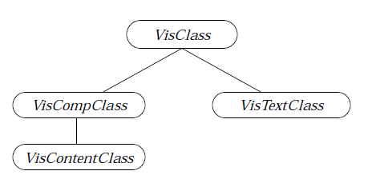
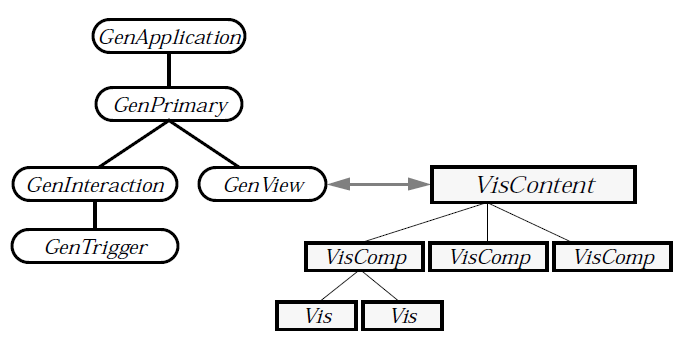
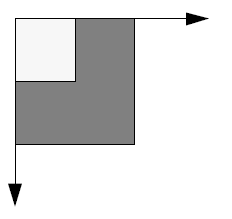
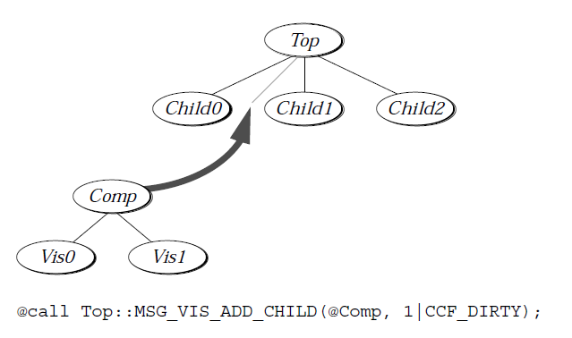
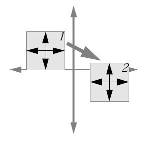

# 23 VisClass
The visible classes - **VisClass**, **VisCompClass**, **VisContentClass**, and 
**VisTextClass** - can be extremely useful to application developers. They 
provide a flexibility of display and use that is unavailable with the generic UI 
objects. Among other features, visible objects provide the hooks for and basic 
functionality of custom drawing, custom input handling, and custom 
geometry management.

**VisClass** is the parent class of all the visible classes and all visible UI objects. 
**VisClass** objects, by themselves, do nothing; **VisClass** must be subclassed 
and the objects must be placed in a visible object tree as children of a 
**VisCompClass** object. Together, **VisClass** and **VisCompClass** provide a 
large amount of the functionality required for creating a hierarchy of 
non-overlapping objects.

Many applications will use both **VisClass** and **VisCompClass** as well as 
**VisContentClass**. Before reading this chapter, however, you should be 
familiar with the concepts of the generic UI and with basic GEOS 
applications. You should have created a simple application to get familiar 
with the GEOS system and Goc, and you should be relatively familiar with 
the GenView.

You should also become familiar with both **VisContentClass** and 
**VisCompClass**; both of these classes and their relationship to **VisClass** are 
described in the following sections. This chapter provides a starting point 
and most of the specifics for someone learning about the visible world. You 
would also do well to read "The GEOS User Interface," Chapter 10 of the 
Concepts Book.

## 23.1	Introduction to VisClass
**VisClass** is one of the three visible classes you'll have to have a working 
knowledge of in order to use visible objects. Both of the others, 
**VisCompClass** and **VisContentClass**, are its subclasses, and both are 
important in visible object trees. However, **VisClass** provides the heart of the 
visible world.

**VisClass** objects do nothing useful by themselves. When you subclass 
**VisClass** and add your own methods, however, the real power of the visible 
classes can be used without the programmer having to worry about the nuts 
and bolts of most UI issues. These classes inherently provide the following 
features:

**Knowledge of Visible Bounds**  
Every visible object has an instance data field that defines the 
object's bounds in the GEOS graphic coordinate space. These 
bounds are used for many purposes, including drawing and 
input handling. See "Positioning Visible Objects" below.

**Comprehensive Visual Updating**  
When a visible object is included in an object tree displayed by 
a GenView object, the system automatically tells the object 
when it must redraw itself. For example, when the view scrolls 
or when part of the window becomes exposed, the system will 
send a drawing message through the visible tree; the objects 
then draw themselves at the proper location in the document 
space, and the view window is updated. See "Drawing to the 
Screen" below.

**Geometry Management**  
When visible objects are arranged as children of a VisComp or 
a VisContent object, they can be set up to update their size and 
position appropriate to the current window and view context. 
The VisComp and VisContent classes provide extensive and 
sophisticated child management functions, though custom 
management is also allowed and is often used. See "Positioning 
Visible Objects" below, especially the messages 
MSG_VIS_RECALC_SIZE and MSG_VIS_POSITION_BRANCH in 
section 23.4.3.3 below.

**Object Tree Manipulation**  
**VisClass** objects can not have children, but they can be 
children of **VisCompClass** and **VisContentClass** objects. All 
of these classes support extensive tree operations including 
passing messages up the tree, passing messages down the tree, 
adding branches, removing branches, and moving branches. 
See "Working with Visible Object Trees" below.

**Mouse Event Handling**  
When an input event occurs over the GenView window in which 
the visible tree is displayed, that event is immediately passed 
on to the VisContent object. The event then travels down the 
visible object tree (automatically) until it is handled by some 
visible object. Most often, the event is handled by the leaf object 
with its visible bounds directly under the mouse pointer. 
Individual Vis objects can also grab the mouse so that they 
receive input events that occur even outside their bounds. See 
both "Handling Input" below and "Input," Chapter 11 of 
the Concepts Book.

**Keyboard Event Handling**  
A visible object can grab the keyboard input stream and receive 
keyboard events as they occur. Typically, certain keystrokes 
will be intercepted by the specific UI even if a visible object has 
the keyboard grab; this ensures the object won't usurp 
functions expected by the user from his specific UI. (The object 
can, however, override keystroke interception, though this is 
strongly discouraged.) See "Input," Chapter 11 of the Concepts 
Book.

**Interaction with Input Hierarchies**  
**VisClass** objects have an inherent knowledge of the input 
hierarchies. Many visible objects may need to interact with the 
Focus and Target input hierarchies especially, and they can 
also interact with the Model hierarchy as well. See "Input," 
Chapter 11 of the Concepts Book.

**Use of VisMonikers**  
Typically, visible objects will draw themselves in their entirety 
and will not need visual monikers. Monikers are typically 
labels attached to objects that get displayed either on or near 
the object. Visual monikers are most frequently used with 
generic UI objects, but they can be set up and used with visible 
objects as well. See "Using Visual Monikers" below.

**Standard MetaClass Functions**  
Because **VisClass** is a subclass of **MetaClass**, it inherits all 
the basic, standard object functions of that class (e.g., state 
saving, instantiation and initialization, detaching and 
destruction, etc.). See "MetaClass" in "System 
Classes," Chapter 1.

Many programmers new to object-oriented programming may think that 
visible objects are used only in certain circumstances. On the contrary, visible 
objects may be used for nearly any purpose and to provide nearly any 
application-specific graphical or user interface functions. When used 
properly, visible objects can relieve you of hours of writing specialized code.

Programmers new to OOP may need to practice with several small 
applications in order to gain experience using visible objects. You can also 
study the sample applications, many of which use visible objects extensively.

Visible objects are most useful when you have well-defined items that must 
appear on the screen or interact with the user. Pieces in a board game provide 
a good example: Each piece has its own visual representation, and each piece 
has a special set of behaviors that depend on user actions and game context. 
Therefore, it makes sense to have each piece be an object of **VisClass**.

Another, less immediately obvious, example might be a program that 
represents maps on the screen. The map itself could be stored as a visible 
composite object (**VisCompClass**), and each of the major subdivisions on the 
map could be a visible object. For example, in a map of the United States, the 
country would be a VisComp object, and each state could be a Vis object. 
Taken one step further, each state could be a composite object, and each 
county in the state a visible child of the state. Another step turns the counties 
into composite objects and each town a visible object. This arrangement lends 
itself to a tree structure, which is how visible objects are stored.

Another example is a spreadsheet application. The spreadsheet itself could 
be one composite object containing a number of row objects. Each row object 
is a composite that holds a number of cell objects. Each cell is a visible object 
with the functions of the cell built into it. The row and spreadsheet 
composites can use the geometry manager to arrange the cells properly, 
thereby making the programmer free of ever having to worry where the cells 
are in the document. The visible object tree will automatically pass input 
events to the cell under the mouse pointer. Entire rows can be created, 
destroyed, drawn, erased, or moved with a few simple commands by the 
programmer.

## 23.2 The Visible Class Tree
As stated earlier, the visible class tree consists of four classes. The 
relationship between these classes is shown in Figure 23-1.
"The GEOS User Interface," Chapter 10 of the Concepts Book, also 
describes visible classes and visible trees.

**VisClass** - This is the parent class of the visible tree. It contains the basic 
functionality common to every visible object and is the subject 
of this chapter.

**VisCompClass** - A subclass of **VisClass**, this class has the added ability to have 
and arrange children in the visible tree. It has sophisticated 
geometry management functions built in and can be used as an 
organizational object.

**VisContentClass** - A subclass of **VisCompClass**, this class is used only as the 
content of a GenView. The VisContent has default handlers for 
many messages sent out by the view, and it interacts with the 
view window to display the visible object tree. Every visible 
object tree, to be displayed in a GenView, must have a 
VisContent as its root object.

**VisTextClass** - This class, not discussed in this chapter, is a visible version of 
the **GenTextClass**. It provides a nearly full-featured word 
processing object that can be put in the visible tree.

The first three of these classes are used extensively by many applications. 

  
**Figure 23-1** *Visible Class Tree*  
*All the classes shown have the properties of VisClass and can be used in an 
application's visible object tree. Visible objects are more flexible but require 
more programming than do generic objects.*

## 23.3 VisClass Instance Data
**VisClass** has seven different instance data fields as shown in Code 
Display 23-1. Each of these fields is discussed in detail in the following 
sections, and each may be set or reset during execution by sending the visible 
object certain messages.

Several of the instance fields will never be used by the application 
programmer. Most likely, you will work directly with the *VI_bounds* field and 
perhaps the *VI_attrs* or *VI_geoAttrs* fields. It's unlikely you will need to use 
the others unless you're doing something quite unusual.

----------
**Code Display 23-1 VisClass Instance Data**

	/* This is the definition of the VisClass instance data fields with some comments
	 * as to their use. */

	/* VI_bounds
	 * VI_bounds is a Rectangle structure defining the outermost boundaries of
	 * the visible object. */
	@instance Rectangle		VI_bounds = {0, 0, 0, 0};

	/* VI_typeFlags
	 * VI_typeFlags is a record containing eight flags that determine the
	 * type of the visible object. None are set by default. */
	@instance VisTypeFlags	VI_typeFlags = 0;
	/* Possible flags:
	 * VTF_IS_COMPOSITE			VTF_IS_WINDOW
	 * VTF_IS_PORTAL			VTF_IS_WIN_GROUP
	 * VTF_IS_CONTENT			VTF_IS_INPUT_NODE
	 * VTF_IS_GEN				VTF_CHILDREN_OUTSIDE_PORTAL_WIN */

	/* VI_attrs
	 * VI_attrs is a record that contains eight attribute flags for the
	 * object. Those set by default are shown. */
	@instance VisAttrs		VI_attrs = (VA_MANAGED | VA_DRAWABLE |
								VA_DETECTABLE | VA_FULLY_ENABLED);
	/* Possible flags:
	 * VA_VISIBLE				VA_FULLY_ENABLED
	 * VA_MANAGED				VA_DRAWABLE
	 * VA_DETECTABLE			VA_BRANCH_NOT_MINIMIZABLE
	 * VA_OLD_BOUNDS_SAVED		VA_REALIZED */

	/* VI_optFlags
	 * VI_optFlags is a record containing eight window update flags.
	 * The flags set by default are shown. */
	@instance VisOptFlags		VI_optFlags = (VOF_GEOMETRY_INVALID |
							VOF_GEO_UPDATE_PATH | VOF_WINDOW_INVALID |
							VOF_WINDOW_UPDATE_PATH |
							VOF_IMAGE_INVALID |
							VOF_IMAGE_UPDATE_PATH);
	/* Possible flags:
	 * VOF_GEOMETRY_INVALID				VOF_GEO_UPDATE_PATH
	 * VOF_IMAGE_INVALID				VOF_IMAGE_UPDATE_PATH
	 * VOF_WINDOW_INVALID				VOF_WINDOW_UPDATE_PATH
	 * VOF_UPDATE_PENDING				VOF_EC_UPDATING */

	/* VI_geoAttrs
	 * VI_geoAttrs is a record of eight geometry management flags. */
	@instance VisGeoAttrs		VI_geoAttrs = 0;
	/* Possible flags:
	 * VGA_GEOMETRY_CALCULATED			VGA_NO_SIZE_HINTS
	 * VGA_NOTIFY_GEOMETRY_VALID		VGA_DONT_CENTER
	 * VGA_USE_VIS_SET_POSITION			VGA_USE_VIS_CENTER
	 * VGA_ALWAYS_RECALC_SIZE			VGA_ONLY_RECALC_SIZE_WHEN_INVALID

	/* VI_specAttrs
	 * VI_specAttrs is a record containing eight flags used when the visible
	 * object is part of a specific UI library. This field is rarely if ever
	 * used by applications. */
	@instance SpecAttrs			VI_specAttrs = 0;
	/* Possible flags:
	 * SA_ATTACHED						SA_REALIZABLE
	 * SA_BRANCH_MINIMIZED				SA_USES_DUAL_BUILD
	 * SA_CUSTOM_VIS_PARENT				SA_SIMPLE_GEN_OBJ
	 * SA_CUSTOM_VIS_PARENT_FOR_CHILD
	 * SA_TREE_BUILT_BUT_NOT_REALIZED */

	/* VI_link
	 * VI_link contains an object pointer to the visible object's next sibling
	 * in the tree. Note that VisClass has no corresponding @composite field;
	 * if the object is to have children, it must be of class VisCompClass.
	@instance @link				VI_link;

----------
### 23.3.1 VI_bounds
The *VI_bounds* field is a **Rectangle** structure containing four values: The 
left, top, right, and bottom outer bounds of the object. The bounds of a visible 
object describe the object to the rest of the world: the input manager and UI 
use them to determine when the mouse pointer is over the object, and the 
object's visible parent (if any) uses them to figure out the total geometry of all 
its children.

The *VI_bounds* field is very important to nearly all visible objects. In fact, 
section 23.4.3 below is devoted to this field and how it is used. For full 
information on visible bounds, see that section.

### 23.3.2 VI_typeFlags
	VI_typeFlags, MSG_VIS_SET_TYPE_FLAGS, 
	MSG_VIS_GET_TYPE_FLAGS

The *VI_typeFlags* field is a bitfield record containing eight flags. These flags 
determine the type of the visible object and are used primarily by the UI and 
the windowing system. When used at all, these flags are typically set in the 
object's definition or when the object is first created, and they are rarely 
changed dynamically by an application. The eight flags in this record are 
listed below. The record is of type **VisTypeFlags**.

VTF_IS_COMPOSITE  
This flag is set if the object is of **VisCompClass** rather than 
**VisClass**. This flag indicates the object may have children 
(normal **VisClass** objects can not have children). Because this 
is not the only difference between these classes, changing this 
flag can have unpredictable results.

VTF_IS_WINDOW  
This flag is set if the object creates a window via the window 
system in order to display itself and its children. This flag 
implies the object must also have VTF_IS_COMPOSITE set, 
meaning the object must actually be of **VisCompClass** and not 
**VisClass**. If this flag is set, the UI will assume that the 
*VI_bounds* field of the object represents the current size of the 
window. Objects with the VTF_IS_WINDOW flag set are skipped 
by the normal input and output messages such as 
MSG_VIS_DRAW and MSG_META_START_SELECT; these 
messages will be passed directly to the object's appropriate 
child. VTF_IS_WINDOW and VTF_IS_PORTAL are mutually 
exclusive.

VTF_IS_PORTAL  
This flag is set if the object is a portal. A portal is an object that 
has its own window and appears in its parent's window. A 
portal differs from a window (VTF_IS_WINDOW) in that the 
window has no part of itself drawn in its parent window. This 
flag implies that the VTF_IS_COMPOSITE flag must also be set 
indicating the object may have visible children. All visible 
children of a portal will appear in the portal's associated 
window if VTF_CHILDREN_OUTSIDE_PORTAL_WIN is set. The 
object itself may display portions of itself within its parent's 
window, though; an example of this is the UI's implementation 
of the GenDisplayControl object, which manages several child 
windows within its own window area. Its border is drawn in the 
parent window, then its window is defined to be one pixel inside 
this border. VTF_IS_PORTAL and VTF_IS_WINDOW are 
mutually exclusive.

VTF_IS_WIN_GROUP  
This flag is set for the top visible object in a visible branch 
which makes that branch a realizable entity. This flag implies 
that both VTF_IS_COMPOSITE and VTF_IS_WINDOW must be 
set as well. An example would be the specific UI's 
implementation of a GenPrimary object - if the primary is not 
visible, none of its children may be visible (with some 
exceptions).

VTF_IS_CONTENT  
This flag is set if the object is the output of a window object. 
Typically, this will be set only if the object is of 
**VisContentClass** (not for **VisClass** or **VisCompClass**). Note 
that if this is set, both VTF_IS_WINDOW and 
VTF_IS_WIN_GROUP must also be set.

VTF_IS_INPUT_NODE  
This flag is an optimization bit. It is set if the object controls 
input flow (such as a VisContent) or is a target or focus node 
that is not a window group (VTF_IS_WIN_GROUP). 
MSG_VIS_VUP_ALTER_INPUT_FLOW is sent directly to objects 
with this bit set unless there is a need for them to actually use 
the VUP mechanism, as is the case with mouse grabs in a 32-bit 
content. Similarly, MSG_META_MUP_ALTER_FTVMC_EXCL, 
MSG_VIS_FUP_QUERY_FOCUS_EXCL, and 
MSG_VIS_VUP_QUERY_FOCUS_EXCL are sent to the first 
visible object up the tree that either is a window group or has 
this bit set.

VTF_IS_GEN  
This flag is set if the visible object is the specific UI counterpart 
to a generic object. This flag must be set for the object to handle 
messages that begin MSG_SPEC. The only objects that will ever 
have this flag set are those in Specific UI libraries.

VTF_CHILDREN_OUTSIDE_PORTAL_WIN  
This flag is set if children of a portal object may appear in the 
object's parent window rather than in the portal's 
specially-created window. The VTF_IS_PORTAL flag must also 
be set for this object. An example of this is the specific UI's 
representation of a GenView object and its children; the view's 
children appear along the edges of the view window rather 
than inside it. The GenDisplayControl, by contrast, has all its 
children appearing within its window; thus, it does not have 
this flag set.

Although the *VI_typeFlags* record will rarely be changed at run-time, you can 
set new values by sending MSG_VIS_SET_TYPE_FLAGS to the visible object 
while it is realized. To retrieve the current type flags, send the object a 
MSG_VIS_GET_TYPE_FLAGS.

----------
#### MSG_VIS_SET_TYPE_FLAGS
	void	MSG_VIS_SET_TYPE_FLAGS(
			VisTypeFlags		flagsToSet,
			VisTypeFlags		flagsToClear);

This message causes the object to set its *VI_typeFlags* field to the values 
passed. The *flagsToSet* parameter will be OR-ed with *VI_typeFlags*, and the 
*flagsToClear* parameter will be logically inverted and then AND-ed with the 
field. The clear operation will occur after the set. Therefore a flag set in both 
parameters will be cleared by this message.

**Source:** Unrestricted.

**Destination:** Any visible object.

**Parameters:**  
*flagsToSet* - A record of **VisTypeFlags** indicating which flags 
are to be set for the object.

*flagsToClear* - A record of **VisTypeFlags** indicating which flags 
are to be cleared for the object (a flag set in 
*flagsToClear* will be cleared in *VI_typeFlags*).

**Return:** Nothing.

**Interception:** Unlikely.

----------
#### MSG_VIS_GET_TYPE_FLAGS
	VisTypeFlags MSG_VIS_GET_TYPE_FLAGS();

This message returns a visible object's current *VI_typeFlags* field.

**Source:** Unrestricted.

**Destination:** Any visible object.

**Parameters:** None.

**Return:** A byte of *VisTypeFlags* representing the object's current *VI_typeFlags* 
field.

**Interception:** Unlikely.

### 23.3.3 VI_attrs
	VI_attrs, MSG_VIS_GET_ATTRS, MSG_VIS_SET_ATTRS

The *VI_attrs* field is a record of eight flags (**VisAttrs**)that determine the 
general visible attributes of the object. These attributes may be changed on 
the fly and often are. Applications that don't involve visible tree operations 
(adding, removing, or moving branches) probably will not change these 
attributes dynamically.

To set the flags after the object has been instantiated, send it a 
MSG_VIS_SET_ATTRS with the appropriate flags to be set. To retrieve the 
*VI_attrs* record, send the object a MSG_VIS_GET_ATTRS. The VA_REALIZED 
flag may not be changed with MSG_VIS_SET_ATTRS.

The eight flags of the **VisAttrs** record are listed below:

VA_VISIBLE  
This flag is effective only for window group objects (those with 
VTF_IS_WIN_GROUP set in *VI_typeFlags*) and is ignored for 
other objects. If set, it indicates that the visible branch headed 
by this object can be made visible as soon as it is linked visibly 
to another visible branch. For example, a window group object 
may have this bit set and not be on the screen if its parent 
window group is not set VA_VISIBLE; as soon as the parent 
window group becomes VA_VISIBLE, though, the entire branch 
will become visible.

VA_FULLY_ENABLED  
This flag is normally set for visible objects. If it is set, the object 
is fully enabled when visible on the screen. If not set, the object 
is not fully enabled - the object will typically be drawn in a 50% 
pattern (grayed out) and will not receive click events. This flag 
works even for normal visible objects, though this behavior is 
seen almost exclusively with generic UI objects.

VA_MANAGED  
This flag indicates that the object's location is managed by its 
parent. If the flag is set, space is set aside in the parent 
composite by the geometry manager. When the window 
displaying this object changes, the geometry will have to be 
calculated. If this flag is not set, the object can alter its own 
location and bounds without affecting the parent's geometry.

VA_DRAWABLE  
This flag indicates whether the object is drawn or invisible. If 
the flag gets set or reset during execution, the rectangle defined 
by its *VI_bounds* field will automatically be marked invalid.

VA_DETECTABLE  
This flag, when set, indicates that the object might respond to 
mouse, pointer, keyboard, or other similar events. If the flag is 
reset (such as with display-only objects), its parent composite 
object will not bother passing it these events. This flag must be 
set if the object is a window composite. If the status of this flag 
is changed during execution, the object's grab state will not 
change. For example, if the object has the mouse grab when a 
MSG_VIS_SET_ATTRS resets the flag, the object will retain the 
mouse grab until it is released or preempted normally.

VA_BRANCH_NOT_MINIMIZABLE  
This flag is used only by the visible counterparts of generic UI 
objects. If set, it indicates that this branch (e.g., a 
GenInteraction and its children) stays visible and usable even 
when the parent primary window is minimized.

VA_OLD_BOUNDS_SAVED  
This flag, when set, causes the geometry manager to store the 
object's old bounds when its *VI_bounds* field changes. The old 
bounds are stored in a TEMP_VIS_OLD_BOUNDS vardata field.

VA_REALIZED  
This flag indicates whether the object is visibly open on the 
screen - i.e., whether it is positioned on an open window. If the 
flag is set, the object is visible on the screen. When the object is 
no longer visible on the screen, this flag is reset. This flag may 
not be altered by MSG_VIS_SET_ATTRS; it may only be changed 
by MSG_VIS_OPEN (which sets the flag) and MSG_VIS_CLOSE 
(which resets it).

----------
#### MSG_VIS_SET_ATTRS
	void	MSG_VIS_SET_ATTRS(
			VisAttrs		attrsToSet,
			VisAttrs		attrsToClear,
			VisUpdateMode	updateMode);

This message sets the object's *VI_attrs* field to the values passed. The 
*attrsToSet* parameter will be OR-ed with *VI_attrs*, and the *attrsToClear* 
parameter will be logically inverted and then AND-ed with the field. The clear 
operation will occur after the set, and therefore a flag set in both parameters 
will be cleared. The *updateMode* parameter indicates when the visual update 
of the object should occur after the new attributes have been set.

**Source:** Unrestricted.

**Destination:** Any visible object.

**Parameters:**  
*attrsToSet* - A record of **VisAttrs** indicating which flags are to 
be set for the object.

*attrsToClear* - A record of **VisAttrs** indicating which flags are to 
be cleared for the object (a flag set in *attrsToClear* 
will be cleared in *VI_attrs*).

*updateMode* - A **VisUpdateMode** indicating when the object 
should be visually updated on the screen.

**Return:** Nothing.

**Interception:** Unlikely.

**Warnings:** Not all flags in the *VI_attrs* record may be set with this message.

----------
#### MSG_VIS_GET_ATTRS
	VisAttrs	MSG_VIS_GET_ATTRS();

This message returns a visible object's current *VI_attrs* field.

**Source:** Unrestricted.

**Destination:** Any visible object.

**Parameters:** None.

**Return:** A byte of type **VisAttrs** representing the current flags set in the object's 
*VI_attrs* field.

**Interception:** Unlikely.

### 23.3.4 VI_optFlags
	VI_optFlags, MSG_VIS_GET_OPT_FLAGS

The *VI_optFlags* field is a **VisOptFlags** record containing eight flags. These 
flags are set and used by the geometry manager to mark which objects need 
to be updated and how. The flags can not be set individually by applications; 
however, they can be retrieved with the message MSG_VIS_GET_OPT_FLAGS. 
It is unlikely that your code will ever access these flags directly. The eight 
flags in this field are listed below.

VOF_GEOMETRY_INVALID  
This flag indicates that the general geometry of this object has 
become invalid (with a MSG_VIS_MARK_INVALID). This is used 
primarily when an object knows that its bounds must be 
recalculated or re-verified and that any change must be 
reflected in its parent window. This flag will be reset when a 
geometry update resolves the object's bounds. Typically, this 
will occur with a window update message such as 
MSG_VIS_UPDATE_WIN_GROUP.

VOF_GEO_UPDATE_PATH  
This flag, also set by MSG_VIS_MARK_INVALID, marks a trail of 
objects that all must have their geometry updated.

VOF_IMAGE_INVALID  
This flag indicates that the image of the object or the bounds of 
a windowed object have changed and therefore need to be 
updated. This flag is set by MSG_VIS_MARK_INVALID. The 
image redraw will occur the next time one of the window 
update messages is used on the object's visual branch. This flag 
will be reset when a visual update redraws the object. 
Typically, this will occur with MSG_VIS_UPDATE_WIN_GROUP 
or another window update message.

VOF_IMAGE_UPDATE_PATH  
This flag, also set by MSG_VIS_MARK_INVALID, marks a trail of 
objects that must have their images updated.

VOF_WINDOW_INVALID  
This flag indicates that the window the object resides in needs 
to be opened or closed, or that the object itself needs to be 
opened or closed via MSG_VIS_OPEN or MSG_VIS_CLOSE. It is 
set by MSG_VIS_MARK_INVALID. This flag will be reset when a 
visual update occurs on the window group. Typically, this will 
occur with a window update message such as 
MSG_VIS_VUP_UPDATE_WIN_GROUP. (This message should be 
called whenever an object is added to a visible tree; it ensures 
the object will be properly opened.)

VOF_WINDOW_UPDATE_PATH  
This flag, also set by MSG_VIS_MARK_INVALID, marks a trail of 
window objects that all must have their windows and 
open/closed state updated.

VOF_UPDATE_PENDING  
This flag indicates that the object has an unprocessed 
MSG_VIS_UPDATE_WIN_GROUP in its event queue.

VOF_EC_UPDATING  
This flag is used by the **VisClass** error-checking code only. It 
indicates that a visible branch is currently being updated; the 
system checks it to make sure nested updates do not occur.

----------
#### MSG_VIS_GET_OPT_FLAGS
	VisOptFlags MSG_VIS_GET_OPT_FLAGS();

This message returns the current *VI_optFlags* field of the object.

**Source:** Unrestricted.

**Destination:** Any visible object.

**Parameters:** None.

**Return:** A byte record of **VisOptFlags** reflecting the current settings in the 
object's *VI_optFlags* field.

**Interception:** Unlikely.

**See Also:** MSG_VIS_MARK_INVALID.

### 23.3.5 VI_geoAttrs
	VI_geoAttrs, MSG_VIS_SET_GEO_ATTRS, MSG_VIS_GET_GEO_ATTRS

The *VI_geoAttrs* field is a **VisGeoAttrs** record of eight flags that determine 
the state of the object's geometry. They can be set and reset during execution 
to dynamically change the geometry behavior of the object. None of the flags 
is set by default. To set the flags, send the object a 
MSG_VIS_SET_GEO_ATTRS. The flags can be retrieved with a 
MSG_VIS_GET_GEO_ATTRS. The eight flags in this record are listed below.

VGA_GEOMETRY_CALCULATED  
This flag indicates whether the object has ever been calculated. 
If the flag is clear, the object's geometry is about to be 
calculated. An object may use this flag if it has a particular 
desired size. This flag is cleared before a geometry 
recalculation by MSG_VIS_RESET_TO_INITIAL_SIZE.

VGA_NO_SIZE_HINTS  
This flag is used by the Specific UI library to determine 
whether the object has any sizing hints or not. If the flag is not 
set, the object has one or more sizing hints (e.g., 
HINT_INITIAL_SIZE or HINT_FIXED_SIZE).

VGA_NOTIFY_GEOMETRY_VALID  
If this flag is set, the geometry manager will notify the object 
when its geometry messages have all been handled and the 
object's geometry is set. Notification will be in the form of 
MSG_VIS_NOTIFY_GEOMETRY_VALID. This flag may be used 
by visual objects for calculations or other sizing once geometry 
is redone but before redrawing occurs.

VGA_DONT_CENTER  
This flag, when set, allows the object to individually override 
its parent's centering behavior. The object will instead appear 
at either the left edge of a vertical composite or the top edge of 
a horizontal composite.

VGA_USE_VIS_SET_POSITION  
This flag is set to indicate that the object does not use the 
default handlers for MSG_VIS_SET_POSITION and 
MSG_VIS_POSITION_BRANCH. This flag provides an 
optimization that allows static calls to the geometry manager.

VGA_USE_VIS_CENTER  
If this flag is set, the geometry manager will use the standard 
**VisClass** or **VisCompClass** center message to calculate the 
object's center. Unless an object is using some unusual 
centering behavior, it should have this flag set. This flag allows 
the geometry manager to speed up calculations for normal 
center behavior.

VGA_ONLY_RECALC_SIZE_WHEN_INVALID  
This flag indicates that the object's size should be recalculated 
only when its geometry is marked invalid. That is, once the 
object's geometry is calculated, it will always return the same 
size until its geometry is once again marked invalid. Because 
the geometry manager often queries objects for their sizes, 
most objects should have this flag set. It allows the geometry 
manager to speed up calculations.

VGA_ALWAYS_RECALC_SIZE  
This flag avoids optimizations that do not recalculate the 
object's size when passed its current size. Though not often 
used, this flag may be needed in certain situations (e.g., when 
a composite object must expand to fit and center its children).

----------
#### MSG_VIS_SET_GEO_ATTRS
	void	MSG_VIS_SET_GEO_ATTRS(
			VisGeoAttrs		attrsToSet,
			VisGeoAttrs		attrsToClear,
			VisUpdateMode	updateMode);

This message causes the object to set its *VI_geoAttrs* field to the values 
passed. The *attrsToSet* parameter will be OR-ed with *VI_geoAttrs*, and the 
*attrsToClear* parameter will be logically inverted and then AND-ed with the 
field. The clear operation will occur after the set, and therefore a flag set in 
both parameters will end up cleared. Many of the attributes in this record are 
used only by Specific UI libraries and should not be altered by applications.

**Source:** Unrestricted.

**Destination:** Any visible object.

**Parameters:**  
*attrsToSet* - A record of **VisGeoAttrs** indicating which flags are 
to be set for the object.

*attrsToClear* - A record of **VisGeoAttrs** indicating which flags are 
to be cleared for the object (a flag set in 
*attrsToClear* will be cleared in *VI_geoAttrs*).

*updateMode* - A **VisUpdateMode** indicating when the object 
should be visually updated on the screen.

**Return:** Nothing.

**Interception:** Unlikely.

----------
#### MSG_VIS_GET_GEO_ATTRS
	VisGeoAttrs MSG_VIS_GET_GEO_ATTRS();

This message returns a visible object's current *VI_geoAttrs* field.

**Source:** Unrestricted.

**Destination:** Any visible object.

**Parameters:** None.

**Return:** A record of type **VisGeoAttrs** reflecting the flags currently set in the 
object's *VI_geoAttrs* field.

**Interception:** Unlikely.

### 23.3.6 VI_specAttrs
	VI_specAttrs, MSG_SPEC_SET_ATTRS, MSG_SPEC_GET_ATTRS

The *VI_specAttrs* field is a record of eight flags. This field is accessed only by 
objects that are part of a Specific UI library. Applications will almost never 
access this field or use its flags. Documentation on creating specific UI 
libraries may be published under separate cover.

----------
#### MSG_SPEC_SET_ATTRS
	void	MSG_SPEC_SET_ATTRS(
			SpecAttrs		attrsToSet,
			SpecAttrs		attrsToClear,
			VisUpdateMode	updateMode);

This message sets the current *VI_specAttrs* field to the values passed. A flag 
set in both attributes parameters will be cleared.

**Source:** Unrestricted.

**Destination:** Any visible object used as a specific UI object.

**Parameters:**  
*attrsToSet* - A record of **SpecAttrs** indicating which flags are to 
be set in the object's *VI_specAttrs* field.

*attrsToClear* - A record of **VisAttrs** indicating which flags are to 
be cleared for the object (a flag set in *attrsToClear* 
will be cleared in *VI_specAttrs*).

*updateMode* - A **VisUpdateMode** indicating when the object 
should be visually updated on the screen.

**Return:** Nothing.

**Interception:** Unlikely.

----------
#### MSG_SPEC_GET_ATTRS
	SpecAttrs MSG_SPEC_GET_ATTRS();

This message returns a visible object's current *VI_specAttrs* field. This field is 
used only by Specific UI libraries and is meaningful only for objects in these 
libraries.

**Source:** Unrestricted.

**Destination:** Any visible object that is used as a specific UI object.

**Parameters:** None.

**Return:** A byte of type **SpecAttrs** indicating which flags are set in the object's 
*VI_specAttrs* field.

**Interception:** Unlikely.

### 23.3.7 VI_link
	VI_link

The *VI_link* field holds the optr of the visible object's next sibling in the 
visible object tree. This field may not be accessed directly by applications but 
may be set or changed with the various visible tree messages. For full 
information on how to build and manipulate visible object trees, see section 
23.5 below.

## 23.4 Using VisClass
As stated earlier, visible objects are nearly useless unless you subclass one of 
the visible classes and handle certain messages. Although there's a lot of 
functionality built into **VisClass** and its subclasses, they must be customized 
to be of any use. In addition, visible objects must be put into a visible tree and 
connected to a GenView or other windowed UI object to be displayed.

### 23.4.1 Basic VisClass Rules
To use visible objects, you must subclass the Vis classes and create a visible 
object tree. Otherwise, the visible objects will not be able to display 
themselves or accept user input, the two things that make visible objects 
worthwhile.

Nearly all visible objects you use will at least display themselves on the 
screen. Some may accept mouse or keyboard input; some may move 
themselves around the screen, resize themselves, or implement custom 
geometry management functions.

For a subclass of **VisClass** to display itself on the screen, it must handle the 
message MSG_VIS_DRAW. This message is sent to all visible objects in a given 
window when that window is subjected to an exposure event. In addition, the 
object must be part of a tree of visible objects, the top node of which is 
connected to a GenView or other windowed object. Displaying a basic visible 
object is discussed in "Basic VisClass Rules" here and "Drawing to 
the Screen" below.

For a visible object to handle mouse input, it will need to handle a subset of 
the mouse event messages. Typically, a visible object will want to know when 
the mouse is clicked within the object's bounds (MSG_META_START_SELECT) 
and when the mouse button is released (MSG_META_END_SELECT). Other 
messages dealing with mouse motion or other mouse buttons may also be of 
interest to the object. In addition, visible objects may request and handle Ink 
input. Handling of these messages is discussed in "Handling Input" below.

Most applications using visible object trees will add objects to and remove 
them from the trees. MSG_VIS_ADD_CHILD and MSG_VIS_REMOVE are the 
two messages used most often for tree management. When an object should 
be freed, it can be destroyed with MSG_VIS_DESTROY, which will remove it 
from the tree and then free it.

Some applications will want to use the built-in geometry management 
features of GEOS. The geometry manager can automatically resize and 
reposition an entire visible object tree properly according to pre-set 
constraints. (The constraints can also be changed at run-time.) How the 
system manages visible object geometry is discussed in "Geometry 
Management" below.

The geometry manager, though extremely useful for non-overlapping objects, 
may not be sufficient for all the needs of a complex application. For an object 
to determine its own size and position, it has to handle some of the messages 
sent out by the geometry manager. You can also manually set the size and 
position of each visible object. This is discussed in "Positioning Visible 
Objects" below.

Often applications may need to change something about a visible object or 
the tree it's in. When this happens, the application must force a visual update 
by invalidating either the geometry or the image (or both) of the object and 
then calling MGS_VIS_VUP_UPDATE_WIN_GROUP. To mark any object 
invalid, the application must call MSG_VIS_MARK_INVALID.

Many visible objects will have specific functions they perform. For example, 
if the user presses on a menu item labeled "New Game" or something similar, 
the visible object may return itself to its original location (as in the TicTac 
sample application). To get this type of functionality, you must define new 
messages for your subclass of **VisClass** and have the object handle them. In 
the case of the TicTac game pieces, each piece handles the 
MSG_PIECE_NEW_GAME message by resetting the object's position to its 
original position.

Visible objects are maintained and managed in a tree structure. The tree has 
three basic elements: The root (topmost) node must be an object of 
**VisContentClass**. Any nodes in the middle of the tree, nodes that are 
allowed to have children, must be of **VisCompClass**. Any leaf nodes 
(guaranteed not to have children) may be of either **VisClass** or 
**VisCompClass**. (Subclasses of the above classes may also be used.)

The visible object tree is displayed normally through a GenView object. The 
output of the GenView must be tied directly to the top node of the visible 
object tree; this is why the visible tree must be headed by a VisContent - only 
the VisContent has the methods to handle GenView messages.

The VisContent object may or may not do things other than manage the 
visible tree. For example, the content may draw some background graphics 
to the window before the other visible objects draw themselves, or it may 
implement some special geometry behavior to arrange its children.

The VisContent can have children. These children can be either standard 
visible objects or composite visible objects. Composites, like the content, are 
allowed to have children. For efficiency, standard visible objects can not have 
children. Therefore, only leaf objects in the tree may be of **VisClass**.

The visible object tree may have any number of layers of composites. You 
should pay attention to the functions required in your application and fit the 
structure of the tree to the application's needs.

These restrictions, combined with the link to the generic object tree through 
GenView, result in an object tree structure somewhat like that shown in 
Figure 23-2. Of course, the actual generic and visible tree structure will vary 
from application to application. Also, note that the generic and visible 
sections are actually two different object trees; they are not connected 
through a parent-child relationship anywhere.

  
**Figure 23-2** *Visible and Generic Object Trees*  
*The visible object tree is linked to the generic object tree through the 
GenView-VisContent link. VisComp objects may have children; Vis objects 
may not. (Each object shown simply has the suffix Class removed from its 
class type.)*

### 23.4.2 Drawing to the Screen
One of the main features of visible objects is their ability to draw themselves 
on the screen. The visible tree does not have to detect when drawing or 
redrawing should be done; the UI will do this automatically through the 
window system and the GenView object.

#### 23.4.2.1 Visual Updates
	MSG_VIS_OPEN, MSG_VIS_CLOSE

The visible tree will have to draw or redraw itself when a portion of its 
GenView window becomes newly exposed. The GenView keeps track of its 
window and will notify its content when any portion of the window becomes 
exposed. Exposure can occur from several events: The view window could be 
newly created; another window could have been moved, exposing the view's 
window; or the view window could have been scrolled.

Each of these exposure events looks exactly the same to the visible tree. 
When one of them occurs, the GenView will send a MSG_META_EXPOSED to 
its content object. The content (a VisContent or GenDocument if you're using 
a visible tree) will create a GState for the window and translate the 
MSG_META_EXPOSED into a MSG_VIS_DRAW. It will then send this 
MSG_VIS_DRAW to itself.

The default handler for MSG_VIS_DRAW in a composite is to simply pass the 
message on to all of the composite's children. There is no default behavior for 
MSG_VIS_DRAW in **VisClass**.

Any object (content, composite, or leaf) that wants to represent itself on the 
screen must handle MSG_VIS_DRAW. Any composite that subclasses this 
message must be sure to pass it on to all of its children with the following 
line:

	@send @visChildren::MSG_VIS_DRAW(drawFlags, gstate);

Redrawing is not initiated only by the view window becoming exposed. It can 
also be initiated by some portion of the visible tree changing so that it needs 
to be redrawn (e.g., a child is moved from one composite to another, which 
may have an effect on the visual representation of the composite). Typically, 
any change that necessitates a redrawing will automatically generate a 
MSG_VIS_DRAW to the appropriate objects. These operations, however, will 
require a **VisUpdateMode** to be passed along with the other parameters.

All of the above assumes that the visible object is "open" or "realized." If an 
object is not open, it will not appear on the screen or as part of a composite's 
geometry calculations. When a window is first created, the window's content 
is automatically opened with MSG_VIS_OPEN. In the case of a visible tree 
attached to a GenView, this means that the VisContent object will be opened 
along with the window. All of the VisContent's children will also be opened 
automatically (assuming their VOF_WINDOW_INVALID bits are set, which is 
true the first time a visible object comes up).

If a visible object is added to an already-opened composite, the child will 
automatically be opened and marked invalid. This will cause the composite's 
geometry and image to be updated during the next visual update. If a child 
is added to a composite that is not currently open, the child will not be 
opened.

Although it is rarely done directly, you can manually open a visible object 
with the message MSG_VIS_OPEN, and you can "close" an object (remove it 
from the screen and from the tree's geometry calculations) with 
MSG_VIS_CLOSE. To open or close an entire branch of the visible tree, you can 
send the appropriate message to the top composite object in the branch. The 
message will propagate down through all the visible children.

----------
#### MSG_VIS_OPEN
	void	MSG_VIS_OPEN(
			WindowHandle window);
This message is part of the visual update mechanism and will be sent by the 
system when an object must be visually updated to appear on the screen. It 
will be sent to any VOF_WINDOW_INVALID objects in a branch whose 
VTF_IS_WIN_GROUP object has become VA_VISIBLE. Any object added into a 
visible tree having VOF_WINDOW_INVALID set will receive a MSG_VIS_OPEN 
at the next visual update. This message propagates down the visible tree and 
does not cross over boundaries of window groups. This message is often 
subclassed by objects that want to initialize some information before being 
drawn on the screen. If an object subclasses this message, it should be sure 
to call its superclass somewhere in the handler.

**Source:** Visual update mechanism.

**Destination:** Any visible object.

**Parameters:**  
*window* - Handle of window in which the object is to appear, 
or zero if it should appear in the top window object.

**Return:** Nothing.

**Interception:** Will be intercepted by objects that want to initialize certain data or 
take certain actions before being drawn on the screen. Any intercepting 
objects must call the superclass somewhere in their handler.

----------
#### MSG_VIS_CLOSE
	void	MSG_VIS_CLOSE();

This message is part of the visual update mechanism and is sent to objects 
that are being taken off the screen. The system will send this message to any 
objects in a visual branch whose VTF_IS_WIN_GROUP object is set not visible 
(~VA_VISIBLE). This message closes appropriate windows and propagates to 
all children to the bottom leaf objects of the visible branch. This message will 
not cross window group boundaries; if a lower VTF_IS_WIN_GROUP object is 
encountered during the message propagation, an error will likely occur. 
Therefore, lower window groups must be closed before higher window groups 
may be closed.

**Source:** Visual update mechanism.

**Destination:** Any visible object.

**Interception:** Will be intercepted by objects that want to do something as it is being 
taken off the screen. Any objects that intercept the message must call 
their superclasses in the handlers.

#### 23.4.2.2 VisUpdateMode
**VisUpdateMode** is an enumerated type that determines when and how the 
visible tree will be visually updated when its image or geometry becomes 
invalid. This type has four enumerations, described below:

VUM_MANUAL  
This mode indicates that the UI should not update at all after 
this change. Instead, the visual update will be initiated 
manually later on.

VUM_NOW  
This mode indicates that the visual update should occur 
immediately after the change is effected.

VUM_DELAYED_VIA_UI_QUEUE  
This mode indicates that the visual update should occur only 
when the UI queue is completely empty (indicating no further 
changes are coming).

VUM_DELAYED_VIA_APP_QUEUE  
This mode indicates that the visual update should occur only 
when the application's queue is empty (indicating that no more 
changes are coming). This mode is very useful for making 
several changes that each require an update; it will put the 
updating off until the very end and will cause only a single 
update.

A **VisUpdateMode** is passed as a parameter to certain Vis and Gen 
messages. These messages typically have some effect on the visual 
representation of the objects - either on the geometry or on the image itself.

#### 23.4.2.3 The Initial GState
	MSG_VIS_VUP_CREATE_GSTATE
For any drawing to occur, a graphic state must exist. The graphic state 
typically is associated with the GenView's window and is created 
automatically, either when the window is first realized on the screen or when 
an exposure event occurs.

To create a GState, the system generates a MSG_VIS_VUP_CREATE_GSTATE 
and sends it to the object that first requires a visual update. This message 
travels up the visible tree until it gets to a window group (an object with its 
VTF_IS_WINDOW flag set), and then it creates a GState associated with that 
window object. Sometimes a content object will subclass this message to set 
up its own display information before the GenView window can create the 
new GState. The other time in which this message may be subclassed is by a 
content that manages a 32-bit graphics space; the content will have to 
translate the gstate to the proper position in the large document before 
letting other objects use it.

----------
#### MSG_VIS_VUP_CREATE_GSTATE
	GStateHandle MSG_VIS_VUP_CREATE_GSTATE();
This message travels up the visible object tree until it reaches either the root 
object or a window group object. It then creates a graphic state associated 
with that object; this graphic state is then used for the subsequent visual 
update. You may wish to subclass this message in order to alter the GState 
created or to set it up to take 32-bit coordinates. If you subclass it, however, 
be sure to call the superclass somewhere in the handler.

**Source:** Unrestricted - typically sent by a visible object to itself.

**Destination:** Any visible object-typically sent by a visible object to itself.

**Parameters:** None.

**Return:** The GStateHandle of the newly-created GState.

**Interception:** Unlikely - VisContent objects may intercept this message to translate 
the returned GState in a 32-bit graphics space. In this case, the 
VisContent must first call its superclass, then translate the GState 
appropriately before returning.

#### 23.4.2.4 Retrieving the Current Window Handle
	MSG_VIS_QUERY_WINDOW
Often a visible object will require the window handle of the window it's 
currently residing in. Some objects, for example, will want to force visual 
updates in real-time, and they can do this by using the current window 
handle, creating a special GState for it, and drawing to that GState. The 
visible object can either cache the window handle when the window is first 
opened, or it can retrieve it with MSG_VIS_QUERY_WINDOW.

----------
#### MSG_VIS_QUERY_WINDOW
	WindowHandle MSG_VIS_QUERY_WINDOW();
This message returns the window handle of the window the object currently 
resides in. In many cases, this will be the window handle of a GenView 
window.

**Source:** Unrestricted.

**Destination:** Any visible object-typically sent by a visible object to itself to retrieve 
its current window handle.

**Parameters:** None.

**Return:** The window handle of the object's current window.

**Interception:** Unlikely.

**See Also:** MSG_GEN_VIEW_GET_WINDOW.

#### 23.4.2.5 Causing Redrawing
	MSG_VIS_BOUNDS_CHANGED, MSG_VIS_REDRAW_ENTIRE_OBJECT, 
	MSG_VIS_INVALIDATE, MSG_VIS_MARK_INVALID, 
	MSG_VIS_INVAL_TREE, MSG_VIS_VUP_ADD_RECT_TO_UPDATE_REGION
If your visible tree contains a composite that manages its own children, 
chances are you'll need to force a visual update after certain changes occur. 
For example, if you have an object that can be moved with the mouse, it will 
probably want to erase its image and redraw itself somewhere else after the 
move; since the geometry manager is not involved here, the object must force 
a redrawing of the affected portion of the visible tree.

There are several ways an object can force a redraw. These all take the form 
of messages, each of which is described below.

MSG_VIS_DRAW  
This message causes the entire visible branch to draw itself. 
This message may be sent by any object to any other object, 
including itself. It does not, however, update the screen image; 
you must call MSG_VIS_VUP_UPDATE_WIN_GROUP.

MSG_VIS_BOUNDS_CHANGED  
This message causes the visible object to mark the affected 
portions invalid, causing the visual update mechanism to 
redraw that portion during the next visual update. This 
message is part of the visible update mechanism.

MSG_VIS_REDRAW_ENTIRE_OBJECT  
This message causes the visible object to redraw itself entirely 
(as opposed to just the invalid portion) if it is currently 
drawable. Essentially, the object will send itself a 
MSG_VIS_DRAW when it receives this message. This is 
especially useful if an object needs to completely change its 
image.

MSG_VIS_INVALIDATE  
This message invalidates the entire region inside the visible 
object's bounds. It will cause the window system to generate a 
MSG_META_EXPOSED for the affected area, causing a 
MSG_VIS_DRAW to propagate down the tree to all affected 
objects. Note that this message must be subclassed to work 
with scaled windows or large documents.

MSG_VIS_INVAL_TREE  
This message invalidates the entire region inside the visible 
object's bounds, including any child window areas. The window 
system will generate a MSG_META_EXPOSED for all affected 
windows.

MSG_VIS_MARK_INVALID  
This message allows the caller to set an object's invalid flags so 
the object will be properly updated later. The object is marked 
as being invalid, and the default handler ensures a visual 
update path is created. This method may not be subclassed by 
applications.

MSG_VIS_VUP_ADD_RECT_TO_UPDATE_REGION  
This message adds the passed rectangular region to a window's 
update list. Essentially, the window group associated with the 
recipient object will ensure that the given rectangle gets 
marked invalid and included in the next visual update.

----------
#### MSG_VIS_DRAW
	void	MSG_VIS_DRAW(
			DrawFlags		drawFlags,
			GStateHandle	gstate);
This message causes the visible object to draw itself. The default behavior of 
this message for composite objects is to pass the message on to all children. 
There is no default behavior for **VisClass** for this message.

**Source:** Unrestricted.

**Destination:** Any visible object.

**Parameters:**  
*drawFlags* - A record of type **DrawFlags** (defined below). The 
flags in this record describe what type of action 
initiated the MSG_VIS_DRAW.

*gstate* - The GStateHandle of the gstate created for this 
visual update. All drawing done in the handler 
should be for this GState.

**Return:** Nothing.

**Interception:** All visible objects that wish to draw anything to the screen must 
intercept this message. Composites that intercept it must be sure to 
send it to their children (with **@send @visChildren**).

**Structures:** The flags in the **DrawFlags** record are listed below:

DF_EXPOSED  
This flag indicates the MSG_VIS_DRAW is a result of 
a MSG_META_EXPOSED from the window system. 
This is the standard and most usual form of 
MSG_VIS_DRAW.

DF_OBJECT_SPECIFIC  
This flag is used by various Specific UI objects for 
object-specific things. Your visible objects should 
not be concerned with this flag.

DF_PRINT  
This flag indicates that the MSG_VIS_DRAW is a 
result of a MSG_META_EXPOSED_FOR_PRINT, the 
printing message. The GState passed will be a 
spooler GState rather than a window GState. If 
this flag is set, DF_EXPOSED will also be set.

DF_DONT_DRAW_CHILDREN  
This flag indicates that composite objects should 
draw themselves but should not propagate the 
drawing message on to their children (this is 
nonstandard behavior).

DF_DISPLAY_TYPE  
This is actually an enumerated type indicating the 
display type being used by the system right now. 
The display type enumeration is named 
DisplayClass. For review, the types are: DC_TEXT, DC_GRAY_1, DC_GRAY_2, DC_GRAY_4, DC_GRAY_8, DC_COLOR_2, DC_COLOR_4, 
DC_CF_RGB.

----------
#### MSG_VIS_BOUNDS_CHANGED
	void	MSG_VIS_BOUNDS_CHANGED(@stack
			word	bottom,
			word	right,
			word	top,
			word	left);
The geometry manager sends this message when a geometry update changes 
an object's bounds.

**Source:** Unrestricted-sent by the geometry manager when a visible object's 
bounds have changed as the result of a geometry change.

**Destination:** Any visible object.

**Parameters:**  
*bottom, right, top, left* - The four parameters correspond to the rectangle 
defining the object's old bounds. The parameters 
are passed on the stack.

**Return:** Nothing.

**Interception:** Unlikely. If the object subclasses this message, it should invalidate any 
part of its old bounds that it might have drawn in (the default handler 
invalidates the entire passed range).

----------
#### MSG_VIS_REDRAW_ENTIRE_OBJECT
	void	MSG_VIS_REDRAW_ENTIRE_OBJECT();
This message causes the object send itself a MSG_VIS_DRAW, creating and 
destroying a GState for itself.

**Source:** Unrestricted-typically sent by an object to itself because of a state 
change, not as part of the visual update mechanism.

**Destination:** Any visible object - typically sent by an object to itself.

**Interception:** Unlikely.

----------
#### MSG_VIS_INVALIDATE
		void	MSG_VIS_INVALIDATE();
This message invalidates the entire region within the object's bounds. The 
message will cause the window system to generate a MSG_META_EXPOSED 
for the area covered by the bounds, causing a visual update to occur.

**Source:** Unrestricted.

**Destination:** Any visible object.

**Interception:** Must be intercepted if the object is working in a 32-bit document space. 
Must also be intercepted to work with scaled views.

----------
#### MSG_VIS_INVAL_TREE
	void	MSG_VIS_INVAL_TREE();
This message has the effect of MSG_VIS_INVALIDATE on an entire branch of 
the visible tree. The window system will generate MSG_META_EXPOSED for 
each affected window.

**Source:** Unrestricted.

**Destination:** Any visible object.

**Interception:** Unlikely.

----------
#### MSG_VIS_MARK_INVALID
	void	MSG_VIS_MARK_INVALID(
			VisOptFlags		flagsToSet,
			VisUpdateMode	updateMode);

This message allows the caller to set the recipient's VI_optFlags record so the 
object will get updated properly during the next visual update. The flags that 
can be set with this message are VOF_GEOMETRY_INVALID, 
VOF_WINDOW_INVALID, and VOF_IMAGE_INVALID. For more information 
on these flags, see section 23.3.4 above.

**Source:** Unrestricted.

**Destination:** Any visible object.

**Parameters:**  
*flagsToSet* - A record of **VisOptFlags** indicating which type of 
invalidation is being caused. The flags allowed with 
this message are VOF_GEOMETRY_INVALID, 
VOF_WINDOW_INVALID, and 
VOF_IMAGE_INVALID.

*updateMode* - A **VisUpdateMode** indicating when the visual 
update caused by this message should occur.

**Return:** Nothing.

**Interception:** May not be subclassed. Certain optimizations are made in the default 
handler, and subclassing may have unpredictable results.

----------
#### MSG_VIS_ADD_RECT_TO_UPDATE_REGION
	void	MSG_VIS_ADD_RECT_TO_UPDATE_REGION(@stack
			byte				unused,	/* for word alignment of parameters */
			VisAddRectFlags		addRectFlags,
			word				bottom,
			word				right,
			word				top,
			word				left);
This message adds the passed rectangular region to the window group's list 
of regions that require visual update. The handler for this message will 
ensure that the window group object for this branch of the tree marks the 
region as invalid so it will be included in the next visual update. The 
*addRectFlags* parameter contains either of the flags listed below.

**Source:** Unrestricted-usually sent by an object to itself.

**Destination:** Any visible object-usually sent by an object to itself.

**Parameters:**  
*unused* - An unused byte for alignment of parameters.

*addRectFlags* - A record of **VisAddRectFlags**, defined below.

*rectangle coords* - The coordinates of the rectangle to be added to the 
invalidation region.

**Return:** Nothing.

**Interception:** Unlikely-a composite object may wish to optimize invalidation by 
altering the passed bounds and then passing the message on to its 
superclass.

**Structures:** The **VisAddRectFlags** are listed below:

VARF_NOT_IF_ALREADY_INVALID  
This flag indicates that the passed rectangle should not be 
invalidated if any visible object in the hierarchy going up to the 
window group object is marked invalid.

VARF_ONLY_REDRAW_MARGINS  
This flag indicates that the object is invalidating old bounds 
and may indicate that the system can use a special 
optimization for invalidation.

#### 23.4.2.6 Updating Window Groups
	MSG_VIS_VUP_UPDATE_WIN_GROUP, MSG_VIS_UPDATE_WIN_GROUP, 
	MSG_VIS_UPDATE_WINDOWS_AND_IMAGE
A window group is an object that has window in which visible objects are 
displayed. Typically, you will not create your own window group objects, but 
you may need to notify a window group when it needs to be updated visually. 
To be a window group, an object has to have its VTF_IS_WINDOW or 
VTF_IS_PORTAL flag set in its *VI_typeFlags* field.

The window group is responsible for keeping track of the regions of its 
coordinate space that require visual updating. When a region or object gets 
invalidated, the window group remembers that it is invalid and makes sure 
it gets updated during the next visual update.

Any object can request that a visual update occur for the entire branch 
managed by a window group. It can use the three messages described in this 
section to request or force a visual update for the window group.

----------
#### MSG_VIS_VUP_UPDATE_WIN_GROUP
	Boolean	MSG_VIS_VUP_UPDATE_WIN_GROUP(
			VisUpdateMode updateMode);
This message travels up the visible tree from the recipient object to the first 
window group encountered; it will then cause that window group to go 
through a visible update by sending the window group object a 
MSG_VIS_UPDATE_WIN_GROUP, below.

**Source:** Unrestricted.

**Destination:** Any visible object residing in the window group that is to be updated.

**Parameters:**  
*updateMode* - A **VisUpdateMode** indicating when the visual 
update should occur. VUM_MANUAL has the effect 
of a "no operation" because VUM_MANUAL does not 
cause visual updates.

**Return:** *True* if the update mechanism was invoked; *false* if it was not.

**Interception:** Not allowed.

**Warnings:** You may not subclass this message.

----------
#### MSG_VIS_UPDATE_WIN_GROUP
	void	MSG_VIS_UPDATE_WIN_GROUP(
			VisUpdateMode updateMode);

This message may only be sent by a window group object to itself. It causes 
the window group to actually go through a visual update.

**Source:** Visible update mechanism.

**Destination:** The window group object that is to be updated.

**Parameters:**  
*updateMode* - A **VisUpdateMode** indicating when the visual 
update should occur. This is the same as passed to 
MSG_VIS_VUP_UPDATE_WIN_GROUP.

**Return:** Nothing.

**Interception:** Not allowed.

**Warnings:** You may not subclass this message.

----------
#### MSG_VIS_UPDATE_WINDOWS_AND_IMAGE
	void	MSG_VIS_UPDATE_WINDOWS_AND_IMAGE(
			VisUpdateImageFlags updateImageFlags);

This message is called by a window group during a visual update. It should 
not be sent or handled by anything other than a window group. It causes both 
the geometry and image of the affected branch of the visible tree to be 
updated, and it is used on branches which are already visually realized on 
the screen.

**Source:** Visual update mechanism.

**Destination:** A window group object.

**Parameters:**  
*updateImageFlags* - This is a record of **VisUpdateImageFlags** that 
govern the visual update of the window group.

**Return:** Nothing.

**Interception:** Not allowed.

**Structures:** The flags of **VisUpdateImageFlags** are listed below:

VUIF_ALREADY_INVALIDATED  
An optimization flag to keep an already-invalid 
composite from invalidating all its children.

VUIF_SEND_TO_ALL_CHILDREN  
A flag to ensure that all children get invalidated; it 
is used when the composite only updates its 
margins for optimization.

**Warnings:** You may not subclass this message.

#### 23.4.2.7 Using Visual Monikers
	MSG_VIS_DRAW_MONIKER, MSG_VIS_GET_MONIKER_POS, 
	MSG_VIS_GET_MONIKER_SIZE, MSG_VIS_FIND_MONIKER, 
	MSG_VIS_CREATE_VIS_MONIKER

Although visual monikers are typically used with generic objects (and are, in 
fact, documented in the **GenClass** chapter), you can display monikers with 
visible objects as well. The four messages discussed in this section can be 
used to draw a visible moniker, get information about a moniker, or locate a 
particular moniker in the visible object tree.

----------
#### MSG_VIS_DRAW_MONIKER
	void	MSG_VIS_DRAW_MONIKER(@stack
			DrawMonikerFlags	monikerFlags,
			ChunkHandle			visMoniker,
			word				textHeight,
			GStateHandle		gstate,
			word				yMaximum,
			word				xMaximum,
			word				yInset,
			word				xInset);

This message draws a visual moniker for the object. This message may be 
called by an object on itself in its MSG_VIS_DRAW handler.

**Source:** Unrestricted.

**Destination:** Any visible object.

**Parameters:**  
*monikerFlags* - A record of **DrawMonikerFlags** indicating how 
the moniker should be drawn. These flags are 
described below.

*visMoniker* - The chunk handle of the chunk containing the 
actual moniker to be drawn. This chunk must be in 
the same block as the object handling the message.

*textHeight* - A parameter used for optimization - if the caller 
knows the system text height, it should pass it 
here. If not, it should pass zero.

*gstate* - The handle of the GState to use when drawing the 
moniker. Typically, this is received by 
MSG_VIS_DRAW, which invokes this message.

*yMaximum* - The maximum bottom bound of the moniker if 
DMF_CLIP_TO_MAX_WIDTH is set in monikerFlags. 
Pass MAX_COORD to avoid clipping.

*xMaximum* - The maximum right bound of the moniker if 
DMF_CLIP_TO_MAX_WIDTH is set in monikerFlags. 
Pass MAX_COORD to avoid clipping.

*yInset* - The vertical inset at which to begin drawing the 
moniker, if left or right justified.

*xInset* - The horizontal inset at which to begin drawing the 
moniker, if top or bottom justified.

**Return:** Nothing.

**Interception:** Unlikely.

**Structures:** The DrawMonikerFlags structure is defined as follows:

	typedef ByteFlags DrawMonikerFlags;
	#define DMF_UNDERLINE_ACCELERATOR			0x40
		/* Underlines accelerator key, if any */
	#define DMF_CLIP_TO_MAX_WIDTH				0x20
		/* Clips the moniker to the xMaximum
		 * parameter */
	#define DMF_NONE							0x10
		/* Set to draw the moniker at the
		 * current pen position (ignore the
		 * xInset and yInset parameters) */
	#define DMF_Y_JUST_MASK						0x0c
	#define DMF_X_JUST_MASK						0x03
		/* These are two bitfields that
		 * determine the justification.
		 * Their offsets are below; they
		 * are of type Justification. */
	#define DMF_Y_JUST_OFFSET					2
	#define DMF_X_JUST_OFFSET					0

----------
#### MSG_VIS_GET_MONIKER_POS
	XYValueAsDWord MSG_VIS_GET_MONIKER_POS(@stack
			DrawMonikerFlags	monikerFlags,
			ChunkHandle			visMoniker,
			word				textHeight,
			GStateHandle		gstate,
			word				yMaximum,
			word				xMaximum,
			word				yInset,
			word				xInset);

This message returns the position at which the moniker would appear if it 
were drawn with MSG_VIS_DRAW_MONIKER. The moniker is not actually 
drawn by this message.

**Source:** Unrestricted.

**Destination:** Any visible object.

**Parameters:** See MSG_VIS_DRAW_MONIKER above.

**Return:** A dword value representing the horizontal and vertical positions where 
the moniker would be drawn if it were drawn with the passed 
parameters. The horizontal position is returned in the high word; the 
vertical position is returned in the low word. Use the DWORD_X and 
DWORD_Y macros to extract the x and y values. These macros can be 
found in the file **graphics.h**.

**Interception:** Unlikely.

----------
#### MSG_VIS_GET_MONIKER_SIZE
	SizeAsDWord MSG_VIS_GET_MONIKER_SIZE(@stack
			DrawMonikerFlags	monikerFlags,
			ChunkHandle			visMoniker,
			word				textHeight,
			GStateHandle		gstate,
			word				yMaximum,
			word				xMaximum,
			word				yInset,
			word				xInset);

This message returns the size of the moniker specified by the parameters. 
The moniker is not drawn.

**Source:** Unrestricted.

**Destination:** Any visible object.

**Parameters:** See MSG_VIS_DRAW_MONIKER above.

**Return:** A dword value representing the size of the moniker. The width of the 
moniker is returned in the high word; the height is returned in the low 
word. Use the macros DWORD_WIDTH and DWORD_HEIGHT, which can 
be found in the file **visC.goh** and also at the end of this section.

**Interception:** Unlikely.

----------
#### MSG_VIS_FIND_MONIKER
	optr	MSG_VIS_FIND_MONIKER(@stack
			VisMonikerSearchFlags	searchFlags,
			MemHandle				destBlock,
			ChunkHandle				monikerList,
			DisplayType				displayType);

This message locates the given visual moniker list and returns the optr of the 
moniker most appropriate for the passed display scheme.

**Source:** Unrestricted.

**Destination:** Any visible object.

**Parameters:**  
*searchFlags* - A record of **VisMonikerSearchFlags** (described 
below) indicating the attributes of the moniker that 
should be returned.

*destBlock* - Handle of the block into which the moniker chunk 
should be copied.

*monikerList* - Chunk handle of the chunk containing the moniker 
list to search. The moniker list must be in the same 
object block as the object handling the message.

*displayType* - The **DisplayType** of the moniker to be found (see 
below).

**Interception:** Unlikely.

**Structures:** The **VisMonikerSearchFlags** are listed below.

	typedef WordFlags VisMonikerSearchFlags;
	#define VMSF_STYLE					0xf000
	/* Four bits defining the preferred style of
	 * the moniker. These bits are of type
	 * VMStyle, which is defined below. */
	#define VMSF_COPY_CHUNK				0x0400
	/* Set if the moniker should be copied into
	 * the block specified if not already in
	 * that block. */
	#define VMSF_REPLACE_LIST			0x0200
	/* Set if the moniker list chunk containing
	 * the VisMoniker should be replaced. The
	 * chunk handle of the list will then point
	 * to the moniker rather than the list. */
	#define VMSF_GSTRING				0x0100
	/* Set if a GString moniker is expected,
	 * clear if a text moniker is expected. */

	/* The remaining bits of this record are
	 * reserved for internal use. */
	#define VMSF_STYLE_OFFSET 12
	typedef ByteEnum VMStyle;
	#define VMS_TEXT					0
			/* Normal text moniker */
	#define VMS_ABBREV_TEXT				1
			/* short text abbreviation */
	#define VMS_GRAPHIC_TEXT			2
			/* textual GString */
	#define VMS_ICON					3
			/* normal GString moniker */
	#define VMS_TOOL					4
			/* tool moniker, normally smaller
			 * than a standard moniker */

The **DisplayType** flags are listed below and can be found in win.h:

	typedef ByteFlags DisplayType;
	#define DT_DISP_SIZE						0xc0
		/* Two bits indicating the size of the
		 * display; a DisplaySize value, one of
		 * DS_TINY (CGA, or 256 x 320),
		 * DS_STANDARD (EGA, VGA, HGC, MCGA),
		 * DS_LARGE (800 x 600 SVGA), or
		 * DS_HUGE (huge screens). */
	#define DT_DISP_ASPECT_RATIO				0x30
		/* Two bits indicating the aspect
		 * ratio of the screen; a value of
		 * DisplayAspectRatio, one of
		 * DAR_NORMAL (VGA or MCGA),
		 * DAR_SQUISHED (EGA or HGC), or
		 * DAR_VERY_SQUISHED (CGA) */
	#define DT_DISP_CLASS						0x0f
		/* Four bits indicating the class of
		 * the display driver (or closest
		 * match); A DisplayClass value, one of
		 * DC_TEXT (char only, not implemented),
		 * DC_GRAY_1 (1 bit/pixel gray scale),
		 * DC_GRAY_2 (2 bit/pixel gray scale),
		 * DC_GRAY_4 (4 bit/pixel gray scale),
		 * DC_GRAY_8 (8 bit/pixel gray scale),
		 * DC_COLOR_2 (2 bit/pixel color index),
		 * DC_COLOR_4 (4 bit/pixel color index),
		 * DC_COLOR_8 (8 bit/pixel color index),
		 * DC_CF_RGB (color with RGB values) */

----------
#### MSG_VIS_CREATE_VIS_MONIKER
	ChunkHandle MSG_VIS_CREATE_VIS_MONIKER(@stack
			CreateVisMonikerFlags	flags,
			word					height,
			word					width
			word					length,
			VisMonikerDataType		dataType,
			VisMonikerSourceType	sourceType,
			dword					source);

This message creates a new chunk for a visual moniker within the recipient's 
object block. The new moniker can be created from an already existing visual 
moniker, a visual moniker list, a text string, a GString, or a token from the 
token database. The source may be defined by a far pointer, a global memory 
handle, or an optr. If the source is a text string or GString, a visual moniker 
structure will be created for the string. The newly-created chunk is marked 
dirty if the CVMF_DIRTY flag is passed.

If a moniker list is passed, the entire list will be copied into the destination 
object block. You must make sure that all the monikers in the list will still 
exist when the list is used.

**Source:** Unrestricted.

**Destination:** Any visible object.

**Parameters:**  
*flags* - A record of **CreateVisMonikerFlags**. Currently 
only one may be passed: CVMF_DIRTY, which 
indicates that the chunk should be marked dirty.

*height* - The height of the moniker.

*width* - The width of the moniker.

*length* - The length of the moniker, if a text string.

*dataType* - The type of moniker, an enumeration of the type 
**VisMonikerDataType**. This parameter 
determines the type of moniker to be created.

*sourceType* - The type of source used to create the new moniker, 
an enumeration of **VisMonikerSourceType**.

*source* - This parameter can be a pointer to the source, the 
global handle of the block containing the source, or 
an optr pointing to the chunk containing the 
source, depending on the value in *sourceType*.

**Return:** The chunk handle of the new visual moniker. The visual moniker 
chunk resides in the object block of the object receiving the message. If 
the flag CVMF_DIRTY is passed, the chunk will be marked dirty.

**Interception:** Unlikely - custom UI gadgets may intercept in some cases.

**Structures:** **VisMonikerSourceType** and **VisMonikerDataType** are defined 
below. Both can be found in **visC.goh**.

	typedef ByteEnum VisMonikerSourceType;
	#define VMST_FPTR					0
		/* Source is referenced by a pointer.
		 * CVMF_source is a far pointer. */
	#define VMST_OPTR					1
		/* Source is referenced by an optr.
		 * CVMF_source is an optr. */
	#define VMST_HPTR					2
		/* Source is referenced by a combination
		 * memory handle and offset into the
		 * memory block (as opposed to an optr
		 * in which the low word is actually a
		 * chunk handle, not an offset). */

	typedef ByteEnum VisMonikerDataType;
	#define VMDT_NULL					0
		/* There is no source. Not valid for
		 * MSG_VIS_CREATE_VIS_MONIKER. */
	#define VMDT_VIS_MONIKER			1
		/* Source is a complete VisMoniker
		 * structure. CVMF_length indicates the
		 * size of a complete VisMoniker
		 * structure; CVMF_width and
		 * CVMF_height are unused. */
	#define VMDT_TEXT					2
		/* Source is a text string. If the
		 * string is null-terminated,
		 * CVMF_length should be zero.
		 * Otherwise, CVMF_length is the length
		 * of the string; A VisMoniker
		 * structure will be created for the
		 * string. CVMF_width and CVMF_height
		 * are unused. */
	#define VMDT_GSTRING				3
		/* Source is a GString. If CVMF_length
		 * is zero, the GString length is
		 * determined by scanning for
		 * GR_END_STRING. Otherwise, CVMF_length
		 * indicates the length of the GString.
		 * CVMF_width and CVMF_height indicate
		 * the width and height of the GString.
		 * If either is zero, the dimension will
		 * be calculated by examining the
		 * string. A VisMoniker structure will
		 * be created for the GString. */
	#define VMDT_TOKEN					4
		/* Source is a GeodeToken. CVMF_length,
		 * CVMF_width, and CVMF_height are
		 * unused. The destination must be able
		 * to use this data type because the
		 * specific UI must decide which moniker
		 * to choose from the token in the token
		 * database. */

----------
#### DWORD_HEIGHT
	word	DWORD_HEIGHT(val);
			dword	val;

This macro extracts the height from a **SizeAsDWord** structure (dword).

----------
#### DWORD_WIDTH
	word	DWORD_WIDTH(val);
			dword	val;

This macro extracts the width from a **SizeAsDWord** structure (dword).

----------
#### MAKE_SIZE_DWORD
	SizeAsDWord MAKE_SIZE_DWORD(width, height);
			word	width, height;

This macro takes a width and height and creates a **SizeAsDWord** value.

#### 23.4.2.8 Cached GStates

	MSG_VIS_CREATE_CACHED_GSTATES, 
	MSG_VIS_RECREATE_CACHED_GSTATES, 
	MSG_VIS_DESTROY_CACHED_GSTATES

Many complex visible objects (such as VisText and VisSpline) have both a 
cached GState and a reference count. When the reference count goes from 
zero to one, the Vis object creates and caches a GState; when the reference 
count goes from one to zero, the cached GState is destroyed. **VisClass** has 
three messages to create, update, and destroy the cached GStates. None of 
these messages has any default behavior; they are provided for complex 
objects to handle should they need them.

----------
#### MSG_VIS_CREATE_CACHED_GSTATES
	void	MSG_VIS_CREATE_CACHED_GSTATES();

This message may be used to create and cache a GState, typically to avoid 
having a complex Vis object update several times for several simple 
operations (such as pointer events).

**Source:** Unrestricted.

**Destination:** Any visible object.

**Interception:** Must be intercepted to have any effect; there is no default behavior.

----------
#### MSG_VIS_RECREATE_CACHED_GSTATES
	void	MSG_VIS_RECREATE_CACHED_GSTATES();

This message may be used to have the Vis object destroy and recreate any 
cached GStates it has. For example, cached GStates of a complex visible 
object that gets moved or resized will no longer map to the proper place in the 
object's document. After the move or resize, this message may be used to 
update those GStates.

**Source:** Unrestricted.

**Destination:** Any visible object.

**Interception:** Must be intercepted to have any effect; there is no default behavior.

----------
#### MSG_VIS_DESTROY_CACHED_GSTATES
	void	MSG_VIS_DESTROY_CACHED_GSTATES();

This message may be used to destroy any cached GStates the visible object 
may have.

**Source:** Unrestricted.

**Destination:** Any visible object.

**Interception:** Must be intercepted to have any effect; there is no default behavior.

### 23.4.3 Positioning Visible Objects
Every visible object has an instance data field called *VI_bounds* that records 
the object's visible bounds. Visible bounds are the left, top, right, and bottom 
bounds of a rectangle that define the maximum area covered by the visible 
object. The bounds are used primarily for determining the object's size and 
location.

The *VI_bounds* field is a **Rectangle** structure, provided by the graphics 
system. This structure has four components, as shown below:

	typedef struct {
		sword   R_left;    /* x of upper-left corner */
		sword   R_top;     /* y of upper-left corner */
		sword   R_right;   /* x of lower-right corner */
		sword   R_bottom;  /* y of lower-right corner */
	} Rectangle;

The bounds of non-window objects are stored in document coordinates 
relative to the document displayed by the window in which they appear. The 
left and top bounds constitute the position of the object. The difference 
between the right and left bounds is the object's width; the difference 
between bottom and top is its height. Together, the width and height 
constitute the object's size.

The bounds of a window or portal object (VTF_IS_WINDOW or 
VTF_IS_PORTAL) represent the location of the window, in document 
coordinates, within its parent window. The coordinate system within the 
window object is independent from that of its parent.

Unless an object's bounds are set in the Goc code, they will be set at zero and 
must be initialized to some values before the object can be drawn. This 
initialization can be done with the messages that set position and size, or it 
can be done automatically by the geometry manager (if a composite is 
managing its children).

The *VI_bounds* instance field exists in **VisClass** and therefore occurs also in 
**VisCompClass** and **VisContentClass** and all their subclasses. Any object 
can directly set any or all of its bounds; other objects (such as a parent 
VisComp) can direct the object to set its bounds to certain coordinates as a 
result of either geometry management or some user action. For example, a 
VisComp that has ten children may recalculate their positions if one of those 
children gets resized; the composite must then notify all the children of their 
new positions. To learn how a composite object can manage its children in 
different ways, see "VisComp," Chapter 24.

#### 23.4.3.1 Object Position and Bounds
	MSG_VIS_GET_POSITION, MSG_VIS_SET_POSITION, 
	MSG_VIS_GET_BOUNDS
An object's bounds determine both the location and the size of the object in 
the document space. The object may reposition itself or resize itself at will; 
for example, it may allow the user to move or resize it with the mouse. The 
object can also receive direction from other objects that it should change its 
bounds. Note that none of these messages by themselves will cause the object 
to redraw; you must also send a MSG_VIS_MARK_INVALID to the object to get 
either its geometry or its image to be marked invalid.

An object's position is represented by the upper-left corner of its bounds, 
defined by *VI_bounds.R_top* and *VI_bounds.R_left*. You can retrieve an 
object's position by sending it MSG_VIS_GET_POSITION, or you can set it with 
MSG_VIS_SET_POSITION. You can also use MSG_VIS_GET_BOUNDS to get all 
four components of the object's bounds.

An object can access its own bounds field with a simple pointer. Since every 
message has *pself* as an implicit parameter (a pointer to the object's instance 
data structure), any object can look at or change its bounds directly. (See the 
example in Code Display 23-2 below.)

Using Swat, you can see a visible object's bounds with the command **pobj**.

If you have a composite object managing several children, you can arrange to 
have their positions determined automatically. This is discussed in section 
23.4.3.3 below.

----------
#### MSG_VIS_SET_POSITION
	void	MSG_VIS_SET_POSITION(
			int	xOrigin,
			int	yOrigin);

This message causes the object to set its *VI_bounds* to the new location 
specified, retaining its current size. The left bound (*VI_bounds.R_left*) is set 
to the value of *xOrigin*, and the top bound (*VI_bounds.R_top*) is set to that of 
*yOrigin*. The right and bottom bounds are set to match the new origin and 
the width and height of the object.

**Source:** Unrestricted - usually the visible parent or geometry manager.

**Destination:** Any visible object.

**Parameters:**  
*xOrigin* - New horizontal coordinate of the object's position.

*yOrigin* - New vertical coordinate of the object's position.

**Return:** Nothing.

**Interception:** Unlikely. It's much more likely that the object will subclass 
MSG_VIS_POSITION_BRANCH.

**Warnings:** This message will not cause an image invalidation. You must mark the 
object invalid with MSG_VIS_MARK_INVALID.

**See Also:** MSG_VIS_POSITION_BRANCH, MSG_VIS_MARK_INVALID.

----------
#### MSG_VIS_GET_POSITION
	XYValueAsDWord MSG_VIS_GET_POSITION();

This message returns the current origin of the object. The origin returned 
consists of the left and top object bounds (*VI_bounds.R_left* and 
*VI_bounds.R_top*, respectively).

**Source:** Unrestricted.

**Destination:** Any visible object.

**Parameters:** None.

**Return:** A dword value representing the left bound in the low word and the top 
bound in the high word. Use the macros DWORD_X and DWORD_Y to 
extract the bounds from the return value (see the file **graphics.h**).s

**Interception:** Unlikely.

----------
#### MSG_VIS_GET_BOUNDS
	void	MSG_VIS_GET_BOUNDS(
			Rectangle *retValue);

This message returns the current rectangle structure stored in the object's 
VI_bounds field. This rectangle represents both the position and the size of 
the object by giving its left, top, right, and bottom bounds.

**Source:** Unrestricted.

**Destination:** Any visible object.

**Parameters:**  
*retValue* - A pointer to an empty **Rectangle** structure. The 
values in the object's *VI_bounds* field will be 
returned in the structure pointed to.

**Return:** The *retValue* pointer will be returned with the bounds filled into the 
**Rectangle** structure.

**Interception:** Unlikely.

#### 23.4.3.2 Object Size
	MSG_VIS_GET_SIZE, MSG_VIS_SET_SIZE
A visible object's size is defined as its width and height. The width is the 
difference between the object's left and right bounds; the height is the 
difference between the object's top and bottom bounds.

You can retrieve a visible object's size with the message MSG_VIS_GET_SIZE, 
and you can set it with MSG_VIS_SET_SIZE. MSG_VIS_SET_SIZE will set the 
object's right and bottom bounds without recalculating the object's position. 
If geometry is being managed automatically, you may want to subclass other 
messages; these are described in "Geometry Management" below.

In Swat, you can see the object's size indirectly with the command **pobj**. This 
command will show, among other things, the *VI_bounds* field of the object. 
You can manually calculate the size from that information.

----------
#### MSG_VIS_SET_SIZE
	void	MSG_VIS_SET_SIZE(
			int	width,
			int	height);
This message sets the object's height and width to the passed values, 
retaining the object's current position. The object's position will not be 
recalculated as a result of the size change. 

**Source:** Unrestricted - usually the geometry manager or the object's visible 
parent calculating geometry.

**Destination:** Any visible object.

**Parameters:**  
*width* - The new width of the object. *width* will be added to 
the object's left bound to get the object's new right 
bound.

*height* - The new height of the object. *height* will be added 
to the object's top bound to get the object's new 
bottom bound.

**Return:** Nothing.

**Interception:** Unlikely.

**Warnings:** This message will not cause an image invalidation. You must mark the 
object invalid with MSG_VIS_MARK_INVALID.

----------
#### MSG_VIS_GET_SIZE
	SizeAsDWord MSG_VIS_GET_SIZE();
This message returns the current size (width and height) of the object. Both 
values are word-sized integers and are returned in a single dword value. The 
high word of this value is the object's width, and the low word is the object's 
height.

**Source:** Unrestricted.

**Destination:** Any visible object.

**Parameters:** None.

**Return:** A dword value representing the object's width in the low word and 
height in the high word. Use the macros DWORD_WIDTH and 
DWORD_HEIGHT to extract the width and height; see page 1336.

**Interception:** Unlikely.

#### 23.4.3.3 Geometry Management
	MSG_VIS_UPDATE_GEOMETRY, MSG_VIS_NOTIFY_GEOMETRY_VALID, 
	MSG_VIS_RECALC_SIZE, MSG_VIS_GET_CENTER, 
	MSG_VIS_RECALC_SIZE_AND_INVAL_IF_NEEDED, 
	MSG_VIS_RESET_TO_INITIAL_SIZE, MSG_VIS_POSITION_BRANCH, 
	MSG_VIS_POSITION_AND_INVAL_IF_NEEDED, 
	MSG_VIS_INVAL_ALL_GEOMETRY
Geometry management consists of positioning and sizing visible objects 
properly. This can be done manually by the programmer or automatically by 
GEOS. If you wish to manually control your visible tree's geometry, set the 
flag VCGA_CUSTOM_MANAGE_CHILDREN in the top composite's 
*VCI_geoAttrs* field (see "VisComp," Chapter 24). You can then use any 
messages, either native to VisClass or defined by your subclasses, for object 
positioning and sizing.

Automatic geometry management occurs when the geometry of the visible 
tree is marked invalid somewhere and a visual update is initiated. The tree's 
geometry can be marked invalid in several ways - an object can be added to 
or removed from the tree, an object can be manually marked invalid (with 
MSG_VIS_MARK_INVALID), or an object can be opened or closed 
(MSG_VIS_OPEN or MSG_VIS_CLOSE).

When automatic geometry management is invoked, the geometry manager 
will recalculate the entire affected branch's geometry. It will calculate 
geometry for each affected window group, from the topmost affected window 
object down to the bottommost affected object. If the geometry manager 
encounters window groups below the topmost window, it will check first to 
see if the lower window's size is controlled by its children (e.g., a GenView 
that follows the geometry of its content). If the lower window is scrollable or 
otherwise not subject to its children's geometry, the geometry manager will 
finish calculating the geometry above the lower window before proceeding.

Calculating geometry is an involved, complex task. The process involves 
composites and their children negotiating on desired sizes. How the geometry 
is calculated depends primarily on the relationships between the objects and 
how their flags are set.

For example, if a GenView is set up to be exactly the same size as its 
VisContent object, the calculations will be different than if the GenView were 
scrollable. The same is true for visible composites that manage their 
children: If the composite resizes itself large enough to hold all its children, 
the children must be resized first.

The negotiation between parent and child in the visible tree takes the form 
of a single message: MSG_VIS_RECALC_SIZE. This is the single most 
important message in calculating the tree's geometry, though others are also 
significant. This message is sent by a composite to each of its children in turn; 
it passes a suggested size, and the child returns its desired size.

The composite collects all the desired sizes of its children and compares that 
to the size it thinks it should be. If necessary, it makes another pass through 
the children, or it passes on its desired size to its parent composite. 
Depending on the situation and the disparity between parent and children 
sizes, the geometry calculation may take a single pass or several. If the sizes 
can not be resolved through this negotiation, the geometry manager will 
make a decision after several passes, typically expanding the parent as much 
as possible to fit all the children.

After a visible object has calculated its size, its size will be set either by itself 
or by its parent. Often this is done with MSG_VIS_SET_SIZE. Once all sizes 
have been determined and set, the objects set their positions with 
MSG_VIS_POSITION_BRANCH, which propagates down the tree. It sets the 
position of the topmost composite and then sets each of its children's 
positions appropriately.

When geometry calculations are complete, the geometry manager will send a 
MSG_VIS_NOTIFY_GEOMETRY_VALID to all visible objects with the flag 
VGA_NOTIFY_GEOMETRY_VALID set in its *VI_geoAttrs* field.

Several other messages may be used during geometry updates. Some of them 
may be intercepted to alter the behavior of the default method. These 
messages are listed below. Others can be used to invalidate a visible object's 
geometry or to cause a geometry update on the tree.

MSG_VIS_UPDATE_GEOMETRY  
This message is typically called by the UI during a window 
group update. It calculates the geometry of the entire branch 
receiving it. It's not likely you'll subclass this method - altering 
its behavior can be used for certain optimizations, however.

MSG_VIS_NOTIFY_GEOMETRY_VALID  
This message will be sent to an object when all its geometry 
messages have been handled and its geometry has been fully 
resolved (at least for the moment). This message will be sent 
only if VGA_NOTIFY_GEOMETRY_VALID is set in the object's 
*VI_geoAttrs* field. There is no default behavior for this message; 
it should be intercepted only if the object needs to do 
calculations after the geometry has settled down.

MSG_VIS_RECALC_SIZE  
This message is normally sent by the geometry manager to a 
composite object. The composite is expected to send it to all its 
children; the children will then determine their sizes, and the 
composite will figure the total size and return. A composite that 
manages its own children can also use this message to query its 
children for their desired sizes.

MSG_VIS_RECALC_SIZE_AND_INVAL_IF_NEEDED  
This message is an optimized MSG_VIS_RECALC_SIZE. 
Composites should use this version when sending a 
recalculation message to their children. This message only 
causes recalculation if needed and will invalidate the object if 
the size gets recalculated. It invalidates the object's image at 
its old bounds and only invalidates its geometry if the bounds 
change. It is highly unlikely that you'll subclass this method.

MSG_VIS_GET_CENTER  
This message returns the amount of space on each side the 
object wants reserved for itself. It does not, as the name 
suggests, return the coordinates of the object's center. Instead, 
it returns the distance in each direction the object requires (you 
may think of it as external margins).

MSG_VIS_RESET_TO_INITIAL_SIZE  
This message propagates down the visible tree and causes 
every object that receives it to reset itself to its original size. It 
does this by clearing VGA_GEOMETRY_CALCULATED in the 
object's *VI_geoAttrs* field, causing the object to believe it is being 
put on-screen for the first time. This message will also set the 
object's flags to indicate that its geometry has become invalid. 
It's highly unlikely your application will subclass this method.

MSG_VIS_POSITION_BRANCH  
This message is sent by the geometry manager when an entire 
visible branch should be repositioned. If an application wants 
to do something special, it should subclass the handler for this 
message. Typically, though, only subclasses of **VisCompClass** 
and perhaps **VisContentClass** will change this method.

MSG_VIS_POSITION_AND_INVAL_IF_NEEDED  
This message is an optimized MSG_VIS_POSITION_BRANCH 
that causes a branch reposition only if it's necessary. It will also 
invalidate both the object's and the parent's original images 
and, if the position changes, the geometry as well. It is highly 
unlikely that you'll subclass this method.

MSG_VIS_INVAL_ALL_GEOMETRY  
This message invalidates all geometry under the recipient 
object, forcing invalidation of all children. This is a brute-force 
message used only when absolutely necessary.

----------
#### MSG_VIS_UPDATE_GEOMETRY
	void	MSG_VIS_UPDATE_GEOMETRY();
This message is sent during a visual update to cause objects to recalculate 
their geometry. Applications can use this message to ensure that geometry 
gets updated for a visual branch even if the branch is not currently drawn on 
the screen.

**Source:** Visual update mechanism.

**Destination:** Any visible object.

**Interception:** May be intercepted for optimizations. A thorough knowledge of the 
geometry update mechanism and the specifics of the visible tree's 
geometry is strongly recommended, however.

----------
#### MSG_VIS_NOTIFY_GEOMETRY_VALID
	void	MSG_VIS_NOTIFY_GEOMETRY_VALID();
This message is sent by the geometry manager to objects that have 
VGA_NOTIFY_GEOMETRY_VALID set. The message is sent only after all 
geometry messages have been handled for the object. It has no default 
behavior.

**Source:** Visible update mechanism.

**Destination:** Any visible object - typically a child of the object sending the message.

**Interception:** This message has no default behavior. It should be intercepted by any 
object that needs to do something after its geometry has been made 
valid.

----------
#### MSG_VIS_RECALC_SIZE
	SizeAsDWord MSG_VIS_RECALC_SIZE(
			int	width,
			int	height);
This message takes the suggested height and width of the object and 
recalculates the object's desired size based on them. Composite objects are 
expected to pass this message to their children and then calculate their sizes 
based on those of their children. The default behavior of the handler for this 
is to return the current size no matter what the suggested size is.

**Source:** Visible update mechanism.

**Destination:** Any visible object.

**Parameters:**  
*width* - Suggested new width of the object as determined by 
the object's parent.

*height* - Suggested new height of the object as determined 
by the object's parent.

**Return:** A dword value representing the object's desired size as calculated by 
the object. The high word of the return value represents the width and 
the low word the height. Use the macros DWORD_WIDTH and 
DWORD_HEIGHT to extract the width and height; see definitions above.

**Interception:** Default behavior is to return the object's current size no matter what 
the passed width and height are. Any object that wants special sizing 
behavior based either on the object's children or on the suggested size 
should subclass the method.

----------
#### MSG_VIS_RECALC_SIZE_AND_INVAL_IF_NEEDED
	SizeAsDWord		MSG_VIS_RECALC_SIZE_AND_INVAL_IF_NEEDED(
					int		width,
					int		height);

This message is the same as MSG_VIS_CALC_RESIZE except that it is 
somewhat optimized. It will recalculate only if certain flags are set for the 
object, and it will mark the geometry invalid only if recalculation is done.

**Source:** Visible update mechanism.

**Destination:** Any visible object.

**Parameters:**  
*width* - Suggested new width of the object as determined by 
the object's parent.

*height* - Suggested new height of the object as determined 
by the object's parent.

**Return:** A dword value representing the object's desired size as calculated by 
the object. The low word of the return value represents the width and 
the high word the height.

**Interception:** Unlikely-Default behavior is to return the object's current size no 
matter what the passed width and height are. Any object that wants 
special sizing behavior based either on the object's children or on the 
suggested size should subclass the method.

----------
#### MSG_VIS_GET_CENTER
	void	MSG_VIS_GET_CENTER(
			GetCenterParams *retValue);

This message returns the amount of space needed by the object in each 
direction from its center. It does not, as the name suggests, return the 
coordinates of the center of the object. Instead, the object must determine the 
amount of space it requires from its center to each edge for geometry 
management and return them in the structure passed.

**Source:** Visible update mechanism.

**Destination:** Any visible object

**Parameters:**  
*retValue* - A pointer to an empty **GetCenterParams** 
structure, defined below.

**Return:** The method must fill the **GetCenterParams** structure pointed to by 
the *retValue* parameter.

**Interception:** Any object that wants to effect a different centering than the default 
should subclass this method. For example, if a set of objects can be 
overlapped, or if they should have extra space between them, they 
should subclass this message and alter the returned values 
appropriately.

**Structures:** The GetCenterParams structure is defined as follows:

	typedef struct {
		word	GCP_aboveCenter;	/* space above */
		word	GCP_belowCenter;	/* space below */
		word	GCP_leftOfCenter;	/* space left */
		word	GCP_rightOfCenter;	/* space right */
	} GetCenterParams;

----------
#### MSG_VIS_RESET_TO_INITIAL_SIZE
	void	MSG_VIS_RESET_TO_INITIAL_SIZE(
			VisUpdateMode updateMode);
This message propagates down an entire visual branch, causing the objects 
in it to reset their sizes to their original width and height. First it invalidates 
the object's geometry, then it recalculates the geometry starting at the top.

**Source:** Visible update mechanism.

**Destination:** Any visible object.

***Parameters:**  
updateMode* - A **VisUpdateMode** indicating when the visual 
update of the tree should occur.

**Return:** Nothing.

**Interception:** Unlikely.

----------
#### MSG_VIS_POSITION_BRANCH
	void	MSG_VIS_POSITION_BRANCH(
			word	xOrigin,
			word	yOrigin);
This message repositions an entire visible branch. It propagates down the 
branch, causing each visible object to reposition itself based on the new 
origins passed. Composites must pass the appropriate altered positions to 
their children.

**Source:** Visible update mechanism.

**Destination:** Any visible object.

**Parameters:**  
*xOrigin* - The new horizontal position of the object relative to 
the document or window it's in. This value is set 
into the object's *VI_bounds.R_left bound*, and the 
right bound is set according to the object's size.

*yOrigin* - The new vertical position of the object relative to 
the document or window it's in. This value is set 
into the object's *VI_bounds.R_top bound*, and the 
bottom bound is set according to the object's size.

**Return:** Nothing.

**Interception:** The default behavior is to set the object to the passed position. 
Composite objects that want to position their children a special way 
should subclass this (and not call the superclass) method. 
Non-composites will rarely, if ever, subclass this message.

----------
#### MSG_VIS_POSITION_AND_INVAL_IF_NEEDED
	Boolean	MSG_VIS_POSITION_AND_INVAL_IF_NEEDED(
			word	xPosition,
			word	yPosition);

This message is an optimized version of MSG_VIS_POSITION_BRANCH. It 
repositions the branch only if necessary and will mark the image invalid only 
if the position was changed. It returns a flag indicating whether or not the 
object was repositioned.

**Source:** Visible update mechanism.

**Destination:** Any visible object-typically sent by a composite to its children.

**Parameters:**  
*xPosition* - The new horizontal position of the object relative to 
the document or window it's in.

*yPosition* - The new vertical position of the object relative to 
the document or window it's in.

**Return:** If the object was repositioned, the message will return *true*. Otherwise, 
it will return *false*.

**Interception:** Unlikely.

----------
#### MSG_VIS_INVAL_ALL_GEOMETRY
	void	MSG_VIS_INVAL_ALL_GEOMETRY(
			VisUpdateMode		updateMode);

This is a brute-force, desperation message used to invalidate all geometry in 
the recipient's tree; that is, all geometry of the recipient and all objects under 
it in the tree will be invalidated. You should only use this message when the 
whole tree should be recalculated.

**Source:** Unrestricted.

**Destination:** The object requiring geometry recalculation.

**Parameters:**  
*updateMode* - A visual update mode indicating when the visual 
update of the recalculation should occur.

**Return:** Nothing.

**Interception:** Generally not intercepted.

### 23.4.4 Handling Input
Input events, what they mean, and how they are generated are discussed 
fully in "Input," Chapter 11 of the Concepts Book. The visible world has some 
default behavior for handling input messages such as 
MSG_META_START_SELECT, MSG_META_END_SELECT, and 
MSG_META_PTR. For the most part, however, visible objects that want to 
respond to input must subclass and handle the input messages that interest 
them.

Composite objects will automatically pass mouse messages on to the proper 
child directly under the mouse pointer. Non-composite objects (direct 
subclasses of **VisClass**) have no special default behavior for input handling.

Note that **VisClass** does not intelligently handle layering of objects. That is, 
if one object is visibly on top of another object, it will not necessarily receive 
the input events - the events may be passed to the partially hidden object. 
This is due to the order in which drawing and mouse events are handled by 
a visible object's children.

Take the example of a visible composite with two children. Each child draws 
a filled rectangle covering its bounds; the first child has a width and height 
of 40, and the second child has a width and height of 20. The composite's 
declaration shows

	...
	VCI_comp = LargeChild, SmallChild;
	...

Because drawing occurs in the order the children are listed, the small child 
will be drawn over the large child, as in Figure 23-3. If each object can 
intercept and handle mouse events (e.g., MSG_META_START_SELECT), clicks 
will never reach the small object without special behavior added to the 
composite. This is because input events are handled in the same order as 
drawing; the input event will be given to the first child whose bounds include 
the event's coordinates.

  
**Figure 23-3** *Drawing Order of Vis Objects*  
*Since the large object is the first child, it is 
drawn first. The second child is drawn on 
top of it.*

So, a click event on (10, 10), which is in the middle of the small square, would 
first be passed to the LargeChild object. The large child would see that the 
click was within its bounds, and it would take the event. The event would 
never be handled by the small object.

Therefore, if you need to have overlapping objects which handle user input, 
you will have to add special features for bounds detection. In the example of 
the two squares, if neither were to move, the composite could simply pass the 
event to the small child first and then to the large child, assuming the small 
child is always on top. If the objects could be moved forward and back so they 
hide each other, the composite (or the objects themselves) will need some 
other, more complex, detection behavior.

#### 23.4.4.1 Mouse Events
	MSG_META_PTR, MSG_META_START_SELECT, MSG_META_END_SELECT, 
	MSG_META_DRAG_SELECT, MSG_META_DRAG, 
	MSG_META_START_MOVE_COPY, MSG_META_DRAG_MOVE_COPY, 
	MSG_META_START_OTHER, MSG_META_END_OTHER, 
	MSG_META_DRAG_OTHER

Composite objects will automatically pass mouse messages on to the first 
child directly under the mouse pointer. Non-composite objects (direct 
subclasses of **VisClass**) have no special default behavior for input handling.

Typically, a visible object that needs to handle mouse input will subclass 
MSG_META_START_SELECT (or one of the other press events such as 
MSG_META_START_MOVE_COPY). This message is sent when the user 
presses on the "select" mouse button while the pointer is over the object. In 
this method, the object should grab the mouse (as shown below). When it has 
the mouse grab, it will receive MSG_META_PTR each time the mouse is 
moved; the object should subclass this message to provide the desired 
reaction to mouse moves. Finally, when the user releases the select button, 
the object will receive a MSG_META_END_SELECT. At this point, it should 
release the mouse grab.

Typically, mouse events will arrive with coordinates specified in 16 bits. This 
is the default graphics space, and it represents a coordinate system more 
than 25 yards on a side. Nearly all applications will find this graphic system 
big enough for their uses. However, if you need larger coordinates, you can 
use the large document space with 32-bit coordinates. To do this, you must 
set the GVA_WINDOW_COORDINATE_MOUSE_EVENTS in the *GVI_attrs* field 
of your GenView object and set up your visible objects correctly. For more 
information on supporting 32-bit graphic spaces with visible objects, see 
"Visible Layers and 32-Bit Graphics" below.

##### Grabbing the Mouse
	MSG_VIS_GRAB_MOUSE, MSG_VIS_FORCE_GRAB_MOUSE, 
	MSG_VIS_GRAB_LARGE_MOUSE, MSG_VIS_FORCE_GRAB_LARGE_MOUSE, 
	MSG_VIS_RELEASE_MOUSE
When an object "grabs the mouse," it requests that the UI send all future 
mouse events directly to that object. Normally, mouse events will travel down 
the visible object tree until they reach either the leaf object under the pointer 
or an object under the pointer that handles them. When an object has the 
mouse grab, the mouse events will go to the object with the grab regardless 
of the location of the pointer.

Typically, if an object wants to receive mouse events, it will subclass 
MSG_META_START_SELECT. This message is sent to the object when the 
pointer is over the object's bounds and the user presses the select button. In 
this handler, the object grabs the UI's gadget exclusive and then grabs the 
mouse. A good example of this can be found in the TicTac sample application's 
handler for MSG_META_START_SELECT.

After an object grabs the mouse, it receives all pointer and drag events that 
occur. These are primarily MSG_META_PTR messages, and the object must 
subclass MSG_META_PTR to achieve the proper behavior it wants. When the 
user lets go of the select button, the object will receive a 
MSG_META_END_SELECT. If it grabbed the mouse (which it probably did if it 
receives this message), it must relinquish both the gadget exclusive and its 
mouse grab.

An example of getting and releasing the mouse grab (taken from the TicTac 
sample application) is shown in Code Display 23-2. The object subclasses 
these messages to let the user drag it around the screen.

The UI allows the visible object to get the normal mouse grab by using four 
different messages. Each of these is detailed below. If you're using a large 
document (32-bit coordinates), you will use the "large" mouse grabs. 
Otherwise, the normal mouse grab messages will do.

----------
#### MSG_VIS_GRAB_MOUSE
	void	MSG_VIS_GRAB_MOUSE();
A visible object sends itself this message (with @**call**) when it wants to 
acquire the normal mouse grab. The message MSG_VIS_RELEASE_MOUSE 
must be used to relinquish the grab.

**Source:** Unrestricted.

**Destination:** Any visible object-typically sent by the object to itself.

**Interception:** Highly unlikely.

----------
#### MSG_VIS_FORCE_GRAB_MOUSE
	void	MSG_VIS_FORCE_GRAB_MOUSE();
A visible object sends itself this message (with @**call**) when it wants to 
forcibly grab the mouse input. The object will acquire the mouse grab even if 
another object currently has it; the other object will receive a 
MSG_VIS_LOST_GADGET_EXCL when it loses the mouse by a forced grab. The 
object must release the grab later with MSG_VIS_RELEASE_MOUSE.

**Source:** Unrestricted.

**Destination:** Any visible object-typically sent by the object to itself.

**Interception:** Highly unlikely.

----------
#### MSG_VIS_GRAB_LARGE_MOUSE
	void	MSG_VIS_GRAB_LARGE_MOUSE();
A visible object sends itself this message (with @**call**) when it wants to 
acquire the mouse grab and when it wants 32-bit coordinates. If the object 
wants 16-bit coordinates, it should use MSG_VIS_GRAB_MOUSE, above. The 
object must relinquish the mouse grab with MSG_VIS_RELEASE_MOUSE.

**Source:** Unrestricted.

**Destination:** Any visible object-typically sent by the object to itself.

**Interception:** Highly unlikely.

----------
#### MSG_VIS_FORCE_GRAB_LARGE_MOUSE
	void	MSG_VIS_FORCE_GRAB_LARGE_MOUSE();
A visible object sends itself this message (with @**call**) when it wants to 
forcibly grab the mouse input and when it wants large (32-bit) input 
coordinates. If it wants normal (16-bit) coordinates, it should use 
MSG_VIS_FORCE_GRAB_MOUSE, above. The object will acquire the mouse 
grab even if another object currently has it; the other object will receive a 
MSG_VIS_LOST_GADGET_EXCL when it loses the mouse by a forced grab. The 
object must release the grab later with MSG_VIS_RELEASE_MOUSE.

**Source:** Unrestricted.

**Destination:** Any visible object-typically sent by the object to itself.

**Interception:** Highly unlikely.

----------
#### MSG_VIS_VUP_ALTER_INPUT_FLOW
	void	MSG_VIS_VUP_ALTER_INPUT_FLOW(@stack
			PointDWord		translation,
			WindowHandle	window,
			optr			object,
			word			grapTypeAndFlags);

This message is the primitive employed by the grab/release messages shown 
above. Objects will rarely use this unless they are large objects (using 32-bit 
coordinates). Large objects and composites should subclass this message. In 
the case of a mouse grab, they should add in their 32-bit offset amounts to the 
translation structure before passing the event on to their superclasses. This 
will result in large mouse events being properly translated for the duration 
of the mouse grab.

**Source:** Unrestricted.

**Destination:** Any visible object - typically a VisContent which uses a 32-bit graphics 
space for its children.

**Parameters:**  
*translation* - The offsets to the origin of the "local" 16-bit 
graphics space.

*window* - The handle of the view window associated with this 
input flow alteration.

*object* - The optr of the object altering the input flow.

*grabTypeAndFlags* - The type and flags for the input flow grab affected 
by this alteration. The high byte contains a record 
of **VisInputFlowGrabType**, described below; the 
low byte contains a **VisInputFlowGrabFlags** 
record, also described below.

**Return:** Nothing.

**Interception:** Any VisContent object that uses a large graphics space should subclass 
this method. In the handler, it should apply the stated translation, then 
call its superclass. Each subsequent mouse event will have the 
translation applied before being passed on to the composite's children.

**Structures:** The types of **VisInputFlowGrabType** are listed below:  
**VIFGT_ACTIVE** - The affected grab type is the active grab.  
**VIFGT_PRE_PASSIVE** - The affected grab type is the pre-passive grab.  
**VIFGT_POST_PASSIVE** - The affected grab type is the post-passive grab.

The flags of **VisInputFlowGrabFlags** are listed below:  
**VIFGF_NOT_HERE** - Flag set to indicate that the message should not be 
handled in this method but rather passed up the 
tree with this flag cleared. It is used to distinguish 
between requests made by other objects and 
requests made by an object sent to itself. It also 
allows an object to redirect the message to another 
node not in the visible hierarchy by handling the 
message and passing it in a direction other than up 
the visible tree. This overrides all the other flags in 
this record.  
**VIFGF_FORCE** - Flag set if the grab should be forced. Note that both   VIFGF_GRAB and VIFGT_ACTIVE must also be 
specified.  
**VIFGF_GRAB** - Flag set if the grab is being made, clear if the grab 
is being released. In either case, object must be 
passed - if a release, the grab will not be released 
unless the objects match. Note also that only one 
object may have the active grab, but many objects 
may have either passive grab at a given time.  
**VIFGF_KBD** - Flag set if action is a keyboard grab or release.  
**VIFGF_MOUSE** - Flag set if action is a mouse grab or release.  
**VIFGF_LARGE** - Flag set if large mouse events are affected by the 
flow alteration. VIFGF_MOUSE must also be set.  
**VIFGF_PTR** - Flag set if mouse grab and pointer events are 
requested. If flag clear, only button-related events 
will be sent. VIFGF_MOUSE must also be set.

----------
#### MSG_VIS_RELEASE_MOUSE
	void	MSG_VIS_RELEASE_MOUSE();
A visible object sends itself this message if it has the mouse grab and wants 
to release it. Typically, this message will be called in the object's 
MSG_META_END_SELECT handler. It works for both large and small grabs.

**Source:** Any visible object.

**Destination:** Any visible object-typically sent by the object to itself.

**Interception:** Unlikely.

----------
**Code Display 23-2 Grabbing and Releasing the Mouse**

	/* This code display shows the MSG_META_START_SELECT, MSG_META_END_SELECT,
	 * and MSG_VIS_LOST_GADGET_EXCL handlers from the TicTac sample application.
	 *
	 * The sequence of input events and the messages they generate follow the
	 * following basic patterns:
	 * 1.	User presses select button
	 *	MSG_META_START_SELECT generated, sent to object under mouse pointer
	 *	If object under pointer is a game piece,
	 *		Game piece grabs gadget exclusive
	 *		Game piece grabs mouse
	 * 2.	User holds button and drags mouse
	 *	MSG_META_DRAG_SELECT generated, sent to object with mouse grab
	 *		Game piece sets internal "dragging" flag
	 *		Game piece draws outline
	 *	MSG_META_PTR messages generated during drag, sent to object with mouse grab
	 *		Game piece erases previous outline
	 *		Game piece draws new outline at new pointer position
	 * 3.	User releases button
	 *	MSG_META_END_SELECT generated, sent to object with mouse grab
	 *		Game piece releases gadget exclusive (MSG_VIS_RELEASE_GADGET_EXCL)
	 *		MSG_VIS_LOST_GADGET_EXCL generated, sent to mouse grab (game piece)
	 *		Game piece erases old outline, if any
	 *		Game piece moves itself, erases old bounds, draws new bounds
	 *		Game piece releases mouse grab (MSG_VIS_RELEASE_MOUSE)
	 */
	
	/***********************************************************************
	 *		MSG_META_START_SELECT for TicTacPieceClass
	 ***********************************************************************
	 * SYNOPSIS:		Grabs the mouse and calls for future pointer events.
	 * 		When the user clickes in the view, TicTacView will pass
	 * 		the click event to TicTacBoard. Since TicTacBoardClass
	 * 		does not intercept the event, VisContentClass passes
	 * 		it on to its child object currently under the pointer.
	 * PARAMETERS:
	 * 	void	(MouseReturnParams *retVal,
	 *		 word xPosition, word yPosition, word inputState);
	 *
	 * STRATEGY:		When the piece object receives this message, it means
	 * 		it has been clicked on by the user and the mouse button
	 * 		is still down. The piece must grab the mouse so that it
	 * 		gets all future mouse events, and it must request that
	 * 		all future mouse events be sent to it. This ensures
	 * 		that if the pointer leaves the object's bounds while
	 * 		the button is still pressed, the piece object will still
	 * 		receive all the pointer events (otherwise they would be
	 * 		sent to whatever object was under the new pointer position).
	 ***********************************************************************/
	
	@method TicTacPieceClass, MSG_META_START_SELECT {

		/* Grab the gadget exclusive so we're allowed to grab the mouse. */
	@call @visParent::MSG_VIS_TAKE_GADGET_EXCL(oself);

		/* Grab the mouse. This requests that all future pointer
		 * events be passed directly to this game piece. */
	@call self::MSG_VIS_GRAB_MOUSE();
	
		/* Finally, return that this particular click event has been processed.
		 * If this flag is not returned, the system will send out the click
		 * event again. */
	retVal->flags = MRF_PROCESSED;			 /* this event processed */
	}

	/***********************************************************************
	 *		MSG_META_END_SELECT for TicTacPieceClass
	 ***********************************************************************
	 * SYNOPSIS:		This message is received when the selection button has
	 * 		been released and this game piece had the mouse grab.
	 * 		All it does is release the gadget exclusive.
	 * PARAMETERS:
	 * 	void	(MouseReturnParams *retVal,
	 * 		 word xPosition, word yPosition, word inputState);
	 ***********************************************************************/

	@method TicTacPieceClass, MSG_META_END_SELECT {
		@call @visParent::MSG_VIS_RELEASE_GADGET_EXCL(oself);
		retVal->flags = MRF_PROCESSED;		/* this event processed */
	}

	/***********************************************************************
	 *		MSG_VIS_LOST_GADGET_EXCL for TicTacPieceClass
	 ***********************************************************************
	 * SYNOPSIS:		This message is received when the selection button has
	 * 		been released and this game piece had the mouse grab.
	 * 		It first checks to see if the new, proposed bounds are
	 * 		on the game board. If the bounds are valid, then
	 * 		it sets the objects VI_bounds field to the new values
	 * 		and causes the object to erase its original drawing
	 * 		and draw itself at its new bounds. If the bounds are
	 * 		not on the game board, it will retain the original bounds
	 * 		and redraw using them.
	 * PARAMETERS:		void ();
	 ***********************************************************************/

	@method TicTacPieceClass, MSG_VIS_LOST_GADGET_EXCL {
		WindowHandle win;		/* window handle of view window */
		GStateHandle gstate;	/* temporary gstate to draw to */

		/* See if piece was being dragged or not. If so, clear the outline. */

		if (pself->TTP_dragging) {

			/* Get the window handle of the view window and create a
			 * temporary gstate for it to draw to. */
			win = @call TicTacView::MSG_GEN_VIEW_GET_WINDOW();
			gstate = GrCreateState(win);

			/* Set the line color and mode for drawing the outline. */
			GrSetLineColor(gstate, CF_INDEX, C_BLACK, 0, 0);
			GrSetMixMode(gstate, MM_INVERT);

		    /* Erase outline on screen. */

		    /* If the game piece type is TTPT_BOX, draw a rectangle
		     * outline. Otherwise draw an ellipse outline. */
			if (pself->TTP_pieceType == TTPT_BOX) {
			    GrDrawRect(gstate, pself->TTP_horizPos, pself->TTP_vertPos,
						 ((pself->TTP_horizPos) + PIECE_WIDTH),
						 ((pself->TTP_vertPos) + PIECE_HEIGHT));
			} else {
			    GrDrawEllipse(gstate, pself->TTP_horizPos, pself->TTP_vertPos,
							 ((pself->TTP_horizPos) + PIECE_WIDTH),
							 ((pself->TTP_vertPos) + PIECE_HEIGHT));
			}

			    /* Check to see if the new bounds are on the game board. If
			     * they are, set the object's bounds to the new values. If
			     * the are not, retain the original values and set the values
			     * to those last stored. */
			if (@call TicTacBoard::MSG_TICTAC_VALIDATE_BOUNDS(
							((pself->TTP_vertPos) + PIECE_HEIGHT),
							((pself->TTP_horizPos) + PIECE_WIDTH),
							pself->TTP_vertPos, pself->TTP_horizPos)) {

			    /* Invalidate the original drawing of the game piece. Send
			     * the VI_bounds rectangle as the parameters because they have
			     * not been changed since the START_SELECT. This message is
			     * the equivalent of calling GrInvalRect() with the same bounds */
			    @call self::MSG_VIS_BOUNDS_CHANGED(pself->VI_bounds.R_bottom,
								pself->VI_bounds.R_right,
								pself->VI_bounds.R_top,
								pself->VI_bounds.R_left);

			    /* Set the game piece object's bounds to the new coordinates. */
			    pself->VI_bounds.R_left = pself->TTP_horizPos;
			    pself->VI_bounds.R_right = (pself->TTP_horizPos) + PIECE_WIDTH;
			    pself->VI_bounds.R_top = pself->TTP_vertPos;
			    pself->VI_bounds.R_bottom = (pself->TTP_vertPos) + PIECE_HEIGHT;
			} else {
			    /* If the bounds are not on the game board, then reset the
			     * current positions to be the original bounds. */
			    pself->TTP_horizPos = pself->VI_bounds.R_left;
			    pself->TTP_vertPos = pself->VI_bounds.R_top;
			}

		    /* Now, the game piece must draw itself at its newly-set
		     * bounds (will draw itself over its original picture if the
		     * new bounds were invalid). */
			@call self::MSG_VIS_DRAW(0, gstate);

		    /* Finally, destroy the temporary gstate used for drawing. */
			GrDestroyState(gstate);

		    /* Clear flag to indicate we are no longer dragging. */
			pself->TTP_dragging = FALSE;
	    }
		/* Release the mouse grab now that the move has finished.
		 * Other objects in the view (other game pieces, for example)
		 * may now receive pointer, select, and drag events. */
		@call self::MSG_VIS_RELEASE_MOUSE();
	}

----------
##### Passive Grabs
	MSG_VIS_ADD_BUTTON_PRE_PASSIVE, 
	MSG_VIS_REMOVE_BUTTON_PRE_PASSIVE, 
	MSG_VIS_ADD_BUTTON_POST_PASSIVE, 
	MSG_VIS_REMOVE_BUTTON_POST_PASSIVE

They type of mouse grab described in the previous section is also known as 
an "active" mouse grab. An object can also have two other types of mouse 
grabs: *pre-passive* and *post-passive*. While only one object may have the 
active mouse grab at any given time, any number of objects may have pre- or 
post-passive grabs on the mouse.

An object with a pre-passive mouse grab receives a copy of the input event 
before the event goes to its true destination. The copy will be a message of the 
form MSG_META_PRE_PASSIVE_... (e.g., if the event is MSG_META_PTR, the 
pre-passive event is MSG_META_PRE_PASSIVE_PTR). All pre-passive events 
will be handled before the true event is delivered to the object with the active 
grab. If any of the pre-passive copies of the event is returned with the flag 
MRF_PREVENT_PASS_THROUGH, the active event will not be sent to its 
destination. You can use this feature to set up input filters, having an object 
receive all mouse events pre-passive and filtering out those that should not 
be delivered. The message MSG_VIS_REMOVE_BUTTON_PRE_PASSIVE 
removes any pre-passive mouse grab from the object.

A post-passive mouse grab is similar to a pre-passive except that the 
post-passive object receives the event *after* it is sent to its normal destination. 
The post-passive object will receive a MSG_META_POST_PASSIVE_... with the 
same flags and position information as sent with the input event. An object 
that has the post-passive grab can release it by sending itself a 
MSG_VIS_REMOVE_BUTTON_POST_PASSIVE.

----------
#### MSG_VIS_ADD_BUTTON_PRE_PASSIVE
	void	MSG_VIS_ADD_BUTTON_PRE_PASSIVE();
A visible object sends itself this message (with @**call**) when it wants to gain 
a pre-passive mouse grab. The object will receive all subsequent mouse 
events in the form of MSG_META_PRE_PASSIVE\_... *before* the event's 
destination object receives them; this message will carry the same input 
information as passed with the input event. The object should handle 
MSG_META_PRE_PASSIVE_... and, if the event is not to be sent normally to 
its destination, should return the flag MRF_PREVENT_PASS_THROUGH from 
that handler. The pre-passive grab will be released when the object sends 
itself a MSG_VIS_REMOVE_BUTTON_PRE_PASSIVE.

**Source:** Unrestricted.

**Destination:** Any visible object-typically sent by a visible object to itself when it 
wants to gain a pre-passive mouse grab.

**Interception:** Unlikely - Note that the object must, however, intercept any 
MSG_META_PRE_PASSIVE_... events it is interested in.

----------
#### MSG_VIS_REMOVE_BUTTON_PRE_PASSIVE
	void	MSG_VIS_REMOVE_BUTTON_PRE_PASSIVE();
This message removes the pre-passive grab from a visible object.

**Source:** Unrestricted.

**Destination:** Any visible object - typically sent by a visible object to itself when it has 
a pre-passive grab and wants to release it.

**Interception:** Unlikely.

----------
#### MSG_VIS_ADD_BUTTON_POST_PASSIVE
	void	MSG_VIS_ADD_BUTTON_POST_PASSIVE();
A visible object sends itself this message (with @**call**) when it wants to gain 
the post-passive mouse grab. The object will receive all subsequent mouse 
events in the form of MSG_META_POST_PASSIVE\_... *after* the event's 
destination object receives them; this message will carry the same input 
information as passed with the input event. The object should handle the 
appropriate MSG_META_POST_PASSIVE_... to properly receive the events. 
The post-passive grab will be released when the object receives a 
MSG_VIS_REMOVE_BUTTON_POST_PASSIVE.

**Source:** Unrestricted.

**Destination:** Any visible object - typically sent by a visible object to itself when it 
wants to receive post-passive input events.

**Interception:** Unlikely - Note that the object must, however, handle any 
MSG_META_POST_PASSIVE_... events it is interested in.

----------
#### MSG_VIS_REMOVE_BUTTON_POST_PASSIVE
	void	MSG_VIS_REMOVE_BUTTON_POST_PASSIVE();
This message removes any post-passive mouse grab from the object.

**Source:** Unrestricted.

**Destination:** Any visible object - typically sent by a visible object to itself to release 
a post-passive mouse grab.

**Interception:** Unlikely.

##### The Gadget Exclusive and Focus Hierarchy
	MSG_VIS_TAKE_GADGET_EXCL, MSG_VIS_RELEASE_GADGET_EXCL, 
	MSG_VIS_LOST_GADGET_EXCL, MSG_VIS_VUP_QUERY_FOCUS_EXCL, 
	MSG_VIS_FUP_QUERY_FOCUS_EXCL, 
	MSG_VIS_VUP_ALLOW_GLOBAL_TRANSFER

The *gadget exclusive* is a marker in the system used by the UI to indicate 
which object has exclusive access to input gadget functionality. Only one 
gadget at a time may have the gadget exclusive, and the gadget exclusive 
may be forcibly taken from an object by another object (for example, when a 
system-modal dialog comes up during a drag operation).

At times, an object will force the mouse input to go to a different object from 
that which has the current active grab. This is done almost exclusively by the 
Specific UI library and is rarely, if ever, done by applications. Three messages 
can be used in determining which object has the current "gadget exclusive," 
or active mouse grab. These are shown below.

In addition, individual objects can get information about the current state of 
the Focus hierarchy with MSG_VIS_VUP_QUERY_FOCUS_EXCL and 
MSG_VIS_FUP_QUERY_FOCUS_EXCL, also shown below.

To deal with a quick-transfer operation, a visible object may also have to use 
the message MSG_VIS_VUP_ALLOW_GLOBAL_TRANSFER. This message may 
be used to remove the mouse grab from the GenView in which the visible 
object resides, thereby allowing mouse events to reach other objects outside 
the view window.

----------
#### MSG_VIS_TAKE_GADGET_EXCL
	void	MSG_VIS_TAKE_GADGET_EXCL(
			optr	child);
This message causes the passed object to be given the gadget exclusive. Any 
object currently having the gadget exclusive will subsequently receive a 
MSG_VIS_LOST_GADGET_EXCL. This is used primarily by the Specific UI.

**Source:** Unrestricted. Typically sent by a visible object that will next grab the 
mouse.

**Destination:** Any visible object - normally sent by an object to its visible parent.

**Parameters:**  
*child* - The optr of the object to which the gadget exclusive 
will be given (normally the calling object).

**Return:** Nothing.

**Interception:** Unlikely.

**See Also:** MSG_VIS_GRAB_MOUSE, MSG_VIS_LOST_GADGET_EXCL

----------
#### MSG_VIS_RELEASE_GADGET_EXCL
	void	MSG_VIS_RELEASE_GADGET_EXCL(
			optr	child);
This message causes the passed object to release the gadget exclusive. The 
object specified by *child* will then receive a MSG_VIS_LOST_GADGET_EXCL.

**Source:** Unrestricted. Typically sent by an object that has a mouse grab and 
expects to release it.

**Destination:** Any visible object - normally sent by the object to it's parent.

**Parameters:**  
*child* - The optr of the object which is to lose the gadget 
exclusive (normally the calling object).

**Return:** Nothing.

**Interception:** Unlikely.

**See Also:** MSG_VIS_RELEASE_MOUSE, MSG_VIS_LOST_GADGET_EXCL

----------
#### MSG_VIS_LOST_GADGET_EXCL
	void	MSG_VIS_LOST_GADGET_EXCL();
This message, when received, indicates that the recipient has lost its hold on 
the gadget exclusive. When an object receives this, it should release the 
active mouse grab, if appropriate.

**Source:** Unrestricted - typically sent by the UI.

**Destination:** The visible object losing the gadget exclusive.

**Interception:** Mouse grabs should be released in this handler.

----------
#### MSG_VIS_VUP_QUERY_FOCUS_EXCL
	void	MSG_VIS_VUP_QUERY_FOCUS_EXCL(
			ObjectAndGrabParams *retValue);
This message queries up the visible hierarchy to find the object having the 
current focus in the current window. The current window is taken to be the 
window in which the object receiving the message resides.

**Source:** Unrestricted.

**Destination:** Any visible object - typically sent by a visible object to itself to find the 
focus optr in its window.

**Parameters:**  
*retValue* - A pointer to an empty **ObjectAndGrabParams** 
structure, shown below.

**Return:** The **ObjectAndGrabParams** structure pointed to by *retVal* will be 
filled with the appropriate data.

**Interception:** Unlikely.

**Structures:** The structure of the **ObjectAndGrabParams** is shown below:

	typedef struct {
		word		OAGP_grabFlags;  /* flags */
		word		OAGP_unused;     /* reserved */
		optr		OAGP_object;     /* object with focus */
	} ObjectAndGrabParams;

The *OAGP_grabFlags* field contains a record of **HierarchicalGrabFlags**, 
defined in "Input," Chapter 11 of the Concepts Book. The allowable flags are

HGF_SYS_EXCL - Indicates this object has the system exclusive.  
HGF_APP_EXCL - Indicates this object has the application's exclusive.  
HGF_GRAB - Indicates this object wishes to grab the exclusive (if 
clear, the object wishes to release), when passed as 
a parameter. In the structure, it merely indicates 
that the object in OAGP_object has the exclusive.  
HGF_OTHER_INFO - Twelve bits used by the specific UI depending on 
the type of hierarchical grab.

----------
#### MSG_VIS_FUP_QUERY_FOCUS_EXCL
	void	MSG_VIS_FUP_QUERY_FOCUS_EXCL(
			ObjectAndGrabParms *retValue);
This message queries the focus hierarchy to see which object has the current 
focus. The current focus object does not have to be in the caller's visible tree.

**Source:** Unrestricted.

**Destination:** Any visible object.

**Parameters:**  
*retValue* - A pointer to an empty **ObjectAndGrabParams** 
structure, shown above in the entry for 
MSG_VIS_VUP_QUERY_FOCUS_EXCL.

**Return:** The **ObjectAndGrabParams** structure pointed to by *retVal* will be 
filled with the appropriate data.

**Interception:** Unlikely.

**Structures:** The structure of the **ObjectAndGrabParams** is shown in the entry 
for MSG_VIS_VUP_QUERY_FOCUS_EXCL.

----------
#### MSG_VIS_VUP_ALLOW_GLOBAL_TRANSFER
	void	MSG_VIS_VUP_ALLOW_GLOBAL_TRANSFER();
This message is sent by a visible object to itself when a quick-transfer 
operation is underway and the pointer has to be allowed to leave the bounds 
of the object's view window. This message will travel up to the content object, 
which will indicate to the GenView that the pointer events must be allowed 
to go to other windows in the system.

**Source:** Unrestricted.

**Destination:** Any visible object - typically sent by a visible object to itself when the 
global transfer must be allowed outside its window.

**Interception:** Unlikely.

##### The Mouse Status
	MSG_VIS_VUP_SET_MOUSE_INTERACTION_BOUNDS, 
	MSG_VIS_VUP_GET_MOUSE_STATUS, 
	MSG_VIS_VUP_TERMINATE_ACTIVE_MOUSE_FUNCTION, 
	MSG_VIS_VUP_BUMP_MOUSE
The UI can control the mouse image and events as they occur. Because the UI 
is based on the visible classes, the messages that control the mouse status are 
also available to you, though they will probably be of very little utility. These 
messages are given below.

----------
#### MSG_VIS_VUP_SET_MOUSE_INTERACTION_BOUNDS
	void	MSG_VIS_VUP_SET_MOUSE_INTERACTION_BOUNDS(@stack
			int	bottom,
			int	right,
			int	top,
			int	left);
A visible object requesting the mouse grab sends this message up the visible 
tree. This message will be handled by a content object. It indicates a new set 
of draggable bounds in case the user initiates a drag-scrolling operation. This 
message is sent automatically when the visible object requests the grab.

**Source:** A visible object requesting a mouse grab.

**Destination:** The sender sends this message to itself.

**Parameters:**  
*bottom, right, top, left* - The four bounds of the new bounding rectangle. 
Default is the bounds of the object sending the 
message.

**Return:** Nothing.

**Interception:** Unlikely.

----------
#### MSG_VIS_VUP_GET_MOUSE_STATUS
	word	MSG_VIS_VUP_GET_MOUSE_STATUS();
This message is rarely used by any objects outside the UI library. It returns 
the information passed with the last mouse event. The word return value 
contains two byte-sized sets of flags. The high byte is a list of the active UI 
functions, and the low byte represents the current button information.

**Source:** Unrestricted.

**Destination:** Any visible object - typically sent by a visible object to itself when it can 
not locally store the latest mouse information.

**Parameters:** None.

**Return:** A word containing two values: The high word is a record of type 
**UIFunctionsActive**, and the low word is a word of **ButtonInfo**.

**Interception:** Unlikely.

----------
#### MSG_VIS_VUP_TERMINATE_ACTIVE_MOUSE_FUNCTION
	void	MSG_VIS_VUP_TERMINATE_ACTIVE_MOUSE_FUNCTION();
This message is sent by a visible object to itself to terminate any active mouse 
function, forcing it to be a function of type "other." This message is used only 
by the Specific UI library in cases where input synchronization problems 
occur in specific places. Applications should generally not use this message.

**Source:** A visible object handling active input events.

**Destination:** Sent by the visible object to itself.

**Interception:** This message should not be subclassed.

----------
#### MSG_VIS_VUP_BUMP_MOUSE
	void	MSG_VIS_VUP_BUMP_MOUSE(
			int	xBump,
			int	yBump);

This message causes the UI to bump the pointer image on the screen by the 
passed offsets as if the user had moved the mouse. It's unlikely your objects 
will subclass this message; you may, however, use it to bump the mouse. It is 
most often used by specific UI objects (menus, scrollers) that make the mouse 
follow their movements.

**Source:** Unrestricted.

**Destination:** Any visible object.

**Parameters:**  
*xBump* - The horizontal amount to bump the mouse.

*yBump* - The vertical amount to bump the mouse.

**Return:** Nothing.

**Interception:** Unlikely.

#### 23.4.4.2 Keyboard Events
	MSG_META_GRAB_KBD, MSG_META_FORCE_GRAB_KBD, 
	MSG_META_RELEASE_KBD

The keyboard, like the mouse, may be grabbed by visible objects. Keyboard 
events arrive in the form MSG_META_KBD_CHAR; a single message 
represents all different types of keyboard events (unlike mouse events, which 
can be much more diverse).

To grab the keyboard, the visible object should send itself the message 
MSG_META_GRAB_KBD. If the grab should be made in any circumstances, 
the object should use MSG_META_FORCE_GRAB_KBD. To release the 
keyboard grab, the object should send itself MSG_META_RELEASE_KBD.

----------
#### MSG_META_GRAB_KBD
	void	MSG_META_GRAB_KBD();
A visible object will send itself this message (using @**call**) when it wants to 
gain the keyboard grab. To release the grab, it must send itself a 
MSG_META_RELEASE_KBD. If it wants to gain the exclusive regardless of 
whether another object has it, it should use MSG_META_FORCE_GRAB_KBD.

**Source:** Unrestricted.

**Destination:** Any visible object - typically sent by a visible object to itself to gain the 
keyboard grab.

**Interception:** Unlikely - Note that the object must, however, intercept 
MSG_META_KBD_CHAR to receive the subsequent keyboard events.

----------
#### MSG_META_FORCE_GRAB_KBD
	void	MSG_META_FORCE_GRAB_KBD();
A visible object will send itself this message (using @**call**) when it wants to 
gain the keyboard grab whether or not another object currently has it. To 
release the grab, the object must later send itself 
MSG_META_RELEASE_KBD.

**Source:** Unrestricted.

**Destination:** Any visible object - typically sent by a visible object to itself to force a 
keyboard grab.

**Interception:** Unlikely.

----------
#### MSG_META_RELEASE_KBD
	void	MSG_META_RELEASE_KBD();
A visible object that has the keyboard grab must send itself this message to 
release the grab.

**Source:** Unrestricted.

**Destination:** Any visible object - typically sent by a visible object to itself to release 
its keyboard grab.

**Interception:** Unlikely.

#### 23.4.4.3 Ink and Pen Events
	MSG_VIS_QUERY_IF_OBJECT_HANDLES_INK
If a visible object expects and wants Ink input, it should subclass the message 
MSG_VIS_QUERY_IF_OBJECT_HANDLES_INK. This message queries the 
visible object, which should return specific values based on the current input 
state and object bounds.

This message has two default handlers; the default **VisClass** handler always 
returns false, indicating that the visible object does not expect Ink input. You 
can, however, substitute a second default handler for the **VisClass** handler 
by adding the following line to your Goc file after the object's class definition:

	@method VisObjectHandlesInkReply, <YourClass>,
					MSG_VIS_QUERY_IF_OBJECT_HANDLES_INK;

This will, in essence, substitute the system-provided routine 
**VisObjectHandlesInkReply()** for a subclassed message handler. This 
routine will do the right thing for the object in interacting with the input 
manager. All subsequent input events will be considered Ink events.

----------
#### MSG_VIS_QUERY_IF_OBJECT_HANDLES_INK
	void	MSG_VIS_QUERY_IF_OBJECT_HANDLES_INK(
			VisCallChildrenInBoundsFrame		*data);

This message is subclassed by objects that handle Ink input. See above for 
directions on handling this message. The parameters are five data words that 
may be modified and the bounds of a rectangle. This message will be sent to 
all objects whose bounds fall within the passed rectangle.

**Source:** Unrestricted.

**Destination:** Any visible object.

**Parameters:**  
*data* - A pointer to a **VisCallChildrenInBoundsFrame** 
structure containing the bounding rectangle and 
five words of data. This structure is described 
below.

**Return:** Three fields of the **VisCallChildrenInBoundsFrame** structure 
pointed to by *data* will have meaning on return. See the Interception 
paragraph below to determine whether the return values should be set 
or not in a subclassed handler.

*VCCIBF_data1* - Memory handle of the top object desiring ink.  
*VCCIBF_data2* - Chunk handle of the top object desiring ink.  
*VCCIBF_data3* - Upper bound of the object desiring ink.

**Interception:** If an object wants to receive ink messages, it should do the following 
things in its handler for this message: First compare the passed 
*VCCIBF_data3* value with the top bound of the object. Then, if the 
upper bound of the object is less than the *VCCIBF_data3* value (or if the 
value in *VCCIBF_data1* is zero), then the object should return the 
values indicated in the Return paragraph above. Otherwise, if these 
conditions are not met, it should return with the structures and 
registers unchanged.

**Structures:** The **VisCallChildrenInBoundsFrame** structure is shown below:

	typedef struct {
		word		VCCIBF_data1;
		word		VCCIBF_data2;
		word		VCCIBF_data3;
		word		VCCIBF_data4;
		word		VCCIBF_data5;
			/* Five data words as described above */
		Rectangle		VCCIBF_bounds;
			/* bounds must be in the coordinate
			 * system of the parent of the caller */
	} VisCallChildrenInBoundsFrame;

## 23.5 Working with Visible Object Trees

Visible objects can not be used unless they are placed within object trees. The 
top object of the tree must be of a subclass of **VisContentClass**. Other 
objects in the tree can be of any visible object class. Keep in mind, however, 
that **VisClass** objects can not have children; only the composite classes 
(**VisCompClass** and **VisContentClass**) may have children. Therefore, 
**VisClass** is useful only for leaf objects.

Each visible object has a *VI_link* instance field. This field specifies the optr of 
that object's next sibling in the tree. Since this is a field of **VisClass**, both 
composites and noncomposites have it. Composite objects also have a 
*VCI_comp* field which contains the optr of the composite's first child. Thus, 
visible trees use the same format as normal object trees.

### 23.5.1 Creating and Destroying
	MSG_VIS_DESTROY
Visible objects are just like any other objects in the ways they are created and 
destroyed. You can create visible objects in many ways; the easiest is to set 
them up in a resource and simply load or duplicate the resource block at 
run-time. You can also use the **ObjInstantiate()** routine to instantiate new 
visible objects on the fly from your predefined subclass of **VisClass**, 
**VisCompClass**, or **VisContentClass**. "GEOS Programming," Chapter 5 of 
the Concepts Book, details how to instantiate a new object of a given class.

Destroying visible objects is very simple. You only need to use the message 
MSG_VIS_DESTROY, which works on a visible object and all its children (if it 
has any). This message removes the visible branch from the screen if 
necessary, detaches the visible objects from the visible tree, and then 
destroys the object (freeing its instance chunk). The only thing the object 
must do is clean up after itself-in its MSG_META_DETACH or 
MSG_META_FINAL_OBJ_FREE handler, it should free any memory that it 
allocated explicitly for its own use, for example.

MSG_VIS_DESTROY also marks the destroyed object's parent invalid both in 
geometry and image so the tree will be updated properly.

----------
#### MSG_VIS_DESTROY
	void	MSG_VIS_DESTROY(
			VisUpdateMode updateMode);
This message is the high level routine for destroying branches of visible trees. 
This message will close and destroy the entire branch, unlinking any visible 
objects in the branch under the recipient object. The parent of the removed 
branch will be marked invalid for later visual update. This message may be 
subclassed to replace the geometry update handling, but this is not easily 
done and is rare.

**Source:** Unrestricted.

**Destination:** Any visible object (or head of a visible branch).

***Parameters:**  
updateMode* - A **VisUpdateMode** that determines when the 
visible parent of the destroyed object/branch will be 
updated on the screen.

**Return:** Nothing.

**Interception:** Unlikely - may be subclassed if the parent is not to be marked invalid. 
This is extremely rare.

### 23.5.2 Adding and Removing
	MSG_VIS_ADD_CHILD, MSG_VIS_REMOVE, MSG_VIS_REMOVE_CHILD, 
	MSG_VIS_MOVE_CHILD, MSG_VIS_ADD_NON_DISCARDABLE_VM_CHILD, 
	MSG_VIS_REMOVE_NON_DISCARDABLE_VM_CHILD, 
	MSG_VIS_REMOVE_NON_DISCARDABLE
Once you have objects instantiated, you can connect them together into an 
object tree. If you know the structure of your tree beforehand, you can create 
the tree explicitly in your **.goc** file, just as you would create your generic 
object tree.

For many purposes, however, a dynamic object tree is much more useful. To 
use it, you must be able to add and remove objects easily as well as move 
them within the tree easily.

#### 23.5.2.1 Adding and Removing Normally
To add an object to a branch of a visible tree, use the message 
MSG_VIS_ADD_CHILD. This message adds a visible object as the child of a 
composite; if the new child is a composite with its own children, the entire 
branch is added to the tree. You can add a child at any position in the 
composite's child list (e.g., as the first child, as the second child, as the last 
child, etc.), and you can mark the child dirty after addition if you want.

For example, if you have a composite visible object with two children that is 
currently unattached to any visible tree, you can attach it to a tree with 
MSG_VIS_ADD_CHILD. Figure 23-4 shows this process and the line of code 
used to add the composite as the second child of an object in the tree.

Note that the child in the example is added as child one. The child list of a 
composite is zero-based, so the first child is referred to as number zero, the 
second is number one, and so on. The last child may always be referred to as 
CCO_LAST; likewise, the first child may always be referred to as CCO_FIRST.

  
**Figure 23-4** *Adding a Visible Child*  
*Adding an entire visible branch into a visible tree is simple. The line of code 
above shows how to add the Comp object into the tree as the Top object's 
second child. (The labels act as the object names for this example.)*

To remove an object or branch from a visible tree, you can use either 
MSG_VIS_REMOVE or MSG_VIS_REMOVE_CHILD. MSG_VIS_DESTROY may 
also be used, but only if the entire branch should be destroyed after being 
removed from the tree. Both MSG_VIS_REMOVE and 
MSG_VIS_REMOVE_CHILD detach the object from the visible tree and 
visually update the parent immediately. MSG_VIS_REMOVE, however, should 
be sent directly to the object being removed, while MSG_VIS_REMOVE_CHILD 
is sent to the parent of the object being removed. When removing a child from 
its parent, you can specify the child by position number (e.g., remove the last 
child or the first child).

You can move a child within its child list with MSG_VIS_MOVE_CHILD. This 
message is sent to the parent and simply moves the child within the parent's 
child list. To move a child from one parent to another, you must first remove 
it and then add it to the other parent with MSG_VIS_REMOVE_CHILD and 
MSG_VIS_ADD_CHILD. This message, as the others, will move the child's 
entire branch with it.

#### 23.5.2.2 Adding and Removing Objects Not Saved to Documents
In many cases, you may save visible objects directly to VM documents using 
GenDocument objects and the document controllers. In cases like this, the 
objects you save to the file *must not* be discarded by the UI if the visible object 
is taken off the tree or removed. These objects are known as 
"non-discardable" visible objects stored in a VM file, and unless they're 
handled specially, they can cause your documents to crash your application.

Any top-level object you save directly to a file must be treated as 
non-discardable. That is, any object that gets dynamically added to or 
removed from a visible tree (such as a vis object that gets added as the child 
of a GenDocument when the document is opened) must be added, removed, 
and managed as a non-discardable object. There are three messages that deal 
specifically with non-discardable visible objects; these are detailed below and 
are MSG_VIS_ADD_NON_DISCARDABLE_VM_CHILD, 
MSG_VIS_REMOVE_NON_DISCARDABLE_VM_CHILD, and 
MSG_VIS_REMOVE_NON_DISCARDABLE.

----------
#### MSG_VIS_ADD_CHILD
	void	MSG_VIS_ADD_CHILD(
			optr				child,
			CompChildFlags		flags);

This message attaches the passed object as a child of the composite handling 
the message. If the parent is already opened and on the screen, you must 
invalidate the child with MSG_VIS_MARK_INVALID, passing the invalidation 
VOF_WINDOW_INVALID; the composite and child will be updated 
appropriately according to the **VisUpdateMode** passed with the 
invalidation. If, however, the parent is not opened, the child will 
automatically be opened when the parent is opened.

**Source:** Unrestricted.

**Destination:** Any visible composite object.

**Parameters:**  
*child* - The optr of the visible object to be added as a child.

*flags* - A structure of **CompChildFlags**, described below.

**Return:** Nothing.

**Interception:** You should not subclass this message.

**Structures:** The CompChildFlags structure contains one one-bit flag and one 
15-bit unsigned numerical field. These are described below and can be 
found in **metaC.goh**.

	typedef WordFlags CompChildFlags;
	#define CCF_MARK_DIRTY				0x8000
	#define CCF_REFERENCE				0x7fff

	#define CCO_FIRST					0x0000
	#define CCO_LAST					0x7FFF

	#define CCF_REFERENCE_OFFSET		     0

CCF_MARK_DIRTY - If this flag is set, the object will be marked dirty 
when added to the tree.  
CCF_REFERENCE - The zero-based position of the new child. Other 
children will be shuffled forward in the child list as 
necessary. If greater than the number of children, 
it will be taken to be CCO_LAST.

Two special numbers may be used in the CCF_REFERENCE field:  
CCO_FIRST - Add as the first child.  
CCO_LAST - Add as the last child.

**Warnings:** Do not pass the optr of an object that is already the child of another 
object. The results are unpredictable and will likely result in an error.

----------
#### MSG_VIS_REMOVE
	void	MSG_VIS_REMOVE(
			VisUpdateMode updateMode);
This is the high-level message that closes (if necessary) and removes a visible 
branch from the object tree. The parent of the branch is marked invalid for 
visual update according to the passed **VisUpdateMode**.

Unlike MSG_VIS_DESTROY, this message does not destroy the visible branch 
but only unlinks it from the tree. This message may not be subclassed by any 
object. This message is useful for hiding visible branches which may be added 
again later with MSG_VIS_ADD_CHILD.

**Source:** Unrestricted.

**Destination:** Any visible composite object.

**Parameters:**  
*updateMode* - The **VisUpdateMode** used to update the 
composite from which the child is removed. 
VUM_MANUAL is not allowed.

**Return:** Nothing.

**Interception:** Do not subclass this message.

**Warnings:** This message will not allow VUM_MANUAL to be passed as the 
*updateMode*.

----------
#### MSG_VIS_REMOVE_CHILD
	void	MSG_VIS_REMOVE_CHILD(
			optr				child,
			CompChildFlags		flags);
This message removes the specified child from the object tree. This message 
should be rarely used and used with care; it does not close the visible branch 
but simply removes it. Consider using the higher-level MSG_VIS_REMOVE 
instead. Note that all grabs (focus, gadget, mouse, etc.) must be released by 
the child and all its children before the branch can be removed safely.

**Source:** Unrestricted.

**Destination:** The parent composite of the passed object.

**Parameters:**  
*child* - The optr of the child to be removed. If this optr is 
not among the recipient's children, an error will 
likely occur.

*flags* - The **CompChildFlags** as described in 
MSG_VIS_ADD_CHILD above.

**Return:** Nothing.

**Interception:** You should not subclass this message.

**Warnings:** Most likely you should use MSG_VIS_REMOVE instead of this message. 
MSG_VIS_REMOVE takes care of extra bookkeeping automatically that 
can be difficult.

----------
#### MSG_VIS_MOVE_CHILD
	void	MSG_VIS_MOVE_CHILD(
			optr				child,
			CompChildFlags		flags);
This message moves a child of the recipient to another location among its 
siblings. It essentially removes the child from the branch and then re-adds it 
in the same manner as MSG_VIS_ADD_CHILD. This message does not move 
the child from one parent to another; you must use a combination of 
MSG_VIS_REMOVE and MSG_VIS_ADD_CHILD to achieve that.

**Source:** Unrestricted.

**Destination:** The parent composite of the passed object.

**Parameters:**  
*child* - The optr of the child to be removed. If this optr is 
not among the recipient's children, an error will 
likely occur.

*flags* - The **CompChildFlags** as described in 
MSG_VIS_ADD_CHILD above.

**Return:** Nothing.

**Interception:** You should not subclass this message.

----------
#### MSG_VIS_ADD_NON_DISCARDABLE_VM_CHILD
	void	MSG_VIS_ADD_NON_DISCARDABLE_VM_CHILD(
			optr				child,
			CompChildFlags		flags);
This message performs exactly the same as MSG_VIS_ADD_CHILD except 
that it also increments the object's in-use count so it will never be discarded. 
This is used on top objects in visible sub-trees that are saved to document 
files: The object is added as a non-discardable file when the document is 
opened, and it is removed as a non-discardable child (with 
MSG_VIS_REMOVE_NON_DISCARDABLE_VM_CHILD or 
MSG_VIS_REMOVE_NON_DISCARDABLE) when the document is closed.

**Source:** Unrestricted - typically a document object when opening the file.

**Destination:** The new parent of the visible object being added to the tree.

**Parameters:**  
*child* - The optr of the new child being added to the tree.

*flags* - A record of **CompChildFlags** indicating where the 
child should be added. CCF_MARK_DIRTY is 
ignored in this record.

**Return:** Nothing.

**Interception:** Generally not intercepted.

----------
#### MSG_VIS_REMOVE_NON_DISCARDABLE_VM_CHILD
	void	MSG_VIS_REMOVE_NON_DISCARDABLE_VM_CHILD(
			optr	child);
This message performs exactly the same as MSG_VIS_REMOVE_CHILD 
except that it is used with MSG_VIS_ADD_NON_DISCARDABLE_VM_CHILD 
rather than with MSG_VIS_ADD_CHILD. This message decrements the in-use 
count before removing the child, thereby undoing the extra increment 
performed by MSG_VIS_ADD_NON_DISCARDABLE_VM_CHILD.

**Source:** Unrestricted - typically a document object when closing the file.

**Destination:** The parent of the visible object being removed from the tree.

**Parameters:**  
*child* - The optr of the child being removed.

**Return:** Nothing.

**Interception:** Generally not intercepted.

----------
#### MSG_VIS_REMOVE_NON_DISCARDABLE
	void	MSG_VIS_REMOVE_NON_DISCARDABLE(
			VisUpdateMode		updateMode)
This message performs exactly the same as MSG_VIS_REMOVE except that it 
decrements the object's in-use count before removing it. This message should 
therefore be used in conjunction with the adding message 
MSG_VIS_ADD_NON_DISCARDABLE_VM_CHILD and should not be used with 
MSG_VIS_ADD_CHILD. Likewise, MSG_VIS_REMOVE should not be used with 
this MSG_VIS_ADD_NON_DISCARDABLE_VM_CHILD.

**Source:** Unrestricted - typically a document object when closing the file.

**Destination:** The visible object being removed from the tree.

**Parameters:**  
*updateMode* - A **VisUpdateMode** value indicating when the 
object should be visibly removed from the tree. 
VUM_MANUAL is not allowed.

**Return:** Nothing.

**Interception:** Generally not intercepted.

#### 23.5.3 Getting Visible Tree Information
	MSG_VIS_FIND_CHILD, MSG_VIS_FIND_CHILD_AT_POSITION, 
	MSG_VIS_COUNT_CHILDREN, MSG_VIS_FIND_PARENT
When an application manages a visible object tree, it will most likely need to 
find children, count children, or get the optr of a particular object in the tree. 
**VisClass** offers four messages to provide this bookkeeping information. 
These four messages are listed below.

----------
#### MSG_VIS_FIND_CHILD
	word	MSG_VIS_FIND_CHILD(
			optr	object);
This message returns the zero-based position of the specified child among the 
parent's children.

**Source:** Unrestricted.

**Destination:** Any visible composite object.

**Parameters:**  
*object* - The optr of the child to be found.

**Return:** The zero-based position of the child in the parent's child list. (E.g., the 
first child returns zero, the second child returns one, the third child 
returns two, etc.) If *object* is not the optr of one of the composite's 
children, the value -1 will be returned. If sent to a non-composite object, 
the message will also return -1.

**Interception:** Unlikely.

----------
#### MSG_VIS_FIND_CHILD_AT_POSITION
	optr	MSG_VIS_FIND_CHILD_AT_POSITION(
			word	position);
This message returns the optr of the child occupying the position specified 
among the recipient's children.

**Source:** Unrestricted.

**Destination:** Any visible composite object.

**Parameters:**  
*position* - The zero-based position of the child whose optr is to 
be returned.

**Return:** The optr of the child occupying the passed *position*. If no child occupies 
that position, or if the message is sent to a non-composite object, the 
retuned value will be NullOptr.

**Interception:** Unlikely.

----------
#### MSG_VIS_COUNT_CHILDREN
	word	MSG_VIS_COUNT_CHILDREN();
This message returns the number of children the recipient object has. The 
count is not zero-based; if a composite has five children, this message will 
return five.

**Source:** Unrestricted.

**Destination:** Any visible composite object.

**Parameters:** None.

**Return:** The number of children the object has. If the object has no children 
(includes non-composite objects), the return will be zero.

**Interception:** Unlikely.

----------
#### MSG_VIS_FIND_PARENT
	optr	MSG_VIS_FIND_PARENT();
This message returns the optr of the recipient's parent composite.

**Source:** Unrestricted.

**Destination:** Any visible composite object.

**Parameters:** None.

**Return:** The optr of the object's parent composite. If the message is sent to the 
top node of a visible tree, the return value will be NullOptr.

**Interception:** Unlikely.

**Tips:** If you want to send a message to your parent, use the @**visParent** 
macro defined in the next section.

### 23.5.4 Sending Messages Through the Tree
Often an object will need to contact its parent or children but will not know 
their precise optrs. Other times, you may need to send a message to a 
particular object in the tree but don't know where in the tree the object is. 
GEOS provides several ways to dispatch messages to parents and children 
and even to objects of a given class.

#### 23.5.4.1 Contacting Parents and Children Directly
	@visParent, @visChildren, MSG_VIS_CALL_PARENT, 
	MSG_VIS_SEND_TO_PARENT, MSG_VIS_SEND_TO_CHILDREN
To send a given message to an object's parent (to check valid bounds, to check 
the parent's state, etc.), you can use the macro @**visParent**. To do this, 
substitute the macro in place of the destination object's name, as follows:

	kids = @call @visParent::MSG_VIS_COUNT_CHILDREN();

The above call is more efficient than using two message calls for the same 
thing, as follows:

	myParent = @call self::MSG_VIS_FIND_PARENT();
	kids = @call myParent::MSG_VIS_COUNT_CHILDREN();

Note that either @**call** or @**send** may be used with the @**visParent** macro.

A similar macro, @**visChildren**, is offered for sending messages to a 
composite's children. Note, however, that you can only use the @**send** 
keyword to send messages with this macro; there is no way for a single call 
to collect return values from many different objects. So, if you need to pass 
pointers to your children, you will have to get each child's optr in turn and 
dispatch the message to it individually. (Recall that pointers should not be 
passed with @send because they may be invalidated by the time the message 
is handled.) The format for using the @visChildren macro is as follows:

	@send @visChildren::MSG_VIS_INVALIDATE();

This usage is much more efficient than counting the composite's children and 
using a loop to get the child's optr and send the child the message.

In addition to providing the above macros, **VisClass** lets you pass recorded 
events to a visible object's parent or children. This can be useful, for example, 
if you need to send a message to another object's parent; you might otherwise 
first have to find the optr of the object's parent and then send the message 
directly. Instead, you can use the **VisClass** messages 
MSG_VIS_CALL_PARENT and MSG_VIS_SEND_TO_PARENT to pass recorded 
(encapsulated) events to the recipient's parent.

To send a recorded event to a visible object's children use the message 
MSG_VIS_SEND_TO_CHILDREN. The recorded event will not be allowed to 
return anything for the same reason the @**visChildren** macro can not.

----------
#### MSG_VIS_CALL_PARENT
	void	MSG_VIS_CALL_PARENT(
			EventHandle event);
This message delivers the passed recorded event to the parent of the 
recipient object. It acts as a call, executing immediately even across threads. 

**Source:** Unrestricted.

**Destination:** Any visible object.

**Parameters:**  
*event* - The event handle of the prerecorded event to be 
delivered.

**Return:** Nothing.

**Interception:** Unlikely.

**Tips:** In Goc, an object should not send this message to itself; instead, it 
should use the @**visParent** macro described above.

----------
#### MSG_VIS_SEND_TO_PARENT
	void	MSG_VIS_SEND_TO_PARENT(
			EventHandle event);
This message delivers the passed recorded event to the parent of the 
recipient object. It acts as a send, allowing the caller to continue execution 
without waiting for the event to be handled.

**Source:** Unrestricted.

**Destination:** Any visible object.

**Parameters:**  
*event* - The event handle of the recorded event to be 
delivered.

**Return:** Nothing.

**Interception:** Unlikely.

**Tips:** In Goc, an object should not send this message to itself; instead, it 
should use the @**visParent** macro described above.

----------
#### MSG_VIS_SEND_TO_CHILDREN
	void	MSG_VIS_SEND_TO_CHILDREN(
			EventHandle event);
This message delivers the passed recorded event to each of the recipient's 
children. It acts as a message send and can not return values; there is no way 
for a single message to call several objects and return values from each with 
a single call.

**Source:** Unrestricted.

**Destination:** Any visible composite object.

**Parameters:**  
*event* - The event handle of the recorded event to be 
delivered.

**Return:** Nothing.

**Tips:** In Goc, an object should not send this message to itself; instead, it 
should use the @**visChildren** macro described above.

**Warnings:** Do not pass pointers in the recorded event's parameters because the 
message may not be handled before the pointers are invalidated.

#### 23.5.4.2 Sending Classed Events Up the Tree
	MSG_VIS_VUP_FIND_OBJECT_OF_CLASS, 
	MSG_VIS_VUP_CALL_OBJECT_OF_CLASS, 
	MSG_VIS_VUP_SEND_TO_OBJECT_OF_CLASS, 
	MSG_VIS_VUP_TEST_FOR_OBJECT_OF_CLASS
**VisClass** has several messages that automatically travel up the visible 
object tree until they get to an object that meets the proper criteria; they then 
deliver themselves to that object. This is accomplished by the default handler 
in **VisClass** recognizing whether the given object meets the criteria; if it does 
not, the handler passes the message up to the object's parent.

To find an object of a given class in the tree, use the message 
MSG_VIS_VUP_FIND_OBJECT_OF_CLASS. This message travels up the tree 
starting at the recipient until it reaches the first object of that class. So if you 
are looking for an object of **VisCompClass**, at the most the message will be 
passed up a single level.

If you need to send a message to an object of a given class in the visible tree, 
you can either find it and send it the message or send the message directly 
with the visible upward messages MSG_VIS_VUP_CALL_OBJECT_OF_CLASS 
and MSG_VIS_VUP_SEND_TO_OBJECT_OF_CLASS. These messages search 
up the tree in the same was as MSG_VIS_VUP_FIND_OBJECT_OF_CLASS, and 
they then deliver the passed event to the resulting object. 

To see simply whether an object of a given class exists in the visible tree, use 
MSG_VIS_VUP_TEST_FOR_OBJECT_OF_CLASS. This is useful if you are going 
to use MSG_VIS_VUP_CALL_OBJECT_OF_CLASS (or its counterpart). If no 
object of the given class exists, you can skip sending the recorded message.

To send classed messages to an object in the tree that is of a specific class, you 
can use **TravelOption** with certain **MetaClass** messages. **VisClass** defines 
a travel option TO_VIS_PARENT, which sends the message to the first object 
up the tree that is of the specified class.

----------
#### MSG_VIS_VUP_FIND_OBJECT_OF_CLASS
	optr	MSG_VIS_VUP_FIND_OBJECT_OF_CLASS(
			ClassStruct *class);
This message searches up the visible object tree until it encounters an object 
of the specified class. It then returns the optr of that object.

**Source:** Unrestricted.

**Destination:** Any visible object - typically sent by a visible object to itself to find an 
object of the given class above it in the visible object tree.

***Parameters:**  
class* - A pointer to the **ClassStruct** structure of the class 
to be searched for.

**Return:** The optr of the object of the passed class. If multiple objects of this class 
exist in the tree, the first encountered will be returned. If no objects of 
this class are in the tree, a NullOptr will be returned.

**Interception:** Unlikely - only objects that masquerade as objects of a different class 
would subclass this message. This practice is highly discouraged.

----------
#### MSG_VIS_VUP_TEST_FOR_OBJECT_OF_CLASS
	Boolean	MSG_VIS_VUP_TEST_FOR_OBJECT_OF_CLASS(
			ClassStruct *class);
This message searches up the visible tree and determines whether an object 
of the given class is in the tree.

**Source:** Unrestricted.

**Destination:** Any visible object-typically sent before 
MSG_VIS_VUP_CALL_OBJECT_OF_CLASS or 
MSG_VIS_VUP_SEND_TO_OBJECT_OF_CLASS to ensure that a 
recipient for the message exists.

**Parameters:**  
*class* - A pointer to the **ClassStruct** structure of the class 
to be searched for.

**Return:** *True* if the class is found; *false* if it is not.

**Interception:** Unlikely.

----------
#### MSG_VIS_VUP_CALL_OBJECT_OF_CLASS
	void	MSG_VIS_VUP_CALL_OBJECT_OF_CLASS(
			EventHandle event);
This message searches up the visible tree until it encounters an object of the 
proper class for the recorded event. The class is specified within the passed 
*event*. When the first such object is found, it will be called with the classed 
event as if an @**call** had been used with the event directly.

**Source:** Unrestricted.

**Destination:** Any visible object. The passed event will be delivered to the first object 
of the appropriate class, not necessarily to the recipient of the 
MSG_VIS_VUP_CALL_OBJECT_OF_CLASS.

**Parameters:**  
*event* - The event handle of a recorded event.

**Return:** The classed event delivered by this message may return values as 
determined by the event. This message returns nothing.

**Interception:** Unlikely.

----------
#### MSG_VIS_VUP_SEND_TO_OBJECT_OF_CLASS
	void	MSG_VIS_VUP_SEND_TO_OBJECT_OF_CLASS(
			EventHandle event);
This message searches up the visible tree until it encounters an object of the 
proper class for the recorded event. The class is specified within the passed 
*event*. When the first such object is found, the message will be delivered to 
that object as if an @**send** had been used with the event directly.

**Source:** Unrestricted.

**Destination:** Any visible object. The passed event will be delivered to the first object 
of the appropriate class, not necessarily to the object that received the 
MSG_VIS_VUP_SEND_TO_OBJECT_OF_CLASS.

**Parameters:**  
*event* - The event handle of a recorded event.

**Return:** Nothing. The recorded event may not return anything.

**Interception:** Unlikely.

**Warnings:** The recorded event should not pass pointers among its parameters.

#### 23.5.4.3 Visible Upward Queries
	MSG_VIS_VUP_QUERY
You can create your own messages that get passed up the visible tree by 
creating aliases of MSG_VIS_VUP_QUERY. MSG_VIS_VUP_QUERY, by itself, 
does nothing useful; it simply gets passed up the visible tree without ever 
being handled.

You can create your own visible queries to return different types of values 
from objects higher up in the object tree. Take, for example, a music-teaching 
application which uses note objects as distant children of a sheet music 
object. If the note objects needed to know what key they were supposed to be 
in, they would query up the tree with a special upward query message. If we 
assume the sheet music object kept this information, it would want to 
respond to the query message with the appropriate value. Thus, the sheet 
music class would have a line similar to the following:

	@alias(MSG_VIS_VUP_QUERY_MUSIC_KEY)
				MusicKeyType MSG_VIS_VUP_QUERY();

This line creates an alias for the general-purpose upward query. The sheet 
music object should have a handler for MSG_VIS_VUP_QUERY_MUSIC_KEY 
in which it figures out and returns the appropriate key. This type of upward 
query can be invaluable in many different situations.

----------
#### MSG_VIS_VUP_QUERY
	void	MSG_VIS_VUP_QUERY();
This message simply queries up the tree until it is handled. It is extensible 
so visible objects can implement their own upward queries without adding 
handlers to every class in between it and the query handler.

It is extremely rare that any object would send or handle 
MSG_VIS_VUP_QUERY on its own; many classes, however, may alias this 
message and create their own versions of the upward query.

**Source:** Unrestricted - see note above.

**Destination:** Any visible object - see note above. Typically sent by a visible object 
either to itself or directly to its visible parent.

**Parameters:** None - an alias of this message may have parameters.

**Return:** Nothing - an alias of this message may have return values.

**Interception:** MSG_VIS_VUP_QUERY itself should not be intercepted. Its aliases, 
however, should be intercepted by the appropriate classes that will 
handle them.

#### 23.5.4.4 Sending Messages to Window Groups
	MSG_VIS_VUP_CALL_WIN_GROUP, MSG_VIS_VUP_SEND_TO_WIN_GROUP

**VisClass** offers two specific messages for contacting window group objects in 
a visible tree. These are similar to MSG_VIS_VUP_CALL_OBJECT_OF_CLASS 
and MSG_VIS_VUP_SEND_TO_OBJECT_OF_CLASS, except they find the 
window group of the recipient and deliver the event to the window object. 
These two messages are detailed below.

----------
#### MSG_VIS_VUP_CALL_WIN_GROUP
	void	MSG_VIS_VUP_CALL_WIN_GROUP(
			EventHandle event);
This message searches up the visible object tree until it encounters a window 
group object. When the first window group is found, it will be called with the 
classed event as if an @**call** had been used.

**Source:** Unrestricted - typically sent by a visible object to itself to deliver the 
event to its window.

**Destination:** Any visible object - the passed event will be delivered to a window 
object, not necessarily to the object that receives the 
MSG_VIS_VUP_CALL_WIN_GROUP.

**Parameters:**  
*event* - The event handle of a recorded event to be 
delivered to the window object.

**Return:** The passed event may return its own values, but 
MSG_VIS_VUP_CALL_WIN_GROUP returns nothing.

**Interception:** Unlikely.

**See Also:** MSG_VIS_VUP_CALL_OBJECT_OF_CLASS.

----------
#### MSG_VIS_VIS_SEND_TO_WIN_GROUP
	void	MSG_VIS_VIS_SEND_TO_WIN_GROUP(
			EventHandle event);
This message searches up the visible object tree until it encounters a window 
group object. When the first window group is found, the passed event will be 
delivered to that object as if an @**send** had been used directly.

**Source:** Unrestricted - typically sent by a visible object to itself to deliver the 
event to its window.

**Destination:** Any visible object - the passed event will be delivered to a window 
object, not necessarily to the object that receives the 
MSG_VIS_VUP_CALL_WIN_GROUP.

**Parameters:**  
*event* - The event handle of a recorded event to be 
delivered to the window object.

**Return:** Nothing. The recorded event may not return values.

**Interception:** Unlikely.

**Warnings:** The recorded event may not pass pointers among its parameters.

**See Also:** MSG_VIS_VUP_SEND_TO_OBJECT_OF_CLASS.

### 23.5.5 Visible Object Window Operations
	MSG_VIS_OPEN_WIN, MSG_VIS_CLOSE_WIN, 
	MSG_VIS_WIN_ABOUT_TO_BE_CLOSED, MSG_VIS_MOVE_RESIZE_WIN
Typically, windows will be managed entirely by generic UI objects and the 
Specific UI library currently in use. You can, however, manage your own 
**VisClass**-based window objects by using messages normally used only by 
Specific UI objects. This is a difficult and complex task, however, and it is not 
recommended. The four messages used for this purpose are detailed below.

----------
#### MSG_VIS_OPEN_WIN
	void	MSG_VIS_OPEN_WIN(
			WindowHandle parentWindow);
This message is sent to a window or portal object to open its window. The 
graphics window will be opened and drawn on the screen, and a visual 
update will propagate down the displayed visible tree.

**Source:** Visual update mechanism.

**Destination:** A window group (VTF_IS_WINDOW) or portal (VTF_IS_PORTAL) object.

**Parameters:**  
*parentWindow* - The window handle of the open window in which 
the new window will be created.

**Return:** Nothing.

**Interception:** The window group or portal must intercept in order to open the new 
graphics window and set initial parameters (*VCI_window*).

----------
#### MSG_VIS_CLOSE_WIN
	void	MSG_VIS_CLOSE_WIN();
This message is sent to a window or portal object that has its graphics 
window currently on the screen. The window and its visible branch will be 
closed (taken off the screen).

**Source:** Visual update mechanism.

**Destination:** A window group (VTF_IS_WINDOW) or portal (VTF_IS_PORTAL) object.

**Interception:** The window group or portal may intercept if more needs to be done 
than simply closing the graphics window.

----------
#### MSG_VIS_WIN_ABOUT_TO_BE_CLOSED
	void	MSG_VIS_WIN_ABOUT_TO_BE_CLOSED();
This message notifies the recipient that the window it's displayed in is about 
to be closed. The default handler for this will remove the visible branch of the 
window off the screen so no redraws will occur before the window closes.

**Source:** Visual update mechanism.

**Destination:** The window group (VTF_IS_WINDOW) or portal (VTF_IS_PORTAL) 
object that is being closed; the message will then propagate down the 
visible tree.

**Interception:** May be intercepted by either the window group or the VisContent 
object if the default behavior is not appropriate for the object.

----------
#### MSG_VIS_MOVE_RESIZE_WIN
	void	MSG_VIS_MOVE_RESIZE_WIN();
This message causes the window object to move and/or resize itself based on 
the bounds of its content object. This message is used only by window or 
portal objects and is rarely, if ever, used by objects in your applications.

**Source:** Part of the visual update mechanism - typically called by the window 
object on itself in its MSG_VIS_UPDATE_WINDOWS_AND_IMAGE 
handler.

**Destination:** The window group (VTF_IS_WINDOW) or portal (VTF_IS_PORTAL) 
object to be resized or moved.

**Interception:** The window object may intercept if it does not want to resize to the 
bounds of its content object.

## 23.6 Visible Layers and 32-Bit Graphics
	MSG_VIS_LAYER_SET_DOC_BOUNDS, 
	MSG_VIS_LAYER_GET_DOC_BOUNDS, 
	MSG_VIS_LAYER_INSERT_OR_DELETE_SPACE
The GEOS graphic space is built on a basis of 16-bit coordinates. A few 
applications, however, will require much more space for their documents. 
GEOS also supports the special use of 32-bit coordinates; applications using 
these coordinates are said to be using the "large document" model.

The visible object library was originally designed with 16-bit coordinates in 
the default GEOS graphics space. All instance data, message parameters and 
return values, and coordinates are assumed to be word-sized integers. A 
large-document visible object library is not provided primarily because there 
is no single visible model that works well with large coordinates, and also 
because no single large model works efficiently for all applications.

It is possible, however, for applications to subclass the standard visible 
classes in order to get them to support the large document model. In order to 
do this, however, you must understand the basic issues involved with the 
large model and with using 32-bit coordinates.

As the application developer, you should read the following sections if you 
will be using the large document model. Each one deals with a different 
problem facing applications that want large documents.

In addition, some complex applications may offer several different visible 
layers in the program. For example, a spreadsheet might want to include a 
graphic object layer for graphics and charts. The content object of the visible 
tree can be set up to have several different children, each of which is a "layer" 
that manages its own objects in the window.

The content in charge of the layers must occasionally set and retrieve the 
document bounds of its children. For example, if the user wants to set the 
page size of the spreadsheet that has a graphical layer, the content object 
must set the new size for all its children. To retrieve the current document 
bounds of a particular object, send it a MSG_VIS_LAYER_GET_DOC_BOUNDS. 
To set the document bounds, send a MSG_VIS_LAYER_SET_DOC_BOUNDS. In 
addition, the application may add or delete space into a layer with 
MSG_VIS_LAYER_INSERT_OR_DELETE_SPACE; for example, if a spreadsheet 
needs to resize a column, it must send this message to the graphic layer to 
ensure the layers handle the sizing properly.

----------
#### MSG_VIS_LAYER_SET_DOC_BOUNDS
	void	MSG_VIS_LAYER_SET_DOC_BOUNDS(@stack
			sdword	bottom,
			sdword	right,
			sdword	top,
			sdword	left);

This message sets the 32-bit document bounds for a particular layer object. 
This message is typically sent by a VisContent object to its children, which 
are assumed to be layer objects.

**Source:** Unrestricted - typically sent by a VisContent to its large children.

**Destination:** Any large (32-bit) visible object or composite.

**Parameters:**  
*all* - The four parameters describe the new bounds of 
the large document. Since layer objects typically 
cover the entire document, the layer object will set 
its bounds to these values.

**Return:** Nothing.

**Interception:** All layer objects and large objects must subclass this message. There is 
no default handler.

----------
#### MSG_VIS_LAYER_GET_DOC_BOUNDS
	void	MSG_VIS_LAYER_GET_DOC_BOUNDS(
			RectDWord *bounds);
This message returns the 32-bit document bounds of a particular large 
visible object. Typically, a VisContent will query its large children with this 
message when it needs to know their bounds.

**Source:** Unrestricted - typically sent by a VisContent to its large children.

**Destination:** Any large (32-bit) visible object or composite.

**Parameters:**  
*bounds* - A pointer to an empty **RectDWord** structure that 
describes a set of large bounds.

**Return:** The pointer to the filled **RectDWord** structure. The structure should, 
upon return, contain the 32-bit bounds of the large visible object.

**Interception:** All layer objects and large objects must subclass this message. There is 
no default handler.

**Structures:** The **RectDWord** structure is show below for convenience:

	typedef struct {
		sdword   RD_left;
		sdword   RD_top;
		sdword   RD_right;
		sdword   RD_bottom;
	} RectDWord;

----------
#### MSG_VIS_LAYER_INSERT_OR_DELETE_SPACE
	void	MSG_VIS_LAYER_INSERT_OR_DELETE_SPACE()
This message should be sent by one layer to another when it changes sizes. 
An example would be a spreadsheet application with a graphic layer; when a 
column in the spreadsheet resizes, the graphic layer must resize accordingly.

**Source:** Any visible layer object.

**Destination:** The visible layer object requiring resizing.

**Parameters:** None.

**Return:** Nothing.

**Interception:** This message must be intercepted; it has no default behavior.

### 23.6.1 Using Visible Document Layers
The first issue with large documents is the basic structure of the visible tree. 
The topmost object of a large visible tree must be able to keep track of 
information about the current translations and coordinates being used. 
Typically, the topmost object would be a subclass of **VisContentClass**; this 
does not change with large trees, though another consideration has to be 
taken care of.

A content object should not contain any information about the document 
itself; the content object should not be stored along with other document 
information. Thus, the object that acts as the content can not be the object 
that also manages the 32-bit document space. Instead, it is easiest to use a 
**VisCompClass** object to manage the document space and to place this object 
as a child of the content.

In addition, you can set up several different composite children of the 
content, each one managing its own large document space. Each one of these 
composites is called a "layer object" and manages a "layer" of the document. 
This way, you can have several different layers (such as a spreadsheet layer 
and a graphic layer) in the same document. The layer object should manage 
the calculations and translations necessary for supporting the large 
document space.

### 23.6.2 Using 16-Bit Drawing Commands
All the GEOS drawing commands are based on 16-bit coordinates. Drawing 
may only occur within a 16-bit graphics space. The graphics system does, 
however, support extended translations of the 16-bit graphics space within 
32-bit coordinates.

This means that you can think of the large document space as a number of 
smaller, 16-bit "local" graphics spaces. When you need to draw anything, you 
first use an extended translation to get near your drawing point in the large 
document. Then you can draw using 16-bit offsets from the point to which you 
translated. This is illustrated in Figure 23-5.

  
**Figure 23-5** *Drawing in a Large Document*  
*Both of the shaded coordinate spaces represent a "local" 16-bit graphics space 
within the larger, 32-bit space. The application draws first in the shaded area 
labeled "1." It then does an extended translation, moving the origin of the 
local 16-bit space to "2." It can then execute all graphics commands as if the 
origin were at the new origin of the local space.*

The application using the extended translation can do so in two different 
ways: It can store a 32-bit translation with each visible object, or it can store 
a 32-bit translation in a visible composite, thereby making the entire visible 
branch under the composite in a 32-bit graphics space. Visible trees 
implementing layer objects must use the second option; the layer must 
contain the translation for the entire visible branch that it manages. If a 
simple large visible tree does not need layers, it may wish to use the first 
solution.

The first of the two solutions is simple but takes up additional memory and 
time; each object, when it draws, must translate the coordinates, draw, then 
translate back. Two translations for each object could significantly affect 
drawing performance unless visual updates are handled carefully.

The other solution, storing a translation in the composite object, requires just 
two translations for the entire branch headed by the composite. Whenever 
the composite receives MSG_VIS_DRAW or MSG_VIS_VUP_CREATE_GSTATE, 
it executes the translation on the GState. As long as the translation is always 
relative to the GState's current transformation (done using 
**GrApplyTranslationDWord()**), and as long as the translation is undone 
before the GState is returned to the caller, drawing will be done properly.

### 23.6.3 The 16-Bit Limit on Visual Bounds
Individual visual objects have 16-bit bounds. If the rules of drawing in the 
32-bit graphics space are followed, this is not a problem. Individual objects 
are constrained to 16-bit width and 16-bit height, however.

The only objects for which having 16-bit bounds is a problem are the tree's 
content object and all the layer objects. This is because these two types of 
objects must have width and height greater than 16 bits. This problem is 
handled differently for each object:

For the content object, the *VI_bounds* field is set to all zeros and is not used. 
Normally, the content uses its bounds to set the document size in the 
GenView; the responsibility for setting the GenView's document size then 
falls to the application.

For the layer object, the *VI_bounds* field is set to all zeros and is not used. If 
the bounds of the layer object are important to the application, the layer 
object must be given new instance fields to hold the 32-bit coordinates of the 
bounds. If not, nothing needs to be done; the bounds can simply be ignored.

### 23.6.4 Handling MSG_VIS_DRAW
In normal-sized visible trees, MSG_VIS_DRAW gets sent to all objects in the 
tree. This draws the entire visible tree, no matter what portions are visible 
on the screen. For large documents, this can quickly get unwieldy and 
inefficient.

A better solution is for the layer object of each particular layer to intercept 
MSG_VIS_DRAW and pass it on only to those objects in the affected portion of 
the document. For this to work, of course, the layer object must know 
something of the structure and composition of the visible branch below it. 
This is the primary reason the visible object library does not offer a standard 
visible layer class - in essence, it must be defined specifically for each 
application.

### 23.6.5 Managing 32-Bit Geometry
Because visible objects and composites maintain their 16-bit bounds in a 
large document, they can still use the 16-bit geometry manager. Layer 
objects, however, can not use the geometry manager. All geometry 
management on the layer level (child positioning, resizing, etc.) must be done 
by the layer object itself in conjunction with its child composites.

### 23.6.6 Handling Mouse Events
The GenView is built to support large documents, though its default is 
normal-sized documents. Thus, you can request the view to send large mouse 
events, which carry with them 32 bits of integer and 16 bits of fraction in each 
dimension. The visible classes have no default handlers for these messages, 
so your own classes will have to handle them appropriately.

The large mouse events are the equivalent of their 16-bit counterparts. They 
just carry different data to represent the coordinates of the pointer. All the 
mouse events, both large and normal, are described in "Input," Chapter 11 of 
the Concepts Book.

Normal composite objects will not be affected by large mouse events; the 
composite will continue to send the event on to the proper child as if it were 
in a 16-bit document. Layer and content objects, however, must process these 
messages differently.

If no object within the visible tree has the mouse grabbed, the content of the 
tree must decide which layer object should receive the mouse events. How the 
content and layer objects negotiate this is up to the particular application; 
some applications may consider that one layer is "on top of" the others, and 
other applications may determine which layer is the most appropriate based 
on the event context. By default, the large mouse events are passed by 
**VisContentClass** straight on to the first layer child. If you want a more 
complex scheme, you will have to subclass **VisContentClass** and intercept 
these messages.

### 23.6.7 Setting Up the Objects
Finally, you should be aware of what attributes to set in both the GenView 
and the VisContent objects of your visible tree to support the large document. 
You could easily find this out by looking through the various attributes of 
those classes (and you are encouraged to do so), but the following guide is 
provided for convenience:

In the GenView object, set GVA_WINDOW_COORDINATE_MOUSE_EVENTS in 
the *GVI_attrs* instance data field. This will pass mouse events in terms of 
offsets from the upper-left corner of the view window rather than in absolute 
document coordinates. **VisContentClass** handles these events and 
automatically turns them into document coordinates.

In the VisContent, set VCNA_WINDOW_COORDINATE_MOUSE_EVENTS and 
VCNA_LARGE_DOCUMENT_MODEL in the *VCNI_attrs* field. The first of these 
tells the content that it will receive input events in window coordinates 
rather than in document coordinates. The second will have the effect of 
making the content object ignore its bounds field and geometry management. 
It will also tell the content that all its children are layer objects. Setting the 
large document model will cause the content to send all the following 
messages on to all its children rather than handle them directly: 
MSG_VIS_DRAW, MSG_VIS_CONTENT_VIEW_ORIGIN_CHANGED, 
MSG_VIS_CONTENT_VIEW_SCALE_FACTOR_CHANGED, and 
MSG_VIS_CONTENT_VIEW_SIZE_CHANGED.

You do not have to create all the objects you may need; be aware that the 
Graphic Object Library provides its own layer object that supports a 32-bit 
graphic object layer. The spreadsheet object also exports its own layer object.

#### 23.6.7.1 Requirements of Layer Objects
Layer objects will need to handle MSG_VIS_LAYER_SET_DOC_BOUNDS, 
which will be sent to all layers when the document bounds change.

In essence the layer object's job is to isolate its children and their children 
from the fact that they are in a 32-bit document rather than a 16-bit 
document. In order to do this, layer objects must do several things:

+ Store the translation  
This is a set of 32-bit translation offsets. These offsets represent the 
current location, if any, where the layer is being drawn in the 32-bit 
coordinate space.

+ Intercept MSG_VIS_DRAW  
In its handler, the layer should apply any 32-bit translations (using 
**GrApplyTranslationDWord()**) on the GState provided by 
MSG_VIS_DRAW. It should then intelligently select which of its children 
are affected by the drawing event and pass the message on to them with 
the translated GState. The handler should then untranslate the GState 
before returning.

+ Intercept MSG_VIS_VUP_CREATE_GSTATE  
In the handler, the layer must first call its superclass (to create the 
GState normally), then apply the necessary translation using 
**GrApplyTranslationDWord()**. It can then return the translated 
GState.

+ Intercept and handle large mouse events  
Each large mouse event that may be interesting to the layer must be 
handled by the layer object. This is to ensure that mouse events that 
occur when no object has the mouse grab get handled. If the layer has 
16-bit visible children, it should translate the mouse event into small 
mouse events before passing it to its superclass. If the layer has 32-bit 
visible children, it should first translate both mouse coordinates and then 
decide which of its large children should receive the event.

#### 23.6.7.2 Requirements of 32-bit Visible Objects
Large visible objects in the visible tree should be equipped to handle both 
large and small mouse events. This is because the parent object may have 
both 32-bit and 16-bit children. If it does, it will have to send out only small 
mouse events; otherwise, the 16-bit objects would be confused by the large 
mouse events.

#### 23.6.7.3 Requirements of 16-bit Visible Objects
Because 16-bit objects are the norm and not the exception, there are few 
requirements for them. However, 16-bit objects in 32-bit documents must do 
one thing: they must prevent the system from allowing the user to select the 
object and then drag-scroll too far. To prevent this from happening, the 
visible object must call MSG_VIS_VUP_SET_MOUSE_INTERACTION_BOUNDS 
to set a temporary boundary on drag scrolling.

### 23.7 VisClass Error Checking
	MSG_VIS_VUP_EC_ENSURE_WINDOW_NOT_REFERENCED, 
	MSG_VIS_VUP_EC_ENSURE_OBJ_BLOCK_NOT_REFERENCED, 
	MSG_VIS_VUP_EC_ENSURE_OD_NOT_REFERENCED
**VisClass** provides three messages you can use for special error checking. 
These three messages are provided especially to make sure that all objects 
being destroyed or removed will be destroyed cleanly. The default handlers 
for these messages should cause a fatal error if their criteria are not met.

----------
#### MSG_VIS_VUP_EC_ENSURE_WINDOW_NOT_REFERENCED
	void	MSG_VIS_VUP_EC_ENSURE_WINDOW_NOT_REFERENCED(
			WindowHandle window);
This message travels up the visible object tree, ensuring that the window 
handle passed is not stored anywhere that it might cause trouble. This 
message may be used when a window is being destroyed and its handle is 
about to be freed.

**Source:** Unrestricted.

**Destination:** Any visible object in the affected visible tree.

**Parameters:**  
*window* - The handle of the window being destroyed.

**Return:** Nothing - if it returns, no error was encountered.

**Interception:** Do not intercept this message.

----------
#### MSG_VIS_VUP_EC_ENSURE_OBJ_BLOCK_NOT_REFERENCED
	void	MSG_VIS_VUP_EC_ENSURE_OBJ_BLOCK_NOT_REFERENCED(
			MemHandle objBlock);
This message travels up the visible object tree, ensuring that the memory 
handle (the handle of an object block) passed is not stored anywhere that it 
might cause trouble. This message may be used just before the object block's 
handle is freed to ensure that no stale references will remain.

**Source:** Unrestricted.

**Destination:** Any visible object in the affected visible tree.

**Parameters:**  
*objBlock* - The handle of the block being freed.

**Return:** Nothing - if it returns, no error was encountered.

**Interception:** Do not intercept this message.

----------
#### MSG_VIS_VUP_EC_ENSURE_OD_NOT_REFERENCED
	void	MSG_VIS_VUP_EC_ENSURE_OD_NOT_REFERENCED(
			optr	object);
This message travels up the visible object tree, ensuring that the optr passed 
is not stored by any objects in the tree. This message may be sent when the 
object is being destroyed; any objects methods encountering a match between 
a stored optr and the passed optr should force a fatal error.

**Source:** Unrestricted.

**Destination:** Any visible object in the affected visible tree.

**Parameters:**  
*object* - The handle of the object being destroyed.

**Return:** Nothing - if it returns, no error was encountered.

**Interception:** Do not intercept this message.

## 23.8 Creating Specific UIs
It is possible, using visible object classes, to create your own specific UIs. It is 
a complex and difficult task, however, and only very few developers will 
expect to do this. Documentation on creating a custom specific UI may appear 
either in a future release of this documentation or under separate cover. 
Contact Geoworks Developer Products for more information.

## 23.9 Basic Summary
Visible objects are involved in several basic operations, each of which has its 
own primary messages:

+ Drawing  
Vis objects must handle MSG_VIS_DRAW if they are to draw 
after their window has been exposed. Objects wishing to redraw 
themselves outside of exposure events can call 
MSG_VIS_VUP_CREATE_GSTATE to create a GState in their 
view windows for drawing.

+ Being added to an object tree  
When an object is added to a visible tree, it must then force a redraw of 
the tree. It can be added to the tree with MSG_VIS_ADD_CHILD, and the tree can be updated with 
MSG_VIS_VUP_UPDATE_WIN_GROUP.

+ Being removed from an object tree  
A visible object may be removed from a visible tree with 
MSG_VIS_REMOVE. This message will close the object (take 
it off the screen) and then segregate it from its parent.

+ Undergoing visual update  
The visual update mechanism is automatic for the most part. An object 
that requires visual update, however, can use MSG_VIS_MARK_INVALID in conjunction with MSG_VIS_VUP_UPDATE_WIN_GROUP to cause the update.

+ Geometry management  
Geometry management of visible objects can be as simple as setting a few 
flags in the instance data or as complex as manually setting position and 
size of the objects. For a full description of geometry management of 
visible objects, see "Positioning Visible Objects" above.

+ Being Destroyed  
Visible objects may be destroyed even when they are part of a visible tree 
that is on the screen. MSG_VIS_DESTROY first removes the 
object from the tree (with MSG_VIS_REMOVE) and then destroys it 
(through the **MetaClass** detach and destroy mechanisms).

[Config Library](oconfig.md) <-- [Table of Contents](../objects.md) &nbsp;&nbsp; --> [VisComp](oviscmp.md)

