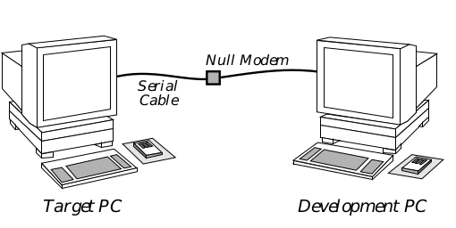

## 2 Setting Up

Setting up your system involves setting up your hardware and installing 
software on it. This chapter explains how to do both and then provides a 
sequence of steps and troubleshooting tips to test your setup.

### 2.1 What You'll Need

This development kit includes much of the software you will need to write 
and debug GEOS applications. It does not, however, include a C compiler or 
the hardware you will need. Make sure you have all of the items on the 
following lists before proceeding.

### 2.1.1 Hardware You'll Need

This kit provides no hardware. To set up your system, you will need at least 
the following:

**Development PC**
The computer on which you will do your programming is 
referred to as the Development PC, the Host PC, or occasionally 
the Workstation. This PC must have an 80386 or more powerful 
processor and preferably eight or more megabytes of RAM. It 
should have a hard disk of at least 80 megabytes.

**Target PC**
The computer on which you will run GEOS and on which you 
will test your applications is referred to as the Target PC or the 
Test PC. This may be any Intel-compatible PC. Geoworks 
recommends that you have two test PCs: A powerful machine 
which you can debug on quickly, and an XT-class machine on 
which you can test your application's speed. When this isn't 
possible, you should try to have a more powerful machine in 
order to test various video drivers and memory configurations 
with your application.

**Serial Cable(s)**
The Host and Target PCs must be connected via serial link. You 
should keep the machines relatively close together, so a six-foot 
cable should be adequate.

**Null Modem**
A null modem is required in the serial connection between the 
host and target PCs. Without it, the send and receive pins on 
one of the machines will be reversed. Note that Lap-link cable 
includes this null-modem connection.

Gender Changers and/or Adapters for Serial Cables
Depending on the cables and connectors you have, you may 
need one or more serial line gender changers or other adapters.

#### 2.1.2 Software You'll Need

As stated above, this kit does not provide all the software you'll need. Both 
the host and target machines must be loaded with some version of DOS, and 
you will also need to have the following:

C Compiler
Currently, only Borland C/C++ 3.0 and 3.1 are supported for 
GEOS development. Geoworks is working on supporting others.

You may also want to use a task-switching environment on the host machine 
to make switching between coding, compiling, and debugging easier and 
quicker.

### 2.2 Setting Up the Hardware

First, set up your two PCs according to their included instructions (if any). 
Keep in mind that you will be switching frequently between the two 
machines and that you will often be using the mouse on the target machine 
while typing on the keyboard of the host machine.

Next, connect the two machines via serial cable and a null modem. Be sure 
to remember which serial ports you used on both machines, as you will need 
to know when installing the software. You may need to add in gender 
changer(s), 9-to-25 pin adapter(s), or other connectors, depending on your 
machines and your cables. A simplified diagram of the connection is shown 
in Figure 1-1.

*__Figure 1-1__ Workstation Setup
The test and development PCs communicate via a null modem serial connection.*

#### 2.3 Installing the Software

Once you have finished setting up your machines and have connected the 
serial cable, you must install the GEOS development kit. Place the SDK 
CD-ROM into your CD-ROM drive, change to that drive, and run the INSTALL 
program.

The installation program will ask questions so it can set up the DOS 
environment for use with the GEOS development tools. These questions 
include which COM ports you used to connect the development and test 
machines. Answering these questions incorrectly can cause the SDK not to 
function properly.

Important: You must set both machines to use the same baud rate. They may 
use different COM ports, but they must have the same baud rate.

After you have installed the two disk sets, you must install your C compiler 
on the host (development) machine (if you have not already done so). Follow 
the instructions provided with your compiler.

Finally, you should run through the "setup" programs for both the 
error-checking and the non error-checking versions of GEOS on the target 
machine. To run the error-checking version, type

~~~
C:\>cd geosec
C:\GEOSEC>geosec
~~~

This will run GEOS, which will automatically kick into the graphical setup 
program. This program will ask you your video type, your mouse type, etc. If 
the setup does not go smoothly, try reinstalling the target disks.

To run the non error-checking setup, type

~~~
C:\>cd geosnc
C:\GEOSNC>geos
~~~

Again, if the set-up does not go smoothly, try reinstalling the disks. If this 
does not work, check that you are using the proper hardware configurations. 
If one or both of the two GEOS directories does not exist, try reinstalling the 
target disks.

### 2.4 Testing the Configuration

Once you have finished installing all the software, your system should be 
ready for you to begin programming. To check it, however, run through the 
following sequence of steps. You will learn later exactly what these steps do 
in more detail, but for now it is sufficient just to try them.

**Host Machine: cd \pcgeos\appl\sdk_c\hello**

On the host machine, change directories:

~~~
C:\>cd \pcgeos\appl\sdk_c\hello
~~~

If this directory does not exist, check that the \PCGEOS directory exists. If it 
doesn't, check which directory you installed into, and try that path instead. 
If this still doesn't work, make sure that something has been installed on your 
hard drive; if nothing has, you should try reinstalling the host disk set.

**Host Machine: mkmf**

Next, run the "make Makefile" program on the host machine with the mkmf 
command:

~~~
C:\PCGEOS\APPL\SDK_C\HELLO>mkmf
Don't forget to run "pmake depend"
~~~

Your directory should now contain a file called MAKEFILE.

+ If you get a "Bad command or file name" error, make sure that your path 
includes C:\PCGEOS\BIN (or C:\DIR\BIN, where DIR is the name of the 
directory in which you installed the host machine programs). 

**Host Machine: pmake depend**

Next, create a dependencies file with the pmake depend command. The 
output you get should be similar to that shown below.

~~~
makedpnd ENDCMODULES GOC GOC goc -M -D__GEOS__ -IDEPENDS -I. -IC:\PCGEOS\INCLUDE 
-IC:\PCGEOS\INCLUDE\ANSI -I- -IDEPENDS -I. -IC:\PCGEOS\INCLUDE 
-IC:\PCGEOS\INCLUDE\ANSI -w -cb ENDFLAGS HELLO.GOC ENDFILES CPP BORLAND CPP 
-D__GEOS__ -Ot -c -v -y -i200 -ml -I. -IC:\PCGEOS\INCLUDE -IC:\PCGEOS\INCLUDE\ANSI 
ENDFLAGS HELLO.C ENDFILES 

FILE C:\PCGEOS\INCLUDE\stdapp.goh, line 18 Warning: remaking @optimized file 
C:\PCGEOS\INCLUDE\stdapp.goh. Missing depends or pre-goc'ed file

FILE C:\PCGEOS\INCLUDE\object.goh, line 17 Warning: remaking @optimized file 
C:\PCGEOS\INCLUDE\object.goh. Missing depends or pre-goc'ed file

FILE C:\PCGEOS\INCLUDE\ui.goh, line 17 Warning: remaking @optimized file 
C:\PCGEOS\INCLUDE\ui.goh. Missing depends or pre-goc'ed file

FILE C:\PCGEOS\INCLUDE\iacp.goh, line 22 Warning: remaking @optimized file 
C:\PCGEOS\INCLUDE\iacp.goh. Missing depends or pre-goc'ed file

FILE C:\PCGEOS\INCLUDE\gcnlist.goh, line 21 Warning: remaking @optimized file 
C:\PCGEOS\INCLUDE\gcnlist.goh. Missing depends or pre-goc'ed file

Processing HELLO.C...

Borland C++ Preprocessor Version 3.1 Copyright (c) 1992 Borland International

hello.c:

Available memory 3563940

findlbdr HELLO.GP DEPENDS.MK HELLO.GEO

C:\PCGEOS\APPL\SDK_C\HELLO>
~~~

There should now be a file in your directory called DEPENDS.MK. Don't worry 
about those "remaking @optimized file" warnings; these come up when some 
header files are used for the first time.

+ If you get an error like

~~~
"makefile". line 13: Could not find GEOS.MK
"LOCAL.MK", line 3: Could not find GEODE.MK
Fatal errors encountered -- cannot continue
~~~

you should make sure that your ROOT_DIR variable is set correctly. 
ROOT_DIR should be the name of whatever directory you installed the 
host files to. Normally this is C:\PCGEOS.

+ If you get the error

~~~
C:\PCGEOS\BIN\PMAKE.EXE: Can't figure out how to make DEPEND. Stop
~~~

then your makefile was not created correctly. Try running mkmf again to 
make sure that a makefile is being created.

+ If you get the error shown below, you should make sure that you have 
correctly installed your C compiler, and make sure that your C compiler's 
executable is in your path.

~~~
makedpnd ENDCMODULES GOC GOC goc -M -D__GEOS__ -IDEPENDS -I. 
-IC:\PCGEOS\INCLUDE -IC:\PCGEOS\INCLUDE\ANSI -I- -IDEPENDS -I. 
-IC:\PCGEOS\INCLUDE -IC:\PCGEOS\INCLUDE\ANSI -w -cb ENDFLAGS HELLO.GOC 
ENDFILES CPP BORLAND CPP -D__GEOS__ -u- -c -v -y -Ot -Oi -i200 -ml -I. 
-IC:\PCGEOS\INCLUDE -IC:\PCGEOS\INCLUDE\ANSI ENDFLAGS HELLO.C ENDFILES 

Processing HELLO.C...
Depends file removed.
*** Error code 1

Stop.
~~~

**Host Machine: pmake**

Next, make the executable file with the pmake command. The output you 
should see is shown below. 

~~~
C:\PCGEOS\APPL\SDK_C\HELLO>pmake
BCC -D__GEOS__ -u- -c -v -y -Ot -Oi -i200 -ml -I. -IC:\PCGEOS\INCLUDE -IC:\PCGEOS\I
NCLUDE\ANSI -oHELLO.OBJ HELLO.C
Borland C++ Version 3.1 Copyright (c) 1992 Borland International
hello.c:
	Available memory 3475572
glue -Og HELLO.GP -P 0.0 -R 0.0.0.0 -m -LC:\PCGEOS\INCLUDE\LDF -T 1 -o HELLOEC.GEO 
HELLO.OBJ
Resource            Size    # Relocs
--------------------------------------------------
CoreBlock              0       0
dgroup               144	   3
HELLO_TEXT           125       8
INTERFACE            180       1
APPRESOURCE          416       1

Total size: 865 bytes
Uninitialized data/stack: 2000 bytes

Import  Number  Type   Protocol
----------------------------------
geos      0	   library  654.000
ui        1    library  741.001
borlandc  2    library    1.000
~~~

You should now have a HELLO.GEO file in your current working directory on 
the host machine. If you do not, try the last few steps again, checking for 
errors in the output. If there are any, try reinstalling the host disk set and 
running through this procedure again.

**Target Machine: cd \geosec**

On your target machine, change to your GEOSEC directory.

**Target Machine: pccom**

Now, on the target machine, run the pccom tool, which connects the target 
machine to the host machine.

~~~
C:\GEOSEC>pccom
~~~

The screen should clear, its background should go dull gray, and the line

waiting for command from remote PC:

should appear at the top in yellow letters. If the pccom tool could not be 
found, make sure you typed it correctly, and then make sure it is in a 
directory in your DOS path.

Try typing the Enter key, which should return you to DOS. 

+ If it does not, then your communication set-up is not configured correctly. 
Double-check the values of your PTTY variable. If you're uncertain about 
the meaning of these values, or how they should be set, you should 
consult "Troubleshooting Communications," Appendix A.

Assuming the pccom tool returned you to DOS, run the pccom tool again to 
get back to the "waiting for command from remote PC" line.

**Host Machine: pcs**

Return to the host PC. Download the newly-created HELLOEC.GEO file from 
the host to the target with the following command:

~~~
C:\PCGEOS\APPL\SDK_C\HELLO>pcs
sending HELLOEC.GEO to WORLD\C
~~~

Your target PC should give output similar to the following:

~~~
waiting for command from remote PC:
Receiving: WORLD\C\HELLO.GEO -
File Transfer Complete
waiting for command from remote PC:
~~~

+ If it does not, either HELLOECGEO does not exist (check the earlier steps) 
or the pccom tool is not working properly. If you get the error message 
"No matching files," that means that pcs cannot find your HELLOEC.GEO 
file. Make sure you did the pmake correctly.

+ If HELLOEC.GEO exists but pcs still can't send it to the target machine, 
then you probably have a problem with your serial connection. Double 
check the values set in both machines' PTTY variables. If you aren't sure 
what these values should be, or if they look correct, then consult 
"Troubleshooting Communications".

+ If you have successfully gone through the communication 
troubleshooting procedure and pcs still isn't working, there's one more 
thing you should try: If both machines lock up soon after the "sending 
HELLOEC.GEO to WORLD\C" message appears, you may be trying to 
transmit at too high a rate. Reduce the speed of transmission on both the 
host and target machines. If you've already looked through 
"Troubleshooting Communications," Appendix A, then you know that 
you can do this by changing the second field of the PTTY variable or by 
passing the /b flag to the pccom tool and pcs.

**Host Machine: swat**

Assuming all has gone well so far, run the debugger now by typing

~~~
C:\PCGEOS\APPL\SDK_C\HELLO>swat
~~~

The screen should clear after a moment, and the following should come up on 
the host's screen:

~~~
Swat version 2.0 (Dec 11 1992 13:47:14).
Using the trunk version of PC/GEOS.
Looking for "loader"...C:\PCGEOS/Loader/LOADEREC.EXE
Sourcing swat.tcl...done
PC Attached
Stopped in 0dedh:0007h, address 0dedh:0007h
LoadGeos: CLD ;DF=0
(loader:0) 1 =>
~~~

+ If you get an error like the following:

~~~
Abnormal program termination:Memory protection fault
CS:EIP = 000Fh:0000000Ahof PC/GEOS
~~~
then chances are there is a mistake in your CONFIG.SYS file, either on the 
FILES or BUFFERS line. Your FILES value should probably be at least 80 
(at least 100 if you will be task-switching while using Swat). You may 
note the use of the word "probably" in that last sentence. The third-party 
memory manager used by Swat has trouble on some hardware set-ups; 
for these machines, you should try lowering the files number in your 
CONFIG.SYS to 60 and/or raise the BUFFERS value to 40.

Another possible cause for this sort of error is that your environment 
variables may be over-running their space. To increase the environment 
space, make sure there is a line in your CONFIG.SYS file following the 
pattern:

~~~
shell = command.com /e:XXXX /p
~~~

where XXXX is a number, 1024 or higher.

+ If the only thing that appears on your host machine is

~~~
Using the trunk version of PC/GEOS.
~~~

and your target machine is frozen (i.e. nothing else appears for at least a 
minute), you should probably try communicating at a slower rate. Try 
changing the PTTY variables to use lower values (such as 9600, if you are 
trying with 19200). Remember that the value should be the same on both 
machines.

**Host Machine: c**

If everything has gone well up to this point, then type "c" at the Swat shell 
prompt.

~~~
(loader:0) 1 => c

Looking for "geos Eker"...C:/PCGEOS/Library/Kernel/geosec.geo
Looking for "ms4 Eifs"...C:/PCGEOS/Driver/IFS/DOS/MS4/ms4ec.geo
Thread 1 created for patient geos
Thread 2 created for patient geos
Looking for "vidmem Edrv"...C:/PCGEOS/Driver/Video/Dumb/VidMem/vidmemec.geo
Looking for "swap Elib"...C:/PCGEOS/Library/Swap/swapec.geo
Looking for "xms Edrv"...C:/PCGEOS/Driver/Swap/XMS/xmsec.geo
Looking for "disk Edrv"...C:/PCGEOS/Driver/Swap/Disk/diskec.geo
Looking for "kbd drvr"...C:/PCGEOS/Driver/Keyboard/kbd.geo
Looking for "nimbus Edrv"...C:/PCGEOS/Driver/Font/Nimbus/nimbusec.geo
Looking for "stream Edrv"...C:\PCGEOS/Driver/Stream/streamec.GEO
Looking for "sound Elib"...C:/PCGEOS/Library/Sound/soundec.geo
Looking for "standardEdrv"...C:/PCGEOS/Driver/Sound/Standard/standard.geo
Looking for "ui Elib"...C:/PCGEOS/Library/User/uiec.geo
Thread 0 created for patient ui
Looking for "styles Elib"...C:\PCGEOS/Library/Styles/stylesec.GEO
Looking for "color Elib"...C:\PCGEOS/Library/Color/colorec.GEO
Looking for "ruler Elib"...C:\PCGEOS/Library/Ruler/rulerec.GEO
Looking for "text Elib"...C:/PCGEOS/Library/Text/textec.geo
Looking for "motif Espu"...C:\PCGEOS/Library/Motif/motifec.GEO
Looking for "vga Edrv"...C:/PCGEOS/Driver/Video/VGAlike/VGA/vgaec.geo
Looking for "nonts Edrv"...C:/PCGEOS/Driver/Task/NonTS/nontsec.geo
Looking for "spool Elib"...C:\PCGEOS/Library/Spool/spoolec.GEO
Thread 0 created for patient spool
Thread 0 created for patient spool
Looking for "serial Edrv"...C:/PCGEOS/Driver/Stream/Serial/serialec.geo
Looking for "msSer Edrv"...C:/PCGEOS/Driver/Mouse/MSSer/msserec.geo
Looking for "welcome Eapp"...C:/PCGEOS/Appl/Startup/Welcome/welcomee.geo
Thread 0 created for patient welcome
~~~

+ If you get the following sorts of errors (this will occur after a fair amount 
of normal Swat output)

~~~
Looking for "sound Elib"...C:/PCGEOS/Library/Sound/soundec.geo
Looking for "standardEdrv"...hmmmm.
Can't find executable file for "standardEdrv" (version mismatch?)
Answer "quit" to exit to the shell
Answer "detach" to detach and return to top level
Answer "ignore" to ignore this patient
Where is it? C:\PCGEOS\APPL\SDK_C\HELLO/
~~~

then your FILES value in your CONFIG.SYS file may be set too low. Try 
changing this value to something higher (it should probably be at least 
80 for most users, at least 100 if you will be using Swat while 
task-switching). You may note the use of the word "probably" in that last 
sentence. The third-party memory manager used by Swat has trouble on 
some hardware setups; for these machines, you should try lowering the 
files number in your CONFIG.SYS to 60 and/or raise the BUFFERS value 
to 40.

+ If you get the following error:

~~~
Looking for "geos Eker"...c:/pcgeos/Library/Kernel/geosec.geo

Interrupt 13: Protection violation

Stopped in 3328h:2a6dh, address 3328h:2a6dh

Swat+10861: CALL Swat+4114

(geos:0)
~~~

Then interrupts on your target machine are interfering with interrupts 
which Swat uses to communicate between machines. Exit the pccom tool 
on the target machine (if you encounter this error, chances are you will 
need to restart your target machine), and make sure that from now on 
you call the pccom tool with the /i:d flag. This will ask the pccom tool to 
ignore spurious interrupt 13 signals (d is 13 in hex). To do this, create a 
file called COMM.BAT on the target machine with the following contents:

~~~
pccom /i:d
~~~

From now on, whenever you would normally invoke the pccom tool on 
the target machine, just use comm instead.

**Host Machine: quit**

When you can get through all of those steps without hitting any errors, your 
setup is probably in good working order.

To exit from Swat (so that you can go on to other things), type quit at the 
Swat prompt. You may need to enter the DOS command cls to reset your 
screen after exiting Swat.

[Introduction](Introduction.md) <-- &nbsp;&nbsp; [table of contents](../Tutorial.md) &nbsp;&nbsp; --> [The Plan](The_Plan.md)

