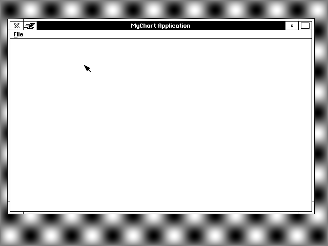
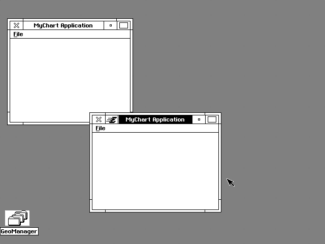

## 4 The Primary Window

In this chapter, we will explore our first stage in constructing a charting 
application. This first stage consists of a primary window, which we will use 
to hold the rest of the program's UI gadgetry. So far, our application consists 
of about twenty-five lines of code, and indicates how we will organize the rest 
of our code.

We will learn how to compile and link the application, explore its source code, 
and later explore the program itself using the Swat debugger.

### 4.1 README

You are about to start typing in the source code of a new program. Before we 
tell you exactly what to do, we're going to spell out some miscellaneous 
caveats. If you stick exactly to the instructions given in the Tutorial, none of 
these things should become issues; however, you might want to look over 
these warnings, as they might apply to future projects.

+ These instructions assume that you will name your files MCHRT.GOC and 
MCHRT.GP and that you will place those files in a directory called MCHRT 
which will appear somewhere under your PCGEOS\APPL directory. If you 
name the directory something other than MCHRT, you should change the 
name of the .GP file to match.

+ If you have trouble attaching the Swat debugger but have had no trouble 
sending files between the machines using the pccom tool, you might try 
either reducing your communication speed or consulting 
"Troubleshooting Communications," Appendix A of this book.

### 4.2 Creating the Application

We set up our files in a subdirectory of \PCGEOS\APPL (we'll use 
\PCGEOS\APPL\MCHRT) on the host machine. The files are MCHRT.GP 
(which contains the "geode parameters," which tell the linker how the 
application is organized) and MCHRT.GOC, the source code of the application.

The text of these files as you should type them in appear in Code Display 3-1 
and Code Display 3-2.

To turn our source code into a working application, we invoke the following 
commands in the MCHRT directory:

**mkmf** This creates a "makefile" for the application, which will tell the 
pmake utility the steps with which to construct the application.

**pmake depend**  
This creates a dependencies file, which will tell pmake which 
files will need to be remade when any given file is altered.

**pmake** This utility invokes the preprocessor, compiler, and linker to 
create the final application.

When you have completed these steps, your directory should contain some 
new files, including MCHRTEC.GEO. Congratulations, you've created a GEOS 
application!

**If You Are Running Windows On The Host**

To allow communication between the host and target mcahines, invoke the 
pccom tool on the target machine while in the GEOSEC directory. 

Start up Swat by double-clicking on the Swat icon in the GEOS SDK program 
group. The following should appear in the Swat window:

~~~
Swat version 2.0 (Jan 20 1993 21:06:13).
Using the trunk version of PC/GEOS.
Looking for "loader"...C:\PCGEOS/Loader/LOADEREC.EXE
Sourcing swat.tcl...done
PC Attached
Stopped in LoadGeos, address 1e2dh:0007h
LoadGeos: CLD ;DF=0
(loader:0) 1 => 
~~~

At this point, Swat is telling us that it has successfully established 
communications with the target machine, and has started the process of 
loading the GEOS kernel on that machine. At this point, Swat halts so that 
you may invoke any Swat commands you might want before the kernel is 
fully loaded. In our case, we don't want to invoke any Swat commands until 
we've started our application, so we ask Swat to continue:

~~~
(loader:0) 1 => c
Looking for "geos Eker"...C:/PCGEOS/Library/Kernel/geosec.geo
Looking for "ms4 Eifs"...C:/PCGEOS/Driver/IFS/DOS/MS4/ms4ec.geo
Thread 1 created for patient geos
Thread 2 created for patient geos
Looking for "vidmem Edrv"...C:/PCGEOS/Driver/Video/Dumb/VidMem/vidmemec.geo
Looking for "swap Elib"...C:/PCGEOS/Library/Swap/swapec.geo
Looking for "xms Edrv"...C:/PCGEOS/Driver/Swap/XMS/xmsec.geo
Looking for "disk Edrv"...C:/PCGEOS/Driver/Swap/Disk/diskec.geo
Looking for "kbd drvr"...C:/PCGEOS/Driver/Keyboard/kbd.geo
Looking for "nimbus Edrv"...C:/PCGEOS/Driver/Font/Nimbus/nimbusec.geo
Looking for "stream Edrv"...C:\PCGEOS/Driver/Stream/streamec.GEO
Looking for "sound Elib"...C:/PCGEOS/Library/Sound/soundec.geo
Looking for "standardEdrv"...C:/PCGEOS/Driver/Sound/Standard/standard.geo
Looking for "ui Elib"...C:/PCGEOS/Library/User/uiec.geo
Thread 0 created for patient ui
Looking for "styles Elib"...C:\PCGEOS/Library/Styles/stylesec.GEO
Looking for "color Elib"...C:\PCGEOS/Library/Color/colorec.GEO
Looking for "ruler Elib"...C:\PCGEOS/Library/Ruler/rulerec.GEO
Looking for "text Elib"...C:/PCGEOS/Library/Text/textec.geo
Looking for "motif Espu"...C:\PCGEOS/Library/Motif/motifec.GEO
Looking for "vga Edrv"...C:/PCGEOS/Driver/Video/VGAlike/VGA/vgaec.geo
Looking for "nonts Edrv"...C:/PCGEOS/Driver/Task/NonTS/nontsec.geo
Looking for "spool Elib"...C:\PCGEOS/Library/Spool/spoolec.GEO
Thread 0 created for patient spool
Looking for "serial Edrv"...C:/PCGEOS/Driver/Stream/Serial/serialec.geo
Looking for "msSer Edrv"...C:/PCGEOS/Driver/Mouse/MSSer/msserec.geo
Looking for "welcome Eapp"...C:/PCGEOS/Appl/Startup/Welcome/welcomee.geo
Thread 0 created for patient welcome
~~~

Each of these "Looking for-" lines signals that the system is loading some 
geode and that Swat is thus looking for its symbolic information on the host 
machine. Swat also tells us whenever it creates (or exits) a thread for any 
geode.

Wait while Swat loads GEOS on the target machine. When GEOS has come up 
on the target machine, make sure that you're in the a workplace where you'll 
be able to start up applications (such as the Advanced Room, reachable from 
the Welcome Room).

Back on the host machine, type Ctrl-C in the Swat window. At this point, the 
Swat prompt should appear. Type "send mchrt" to download the application 
to the target machine. To run the application, type "run mchrt". You will be 
faced with the Swat prompt one more time. Type "c".

The window pictured on the first page of this chapter should appear on your 
screen.

**If You Are Working From the DOS Prompt on the Host**

To upload the application to the target machine, invoke the pccom tool on 
the target machine while in the GEOSEC directory. Then type pcs on the host 
machine (still in the MCHRT directory). The application should be 
downloaded to your target machine's WORLD directory (or to some 
subdirectory of the WORLD directory, depending on where you set up your 
source files).

To try out your application on the target machine, type scrolllock-shift-s to 
start up GEOS if you are still running the pccom tool; if you have already 
exited to the DOS shell, invoke loader within the GEOSEC directory. Your 
application should be in the WORLD directory. Look for a Geoworks symbol 
icon with the words "MyChart Application" underneath. Double-click on the 
icon.

The window pictured on the first page of this chapter should appear on your 
screen.

### 4.3 The Application So Far

Right now, application basically consists of a Primary Window. You might 
think that the application looks rather plain, and it does. However, note the 
following features you have already included in your application with this 
skeletal program:

+ The window is resizable. The primary window comes complete with 
resize handles at the corners, plus functioning maximize and minimize 
buttons.

+ The Motif Specific User Interface dictates that by default there should be 
a File menu with a Quit item. This menu and item are created 
automatically. The window also has the close button in the top-left 
corner, as dictated by Motif.

+ The window can house the Express Menu. 

+ The application can restore itself from state: if the user shuts down the 
system and restarts later, the application will come up again just as it 
was before.

+ Your application is multi-launchable. 

### 4.4 MCHRT.GP: Geode Parameters

The geode parameters file tells the Glue linker about our application's 
general organization. You can get complete information about all of the 
possible fields in a .gp file by reading "First Steps: Hello World," Chapter 4 
of the Concepts book. Let's take a look at the code and find out what each line 
does.

~~~
name mchrt.app
~~~

The name field determines the name that Swat and Glue will assume the 
application is named. If you changed this value to "pchrt.app," Swat and Glue 
would think your application should be named "PCHRTEC.GEO." (The "EC" 
stands for "error checking"-while we're debugging the program, we'll 
generate an error-checking version of the executable.) To comply with the 
DOS 8.3 file name scheme and allow for the addition of the EC suffix to the 
file name, your name should be six characters or less.

~~~
longname "MyChart"
~~~

This is the longname of the file which Glue will use when creating the file in 
which the application will reside. When the application's file appears in a 
GeoManager folder window, this is the name that will be used.

~~~
type appl, process
~~~

The type line tells Glue what sort of geode this is. Ours is a typical application 
in that it needs only the appl and process keywords. The appl word lets Glue 
know that this geode has a process aspect. The process word specifies that the 
geode should have its own process. 

At this point, you may be asking what a "process" is. (If you aren't, then feel 
free to skip this paragraph.) You may have heard that GEOS is multi-tasking 
or multi-threaded. The system allows more than one "thread" of execution to 
run; it run one piece of code for a while, then switch over to another piece. 
This allows programs to run in the background: the system will devote most 
of its time to running the application in the foreground, but will also run the 
background programs some of the time. By saying that our application has a 
process, we are requesting that it have its own thread of execution. If we were 
writing a library, we probably wouldn't want to give it a process, figuring that 
other geodes would be executing the library's code.

~~~
class MCProcessClass
~~~

When creating a new thread in GEOS, you must specify an object class to 
manage the thread. GEOS will automatically create a process thread for our 
application, and the class line makes it known that an object of the class 
MCProcessClass will be put in charge of that thread. We will describe this 
class in our source code.

~~~
appobj MCApp
~~~

The appobj line allows you to specify the object in your application which will 
represent the application to other parts of the system. We will describe this 
object in our source code.

~~~
tokenchars "MCht"
tokenid 0
~~~

These fields allow you to specify the token of the application. This token will 
be used to identify your application's documents, and certain 
inter-application communications which may be initiated by or intended for 
your application. The tokenchars field is a string of four characters. Normally 
these four characters are taken from the name of the application. In case two 
different products happen to have the same token characters, the token also 
has a tokenid number, which will be used to differentiate between products 
by different manufacturers. We are using a tokenid of zero, but in practice 
you should use your manufacturer ID.

~~~
library geos
library ui
~~~

All GEOS libraries are dynamically loaded. By telling Glue about them with 
these library lines, we ask that the geos and ui libraries automatically be 
loaded for our application.

~~~
resource APPRESOURCE ui-object
resource INTERFACE ui-object
~~~

With these lines, we list the application's resources. A resource is a block of 
memory. In this case, both of our resources contain object declarations. We 
specify that we want the objects in these resources to be run by our 
application's UI thread. As we expand on our application, we will add more 
resources.

By breaking up our application into resources, we allow it to run more 
efficiently. The system will load only those resources that it needs to. When 
we take a look at the source code, we will see why we have organized the 
application's resources in this way.

The ui-object keyword signals that the resources contain objects which 
should be run by the UI thread. By asking that these resources be run by the 
UI thread, we ensure that our application will have a UI thread. Again, by 
"thread" we mean a thread of execution. Our process runs in one thread, and 
now we've asked that another thread be created to manage these UI objects.

If we didn't want the application to have two threads, we could have declared 
these resources as object instead of ui-object. By having execution take 
place in two separate threads, we can allow the user to interact with UI 
gadgetry while computation goes on in the background. This means that the 
user will get valuable feedback that their actions are being acknowledged, 
even if our program isn't fast enough to do all of the underlying calculations 
quickly.

### 4.5 MCHRT.GOC: Source Code

This file contains the source code for the application. Right now, there's 
nothing that you would recognize as procedural code. All there is to this 
application is a class and a couple of objects. Again, let's look at the code line 
by line. We will discuss what each of these lines does, but will not go into 
depth about their syntax here. For more information about Goc syntax, see 
"GEOS Programming," Chapter 5 of the Concepts book.

~~~
@include <stdapp.goh>
~~~

Our first line of code is an @include directive. This is a special Goc form of 
the #include directive. (Generally, the `@' symbol is used to prefix Goc 
keywords.) @include behaves in the same manner as #include, except that 
the inclusion will only take place when the Goc preprocessor is processing the 
source code. The file will not be included when your C compiler gets to it. 
Generally, you @include .goh files, but use #include to include normal .h 
files.

~~~
@class MCProcessClass, GenProcessClass; 
@endc; /* MCProcessClass */
~~~

The @class keyword signals that we're creating a class. This class is to be 
called MCProcessClass, and it is a subclass of GenProcessClass. That 
means that if we haven't set up any special behavior for MCProcessClass 
in a given situation, objects of that class should behave as GenProcess 
objects would. 

Normally, the next few lines would consist of things that made 
MCProcessClass different than GenProcessClass. For now, 
MCProcessClass will behave exactly like its superclass, and thus we will 
have no lines of code cataloging their differences.

The @endc line signals that we're done defining the class and are ready to go 
on to other things.

~~~
@classdecl MCProcessClass, neverSaved;
~~~

Next we declare the class with @classdecl, specifying certain things about 
the class by means of keywords. In this case, the only thing we will specify 
when declaring this class is that it will not be saved to state. That is, we won't 
save our process' data when the system shuts down. To learn more about the 
keywords which can be used with @classdecl, see its entry in "GEOS 
Programming," Chapter 5 of the Concepts book.

~~~
@start AppResource; 
~~~

This line lets Goc know that we want the next block of code to end up in the 
APPRESOURCE resource. From the .gp file, we know that this resource holds 
objects, and that those objects will be run by the UI thread.

~~~
@object GenApplicationClass MCApp = {
~~~

We are defining an object called MCApp. You may recall that in the .gp file, 
we specified that this object was to represent our application to the rest of the 
system. This object will be receiving notice of all sorts of system messages 
and notifications. It will be expected to provide information about the 
application at various times. This is a nontrivial task, and our object will be 
of a class specifically set up to handle these tasks: GenApplicationClass.

Note that the system will sometimes need to know information about an 
application though that application is not running. For instance, 
GeoManager may need to ask the application for its name and icon so that 
it may be displayed in a folder window. For several of these cases, the system 
will need only interact with the system object, and will ignore the rest of the 
application. Because of these cases, we are keeping the application object in 
its own resource. Because of this organization, when the system only needs 
the application object, it will not bother to load in the rest of our application's 
resources.

The next set of fields contains the application object's instance data.

~~~
	 GI_visMoniker = list { @MCTextMoniker }
~~~

This line specifies the name of the object, which will in turn be used as the 
name of the application in certain contexts. We are specifying this name by 
giving a list of object pointers (in this case a list with one element) as the 
value of an instance data field, said field named GI_visMoniker. 

The instance data name "GI_visMoniker" may seem somewhat strange. The 
"GI" stands for "Gen Instance". GenApplicationClass is a subclass of 
GenClass. The GI_visMoniker instance field is inherited from GenClass. By 
Geoworks' naming conventions, instance data field names are prefixed by the 
name of their associated class and an "I" for "Instance". Thus, any 
GenApplicationClass instance field names would begin "GAI_". The 
"visMoniker" part of the name is short for "visual moniker". In GEOS 
parlance, a "visual moniker" is a name used to identify an object to the user. 

~~~
	 GI_comp = @MCPrimary;
~~~

We are setting the value of another instance data field. From the field name, 
you know that this is another field inherited from GenClass. The GI_comp 
field is used to list the children of a generic UI object. In this case, our 
application has only one child object, the primary window MCPrimary.

~~~
	gcnList(MANUFACTURER_ID_GEOWORKS, GAGCNLT_WINDOWS) =@MCPrimary;
}
~~~

This line puts the MCPrimary object, our primary window (to be declared 
later in this file), on a GCN list for window objects.

At this point, you may be wondering what a "GCN list" is. You may recall that 
MCApp is our application object, and is expected to act as the application's 
representative to the system. 

From time to time, the system will send notifications to all applications that 
something important has happened. These notifications are sent out when 
some sort of general change has occurred within the system, thus this 
mechanism is known as General Change Notification, or GCN.

The source line above requests that the application should relay certain types 
of notification on to the MCPrimary object, specifically the sorts of 
notifications that windows would like to hear about. For more information 
about the syntax of this sort of line, see the gcnList entry in "GEOS 
Programming," Chapter 5 of the Concepts book.

~~~
@visMoniker MCTextMoniker = "MyChart Application";
~~~

Here we declare the visual moniker referred to by MCApp's GI_visMoniker 
instance field, above. We are storing the string "MyChart Application" in a 
GEOS data structure set up for exactly this purpose.

~~~
@end AppResource
~~~

This line signals the end of the block of code that we want put into 
APPRESOURCE.

~~~
@start Interface; 
~~~

This line signals that the next block of code should be stored in the 
INTERFACE resource. We will use this resource to store the basic UI tree for 
our application. 

~~~
@object GenPrimaryClass MCPrimary = { } 
~~~

Right now our entire UI tree consists of a single object, a plain primary 
window. We won't be setting values for any of its instance data now, relying 
on the default values for these fields to do the right thing (which they in fact 
will do).

~~~
@end Interface
~~~

We're done putting things into the INTERFACE resource for now. In fact, we're 
done with the program. 

### 4.6 Exploring With Swat

Right now, the application doesn't have any procedural code. In fact, there 
isn't very much code to the application at all. Chances are the program has 
no run-time errors; there just aren't very many places for them to hide. 
However, we can still find out how to use the debugger to find out about the 
object trees which make up our program.

**If You Are Running Windows on Your Host Machine**

You should already have Swat running. Bring up your Swat window. Skip 
ahead to the heading that says "When Swat's Ready."

**If You Are Using the DOS Prompt on Your Host Machine**

Make sure that you are still running the pccom tool from the GEOSEC 
directory of your target. To start Swat on your host machine, type swat. 
Something similar to the following should appear on your host machine:

~~~
Swat version 2.0 (Jan 20 1993 21:06:13).
Using the trunk version of PC/GEOS.
Looking for "loader"...C:\PCGEOS/Loader/LOADEREC.EXE
Sourcing swat.tcl...done
PC Attached
Stopped in LoadGeos, address 1e2dh:0007h
LoadGeos: CLD ;DF=0
(loader:0) 1 => 
~~~

At this point, Swat is telling us that it has successfully established 
communications with the target machine, and has started the process of 
loading the GEOS kernel on that machine. At this point, Swat halts so that 
you may invoke any Swat commands you might want before the kernel is 
fully loaded. In our case, we don't want to invoke any Swat commands until 
we've started our application, so we ask Swat to continue:

~~~
(loader:0) 1 => c
Looking for "geos Eker"...C:/PCGEOS/Library/Kernel/geosec.geo
Looking for "ms4 Eifs"...C:/PCGEOS/Driver/IFS/DOS/MS4/ms4ec.geo
Thread 1 created for patient geos
Thread 2 created for patient geos
Looking for "vidmem Edrv"...C:/PCGEOS/Driver/Video/Dumb/VidMem/vidmemec.geo
Looking for "swap Elib"...C:/PCGEOS/Library/Swap/swapec.geo
Looking for "xms Edrv"...C:/PCGEOS/Driver/Swap/XMS/xmsec.geo
Looking for "disk Edrv"...C:/PCGEOS/Driver/Swap/Disk/diskec.geo
Looking for "kbd drvr"...C:/PCGEOS/Driver/Keyboard/kbd.geo
Looking for "nimbus Edrv"...C:/PCGEOS/Driver/Font/Nimbus/nimbusec.geo
Looking for "stream Edrv"...C:\PCGEOS/Driver/Stream/streamec.GEO
Looking for "sound Elib"...C:/PCGEOS/Library/Sound/soundec.geo
Looking for "standardEdrv"...C:/PCGEOS/Driver/Sound/Standard/standard.geo
Looking for "ui Elib"...C:/PCGEOS/Library/User/uiec.geo
Thread 0 created for patient ui
Looking for "styles Elib"...C:\PCGEOS/Library/Styles/stylesec.GEO
Looking for "color Elib"...C:\PCGEOS/Library/Color/colorec.GEO
Looking for "ruler Elib"...C:\PCGEOS/Library/Ruler/rulerec.GEO
Looking for "text Elib"...C:/PCGEOS/Library/Text/textec.geo
Looking for "motif Espu"...C:\PCGEOS/Library/Motif/motifec.GEO
Looking for "vga Edrv"...C:/PCGEOS/Driver/Video/VGAlike/VGA/vgaec.geo
Looking for "nonts Edrv"...C:/PCGEOS/Driver/Task/NonTS/nontsec.geo
Looking for "spool Elib"...C:\PCGEOS/Library/Spool/spoolec.GEO
Thread 0 created for patient spool
Looking for "serial Edrv"...C:/PCGEOS/Driver/Stream/Serial/serialec.geo
Looking for "msSer Edrv"...C:/PCGEOS/Driver/Mouse/MSSer/msserec.geo
Looking for "welcome Eapp"...C:/PCGEOS/Appl/Startup/Welcome/welcomee.geo
Thread 0 created for patient welcome

Looking for "shell Elib"...C:/PCGEOS/Library/Shell/shellec.geo
Looking for "manager Eapp"...C:/PCGEOS/Appl/FileMgrs/GeoManag/managere.geo
Thread 0 created for patient manager
Thread 1 created for patient manager
~~~

Each of these "Looking for-" lines signals that the system is loading some 
geode and that Swat is thus looking for its symbolic information on the host 
machine. Swat also tells us whenever it creates (or exits) a thread for any 
geode. 

By now you should be in GeoManager. Find the EC MyChart application 
(it should be in the WORLD directory or one of its subdirectories) and 
double-click on it.

~~~
Looking for "math Elib"...C:\PCGEOS/Library/Math/mathec.GEO
Looking for "borlandcElib"...C:\PCGEOS/Library/MATH/COMPILER/BORLANDC/BORLANDC.GEO
Looking for "mchrt Eapp"...C:\PCGEOS/Appl/Mchrt/mchrtec.GEO
Thread 0 created for patient mchrt
Thread 1 created for patient mchrt
~~~

Swat tells us that two libraries, math and borlandc are being loaded. Because 
our application is a C application, the linker loads the borlandc library, which 
itself requires the math library. When all of the libraries which our 
application relies on have been loaded, the application itself is loaded. Two 
threads are created for it, one for the process, the other to manage UI objects. 

**When Swat's Ready**

Let's take a look around the innards of our application. Position the mouse 
over the middle of the application's window and press ctrl-c on the host 
machine to halt Swat and GEOS. The following should appear on the host 
machine:

~~~
PC Halted
Stopped in 0214h:0000h, address 0214h:0000h
102140h: 		CMP 	AH, 16 (10h) 		;16h
(geos:0) 2 =>
~~~

At this point, the target machine freezes and Swat warns us that it is freezing 
the machine with its "PC Halted" message. Swat  provides the address of the 
current instruction. Whatever GEOS routine is being executed now must be 
internal; if it was public, the address would have been given in relation to the 
routine name, and would have thus been more readable. 

Right now we aren't stopped in our application. Remember that GEOS is a 
multi-threaded operating system. When we hit ctrl-c, the target was 
executing the code of some other thread (the geos thread). The prompt tells 
us which thread we're executing, in this case the zeroth thread associated 
with the GEOS geode (the kernel). To examine the thread associated with our 
application, we must request a thread change by typing in the first part of the 
name we gave in the "name" field of the .gp file: 

~~~
(geos:0) 2 => mchrt
[mchrt:0] 3 => 
~~~

Our prompt tells us that we are now in the process thread of the mchrt 
geode. If we were in the UI thread, our prompt would have been "mchrt:1" 
instead. To change threads within a geode, it's enough to type :0 or :1. Let's 
use the where command to find out what this thread was doing when we 
stopped the system.

~~~
[mchrt:0] 3 => where
* 1: near BlockOnLongQueue(), 18a1h:c37bh
  2: far QueueGetMessage(), 18a1h:1b18h
------------------------------------------------------------------------------
The event queue for "mchrt:0" is empty
==============================================================================
[mchrt:0] 4 =>
~~~

This tells us that our thread is waiting for a message: right now our 
application is standing idle, waiting for something to happen. Considering 
how little there is that we can do to our application, perhaps that isn't too 
surprising. 

Next, we'll take a look at some of our UI gadgetry. The gentree command 
tells us about the tree of generic UI objects. We will use the "gentree -i" 
command, which tells us about the generic tree under the mouse pointer; 
assuming that the mouse pointer is over our primary window, we will be able 
to see its tree. If the mouse pointer is not over the primary window, let the 
action on the target machine continue by typing c at the Swat prompt. 
Position the target machine's mouse over the window. Press ctrl-c on the 
host machine, and change threads to mchrt if necessary. You will now be able 
to use gentree's -i option.

~~~
[mchrt:0] 4 => gentree -i
 
*MCPrimary::GenPrimaryClass (@1, ^l4c10h:001eh) "MyChart Application"
 
[mchrt:0] 5 =>
~~~

The gentree command prints out a list of all the objects in the tree, along 
with the object pointers and monikers of those objects. Right now our generic 
tree consists of a single object. Let's take a look at it. Swat lets us use a 
shortcut when specifying the object pointer of the object we want to look at; 
we can use the @number provided. 

The pobj command prints out all of an object's instance data.

~~~
[mchrt:0] 5 => pobj @1
*MCPrimary::GenPrimaryClass (@2, ^l4c10h:001eh)
master part: Gen_offset(164) -- ui::GenPrimaryInstance
@3: {ui::GenPrimaryInstance (^h19472:662)+164} = {
  GenDisplayInstance GenPrimary_metaInstance = {
    GenInstance GenDisplay_metaInstance = {
      MetaBase Gen_metaInstance = {
        ClassStruct _far *MB_class = 360ah:1f65h (motif::dgroup::OLBaseWinClass)
      }
      LinkPart GI_link = {
        void _optr LP_next = parent *MCApp::GenApplicationClass (@4, ^l3b10h:0024h)
      }
      CompPart GI_comp = {
        void _optr CP_firstChild = null
      }
      void _lptr GI_visMoniker = 0022h [14 bytes at ^l3b10h:0022h]
      KeyboardShortcut GI_kbdAccelerator = {
        KS_PHYSICAL = 0
        KS_ALT = 0
        KS_CTRL = 0
        KS_SHIFT = 0
        KS_CHAR_SET = 0
        KS_CHAR = C_NULL
      }
      GenAttrs GI_attrs = {GA_KBD_SEARCH_PATH, GA_TARGETABLE}
      GenStates GI_states = {GS_USABLE, GS_ENABLED}
    }
    GenDisplayAttrs GDI_attributes = {GDA_USER_DISMISSABLE}
    void _optr GDI_document = null
  }
  void _lptr GPI_longTermMoniker = null
}
Variable Data:
	*** No Variable Data ***
[mchrt:0] 6 =>
~~~

We certainly got a lot of data from that command! Let's take a look at what 
it means, and which parts of this we should be paying attention to.

~~~
*MCPrimary::GenPrimaryClass (@2, ^l4c10h:001eh)
~~~

The first line tells us that our object is of class GenPrimaryClass. It also 
tells us the object's address (^l4c10h:001eh) which would come in handy if 
we hadn't already known its value from gentree's output. 

~~~
master part: Gen_offset(164) -- ui::GenPrimaryInstance
@3: {ui::GenPrimaryInstance (^h19472:662)+164} = {
  GenDisplayInstance GenPrimary_metaInstance = {
    GenInstance GenDisplay_metaInstance = {
      MetaBase Gen_metaInstance = {
        ClassStruct _far *MB_class = 360ah:1f65h (motif::dgroup::OLBaseWinClass)
      }
      LinkPart GI_link = {
        void _optr LP_next = parent *MCApp::GenApplicationClass (@4, ^l3b10h:0024h)
      }
      CompPart GI_comp = {
        void _optr CP_firstChild = null
      }
      void _lptr GI_visMoniker = 0022h [14 bytes at ^l3b10h:0022h]
      KeyboardShortcut GI_kbdAccelerator = {
        KS_PHYSICAL = 0
        KS_ALT = 0
        KS_CTRL = 0
        KS_SHIFT = 0
        KS_CHAR_SET = 0
        KS_CHAR = C_NULL
      }
      GenAttrs GI_attrs = {GA_KBD_SEARCH_PATH, GA_TARGETABLE}
      GenStates GI_states = {GS_USABLE, GS_ENABLED}
    }
    GenDisplayAttrs GDI_attributes = {GDA_USER_DISMISSABLE}
    void _optr GDI_document = null
  }
  void _lptr GPI_longTermMoniker = null
}
Variable Data:
	*** No Variable Data ***
[mchrt:0] 6 =>
~~~

The rest of the output consists of our object's instance data. This fields of 
instance data are grouped by the class which defines them. The GEOS object 
model allows for a special kind of super/sub-class relationship. Some classes 
are marked as "master" classes. A master class is meant to be radically 
different in behavior than its superclass. An ordinary subclass is meant to 
specialize from its superclass, but not in such an extreme way. Instance data 
is grouped by "master level"-those classes which are only specializations of 
one another. By default, pobj will only show us the instance data associated 
with the Generic master level-the most specialized level of GenPrimary's 
class structure. We could have passed different arguments to pobj to see the 
other levels.

As it turns out, all of the instance data we were really prepared to interpret 
here was in the bottom master layer.

We took advantage of another Swat feature here: command completion. As it 
happens, there is no true "pobj" Swat command; the command's name is 
really "pobject". Because "pobject" was the only Swat command that begins 
with "pobj," Swat realized what we meant when we used "pobj."

So far we've seen the application's generic object. Now let's see its visible tree 
of objects using the vistree command:

~~~
[mchrt:0] 6 => vistree @1
 
 *MCPrimary::GenPrimaryClass (@5, ^l4c10h:001eh), rect (41, 28, 642, 410)
    ^l4c10h:0026h::OLMenuBarClass (@6, ^l4c10h:0026h), rect (6, 23, 594, 40)
       ^l4c10h:002ah::OLMenuButtonClass (@7, ^l4c10h:002ah), rect (6, 23, 39, 39)
    ^l4b40h:004ah::OLMenuButtonClass (@8, ^l4b40h:004ah), rect (5, 5, 32, 23)
    ^l4c10h:0020h::OLGadgetAreaClass (@9, ^l4c10h:0020h), rect (6, 40, 594, 375) 
    0::GenTriggerClass (@10, ^l4b40h:003ah), rect (542, 5, 569, 23)
    0::GenTriggerClass (@11, ^l4b40h:003eh), rect (568, 5, 595, 23)
    0::GenTriggerClass (@12, ^l4b40h:0042h), rect (0, 0, 0, 0)
 
[mchrt:0] 7 =>
~~~

While our Generic tree consisted of a single object, our Visual tree as shown 
by the vistree command also reveals some other objects. These are some of 
the objects which were created by the Open Look specific UI to implement our 
Generic Primary window. Our GenPrimary object has some children in its 
visual tree: an Open Look menu bar, gadget area, and four Generic triggers. 
The menu bar has a child itself, a menu button. Each of the objects is listed 
along with its bounds. We could do a pobj on each of these objects to learn 
more about our object. 

What if we were interested in one of the buttons, such as the minimize 
button? Even if you knew that the button would manifest as a GenTrigger, 
how would you know which GenTrigger to examine? We can probably figure 
out which object is which just by looking at their visual bounds, the area to 
which that object will be drawn on-screen. Each object's bounds are defined 
by a rectangle structure with coordinates (left, top, right, bottom). 
Coordinates increase to the right and downwards. Coordinates are measured 
in seventy-seconds of an inch, normally assumed to be a pixel. Coordinates 
are given in terms of the bounds of their parent object.

Thus we see in our example that our Primary window's top left corner is 41 
pixels to the right of and 28 pixels below the top left corner of the screen. The 
menu bar is in turn 6 pixels to the right and 22 pixels below the top left corner 
of the primary window.

Thus we can see that the "gadget area" is that part of the Primary window 
which is below the menu bar, the big gray area.

One of the triggers has confusing boundaries: (0, 0, 0, 0). This is the Express 
Menu button, a gadget unusual in that it travels between applications, 
always appearing in the active primary window. It's bounds are somewhat 
bogus, but it is a very strange object which programs won't normally interact 
with directly.

The other triggers can be recognized by their bounds: The one to the far left 
(left bound of 6) must be the "X" button; The other two must be the minimize 
and maximize buttons.

We could now do a pobj to learn more about this object, perhaps doing a 
"pobj @9".

Next we'll try a series of exploratory Swat commands:

~~~
[mchrt:0] 7 => classes
MCProcessClass (@13, 425fh:0040h), off ui::dgroup::GenProcessClass

[mchrt:0] 8 =>
~~~

The classes command lists all classes created by the application. In the case 
of our application, there is only one such class, our process class. In a more 
complicated application with several special classes running around, the 
classes command comes in handy when you can't remember the names of 
your application's classes.

~~~
[mchrt:0] 8 => cup -p
dgroup::MCProcessClass (@14, 425fh:0040h)
ui::dgroup::GenProcessClass (@15, 2e1ch:11f2h)
geos::kcode::ProcessClass (@16, 18a1h:ac92h)
geos::kcode::MetaClass (@17, 18a1h:abaah)
[mchrt:0] 9 =>
~~~

The cup command shows the complete class hierarchy for a class. Here we 
passed the "-p" argument, specifying that we're interested in our process 
class. We could also have passed "@13" or "425fh:0040h".

~~~
[mchrt:0] 9 => methods -p
[mchrt:0] 10 =>
~~~

The methods command lists all methods for a class; that is the handlers for 
any messages that objects of the class are prepared to intercept. However, we 
haven't written any yet, and thus we don't get any output from this 
command. However, as the application grows, we may wish to use this 
command from time to time to remember the names of our methods.

Another command useful for basic exploration of an application is 
"gentree -a":

~~~
[mchrt:0] 10 => gentree -a

 *MCApp::GenApplicationClass (@18, ^l3b10h:0024h) *** Is Moniker List ***
 *MCPrimary::GenPrimaryClass (@19, ^l4c10h:001eh) "MyChart Application"

[mchrt:0] 11 =>
~~~

The "gentree -a" command shows an application's complete Generic tree 
starting from the application object, the highest-level Generic representation 
of the application.

Let's take an in-depth look at how the application's memory is organized. 
Memory blocks in the GEOS heap are referenced by means of handles. 
Handles are also used to reference other system resources, such as threads, 
geodes, and files. The handles command returns all handles in use by the 
system. We will do a "handles mchrt" to find out about all handles owned by 
our application:

~~~
[mchrt:0] 11 => handles mchrt
There are 2500 handles total, 847 used and 1653 free

HANDLE ADDR   SIZE PREV   NEXT  FLAGS       LOCK    OWNER IDLE OINFO  TYPE
------------------------------------------------------------------------------

2b70h EVENT QUEUE mchrt, thread = mchrt:1, no events
3970h 617ah    288 3fd0h 4b90h  s S          0      mchrt 0:51 0h
3b10h 607eh    896 3560h 1b70h  s SL a       0      mchrt 0:49 4320h R#4 (APPRESOURCE)
3ba0h 717ah    160 1c20h 45a0h  s S  a       0      mchrt 0:49 43a0h Geode
4320h THREAD mchrt:1
4340h EVENT QUEUE mchrt, thread = mchrt:0, no events
43a0h THREAD mchrt:0
44e0h 7bb0h     32 1e10h 33c0h  s S          0      mchrt 0:49 1h
4530h 425fh   2080 4bd0h 4b50h  FIXED n/a           mchrt n/a 1h      R#1 (dgroup) 
4560h FILE sfn = 31, owner = 3ba0h (mchrt)
4aa0h 0000h     16 0000h 0000h  sDS d        0      mchrt 0:51 1h     R#2 (MCHRT_TEXT)
4b40h 5dd9h   1248 33e0h 3250h  s SL a       0      mchrt 0:49 4320h  OBJ(mchrt:1) 
4b50h 42e1h   2176 4530h 4cf0h  FIXED n/a           mchrt n/a 1h      Stack(mchrt:1)
4b90h 618ch    288 3970h 23b0h  s S          0      mchrt 0:51 0h
4c10h 5bb5h    928 3710h 4140h  s SL a       0      mchrt 0:49 4320h R#3 (INTERFACE)
4cc0h 96f7h   1040 1dd0h 1820h  s SL         0      mchrt 0:49 1h     WINDOW

Total bytes allocated: 9152, total handles: 16
[mchrt:0] 12 =>
~~~

Let's take a look at this table and see if we can determine what each of these 
handles is for.

~~~
4320h THREAD mchrt:1
43a0h THREAD mchrt:0
~~~

Two of the handles are marked as THREAD handles. The first of these is the 
handle associated with the application's process thread, the second with the 
UI thread. (In general, the zeroth thread of an application (e.g. mchrt:0) will 
be the process and the first thread (e.g. mchrt:1) will be the UI.)

~~~
2b70h EVENT QUEUE mchrt, thread = mchrt:1, no events
4340h EVENT QUEUE mchrt, thread = mchrt:0, no events 
~~~

Each thread has an event queue associated with it. Whenever something 
sends a message to an object run by a given thread, the message will be 
placed on that thread's event queue. Right now, there are no messages 
queued for either of our threads.

~~~
3b10h 607eh    896 3560h 1b70h  s SL a       0 	    mchrt 0:49 4320h R#4 (APPRESOURCE)
4530h 425fh   2080 4bd0h 4b50h  FIXED n/a           mchrt n/a 1h     R#1 (dgroup) 
4aa0h 0000h     16 0000h 0000h  sDS d        0      mchrt 0:51 1h    R#2 (MCHRT_TEXT)
4c10h 5bb5h    928 3710h 4140h  s SL a       0      mchrt 0:49 4320h R#3 (INTERFACE)
~~~

These are the handles of the memory blocks which hold our application's 
resources. The last two of these we can recognize by name: "INTERFACE" and 
"APPRESOURCE" appear in the TYPE column. The others are resources which 
are created automatically. The "dgroup" resource contains data which will be 
used by our process; if our application ever has any global variables, they will 
be stored in this resource. The dgroup resource also contains our process 
thread's stack. The "MCHRT_TXT" block is our code resource. So far, our 
application has no code, which explains the small size of this block-it is just 
the size of the block's header information, 16 bytes.

~~~
4560h FILE sfn = 31, owner = 3ba0h (mchrt)
~~~

This is the handle of the file in which our application resides. 

~~~
3ba0h 717ah    160 1c20h 45a0h  s S  a       0      mchrt 0:49 43a0h Geode
~~~

This is the handle of the memory block in which our geode resides.

~~~
4cc0h 96f7h   1040 1dd0h 1820h  s SL         0      mchrt 0:49 1h     WINDOW
~~~

This is the handle of a window associated with our application. This is not 
necessarily a "window" in the UI sense-this is a graphics window, an area 
where we have to worry about some drawings obscuring others. This window 
handle is keeping track of the area associated with our primary window, so 
that it will draw "on top of" other window areas. Later, when we have a chart 
view area, we will have another window which, while not an 
independently-movable UI-style "window," will still need a window data 
structure to keep track of the view bounds, so that we cannot draw outside 
the view.

~~~
4b40h 5dd9h   1248 33e0h 3250h  s SL a       0      mchrt 0:49 4320h  OBJ(mchrt:1) 
4b50h 42e1h   2176 4530h 4cf0h  FIXED n/a           mchrt n/a  1h     Stack(mchrt:1)
~~~

Our UI thread manages two more blocks. The first of these is the handle of 
the object block which will contain the objects managed by this thread. The 
second of these is its stack.

~~~
3970h 617ah    288 3fd0h 4b90h  s S          0      mchrt 0:51 0h
44e0h 7bb0h     32 1e10h 33c0h  s S          0      mchrt 0:49 1h
4b90h 618ch    288 3970h 23b0h  s S          0      mchrt 0:51 0h
~~~

Swat doesn't tell us very much about these blocks. If we wanted to explore 
their contents, we could by using the bytes command. However, decoding the 
contents of memory blocks by reading their raw memory contents is beyond 
the scope of this tutorial.

Feel free to use Swat to explore some more. For example, you might use 
pobject to print the instance data of some of the objects revealed by the 
vistree command.

When you're done with Swat and are ready to move onto other things:

**If You Are Using Windows**

In the next chapter, you'll begin by editing the source code, so prepare to 
switch over to the window with your editor.

**If You Are Using the DOS Prompt**

Enter quit at the Swat prompt to exit Swat.

---
Code Display 3-1 MCHRT.GP
~~~
name mchrt.app

longname "MyChart"

type appl, process

class MCProcessClass

appobj MCApp

tokenchars "MCht"
tokenid 0

library geos
library ui

resource APPRESOURCE ui-object
resource INTERFACE ui-object
~~~

---
Code Display 3-2 MCHRT.GOC
~~~
@include <stdapp.goh>

@class MCProcessClass, GenProcessClass; 
@endc /* MCProcessClass */

@classdecl MCProcessClass, neverSaved; 

@start AppResource; 
@object GenApplicationClass MCApp = {
	GI_visMoniker = list { @MCTextMoniker }
	GI_comp = @MCPrimary;
	gcnList(MANUFACTURER_ID_GEOWORKS,GAGCNLT_WINDOWS) = @MCPrimary; 
} /* end of MCApp */

@visMoniker MCTextMoniker = "MyChart Application";
@end AppResource;

@start Interface;
@object GenPrimaryClass MCPrimary = {
} /* end of MCPrimary */
@end Interface;
~~~

[The Plan](The_Plan.md) <-- &nbsp;&nbsp; [table of contents](../Tutorial.md) &nbsp;&nbsp; --> [Data Structures and UI Gadgetry](Data_Structures_and_UI_Gadgetry.md)
