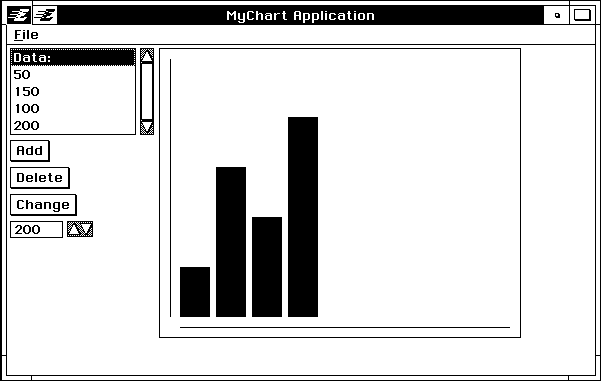

## 6 Views and Visual Objects

In this chapter, we'll learn about some more common program activities, such 
as drawing shapes and working with VM files. We'll see an example of the 
advanced activity of creating an object at run-time. Finally, we'll see how we 
can make using Swat easier by creating a SWAT.RC script file. 

### 6.1 Making the Changes

Make the changes to MCHRT.GOC and MCHRT.GP as indicated in Code 
Display 4-1 and Code Display 4-2. As before, these changes are marked by 
vertical bars in the margin. In some cases (the handlers for 
MSG_GEN_PROCESS_OPEN_APPLICATION and 
MSG_GEN_PROCESS_CLOSE_APPLICATION), new code replaces some old 
code and you must figure out what old code needs to be erased.

In addition, there is a new file which also belongs in the directory from which 
you start up Swat (If you run Swat from the DOS prompt, this directory is 
probably \PCGEOS\APPL\MCHRT; if you run Swat using Windows, it's 
probably \PCGEOS\APPL-you can check the SWAT.PIF file if you aren't 
sure). That is the SWAT.RC file, listed in Code Display 4-3.

After making the changes to the files, remake the executable with pmake. 
Send the remade geode to the target machine using pcs or the send Swat 
command.

### 6.2 The Application So Far

The application now draws a bar chart within a view window. It saves the list 
of data within a file, and can retain that data after closing and re-opening the 
application. 

+ The "view window" in which the chart is displayed is managed by a 
GenView object. Note that the view is not exactly a window in the same 
style as the primary window; the primary moves independently while the 
view does not. 

+ We have organized some of our UI gadgetry inside a GenInteraction 
object. This object serves solely to group other gadgets. By grouping 
objects in this way and applying a hint to the primary window, we're able 
to achieve the layout that we want. Note that we should test this layout 
out with some different video drivers, and perhaps on a small-screened 
device to make sure that it fits well. Depending on the results of these 
tests, we might want to add some more hints.

+ The contents of the view are managed by a VisContentClass object. The 
content is thus a visual object. Like generic objects, visual objects display 
themselves and interact with one another in ways useful for UI gadgetry. 
Unlike generic objects, the behavior of visual objects is not dependent on 
the specific UI. The VisContent is a type of visual object which has been 
set up to display the contents of a GenView.

+  To manage the chart itself, we will use an object of an application-specific 
subclass of VisClass. It will be in charge of drawing the chart, and we 
will ask the chart to redraw itself every time the data changes. The chart 
will keep its own copy of the data to be charted in an array.

+ Instead of truncating our data file, we now organize the file so that we 
can retrieve the data. This involves retrieving the "map block" of the data 
file and accessing the header of a memory block. To find out about the 
application's ability to save data, set up a list of data, exit to DOS, and 
then restart GEOS. To learn more about working with VM files, see 
"Virtual Memory," Chapter 18 of the Concepts book.

### 6.3 MCHRT.GP

We've added a few new lines to the geode parameters file to accommodate the 
addition of the object managing the bar chart.

~~~
resource CONTENT object 
~~~

These objects will be stored in a resource named CONTENT. This resource is 
of type object, meaning that it will hold objects, but that those objects are to 
be run under the process thread, not the UI thread. We might want these 
objects run in the process thread in case the calculations involved in updating 
the chart would slow down UI operations. As long as we're just filling in solid 
rectangles, that isn't too likely to happen. However, if we later decide to 
support more complicated charts it could become an issue.

~~~
export MCChartClass
~~~

We are creating a new class, MCChartClass. This "export" line informs the 
linker that we've created a new class whose structures and messages our 
program will want to use. You may wonder why we didn't need an "export" 
line for the other class we've created for the application, MCProcessClass. 
The file's "class" line automatically signals that the class named on that line 
should be exported. All other created classes must have an "export" line.

### 6.4 MCHRT.GOC: Classes & Constants

There have been several changes made to the MCHRT.GOC file. Here we'll 
take a look at the new code and examine the changes.

~~~
#define VIEW_RIGHT				360	/* Width of the Chart View */
#define VIEW_BOTTOM				288	/* Height of Chart View */
#define CHART_BOTTOM 				268	/* y = 0 line of Chart */
#define CHART_LEFT 				20	/* Left bound of leftmost bar */
#define BAR_WIDTH				30	/* Width of each bar */
#define BAR_WIDTH_ALLOW				36	/* Distance between left edges of bars */
#define BORDER_MARGIN				10	/* Arbitrary margin width at edges */ 
~~~

These constants will be used later to compute the coordinates at which we 
will places the bars of the bar chart or draw the lines. All of these values refer 
to coordinate positions or distances measured in points, each one 
seventy-second of an inch.

~~~
@class MCChartClass, VisClass;

@message void 	MSG_MCC_INSERT_BAR(word ordinal, word value);
@message void 	MSG_MCC_DELETE_BAR(word ordinal);
@message void 	MSG_MCC_RESIZE_BAR(word ordinal, word value);
	@instance word MCCI_numBars = 0; /* The number of bars in the chart */
	@instance ChunkHandle MCCI_barArray;

@endc
~~~

This is the definition of our chart-displaying class. The class, 
MCChartClass, is a subclass of VisClass. We are defining a number of new 
messages for it along with two fields of instance data. 

We're defining a field of instance data for our class called MCCI_numBars. 
We'll use this field to store the number of bars which the chart object is 
displaying. We do this using the @instance keyword. Using this keyword we 
define the instance field and set up zero as the default value for the field.

Our second piece of instance data for this class is MCCI_barArray, the chunk 
handle of an array in which we'll be storing a copy of the chart data for the 
chart itself.

~~~
@classdecl 	MCChartClass;

We declare our new class using the @classdecl keyword.

typedef struct {
	LMemBlockHeader		DBH_standardHeader;
	word 		DBH_numItems;
	ChunkHandle		DBH_listHead;
} DataBlockHeader;
~~~

We're going to set up a header structure which we will keep in the VM block 
in which the linked list is stored. There was already a header consisting of an 
LMemBlockHeader; we want to add some information of our own. The local 
memory routines will automatically look for the LMemBlockHeader 
information at the head of the block, and we are making sure that the 
LMemBlockHeader field is the first one in the structure to make sure that 
it's placed there.

The other fields of the header will contain the number of items in the data 
list and the chunk handle of the head of the linked list. We will use the 
information stored in these fields to do initialization work when we're 
retrieving data from the data file.

~~~
DataBlockHeader		*dataBlockHeader;			/* Header info of our data block */ 
~~~

We set up a global variable to store a pointer to the block header. 

### 6.5 MCHRT.GOC: New Objects

~~~
@object GenPrimaryClass MCPrimary = {
	GI_comp = @MCLeftClump, @MCChartView;
	HINT_ORIENT_CHILDREN_HORIZONTALLY;
} 
~~~

The primary window's old children (the data list gadgetry objects) have been 
grouped together as the children of an object called MCLeftClump. We did 
this to allow these gadgets to be treated as a group when positioning them. 
We're making MCLeftClump a child of the primary window so that its 
children will in turn be grouped within the primary. The primary window's 
other child, MCChartView, is our chart view window.

Finally, we're applying a hint to the primary window: 
HINT_ORIENT_CHILDREN_HORIZONTALLY. This hint requests that our 
clump of data list gadgetry be placed side by side with the chart view. There 
are several ways that you can manipulate the layout of your application's 
generic UI gadgetry. If you're interested in learning more on this topic, see 
"Managing UI Geometry," Chapter 12 of the Concepts book.

~~~
@object GenInteractionClass MCLeftClump = {
	GI_comp = @MCDataList, @MCAddTrigger, @MCDeleteTrigger,
						@MCChangeTrigger, @MCValue; 
} 
~~~

MCLeftClump groups together the data-list gadgetry. The only instance 
data field which we're setting is the GI_comp field to specify the children. Not 
all objects of GenInteractionClass act as invisible grouping objects. By 
setting some other instance fields, we could have requested that this object 
manifest as a dialog box or menu. In general, any object of 
GenInteractionClass acts as a logical grouping of gadgets with which the 
user will interact to set some particular piece of information.

~~~
@object GenViewClass MCChartView = {
	GVI_content = MCContent; 

	GVI_horizAttrs = @default | GVDA_NO_SMALLER_THAN_CONTENT | 
					 GVDA_NO_LARGER_THAN_CONTENT; 

	GVI_vertAttrs = @default | GVDA_NO_SMALLER_THAN_CONTENT |
			 		GVDA_NO_LARGER_THAN_CONTENT; 
} 
~~~

Next we set up MCChartView, an object of class GenViewClass. This 
object will give us an area in which we can draw, providing us with a view 
window. 

The GVI_content field determines which object will be in charge of displaying 
the contents of the view. This object, MCContent, will receive certain 
messages when its time to re-display all or part of the view.

The GVI_horizAttrs and GVI_vertAttrs fields will determine how the view will 
be dimensioned in respect to its content. Our view will take the same size as 
its content. We could have chosen another layout. We could, to choose a 
common example, have allowed the content to be larger than the view and 
asked that the view be fitted with scrollbars so that the user could see any 
piece of the contents. For more examples of how to set up view/content 
combinations, see "VisContent," Chapter 25 of the Object Reference Book.

~~~
@end	Interface;

@start 	Content; 
~~~

As mentioned in the commentary on the geode parameters file, the chart and 
bar objects are stored in a separate resource, Content, which runs under the 
process thread. 

The @end statement announces that we're done with the INTERFACE 
resource; the @start statement announces that the next set of objects we 
declare should be placed in the CONTENT resource. 

~~~
@object VisContentClass MCContent = {
	VCI_comp = @MCChart;
}
~~~

The object MCContent will act as a go-between for MCView and MCChart. 
As the content object, it will be in charge of working with the view. If this 
application's view allowed scrolling or magnification, it would work together 
with the content object to implement these features. Our content has one 
child, the object which will manage the chart itself. This child is specified by 
means of the VCI_comp field, the visual equivalent of the GI_comp file.

~~~
@object MCChartClass MCChart = {
	VI_bounds = { 0, 0, VIEW_RIGHT, VIEW_BOTTOM };
	MCCI_barArray = BarDataChunk
} 
~~~

This is our chart object, in charge of displaying the chart. 

The first piece of instance data which we set for this object is the VI_bounds 
field. You may recall that we were able to identify objects in the output of 
Swat's vistree command by their bounds. Visible objects know their bounds, 
and this one is no exception. We didn't bother to set the bounds of the 
VisContent object, as it will automatically expand to fit its children.

Depending on how much you remember from the vistree example, you may 
be surprised by the values given for MCChart's bounds. If the chart's left and 
top boundaries are zero and zero, doesn't that mean that the chart will 
appear in the primary window's top left corner? In this case, the bounds are 
based upon that of the view window; this is one aspect of the relationship 
between views and their contents.

We set the MCCI_barArray to be the handle of BarDataChunk, the chunk 
where we're storing the chart's copy of the chart data. 

~~~
@chunk word BarDataChunk[] = {0, 0, 0, 0, 0, 0, 0, 0, 0, 0, 0, 0, 0};
~~~

Here we've set up an array within a chunk. So far, we don't have any code to 
insure that the user doesn't ask for so many bars that they overflow this 
buffer. Perhaps later we'll add some. For now we're just looking for a simple 
way to store the data, and to illustrate how you can have a data structure 
reside in the same resource as an object using the @chunk keyword.

~~~
@end 	Content;

@start 	Interface; 
~~~

We're done declaring the object we want in the CONTENT resource; 
eventually the objects representing the bars of the bar chart will be placed in 
this resource, but we won't create them until later. 

We're using the @end statement to signal that we're done with the CONTENT 
resource; the @start symbol signals that we're going to start putting objects 
in the INTERFACE resource again. Note that there are now two areas within 
MCHRT.GOC file in which we're declaring objects which will be put in the 
INTERFACE resource; this is quite legal. Generally it's more readable not to 
do so, and normally we'd keep the INTERFACE resource in one place, but we'll 
leave things organized this way just to remind you that it's legal.

### 6.6 MCProcessClass Code

~~~
@method MCListInsertDataItem, MCProcessClass, MSG_MCP_INSERT_DATA_ITEM {
...
	@send MCChart::MSG_MCC_INSERT_BAR(ordinal, WWFixedToInt(value));
} 

@method MCProcessClass, MSG_MCP_DELETE_DATA_ITEM {
...
	@send MCChart::MSG_MCC_DELETE_BAR(ordinal-1);
} 

@method MCProcessClass, MSG_MCP_SET_DATA_ITEM { 
...
	@send MCChart::MSG_MCC_RESIZE_BAR(ordinal-1, WWFixedToInt(value));
} 
~~~

We've made additions to the methods with which the process will handle 
changes to the data list. The process will new alert the chart object that it 
needs to update itself.

~~~
@method MCProcessClass, MSG_GEN_PROCESS_OPEN_APPLICATION {

	char fileName[] = "MChtDATA";
	char dummyDir[] = ".";
	word numItems;
~~~

This method has gone through some major changes, reflecting the 
improvements we've made to the way the data file is read. We're setting up 
two new variables in the handler. dummyDir is a string which we'll use 
when setting our directory. We'll use numItems to keep track of the number 
of data items stored in the data file.

~~~
	FileSetCurrentPath(SP_DOCUMENT, dummyDir); 
~~~

Because we were truncating our data file before, it didn't matter if the file we 
opened was the same as the file saved last time. Since we now retrieve data 
from the file, we must make sure that we're consistent about which directory 
we store it in.

The FileSetCurrentPath() routine sets our current directory. In this case, 
we're using the routine to change our current directory to the DOCUMENT 
directory, using a "standard path" value. There values have been set up to 
make it easy to navigate the standard directories which have been set up for 
the system. All further file operations for this thread will now be assumed to 
take place in the DOCUMENT directory. For more information about working 
with directories and the file system, see "File System," Chapter 17 of the 
Concepts book.

~~~
	dataFile=VMOpen(fileName,
			VMAF_FORCE_READ_WRITE | VMAF_FORCE_DENY_WRITE,
			VMO_CREATE, 0);
~~~

We're calling VMOpen() as before, except that now we don't truncate the file.

~~~
	dataFileBlock = VMGetMapBlock(dataFile);
~~~

Now that we've opened the file, our first step in extracting the data from the 
file is to access the file's map block. This statement begs the question of what 
a "map block" is. Normally, all blocks of the file are referenced by means of 
VM block handles. This is good in that it allows the VM manager to 
manipulate the blocks without having to worry about updating a lot of 
pointers to the blocks which are being manipulated. However, when we're 
first loading the file, we don't have the handles of any of the blocks which 
were used to store data. The VM manager allows us to mark one block of the 
file as the "map block"-we can retrieve this block using the 
VMGetMapBlock() command. It is called the map block because it often 
contains the handles of the other blocks of the files; programs will get the 
map block and then use the handles stored within to access the data stored 
within the file.

As it happens, all of our program's data fits into a single block, so we're just 
going to use that block of data as the map block; when we retrieve the map 
block, we're accessing the data. 

~~~
	if (dataFileBlock == NULL)
~~~

The first thing we're going to do is see if our file has a map block yet. If it does, 
we'll open the file normally. If it doesn't then that means that this is a new 
file, and that we'll have to set up the block immediately.

~~~
		dataFileBlock = VMAllocLMem(dataFile,
					 LMEM_TYPE_GENERAL,
					 sizeof(DataBlockHeader));
		VMSetMapBlock(dataFile, dataFileBlock);
~~~

To set up the map block, we call VMAllocLMem() as we did in the earlier 
version of the program, but then call VMSetMapBlock() on the VM block 
thus created.

Actually, we're doing something different when we call VMAllocLMem(): 
we're asking it to allocate some extra room for our header information. We're 
going to set up a structure in the header of our block in which we'll store some 
information about the data within.

~~~
		dataBlockHeader = VMLock(dataFile, 
					dataFileBlock, 
					dataListBlockPtr);
		dataBlockHeader->DBH_listHead = NULL;
		dataBlockHeader->DBH_numItems = 1;
		VMDirty(dataListBlock);
		VMUnlock(dataListBlock);
	}
~~~

To work with our VM Block header, we lock the block down. The header 
appears at the head of the block, and VMLock() returns the a pointer to the 
head of the block, and thus we have a pointer to our header.

We fill the header structure with some basic information: the handle of the 
(nonexistent) head of the data list and the number of items which should 
appear in the gadget MCDataList.

Next, we mark the block dirty with VMDirty() and unlock it with 
VMUnlock(). Marking it dirty means that the next time we save the file, it 
will save that block, at which time the block will once again be marked clean. 
Note that while the block is dirty, we know that the memory manager won't 
discard it. If we had just read that block but hadn't actually changed any of 
its information then we would unlock the block but not bother to dirty it first.

~~~
	dataBlockHeader = VMLock(dataFile, dataFileBlock, dataListBlockPtr);
	dataListHead = dataBlockHeader->DBH_listHead;
	numItems = dataBlockHeader->DBH_numItems;
	VMUnlock(dataListBlock);
~~~

Whether there was already a block header or we've just now created it, we 
will now access that block and extract the information we need.

As above, we lock the block and access the header data structure. When we're 
done, we will unlock the block. Note that we aren't changing the data, so we 
don't need to mark the block dirty.

~~~
	@send MCDataList::MSG_GEN_DYNAMIC_LIST_INITIALIZE(numItems);
	@send MCDataList::MSG_GEN_ITEM_GROUP_SET_SINGLE_SELECTION(0, FALSE);
~~~

Instead of telling the list to start over with just one item, we're going to have 
it start with the proper number of items, as extracted from the file. We'll set 
the selection to the first item in the list.

~~~
	@callsuper();
} 
~~~

We end the handler as we did in the previous version of the program, by 
calling the superclass.

~~~
@method MCProcessClass, MSG_GEN_PROCESS_CLOSE_APPLICATION {
	word 	numItems;
	numItems = @call MCDataList::MSG_GEN_DYNAMIC_LIST_GET_NUM_ITEMS();
~~~

When closing the application, we're going to have to make sure that we set 
up our file with all of the information that we'll need when we next start from 
that file. The MSG_GEN_DYNAMIC_LIST_GET_NUM_ITEMS message will 
return the number of items in the list object.

~~~
	dataBlockHeader = VMLock(dataFile, dataFileBlock, dataListBlockPtr);
	dataBlockHeader->DBH_listHead = dataListHead;
	dataBlockHeader->DBH_numItems = numItems;
	VMDirty(dataListBlock);
	VMUnlock(dataListBlock);
~~~

Next, we lock the VM block and fill in the header with the appropriate 
information. When we're done we mark the block dirty and unlock it.

~~~
	VMSave(dataFile);
~~~

Next we save the file so that all of the blocks which have been marked dirty 
will be saved to disk. In this case, "all of the blocks" means our data block, 
since that's the only block in the file.

	VMClose(dataFile, FALSE);
	@callsuper();
}

As we did in the previous version of the program, we now close the data file 
and call the superclass. 

### 6.7 Graphics and Drawing

~~~
@method MCChartClass, MSG_VIS_DRAW {
	sword count;
	word *barArray;
~~~

Our next method is our chart's handler for MSG_VIS_DRAW. You may recall 
that the content is in charge of redrawing itself whenever the view says that 
it's necessary. A VisContent object normally responds to this by generating a 
GState with the correct window handle and sending itself a MSG_VIS_DRAW. 
The MSG_VIS_DRAW message will then be relayed to all of the content's 
children-in this case, there is but one child, MCChart.

We want our handler for this message to draw a couple of lines and then relay 
the MSG_VIS_DRAW on to the bar objects so that they will draw themselves.

~~~
	GrDrawVLine(gstate,
			 CHART_LEFT-BORDER_MARGIN,
			 BORDER_MARGIN,
			 CHART_BOTTOM);
~~~

The GrDrawVLine() routine draws a vertical line; here it is drawing the 
vertical line which appears towards the left of the chart.

The first argument which we pass to this routine is a handle to a graphics 
state, or "GState." This GState is a data structure which contains 
information necessary for interpreting graphics commands. One of the more 
important pieces of information is a window handle which will determine in 
which window the drawing takes place. The content sent us this message, 
and the content has already set up the GState with the correct window 
information.

The three other arguments are coordinates to be used when drawing. We are 
computing the coordinates to use by means of the constants defined earlier in 
the source code.

~~~
	GrDrawHLine(gstate,
		 CHART_LEFT,
		 CHART_BOTTOM+BORDER_MARGIN,
		 VIEW_RIGHT - BORDER_MARGIN);
~~~

Here we are drawing the horizontal line which appears towards the bottom 
of the chart.

~~~
	barArray = LMemDerefHandles(OptrToHandle(oself), pself->MCCI_barArray);
~~~

Next we get a pointer to the chart data we've been maintaining. We get a 
pointer to the chunk in which we're storing the chart data. We're taking 
advantage of the fact that we know that we're storing the chart data in the 
same resource as the chart object itself. We know that the data's block is 
locked, because we're executing code for an object in the same block. We use 
oself, an automatically maintained optr to our object, to reference the correct 
block.

To access its instance data, the chart's handlers use pself, which is 
automatically set to be a pointer to the object's instance data at the start of 
the handler. Treat pself as a structure, using the "->" operator to extract 
individual fields of instance data. Note that pself is a true pointer. This 
means that if our handler does something that might move the object in 
memory, we'll have to update pself if we want to use it afterwards. Use 
ObjDerefGen() to dereference a generic object, ObjDerefVis() to 
dereference a visual object, and one of the other ObjDeref-() macros to 
dereference other kinds of objects. For more information about working with 
pself and oself, see the Concepts book.

~~~
	for (count = 0; count < pself->MCCI_numBars; count++)
	 {
	 	word top, bottom, left, right; 
	 	bottom = CHART_BOTTOM;
	 	top = bottom - barArray[count];
	 	left = CHART_LEFT + (count * BAR_WIDTH_ALLOW);
	 	right = left + BAR_WIDTH;
	 	GrFillRect(gstate, left, top, right, bottom);
 	 } 
}
~~~

Once we have a pointer to the head of our data array, it's a simple matter to 
cycle through the array, drawing a rectangle for each bar of the graph. We use 
the GrFillRect() routine which takes a GState and four coordinates. To find 
out about other things you can draw, see "Drawing Graphics," Chapter 24 of 
the Concepts book.

### 6.8 Maintaining the Chart Data

~~~
@method MCChartClass, MSG_MCC_INSERT_BAR {
 	word 		count;
	word 		*barArray;
	barArray = LMemDerefHandles(OptrToHandle(oself), pself->MCCI_barArray);
~~~

We're storing the chart data in an array within a chunk. We get a pointer to 
the array by means of LMemDerefHandles(), as we did in our 
MSG_VIS_DRAW handler.

~~~
 	for(count=pself->MCCI_numBars; count > ordinal; --count)
 	 {
 		barArray[count] = barArray[count-1];
 	 }
 	barArray[ordinal] = value;
~~~

Once we have a pointer to the array, we manipulate its data pretty much as 
we would any array. Here we're moving over all of the data in the array to 
make room for a new element.

~~~
	ObjMarkDirtyHandles(OptrToHandle(oself), pself->MCCI_barArray);
~~~

As with our VM block, we must mark our object block dirty so that our 
changes to the Content resource block will be saved. (Though we haven't set 
up a VM file to hold this block, the system will need to save it to state if the 
user shuts the system down). Instead of VMDirty(), we use 
ObjMarkDirtyHandles(), a routine useful for working with object blocks.

~~~
	pself->MCCI_numBars++;
~~~

Finally we update the chart object's instance data to reflect the addition of 
the new bar.

~~~
	@call self::MSG_VIS_MARK_INVALID(VOF_IMAGE_INVALID,
					 VUM_DELAYED_VIA_APP_QUEUE);
}
~~~

Since we've added a new bar and changed the positions of some others, the 
chart needs to redraw itself. Here, it sends itself a MSG_VIS_MARK_INVALID 
with a VOF_IMAGE_INVALID argument to specify that it is presently drawn 
incorrectly and should repair the situation. The 
VUM_DELAYED_VIA_APP_QUEUE argument specifies how immediately the 
redrawing should occur. We are specifying that it should be delayed on the 
process queue, the queue in which incoming messages are stored while 
waiting for the thread to handle all the previously-arrived messages.

~~~
@method MCChartClass, MSG_MCC_DELETE_BAR {
	word 	count;
	word 	*barArray;

	pself->MCCI_numBars -=1;
 	barArray = LMemDerefHandles(OptrToHandle(oself),
 			pself->MCCI_barArray);
	for(count=ordinal; count < pself->MCCI_numBars; count++)
	 {
 		barArray[count] = barArray[count+1];
	 }
	ObjMarkDirtyHandles(OptrToHandle(oself), pself->MCCI_barArray);
	@call self::MSG_VIS_MARK_INVALID(VOF_IMAGE_INVALID,
					 VUM_DELAYED_VIA_APP_QUEUE);
}

@method MCChartClass, MSG_MCC_RESIZE_BAR {
 	word *barArray;

 	barArray = LMemDerefHandles(OptrToHandle(oself),
 	pself->MCCI_barArray);
 	barArray[ordinal] = value;
	ObjMarkDirtyHandles(OptrToHandle(oself), pself->MCCI_barArray);

 	@call self::MSG_VIS_MARK_INVALID(VOF_IMAGE_INVALID,
 					VUM_DELAYED_VIA_APP_QUEUE);
~~~

These message handlers work in much the same way as that for 
MSG_MCC_INSERT_BAR.

### 6.9 SWAT.RC: Automating Swat

This file contains some Swat commands we learned about in the last chapter.

~~~
srcwin 15
sd mchrt
run mchrt
~~~

Swat will find this file and execute these commands when it starts up. We've 
already seen the effects of these commands in previous Swat sessions. The 
srcwin command will automatically set up a source-code window at the 
bottom of the screen. It will also generate a warning; at the time that Swat 
executes the srcwin command, there won't be any source code to look at. The 
sd command changes our symbolic default to be the mchrt thread. Finally, 
the run command will start up our application.

To see Swat automatically load the SWAT.RC file, exit Swat if you're in it and 
then re-start Swat. If you're running Swat already and don't want to re-start, 
you can load the SWAT.RC file manually using the load Swat command.

~~~
Swat version 2.0 (Mar 4 1993 19:50:06).
Using the trunk version of PC/GEOS.
Looking for "loader"...C:\PCGEOS/Loader/LOADEREC.EXE
Sourcing swat.tcl...No source available for code at cs:ip
Looking for "geos Eker"...C:/PCGEOS/Library/Kernel/geosec.geo
Looking for "ms4 Eifs"...C:/PCGEOS/Driver/IFS/DOS/MS4/ms4ec.geo
Thread 1 created for patient geos
Thread 2 created for patient geos
Looking for "vidmem Edrv"...C:/PCGEOS/Driver/Video/Dumb/VidMem/vidmemec.geo
Looking for "swap Elib"...C:/PCGEOS/Library/Swap/swapec.geo
Looking for "xms Edrv"...C:/PCGEOS/Driver/Swap/XMS/xmsec.geo
Looking for "disk Edrv"...C:/PCGEOS/Driver/Swap/Disk/diskec.geo
Looking for "kbd drvr"...C:/PCGEOS/Driver/Keyboard/kbd.geo
Looking for "nimbus Edrv"...C:/PCGEOS/Driver/Font/Nimbus/nimbusec.geo
Looking for "stream Edrv"...C:\PCGEOS/Driver/Stream/streamec.GEO
Looking for "sound Elib"...C:/PCGEOS/Library/Sound/soundec.geo
Looking for "standardEdrv"...C:/PCGEOS/Driver/Sound/Standard/standard.geo
Looking for "ui Elib"...C:/PCGEOS/Library/User/uiec.geo
Thread 0 created for patient ui
Looking for "styles Elib"...C:\PCGEOS/Library/Styles/stylesec.GEO
Looking for "color Elib"...C:\PCGEOS/Library/Color/colorec.GEO
Looking for "ruler Elib"...C:\PCGEOS/Library/Ruler/rulerec.GEO
Looking for "text Elib"...C:/PCGEOS/Library/Text/textec.geo
Looking for "motif Espu"...C:\PCGEOS/Library/Motif/motifec.GEO
Looking for "mcga Edrv"...C:/PCGEOS/Driver/Video/Dumb/MCGA/mcgaec.geo
Looking for "nonts Edrv"...C:/PCGEOS/Driver/Task/NonTS/nontsec.geo
Looking for "spool Elib"...C:\PCGEOS/Library/Spool/spoolec.GEO
Thread 0 created for patient spool
Looking for "serial Edrv"...C:/PCGEOS/Driver/Stream/Serial/serialec.geo
Looking for "msSer Edrv"...C:/PCGEOS/Driver/Mouse/MSSer/msserec.geo
Looking for "welcome Eapp"...C:/PCGEOS/Appl/Startup/Welcome/welcomee.geo
Thread 0 created for patient welcome
Looking for "shell Elib"...C:/PCGEOS/Library/Shell/shellec.geo
Looking for "manager Eapp"...C:/PCGEOS/Appl/FileMgrs/GeoManag/managere.geo
Thread 0 created for patient manager
Thread 1 created for patient manager
Looking for "math Elib"...C:\PCGEOS/Library/Math/mathec.GEO
Looking for "borlandcElib"...C:\PCGEOS/Library/MATH/COMPILER/BORLANDC/BORLANDC.GEO
Looking for "mchrt Eapp"...C:\PCGEOS/Appl/Mchrt/mchrtec.GEO
Thread 0 created for patient mchrt
mchrt spawned
Stopped in GeodeNotifyLibraries, address 159eh:1922h
GeodeNotifyLibraries: PUSH AX ;adebh
done
PC Attached
Stopped in GeodeNotifyLibraries, address 159eh:1922h
GeodeNotifyLibraries: PUSH AX ;adebh
(mchrt:0) 1 => 
~~~

Depending on how you set up  your SWAT.RC file, you can customize your 
Swat environment quite a bit.

### Code Listing

---
Code Display 4-1 MCHRT.GP
~~~
name mchrt.app 

longname "MyChart" 

type	appl, process, single 

class	MCProcessClass 

appobj	MCApp 

tokenchars "MCht" 
tokenid 0 

library	geos
library	ui 

resource APPRESOURCE ui-object
resource INTERFACE ui-object
resource CONTENT object 

export MCChartClass
~~~

---
Code Display 4-2 MCHRT.GOC
~~~
/**************************************************************
 * Copyright (c) GeoWorks 1993 -- All Rights Reserved
 *
 * MChrt is a charting application. It maintains a list of
 * numbers and constructs a bar chart to display them.
 *
 * Our process object is in charge of maintaining the data
 * structure which holds the list of numbers.
 *
 **************************************************************/

@include <stdapp.goh>

/* CONSTANTS */

/* In the list gadget which represents our data, the first item
 * isn't going to represent anything; it's just a place holder.
 * The FAKE_LIST_ITEM constant will be used when checking for this item 
 */
#define FAKE_LIST_ITEM 0

/* When drawing the pieces of the chart, we'll use the following 
 * constants to compute the coordinates at which to draw.
 */
#define VIEW_RIGHT 360 /* Width of the Chart View */
#define VIEW_BOTTOM 288 /* Height of Chart View */
#define CHART_BOTTOM 268 /* y = 0 line of Chart */
#define CHART_LEFT 20 /* Left bound of Leftmost bar */
#define BAR_WIDTH 30 /* Width of each bar */
#define BAR_WIDTH_ALLOW 36 /* Distance between left edges of bars */
#define BORDER_MARGIN 10 /* Arbitrary margin width at edges */

@class MCProcessClass, GenProcessClass;
/* For information about the messages listed below, see the
 * headers for their handlers, later in this file. 
 */
	@message (GEN_DYNAMIC_LIST_QUERY_MSG) MSG_MCP_SET_DATA_ITEM_MONIKER;
	@message void MSG_MCP_DELETE_DATA_ITEM();
	@message void MSG_MCP_INSERT_DATA_ITEM();
	@message void MSG_MCP_SET_DATA_ITEM();
@endc /* end of MCProcessClass definition */

@class MCChartClass, VisClass;
/* For information about the messages listed below, see the
 * headers for their handlers, later in this file. 
 */
	@message void MSG_MCC_INSERT_BAR(word ordinal, word value);
	@message void MSG_MCC_DELETE_BAR(word ordinal);
	@message void MSG_MCC_RESIZE_BAR(word ordinal, word value);
	@message void MSG_MCC_NUKE_CHART();
	@message void MSG_MCC_INIT_CHART(word numItems);
/* MCCI_numBars:	The number of bars in the chart. Internal. */
	@instance word MCCI_numBars = 0; 
/* MCCI_barArray:	Chunk handle of array to hold bar info. Array
			must be in same block as MCChart. */
	@instance ChunkHandle MCCI_barArray;
@endc /* end of MCChartClass definition */

@classdecl MCProcessClass, neverSaved;
@classdecl MCChartClass;

/* MCListGetDataItem():
 * For information about this routine,
 * see its code, later in this file */
extern word _pascal MCListGetDataItem(word ordinal);

/* Global STRUCTURES and VARIABLES */
/* This structure will hold information about our document, and will form
 * the header of a block in our data file. The first item of this structure
 * MUST be an LMemBlockHeader. 
 */
typedef struct {
	LMemBlockHeader DBH_standardHeader;	/* Number of data items */
	word DBH_numItems;		/* Head of linked list */
	ChunkHandle DBH_listHead;
} DataBlockHeader;

/* The data points which are to be charted are stored in
 * a linked list of chunks, all of which are contained within
 * a single block of memory. Each element of the list will be
 * stored in a ListNode structure. 
 */
typedef struct {
	word LN_data;
	ChunkHandle LN_next;
} ListNode;

/* A given piece of data is stored:
 *	In a ListNode						tempNode
 *	referenced by a ChunkHandle				tempListItem
 *	in a memory block referenced by a MemHandle		dataListBlock
 *	loaded from a VM block referenced by a VMBlockHandle	dataFileBlock
 *	in a file referenced by a VMFileHandle			dataFile
 */

VMFileHandle dataFile; /* File which will hold our data */
VMBlockHandle dataFileBlock; /* Block within dataFile */
DataBlockHeader *dataBlockHeader; /* Header info of our data block */
MemHandle dataListBlock; /* Block of memory which will
					 hold our linked list. */
MemHandle *dataListBlockPtr = &dataListBlock; /* Ptr to above Handle */
ChunkHandle dataListHead; 	/* Chunk containing head of
				 	 * linked list. */
ChunkHandle tempListItem; /* Chunk handle which we will
					 * use when traversing lists. */
ListNode *tempNode; /* List item which we will use
					 * when traversing lists. */

/* OBJECT Resources */

/* APPRESOURCE will hold the application object and other information
 * which the system will want to load when it wants to find out about
 * the application but doesn't need to run the application. 
 */
@start AppResource;
@object GenApplicationClass MCApp = {
 GI_visMoniker = list { @MCTextMoniker }
 GI_comp = @MCPrimary;
 gcnList(MANUFACTURER_ID_GEOWORKS,GAGCNLT_WINDOWS) = @MCPrimary;
}

@visMoniker MCTextMoniker = "MyChart Application";

@end AppResource;

/* The INTERFACE resource holds the bulk of our Generic UI gadgetry. */
@start Interface;

@object GenPrimaryClass MCPrimary = {
	GI_comp = @MCLeftClump, @MCChartView;
	HINT_ORIENT_CHILDREN_HORIZONTALLY;
}

@object GenInteractionClass MCLeftClump = {
	GI_comp = @MCDataList, @MCAddTrigger, @MCDeleteTrigger,
		 @MCChangeTrigger, @MCValue;
}

@object GenViewClass MCChartView = {
	GVI_content = MCContent;
	GVI_horizAttrs = @default | GVDA_NO_SMALLER_THAN_CONTENT |
			 GVDA_NO_LARGER_THAN_CONTENT;
	GVI_vertAttrs = @default | GVDA_NO_SMALLER_THAN_CONTENT |
			GVDA_NO_LARGER_THAN_CONTENT;
}

@end Interface;

/* The CONTENT resource contains Vis objects associated with the chart. */
@start Content;

@object VisContentClass MCContent = {
	VCI_comp = @MCChart;
}

@object MCChartClass MCChart = {
	VI_bounds = { 0, 0, VIEW_RIGHT, VIEW_BOTTOM };
	MCCI_barArray = BarDataChunk;
}

/* BarDataChunk: The array in which the chart will store the values
 * it is to chart. Note that we've only given room for 13 items here,
 * and the chart doesn't have any way to check if it's running out of
 * room. We should fix this eventually, probably by limiting how many
 * data items the user can add. 
 */
@chunk word BarDataChunk[] = {0, 0, 0, 0, 0, 0, 0, 0, 0, 0, 0, 0, 0};

@end Content;
@start Interface;

@object GenDynamicListClass MCDataList = {
	GIGI_selection = FAKE_LIST_ITEM;
	GIGI_numSelections = 1;
	GIGI_applyMsg = 0;
	GIGI_destination = process;
	GDLI_numItems = 1;
	GDLI_queryMsg = MSG_MCP_SET_DATA_ITEM_MONIKER;
	HINT_ITEM_GROUP_SCROLLABLE;
}

@visMoniker FakeItemMoniker = "Data:";
@localize "This string will appear at the head of the list";

@object GenTriggerClass MCAddTrigger = {
	GI_visMoniker = "Add";
	GTI_destination = process;
	GTI_actionMsg = MSG_MCP_INSERT_DATA_ITEM;
}

@object GenTriggerClass MCChangeTrigger = {
	GI_visMoniker = "Change";
	GTI_destination = process;
	GTI_actionMsg = MSG_MCP_SET_DATA_ITEM;
}

@object GenTriggerClass MCDeleteTrigger = {
	GI_visMoniker = "Delete";
	GTI_destination = process;
	GTI_actionMsg = MSG_MCP_DELETE_DATA_ITEM;
}

@object GenValueClass MCValue = {
	GVLI_minimum = MakeWWFixed(0);
	GVLI_maximum = MakeWWFixed(0x7ffe);
	GVLI_value = MakeWWFixed(123);
}

@end Interface;

/* CODE for MCProcessClass */

/* MSG_MCP_SET_DATA_ITEM_MONIKER for MCProcessClass
 *
 *	SYNOPSIS: Set the moniker for one of our Data List's items.
 *	CONTEXT: The Data List will send this message to the process
 *		 whenever it needs to display the moniker of a given
 *		 item. We should respond with one of the
 *		 MSG_GEN_DYNAMIC_LIST_REPLACE_ITEM_... messages.
 *	PARAMS: void (optr list, word item)
 */
@method MCProcessClass, MSG_MCP_SET_DATA_ITEM_MONIKER {

/* If we're looking for the moniker of the "Data:" item,
 * just return that moniker. Otherwise, look up the
 * numerical value of the item as stored in the linked list. 
 */
	if (item==FAKE_LIST_ITEM) {
		optr moniker;
		moniker = ConstructOptr(OptrToHandle(list),
				OptrToChunk(@FakeItemMoniker));
		@send list::MSG_GEN_DYNAMIC_LIST_REPLACE_ITEM_MONIKER_OPTR(
				FAKE_LIST_ITEM, moniker);}
	else /* item > FAKE_LIST_ITEM */ {
		char monikerString[LOCAL_DISTANCE_BUFFER_SIZE];
		word data;

		data = MCListGetDataItem(item);

		LocalFixedToAscii(monikerString, MakeWWFixed(data), 0);
		@call list::MSG_GEN_DYNAMIC_LIST_REPLACE_ITEM_TEXT(
						 item, monikerString);
	}
} /* end of MSG_MCP_SET_DATA_ITEM_MONIKER */

/* MCListGetDataItem()
 *
 *	SYNOPSIS: Return the Nth piece of data.
 *	CONTEXT: Utility routine.
 *	PARAMS: word (word ordinal)
 */
extern word _pascal MCListGetDataItem(word ordinal) {
	word 	data;

	VMLock(dataFile, dataFileBlock, dataListBlockPtr);
	for(tempNode = LMemDerefHandles(dataListBlock, dataListHead);
	 ordinal > 1;
	 --ordinal)
		{
		 tempListItem = tempNode->LN_next;
		 tempNode = LMemDerefHandles(dataListBlock, tempListItem);
		}
	data = tempNode->LN_data;
	VMUnlock(dataListBlock);
	return data;
} /* end of MCListGetDataItem() */

/* MSG_MCP_INSERT_DATA_ITEM for MCProcessClass
 *
 *	SYNOPSIS: Add a new number to our list of data.
 *	CONTEXT: User wants to add a new piece of data.
 *	PARAMS: void(void)
 */
@method MCListInsertDataItem, MCProcessClass, MSG_MCP_INSERT_DATA_ITEM {
	ChunkHandle newListItem;
	ListNode *newNode;
	WWFixedAsDWord value;
	word ordinal;

/* Query list and data objects to find out where to insert item
 * and what value to insert there. 
 */
	ordinal = @call MCDataList::MSG_GEN_ITEM_GROUP_GET_SELECTION();
	value = @call MCValue::MSG_GEN_VALUE_GET_VALUE();

/* Lock the data block so we can insert data into the linked list. */
	VMLock(dataFile, dataFileBlock, dataListBlockPtr);

/* Create a new linked list element. */
	newListItem = LMemAlloc(dataListBlock, sizeof(ListNode));
	newNode = LMemDerefHandles(dataListBlock, newListItem);
	newNode->LN_data = WWFixedToInt(value);

/* Check to see if the item we're adding will be the
 * new head of the data list and handle that case. 
 */
	if (ordinal==FAKE_LIST_ITEM)
	 {
		newNode->LN_next = dataListHead;
		dataListHead = newListItem;
	 }
	else
/* We're not adding to the head of the list. Traverse the
 * list using the tempListItem and tempNode variables, then
 * insert the new item. 
 */
	 {
		word count = ordinal;
		for (tempNode = LMemDerefHandles(dataListBlock, dataListHead);
		 count > 1;
		 --count)
		 {
			tempListItem = tempNode->LN_next;
			tempNode = LMemDerefHandles(dataListBlock,
						 tempListItem);
		 }
		newNode->LN_next = tempNode->LN_next;
		tempNode->LN_next = newListItem;
	 }

/* We've changed the data, so before we unlock the block, we mark
 * it dirty. 
 */
	VMDirty(dataListBlock);
	VMUnlock(dataListBlock);

/* Update the data list gadget. */
	@send MCDataList::MSG_GEN_DYNAMIC_LIST_ADD_ITEMS(ordinal+1, 1);
	@send MCDataList::MSG_GEN_ITEM_GROUP_SET_SINGLE_SELECTION(ordinal+1,
								 FALSE);
/* Update the chart */
	@send MCChart::MSG_MCC_INSERT_BAR(ordinal, WWFixedToInt(value));
}

/* MSG_MCP_DELETE_DATA_ITEM for MCProcessClass
 *
 *	SYNOPSIS: Destroys one data item.
 *	CONTEXT: User has just clicked on the "Delete" trigger.
 *	PARAMS: void (void)
 */
@method MCProcessClass, MSG_MCP_DELETE_DATA_ITEM {
	word ordinal;
	word count;
	ChunkHandle oldItem;
	ListNode *oldNode;

/* Find out which item the user wants to delete. */
	ordinal = @call MCDataList::MSG_GEN_ITEM_GROUP_GET_SELECTION();
	if (ordinal==FAKE_LIST_ITEM) return;

/* We're going to work with the data, so lock the data file. */
	VMLock(dataFile, dataFileBlock, dataListBlockPtr);

/* If we're deleting the first data item, we update the handle of the
 * head of the list. 
 */
	if (ordinal == 1) 
	 {
		oldNode = LMemDerefHandles(dataListBlock, dataListHead);
		tempListItem = oldNode->LN_next;
		LMemFreeHandles(dataListBlock, dataListHead);
		dataListHead = tempListItem;
	 }

/* If we're deleting an element which isn't the first, we find the element
 * that's just before the one we want to delete, and change that element's
 * "next" handle. We also get rid of the item to be deleted. 
 */
	else /* ordinal != 1 */
	 {
		for (tempNode=LMemDerefHandles(dataListBlock, dataListHead),
		 count = ordinal;
		 count > 2;
		 --count)
		 {
			tempListItem = tempNode->LN_next;
			tempNode = LMemDerefHandles(dataListBlock,
						 tempListItem);
		 }
		oldItem = tempNode->LN_next;
		oldNode = LMemDerefHandles(dataListBlock, oldItem);

		tempNode->LN_next = oldNode->LN_next;
		LMemFreeHandles(dataListBlock, oldItem);
	 }

/* We've changed the data, so before we lock the block, we mark it dirty. */
	VMDirty(dataListBlock);
	VMUnlock(dataListBlock);

/* Update the list. */
	@send MCDataList::MSG_GEN_DYNAMIC_LIST_REMOVE_ITEMS(ordinal, 1);
	@send MCDataList::MSG_GEN_ITEM_GROUP_SET_SINGLE_SELECTION(ordinal-1,
								 FALSE);

	@send MCChart::MSG_MCC_DELETE_BAR(ordinal-1);
} /* end of MSG_MCP_DELETE_DATA_ITEM */

/* MSG_MCP_SET_DATA_ITEM for MCProcessClass
 *
 *	SYNOPSIS: Change the data number of one item in the data list.
 *	CONTEXT: User has clicked the "Change" button.
 *	PARAMS: void(void)
 */
@method MCProcessClass, MSG_MCP_SET_DATA_ITEM {
	word ordinal;
	WWFixedAsDWord value;
	char monikerString[LOCAL_DISTANCE_BUFFER_SIZE];
	word count;

/* Find out which item we're changing. */
	ordinal = @call MCDataList::MSG_GEN_ITEM_GROUP_GET_SELECTION();
	if (ordinal == FAKE_LIST_ITEM) return;

/* Find out what the item's new value should be. */
	value = @call MCValue::MSG_GEN_VALUE_GET_VALUE();

/* Lock the data block so that we can change the data. */
	VMLock(dataFile, dataFileBlock, dataListBlockPtr);

/* Find the appropriate item in the linked list and change its value. */
	for (tempNode = LMemDerefHandles(dataListBlock, dataListHead),
	 count = ordinal-1;
	 count > 0;
	 --count)
	 {
		tempListItem = tempNode->LN_next;
		tempNode = LMemDerefHandles(dataListBlock, tempListItem);
	 }
	tempNode->LN_data = WWFixedToInt(value);

/* We changed the data so mark it dirty before unlocking it. */
	VMDirty(dataListBlock);
	VMUnlock(dataListBlock);

/* Update the data list gadget. */
	LocalFixedToAscii(monikerString, value, 0);
	@call MCDataList::MSG_GEN_DYNAMIC_LIST_REPLACE_ITEM_TEXT(
							ordinal,
							monikerString);

/* Update the chart. */
	@send MCChart::MSG_MCC_RESIZE_BAR(ordinal-1, WWFixedToInt(value));
} /* end of MSG_MCP_SET_DATA_ITEM */

/* MSG_GEN_PROCESS_OPEN_APPLICATION
 *
 *	SYNOPSIS: Set up application's data structures.
 *	CONTEXT: Application is starting up, either because user
 *		 has started the application or because the whole
 *		 system is re-starting.
 *	PARAMS: void(AppAttachFlags 	attachFlags,
 *		 MemHandle		launchBlock,
 *		 MemHandle 		extraState);
 */
@method MCProcessClass, MSG_GEN_PROCESS_OPEN_APPLICATION {
	char fileName[] = "MChtDATA";
	char dummyDir[] = ".";
	word numItems;

/* Open up the data file */
	FileSetCurrentPath(SP_DOCUMENT, dummyDir);
	dataFile=VMOpen(fileName,
			VMAF_FORCE_READ_WRITE | VMAF_FORCE_DENY_WRITE,
			VMO_CREATE, 0);

/* We'll be storing the data in the file's map block */
	dataFileBlock = VMGetMapBlock(dataFile);

/* If there is no map block, that means we're just now creating the
 * file and need to do all of the creation work.
 */
	if (dataFileBlock == NULL)
	 {
/* Allocate a storage block within the file and make it the map block. */
		dataFileBlock = VMAllocLMem(dataFile,
					 LMEM_TYPE_GENERAL,
					 sizeof(DataBlockHeader));
		VMSetMapBlock(dataFile, dataFileBlock);

/* Fill in the storage block's header information. */
		dataBlockHeader = VMLock(dataFile, dataFileBlock,
						 dataListBlockPtr);
		dataBlockHeader->DBH_listHead = NULL;
		dataBlockHeader->DBH_numItems = 1;
		VMDirty(dataListBlock);
		VMUnlock(dataListBlock);
	 }

/* We're now sure that the file has a map block, and are pretty sure
 * that it's been set up correctly.
 */
/* Extract the header information */
	dataBlockHeader = VMLock(dataFile, dataFileBlock, dataListBlockPtr);
dataListHead = dataBlockHeader->DBH_listHead;
	numItems = dataBlockHeader->DBH_numItems;
	VMUnlock(dataListBlock);

/* Initialize the data list gadget. */
	@send MCDataList::MSG_GEN_DYNAMIC_LIST_INITIALIZE(numItems);
	@send MCDataList::MSG_GEN_ITEM_GROUP_SET_SINGLE_SELECTION(0, FALSE);

	@callsuper();
} /* end of MSG_GEN_PROCESS_OPEN_APPLICATION */

/* MSG_GEN_PROCESS_CLOSE_APPLICATION
 *
 *	SYNOPSIS: Free up the memory we allocated. Actually, we could
 *		 probably rely on the system to do this for us.
 *	CONTEXT: Application is shutting down, either because of user
 *		 exit or because whole system is shutting down.
 *	PARAMS: MemHandle(void);
 */
@method MCProcessClass, MSG_GEN_PROCESS_CLOSE_APPLICATION {
	word numItems;

/* We want to save the number of items in the list gadget, so get it. */
	numItems = @call MCDataList::MSG_GEN_DYNAMIC_LIST_GET_NUM_ITEMS();

/* Save the information we want in the block header. */
	dataBlockHeader = VMLock(dataFile, dataFileBlock, dataListBlockPtr);
	dataBlockHeader->DBH_listHead = dataListHead;
	dataBlockHeader->DBH_numItems = numItems;
	VMDirty(dataListBlock);
	VMUnlock(dataListBlock);

	VMSave(dataFile);

	VMClose(dataFile, FALSE);

	@callsuper();
} /* end of MSG_GEN_PROCESS_CLOSE_APPLICATION */

/* CODE for MCContentClass */
/* MSG_VIS_DRAW for MCContentClass
 *
 *	SYNOPSIS: Draw the chart
 *	CONTEXT: System has asked the chart object to draw itself.
 *	PARAMS: void(DrawFlags drawFlags, GStateHandle gstate)
 */
@method MCChartClass, MSG_VIS_DRAW {
	word count;
	word *barArray;
/* Draw the axis markers */
	GrDrawVLine(gstate,
		 CHART_LEFT-BORDER_MARGIN,
		 BORDER_MARGIN,
		 CHART_BOTTOM);
	GrDrawHLine(gstate,
		 CHART_LEFT,
		 CHART_BOTTOM+BORDER_MARGIN,
		 VIEW_RIGHT - BORDER_MARGIN);
	barArray = LMemDerefHandles(OptrToHandle(oself),
				 pself->MCCI_barArray);

/* Draw the bars */
	for (count = 0; count < pself->MCCI_numBars; count++)
	 {
		word top, bottom, left, right;

		bottom = CHART_BOTTOM;
		top = bottom - barArray[count];
		left = CHART_LEFT + (count * BAR_WIDTH_ALLOW);
		right = left + BAR_WIDTH;
		GrFillRect(gstate, left, top, right, bottom);
	 }
} /* end of MSG_VIS_DRAW */

/* MSG_MCC_INSERT_BAR
 *
 *	SYNOPSIS: Add another bar to bar chart.
 *	CONTEXT: The user has added another data item to the list.
 *	PARAMS: void(word ordinal, word value);
 */
@method MCChartClass, MSG_MCC_INSERT_BAR {
	word count;
	word *barArray;

/* Insert new bar into array, shifting other bars over */
	barArray = LMemDerefHandles(OptrToHandle(oself), pself->MCCI_barArray);

	for(count=pself->MCCI_numBars; count > ordinal; --count)
	 {
		barArray[count] = barArray[count-1];
	 }
	barArray[ordinal] = value;
	ObjMarkDirtyHandles(OptrToHandle(oself), pself->MCCI_barArray);

	pself->MCCI_numBars++;

/* Let our Content know that it will have to redraw itself */
	@call self::MSG_VIS_MARK_INVALID(VOF_IMAGE_INVALID,
					 VUM_DELAYED_VIA_APP_QUEUE);
} /* end of MSG_MCC_INSERT_BAR */

/* MSG_MCC_DELETE_BAR
 *
 *	SYNOPSIS: Remove a bar from the bar chart.
 *	CONTEXT: User has deleted a data item from the list.
 *	PARAMS: void(word ordinal);
 */
@method MCChartClass, MSG_MCC_DELETE_BAR {
	word count;
	word *barArray;

/* Update our instance data and data array */
	pself->MCCI_numBars -=1;
	barArray = LMemDerefHandles(OptrToHandle(oself),
				 pself->MCCI_barArray);
	for(count=ordinal; count < pself->MCCI_numBars; count++)
	 {
		barArray[count] = barArray[count+1];
	 }
	ObjMarkDirtyHandles(OptrToHandle(oself), pself->MCCI_barArray);

/* Mark ourself as in need of a redraw. */
	@call self::MSG_VIS_MARK_INVALID(VOF_IMAGE_INVALID,
					 VUM_DELAYED_VIA_APP_QUEUE);
} /* end of MSG_MCC_DELETE_BAR */

/* MSG_MCC_RESIZE_BAR
 *
 *	SYNOPSIS: Resize a bar.
 *	CONTEXT: User has changed the value of a data item.
 *	PARAMS: void(word ordinal, word value);
 */
@method MCChartClass, MSG_MCC_RESIZE_BAR {
	word *barArray;
/* Update the array */
	barArray = LMemDerefHandles(OptrToHandle(oself),
				 pself->MCCI_barArray);
	barArray[ordinal] = value;
	ObjMarkDirtyHandles(OptrToHandle(oself), pself->MCCI_barArray);

/* Mark the chart as in need of a re-draw. */
	@call self::MSG_VIS_MARK_INVALID(VOF_IMAGE_INVALID,
					 VUM_DELAYED_VIA_APP_QUEUE);
} /* end of MSG_MCC_RESIZE_BAR */
~~~

---
Code Display 4-3 SWAT.RC
~~~
srcwin 15
sd mchrt
run mchrt
~~~

[Data Structures and UI Gadgetry](Data_Structures_and_UI.md) <-- &nbsp;&nbsp; [table of contents](../tutorial.md) &nbsp;&nbsp; --> [Troubleshooting Communications](Troubleshooting_Communications.md)
