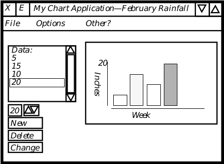

# Tutorial

[TOC]

* * *

## 1 Introduction

This book will help you set up your development stations, install your development kit software, and begin writing GEOS applications quickly. It is more than a simple tutorial for using the tools; it takes you step-by-step through a GEOS application from the very basics through using multiple files and displays.

**Who Should Read This Tutorial?**

Nearly everyone. Anyone who hasn't programmed for GEOS before should follow all the steps in this manual, from hardware setup right through the end. This is not only for new programmers, but for all programmers; GEOS is almost certainly different from any other system you've ever programmed, and if you dive right in you're likely to be overwhelmed.

**What Will You Learn From This Tutorial?**

You'll set up your hardware, and you'll install your software. Then, you'll learn how GEOS applications are structured, and you'll program an application that uses many of the user interface and object-oriented features of GEOS.

***

## 2 Setting Up

Setting up your system involves setting up your hardware and installing software on it. This chapter explains how to do both and then provides a sequence of steps and troubleshooting tips to test your setup.

### 2.1 What You'll Need

This development kit includes much of the software you will need to write and debug GEOS applications. It does not, however, include a C compiler or the hardware you will need. Make sure you have all of the items on the following lists before proceeding.

#### 2.1.1 Hardware You'll Need

This kit provides no hardware. To set up your system, you will need at least the following:

**Development PC**
The computer on which you will do your programming is referred to as the Development PC, the Host PC, or occasionally the Workstation. This PC must have an 80386 or more powerful processor and preferably eight or more megabytes of RAM. It should have a hard disk of at least 80 megabytes.

**Target PC**
The computer on which you will run GEOS and on which you will test your applications is referred to as the Target PC or the Test PC. This may be any Intel-compatible PC. Geoworks recommends that you have two test PCs: A powerful machine which you can debug on quickly, and an XT-class machine on which you can test your application's speed. When this isn't possible, you should try to have a more powerful machine in order to test various video drivers and memory configurations with your application.

**Serial Cable(s)**
The Host and Target PCs must be connected via serial link. You should keep the machines relatively close together, so a six-foot cable should be adequate.

**Null Modem**
A null modem is required in the serial connection between the host and target PCs. Without it, the send and receive pins on one of the machines will be reversed. Note that Lap-link cable includes this null-modem connection.

**Gender Changers and/or Adapters for Serial Cables**
Depending on the cables and connectors you have, you may need one or more serial line gender changers or other adapters.

#### 2.1.2 Software You'll Need

As stated above, this kit does not provide all the software you'll need. Both the host and target machines must be loaded with some version of DOS, and you will also need to have the following:

**C Compiler**
Currently, only Borland C/C++ 3.0 and 3.1 are supported for GEOS development. Geoworks is working on supporting others.

You may also want to use a task-switching environment on the host machine to make switching between coding, compiling, and debugging easier and quicker.

### 2.2 Setting Up the Hardware

First, set up your two PCs according to their included instructions (if any). Keep in mind that you will be switching frequently between the two machines and that you will often be using the mouse on the target machine while typing on the keyboard of the host machine.

Next, connect the two machines via serial cable and a null modem. Be sure to remember which serial ports you used on both machines, as you will need to know when installing the software. You may need to add in gender changer(s), 9-to-25 pin adapter(s), or other connectors, depending on your machines and your cables. A simplified diagram of the connection is shown in Figure 1-1.

*__Figure 1-1__ Workstation Setup
The test and development PCs communicate via a null modem serial connection.*

### 2.3	Installing the Software

Once you have finished setting up your machines and have connected the serial cable, you must install the GEOS development kit. Place the SDK CD-ROM into your CD-ROM drive, change to that drive, and run the INSTALL program.

The installation program will ask questions so it can set up the DOS environment for use with the GEOS development tools. These questions include which COM ports you used to connect the development and test machines. Answering these questions incorrectly can cause the SDK not to function properly.

Important: You must set both machines to use the same baud rate. They may use different COM ports, but they must have the same baud rate.

After you have installed the two disk sets, you must install your C compiler on the host (development) machine (if you have not already done so). Follow the instructions provided with your compiler.

Finally, you should run through the "setup" programs for both the error-checking and the non error-checking versions of GEOS on the target machine. To run the error-checking version, type

~~~
C:\>cd geosec
C:\GEOSEC>geosec
~~~

This will run GEOS, which will automatically kick into the graphical setup program. This program will ask you your video type, your mouse type, etc. If the setup does not go smoothly, try reinstalling the target disks.

To run the non error-checking setup, type

~~~
C:\>cd geosnc
C:\GEOSNC>geos
~~~

Again, if the set-up does not go smoothly, try reinstalling the disks. If this does not work, check that you are using the proper hardware configurations. If one or both of the two GEOS directories does not exist, try reinstalling the target disks.

### 2.4	Testing the Configuration

Once you have finished installing all the software, your system should be ready for you to begin programming. To check it, however, run through the following sequence of steps. You will learn later exactly what these steps do in more detail, but for now it is sufficient just to try them.

~~~
Host Machine: cd \pcgeos\appl\sdk_c\hello
~~~

On the host machine, change directories:

~~~
C:\>cd \pcgeos\appl\sdk_c\hello
~~~

If this directory does not exist, check that the \PCGEOS directory exists. If it doesn't, check which directory you installed into, and try that path instead. If this still doesn't work, make sure that something has been installed on your hard drive; if nothing has, you should try reinstalling the host disk set.

~~~
Host Machine: mkmf
~~~

Next, run the "make Makefile" program on the host machine with the mkmf command:

~~~
C:\PCGEOS\APPL\SDK_C\HELLO>mkmf
Don't forget to run "pmake depend"
~~~

Your directory should now contain a file called MAKEFILE.

+ If you get a "Bad command or file name" error, make sure that your path includes C:\PCGEOS\BIN (or C:\DIR\BIN, where DIR is the name of the directory in which you installed the host machine programs).

~~~
Host Machine: pmake depend
~~~

Next, create a dependencies file with the pmake depend command. The output you get should be similar to that shown below.

~~~
makedpnd ENDCMODULES GOC GOC goc -M -D__GEOS__ -IDEPENDS -I. -IC:\PCGEOS\INCLUDE -IC:\PCGEOS\IN
CLUDE\ANSI -I- -IDEPENDS -I. -IC:\PCGEOS\INCLUDE -IC:\PCGEOS\INCLUDE\ANSI -w -cb ENDFLAGS HELLO
.GOC ENDFILES CPP BORLAND CPP -D__GEOS__ -Ot -c -v -y -i200 -ml -I. -IC:\PCGEOS\INCLUDE -IC:\PC
GEOS\INCLUDE\ANSI ENDFLAGS HELLO.C ENDFILES

FILE C:\PCGEOS\INCLUDE\stdapp.goh, line 18 Warning: remaking @optimized file
C:\PCGEOS\INCLUDE\stdapp.goh. Missing depends or pre-goc'ed file

FILE C:\PCGEOS\INCLUDE\object.goh, line 17 Warning: remaking @optimized file
C:\PCGEOS\INCLUDE\object.goh. Missing depends or pre-goc'ed file

FILE C:\PCGEOS\INCLUDE\ui.goh, line 17 Warning: remaking @optimized file
C:\PCGEOS\INCLUDE\ui.goh. Missing depends or pre-goc'ed file

FILE C:\PCGEOS\INCLUDE\iacp.goh, line 22 Warning: remaking @optimized file
C:\PCGEOS\INCLUDE\iacp.goh. Missing depends or pre-goc'ed file

FILE C:\PCGEOS\INCLUDE\gcnlist.goh, line 21 Warning: remaking @optimized file
C:\PCGEOS\INCLUDE\gcnlist.goh. Missing depends or pre-goc'ed file

Processing HELLO.C...

Borland C++ Preprocessor Version 3.1 Copyright (c) 1992 Borland International

hello.c:

Available memory 3563940

findlbdr HELLO.GP DEPENDS.MK HELLO.GEO

C:\PCGEOS\APPL\SDK_C\HELLO>
~~~

There should now be a file in your directory called DEPENDS.MK. Don't worry about those "remaking @optimized file" warnings; these come up when some header files are used for the first time.

+ If you get an error like

~~~
"makefile". line 13: Could not find GEOS.MK
"LOCAL.MK", line 3: Could not find GEODE.MK
Fatal errors encountered -- cannot continue
~~~

you should make sure that your ROOT_DIR variable is set correctly. ROOT_DIR should be the name of whatever directory you installed the host files to. Normally this is C:\PCGEOS.

+ If you get the error

~~~
C:\PCGEOS\BIN\PMAKE.EXE: Can't figure out how to make DEPEND. Stop
~~~

then your makefile was not created correctly. Try running mkmf again to make sure that a makefile is being created.

+ If you get the error shown below, you should make sure that you have correctly installed your C compiler, and make sure that your C compiler's executable is in your path.

~~~
makedpnd ENDCMODULES GOC GOC goc -M -D__GEOS__ -IDEPENDS -I. -IC:\PCGEOS\INCLUDE -IC:\PCGEOS\IN
CLUDE\ANSI -I- -IDEPENDS -I. -IC:\PCGEOS\INCLUDE -IC:\PCGEOS\INCLUDE\ANSI -w -cb ENDFLAGS HELLO
.GOC ENDFILES CPP BORLAND CPP -D__GEOS__ -u- -c -v -y -Ot -Oi -i200 -ml -I. -IC:\PCGEOS\INCLUDE
 -IC:\PCGEOS\INCLUDE\ANSI ENDFLAGS HELLO.C ENDFILES

Processing HELLO.C...
Depends file removed.
*** Error code 1

Stop.
~~~

Next, make the executable file with the pmake command.

~~~
Host Machine: pmake
~~~

The output you should see is shown below.

~~~
C:\PCGEOS\APPL\SDK_C\HELLO>pmake
BCC -D__GEOS__ -u- -c -v -y -Ot -Oi -i200 -ml -I. -IC:\PCGEOS\INCLUDE -IC:\PCGEOS\INCLUDE\ANSI 
-oHELLO.OBJ HELLO.C
Borland C++ Version 3.1 Copyright (c) 1992 Borland International
hello.c:
Available memory 3475572
glue -Og HELLO.GP -P 0.0 -R 0.0.0.0 -m -LC:\PCGEOS\INCLUDE\LDF -T 1 -o HELLOEC.GEO HELLO.OBJ

Resource				Size   # Relocs
--------------------------------------------------
CoreBlock				   0	   0
dgroup					 144	   3
HELLO_TEXT				 125	   8
INTERFACE				 180	   1
APPRESOURCE				 416	   1

Total size: 865 bytes
Uninitialized data/stack: 2000 bytes

Import	Number	Type	Protocol
----------------------------------
geos		0	library	 654.000
ui			1	library	 741.001
borlandc	2	library	   1.000
~~~

You should now have a HELLO.GEO file in your current working directory on the host machine. If you do not, try the last few steps again, checking for errors in the output. If there are any, try reinstalling the host disk set and running through this procedure again.

~~~
Target Machine: cd \geosec
~~~

On your target machine, change to your GEOSEC directory.

~~~
Target Machine: pccom
~~~

Now, on the target machine, run the pccom tool, which connects the target machine to the host machine.

~~~
C:\GEOSEC>pccom
~~~

The screen should clear, its background should go dull gray, and the line

~~~
waiting for command from remote PC:
~~~

should appear at the top in yellow letters. If the pccom tool could not be found, make sure you typed it correctly, and then make sure it is in a directory in your DOS path.

Try typing the Enter key, which should return you to DOS.

+ If it does not, then your communication set-up is not configured correctly. Double-check the values of your PTTY variable. If you're uncertain about the meaning of these values, or how they should be set, you should consult "Troubleshooting Communications," Appendix A.

Assuming the pccom tool returned you to DOS, run the pccom tool again to get back to the "waiting for command from remote PC" line.

~~~
Host Machine: pcs
~~~

Return to the host PC. Download the newly-created HELLOEC.GEO file from the host to the target with the following command:

~~~
C:\PCGEOS\APPL\SDK_C\HELLO>pcs
sending HELLOEC.GEO to WORLD\C
~~~

Your target PC should give output similar to the following:

~~~
waiting for command from remote PC:
Receiving: WORLD\C\HELLO.GEO -
File Transfer Complete
waiting for command from remote PC:
~~~

+ If it does not, either HELLOECGEO does not exist (check the earlier steps) or the pccom tool is not working properly. If you get the error message "No matching files," that means that pcs cannot find your HELLOEC.GEO file. Make sure you did the pmake correctly.

+ If HELLOEC.GEO exists but pcs still can't send it to the target machine, then you probably have a problem with your serial connection. Double check the values set in both machines' PTTY variables. If you aren't sure what these values should be, or if they look correct, then consult "Troubleshooting Communications," Appendix A.

+ If you have successfully gone through the communication troubleshooting procedure and pcs still isn't working, there's one more thing you should try: If both machines lock up soon after the "sending HELLOEC.GEO to WORLD\C" message appears, you may be trying to transmit at too high a rate. Reduce the speed of transmission on both the host and target machines. If you've already looked through "Troubleshooting Communications," Appendix A, then you know that you can do this by changing the second field of the PTTY variable or by passing the /b flag to the pccom tool and pcs.

~~~
Host Machine: swat
~~~

Assuming all has gone well so far, run the debugger now by typing

~~~
C:\PCGEOS\APPL\SDK_C\HELLO>swat
~~~

The screen should clear after a moment, and the following should come up on the host's screen:

~~~
Swat version 2.0 (Dec 11 1992 13:47:14).
Using the trunk version of PC/GEOS.
Looking for "loader"...C:\PCGEOS/Loader/LOADEREC.EXE
Sourcing swat.tcl...done
PC Attached
Stopped in 0dedh:0007h, address 0dedh:0007h
LoadGeos: CLD ;DF=0
(loader:0) 1 =>
~~~

+ If you get an error like the following:

~~~
Abnormal program termination:Memory protection fault
CS:EIP = 000Fh:0000000Ahof PC/GEOS
~~~

then chances are there is a mistake in your CONFIG.SYS file, either on the FILES or BUFFERS line. Your FILES value should probably be at least 80 (at least 100 if you will be task-switching while using Swat). You may note the use of the word "probably" in that last sentence. The third-party memory manager used by Swat has trouble on some hardware set-ups; for these machines, you should try lowering the files number in your CONFIG.SYS to 60 and/or raise the BUFFERS value to 40.

Another possible cause for this sort of error is that your environment variables may be over-running their space. To increase the environment space, make sure there is a line in your CONFIG.SYS file following the pattern:

~~~
shell = command.com /e:XXXX /p
~~~

where XXXX is a number, 1024 or higher.

+ If the only thing that appears on your host machine is

~~~
Using the trunk version of PC/GEOS.
~~~

and your target machine is frozen (i.e. nothing else appears for at least a minute), you should probably try communicating at a slower rate. Try changing the PTTY variables to use lower values (such as 9600, if you are trying with 19200). Remember that the value should be the same on both machines.

~~~
Host Machine: c
~~~

If everything has gone well up to this point, then type "c" at the Swat shell prompt.

~~~
(loader:0) 1 => c

Looking for "geos Eker"...C:/PCGEOS/Library/Kernel/geosec.geo
Looking for "ms4 Eifs"...C:/PCGEOS/Driver/IFS/DOS/MS4/ms4ec.geo
Thread 1 created for patient geos
Thread 2 created for patient geos
Looking for "vidmem Edrv"...C:/PCGEOS/Driver/Video/Dumb/VidMem/vidmemec.geo
Looking for "swap Elib"...C:/PCGEOS/Library/Swap/swapec.geo
Looking for "xms Edrv"...C:/PCGEOS/Driver/Swap/XMS/xmsec.geo
Looking for "disk Edrv"...C:/PCGEOS/Driver/Swap/Disk/diskec.geo
Looking for "kbd drvr"...C:/PCGEOS/Driver/Keyboard/kbd.geo
Looking for "nimbus Edrv"...C:/PCGEOS/Driver/Font/Nimbus/nimbusec.geo
Looking for "stream Edrv"...C:\PCGEOS/Driver/Stream/streamec.geo
Looking for "sound Elib"...C:/PCGEOS/Library/Sound/soundec.geo
Looking for "standardEdrv"...C:/PCGEOS/Driver/Sound/Standard/standard.geo
Looking for "ui Elib"...C:/PCGEOS/Library/User/uiec.geo
Thread 0 created for patient ui
Looking for "styles Elib"...C:\PCGEOS/Library/Styles/stylesec.GEO
Looking for "color Elib"...C:\PCGEOS/Library/Color/colorec.GEO
Looking for "ruler Elib"...C:\PCGEOS/Library/Ruler/rulerec.GEO
Looking for "text Elib"...C:/PCGEOS/Library/Text/textec.geo
Looking for "motif Espu"...C:\PCGEOS/Library/Motif/motifec.GEO
Looking for "vga Edrv"...C:/PCGEOS/Driver/Video/VGAlike/VGA/vgaec.geo
Looking for "nonts Edrv"...C:/PCGEOS/Driver/Task/NonTS/nontsec.geo
Looking for "spool Elib"...C:\PCGEOS/Library/Spool/spoolec.GEO
Thread 0 created for patient spool
Thread 0 created for patient spool
Looking for "serial Edrv"...C:/PCGEOS/Driver/Stream/Serial/serialec.geo
Looking for "msSer Edrv"...C:/PCGEOS/Driver/Mouse/MSSer/msserec.geo
Looking for "welcome Eapp"...C:/PCGEOS/Appl/Startup/Welcome/welcomee.geo
Thread 0 created for patient welcome
~~~

+ If you get the following sorts of errors (this will occur after a fair amount of normal Swat output)

~~~
Looking for "sound Elib"...C:/PCGEOS/Library/Sound/soundec.geo
Looking for "standardEdrv"...hmmmm.
Can't find executable file for "standardEdrv" (version mismatch?)
Answer "quit" to exit to the shell
Answer "detach" to detach and return to top level
Answer "ignore" to ignore this patient
Where is it? C:\PCGEOS\APPL\SDK_C\HELLO/
~~~

then your FILES value in your CONFIG.SYS file may be set too low. Try changing this value to something higher (it should probably be at least 80 for most users, at least 100 if you will be using Swat while task-switching). You may note the use of the word "probably" in that last sentence. The third-party memory manager used by Swat has trouble on some hardware setups; for these machines, you should try lowering the files number in your CONFIG.SYS to 60 and/or raise the BUFFERS value to 40.

+ If you get the following error:

~~~
Looking for "geos Eker"...c:/pcgeos/Library/Kernel/geosec.geo
Interrupt 13: Protection violation
Stopped in 3328h:2a6dh, address 3328h:2a6dh
Swat+10861: CALL Swat+4114
(geos:0)
~~~

Then interrupts on your target machine are interfering with interrupts which Swat uses to communicate between machines. Exit the pccom tool on the target machine (if you encounter this error, chances are you will need to restart your target machine), and make sure that from now on you call the pccom tool with the /i:d flag. This will ask the pccom tool to ignore spurious interrupt 13 signals (d is 13 in hex). To do this, create a file called COMM.BAT on the target machine with the following contents:

~~~
pccom /i:d
~~~

From now on, whenever you would normally invoke the pccom tool on the target machine, just use comm instead.

~~~
Host Machine: quit
~~~

When you can get through all of those steps without hitting any errors, your setup is probably in good working order.

To exit from Swat (so that you can go on to other things), type quit at the Swat prompt. You may need to enter the DOS command cls to reset your screen after exiting Swat.

***

## 3 The Plan

The body of our tutorial consists of the step-by-step construction of an application. The first step when you set out on any software development project is to plan. Thus, we will start with a simple specification.

### 3.1 My Chart Application

**Precis:**
Application accepts simple data entry and creates bar charts.

**Summary:**
Application will allow the user to enter some numbers. Application will then create a simple bar chart to display those numbers. This charting application has an overriding purpose; it is meant as a tutorial, and should illustrate certain aspects of GEOS programming.

### 3.2 Data Entry

Data will be displayed in a scrolling list. The user can select a position in the list by clicking on the list. To manipulate the piece of data at that position, the user may click on one of the three buttons below the list: New, Change, or Delete.

+ The list will be scrollable. It will start with one dummy item which will display the string "Data:". All other items will be numbers. (The reason we want the dummy item is a special case of creating new data, described in the next item.)

+ The New button inserts a new piece of data after the selected piece. To insert a new piece of data at the head of the list, select the dummy "Data" item before clicking New button. The user will be able to enter a number in a box next to the New button-the new piece of data will have this numerical value.

+ The Change button will change the value of the selected data item to the value in the number box next to the New button.

+ The Delete button will delete the selected piece of data.

+ We will maintain the scrolling list by means of a system-provided object class know as GenDynamicListClass. This class manages and displays a list, and is specialized for cases in which the contents of the list are going to be changing often-which they will whenever the user changes their data. This class has been set up to work with the Generic UI, so that it can modify its appearance to match any Specific UI.

+ The "box" in which we will allow the user to enter numbers for use with the New or Change buttons will be a GenValueClass object. GenValueClass is another object class for use with the Generic UI, allowing the user to enter a value.

### 3.3 Data Storage

Eventually, we would like the user to be able to work with sets of data as "documents," and to allow multiple documents to be open at one time. To this end, we will eventually want a  GenDocumentGroup object, which specializes in the management of multiple documents.

+ To start with, we will store the data in a file using kernel virtual memory routines. (These routines allow the use of disk as virtual RAM; they also provide a simple interface to work with files in general.) Normally we would not use the kernel routines for this purpose; this is meant as a simple lesson in using VM routines.

+ Within the VM file, the data itself will be stored as a linked list of "chunks". These "chunks" are small pieces of memory which the system can allocate and manipulate.

+ By the time we're done, we'll use a file provided by the Generic UI's document object to store our data list along, and the same file will store the object we use to display the chart.

### 3.4 Chart Display

The chart will be displayed in a simple rectangular area. The body of the chart will be an object in charge of drawing the axes and title(s). Each bar of the chart will be an individually selectable object, and perhaps we will allow the user to do something with a selected object.

+ The basic rectangular view will be provided by a GenViewClass object. This object will provide us with an area which we can manipulate without worrying about the specific UI. The specific UI may rearrange the rest of our UI gadgetry in unpredictable ways, but our application will have absolute control over the contents of the GenViewClass object.

+ The body of the chart will be drawn by a VisClass object. Our subclass will have behavior added so that it will draw axes and the bars of the chart. It will draw these things using kernel graphics routines.

***

## 4 The Primary Window

In this chapter, we will explore our first stage in constructing a charting application. This first stage consists of a primary window, which we will use to hold the rest of the program's UI gadgetry. So far, our application consists of about twenty-five lines of code, and indicates how we will organize the rest of our code.

We will learn how to compile and link the application, explore its source code, and later explore the program itself using the Swat debugger.

### 4.1 README

You are about to start typing in the source code of a new program. Before we tell you exactly what to do, we're going to spell out some miscellaneous caveats. If you stick exactly to the instructions given in the Tutorial, none of these things should become issues; however, you might want to look over these warnings, as they might apply to future projects.

+ These instructions assume that you will name your files MCHRT.GOC and MCHRT.GP and that you will place those files in a directory called MCHRT which will appear somewhere under your PCGEOS\APPL directory. If you name the directory something other than MCHRT, you should change the name of the .GP file to match.

+ If you have trouble attaching the Swat debugger but have had no trouble sending files between the machines using the pccom tool, you might try either reducing your communication speed or consulting "Troubleshooting Communications," Appendix A of this book.

### 4.2 Creating the Application

We set up our files in a subdirectory of \PCGEOS\APPL (we'll use \PCGEOS\APPL\MCHRT) on the host machine. The files are MCHRT.GP (which contains the "geode parameters," which tell the linker how the application is organized) and MCHRT.GOC, the source code of the application.

The text of these files as you should type them in appear in Code Display 3-1 and Code Display 3-2.

To turn our source code into a working application, we invoke the following commands in the MCHRT directory:

**mkmf** This creates a "makefile" for the application, which will tell the pmake utility the steps with which to construct the application.

**pmake depend** This creates a dependencies file, which will tell pmake which files will need to be remade when any given file is altered.

**pmake** This utility invokes the preprocessor, compiler, and linker to create the final application.

When you have completed these steps, your directory should contain some new files, including MCHRTEC.GEO. Congratulations, you've created a GEOS application!

**If You Are Running Windows On The Host**

To allow communication between the host and target mcahines, invoke the pccom tool on the target machine while in the GEOSEC directory. 

Start up Swat by double-clicking on the Swat icon in the GEOS SDK program group. The following should appear in the Swat window:

~~~
Swat version 2.0 (Jan 20 1993 21:06:13).
Using the trunk version of PC/GEOS.
Looking for "loader"...C:\PCGEOS/Loader/LOADEREC.EXE
Sourcing swat.tcl...done
PC Attached
Stopped in LoadGeos, address 1e2dh:0007h
LoadGeos: CLD ;DF=0
(loader:0) 1 => 
~~~

At this point, Swat is telling us that it has successfully established communications with the target machine, and has started the process of loading the GEOS kernel on that machine. At this point, Swat halts so that you may invoke any Swat commands you might want before the kernel is fully loaded. In our case, we don't want to invoke any Swat commands until we've started our application, so we ask Swat to continue:

~~~
(loader:0) 1 => c
Looking for "geos Eker"...C:/PCGEOS/Library/Kernel/geosec.geo
Looking for "ms4 Eifs"...C:/PCGEOS/Driver/IFS/DOS/MS4/ms4ec.geo
Thread 1 created for patient geos
Thread 2 created for patient geos
Looking for "vidmem Edrv"...C:/PCGEOS/Driver/Video/Dumb/VidMem/vidmemec.geo
Looking for "swap Elib"...C:/PCGEOS/Library/Swap/swapec.geo
Looking for "xms Edrv"...C:/PCGEOS/Driver/Swap/XMS/xmsec.geo
Looking for "disk Edrv"...C:/PCGEOS/Driver/Swap/Disk/diskec.geo
Looking for "kbd drvr"...C:/PCGEOS/Driver/Keyboard/kbd.geo
Looking for "nimbus Edrv"...C:/PCGEOS/Driver/Font/Nimbus/nimbusec.geo
Looking for "stream Edrv"...C:\PCGEOS/Driver/Stream/streamec.GEO
Looking for "sound Elib"...C:/PCGEOS/Library/Sound/soundec.geo
Looking for "standardEdrv"...C:/PCGEOS/Driver/Sound/Standard/standard.geo
Looking for "ui Elib"...C:/PCGEOS/Library/User/uiec.geo
Thread 0 created for patient ui
Looking for "styles Elib"...C:\PCGEOS/Library/Styles/stylesec.GEO
Looking for "color Elib"...C:\PCGEOS/Library/Color/colorec.GEO
Looking for "ruler Elib"...C:\PCGEOS/Library/Ruler/rulerec.GEO
Looking for "text Elib"...C:/PCGEOS/Library/Text/textec.geo
Looking for "motif Espu"...C:\PCGEOS/Library/Motif/motifec.GEO
Looking for "vga Edrv"...C:/PCGEOS/Driver/Video/VGAlike/VGA/vgaec.geo
Looking for "nonts Edrv"...C:/PCGEOS/Driver/Task/NonTS/nontsec.geo
Looking for "spool Elib"...C:\PCGEOS/Library/Spool/spoolec.GEO
Thread 0 created for patient spool
Looking for "serial Edrv"...C:/PCGEOS/Driver/Stream/Serial/serialec.geo
Looking for "msSer Edrv"...C:/PCGEOS/Driver/Mouse/MSSer/msserec.geo
Looking for "welcome Eapp"...C:/PCGEOS/Appl/Startup/Welcome/welcomee.geo
Thread 0 created for patient welcome
~~~

Each of these "Looking for-" lines signals that the system is loading some geode and that Swat is thus looking for its symbolic information on the host machine. Swat also tells us whenever it creates (or exits) a thread for any geode.

Wait while Swat loads GEOS on the target machine. When GEOS has come up on the target machine, make sure that you're in the a workplace where you'll be able to start up applications (such as the Advanced Room, reachable from the Welcome Room).

Back on the host machine, type Ctrl-C in the Swat window. At this point, the Swat prompt should appear. Type "send mchrt" to download the application to the target machine. To run the application, type "run mchrt". You will be faced with the Swat prompt one more time. Type "c".

The window pictured on the first page of this chapter should appear on your screen.

**If You Are Working From the DOS Prompt on the Host**

To upload the application to the target machine, invoke the pccom tool on the target machine while in the GEOSEC directory. Then type pcs on the host machine (still in the MCHRT directory). The application should be downloaded to your target machine's WORLD directory (or to some subdirectory of the WORLD directory, depending on where you set up your source files).

To try out your application on the target machine, type scrolllock-shift-s to start up GEOS if you are still running the pccom tool; if you have already exited to the DOS shell, invoke loader within the GEOSEC directory. Your application should be in the WORLD directory. Look for a Geoworks symbol icon with the words "MyChart Application" underneath. Double-click on the icon.

The window pictured on the first page of this chapter should appear on your screen.

### 4.3 The Application So Far

Right now, application basically consists of a Primary Window. You might think that the application looks rather plain, and it does. However, note the following features you have already included in your application with this skeletal program:

+ The window is resizable. The primary window comes complete with resize handles at the corners, plus functioning maximize and minimize buttons.

+ The Motif Specific User Interface dictates that by default there should be a File menu with a Quit item. This menu and item are created automatically. The window also has the close button in the top-left corner, as dictated by Motif.

+ The window can house the Express Menu.

+ The application can restore itself from state: if the user shuts down the system and restarts later, the application will come up again just as it was before.

+ Your application is multi-launchable.

### 4.4 MCHRT.GP: Geode Parameters

The geode parameters file tells the Glue linker about our application's general organization. You can get complete information about all of the possible fields in a .gp file by reading "First Steps: Hello World," Chapter 4 of the Concepts book. Let's take a look at the code and find out what each line does.

~~~
name mchrt.app
~~~

The name field determines the name that Swat and Glue will assume the application is named. If you changed this value to "pchrt.app," Swat and Glue would think your application should be named "PCHRTEC.GEO." (The "EC" stands for "error checking"-while we're debugging the program, we'll generate an error-checking version of the executable.) To comply with the DOS 8.3 file name scheme and allow for the addition of the EC suffix to the file name, your name should be six characters or less.

~~~
longname "MyChart"
~~~

This is the longname of the file which Glue will use when creating the file in which the application will reside. When the application's file appears in a GeoManager folder window, this is the name that will be used.

~~~
type appl, process
~~~

The type line tells Glue what sort of geode this is. Ours is a typical application in that it needs only the appl and process keywords. The appl word lets Glue know that this geode has a process aspect. The process word specifies that the geode should have its own process.

At this point, you may be asking what a "process" is. (If you aren't, then feel free to skip this paragraph.) You may have heard that GEOS is multi-tasking or multi-threaded. The system allows more than one "thread" of execution to run; it run one piece of code for a while, then switch over to another piece. This allows programs to run in the background: the system will devote most of its time to running the application in the foreground, but will also run the background programs some of the time. By saying that our application has a process, we are requesting that it have its own thread of execution. If we were writing a library, we probably wouldn't want to give it a process, figuring that other geodes would be executing the library's code.

~~~
class MCProcessClass
~~~

When creating a new thread in GEOS, you must specify an object class to manage the thread. GEOS will automatically create a process thread for our application, and the class line makes it known that an object of the class MCProcessClass will be put in charge of that thread. We will describe this class in our source code.

~~~
appobj MCApp
~~~

The appobj line allows you to specify the object in your application which will represent the application to other parts of the system. We will describe this object in our source code.

~~~
tokenchars "MCht"
tokenid 0
~~~

These fields allow you to specify the token of the application. This token will be used to identify your application's documents, and certain inter-application communications which may be initiated by or intended for your application. The tokenchars field is a string of four characters. Normally these four characters are taken from the name of the application. In case two different products happen to have the same token characters, the token also has a tokenid number, which will be used to differentiate between products by different manufacturers. We are using a tokenid of zero, but in practice you should use your manufacturer ID.

~~~
library geos
library ui
~~~

All GEOS libraries are dynamically loaded. By telling Glue about them with these library lines, we ask that the geos and ui libraries automatically be loaded for our application.

~~~
resource APPRESOURCE ui-object
resource INTERFACE ui-object
~~~

With these lines, we list the application's resources. A resource is a block of memory. In this case, both of our resources contain object declarations. We specify that we want the objects in these resources to be run by our application's UI thread. As we expand on our application, we will add more resources.

By breaking up our application into resources, we allow it to run more efficiently. The system will load only those resources that it needs to. When we take a look at the source code, we will see why we have organized the application's resources in this way.

The ui-object keyword signals that the resources contain objects which should be run by the UI thread. By asking that these resources be run by the UI thread, we ensure that our application will have a UI thread. Again, by "thread" we mean a thread of execution. Our process runs in one thread, and now we've asked that another thread be created to manage these UI objects.

If we didn't want the application to have two threads, we could have declared these resources as object instead of ui-object. By having execution take place in two separate threads, we can allow the user to interact with UI gadgetry while computation goes on in the background. This means that the user will get valuable feedback that their actions are being acknowledged,  even if our program isn't fast enough to do all of the underlying calculations quickly.

### 4.5 MCHRT.GOC: Source Code

This file contains the source code for the application. Right now, there's nothing that you would recognize as procedural code. All there is to this application is a class and a couple of objects. Again, let's look at the code line by line. We will discuss what each of these lines does, but will not go into depth about their syntax here. For more information about Goc syntax, see "GEOS Programming," Chapter 5 of the Concepts book.

~~~
@include <stdapp.goh>
~~~

Our first line of code is an @include directive. This is a special Goc form of the #include directive. (Generally, the `@' symbol is used to prefix Goc keywords.) @include behaves in the same manner as #include, except that the inclusion will only take place when the Goc preprocessor is processing the source code. The file will not be included when your C compiler gets to it. Generally, you @include .goh files, but use #include to include normal .h files.

~~~
@class MCProcessClass, GenProcessClass;
@endc; /* MCProcessClass */
~~~

The @class keyword signals that we're creating a class. This class is to be called MCProcessClass, and it is a subclass of GenProcessClass. That means that if we haven't set up any special behavior for MCProcessClass in a given situation, objects of that class should behave as GenProcess objects would. 

Normally, the next few lines would consist of things that made MCProcessClass different than GenProcessClass. For now, MCProcessClass will behave exactly like its superclass, and thus we will have no lines of code cataloging their differences.

The @endc line signals that we're done defining the class and are ready to go on to other things.

~~~
@classdecl MCProcessClass, neverSaved;
~~~

Next we declare the class with @classdecl, specifying certain things about the class by means of keywords. In this case, the only thing we will specify when declaring this class is that it will not be saved to state. That is, we won't save our process' data when the system shuts down. To learn more about the keywords which can be used with @classdecl, see its entry in "GEOS Programming," Chapter 5 of the Concepts book.

~~~
@start AppResource;
~~~

This line lets Goc know that we want the next block of code to end up in the APPRESOURCE resource. From the .gp file, we know that this resource holds objects, and that those objects will be run by the UI thread.

~~~
@object GenApplicationClass MCApp = {
~~~

We are defining an object called MCApp. You may recall that in the .gp file, we specified that this object was to represent our application to the rest of the system. This object will be receiving notice of all sorts of system messages and notifications. It will be expected to provide information about the application at various times. This is a nontrivial task, and our object will be of a class specifically set up to handle these tasks: GenApplicationClass.

Note that the system will sometimes need to know information about an application though that application is not running. For instance, GeoManager may need to ask the application for its name and icon so that it may be displayed in a folder window. For several of these cases, the system will need only interact with the system object, and will ignore the rest of the application. Because of these cases, we are keeping the application object in its own resource. Because of this organization, when the system only needs the application object, it will not bother to load in the rest of our application's resources.

The next set of fields contains the application object's instance data.

~~~
GI_visMoniker = list { @MCTextMoniker }
~~~

This line specifies the name of the object, which will in turn be used as the name of the application in certain contexts. We are specifying this name by giving a list of object pointers (in this case a list with one element) as the value of an instance data field, said field named GI_visMoniker.

The instance data name "GI_visMoniker" may seem somewhat strange. The "GI" stands for "Gen Instance". GenApplicationClass is a subclass of GenClass. The GI_visMoniker instance field is inherited from GenClass. By Geoworks' naming conventions, instance data field names are prefixed by the name of their associated class and an "I" for "Instance". Thus, any GenApplicationClass instance field names would begin "GAI_". The "visMoniker" part of the name is short for "visual moniker". In GEOS parlance, a "visual moniker" is a name used to identify an object to the user.

~~~
GI_comp = @MCPrimary;
~~~

We are setting the value of another instance data field. From the field name, you know that this is another field inherited from GenClass. The GI_comp field is used to list the children of a generic UI object. In this case, our application has only one child object, the primary window MCPrimary.

~~~
gcnList(MANUFACTURER_ID_GEOWORKS, GAGCNLT_WINDOWS) =@MCPrimary;
~~~

This line puts the MCPrimary object, our primary window (to be declared later in this file), on a GCN list for window objects.

At this point, you may be wondering what a "GCN list" is. You may recall that MCApp is our application object, and is expected to act as the application's representative to the system.

From time to time, the system will send notifications to all applications that something important has happened. These notifications are sent out when some sort of general change has occurred within the system, thus this mechanism is known as General Change Notification, or GCN.

The source line above requests that the application should relay certain types of notification on to the MCPrimary object, specifically the sorts of notifications that windows would like to hear about. For more information about the syntax of this sort of line, see the gcnList entry in "GEOS Programming," Chapter 5 of the Concepts book.

~~~
@visMoniker MCTextMoniker = "MyChart Application";
~~~

Here we declare the visual moniker referred to by MCApp's GI_visMoniker instance field, above. We are storing the string "MyChart Application" in a GEOS data structure set up for exactly this purpose.

~~~
@end AppResource
~~~

This line signals the end of the block of code that we want put into APPRESOURCE.

~~~
@start Interface;
~~~

This line signals that the next block of code should be stored in the INTERFACE resource. We will use this resource to store the basic UI tree for our application.

~~~
@object GenPrimaryClass MCPrimary = { }
~~~

Right now our entire UI tree consists of a single object, a plain primary window. We won't be setting values for any of its instance data now, relying on the default values for these fields to do the right thing (which they in fact will do).

~~~
@end Interface
~~~

We're done putting things into the INTERFACE resource for now. In fact, we're done with the program.

### 4.6 Exploring With Swat

Right now, the application doesn't have any procedural code. In fact, there isn't very much code to the application at all. Chances are the program has no run-time errors; there just aren't very many places for them to hide. However, we can still find out how to use the debugger to find out about the object trees which make up our program.

**If You Are Running Windows on Your Host Machine**

You should already have Swat running. Bring up your Swat window. Skip ahead to the heading that says "When Swat's Ready."

**If You Are Using the DOS Prompt on Your Host Machine**

Make sure that you are still running the pccom tool from the GEOSEC directory of your target. To start Swat on your host machine, type swat. Something similar to the following should appear on your host machine:

~~~
Swat version 2.0 (Jan 20 1993 21:06:13).
Using the trunk version of PC/GEOS.
Looking for "loader"...C:\PCGEOS/Loader/LOADEREC.EXE
Sourcing swat.tcl...done
PC Attached
Stopped in LoadGeos, address 1e2dh:0007h
LoadGeos: CLD ;DF=0
(loader:0) 1 =>
~~~

At this point, Swat is telling us that it has successfully established communications with the target machine, and has started the process of loading the GEOS kernel on that machine. At this point, Swat halts so that you may invoke any Swat commands you might want before the kernel is fully loaded. In our case, we don't want to invoke any Swat commands until we've started our application, so we ask Swat to continue:

~~~
(loader:0) 1 => c
Looking for "geos Eker"...C:/PCGEOS/Library/Kernel/geosec.geo
Looking for "ms4 Eifs"...C:/PCGEOS/Driver/IFS/DOS/MS4/ms4ec.geo
Thread 1 created for patient geos
Thread 2 created for patient geos
Looking for "vidmem Edrv"...C:/PCGEOS/Driver/Video/Dumb/VidMem/vidmemec.geo
Looking for "swap Elib"...C:/PCGEOS/Library/Swap/swapec.geo
Looking for "xms Edrv"...C:/PCGEOS/Driver/Swap/XMS/xmsec.geo
Looking for "disk Edrv"...C:/PCGEOS/Driver/Swap/Disk/diskec.geo
Looking for "kbd drvr"...C:/PCGEOS/Driver/Keyboard/kbd.geo
Looking for "nimbus Edrv"...C:/PCGEOS/Driver/Font/Nimbus/nimbusec.geo
Looking for "stream Edrv"...C:\PCGEOS/Driver/Stream/streamec.GEO
Looking for "sound Elib"...C:/PCGEOS/Library/Sound/soundec.geo
Looking for "standardEdrv"...C:/PCGEOS/Driver/Sound/Standard/standard.geo
Looking for "ui Elib"...C:/PCGEOS/Library/User/uiec.geo
Thread 0 created for patient ui
Looking for "styles Elib"...C:\PCGEOS/Library/Styles/stylesec.GEO
Looking for "color Elib"...C:\PCGEOS/Library/Color/colorec.GEO
Looking for "ruler Elib"...C:\PCGEOS/Library/Ruler/rulerec.GEO
Looking for "text Elib"...C:/PCGEOS/Library/Text/textec.geo
Looking for "motif Espu"...C:\PCGEOS/Library/Motif/motifec.GEO
Looking for "vga Edrv"...C:/PCGEOS/Driver/Video/VGAlike/VGA/vgaec.geo
Looking for "nonts Edrv"...C:/PCGEOS/Driver/Task/NonTS/nontsec.geo
Looking for "spool Elib"...C:\PCGEOS/Library/Spool/spoolec.GEO
Thread 0 created for patient spool
Looking for "serial Edrv"...C:/PCGEOS/Driver/Stream/Serial/serialec.geo
Looking for "msSer Edrv"...C:/PCGEOS/Driver/Mouse/MSSer/msserec.geo
Looking for "welcome Eapp"...C:/PCGEOS/Appl/Startup/Welcome/welcomee.geo
Thread 0 created for patient welcome

Looking for "shell Elib"...C:/PCGEOS/Library/Shell/shellec.geo
Looking for "manager Eapp"...C:/PCGEOS/Appl/FileMgrs/GeoManag/managere.geo
Thread 0 created for patient manager
Thread 1 created for patient manager
~~~

Each of these "Looking for-" lines signals that the system is loading some geode and that Swat is thus looking for its symbolic information on the host machine. Swat also tells us whenever it creates (or exits) a thread for any geode.

By now you should be in GeoManager. Find the EC MyChart application (it should be in the WORLD directory or one of its subdirectories) and double-click on it.

~~~
Looking for "math Elib"...C:\PCGEOS/Library/Math/mathec.GEO
Looking for "borlandcElib"...C:\PCGEOS/Library/MATH/COMPILER/BORLANDC/BORLANDC.GEO
Looking for "mchrt Eapp"...C:\PCGEOS/Appl/Mchrt/mchrtec.GEO
Thread 0 created for patient mchrt
Thread 1 created for patient mchrt
~~~

Swat tells us that two libraries, math and borlandc are being loaded. Because our application is a C application, the linker loads the borlandc library, which itself requires the math library. When all of the libraries which our application relies on have been loaded, the application itself is loaded. Two threads are created for it, one for the process, the other to manage UI objects.

**When Swat's Ready**

Let's take a look around the innards of our application. Position the mouse over the middle of the application's window and press ctrl-c on the host machine to halt Swat and GEOS. The following should appear on the host machine:

~~~
PC Halted
Stopped in 0214h:0000h, address 0214h:0000h
102140h: 		CMP 	AH, 16 (10h) 		;16h
(geos:0) 2 =>
~~~

At this point, the target machine freezes and Swat warns us that it is freezing the machine with its "PC Halted" message. Swat  provides the address of the current instruction. Whatever GEOS routine is being executed now must be internal; if it was public, the address would have been given in relation to the routine name, and would have thus been more readable.

Right now we aren't stopped in our application. Remember that GEOS is a multi-threaded operating system. When we hit ctrl-c, the target was executing the code of some other thread (the geos thread). The prompt tells us which thread we're executing, in this case the zeroth thread associated with the GEOS geode (the kernel). To examine the thread associated with our application, we must request a thread change by typing in the first part of the name we gave in the "name" field of the .gp file:

~~~
(geos:0) 2 => mchrt
[mchrt:0] 3 =>
~~~

Our prompt tells us that we are now in the process thread of the mchrt geode. If we were in the UI thread, our prompt would have been "mchrt:1" instead. To change threads within a geode, it's enough to type :0 or :1. Let's use the where command to find out what this thread was doing when we stopped the system.

~~~
[mchrt:0] 3 => where
* 1: near BlockOnLongQueue(), 18a1h:c37bh
  2: far QueueGetMessage(), 18a1h:1b18h
---------------------------------------
The event queue for "mchrt:0" is empty
=======================================
[mchrt:0] 4 =>
~~~

This tells us that our thread is waiting for a message: right now our application is standing idle, waiting for something to happen. Considering how little there is that we can do to our application, perhaps that isn't too surprising.

Next, we'll take a look at some of our UI gadgetry. The gentree command tells us about the tree of generic UI objects. We will use the "gentree -i" command, which tells us about the generic tree under the mouse pointer; assuming that the mouse pointer is over our primary window, we will be able to see its tree. If the mouse pointer is not over the primary window, let the action on the target machine continue by typing c at the Swat prompt. Position the target machine's mouse over the window. Press ctrl-c on the host machine, and change threads to mchrt if necessary. You will now be able to use gentree's -i option.

~~~
[mchrt:0] 4 => gentree -i 
*MCPrimary::GenPrimaryClass (@1, ^l4c10h:001eh) "MyChart Application"
[mchrt:0] 5 =>
~~~

The gentree command prints out a list of all the objects in the tree, along with the object pointers and monikers of those objects. Right now our generic tree consists of a single object. Let's take a look at it. Swat lets us use a shortcut when specifying the object pointer of the object we want to look at; we can use the @number provided.

The pobj command prints out all of an object's instance data.

~~~
[mchrt:0] 5 => pobj @1
*MCPrimary::GenPrimaryClass (@2, ^l4c10h:001eh)
master part: Gen_offset(164) -- ui::GenPrimaryInstance
@3: {ui::GenPrimaryInstance (^h19472:662)+164} = {
  GenDisplayInstance GenPrimary_metaInstance = {
    GenInstance GenDisplay_metaInstance = {
      MetaBase Gen_metaInstance = {
 	ClassStruct _far *MB_class = 360ah:1f65h (motif::dgroup::OLBaseWinClass)
      }
      LinkPart GI_link = {
 	void _optr LP_next = parent *MCApp::GenApplicationClass (@4, ^l3b10h:0024h)
      }
      CompPart GI_comp = {
 	void _optr CP_firstChild = null
      }
      void _lptr GI_visMoniker = 0022h [14 bytes at ^l3b10h:0022h]
      KeyboardShortcut GI_kbdAccelerator = {
 	KS_PHYSICAL = 0
 	KS_ALT = 0
 	KS_CTRL = 0
 	KS_SHIFT = 0
 	KS_CHAR_SET = 0
 	KS_CHAR = C_NULL
      }
      GenAttrs GI_attrs = {GA_KBD_SEARCH_PATH, GA_TARGETABLE}
      GenStates GI_states = {GS_USABLE, GS_ENABLED}
    }
    GenDisplayAttrs GDI_attributes = {GDA_USER_DISMISSABLE}
    void _optr GDI_document = null
  }
  void _lptr GPI_longTermMoniker = null
}
Variable Data:
	*** No Variable Data ***
[mchrt:0] 6 =>
~~~

We certainly got a lot of data from that command! Let's take a look at what it means, and which parts of this we should be paying attention to.

~~~
*MCPrimary::GenPrimaryClass (@2, ^l4c10h:001eh)
~~~

The first line tells us that our object is of class GenPrimaryClass. It also tells us the object's address (^l4c10h:001eh) which would come in handy if we hadn't already known its value from gentree's output.

~~~
master part: Gen_offset(164) -- ui::GenPrimaryInstance
@3: {ui::GenPrimaryInstance (^h19472:662)+164} = {
  GenDisplayInstance GenPrimary_metaInstance = {
    GenInstance GenDisplay_metaInstance = {
      MetaBase Gen_metaInstance = {
 	ClassStruct _far *MB_class = 360ah:1f65h (motif::dgroup::OLBaseWinClass)
      }
      LinkPart GI_link = {
 	void _optr LP_next = parent *MCApp::GenApplicationClass (@4, ^l3b10h:0024h)
      }
      CompPart GI_comp = {
 	void _optr CP_firstChild = null
      }
      void _lptr GI_visMoniker = 0022h [14 bytes at ^l3b10h:0022h]
      KeyboardShortcut GI_kbdAccelerator = {
 	KS_PHYSICAL = 0
 	KS_ALT = 0
 	KS_CTRL = 0
 	KS_SHIFT = 0
 	KS_CHAR_SET = 0
 	KS_CHAR = C_NULL
      }
      GenAttrs GI_attrs = {GA_KBD_SEARCH_PATH, GA_TARGETABLE}
      GenStates GI_states = {GS_USABLE, GS_ENABLED}
    }
    GenDisplayAttrs GDI_attributes = {GDA_USER_DISMISSABLE}
    void _optr GDI_document = null
  }
  void _lptr GPI_longTermMoniker = null
}
Variable Data:
	*** No Variable Data ***
[mchrt:0] 6 =>
~~~

The rest of the output consists of our object's instance data. This fields of instance data are grouped by the class which defines them. The GEOS object model allows for a special kind of super/sub-class relationship. Some classes are marked as "master" classes. A master class is meant to be radically different in behavior than its superclass. An ordinary subclass is meant to specialize from its superclass, but not in such an extreme way. Instance data is grouped by "master level"-those classes which are only specializations of one another. By default, pobj will only show us the instance data associated with the Generic master level-the most specialized level of GenPrimary's class structure. We could have passed different arguments to pobj to see the other levels.

As it turns out, all of the instance data we were really prepared to interpret here was in the bottom master layer.

We took advantage of another Swat feature here: command completion. As it happens, there is no true "pobj" Swat command; the command's name is really "pobject". Because "pobject" was the only Swat command that begins with "pobj," Swat realized what we meant when we used "pobj."

So far we've seen the application's generic object. Now let's see its visible tree of objects using the vistree command:

~~~
[mchrt:0] 6 => vistree @1

 *MCPrimary::GenPrimaryClass (@5, ^l4c10h:001eh), rect (41, 28, 642, 410)
    ^l4c10h:0026h::OLMenuBarClass (@6, ^l4c10h:0026h), rect (6, 23, 594, 40)
       ^l4c10h:002ah::OLMenuButtonClass (@7, ^l4c10h:002ah), rect (6, 23, 39, 39)
    ^l4b40h:004ah::OLMenuButtonClass (@8, ^l4b40h:004ah), rect (5, 5, 32, 23)
    ^l4c10h:0020h::OLGadgetAreaClass (@9, ^l4c10h:0020h), rect (6, 40, 594, 375) 
    0::GenTriggerClass (@10, ^l4b40h:003ah), rect (542, 5, 569, 23)
    0::GenTriggerClass (@11, ^l4b40h:003eh), rect (568, 5, 595, 23)
    0::GenTriggerClass (@12, ^l4b40h:0042h), rect (0, 0, 0, 0)

[mchrt:0] 7 =>
~~~

While our Generic tree consisted of a single object, our Visual tree as shown by the vistree command also reveals some other objects. These are some of the objects which were created by the Open Look specific UI to implement our Generic Primary window. Our GenPrimary object has some children in its visual tree: an Open Look menu bar, gadget area, and four Generic triggers. The menu bar has a child itself, a menu button. Each of the objects is listed along with its bounds. We could do a pobj on each of these objects to learn more about our object. 

What if we were interested in one of the buttons, such as the minimize button? Even if you knew that the button would manifest as a GenTrigger, how would you know which GenTrigger to examine? We can probably figure out which object is which just by looking at their visual bounds, the area to which that object will be drawn on-screen. Each object's bounds are defined by a rectangle structure with coordinates (left, top, right, bottom). Coordinates increase to the right and downwards. Coordinates are measured in seventy-seconds of an inch, normally assumed to be a pixel. Coordinates are given in terms of the bounds of their parent object.

Thus we see in our example that our Primary window's top left corner is 41 pixels to the right of and 28 pixels below the top left corner of the screen. The menu bar is in turn 6 pixels to the right and 22 pixels below the top left corner of the primary window.

Thus we can see that the "gadget area" is that part of the Primary window which is below the menu bar, the big gray area.

One of the triggers has confusing boundaries: (0, 0, 0, 0). This is the Express Menu button, a gadget unusual in that it travels between applications, always appearing in the active primary window. It's bounds are somewhat bogus, but it is a very strange object which programs won't normally interact with directly.

The other triggers can be recognized by their bounds: The one to the far left (left bound of 6) must be the "X" button; The other two must be the minimize and maximize buttons.

We could now do a pobj to learn more about this object, perhaps doing a "pobj @9".

Next we'll try a series of exploratory Swat commands:

~~~
[mchrt:0] 7 => classes
MCProcessClass (@13, 425fh:0040h), off ui::dgroup::GenProcessClass

[mchrt:0] 8 =>
~~~

The classes command lists all classes created by the application. In the case of our application, there is only one such class, our process class. In a more complicated application with several special classes running around, the classes command comes in handy when you can't remember the names of your application's classes.

~~~
[mchrt:0] 8 => cup -p
dgroup::MCProcessClass (@14, 425fh:0040h)
ui::dgroup::GenProcessClass (@15, 2e1ch:11f2h)
geos::kcode::ProcessClass (@16, 18a1h:ac92h)
geos::kcode::MetaClass (@17, 18a1h:abaah)
[mchrt:0] 9 =>
~~~

The cup command shows the complete class hierarchy for a class. Here we passed the "-p" argument, specifying that we're interested in our process class. We could also have passed "@13" or "425fh:0040h".

~~~
[mchrt:0] 9 => methods -p
[mchrt:0] 10 =>
~~~

The methods command lists all methods for a class; that is the handlers for any messages that objects of the class are prepared to intercept. However, we haven't written any yet, and thus we don't get any output from this command. However, as the application grows, we may wish to use this command from time to time to remember the names of our methods.

Another command useful for basic exploration of an application is "gentree -a":

~~~
[mchrt:0] 10 => gentree -a

*MCApp::GenApplicationClass (@18, ^l3b10h:0024h) *** Is Moniker List ***
*MCPrimary::GenPrimaryClass (@19, ^l4c10h:001eh) "MyChart Application"

[mchrt:0] 11 =>
~~~

The "gentree -a" command shows an application's complete Generic tree starting from the application object, the highest-level Generic representation of the application.

Let's take an in-depth look at how the application's memory is organized. Memory blocks in the GEOS heap are referenced by means of handles. Handles are also used to reference other system resources, such as threads, geodes, and files. The handles command returns all handles in use by the system. We will do a "handles mchrt" to find out about all handles owned by our application:

~~~
[mchrt:0] 11 => handles mchrt
There are 2500 handles total, 847 used and 1653 free
HANDLE ADDR   SIZE PREV   NEXT FLAGS 			LOCK 	OWNER IDLE OINFO 		TYPE
------------------------------------------------------------------------------
2b70h EVENT QUEUE mchrt, thread = mchrt:1, no events
3970h 617ah    288 3fd0h 4b90h  s S 			0 	mchrt 0:51 0h
3b10h 607eh    896 3560h 1b70h  s SL a 			0 	mchrt 0:49 4320h R#4 (APPRESOURCE)
3ba0h 717ah    160 1c20h 45a0h  s S  a 			0 	mchrt 0:49 43a0h Geode
4320h THREAD mchrt:1
4340h EVENT QUEUE mchrt, thread = mchrt:0, no events
43a0h THREAD mchrt:0
44e0h 7bb0h     32 1e10h 33c0h  s S 			0 	mchrt 0:49 1h
4530h 425fh   2080 4bd0h 4b50h  FIXED n/a 			mchrt n/a 1h 		 R#1 (dgroup) 
4560h FILE sfn = 31, owner = 3ba0h (mchrt)
4aa0h 0000h     16 0000h 0000h  sDS d 			0 	mchrt 0:51 1h 		 R#2 (MCHRT_TEXT)
4b40h 5dd9h   1248 33e0h 3250h  s SL a 			0 	mchrt 0:49 4320h  OBJ(mchrt:1) 
4b50h 42e1h   2176 4530h 4cf0h  FIXED n/a 			mchrt n/a 1h 		 Stack(mchrt:1)
4b90h 618ch    288 3970h 23b0h  s S 			0 	mchrt 0:51 0h
4c10h 5bb5h    928 3710h 4140h  s SL a 			0 	mchrt 0:49 4320h R#3 (INTERFACE)
4cc0h 96f7h   1040 1dd0h 1820h  s SL 			0 	mchrt 0:49 1h 		 WINDOW

Total bytes allocated: 9152, total handles: 16
[mchrt:0] 12 =>
~~~

Let's take a look at this table and see if we can determine what each of these handles is for.

~~~
4320h THREAD mchrt:1
43a0h THREAD mchrt:0
~~~

Two of the handles are marked as THREAD handles. The first of these is the handle associated with the application's process thread, the second with the UI thread. (In general, the zeroth thread of an application (e.g. mchrt:0) will be the process and the first thread (e.g. mchrt:1) will be the UI.)

~~~
2b70h EVENT QUEUE mchrt, thread = mchrt:1, no events
4340h EVENT QUEUE mchrt, thread = mchrt:0, no events
~~~

Each thread has an event queue associated with it. Whenever something sends a message to an object run by a given thread, the message will be placed on that thread's event queue. Right now, there are no messages queued for either of our threads.

~~~
3b10h 607eh    896 3560h 1b70h  s SL a 			0 	mchrt 0:49 4320h 	R#4 (APPRESOURCE)
4530h 425fh   2080 4bd0h 4b50h  FIXED n/a 			mchrt n/a 1h 		R#1 (dgroup)
4aa0h 0000h     16 0000h 0000h  sDS d 			0 	mchrt 0:51 1h 		R#2 (MCHRT_TEXT)
4c10h 5bb5h    928 3710h 4140h  s SL a 			0 	mchrt 0:49 4320h 	R#3 (INTERFACE)
~~~

These are the handles of the memory blocks which hold our application's resources. The last two of these we can recognize by name: "INTERFACE" and "APPRESOURCE" appear in the TYPE column. The others are resources which are created automatically. The "dgroup" resource contains data which will be used by our process; if our application ever has any global variables, they will be stored in this resource. The dgroup resource also contains our process thread's stack. The "MCHRT_TXT" block is our code resource. So far, our application has no code, which explains the small size of this block-it is just the size of the block's header information, 16 bytes.

~~~
4560h FILE sfn = 31, owner = 3ba0h (mchrt)
~~~

This is the handle of the file in which our application resides.

~~~
3ba0h 717ah    160 1c20h 45a0h  s S  a 			0 	mchrt 0:49 43a0h Geode
~~~

This is the handle of the memory block in which our geode resides.

~~~
4cc0h 96f7h   1040 1dd0h 1820h  s SL 			0 	mchrt 0:49 1h 		 WINDOW
~~~

This is the handle of a window associated with our application. This is not necessarily a "window" in the UI sense-this is a graphics window, an area where we have to worry about some drawings obscuring others. This window handle is keeping track of the area associated with our primary window, so that it will draw "on top of" other window areas. Later, when we have a chart view area, we will have another window which, while not an independently-movable UI-style "window," will still need a window data structure to keep track of the view bounds, so that we cannot draw outside the view.

~~~
4b40h 5dd9h   1248 33e0h 3250h  s SL a 			0 	mchrt 0:49 4320h  OBJ(mchrt:1)
4b50h 42e1h   2176 4530h 4cf0h  FIXED n/a 			mchrt n/a  1h 		Stack(mchrt:1)
~~~

Our UI thread manages two more blocks. The first of these is the handle of the object block which will contain the objects managed by this thread. The second of these is its stack.

~~~
3970h 617ah    288 3fd0h 4b90h  s S 			0 	mchrt 0:51 0h
44e0h 7bb0h     32 1e10h 33c0h  s S 			0 	mchrt 0:49 1h
4b90h 618ch    288 3970h 23b0h  s S 			0 	mchrt 0:51 0h
~~~

Swat doesn't tell us very much about these blocks. If we wanted to explore their contents, we could by using the bytes command. However, decoding the contents of memory blocks by reading their raw memory contents is beyond the scope of this tutorial.

Feel free to use Swat to explore some more. For example, you might use pobject to print the instance data of some of the objects revealed by the vistree command.

When you're done with Swat and are ready to move onto other things:

**If You Are Using Windows**

In the next chapter, you'll begin by editing the source code, so prepare to switch over to the window with your editor.

**If You Are Using the DOS Prompt**

Enter quit at the Swat prompt to exit Swat.

_ _ _
**Code Display 3-1 MCHRT.GP**
~~~
name mchrt.app

longname "MyChart"

type appl, process

class MCProcessClass

appobj MCApp

tokenchars "MCht"
tokenid 0

library geos
library ui

resource APPRESOURCE ui-object
resource INTERFACE ui-object
~~~
_ _ _
**Code Display 3-2 MCHRT.GOC**
~~~
@include <stdapp.goh>

@class MCProcessClass, GenProcessClass;
@endc /* MCProcessClass */

@classdecl MCProcessClass, neverSaved;

@start AppResource;
@object GenApplicationClass MCApp = {
	GI_visMoniker = list { @MCTextMoniker }
	GI_comp = @MCPrimary;
	gcnList(MANUFACTURER_ID_GEOWORKS,GAGCNLT_WINDOWS) = @MCPrimary;
} /* end of MCApp */

@visMoniker MCTextMoniker = "MyChart Application";
@end AppResource;

@start Interface;
@object GenPrimaryClass MCPrimary = {
} /* end of MCPrimary */
@end Interface;
~~~
***

## 5 Data Structures and UI Gadgetry

In this chapter we add some UI gadgetry to the application. By creating some objects and writing some procedural code, we will construct a cluster of gadgetry which enables the user to maintain a list of data.

We will explore the application's new code, both examining blocks of the source code to see what they do and going through a debugging session during which we set some breakpoints and do some stepping through code.

### 5.1 Editing the Application

At the end of this chapter you will find a complete code listing for this stage of the application. Pieces of code which have been added or changed since the previous stage have been marked with lines like that next to this paragraph.

You should add the new parts by means of a text editor. When you are done, invoke pmake to compile your program. You may remember that in the previous chapter, you had to use mkmf and pmake depends. However, the files generated by those commands will still work for us; we need only do a pmake now.

Once you've compiled the application send it down to the target machine as before: if you still have Swat attached, then use the send Swat command; otherwise, make sure that the pccom tool is running on the target machine and invoke pcs on the host machine.

### 5.2 The Application so Far

Our application has sprouted a scrolling list, three buttons, and a place to input a numerical value. The buttons allow the user to add, remove, and change the values of items in the list. By typing a number in the place provided, the user can determine the value which will appear in the list. By clicking on the list, the user can determine which list item should be removed or changed, or where a new item should be added.

+ The buttons are the instigators of all change. The user can click anywhere in the window, but the contents of the data list won't change unless the user interacts with the buttons.

+ The underlying data structure which will represent the data list is managed by the process thread. All user interaction is handled, appropriately enough, by the UI thread. The user will interact with the buttons, which are managed by the UI thread. This will result in a message sent to the process thread, specifically to the process object. The process object will update the data structure representing the list, and then send messages to those UI objects which need to update themselves in light of the new data.

+ Our underlying data structure will consist of a linked list of chunks. You may wonder what a "chunk" is. You may recall that the memory heap is organized into blocks of memory which are referenced by handles. The memory manager controls these blocks. This makes for a convenient system, but if we were to allocate a separate block of memory for each new item in our linked list, it would get wasteful-there is a a certain amount of overhead for each block of memory. We will take one block of memory and treat it as a sort of mini-heap organized into mini-blocks. These "mini-blocks" are known as chunks. The "mini-heap" we will call a local memory block, and we will access its contents by means of LMem routines.

+ The local memory block will reside within a virtual memory file. This means that our program will create a file and the linked list data will be stored there. Whenever we need to work with the data, we will load it into a block of memory and lock that block of memory into place. Actually, since we're erasing our list data between runs each time, there's not much point to using VM routines, but this can serve as a quick lesson of basic VM usage.

+ The program is no longer multi-launchable. This makes sense, as we hard-coded the name of the file that we were using for VM storage, and copies of our application shouldn't have to share. Also, being single-launchable allows us to do some things in our program in a more simple way, not having to make clear to the linker which application's resources we will work with each time. Since our application will eventually support multiple documents, we may never bother to do the cleaning up necessary to make it multi-launchable.

### 5.3 MCHRT.GP Change

We changed one line of the MCHRT.GP file to let glue know that our application is now single-launchable instead of multi-launchable.

~~~
type appl, process, single
~~~

Our new addition, the "single" keyword, signals that the application is single-launchable.

### 5.4 MCHRT.GOC: Data & Structures

Our additions to MCHRT.GOC fall into three basic categories. First, we will declare global variables and set up prototypes for routines and messages. Next, we will declare some new objects and place them into our Generic UI tree. Then we will add some procedural code by which our objects will respond to some of the messages which will be sent around. We'll look at the variables and prototypes first.

Let's take a look at the new lines of code. We won't look at the new comments.

~~~
#define FAKE_LIST_ITEM 0
~~~

This is a normal C #define statement. When working with the list display, we will often need to treat its first item, the "Data:" line, as a special case. We set up this constant so that when we check to see if we're dealing with this special case we can say "if (variable == FAKE_LIST_ITEM)," which is arguable easier to understand than "if (variable == 0)." In Goc, as in any programming language, making your code easy to read is a good thing.

~~~
@class MCProcessClass, GenProcessClass;
	@message (GEN_DYNAMIC_LIST_QUERY_MSG) MSG_MCP_SET_DATA_ITEM_MONIKER;
	@message void MSG_MCP_DELETE_DATA_ITEM();
	@message void MSG_MCP_INSERT_DATA_ITEM();
	@message void MSG_MCP_SET_DATA_ITEM();
@endc /* end of MCProcessClass definition */
~~~

You may recall that in the last stage of our program MCProcessClass was a subclass of GenProcessClass, but that we hadn't actually made it behave any differently than GenProcessClass. Now we're introducing some customizations: MCProcessClass will define some of its own messages that it's prepared to receive. Here we define the messages, specifying their pass and return values by means of the @message keyword. The last three messages take no arguments and return nothing. If we were defining a message MSG_MCP_GET_DATA_ITEM which took a string and returned an integer, its definition might look like

~~~
@message int MSG_MCP_GET_DATA_ITEM(char *theString);
~~~

For our first message, MSG_MCP_SET_DATA_ITEM_MONIKER, we're defining our pass and return values in terms of the GEN_DYNAMIC_LIST_QUERY_MSG message prototype. This is a prototype defined with the GenDynamicListClass; objects of this class will send out queries every so often, and that query will have a certain set of pass and return values. Whichever object will receive this message must be prepared to handle it, and by using the appropriate prototype we know we'll have the correct pass and return values.

You can see the GEN_DYNAMIC_LIST_QUERY_MSG message prototype in the INCLUDE\OBJECTS\GDLISTC.GOH include file:

~~~
@prototype void GEN_DYNAMIC_LIST_QUERY_MSG(
						optr list,
						word item);
~~~

From this we know that our message definition is equivalent to having defined it as follows

~~~
@message void MSG_MCP_SET_DATA_ITEM_MONIKER(
						optr list,
						word item);
~~~

Using the message prototype makes the message's purpose clearer. For more information about message prototypes, see "GEOS Programming," Chapter 5 of the Concepts book.

An optr is an "object pointer," a unique identifier for an object. A word is an unsigned 16-bit number, a type used in many places throughout the system. In this case, the object identified by the optr is the gadget which will display our data list and the word will tell our process which of the list items it should work with.

~~~
extern word _pascal MCListGetDataItem(word ordinal);
~~~

This is the prototype for a routine. This is as it would be in a normal C program.

~~~
typedef struct {
	word		LN_data;
	ChunkHandle 		LN_next;
} ListNode;

VMFileHandle 	dataFile; 	/* File which will hold our data */
VMBlockHandle 	dataFileBlock; /* Block within dataFile */
MemHandle dataListBlock; 			 /* Block of memory which will hold our linked list. */
MemHandle *dataListBlockPtr = &dataListBlock; /* Pointer to above handle */
ChunkHandle dataListHead = 0; /* Chunk containing head of linked list. */
ChunkHandle tempListItem; /*Chunk handle we will use when traversing lists */
ListNode *tempNode; /* List item which we will use when traversing lists. */
~~~

Here we're declaring a structure and a number of global variables, a straightforward enough operation, except that you're probably unfamiliar with the types involved.

A ChunkHandle is a handle which we will use to reference a chunk, one of those mini-blocks of memory within a local memory block. We will store one ListNode structure in each of our chunks, and we will use a ChunkHandle to reference the "next" item for each member of our linked list. We will also use a ChunkHandle to reference the first item of our list.

The VMFileHandle will reference the file in which our list resides, and the VMBlockHandle will reference the block within the file which will act as our local memory block, the block which will act as the "mini-heap". We will use the MemHandle to access the local memory block while that block is loaded into memory.

### 5.5 MCHRT.GOC: New Objects

~~~
@object GenPrimaryClass MCPrimary = {
	GI_comp = @MCDataList, @MCAddTrigger,
				 @MCDeleteTrigger, @MCChangeTrigger, @MCValue;
}
~~~

Our primary window now has some child objects, the new Generic UI gadgets which we have added.

~~~
@object GenDynamicListClass MCDataList = {
	GIGI_selection = FAKE_LIST_ITEM;
	GIGI_numSelections = 1;
	GIGI_destination = process;
	GDLI_numItems = 1;
	GDLI_queryMsg = MSG_MCP_SET_DATA_ITEM_MONIKER;
	HINT_ITEM_GROUP_SCROLLABLE;
}
~~~

Our first new object is MCDataList, the scrolling list which displays the data. This object doesn't keep track of the data list itself. Whenever it needs to redraw one of the items in the list, it will query the process object to find out what it should draw. The only thing the list really keeps track of is how many items it's displaying and which item the user has selected.

The GIGI_selection and GIGI_numSelections fields keep track of the user's selection, that is the list item which the user has most recently clicked upon. The "GIGI" prefix stands for GenItemGroup Instance. GenDynamicListClass takes advantage of its superclass' instance fields to store its collection.

The GIGI_destination line determines which object in our application will be responsible for telling the list what to draw when the list needs to redraw a given item. Our process object is somewhat unusual in that it is automatically created for us. The "process" keyword will automatically be filled in with the object pointer of our process object.

The GDLI_numItems field keeps track of how many items we have in our dynamic list. We start with one such item, our "Data:" item.

The GDLI_queryMsg field determines what message MCDataList will send when it needs to know how to draw one of its items. It will send this message, MSG_MCP_SET_DATA_ITEM_MONIKER to our process object. You may recall that we set MSG_MCP_SET_DATA_ITEM_MONIKER up to take pass and return values according to a message prototype; we did this so that it would be able to fill the role of a dynamic list's query message.

We finish our object declaration with a hint:
HINT_ITEM_GROUP_SCROLLABLE. The Generic UI uses hints to keep track of facets of a gadget's behavior which may or may not be supported under various UIs. We are providing a hint that our list should be allowed to scroll. Under the Open Look specific UI, we get a scrolling list. Under a specific UI which did not support scrolling lists, we wouldn't. From its name, we can determine that this hint is defined by GenItemGroupClass (hints are a Generic UI mechanism, thus the names of hints normally omit the GEN from the class name).

For more general information about objects used to display lists, see "The List Objects," Chapter 11 of the Object Reference Book.

~~~
@visMoniker FakeItemMoniker = "Data:";
@localize "This string will appear at the head of the list";
~~~

Here we declare a visual moniker which we will use for the "Data:" item in our dynamic list. Though this list item will be a generic object, it is not explicitly defined here; it will be created and managed automatically by MCDataList. We will set the item's moniker by hand later on; we will use this visual moniker then.

The @localize directive provides some information about the moniker. If we decide to translate our application to a foreign language, the text of this @localize directive will be presented to the translator when they use the ResEdit translation utility, providing some contextual information.

~~~
@object GenTriggerClass MCAddTrigger = {
	GI_visMoniker = "Add";
	GTI_destination = process;
	GTI_actionMsg = MSG_MCP_INSERT_DATA_ITEM;
}
@object GenTriggerClass MCChangeTrigger = {
	GI_visMoniker = "Change";
	GTI_destination = process;
	GTI_actionMsg = MSG_MCP_SET_DATA_ITEM;
}
@object GenTriggerClass MCDeleteTrigger = {
	GI_visMoniker = "Delete";
	GTI_destination = process;
	GTI_actionMsg = MSG_MCP_DELETE_DATA_ITEM;
}
~~~

You may recall from the previous chapter that GenTrigger objects manifest themselves as buttons in the Open Look specific UI. We are explicitly declaring three GenTrigger objects here, which will appear as our "Add," "Change," and "Delete" buttons. These objects are called triggers because the user will use them to trigger actions. In each case, this action will consist of the sending of a message. The message in the GTI_actionMsg field will be sent to the object specified in the GTI_destination field. All of these triggers send their message to the process object-MCAddTrigger sends MSG_MCP_INSERT_DATA_ITEM when activated;  MCChangeTrigger sends MSG_MCP_SET_DATA_ITEM; and MCDeleteTrigger sends MSG_MCP_DELETE_DATA_ITEM.

For more information about trigger objects, see "GenTrigger," Chapter 5 of the Object Reference Book.

Here we see another way to declare the visual moniker for a generic object: we're just providing a simple string for each object.

~~~
@object GenValueClass MCValue = {
	GVLI_minimum = MakeWWFixed(0);
	GVLI_maximum = MakeWWFixed(0x7fff);
	GVLI_value = MakeWWFixed(123);
}
~~~

MCValue allows the user to specify the value of each item in the data list. We're setting the minimum and maximum values it will allow the user to enter, as well as the number it will begin with.

The GenValue class will store the user's chosen number using a WWFixed number. This is a 32-bit length signed number with 16 bits representing the integer portion and 16 bits representing the fraction. We will only be interested in the integer portion of this number, and will only accept positive numbers.

Note that the GenValue's instance fields have the prefix "GVLI," an exception to the usual way of constructing the prefix for the names of instance data fields. GenValue uses this prefix instead of "GVI" to differentiate it from the GenView, which we have yet to encounter but will eventually.

The MakeWWFixed() macro will construct WWFixed structures automatically.

For more information about GenValue objects, see "GenValue," Chapter 8 of the Object Reference Book.

### 5.6 MCHRT.GOC: Procedural Code

The last part of our additions is procedural code which we will use to manage our data structures and coordinate updates between objects.

~~~
@method MCProcessClass, MSG_MCP_SET_DATA_ITEM_MONIKER {
~~~

We're about to give the procedural code by which objects of class MCProcessClass will handle the message MSG_MCP_SET_DATA_ITEM_MONIKER. We announce this by means of the @method keyword, and specify the class whose behavior we're describing and the message which the code will be called in response to.

Our process object will receive a MSG_MCP_SET_DATA_ITEM_MONIKER when the list object needs to know how to draw one of its items. We are supposed to reply to the message by sending a message back which will supply a moniker to draw.

~~~
if (item==FAKE_LIST_ITEM) {
	optr moniker;
	moniker = ConstructOptr(OptrToHandle(list),
			OptrToChunk(@FakeItemMoniker));
	@send list::MSG_GEN_DYNAMIC_LIST_REPLACE_ITEM_MONIKER_OPTR(
			FAKE_LIST_ITEM, moniker);
}
~~~

We begin by handling the special case in which the list is asking for the moniker of the "Data:" item. The if statement checks to see if we are dealing with this case by comparing the "item" argument.

We will identify the new moniker by means of an optr, or object pointer. You may recall that an optr is used as a unique identifier for an object. It can also be used to identify an object, loose moniker, or loose chunk in an object or local memory block. In this case, we're going to use the moniker optr to reference the FakeItemMoniker moniker.

We construct the optr by using the ConstructOptr() macro. This allows us to construct the object pointer corresponding to a memory block and a chunk. We know that FakeItemMoniker will be in the same object memory block as our dynamic list since they are in the same resource. We get the chunk part of our constructed optr from the chunk part of @FakeItemMoniker, which is itself an optr.

At this point you may be wondering why we're going to all of this trouble to construct an optr to reference FakeItemMoniker if @FakeItemMoniker is an optr. In fact, there is no good reason now. This whole block of code could have read

~~~
if (item==FAKE_LIST_ITEM) {
 	@send list::MSG_GEN_DYNAMIC_LIST_REPLACE_ITEM_MONIKER_OPTR(
		 FAKE_LIST_ITEM, @FakeItemMoniker);
~~~

The only reason we went to all of this trouble of constructing an object pointer is in expectation of a time when we support multiple documents. As it happens, we're going to end up duplicating the resource containing our dynamic list, with one duplicate for each document we have open. Then we won't be able to refer to @FakeItemMoniker, because GEOS won't be sure of which one of the duplicate @FakeItemMonikers we want. By constructing the optr in this way, we're ready for this case.

The @send statement sends a message. Specifically, we are sending MSG_GEN_DYNAMIC_LIST_REPLACE_ITEM_MONIKER_OPTR to MCDataList, whose optr we have from the list argument to our method.

To find out more about MSG_GEN_DYNAMIC_LIST_REPLACE_ITEM_MONIKER_OPTR, see "The List Objects," Chapter 11 of the Object Reference Book or its entry in \PCGEOS\INCLUDE\OBJECTS\GDListC.GOH:

~~~
@message void MSG_GEN_DYNAMIC_LIST_REPLACE_ITEM_MONIKER_OPTR( ord item, optr moniker);
~~~

The arguments we're passing with the message specify that we are setting the moniker of the zeroth item of the list and supply the moniker to use.

~~~
else /* item > FAKE_LIST_ITEM */ {
	char monikerString[LOCAL_DISTANCE_BUFFER_SIZE];
	word data;

	data = MCListGetDataItem(item);

	LocalFixedToAscii(monikerString, MakeWWFixed(data), 0);
	@call list::MSG_GEN_DYNAMIC_LIST_REPLACE_ITEM_TEXT(em, monikerString);
	}
} /* end of MSG_MCP_SET_DATA_ITEM_MONIKER */
~~~

Next we handle the case in which we will supply a moniker for the string based upon a number stored in our linked list.

After setting up some local variables, we call MCListGetDataItem(), a routine which we have set up elsewhere in the file to extract the appropriate number from the linked list.

Next we call LocalFixedToAscii(), a system routine which takes a WWFixed number and constructs an ASCII string describing that number. From the name of the routine we know that it is from the localization part of the kernel, and that it has been set up to work well in other countries (i.e. with other DOS code pages and foreign alphabets). After calling this routine, monikerString will be filled with an appropriate string.

To find out about LocalFixedToAscii(), see "Localization," Chapter 8 of the Concepts book, its entry in the Routines reference, and/or the file \PCGEOS\INCLUDE\Localize.h which contains the header:

~~~
extern void _pascal LocalFixedToAscii(
	char *buffer,
	WWFixedAsDWord value,
	word fracDig);
~~~

The final thing we do when handling this message is send a MSG_GEN_DYNAMIC_LIST_REPLACE_ITEM_TEXT message to the MCDataList object. This message is similar to the MSG_GEN_DYNAMIC_LIST_REPLACE_ITEM_MONIKER_OPTR that we used above, but takes a string instead of the optr of a visual moniker.

Note that we send the message using the @call keyword instead of @send. When you use @call, the present handler won't continue until the @call'd message finishes processing. When you need to get a return value back from the message, you must use @call-if you use @send, the sent message will just be placed on the recipient object's queue, and your code will just continue on, though the recipient object may not get around to processing the message for quite a while.

Here we use an @call because we're passing a pointer to some data stored in our handler's local variable. If we were to @send the message instead, our handler might have finished before the data list got around to handling the message. At that time it would try to use monikerString, which would no longer point to anything useful. Using @call ensures that our local variables will still be there at the vital time.

~~~
extern word _pascal MCListGetDataItem(word ordinal) {
	word data;
~~~

Next we'll provide the code for the MCListGetDataItem() routine. We begin with a fairly ordinary C header for the routine.

~~~
VMLock(dataFile, dataFileBlock, dataListBlockPtr);
~~~

Next we lock a block of our VM file into memory. This is the block which we are using to store our linked list. The VMLock() routine updates dataListBlock (the MemHandle pointed to by dataListBlockPtr) so that it will act as a handle to the block of memory as stored on the heap. For more information about VMLock(), see "Virtual Memory," Chapter 18 of the Concepts book, its entry in the appropriate reference book, and/or its entry in \PCGEOS\INCLUDE\VM.h:

~~~
	extern void * _pascal VMLock(VMFileHandle file,
	 				VMBlockHandle block,
	 				MemHandle *mh);
~~~

Now that our block of memory is locked into place on the heap, we'll be able to use pointers to it. We have previously set up dataListHead to be a ChunkHandle which references the first item in our list (we will see this in a later message handler).

~~~
for(tempNode = LMemDerefHandles(dataListBlock, dataListHead);
			 ordinal > 1; --ordinal)
{
	tempListItem = tempNode->LN_next;
	tempNode = LMemDerefHandles(dataListBlock, tempListItem);
}
~~~

Here we traverse the linked list until we reach the Nth item, where N is specified by the ordinal argument to MCListGetDataItem().

The LMemDerefHandles() macro takes a memory block handle and a chunk handle and returns a pointer to the referenced chunk. We use this to access the ListNode structure within each chunk. For more information about this and other local memory routines and macros, see the Concepts manual and the appropriate reference.

~~~
	data = tempNode->LN_data;
	VMUnlock(dataListBlock);
	return data;
} 
~~~

Having procured a pointer to the structure containing the number we want, we retrieve its data.

Next we unlock the VM block by means of the VMUnlock() routine. At this point, the memory manager may move or discard the copy that was brought into memory. Because the memory manager may move or discard the block, all pointers to the block are now unreliable.

We must call VMUnlock()-the block must be unlocked once for every time it's locked. Also it's a bad idea to leave blocks locked on the heap-it would hinder the memory manager.

The fact that we have to unlock the block before exiting the handler explains why we have to store our return value in a variable as we did instead of just returning the value directly from the pointed-at structure:

~~~
VMUnlock(dataListBlock);
return tempNode->LN_data;
~~~

After we call VMUnlock(), the memory manager is free to move or discard our memory block, and we can't rely on pointers to structures within that block. Thus we had to extract the data before unlocking the block.

~~~
@method MCListInsertDataItem, MCProcessClass, MSG_MCP_INSERT_DATA_ITEM {
~~~

This method header is slightly different than the header for MSG_MCP_SET_DATA_ITEM_MONIKER in that we're including a routine name: MCListInsertDataItem(). This isn't especially useful, but it came in handy for an intermediate stage of the construction of this application. When first testing the linked list code, no triggers had been added yet. Instead, the application just added some items automatically when starting up by calling this method as a routine.

This message handler was set up so that it could be called as a routine from other parts of the program. There was a routine prototype:

~~~
extern void _pascal MCListInsertDataItem(
				optr oself,
				MCProcessMessages message)
~~~

The oself and message arguments are arguments that all methods expect, but since our method didn't use these parameters, we were safe in passing NULL and zero when calling the routine:

~~~
MCListInsertDataItem(NULL, 0);
~~~

Our application doesn't ever call this message as a routine any more, so we should probably remove the routine name to make this header more consistent with the others. Actually, we only left it in as an excuse to demonstrate how you might call a message handler as a routine.

~~~
ChunkHandle 		newListItem;
ListNode 		*newNode;
WWFixedAsDWord		value;
word 		ordinal;
~~~

The WWFixedAsDWord structure is a 32-bit field which contains the same information as a WWFixed structure: a number with 16 bits of integer and 16 bits of fraction.

~~~
ordinal = @call MCDataList::MSG_GEN_ITEM_GROUP_GET_SELECTION();
~~~

The first thing we're doing in this message handler is send another message. We're using the @call keyword to send the message because we need MSG_GEN_ITEM_GROUP_GET_SELECTION's return value.

We are sending this message to ask MCDataList where in the list the user wants to insert the new item. We will insert the new item below the item where the user has most recently clicked (the current selection). MSG_GEN_ITEM_GROUP_GET_SELECTION will return the number of the item most recently clicked upon. This value is zero-based. To learn more about this message, see its entry in the Objects reference or in \PCGEOS\INCLUDE\GItemGC.GOH.

Note that while using "MCDataList" as the recipient of our message is easy, it's also a shortcut which forces us to be single-launchable instead of multi-launchable. If the user were allowed to have two copies of the application running at once, then it wouldn't be clear which application's MCDataList object we should send the message to. We would have to call a special kernel routine to get the handle of the memory block containing the correct resource.

~~~
value = @call MCValue::MSG_GEN_VALUE_GET_VALUE();
~~~

Next we use @call to send another message. Again we're using @call because we need a return value. This time that return value will be the number that the user wants to use as the data for the new data item.

~~~
VMLock(dataFile, dataFileBlock, dataListBlockPtr);
newListItem = LMemAlloc(dataListBlock, sizeof(ListNode));
~~~

After locking down the VM block as we did in MCListGetDataItem(), we use LMemAlloc() which allocates a new chunk in our memory block. To learn more about the LMemAlloc() routine, see its entry in the Concepts book or the Routines reference.

~~~
newNode = LMemDerefHandles(dataListBlock, newListItem);
newNode->LN_data = WWFixedToInt(value);
~~~

Having dereferenced the new chunk's handle, we use the pointer so that we can access its LN_data field and fill it in with a number.

~~~
if (ordinal==FAKE_LIST_ITEM)
{
	newNode->LN_next = dataListHead;
	dataListHead = newListItem;
}
~~~

If we're inserting the new item at the head of the list, we only have to update the dataListHead global variable and the new node's LN_next field.

~~~
else
{
	word count = ordinal;
	for (tempNode = LMemDerefHandles(dataListBlock, dataListHead);
		 count > 1; --count)
	{
		tempListItem = tempNode->LN_next;
		tempNode = LMemDerefHandles(dataListBlock, tempListItem);
	}
	newNode->LN_next = tempNode->LN_next;
	tempNode->LN_next = newListItem;
}
~~~

Otherwise, we'll traverse the list as before and then insert the new item by filling in the LN_next fields of the appropriate nodes.

~~~
VMDirty(dataListBlock);
VMUnlock(dataListBlock);
@send MCDataList::MSG_GEN_DYNAMIC_LIST_ADD_ITEMS(ordinal+1, 1);
@send MCDataList::MSG_GEN_ITEM_GROUP_SET_SINGLE_SELECTION(ordinal+1, FALSE);
}
~~~

Having updated the linked list structure, we alert the GenDynamicList that it has gained another item by sending it MSG_GEN_DYNAMIC_LIST_ADD_ITEMS, alerting it that we are adding one item and telling it where that item appears in the list.

Next we will change the selection, so that the new item of the list will be highlighted. To do this we send MCDataList a MSG_GEN_ITEM_GROUP_SET_SINGLE_SELECTION message.

~~~
@method MCProcessClass, MSG_MCP_DELETE_DATA_ITEM {
	word 		ordinal;
	word 		count;
	ChunkHandle 		oldItem;
	ListNode		*oldNode;

	ordinal = @call MCDataList::MSG_GEN_ITEM_GROUP_GET_SELECTION();
	if (ordinal==FAKE_LIST_ITEM) return;
	VMLock(dataFile, dataFileBlock, dataListBlockPtr);
	if (ordinal == 1) {
		oldNode = LMemDerefHandles(dataListBlock, dataListHead);
		tempListItem = oldNode->LN_next;
		LMemFreeHandles(dataListBlock, dataListHead);
		dataListHead = tempListItem;
	}
~~~

By this time, you can probably understand most of what this message handler is doing. We know that objects of class MCProcessClass will use this code to handle MSG_MCP_DELETE_DATA_ITEM messages from the header line. You can recognize the @call as a special way to send messages. You are familiar with VMLock() and LMemDerefHandles().

In fact the only thing new here is the LMemFreeHandles() macro, which will free up the memory which was associated with the chunk which we are deleting.

~~~
	else {
		for (tempNode=LMemDerefHandles(dataListBlock, dataListHead),
			 count= ordinal; count > 2; --count)
		{
			tempListItem = tempNode->LN_next;
			tempNode = LMemDerefHandles(dataListBlock, tempListItem);
		}
		oldItem = tempNode->LN_next;
		oldNode = LMemDerefHandles(dataListBlock, oldItem);
		tempNode->LN_next = oldNode->LN_next;
		LMemFreeHandles(dataListBlock, oldItem);
	}
	VMDirty(dataListBlock);
	VMUnlock(dataListBlock);
~~~

Again, you should be able to figure out what is going on here. We are traversing the list, then removing an node from the list by causing the previous node's LN_next handle to reference the node after the soon-to-be-deleted node. Again, we use the LMemFreeHandles() macro to free up the memory we had allocated for the chunk.

~~~
	@send MCDataList::MSG_GEN_DYNAMIC_LIST_REMOVE_ITEMS(ordinal, 1);
	@send MCDataList::MSG_GEN_ITEM_GROUP_SET_SINGLE_SELECTION(ordinal-1, FALSE);
}
~~~

We finish the handler by alerting MCDataList that it has lost an item and then tell it to update its selection.

~~~
@method MCProcessClass, MSG_MCP_SET_DATA_ITEM {
	word 		ordinal;
	WWFixedAsDWord 		value;
	char 		monikerString[LOCAL_DISTANCE_BUFFER_SIZE];
	word 		count;

	ordinal = @call MCDataList::MSG_GEN_ITEM_GROUP_GET_SELECTION();
	if (ordinal == FAKE_LIST_ITEM) return;
	value = @call MCValue::MSG_GEN_VALUE_GET_VALUE();
	VMLock(dataFile, dataFileBlock, dataListBlockPtr);
	for (tempNode = LMemDerefHandles(dataListBlock, dataListHead),
			 count = ordinal - 1; count > 0; --count)
	{
		tempListItem = tempNode->LN_next;
		tempNode = LMemDerefHandles(dataListBlock, tempListItem);
	}
	tempNode->LN_data = WWFixedToInt(value);
	VMDirty(dataListBlock);
	VMUnlock(dataListBlock);
	LocalFixedToAscii(monikerString, value, 0);
	@call MCDataList::MSG_GEN_DYNAMIC_LIST_REPLACE_ITEM_TEXT(
								ordinal, monikerString);
} 
~~~

There is probably nothing in this method that you do not recognize from others we have looked at in this chapter. Perhaps the only thing worth pointing out here is that we had to alert MCDataList that one of its items had changed, and that we did so using MSG_GEN_DYNAMIC_LIST_REPLACE_ITEM_TEXT.

~~~
@method MCProcessClass, MSG_GEN_PROCESS_OPEN_APPLICATION {
~~~

If you look back to our class definition, you may note that there is no MSG_GEN_PROCESS_OPEN_APPLICATION. As you may have guessed from the message's name, MCProcessClass inherits this message from GenProcessClass. The definition of this message is in INCLUDE\GPROCC.GOH:

~~~
@message void MSG_GEN_PROCESS_OPEN_APPLICATION(
			AppAttachFlags			attachFlags,
			MemHandle			launchBlock,
			MemHandle			extraState);
~~~

As it happens, we won't be using the parameters to this message, but you may find it reassuring to know that they have been defined somewhere.

Our process object will automatically receive this message when the application is opening, and we wish to customize our behavior in handling this message so that we can initialize our data structures.

Handling a message defined by a superclass in this manner is often referred to as "intercepting" the message.

~~~
char fileName[] = "MchtDATA"
dataFile=VMOpen(fileName, 
		VMAF_FORCE_READ_WRITE | VMAF_FORCE_DENY_WRITE,
		VMO_CREATE_TRUNCATE, 0);
~~~

Since our data structure will reside within a VM file, the first thing we must do is initialize the file. The VMOpen() routine will open the file, creating the file if it did not already exist. We are passing the VM access flags VMAF_FORCE_READ_WRITE and VMAF_FORCE_DENY_WRITE so that we will be able to read and write to the file while we have it open and to make sure that nothing else will try to change the file while we're working with it. The VMO_CREATE_TRUNCATE option says that we want to create the file if it doesn't exist yet, and also that we want its contents emptied-we don't want to preserve the contents of the file from the last time we saved.

Actually, it should strike you as a bit strange that we aren't preserving the values in the VM file. These files are normally used for the express purpose of saving documents. Eventually we will want to be able to save our data, but in the early stages of constructing this program, our program crashed often, leaving behind a corrupt VM file. By truncating our file when opening it, we safely ignore the contents of the VM file. Eventually, we should probably stop erasing the file's contents so that this file can save something.

~~~
dataFileBlock = VMAllocLMem(dataFile, LMEM_TYPE_GENERAL, 0);
~~~

The VMAllocLMem() routine allocates a VM block within our VM file and initializes it so that it can act as a local memory block. Local memory is a very useful mechanism, and there are several types of specialized memory heaps available. By passing LMEM_TYPE_GENERAL we signal that we want the most general type of local memory block, storing just chunks of data.

The final argument to VMAllocLMem() allows us to specify an area at the start of the block to act as a header. Since we don't have any header information to store, we pass zero here.

~~~
	@callsuper();
} 
~~~

This @callsuper() statement may appear rather mysterious. You recall that MCProcessClass inherits MSG_GEN_PROCESS_OPEN_APPLICATION from GenProcessClass. However, we don't know exactly how GenProcessClass handles this message. But we do want to make sure that GenProcessClass' message handler for this message is called eventually; it probably does something important. The @callsuper() statement calls the message handler of our superclass; in this case, it will invoke GenProcessClass' handler. Note that our arguments will automatically be passed on to the superclass' handler.

~~~
@method MCProcessClass, MSG_GEN_PROCESS_CLOSE_APPLICATION {
	@send MCDataList::MSG_GEN_DYNAMIC_LIST_INITIALIZE(1);
	VMClose(dataFile, FALSE);
	@callsuper();
}
~~~

We are changing the way our application handles another GenProcess message, namely MSG_GEN_PROCESS_CLOSE_APPLICATION. Our process object will automatically receive this message when the application is shutting down. Looking in INCLUDE\GPROCC.GOH, we can find out this message's parameters:

~~~
@message MemHandle MSG_GEN_PROCESS_CLOSE_APPLICATION();
~~~

First we send a MSG_GEN_DYNAMIC_LIST_INITIALIZE message to MCDataList. Since we will be tossing out our list of data when we next open the application, we are sending this message so that the list will go back to having just one item.

Next we close the VM file. We use the VMClose() routine, specifying that we will ignore any errors in closing our file-since we're going to truncate the file when we re-open the file, we probably don't care that much about errors now.

Note that though MSG_GEN_PROCESS_CLOSE_APPLICATION is supposed to return a MemHandle, we don't have a return statement. Depending on the compiler, we may return the value of the @callsuper automatically, just because it was the last statement in our handler. However, if we weren't sure about the compiler, or if the @callsuper() were not to be the last statement, then we would want an explicit return statement:

~~~
MemHandle retHandle;
...
retHandle = @callsuper();
return retHandle;
~~~

### 5.7 Swat: Breakpoints and More

Now that our application has some procedural code, we'll be able to use Swat for some of the more traditional uses of a debugger: setting breakpoints and stepping through code.

**If You Are Using Windows**

Swat should already be attached. Exit the old version your application if you are running it. Use the run command to run your new application. The next page of documentation doesn't really apply to you; skip down to the heading that says "When Swat is Ready".

(If Swat isn't attached, start it by double-clicking on the Swat program item in the GEOS SDK program group.)

**If You Are Using Just the DOS Prompt**

Invoke Swat as before: have the pccom tool running from the GEOSEC directory on the target machine and type swat -r at the DOS prompt on the host machine.

~~~
Swat version 2.0 (Jan 20 1993 21:06:13).
Using the trunk version of PC/GEOS.
Looking for "loader"...C:\PCGEOS/Loader/LOADEREC.EXE
Sourcing swat.tcl...done
PC Attached
Stopped in LoadGeos, address 0c6ah:0007h
LoadGeos: CLD ;DF=0
(loader:0) 1 => 
~~~

As it did before, Swat halts while GEOS is still loading on the host machine to give us a chance to enter any early commands. We don't have any special commands to enter, so we will continue.

~~~
(loader:0) 1 => c
Looking for "geos 				Eker"...C:/PCGEOS/Library/Kernel/geosec.geo
Looking for "ms4 				Eifs"...C:/PCGEOS/Driver/IFS/DOS/MS4/ms4ec.geo
Thread 1 created for patient geos
Thread 2 created for patient geos
Looking for "vidmem 			Edrv"...C:/PCGEOS/Driver/Video/Dumb/VidMem/vidmemec.geo
Looking for "swap 				Elib"...C:/PCGEOS/Library/Swap/swapec.geo
Looking for "xms 				Edrv"...C:/PCGEOS/Driver/Swap/XMS/xmsec.geo
Looking for "disk 				Edrv"...C:/PCGEOS/Driver/Swap/Disk/diskec.geo
Looking for "kbd 				drvr"...C:/PCGEOS/Driver/Keyboard/kbd.geo
Looking for "nimbus 			Edrv"...C:/PCGEOS/Driver/Font/Nimbus/nimbusec.geo
Looking for "stream 			Edrv"...C:\PCGEOS/Driver/Stream/streamec.GEO
Looking for "sound 				Elib"...C:/PCGEOS/Library/Sound/soundec.geo
Looking for "standard			Edrv"...C:/PCGEOS/Driver/Sound/Standard/standard.geo
Looking for "ui 				Elib"...C:/PCGEOS/Library/User/uiec.geo
Thread 0 created for patient ui
Looking for "styles 			Elib"...C:\PCGEOS/Library/Styles/stylesec.GEO
Looking for "color 				Elib"...C:\PCGEOS/Library/Color/colorec.GEO
Looking for "ruler 				Elib"...C:\PCGEOS/Library/Ruler/rulerec.GEO
Looking for "text 				Elib"...C:/PCGEOS/Library/Text/textec.geo
Looking for "motif 				Espu"...C:\PCGEOS/Library/Motif/motifec.GEO
Looking for "vga 				Edrv"...C:/PCGEOS/Driver/Video/VGAlike/VGA/vgaec.geo
Looking for "nonts 				Edrv"...C:/PCGEOS/Driver/Task/NonTS/nontsec.geo
Looking for "spool 				Elib"...C:\PCGEOS/Library/Spool/spoolec.GEO
Thread 0 created for patient spool
Looking for "serial 			Edrv"...C:/PCGEOS/Driver/Stream/Serial/serialec.geo
Looking for "msSer 				Edrv"...C:/PCGEOS/Driver/Mouse/MSSer/msserec.geo
Looking for "welcome			Eapp"...C:/PCGEOS/Appl/Startup/Welcome/welcomee.geo
Thread 0 created for patient welcome
~~~

When faced with the Welcome screen on the target, click on the "Advanced" trigger, and start up our application, which should be in the OTHER directory.

~~~
Looking for "shell 				Elib"...C:/PCGEOS/Library/Shell/shellec.geo
Looking for "manager			Eapp"...C:/PCGEOS/Appl/FileMgrs/GeoManag/managere.geo
Thread 0 created for patient manager
Thread 1 created for patient manager
Looking for "math 				Elib"...C:\PCGEOS/Library/Math/mathec.GEO
Looking for "borlandcE			Elib"...C:\PCGEOS/Library/MATH/COMPILER/BORLANDC/BORLANDC.GEO
Looking for "mchrt 				Eapp"...C:\PCGEOS/Appl/Mchrt/mchrtec.GEO
Thread 0 created for patient mchrt
Thread 1 created for patient mchrt
~~~

When the application has started up, hit ctrl-c on the host machine to interrupt Swat and halt execution on the target machine.

**When Swat Is Ready**

~~~
PC Halted
Stopped in DOSIdleHook, address 2522h:109dh
DOSIdleHook+16: INT 40 (28h)
(geos:0) 2 =>
~~~

We're going to set a breakpoint in our code. Before we do this, we must switch to our application's thread so that Swat will recognize our application's labels. To do this, we enter the name of our application's thread: mchrt.

~~~
(geos:0) 3 => mchrt
[mchrt:0] 4
~~~

Next we will set a breakpoint in the MCListGetDataItem() routine by using the stop in Swat command:

~~~
[mchrt:0] 4 => stop in MCListGetDataItem
brk5
[mchrt:0] 5 =>
~~~

We've just set the breakpoint. Swat should now halt whenever this routine is called on the target machine. Note that we get a return value, "brk5." This means that this is our fifth breakpoint, and we will be able to manipulate this breakpoint later by referring to its number. Note that the other four breakpoints have been automatically set up by Swat. We will get a glimpse of them later.

To test the breakpoint, continue by typing c on the host machine, then click on the "Add" trigger on the target machine.

~~~
[mchrt:0] 5 => c
Breakpoint 5
Stopped in MCLISTGETDATAITEM, line 196, "C:\PCGEOS/Appl/Mchrt/MCHRT.GOC"
 VMLock(dataFile, dataFileBlock, dataListBlockPtr);
(mchrt:0) 6 =>
~~~

Note that Swat tells us we broke on Breakpoint 5. If we had set several breakpoints, this information might have come in handy by letting us know which one we had stopped for.

Next, we'll use the srcwin command to display some of our source code (fifteen lines of it, in this case).

~~~
(mchrt:0) 6 => srcwin 15
(mchrt:0) 7 =>
~~~

At this point, the bottom fifteen lines of the display should be taken up by a section of program listing. One line should be highlighted; this is the line which is about to be executed on the target machine. Now we can get a clearer picture of our context within the program. On the left hand side of the srcwin window, you can see the line numbers of the lines of source code. These can come in handy; if compilation generated warnings on a given line, these numbers can help you find it.

To see more of our program, you can use the Page Up, Page Down, left arrow, and right arrow keys to scroll around the program file within the srcwin window. You can even set breakpoints by clicking on the line numbers with the mouse. To turn off a breakpoint set this way, just click on the line number again.

Next we will use the source-stepper command sstep to step through our source code. (You might think that sstep stands for "single-step," but it in fact stands for "source-step," as opposed to our assembly-code stepper.) Each time we step, it will present us with a line of code. We can ask to go to the next step, to step into a routine being called, or finish the routine.

~~~
(mchrt:0) 7 => sstep
Stepping in C:\PCGEOS/Appl/Mchrt/MCHRT.GOC...
 196: VMLock(dataFile, dataFileBlock, dataListBlockPtr);
~~~

We are about to execute the VMLock() command. Press the n key.

~~~
198: for(tempNode = LMemDerefHandles(dataListBlock, dataListHead);
~~~

Note that sstep presents us with a new line and now this line is highlighted within srcwin's window. At this point, the VMLock() has executed and we're about to do the initialization step of the for() statement.

Let's continue for another couple of steps and then get out of sstep mode. Press n twice and then press q. This will move us another two lines forward in the code and then quit out of sstep mode.

~~~
199: ordinal > 1;
205: data = tempNode->LN_data;
206: VMUnlock(dataListBlock);
(mchrt:0) 8 =>
~~~

Let's fool our application. We can use the assign command to change any of our application's variables that are within our present scope. This can be useful for testing your handlers in strange cases which might be difficult to reproduce. In this case, we'll use it to change the value we're returning.

~~~
(mchrt:0) 8 => assign data 234
(mchrt:0) 9 => c
~~~

Now look over at the target machine. There should be a new item in the scrolling list, and it should be 234. Thus, we know we can use Swat to fool our program about what's going on. 

To get a list of the variables local to a routine, use the locals command. To get a continuous display of local variables, use the localwin command (try "localwin 5") You can use the print command to learn the value of a given variable. Note that if a variable is stored in a register, you must pass the register name to assign instead of the variable name. The locals command will warn you when a given variable is stored in a register.

Next, let's see some more navigation of our program. On the target machine, click on the "Add" trigger again.

~~~
Breakpoint 5
Stopped in MCLISTGETDATAITEM, line 196, "C:\PCGEOS/Appl/Mchrt/MCHRT.GOC"
 VMLock(dataFile, dataFileBlock, dataListBlockPtr);
(mchrt:0) 10 =>
~~~

Again we're stopped at breakpoint 5. The srcwin window shows us where we are within our source code. In a more complicated program, it might be somewhat difficult to determine how we got here. What if several routines and handlers called this routine? How would we know which of them had invoked it? Use the where command to get a simple backtrace.

~~~
(mchrt:0) 10 => where
* 1: far MCLISTGETDATAITEM(), MCHRT.GOC:193
  2: far MCPROCESSMCP_SET_DATA_ITEM_MONIKER(list = 1e10h:0020h), MCHRT.GOC:176
  4: call mchrt0:0::MSG_MCP_SET_DATA_ITEM_MONIKER (1e10h 0020h 0002h) (@2, ^l3
c50h:0000h)
------------------------------------------------------------------------------
The event queue for "mchrt:0" is empty
==============================================================
(mchrt:0) 11 =>
~~~

From the first line, we can see that this thread is executing MCListGetDataItem(). The next line tells us that it is doing so to handle MCProcessMCP_SET_DATA_ITEM_MONIKER(). Since this is the name of the routine Goc creates to refer to MCProcessClass' handler for MSG_MCP_SET_DATA_ITEM_MONIKER, and we know that handler calls MCListGetDataItem(), this makes sense.

The next several lines of output tell us which routines and message handlers caused MCProcessMCP_SET_DATA_ITEM_MONIKER() to be called.

The asterisk at the head of the first line lets us know that Swat is examining MCListGetDataItem() now. To examine another level, use the up command.

~~~
(mchrt:0) 11 => up
MCPROCESSMCP_SET_DATA_ITEM_MONIKER+71: NOP
(mchrt:0) 12 =>
~~~

At this point, the srcwin window should update so that it is displaying our handler for MSG_MCP_SET_DATA_ITEM_MONIKER. Note that up doesn't change which code the target is executing, just which level swat is looking at. When we use the where command again, we can see that the asterisk has moved to the second line:

~~~
(mchrt:0) 12 => where
  1: far MCLISTGETDATAITEM(), MCHRT.GOC:193
* 2: far MCPROCESSMCP_SET_DATA_ITEM_MONIKER(list = 1e10h:0020h), MCHRT.GOC:176
  4: call mchrt0:0::MSG_MCP_SET_DATA_ITEM_MONIKER (1e10h 0020h 0002h) (@3, ^l3
c50h:0000h)
------------------------------------------------------------------------------
The event queue for "mchrt:0" is empty
===============================================================
(mchrt:0) 13 =>
~~~

There is a corresponding down command to go down a level of execution. For now, let's see how to navigate between levels when using sstep. Type sstep at the Swat prompt. Press the n key twice.

~~~
(mchrt:0) 13 => sstep
Stepping in C:\PCGEOS/Appl/Mchrt/MCHRT.GOC...
 196: VMLock(dataFile, dataFileBlock, dataListBlockPtr);
 198: for(tempNode = LMemDerefHandles(dataListBlock, dataListHead);
 199: ordinal > 1;
~~~

The first thing that happened when we invoked sstep was that Swat returned to MCListGetDataItem(). Remember that sstep steps through code. Right now the code that we're executing is in MCListGetDataItem(). However, perhaps you'd like to finish up this routine to see what happens in MCProcessMCP_SET_DATA_ITEM_MONIKER() after MCListGetDataItem() is done. To continue to the finish of the present routine and continue stepping at the next higher execution level, press f for finish. Note that there is also a finish command which you can enter from the regular Swat prompt that does the same thing.

~~~
 176: data = MCListGetDataItem(item);
~~~

Now press n three more times to finish up the handler (or press f to finish it).

~~~
 178: LocalFixedToAscii(monikerString, MakeWWFixed(data), 0);
 180: item, monikerString);
 182:}
No source available for 15e8h:9e55h...
CallCHandler+4: AND DI, -1024 (fc00h) ;3f5h
~~~

This time when we finished executing the handler and go up a level, our srcwin window goes blank and we are warned that we don't have the source code for the routine we're stepping through; it's the internal system routine which called our handler in response to the incoming message. Press q to get out of sstep mode.

Let's set a breakpoint in a message handler. We saw above that Goc creates the names of the handler routines by concatenating the first part of the class name with the last part of the message name. Thus, to determine the name of MCProcessClass' handler for MSG_MCP_DELETE_DATA_ITEM, we remove the -Class suffix from MCProcessClass and the MSG_- prefix from MSG_MCP_DELETE_DATA_ITEM and concatenate the results; the name should be MCProcessMCP_DELETE_DATA_ITEM(). Let's set a breakpoint there, by using the stop in command (if our source code was showing in the srcwin window, we could just click with the mouse on the appropriate line number):

~~~
(mchrt:0) 14 => stop in MCProcessMCP_DELETE_DATA_ITEM
brk6
(mchrt:0) 15 =>
~~~

We've successfully set a breakpoint; it is number six. To test this breakpoint, continue Swat and then click on the "Delete" trigger on the target machine.

~~~
(mchrt:0) 15 => c
Breakpoint 6
Stopped in MCPROCESSMCP_DELETE_DATA_ITEM, line 282, "C:\PCGEOS/Appl/Mchrt/MCHRT.
GOC"
 ordinal = @call MCDataList::MSG_GEN_ITEM_GROUP_GET_SELECTION();
(mchrt:0) 16 =>
~~~

Now we know how to break at a message handler. Actually, we're getting a bit cluttered with breakpoints now. Perhaps we want to turn some of ours off. Use the brk list command to list the current breakpoints.

~~~
(mchrt:0) 16 => brk list
Num S 	Address 						Patient Command/Condition
1 	E	loader::kcode::LoaderError 		ll 		echo Loader death due to [penumLoaderStrings [read-reg ax]]
 												expr 1
2 	E geos::kcode::FatalError 					all
 												why
 										assign 	kdata::errorFlag 0
 												expr 1
3 	E geos::kcode::WarningNotice 				all 		why-warning
4 	E geos::kcode::CWARNINGNOTICE 		all 	why-warning
5 	E <RT_TEXT::MCLISTGETDATAITEM+10 	all 	halt
6 	E <PROCESSMCP_DELETE_DATA_ITEM+8 	all 	halt
(mchrt:0) 17 =>
~~~

For each listed breakpoint, we can see where they break, and some Swat commands which will be executed when the breakpoint is hit. Our breakpoints just halt. Note that the first breakpoint doesn't just halt, it will also print out an error message whenever we enter a routine called LoaderError(). The second breakpoint in the list detects the case where execution has entered the GEOS kernel routine FatalError() and executes the why Swat command which examines GEOS' exiting error code and returns a string helpful for determining why the crash is occurring.

Breakpoints three and four won't halt execution, but will execute the why-warning Swat command, which will echo a warning message to the Swat screen.

These four breakpoints are set up by Swat automatically. The fifth and six breakpoints are those that we've set up. Each of these breakpoints causes execution to halt when it hits the specified address.

We can delete and disable these breakpoints by using the brk delete and brk disable commands.

~~~
(mchrt:0) 17 => brk delete 5
(mchrt:0) 18 => brk disable 6
(mchrt:0) 19 =>
~~~

If you do another brk list now, you will notice that breakpoint five has disappeared, and that breakpoint six has a "D" in the second column where it used to have an "E." Execution will not stop at that breakpoint until we re-enable the breakpoint by means of a brk enable.

To set a one-time breakpoint, useful for avoiding breakpoint clutter, use the go command. To test it out, type the go command shown below and click on the "Add" trigger of the target machine.

~~~
(mchrt:0) 19 => go MCListGetDataItem
Interrupt 3: Breakpoint trap
Stopped in MCLISTGETDATAITEM, line 192, "C:\PCGEOS/Appl/Mchrt/MCHRT.GOC"
extern word _pascal MCListGetDataItem(word ordinal) {
(mchrt:0) 20 => 
~~~

Suppose you found yourself typing "go MCListGetDataItem" rather often. That' quite a bit to type. You can ease the burden by using ctrl-b to scroll up to a place where you've already typed it and then cut and paste the text using the mouse (capture the text by click-dragging with the left mouse button; clicking with the right mouse button will send the captured text to the prompt). That might still be a lot of trouble. We can also construct an alias using the commands shown below, and then trigger the one-time breakpoint created by clicking on the "Add" trigger on the target machine.

~~~
(mchrt:0) 20 => alias gogetter {go MCListGetDataItem}
(mchrt:0) 21 => gogetter
Interrupt 3: Breakpoint trap
Stopped in MCLISTGETDATAITEM, line 192, "C:\PCGEOS/Appl/Mchrt/MCHRT.GOC"
extern word _pascal MCListGetDataItem(word ordinal) {
(mchrt:0) 22 => 
~~~

These aliases can come in rather handy for defining mini-functions for Swat. Later we will see how you can set up a file containing aliases and other Swat commands to be run automatically each time you run Swat.

So far, we've been setting breakpoints for portions of code that are rather accessible. However, what would we have done if there had been a bug in MCProcessClass' handler for MSG_GEN_PROCESS_OPEN_APPLICATION? Since this handler will be called only when the application is starting up, if there were a crashing bug in the handler, we'd never get a chance to set the break-point before it had crashed. To see this, continue Swat and exit the application on the target machine.

~~~
(mchrt:0) 22 => c
Thread 1 of mchrt exited 0
math exited.
borlandc exited.
mchrt exited.
Thread 0 of mchrt exited 0
~~~

Now hit ctrl-c and see if we can set our breakpoint.

~~~
PC Halted
Stopped in DOSIdleHook, address 2522h:109bh
DOSIdleHook+14: JLE DOSIdleHook+18 ;Will not jump
(geos:0) 23 => stop in MCProcessGEN_PROCESS_OPEN_APPLICATION
Error: procedure MCProcessGEN_PROCESS_OPEN_APPLICATION not defined
(geos:0) 24 =>
~~~

That didn't work so well, did it? The problem is that our application isn't loaded into memory, and Swat doesn't have access to the necessary symbolic information.

However, there is a solution. The spawn command will alert Swat that it should break as soon as possible when starting up the named program. This will give us a chance to set breakpoints before any of our handlers have had a chance to crash. Enter spawn mchrt, and then start up our application 
again on the target machine.

~~~
(geos:0) 24 => spawn mchrt
Re-using patient math
Re-using patient borlandc
Re-using patient mchrt
Thread 0 created for patient mchrt
mchrt spawned
Stopped in GeodeNotifyLibraries, address 15e8h:18d4h
GeodeNotifyLibraries: PUSH AX ;adebh
(mchrt:0) 25 =>
~~~

Swat has halted execution, and we can now set our breakpoint. Below, we see 
the effects of setting the breakpoint and continuing. Instead of continuing, 
you may wish to explore the handler.

~~~
(mchrt:0) 25 => stop in MCProcessGEN_PROCESS_OPEN_APPLICATION
brk7
(mchrt:0) 26 => c
Thread 1 created for patient mchrt
Breakpoint 7
Stopped in MCPROCESSGEN_PROCESS_OPEN_APPLICATION, line 365,
"C:\PCGEOS/Appl/Mchrt/MCHRT.GOC"
 char fileName[] = "MChtDATA";
(mchrt:0) 27 => c
~~~

Next let's make a common mistake and see how to correct it. You don't need to know what objwatch is supposed to do (we'll get to that later). Just note that we're about to make a mistake. Hit ctrl-c on the host machine to halt execution and enter objwatch MCValue at the Swat prompt.

~~~
PC Halted
Stopped in DOSIdleHook, address 2522h:108dh
DOSIdleHook: PUSH BX ;4b9ch
(geos:0) 32 => objwatch MCValue
Error: MCValue undefined
~~~

We get this error because we were trying to refer to one of mchrt's labels ("MCValue") while Swat was in the geos thread. We could fix this by switching threads into the mchrt thread (by typing "mchrt"). Instead, we'll set up the mchrt thread as our symbolic default, the thread Swat will check with as a last-chance attempt to identify a label. Enter sd mchrt to set up mchrt as the symbolic default. Enter objwatch MCValue again and notice that it works this time, though we're still in the geos thread. When Swat couldn't find a MCValue in this thread, it looked in mchrt, and thus found it.

~~~
(geos:0) 33 => sd mchrt
(geos:0) 34 => objwatch MCValue
brk8
(geos:0) 35 =>
~~~

Perhaps this would be a good time to find out what objwatch does. From its return value, you may have guessed correctly that it sets a breakpoint. You would have guessed correctly. The objwatch command monitors messages, and will alert you whenever it detects that the passed object is receiving a message. In the example here, we will be able to see all messages passed to MCValue, our number-entry object.

It does this by inserting a breakpoint at the kernel routine which dispatches messages. To see how it does this, we can take a look at the list of breakpoints and see what breakpoint number eight does. Enter brk list.

~~~
[mchrt:0] 35 => brk list
Num 	S Address 						Patient Command/Condition
1 	E loader::kcode::LoaderError		all echo Loader death due to [penumLoaderStrings [read-reg ax]]
										expr 1
2 	E geos::kcode::FatalError 			all
 										why
 										assign kdata::errorFlag 0
 										expr 1
3 	E geos::kcode::WarningNotice 		all 	why-warning
4 	E geos::kcode::CWARNINGNOTICE 		all 	why-warning
6 	D <PROCESSMCP_DELETE_DATA_ITEM+8	all 	halt
7 	E <EN_PROCESS_OPEN_APPLICATION+6	all 	halt
8 	E <os::kcode::ObjCallMethodTable	all 	si=0030h ds=4ed4h
 print-ow {1533 364 48 {1112312 9404 44}}
[mchrt:0] 37 =>
~~~

Next, we can continue Swat and click on the "Add" trigger on the target machine and watch messages sent to our value object. When done, hit ctrl-c.

~~~
[mchrt:0] 37 => c
MSG_GEN_VALUE_GET_VALUE, ^l48a0h:0030h, GenValueClass
 	cx = cccch, dx = cccch, bp = cccch
MSG_GEN_VALUE_GET_VALUE, ^l48a0h:0030h, GenValueClass
 	cx = cccch, dx = cccch, bp = cccch
MSG_VIS_POSITION_BRANCH, ^l48a0h:0030h, GenValueClass
 	cx = 0009h, dx = 00bdh, bp = 0612h
MSG_VIS_COMP_GET_MARGINS, ^l48a0h:0030h, GenValueClass
 	cx = 0023h, dx = 000ch, bp = 0612h
MSG_VIS_VUP_CREATE_GSTATE, ^l48a0h:0030h, GenValueClass
 	cx = 000dh, dx = 00bfh, bp = 000ch
MSG_VIS_COMP_GET_CHILD_SPACING, ^l48a0h:0030h, GenValueClass
 	cx = 0000h, dx = 00bdh, bp = 0576h
MSG_VIS_COMP_GET_MARGINS, ^l48a0h:0030h, GenValueClass
 	cx = 0005h, dx = 0000h, bp = 0576h
MSG_VIS_COMP_GET_MARGINS, ^l48a0h:0030h, GenValueClass
 	cx = 0005h, dx = 0000h, bp = 0576h
PC Halted
Stopped in Idle, address 15e8h:bab7h
Idle+31: ADD DI, 4 (04h) ;dceh
(geos:0) 38 =>
~~~

That's it for this Swat session. If you haven't already, you should probably take this opportunity to work with the code in the srcwin window. Use the Page Up, Page Down, left and right arrows to navigate the code. Click with the mouse on line numbers to set and remove breakpoints.

_ _ _
**Code Display 5-1 MCHRT.GP**
~~~
name mchrt.app

longname "MyChart"

type appl, process, single

class MCProcessClass

appobj MCApp

tokenchars "MCht"
tokenid 0

library 	geos
library 	ui

resource APPRESOURCE ui-object
resource INTERFACE ui-object
~~~
_ _ _
Code Display 5-2 MCHRT.GOC
~~~
/**************************************************************
 *	Copyright (c) GeoWorks 1993 -- All Rights Reserved
 *
 * MChrt is a charting application. It maintains a list of
 * numbers and constructs a bar chart to display them.
 *
 * Our process object is in charge of maintaining the data
 * structure which holds the list of numbers.
 *
 **************************************************************/

@include <stdapp.goh>

/* CONSTANTS */

/* In the list gadget which represents our data, the first item
 * isn't going to represent anything; it's just a place holder.
 * The FAKE_LIST_ITEM constant will be used when checking for this item
 */
#define FAKE_LIST_ITEM 0

@class MCProcessClass, GenProcessClass;
/* For information about the messages listed below, see the
 * headers for their handlers, later in this file. */
	@message (GEN_DYNAMIC_LIST_QUERY_MSG) 	MSG_MCP_SET_DATA_ITEM_MONIKER;
	@message void 					MSG_MCP_DELETE_DATA_ITEM();
	@message void 					MSG_MCP_INSERT_DATA_ITEM();
	@message void					MSG_MCP_SET_DATA_ITEM();
@endc /* end of MCProcessClass definition */

@classdecl MCProcessClass, neverSaved;

/* MCListGetDataItem():
 * For information about this routine,
 * see its code, later in this file */
extern word _pascal MCListGetDataItem(word ordinal);

/* Global STRUCTURES and VARIABLES */

/* The data points which are to be charted are stored in
 * a linked list of chunks, all of which are contained within
 * a single block of memory. Each element of the list will be
 * stored in a ListNode structure.
 */
typedef struct {
	word 		LN_data;
	ChunkHandle 		LN_next;
} ListNode;

/* A given piece of data is stored:
 *	In a ListNode						tempNode
 *	referenced by a ChunkHandle				tempListItem
 *	in a memory block referenced by a MemHandle 	dataListBlock
 *	loaded from a VM block referenced by a VMBlockHandle	dataFileBlock
 *	in a file referenced by a VMFileHandle			 	dataFile
 */

VMFileHandle 	dataFile;				/* File which will hold our data */
VMBlockHandle 	dataFileBlock;				/* Block within dataFile */
MemHandle 	dataListBlock;				/* Block of memory holding our data */
MemHandle 	*dataListBlockPtr = &dataListBlock; /* Ptr to above Handle */
ChunkHandle	dataListHead = 0;				/* Chunk containing head of
						 * linked list. */
ChunkHandle	tempListItem; 				/* Chunk handle which we will
						 * use when traversing lists. */
ListNode 	*tempNode;				/* List item which we will use
						 * when traversing lists. */

/* OBJECT Resources */
/* APPRESOURCE will hold the application object and other information
 * which the system will want to load when it wants to find out about
 * the application but doesn't need to run the application.
 */
@start	AppResource;

@object GenApplicationClass MCApp = {
	GI_visMoniker = list { @MCTextMoniker }
	GI_comp = @MCPrimary;
	gcnList(MANUFACTURER_ID_GEOWORKS,GAGCNLT_WINDOWS) = @MCPrimary;
}

@visMoniker MCTextMoniker = "MyChart Application";

@end	AppResource;

/* The INTERFACE resource holds the bulk of our Generic UI gadgetry. */
@start	Interface;

@object GenPrimaryClass MCPrimary = {
	GI_comp = @MCDataList, @MCAddTrigger, @MCDeleteTrigger,
 		  @MCChangeTrigger, @MCValue;
}

@object GenDynamicListClass MCDataList = {
	GIGI_selection = FAKE_LIST_ITEM;
	GIGI_numSelections = 1;
	GIGI_applyMsg = 0;
	GIGI_destination = process;
	GDLI_numItems = 1;
	GDLI_queryMsg = MSG_MCP_SET_DATA_ITEM_MONIKER;
	HINT_ITEM_GROUP_SCROLLABLE;
}

@visMoniker FakeItemMoniker = "Data:";
@localize "This string will appear at the head of the list";

@object GenTriggerClass MCAddTrigger = {
	GI_visMoniker = "Add";
	GTI_destination = process;
	GTI_actionMsg = MSG_MCP_INSERT_DATA_ITEM;
}

@object GenTriggerClass MCChangeTrigger = {
	GI_visMoniker = "Change";
	GTI_destination = process;
	GTI_actionMsg = MSG_MCP_SET_DATA_ITEM;
}

@object GenTriggerClass MCDeleteTrigger = {
	GI_visMoniker = "Delete";
	GTI_destination = process;
	GTI_actionMsg = MSG_MCP_DELETE_DATA_ITEM;
}

@object GenValueClass MCValue = {
	GVLI_minimum = MakeWWFixed(0);
	GVLI_maximum = MakeWWFixed(0x7ffe);
	GVLI_value = MakeWWFixed(123);
}

@end Interface;

/* CODE for MCProcessClass */

/* MSG_MCP_SET_DATA_ITEM_MONIKER
 *
 *	SYNOPSIS: Set the moniker for one of our Data List's items.
 *	CONTEXT: The Data List will send this message to the process
 *		 whenever it needs to display the moniker of a given
 *		 item. We should respond with one of the
 *		 MSG_GEN_DYNAMIC_LIST_REPLACE_ITEM_... messages.
 *	PARAMS: void (optr list, word item)
 */
@method MCProcessClass, MSG_MCP_SET_DATA_ITEM_MONIKER {

/* If we're looking for the moniker of the "Data:" item,
 * just return that moniker. Otherwise, look up the
 * numerical value of the item as stored in the linked list.
 */
	if (item==FAKE_LIST_ITEM) {
		optr moniker;
		moniker = ConstructOptr(OptrToHandle(list),
				OptrToChunk(@FakeItemMoniker));
		@call list::MSG_GEN_DYNAMIC_LIST_REPLACE_ITEM_MONIKER_OPTR(
				FAKE_LIST_ITEM, moniker);}
	else /* item > FAKE_LIST_ITEM */ {
		char monikerString[LOCAL_DISTANCE_BUFFER_SIZE];
		word data;

		data = MCListGetDataItem(item);

		LocalFixedToAscii(monikerString, MakeWWFixed(data), 0);
		@call list::MSG_GEN_DYNAMIC_LIST_REPLACE_ITEM_TEXT(
						 item, monikerString);
	}
} /* end of MSG_MCP_SET_DATA_ITEM_MONIKER */

/* MCListGetDataItem()
 *
 *	SYNOPSIS: Return the Nth piece of data.
 *	CONTEXT: Utility routine.
 *	PARAMS: word (word ordinal)
 */
extern word _pascal MCListGetDataItem(word ordinal) {
	word data;

	VMLock(dataFile, dataFileBlock, dataListBlockPtr);
	for(tempNode = LMemDerefHandles(dataListBlock, dataListHead);
	 ordinal > 1;
	 --ordinal)
		{
		 tempListItem = tempNode->LN_next;
		 tempNode = LMemDerefHandles(dataListBlock, tempListItem);
		}
	data = tempNode->LN_data;
	VMUnlock(dataListBlock);
	return data;
} /* end of MCListGetDataItem() */

/* MSG_MCP_INSERT_DATA_ITEM
 *
 *	SYNOPSIS: Add a new number to our list of data.
 *	CONTEXT: User wants to add a new piece of data.
 *	PARAMS: void(void)
 */
@method MCListInsertDataItem, MCProcessClass, MSG_MCP_INSERT_DATA_ITEM {
	ChunkHandle 		newListItem;
	ListNode 		*newNode;
	WWFixedAsDWord 		value;
	word 		ordinal;

	/* Query list and data objects to find out where to insert item
	 * and what value to insert there.
	 */
	ordinal = @call MCDataList::MSG_GEN_ITEM_GROUP_GET_SELECTION();
	value = @call MCValue::MSG_GEN_VALUE_GET_VALUE();

	/* Lock the data block so we can insert data into the linked list. */
	VMLock(dataFile, dataFileBlock, dataListBlockPtr);

	/* Create a new linked list element. */
	newListItem = LMemAlloc(dataListBlock, sizeof(ListNode));
	newNode = LMemDerefHandles(dataListBlock, newListItem);
	newNode->LN_data = WWFixedToInt(value);

	/* Check to see if the item we're adding will be the
	 * new head of the data list and handle that case.
	 */
	if (ordinal==FAKE_LIST_ITEM)
	 {
		newNode->LN_next = dataListHead;
		dataListHead = newListItem;
	 }
	else
	/* We're not adding to the head of the list. Traverse the
	 * list using the tempListItem and tempNode variables, then
	 * insert the new item.
	 */
	 {
		word count = ordinal;
		for (tempNode = LMemDerefHandles(dataListBlock, dataListHead);
		 count > 1;
		 --count)
		 {
			tempListItem = tempNode->LN_next;
			tempNode = LMemDerefHandles(dataListBlock,
						 tempListItem);
		 }
		newNode->LN_next = tempNode->LN_next;
		tempNode->LN_next = newListItem;
	 }

	/* We've changed the data, so before we unlock the block, we mark
	 * it dirty. 
	 */
	VMDirty(dataListBlock);
	VMUnlock(dataListBlock);

	/* Update the data list gadget. */
	@send MCDataList::MSG_GEN_DYNAMIC_LIST_ADD_ITEMS(ordinal+1, 1);
	@send MCDataList::MSG_GEN_ITEM_GROUP_SET_SINGLE_SELECTION(ordinal+1, FALSE);
} /* end of MSG_MCP_INSERT_DATA_ITEM */

/* MSG_MCP_DELETE_DATA_ITEM for MCProcessClass
 *
 *	SYNOPSIS: Destroys one data item.
 *	CONTEXT: User has just clicked on the "Delete" trigger.
 *	PARAMS: void (void)
 */
@method MCProcessClass, MSG_MCP_DELETE_DATA_ITEM {
	word 		ordinal;
	word 		count;
	ChunkHandle 		oldItem;
	ListNode 		*oldNode;

	/* Find out which item the user wants to delete. */
	ordinal = @call MCDataList::MSG_GEN_ITEM_GROUP_GET_SELECTION();
	if (ordinal==FAKE_LIST_ITEM) return;

	/* We're going to work with the data, so lock the data file. */
	VMLock(dataFile, dataFileBlock, dataListBlockPtr);

	/* If we're deleting the first data item, we update the handle of the
	 * head of the list.
	 */
	if (ordinal == 1)
	 {
		oldNode = LMemDerefHandles(dataListBlock, dataListHead);
		tempListItem = oldNode->LN_next;
		LMemFreeHandles(dataListBlock, dataListHead);
		dataListHead = tempListItem;
	 }

	/* If we're deleting an element which isn't the first, we find the element
	 * that's just before the one we want to delete, and change that element's
	 * "next" handle. We also get rid of the item to be deleted. 
	 */
	else /* ordinal != 1 */
	 {
		for (tempNode=LMemDerefHandles(dataListBlock, dataListHead),
		 count=ordinal;
		 count > 2;
		 --count)
		 {
			tempListItem = tempNode->LN_next;
			tempNode = LMemDerefHandles(dataListBlock,
						 tempListItem);
		 }
		oldItem = tempNode->LN_next;
		oldNode = LMemDerefHandles(dataListBlock, oldItem);

		tempNode->LN_next = oldNode->LN_next;
		LMemFreeHandles(dataListBlock, oldItem);
	 }

	/* We've changed the data, so before we lock the block, we mark it dirty. */
	VMDirty(dataListBlock);
	VMUnlock(dataListBlock);

	/* Update the list. */
	@send MCDataList::MSG_GEN_DYNAMIC_LIST_REMOVE_ITEMS(ordinal, 1);
	@send MCDataList::MSG_GEN_ITEM_GROUP_SET_SINGLE_SELECTION(ordinal-1,
									 FALSE);
} /* end of MSG_MCP_DELETE_DATA_ITEM */

/* MSG_MCP_SET_DATA_ITEM for MCProcessClass
 *
 *	SYNOPSIS: Change the data number of one item in the data list.
 *	CONTEXT: User has clicked the "Change" button.
 *	PARAMS: void(void)
 */
@method MCProcessClass, MSG_MCP_SET_DATA_ITEM {
	word 		ordinal;
	WWFixedAsDWord 	value;
	char 		monikerString[LOCAL_DISTANCE_BUFFER_SIZE];
	word 		count;

	/* Find out which item we're changing. */
	ordinal = @call MCDataList::MSG_GEN_ITEM_GROUP_GET_SELECTION();
	if (ordinal == FAKE_LIST_ITEM) return;

	/* Find out what the item's new value should be. */
	value = @call MCValue::MSG_GEN_VALUE_GET_VALUE();

	/* Lock the data block so that we can change the data. */
	VMLock(dataFile, dataFileBlock, dataListBlockPtr);

	/* Find the appropriate item in the linked list and change its value. */
	for (tempNode = LMemDerefHandles(dataListBlock, dataListHead),
		 count = ordinal -1; count > 0; --count)
	{
		tempListItem = tempNode->LN_next;
		tempNode = LMemDerefHandles(dataListBlock, tempListItem);
	 }
	tempNode->LN_data = WWFixedToInt(value);

	/* We changed the data so mark it dirty before unlocking it. */
	VMDirty(dataListBlock);
	VMUnlock(dataListBlock);

	/* Update the data list gadget. */
	LocalFixedToAscii(monikerString, value, 0);
	@call MCDataList::MSG_GEN_DYNAMIC_LIST_REPLACE_ITEM_TEXT(ordinal,
									 monikerString);
} /* end of MSG_MCP_SET_DATA_ITEM */

/* MSG_GEN_PROCESS_OPEN_APPLICATION
 *
 *	SYNOPSIS: Set up application's data structures.
 *	CONTEXT: Application is starting up, either because user
 *		 has started the application or because the whole
 *		 system is re-starting.
 *	PARAMS: void(AppAttachFlags 	attachFlags,
 *		 MemHandle		launchBlock,
 *		 MemHandle 		extraState);
 */
@method MCProcessClass, MSG_GEN_PROCESS_OPEN_APPLICATION {
	char fileName[] = "MChtDATA.vm";

	/* Open a temporary file, clearing out the old data. */
	dataFile=VMOpen(fileName,
			VMAF_FORCE_READ_WRITE | VMAF_FORCE_DENY_WRITE,
			VMO_CREATE_TRUNCATE, 0);

	/* Allocate a storage block within the file. */
	dataFileBlock = VMAllocLMem(dataFile, LMEM_TYPE_GENERAL, 0);

	@callsuper();
} /* end of MSG_GEN_PROCESS_OPEN_APPLICATION */

/* MSG_GEN_PROCESS_CLOSE_APPLICATION
 *
 *	SYNOPSIS: Free up the memory we allocated. Actually, we could
 *		 probably rely on the system to do this for us.
 *	CONTEXT: Application is shutting down, either because of user
 *		 exit or because whole system is shutting down.
 *	PARAMS: MemHandle(void);
 */
@method MCProcessClass, MSG_GEN_PROCESS_CLOSE_APPLICATION {
	/* Tell the data list gadget that it should only have one item */
	@send MCDataList::MSG_GEN_DYNAMIC_LIST_INITIALIZE(1);

	/* Close the data file. */
	VMClose(dataFile, FALSE);

		@callsuper();
} /* end of MSG_GEN_PROCESS_CLOSE_APPLICATION */
~~~
_ _ _

***

## 6 Views and Visual Objects

In this chapter, we'll learn about some more common program activities, such as drawing shapes and working with VM files. We'll see an example of the advanced activity of creating an object at run-time. Finally, we'll see how we can make using Swat easier by creating a SWAT.RC script file.

### 6.1 Making the Changes

Make the changes to MCHRT.GOC and MCHRT.GP as indicated in Code Display 4-1 and Code Display 4-2. As before, these changes are marked by vertical bars in the margin. In some cases (the handlers for MSG_GEN_PROCESS_OPEN_APPLICATION and MSG_GEN_PROCESS_CLOSE_APPLICATION), new code replaces some old code and you must figure out what old code needs to be erased.

In addition, there is a new file which also belongs in the directory from which you start up Swat (If you run Swat from the DOS prompt, this directory is probably \PCGEOS\APPL\MCHRT; if you run Swat using Windows, it's probably \PCGEOS\APPL-you can check the SWAT.PIF file if you aren't sure). That is the SWAT.RC file, listed in Code Display 4-3.

After making the changes to the files, remake the executable with pmake. Send the remade geode to the target machine using pcs or the send Swat command.

### 6.2 The Application So Far

The application now draws a bar chart within a view window. It saves the list of data within a file, and can retain that data after closing and re-opening the application.

+ The "view window" in which the chart is displayed is managed by a GenView object. Note that the view is not exactly a window in the same style as the primary window; the primary moves independently while the view does not.

+ We have organized some of our UI gadgetry inside a GenInteraction object. This object serves solely to group other gadgets. By grouping objects in this way and applying a hint to the primary window, we're able to achieve the layout that we want. Note that we should test this layout out with some different video drivers, and perhaps on a small-screened device to make sure that it fits well. Depending on the results of these tests, we might want to add some more hints.

+ The contents of the view are managed by a VisContentClass object. The content is thus a visual object. Like generic objects, visual objects display themselves and interact with one another in ways useful for UI gadgetry. Unlike generic objects, the behavior of visual objects is not dependent on the specific UI. The VisContent is a type of visual object which has been set up to display the contents of a GenView.

+ To manage the chart itself, we will use an object of an application-specific subclass of VisClass. It will be in charge of drawing the chart, and we will ask the chart to redraw itself every time the data changes. The chart will keep its own copy of the data to be charted in an array.

+ Instead of truncating our data file, we now organize the file so that we can retrieve the data. This involves retrieving the "map block" of the data file and accessing the header of a memory block. To find out about the application's ability to save data, set up a list of data, exit to DOS, and then restart GEOS. To learn more about working with VM files, see "Virtual Memory," Chapter 18 of the Concepts book.

### 6.3 MCHRT.GP

We've added a few new lines to the geode parameters file to accommodate the addition of the object managing the bar chart.

~~~
resource CONTENT object
~~~

These objects will be stored in a resource named CONTENT. This resource is of type object, meaning that it will hold objects, but that those objects are to be run under the process thread, not the UI thread. We might want these objects run in the process thread in case the calculations involved in updating the chart would slow down UI operations. As long as we're just filling in solid rectangles, that isn't too likely to happen. However, if we later decide to support more complicated charts it could become an issue.

~~~
export MCChartClass
~~~

We are creating a new class, MCChartClass. This "export" line informs the linker that we've created a new class whose structures and messages our program will want to use. You may wonder why we didn't need an "export" line for the other class we've created for the application, MCProcessClass. The file's "class" line automatically signals that the class named on that line should be exported. All other created classes must have an "export" line.

### 6.4 MCHRT.GOC: Classes & Constants

There have been several changes made to the MCHRT.GOC file. Here we'll take a look at the new code and examine the changes.

~~~
#define VIEW_RIGHT				360	/* Width of the Chart View */
#define VIEW_BOTTOM				288	/* Height of Chart View */
#define CHART_BOTTOM 			268	/* y = 0 line of Chart */
#define CHART_LEFT 				20	/* Left bound of leftmost bar */
#define BAR_WIDTH				30	/* Width of each bar */
#define BAR_WIDTH_ALLOW			36	/* Distance between left edges of bars */
#define BORDER_MARGIN			10	/* Arbitrary margin width at edges */
~~~

These constants will be used later to compute the coordinates at which we will places the bars of the bar chart or draw the lines. All of these values refer to coordinate positions or distances measured in points, each one seventy-second of an inch.

~~~
@class MCChartClass, VisClass;

@message void 	MSG_MCC_INSERT_BAR(word ordinal, word value);
@message void 	MSG_MCC_DELETE_BAR(word ordinal);
@message void 	MSG_MCC_RESIZE_BAR(word ordinal, word value);
@instance word MCCI_numBars = 0; /* The number of bars in the chart */
@instance ChunkHandle MCCI_barArray;

@endc
~~~

This is the definition of our chart-displaying class. The class, MCChartClass, is a subclass of VisClass. We are defining a number of new messages for it along with two fields of instance data.

We're defining a field of instance data for our class called MCCI_numBars. We'll use this field to store the number of bars which the chart object is displaying. We do this using the @instance keyword. Using this keyword we define the instance field and set up zero as the default value for the field.

Our second piece of instance data for this class is MCCI_barArray, the chunk handle of an array in which we'll be storing a copy of the chart data for the chart itself.

~~~
@classdecl 	MCChartClass;
~~~

We declare our new class using the @classdecl keyword.

~~~
typedef struct {
	LMemBlockHeader		DBH_standardHeader;
	word 		DBH_numItems;
	ChunkHandle		DBH_listHead;
} DataBlockHeader;
~~~

We're going to set up a header structure which we will keep in the VM block in which the linked list is stored. There was already a header consisting of an LMemBlockHeader; we want to add some information of our own. The local memory routines will automatically look for the LMemBlockHeader information at the head of the block, and we are making sure that the LMemBlockHeader field is the first one in the structure to make sure that it's placed there.

The other fields of the header will contain the number of items in the data list and the chunk handle of the head of the linked list. We will use the information stored in these fields to do initialization work when we're retrieving data from the data file.

~~~
DataBlockHeader		*dataBlockHeader;			/* Header info of our data block */
~~~

We set up a global variable to store a pointer to the block header.

### 6.5 MCHRT.GOC: New Objects

~~~
@object GenPrimaryClass MCPrimary = {
	GI_comp = @MCLeftClump, @MCChartView;
	HINT_ORIENT_CHILDREN_HORIZONTALLY;
}
~~~

The primary window's old children (the data list gadgetry objects) have been grouped together as the children of an object called MCLeftClump. We did this to allow these gadgets to be treated as a group when positioning them. We're making MCLeftClump a child of the primary window so that its children will in turn be grouped within the primary. The primary window's other child, MCChartView, is our chart view window.

Finally, we're applying a hint to the primary window:
HINT_ORIENT_CHILDREN_HORIZONTALLY. This hint requests that our clump of data list gadgetry be placed side by side with the chart view. There are several ways that you can manipulate the layout of your application's generic UI gadgetry. If you're interested in learning more on this topic, see "Managing UI Geometry," Chapter 12 of the Concepts book.

~~~
@object GenInteractionClass MCLeftClump = {
	GI_comp = @MCDataList, @MCAddTrigger, @MCDeleteTrigger,
				@MCChangeTrigger, @MCValue;
}
~~~

MCLeftClump groups together the data-list gadgetry. The only instance data field which we're setting is the GI_comp field to specify the children. Not all objects of GenInteractionClass act as invisible grouping objects. By setting some other instance fields, we could have requested that this object manifest as a dialog box or menu. In general, any object of GenInteractionClass acts as a logical grouping of gadgets with which the user will interact to set some particular piece of information.

~~~
@object GenViewClass MCChartView = {
	GVI_content = MCContent;
	GVI_horizAttrs = @default | GVDA_NO_SMALLER_THAN_CONTENT |
					 GVDA_NO_LARGER_THAN_CONTENT;
	GVI_vertAttrs = @default | GVDA_NO_SMALLER_THAN_CONTENT |
			 		GVDA_NO_LARGER_THAN_CONTENT;
}
~~~

Next we set up MCChartView, an object of class GenViewClass. This object will give us an area in which we can draw, providing us with a view window.

The GVI_content field determines which object will be in charge of displaying the contents of the view. This object, MCContent, will receive certain messages when its time to re-display all or part of the view.

The GVI_horizAttrs and GVI_vertAttrs fields will determine how the view will be dimensioned in respect to its content. Our view will take the same size as its content. We could have chosen another layout. We could, to choose a common example, have allowed the content to be larger than the view and asked that the view be fitted with scrollbars so that the user could see any piece of the contents. For more examples of how to set up view/content combinations, see "VisContent," Chapter 25 of the Object Reference Book.

~~~
@end	Interface;
@start 	Content; 
~~~

As mentioned in the commentary on the geode parameters file, the chart and bar objects are stored in a separate resource, Content, which runs under the process thread.

The @end statement announces that we're done with the INTERFACE resource; the @start statement announces that the next set of objects we declare should be placed in the CONTENT resource.

~~~
@object VisContentClass MCContent = {
	VCI_comp = @MCChart;
}
~~~

The object MCContent will act as a go-between for MCView and MCChart. As the content object, it will be in charge of working with the view. If this application's view allowed scrolling or magnification, it would work together with the content object to implement these features. Our content has one child, the object which will manage the chart itself. This child is specified by means of the VCI_comp field, the visual equivalent of the GI_comp file.

~~~
@object MCChartClass MCChart = {
	VI_bounds = { 0, 0, VIEW_RIGHT, VIEW_BOTTOM };
	MCCI_barArray = BarDataChunk
}
~~~

This is our chart object, in charge of displaying the chart.

The first piece of instance data which we set for this object is the VI_bounds field. You may recall that we were able to identify objects in the output of Swat's vistree command by their bounds. Visible objects know their bounds, and this one is no exception. We didn't bother to set the bounds of the
VisContent object, as it will automatically expand to fit its children.

Depending on how much you remember from the vistree example, you may be surprised by the values given for MCChart's bounds. If the chart's left and top boundaries are zero and zero, doesn't that mean that the chart will appear in the primary window's top left corner? In this case, the bounds are based upon that of the view window; this is one aspect of the relationship between views and their contents.

We set the MCCI_barArray to be the handle of BarDataChunk, the chunk where we're storing the chart's copy of the chart data.

~~~
@chunk word BarDataChunk[] = {0, 0, 0, 0, 0, 0, 0, 0, 0, 0, 0, 0, 0};
~~~

Here we've set up an array within a chunk. So far, we don't have any code to insure that the user doesn't ask for so many bars that they overflow this buffer. Perhaps later we'll add some. For now we're just looking for a simple way to store the data, and to illustrate how you can have a data structure reside in the same resource as an object using the @chunk keyword.

~~~
@end 	Content;
@start 	Interface;
~~~

We're done declaring the object we want in the CONTENT resource; eventually the objects representing the bars of the bar chart will be placed in this resource, but we won't create them until later.

We're using the @end statement to signal that we're done with the CONTENT resource; the @start symbol signals that we're going to start putting objects in the INTERFACE resource again. Note that there are now two areas within MCHRT.GOC file in which we're declaring objects which will be put in the INTERFACE resource; this is quite legal. Generally it's more readable not to do so, and normally we'd keep the INTERFACE resource in one place, but we'll leave things organized this way just to remind you that it's legal.

### 6.6	MCProcessClass Code

~~~
@method MCListInsertDataItem, MCProcessClass, MSG_MCP_INSERT_DATA_ITEM {
...
	@send MCChart::MSG_MCC_INSERT_BAR(ordinal, WWFixedToInt(value));
}

@method MCProcessClass, MSG_MCP_DELETE_DATA_ITEM {
...
	@send MCChart::MSG_MCC_DELETE_BAR(ordinal-1);
}

@method MCProcessClass, MSG_MCP_SET_DATA_ITEM {
...
	@send MCChart::MSG_MCC_RESIZE_BAR(ordinal-1, WWFixedToInt(value));
}
~~~

We've made additions to the methods with which the process will handle changes to the data list. The process will new alert the chart object that it needs to update itself.

~~~
@method MCProcessClass, MSG_GEN_PROCESS_OPEN_APPLICATION {
	char fileName[] = "MChtDATA";
	char dummyDir[] = ".";
	word numItems;
~~~

This method has gone through some major changes, reflecting the improvements we've made to the way the data file is read. We're setting up two new variables in the handler. dummyDir is a string which we'll use when setting our directory. We'll use numItems to keep track of the number of data items stored in the data file.

~~~
FileSetCurrentPath(SP_DOCUMENT, dummyDir);
~~~

Because we were truncating our data file before, it didn't matter if the file we opened was the same as the file saved last time. Since we now retrieve data from the file, we must make sure that we're consistent about which directory we store it in.

The FileSetCurrentPath() routine sets our current directory. In this case, we're using the routine to change our current directory to the DOCUMENT directory, using a "standard path" value. There values have been set up to make it easy to navigate the standard directories which have been set up for the system. All further file operations for this thread will now be assumed to take place in the DOCUMENT directory. For more information about working with directories and the file system, see "File System," Chapter 17 of the Concepts book.

~~~
dataFile=VMOpen(fileName,
		VMAF_FORCE_READ_WRITE | VMAF_FORCE_DENY_WRITE,
		VMO_CREATE, 0);
~~~

We're calling VMOpen() as before, except that now we don't truncate the file.

~~~
dataFileBlock = VMGetMapBlock(dataFile);
~~~

Now that we've opened the file, our first step in extracting the data from the file is to access the file's map block. This statement begs the question of what a "map block" is. Normally, all blocks of the file are referenced by means of VM block handles. This is good in that it allows the VM manager to manipulate the blocks without having to worry about updating a lot of pointers to the blocks which are being manipulated. However, when we're first loading the file, we don't have the handles of any of the blocks which were used to store data. The VM manager allows us to mark one block of the file as the "map block"-we can retrieve this block using the VMGetMapBlock() command. It is called the map block because it often contains the handles of the other blocks of the files; programs will get the map block and then use the handles stored within to access the data stored within the file.

As it happens, all of our program's data fits into a single block, so we're just going to use that block of data as the map block; when we retrieve the map block, we're accessing the data.

~~~
if (dataFileBlock == NULL)
~~~

The first thing we're going to do is see if our file has a map block yet. If it does, we'll open the file normally. If it doesn't then that means that this is a new file, and that we'll have to set up the block immediately.

~~~
dataFileBlock = VMAllocLMem(dataFile,
				 LMEM_TYPE_GENERAL,
				 sizeof(DataBlockHeader));
VMSetMapBlock(dataFile, dataFileBlock);
~~~

To set up the map block, we call VMAllocLMem() as we did in the earlier version of the program, but then call VMSetMapBlock() on the VM block thus created.

Actually, we're doing something different when we call VMAllocLMem(): we're asking it to allocate some extra room for our header information. We're going to set up a structure in the header of our block in which we'll store some information about the data within.

~~~
dataBlockHeader = VMLock(dataFile,
				dataFileBlock,
				dataListBlockPtr);
dataBlockHeader->DBH_listHead = NULL;
dataBlockHeader->DBH_numItems = 1;
VMDirty(dataListBlock);
VMUnlock(dataListBlock);
}
~~~

To work with our VM Block header, we lock the block down. The header appears at the head of the block, and VMLock() returns the a pointer to the head of the block, and thus we have a pointer to our header.

We fill the header structure with some basic information: the handle of the (nonexistent) head of the data list and the number of items which should appear in the gadget MCDataList.

Next, we mark the block dirty with VMDirty() and unlock it with VMUnlock(). Marking it dirty means that the next time we save the file, it will save that block, at which time the block will once again be marked clean. Note that while the block is dirty, we know that the memory manager won't discard it. If we had just read that block but hadn't actually changed any of its information then we would unlock the block but not bother to dirty it first.

~~~
dataBlockHeader = VMLock(dataFile, dataFileBlock, dataListBlockPtr);
dataListHead = dataBlockHeader->DBH_listHead;
numItems = dataBlockHeader->DBH_numItems;
VMUnlock(dataListBlock);
~~~

Whether there was already a block header or we've just now created it, we will now access that block and extract the information we need.

As above, we lock the block and access the header data structure. When we're done, we will unlock the block. Note that we aren't changing the data, so we don't need to mark the block dirty.

~~~
@send MCDataList::MSG_GEN_DYNAMIC_LIST_INITIALIZE(numItems);
@send MCDataList::MSG_GEN_ITEM_GROUP_SET_SINGLE_SELECTION(0, FALSE);
~~~

Instead of telling the list to start over with just one item, we're going to have it start with the proper number of items, as extracted from the file. We'll set the selection to the first item in the list.

~~~
@callsuper();
}
~~~

We end the handler as we did in the previous version of the program, by calling the superclass.

~~~
@method MCProcessClass, MSG_GEN_PROCESS_CLOSE_APPLICATION {
	word 	numItems;
	numItems = @call MCDataList::MSG_GEN_DYNAMIC_LIST_GET_NUM_ITEMS();
~~~

When closing the application, we're going to have to make sure that we set up our file with all of the information that we'll need when we next start from that file. The MSG_GEN_DYNAMIC_LIST_GET_NUM_ITEMS message will return the number of items in the list object.

~~~
dataBlockHeader = VMLock(dataFile, dataFileBlock, dataListBlockPtr);
dataBlockHeader->DBH_listHead = dataListHead;
dataBlockHeader->DBH_numItems = numItems;
VMDirty(dataListBlock);
VMUnlock(dataListBlock);
~~~

Next, we lock the VM block and fill in the header with the appropriate information. When we're done we mark the block dirty and unlock it.

~~~
VMSave(dataFile);
~~~

Next we save the file so that all of the blocks which have been marked dirty will be saved to disk. In this case, "all of the blocks" means our data block, since that's the only block in the file.

~~~
VMClose(dataFile, FALSE);
@callsuper();
}
~~~

As we did in the previous version of the program, we now close the data file and call the superclass.

### 6.7 Graphics and Drawing

~~~
@method MCChartClass, MSG_VIS_DRAW {
	sword count;
	word *barArray;
~~~

Our next method is our chart's handler for MSG_VIS_DRAW. You may recall that the content is in charge of redrawing itself whenever the view says that it's necessary. A VisContent object normally responds to this by generating a GState with the correct window handle and sending itself a MSG_VIS_DRAW. The MSG_VIS_DRAW message will then be relayed to all of the content's children-in this case, there is but one child, MCChart.

We want our handler for this message to draw a couple of lines and then relay the MSG_VIS_DRAW on to the bar objects so that they will draw themselves.

~~~
GrDrawVLine(gstate,
		 CHART_LEFT-BORDER_MARGIN,
		 BORDER_MARGIN,
		 CHART_BOTTOM);
~~~

The GrDrawVLine() routine draws a vertical line; here it is drawing the vertical line which appears towards the left of the chart.

The first argument which we pass to this routine is a handle to a graphics state, or "GState." This GState is a data structure which contains information necessary for interpreting graphics commands. One of the more important pieces of information is a window handle which will determine in which window the drawing takes place. The content sent us this message, and the content has already set up the GState with the correct window information.

The three other arguments are coordinates to be used when drawing. We are computing the coordinates to use by means of the constants defined earlier in the source code.

~~~
GrDrawHLine(gstate,
		 CHART_LEFT,
		 CHART_BOTTOM+BORDER_MARGIN,
		 VIEW_RIGHT - BORDER_MARGIN);
~~~

Here we are drawing the horizontal line which appears towards the bottom of the chart.

~~~
barArray = LMemDerefHandles(OptrToHandle(oself), pself->MCCI_barArray);
~~~

Next we get a pointer to the chart data we've been maintaining. We get a pointer to the chunk in which we're storing the chart data. We're taking advantage of the fact that we know that we're storing the chart data in the same resource as the chart object itself. We know that the data's block is locked, because we're executing code for an object in the same block. We use oself, an automatically maintained optr to our object, to reference the correct block.

To access its instance data, the chart's handlers use pself, which is automatically set to be a pointer to the object's instance data at the start of the handler. Treat pself as a structure, using the "->" operator to extract individual fields of instance data. Note that pself is a true pointer. This means that if our handler does something that might move the object in memory, we'll have to update pself if we want to use it afterwards. Use ObjDerefGen() to dereference a generic object, ObjDerefVis() to dereference a visual object, and one of the other ObjDeref-() macros to dereference other kinds of objects. For more information about working with pself and oself, see the Concepts book.

~~~
for (count = 0; count < pself->MCCI_numBars; count++)
{
	word top, bottom, left, right;
	bottom = CHART_BOTTOM;
	top = bottom - barArray[count];
	left = CHART_LEFT + (count * BAR_WIDTH_ALLOW);
	right = left + BAR_WIDTH;
	GrFillRect(gstate, left, top, right, bottom);
}
~~~

Once we have a pointer to the head of our data array, it's a simple matter to cycle through the array, drawing a rectangle for each bar of the graph. We use the GrFillRect() routine which takes a GState and four coordinates. To find out about other things you can draw, see "Drawing Graphics," Chapter 24 of the Concepts book.

### 6.8 Maintaining the Chart Data

~~~
@method MCChartClass, MSG_MCC_INSERT_BAR {
 	word 		count;
	word 		*barArray;
	barArray = LMemDerefHandles(OptrToHandle(oself), pself->MCCI_barArray);
~~~

We're storing the chart data in an array within a chunk. We get a pointer to the array by means of LMemDerefHandles(), as we did in our MSG_VIS_DRAW handler.

~~~
for(count=pself->MCCI_numBars; count > ordinal; --count)
{
	barArray[count] = barArray[count-1];
}
barArray[ordinal] = value;
~~~

Once we have a pointer to the array, we manipulate its data pretty much as we would any array. Here we're moving over all of the data in the array to make room for a new element.

~~~
ObjMarkDirtyHandles(OptrToHandle(oself), pself->MCCI_barArray);
~~~

As with our VM block, we must mark our object block dirty so that our changes to the Content resource block will be saved. (Though we haven't set up a VM file to hold this block, the system will need to save it to state if the user shuts the system down). Instead of VMDirty(), we use ObjMarkDirtyHandles(), a routine useful for working with object blocks.

~~~
pself->MCCI_numBars++;
~~~

Finally we update the chart object's instance data to reflect the addition of the new bar.

~~~
@call self::MSG_VIS_MARK_INVALID(VOF_IMAGE_INVALID,
				 VUM_DELAYED_VIA_APP_QUEUE);
}
~~~

Since we've added a new bar and changed the positions of some others, the chart needs to redraw itself. Here, it sends itself a MSG_VIS_MARK_INVALID with a VOF_IMAGE_INVALID argument to specify that it is presently drawn incorrectly and should repair the situation. The VUM_DELAYED_VIA_APP_QUEUE argument specifies how immediately the redrawing should occur. We are specifying that it should be delayed on the process queue, the queue in which incoming messages are stored while waiting for the thread to handle all the previously-arrived messages.

~~~
@method MCChartClass, MSG_MCC_DELETE_BAR {
	word 	count;
	word 	*barArray;

	pself->MCCI_numBars -=1;
 	barArray = LMemDerefHandles(OptrToHandle(oself), pself->MCCI_barArray);
	for(count=ordinal; count < pself->MCCI_numBars; count++)
	{
 		barArray[count] = barArray[count+1];
	}
	ObjMarkDirtyHandles(OptrToHandle(oself), pself->MCCI_barArray);
	@call self::MSG_VIS_MARK_INVALID(VOF_IMAGE_INVALID,
					 VUM_DELAYED_VIA_APP_QUEUE);
}

@method MCChartClass, MSG_MCC_RESIZE_BAR {
 	word *barArray;
 	barArray = LMemDerefHandles(OptrToHandle(oself),
 	pself->MCCI_barArray);
 	barArray[ordinal] = value;
	ObjMarkDirtyHandles(OptrToHandle(oself), pself->MCCI_barArray);
 	@call self::MSG_VIS_MARK_INVALID(VOF_IMAGE_INVALID,
 					VUM_DELAYED_VIA_APP_QUEUE);
~~~

These message handlers work in much the same way as that for MSG_MCC_INSERT_BAR.

### 6.9 SWAT.RC: Automating Swat

This file contains some Swat commands we learned about in the last chapter.

~~~
srcwin 15
sd mchrt
run mchrt
~~~

Swat will find this file and execute these commands when it starts up. We've already seen the effects of these commands in previous Swat sessions. The srcwin command will automatically set up a source-code window at the bottom of the screen. It will also generate a warning; at the time that Swat executes the srcwin command, there won't be any source code to look at. The sd command changes our symbolic default to be the mchrt thread. Finally, the run command will start up our application.

To see Swat automatically load the SWAT.RC file, exit Swat if you're in it and then re-start Swat. If you're running Swat already and don't want to re-start, you can load the SWAT.RC file manually using the load Swat command.

~~~
Swat version 2.0 (Mar 4 1993 19:50:06).
Using the trunk version of PC/GEOS.
Looking for "loader"...C:\PCGEOS/Loader/LOADEREC.EXE
Sourcing swat.tcl...No source available for code at cs:ip
Looking for "geos Eker"...C:/PCGEOS/Library/Kernel/geosec.geo
Looking for "ms4 Eifs"...C:/PCGEOS/Driver/IFS/DOS/MS4/ms4ec.geo
Thread 1 created for patient geos
Thread 2 created for patient geos
Looking for "vidmem Edrv"...C:/PCGEOS/Driver/Video/Dumb/VidMem/vidmemec.geo
Looking for "swap Elib"...C:/PCGEOS/Library/Swap/swapec.geo
Looking for "xms Edrv"...C:/PCGEOS/Driver/Swap/XMS/xmsec.geo
Looking for "disk Edrv"...C:/PCGEOS/Driver/Swap/Disk/diskec.geo
Looking for "kbd drvr"...C:/PCGEOS/Driver/Keyboard/kbd.geo
Looking for "nimbus Edrv"...C:/PCGEOS/Driver/Font/Nimbus/nimbusec.geo
Looking for "stream Edrv"...C:\PCGEOS/Driver/Stream/streamec.GEO
Looking for "sound Elib"...C:/PCGEOS/Library/Sound/soundec.geo
Looking for "standardEdrv"...C:/PCGEOS/Driver/Sound/Standard/standard.geo
Looking for "ui Elib"...C:/PCGEOS/Library/User/uiec.geo
Thread 0 created for patient ui
Looking for "styles Elib"...C:\PCGEOS/Library/Styles/stylesec.GEO
Looking for "color Elib"...C:\PCGEOS/Library/Color/colorec.GEO
Looking for "ruler Elib"...C:\PCGEOS/Library/Ruler/rulerec.GEO
Looking for "text Elib"...C:/PCGEOS/Library/Text/textec.geo
Looking for "motif Espu"...C:\PCGEOS/Library/Motif/motifec.GEO
Looking for "mcga Edrv"...C:/PCGEOS/Driver/Video/Dumb/MCGA/mcgaec.geo
Looking for "nonts Edrv"...C:/PCGEOS/Driver/Task/NonTS/nontsec.geo
Looking for "spool Elib"...C:\PCGEOS/Library/Spool/spoolec.GEO
Thread 0 created for patient spool
Looking for "serial Edrv"...C:/PCGEOS/Driver/Stream/Serial/serialec.geo
Looking for "msSer Edrv"...C:/PCGEOS/Driver/Mouse/MSSer/msserec.geo
Looking for "welcome Eapp"...C:/PCGEOS/Appl/Startup/Welcome/welcomee.geo
Thread 0 created for patient welcome
Looking for "shell Elib"...C:/PCGEOS/Library/Shell/shellec.geo
Looking for "manager Eapp"...C:/PCGEOS/Appl/FileMgrs/GeoManag/managere.geo
Thread 0 created for patient manager
Thread 1 created for patient manager
Looking for "math Elib"...C:\PCGEOS/Library/Math/mathec.GEO
Looking for "borlandcElib"...C:\PCGEOS/Library/MATH/COMPILER/BORLANDC/BORLANDC.GEO
Looking for "mchrt Eapp"...C:\PCGEOS/Appl/Mchrt/mchrtec.GEO
Thread 0 created for patient mchrt
mchrt spawned
Stopped in GeodeNotifyLibraries, address 159eh:1922h
GeodeNotifyLibraries: PUSH AX ;adebh
done
PC Attached
Stopped in GeodeNotifyLibraries, address 159eh:1922h
GeodeNotifyLibraries: PUSH AX ;adebh
(mchrt:0) 1 =>
~~~

Depending on how you set up  your SWAT.RC file, you can customize your Swat environment quite a bit.

_ _ _
**Code Display 4-1 MCHRT.GP**
~~~
name mchrt.app

longname "MyChart"

type	appl, process, single

class	MCProcessClass

appobj	MCApp

tokenchars "MCht"
tokenid 0

library	geos
library	ui

resource APPRESOURCE ui-object
resource INTERFACE ui-object
resource CONTENT object

export MCChartClass
~~~
_ _ _
**Code Display 4-2 MCHRT.GOC**
~~~
/**************************************************************
 * Copyright (c) GeoWorks 1993 -- All Rights Reserved
 *
 * MChrt is a charting application. It maintains a list of
 * numbers and constructs a bar chart to display them.
 *
 * Our process object is in charge of maintaining the data
 * structure which holds the list of numbers.
 *
 **************************************************************/

@include <stdapp.goh>

/* CONSTANTS */

/* In the list gadget which represents our data, the first item
 * isn't going to represent anything; it's just a place holder.
 * The FAKE_LIST_ITEM constant will be used when checking for this item 
 */
#define FAKE_LIST_ITEM 0

/* When drawing the pieces of the chart, we'll use the following 
 * constants to compute the coordinates at which to draw.
 */
#define VIEW_RIGHT 360 /* Width of the Chart View */
#define VIEW_BOTTOM 288 /* Height of Chart View */
#define CHART_BOTTOM 268 /* y = 0 line of Chart */
#define CHART_LEFT 20 /* Left bound of Leftmost bar */
#define BAR_WIDTH 30 /* Width of each bar */
#define BAR_WIDTH_ALLOW 36 /* Distance between left edges of bars */
#define BORDER_MARGIN 10 /* Arbitrary margin width at edges */

@class MCProcessClass, GenProcessClass;
/* For information about the messages listed below, see the
 * headers for their handlers, later in this file.
 */
	@message (GEN_DYNAMIC_LIST_QUERY_MSG) MSG_MCP_SET_DATA_ITEM_MONIKER;
	@message void MSG_MCP_DELETE_DATA_ITEM();
	@message void MSG_MCP_INSERT_DATA_ITEM();
	@message void MSG_MCP_SET_DATA_ITEM();
@endc /* end of MCProcessClass definition */

@class MCChartClass, VisClass;
/* For information about the messages listed below, see the
 * headers for their handlers, later in this file.
 */
	@message void MSG_MCC_INSERT_BAR(word ordinal, word value);
	@message void MSG_MCC_DELETE_BAR(word ordinal);
	@message void MSG_MCC_RESIZE_BAR(word ordinal, word value);
	@message void MSG_MCC_NUKE_CHART();
	@message void MSG_MCC_INIT_CHART(word numItems);
/* MCCI_numBars:	The number of bars in the chart. Internal. */
	@instance word MCCI_numBars = 0; 
/* MCCI_barArray:	Chunk handle of array to hold bar info. Array
			must be in same block as MCChart. */
	@instance ChunkHandle MCCI_barArray;
@endc /* end of MCChartClass definition */

@classdecl MCProcessClass, neverSaved;
@classdecl MCChartClass;

/* MCListGetDataItem():
 * For information about this routine,
 * see its code, later in this file */
extern word _pascal MCListGetDataItem(word ordinal);

/* Global STRUCTURES and VARIABLES */
/* This structure will hold information about our document, and will form
 * the header of a block in our data file. The first item of this structure
 * MUST be an LMemBlockHeader.
 */
typedef struct {
	LMemBlockHeader DBH_standardHeader;	/* Number of data items */
	word DBH_numItems;		/* Head of linked list */
	ChunkHandle DBH_listHead;
} DataBlockHeader;

/* The data points which are to be charted are stored in
 * a linked list of chunks, all of which are contained within
 * a single block of memory. Each element of the list will be
 * stored in a ListNode structure.
 */
typedef struct {
	word LN_data;
	ChunkHandle LN_next;
} ListNode;

/* A given piece of data is stored:
 *	In a ListNode						tempNode
 *	referenced by a ChunkHandle				tempListItem
 *	in a memory block referenced by a MemHandle		dataListBlock
 *	loaded from a VM block referenced by a VMBlockHandle	dataFileBlock
 *	in a file referenced by a VMFileHandle			dataFile
 */

VMFileHandle dataFile; /* File which will hold our data */
VMBlockHandle dataFileBlock; /* Block within dataFile */
DataBlockHeader *dataBlockHeader; /* Header info of our data block */
MemHandle dataListBlock; /* Block of memory which will
					 hold our linked list. */
MemHandle *dataListBlockPtr = &dataListBlock; /* Ptr to above Handle */
ChunkHandle dataListHead; 	/* Chunk containing head of
				 	 * linked list. */
ChunkHandle tempListItem; /* Chunk handle which we will
					 * use when traversing lists. */
ListNode *tempNode; /* List item which we will use
					 * when traversing lists. */

/* OBJECT Resources */

/* APPRESOURCE will hold the application object and other information
 * which the system will want to load when it wants to find out about
 * the application but doesn't need to run the application.
 */
@start AppResource;
@object GenApplicationClass MCApp = {
 GI_visMoniker = list { @MCTextMoniker }
 GI_comp = @MCPrimary;
 gcnList(MANUFACTURER_ID_GEOWORKS,GAGCNLT_WINDOWS) = @MCPrimary;
}

@visMoniker MCTextMoniker = "MyChart Application";

@end AppResource;

/* The INTERFACE resource holds the bulk of our Generic UI gadgetry. */
@start Interface;

@object GenPrimaryClass MCPrimary = {
	GI_comp = @MCLeftClump, @MCChartView;
	HINT_ORIENT_CHILDREN_HORIZONTALLY;
}

@object GenInteractionClass MCLeftClump = {
	GI_comp = @MCDataList, @MCAddTrigger, @MCDeleteTrigger,
		 @MCChangeTrigger, @MCValue;
}

@object GenViewClass MCChartView = {
	GVI_content = MCContent;
	GVI_horizAttrs = @default | GVDA_NO_SMALLER_THAN_CONTENT |
			 GVDA_NO_LARGER_THAN_CONTENT;
	GVI_vertAttrs = @default | GVDA_NO_SMALLER_THAN_CONTENT |
			GVDA_NO_LARGER_THAN_CONTENT;
}

@end Interface;

/* The CONTENT resource contains Vis objects associated with the chart. */
@start Content;

@object VisContentClass MCContent = {
	VCI_comp = @MCChart;
}

@object MCChartClass MCChart = {
	VI_bounds = { 0, 0, VIEW_RIGHT, VIEW_BOTTOM };
	MCCI_barArray = BarDataChunk;
}

/* BarDataChunk: The array in which the chart will store the values
 * it is to chart. Note that we've only given room for 13 items here,
 * and the chart doesn't have any way to check if it's running out of
 * room. We should fix this eventually, probably by limiting how many
 * data items the user can add.
 */
@chunk word BarDataChunk[] = {0, 0, 0, 0, 0, 0, 0, 0, 0, 0, 0, 0, 0};

@end Content;
@start Interface;

@object GenDynamicListClass MCDataList = {
	GIGI_selection = FAKE_LIST_ITEM;
	GIGI_numSelections = 1;
	GIGI_applyMsg = 0;
	GIGI_destination = process;
	GDLI_numItems = 1;
	GDLI_queryMsg = MSG_MCP_SET_DATA_ITEM_MONIKER;
	HINT_ITEM_GROUP_SCROLLABLE;
}

@visMoniker FakeItemMoniker = "Data:";
@localize "This string will appear at the head of the list";

@object GenTriggerClass MCAddTrigger = {
	GI_visMoniker = "Add";
	GTI_destination = process;
	GTI_actionMsg = MSG_MCP_INSERT_DATA_ITEM;
}

@object GenTriggerClass MCChangeTrigger = {
	GI_visMoniker = "Change";
	GTI_destination = process;
	GTI_actionMsg = MSG_MCP_SET_DATA_ITEM;
}

@object GenTriggerClass MCDeleteTrigger = {
	GI_visMoniker = "Delete";
	GTI_destination = process;
	GTI_actionMsg = MSG_MCP_DELETE_DATA_ITEM;
}

@object GenValueClass MCValue = {
	GVLI_minimum = MakeWWFixed(0);
	GVLI_maximum = MakeWWFixed(0x7ffe);
	GVLI_value = MakeWWFixed(123);
}

@end Interface;

/* CODE for MCProcessClass */

/* MSG_MCP_SET_DATA_ITEM_MONIKER for MCProcessClass
 *
 *	SYNOPSIS: Set the moniker for one of our Data List's items.
 *	CONTEXT: The Data List will send this message to the process
 *		 whenever it needs to display the moniker of a given
 *		 item. We should respond with one of the
 *		 MSG_GEN_DYNAMIC_LIST_REPLACE_ITEM_... messages.
 *	PARAMS: void (optr list, word item)
 */
@method MCProcessClass, MSG_MCP_SET_DATA_ITEM_MONIKER {

/* If we're looking for the moniker of the "Data:" item,
 * just return that moniker. Otherwise, look up the
 * numerical value of the item as stored in the linked list.
 */
	if (item==FAKE_LIST_ITEM) {
		optr moniker;
		moniker = ConstructOptr(OptrToHandle(list),
				OptrToChunk(@FakeItemMoniker));
		@send list::MSG_GEN_DYNAMIC_LIST_REPLACE_ITEM_MONIKER_OPTR(
				FAKE_LIST_ITEM, moniker);}
	else /* item > FAKE_LIST_ITEM */ {
		char monikerString[LOCAL_DISTANCE_BUFFER_SIZE];
		word data;
		data = MCListGetDataItem(item);
		LocalFixedToAscii(monikerString, MakeWWFixed(data), 0);
		@call list::MSG_GEN_DYNAMIC_LIST_REPLACE_ITEM_TEXT(
						 item, monikerString);
	}
} /* end of MSG_MCP_SET_DATA_ITEM_MONIKER */

/* MCListGetDataItem()
 *
 *	SYNOPSIS: Return the Nth piece of data.
 *	CONTEXT: Utility routine.
 *	PARAMS: word (word ordinal)
 */
extern word _pascal MCListGetDataItem(word ordinal) {
	word 	data;

	VMLock(dataFile, dataFileBlock, dataListBlockPtr);
	for(tempNode = LMemDerefHandles(dataListBlock, dataListHead);
	 ordinal > 1;
	 --ordinal)
		{
		 tempListItem = tempNode->LN_next;
		 tempNode = LMemDerefHandles(dataListBlock, tempListItem);
		}
	data = tempNode->LN_data;
	VMUnlock(dataListBlock);
	return data;
} /* end of MCListGetDataItem() */

/* MSG_MCP_INSERT_DATA_ITEM for MCProcessClass
 *
 *	SYNOPSIS: Add a new number to our list of data.
 *	CONTEXT: User wants to add a new piece of data.
 *	PARAMS: void(void)
 */
@method MCListInsertDataItem, MCProcessClass, MSG_MCP_INSERT_DATA_ITEM {
	ChunkHandle newListItem;
	ListNode *newNode;
	WWFixedAsDWord value;
	word ordinal;

/* Query list and data objects to find out where to insert item
 * and what value to insert there. 
 */
	ordinal = @call MCDataList::MSG_GEN_ITEM_GROUP_GET_SELECTION();
	value = @call MCValue::MSG_GEN_VALUE_GET_VALUE();

/* Lock the data block so we can insert data into the linked list. */
	VMLock(dataFile, dataFileBlock, dataListBlockPtr);

/* Create a new linked list element. */
	newListItem = LMemAlloc(dataListBlock, sizeof(ListNode));
	newNode = LMemDerefHandles(dataListBlock, newListItem);
	newNode->LN_data = WWFixedToInt(value);

/* Check to see if the item we're adding will be the
 * new head of the data list and handle that case.
 */
	if (ordinal==FAKE_LIST_ITEM)
	 {
		newNode->LN_next = dataListHead;
		dataListHead = newListItem;
	 }
	else
/* We're not adding to the head of the list. Traverse the
 * list using the tempListItem and tempNode variables, then
 * insert the new item.
 */
	 {
		word count = ordinal;
		for (tempNode = LMemDerefHandles(dataListBlock, dataListHead);
			count > 1; --count)
		 {
			tempListItem = tempNode->LN_next;
			tempNode = LMemDerefHandles(dataListBlock, tempListItem);
		 }
		newNode->LN_next = tempNode->LN_next;
		tempNode->LN_next = newListItem;
	 }

/* We've changed the data, so before we unlock the block, we mark
 * it dirty. 
 */
	VMDirty(dataListBlock);
	VMUnlock(dataListBlock);

/* Update the data list gadget. */
	@send MCDataList::MSG_GEN_DYNAMIC_LIST_ADD_ITEMS(ordinal+1, 1);
	@send MCDataList::MSG_GEN_ITEM_GROUP_SET_SINGLE_SELECTION(ordinal+1, FALSE);
	/* Update the chart */
	@send MCChart::MSG_MCC_INSERT_BAR(ordinal, WWFixedToInt(value));
}

/* MSG_MCP_DELETE_DATA_ITEM for MCProcessClass
 *
 *	SYNOPSIS: Destroys one data item.
 *	CONTEXT: User has just clicked on the "Delete" trigger.
 *	PARAMS: void (void)
 */
@method MCProcessClass, MSG_MCP_DELETE_DATA_ITEM {
	word ordinal;
	word count;
	ChunkHandle oldItem;
	ListNode *oldNode;

/* Find out which item the user wants to delete. */
	ordinal = @call MCDataList::MSG_GEN_ITEM_GROUP_GET_SELECTION();
	if (ordinal==FAKE_LIST_ITEM) return;

/* We're going to work with the data, so lock the data file. */
	VMLock(dataFile, dataFileBlock, dataListBlockPtr);

/* If we're deleting the first data item, we update the handle of the
 * head of the list.
 */
	if (ordinal == 1)
	 {
		oldNode = LMemDerefHandles(dataListBlock, dataListHead);
		tempListItem = oldNode->LN_next;
		LMemFreeHandles(dataListBlock, dataListHead);
		dataListHead = tempListItem;
	 }

/* If we're deleting an element which isn't the first, we find the element
 * that's just before the one we want to delete, and change that element's
 * "next" handle. We also get rid of the item to be deleted.
 */
	else /* ordinal != 1 */
	 {
		for (tempNode=LMemDerefHandles(dataListBlock, dataListHead),
		 count = ordinal; count > 2; --count)
		 {
			tempListItem = tempNode->LN_next;
			tempNode = LMemDerefHandles(dataListBlock, tempListItem);
		 }
		oldItem = tempNode->LN_next;
		oldNode = LMemDerefHandles(dataListBlock, oldItem);

		tempNode->LN_next = oldNode->LN_next;
		LMemFreeHandles(dataListBlock, oldItem);
	 }

/* We've changed the data, so before we lock the block, we mark it dirty. */
	VMDirty(dataListBlock);
	VMUnlock(dataListBlock);

/* Update the list. */
	@send MCDataList::MSG_GEN_DYNAMIC_LIST_REMOVE_ITEMS(ordinal, 1);
	@send MCDataList::MSG_GEN_ITEM_GROUP_SET_SINGLE_SELECTION(ordinal-1, FALSE);

	@send MCChart::MSG_MCC_DELETE_BAR(ordinal-1);
} /* end of MSG_MCP_DELETE_DATA_ITEM */

/* MSG_MCP_SET_DATA_ITEM for MCProcessClass
 *
 *	SYNOPSIS: Change the data number of one item in the data list.
 *	CONTEXT: User has clicked the "Change" button.
 *	PARAMS: void(void)
 */
@method MCProcessClass, MSG_MCP_SET_DATA_ITEM {
	word ordinal;
	WWFixedAsDWord value;
	char monikerString[LOCAL_DISTANCE_BUFFER_SIZE];
	word count;

/* Find out which item we're changing. */
	ordinal = @call MCDataList::MSG_GEN_ITEM_GROUP_GET_SELECTION();
	if (ordinal == FAKE_LIST_ITEM) return;

/* Find out what the item's new value should be. */
	value = @call MCValue::MSG_GEN_VALUE_GET_VALUE();

/* Lock the data block so that we can change the data. */
	VMLock(dataFile, dataFileBlock, dataListBlockPtr);

/* Find the appropriate item in the linked list and change its value. */
	for (tempNode = LMemDerefHandles(dataListBlock, dataListHead),
		 count = ordinal-1; count > 0; --count)
	 {
		tempListItem = tempNode->LN_next;
		tempNode = LMemDerefHandles(dataListBlock, tempListItem);
	 }
	tempNode->LN_data = WWFixedToInt(value);

/* We changed the data so mark it dirty before unlocking it. */
	VMDirty(dataListBlock);
	VMUnlock(dataListBlock);

/* Update the data list gadget. */
	LocalFixedToAscii(monikerString, value, 0);
	@call MCDataList::MSG_GEN_DYNAMIC_LIST_REPLACE_ITEM_TEXT(
							ordinal,
							monikerString);

/* Update the chart. */
	@send MCChart::MSG_MCC_RESIZE_BAR(ordinal-1, WWFixedToInt(value));
} /* end of MSG_MCP_SET_DATA_ITEM */

/* MSG_GEN_PROCESS_OPEN_APPLICATION
 *
 *	SYNOPSIS: Set up application's data structures.
 *	CONTEXT: Application is starting up, either because user
 *		 has started the application or because the whole
 *		 system is re-starting.
 *	PARAMS: void(AppAttachFlags 	attachFlags,
 *		 MemHandle		launchBlock,
 *		 MemHandle 		extraState);
 */
@method MCProcessClass, MSG_GEN_PROCESS_OPEN_APPLICATION {
	char fileName[] = "MChtDATA";
	char dummyDir[] = ".";
	word numItems;

/* Open up the data file */
	FileSetCurrentPath(SP_DOCUMENT, dummyDir);
	dataFile=VMOpen(fileName,
			VMAF_FORCE_READ_WRITE | VMAF_FORCE_DENY_WRITE,
			VMO_CREATE, 0);

/* We'll be storing the data in the file's map block */
	dataFileBlock = VMGetMapBlock(dataFile);

/* If there is no map block, that means we're just now creating the
 * file and need to do all of the creation work.
 */
	if (dataFileBlock == NULL)
	 {
		/* Allocate a storage block within the file and make it the map block. */
		dataFileBlock = VMAllocLMem(dataFile,
					 LMEM_TYPE_GENERAL,
					 sizeof(DataBlockHeader));
		VMSetMapBlock(dataFile, dataFileBlock);

		/* Fill in the storage block's header information. */
		dataBlockHeader = VMLock(dataFile, dataFileBlock,
						 dataListBlockPtr);
		dataBlockHeader->DBH_listHead = NULL;
		dataBlockHeader->DBH_numItems = 1;
		VMDirty(dataListBlock);
		VMUnlock(dataListBlock);
	 }

	/* We're now sure that the file has a map block, and are pretty sure
	 * that it's been set up correctly.
	 */
	/* Extract the header information */
	dataBlockHeader = VMLock(dataFile, dataFileBlock, dataListBlockPtr);
	dataListHead = dataBlockHeader->DBH_listHead;
	numItems = dataBlockHeader->DBH_numItems;
	VMUnlock(dataListBlock);

	/* Initialize the data list gadget. */
	@send MCDataList::MSG_GEN_DYNAMIC_LIST_INITIALIZE(numItems);
	@send MCDataList::MSG_GEN_ITEM_GROUP_SET_SINGLE_SELECTION(0, FALSE);

	@callsuper();
} /* end of MSG_GEN_PROCESS_OPEN_APPLICATION */

/* MSG_GEN_PROCESS_CLOSE_APPLICATION
 *
 *	SYNOPSIS: Free up the memory we allocated. Actually, we could
 *		 probably rely on the system to do this for us.
 *	CONTEXT: Application is shutting down, either because of user
 *		 exit or because whole system is shutting down.
 *	PARAMS: MemHandle(void);
 */
@method MCProcessClass, MSG_GEN_PROCESS_CLOSE_APPLICATION {
	word numItems;

/* We want to save the number of items in the list gadget, so get it. */
	numItems = @call MCDataList::MSG_GEN_DYNAMIC_LIST_GET_NUM_ITEMS();

/* Save the information we want in the block header. */
	dataBlockHeader = VMLock(dataFile, dataFileBlock, dataListBlockPtr);
	dataBlockHeader->DBH_listHead = dataListHead;
	dataBlockHeader->DBH_numItems = numItems;
	VMDirty(dataListBlock);
	VMUnlock(dataListBlock);

	VMSave(dataFile);

	VMClose(dataFile, FALSE);

	@callsuper();
} /* end of MSG_GEN_PROCESS_CLOSE_APPLICATION */

/* CODE for MCContentClass */
/* MSG_VIS_DRAW for MCContentClass
 *
 *	SYNOPSIS: Draw the chart
 *	CONTEXT: System has asked the chart object to draw itself.
 *	PARAMS: void(DrawFlags drawFlags, GStateHandle gstate)
 */
@method MCChartClass, MSG_VIS_DRAW {
	word count;
	word *barArray;
/* Draw the axis markers */
	GrDrawVLine(gstate,
		 CHART_LEFT-BORDER_MARGIN,
		 BORDER_MARGIN,
		 CHART_BOTTOM);
	GrDrawHLine(gstate,
		 CHART_LEFT,
		 CHART_BOTTOM+BORDER_MARGIN,
		 VIEW_RIGHT - BORDER_MARGIN);
	barArray = LMemDerefHandles(OptrToHandle(oself),
				 pself->MCCI_barArray);

/* Draw the bars */
	for (count = 0; count < pself->MCCI_numBars; count++)
	 {
		word top, bottom, left, right;

		bottom = CHART_BOTTOM;
		top = bottom - barArray[count];
		left = CHART_LEFT + (count * BAR_WIDTH_ALLOW);
		right = left + BAR_WIDTH;
		GrFillRect(gstate, left, top, right, bottom);
	 }
} /* end of MSG_VIS_DRAW */

/* MSG_MCC_INSERT_BAR
 *
 *	SYNOPSIS: Add another bar to bar chart.
 *	CONTEXT: The user has added another data item to the list.
 *	PARAMS: void(word ordinal, word value);
 */
@method MCChartClass, MSG_MCC_INSERT_BAR {
	word count;
	word *barArray;

	/* Insert new bar into array, shifting other bars over */
	barArray = LMemDerefHandles(OptrToHandle(oself), pself->MCCI_barArray);

	for(count=pself->MCCI_numBars; count > ordinal; --count)
	 {
		barArray[count] = barArray[count-1];
	 }
	barArray[ordinal] = value;
	ObjMarkDirtyHandles(OptrToHandle(oself), pself->MCCI_barArray);

	pself->MCCI_numBars++;

	/* Let our Content know that it will have to redraw itself */
	@call self::MSG_VIS_MARK_INVALID(VOF_IMAGE_INVALID,
						 VUM_DELAYED_VIA_APP_QUEUE);
} /* end of MSG_MCC_INSERT_BAR */

/* MSG_MCC_DELETE_BAR
 *
 *	SYNOPSIS: Remove a bar from the bar chart.
 *	CONTEXT: User has deleted a data item from the list.
 *	PARAMS: void(word ordinal);
 */
@method MCChartClass, MSG_MCC_DELETE_BAR {
	word count;
	word *barArray;

	/* Update our instance data and data array */
	pself->MCCI_numBars -=1;
	barArray = LMemDerefHandles(OptrToHandle(oself),
				 pself->MCCI_barArray);
	for(count=ordinal; count < pself->MCCI_numBars; count++)
	 {
		barArray[count] = barArray[count+1];
	 }
	ObjMarkDirtyHandles(OptrToHandle(oself), pself->MCCI_barArray);

	/* Mark ourself as in need of a redraw. */
	@call self::MSG_VIS_MARK_INVALID(VOF_IMAGE_INVALID,
						 VUM_DELAYED_VIA_APP_QUEUE);
} /* end of MSG_MCC_DELETE_BAR */

/* MSG_MCC_RESIZE_BAR
 *
 *	SYNOPSIS: Resize a bar.
 *	CONTEXT: User has changed the value of a data item.
 *	PARAMS: void(word ordinal, word value);
 */
@method MCChartClass, MSG_MCC_RESIZE_BAR {
	word *barArray;

	/* Update the array */
	barArray = LMemDerefHandles(OptrToHandle(oself),
					 pself->MCCI_barArray);
	barArray[ordinal] = value;
	ObjMarkDirtyHandles(OptrToHandle(oself), pself->MCCI_barArray);

	/* Mark the chart as in need of a re-draw. */
	@call self::MSG_VIS_MARK_INVALID(VOF_IMAGE_INVALID,
						 VUM_DELAYED_VIA_APP_QUEUE);
} /* end of MSG_MCC_RESIZE_BAR */
~~~
_ _ _
**Code Display 4-3 SWAT.RC**
~~~
srcwin 15
sd mchrt
run mchrt
~~~
_ _ _

* * *

## 7 Documents and Displays

In this chapter, the application starts maintaining real document files and allows the user to have more than one document open at a time. This turns out to be a rather far-reaching change. Several values can no longer be stored in global variables. For example, it would be inappropriate to store the document's file handle in a global variable, since there may now be several files open. We will take a more object-oriented approach, storing this sort of information in instance data of objects representing documents.

### 7.1 Making the Changes

Make the changes to MCHRT.GP and MCHRT.GOC as indicated in Code Display 5-1 and Code Display 5-2; as before, places where the code has changed are indicated by vertical bars in the margin. After making the changes to the source code, re-compile the executable with pmake.

### 7.2 The Application So Far

Our chart application can now keep track of more than one document at a time. It provides UI allowing the user to choose and select document names. The system allows for automatic saving of documents. Each document appears in a separate window. More than one document window may appear at a time; the user may overlap the windows or tile them.

To make these changes, the application uses some new objects and goes through some low-level changes. The low-level changes are necessary because there will now be several copies of certain objects within the application.

+ The "document group" object keeps track of all open documents. It manages all file tasks, including opening, closing, saving, and reverting. Our document group object is of GenDocumentGroupClass. This object works together with others to automatically create and duplicate the objects which represent individual documents.

+ The "display group" object maintains the multiple windows with which we display the multiple documents. We use an object of GenDisplayGroupClass; this class knows about the workings of GenDocumentGroup objects, and our document group and display group automatically work together and take care of the body of work concerning managing the multiple document displays.

+ We have a controller object, a GenDocumentControl, which provides UI gadgetry by which the user may request various file services from the document group. This controller provides the contents of the File menu.

+ Another controller, a GenDisplayControl, provides the contents of the Windows menu. This controller provides UI gadgets allowing the user to request actions from the display group.

+ We have created a class to represent a document; it is a subclass of GenDocumentClass. GenDocumentClass provides basic behavior for saving and updating files; we'll subclass some handlers specific to the way we're setting up our UI. Also, we'll add some messages; we'll have document objects handle the data management tasks the process object was handling before.

+ We're organizing our document file into two blocks: the first contains our linked list of chart data; the other contains the visual objects we're using to display that data. Note that it isn't necessary to store the visual objects; we could reconstruct them using the information stored in the linked list; we're doing things this way only to demonstrate how you might save an object within a document file.

### 7.3 MCHRT.GP: New Resources

Our glue parameters file has expanded to accommodate several new resources and a new subclass.

~~~
type appl, process
~~~

The application is once again multi-launchable. Since its document name is no longer hard-coded, there was no reason to keep it single-launchable. Also, in the course of updating the message handlers for multiple documents, we had to stop using the shortcuts which kept us from supporting multiple running copies of the application.

~~~
resource CONTENT object read-only shared
resource DISPLAY ui-object read-only shared
~~~

We've changed the CONTENT resource to act as a template. Every time we create a new document, our handler creates a copy of this resource. The resource now has new flags: read-only and shared. It's marked read-only since the original "template" resource is never changed. The DISPLAY resource contains generic gadgetry which the GenDocumentGroup automatically duplicates for each document.

~~~
resource DOCGROUP object
~~~

The DOCGROUP resource contains the document group object. We want this object as well as the document objects it manages to run in the process thread; they assume the document management tasks formerly carried out by the MCProcessClass object,

~~~
export MCDocumentClass
~~~

We must export our document class so that its symbols are recognized.

### 7.4 MCHRT.GOC: New Structures

The start of the application has changed quite a bit. You may notice that the global variables are all missing. These were used by the process object to keep track of document information. Now that we have multiple documents to keep track of, global variables would no longer be appropriate. Instead, we'll set up some appropriate instance data fields in our document class.

~~~
#define MC_DOCUMENT_PROTOCOL_MAJOR 0
#define MC_DOCUMENT_PROTOCOL_MINOR 1
~~~

These two constants define a protocol number for the application's documents: 0.1. If we later change the structure of the document, we can increment the protocol. We would then subclass GenDocument messages which manage opening older documents to add code which would update the old documents to the new protocol. For now, we only support one protocol and thus won't need this sort of code.

~~~
@class	MCProcessClass, GenProcessClass;
@endc /* end of MCProcessClass definition */
~~~

In past stages of the program, the process class maintained the data structures which formed the underlying model of our document. Now we're using our new document class for this purpose, so our process class no longer needs its special messages.

~~~
@class MCDocumentClass, GenDocumentClass;
~~~

Here we define our document class. Note that there are no objects of this class explicitly declared anywhere in the program. The GenDocumentGroup creates objects of this class automatically, one for each open document.

~~~
@message (GEN_DYNAMIC_LIST_QUERY_MSG) MSG_MCD_SET_DATA_ITEM_MONIKER;
@message void 		MSG_MCD_DELETE_DATA_ITEM();
@message void 		MSG_MCD_INSERT_DATA_ITEM();
@message void		MSG_MCD_SET_DATA_ITEM();
~~~

We've moved the process class' messages over to the new document class. Also, we changed their names to suit our coding conventions.

~~~
@instance 	VMBlockHandle 		MCDI_dataFileBlock;
@instance 	ChunkHandle 		MCDI_dataListHead;
@instance 	MemHandle 		MCDI_chartMemBlock;
~~~

These three instance data fields, together with some local variables we'll define later, take the place of the global variables the application used to have. These three fields, together with GenDocumentClass' GDI_fileHandle field serves to keep track of where the document's data is stored.

~~~
@endc /* end of MCDocumentClass definition */
@classdecl 	MCDocumentClass;
~~~

We finish the class definition and declare the class.

~~~
typedef struct {
	LMemBlockHeader	 	DBH_standardHeader;
	word 		DBH_numItems;	/* Number of data items */
	ChunkHandle 		DBH_listHead; 	/* Head of linked list */
	VMBlockHandle 		DBH_chartBlock; /* Block where MCChart is stored */
} DataBlockHeader;
~~~

We've made a couple of new additions to the map block's header structure. We're now saving the visible chart object's object block in the document file. We'll store its handle in the map block's header so that we'll be able to extract it when opening the file.

### 7.5 MCHRT.GOC: Application Objects

~~~
@object GenApplicationClass MCApp = {
 	GI_visMoniker = list { @MCTextMoniker }
 	GI_comp = @MCPrimary;
 	gcnList(MANUFACTURER_ID_GEOWORKS,GAGCNLT_WINDOWS) = @MCPrimary;
 	gcnList(MANUFACTURER_ID_GEOWORKS,MGCNLT_ACTIVE_LIST) =
		@MCDocumentControl, @MCDisplayControl;
 	gcnList(MANUFACTURER_ID_GEOWORKS,MGCNLT_APP_STARTUP) =
		@MCDocumentControl;
 	gcnList(MANUFACTURER_ID_GEOWORKS,GAGCNLT_SELF_LOAD_OPTIONS) =
		@MCDocumentControl, @MCDisplayControl;
}
~~~

The GenApplication object hasn't changed much, except that we have entered some of the controller objects on some GCN lists. In general, controller objects do their jobs automatically. They get the messages which prod them to action only if they are on the proper General Change Notification lists.

The MGCNLT_ACTIVE_LIST list holds all objects which need to be built on application start-up. Most controller objects fall into this category, and our document and display controls are on this list.

The MGCNLT_APP_STARTUP list is for those objects that need to know when the application has just started or is about to exit.

The GAGCNLT_SELF_LOAD_OPTIONS list holds all objects which may need to save their options. This comes in handy when trying to maintain the user's UI choices.

It may not be entirely obvious which sorts of controllers belong on which GCN lists. When using an unfamiliar controller, read its documentation.

~~~
@object GenPrimaryClass MCPrimary = {
	GI_comp = @MCFileGroup, @MCWindowGroup, @MCDisplayGroup;
	ATTR_GEN_DISPLAY_MENU_BAR_POPPED_OUT;
	HINT_DISPLAY_MENU_BAR_HIDDEN_ON_STARTUP;
}
~~~

Our primary window now has different children. Most of the original children are now duplicated for each document's display. The primary's children are now a couple of menus and the display group.

Furthermore, we've added a couple of variable data fields which will make a bit more room when running the program on a machine with a small screen. the ATTR_GEN_DISPLAY_MENU_BAR_POPPED_OUT field indicates that the menu bar should be floating and the HINT_DISPLAY_MENU_BAR_HIDDEN_ON_STARTUP hint says that the menu bar should start out hidden on those systems that support hidden menu bars.

### 7.6 Menus and Controllers

In past stages of the application, we only had one menu (the File menu), generated automatically. For this stage of the application, we create our own menus, including a File menu which takes the place of the automatically generated one. We implement each menu by means of a GenInteraction object. Recall that GenInteractions are meant to create logical groupings for UI gadgetry; since menus group UI gadgetry it makes sense to implement them in this way.

~~~
@object GenInteractionClass MCFileGroup = {
	GI_comp = @MCDocumentControl;
	GII_visibility = GIV_POPUP;
	ATTR_GEN_INTERACTION_GROUP_TYPE = GIGT_FILE_MENU;
}
~~~

The MCFileGroup object manifests as the File menu. It has one child, our document control; this means that our UI gadgetry for saving and opening documents appears under the File menu, which is where we want it. The GII_visibility field determines how the object manifests itself; the GIV_POPUP value causes it to appear as a pop-up menu.

The last field is not a regular instance data field. It is a piece of variable data. Like hints, variable data is stored in a buffer at the end of the object's regular data. Actually, hints are variable data fields. If you're interested to know how hints and other variable data fields are stored, read "GEOS Programming," Chapter 5 of the Concepts book.

The ATTR_GEN_INTERACTION_GROUP_TYPE allows you to specify that a GenInteraction should manifest as one of a number of standard UI interactions. By using this variable data field with the GIGT_FILE_MENU value, we ask that this GenInteraction appear as a File menu appropriate for the user's specific user interface. The Motif specific user interface puts a Quit trigger in this menu and supply the GenInteraction with the correct moniker ("File").

~~~
@object GenDocumentControlClass MCDocumentControl = {
	GDCI_documentToken = {"MCht", MANUFACTURER_ID_GEOWORKS } ;
	GDCI_noNameText = "No Document";
	GDCI_documentGroup = MCDocumentGroup;
	GDCI_attrs = @default | GDCA_MULTIPLE_OPEN_FILES;
	GDCI_features = @default & ~GDCF_NAME_ON_PRIMARY;
}
~~~

The document control provides all user gadgetry for manipulating document files. It works together with the document group to provide file services.

We specify a token for our document files in the GDCI_documentToken field. When the user wants to open a document, the document control's file selector dialog only displays files whose tokens match this value.

We put the object pointer of the document group object in the document control's GDCI_documentGroup instance field. Remember that the document group is the object which carries out all file operations; the document control sends messages to the document group whenever the user wants to carry out one of these file operations. We must set the value in this instance field so that the document control knows where to send these messages.

The GDCI_attrs field allows us to set some attributes associated with the document control. In this case, the only unusual thing we're doing is allowing multiple open files.

We're turning off the GDCF_NAME_ON_PRIMARY flag within the GDCI_features instance field. Leaving this flag on would mean that we'd try to display the current document name on the title bar of the primary window under some circumstances we're not prepared to handle. Even with this flag off, the document name still displays when there is a document display which is showing full-screen.

~~~
@object GenInteractionClass MCWindowGroup = {
	GI_comp = @MCDisplayControl;
	GII_visibility = GIV_POPUP;
	ATTR_GEN_INTERACTION_GROUP_TYPE = GIGT_WINDOW_MENU;
}
~~~

This interaction manifests as the Windows menu. As with the File menu, it uses GIV_POPUP and an ATTR_GEN_INTERACTION_GROUP_TYPE value. It has one child, the display control.

~~~
@object GenDisplayControlClass MCDisplayControl = {}
~~~

The display control provides the UI gadgetry for overlapping, tiling, and otherwise manipulating the multiple document displays. We aren't doing anything extraordinary with our display control, and need set no instance data for it. Because we have placed it on the appropriate General Change Notification lists, it works automatically.

### 7.7 Display Gadgets

In addition to the display control, we need to set up a display group and some objects to represent the display itself.

~~~
@object GenDisplayGroupClass MCDisplayGroup = { }
~~~

This is the object that actually manages the document displays. We aren't doing anything very special with our document displays, and don't need to set any instance data fields for the object.

~~~
@start 	Display;
~~~

The Display resource is a template resource. The document group automatically creates a copy of this resource for each opened document; it passes control of the display over to the display group object.

~~~
@object GenDisplayClass MCDisplay = {
	GI_comp = @MCLeftClump, @MCChartView;
	GI_states = @default & ~GS_USABLE;
	ATTR_GEN_DISPLAY_NOT_MINIMIZABLE;
	HINT_ORIENT_CHILDREN_HORIZONTALLY;
}
@end 	Display;
~~~

The MCDisplay object is a window object like MCPrimary. In fact, GenPrimaryClass (the class of MCPrimary) is a subclass of GenDisplayClass with some extra behavior specific to a primary window.

The GI_comp and HINT_ORIENT_CHILDREN_HORIZONTALLY fields are set up as they were for MCPrimary in the program's previous stage.

Some other fields have been set up so that the display may work in conjunction with the display control. The GI_states field has been set up so that the display starts out as not enabled. When an object has been so marked, it is normally grayed out and the user won't be allowed to interact with the object. Note that by the time the display actually appears, it won't be grayed out; the display group automatically enables it. The ATTR_GEN_DISPLAY_NOT_MINIMIZABLE variable data field eliminates the minimize button; we don't have any behavior set up if the user tries to minimize the display, so we won't allow it.

~~~
@start 	Display;
@object GenDynamicListClass MCDataList = {
	GIGI_selection = FAKE_LIST_ITEM;
	GIGI_numSelections = 1;
	GIGI_applyMsg = 0;
	GIGI_destination = (TO_OBJ_BLOCK_OUTPUT);
	GDLI_numItems = 1;
	GDLI_queryMsg = MSG_MCD_SET_DATA_ITEM_MONIKER;
	HINT_ITEM_GROUP_SCROLLABLE;
}

@object GenTriggerClass MCAddTrigger = {
	GI_visMoniker = "Add";
	GTI_destination = (TO_OBJ_BLOCK_OUTPUT);
	GTI_actionMsg = MSG_MCD_INSERT_DATA_ITEM;
}
@object GenTriggerClass MCChangeTrigger = {
	GI_visMoniker = "Change";
	GTI_destination = (TO_OBJ_BLOCK_OUTPUT);
	GTI_actionMsg = MSG_MCD_SET_DATA_ITEM;
}
@object GenTriggerClass MCDeleteTrigger = {
	GI_visMoniker = "Delete";
	GTI_destination = (TO_OBJ_BLOCK_OUTPUT);
	GTI_actionMsg = MSG_MCD_DELETE_DATA_ITEM;
}

@end 	Display;
~~~

These are our old data-entry UI gadgets. They've been moved into the display resource and have been set up with different GIGI_destination field values-they now send their actions using a travel option rather than the process keyword. Travel options are special values that may be placed in destination fields; they may be used to send messages to objects based on that object's place within the program rather than its object pointer.

Any object block can have an "object block output". This "object block output" is merely an object which expects to receive certain messages from objects within the block. The object block output object need not be within the block for which it is the output. When the document group sets up the document and display objects, the document object was automatically set up as the object block output for the Display object block.

The TO_OBJ_BLOCK_OUTPUT travel option tells our generic UI gadgetry to send their messages to the Display block's object block output, which in this case is the document object associated with the display's document. Since our document object is now in charge of maintaining the data for each object, the gadgets which work with the data use the appropriate travel option to reach the document.

### 7.8	Document Group

~~~
@start 	DocGroup;
@object GenDocumentGroupClass MCDocumentGroup = {
	GDGI_attrs = (@default | GDGA_VM_FILE_CONTAINS_OBJECTS );
	GDGI_untitledName = "UntitledChart";
	GDGI_documentClass = (ClassStruct *) &MCDocumentClass;
	GDGI_documentControl = MCDocumentControl;
	GDGI_genDisplayGroup = MCDisplayGroup;
	GDGI_genView = MCChartView;
	GDGI_genDisplay = MCDisplay;
	GDGI_protocolMajor = MC_DOCUMENT_PROTOCOL_MAJOR;
	GDGI_protocolMinor = MC_DOCUMENT_PROTOCOL_MINOR;
}
@end 	DocGroup;
~~~

MCDocumentGroup is our document group object, the object which manages our multiple documents. It must be in a resource which runs under the application's process thread, and is. It interacts with many objects and has many important object pointers stored in its instance data. Note that MCDocumentGroup doesn't appear in the application's generic tree; it isn't the child of any object, but only appears in the GDCI_documentGroup field of the GenDocumentControl.

The GDGI_attrs allows you to specify some special attributes for the document group. Our document files include an object block, the block which contains the visible objects. This is somewhat unusual, and we must set the GDGA_VM_FILE_CONTAINS_OBJECTS flag here, as the document group has to do some extra file work to handle saving the objects.

The GDGI_untitledName field specifies a document name to use for untitled documents. If another untitled document is created, it will be called "Untitled Chart 1". Further untitled documents will be given names with successive numbers.

Remember that we aren't explicitly declaring any document objects; instead we pass the address of our document class in the GDGI_documentClass field. The document group automatically creates an object of this class for each open document. The document group sends appropriate messages to the document object when the user wants to perform some file operation upon the document.

The Document group needs to work with the document control and display group objects, and their object pointers are stored in its GDGI_documentControl and GDGI_genDisplayGroup fields. The GDGI_genView field tells the document where it displays within the duplicated resource. The GDGI_genDisplay resource provides the location of the GenDisplay's resource within the duplicated Display resource and incidentally provides the address of the Display resource itself; the document group uses this value to determine which resource it should automatically duplicate.

The last two instance fields contain protocol numbers. If we later revised the application in a way that changed the structure of the document files, we would change the document protocol. We could then write handlers in our document class for updating old documents, which would be recognized by their low protocol numbers.

### 7.9 Altered Handlers

~~~
@method MCDocumentClass, MSG_MCD_SET_DATA_ITEM_MONIKER {
	if (item==FAKE_LIST_ITEM) {
		optr 	moniker;
		moniker = ConstructOptr(OptrToHandle(list),
				OptrToChunk(@FakeItemMoniker));
		@send list::MSG_GEN_DYNAMIC_LIST_REPLACE_ITEM_MONIKER_OPTR(
				FAKE_LIST_ITEM, moniker);}
~~~

In this code fragment we can see the first side effect of supporting multiple documents. In the previous stage of the program, there was only one copy of each resource. This time we've duplicated the resource which contains FakeItemMoniker. Thus, if we were to refer to it directly, the value @FakeItemMoniker would be ambiguous-we can't know which resource it would refer to. Thus we construct an object pointer. We know that the block containing the dynamic list object contains the moniker, so we extract its block handle. We use our knowledge of the moniker's object pointer to get its chunk handle. Finally, we create a new object pointer by combining these handles and use that to reference the duplicated moniker.

~~~
	else /* item > FAKE_LIST_ITEM */ {
		ChunkHandle 		tempListItem;
		ListNode 		*tempNode;
		char 		monikerString[LOCAL_DISTANCE_BUFFER_SIZE];
		word 		data;
		MemHandle		dataListBlock;
		MemHandle		*dataListBlockPtr = &dataListBlock;
		word 		ordinal = item;

		VMLock(pself->GDI_fileHandle,
		 pself->MCDI_dataFileBlock,
		 dataListBlockPtr);

		for(tempNode = LMemDerefHandles(dataListBlock,
						pself->MCDI_dataListHead);
		 ordinal > 1;
		 --ordinal)
			{
			 tempListItem = tempNode->LN_next;
			 tempNode = LMemDerefHandles(dataListBlock, tempListItem);
			}
		data = tempNode->LN_data;
		VMUnlock(dataListBlock);
~~~

Here we're absorbing the function of the MCListGetDataItem() routine and absorbing it back into our handler. This isn't necessarily good coding practice, but makes this a more readable tutorial.

Note that instead of using global variables to store the document's file handle (difficult to do since there may be several document files open), we're using the document's automatically maintained GDI_fileHandle instance field.

There is one other change, rather trivial: because the document has taken over the data maintenance tasks, the data list's head is now stored in a MCDocumentClass instance field, MCDI_dataListHead instead of in an MCProcessClass field.

~~~
@method MCDocumentClass, MSG_MCD_INSERT_DATA_ITEM {
	ChunkHandle 	newListItem;
	ListNode 	*newNode;
	WWFixedAsDWord	value;
	word 		ordinal;
	MemHandle 	dataListBlock;
	MemHandle 	*dataListBlockPtr = &dataListBlock;
	optr 		ourList;
	optr 		ourValue;
	optr 		ourChart;
	DataBlockHeader *dataBlockHeader;

	ourList = ConstructOptr(pself->GDI_display,
				OptrToChunk(@MCDataList));
	ordinal = @call ourList::MSG_GEN_ITEM_GROUP_GET_SELECTION();
	ourValue = ConstructOptr(pself->GDI_display,
				 OptrToChunk(@MCValue));
	value = @call ourValue::MSG_GEN_VALUE_GET_VALUE();
~~~

Where in previous stages of the program we sent messages to objects by simply using the object's name as the target of an @call, now we must make it clear which object we are sending the message to; all of these objects have been duplicated. The document's GDI_display field contains the object block handle of the duplicate display resource. Combining that with the chunk part of whichever object we want, we construct a new object pointer which we use as the recipient of the message.

~~~
	dataBlockHeader = VMLock(pself->GDI_fileHandle,
	 		 pself->MCDI_dataFileBlock,
			 dataListBlockPtr);
~~~

Again, instead of using global variables to reference data, we instead use instance data fields of the document object.

~~~
	if (ordinal==FAKE_LIST_ITEM)
	 {
		newNode->LN_next = pself->MCDI_dataListHead;
		pself->MCDI_dataListHead = newListItem;
	 }
	else
	 {
		ListNode 	*tempNode;
		ChunkHandle 	tempListItem;
		word 		count = ordinal;

		for (tempNode = LMemDerefHandles(dataListBlock,
						 pself->MCDI_dataListHead);
		 count > 1;
		 --count)
		 {
			tempListItem = tempNode->LN_next;
			tempNode = LMemDerefHandles(dataListBlock,
					 	 tempListItem);
		 }
		newNode->LN_next = tempNode->LN_next;
		tempNode->LN_next = newListItem;
	 }
~~~

There are more scattered places where we must use the instance fields to refer to the data. Notice the use of the MCDI_dataListHead field to refer to the head of the linked list data structure.

~~~
	dataBlockHeader->DBH_listHead = pself->MCDI_dataListHead;
	dataBlockHeader->DBH_numItems++;
~~~

We're also updating the file header information. While the document object is handling all file management chores for us, we make sure that the file's header information stays up to date. This makes it easier to deal with automatic saves and closing the document.

~~~
	@send ourList::MSG_GEN_DYNAMIC_LIST_ADD_ITEMS(ordinal+1, 1);
	@send ourList::MSG_GEN_ITEM_GROUP_SET_SINGLE_SELECTION(ordinal+1,
								 FALSE);

	ourChart = ConstructOptr(pself->MCDI_chartMemBlock,
				 OptrToChunk(@MCChart));
	@send ourChart::MSG_MCC_INSERT_BAR(ordinal, WWFixedToInt(value));
} /* end of MSG_MCD_INSERT_DATA_ITEM */
~~~

Here are more cases of objects being referred to by constructed object pointers instead of by their names.

~~~
@method MCDocumentClass, MSG_MCD_DELETE_DATA_ITEM {
	word 		ordinal;
	word 		count;
	ChunkHandle 	oldItem;
	ListNode	*oldNode;
	MemHandle 	dataListBlock;
	MemHandle 	*dataListBlockPtr = &dataListBlock;
	ChunkHandle 	tempListItem;
	ListNode 	*tempNode;
	optr 		ourList;
	optr 		ourChart;
	DataBlockHeader *dataBlockHeader;

	ourList = ConstructOptr(pself->GDI_display,
				OptrToChunk(MCDataList));

	ordinal = @call ourList::MSG_GEN_ITEM_GROUP_GET_SELECTION();
	if (ordinal==FAKE_LIST_ITEM) return;
	count = ordinal ;

	dataBlockHeader = VMLock(pself->GDI_fileHandle,
	 			 pself->MCDI_dataFileBlock,
	 			 dataListBlockPtr);

	if (ordinal == 1) {
		oldNode = LMemDerefHandles(dataListBlock,
					 pself->MCDI_dataListHead);
		tempListItem = oldNode->LN_next;
		LMemFreeHandles(dataListBlock, pself->MCDI_dataListHead);
		pself->MCDI_dataListHead = tempListItem;
	 }

	else {
		for (tempNode=LMemDerefHandles(dataListBlock,
					 pself->MCDI_dataListHead);
		 count > 2;
		 --count)
		 {
			tempListItem = tempNode->LN_next;
			tempNode = LMemDerefHandles(dataListBlock, tempListItem);
		 }
		oldItem = tempNode->LN_next;
		oldNode = LMemDerefHandles(dataListBlock, oldItem);

		tempNode->LN_next = oldNode->LN_next;
		LMemFreeHandles(dataListBlock, oldItem);
	 }

	dataBlockHeader->DBH_listHead = pself->MCDI_dataListHead;
	dataBlockHeader->DBH_numItems--;

	VMDirty(dataListBlock);
	VMUnlock(dataListBlock);

	@send ourList::MSG_GEN_DYNAMIC_LIST_REMOVE_ITEMS(ordinal, 1);
	@send ourList::MSG_GEN_ITEM_GROUP_SET_SINGLE_SELECTION(ordinal-1, FALSE);

	ourChart = ConstructOptr(pself->MCDI_chartMemBlock,
				 OptrToChunk(@MCChart));

	@send ourChart::MSG_MCC_DELETE_BAR(ordinal-1);
} /* end of end of MSG_MCD_DELETE_DATA_ITEM */

@method MCDocumentClass, MSG_MCD_SET_DATA_ITEM {
	word 		ordinal;
	WWFixedAsDWord 	value;
	char 		monikerString[LOCAL_DISTANCE_BUFFER_SIZE];
	word 		count;
	MemHandle 	dataListBlock;
	MemHandle	*dataListBlockPtr = &dataListBlock;
	ChunkHandle 	tempListItem;
	ListNode 	*tempNode;
	optr 		ourList;
	optr 		ourValue;
	optr 		ourChart;

	ourList = ConstructOptr(pself->GDI_display,
				OptrToChunk(MCDataList));
	ordinal = @call ourList::MSG_GEN_ITEM_GROUP_GET_SELECTION();
	if (ordinal == FAKE_LIST_ITEM) return;

	ourValue = ConstructOptr(pself->GDI_display,
				 OptrToChunk(MCValue));
	value = @call ourValue::MSG_GEN_VALUE_GET_VALUE();

	VMLock(pself->GDI_fileHandle,
		 pself->MCDI_dataFileBlock,
		 dataListBlockPtr);
	for (tempNode = LMemDerefHandles(dataListBlock,
					 pself->MCDI_dataListHead),
		 count = ordinal-1; count > 0; --count)
	{
		tempListItem = tempNode->LN_next;
		tempNode = LMemDerefHandles(dataListBlock, tempListItem);
	}
	tempNode->LN_data = WWFixedToInt(value);

	VMDirty(dataListBlock);
	VMUnlock(dataListBlock);

	LocalFixedToAscii(monikerString, value, 0);
	@call ourList::MSG_GEN_DYNAMIC_LIST_REPLACE_ITEM_TEXT(
							ordinal,
							monikerString);

	ourChart = ConstructOptr(pself->MCDI_chartMemBlock,
				 OptrToChunk(@MCChart));
	@send ourChart::MSG_MCC_RESIZE_BAR(ordinal-1, WWFixedToInt(value));
} /* end of MSG_MCD_SET_DATA_ITEM */
~~~

These message handlers have been changed in ways similar to that for MSG_MCD_INSERT_DATA_ITEM. We won't explore each change; there are just more cases of using document instance data to refer to data structures and constructing optrs to refer to objects.

### 7.10 Maintaining the Document

We have three message handlers to maintain our data structures within the document file whenever the file is saved or opened.

~~~
@method MCDocumentClass, MSG_GEN_DOCUMENT_INITIALIZE_DOCUMENT_FILE {
	VMBlockHandle 		chartFileBlock;
	MemHandle 		dataListBlock;
	MemHandle 		*dataListBlockPtr = &dataListBlock;
	DataBlockHeader 	*dataBlockHeader;

	if (@callsuper()) return(TRUE); 
	pself = ObjDerefGen(oself);
~~~

Our first message handler is for the case in which we create a new document file. First we call the superclass behavior. We do this to give the document's GenDocumentClass behavior a chance to create the document file. We don't know the specifics of how GenDocumentClass handles this message, and in fact the pself pointer may no longer be valid by the time the @callsuper command returns. To be safe, we call ObjDerefGen() to update the pself value.

~~~
	pself->MCDI_chartMemBlock =
			ObjDuplicateResource(OptrToHandle(@MCChart), 0, 0);
	chartFileBlock = VMAttach(pself->GDI_fileHandle,
				 0,
				 pself->MCDI_chartMemBlock);
	VMPreserveBlocksHandle(pself->GDI_fileHandle, chartFileBlock);
~~~

Though the document group is nicely duplicating our display block, we must duplicate the CONTENT block ourselves. To get the block handle of the object block we want to duplicate, we use OptrToHandle(), passing @MCChart, the object pointer of one of the objects within the block. We duplicate the entire resource by means of the ObjDuplicateResource() routine.

We want the duplicated object block to be saved whenever the document is saved; we call VMAttach() to attach our memory block to the document's associated VM file. Finally, we call VMPreserveBlocksHandle() to preserve handles within the object block.

~~~
	pself->MCDI_dataFileBlock = VMAllocLMem(pself->GDI_fileHandle,
						LMEM_TYPE_GENERAL,
						sizeof(DataBlockHeader));
	VMSetMapBlock(pself->GDI_fileHandle, pself->MCDI_dataFileBlock);
	dataBlockHeader = VMLock(pself->GDI_fileHandle,
		 		 pself->MCDI_dataFileBlock,
		 		 dataListBlockPtr);
	dataBlockHeader->DBH_listHead = NULL;
	dataBlockHeader->DBH_numItems = 1;
	dataBlockHeader->DBH_chartBlock = chartFileBlock;
	VMDirty(dataListBlock);
	VMUnlock(dataListBlock);

	return(FALSE); 
} /* end of MSG_GEN_DOCUMENT_INITALIZE_DOCUMENT_FILE */
~~~

The rest of the handler corresponds closely the part of our old MSG_GEN_PROCESS_OPEN_APPLICATION handler for MCProcessClass which was in charge of creating new files.

~~~
@method MCDocumentClass, MSG_GEN_DOCUMENT_ATTACH_UI_TO_DOCUMENT {
	MemHandle 		dataListBlock;
	MemHandle 		*dataListBlockPtr = &dataListBlock;
	DataBlockHeader *dataBlockHeader;
	word 			numItems;
	optr 			ourList;
	VMBlockHandle		chartFileBlock;
	optr 			ourChart;

	@callsuper();
	pself = ObjDerefGen(oself);

	pself->MCDI_dataFileBlock = VMGetMapBlock(pself->GDI_fileHandle);
	dataBlockHeader = VMLock(pself->GDI_fileHandle,
				 pself->MCDI_dataFileBlock,
				 dataListBlockPtr);

	pself->MCDI_dataListHead = dataBlockHeader->DBH_listHead;
	numItems = dataBlockHeader->DBH_numItems;
	chartFileBlock = dataBlockHeader->DBH_chartBlock;
	VMUnlock(dataListBlock);
~~~

This portion of code corresponds closely to that part of the old MCProcessClass' MSG_GEN_PROCESS_OPEN_APPLICATION handler in charge of extracting information from a chart file's data header.

~~~
	pself->MCDI_chartMemBlock = VMVMBlockToMemBlock(pself->GDI_fileHandle,
							chartFileBlock);
	ourChart = ConstructOptr(pself->MCDI_chartMemBlock,
				 OptrToChunk(@MCChart));
	@send self::MSG_VIS_ADD_NON_DISCARDABLE_VM_CHILD(ourChart, CCO_FIRST);

	ourList = ConstructOptr(pself->GDI_display,
				OptrToChunk(@MCDataList));
	@send ourList::MSG_GEN_DYNAMIC_LIST_INITIALIZE(numItems);
	@send ourList::MSG_GEN_ITEM_GROUP_SET_SINGLE_SELECTION(0, FALSE);
} /* end of MSG_GEN_DOCUMENT_ATTACH_UI_TO_DOCUMENT */
~~~

This portion of code initializes the UI in the old manner, the only difference being that we must construct the objects' optrs.

~~~
@method MCDocumentClass, MSG_GEN_DOCUMENT_DETACH_UI_FROM_DOCUMENT {
	optr 			ourChart;

	@callsuper();
	ourChart = ConstructOptr(pself->MCDI_chartMemBlock, OptrToChunk(@MCChart));
	@call ourChart::MSG_VIS_REMOVE_NON_DISCARDABLE( VUM_MANUAL );
}
~~~

This message handler removes the document's chart object from the visual tree preparatory to storing it. The document takes care of all other UI chores automatically.
***

## Code Listing

_ _ _
**Code Display 5-1 MCHRT.GP**
~~~
name mchrt.app

longname "MyChart"

type appl, process

class MCProcessClass

appobj MCApp

tokenchars "MCht"
tokenid 0

library geos
library ui

resource APPRESOURCE ui-object
resource INTERFACE ui-object
resource CONTENT object read-only shared
resource DISPLAY ui-object read-only shared
resource DOCGROUP object

export MCChartClass
export MCDocumentClass
~~~
_ _ _
**Code Display 5-2 MCHRT.GOC**
~~~
/**************************************************************
 *	Copyright (c) GeoWorks 1993 -- All Rights Reserved
 *
 * MChrt is a charting application. It maintains a list of
 * numbers and constructs a bar chart to display them.
 *
 * Our process object is in charge of maintaining the data
 * structure which holds the list of numbers.
 *
 **************************************************************/

@include <stdapp.goh>

/* CONSTANTS */
/* In the list gadget which represents our data, the first item
 * isn't going to represent anything; it's just a place holder.
 * The FAKE_LIST_ITEM constant will be used when checking for this item
 */
#define FAKE_LIST_ITEM 	0

/* When drawing the pieces of the chart, we'll use the following
 * constants to compute the coordinates at which to draw.
 */
#define VIEW_RIGHT	360	/* Width of the Chart View */
#define VIEW_BOTTOM	288	/* Height of Chart View */
#define CHART_BOTTOM 	268	/* y = 0 line of Chart */
#define CHART_LEFT 20	/* Left bound of Leftmost bar */
#define BAR_WIDTH	30	/* Width of each bar */
#define BAR_WIDTH_ALLOW	36	/* Distance between left edges of bars */
#define BORDER_MARGIN	10	/* Arbitrary margin width at edges */

/* The following constants are the document protocol. If we ever change
 * our document format, we should increment either the major or minor
 * protocol number.
 */
#define MC_DOCUMENT_PROTOCOL_MAJOR 0
#define MC_DOCUMENT_PROTOCOL_MINOR 1

@class	MCProcessClass, GenProcessClass;
@endc /* end of MCProcessClass definition */

@class MCDocumentClass, GenDocumentClass;
/* For information about the messages listed below, see the
 * headers for their handlers, later in this file.
 */
	@message (GEN_DYNAMIC_LIST_QUERY_MSG) MSG_MCD_SET_DATA_ITEM_MONIKER;
	@message void 	MSG_MCD_DELETE_DATA_ITEM();
	@message void MSG_MCD_INSERT_DATA_ITEM();
	@message void	MSG_MCD_SET_DATA_ITEM();
	/* MCDI_dataFileBlock: handle of map block, where we store a linked list. */
	@instance 	VMBlockHandle 	MCDI_dataFileBlock;
	/* MCDI_dataListHead: handle of head of linked list. */
	@instance 	ChunkHandle 	MCDI_dataListHead;
	/* MCDI_chartMemBlock: Object block holding our MCChart object. */
	@instance 	MemHandle 	MCDI_chartMemBlock;
@endc /* end of MCDocumentClass definition */

@class MCChartClass, VisClass;
	/* For information about the messages listed below, see the
	 * headers for their handlers, later in this file.
	 */
	@message void 	MSG_MCC_INSERT_BAR(word ordinal, word value);
	@message void 	MSG_MCC_DELETE_BAR(word ordinal);
	@message void 	MSG_MCC_RESIZE_BAR(word ordinal, word value);
	/* MCCI_numBars:	The number of bars in the chart. Internal. */
	@instance word MCCI_numBars = 0;
	/* MCCI_barArray:	Chunk handle of array to hold bar info. */
	@instance ChunkHandle MCCI_barArray;
	@endc /* end of MCChartClass definition */

@classdecl 	MCProcessClass, neverSaved;
@classdecl 	MCChartClass;
@classdecl 	MCDocumentClass;

/* Global STRUCTURES and VARIABLES */

/* This structure will hold information about our document, and will form
 * the header of a block in our data file. The first item of this structure
 * MUST be an LMemBlockHeader.
 */
typedef struct {
	LMemBlockHeader	 DBH_standardHeader;
	word 		DBH_numItems;	/* Number of data items */
	ChunkHandle 		DBH_listHead; 	/* Head of linked list */
	VMBlockHandle 		DBH_chartBlock; /* Block where MCChart is stored */
} DataBlockHeader;

/* The data points which are to be charted are stored in
 * a linked list of chunks, all of which are contained within
 * a single block of memory. Each element of the list will be
 * stored in a ListNode structure.
 */
typedef struct {
	word		LN_data;
	ChunkHandle		LN_next;
} ListNode;

/* OBJECT Resources */
/* APPRESOURCE will hold the application object and other information
 which the system will want to load when it wants to find out about
 the application but doesn't need to run the application. */
@start	AppResource;
@object GenApplicationClass MCApp = {
	 GI_visMoniker = list { @MCTextMoniker }
	 GI_comp = @MCPrimary;
	 gcnList(MANUFACTURER_ID_GEOWORKS,GAGCNLT_WINDOWS) = @MCPrimary;
	 gcnList(MANUFACTURER_ID_GEOWORKS,MGCNLT_ACTIVE_LIST) =
		@MCDocumentControl, @MCDisplayControl;
	 gcnList(MANUFACTURER_ID_GEOWORKS,MGCNLT_APP_STARTUP) =
		@MCDocumentControl;
	 gcnList(MANUFACTURER_ID_GEOWORKS,GAGCNLT_SELF_LOAD_OPTIONS) =
		@MCDocumentControl, @MCDisplayControl;
}

@visMoniker MCTextMoniker = "MyChart Application";

@end	AppResource;

/* The INTERFACE resource holds the bulk of our Generic UI gadgetry. */
@start Interface;
@object GenPrimaryClass MCPrimary = {
	GI_comp = @MCFileGroup, @MCWindowGroup, @MCDisplayGroup;
	/*
	 * When the specific UI permits, let's not show the menu bar on
	 * startup; this can be useful on the small screen of a pen-based
	 * system since it gives some extra space.
	 */
	ATTR_GEN_DISPLAY_MENU_BAR_POPPED_OUT;
	HINT_DISPLAY_MENU_BAR_HIDDEN_ON_STARTUP;
}

@object GenInteractionClass MCFileGroup = {
	GI_comp = @MCDocumentControl;
	GII_visibility = GIV_POPUP;
	ATTR_GEN_INTERACTION_GROUP_TYPE = GIGT_FILE_MENU;
}

@object GenDocumentControlClass MCDocumentControl = {
	GDCI_documentToken = {"MCht", MANUFACTURER_ID_GEOWORKS } ;
	GDCI_noNameText = "No Document";
	GDCI_documentGroup = MCDocumentGroup;
	GDCI_attrs = @default | GDCA_MULTIPLE_OPEN_FILES;
	GDCI_features = @default & ~GDCF_NAME_ON_PRIMARY;
}

@object GenInteractionClass MCWindowGroup = {
	GI_comp = @MCDisplayControl;
	GII_visibility = GIV_POPUP;
	ATTR_GEN_INTERACTION_GROUP_TYPE = GIGT_WINDOW_MENU;
}

@object GenDisplayControlClass MCDisplayControl = {}

@object GenDisplayGroupClass MCDisplayGroup = { }

@end 	Interface;

/* The DISPLAY resource is a template which will be duplicated for
 * each open document. It contains all generic UI associated with
 * a document. 
 */
@start	Display;
@object GenDisplayClass MCDisplay = {
	GI_comp = @MCLeftClump, @MCChartView;
	GI_states = @default & ~GS_USABLE;
	ATTR_GEN_DISPLAY_NOT_MINIMIZABLE;
	HINT_ORIENT_CHILDREN_HORIZONTALLY;
}

@object GenInteractionClass MCLeftClump = {
	GI_comp = @MCDataList, @MCAddTrigger, @MCDeleteTrigger,
		 @MCChangeTrigger, @MCValue;
}

@object GenViewClass MCChartView = {
	GVI_horizAttrs = @default | GVDA_NO_SMALLER_THAN_CONTENT |
			 GVDA_NO_LARGER_THAN_CONTENT;
	GVI_vertAttrs = @default | GVDA_NO_SMALLER_THAN_CONTENT |
			GVDA_NO_LARGER_THAN_CONTENT;
}

@end	Display;

/* The CONTENT resource is a template resource, and a duplicate of this
 * resource will be made for each newly created document.
 */
@start Content, notDetachable;

@object MCChartClass MCChart = {
	VI_bounds = { 0, 0, VIEW_RIGHT, VIEW_BOTTOM };
	MCCI_barArray = BarDataChunk;
}

@chunk word BarDataChunk[] = {0, 0, 0, 0, 0, 0, 0, 0, 0, 0, 0, 0, 0};

@end 	Content;

@start 	Display;
@object GenDynamicListClass MCDataList = {
	GIGI_selection = FAKE_LIST_ITEM;
	GIGI_numSelections = 1;
	GIGI_applyMsg = 0;
	GIGI_destination = (TO_OBJ_BLOCK_OUTPUT);
	GDLI_numItems = 1;
	GDLI_queryMsg = MSG_MCD_SET_DATA_ITEM_MONIKER;
	HINT_ITEM_GROUP_SCROLLABLE;
}

@visMoniker FakeItemMoniker = "Data:";
@localize "This string will appear at the head of the list";

@object GenTriggerClass MCAddTrigger = {
	GI_visMoniker = "Add";
	GTI_destination = (TO_OBJ_BLOCK_OUTPUT);
	GTI_actionMsg = MSG_MCD_INSERT_DATA_ITEM;
}

@object GenTriggerClass MCChangeTrigger = {
	GI_visMoniker = "Change";
	GTI_destination = (TO_OBJ_BLOCK_OUTPUT);
	GTI_actionMsg = MSG_MCD_SET_DATA_ITEM;
}

@object GenTriggerClass MCDeleteTrigger = {
	GI_visMoniker = "Delete";
	GTI_destination = (TO_OBJ_BLOCK_OUTPUT);
	GTI_actionMsg = MSG_MCD_DELETE_DATA_ITEM;
}

@object GenValueClass MCValue = {
	GVLI_minimum = MakeWWFixed(0);
	GVLI_maximum = MakeWWFixed(0x7ffe);
	GVLI_value = MakeWWFixed(123);
}

@end 	Display;

/* The DOCGROUP resource contains our GenDocumentGroup object, and
 * will contain any GenDocument objects created by the GenDocumentGroup.
 */
@start 	DocGroup;
@object GenDocumentGroupClass MCDocumentGroup = {
	GDGI_attrs = (@default | GDGA_VM_FILE_CONTAINS_OBJECTS );
	GDGI_untitledName = "UntitledChart";
	GDGI_documentClass = (ClassStruct *) &MCDocumentClass;
	GDGI_documentControl = MCDocumentControl;
	GDGI_genDisplayGroup = MCDisplayGroup;
	GDGI_genView = MCChartView;
	GDGI_genDisplay = MCDisplay;
	GDGI_protocolMajor = MC_DOCUMENT_PROTOCOL_MAJOR;
	GDGI_protocolMinor = MC_DOCUMENT_PROTOCOL_MINOR;
}

@end 	DocGroup;

/* CODE for MCDocumentClass */

/* MSG_MCD_SET_DATA_ITEM_MONIKER for MCDocumentClass
	SYNOPSIS: Set the moniker for one of our Data List's items.
	CONTEXT: The Data List will send this message to the process
		 whenever it needs to display the moniker of a given
		 item. We should respond with one of the
		 MSG_GEN_DYNAMIC_LIST_REPLACE_ITEM_... messages.
	PARAMS: void (optr list, word item)
*/
@method MCDocumentClass, MSG_MCD_SET_DATA_ITEM_MONIKER {
	/* If we're looking for the moniker of the "Data:" item,
	 * just return that moniker. Otherwise, look up the
	 * numerical value of the item as stored in the linked list.
	 */
	if (item==FAKE_LIST_ITEM) {
		optr 	moniker;
		moniker = ConstructOptr(OptrToHandle(list),
				OptrToChunk(@FakeItemMoniker));
		@send list::MSG_GEN_DYNAMIC_LIST_REPLACE_ITEM_MONIKER_OPTR(
				FAKE_LIST_ITEM, moniker);}

	else /* item > FAKE_LIST_ITEM */ {
		ChunkHandle 	tempListItem;
		ListNode 	*tempNode;
		char 		monikerString[LOCAL_DISTANCE_BUFFER_SIZE];
		word 		data;
		MemHandle	dataListBlock;
		MemHandle	*dataListBlockPtr = &dataListBlock;
		word 		ordinal = item;

		VMLock(pself->GDI_fileHandle,
		 pself->MCDI_dataFileBlock,
		 dataListBlockPtr);

		for(tempNode = LMemDerefHandles(dataListBlock,
						pself->MCDI_dataListHead);
			ordinal > 1; --ordinal)
		{
			tempListItem = tempNode->LN_next;
			tempNode = LMemDerefHandles(dataListBlock, tempListItem);
		}
		data = tempNode->LN_data;
		VMUnlock(dataListBlock);

		LocalFixedToAscii(monikerString, MakeWWFixed(data), 0);
		@call list::MSG_GEN_DYNAMIC_LIST_REPLACE_ITEM_TEXT(
						 item, monikerString);
	}
} /* end of MSG_MCD_SET_DATA_ITEM_MONIKER */

/* MSG_MCD_INSERT_DATA_ITEM for MCDocumentClass
 *
 *	SYNOPSIS: Add a new number to our list of data.
 *	CONTEXT: User wants to add a new piece of data.
 *	PARAMS: void(void)
 */
@method MCDocumentClass, MSG_MCD_INSERT_DATA_ITEM {
	ChunkHandle 	newListItem;
	ListNode 	*newNode;
	WWFixedAsDWord	value;
	word 		ordinal;
	MemHandle 	dataListBlock;
	MemHandle 	*dataListBlockPtr = &dataListBlock;
	optr 		ourList;
	optr 		ourValue;
	optr 		ourChart;
	DataBlockHeader *dataBlockHeader;
	/* Query list and data objects to find out where to insert item
	 * and what value to insert there.
	 */
	ourList = ConstructOptr(pself->GDI_display,
				OptrToChunk(@MCDataList));
	ordinal = @call ourList::MSG_GEN_ITEM_GROUP_GET_SELECTION();
	ourValue = ConstructOptr(pself->GDI_display,
				 OptrToChunk(@MCValue));
	value = @call ourValue::MSG_GEN_VALUE_GET_VALUE();

	/* Lock the data block so we can insert data into the linked list. */
	dataBlockHeader = VMLock(pself->GDI_fileHandle,
		 	 pself->MCDI_dataFileBlock, dataListBlockPtr);

	/* Create a new linked list element. */
	newListItem = LMemAlloc(dataListBlock, sizeof(ListNode));
	newNode = LMemDerefHandles(dataListBlock, newListItem);
	newNode->LN_data = WWFixedToInt(value);

	/* Check to see if the item we're adding will be the
	 * new head of the data list and handle that case.
	 */
	if (ordinal==FAKE_LIST_ITEM)
	 {
		newNode->LN_next = pself->MCDI_dataListHead;
		pself->MCDI_dataListHead = newListItem;
	 }
	else
	/* We're not adding to the head of the list. Traverse the
	 * list using the tempListItem and tempNode variables, then
	 * insert the new item.
	 */
	 {
		ListNode 	*tempNode;
		ChunkHandle 	tempListItem;
		word 		count = ordinal;

		for (tempNode = LMemDerefHandles(dataListBlock,
						 pself->MCDI_dataListHead);
		 count > 1;
		 --count)
		 {
			tempListItem = tempNode->LN_next;
			tempNode = LMemDerefHandles(dataListBlock,
						 	 tempListItem);
		 }
		newNode->LN_next = tempNode->LN_next;
		tempNode->LN_next = newListItem;
	 }

	dataBlockHeader->DBH_listHead = pself->MCDI_dataListHead;
	dataBlockHeader->DBH_numItems++;

	/* We've changed the data, so before we unlock the block, we mark
	 * it dirty.
	 */
	VMDirty(dataListBlock);
	VMUnlock(dataListBlock);

	/* Update the data list gadget. */
	@send ourList::MSG_GEN_DYNAMIC_LIST_ADD_ITEMS(ordinal+1, 1);
	@send ourList::MSG_GEN_ITEM_GROUP_SET_SINGLE_SELECTION(ordinal+1, FALSE);

	/* Update the chart */
	ourChart = ConstructOptr(pself->MCDI_chartMemBlock,
				 OptrToChunk(@MCChart));
	@send ourChart::MSG_MCC_INSERT_BAR(ordinal, WWFixedToInt(value));
} /* end of MSG_MCD_INSERT_DATA_ITEM */

/* MSG_MCD_DELETE_DATA_ITEM for MCDocumentClass
 *
 *	SYNOPSIS: Destroys one data item.
 *	CONTEXT: User has just clicked on the "Delete" trigger.
 *	PARAMS: void (void)
 */
@method MCDocumentClass, MSG_MCD_DELETE_DATA_ITEM {
	word 		ordinal;
	word 		count;
	ChunkHandle 	oldItem;
	ListNode	*oldNode;
	MemHandle 	dataListBlock;
	MemHandle 	*dataListBlockPtr = &dataListBlock;
	ChunkHandle 	tempListItem;
	ListNode 	*tempNode;
	optr 		ourList;
	optr 		ourChart;
	DataBlockHeader *dataBlockHeader;

	ourList = ConstructOptr(pself->GDI_display,
				OptrToChunk(MCDataList));

	ordinal = @call ourList::MSG_GEN_ITEM_GROUP_GET_SELECTION();
	if (ordinal==FAKE_LIST_ITEM) return;
	count = ordinal ;

	dataBlockHeader = VMLock(pself->GDI_fileHandle,
	 			 pself->MCDI_dataFileBlock,
	 			 dataListBlockPtr);

	if (ordinal == 1) {
		oldNode = LMemDerefHandles(dataListBlock,
					 pself->MCDI_dataListHead);
		tempListItem = oldNode->LN_next;
		LMemFreeHandles(dataListBlock, pself->MCDI_dataListHead);
		pself->MCDI_dataListHead = tempListItem;
	 }
	else {
		for (tempNode=LMemDerefHandles(dataListBlock,
					 pself->MCDI_dataListHead);
		 	count > 2; --count)
			{
				tempListItem = tempNode->LN_next;
				tempNode = LMemDerefHandles(dataListBlock,
							 tempListItem);
			}
			oldItem = tempNode->LN_next;
			oldNode = LMemDerefHandles(dataListBlock, oldItem);

			tempNode->LN_next = oldNode->LN_next;
			LMemFreeHandles(dataListBlock, oldItem);
	}

	dataBlockHeader->DBH_listHead = pself->MCDI_dataListHead;
	dataBlockHeader->DBH_numItems--;

	VMDirty(dataListBlock);
	VMUnlock(dataListBlock);

	@send ourList::MSG_GEN_DYNAMIC_LIST_REMOVE_ITEMS(ordinal, 1);
	@send ourList::MSG_GEN_ITEM_GROUP_SET_SINGLE_SELECTION(ordinal-1, FALSE);

	ourChart = ConstructOptr(pself->MCDI_chartMemBlock,
					 OptrToChunk(@MCChart));
		@send ourChart::MSG_MCC_DELETE_BAR(ordinal-1);
} /* end of end of MSG_MCD_DELETE_DATA_ITEM */

/* MSG_MCD_SET_DATA_ITEM for MCDocumentClass
 *
 *	SYNOPSIS: Change the data number of one item in the data list.
 *	CONTEXT: User has clicked the "Change" button.
 *	PARAMS: void(void)
 */
@method MCDocumentClass, MSG_MCD_SET_DATA_ITEM {
	word 		ordinal;
	WWFixedAsDWord 	value;
	char 		monikerString[LOCAL_DISTANCE_BUFFER_SIZE];
	word 		count;
	MemHandle 	dataListBlock;
	MemHandle	*dataListBlockPtr = &dataListBlock;
	ChunkHandle 	tempListItem;
	ListNode 	*tempNode;
	optr 		ourList;
	optr 		ourValue;
	optr 		ourChart;

	/* Find out which item we're changing. */
	ourList = ConstructOptr(pself->GDI_display,
				OptrToChunk(MCDataList));
	ordinal = @call ourList::MSG_GEN_ITEM_GROUP_GET_SELECTION();
	if (ordinal == FAKE_LIST_ITEM) return;

	/* Find out what the item's new value should be. */
	ourValue = ConstructOptr(pself->GDI_display,
				 OptrToChunk(MCValue));
	value = @call ourValue::MSG_GEN_VALUE_GET_VALUE();

	/* Lock the data block so that we can change the data. */
	VMLock(pself->GDI_fileHandle,
	 pself->MCDI_dataFileBlock,
	 dataListBlockPtr);
	/* Find the appropriate item in the linked list and change its value. */
	for (tempNode = LMemDerefHandles(dataListBlock,
					 pself->MCDI_dataListHead),
		 count = ordinal-1; count > 0; --count)
	{
		tempListItem = tempNode->LN_next;
		tempNode = LMemDerefHandles(dataListBlock, tempListItem);
	}
	tempNode->LN_data = WWFixedToInt(value);

	/* We changed the data so mark it dirty before unlocking it. */
	VMDirty(dataListBlock);
	VMUnlock(dataListBlock);

	/* Update the data list gadget. */
	LocalFixedToAscii(monikerString, value, 0);
	@call ourList::MSG_GEN_DYNAMIC_LIST_REPLACE_ITEM_TEXT(
							ordinal,
							monikerString);

	/* Update the chart. */
	ourChart = ConstructOptr(pself->MCDI_chartMemBlock,
				 OptrToChunk(@MCChart));
	@send ourChart::MSG_MCC_RESIZE_BAR(ordinal-1, WWFixedToInt(value));
} /* end of MSG_MCD_SET_DATA_ITEM */

/* MSG_GEN_DOCUMENT_INITIALIZE_DOCUMENT_FILE for MCDocumentClass
 *
 *	SYNOPSIS: Duplicate blocks and create a blank header.
 *	CONTEXT: Creating a new document.
 * 	PARAMS: Boolean(void);
 */
@method MCDocumentClass, MSG_GEN_DOCUMENT_INITIALIZE_DOCUMENT_FILE {
	VMBlockHandle 		chartFileBlock;
	MemHandle 		dataListBlock;
	MemHandle 		*dataListBlockPtr = &dataListBlock;
	DataBlockHeader 	*dataBlockHeader;

	/* If superclass hits an error while trying to create the file, return
	 * immediately, signalling that we hit an error.
	 */
	if (@callsuper()) return(TRUE);
	pself = ObjDerefGen(oself);

	/* Create the block which will hold our MCChart. */
	pself->MCDI_chartMemBlock =
			ObjDuplicateResource(OptrToHandle(@MCChart), 0, 0);
	chartFileBlock = VMAttach(pself->GDI_fileHandle,
				 0,
				 pself->MCDI_chartMemBlock);
	VMPreserveBlocksHandle(pself->GDI_fileHandle,
				 chartFileBlock);

	/* Create the block which will hold our linked list */
	pself->MCDI_dataFileBlock = VMAllocLMem(pself->GDI_fileHandle,
						LMEM_TYPE_GENERAL,
						sizeof(DataBlockHeader));
	VMSetMapBlock(pself->GDI_fileHandle, pself->MCDI_dataFileBlock);
	dataBlockHeader = VMLock(pself->GDI_fileHandle,
			 		 pself->MCDI_dataFileBlock,
			 		 dataListBlockPtr);
	dataBlockHeader->DBH_listHead = NULL;
	dataBlockHeader->DBH_numItems = 1;
	dataBlockHeader->DBH_chartBlock = chartFileBlock;
	VMDirty(dataListBlock);
	VMUnlock(dataListBlock);

	/* Assume no error encountered */
	return(FALSE);
} /* end of MSG_GEN_DOCUMENT_INITALIZE_DOCUMENT_FILE */

/* MSG_GEN_DOCUMENT_ATTACH_UI_TO_DOCUMENT for MCDocumentClass
 *
 * 	SYNOPSIS: Load in chart block, initialize data list gadget.
 *	CONTEXT: Opening a file.
 *	PARAMS: void(void)
 */
@method MCDocumentClass, MSG_GEN_DOCUMENT_ATTACH_UI_TO_DOCUMENT {
	MemHandle 		dataListBlock;
	MemHandle 		*dataListBlockPtr = &dataListBlock;
	DataBlockHeader *dataBlockHeader;
	word 			numItems;
	optr 			ourList;
	VMBlockHandle		chartFileBlock;
	optr 			ourChart;

	@callsuper();
	pself = ObjDerefGen(oself);

	/* Get the block that contains our linked list and header info */
	pself->MCDI_dataFileBlock = VMGetMapBlock(pself->GDI_fileHandle);
	dataBlockHeader = VMLock(pself->GDI_fileHandle,
					 pself->MCDI_dataFileBlock,
					 dataListBlockPtr);

	/* Extract the header info. */
	pself->MCDI_dataListHead = dataBlockHeader->DBH_listHead;
	numItems = dataBlockHeader->DBH_numItems;
	chartFileBlock = dataBlockHeader->DBH_chartBlock;
	VMUnlock(dataListBlock);

	/* Made the MCChart a child of the document object. */
	pself->MCDI_chartMemBlock = VMVMBlockToMemBlock(pself->GDI_fileHandle,
					chartFileBlock);
	ourChart = ConstructOptr(pself->MCDI_chartMemBlock,
					OptrToChunk(@MCChart));
	@send self::MSG_VIS_ADD_NON_DISCARDABLE_VM_CHILD(ourChart, CCO_FIRST);

	/* Initialize the data list gadget. */
	ourList = ConstructOptr(pself->GDI_display,
				OptrToChunk(@MCDataList));
	@send ourList::MSG_GEN_DYNAMIC_LIST_INITIALIZE(numItems);
	@send ourList::MSG_GEN_ITEM_GROUP_SET_SINGLE_SELECTION(0, FALSE);
} /* end of MSG_GEN_DOCUMENT_ATTACH_UI_TO_DOCUMENT */

/* MSG_GEN_DOCUMENT_DETACH_UI_FROM_DOCUMENT
 *
 *	SYNOPSIS: Remove the chart object.
 * 	CONTEXT: Closing the document.
 *	PARAMS: void(void)
 */
@method MCDocumentClass, MSG_GEN_DOCUMENT_DETACH_UI_FROM_DOCUMENT {
	optr 			ourChart;

	@callsuper();

	/* Remove the chart from the document. */
	ourChart = ConstructOptr(pself->MCDI_chartMemBlock,
				 OptrToChunk(@MCChart));
	@call ourChart::MSG_VIS_REMOVE_NON_DISCARDABLE( VUM_MANUAL );
}

/* CODE for MCChartClass */
/* MSG_VIS_DRAW for MCChartClass
 *
 *	SYNOPSIS: Draw the chart.
 *	CONTEXT: System has asked the chart object to draw itself.
 *	PARAMS: void(DrawFlags drawFlags, GStateHandle gstate)
 */
@method MCChartClass, MSG_VIS_DRAW {
	word 	count;
	word 	*barArray;
	/* Draw the axis markers */
	GrDrawVLine(gstate,
		 CHART_LEFT-BORDER_MARGIN,
		 BORDER_MARGIN,
		 CHART_BOTTOM);
	GrDrawHLine(gstate,
		 CHART_LEFT,
		 CHART_BOTTOM+BORDER_MARGIN,
		 VIEW_RIGHT - BORDER_MARGIN);
	barArray = LMemDerefHandles(OptrToHandle(oself),
				 pself->MCCI_barArray);

	/* Draw the bars */
	for (count = 0; count < pself->MCCI_numBars; count++)
	{
		word 	top, bottom, left, right;

		bottom = CHART_BOTTOM;
		top = bottom - barArray[count];
		left = CHART_LEFT + (count * BAR_WIDTH_ALLOW);
		right = left + BAR_WIDTH;
		GrFillRect(gstate, left, top, right, bottom);
	}
} /* end of MSG_VIS_DRAW */

/* MSG_MCC_INSERT_BAR
 *
 *	SYNOPSIS: Add another bar to bar chart.
 *	CONTEXT: The user has added another data item to the list.
 *	PARAMS: void(word ordinal, word value);
 */
@method MCChartClass, MSG_MCC_INSERT_BAR {
	word 		count;
	word 		*barArray;
	/* Insert new bar into array, shifting other bars over */
	barArray = LMemDerefHandles(OptrToHandle(oself), pself->MCCI_barArray);
	for(count=pself->MCCI_numBars; count > ordinal; --count)
	{
		barArray[count] = barArray[count-1];
	}
	barArray[ordinal] = value;
	ObjMarkDirtyHandles(OptrToHandle(oself), pself->MCCI_barArray);

	pself->MCCI_numBars++;

	/* Mark ourself as in need of a redraw. */
	@call self::MSG_VIS_MARK_INVALID(VOF_IMAGE_INVALID,
					 VUM_DELAYED_VIA_APP_QUEUE);
} /* end of MSG_MCC_INSERT_BAR */

/* MSG_MCC_DELETE_BAR
 *
 *	SYNOPSIS: Remove a bar from the bar chart.
 *	CONTEXT: User has deleted a data item from the list.
 *	PARAMS: void(word ordinal);
 */
@method MCChartClass, MSG_MCC_DELETE_BAR {
	word 		count;
	word 		*barArray;

	/* Update our instance data and data array */
	pself->MCCI_numBars -=1;
	barArray = LMemDerefHandles(OptrToHandle(oself),
				 pself->MCCI_barArray);
	for(count=ordinal; count < pself->MCCI_numBars; count++)
	{
		barArray[count] = barArray[count+1];
	}
	ObjMarkDirtyHandles(OptrToHandle(oself), pself->MCCI_barArray);

	/* Mark ourselves as in need of a redraw. */
	@call self::MSG_VIS_MARK_INVALID(VOF_IMAGE_INVALID,
					 VUM_DELAYED_VIA_APP_QUEUE);
} /* end of MSG_MCC_DELETE_BAR */

/* MSG_MCC_RESIZE_BAR
 *
 *	SYNOPSIS: Resize a bar.
 *	CONTEXT: User has changed the value of a data item.
 *	PARAMS: void(word ordinal, word value);
 */
@method MCChartClass, MSG_MCC_RESIZE_BAR {
	word 		*barArray;

	/* Update the array */
	barArray = LMemDerefHandles(OptrToHandle(oself),
				 pself->MCCI_barArray);
	barArray[ordinal] = value;
	ObjMarkDirtyHandles(OptrToHandle(oself), pself->MCCI_barArray);

	/* Mark ourself as in need of a redraw. */
	@call self::MSG_VIS_MARK_INVALID(VOF_IMAGE_INVALID,
				 VUM_DELAYED_VIA_APP_QUEUE);
} /* end of MSG_MCC_RESIZE_BAR */
~~~
_ _ _

***

## Appendix A:Troubleshooting Communications

The SDK install scripts work well for those programmers who know which COM ports and IRQ levels their machines will use when communicating. However, when something goes wrong with this process, it can be very difficult to determine the correct combination of port and interrupt numbers. This chapter contains a systematic way to determine the correct configuration to use.

Most developers should not need to read this chapter. You should only read this chapter if you have been referred here from another part of this book.

**The Cables**

Your machines should be connected by a null-modem serial line. Lap-link cable works admirably for this purpose.

At some point as you try to set up communications between your machines, you may think that things should be working, but they aren't. Under these circumstances, a judicious jiggle to the cable's connections may prove helpful.

**The Settings**

Communications between machines are controlled by some settings on both machines. To get communication working, you will be working with these settings.

+ The COM port setting tells the pccom tool which serial port the serial communication cable is plugged into. This value can range from one to four.

+ The communication speed determines how quickly your machines will try to communicate. We suggest a speed of 19200 baud; if one of your machines (presumably your target machine) is slow, you may have to use 9600 baud instead.

+ Each COM port has an IRQ level associated with it. If you try to send a signal to a COM port using the wrong IRQ level, your machine tends to generate some bad interrupts and freeze. Thus, if you do not know the IRQ level associated with a COM port, but discover it through trial-and-error, you may want to note it down in case you ever need to use another COM port.

**Setting and Overriding the PTTY variable**

For the communication software to work correctly, both your target and host machines must have a correctly set PTTY variable. Type set on both machines to find out what the present value is for PTTY. The set command should return output that includes a line that looks something like the following (the numbers may be different):

~~~
PTTY=1,19200,4
~~~

or

~~~
PTTY=1,19200
~~~

If you are reading this chapter, then at least one of these values on at least one of your machines has probably been set incorrectly.

+ The first number of this variable signals which COM port this machine will use to communicate. This value may be different between machines. Your connection may be between your host's port 1 and your target's port 2. This number must be an integer between one and four.

+ The second number specifies the communication speed, measured in baud. This value must be the same on both machines.

+ The third number, if any, specifies the IRQ level to use when communicating. If there is no third number, then it is assumed that you are using the IRQ level normally associated with the given COM port. (I.e. if the first number of your PTTY variable is 1 or 3, the communication software will assume you want to use IRQ level 4. If the first number of your PTTY variable is 2 or 4, IRQ level 3 is assumed.)

To change your PTTY variable, issue the command

~~~
set ptty=1,19200,4
~~~

or

~~~
set ptty=1,19200
~~~

Note that there are no spaces in this command other than that between "set" and "ptty". If you include a space before the equals sign, you are actually setting the value of a new variable, "PTTY  " (PTTY with a space after it). If you place a space after the equals sign, the communication software won't be able to interpret the value. Nor should there be spaces after the commas.

When you have figured out the correct values to use when communicating, you will want to make sure there is a line in your AUTOEXEC.BAT file that sets the variable correctly.

When invoking the pccom tool, you can override the values set by the PTTY variable by passing the /c, /b, and /I flags. For instance, typing

~~~
pccom /c:2 /b:9600 /I:3
~~~

will invoke the pccom tool using COM port 2, IRQ level 3, and a 9600 baud communication rate, no matter what values have been set in the PTTY variable.

**Step 1: Make Your Best Guess**

When you troubleshoot your communication set-up, the most difficult problem to solve is the case where you don't know which COM port either machine is using. If you are in this situation now, some research might be in order. The documentation of one or more of your machines should contain a clue as to which COM port number is associated with a particular serial socket. If you have another device which you know uses a serial port, then you can be sure that the cable is not hooked up to that port. Thus, if you know that your target machine has a mouse plugged into serial port two, you know that you will not be communicating with a COM port number of two.

If you narrow down the COM port choices now, you will save yourself a lot of time in the steps to follow.

**Step 2: Invoke pccom on Both Machines**

At the DOS prompt, type "pccom" on both machines. If you are passing flags to the pccom tool at either machine, now is the time to pass them. As you continue with troubleshooting, you will probably have to exit the pccom tool on one or both machines several times to change COM port and IRQ level settings. Always remember to start up the pccom tool again, as no communication will take place if it is only running on one machine.

**Step 3+: Type "abc" On The Host Machine**

Depending on what happens when you do this, you can narrow in on your communication problem.

**"abc" appears on the Target (i.e. the other) machine-Success!**
You have found the correct communication settings. Edit your AUTOEXEC.BAT files so that your PTTY variables will be set correctly when you next restart your machines. If you have been experimenting with communications settings, you may wish to change your PTTY variables immediately, or just restart your machines after changing the AUTOEXEC.BAT files.

**"???" appears on the Host (i.e. the same) machine-Incorrect cables.**
You do not have a null-modem connection in the serial line between your machines. The null-modem acts like a telephone line, making the host's "mouth" talk to the target's "ear," and that the target's "mouth" talks to the host's "ear." Without the null-modem connection, your machines will act as if they are talking on the phone, but one of them is holding their receiver upside down-listening at the mouthpiece and talking into the earpiece. Your host's voice is being echoed back into its own "ears," getting corrupted in the process. Use a null-modem connection.

The good news is that your signal is in fact reaching the cable, and thus your host machine is using the correct COM port and IRQ level settings.

**"a" on Target, Host frozen-Everything's correct except IRQ level.**
The host successfully transmitted the "a" to the target. The target machine listened at the right port and sent back a signal that it was ready for the next character. The host received this signal, but could not handle it and froze. Try a different IRQ level for your host (by using a different number for the third part of your host's PTTY variable or by using the /I: flag when next invoking the pccom tool on the host machine). Before continuing with tests, "unfreeze" your host by restarting it. (You probably had to do this to change the IRQ level anyhow.)

**No text appears, Host is frozen-Host IRQ level is wrong.**
The IRQ level you have chosen to use with your host's COM port is not correct for that COM port. Note that there is no guarantee that you have chosen the correct COM port number either. Try using a different IRQ level, and when you find the correct one for that COM port, you might want to note it down. Before continuing with tests, "unfreeze" your host by restarting it. (You probably had to do this to change the IRQ level anyhow.)

**No text appears, Host not frozen, Target Frozen-Target IRQ wrong.**
You've almost achieved the right settings; your host machine is sending the signal correctly, and your target machine is listening at the right port. However, your target machine is getting confused when the signal comes in. Change the IRQ level setting on your target machine, either by changing the PTTY variable, or by passing an /I: flag to the pccom tool.Before continuing with tests, "unfreeze" your target by restarting it. (You probably had to do this to change the IRQ level anyhow.)

**No text appears, Neither machine frozen-Wrong COM port.**
The host machine successfully sent the signal to the COM port you selected. However, the signal never got to the target machine. Either the host's COM port setting was wrong, so that the signal was sent to the wrong port and never reached the cable; or the target's COM port was wrong, so that it was listening at the wrong port. It is possible that in fact both machines have the wrong COM port settings.

Try using different COM port settings on one or both machines. (Do this by changing the first part of your PTTY variable or by passing a /c: flag to the pccom tool.) Of course, if you are rather sure about which COM port one of the machines is using, you should try changing the other one's settings first.
Remember that the COM port value may be 1, 2, 3, or 4. If you know that some device is already using a port, than you need not test that port (assuming you haven't somehow managed to plug a serial cable and some other device into the same serial port socket).

If you're unsure about your target machine settings, you might try reversing these tests, typing "abc" on the target machine to see what happens. The pccom communication is bi-directional, so you may use the above tests just as well, substituting the word "host" for "target," and vice versa.
